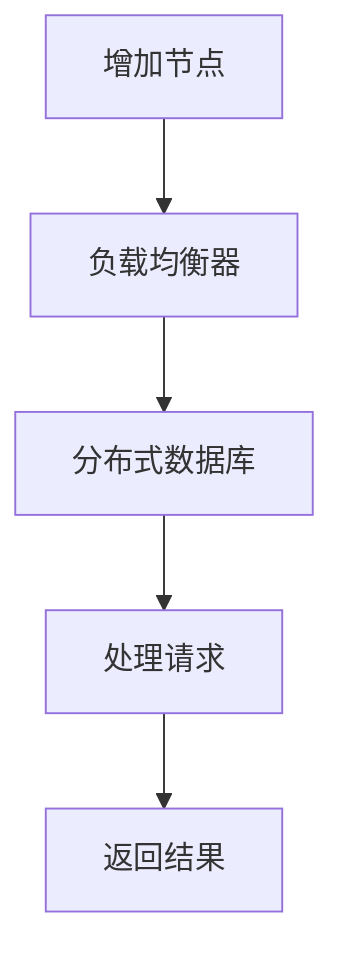
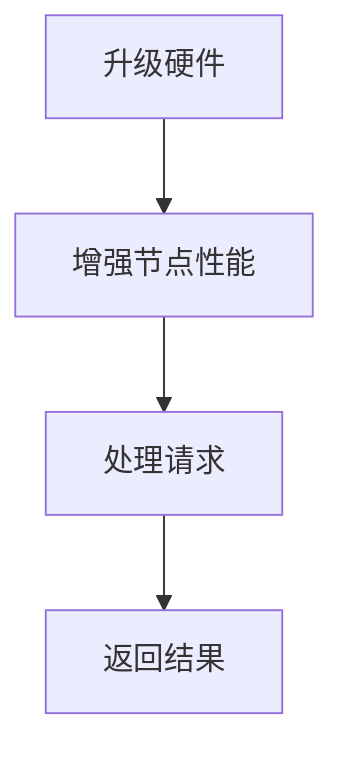
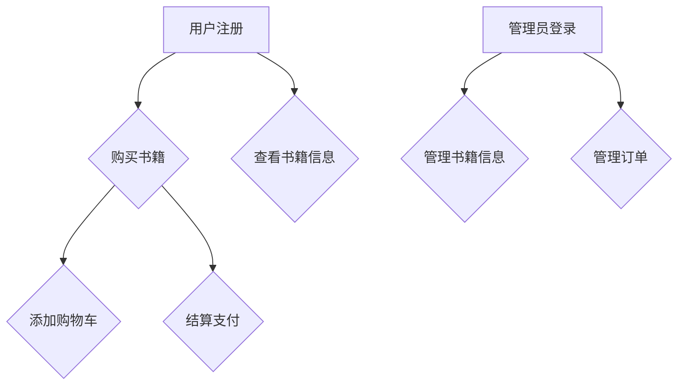
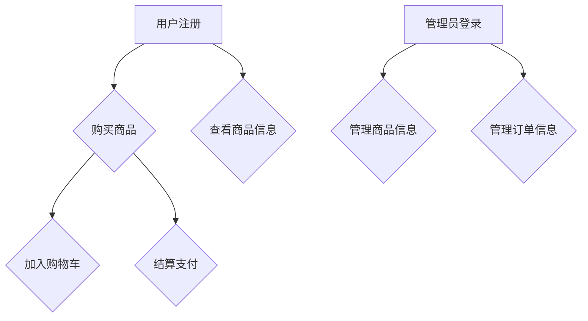

                 

### 1.1 问题背景与重要性

在现代信息技术快速发展的时代，系统可扩展性已成为衡量一个系统成功与否的关键因素。随着用户需求的不断增长和数据规模的持续扩大，系统必须具备应对动态变化的能力，以确保其稳定、高效地运行。然而，实现系统可扩展性并非易事，它涉及到需求与技术架构的紧密协同演进。

首先，让我们来理解一下系统可扩展性的概念。系统可扩展性指的是系统能够在保持性能和功能不变的前提下，适应规模和复杂度的变化。具体来说，这包括两个方面：横向扩展（水平扩展）和纵向扩展（垂直扩展）。横向扩展通过增加更多节点来提升系统处理能力；而纵向扩展则通过增强现有节点的能力来实现系统性能的提升。

系统可扩展性的重要性体现在以下几个方面：

1. **满足日益增长的需求**：随着用户数量的增加，系统需要能够处理更多的请求，提供更好的用户体验。如果系统缺乏可扩展性，一旦用户量超过其处理能力，系统可能会出现响应缓慢、宕机等问题。

2. **支持业务增长**：企业的业务规模不断扩大，需要系统支持更多的功能和服务。一个具备良好可扩展性的系统，能够帮助企业在不中断服务的情况下，快速地实现新功能、新服务。

3. **提高系统稳定性**：通过良好的扩展性设计，系统能够更好地分散负载，降低单点故障的风险，从而提高系统的整体稳定性。

4. **延长系统生命周期**：一个可扩展性强的系统，可以随着技术的更新和业务需求的变化，进行功能升级和性能优化，延长系统的生命周期。

然而，实现系统可扩展性并非一蹴而就。它需要从需求分析阶段就开始进行深入思考，并贯穿整个技术架构设计、开发和运维过程。在这个过程中，需求与技术架构的协同演进起着至关重要的作用。

**为什么需求与技术架构的协同演进对确保系统可扩展性至关重要？**

首先，需求是系统设计的起点，它决定了系统需要实现的功能和性能要求。如果需求分析不够全面或者不准确，可能会导致系统在后续的开发过程中出现功能缺失、性能瓶颈等问题，进而影响系统的可扩展性。

其次，技术架构是系统的骨架，它决定了系统的结构、模块划分、数据流程等。如果技术架构设计不合理，即使需求分析做得再好，系统也难以实现良好的可扩展性。例如，过度耦合的架构会导致模块之间的依赖关系复杂，增加扩展的难度和成本。

因此，需求与技术架构的协同演进是确保系统可扩展性的关键。在这个过程中，我们需要：

1. **深入理解需求**：通过全面的需求分析，确保我们对用户需求和业务目标有清晰的认识，为技术架构设计提供准确的指导。

2. **合理设计技术架构**：在架构设计阶段，要充分考虑系统未来的扩展性需求，选择合适的架构风格和模式，避免过度耦合，确保模块的独立性和可扩展性。

3. **持续迭代与优化**：系统开发过程中，需求和技术架构不是一成不变的，需要根据实际情况进行迭代和优化。通过持续的需求分析和技术架构评估，确保系统能够适应不断变化的需求和业务环境。

在接下来的章节中，我们将详细探讨需求分析和技术架构设计的相关内容，以帮助读者更好地理解如何确保系统可扩展性。通过逐步分析推理，我们将提供一系列实用的方法和技巧，帮助读者在实际项目中实现系统的高效扩展。

### 1.2 系统扩展性的定义与类型

系统扩展性（System Scalability）是指系统能够在规模和复杂度发生变化时，保持其性能和功能不变的能力。扩展性可以分为横向扩展（水平扩展）和纵向扩展（垂直扩展）两种主要类型。

**横向扩展（Horizontal Scaling）**，又称为水平扩展，指的是通过增加系统中的节点数量来提升系统的处理能力。这种方式通常适用于处理大量请求和数据的场景。横向扩展的优点在于其灵活性和可扩展性，可以在不改变现有系统架构的情况下，简单地通过增加节点来实现性能的提升。例如，分布式数据库和集群架构都是常见的横向扩展技术。以下是一个简单的Mermaid流程图，展示了横向扩展的基本流程：



**纵向扩展（Vertical Scaling）**，也称为垂直扩展，是通过增强现有节点的硬件配置来提升系统的性能。这种方式通常适用于处理高负载、高性能的场景。纵向扩展的优点在于其快速性和可控性，可以在较短时间内通过升级硬件来实现性能的提升。例如，使用更快的CPU、更大的内存或更高的存储带宽。以下是纵向扩展的基本流程图：



**扩展性设计原则**

为了确保系统具有良好的扩展性，我们需要遵循以下设计原则：

1. **模块化设计**：将系统划分为独立的模块，每个模块负责特定的功能。这样，在需要扩展时，可以单独扩展某个模块，而不影响其他模块。

2. **解耦设计**：减少模块之间的依赖关系，确保每个模块可以独立运行和扩展。例如，通过使用微服务架构，可以降低模块之间的耦合度。

3. **分布式架构**：采用分布式架构，将系统拆分为多个节点，每个节点负责一部分功能。这样可以实现横向扩展，提高系统的处理能力和可靠性。

4. **异步处理**：通过异步处理机制，可以将请求分散到不同的节点处理，从而提高系统的并发处理能力。

5. **负载均衡**：使用负载均衡器来合理分配请求到各个节点，确保系统资源得到充分利用。

6. **弹性伸缩**：系统应具备自动伸缩的能力，可以根据实际负载自动调整节点数量，以保持系统的高效运行。

通过遵循这些设计原则，我们可以在系统设计阶段就为未来的扩展性打下坚实的基础。在实际开发过程中，还需要不断进行需求分析和技术架构评估，以确保系统能够持续适应不断变化的需求和业务环境。

### 1.3 可扩展性对系统设计的影响

可扩展性是系统设计的核心要素之一，它直接影响系统的性能、稳定性、维护成本和用户体验。良好的可扩展性设计不仅能够满足当前的需求，还能为未来的扩展和变化提供保障。以下是可扩展性对系统设计的影响：

**性能影响**

可扩展性设计能够显著提升系统的处理能力和响应速度。通过横向扩展（增加节点）和纵向扩展（增强节点性能），系统可以在不降低性能的情况下处理更多的请求和数据。此外，合理的负载均衡和异步处理机制可以进一步优化资源利用率，提高系统的整体性能。

**稳定性影响**

良好的扩展性设计有助于提升系统的稳定性。通过分布式架构和模块化设计，系统可以更好地分散负载，降低单点故障的风险。在出现故障时，系统可以快速恢复，减少服务中断的时间。同时，通过自动伸缩机制，系统可以根据负载自动调整资源，避免因资源不足导致的性能下降和稳定性问题。

**维护成本影响**

可扩展性设计可以降低系统的维护成本。模块化设计和解耦设计使得系统更容易维护和升级。每个模块可以独立开发和部署，减少了整体系统的复杂度。此外，分布式架构和自动化运维工具可以简化系统管理和监控，提高运维效率，降低人工成本。

**用户体验影响**

良好的可扩展性设计能够为用户提供更优质的体验。通过持续优化性能和稳定性，系统可以快速响应用户请求，提供流畅、高效的服务。同时，系统应具备弹性伸缩能力，能够根据用户数量的变化自动调整资源，确保用户在高峰时段也能获得良好的服务体验。

**具体设计策略**

为了确保系统具备良好的可扩展性，我们可以采取以下设计策略：

1. **模块化设计**：将系统划分为独立的模块，每个模块负责特定的功能。模块之间通过标准化的接口进行通信，降低模块之间的依赖关系，便于单独扩展和优化。

2. **分布式架构**：采用分布式架构，将系统拆分为多个节点，每个节点负责一部分功能。这样可以实现横向扩展，提高系统的处理能力和可靠性。

3. **负载均衡**：使用负载均衡器来合理分配请求到各个节点，确保系统资源得到充分利用。负载均衡策略应能够根据实际负载动态调整，以保持系统的均衡运行。

4. **异步处理**：通过异步处理机制，将请求分散到不同的节点处理，从而提高系统的并发处理能力。异步处理还可以减少同步等待时间，提高系统的响应速度。

5. **弹性伸缩**：系统应具备自动伸缩的能力，可以根据实际负载自动调整节点数量，以保持系统的高效运行。弹性伸缩可以通过云服务、容器编排工具等实现。

6. **监控与预警**：建立全面的监控和预警系统，实时监测系统性能、资源利用率和健康状况。通过监控数据，可以及时发现和处理潜在问题，确保系统的稳定运行。

通过以上策略，我们可以为系统设计提供坚实的基础，确保系统具有良好的可扩展性，能够持续适应不断变化的需求和业务环境。

### 2.1 需求分析概述

需求分析是系统设计过程中至关重要的一步，它直接关系到系统的功能、性能和用户体验。需求分析的任务是从用户和业务的角度出发，全面收集和分析系统需求，为后续的系统设计提供明确的指导。

**需求分析的定义与意义**

需求分析（Requirement Analysis）是指通过对用户、业务、市场等多方面的调研，明确系统需要实现的功能、性能、安全性等需求。其意义主要体现在以下几个方面：

1. **明确系统目标**：需求分析帮助项目团队明确系统的目标，确保系统设计能够满足用户和业务的需求。

2. **减少项目风险**：通过全面的需求分析，可以及早发现潜在的问题和风险，从而采取相应的措施进行规避，降低项目失败的风险。

3. **确保系统质量**：需求分析是系统设计的基础，一个清晰、准确的需求文档能够确保系统设计的高质量。

4. **指导后续开发**：需求分析的结果为系统设计、开发、测试等后续工作提供了明确的指导，有助于提高开发效率和系统质量。

**需求分析的步骤与方法**

需求分析通常包括以下几个步骤：

1. **需求收集**：通过各种渠道（如访谈、问卷调查、用户反馈等）收集用户和业务需求。这个阶段需要全面、细致地了解用户的需求和期望。

2. **需求整理**：对收集到的需求进行整理和分类，明确每个需求的优先级和重要性。这一步有助于聚焦关键需求，确保系统设计能够优先满足核心需求。

3. **需求建模**：通过建立需求模型，将需求以图形化的形式表示出来，便于项目团队理解和讨论。常用的需求建模工具有用例图（Use Case Diagram）、功能需求模型（Functional Requirements Model）等。

4. **需求验证**：通过需求评审、用户验证等方式，确保需求文档的准确性和完整性。这一步骤可以帮助发现和纠正需求中的错误和遗漏。

5. **需求文档编写**：将需求分析的结果整理成文档，形成需求规格说明书。需求文档应详细描述系统的功能、性能、接口等要求，为后续的系统设计提供依据。

在需求分析方法上，常见的有以下几种：

1. **访谈法**：通过与用户、业务专家进行面对面的访谈，深入了解他们的需求和使用场景。

2. **问卷调查法**：通过设计问卷，广泛收集用户和业务的需求和反馈。

3. **观察法**：通过观察用户在使用系统时的行为和操作，获取真实的需求信息。

4. **需求研讨会**：组织相关利益相关者（如用户、产品经理、开发人员等）进行研讨会，共同讨论和明确系统的需求。

5. **需求跟踪**：通过需求跟踪工具（如JIRA、Trello等），记录和追踪需求的变化和实现情况，确保需求在整个项目生命周期中得到有效管理。

通过以上步骤和方法，我们能够全面、准确地收集和分析系统需求，为系统的设计和开发提供坚实的基础。

### 2.2 需求分类与收集

在需求分析过程中，对需求进行分类和收集是至关重要的。只有明确了需求的类型和来源，我们才能更好地理解和满足用户和业务的需求。以下是对需求分类与收集方法的详细探讨。

**需求分类**

根据需求的性质和用途，需求可以分为以下几类：

1. **功能需求**：这是指系统需要实现的具体功能，如用户登录、数据查询、报告生成等。功能需求通常由用户直接提出，是系统设计和实现的核心。

2. **性能需求**：这些需求描述了系统需要达到的性能指标，如响应时间、吞吐量、并发处理能力等。性能需求通常来源于业务需求和用户期望，确保系统能够高效、稳定地运行。

3. **安全需求**：这些需求关注系统的安全性和数据保护，如用户身份验证、数据加密、访问控制等。安全需求对于保护用户信息和系统安全至关重要。

4. **业务规则需求**：这些需求描述了系统需要遵守的业务规则和流程，如订单处理规则、支付流程等。业务规则需求通常由业务专家提出，确保系统能够准确、高效地处理业务操作。

5. **用户体验需求**：这些需求关注用户在使用系统时的感受和体验，如界面设计、交互方式等。用户体验需求对于提升用户满意度和忠诚度至关重要。

**需求收集方法**

为了全面、准确地收集需求，可以采用以下几种方法：

1. **访谈法**：通过与用户、业务专家、项目经理等进行面对面的访谈，深入了解他们的需求和使用场景。访谈法可以获取深入、详细的需求信息，但需要耗费较多时间和人力资源。

2. **问卷调查法**：设计问卷，通过电子邮件、在线调查等方式，广泛收集用户和业务的需求和反馈。问卷调查法可以快速收集大量数据，但可能存在回答者主观性和不完整性的问题。

3. **观察法**：通过观察用户在使用系统时的行为和操作，获取真实的需求信息。观察法可以直观地了解用户的实际需求和操作习惯，但需要具备一定的观察和分析能力。

4. **需求研讨会**：组织相关利益相关者（如用户、产品经理、开发人员等）进行研讨会，共同讨论和明确系统的需求。需求研讨会可以促进多方沟通和理解，但需要确保会议的效率和成果。

5. **工作坊法**：通过小组讨论、头脑风暴等方式，与用户和业务专家共同探讨系统的需求和解决方案。工作坊法有助于激发创意和共识，但需要具备良好的组织和引导能力。

**需求收集技巧**

为了提高需求收集的效率和准确性，可以采用以下技巧：

1. **明确目标**：在进行需求收集之前，明确需求收集的目标和范围，确保收集到的需求是具体、可量化的。

2. **建立信任**：与用户和业务专家建立信任关系，鼓励他们开放地表达需求和建议。信任关系有助于获取真实、全面的需求信息。

3. **引导对话**：通过提问、引导对话等方式，帮助用户和业务专家清晰地表达他们的需求。引导对话有助于挖掘潜在需求和解决问题。

4. **记录和整理**：在需求收集过程中，及时记录和整理收集到的需求，确保需求信息的完整性和准确性。

5. **反馈和确认**：在需求收集后，与用户和业务专家进行反馈和确认，确保需求文档的准确性和完整性。

通过以上分类方法和收集技巧，我们可以全面、准确地收集和分析系统需求，为后续的系统设计、开发和维护工作提供坚实的基础。

### 2.3 需求文档编写与验证

需求文档是系统设计和开发过程中不可或缺的重要文件，它详细记录了系统的功能需求、性能需求、安全需求等各项需求，为后续的开发工作提供了明确的指导。编写高质量的需求文档不仅需要准确、清晰地表达需求，还需要确保其完整性和可验证性。以下是需求文档编写与验证的具体步骤和方法。

**需求文档编写的步骤**

1. **需求文档框架设计**：在编写需求文档之前，首先设计文档的框架，明确文档的结构和内容。通常需求文档包括以下部分：概述、功能需求、性能需求、安全需求、业务规则需求、用户界面需求、接口需求等。

2. **需求收集与整理**：根据需求分类和收集方法，全面收集和分析需求，并将其整理成文档。需求应具体、可量化，避免模糊和不明确的需求描述。

3. **编写需求描述**：根据需求文档框架，详细编写每个需求的内容，包括需求的名称、描述、优先级、目标等。对于复杂的需求，可以采用用例图、功能需求模型等图形化工具进行描述，以便于理解和沟通。

4. **需求评审**：编写完成后，对需求文档进行内部评审。评审过程可以邀请项目团队、业务专家、用户等多方参与，确保需求的准确性和完整性。

5. **需求更新与迭代**：在评审过程中，可能会发现需求文档中的错误和遗漏，及时进行更新和迭代，确保需求文档的准确性和完整性。

6. **编写需求规格说明书**：将经过评审和更新的需求整理成正式的需求规格说明书。需求规格说明书应包含详细的需求描述、图形化需求模型、需求验证方法等，为后续的系统设计和开发提供依据。

**需求验证的方法**

需求验证是确保需求文档准确性和完整性的关键步骤。以下是几种常用的需求验证方法：

1. **需求评审**：通过组织内部或外部评审会，邀请相关利益相关者对需求文档进行审查。评审过程中，可以识别需求中的不一致、遗漏或错误，并提出修改建议。

2. **用户验证**：通过与用户进行交流和验证，确保需求文档中的需求符合用户的实际需求和使用场景。用户验证可以通过用户访谈、用户测试等方式进行。

3. **测试用例设计**：根据需求文档，设计测试用例来验证需求的实现情况。测试用例应覆盖所有需求场景，确保需求得到全面验证。

4. **对比分析**：将需求文档与现有系统功能、市场竞品等对比分析，确保新需求的有效性和合理性。

5. **需求跟踪**：建立需求跟踪机制，记录需求的实现进度和验证结果。通过需求跟踪，可以确保所有需求都得到有效实现和验证。

**确保需求文档的准确性和完整性**

1. **明确需求定义**：在编写需求文档时，应确保每个需求都有明确的定义，避免模糊不清的需求描述。

2. **一致性检查**：在编写和更新需求文档时，进行一致性检查，确保需求之间没有冲突或矛盾。

3. **迭代改进**：在需求分析和编写过程中，不断进行迭代和改进，确保需求文档的准确性和完整性。

4. **用户参与**：在需求验证阶段，邀请用户参与，确保需求文档中的需求真正符合用户的实际需求。

5. **定期评审**：定期对需求文档进行评审和更新，确保其始终保持准确和完整。

通过以上步骤和方法，我们可以编写高质量的需求文档，确保其准确性和完整性，为系统的设计和开发工作提供坚实的基础。

### 3.1 功能需求模型

功能需求模型是需求分析过程中至关重要的工具，它通过图形化的方式直观地表示系统的功能需求，帮助项目团队更好地理解、讨论和验证需求。常见的功能需求模型包括用例图（Use Case Diagram）和功能需求规格说明书（Functional Requirements Specification）。

**用例图（Use Case Diagram）**

用例图是一种用于描述系统功能需求的图形化工具，它通过用例（Use Case）和角色（Actor）来表示系统与用户的交互关系。用例图的基本元素包括：

1. **用例（Use Case）**：表示系统能够执行的一个功能或操作。每个用例都描述了一个与系统交互的场景，通常包括用例名称、描述、优先级等。

2. **角色（Actor）**：表示与系统交互的外部实体，如用户、管理员、第三方系统等。角色与用例之间的关系表示了系统与外部实体之间的交互。

3. **扩展（Extension）**：表示用例之间的扩展关系，即一个用例在特定条件下执行另一个用例的功能。

以下是一个简单的用例图示例，描述了一个在线书店系统的功能需求：



**功能需求规格说明书（Functional Requirements Specification）**

功能需求规格说明书是一种详细的文档，用于描述系统的功能需求、性能需求和接口需求等。它通常包括以下内容：

1. **功能需求列表**：详细列出系统需要实现的所有功能需求，每个需求应包括需求编号、需求名称、描述、优先级等。

2. **性能需求描述**：描述系统需要达到的性能指标，如响应时间、吞吐量、并发处理能力等。

3. **接口需求描述**：描述系统与外部系统或组件之间的接口，包括接口名称、接口描述、输入输出参数、通信协议等。

以下是一个简单的功能需求规格说明书示例：

```
需求编号：1
需求名称：用户注册
描述：允许用户创建账号并登录系统。
优先级：高

需求编号：2
需求名称：购买书籍
描述：允许用户从在线书店购买书籍。
优先级：高

需求编号：3
需求名称：查看书籍信息
描述：允许用户查看书籍的详细信息。
优先级：中

需求编号：4
需求名称：管理书籍信息
描述：允许管理员添加、修改和删除书籍信息。
优先级：中

需求编号：5
需求名称：管理订单
描述：允许管理员查看和管理订单信息。
优先级：中
```

通过功能需求模型和功能需求规格说明书，我们可以清晰、准确地描述系统的功能需求，为系统的设计和实现提供坚实的基础。

### 3.2 非功能需求模型

非功能需求（Non-Functional Requirements，NFRs）是描述系统性能、安全性、可用性等非功能方面需求的重要组成部分。与功能需求不同，非功能需求不直接描述系统具体的功能，而是关注系统的整体性能和用户体验。以下是对几种常见的非功能需求模型的介绍。

**性能需求（Performance Requirements）**

性能需求描述了系统需要达到的性能指标，如响应时间、吞吐量、并发处理能力等。性能需求模型通常包括以下内容：

1. **响应时间**：系统处理请求的平均时间，通常以毫秒为单位。
2. **吞吐量**：系统每秒可以处理的最大请求数量。
3. **并发处理能力**：系统同时处理多个请求的能力。

以下是一个简单的性能需求模型示例：

```
性能需求编号：1
性能需求名称：响应时间
描述：用户操作的平均响应时间应不超过500毫秒。
优先级：高

性能需求编号：2
性能需求名称：吞吐量
描述：系统每秒应能处理不少于1000个请求。
优先级：高

性能需求编号：3
性能需求名称：并发处理能力
描述：系统应能同时处理不少于100个并发请求。
优先级：中
```

**安全性需求（Security Requirements）**

安全性需求描述了系统需要达到的安全标准，以确保系统的数据安全和用户隐私。常见的安全需求包括：

1. **用户认证**：系统应实现用户身份验证，确保只有授权用户才能访问系统。
2. **数据加密**：系统应使用加密算法对敏感数据进行加密存储和传输。
3. **访问控制**：系统应实现访问控制机制，确保用户只能访问授权的资源。

以下是一个简单的安全性需求模型示例：

```
安全性需求编号：1
安全性需求名称：用户认证
描述：系统应使用用户名和密码进行身份验证。
优先级：高

安全性需求编号：2
安全性需求名称：数据加密
描述：系统应使用AES加密算法对敏感数据进行加密存储和传输。
优先级：高

安全性需求编号：3
安全性需求名称：访问控制
描述：系统应实现基于角色的访问控制机制。
优先级：中
```

**可用性需求（Usability Requirements）**

可用性需求描述了系统需要达到的用户体验标准，以确保用户能够轻松、高效地使用系统。常见可用性需求包括：

1. **界面设计**：系统界面应简洁、直观，易于用户操作。
2. **帮助文档**：系统应提供详细、易懂的帮助文档，帮助用户了解和使用系统的功能。
3. **错误处理**：系统应能够有效处理各种错误，并提供清晰的错误提示和解决方案。

以下是一个简单的可用性需求模型示例：

```
可用性需求编号：1
可用性需求名称：界面设计
描述：系统界面应简洁、直观，使用户能够快速找到所需功能。
优先级：高

可用性需求编号：2
可用性需求名称：帮助文档
描述：系统应提供详细、易懂的帮助文档，帮助用户了解和使用系统的功能。
优先级：中

可用性需求编号：3
可用性需求名称：错误处理
描述：系统应能够有效处理各种错误，并提供清晰的错误提示和解决方案。
优先级：中
```

通过建立非功能需求模型，我们可以系统地描述系统的性能、安全性和可用性要求，确保系统能够满足用户的期望和业务需求。这些非功能需求将在后续的系统设计和实现过程中得到具体实现和验证。

### 3.3 需求建模工具与技术

在需求分析过程中，需求建模是至关重要的环节，它通过图形化和结构化的方式，帮助项目团队更清晰地理解和表达系统需求。以下介绍几种常用的需求建模工具和技术，包括用例图（Use Case Diagram）、实体关系图（Entity-Relationship Diagram，ERD）和功能需求规格说明书（Functional Requirements Specification，FRS）。

**用例图（Use Case Diagram）**

用例图是需求分析中最常用的图形化工具之一，它通过用例和角色来描述系统的功能需求和使用场景。用例图的基本元素包括：

1. **用例（Use Case）**：表示系统能够执行的一个功能或操作。每个用例都描述了一个与系统交互的场景，通常包括用例名称、描述、优先级等。
2. **角色（Actor）**：表示与系统交互的外部实体，如用户、管理员、第三方系统等。角色与用例之间的关系表示了系统与外部实体之间的交互。
3. **扩展（Extension）**：表示用例之间的扩展关系，即一个用例在特定条件下执行另一个用例的功能。

以下是一个简单的用例图示例，描述了一个在线购物系统的功能需求：



**实体关系图（Entity-Relationship Diagram，ERD）**

实体关系图是用于描述系统数据模型的一种重要工具，它通过实体、属性和关系来表示系统的数据结构和业务规则。ERD的基本元素包括：

1. **实体（Entity）**：表示系统中的数据对象，如用户、商品、订单等。每个实体都有其属性和关系。
2. **属性（Attribute）**：表示实体的具体特征，如用户ID、用户姓名、订单金额等。
3. **关系（Relationship）**：表示实体之间的关联，如用户下单、订单包含商品等。

以下是一个简单的实体关系图示例，描述了一个在线书店系统的数据模型：

```mermaid
er Diagram
  User {
    +id (int)
    +name (varchar)
    +email (varchar)
    +password (varchar)
  }
  Book {
    +id (int)
    +title (varchar)
    +author (varchar)
    +price (float)
  }
  Order {
    +id (int)
    +user_id (int)
    +order_date (datetime)
    +total_price (float)
  }
  User --> Order :用户下单
  Book --> Order :包含商品
```

**功能需求规格说明书（Functional Requirements Specification，FRS）**

功能需求规格说明书是一种详细的文档，用于描述系统的功能需求、性能需求和接口需求等。它通常包括以下内容：

1. **功能需求列表**：详细列出系统需要实现的所有功能需求，每个需求应包括需求编号、需求名称、描述、优先级等。
2. **性能需求描述**：描述系统需要达到的性能指标，如响应时间、吞吐量、并发处理能力等。
3. **接口需求描述**：描述系统与外部系统或组件之间的接口，包括接口名称、接口描述、输入输出参数、通信协议等。

以下是一个简单的功能需求规格说明书示例：

```
需求编号：1
需求名称：用户注册
描述：允许用户创建账号并登录系统。
优先级：高

需求编号：2
需求名称：购买商品
描述：允许用户从在线商店购买商品。
优先级：高

需求编号：3
需求名称：查看商品信息
描述：允许用户查看商品的详细信息。
优先级：中

需求编号：4
需求名称：管理商品信息
描述：允许管理员添加、修改和删除商品信息。
优先级：中

需求编号：5
需求名称：管理订单信息
描述：允许管理员查看和管理订单信息。
优先级：中
```

通过上述需求建模工具和技术，我们可以系统地描述系统的功能、数据结构和业务规则，确保项目团队对需求有清晰、一致的理解，从而提高需求分析的准确性和有效性。

### 4.1 需求变更管理

在软件开发过程中，需求变更（Requirement Change）是不可避免的。由于用户需求、市场环境、技术发展的不断变化，系统需求可能会频繁调整。需求变更管理（Requirement Change Management）因此成为确保项目成功的关键环节。以下是需求变更管理的主要内容。

**需求变更的原因**

1. **用户需求变化**：在项目开发过程中，用户可能会提出新的功能需求或对现有功能进行调整，以更好地满足他们的业务需求。
2. **市场环境变化**：市场竞争加剧、新的技术趋势或政策法规的出台，可能导致系统需求发生变化，以保持竞争优势或符合法律规定。
3. **技术发展**：技术的不断进步可能导致现有系统难以满足新的技术要求，需要进行升级或重构。
4. **项目范围扩大或缩小**：项目范围的扩大或缩小，如增加或减少功能模块，也会导致需求变更。

**变更请求的评估**

在接收到需求变更请求后，需要对变更请求进行评估，以确定变更的影响和可行性。评估过程通常包括以下步骤：

1. **变更影响分析**：评估变更对项目进度、成本、资源、风险等方面的影响。例如，新增功能可能会延长项目周期，增加开发成本。
2. **优先级评估**：根据变更的重要性和紧急程度，确定变更的优先级。高优先级的变更需要优先处理，以确保项目的主要目标不受影响。
3. **可行性分析**：评估变更的实现难度和技术可行性。例如，某些变更可能需要依赖尚未成熟的技术，从而增加实施风险。

**变更管理流程**

需求变更管理通常包括以下流程：

1. **变更请求提出**：项目相关人员（如用户、项目经理、产品经理等）提出需求变更请求，并详细描述变更内容。
2. **变更评估**：项目团队对变更请求进行评估，确定变更的影响和可行性。
3. **变更决策**：根据评估结果，项目团队决定是否接受变更请求，并制定变更方案。如变更被拒绝，应向提出方解释原因。
4. **变更实施**：实施已批准的变更，包括修改需求文档、设计文档、代码等。
5. **变更验证**：验证变更是否达到了预期的效果，确保变更不会对系统其他部分产生负面影响。
6. **变更记录**：记录变更的详细信息，包括变更请求、评估结果、变更方案、实施过程等，以便于后续的审计和回顾。

**变更管理最佳实践**

为了有效地进行需求变更管理，可以遵循以下最佳实践：

1. **建立变更管理流程**：制定明确的变更管理流程，确保变更的提出、评估、决策和实施过程有序进行。
2. **加强沟通与协作**：确保项目团队成员、用户和其他利益相关者之间的沟通和协作，以便及时了解变更需求并共同解决问题。
3. **定期评审变更**：定期对变更进行评审，评估变更对项目的影响，确保变更管理的有效性。
4. **使用变更管理工具**：利用变更管理工具（如JIRA、Confluence等），记录和跟踪变更请求、评估结果和实施过程，提高变更管理的效率和透明度。
5. **注重变更影响分析**：在变更评估过程中，重视对变更影响的全面分析，确保变更不会对项目的关键目标和质量产生负面影响。

通过有效的需求变更管理，项目团队可以更好地应对需求变化，确保项目能够按时、按质、按预算完成，同时保持系统的稳定性和扩展性。

### 4.2 变更请求的评估

在需求变更管理过程中，变更请求的评估是关键步骤之一。这一环节的核心任务是全面分析变更请求的影响，并确定其可行性和优先级，从而做出是否接受变更的决策。以下是变更请求评估的具体步骤和关键因素。

**评估步骤**

1. **初步评估**：首先，对变更请求进行初步筛选，判断其是否与项目的范围和目标相关。对于明显不符合项目目标或无实际价值的变更请求，可以直接予以拒绝。

2. **详细评估**：对于通过初步评估的变更请求，进行详细评估。详细评估包括以下几个方面：

   - **影响分析**：分析变更对项目进度、成本、资源和风险等方面的影响。例如，新增功能可能会延长项目周期，增加开发成本；变更现有功能可能会增加系统的复杂度，导致维护难度加大。
   - **优先级评估**：根据变更的重要性和紧急程度，确定变更的优先级。高优先级的变更需要优先处理，以确保项目的主要目标不受影响。

3. **可行性分析**：评估变更的技术实现难度和资源需求，确定变更的可行性。例如，某些变更可能需要依赖尚未成熟的技术，从而增加实施风险。

4. **变更决策**：根据评估结果，项目团队决定是否接受变更请求。如变更被拒绝，应向提出方解释原因。

5. **变更方案制定**：对于被接受的变更请求，制定具体的变更方案，包括变更的内容、实施时间表、资源分配和风险评估等。

6. **变更实施和验证**：实施已批准的变更，并进行验证，确保变更达到了预期的效果，同时不会对系统其他部分产生负面影响。

**关键因素**

1. **变更的影响范围**：评估变更对项目各个方面的具体影响，包括功能、性能、安全性、用户体验等。

2. **变更的优先级**：确定变更的紧急程度和重要性，以便项目团队可以合理分配资源，确保关键变更得到优先处理。

3. **变更的实现难度**：分析变更的技术实现难度，评估所需的技术资源和人力资源。

4. **变更的风险**：评估变更可能带来的风险，包括技术风险、业务风险、资源风险等。

5. **变更的成本**：评估变更所需的成本，包括开发成本、测试成本、维护成本等。

6. **变更的可行性**：综合评估变更的可行性，确保变更可以在现有的技术和资源条件下实现。

通过上述步骤和关键因素的评估，项目团队能够全面、准确地评估变更请求，做出合理的变更决策，确保项目能够按时、按质、按预算完成。

### 4.3 变更管理流程

变更管理流程是确保项目能够适应需求变化、保持稳定性和可控性的关键环节。一个有效的变更管理流程能够帮助项目团队在需求变更发生时，快速响应并妥善处理。以下是变更管理流程的详细步骤和注意事项。

**变更管理流程步骤**

1. **提出变更请求**：项目相关人员（如用户、项目经理、产品经理等）发现需求变更时，需要提出变更请求。变更请求应包括变更的内容、原因、预期影响和优先级。

2. **初步评估**：项目经理或变更控制委员会（Change Control Board，CCB）对变更请求进行初步评估。初步评估的目的是判断变更请求是否与项目目标相关，是否需要进行详细评估。

3. **详细评估**：
   - **影响分析**：详细分析变更对项目进度、成本、资源和风险等方面的影响。影响分析应包括以下几个方面：
     - **时间影响**：评估变更对项目进度的影响，包括延期时间。
     - **成本影响**：评估变更对项目成本的影响，包括额外的人力、资源和材料成本。
     - **资源需求**：评估变更对现有资源的需求和分配。
     - **风险影响**：评估变更可能带来的风险，包括技术风险、业务风险等。
   - **优先级评估**：根据变更的重要性和紧急程度，确定变更的优先级。高优先级的变更应优先处理。

4. **变更决策**：项目团队（或CCB）根据详细评估结果，决定是否接受变更请求。如果变更被接受，需要制定变更方案。

5. **变更方案制定**：制定具体的变更方案，包括变更的内容、实施时间表、资源分配、风险评估等。变更方案应详细说明如何实施变更，以确保变更能够顺利执行。

6. **变更实施**：根据变更方案，实施已批准的变更。实施过程中，应确保变更的每一步都按照计划进行，并记录实施过程和结果。

7. **变更验证**：验证变更是否达到了预期的效果，确保变更不会对系统其他部分产生负面影响。验证应包括功能测试、性能测试、安全测试等。

8. **变更记录**：记录变更的详细信息，包括变更请求、评估结果、变更方案、实施过程、验证结果等。这些记录应存档，以备后续审计和回顾。

**注意事项**

1. **建立明确的变更管理流程**：制定明确的变更管理流程，确保变更的提出、评估、决策、实施和验证等环节有序进行。

2. **加强沟通与协作**：确保项目团队成员、用户和其他利益相关者之间的沟通和协作，以便及时了解变更需求并共同解决问题。

3. **定期评审变更**：定期对变更进行评审，评估变更对项目的影响，确保变更管理的有效性。

4. **使用变更管理工具**：利用变更管理工具（如JIRA、Confluence等），记录和跟踪变更请求、评估结果、变更方案和实施过程，提高变更管理的效率和透明度。

5. **注重变更影响分析**：在变更评估过程中，重视对变更影响的全面分析，确保变更不会对项目的关键目标和质量产生负面影响。

通过以上变更管理流程和注意事项，项目团队能够有效地管理需求变更，确保项目能够适应变化，保持稳定性和可控性。

### 5.1 软件架构设计概述

软件架构设计是软件开发过程中至关重要的一环，它决定了系统的结构、模块划分、数据流程等，直接影响系统的性能、稳定性、可维护性和扩展性。在这一节中，我们将详细探讨软件架构设计的概念、目的和重要性。

**软件架构设计的基本概念**

软件架构设计（Software Architecture Design）是指通过抽象和分层的方法，对系统的组成部分及其交互关系进行规划、定义和优化。软件架构主要包括以下几个方面：

1. **组件（Components）**：软件架构中的基本构建块，如模块、类、服务等。组件负责实现系统的特定功能。
2. **接口（Interfaces）**：组件之间的交互方式，通过接口定义组件之间的交互规则和通信协议。
3. **分层（Layers）**：软件架构通常采用分层结构，如表示层、业务逻辑层、数据访问层等，每一层负责不同的功能，层与层之间通过接口进行通信。
4. **服务（Services）**：提供特定功能的软件模块，如身份验证服务、支付服务、消息服务等。

**软件架构设计的目的是**

软件架构设计的目的是确保系统满足业务需求，同时具备良好的性能、可维护性和扩展性。具体来说，软件架构设计的目的是：

1. **明确系统范围和边界**：通过定义系统的组件和接口，明确系统的功能和范围，确保系统模块化、松耦合，便于后续的扩展和维护。
2. **优化系统性能**：通过合理的架构设计，优化系统性能，包括响应时间、吞吐量、并发处理能力等，确保系统能够高效、稳定地运行。
3. **提高系统的可维护性**：通过模块化设计和清晰的接口定义，降低系统的复杂度，提高代码的可读性和可维护性。
4. **支持系统的扩展性**：通过设计灵活、可扩展的架构，确保系统能够适应未来业务需求的变化，实现横向和纵向扩展。

**软件架构设计的重要性**

软件架构设计的重要性体现在以下几个方面：

1. **指导后续开发**：良好的软件架构设计为后续的开发工作提供了明确的指导，有助于提高开发效率和代码质量。
2. **优化系统性能**：通过合理的架构设计，可以优化系统性能，提高系统的响应速度和处理能力。
3. **提高系统的可维护性**：模块化和松耦合的架构设计，可以降低系统的复杂度，提高代码的可读性和可维护性，降低维护成本。
4. **支持系统扩展性**：通过设计灵活、可扩展的架构，确保系统能够适应未来业务需求的变化，实现横向和纵向扩展。
5. **降低项目风险**：通过提前规划和设计，可以及早发现和解决潜在的问题和风险，降低项目失败的风险。

总之，软件架构设计是软件开发过程中不可或缺的一环，它决定了系统的质量、性能和扩展性。通过合理的架构设计，我们可以构建出高效、稳定、可维护和可扩展的软件系统。

### 5.2 可扩展架构设计原则

在设计可扩展架构时，需要遵循一系列关键原则，以确保系统能够在未来的需求变化和技术进步中灵活应对。以下是一些核心的可扩展架构设计原则：

**1. 模块化设计**

模块化设计是将系统划分为多个独立的模块，每个模块负责特定的功能。这种设计方法有助于提高系统的可维护性、可扩展性和灵活性。模块之间的通信通过接口进行，确保模块之间的解耦。以下是模块化设计的关键要素：

- **单一职责**：每个模块应只有一个明确的功能，避免功能混杂。
- **高内聚、低耦合**：模块内部功能紧密相关，模块之间保持松耦合，便于独立开发和部署。
- **模块独立性**：模块应具备独立运行的能力，可以独立进行升级和扩展。

**2. 分布式架构**

分布式架构通过将系统拆分为多个节点，分布在不同的服务器上，从而实现横向扩展。这种架构设计方法可以提高系统的可用性、性能和可扩展性。以下是分布式架构的关键要素：

- **节点自治**：每个节点独立运行，互不干扰，可以独立扩展和升级。
- **负载均衡**：使用负载均衡器将请求分配到不同的节点，确保资源利用率最大化。
- **容错性**：通过冗余设计，确保系统在单个节点故障时仍能正常运行。

**3. 服务导向架构（SOA）**

服务导向架构是一种基于服务的架构设计方法，将系统功能划分为多个服务，服务之间通过标准化的接口进行通信。SOA有助于实现系统的灵活性和可扩展性。以下是SOA的关键要素：

- **服务独立性**：服务具有独立的功能和生命周期，可以独立开发和部署。
- **服务解耦**：服务之间通过接口进行通信，减少服务间的依赖关系。
- **服务组合**：通过组合不同的服务，实现复杂的业务逻辑，提高系统的灵活性。

**4. 微服务架构**

微服务架构是将系统功能进一步拆分为多个微服务，每个微服务都是独立的、完整的业务模块。微服务架构有助于提高系统的可扩展性、可靠性和灵活性。以下是微服务架构的关键要素：

- **微服务独立性**：每个微服务具有独立的功能、数据库和部署环境。
- **自动化部署和扩展**：使用容器化技术（如Docker）和自动化部署工具（如Kubernetes），实现微服务的自动化部署和扩展。
- **服务自治**：每个微服务拥有独立的开发、测试和运维团队，降低跨团队协作的复杂性。

**5. 扩展性优先**

在设计架构时，应优先考虑系统的扩展性。这包括以下几个方面：

- **弹性伸缩**：系统应具备自动伸缩的能力，可以根据实际负载动态调整资源。
- **性能优化**：在架构设计中，应考虑性能优化策略，如缓存、负载均衡等，确保系统在高负载情况下仍能高效运行。
- **分布式存储**：使用分布式数据库和存储方案，提高系统的存储容量和处理能力。

通过遵循这些可扩展架构设计原则，我们可以在系统设计阶段就为未来的扩展和变化打下坚实的基础，确保系统具备良好的可扩展性，能够持续适应不断变化的需求和业务环境。

### 5.3 常见架构风格与模式

在软件架构设计中，常见的架构风格与模式为我们提供了多种实现系统功能、性能和可扩展性的解决方案。以下介绍几种典型的架构风格和模式，并分析它们的优缺点。

**1. 客户端-服务器架构（Client-Server Architecture）**

客户端-服务器架构是最常见的架构风格之一，它将系统划分为客户端和服务器两部分。客户端负责用户界面和交互，服务器负责处理业务逻辑和数据存储。

**优点**：

- **模块化**：客户端和服务器之间的职责明确，易于维护和扩展。
- **分布式**：客户端和服务器可以部署在不同的物理设备上，提高了系统的可用性和扩展性。
- **性能**：通过将用户界面和业务逻辑分离，可以优化系统的性能。

**缺点**：

- **耦合度较高**：客户端和服务器之间的通信可能带来较高的耦合度，影响系统的灵活性。
- **单点故障**：服务器故障可能导致整个系统不可用。

**2. 微服务架构（Microservices Architecture）**

微服务架构是一种基于服务的架构设计模式，将系统拆分为多个独立的微服务，每个微服务都是完整的业务模块。

**优点**：

- **独立性**：每个微服务可以独立开发、测试和部署，降低了系统的耦合度。
- **可扩展性**：通过独立部署和扩展，可以更好地应对不同的负载需求。
- **灵活性**：每个微服务可以采用不同的技术栈，根据业务需求进行优化。

**缺点**：

- **复杂性**：微服务架构增加了系统的复杂性，需要额外的运维和管理。
- **通信开销**：微服务之间需要通过接口进行通信，可能带来额外的通信开销。

**3. 分布式架构（Distributed Architecture）**

分布式架构通过将系统拆分为多个节点，分布在不同的服务器上，实现横向扩展和负载均衡。

**优点**：

- **扩展性**：通过增加节点数量，可以轻松地实现横向扩展，提高系统的处理能力和吞吐量。
- **可用性**：通过冗余设计，单个节点的故障不会影响整个系统的运行。
- **性能**：负载均衡可以优化资源的利用，提高系统的性能。

**缺点**：

- **复杂性**：分布式系统增加了系统的复杂性，需要额外的资源和时间进行维护和管理。
- **一致性**：分布式系统中的一致性问题可能难以解决，需要额外的机制（如分布式锁、最终一致性等）来保证数据的一致性。

**4. 网格架构（Grid Architecture）**

网格架构是一种基于网络的计算架构，通过连接多个计算节点，形成一个分布式计算环境。

**优点**：

- **资源利用率**：通过共享计算资源，提高了系统的资源利用率。
- **灵活性**：网格架构可以灵活地整合不同的计算资源，根据需求进行动态调整。

**缺点**：

- **管理复杂度**：网格架构增加了系统的管理复杂度，需要额外的工具和机制来管理和调度资源。
- **安全性**：跨网络的计算增加了系统的安全风险。

**5. 脚手架架构（Scaffold Architecture）**

脚手架架构是一种基于组件的架构设计模式，通过预定义的组件和接口，快速搭建系统。

**优点**：

- **开发效率**：通过使用预定义的组件和接口，可以快速搭建系统，提高开发效率。
- **可扩展性**：脚手架架构提供了丰富的扩展接口，可以根据需求进行灵活扩展。

**缺点**：

- **灵活性较低**：脚手架架构的灵活性较低，可能无法完全满足特定的业务需求。
- **定制化难度**：定制化脚手架架构可能需要额外的开发工作。

通过了解这些常见的架构风格和模式，我们可以根据具体需求选择合适的架构，实现系统的高效、稳定和可扩展。

### 6.1 数据库扩展技术

数据库扩展技术是实现系统可扩展性的关键组成部分，特别是在处理大量数据和高并发访问时。以下介绍几种常见的数据库扩展技术，包括水平扩展和垂直扩展，以及它们的应用场景。

**1. 水平扩展（Sharding）**

水平扩展，也称为分片，是通过将数据库拆分为多个独立的片段（shards），将数据分布到多个节点上，从而提高系统的处理能力和可扩展性。水平扩展适用于以下场景：

- **数据量大**：当数据库数据量非常大，单个数据库服务器难以承载时，可以通过水平扩展将数据拆分到多个节点上。
- **高并发访问**：在系统需要处理大量并发访问时，水平扩展可以分散负载，提高系统的响应速度。

**应用场景**：

- **电商系统**：电商系统通常会有大量的商品数据和用户订单数据，可以通过水平扩展将不同类型的表拆分到不同的节点上。
- **社交媒体平台**：社交媒体平台需要处理海量的用户数据和帖子数据，可以通过水平扩展提高系统的处理能力和性能。

**2. 垂直扩展（Scaling Up）**

垂直扩展，也称为纵向扩展，是通过增加数据库服务器的硬件配置（如增加CPU、内存、存储等），来提升数据库的处理能力和性能。垂直扩展适用于以下场景：

- **高性能需求**：当系统需要处理大量的复杂查询或需要高吞吐量时，可以通过垂直扩展提高数据库的性能。
- **特定数据存储需求**：某些特殊类型的数据（如大规模日志存储）可能需要更高的存储性能和容量。

**应用场景**：

- **金融系统**：金融系统通常对数据的一致性和性能有较高的要求，可以通过垂直扩展提升数据库的处理能力和响应速度。
- **实时数据处理系统**：实时数据处理系统需要处理大量实时数据，可以通过垂直扩展提高系统的性能和吞吐量。

**3. 数据库复制（Replication）**

数据库复制是通过将主数据库的数据复制到多个从数据库，实现数据冗余和高可用性。数据库复制可以进一步分为以下几种类型：

- **主从复制（Master-Slave Replication）**：主数据库（master）负责处理所有的写操作，从数据库（slave）负责处理读操作，从而提高系统的读取性能。
- **主主复制（Master-Master Replication）**：两个或多个数据库节点都可以处理写操作，并通过特定的机制保证数据的一致性。

**应用场景**：

- **电商系统**：在电商系统中，主从复制可以用来提高系统的读取性能和可用性，确保系统在高并发访问时依然能够快速响应用户请求。
- **大数据处理**：在大数据处理场景中，主主复制可以确保数据在多个节点上的实时同步，提高系统的数据处理能力和容错性。

**4. 缓存（Caching）**

缓存是通过将频繁访问的数据存储在内存中，以减少数据库的访问压力，提高系统的响应速度。常用的缓存技术包括：

- **内存缓存**：将数据存储在内存中，如Redis、Memcached等。
- **磁盘缓存**：将数据存储在磁盘上，如文件缓存、数据库缓存的索引等。

**应用场景**：

- **电商系统**：在电商系统中，缓存可以用来存储商品信息和用户数据，减少对数据库的访问，提高系统的响应速度。
- **社交媒体平台**：社交媒体平台可以使用缓存来存储用户的浏览记录和推荐数据，提高系统的响应速度和用户体验。

通过合理运用数据库扩展技术，我们可以在保证系统性能和稳定性的同时，实现系统的高效扩展和弹性伸缩，满足不断变化的需求和业务环境。

### 6.2 缓存与负载均衡技术

缓存（Caching）和负载均衡（Load Balancing）是确保系统高可用性和高性能的关键技术。通过合理运用缓存和负载均衡，我们可以显著提高系统的响应速度和稳定性。以下详细介绍这两种技术的工作原理和应用场景。

**缓存技术**

**工作原理**：

缓存技术的基本原理是将频繁访问的数据存储在快速访问的存储介质中，如内存、磁盘等。这样，当用户请求相同的数据时，系统可以直接从缓存中获取，从而减少对后端数据库的访问，提高响应速度。

- **内存缓存**：如Redis、Memcached等，将数据存储在内存中，适用于高速缓存场景。
- **磁盘缓存**：如文件缓存、数据库缓存索引等，将数据存储在磁盘上，适用于较大数据量的缓存场景。

**应用场景**：

- **电商系统**：缓存可以用于存储商品信息、用户数据和购物车信息，减少对数据库的访问，提高系统的响应速度。
- **社交媒体平台**：缓存可以用于存储用户的帖子、好友关系等，提高系统的读取性能和用户体验。

**负载均衡技术**

**工作原理**：

负载均衡技术通过将请求分配到多个服务器或节点上，确保系统资源得到充分利用，从而提高系统的处理能力和响应速度。负载均衡器可以基于不同的算法（如轮询、最小连接数、源IP哈希等）来分配请求。

- **轮询算法**：将请求依次分配到每个服务器，适用于负载均衡且无明显性能瓶颈的场景。
- **最小连接数算法**：将请求分配到连接数最少的节点，适用于具有明显性能瓶颈的场景。
- **源IP哈希算法**：根据源IP地址的哈希值，将请求分配到固定的节点，确保同一用户的请求始终由同一节点处理。

**应用场景**：

- **大型电商平台**：在电商系统中，负载均衡器可以确保大量的用户请求均匀地分配到不同的服务器上，提高系统的处理能力和响应速度。
- **云服务**：在云服务中，负载均衡器可以确保云服务器组内的服务器资源得到充分利用，提供高效、稳定的云服务。

**缓存与负载均衡的结合应用**

通过结合缓存和负载均衡技术，我们可以进一步优化系统的性能和稳定性：

- **缓存预热**：在系统启动或访问高峰期前，预先将频繁访问的数据加载到缓存中，减少实际访问时的延迟。
- **缓存穿透**：避免缓存未命中时直接访问后端数据库，通过缓存穿透策略，减少对数据库的压力。
- **缓存雪崩**：避免大量缓存同时失效，通过缓存雪崩策略，确保系统的稳定运行。

通过合理运用缓存和负载均衡技术，我们可以在保证系统性能和稳定性的同时，实现系统的高效扩展和弹性伸缩，满足不断变化的需求和业务环境。

### 6.3 微服务架构与容器化

微服务架构（Microservices Architecture）和容器化（Containerization）是现代软件开发中的关键技术，它们在提升系统可扩展性和灵活性方面发挥了重要作用。以下详细探讨这两种技术的工作原理、实施步骤以及它们在实际应用中的优势。

**微服务架构的工作原理**

微服务架构是将应用程序拆分为多个独立的小服务，每个服务负责实现特定的业务功能。这些服务通过轻量级的通信协议（如HTTP/REST、gRPC等）进行交互。以下是微服务架构的关键特点：

1. **独立性**：每个微服务都是独立的，可以独立开发、部署和扩展，减少了服务之间的耦合。
2. **模块化**：应用程序被拆分为多个微服务，每个服务对应一个业务模块，提高了系统的可维护性和可扩展性。
3. **分布式**：微服务通常部署在不同的服务器上，通过分布式架构提高了系统的可用性和性能。
4. **自治性**：每个微服务有自己的数据库、缓存和配置，可以独立进行版本控制和运维。

**微服务架构的实施步骤**

1. **需求分析和设计**：明确系统的功能需求，将应用程序拆分为多个独立的微服务。
2. **服务开发**：根据微服务设计，分别开发每个微服务，每个服务应具有明确的功能和接口。
3. **服务部署**：使用容器化技术（如Docker）将每个微服务打包成容器，并部署到集群中。
4. **服务发现与注册**：使用服务发现和注册中心（如Eureka、Consul等），确保微服务能够动态发现和注册。
5. **负载均衡与路由**：使用负载均衡器（如Nginx、Kubernetes等），确保请求能够均衡地分配到不同的微服务实例上。
6. **服务监控与日志**：通过监控工具（如Prometheus、ELK等），实时监控微服务的性能和健康状况。

**容器化技术**

容器化是将应用程序及其依赖环境打包到一个独立的容器中，确保在任意环境中都能一致地运行。以下是容器化技术的工作原理和优势：

1. **工作原理**：

   - **Docker**：使用Docker镜像（Image）和容器（Container）实现容器化。镜像包含了应用程序的代码、库和配置，容器是基于镜像创建的运行实例。
   - **容器编排**：使用容器编排工具（如Kubernetes、Docker Swarm等），管理和调度容器，确保容器能够高效地运行。

2. **优势**：

   - **环境一致性**：容器化确保应用程序在开发、测试和生产环境中具有一致性，减少了环境差异带来的问题。
   - **快速部署**：容器化简化了应用程序的部署过程，通过镜像和容器，可以快速部署和扩展服务。
   - **资源利用**：容器化提高了服务器资源的利用效率，通过隔离和轻量级容器，可以同时运行更多的服务实例。

**微服务架构与容器化的实际应用**

在实际应用中，微服务架构和容器化技术为系统的可扩展性和灵活性提供了强有力的支持：

1. **电商系统**：通过微服务架构，可以将电商系统拆分为订单服务、商品服务、支付服务等多个独立的服务，每个服务可以独立部署和扩展。使用容器化技术，可以确保服务快速部署和弹性扩展，提高系统的性能和稳定性。

2. **社交平台**：在社交平台上，可以使用微服务架构将用户管理、消息服务、内容发布等服务拆分为多个独立的服务，每个服务都可以独立扩展。通过容器化技术，可以灵活地部署和扩展服务，提高系统的响应速度和用户体验。

3. **金融系统**：在金融系统中，使用微服务架构和容器化技术可以提高系统的可靠性和性能。通过拆分服务和容器化部署，可以确保在业务高峰期系统能够快速响应，同时确保系统的安全性和合规性。

通过结合微服务架构和容器化技术，我们可以在保证系统性能和稳定性的同时，实现系统的高效扩展和弹性伸缩，满足不断变化的需求和业务环境。

### 7.1 架构评估指标

在系统开发过程中，对技术架构的评估是确保系统可扩展性和性能的重要环节。以下介绍几种常用的架构评估指标，包括性能评估指标、扩展性评估指标和稳定性评估指标。

**1. 性能评估指标**

性能评估指标用于衡量系统处理请求的效率和响应速度。以下是几种常用的性能评估指标：

- **响应时间**：系统从接收到请求到返回响应所需的时间。低响应时间是高性能的重要指标。
- **吞吐量**：系统每秒能处理的请求数量。高吞吐量表示系统能处理更多的请求。
- **并发处理能力**：系统同时处理多个请求的能力。高并发处理能力确保系统能在高负载下正常运行。

**2. 扩展性评估指标**

扩展性评估指标用于衡量系统在面对需求增长和负载变化时的适应能力。以下是几种常用的扩展性评估指标：

- **弹性伸缩**：系统根据实际负载自动调整资源的能力。高弹性伸缩能力确保系统在负载变化时能够迅速响应。
- **横向扩展**：系统通过增加节点数量来提升处理能力的能力。高横向扩展能力表示系统可以在不改变架构的情况下增加资源。
- **纵向扩展**：系统通过增强现有节点资源（如CPU、内存、存储等）来提升处理能力的能力。高纵向扩展能力表示系统可以通过升级硬件来提高性能。

**3. 稳定性评估指标**

稳定性评估指标用于衡量系统在长时间运行和高负载情况下的可靠性。以下是几种常用的稳定性评估指标：

- **系统可用性**：系统在规定时间内保持正常运行的能力。高可用性表示系统在出现故障时能够快速恢复。
- **故障恢复时间**：系统从故障发生到恢复正常运行所需的时间。短故障恢复时间表示系统能快速恢复。
- **容错性**：系统在单个组件或节点故障时，仍然能够正常运行的能力。高容错性确保系统在出现故障时不会完全崩溃。

**评估方法**

为了全面评估技术架构，可以采用以下评估方法：

1. **性能测试**：通过模拟实际负载，测试系统的响应时间、吞吐量和并发处理能力。
2. **扩展性测试**：通过逐步增加负载，测试系统的弹性伸缩能力和横向扩展能力。
3. **稳定性测试**：通过长时间运行和高负载测试，评估系统的可用性和故障恢复能力。
4. **代码审查**：通过代码审查，确保架构设计符合最佳实践，减少潜在的性能和扩展性问题。
5. **用户反馈**：通过用户反馈，收集实际使用中的性能和稳定性问题，及时调整和优化架构。

通过以上评估指标和方法，我们能够全面评估技术架构的性能、扩展性和稳定性，确保系统具备良好的可扩展性和可靠性，能够满足不断变化的需求和业务环境。

### 7.2 性能优化策略

在确保系统可扩展性的同时，性能优化也是系统设计过程中不可或缺的一部分。高性能的系统能够提供更快的响应时间、更高的吞吐量和更好的用户体验。以下介绍几种常见的性能优化策略。

**1. 缓存策略**

缓存是将数据存储在内存中，以便快速访问。以下是几种常见的缓存策略：

- **内存缓存**：如Redis和Memcached，用于缓存频繁访问的数据，减少数据库的查询压力。
- **磁盘缓存**：如数据库索引和文件缓存，用于缓存非频繁访问的数据，提高数据访问速度。
- **对象缓存**：如Spring Cache和Guava Cache，用于缓存对象，减少对象的创建和销毁开销。

**2. 负载均衡策略**

负载均衡是将请求分配到多个服务器或节点上，以避免单点瓶颈。以下是几种常见的负载均衡策略：

- **轮询算法**：将请求依次分配到每个服务器，适用于负载均衡且无明显性能瓶颈的场景。
- **最小连接数算法**：将请求分配到连接数最少的节点，适用于具有明显性能瓶颈的场景。
- **源IP哈希算法**：根据源IP地址的哈希值，将请求分配到固定的节点，确保同一用户的请求始终由同一节点处理。

**3. 数据库优化策略**

数据库优化是提高系统性能的重要手段。以下是几种常见的数据库优化策略：

- **索引优化**：创建合适的索引，提高查询效率。
- **查询优化**：优化SQL查询，减少查询的执行时间和资源消耗。
- **分库分表**：通过将数据拆分到多个数据库或表中，减少单表的数据量和查询压力。
- **读写分离**：通过主从复制，将读请求分配到从库，减轻主库的查询压力。

**4. 网络优化策略**

网络优化可以减少数据传输的延迟和带宽消耗。以下是几种常见的网络优化策略：

- **数据压缩**：对传输的数据进行压缩，减少带宽消耗。
- **网络监控**：实时监控网络状况，及时发现和解决网络问题。
- **CDN**：使用内容分发网络（CDN），将数据缓存到距离用户最近的节点，提高数据访问速度。

**5. 代码优化策略**

代码优化可以提高应用程序的运行效率和性能。以下是几种常见的代码优化策略：

- **算法优化**：优化算法和数据结构，提高代码的执行效率。
- **资源管理**：合理管理资源，如内存、线程等，避免资源浪费。
- **代码冗余和重复代码检测**：减少代码冗余和重复代码，提高代码的可维护性。

通过以上性能优化策略，我们可以在确保系统可扩展性的同时，提高系统的性能和用户体验。性能优化是一个持续的过程，需要根据实际需求和负载情况进行不断的调整和优化。

### 7.3 可扩展性测试与验证

确保系统的可扩展性是软件开发过程中至关重要的环节。通过系统的可扩展性测试与验证，我们可以评估系统在面对高负载、大量数据和高并发请求时的表现，确保系统能够稳定、高效地运行。以下介绍可扩展性测试的步骤和方法，以及如何进行实际验证。

**可扩展性测试的步骤**

1. **需求分析**：明确系统需要扩展的方面，如性能、并发处理能力、数据量等。分析系统的瓶颈和潜在的可扩展性需求。

2. **测试设计**：根据需求分析结果，设计测试方案。测试方案应包括测试的目标、测试场景、测试用例、性能指标等。

3. **环境搭建**：搭建测试环境，包括服务器、数据库、缓存、网络等基础设施。确保测试环境与生产环境相似，以便真实反映系统的性能。

4. **测试执行**：按照测试方案，执行一系列负载测试、压力测试和性能测试。测试过程中，实时记录系统的性能指标，如响应时间、吞吐量、并发处理能力等。

5. **结果分析**：分析测试结果，评估系统的可扩展性。根据测试指标，判断系统是否能够满足扩展性需求，是否存在性能瓶颈或资源限制。

6. **反馈与优化**：根据测试结果，识别系统中的问题，并提出优化方案。对系统进行优化和调整，以提高其可扩展性。

**可扩展性测试的方法**

1. **负载测试**：模拟系统正常负载下的性能表现，评估系统的响应速度和吞吐量。负载测试可以逐步增加负载，观察系统的性能变化。

2. **压力测试**：模拟系统在高负载下的表现，评估系统的稳定性和可靠性。压力测试通常使用超出系统正常负载的请求量，以测试系统的极限性能。

3. **性能测试**：测量系统在不同负载下的性能指标，如响应时间、吞吐量、并发处理能力等。性能测试可以帮助识别系统的瓶颈和性能瓶颈。

4. **容量测试**：测试系统在大量数据和高并发请求下的性能表现。容量测试可以评估系统处理大量数据和请求的能力。

5. **并发测试**：模拟多个用户同时访问系统的场景，评估系统的并发处理能力。并发测试可以帮助识别系统在高并发访问下的性能和稳定性。

**实际验证**

实际验证是通过真实场景的测试，评估系统的可扩展性。以下是实际验证的步骤：

1. **场景模拟**：根据实际业务场景，模拟高负载、大量数据和高并发请求的测试场景。

2. **数据准备**：准备测试数据，包括用户数据、业务数据等，确保测试数据的真实性和完整性。

3. **测试执行**：执行测试方案，实时记录系统的性能指标，如响应时间、吞吐量、并发处理能力等。

4. **性能分析**：分析测试结果，评估系统的性能表现。根据测试指标，判断系统是否能够满足扩展性需求，是否存在性能瓶颈或资源限制。

5. **优化建议**：根据测试结果，提出系统优化建议，如调整数据库索引、优化缓存策略、增加服务器节点等。

通过以上步骤和方法，我们可以对系统的可扩展性进行详细测试与验证，确保系统在面对高负载、大量数据和高并发请求时，能够保持稳定、高效地运行。

### 8.1 协同演进的概念与目标

在软件开发和系统设计过程中，需求的不断变化和技术的发展使得系统必须具备持续的适应性和扩展性。协同演进（Collaborative Evolution）是确保系统需求与技术架构同步发展的关键策略。通过协同演进，项目团队能够有效地应对需求变更和技术进步，实现系统的高效迭代和优化。

**协同演进的概念**

协同演进是指需求与技术架构在软件开发过程中相互协作、相互适应的一种发展模式。这种模式强调需求与技术之间的紧密联系，通过持续的交互和反馈，确保系统能够适应不断变化的需求和环境。

**协同演进的目标**

1. **需求与技术的紧密衔接**：确保需求和技术架构之间的无缝衔接，避免需求变更导致技术架构的频繁调整。

2. **快速响应能力**：提高系统对需求变更的响应速度，确保系统能够快速适应业务需求的变化。

3. **持续优化**：通过不断的迭代和优化，提升系统的性能、稳定性和可扩展性。

4. **资源利用率**：最大化利用现有资源，避免不必要的开发和维护成本。

5. **系统可维护性**：提高系统的可维护性，降低维护难度和成本。

**协同演进的关键要素**

1. **需求分析**：深入了解用户需求和业务目标，确保需求文档的准确性和完整性。

2. **技术架构设计**：合理设计技术架构，确保系统具备良好的扩展性和可维护性。

3. **持续集成与持续部署（CI/CD）**：通过自动化工具，实现代码的快速集成、测试和部署，提高开发效率。

4. **反馈与调整**：建立有效的反馈机制，及时收集用户和业务反馈，并根据反馈进行系统调整和优化。

5. **跨职能团队协作**：项目团队中的不同角色（如产品经理、开发人员、测试人员等）紧密协作，共同推动系统的演进。

通过以上要素，协同演进能够确保需求与技术架构在软件开发过程中保持同步发展，实现系统的高效、稳定和可扩展。

### 8.2 需求与技术之间的互动

在软件开发和系统设计中，需求和技术之间的互动是确保系统成功的关键。通过有效的互动，项目团队能够确保需求能够被准确理解和技术实现，从而实现系统的预期目标。以下是需求与技术之间互动的几个关键方面：

**需求理解与技术实现**

1. **需求澄清与确认**：在需求分析阶段，项目团队需要与用户和业务专家进行深入沟通，澄清需求的细节，并确保所有相关人员对需求有统一的理解。这可以通过需求评审会议、用户访谈、原型设计等方式实现。

2. **技术可行性分析**：在理解需求后，技术团队需要对需求的技术实现进行可行性分析。这包括评估所需技术的成熟度、现有资源的可用性以及实现成本等。技术可行性分析的结果可以帮助团队确定是否需要采用新技术或对现有技术进行优化。

3. **原型设计与验证**：通过构建原型，团队可以更直观地展示需求如何通过技术实现。原型设计不仅可以帮助用户更好地理解需求，还可以在早期阶段发现潜在的问题和优化机会。用户验证可以确保原型符合预期需求。

**需求变更与技术响应**

1. **需求变更管理**：在软件开发过程中，需求变更是不可避免的。项目团队需要建立有效的需求变更管理流程，包括变更请求的收集、评估、决策和实施。通过需求变更管理，团队可以确保变更的合理性和对项目的影响得到全面控制。

2. **技术响应策略**：在需求变更发生时，技术团队需要迅速响应，评估变更对现有技术架构的影响，并制定相应的解决方案。技术响应策略应包括技术方案的调整、代码的修改和测试的更新等。

3. **持续集成与反馈**：通过持续集成（CI）和持续部署（CD）工具，团队可以快速实现代码的集成、测试和部署，确保需求变更能够快速实现和验证。持续反馈机制可以帮助团队及时发现和解决问题，确保系统始终符合需求。

**需求与技术的一致性**

1. **需求文档与技术文档的同步**：在软件开发过程中，需求文档和技术文档应保持一致。需求文档应详细描述需求，技术文档应详细记录技术实现方案。一致性检查可以确保需求和技术之间没有偏差或冲突。

2. **版本控制与变更记录**：通过版本控制系统（如Git），团队可以追踪需求的变更和技术实现的变化。变更记录可以帮助团队了解每个版本的需求和技术状态，确保系统的演进是可追溯和可管理的。

3. **定期评审与迭代**：定期进行需求评审和技术评审，确保需求和技术之间的互动是持续的、及时的。通过迭代和反馈，团队可以不断调整和优化需求和技术实现，确保系统始终满足业务需求。

通过上述互动机制，项目团队能够确保需求与技术之间的紧密联系和一致发展，实现系统的高效迭代和优化。

### 8.3 协同演进的方法与工具

在确保需求与技术架构协同演进的过程中，采用合适的方法和工具是至关重要的。以下介绍几种常用的协同演进方法和工具，包括敏捷开发、持续集成与持续部署（CI/CD）和DevOps。

**敏捷开发（Agile Development）**

敏捷开发是一种以人为核心、迭代和循序渐进的方法。它强调快速响应变化和持续交付价值。以下是敏捷开发的关键要素：

1. **迭代开发**：敏捷开发将项目分为多个短周期（通常称为迭代或冲刺），在每个迭代中实现部分功能并交付用户。这种方法有助于快速适应需求变化。
2. **持续反馈**：通过定期的团队会议（如每日站立会议、迭代回顾等），团队成员可以共享进度、问题和改进意见。持续反馈机制有助于及时识别和解决问题。
3. **用户故事**：敏捷开发使用用户故事来描述用户需求，每个用户故事都是具体、可测试的功能单元。用户故事有助于团队更好地理解用户需求，并进行优先级排序。

**持续集成与持续部署（CI/CD）**

持续集成和持续部署是确保代码质量和系统稳定性的关键方法。以下是其核心概念和步骤：

1. **持续集成（CI）**：持续集成是指将代码合并到主分支前，通过自动化测试确保代码质量。这种方法可以及早发现和解决集成问题，避免后期的大规模代码冲突。
   - **自动化构建**：使用构建工具（如Maven、Gradle等），自动化编译、打包和测试代码。
   - **持续测试**：执行单元测试、集成测试和回归测试，确保代码符合预期功能。
2. **持续部署（CD）**：持续部署是指通过自动化工具，快速实现代码的集成、测试和部署。这种方法可以大幅提高开发效率，确保系统的持续改进。
   - **自动化部署脚本**：编写自动化部署脚本，实现从构建到部署的自动化过程。
   - **容器化**：使用容器化技术（如Docker），确保部署环境的标准化和一致性。

**DevOps**

DevOps是一种文化和实践，旨在通过开发和运维团队的合作，实现持续交付和部署。以下是DevOps的关键要素：

1. **跨职能团队**：DevOps强调跨职能团队的合作，打破开发和运维之间的壁垒。团队成员共同负责系统的开发和运维，提高协作效率和系统质量。
2. **自动化工具**：通过自动化工具（如Jenkins、Puppet等），实现从代码仓库到生产环境的自动化流程。自动化工具可以减少人工干预，提高部署速度和质量。
3. **持续监控**：通过监控工具（如Prometheus、Grafana等），实时监控系统的性能和健康状况。持续监控可以帮助团队及时发现和解决问题，确保系统的稳定运行。

通过采用敏捷开发、持续集成与持续部署（CI/CD）和DevOps等方法，项目团队能够确保需求与技术架构的协同演进，实现高效、稳定和可扩展的软件系统。

### 8.4 持续集成与持续部署

持续集成与持续部署（Continuous Integration/Continuous Deployment，简称CI/CD）是现代软件开发中至关重要的实践，它通过自动化流程，确保代码质量并提高交付效率。以下详细介绍CI/CD的基本概念、实践方法和工具。

**基本概念**

1. **持续集成（CI）**：持续集成是指开发人员定期将代码合并到共享的代码库中，并自动执行一系列的构建和测试任务，以确保代码的质量和一致性。持续集成的核心目标是及早发现和解决集成中的问题。

2. **持续部署（CD）**：持续部署是指通过自动化流程，将经过持续集成的代码快速部署到生产环境。持续部署的目标是确保系统能够快速响应用户需求并保持高质量运行。

**实践方法**

1. **自动化构建**：在CI过程中，使用自动化构建工具（如Jenkins、Travis CI等）对代码进行编译、打包和测试。自动化构建可以确保每次代码提交后都能快速生成可运行的软件包。

2. **单元测试与集成测试**：在CI过程中，执行单元测试和集成测试，确保代码符合预期功能。这些测试可以包括功能测试、性能测试和安全测试等。

3. **代码审查**：在代码合并到共享代码库前，进行代码审查，确保代码的质量和规范性。代码审查可以通过自动化工具（如SonarQube）和人工评审相结合的方式进行。

4. **部署脚本**：编写自动化部署脚本，将构建的软件包部署到测试环境或生产环境。部署脚本应包括环境配置、数据库迁移和应用程序部署等步骤。

**工具介绍**

1. **Jenkins**：Jenkins是一个开源的自动化集成工具，支持多种插件，可以实现构建、测试和部署的自动化流程。Jenkins可以与Git等版本控制系统集成，实现代码的持续集成。

2. **Travis CI**：Travis CI是一个云端的持续集成服务，支持多种编程语言和平台。它可以自动执行代码测试，并在测试通过后部署到测试环境。

3. **Docker**：Docker是一种容器化技术，可以将应用程序及其依赖环境打包成一个独立的容器。通过Docker，可以在任何环境中一致地运行应用程序，提高部署和扩展的效率。

4. **Kubernetes**：Kubernetes是一个开源的容器编排工具，用于自动化部署、扩展和管理容器化应用程序。Kubernetes可以与Jenkins等工具集成，实现自动化部署和管理。

**实践示例**

以下是一个简单的CI/CD实践示例：

1. **代码提交**：开发人员将代码提交到Git仓库。
2. **触发构建**：Git仓库的Webhook触发Jenkins构建任务，执行自动化构建和测试。
3. **代码审查**：Jenkins执行代码审查插件，检查代码规范和质量。
4. **测试执行**：Jenkins执行单元测试和集成测试，确保代码符合预期功能。
5. **部署到测试环境**：测试通过后，Jenkins使用Docker和Kubernetes，将构建的容器部署到测试环境。
6. **用户反馈**：测试人员对测试环境中的系统进行测试，并向开发团队提供反馈。
7. **部署到生产环境**：根据用户反馈，开发团队进行必要的代码修改和测试，然后将代码部署到生产环境。

通过持续集成与持续部署，项目团队能够快速发现和解决问题，提高代码质量和交付效率，确保系统的稳定性和可扩展性。

### 8.5 持续集成实践

持续集成（Continuous Integration，CI）是一种软件开发实践，通过自动化流程，确保代码在每次提交后都能快速、一致地构建和测试，从而提高代码质量和开发效率。以下详细介绍持续集成的实践步骤、工具和最佳实践。

**持续集成实践步骤**

1. **环境准备**：搭建持续集成环境，包括安装构建工具（如Jenkins、Travis CI等），配置代码仓库（如Git），以及配置自动化构建脚本。

2. **代码仓库配置**：将项目代码推送到代码仓库（如GitHub、GitLab等），并设置Webhook，以便在代码提交时触发构建任务。

3. **构建脚本编写**：编写自动化构建脚本，包括代码编译、依赖安装、单元测试执行等步骤。构建脚本应能够适应不同的开发环境和操作系统。

4. **构建任务配置**：在持续集成工具中配置构建任务，包括构建触发条件、构建步骤、测试步骤、部署步骤等。确保构建任务能够在每次代码提交时自动执行。

5. **测试执行**：在构建任务中执行单元测试和集成测试，确保代码符合预期功能。测试结果应实时反馈给开发人员。

6. **结果记录和通知**：记录构建和测试结果，如构建时间、测试覆盖率、失败原因等。通过邮件、短信或即时通讯工具（如Slack、钉钉等）通知相关开发人员。

7. **自动化部署**：如测试通过，构建任务可自动将代码部署到测试环境或生产环境。确保部署过程与生产环境一致，以避免部署问题。

**常用工具**

1. **Jenkins**：Jenkins是一个开源的持续集成工具，支持多种插件，可以实现构建、测试和部署的自动化流程。Jenkins可以与Git、Docker、Kubernetes等工具集成，实现复杂的持续集成和持续部署。

2. **Travis CI**：Travis CI是一个云端的持续集成服务，支持多种编程语言和平台。它可以自动执行代码测试，并在测试通过后部署到测试环境。

3. **GitLab CI/CD**：GitLab CI/CD是GitLab内置的持续集成和持续部署工具。它可以与GitLab代码仓库紧密集成，实现自动化构建、测试和部署。

4. **GitHub Actions**：GitHub Actions是GitHub提供的持续集成和持续部署服务。它支持多种编程语言和平台，可以与GitHub代码仓库紧密集成。

**最佳实践**

1. **小而频繁的提交**：鼓励开发人员进行小而频繁的代码提交，以便及时发现和解决问题。

2. **自动化测试覆盖**：确保持续集成过程中的测试覆盖率达到足够高的水平，如单元测试覆盖率、集成测试覆盖率等。

3. **持续反馈**：及时反馈构建和测试结果，确保开发人员能够迅速响应和解决问题。

4. **环境一致性**：确保持续集成环境与生产环境一致，以避免环境差异导致的问题。

5. **自动化部署**：通过自动化部署，确保代码在生产环境中快速、安全地部署。

6. **持续改进**：定期回顾和优化持续集成流程，以提高开发效率和代码质量。

通过以上实践步骤和工具，项目团队能够实现高效的持续集成，确保代码质量和开发效率，从而推动软件项目的成功。

### 8.6 持续部署实践

持续部署（Continuous Deployment，简称CD）是持续集成（CI）的下一步，它通过自动化流程，将经过测试和验证的代码快速部署到生产环境。持续部署的核心目标是减少部署时间、降低风险，并确保系统始终处于最佳状态。以下详细介绍持续部署的实践方法、常见问题和解决方案。

**持续部署实践方法**

1. **自动化部署脚本**：编写自动化部署脚本，将构建的软件包部署到生产环境。部署脚本应包括环境配置、数据库迁移、应用程序部署等步骤。

2. **版本控制**：使用版本控制系统（如Git）管理部署脚本和部署历史，确保每次部署都有明确记录。

3. **自动化测试**：在部署过程中，执行自动化测试（如集成测试、功能测试等），确保新部署的代码符合预期功能。

4. **蓝绿部署**：蓝绿部署是一种常见的部署策略，它将新版本的应用程序部署到与现有版本并行运行的环境，逐步替换旧版本。这种方法可以降低部署风险，确保系统的连续性。

5. **灰度发布**：灰度发布是一种渐进式部署方法，它将新版本的应用程序逐步部署到一小部分用户，观察其性能和用户体验。如果发现问题，可以立即回滚，避免影响所有用户。

6. **监控与反馈**：部署后，实时监控系统的性能和健康状况，确保系统稳定运行。通过监控工具（如Prometheus、Grafana等）收集数据，并在出现问题时及时通知相关团队。

**常见问题与解决方案**

1. **部署失败**：部署过程中可能遇到各种问题，如网络故障、依赖库缺失、配置错误等。解决方案包括：
   - **检查日志**：详细检查部署日志，定位问题原因。
   - **自动化测试**：在部署前执行全面的自动化测试，确保代码质量。
   - **回滚机制**：部署失败时，快速回滚到上一个稳定版本，避免系统崩溃。

2. **性能下降**：新部署的代码可能由于配置错误、代码优化不足等原因导致性能下降。解决方案包括：
   - **性能测试**：在部署前进行性能测试，确保系统在高负载下运行正常。
   - **代码优化**：优化代码，减少资源消耗，提高性能。
   - **监控与预警**：实时监控系统性能，及时发现问题并采取措施。

3. **数据不一致**：在部署过程中，数据迁移或同步可能出现问题，导致数据不一致。解决方案包括：
   - **数据备份**：在部署前进行数据备份，确保数据不会丢失。
   - **数据库迁移脚本**：编写可靠的数据迁移脚本，确保数据同步正确。
   - **回滚机制**：部署失败时，快速回滚到上一个稳定版本，避免数据不一致问题。

4. **用户体验问题**：新部署的代码可能影响用户体验，如界面异常、功能缺失等。解决方案包括：
   - **用户测试**：在部署前进行用户测试，确保新功能符合用户期望。
   - **用户体验优化**：优化界面设计和交互逻辑，提高用户体验。
   - **回滚机制**：部署失败时，快速回滚到上一个稳定版本，确保用户体验不受影响。

通过持续部署实践和解决常见问题，项目团队能够实现快速、安全、稳定的代码部署，确保系统始终处于最佳状态，提高用户满意度和业务效率。

### 10.1 案例背景与需求

本案例研究的是一个大型电商平台的系统扩展项目。随着用户数量的增加和业务的发展，该电商平台需要具备更高的处理能力、更快的响应速度和更好的用户体验。为了满足这些需求，项目团队决定对现有系统进行扩展和优化。

**背景介绍**

该电商平台是一个提供多种商品交易服务的平台，包括商品浏览、搜索、购物车、订单管理、支付等核心功能。系统架构主要包括前端用户界面、后端业务逻辑、数据库和缓存层等。现有系统采用传统的单服务器架构，随着用户数量的增加，系统的性能和稳定性逐渐无法满足需求。

**需求分析**

1. **性能需求**：系统需要具备更高的并发处理能力和更快的响应速度，以满足大量用户的访问需求。
2. **扩展性需求**：系统需要具备良好的扩展性，能够方便地添加新的功能模块和服务。
3. **稳定性需求**：系统需要具备更高的容错性和稳定性，确保在高峰时段和负载高峰期能够稳定运行。
4. **用户体验需求**：系统需要提供流畅、直观的用户体验，包括快速的商品搜索、准确的推荐、流畅的购物流程等。

**技术架构设计**

为了满足上述需求，项目团队决定采用分布式架构和微服务架构进行系统扩展和优化。具体技术架构设计如下：

1. **前端用户界面**：使用React框架，实现用户界面的动态渲染和响应式设计。
2. **后端业务逻辑**：将业务逻辑拆分为多个独立的微服务，如商品服务、订单服务、支付服务等。
3. **数据库和缓存层**：采用分库分表和缓存策略，提高数据访问速度和系统的可扩展性。
4. **分布式缓存**：使用Redis作为分布式缓存，存储频繁访问的数据，减少数据库的查询压力。
5. **负载均衡**：使用Nginx进行负载均衡，将请求分配到不同的微服务实例上，提高系统的处理能力和响应速度。
6. **容器化与自动化部署**：使用Docker进行容器化部署，结合Kubernetes进行容器编排和管理，实现自动化部署和扩展。
7. **监控与日志管理**：使用Prometheus进行性能监控，使用ELK（Elasticsearch、Logstash、Kibana）进行日志管理，确保系统能够实时监控和诊断问题。

**系统功能设计**

1. **商品服务**：负责管理商品的详细信息、分类和搜索功能。
2. **订单服务**：负责处理订单的创建、支付、发货等操作。
3. **支付服务**：负责处理各种支付方式的支付操作。
4. **用户服务**：负责用户注册、登录、个人信息管理等操作。
5. **搜索服务**：负责实现商品搜索功能，并提供个性化的搜索推荐。

通过上述技术架构设计和功能设计，项目团队旨在实现一个高性能、可扩展、稳定且用户体验良好的电商平台，以支持其业务的持续发展。

### 10.2 技术架构设计

为了满足大型电商平台系统扩展的需求，项目团队决定采用分布式架构和微服务架构进行系统重构。以下详细介绍该电商平台的技术架构设计，包括系统功能设计、架构图和系统接口设计。

**系统功能设计**

1. **商品服务（Product Service）**：负责管理商品的详细信息、分类和搜索功能。
2. **订单服务（Order Service）**：负责处理订单的创建、支付、发货等操作。
3. **支付服务（Payment Service）**：负责处理各种支付方式的支付操作。
4. **用户服务（User Service）**：负责用户注册、登录、个人信息管理等操作。
5. **搜索服务（Search Service）**：负责实现商品搜索功能，并提供个性化的搜索推荐。
6. **消息服务（Message Service）**：负责处理系统内的消息通知和日志记录。

**架构图**

以下是该电商平台的技术架构图：

```mermaid
graph TB
    sub1[用户浏览器] --> |发起请求| a1[API网关]
    a1 --> |转发请求| a2[用户服务]
    a2 --> |处理用户请求| a3[消息服务]
    a2 --> |访问数据库| db1[用户数据库]

    sub2[用户浏览器] --> |发起请求| a4[API网关]
    a4 --> |转发请求| a5[商品服务]
    a5 --> |处理商品请求| a6[商品数据库]
    a5 --> |调用搜索服务| a7[搜索服务]
    a7 --> |调用商品服务| a5

    sub3[用户浏览器] --> |发起请求| a8[API网关]
    a8 --> |转发请求| a9[订单服务]
    a9 --> |处理订单请求| a10[订单数据库]
    a9 --> |调用支付服务| a11[支付服务]
    a11 --> |调用第三方支付接口|

    sub4[管理员后台] --> |发起请求| a12[API网关]
    a12 --> |转发请求| a13[订单服务]
    a13 --> |处理订单请求| a14[订单数据库]
    a13 --> |调用商品服务| a15[商品服务]
    a13 --> |调用用户服务| a16[用户服务]
```

**系统接口设计**

以下是各微服务的主要接口设计：

1. **用户服务（User Service）**：

   - **注册接口**：/user/register
   - **登录接口**：/user/login
   - **个人信息查询接口**：/user/{id}
   - **个人信息更新接口**：/user/{id}
   - **密码修改接口**：/user/{id}/password

2. **商品服务（Product Service）**：

   - **商品列表查询接口**：/product/list
   - **商品详情查询接口**：/product/{id}
   - **商品分类查询接口**：/product/category/{id}
   - **商品搜索接口**：/product/search

3. **订单服务（Order Service）**：

   - **订单创建接口**：/order/create
   - **订单查询接口**：/order/{id}
   - **订单支付接口**：/order/{id}/pay
   - **订单发货接口**：/order/{id}/ship

4. **支付服务（Payment Service）**：

   - **支付接口**：/payment/pay
   - **支付状态查询接口**：/payment/{id}/status

5. **消息服务（Message Service）**：

   - **发送消息接口**：/message/send
   - **消息查询接口**：/message/list

通过上述技术架构设计和系统接口设计，电商平台能够实现高效、灵活和可扩展的系统，满足不断增长的用户需求和业务需求。

### 10.3 可扩展性实践

在大型电商平台的扩展实践中，我们通过多种技术手段和策略，确保系统具备良好的可扩展性，以满足不断增长的用户需求和业务需求。以下是具体的可扩展性实践方法和应用效果。

**1. 水平扩展（Horizontal Scaling）**

通过水平扩展，我们将系统的处理能力分布在多个节点上，从而提高系统的并发处理能力和吞吐量。具体措施包括：

- **分布式数据库**：使用分库分表技术，将数据分布到多个数据库实例中，避免单点瓶颈。例如，将用户数据、订单数据、商品数据等拆分为多个表，存储在多个数据库节点上。
- **缓存系统**：使用Redis等分布式缓存系统，存储频繁访问的数据，减少数据库的查询压力。缓存系统可以水平扩展，增加更多的缓存节点以提高缓存命中率。
- **负载均衡**：使用Nginx等负载均衡器，将用户请求均衡地分配到多个应用节点上，确保每个节点都能充分利用资源。

**应用效果**：通过水平扩展，系统在用户数量和访问量增加时，能够保持良好的响应速度和稳定性，显著提高了系统的并发处理能力和吞吐量。

**2. 纵向扩展（Vertical Scaling）**

纵向扩展通过增加服务器的硬件资源（如CPU、内存、存储等），提高单个节点的处理能力。以下是具体实践：

- **服务器升级**：定期对服务器进行硬件升级，提高CPU性能、增加内存容量等，确保系统能够处理更大的负载。
- **数据库优化**：通过索引优化、查询优化等技术，提高数据库的查询效率。例如，针对高频查询字段创建索引，减少查询时间。
- **存储优化**：使用SSD硬盘替换传统硬盘，提高数据存储和读取速度。

**应用效果**：纵向扩展显著提高了系统的处理能力和响应速度，确保在高并发和大数据量的场景下，系统能够保持稳定运行。

**3. 分布式架构**

采用分布式架构，将系统拆分为多个独立的微服务，每个服务负责特定的功能模块。以下是具体实践：

- **服务拆分**：将原有的单体应用拆分为多个独立的微服务，如用户服务、商品服务、订单服务、支付服务等。每个微服务都有独立的数据库和缓存系统。
- **服务治理**：使用服务治理工具（如Netflix OSS中的Eureka、Consul等），实现微服务之间的注册与发现。服务治理工具可以自动发现新增或下线的服务节点，确保请求能够正确路由到健康的服务实例上。

**应用效果**：分布式架构提高了系统的灵活性和可扩展性，每个微服务可以独立部署和扩展，降低了系统的复杂度和维护成本。同时，服务拆分使得系统能够更好地应对不同负载场景，提高了系统的容错性和稳定性。

**4. 容器化与自动化部署**

通过容器化技术（如Docker），将应用程序及其依赖环境打包成独立的容器，确保在任意环境中都能一致地运行。结合Kubernetes等容器编排工具，实现自动化部署和扩展。以下是具体实践：

- **容器化**：使用Docker将应用服务打包成容器镜像，确保容器运行时具备一致性和隔离性。
- **自动化部署**：使用Kubernetes进行容器编排，实现应用的自动化部署、扩展和管理。Kubernetes可以自动调度容器，确保系统在负载变化时能够动态调整资源分配。

**应用效果**：容器化与自动化部署显著提高了系统的部署速度和扩展性，降低了运维成本。通过自动化部署，系统能够快速响应用户需求，实现弹性伸缩。

通过上述可扩展性实践，大型电商平台在保证系统性能和稳定性的同时，实现了高效扩展和弹性伸缩，为业务的持续发展提供了坚实基础。

### 10.4 结果与反思

在本案例中，大型电商平台通过实施分布式架构、容器化技术、水平扩展和纵向扩展等策略，成功实现了系统的高性能、高扩展性和高稳定性，显著提升了用户体验和业务效率。以下是具体结果与反思。

**结果**

1. **性能显著提升**：通过分布式数据库和缓存系统，系统的响应时间和吞吐量得到了大幅提升。在高并发访问下，系统能够保持快速响应，用户体验得到了显著改善。

2. **扩展性显著增强**：通过水平扩展和纵向扩展，系统能够灵活地增加节点和处理能力，满足了不断增长的用户需求和业务变化。在业务高峰期，系统能够自动调整资源，保持稳定运行。

3. **维护成本降低**：采用微服务架构和容器化技术，系统的模块化和自动化程度得到了提高，降低了开发和运维的复杂性。同时，自动化的部署和管理流程，减少了运维人员的工作量。

4. **业务效率提升**：通过持续集成和持续部署（CI/CD）实践，开发团队能够快速响应需求变化，缩短了新功能的上线周期。自动化测试和监控工具，确保了系统的高质量和稳定性。

**反思**

1. **架构复杂性**：分布式架构和微服务架构虽然提高了系统的灵活性和可扩展性，但也增加了系统的复杂性。在系统设计初期，需要充分考虑各微服务之间的依赖关系，确保系统的整体协调性。

2. **运维挑战**：分布式系统和容器化技术，虽然提高了系统的弹性和可靠性，但也增加了运维的难度。运维团队需要具备更高的技术水平和经验，以确保系统的稳定运行。

3. **数据一致性问题**：在分布式系统中，数据一致性问题是一个难点。在多节点环境下，如何确保数据的一致性和完整性，需要采用分布式锁、事务管理、最终一致性等机制。

4. **测试与监控**：在分布式架构中，测试和监控的难度增加。需要建立完善的自动化测试和监控体系，确保系统能够及时发现和解决问题。

5. **人员培训**：分布式架构和容器化技术对开发团队和运维团队的技术能力有较高要求。项目团队需要定期进行技术培训和知识分享，确保团队成员能够适应新技术和环境。

通过本案例，我们可以看到，在系统扩展过程中，技术选择和架构设计至关重要。同时，持续优化和改进是确保系统长期稳定运行的关键。在未来的发展中，电商平台需要不断迭代和优化，以应对不断变化的需求和业务挑战。

### 11.1 主要发现与结论

在本篇博客文章中，我们系统地探讨了需求与技术架构在确保系统可扩展性方面的重要作用。通过详细分析需求分析、技术架构设计、协同演进、性能优化与测试等环节，我们得出以下主要发现与结论：

1. **系统可扩展性的重要性**：系统可扩展性是确保系统在高负载、大量数据和高并发请求下仍能稳定、高效运行的基石。通过合理的需求分析和技术架构设计，系统能够更好地应对未来需求的变化和业务发展。

2. **需求与技术架构的紧密协同**：需求与技术架构的紧密协同演进是确保系统可扩展性的关键。通过深入的需求分析和技术架构设计，项目团队能够确保需求与技术的无缝衔接，实现快速响应和持续优化。

3. **性能优化与测试**：性能优化和可扩展性测试是确保系统具备良好可扩展性的重要手段。通过合理运用缓存、负载均衡、数据库优化等策略，以及进行全面的性能测试和可扩展性测试，系统能够在面临实际需求时保持高效稳定运行。

4. **持续集成与持续部署**：持续集成和持续部署（CI/CD）是实现系统可扩展性和敏捷开发的重要工具。通过自动化流程，项目团队能够快速集成和部署代码，确保系统能够快速响应需求变化。

5. **分布式架构与容器化**：分布式架构和容器化技术是提高系统可扩展性的关键技术。通过将系统拆分为多个独立的微服务，并结合容器化技术，项目团队能够实现系统的弹性扩展和自动化部署。

**结论**：

通过上述分析和实践，我们深刻认识到系统可扩展性在软件开发中的重要性。在需求分析和技术架构设计阶段，项目团队需要深入理解业务需求和系统目标，并采用合适的架构风格和设计原则，确保系统具备良好的可扩展性。同时，持续优化和测试是确保系统长期稳定运行的关键。通过持续集成和持续部署，项目团队能够实现敏捷开发和快速迭代，确保系统能够持续适应不断变化的需求和业务环境。未来，随着技术的不断进步和业务需求的多样化，我们将继续探索和研究如何更好地实现系统的高效扩展和弹性伸缩，以支持企业的长期发展。

### 11.2 面临的挑战与机遇

在确保系统可扩展性的过程中，项目团队将面临一系列挑战和机遇。以下是这些挑战以及应对策略和潜在机遇：

**面临的挑战**

1. **技术复杂性**：分布式架构、微服务、容器化等技术虽然提高了系统的可扩展性，但也增加了系统的复杂性。开发团队需要具备更高的技术水平和实践经验，以确保系统能够稳定运行。

2. **数据一致性问题**：在分布式系统中，如何确保数据的一致性是一个重大挑战。特别是在多节点环境中，数据同步和冲突处理需要精心设计和实现。

3. **监控与运维**：随着系统规模的扩大，监控和运维的难度也会增加。如何实时监控系统性能，及时发现和解决问题，需要建立完善的监控体系和运维流程。

4. **成本控制**：系统扩展需要大量的资源投入，包括硬件、软件和人力成本。如何合理分配资源，避免不必要的浪费，是项目团队需要关注的问题。

**应对策略**

1. **技术培训**：通过定期技术培训和知识分享，提升开发团队和运维团队的技术能力，确保他们能够适应复杂的技术环境。

2. **分布式系统设计原则**：在系统设计阶段，遵循分布式系统设计原则，如去中心化、冗余设计、异步处理等，降低数据一致性和系统复杂度。

3. **自动化监控与运维**：采用自动化监控工具和运维平台，实现系统的自动化监控、报警和自动化运维，提高运维效率，减少人工干预。

4. **成本效益分析**：在扩展计划中，进行详细的成本效益分析，确保资源投入能够带来相应的业务价值。

**潜在机遇**

1. **技术创新**：随着新技术的不断涌现，如云计算、人工智能等，项目团队可以探索将这些技术应用于系统扩展，提高系统的可扩展性和智能化水平。

2. **业务增长**：通过有效的系统扩展，企业能够更好地应对市场需求和业务增长，提升用户体验，拓展市场份额。

3. **运营优化**：系统扩展不仅能够提高系统的处理能力，还可以优化业务流程，提高运营效率，降低运营成本。

4. **生态系统建设**：通过构建开放的生态系统，引入第三方服务和技术合作伙伴，共同推动系统的发展和优化。

通过积极应对挑战，抓住机遇，项目团队能够实现系统的高效扩展和长期稳定运行，为企业的持续发展提供有力支持。

### 11.3 未来研究方向与趋势

在确保系统可扩展性方面，未来的研究和发展方向将集中在以下几方面：

**1. 自动化与智能化**：随着人工智能和机器学习技术的不断发展，自动化和智能化的扩展策略将成为研究热点。通过智能算法，系统可以自动识别需求变化并优化资源配置，从而实现动态扩展。

**2. 云原生架构**：云原生架构（Cloud Native Architecture）将广泛应用于系统扩展。基于容器化、微服务、服务网格等技术的云原生架构，能够提供更高的灵活性和可扩展性，使系统在云环境中更容易管理和扩展。

**3. 分布式存储与计算**：分布式存储与计算技术将继续发展，提供更高效的数据处理和存储方案。通过分布式数据库和分布式文件系统，系统能够更好地处理海量数据，提高系统的性能和扩展性。

**4. 容器编排与自动化**：容器编排工具（如Kubernetes）的持续优化和自动化，将使系统部署、扩展和管理更加简便。未来的研究将集中在提高容器编排的智能化和自动化水平，减少人工干预。

**5. 跨平台兼容性**：随着企业应用场景的多样化，跨平台兼容性将成为关键研究方向。未来，系统将需要具备更高的跨平台兼容性，支持多种操作系统、数据库和中间件，以实现无缝集成和扩展。

**6. 可持续发展**：系统扩展过程中，环境保护和可持续发展将成为重要考虑因素。未来研究将关注如何在确保系统性能和扩展性的同时，降低能耗和碳排放，实现绿色技术。

通过上述研究方向，未来的技术发展将进一步提升系统的可扩展性和灵活性，为企业和用户带来更多价值和便利。

