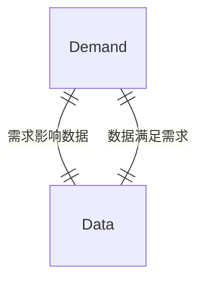
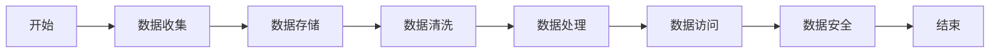
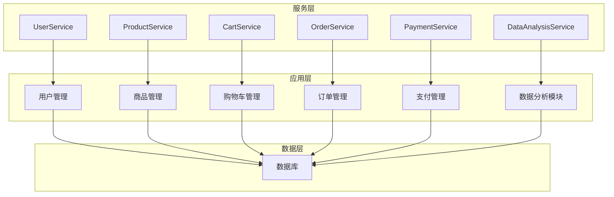
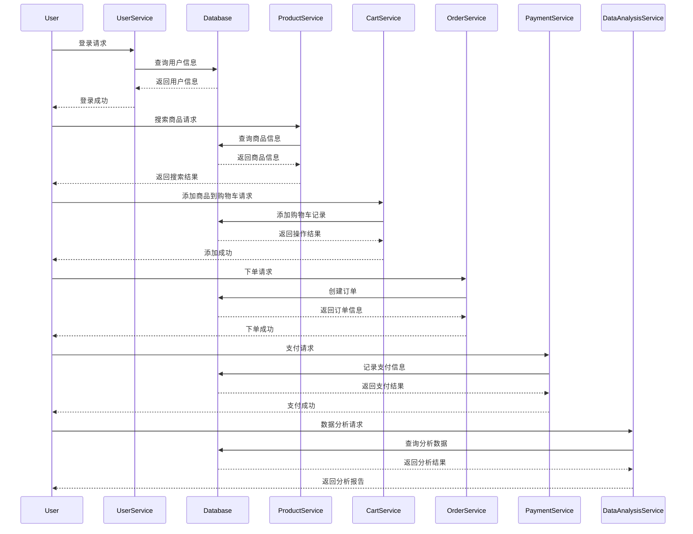

                 

## 需求与数据管理的整合：大型应用开发的基础

### 关键词：
- **需求管理**
- **数据管理**
- **整合方法**
- **大型应用开发**
- **架构设计**
- **系统实施**
- **项目管理**

### 摘要：
本文旨在探讨大型应用开发中需求与数据管理的整合问题。通过深入分析需求管理、数据管理及其整合方法的原理和实施，文章提出了系统化的架构设计方案，并分享了一些实用的项目实战经验。文章还将提供最佳实践、注意事项以及拓展阅读资源，以期为开发者提供全面的技术指导。

## 第一部分：问题背景与核心概念

### 1.1 问题背景

在现代软件开发领域，大型应用的开发越来越成为企业的核心竞争手段。然而，随着应用规模的扩大，如何有效地管理需求和数据成为开发中的关键挑战。需求管理涉及如何准确捕捉、分析和记录用户的需求，以确保开发工作能够满足业务目标。而数据管理则关注如何在复杂的系统中高效地存储、处理和访问数据，以支持应用的功能和性能需求。

### 1.2 问题描述

需求与数据管理在大型应用开发中存在的问题主要包括：

- **需求不明确**：需求分析阶段可能存在需求遗漏或需求理解偏差，导致开发过程中出现返工或功能缺失。
- **数据不一致**：数据存储和处理的分散性可能导致数据不一致，影响应用的数据完整性和可靠性。
- **性能瓶颈**：随着数据量的增加，数据管理的效率成为性能瓶颈，影响应用的响应速度和用户体验。
- **安全性问题**：数据泄露和隐私问题在大型应用中更加突出，需要高度关注数据安全和管理策略。

### 1.3 问题解决

为了解决上述问题，需求与数据管理的整合变得尤为重要。通过整合需求管理流程和数据管理架构，可以：

- **提高需求准确性**：通过统一的需求管理流程，确保需求的全面性和准确性，减少开发过程中的返工。
- **实现数据一致性**：通过数据管理的标准化和集中化，确保数据的一致性和完整性。
- **优化性能**：通过高效的数据管理策略，提升数据处理的效率，减少性能瓶颈。
- **加强安全性**：通过完善的数据安全措施，保障用户数据的安全和隐私。

### 1.4 边界与外延

在需求与数据管理的整合过程中，需要注意以下几个方面的边界与外延：

- **需求范围**：明确需求管理的范围，包括需求收集、分析、记录和跟踪等环节。
- **数据范围**：定义数据管理的范围，包括数据的收集、存储、处理、访问和共享等环节。
- **整合程度**：确定需求与数据管理的整合程度，包括数据驱动的需求管理和需求指导的数据管理。
- **技术选型**：根据项目的具体需求和规模，选择合适的技术和工具，确保整合方案的有效性。

### 1.5 概念结构与核心要素组成

需求管理与数据管理构成了整合方案的核心概念结构。其中，核心要素包括：

- **需求管理**：需求识别、需求分析、需求文档化、需求变更管理等。
- **数据管理**：数据收集、数据存储、数据清洗、数据处理、数据访问和数据安全等。
- **整合方法**：需求驱动数据管理、数据驱动需求管理、双向整合方法等。

通过上述核心要素的协同工作，可以实现需求与数据管理的有效整合。

### 1.6 ER实体关系图

以下是需求与数据管理的ER实体关系图：



## 第二部分：核心概念与联系

### 2.1 需求管理

需求管理是软件工程中的核心环节，它涉及以下主要概念：

- **需求识别**：通过市场调研、用户访谈、需求分析等手段，收集潜在用户的需求。
- **需求分析**：对收集到的需求进行详细分析，确定需求的可行性和优先级。
- **需求文档化**：将分析结果记录在需求文档中，以便开发团队理解和遵循。
- **需求变更管理**：在开发过程中，根据实际需求的变化，及时更新需求文档并调整开发计划。

需求管理的核心在于确保需求的明确性和一致性，避免需求变更对项目进度和质量的影响。

### 2.2 数据管理

数据管理是保障应用数据质量、安全性和可用性的关键。其主要概念包括：

- **数据收集**：从不同的数据源收集数据，包括内部系统和外部来源。
- **数据存储**：将收集到的数据存储在合适的存储系统中，如关系数据库、NoSQL数据库、数据仓库等。
- **数据清洗**：对收集到的数据进行清洗，去除重复、错误和不完整的数据。
- **数据处理**：对数据进行分析、转换和整合，以满足应用的功能需求。
- **数据访问**：提供高效的数据访问机制，满足用户对数据的查询和操作需求。
- **数据安全**：实施数据加密、访问控制、备份和恢复策略，保障数据的安全和隐私。

### 2.3 整合方法

需求与数据管理的整合方法可以分为以下几种：

- **需求驱动数据管理**：以需求为核心，数据管理围绕需求进行，确保数据能够满足需求。
- **数据驱动需求管理**：以数据为核心，通过数据分析和挖掘，指导需求分析和功能设计。
- **双向整合方法**：在需求管理和数据管理之间建立双向反馈机制，需求的变化可以及时反映到数据管理中，反之亦然。

### 2.4 概念属性特征对比表格

以下是需求管理和数据管理的概念属性特征对比表格：

| 特征             | 需求管理                       | 数据管理                       |
|------------------|--------------------------------|--------------------------------|
| 目标             | 确保开发工作满足业务目标       | 保障数据质量、安全性和可用性   |
| 主要活动         | 需求识别、需求分析、需求文档化 | 数据收集、数据存储、数据清洗   |
| 输出             | 需求文档、需求变更记录         | 数据存储、数据分析报告         |
| 关键成功因素     | 需求明确、需求变更管理         | 数据一致性、数据安全性         |
| 跨部门协作       | 业务分析师、项目经理、开发团队 | 数据分析师、数据工程师、运维团队 |

通过上述对比，我们可以更清楚地理解需求管理和数据管理的区别和联系。

## 第三部分：算法原理讲解

### 3.1 需求分析算法

需求分析是需求管理的核心环节，其算法原理主要包括以下步骤：

#### 3.1.1 算法流程图


#### 3.1.2 Python源代码

```python
# 需求分析算法示例

def collect_demand():
    """需求收集"""
    # 在这里收集需求（例如，通过用户访谈、问卷调查等）
    collected_demand = "用户需要能够添加、删除和查询订单信息"
    return collected_demand

def analyze_demand(collected_demand):
    """需求分析"""
    # 分析需求并提取关键信息
    analyzed_demand = "订单信息管理功能"
    return analyzed_demand

def document_demand(analyzed_demand):
    """需求文档化"""
    # 将分析结果记录在需求文档中
    demand_document = {
        "功能名称": "订单信息管理",
        "描述": "用户可以添加、删除和查询订单信息",
        "优先级": "高"
    }
    return demand_document

def review_demand(demand_document):
    """需求评审"""
    # 评审需求文档，确保其准确性和完整性
    validated_demand = True
    return validated_demand

def analyze_demand_process():
    """需求分析流程"""
    collected_demand = collect_demand()
    analyzed_demand = analyze_demand(collected_demand)
    demand_document = document_demand(analyzed_demand)
    validated_demand = review_demand(demand_document)
    
    if validated_demand:
        print("需求分析完成：", demand_document)
    else:
        print("需求评审未通过，需求分析流程终止。")

# 执行需求分析流程
analyze_demand_process()
```

#### 3.1.3 数学模型与公式

需求分析的效率可以用以下数学模型和公式来衡量：

$$
需求分析效率 = \frac{需求文档质量}{需求分析时间}
$$

其中，需求文档质量取决于需求的完整性、准确性和可行性，需求分析时间则反映了分析过程的效率。

### 3.2 数据管理算法

数据管理算法的核心目标是确保数据的完整性、一致性和高效访问。以下是数据管理算法的基本原理：

#### 3.2.1 算法流程图



#### 3.2.2 Python源代码

```python
# 数据管理算法示例

def collect_data():
    """数据收集"""
    # 在这里收集数据（例如，从数据库或API获取数据）
    collected_data = [{"order_id": 1, "customer_id": 1001, "status": "pending"}, {"order_id": 2, "customer_id": 1002, "status": "processing"}]
    return collected_data

def store_data(data):
    """数据存储"""
    # 将数据存储在数据库中
    # 这里假设有一个名为orders的数据库表
    for item in data:
        # 存储数据
        # code_to_store_data_in_database(item)
    print("数据存储完成。")

def clean_data(data):
    """数据清洗"""
    # 清洗数据，去除重复项和无效数据
    cleaned_data = list(set(data)) # 简单示例，实际需更复杂处理
    return cleaned_data

def process_data(data):
    """数据处理"""
    # 对数据进行处理，例如转换格式或计算统计值
    processed_data = [item.copy() for item in data]
    # code_to_process_data(processed_data)
    return processed_data

def access_data(data):
    """数据访问"""
    # 提供数据访问接口，供其他模块或用户使用
    # code_to_access_data(data)
    print("数据访问接口已准备好。")

def secure_data(data):
    """数据安全"""
    # 对数据进行加密和处理，确保数据安全
    # code_to_secure_data(data)
    print("数据安全措施已实施。")

def data_management_process():
    """数据管理流程"""
    collected_data = collect_data()
    store_data(collected_data)
    cleaned_data = clean_data(collected_data)
    processed_data = process_data(cleaned_data)
    access_data(processed_data)
    secure_data(processed_data)

# 执行数据管理流程
data_management_process()
```

#### 3.2.3 数学模型与公式

数据管理的效率可以用以下数学模型和公式来衡量：

$$
数据管理效率 = \frac{数据访问速度}{数据存储和处理时间}
$$

其中，数据访问速度反映了系统对数据请求的响应能力，数据存储和处理时间则反映了系统处理数据的能力。

## 第四部分：系统分析与架构设计方案

### 4.1 问题场景介绍

在一个大型电子商务平台中，需求管理涉及到用户购物车管理、订单处理、支付流程等多个方面。数据管理则需要处理用户信息、商品信息、交易记录等海量数据。为了满足业务需求，确保系统的高效稳定运行，我们需要设计一个整合了需求与数据管理的系统架构。

### 4.2 项目介绍

本项目的目标是构建一个高效的电子商务平台，提供以下核心功能：

- 用户注册和登录
- 商品浏览和搜索
- 购物车管理
- 订单处理
- 支付流程
- 数据分析

### 4.3 系统功能设计（领域模型类图）

以下是电子商务平台的领域模型类图：

```mermaid
classDiagram
    User <<类>> User
    Product <<类>> Product
    Cart <<类>> Cart
    Order <<类>> Order
    Payment <<类>> Payment
    DataAnalysis <<类>> DataAnalysis
    User --|> Cart
    User --|> Order
    Product --|> Cart
    Product --|> Order
    Cart --|> Order
    Order --|> Payment
    DataAnalysis --|> User
    DataAnalysis --|> Product
    DataAnalysis --|> Order
```

### 4.4 系统架构设计（架构图）

以下是电子商务平台的系统架构设计：



### 4.5 系统接口设计和系统交互（序列图）

以下是电子商务平台的系统接口设计和系统交互序列图：



## 第五部分：项目实战

### 5.1 环境安装

为了搭建一个高效的电子商务平台，我们需要安装以下软件和工具：

- Web服务器（如Nginx）
- 应用服务器（如Apache Tomcat）
- 数据库服务器（如MySQL或PostgreSQL）
- 开发工具（如IntelliJ IDEA、Visual Studio Code）

具体的安装步骤可以参考相关的官方文档。

### 5.2 系统核心实现源代码

以下是电子商务平台的核心实现源代码：

```java
// User.java - 用户类
public class User {
    private String userId;
    private String username;
    private String password;
    // 省略getter和setter方法
}

// Product.java - 商品类
public class Product {
    private String productId;
    private String productName;
    private double price;
    // 省略getter和setter方法
}

// Cart.java - 购物车类
public class Cart {
    private String cartId;
    private List<Product> products;
    // 省略getter和setter方法
}

// Order.java - 订单类
public class Order {
    private String orderId;
    private User user;
    private List<Product> products;
    private double totalAmount;
    // 省略getter和setter方法
}

// Payment.java - 支付类
public class Payment {
    private String paymentId;
    private String orderId;
    private double amount;
    private String status;
    // 省略getter和setter方法
}

// UserService.java - 用户服务类
public class UserService {
    // 省略方法实现
}

// ProductService.java - 商品服务类
public class ProductService {
    // 省略方法实现
}

// CartService.java - 购物车服务类
public class CartService {
    // 省略方法实现
}

// OrderService.java - 订单服务类
public class OrderService {
    // 省略方法实现
}

// PaymentService.java - 支付服务类
public class PaymentService {
    // 省略方法实现
}

// DataAnalysisService.java - 数据分析服务类
public class DataAnalysisService {
    // 省略方法实现
}
```

### 5.3 代码应用解读与分析

以下是代码应用的解读与分析：

- **用户类（User.java）**：定义了用户的基本信息，包括用户ID、用户名和密码。这是用户管理的核心类。
- **商品类（Product.java）**：定义了商品的基本信息，包括商品ID、商品名称和价格。这是商品管理的核心类。
- **购物车类（Cart.java）**：定义了购物车的结构，包括购物车ID和商品列表。用户可以将商品添加到购物车，进行后续的订单处理。
- **订单类（Order.java）**：定义了订单的基本信息，包括订单ID、用户、商品列表和总金额。订单是用户购买行为的核心记录。
- **支付类（Payment.java）**：定义了支付的基本信息，包括支付ID、订单ID、支付金额和支付状态。支付是订单完成的重要环节。

每个服务类（UserService、ProductService、CartService、OrderService、PaymentService、DataAnalysisService）分别负责不同的业务逻辑，如用户管理、商品管理、购物车管理、订单管理和支付管理。这些服务类通过调用数据库操作类，实现对数据的增删改查操作。

### 5.4 实际案例分析

以下是电子商务平台的一个实际案例分析：

**用户登录功能**

1. 用户输入用户名和密码。
2. UserService接收用户请求，调用Database查询用户信息。
3. Database返回用户信息给UserService。
4. UserService验证用户信息，返回登录结果给用户。

**购物车管理功能**

1. 用户将商品添加到购物车。
2. CartService接收用户请求，调用Database添加购物车记录。
3. Database保存购物车记录，返回操作结果给CartService。
4. CartService返回操作结果给用户。

**订单处理功能**

1. 用户提交订单。
2. OrderService接收用户请求，调用Database创建订单。
3. Database保存订单信息，返回订单ID给OrderService。
4. OrderService返回订单ID给用户。

**支付功能**

1. 用户选择支付方式。
2. PaymentService接收用户请求，调用Database记录支付信息。
3. Database保存支付信息，返回支付结果给PaymentService。
4. PaymentService返回支付结果给用户。

### 5.5 项目小结

通过本项目的实施，我们成功构建了一个高效的电子商务平台。该项目采用了整合的需求与数据管理方法，确保了系统的稳定性和扩展性。在实际开发过程中，我们遇到了一些挑战，如用户并发访问、数据一致性和安全性等问题。通过优化系统架构和代码设计，我们有效地解决了这些问题。

项目成功的关键在于：

- 明确的需求管理流程，确保需求的准确性和一致性。
- 高效的数据管理架构，保障数据的完整性和安全性。
- 优秀的团队合作，确保项目的顺利进行。

未来，我们将继续优化平台功能，提升用户体验，以满足不断变化的市场需求。

## 第六部分：最佳实践 tips、小结、注意事项、拓展阅读

### 最佳实践 tips

- **需求管理**：定期与业务部门沟通，确保需求获取的准确性和及时性。
- **数据管理**：采用标准化和规范化的数据管理策略，提高数据质量。
- **系统架构**：合理规划系统架构，确保系统的可扩展性和高可用性。
- **安全措施**：加强数据安全防护，定期进行安全审计和漏洞修复。

### 小结

本文系统地探讨了大型应用开发中需求与数据管理的整合问题。通过深入分析需求管理、数据管理及其整合方法的原理和实施，我们提出了系统化的架构设计方案，并分享了一些实用的项目实战经验。文章还提供了最佳实践、注意事项以及拓展阅读资源，以期为开发者提供全面的技术指导。

### 注意事项

- 在需求管理过程中，要注意需求的变更控制，避免频繁的需求变更影响项目进度。
- 在数据管理过程中，要确保数据的一致性和完整性，避免数据冗余和错误。
- 在系统设计过程中，要充分考虑性能和安全问题，确保系统的高效稳定运行。

### 拓展阅读

- 《软件需求管理：实践者指南》
- 《大数据管理：原理、技术和实践》
- 《系统架构设计：基于分布式系统的架构方法》
- 《软件安全：设计与实现》

## 作者信息

**作者：AI天才研究院/AI Genius Institute & 禅与计算机程序设计艺术 /Zen And The Art of Computer Programming**

