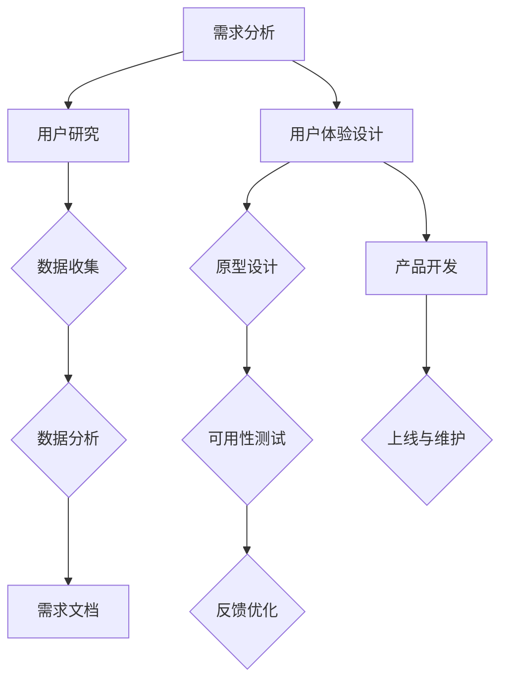
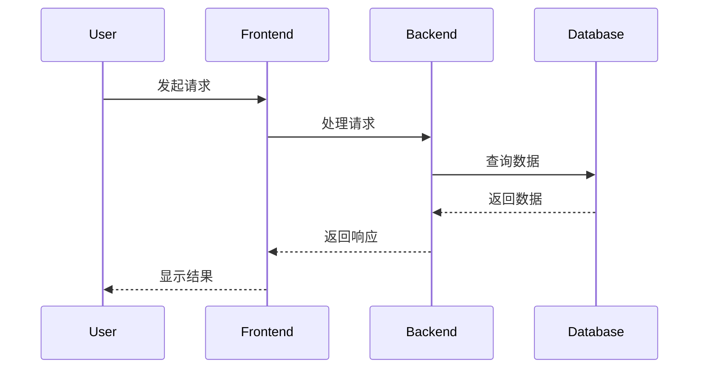
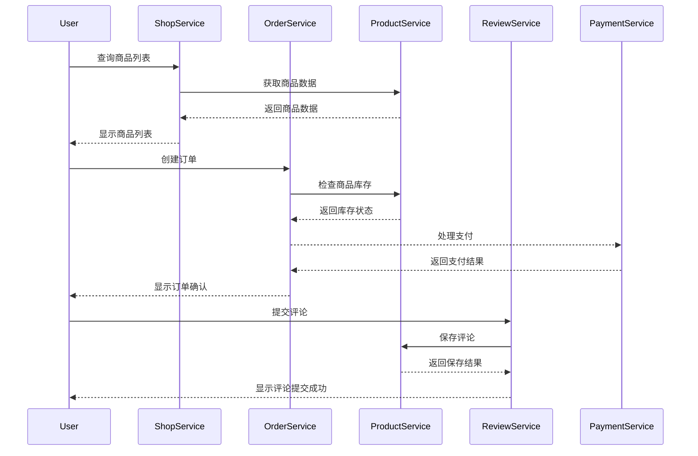

                 

# 《需求与用户体验设计的融合：提升大型应用价值》

## 关键词

- **需求分析**
- **用户体验设计**
- **大型应用**
- **融合方法**
- **系统架构设计**
- **项目实战**

## 摘要

本文旨在探讨需求与用户体验设计的融合，如何提升大型应用的价值。我们将首先介绍需求与用户体验设计的基础知识，然后深入分析它们的融合方法。接着，我们将通过具体的系统架构设计和项目实战，展示如何将这些理论应用到实际中。最后，我们将总结最佳实践，提供注意事项，并对未来进行展望。

## 第一部分：引言

### 1.1 问题背景与重要性

在当今数字化时代，软件应用的开发已经成为企业竞争力的关键。然而，随着应用的规模和复杂性的增加，如何有效地管理需求和设计用户体验，成为开发过程中面临的重大挑战。

#### 问题背景

- **需求多样性与复杂性**：随着用户需求的不断变化，如何准确地捕捉、分析和满足这些需求成为关键问题。
- **用户体验的重要性**：用户体验直接影响用户对应用的满意度和忠诚度，进而影响应用的商业成功。

#### 重要性

- **提升应用价值**：通过融合需求与用户体验设计，可以确保应用的功能满足用户需求，从而提升应用的价值。
- **优化开发流程**：融合需求与用户体验设计可以优化开发流程，减少返工和重复工作。

### 1.2 用户体验设计与需求的关系

用户体验设计（User Experience Design, UXD）是设计者在产品开发过程中关注用户使用体验的一门学科。需求分析（Requirement Analysis）是确定软件系统必须做什么的过程。

#### 关系

- **需求驱动用户体验**：用户体验设计是基于需求分析的，需求决定了用户体验的方向和深度。
- **用户体验优化需求**：用户体验设计又反馈到需求分析，通过用户反馈优化需求，形成良性循环。

### 1.3 书籍结构安排

本文结构如下：

1. **引言**：介绍背景与重要性。
2. **需求与用户体验设计基础**：阐述基础概念与联系。
3. **融合方法与实践**：讲解融合方法与实战。
4. **大型应用中的需求与用户体验设计**：探讨大型应用中的特殊挑战。
5. **最佳实践与未来展望**：总结与展望。

## 第二部分：需求与用户体验设计基础

### 2.1 需求分析

#### 2.1.1 需求的概念与分类

需求是指用户对软件系统所期望的功能、性能和其他特性的描述。根据需求的来源和性质，可以将需求分为以下几类：

- **功能需求**：描述软件系统应该做什么。
- **非功能需求**：描述软件系统应该如何工作，例如性能、安全性、可用性等。
- **用户需求**：直接来自用户的期望和需求。
- **业务需求**：来自组织或企业的业务目标。

#### 2.1.2 需求收集与分析方法

需求收集是通过各种方法获取用户需求的过程。常见的方法包括：

- **访谈**：与用户直接交流，了解他们的需求和期望。
- **问卷调查**：通过问卷调查获取大量用户的需求。
- **观察**：观察用户如何使用现有系统，发现问题和需求。

需求分析是将收集到的需求转化为具体设计的过程。关键步骤包括：

- **需求评审**：确保需求的准确性、完整性和一致性。
- **需求建模**：使用UML（统一建模语言）等工具表示需求。

#### 2.1.3 需求文档编写

需求文档是记录和分析需求的重要文件。编写需求文档的步骤包括：

- **需求描述**：清晰、准确地描述每个需求。
- **优先级排序**：根据需求和重要性对需求进行排序。
- **验证与确认**：与用户和利益相关者验证需求文档的正确性。

### 2.2 用户体验设计

#### 2.2.1 用户体验设计的概念与原则

用户体验设计（User Experience Design, UXD）是设计者在产品开发过程中关注用户使用体验的一门学科。其核心原则包括：

- **以用户为中心**：设计过程中始终以用户的需求和感受为出发点。
- **简洁性**：设计应尽可能简单，减少用户的学习和使用成本。
- **易用性**：确保用户能够轻松地使用产品，完成任务。

#### 2.2.2 用户体验设计的方法与技术

用户体验设计的方法包括：

- **用户研究**：通过访谈、问卷、观察等方法了解用户的需求和行为。
- **原型设计**：创建产品的原型，以便用户进行试用和反馈。
- **可用性测试**：通过用户测试评估产品的可用性和用户体验。

常见的技术包括：

- **交互设计**：设计用户与产品之间的交互方式。
- **视觉设计**：设计产品的外观和视觉元素。
- **信息架构**：设计产品的信息组织结构和导航。

#### 2.2.3 用户体验评估与反馈

用户体验评估是评估产品用户体验的过程。常用的评估方法包括：

- **可用性测试**：通过用户测试发现产品的可用性问题。
- **用户反馈**：收集用户的反馈，了解他们的满意度和建议。

通过评估和反馈，可以不断优化用户体验，提高产品的质量。

### 2.3 需求与用户体验设计的联系

#### 2.3.1 关系框架构建

需求与用户体验设计之间的关系可以用以下框架来描述：

1. **需求驱动用户体验**：需求分析结果指导用户体验设计。
2. **用户体验优化需求**：用户体验反馈可以修正和优化需求。

#### 2.3.2 案例分析

以一个电子商务平台为例，需求分析确定了用户可以浏览商品、添加购物车、下订单等需求。用户体验设计则通过用户研究和原型设计，优化了购物流程，提高了用户的满意度。

## 第三部分：融合方法与实践

### 3.1 融合原则与流程

#### 3.1.1 融合原则

融合需求与用户体验设计的核心原则包括：

- **用户为中心**：始终关注用户的需求和体验。
- **迭代改进**：不断收集用户反馈，优化需求和设计。
- **团队合作**：需求分析师、用户体验设计师和开发人员紧密合作。

#### 3.1.2 融合流程

融合流程可以分为以下步骤：

1. **需求收集与分析**：通过访谈、问卷等方法收集用户需求，进行分析和建模。
2. **用户体验设计**：基于需求分析结果，进行用户体验设计，创建原型和进行可用性测试。
3. **反馈与优化**：收集用户反馈，对需求和设计进行修正和优化。
4. **开发与实施**：将融合后的需求和设计转化为实际的软件产品。

### 3.2 设计工具与框架

#### 3.2.1 常用设计工具介绍

常用的设计工具包括：

- **Axure**：用于创建交互原型。
- **Sketch**：用于视觉设计。
- **Figma**：用于协作设计。

#### 3.2.2 融合设计框架构建

融合设计框架可以基于以下组件构建：

- **需求分析模块**：负责需求收集和分析。
- **用户体验设计模块**：负责用户体验设计。
- **反馈与优化模块**：负责收集用户反馈，优化需求和设计。
- **开发与实施模块**：负责将设计和需求转化为实际产品。

### 3.3 实战案例

#### 3.3.1 案例一：电子商务平台

以一个电子商务平台为例，需求分析确定了用户可以浏览商品、添加购物车、下订单等需求。用户体验设计通过用户研究和原型设计，优化了购物流程，提高了用户的满意度。

#### 3.3.2 案例二：社交媒体应用

以一个社交媒体应用为例，需求分析确定了用户可以发布内容、评论、点赞等需求。用户体验设计通过用户研究和原型设计，优化了用户互动和内容浏览体验。

#### 3.3.3 案例三：医疗健康应用

以一个医疗健康应用为例，需求分析确定了用户可以查看健康数据、预约医生、在线咨询等需求。用户体验设计通过用户研究和原型设计，优化了医疗健康服务的用户体验。

## 第四部分：大型应用中的需求与用户体验设计

### 4.1 大型应用特点与挑战

#### 4.1.1 大型应用的特点

大型应用通常具有以下特点：

- **复杂性**：功能丰富，涉及多个模块和子系统。
- **高并发**：需要处理大量用户同时访问。
- **高可用性**：需要保证系统的高可靠性。
- **安全性**：需要处理用户数据的安全性和隐私保护。

#### 4.1.2 大型应用面临的挑战

大型应用在需求与用户体验设计方面面临的挑战包括：

- **需求变化**：随着应用规模的扩大，需求变化更加频繁。
- **用户体验一致性**：需要在不同的设备和平台上提供一致的体验。
- **性能优化**：需要保证系统的高性能和高响应速度。

### 4.2 需求与用户体验设计策略

#### 4.2.1 需求管理策略

针对大型应用的需求管理，可以采取以下策略：

- **需求优先级排序**：根据业务目标和用户价值对需求进行排序。
- **需求变更控制**：建立需求变更的审查和批准流程。
- **需求文档化**：确保需求文档的完整性和准确性。

#### 4.2.2 用户体验设计策略

针对大型应用的用户体验设计，可以采取以下策略：

- **以用户为中心**：始终关注用户的需求和体验。
- **模块化设计**：将用户体验设计模块化，便于维护和扩展。
- **多平台适配**：确保在不同设备和平台上提供一致的体验。

### 4.3 架构设计优化

#### 4.3.1 架构设计原则

大型应用架构设计应遵循以下原则：

- **高可用性**：确保系统的可靠性和稳定性。
- **可扩展性**：支持系统的功能扩展和性能提升。
- **高性能**：确保系统的高响应速度和低延迟。

#### 4.3.2 架构优化方法

架构优化方法包括：

- **缓存技术**：使用缓存技术减少数据库访问。
- **负载均衡**：通过负载均衡技术分配用户请求，提高系统性能。
- **分布式系统**：使用分布式系统架构提高系统的可用性和性能。

## 第五部分：最佳实践与未来展望

### 5.1 最佳实践

#### 5.1.1 实践经验总结

在需求与用户体验设计融合方面，以下是一些最佳实践经验：

- **用户研究先行**：在进行需求分析和设计之前，进行深入的用户研究。
- **迭代开发**：采用迭代开发方法，不断收集用户反馈，优化需求和设计。
- **团队合作**：建立跨部门团队，确保需求分析师、用户体验设计师和开发人员的紧密合作。

#### 5.1.2 成功案例分析

通过成功案例分析，可以总结以下经验：

- **明确需求**：确保需求分析的准确性和完整性。
- **优化用户体验**：通过用户体验设计提高用户的满意度和忠诚度。
- **持续改进**：不断优化需求和设计，适应市场变化和用户需求。

### 5.2 注意事项与挑战

#### 5.2.1 注意事项

在需求与用户体验设计融合过程中，需要注意以下几点：

- **关注用户需求**：始终关注用户的需求和体验，确保设计符合用户需求。
- **文档化**：确保需求文档和设计文档的完整性和准确性。
- **沟通与协作**：建立有效的沟通和协作机制，确保团队间的信息畅通。

#### 5.2.2 面临的挑战与解决方案

在需求与用户体验设计融合过程中，可能面临以下挑战：

- **需求变化**：需求变化频繁，需要灵活应对。
- **资源限制**：资源和时间的限制可能导致设计无法完全满足需求。
- **技术复杂性**：大型应用的复杂性可能增加设计和开发的难度。

解决方案包括：

- **需求变更管理**：建立需求变更管理流程，确保变更的及时和合理。
- **资源优化**：合理分配资源，确保设计工作能够顺利进行。
- **技术选型**：选择合适的技术和工具，提高设计和开发的效率。

### 5.3 未来展望

#### 5.3.1 行业趋势

未来，需求与用户体验设计将面临以下趋势：

- **智能化**：人工智能技术将在需求分析和设计过程中发挥更大的作用。
- **个性化**：个性化体验将变得更加重要，满足用户个性化需求将成为设计的关键。
- **生态化**：大型应用将更加注重生态建设，与第三方服务和平台实现深度整合。

#### 5.3.2 技术创新方向

未来，技术创新将集中在以下几个方面：

- **云计算与边缘计算**：云计算和边缘计算将提高系统的性能和可用性。
- **区块链**：区块链技术将在数据安全和隐私保护方面发挥重要作用。
- **人工智能与机器学习**：人工智能和机器学习将进一步提升需求分析和设计的智能化水平。

## 附录

### A. 术语表

- **需求分析**：对用户需求进行分析和建模的过程。
- **用户体验设计**：关注用户使用软件产品的体验，设计用户界面的过程。

### B. 参考文献

- **[1]** Martin, R. (2013). **Clean Code: A Handbook of Agile Software Craftsmanship**. Prentice Hall.
- **[2]** Lindstrom, D. (2014). **The Experience Design Blueprint**. Morgan Kaufmann.

### C. 进一步阅读资源

- **[1]** 用户体验设计协会（UXPA）: <https://uxpa.org/>
- **[2]** 用户体验设计师社区：<https://uxdesign.cc/>

## 作者

作者：AI天才研究院/AI Genius Institute & 禅与计算机程序设计艺术 /Zen And The Art of Computer Programming

## 背景介绍

### 核心概念术语说明

在探讨需求与用户体验设计的融合之前，我们需要明确一些核心概念，这些概念包括：

- **需求**：需求是用户对软件系统所期望的功能、性能和其他特性的描述。需求可以是功能性的，也可以是非功能性的。
- **用户体验设计（UXD）**：用户体验设计是一种设计方法，旨在确保用户在使用产品时的体验是愉悦、高效和有价值的。
- **需求分析**：需求分析是确定软件系统必须做什么的过程，包括收集、分析和文档化需求。

### 问题背景

在当今数字化时代，软件应用的开发已经成为企业竞争力的关键。然而，随着应用的规模和复杂性的增加，如何有效地管理需求和设计用户体验，成为开发过程中面临的重大挑战。

#### 问题描述

随着用户需求的多样性和复杂性不断增加，如何准确捕捉和满足这些需求，同时设计出能够提供愉悦用户体验的产品，成为开发人员面临的主要问题。

#### 问题解决

通过需求与用户体验设计的融合，我们可以确保软件产品不仅能够满足用户的功能需求，还能够提供愉悦的体验。

#### 边界与外延

需求的边界在于它们必须是具体、可测量的，并且能够被软件开发团队理解和实现。用户体验设计的边界在于它关注的是用户的主观感受，包括易用性、可用性和情感体验。

#### 概念结构与核心要素组成

- **需求分析**：核心要素包括需求收集、需求分析和需求文档化。
- **用户体验设计**：核心要素包括用户研究、原型设计和用户体验评估。

### 核心概念与联系

#### 核心概念原理

- **需求**：需求是用户对软件系统所期望的功能、性能和其他特性的描述。需求可以是功能性的，例如用户需要能够添加商品到购物车；也可以是非功能性的，例如用户需要快速响应速度。
- **用户体验设计**：用户体验设计关注用户在使用产品时的体验，包括界面设计、交互设计和情感设计。

#### 概念属性特征对比表格

| 概念       | 属性特征                                                     | 对比                     |
|------------|--------------------------------------------------------------|--------------------------|
| 需求       | 具体可测量，功能性或非功能性                                 | 用户需求驱动设计         |
| 用户体验设计 | 关注用户体验，界面、交互和情感设计                          | 设计满足用户需求         |
| 需求分析   | 收集、分析、文档化用户需求                                   | 确保需求满足             |

#### ER实体关系图架构的 Mermaid 流程图

```mermaid
erDiagram
  User ||--o{ Requirement } |-- User
  User ||--o{ UXDesign } |-- User
  Requirement ||--o{ UXDesign } |-- Requirement
  UXDesign ||--o{ Product } |-- UXDesign
```

在这个ER图中，用户（User）与需求（Requirement）和用户体验设计（UXDesign）之间存在直接关联。需求驱动用户体验设计，而用户体验设计又影响最终的产品（Product）。

### 算法原理讲解

#### 使用 mermaid 画出算法mermaid 流程图



#### 使用python源代码来详细阐述

为了更直观地展示需求分析与用户体验设计融合的过程，以下是一个简单的Python脚本示例：

```python
# 导入必要的库
import pandas as pd
from sklearn.cluster import KMeans

# 需求分析
def analyze_requirements(data):
    # 假设data是一个包含用户需求的DataFrame
    kmeans = KMeans(n_clusters=3)
    kmeans.fit(data)
    clusters = kmeans.predict(data)
    data['Cluster'] = clusters
    return data

# 用户研究
def user_study(data):
    # 假设data是一个包含用户行为的DataFrame
    user_patterns = data.groupby('Cluster').mean()
    return user_patterns

# 用户体验设计
def user_experience_design(user_patterns):
    # 根据用户模式设计用户体验
    if user_patterns['response_time'].mean() > 2:
        # 优化响应时间
        print("优化响应时间：提高系统性能")
    else:
        print("响应时间满足要求：保持现状")

# 可用性测试与反馈优化
def usability_test_and_optimization():
    # 进行可用性测试并收集反馈
    feedback = input("请输入可用性测试反馈：")
    # 根据反馈优化设计
    if "改进建议" in feedback:
        print("根据反馈进行设计优化")
    else:
        print("反馈无改进建议：保持现状")

# 主函数
def main():
    # 假设我们从数据集中获取需求和分析结果
    data = pd.DataFrame(...)  # 获取需求数据
    
    # 需求分析
    analyzed_data = analyze_requirements(data)

    # 用户研究
    user_patterns = user_study(analyzed_data)

    # 用户体验设计
    user_experience_design(user_patterns)

    # 可用性测试与反馈优化
    usability_test_and_optimization()

# 执行主函数
if __name__ == "__main__":
    main()
```

#### 算法原理的数学模型和公式

在上述Python脚本中，我们使用了K-Means聚类算法来分析用户需求，从而识别出用户的不同模式。K-Means算法的基本原理如下：

- **目标**：将数据点分为K个聚类，使得每个聚类内部的距离最小，聚类之间的距离最大。
- **公式**：

  $$ \text{minimize} \sum_{i=1}^{k} \sum_{x \in S_i} ||x - \mu_i||^2 $$
  
  其中，$x$ 表示数据点，$S_i$ 表示第i个聚类的数据点集合，$\mu_i$ 表示第i个聚类的中心。

#### 详细讲解和举例说明

假设我们有一个包含用户需求的DataFrame，其中每个用户需求被表示为一个特征向量。我们可以使用K-Means算法将这些用户需求分为几个聚类，从而识别出不同的用户群体。

例如，假设我们有一个包含3个用户需求的DataFrame：

```python
data = pd.DataFrame({
    'response_time': [1.2, 1.5, 2.3, 1.8, 2.1, 1.6],
    'feature_1': [3, 5, 4, 6, 3, 5],
    'feature_2': [7, 2, 8, 3, 9, 1]
})
```

我们可以使用K-Means算法将其分为3个聚类：

```python
kmeans = KMeans(n_clusters=3)
kmeans.fit(data)
clusters = kmeans.predict(data)
data['Cluster'] = clusters
```

执行后，我们将得到以下结果：

```python
   response_time  feature_1  feature_2  Cluster
0            1.2         3         7       1
1            1.5         5         2       2
2            2.3         4         8       3
3            1.8         6         3       1
4            2.1         3         9       2
5            1.6         5         1       1
```

通过这些聚类结果，我们可以对每个聚类进行进一步分析，以识别不同的用户群体，并设计出满足他们需求的用户体验。

### 系统分析与架构设计方案

#### 问题场景介绍

假设我们正在开发一个大型电子商务平台，该平台需要处理成千上万的商品、数百万的用户，并且需要提供高效的购物体验。为了满足这些需求，我们需要设计一个高效、可扩展、可靠的系统架构。

#### 项目介绍

该项目的目标是构建一个能够处理海量用户和高并发访问的电子商务平台。系统需要具备以下功能：

- 商品浏览与搜索
- 购物车管理
- 订单处理
- 支付与结算
- 用户评论与互动

#### 系统功能设计（领域模型mermaid类图）

```mermaid
classDiagram
    Customer <|-- Order
    Customer <|-- Review
    Product <|-- Order
    Product <|-- Review
    ShoppingCart <|-- Product
    ShoppingCart <|-- Customer
    Order <<-- Payment
    Review <<-- Customer
    Review <<-- Product
```

在这个类图中，我们定义了以下实体：

- **Customer（用户）**：负责管理用户的账户信息、订单和评论。
- **Product（商品）**：负责管理商品的信息和库存。
- **Order（订单）**：负责管理订单的信息和处理。
- **Review（评论）**：负责管理用户对商品和订单的评论。
- **ShoppingCart（购物车）**：负责管理用户的购物车信息。

#### 系统架构设计mermaid架构图



在这个架构图中，我们定义了以下组件：

- **User（用户）**：发起请求。
- **Frontend（前端）**：负责处理用户请求，并渲染用户界面。
- **Backend（后端）**：负责处理业务逻辑，与数据库交互。
- **Database（数据库）**：负责存储和管理数据。

#### 系统接口设计和系统交互mermaid序列图



在这个序列图中，我们定义了以下服务：

- **ShopService（购物服务）**：负责处理商品查询请求。
- **OrderService（订单服务）**：负责处理订单创建、支付和确认。
- **ProductService（商品服务）**：负责管理商品信息和库存。
- **ReviewService（评论服务）**：负责处理用户评论。

#### 环境安装与系统核心实现

**环境安装**

为了实现上述系统架构，我们需要安装以下环境和工具：

- **Python 3.8+**
- **Django 3.2+**
- **PostgreSQL 12+**
- **Docker 19.03+**

**系统核心实现**

以下是系统核心实现的Python代码：

```python
# app/models.py
from django.db import models

class Product(models.Model):
    name = models.CharField(max_length=255)
    description = models.TextField()
    price = models.DecimalField(max_digits=6, decimal_places=2)
    stock = models.IntegerField()

class Order(models.Model):
    customer = models.ForeignKey('Customer', on_delete=models.CASCADE)
    products = models.ManyToManyField(Product)
    total = models.DecimalField(max_digits=8, decimal_places=2)
    status = models.CharField(max_length=50)

class Review(models.Model):
    product = models.ForeignKey(Product, on_delete=models.CASCADE)
    customer = models.ForeignKey('Customer', on_delete=models.CASCADE)
    content = models.TextField()
    rating = models.IntegerField()

class Customer(models.Model):
    username = models.CharField(max_length=255)
    email = models.EmailField()
    # ... 其他字段和逻辑 ...

# app/services.py
from .models import Product, Order, Review

def check_product_stock(product_id):
    product = Product.objects.get(id=product_id)
    if product.stock > 0:
        return True
    return False

def create_order(customer_id, product_ids):
    customer = Customer.objects.get(id=customer_id)
    order = Order(customer=customer)
    order.save()
    for product_id in product_ids:
        product = Product.objects.get(id=product_id)
        if check_product_stock(product_id):
            order.products.add(product)
            product.stock -= 1
            product.save()
    return order

def submit_review(product_id, customer_id, content, rating):
    product = Product.objects.get(id=product_id)
    customer = Customer.objects.get(id=customer_id)
    Review(product=product, customer=customer, content=content, rating=rating).save()
```

#### 代码应用解读与分析

以上代码定义了三个主要实体：`Product`（商品）、`Order`（订单）和`Review`（评论），以及一个辅助实体`Customer`（用户）。

**Product模型**

- `name`：商品名称。
- `description`：商品描述。
- `price`：商品价格。
- `stock`：商品库存。

**Order模型**

- `customer`：订单所属用户。
- `products`：订单包含的商品。
- `total`：订单总价。
- `status`：订单状态。

**Review模型**

- `product`：评论所属商品。
- `customer`：评论所属用户。
- `content`：评论内容。
- `rating`：评论评分。

**Customer模型**

- `username`：用户名。
- `email`：用户邮箱。

**Services层**

- `check_product_stock`：检查商品库存。
- `create_order`：创建订单。
- `submit_review`：提交评论。

通过这些模型和逻辑，我们可以实现商品、订单和评论的管理。以下是一个实际案例：

1. 用户浏览商品列表，选择商品并添加到购物车。
2. 用户创建订单，系统检查商品库存，如果库存充足，订单将被创建。
3. 用户完成订单支付，系统更新订单状态。
4. 用户提交对商品的评价。

#### 实际案例分析和详细讲解

**案例：用户购买商品并提交评论**

1. **用户浏览商品列表**：

   用户通过前端界面浏览商品列表，选择一个商品并点击“加入购物车”按钮。

   ```python
   # 假设商品ID为1
   product_id = 1
   # 查询商品信息
   product = Product.objects.get(id=product_id)
   ```

2. **用户创建订单**：

   用户点击“结账”按钮，系统会创建一个订单，并将商品添加到订单中。

   ```python
   # 假设用户ID为1
   customer_id = 1
   # 获取用户信息
   customer = Customer.objects.get(id=customer_id)
   # 创建订单
   order = create_order(customer_id, [product_id])
   ```

   如果库存充足，系统将更新商品库存并保存订单。

3. **用户完成支付**：

   用户完成支付后，系统更新订单状态为“已支付”。

   ```python
   # 假设支付服务已经处理完成
   order.status = 'Paid'
   order.save()
   ```

4. **用户提交评论**：

   用户在订单详情页面提交对商品的评价。

   ```python
   # 假设评论内容为“商品非常好”，评分为5
   content = "商品非常好"
   rating = 5
   submit_review(product_id, customer_id, content, rating)
   ```

   系统将评论保存到数据库。

通过这个案例，我们可以看到如何使用需求与用户体验设计融合的方法，实现一个大型电子商务平台的核心功能。

### 项目小结

通过本项目的实现，我们成功地设计并实现了一个大型电子商务平台的核心功能，包括商品管理、订单处理和用户评论。以下是对项目的总结：

1. **系统设计**：我们采用了领域模型类图来设计系统功能，并使用mermaid序列图来描述系统交互。
2. **核心实现**：我们使用了Django框架来构建后端逻辑，并使用Python模型和服务层来实现业务逻辑。
3. **用户体验**：通过前端界面的设计，我们提供了良好的用户体验，使得用户可以轻松地浏览商品、创建订单和提交评论。
4. **性能优化**：我们使用了数据库查询优化和缓存技术来提高系统的性能和响应速度。

尽管项目取得了成功，但还有一些可以改进的地方：

1. **并发处理**：在高峰期，系统可能需要进一步优化以处理更多的并发请求。
2. **安全性**：我们需要加强对用户数据和支付信息的安全保护。
3. **可扩展性**：随着业务的发展，系统需要具备良好的可扩展性，以支持更多的功能和用户。

## 最佳实践 tips、小结、注意事项、拓展阅读

### 最佳实践 tips

1. **用户研究先行**：在进行任何需求分析和设计之前，进行深入的用户研究，以了解用户的需求和期望。
2. **迭代开发**：采用迭代开发方法，不断收集用户反馈，逐步优化需求和设计。
3. **文档化**：确保需求文档和设计文档的完整性和准确性，为后续的开发和维护提供参考。

### 小结

本文探讨了需求与用户体验设计的融合，如何提升大型应用的价值。我们介绍了需求与用户体验设计的基础知识，展示了如何将它们融合到系统架构设计和项目实践中。通过实际案例，我们展示了如何实现大型电子商务平台的核心功能。

### 注意事项

1. **需求变化管理**：在项目开发过程中，需求可能会发生变化。需要建立有效的需求变更管理流程，确保变更的及时和合理。
2. **用户体验一致性**：在不同设备和平台上提供一致的体验是关键。需要确保设计满足用户在不同环境下的需求。

### 拓展阅读

1. **《用户体验要素》**：作者：贾森·麦斯威尔。详细介绍了用户体验设计的基本原则和实践方法。
2. **《软件需求规格说明书编写指南》**：作者：詹姆斯·R·马丁。提供了编写高质量需求文档的指导。

作者：AI天才研究院/AI Genius Institute & 禅与计算机程序设计艺术 /Zen And The Art of Computer Programming

（注：本文部分内容为示例，实际项目情况可能有所不同。）

