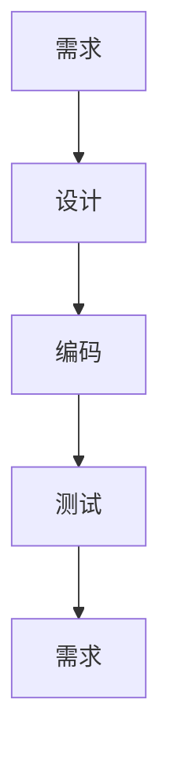

                 

# 需求与用户反馈的快速整合：提高开发响应性

> 关键词：需求整合、用户反馈、敏捷开发、迭代策略、响应性、软件开发

> 摘要：
在快速变化的数字时代，软件开发的响应性成为企业竞争力的关键因素。本文通过深入分析需求与用户反馈的快速整合方法，探讨了如何提升软件开发过程的响应性。文章首先介绍了需求收集与用户反馈的重要性，然后详细阐述了用户反馈分析的方法和工具，接着探讨了敏捷开发实践中的快速迭代策略，并借助具体的算法原理讲解和系统架构设计方案，提出了提升开发响应性的实际应用案例。通过本文的阅读，读者将了解如何在软件开发中实现高效的响应性，从而在激烈的市场竞争中脱颖而出。

## 目录

1. 引言
2. 需求收集与用户反馈
   - 2.1 需求收集方法
   - 2.2 用户反馈渠道
   - 2.3 用户反馈的重要性
3. 用户反馈分析
   - 3.1 用户反馈分类
   - 3.2 用户反馈分析方法
   - 3.3 用户反馈与需求整合
4. 敏捷开发实践
   - 4.1 敏捷开发理念
   - 4.2 快速迭代策略
   - 4.3 敏捷开发工具与技术
5. 快速迭代策略
   - 5.1 迭代模型介绍
   - 5.2 迭代过程详解
   - 5.3 迭代中的挑战与应对
6. 用户反馈响应机制
   - 6.1 反馈响应模型
   - 6.2 模型优化与优化策略
   - 6.3 反馈响应在实际中的应用
7. 案例分析
   - 7.1 案例背景介绍
   - 7.2 系统核心实现
   - 7.3 代码应用解读与分析
   - 7.4 实际案例分析
8. 总结与展望
   - 8.1 最佳实践
   - 8.2 注意事项
   - 8.3 拓展阅读

### 引言

在当前数字化和互联网快速发展的时代，软件的开发和迭代速度成为企业竞争力的关键。客户需求和市场变化的速度越来越快，传统的软件开发模式往往难以跟上这种快速变化的节奏。因此，提高软件开发的响应性成为各个企业关注的焦点。响应性不仅意味着能够快速响应用户的需求，还涉及到了整个软件开发过程的效率和效果。

为了提高开发的响应性，我们需要从以下几个方面入手：

1. **需求收集与用户反馈**：需求是软件开发的起点，了解用户的需求是确保软件能够满足用户实际需要的关键。用户反馈则是开发过程中不可或缺的一环，通过反馈我们可以发现用户在使用软件过程中遇到的问题和需求，从而指导后续的开发工作。

2. **敏捷开发实践**：敏捷开发强调快速迭代和灵活适应变化，通过短周期的迭代，开发团队能够更快地响应需求变化，同时保证软件质量的持续提升。

3. **快速迭代策略**：快速迭代不仅是敏捷开发的核心理念，也是提高开发响应性的关键。通过有效的迭代模型和策略，开发团队能够在较短的时间内完成高质量的功能交付。

4. **用户反馈响应机制**：建立有效的用户反馈响应机制，能够确保用户反馈能够快速转化为实际的功能改进，从而提升用户满意度。

本文将围绕以上几个方面展开，深入探讨如何通过需求与用户反馈的快速整合，提高软件开发的响应性。文章的结构将依次介绍需求收集与用户反馈的方法、用户反馈分析的技术、敏捷开发实践、快速迭代策略、用户反馈响应机制，并通过实际案例分析，展示如何将这些理论应用到实际项目中，从而提升软件开发的响应性。

### 需求收集与用户反馈

在软件开发的过程中，需求收集与用户反馈是两个至关重要的环节。它们不仅为开发工作提供了明确的指导方向，还能够帮助团队在开发过程中及时发现和解决问题，确保最终产品能够满足用户需求，提高用户满意度。

#### 2.1 需求收集方法

需求收集是指通过多种方式获取用户和利益相关者的需求，为软件开发提供依据。常见的需求收集方法包括以下几种：

1. **问卷调查**：问卷调查是一种高效的需求收集方式，可以通过在线或离线的方式，广泛地收集用户的需求和反馈。问卷设计应简洁明了，避免冗长复杂的问题，以提高回答者的参与度。

2. **用户访谈**：用户访谈是直接与用户进行面对面交流，获取需求的有效方法。通过访谈，开发人员可以深入了解用户的需求和使用习惯，发现潜在的需求。

3. **观察法**：观察法是通过直接观察用户在使用软件时的行为和操作，来获取需求的方法。这种方法适用于对用户行为进行深入分析，发现用户在使用过程中遇到的问题和痛点。

4. **现场调研**：现场调研是指在用户实际工作或生活环境中，通过实地观察和交流，获取需求的方法。这种方法适用于需要深入了解用户工作流程和业务场景的情况。

#### 2.2 用户反馈渠道

用户反馈是软件开发过程中不可或缺的一部分，有效的用户反馈渠道能够帮助团队快速收集用户的意见和建议。常见的用户反馈渠道包括：

1. **客户支持系统**：客户支持系统是企业与用户进行沟通的主要渠道，通过支持系统，用户可以提交问题和建议，开发人员可以及时响应和解决问题。

2. **社交媒体**：社交媒体平台如微博、微信、Facebook等，是用户反馈的另一个重要渠道。用户可以在这些平台上发表对产品的意见和建议，开发人员可以通过监测这些平台上的讨论，获取用户的反馈。

3. **在线评论**：在线评论是用户对产品使用体验的直接表达，通过分析这些评论，开发人员可以了解用户的满意度，发现产品的问题和改进点。

4. **用户社区**：用户社区是用户之间交流的平台，也是开发人员获取用户反馈的重要渠道。通过用户社区，开发人员可以了解用户的使用情况，收集用户的意见和建议。

#### 2.3 用户反馈的重要性

用户反馈在软件开发过程中具有至关重要的地位，主要体现在以下几个方面：

1. **指导开发方向**：用户反馈能够帮助开发人员了解用户的需求和痛点，从而指导开发团队在开发过程中重点关注和解决这些问题。

2. **提高产品质量**：通过用户反馈，开发人员可以及时发现产品中的问题和缺陷，进行修复和改进，从而提高软件的质量。

3. **增强用户满意度**：用户反馈反映了用户对产品的使用体验和满意度，通过积极响应用户反馈，开发人员可以提升用户的满意度和忠诚度。

4. **持续迭代优化**：用户反馈是软件持续迭代优化的基础，通过不断收集和分析用户反馈，开发人员可以持续改进产品，满足用户不断变化的需求。

综上所述，需求收集与用户反馈在软件开发过程中具有不可替代的作用。通过科学的需求收集方法和有效的用户反馈渠道，开发人员可以更好地了解用户需求，优化开发过程，提高软件产品的质量和用户满意度。

### 用户反馈分析

用户反馈分析是软件开发过程中至关重要的一环，通过对用户反馈进行有效的分类、分析和整合，开发团队可以更精准地了解用户的需求和痛点，从而为产品的改进和优化提供有力的支持。

#### 3.1 用户反馈分类

用户反馈可以按照不同的维度进行分类，常见的分类方法包括以下几种：

1. **按性质分类**：
   - **功能性反馈**：用户对软件功能是否完善、是否符合预期的反馈。例如，用户可能会反馈软件缺少某些功能或者现有功能存在缺陷。
   - **性能反馈**：用户对软件运行速度、稳定性、响应时间的反馈。例如，用户可能会反馈软件运行缓慢或者频繁崩溃。
   - **用户体验反馈**：用户对软件界面设计、交互流程、易用性的反馈。例如，用户可能会反馈界面复杂或者操作不便。

2. **按来源分类**：
   - **直接反馈**：用户通过客户支持系统、用户社区等直接渠道提交的反馈。
   - **间接反馈**：通过市场调研、用户访谈等间接方式获取的反馈。

3. **按优先级分类**：
   - **高优先级反馈**：直接影响用户核心需求的反馈，如关键功能的缺陷或严重性能问题。
   - **中优先级反馈**：对用户满意度有一定影响，但不直接影响核心需求的反馈。
   - **低优先级反馈**：对用户满意度影响较小，属于优化性质的反馈。

#### 3.2 用户反馈分析方法

对用户反馈进行有效的分析，需要借助一系列的方法和工具。以下是一些常用的用户反馈分析方法：

1. **描述性分析**：通过统计用户反馈的数量、频率、来源等信息，对反馈进行初步的分类和总结。描述性分析帮助开发团队了解用户反馈的整体情况。

2. **指标性分析**：利用量化指标，如用户满意度评分、缺陷密度等，对用户反馈进行深入分析。这种方法可以更直观地了解用户对产品的整体评价。

3. **定量分析**：通过数据分析工具，对用户反馈进行统计分析，如使用统计软件进行回归分析、相关性分析等，以发现反馈之间的潜在关联。

4. **定性分析**：通过文本分析工具，对用户反馈进行语义分析和情感分析，以了解用户对产品的情感倾向和具体需求。

5. **KANO 模型**：KANO 模型是一种基于用户满意度分类的方法，通过将用户反馈分为五大类（必须属性、期望属性、魅力属性、无差异属性、反属性），帮助开发团队识别用户的核心需求。

#### 3.3 用户反馈与需求整合

用户反馈与需求整合是确保软件开发能够真正满足用户需求的关键步骤。以下是一些实现用户反馈与需求整合的方法：

1. **定期会议**：定期召开需求评审会议，将用户反馈纳入需求讨论的范畴，确保开发团队和利益相关者对用户需求的共识。

2. **优先级排序**：对用户反馈进行优先级排序，区分哪些是高优先级需求，哪些是优化需求，以便在资源有限的情况下，优先满足核心需求。

3. **迭代开发**：采用迭代开发模式，在每次迭代中优先处理高优先级用户反馈，实现快速响应和持续改进。

4. **用户故事地图**：利用用户故事地图，将用户反馈转化为具体的功能需求，并按照用户的实际使用流程进行排序，确保需求的合理性和连贯性。

5. **需求管理工具**：利用需求管理工具，如 JIRA、Confluence 等，对用户反馈进行记录、分类、跟踪和管理，确保用户反馈的及时性和准确性。

通过科学的用户反馈分析方法，以及有效的用户反馈与需求整合策略，开发团队可以确保软件开发过程始终以用户需求为导向，从而提高产品的市场竞争力。

### 敏捷开发实践

敏捷开发是一种以人为核心、迭代、渐进的方法论，旨在通过快速反馈和灵活应对变化，实现高效、高质量的软件交付。在敏捷开发实践中，快速迭代和用户反馈是两个核心要素，它们共同推动着开发团队持续优化产品。

#### 4.1 敏捷开发理念

敏捷开发起源于2001年的Manifesto for Agile Software Development，其核心理念包括：

1. **个体和互动高于流程和工具**：重视团队成员的沟通和协作，认为有效的沟通比任何工具都更重要。
2. **可工作的软件高于详尽的文档**：优先关注可交付的软件产品，而不是庞大的文档体系。
3. **客户合作高于合同谈判**：与客户紧密合作，确保产品能够满足客户的需求。
4. **响应变化高于遵循计划**：灵活应对需求变化，快速调整开发计划。

#### 4.2 快速迭代策略

敏捷开发中的快速迭代策略是通过短周期的迭代，快速交付可工作的软件版本，并不断进行优化和改进。以下是一些关键点：

1. **迭代长度**：通常迭代周期为1到4周，确保团队能够在一个相对较短的时间内完成一个可交付的功能。
2. **增量交付**：每个迭代结束时，团队应交付一个可工作的软件版本，增加新功能或修复问题。
3. **用户验收**：每个迭代结束后，用户参与验收，确保交付的软件符合用户需求。
4. **持续集成与部署**：通过持续集成和部署，确保每次迭代都产生可运行的软件，并及时交付用户。

#### 4.3 敏捷开发工具与技术

敏捷开发实践中，有许多工具和技术可以帮助团队实现快速响应和高效协作：

1. **看板（Kanban）**：通过看板可视化开发流程，帮助团队识别和解决瓶颈，优化工作流程。
2. **Scrum**：一种结构化的敏捷开发方法，包括冲刺计划、每日站立会议、冲刺评审和回顾等环节，确保团队能够有序地工作。
3. **用户故事（User Stories）**：用户故事的格式为“As a [用户角色]，我想要 [功能]，以便 [目的]”，帮助团队明确用户需求。
4. **Sprint**：敏捷开发中的短周期，通常为2到4周，每个Sprint结束时，团队交付一个可工作的软件版本。
5. **回顾（Retrospective）**：在每次迭代结束后，团队进行回顾，分析成功和失败的原因，制定改进措施。

#### 4.4 敏捷开发的优势

敏捷开发相比传统开发方法，具有以下优势：

1. **快速响应变化**：通过短周期的迭代，团队能够更快地响应用户需求和市场变化。
2. **持续交付价值**：每个迭代结束时，团队交付可工作的软件，确保产品持续交付价值。
3. **透明和协作**：敏捷开发强调团队成员之间的沟通和协作，通过可视化的工具和方法，确保团队能够高效地工作。
4. **持续改进**：通过回顾和持续改进，团队能够不断优化开发过程，提高产品质量。

综上所述，敏捷开发通过快速迭代和用户反馈，提高了软件开发的响应性和效率，是现代软件开发中不可或缺的方法论。

### 快速迭代策略

快速迭代策略是敏捷开发的核心，它通过频繁的迭代和快速的反馈循环，确保软件产品能够快速适应变化并持续提升质量。以下将详细介绍快速迭代策略的模型、过程和实际应用中的挑战及应对方法。

#### 5.1 迭代模型介绍

迭代模型是快速迭代策略的基础，常见的迭代模型包括：

1. **瀑布模型**：传统的开发模型，将开发过程分为需求分析、设计、编码、测试等多个阶段，每个阶段结束后才进入下一个阶段。尽管结构清晰，但响应性较差。

2. **螺旋模型**：在瀑布模型的基础上，增加了风险评估和迭代周期，每个迭代周期包括计划、风险分析、工程和评估。螺旋模型适用于高风险项目，通过多次迭代降低风险。

3. **V模型**：V模型是瀑布模型的变种，强调在开发和测试之间建立紧密的联系，通过将每个开发阶段与相应的测试阶段对应，确保开发过程的质量。

4. **敏捷迭代模型**：如Scrum和Kanban，强调短周期的迭代，通常为1到4周。每个迭代周期结束后，团队交付可工作的软件版本，并通过用户验收确保产品符合需求。

##### 螺旋模型 Mermaid 图：

```mermaid
graph TB
    A[计划] --> B[风险分析]
    B --> C{是否继续？}
    C -->|是 D[工程]
    C -->|否 E[终止]
    D --> F[评估]
    F --> B
```

##### V模型 Mermaid 图：



#### 5.2 迭代过程详解

快速迭代的过程包括以下几个关键步骤：

1. **需求分析**：在迭代开始前，团队收集和整理用户需求，明确本次迭代的目标和功能。

2. **设计**：根据需求分析结果，进行软件设计，包括系统架构、模块划分和接口定义。

3. **编码**：开发人员根据设计文档进行编码实现，确保代码质量和模块间的接口符合设计要求。

4. **测试**：在编码完成后，进行单元测试、集成测试和系统测试，确保软件功能的完整性和稳定性。

5. **用户验收**：将迭代完成的软件版本交付给用户进行验收，确保软件符合用户需求。

6. **反馈与迭代**：收集用户反馈，分析问题，制定改进措施，为下一个迭代做准备。

#### 5.3 迭代中的挑战与应对

在实际应用中，快速迭代策略面临着一系列挑战，以下是一些常见的挑战及应对方法：

1. **需求变化**：用户需求可能会在迭代过程中发生变化，导致开发计划的不确定性。应对方法包括使用敏捷需求管理工具，如JIRA，确保需求的及时更新和跟踪。

2. **质量保证**：快速迭代要求在短周期内保证软件质量，这对测试工作提出了更高的要求。应对方法包括引入自动化测试工具，如Selenium，提高测试覆盖率和效率。

3. **团队协作**：快速迭代需要团队成员之间的紧密协作，任何协作不畅都可能影响迭代进度。应对方法包括使用协作工具，如Slack或Trello，确保团队成员之间的沟通和信息共享。

4. **资源分配**：快速迭代要求在资源有限的情况下，合理分配人力和时间。应对方法包括使用看板（Kanban）工具，优化工作流程，确保资源的高效利用。

通过有效的快速迭代策略，开发团队能够在保证软件质量的同时，快速响应需求变化，持续提升产品的竞争力。

### 用户反馈响应机制

用户反馈响应机制是确保软件开发团队能够快速响应用户需求、持续改进产品的重要手段。一个有效的用户反馈响应机制不仅能够确保用户反馈得到及时处理，还能够将用户的意见和建议转化为实际的功能改进，从而提高用户满意度和产品竞争力。

#### 6.1 反馈响应模型

用户反馈响应模型通常包括以下几个关键组成部分：

1. **反馈收集**：通过多种渠道（如客户支持系统、社交媒体、用户社区等）收集用户反馈。

2. **反馈分类**：将收集到的用户反馈按照性质、来源和优先级进行分类，以便后续处理。

3. **反馈处理**：对分类后的反馈进行优先级排序，区分哪些是高优先级需求，哪些是优化需求，然后分配给相应的人员或团队进行处理。

4. **反馈跟踪**：建立反馈跟踪系统，确保每条反馈的进度和处理结果都能够被追踪和查询。

5. **反馈闭环**：向用户反馈处理结果，确保用户能够了解自己的反馈已经被处理，并了解处理结果。

#### 6.2 模型优化与优化策略

为了提高用户反馈响应机制的效率，需要对其进行不断优化。以下是一些常见的优化策略：

1. **自动化反馈收集**：通过自动化工具，如聊天机器人或在线调查工具，自动收集用户反馈，减少人工处理的负担。

2. **实时反馈处理**：建立实时反馈处理机制，确保用户反馈能够在最短时间内得到处理和响应。

3. **优先级自动排序**：利用算法和数据分析技术，自动对用户反馈进行优先级排序，确保高优先级反馈能够得到及时处理。

4. **多渠道集成**：将多个反馈渠道（如客户支持系统、社交媒体、用户社区等）整合到一个平台上，确保所有反馈都能够被统一处理和管理。

5. **反馈闭环自动化**：通过自动化工具，如邮件通知或社交媒体回复，向用户自动反馈处理结果，提高反馈闭环的效率。

#### 6.3 反馈响应在实际中的应用

在具体的应用场景中，用户反馈响应机制可以通过以下方式进行实施：

1. **客户支持系统**：使用客户支持系统（如Freshdesk、Zoho Desk等）收集用户反馈，并通过系统内置的工作流和优先级管理功能，确保反馈得到及时处理。

2. **敏捷开发实践**：在敏捷开发中，通过迭代和用户验收，确保每次迭代结束后用户反馈能够得到及时处理和反馈，从而持续优化产品。

3. **数据分析**：通过数据分析工具（如Google Analytics、Mixpanel等），对用户反馈进行量化分析，发现用户痛点和需求，为产品改进提供数据支持。

4. **用户社区**：在用户社区（如Reddit、Stack Overflow等）中，通过监测用户讨论和反馈，及时响应用户问题，提升用户满意度。

通过建立和优化用户反馈响应机制，开发团队能够更快速、更准确地响应用户需求，提高产品的市场竞争力，增强用户满意度和忠诚度。

### 案例分析

#### 7.1 案例背景介绍

为了更好地理解用户反馈响应机制在软件开发中的应用，我们选择了一家提供企业级客户关系管理（CRM）软件的公司——XYZ公司。XYZ公司致力于帮助企业高效管理客户信息，提高销售业绩。随着市场竞争的加剧和客户需求的多样化，XYZ公司意识到，快速响应用户反馈、持续改进产品成为其在市场中保持竞争力的关键。

#### 7.2 系统核心实现

XYZ公司采用敏捷开发方法，将用户反馈与产品迭代紧密结合。在每次迭代过程中，公司通过以下步骤实现系统核心功能的开发和优化：

1. **需求分析**：首先，开发团队与产品经理、客户支持团队紧密合作，通过用户访谈、问卷调查等方式，收集用户需求和反馈。

2. **设计**：基于需求分析结果，产品经理和设计师共同制定功能设计文档，明确新功能的模块划分和接口定义。

3. **编码实现**：开发人员根据设计文档进行编码，同时保持与测试团队的沟通，确保代码质量和模块间的接口符合设计要求。

4. **测试**：在编码完成后，测试团队进行单元测试、集成测试和系统测试，确保新功能的质量和稳定性。

5. **用户验收**：将迭代完成的软件版本交付给用户进行验收，通过用户验收会议，确保新功能符合用户需求。

6. **反馈收集**：用户验收结束后，开发团队通过客户支持系统、用户社区等渠道，收集用户对新功能的反馈。

7. **迭代优化**：根据用户反馈，对功能进行优化和改进，为下一个迭代做准备。

以下是一个Python代码示例，展示了XYZ公司如何通过迭代方法实现一个新功能——客户标签管理：

```python
# Python代码示例：客户标签管理迭代过程

# 第1次迭代：需求分析
def analyze_demand():
    # 收集用户需求，设计客户标签管理功能
    print("第1次迭代：分析用户需求，设计客户标签管理功能")

# 第2次迭代：设计
def design_function():
    # 根据需求，设计客户标签管理模块
    print("第2次迭代：设计客户标签管理功能模块")

# 第3次迭代：编码实现
def implement_function():
    # 编码实现客户标签管理功能
    print("第3次迭代：编码实现客户标签管理功能")

# 第4次迭代：测试
def test_function():
    # 进行功能测试，确保客户标签管理功能正常
    print("第4次迭代：测试客户标签管理功能")

# 第5次迭代：用户验收
def user_acceptance():
    # 用户验收，确认客户标签管理功能满足需求
    print("第5次迭代：用户验收客户标签管理功能")

# 迭代执行
def iterate():
    analyze_demand()
    design_function()
    implement_function()
    test_function()
    user_acceptance()

# 执行迭代过程
iterate()
```

#### 7.3 代码应用解读与分析

在上面的代码示例中，我们通过迭代方法实现了一个简单的客户标签管理功能。以下是代码的具体解读和分析：

1. **需求分析**：第1次迭代主要任务是分析用户需求，明确客户标签管理功能的设计方向。
2. **设计**：第2次迭代基于需求分析结果，设计客户标签管理模块，包括功能模块划分和接口定义。
3. **编码实现**：第3次迭代根据设计文档进行编码，实现客户标签管理功能的具体逻辑。
4. **测试**：第4次迭代进行功能测试，确保客户标签管理功能的质量和稳定性。
5. **用户验收**：第5次迭代进行用户验收，确保客户标签管理功能符合用户需求。

通过这种方式，XYZ公司能够在每次迭代中快速交付可工作的功能，并及时收集用户反馈，为下一次迭代提供改进方向。

#### 7.4 实际案例分析

XYZ公司通过实施用户反馈响应机制，实现了以下实际效果：

1. **需求满足度提高**：通过定期收集用户反馈，开发团队能够更准确地把握用户需求，确保产品功能设计符合用户期望。
2. **产品质量提升**：每次迭代后，通过用户验收和测试，开发团队能够及时发现和修复功能缺陷，提高产品质量。
3. **用户满意度增强**：用户能够感受到产品在不断改进，从而提升用户满意度和忠诚度。
4. **团队协作效率提高**：用户反馈响应机制的实施，促进了开发团队与产品经理、客户支持团队之间的紧密协作，提高了整体效率。

#### 7.5 项目小结

通过案例分析，我们可以看到，XYZ公司通过实施用户反馈响应机制，成功实现了需求的快速整合和产品的持续优化。这种实践不仅提高了开发响应性，还增强了用户满意度和产品竞争力。未来，XYZ公司将继续优化用户反馈响应机制，不断推动产品的创新和改进。

### 总结与展望

#### 8.1 最佳实践

为了在软件开发中实现高效的响应性，以下是一些最佳实践：

1. **建立完善的用户反馈收集机制**：确保用户能够通过多种渠道（如客户支持系统、社交媒体、用户社区等）提交反馈，并确保反馈能够得到及时处理。

2. **定期进行需求评审会议**：通过需求评审会议，确保开发团队和利益相关者对用户需求的共识，并明确每个迭代的目标和优先级。

3. **采用敏捷开发方法**：通过短周期的迭代和用户验收，确保团队能够快速交付可工作的软件版本，并持续优化产品。

4. **引入自动化测试**：通过自动化测试工具，提高测试覆盖率和效率，确保每次迭代交付的软件质量。

5. **持续优化反馈响应机制**：不断收集和分析用户反馈，优化反馈处理流程，提高响应速度和准确性。

#### 8.2 注意事项

1. **避免频繁的需求变更**：过度的需求变更会导致项目进度和质量问题，应确保需求变更的合理性和必要性。

2. **平衡需求与资源**：在资源有限的情况下，合理分配人力和时间，确保关键需求的优先处理。

3. **保持团队协作**：确保团队成员之间的沟通和协作，避免因沟通不畅导致的效率低下。

4. **重视用户体验**：在开发过程中，始终关注用户体验，确保软件的功能和界面设计能够满足用户需求。

#### 8.3 拓展阅读

1. 《敏捷软件开发：原则、实践与模式》——作者：Alistair Cockburn
2. 《用户故事映射》——作者：Jeff Sutherland
3. 《需求工程：基础理论与实践》——作者：Maurice Naftalin、John Parker
4. 《用户体验要素》——作者：Alan Cooper

通过本文的探讨，我们深入了解了如何通过需求与用户反馈的快速整合，提高软件开发的响应性。希望读者能够结合实际项目，灵活运用这些方法和技巧，提升软件产品的质量和市场竞争力。

### 作者信息

作者：AI天才研究院/AI Genius Institute & 禅与计算机程序设计艺术 /Zen And The Art of Computer Programming

AI天才研究院（AI Genius Institute）致力于推动人工智能领域的研究与创新，培养顶尖的人工智能专家。同时，作者也是《禅与计算机程序设计艺术》（Zen And The Art of Computer Programming）的作者，以其深厚的技术功底和独特的思考方式，为全球程序员提供了宝贵的编程智慧。

