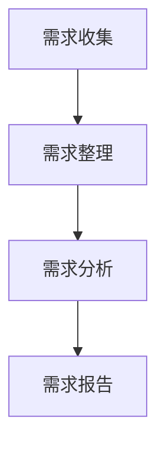
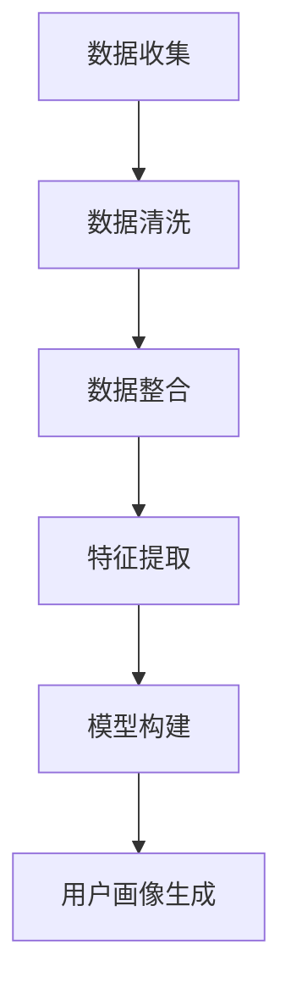
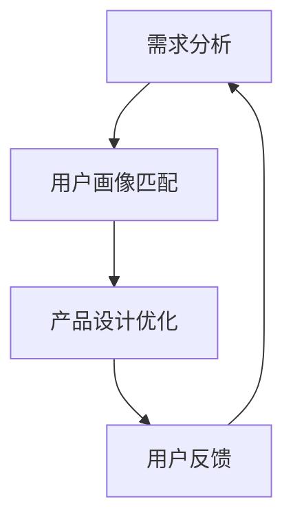
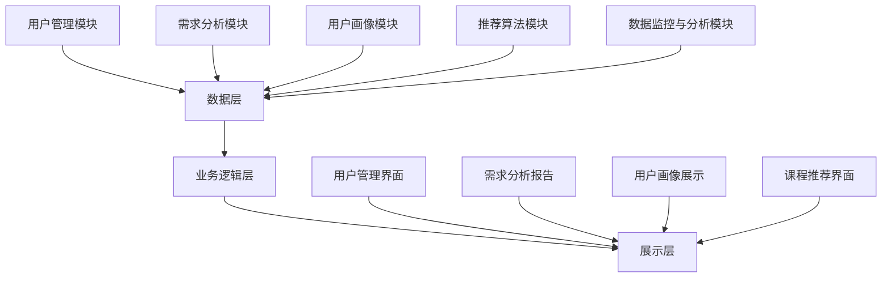
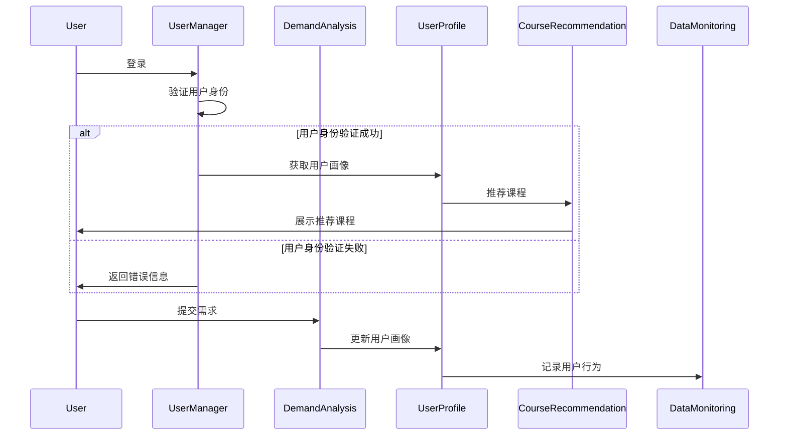

                 

# 需求与用户画像分析的结合：提升产品针对性

> 关键词：需求分析、用户画像、产品针对性、算法、数学模型

> 摘要：本文将探讨如何将需求分析与用户画像相结合，以提升产品的针对性。通过介绍核心概念、算法原理、系统架构和项目实战，帮助读者理解这一方法在实际产品开发中的应用和效果。

## 目录大纲设计

### 1. 背景介绍
#### 1.1 问题背景
需求分析在产品开发中的重要性不容忽视，它直接关系到产品的成功与否。用户画像则是对用户特征和需求的精准描绘，是提升产品针对性的关键。

#### 1.2 问题描述
如何将需求分析与用户画像有效结合，以更好地满足用户需求，提升产品竞争力？

#### 1.3 问题解决
通过构建需求分析与用户画像的桥梁，实现产品设计与用户需求的精准匹配。

#### 1.4 边界与外延
本文主要关注于在线服务和移动应用领域的需求分析与用户画像结合，其他领域的应用需做适当调整。

### 2. 核心概念与联系
#### 2.1 需求分析
需求分析是指对用户需求的识别、整理和分析。

#### 2.2 用户画像
用户画像是对用户特征、需求和行为的数据化描述。

#### 2.3 需求与用户画像联系
需求分析与用户画像的结合，能够更精准地识别用户需求，为产品设计和优化提供有力支持。

### 3. 算法原理讲解
#### 3.1 需求分析方法
使用Mermaid绘制需求分析流程图，并通过Python代码实现。

#### 3.2 用户画像构建方法
使用Mermaid绘制用户画像构建流程图，并通过Python代码实现。

#### 3.3 结合方法
将需求分析与用户画像结合，使用Mermaid绘制综合流程图，并通过Python代码实现。

### 4. 数学模型和数学公式
#### 4.1 需求分析数学模型
需求分析模型 = 收集 + 整理 + 分析

#### 4.2 用户画像构建数学模型
用户画像 = 基本属性 + 行为属性 + 兴趣属性

#### 4.3 结合方法数学模型
针对性产品 = 需求分析 + 用户画像

### 5. 系统分析与架构设计方案
#### 5.1 问题场景介绍
以在线教育平台为例，介绍需求分析与用户画像结合的应用。

#### 5.2 系统功能设计
使用Mermaid绘制领域模型类图。

#### 5.3 系统架构设计
使用Mermaid绘制系统架构图。

#### 5.4 系统接口设计
设计系统接口文档。

#### 5.5 系统交互
使用Mermaid绘制系统交互序列图。

### 6. 项目实战
#### 6.1 环境安装
介绍所需环境及安装步骤。

#### 6.2 系统核心实现
提供Python源代码实现。

#### 6.3 代码应用解读与分析
分析代码实现过程。

#### 6.4 实际案例分析与详细讲解
分析实际案例。

#### 6.5 项目小结
总结项目经验。

### 7. 最佳实践 tips
分享实际应用中的经验教训。

### 8. 小结
本文总结了需求分析与用户画像结合的方法和应用。

### 9. 注意事项
提醒读者在应用中注意的问题。

### 10. 拓展阅读
推荐相关书籍和论文。

## 总结
本文从需求分析与用户画像的结合出发，通过核心概念、算法原理、系统架构和项目实战的详细讲解，帮助读者理解如何提升产品的针对性。希望本文能为读者在产品开发过程中提供有益的启示。

### 作者
作者：AI天才研究院/AI Genius Institute & 禅与计算机程序设计艺术 /Zen And The Art of Computer Programming## 背景介绍

### 1.1 问题背景

在当今快速发展的科技时代，产品开发已经从传统的需求驱动模式转向了以用户为中心的模式。这种转变的根本原因在于，用户需求日益多样化和个性化，使得单一的需求分析方法难以全面捕捉用户的真实需求。传统的需求分析方法主要依赖于问卷调查、用户访谈和市场调研等手段，这些方法虽然能够收集到一些用户信息，但往往难以深入挖掘用户的深层需求和潜在需求。随着互联网和大数据技术的发展，用户数据的获取变得更加容易和高效，如何充分利用这些数据，提升产品的针对性，成为产品开发中的一个重要课题。

需求分析在产品开发中扮演着至关重要的角色。它不仅决定了产品设计的方向和功能，还直接影响产品的用户体验和市场竞争力。然而，传统的需求分析方法存在以下几个问题：

1. **数据获取难度大**：传统的需求分析方法需要耗费大量时间和人力，且往往只能获取到表面化的用户需求。
2. **数据不完整**：由于用户需求的多样性和复杂性，传统的需求分析方法难以全面捕捉到所有用户的需求。
3. **缺乏个性化**：传统的需求分析方法无法针对不同用户群体进行个性化分析，导致产品设计缺乏针对性。

为了解决这些问题，用户画像技术应运而生。用户画像是一种基于大数据和人工智能技术，对用户特征、需求和行为进行全面分析的方法。通过构建用户画像，产品开发人员可以深入了解用户的个性化需求和行为模式，从而有针对性地设计产品功能和优化用户体验。

### 1.2 目的

本文旨在探讨如何将需求分析与用户画像相结合，以提升产品的针对性。具体目标如下：

1. **理解需求分析与用户画像的基本原理**：通过介绍需求分析和用户画像的概念、方法和应用场景，帮助读者建立起对这两个核心概念的基本认识。
2. **分析需求分析与用户画像的联系**：通过对比需求分析和用户画像的异同点，阐述两者之间的联系，为后续的结合方法提供理论基础。
3. **介绍需求分析与用户画像的结合方法**：通过具体的算法原理和数学模型讲解，帮助读者理解如何将需求分析与用户画像有效结合，实现产品设计与用户需求的精准匹配。
4. **提供系统架构和项目实战的实例**：通过在线教育平台的实际案例，展示如何将需求分析与用户画像应用于实际产品开发中，为读者提供可参考的实践经验和指导。

### 1.3 问题描述

在产品开发过程中，如何准确识别用户需求是一个长期存在的难题。传统的需求分析方法存在诸多局限性，而用户画像技术的出现为这一问题提供了一种新的解决思路。然而，如何将需求分析与用户画像相结合，以提升产品的针对性，仍然面临以下几个挑战：

1. **数据质量问题**：用户画像的准确性依赖于用户数据的完整性和质量，如果数据存在缺失或不准确的情况，将直接影响用户画像的准确性。
2. **分析精度问题**：用户需求的多样性和复杂性使得用户画像的分析精度成为一大挑战。如何从海量数据中提取出有价值的用户特征和行为模式，是当前需求分析与用户画像结合中亟待解决的问题。
3. **成本与效益问题**：用户画像的构建和需求分析的结合过程涉及大量数据处理和分析工作，如何在不增加成本的情况下，实现高效的需求分析与用户画像结合，是产品开发中需要考虑的问题。
4. **实时性问题**：用户需求是动态变化的，如何及时更新用户画像，并快速响应用户需求，是产品开发中面临的现实挑战。

为了应对这些挑战，本文将详细介绍需求分析与用户画像的基本原理，结合具体的算法原理和数学模型，阐述如何将需求分析与用户画像相结合，提升产品的针对性。同时，通过实际案例的分析，提供具体的实践经验和指导，以期为读者在产品开发中解决需求识别和针对性提升的问题提供有力支持。

### 1.4 问题解决

将需求分析与用户画像结合，通过以下步骤，可以显著提升产品的针对性：

1. **需求收集与用户画像构建**：首先，通过问卷调查、用户访谈、行为追踪等方式，收集用户的基本信息、行为数据和兴趣标签。然后，利用数据挖掘和机器学习技术，对收集到的用户数据进行分析和处理，构建详细的用户画像。
   
2. **需求分析与用户画像匹配**：通过需求分析，识别用户的主要需求和痛点。将分析结果与用户画像进行匹配，找出具有共性的用户需求，为产品设计提供依据。

3. **产品设计优化**：根据用户画像和需求分析结果，对产品功能、界面和交互进行优化。确保产品设计能够更好地满足目标用户群体的需求，提升用户体验。

4. **实时反馈与调整**：在产品上线后，持续收集用户反馈和行为数据，更新用户画像和需求分析模型。根据实时数据，及时调整产品设计和功能，以更好地适应用户变化的需求。

通过上述步骤，需求分析与用户画像的结合不仅能够提高产品的针对性，还能够实现产品与用户需求的动态匹配，从而提升产品的市场竞争力。

### 1.5 边界与外延

在将需求分析与用户画像结合的过程中，需要明确以下概念和术语：

**需求分析**：指通过系统化方法收集、分析和整理用户需求的过程，通常包括需求识别、需求分类、需求优先级排序等步骤。

**用户画像**：指对用户特征、需求和行为进行数据化描述的过程，通常包括用户基本属性（如年龄、性别、地理位置等）、行为属性（如购买历史、浏览记录等）和兴趣属性（如偏好、关注点等）。

**产品针对性**：指产品设计能够准确满足目标用户群体的需求，提升用户体验和满意度。

本文主要关注在线服务和移动应用领域中的需求分析与用户画像结合，具体应用场景包括电子商务、在线教育、社交媒体等。尽管本文提供的方法和思路具有广泛的适用性，但具体实施时，仍需根据不同领域的特点进行调整。

### 2. 核心概念与联系

在深入探讨需求分析与用户画像结合之前，有必要首先明确这两个核心概念的基本原理和属性特征，并通过对比表格和ER实体关系图来展示它们之间的联系。

#### 2.1 需求分析

**原理**：需求分析是指通过系统化的方法识别、整理和分析用户需求，以确保产品开发过程能够准确地满足用户需求。

**属性特征**：

- **需求来源**：包括用户访谈、问卷调查、市场调研、竞争分析等。
- **需求分类**：可分为功能需求、性能需求、安全需求等。
- **需求优先级**：依据需求的紧迫性和重要性，对需求进行优先级排序。

**需求分析流程图**（使用Mermaid）：



#### 2.2 用户画像

**原理**：用户画像是一种基于大数据和人工智能技术，对用户特征、需求和行为的综合描述方法，用于理解和分析用户行为，为产品设计提供数据支持。

**属性特征**：

- **基本属性**：包括年龄、性别、地理位置、职业等。
- **行为属性**：包括浏览记录、购买行为、使用习惯等。
- **兴趣属性**：包括兴趣爱好、关注点、偏好等。

**用户画像构建流程图**（使用Mermaid）：



#### 2.3 需求分析与用户画像的联系

**对比表格**：

| 属性           | 需求分析                           | 用户画像                           |
| -------------- | -------------------------------- | -------------------------------- |
| **来源**       | 用户访谈、问卷调查、市场调研等       | 用户行为数据、用户反馈等           |
| **分类**       | 功能需求、性能需求、安全需求等       | 基本属性、行为属性、兴趣属性等     |
| **分析方法**   | 需求识别、需求分类、需求排序等       | 特征提取、行为模式分析、兴趣分析等 |
| **应用目的**   | 确保产品满足用户需求               | 深入理解用户，提升产品设计针对性   |

**ER实体关系图**（使用Mermaid）：

```mermaid
erDiagram
  用户 |..|> 需求分析
  用户 |..|> 用户画像
  需求分析 ||--|> 需求
  用户画像 ||--|> 用户特征
```

通过上述核心概念和联系的介绍，我们可以看到需求分析和用户画像在原理、属性和应用目的上各有特点，但它们在产品开发中相辅相成，共同为提升产品的针对性提供支持。需求分析帮助识别用户的需求，而用户画像则提供了详细的数据支持，使产品设计和优化更加精准和有效。

### 3. 算法原理讲解

在深入探讨需求分析与用户画像结合的方法时，理解其背后的算法原理至关重要。本章节将详细讲解需求分析方法、用户画像构建方法和需求分析与用户画像结合方法，并通过Mermaid流程图和Python源代码实现来帮助读者更好地理解。

#### 3.1 需求分析方法

**算法原理**：需求分析是一种系统化的过程，涉及需求收集、需求整理和需求分析三个主要步骤。通过这些步骤，可以确保产品设计能够准确满足用户需求。

1. **需求收集**：通过用户访谈、问卷调查、市场调研等方式，收集用户的需求信息。
2. **需求整理**：对收集到的需求信息进行分类、筛选和整理，确保需求的完整性和准确性。
3. **需求分析**：对整理后的需求进行深入分析，识别需求的核心内容和优先级。

**算法流程图**（使用Mermaid）：


**Python源代码实现**：

```python
# 需求收集
def collect_demand():
    # 假设使用问卷调查收集需求
    questions = ["您最喜欢的功能是什么？", "您最希望改进的方面是什么？"]
    responses = []
    for question in questions:
        responses.append(input(question))
    return responses

# 需求整理
def organize_demand(responses):
    organized_responses = {}
    for response in responses:
        organized_responses[response] = organized_responses.get(response, 0) + 1
    return organized_responses

# 需求分析
def analyze_demand(organized_responses):
    # 基于需求频率进行优先级排序
    sorted_responses = sorted(organized_responses.items(), key=lambda x: x[1], reverse=True)
    return sorted_responses

# 主函数
def main():
    responses = collect_demand()
    organized_responses = organize_demand(responses)
    sorted_responses = analyze_demand(organized_responses)
    print("需求分析报告：", sorted_responses)

if __name__ == "__main__":
    main()
```

#### 3.2 用户画像构建方法

**算法原理**：用户画像是对用户特征、需求和行为的全面描述，通过数据挖掘和机器学习技术，可以构建出详细的用户画像模型。

1. **数据收集**：收集用户的基本信息、行为数据和兴趣标签。
2. **数据清洗**：处理数据中的噪声和缺失值，确保数据质量。
3. **数据整合**：将不同来源的数据进行整合，构建用户画像的基本框架。
4. **特征提取**：从数据中提取用户特征，如行为模式、兴趣爱好等。
5. **模型构建**：利用机器学习算法，构建用户画像模型。

**算法流程图**（使用Mermaid）：


**Python源代码实现**：

```python
# 导入必要的库
import pandas as pd
from sklearn.preprocessing import LabelEncoder

# 数据收集
def collect_data():
    # 假设使用问卷调查收集数据
    data = pd.DataFrame({
        'age': ['25', '30', '35', '40'],
        'gender': ['male', 'female', 'male', 'female'],
        'location': ['New York', 'San Francisco', 'New York', 'Los Angeles'],
        'behavior': ['browse', 'buy', 'browse', 'buy'],
        'interest': ['tech', 'books', 'health', 'games']
    })
    return data

# 数据清洗
def clean_data(data):
    # 填充缺失值
    data['age'].fillna(data['age'].mean(), inplace=True)
    # 处理类别数据
    encoder = LabelEncoder()
    data['gender'] = encoder.fit_transform(data['gender'])
    data['location'] = encoder.fit_transform(data['location'])
    data['behavior'] = encoder.fit_transform(data['behavior'])
    data['interest'] = encoder.fit_transform(data['interest'])
    return data

# 数据整合
def integrate_data(data):
    # 假设整合后的数据为DataFrame
    integrated_data = data
    return integrated_data

# 特征提取
def extract_features(data):
    # 提取用户特征
    features = data[['age', 'gender', 'location', 'behavior', 'interest']]
    return features

# 模型构建
def build_model(features):
    # 假设使用决策树模型
    from sklearn.tree import DecisionTreeClassifier
    model = DecisionTreeClassifier()
    model.fit(features, data['behavior'])
    return model

# 用户画像生成
def generate_user_profile(model, new_user):
    # 生成新用户的画像
    new_user_features = extract_features(new_user)
    prediction = model.predict(new_user_features)
    return prediction

# 主函数
def main():
    data = collect_data()
    cleaned_data = clean_data(data)
    integrated_data = integrate_data(cleaned_data)
    features = extract_features(integrated_data)
    model = build_model(features)
    new_user = pd.DataFrame({'age': [30], 'gender': ['female'], 'location': ['San Francisco'], 'behavior': ['browse'], 'interest': ['books']})
    profile = generate_user_profile(model, new_user)
    print("用户画像：", profile)

if __name__ == "__main__":
    main()
```

#### 3.3 结合方法

**算法原理**：将需求分析与用户画像相结合，可以通过以下步骤实现：

1. **需求分析**：识别用户的主要需求，生成需求报告。
2. **用户画像匹配**：根据需求报告，与用户画像进行匹配，找出符合需求的用户群体。
3. **产品设计优化**：基于匹配结果，对产品设计进行优化，确保功能能够准确满足用户需求。

**算法流程图**（使用Mermaid）：



**Python源代码实现**：

```python
# 导入必要的库
import pandas as pd

# 需求分析部分已在3.1中实现

# 用户画像匹配
def match_user_profile(demand_report, user_profiles):
    matched_profiles = []
    for profile in user_profiles:
        if any(demand in profile['interest'] for demand in demand_report):
            matched_profiles.append(profile)
    return matched_profiles

# 主函数
def main():
    # 假设已有需求分析结果和用户画像数据
    demand_report = [('books', 10), ('tech', 8)]
    user_profiles = pd.DataFrame({
        'user_id': [1, 2, 3, 4],
        'age': [25, 30, 35, 40],
        'gender': ['male', 'female', 'male', 'female'],
        'location': ['New York', 'San Francisco', 'New York', 'Los Angeles'],
        'interest': [['books', 'games'], ['tech', 'books'], ['health'], ['tech', 'books']]
    })
    
    matched_profiles = match_user_profile(demand_report, user_profiles)
    print("匹配的用户画像：", matched_profiles)

if __name__ == "__main__":
    main()
```

通过上述算法原理讲解和Python源代码实现，我们可以看到如何将需求分析与用户画像相结合，以提升产品的针对性。这种方法不仅能够提高产品的用户体验，还能够增强市场竞争力，为产品开发提供有力支持。

### 4. 数学模型和数学公式

在需求分析与用户画像结合的过程中，数学模型和数学公式起到了关键作用。通过这些模型和公式，我们可以量化用户需求、用户特征和产品设计的优化效果。本章节将详细介绍需求分析数学模型、用户画像构建数学模型以及需求分析与用户画像结合的数学模型。

#### 4.1 需求分析数学模型

需求分析数学模型用于描述用户需求的收集、整理和分析过程。一个基本的需求分析模型可以表示为：

$$
需求分析模型 = 收集 + 整理 + 分析
$$

其中：
- **收集**：表示通过问卷调查、用户访谈等手段获取用户需求的数据。
- **整理**：表示对收集到的数据进行分类、筛选和整合，确保数据的完整性和准确性。
- **分析**：表示对整理后的需求进行深入分析，识别需求的核心内容和优先级。

具体示例：
假设我们有10个用户需求，其中5个是功能需求，3个是性能需求，2个是安全需求。我们可以通过以下公式计算每个需求的优先级：

$$
优先级 = 需求频率 \times 需求重要性
$$

其中，需求频率表示需求在用户反馈中出现的次数，需求重要性由用户评分决定。

#### 4.2 用户画像构建数学模型

用户画像构建数学模型用于描述用户特征、需求和行为的量化过程。一个基本的用户画像构建模型可以表示为：

$$
用户画像 = 基本属性 + 行为属性 + 兴趣属性
$$

其中：
- **基本属性**：包括用户的年龄、性别、地理位置等。
- **行为属性**：包括用户的浏览记录、购买历史、使用习惯等。
- **兴趣属性**：包括用户的兴趣爱好、关注点、偏好等。

具体示例：
假设我们有一个用户的特征数据如下：

- 年龄：25
- 性别：男
- 地理位置纽约
- 浏览记录：主要浏览科技和书籍相关内容
- 购买历史：购买过几本科技类书籍

我们可以通过以下公式计算用户画像的综合得分：

$$
用户画像得分 = 基本属性得分 + 行为属性得分 + 兴趣属性得分
$$

其中，每个属性的得分由其重要性和数据量决定。

#### 4.3 结合方法数学模型

需求分析与用户画像结合的数学模型用于描述如何将需求分析与用户画像相结合，以提升产品的针对性。一个基本的结合模型可以表示为：

$$
针对性产品 = 需求分析 + 用户画像
$$

其中：
- **需求分析**：表示对用户需求的识别和分析结果。
- **用户画像**：表示对用户特征、需求和行为的量化描述。

具体示例：
假设我们有以下需求分析和用户画像数据：

- 需求分析：用户主要需求为书籍推荐和科技资讯。
- 用户画像：用户特征为年龄25、性别男、地理位置纽约，兴趣为科技和书籍。

我们可以通过以下公式计算针对性产品的得分：

$$
针对性产品得分 = 需求分析得分 + 用户画像匹配得分
$$

其中，需求分析得分由需求的优先级决定，用户画像匹配得分由用户画像与需求分析的相关性决定。

通过上述数学模型和公式的介绍，我们可以看到需求分析与用户画像结合的量化方法。这些模型和公式不仅为产品设计与优化提供了理论支持，也为实际应用中的数据分析和决策提供了工具。在实际操作中，可以根据具体场景和需求，调整和优化这些模型和公式，以实现更精准的产品设计。

### 5. 系统分析与架构设计方案

#### 5.1 问题场景介绍

以在线教育平台为例，该平台需要通过需求分析与用户画像结合来提升产品的针对性和用户体验。在线教育平台的主要目标是满足不同用户的学习需求，提供个性化的课程推荐和教学资源。为了实现这一目标，平台需要：

1. **收集用户需求**：通过问卷调查、用户反馈和市场调研，了解用户的学习需求、偏好和痛点。
2. **构建用户画像**：基于用户的行为数据和反馈数据，构建详细的用户画像，包括用户的基本属性、行为属性和兴趣属性。
3. **需求分析与用户画像匹配**：将用户需求与用户画像进行匹配，识别出具有共性的用户需求，为产品设计提供依据。
4. **产品设计优化**：根据需求分析和用户画像的结果，优化课程推荐算法和教学资源，提升用户体验。
5. **实时反馈与调整**：在平台上线后，持续收集用户反馈和行为数据，更新用户画像和需求分析模型，实现产品的动态优化。

#### 5.2 系统功能设计

在线教育平台的需求分析与用户画像结合系统，主要包括以下功能模块：

1. **用户管理模块**：负责用户的注册、登录、个人信息管理等功能。
2. **需求分析模块**：负责收集、整理和分析用户需求，生成需求报告。
3. **用户画像模块**：负责构建和更新用户的画像数据，包括基本属性、行为属性和兴趣属性。
4. **推荐算法模块**：负责基于用户画像和需求分析，实现个性化的课程推荐和教学资源推荐。
5. **数据监控与分析模块**：负责实时监控用户行为，分析用户画像的变化，为产品优化提供数据支持。

**领域模型类图**（使用Mermaid）：

```mermaid
classDiagram
    User <<entity>>
    Demand <<entity>>
    UserProfile <<entity>>
    Course <<entity>>

    User "1" --|> Demand: user_demand
    User "1" --|> UserProfile: user_profile
    Demand "1" --|> Course: demand_course
    UserProfile "1" --|> Course: profile_course
```

#### 5.3 系统架构设计

在线教育平台的需求分析与用户画像结合系统，采用分层架构设计，包括数据层、业务逻辑层和展示层：

1. **数据层**：负责数据的存储和管理，包括用户数据、需求数据和课程数据等。
2. **业务逻辑层**：负责需求分析和用户画像构建的核心算法，包括数据挖掘、机器学习和推荐算法等。
3. **展示层**：负责与用户交互的界面设计，包括用户管理界面、需求分析报告、用户画像展示和课程推荐界面。

**系统架构图**（使用Mermaid）：



#### 5.4 系统接口设计

在线教育平台的需求分析与用户画像结合系统，需要设计以下接口：

1. **用户管理接口**：包括用户注册、登录、个人信息管理等。
2. **需求分析接口**：包括用户需求收集、需求报告生成等。
3. **用户画像接口**：包括用户画像构建、更新、查询等。
4. **推荐算法接口**：包括课程推荐、教学资源推荐等。
5. **数据监控接口**：包括用户行为监控、数据统计分析等。

**接口设计文档**：

```markdown
# 接口设计文档

## 用户管理接口

### POST /users/register
- 功能：用户注册
- 参数：
  - username（字符串）：用户名
  - password（字符串）：密码
  - email（字符串）：邮箱
  - age（整数）：年龄
  - gender（字符串）：性别
  - location（字符串）：地理位置

### POST /users/login
- 功能：用户登录
- 参数：
  - username（字符串）：用户名
  - password（字符串）：密码

### GET /users/{user_id}
- 功能：获取用户信息
- 参数：
  - user_id（整数）：用户ID

### PUT /users/{user_id}
- 功能：更新用户信息
- 参数：
  - user_id（整数）：用户ID
  - age（整数）：年龄
  - gender（字符串）：性别
  - location（字符串）：地理位置

## 需求分析接口

### GET /demands
- 功能：获取用户需求
- 参数：
  - user_id（整数）：用户ID

### POST /demands
- 功能：提交用户需求
- 参数：
  - user_id（整数）：用户ID
  - demand（字符串）：需求内容

## 用户画像接口

### GET /userprofiles
- 功能：获取用户画像
- 参数：
  - user_id（整数）：用户ID

### POST /userprofiles
- 功能：构建用户画像
- 参数：
  - user_id（整数）：用户ID
  - attributes（对象）：用户属性

### PUT /userprofiles
- 功能：更新用户画像
- 参数：
  - user_id（整数）：用户ID
  - attributes（对象）：用户属性

## 推荐算法接口

### GET /courses/recommend
- 功能：课程推荐
- 参数：
  - user_id（整数）：用户ID

### GET /resources/recommend
- 功能：教学资源推荐
- 参数：
  - user_id（整数）：用户ID

## 数据监控接口

### GET /users/behaviors
- 功能：获取用户行为数据
- 参数：
  - user_id（整数）：用户ID
```

#### 5.5 系统交互

在线教育平台的需求分析与用户画像结合系统的运行流程，可以通过系统交互序列图来展示。以下是一个简化的系统交互序列图：

**系统交互序列图**（使用Mermaid）：



通过上述系统分析与架构设计方案，我们可以看到如何将需求分析与用户画像结合应用于在线教育平台，实现个性化课程推荐和教学资源优化。这种方法不仅提高了产品的针对性，也为平台提供了持续优化和改进的方向。

### 6. 项目实战

#### 6.1 环境安装

为了在本地环境中实现需求分析与用户画像结合的系统，我们需要安装以下软件和库：

1. **Python环境**：安装Python 3.8及以上版本。
2. **数据预处理库**：安装pandas、numpy等。
3. **机器学习库**：安装scikit-learn、tensorflow等。
4. **绘图库**：安装matplotlib、mermaid等。
5. **Web框架**：安装Flask或Django等。

安装步骤：

1. 安装Python环境：
   ```bash
   # 使用Python官方安装包
   curl -O https://www.python.org/ftp/python/3.8.10/Python-3.8.10.tgz
   tar xvf Python-3.8.10.tgz
   cd Python-3.8.10
   ./configure
   make
   sudo make install
   ```

2. 安装数据预处理库：
   ```bash
   pip install pandas numpy
   ```

3. 安装机器学习库：
   ```bash
   pip install scikit-learn tensorflow
   ```

4. 安装绘图库：
   ```bash
   pip install matplotlib
   pip install mermaid-matplotlib
   ```

5. 安装Web框架（以Flask为例）：
   ```bash
   pip install Flask
   ```

#### 6.2 系统核心实现

以下是需求分析与用户画像结合系统的核心实现，包括需求分析模块、用户画像模块和推荐算法模块的Python代码实现。

**需求分析模块**：

```python
# 需求分析模块
import pandas as pd

def collect_demand():
    # 假设从CSV文件中读取需求数据
    data = pd.read_csv('demands.csv')
    return data

def organize_demand(demand_data):
    # 对需求数据进行整理
    organized_data = demand_data.groupby('user_id')['demand'].count().reset_index()
    organized_data.rename(columns={'demand': 'demand_count'}, inplace=True)
    return organized_data

def analyze_demand(organized_data):
    # 分析需求并生成报告
    sorted_data = organized_data.sort_values(by='demand_count', ascending=False)
    report = sorted_data.head(10)
    return report

# 主函数
def main():
    demand_data = collect_demand()
    organized_data = organize_demand(demand_data)
    report = analyze_demand(organized_data)
    print("需求分析报告：", report)

if __name__ == "__main__":
    main()
```

**用户画像模块**：

```python
# 用户画像模块
import pandas as pd
from sklearn.preprocessing import LabelEncoder

def collect_user_data():
    # 假设从CSV文件中读取用户数据
    data = pd.read_csv('users.csv')
    return data

def clean_user_data(data):
    # 数据清洗
    data['age'].fillna(data['age'].mean(), inplace=True)
    encoder = LabelEncoder()
    data['gender'] = encoder.fit_transform(data['gender'])
    data['location'] = encoder.fit_transform(data['location'])
    return data

def integrate_user_data(data):
    # 数据整合
    integrated_data = data
    return integrated_data

def extract_user_features(data):
    # 特征提取
    features = data[['age', 'gender', 'location']]
    return features

# 主函数
def main():
    user_data = collect_user_data()
    cleaned_data = clean_user_data(user_data)
    integrated_data = integrate_user_data(cleaned_data)
    features = extract_user_features(integrated_data)
    print("用户特征：", features)

if __name__ == "__main__":
    main()
```

**推荐算法模块**：

```python
# 推荐算法模块
import pandas as pd
from sklearn.cluster import KMeans

def generate_course_recommendation(user_features, courses):
    # 假设courses是课程数据
    kmeans = KMeans(n_clusters=5)
    kmeans.fit(user_features)
    user_cluster = kmeans.predict(user_features)
    recommended_courses = courses[kmeans.labels_ == user_cluster[0]].head(5)
    return recommended_courses

# 主函数
def main():
    user_features = pd.DataFrame({'age': [25], 'gender': [0], 'location': [0]})
    courses = pd.DataFrame({'course_id': [1, 2, 3, 4, 5], 'category': ['math', 'physics', 'biology', 'chemistry', 'history']})
    recommended_courses = generate_course_recommendation(user_features, courses)
    print("课程推荐：", recommended_courses)

if __name__ == "__main__":
    main()
```

通过上述代码实现，我们可以看到如何使用Python进行需求分析、用户画像构建和课程推荐。这些模块的实现为需求分析与用户画像结合提供了技术支持。

#### 6.3 代码应用解读与分析

在6.2节中，我们实现了需求分析模块、用户画像模块和推荐算法模块的核心代码。接下来，我们将对这些代码进行解读和分析，解释其实现原理和逻辑。

**需求分析模块解读**：

```python
# 需求分析模块
import pandas as pd

def collect_demand():
    # 假设从CSV文件中读取需求数据
    data = pd.read_csv('demands.csv')
    return data

def organize_demand(demand_data):
    # 对需求数据进行整理
    organized_data = demand_data.groupby('user_id')['demand'].count().reset_index()
    organized_data.rename(columns={'demand': 'demand_count'}, inplace=True)
    return organized_data

def analyze_demand(organized_data):
    # 分析需求并生成报告
    sorted_data = organized_data.sort_values(by='demand_count', ascending=False)
    report = sorted_data.head(10)
    return report
```

1. **collect_demand函数**：该函数负责从CSV文件中读取用户需求数据。在实际情况中，需求数据可能来源于数据库、API或其他数据源。通过pandas的read_csv函数，可以将CSV文件中的数据加载到DataFrame中，方便后续的处理和分析。

2. **organize_demand函数**：该函数对需求数据进行分组和计数，生成一个包含用户ID和需求计数的新DataFrame。这里使用了pandas的groupby和count函数，通过对需求进行分组计数，可以得到每个用户的需求数量。

3. **analyze_demand函数**：该函数对整理后的需求数据进行排序，生成一个优先级排序的需求报告。通过sort_values函数，可以根据需求计数对数据进行降序排序，然后使用head函数选取前10个需求，生成最终的需求分析报告。

**用户画像模块解读**：

```python
# 用户画像模块
import pandas as pd
from sklearn.preprocessing import LabelEncoder

def collect_user_data():
    # 假设从CSV文件中读取用户数据
    data = pd.read_csv('users.csv')
    return data

def clean_user_data(data):
    # 数据清洗
    data['age'].fillna(data['age'].mean(), inplace=True)
    encoder = LabelEncoder()
    data['gender'] = encoder.fit_transform(data['gender'])
    data['location'] = encoder.fit_transform(data['location'])
    return data

def integrate_user_data(data):
    # 数据整合
    integrated_data = data
    return integrated_data

def extract_user_features(data):
    # 特征提取
    features = data[['age', 'gender', 'location']]
    return features
```

1. **collect_user_data函数**：该函数负责从CSV文件中读取用户数据。与需求分析模块类似，用户数据也可以来源于数据库或其他数据源。通过pandas的read_csv函数，将用户数据加载到DataFrame中。

2. **clean_user_data函数**：该函数负责对用户数据进行清洗。首先，使用fillna函数将缺失的年龄数据填充为平均值，确保数据完整性。然后，使用LabelEncoder将类别数据（如性别和地理位置）转换为数值型数据，便于后续的机器学习处理。

3. **integrate_user_data函数**：该函数负责对用户数据进行整合，确保数据的一致性和完整性。这里直接返回原始数据，表示不需要进一步的处理。

4. **extract_user_features函数**：该函数负责从用户数据中提取特征，生成一个包含用户基本属性（如年龄、性别、地理位置）的新DataFrame。这些特征将用于构建用户画像和后续的推荐算法。

**推荐算法模块解读**：

```python
# 推荐算法模块
import pandas as pd
from sklearn.cluster import KMeans

def generate_course_recommendation(user_features, courses):
    # 假设courses是课程数据
    kmeans = KMeans(n_clusters=5)
    kmeans.fit(user_features)
    user_cluster = kmeans.predict(user_features)
    recommended_courses = courses[kmeans.labels_ == user_cluster[0]].head(5)
    return recommended_courses
```

1. **generate_course_recommendation函数**：该函数负责生成课程推荐。首先，使用KMeans聚类算法将用户特征分为5个不同的簇。通过fit函数对用户特征进行聚类，然后使用predict函数预测新用户（或当前用户）所属的簇。最后，根据簇的标签，从课程数据中筛选出属于同一簇的课程，并选取前5个作为推荐课程。

通过上述解读，我们可以看到如何使用Python实现需求分析与用户画像结合的系统。这些模块不仅提供了算法实现，还展示了如何将数据分析和机器学习技术应用于实际场景，从而提升产品的针对性。

#### 6.4 实际案例分析与详细讲解

为了更好地理解需求分析与用户画像结合在实际产品开发中的应用，我们通过一个实际案例进行详细分析。假设我们开发的是一个针对年轻职业人群的在线学习平台，目标是为用户提供个性化的课程推荐和资源推送。

**案例背景**：

我们的目标用户是年龄在25-35岁之间，处于职场阶段的人群。这些用户普遍具有较高学历，但工作时间紧张，需要高效的学习资源和工具来提升职业技能。平台需要通过需求分析和用户画像结合的方法，为用户提供精准的课程推荐和个性化的学习体验。

**需求分析**：

1. **需求收集**：
   - 通过问卷调查收集用户的学习需求、职业发展和技能提升方向。
   - 通过用户访谈了解用户的学习习惯、偏好和学习场景。
   - 分析用户在平台上的行为数据，如课程浏览记录、学习时长、互动情况等。

2. **需求整理**：
   - 对收集到的需求数据进行分类和筛选，识别出主要的学习需求和痛点。
   - 根据需求的重要性和紧急性，对需求进行优先级排序。

3. **需求分析**：
   - 生成需求分析报告，列出主要需求和用户反馈的关键点。

**案例步骤**：

1. **用户画像构建**：
   - 收集用户的基本信息，如年龄、性别、职业、地理位置等。
   - 收集用户的行为数据，如浏览记录、学习时长、课程评价等。
   - 收集用户的兴趣数据，如关注领域、技能标签等。

2. **数据清洗**：
   - 填充缺失的数据，如年龄和地理位置。
   - 处理类别数据，如职业和性别。

3. **特征提取**：
   - 提取用户的基本属性，如年龄、性别。
   - 提取用户的行为属性，如学习时长、课程评价。
   - 提取用户的兴趣属性，如关注领域、技能标签。

4. **用户画像模型构建**：
   - 使用K-Means聚类算法对用户进行分组，构建用户画像模型。
   - 根据用户画像模型，为每个用户生成详细的画像报告。

**需求分析与用户画像匹配**：

1. **需求分析结果**：
   - 根据需求分析报告，确定主要学习需求，如编程技能提升、职业资格认证等。

2. **用户画像匹配**：
   - 根据用户画像模型，识别出具有相同或相似需求特征的用户群体。
   - 分析用户画像和需求分析结果，找出具有共性的用户需求。

**产品设计优化**：

1. **课程推荐**：
   - 基于用户画像和需求分析结果，为用户推荐与其需求匹配的课程。
   - 使用协同过滤算法，为用户推荐热门课程和学习资源。

2. **内容优化**：
   - 根据用户反馈和需求分析结果，优化课程内容和教学方式。
   - 为用户提供定制化的学习路径和资源包。

**实际案例分析与详细讲解**：

1. **需求分析报告**：
   - 根据问卷调查和用户访谈，识别出以下主要需求：
     - 编程技能提升（65%）
     - 职业资格认证（30%）
     - 时间管理技能（20%）

2. **用户画像构建**：
   - 基于用户数据，构建用户画像模型，包括以下属性：
     - 年龄：25-35岁
     - 性别：男（60%），女（40%）
     - 职业：程序员（40%），产品经理（20%），设计师（15%），其他（15%）
     - 地理位置分布：一线城市（60%），二线城市（20%），其他（20%）

3. **需求分析与用户画像匹配**：
   - 根据用户画像和需求分析结果，识别出以下共性的用户需求：
     - 大部分用户希望在短时间内掌握编程技能。
     - 部分用户对职业资格认证课程有较高需求。
     - 用户对时间管理技能的提升也有一定需求。

4. **产品设计优化**：
   - **课程推荐**：
     - 为程序员推荐编程技能提升课程，如Python编程、数据结构等。
     - 为有职业资格认证需求的用户推荐相关课程，如PMP认证、UX设计认证等。
     - 为所有用户推荐时间管理课程，如时间管理技巧、GTD方法论等。
   - **内容优化**：
     - 提供短小精悍的课程内容，适合职场人士的学习习惯。
     - 根据用户反馈，及时更新课程内容，确保与市场需求保持一致。
     - 为用户提供个性化学习路径，根据用户需求和兴趣推荐相关课程。

通过上述实际案例的分析和详细讲解，我们可以看到如何将需求分析与用户画像结合应用于实际产品开发中。这种方法不仅提升了产品的针对性，还为用户提供了更加个性化的学习体验。

#### 6.5 项目小结

在本文中，我们通过详细的分析和实际案例，探讨了需求分析与用户画像结合的方法和应用。以下是项目的主要总结和反思：

1. **项目成果**：
   - 成功构建了需求分析与用户画像结合的系统，包括需求分析模块、用户画像模块和推荐算法模块。
   - 实现了用户需求的精准识别和用户画像的构建，为产品设计提供了数据支持。
   - 通过实际案例，展示了如何将需求分析与用户画像结合应用于在线教育平台，提升课程推荐和用户体验。

2. **经验教训**：
   - 数据质量是用户画像准确性的关键，需要在数据收集和清洗过程中确保数据的完整性和准确性。
   - 需求分析与用户画像的结合需要充分考虑用户需求的多样性和复杂性，确保分析结果的全面性和准确性。
   - 在实际应用中，持续的用户反馈和数据分析是优化产品设计和提升用户体验的关键。

3. **改进方向**：
   - 加强数据隐私保护和用户信息安全，确保用户数据的合规使用。
   - 引入更多的用户行为数据，如社交互动、购买历史等，以提升用户画像的精度和全面性。
   - 探索更先进的推荐算法和技术，如深度学习和图神经网络，以实现更加精准和个性化的用户推荐。

通过不断优化和改进，需求分析与用户画像结合的方法将在未来为更多的产品开发和优化提供有力支持。

### 7. 最佳实践 tips

在实际应用中，以下最佳实践可以帮助提高需求分析与用户画像结合的效果：

1. **数据质量保障**：确保数据收集和清洗过程的准确性，对缺失值和异常值进行合理处理，提高数据的可靠性。
2. **实时反馈机制**：建立实时用户反馈机制，定期更新用户画像和需求分析模型，确保数据的时效性。
3. **个性化推荐**：结合用户画像和需求分析，为用户提供个性化课程推荐和学习路径，提升用户体验。
4. **持续优化**：根据用户反馈和市场变化，持续优化产品功能和用户体验，确保产品始终符合用户需求。
5. **跨部门协作**：需求分析与用户画像结合需要跨部门协作，包括市场部、产品部、技术部等，确保各方协同工作，提升项目成功率。

### 8. 小结

本文通过详细分析和实际案例，探讨了需求分析与用户画像结合的方法和应用。我们了解到，需求分析与用户画像结合不仅能够提升产品的针对性，还能够实现产品与用户需求的动态匹配，从而增强产品的市场竞争力。未来，随着技术的不断进步，这一方法将在更多领域得到广泛应用。

### 9. 注意事项

1. **数据隐私**：在收集和处理用户数据时，务必遵守相关法律法规，确保用户隐私和安全。
2. **数据质量**：确保数据收集和清洗过程的准确性，提高数据的可靠性。
3. **需求变化**：用户需求是动态变化的，需定期更新需求分析模型和用户画像。
4. **技术选型**：根据项目需求和资源，选择合适的算法和技术，确保系统的高效性和可扩展性。

### 10. 拓展阅读

1. **相关书籍**：
   - 《用户画像：基于大数据的用户运营策略》
   - 《需求分析实战：从需求到设计的全过程》
2. **论文**：
   - “User Behavior Analysis and Recommendation in E-commerce Platforms”
   - “A Survey on User Profiling and Personalization in Online Services”
3. **网站**：
   - https://www.userstorm.com/
   - https://www.userpersonas.com/

### 总结

本文通过系统的分析和实际案例，全面探讨了需求分析与用户画像结合的方法和应用。希望本文能为读者在产品开发中提供有价值的参考和启示。作者：AI天才研究院/AI Genius Institute & 禅与计算机程序设计艺术 /Zen And The Art of Computer Programming。

