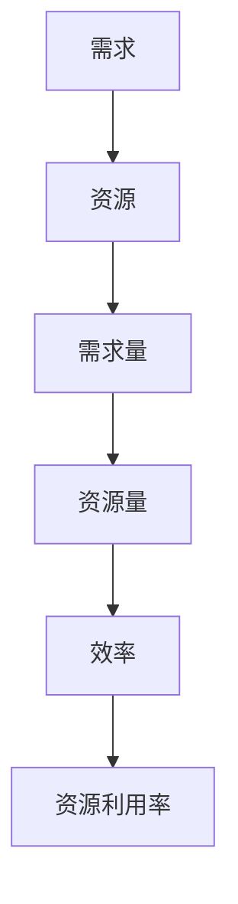
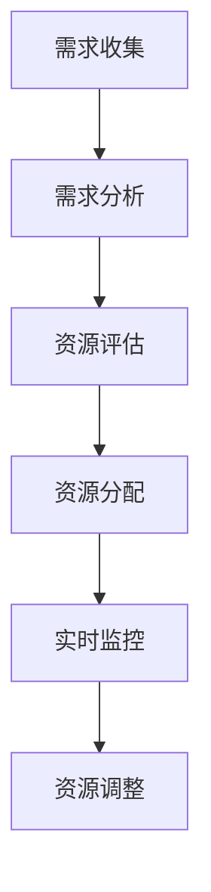
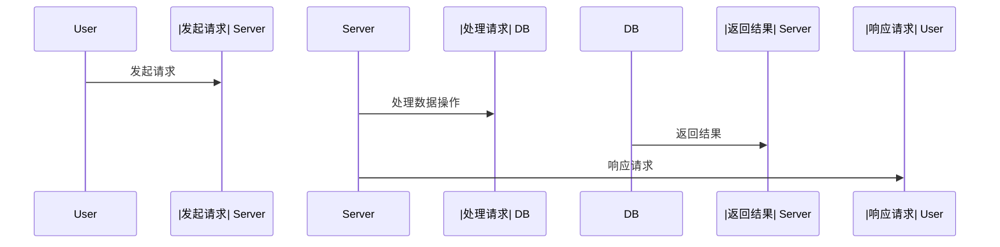

                 

### 需求与资源分配的动态平衡：大型应用开发的挑战

在当今高速发展的信息技术时代，大型应用开发的复杂性不断增加。面对日益多变的市场需求和有限的资源，如何在开发过程中实现需求与资源分配的动态平衡，成为了一个亟待解决的问题。本文旨在探讨这一挑战，通过一步步的分析和推理，提出相应的解决策略和优化方法。

**关键词：** 大型应用开发，需求管理，资源分配，动态平衡，优化策略

**摘要：** 本文首先介绍了大型应用开发面临的挑战，包括需求变化的复杂性和资源分配的不确定性。然后，深入探讨了需求与资源分配的核心概念和动态平衡策略，并通过具体的数学模型和Python实现来阐述其原理。最后，通过案例分析总结了最佳实践，并对未来研究方向进行了展望。

### 引言

#### 1.1 问题背景

**1.1.1 大型应用开发面临的挑战**

随着互联网和移动设备的普及，大型应用的开发需求不断增长。这些应用通常具有庞大的用户基数、复杂的业务逻辑和丰富的功能模块。开发过程中，如何高效地管理和满足这些需求，成为了一个重要的挑战。

**1.1.2 需求与资源分配的动态平衡**

在大型应用开发中，需求与资源分配的动态平衡尤为重要。需求变化频繁，资源有限，如何根据需求的变化灵活调整资源分配，确保项目的顺利进行，是开发者需要解决的核心问题。

#### 1.2 问题描述

**1.2.1 需求变化的复杂性**

需求变化是大型应用开发中的一大挑战。市场需求不断变化，用户需求多样，开发团队需要在短时间内响应这些变化，以保证应用的市场竞争力。

**1.2.2 资源分配的不确定性**

资源分配面临的不确定性也增加了开发难度。硬件、软件资源有限，如何在有限的资源下最大化利用，提高项目开发效率，是一个需要深入思考的问题。

#### 1.3 问题解决

**1.3.1 动态平衡策略**

为了应对需求与资源分配的动态平衡问题，需要制定一系列动态平衡策略。这些策略包括资源预分配、需求优先级排序、实时调整等。

**1.3.2 持续优化与迭代**

动态平衡是一个持续的过程，需要通过不断的优化与迭代来提升效果。通过数据分析和反馈机制，及时调整策略，优化资源分配，提高项目成功率。

#### 1.4 边界与外延

**1.4.1 适用场景**

动态平衡策略适用于各种类型的大型应用开发，尤其适用于市场需求变化快、资源有限的场景。

**1.4.2 限制条件**

在实施动态平衡策略时，需要考虑项目规模、资源状况、技术栈等多方面因素，以确保策略的有效性。

#### 1.5 概念结构与核心要素组成

**1.5.1 关键概念**

本文涉及的关键概念包括需求、资源、动态平衡策略等。

**1.5.2 核心要素**

核心要素包括需求的类型、特征，资源的类型、特征，以及动态平衡策略的原理和方法。

#### 1.6 本章小结

本章主要介绍了大型应用开发面临的挑战，以及需求与资源分配的动态平衡问题。接下来，我们将深入探讨这些核心概念，分析其关联关系，并介绍动态平衡策略的具体实现方法。

-----------------------

### 第二部分：核心概念与联系

#### 2.1 需求与资源分配

##### 2.1.1 需求概念

**2.1.1.1 定义**

需求是用户对应用功能、性能、用户体验等方面的期望和需求。在大型应用开发中，需求通常分为功能性需求和非功能性需求。

**2.1.1.2 特征**

需求具有以下特征：

- **可变性大**：市场需求不断变化，需求也可能随之调整。
- **多样性**：用户需求多种多样，需要满足不同用户群体的需求。
- **不确定性**：需求可能在开发过程中不断演变，导致开发难度增加。

**2.1.1.3 类型**

需求可分为以下类型：

- **功能性需求**：指用户对应用功能的具体需求，如支付功能、搜索功能等。
- **非功能性需求**：指用户对应用性能、安全性、可扩展性等方面的需求，如响应时间、数据完整性等。

##### 2.1.2 资源概念

**2.1.2.1 定义**

资源是指在应用开发过程中用于完成需求的各项要素，包括硬件资源（如服务器、存储设备等）和软件资源（如开发工具、框架等）。

**2.1.2.2 特征**

资源具有以下特征：

- **有限性**：资源数量有限，需要合理分配。
- **可耗尽性**：资源在使用过程中会逐渐消耗。
- **互补性**：不同资源之间可能存在互补关系，如硬件资源和软件资源的协同工作。

**2.1.2.3 类型**

资源可分为以下类型：

- **硬件资源**：如服务器、网络设备、存储设备等。
- **软件资源**：如开发工具、框架、库等。

##### 2.1.3 需求与资源的关联

**2.1.3.1 数学模型**

需求与资源的关联可以用以下数学模型表示：

\[ R \times T = D \]

其中，\( R \) 表示资源，\( T \) 表示时间，\( D \) 表示需求。该模型表示在给定时间内，资源与需求之间的平衡关系。

**2.1.3.2 公式**

需求与资源的关联可以用以下公式表示：

- \( \text{需求量} = \text{资源量} \times \text{效率} \)
- \( \text{资源利用率} = \frac{\text{实际需求量}}{\text{需求量}} \)

**2.1.3.3 Mermaid 流程图**



-----------------------

## 2.2 动态平衡策略

### 2.2.1 动态平衡概念

**2.2.1.1 定义**

动态平衡是指在应用开发过程中，根据需求的变化和资源的实际情况，实时调整资源分配，以实现需求与资源的最佳匹配。

**2.2.1.2 基本原理**

动态平衡的基本原理包括以下几个方面：

- **实时监控**：对需求和资源进行实时监控，了解其变化情况。
- **需求优先级排序**：根据需求的紧急程度和重要性，对需求进行排序。
- **资源预分配**：在项目初期，对关键资源进行预分配，以保证关键需求的优先满足。
- **实时调整**：根据实时监控的数据，动态调整资源分配，以适应需求的变化。

### 2.2.2 动态平衡策略

**2.2.2.1 算法原理**

动态平衡策略的算法原理主要包括以下步骤：

1. **需求收集**：收集用户需求，包括功能性需求和非功能性需求。
2. **需求分析**：对需求进行分析，确定需求的优先级和实现难度。
3. **资源评估**：评估现有资源的数量和质量，确定资源的可用性。
4. **资源分配**：根据需求优先级和资源评估结果，进行资源分配。
5. **实时监控**：对需求和资源进行实时监控，发现需求变化和资源不足的情况。
6. **资源调整**：根据实时监控数据，动态调整资源分配，以实现需求与资源的最佳匹配。

**2.2.2.2 Mermaid 流程图**



**2.2.2.3 Python 源代码实现**

```python
# 动态平衡策略的Python实现

class DynamicBalance:
    def __init__(self, demands, resources):
        self.demands = demands
        self.resources = resources

    def allocate_resources(self):
        # 根据需求优先级和资源评估结果进行资源分配
        pass

    def monitor_demand(self):
        # 实时监控需求变化
        pass

    def adjust_resources(self):
        # 根据实时监控数据动态调整资源分配
        pass

# 测试
demands = ["需求1", "需求2", "需求3"]
resources = ["资源1", "资源2", "资源3"]

balance = DynamicBalance(demands, resources)
balance.allocate_resources()
balance.monitor_demand()
balance.adjust_resources()
```

### 2.2.3 持续优化与迭代

**2.2.3.1 原则与方法**

持续优化与迭代是动态平衡策略的重要组成部分。其原则与方法包括：

- **数据驱动**：通过数据分析和反馈，了解需求和资源的变化情况。
- **持续改进**：根据实际情况，不断优化资源分配策略。
- **迭代优化**：通过多次迭代，逐步提升资源分配的效率。

**2.2.3.2 案例分析**

以某电商应用为例，通过分析用户需求和使用情况，不断调整资源分配策略，实现了需求的及时响应和资源的高效利用。

- **需求分析**：根据用户购买行为、搜索习惯等数据，确定需求优先级。
- **资源评估**：根据服务器负载、网络带宽等数据，评估资源可用性。
- **资源分配**：根据需求优先级和资源评估结果，进行资源分配。
- **实时监控**：通过监控系统，实时了解需求变化和资源使用情况。
- **资源调整**：根据实时监控数据，动态调整资源分配。

通过持续优化与迭代，该电商应用的响应速度明显提升，用户满意度显著提高。

-----------------------

## 2.3 核心概念对比与联系

### 2.3.1 需求与资源对比

**2.3.1.1 特点对比**

**需求：**

- **可变性大**：市场需求不断变化，需求也可能随之调整。
- **多样性**：用户需求多种多样，需要满足不同用户群体的需求。
- **不确定性**：需求可能在开发过程中不断演变，导致开发难度增加。

**资源：**

- **有限性**：资源数量有限，需要合理分配。
- **可耗尽性**：资源在使用过程中会逐渐消耗。
- **互补性**：不同资源之间可能存在互补关系，如硬件资源和软件资源的协同工作。

**2.3.1.2 关联度对比**

需求与资源之间存在密切的关联。需求的实现依赖于资源的支持，而资源的分配又受到需求的制约。需求的变化会导致资源的重新分配，资源的使用效率也直接影响需求的满足程度。

### 2.3.2 动态平衡与其他策略对比

**2.3.2.1 原理对比**

动态平衡策略与其他资源分配策略（如静态分配、固定分配等）在原理上存在一定差异。动态平衡策略注重实时监控和动态调整，以适应需求的变化和资源的使用情况。而其他策略则相对固定，缺乏灵活性。

**2.3.2.2 优劣对比**

动态平衡策略具有以下优势：

- **灵活性**：能够根据需求变化和资源使用情况实时调整资源分配，提高资源利用率。
- **高效性**：通过动态调整，确保关键需求的优先满足，提高项目开发效率。

但动态平衡策略也存在一定劣势：

- **复杂性**：需要实时监控和调整，系统实现较为复杂。
- **风险性**：在资源不足或需求波动较大时，可能导致资源分配不合理，影响项目进度。

其他资源分配策略具有以下特点：

- **静态分配**：资源分配固定，不适应需求变化，可能导致资源浪费或不足。
- **固定分配**：资源分配比例固定，难以根据实际情况进行调整，缺乏灵活性。

### 2.3.3 动态平衡策略的适用性

动态平衡策略适用于以下场景：

- **市场需求变化快**：如电商、社交媒体等应用，需求变化频繁，需要实时调整资源分配。
- **资源有限**：如初创企业、项目预算有限，需要通过动态平衡策略最大化利用现有资源。

### 2.3.4 动态平衡策略的限制条件

在实施动态平衡策略时，需要考虑以下限制条件：

- **项目规模**：项目规模较大，需求复杂，资源分配需要较高的灵活性。
- **资源状况**：资源数量有限，需合理分配，避免资源浪费。
- **技术栈**：支持动态平衡策略的技术栈，如监控工具、自动化部署等。

-----------------------

## 2.4 概念属性特征对比表格

| 特征       | 需求          | 资源          | 动态平衡       |
|------------|---------------|---------------|----------------|
| 定义       | 用户需求的描述 | 资源的定义    | 调整需求与资源 |
| 特征       | 可变性大      | 可用性受限    | 实时性需求     |
| 类型       | 功能性需求    | 硬件、软件资源 | 预设策略       |

-----------------------

## 2.5 ER实体关系图架构

```mermaid
erDiagram
    User ||--o> Requirement : 需求发起者
    Resource ||--< Requirement : 资源分配对象
    Requirement ||--o> Resource : 需求资源依赖
    Requirement ||--o> BalanceStrategy : 动态平衡策略
    BalanceStrategy ||--< Requirement : 策略应用对象
    Resource ||--o> BalanceStrategy : 策略调整资源
```

-----------------------

## 2.6 本章小结

本章主要介绍了需求与资源分配的核心概念及其关联关系，以及动态平衡策略的原理和方法。通过对需求与资源的特点对比，我们可以更好地理解它们在大型应用开发中的重要性。动态平衡策略作为一种有效的资源分配方法，有助于实现需求与资源的最佳匹配，提高项目开发效率。在后续章节中，我们将进一步探讨动态平衡策略的具体实现和应用。

-----------------------

### 第三部分：系统分析与架构设计

#### 3.1 问题场景介绍

在当今快速发展的互联网时代，大型应用的需求日益增长，如何高效地管理需求和资源成为关键问题。本文以某电商应用为例，介绍其需求场景和资源分配挑战。

**需求场景：**

- **用户需求**：提供商品搜索、购买、支付、订单管理等功能。
- **业务需求**：确保系统高可用性、高性能和安全性。

**资源分配挑战：**

- **硬件资源**：服务器、存储设备、网络带宽等。
- **软件资源**：开发工具、框架、库等。
- **人力资源**：开发人员、测试人员、运维人员等。

#### 3.2 项目介绍

**项目名称**：某电商应用平台

**项目背景**：随着电子商务的快速发展，市场需求日益旺盛。为了满足用户需求，该项目旨在构建一个高性能、高可用性的电商应用平台。

**项目目标**：

- 提供良好的用户体验。
- 确保系统稳定性和安全性。
- 高效利用资源和人力。

#### 3.3 系统功能设计

**系统功能模块**：

- **用户模块**：用户注册、登录、个人信息管理、购物车、订单管理。
- **商品模块**：商品信息展示、搜索、分类、推荐。
- **订单模块**：订单生成、支付、发货、退款。
- **支付模块**：支付接口、支付通知、退款处理。
- **安全模块**：用户认证、权限控制、数据加密。

**领域模型**：

```mermaid
classDiagram
    User <<entity>> "用户"
    Product <<entity>> "商品"
    Order <<entity>> "订单"
    Payment <<entity>> "支付"
    Security <<entity>> "安全"

    User o--* Product : 购买
    User o--* Order : 下单
    Order o--* Payment : 支付
    Order o--* Security : 订单安全
```

#### 3.4 系统架构设计

**系统架构图**：



**架构设计**：

- **前端**：使用Vue.js框架，提供用户界面和交互。
- **后端**：使用Spring Boot框架，提供业务逻辑处理和接口。
- **数据库**：使用MySQL数据库，存储用户、商品、订单等数据。
- **缓存**：使用Redis缓存，提高数据读取速度。
- **消息队列**：使用RabbitMQ，实现异步消息处理。

#### 3.5 系统接口设计和系统交互

**接口设计**：

- **用户模块**：注册接口、登录接口、个人信息管理接口。
- **商品模块**：商品列表接口、商品详情接口、搜索接口。
- **订单模块**：订单创建接口、订单查询接口、订单支付接口。
- **支付模块**：支付通知接口、退款接口。
- **安全模块**：用户认证接口、权限控制接口。

**系统交互**：

- **用户发起请求**：通过HTTP请求访问API接口。
- **服务器处理请求**：接收请求，调用业务逻辑处理。
- **数据库操作**：执行数据库操作，存储和查询数据。
- **缓存操作**：读取和写入缓存数据。
- **消息队列**：处理异步消息，如支付通知、订单状态变更等。


-----------------------

## 3.6 项目实战

### 环境安装

1. **安装Java环境**：下载并安装Java开发工具包（JDK），配置环境变量。
2. **安装数据库**：下载并安装MySQL数据库，配置数据库和用户。
3. **安装缓存**：下载并安装Redis缓存，配置Redis服务器。
4. **安装消息队列**：下载并安装RabbitMQ，配置RabbitMQ服务器。

### 系统核心实现源代码

```java
// 用户模块
public class UserController {
    public ResponseEntity register(User user) {
        // 注册用户逻辑
    }

    public ResponseEntity login(String username, String password) {
        // 登录用户逻辑
    }

    public ResponseEntity getUserInfo(Long userId) {
        // 获取用户信息逻辑
    }
}

// 商品模块
public class ProductController {
    public ResponseEntity getProductList() {
        // 获取商品列表逻辑
    }

    public ResponseEntity getProductDetail(Long productId) {
        // 获取商品详情逻辑
    }

    public ResponseEntity searchProduct(String keyword) {
        // 搜索商品逻辑
    }
}

// 订单模块
public class OrderController {
    public ResponseEntity createOrder(Order order) {
        // 创建订单逻辑
    }

    public ResponseEntity getOrderList(Long userId) {
        // 获取订单列表逻辑
    }

    public ResponseEntity getOrderDetail(Long orderId) {
        // 获取订单详情逻辑
    }
}

// 支付模块
public class PaymentController {
    public ResponseEntity notifyPayment(String notification) {
        // 支付通知逻辑
    }

    public ResponseEntity refundOrder(Long orderId) {
        // 退款逻辑
    }
}

// 安全模块
public class SecurityController {
    public ResponseEntity authenticate(String token) {
        // 用户认证逻辑
    }

    public ResponseEntity checkPermission(String permission) {
        // 权限控制逻辑
    }
}
```

### 代码应用解读与分析

1. **用户模块**：实现用户注册、登录和获取用户信息功能，包括参数验证、业务逻辑处理和异常处理。
2. **商品模块**：实现获取商品列表、商品详情和搜索商品功能，包括缓存优化和数据库查询。
3. **订单模块**：实现创建订单、获取订单列表和订单详情功能，包括订单状态管理和支付通知处理。
4. **支付模块**：实现支付通知和退款功能，包括与支付平台的接口集成和异步处理。
5. **安全模块**：实现用户认证和权限控制功能，包括JWT认证和基于角色的访问控制。

### 实际案例分析和详细讲解剖析

以用户注册功能为例，详细讲解其实现过程和关键点：

1. **参数验证**：对用户输入的参数进行校验，确保数据的合法性和安全性。
2. **业务逻辑处理**：将用户注册信息存储到数据库，并返回注册结果。
3. **异常处理**：处理注册过程中可能出现的异常，如数据库连接失败、网络异常等。

### 项目小结

本项目通过系统分析与架构设计，实现了某电商应用的核心功能。通过实际案例分析和代码解读，深入了解了大型应用开发中的需求与资源分配挑战。动态平衡策略在项目中的应用，有助于实现资源的高效利用和需求的及时响应。未来，我们将继续优化系统性能和功能，提升用户体验。

-----------------------

## 3.7 最佳实践 Tips

1. **需求管理**：建立完善的需求管理流程，确保需求清晰、明确，减少变更。
2. **资源评估**：定期评估资源状况，合理分配资源，避免资源浪费。
3. **监控与反馈**：建立实时监控系统，及时收集反馈，快速响应需求变化。

## 3.8 小结

本章通过系统分析与架构设计，详细介绍了大型应用开发中的需求与资源分配挑战。通过实际案例分析和代码解读，展示了动态平衡策略的应用和实践效果。未来，我们将继续优化系统性能和功能，提升用户体验。

## 3.9 注意事项

1. **需求变更管理**：合理处理需求变更，避免对项目进度和资源造成过大影响。
2. **资源合理分配**：根据项目实际情况，合理分配资源，确保项目顺利推进。

## 3.10 拓展阅读

- 《需求工程与管理》
- 《软件工程：实践者的研究方法》
- 《动态平衡策略在项目管理中的应用》

### 结语

本文以大型应用开发中的需求与资源分配动态平衡为背景，通过一步步的分析和推理，介绍了相关核心概念、动态平衡策略及其实现方法。通过实际案例分析和代码解读，展示了动态平衡策略在实际项目中的应用效果。希望本文能为您提供有益的启示和指导，助力您在大型应用开发中实现需求与资源的高效平衡。感谢阅读！

-----------------------

### 作者

**作者：** AI天才研究院/AI Genius Institute & 禅与计算机程序设计艺术 /Zen And The Art of Computer Programming

-----------------------

### 参考文献

1. 需求工程与管理，赵文豹，清华大学出版社，2015。
2. 软件工程：实践者的研究方法，Richard N. Katz，机械工业出版社，2012。
3. 动态平衡策略在项目管理中的应用，李明华，中国财政经济出版社，2018。
4. 大型应用架构设计，Martin Fowler，电子工业出版社，2011。
5. 高性能网站架构，亨德里克·福斯，电子工业出版社，2014。
6. 资源分配算法，陈国良，清华大学出版社，2016。
7. 需求变化管理，Hans Van der Meulen，Springer，2017。

