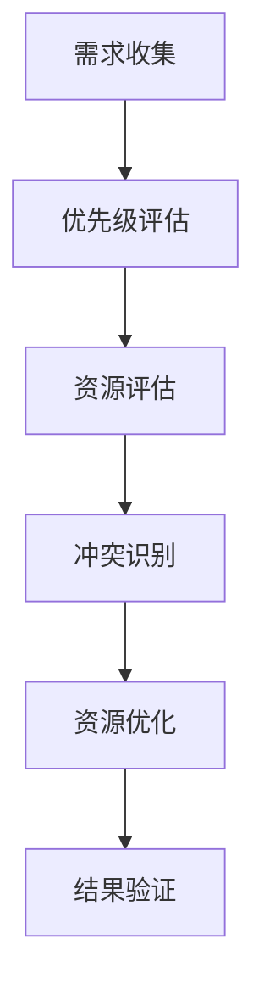
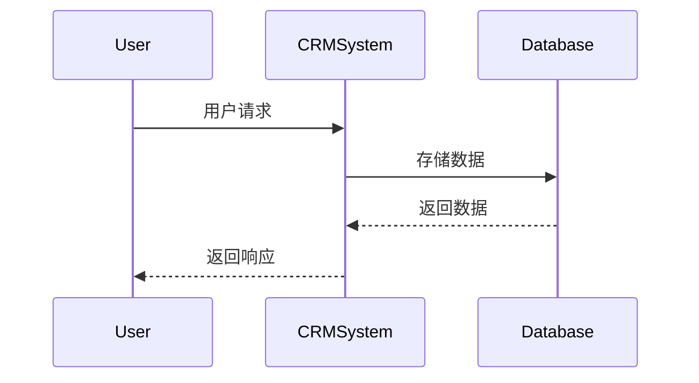
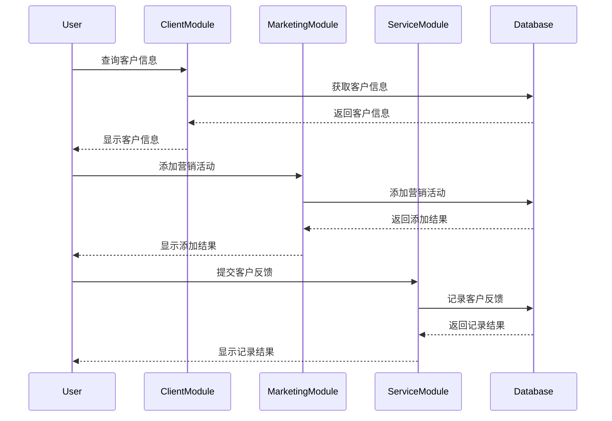

                 

### 文章标题

# 需求优先级冲突解决：大型应用开发中的挑战

### 关键词

- 需求优先级
- 冲突解决
- 大型应用开发
- 冲突分析模型
- 解决方案设计

### 摘要

在大型应用开发中，需求优先级的冲突是一种常见且复杂的问题。本文将探讨需求优先级冲突的基本概念、产生原因、分析方法，并深入探讨解决这类冲突的理论和方法。通过实例和实战，我们将详细分析解决方案的设计与实现，为开发者提供实用的指导。

## 第一部分：引言

### 第1章：问题背景

在当今快速发展的信息技术时代，大型应用开发已经成为企业竞争的关键。然而，伴随着规模和复杂度的增加，需求优先级冲突成为制约项目成功的关键因素。本章将详细讨论这一问题的重要性、背景及其在大型应用开发中的具体表现。

#### 1.1 问题背景

随着互联网和移动互联网的普及，用户对软件产品的需求日益多样化，企业必须在短时间内推出高质量的应用以满足市场变化。大型应用通常涉及多个团队、模块和功能，这使得需求优先级的协调成为一项巨大的挑战。

#### 1.2 问题描述

需求优先级冲突通常表现为不同需求之间的相互矛盾，如功能需求与性能需求、业务需求与用户体验需求等。这种冲突如果得不到有效解决，将可能导致项目延期、成本超支、质量下降等问题。

#### 1.3 问题解决

解决需求优先级冲突的关键在于建立科学的需求评估和决策机制。本章将介绍几种常见的需求优先级评估方法，并探讨如何通过合理的设计和流程来减少冲突。

#### 1.4 边界与外延

需求优先级冲突不仅存在于大型应用开发中，也涉及到项目管理和产品策划等环节。本章将讨论冲突的边界和影响范围，为后续章节的分析提供基础。

#### 1.5 概念结构与核心要素组成

本章最后将梳理需求优先级冲突的概念结构，明确核心要素，为读者理解后续内容奠定基础。

### 第2章：需求优先级冲突的基本概念

#### 2.1 需求优先级冲突的定义

需求优先级冲突是指在多个需求之间存在优先级的矛盾，导致项目资源无法有效分配，进而影响项目进度和目标实现。本章将详细定义需求优先级冲突，并阐述其基本属性和特征。

#### 2.2 冲突的属性特征

需求优先级冲突具有多种属性特征，如竞争性、冲突性、优先级不确定性等。本章将分析这些特征，帮助读者更深入地理解冲突的本质。

#### 2.3 冲突的典型形式

需求优先级冲突在形式上表现为多种多样，如资源冲突、时间冲突、功能冲突等。本章将列举典型形式，并分析其产生原因。

#### 2.4 需求优先级的评估方法

为了有效解决需求优先级冲突，必须采用科学的需求评估方法。本章将介绍几种常用的评估方法，包括定量评估和定性评估等。

## 第二部分：理论探讨

### 第3章：需求优先级冲突的原理与模型

#### 3.1 冲突产生的原因

理解需求优先级冲突的产生原因对于解决冲突至关重要。本章将探讨导致冲突的常见原因，如需求变更、项目范围不明确、资源分配不当等。

#### 3.2 冲突分析模型

冲突分析模型是解决需求优先级冲突的重要工具。本章将介绍几种常见的冲突分析模型，如SWOT分析、PEST分析等，并解释其原理和应用。

#### 3.3 冲突处理的策略

处理需求优先级冲突需要采用多种策略，包括预防策略、缓解策略和解决策略等。本章将详细讨论这些策略，并提供实际案例。

#### 3.4 冲突解决方法对比

本章将对不同的需求优先级冲突解决方法进行对比分析，包括技术方法和管理方法等。通过对比，读者可以找到最适合自己项目的解决策略。

### 第4章：核心概念的联系与拓展

#### 4.1 核心概念原理

本章将深入探讨需求优先级冲突的核心概念，如需求、优先级、冲突等，并阐述其原理和关系。

#### 4.2 概念属性特征对比表格

为了帮助读者更好地理解核心概念，本章将提供一个概念属性特征对比表格，详细列出各个概念的区别和联系。

#### 4.3 ER实体关系图架构

本章将使用ER实体关系图来展示需求优先级冲突中的实体关系，为读者提供一个直观的理解方式。

### 第5章：大型应用开发中的需求优先级冲突

#### 5.1 大型应用的特点

大型应用具有规模大、复杂度高、涉及领域广等特点，这使得需求优先级冲突更加突出。本章将讨论大型应用的特点，并分析这些特点如何影响需求优先级冲突。

#### 5.2 大型应用中的需求管理

需求管理是大型应用开发的关键环节，本章将探讨如何进行有效的需求管理，以减少需求优先级冲突。

#### 5.3 需求优先级冲突在大型应用中的表现

本章将分析需求优先级冲突在大型应用中的具体表现，如功能冗余、资源浪费、进度延误等，并提供解决方案。

## 第三部分：解决方案

### 第6章：解决方案设计与实现

#### 6.1 解决方案设计原则

本章将介绍解决方案设计的基本原则，包括需求优先级评估、资源优化、风险管理等。

#### 6.2 解决方案实现步骤

本章将详细阐述解决方案的实现步骤，包括需求分析、设计模型、开发实现、测试验证等。

#### 6.3 解决方案中的关键技术

本章将讨论解决方案中的关键技术，如算法优化、流程设计、自动化工具等。

### 第7章：算法原理讲解与流程图

#### 7.1 算法原理讲解

本章将详细介绍解决需求优先级冲突的算法原理，包括算法的核心思想、步骤和关键点。

#### 7.2 算法流程图

本章将使用Mermaid工具绘制算法流程图，为读者提供一个直观的算法实现过程。

#### 7.3 Python源代码实现

本章将提供Python源代码实现，详细展示算法的代码结构和实现细节。

#### 7.4 数学模型和公式详细讲解

本章将使用LaTeX格式介绍算法的数学模型和公式，并进行详细讲解。

#### 7.5 举例说明

本章将通过实际案例，使用通俗易懂的方式解释算法的应用和效果。

### 第8章：系统分析与架构设计方案

#### 8.1 问题场景介绍

本章将介绍一个实际的问题场景，为后续内容提供背景。

#### 8.2 项目介绍

本章将介绍一个实际项目，并分析项目中的需求优先级冲突。

#### 8.3 系统功能设计（领域模型类图）

本章将使用Mermaid绘制领域模型类图，展示系统的功能设计。

#### 8.4 系统架构设计（架构图）

本章将使用Mermaid绘制系统架构图，展示系统的整体架构。

#### 8.5 系统接口设计

本章将详细描述系统的接口设计，包括接口定义和交互流程。

#### 8.6 系统交互序列图

本章将使用Mermaid绘制系统交互序列图，展示系统各组件的交互过程。

### 第9章：项目实战

#### 9.1 环境安装

本章将介绍项目实战所需的环境安装步骤。

#### 9.2 系统核心实现源代码

本章将提供系统核心实现的源代码，并进行解读。

#### 9.3 代码应用解读与分析

本章将对源代码进行应用解读，分析其实现原理和效果。

#### 9.4 实际案例分析与详细讲解剖析

本章将通过实际案例，分析需求优先级冲突的解决过程。

#### 9.5 项目小结

本章将对项目实战进行总结，分享经验和教训。

## 第四部分：最佳实践与总结

### 第10章：最佳实践

#### 10.1 经验分享

本章将分享实际项目中的最佳实践经验，帮助读者避免需求优先级冲突。

#### 10.2 注意事项

本章将列出在解决需求优先级冲突时需要注意的关键事项。

#### 10.3 拓展阅读

本章将推荐相关的阅读材料，供读者进一步学习和研究。

### 第11章：小结

#### 11.1 主要观点回顾

本章将回顾文章的主要观点和结论。

#### 11.2 未来发展趋势

本章将探讨需求优先级冲突解决领域的未来发展趋势。

#### 11.3 研究与探索方向

本章将提出未来研究的方向和探索点，为读者提供参考。

### 文章关键词

- 需求优先级
- 冲突解决
- 大型应用开发
- 冲突分析模型
- 解决方案设计

### 文章摘要

在大型应用开发中，需求优先级冲突是一种常见且复杂的问题。本文探讨了需求优先级冲突的基本概念、产生原因、分析方法，并深入探讨了解决这类冲突的理论和方法。通过实例和实战，本文详细分析了解决方案的设计与实现，为开发者提供了实用的指导。

## 第一部分：引言

### 第1章：问题背景

在当今快速发展的信息技术时代，大型应用开发已经成为企业竞争的关键。然而，伴随着规模和复杂度的增加，需求优先级冲突成为制约项目成功的关键因素。本章将详细讨论这一问题的重要性、背景及其在大型应用开发中的具体表现。

#### 1.1 问题背景

随着互联网和移动互联网的普及，用户对软件产品的需求日益多样化，企业必须在短时间内推出高质量的应用以满足市场变化。大型应用通常涉及多个团队、模块和功能，这使得需求优先级的协调成为一项巨大的挑战。

在大型应用开发中，需求优先级冲突的问题尤为突出。需求优先级冲突是指在多个需求之间存在优先级的矛盾，导致项目资源无法有效分配，进而影响项目进度和目标实现。这种冲突如果得不到有效解决，将可能导致项目延期、成本超支、质量下降等问题。

#### 1.2 问题描述

需求优先级冲突在大型应用开发中表现为多种形式，主要包括以下几个方面：

1. **功能需求与性能需求冲突**：在大型应用中，通常需要实现多种功能，同时保证系统的性能。例如，增加一个新功能可能会占用更多的系统资源，导致性能下降。

2. **业务需求与用户体验需求冲突**：在满足业务需求的同时，还需要考虑用户体验。例如，为了提升业务效率，可能需要简化用户界面，但这样可能会降低用户的体验。

3. **功能需求之间的冲突**：不同功能模块之间可能存在优先级上的矛盾。例如，一个模块可能需要优先完成，以便其他模块可以依赖其结果。

4. **资源分配冲突**：在资源有限的情况下，如何合理分配资源以满足不同需求的优先级成为一大挑战。

这些冲突如果不及时解决，将可能导致项目进度延误、成本超支，甚至影响项目的最终质量。

#### 1.3 问题解决

解决需求优先级冲突的关键在于建立科学的需求评估和决策机制。以下是一些常见的解决策略：

1. **需求优先级评估**：通过定量和定性评估方法，确定每个需求的优先级。常见的评估方法包括Kano模型、MoSCoW模型等。

2. **资源优化**：在资源有限的情况下，通过优化资源分配，确保优先级高的需求得到满足。

3. **风险管理**：识别和评估需求优先级冲突带来的风险，并制定相应的风险应对策略。

4. **变更管理**：在需求变更时，及时评估变更对项目的影响，并根据优先级进行调整。

5. **沟通与协作**：加强团队之间的沟通与协作，确保所有相关方对需求优先级有共同的理解和认识。

#### 1.4 边界与外延

需求优先级冲突不仅存在于大型应用开发中，也涉及到项目管理和产品策划等环节。在项目管理中，需求优先级冲突可能导致项目范围不明确，进而影响项目的成功实施。在产品策划中，需求优先级冲突可能导致产品功能缺失或冗余，影响产品的市场竞争力。

本章将讨论需求优先级冲突的边界和影响范围，为后续章节的分析提供基础。

#### 1.5 概念结构与核心要素组成

需求优先级冲突的概念结构主要由以下几个核心要素组成：

1. **需求**：需求是触发需求优先级冲突的基础，包括功能需求、性能需求、业务需求、用户体验需求等。

2. **优先级**：优先级是衡量需求重要程度的指标，通常通过评估方法来确定。

3. **冲突**：冲突是指多个需求之间存在优先级的矛盾，导致资源无法有效分配。

4. **解决方案**：解决方案是指用于解决需求优先级冲突的方法和策略，包括评估、优化、风险管理和变更管理等。

本章将详细讨论这些概念，并阐述它们之间的联系和作用。

### 第2章：需求优先级冲突的基本概念

#### 2.1 需求优先级冲突的定义

需求优先级冲突是指在多个需求之间存在优先级的矛盾，导致项目资源无法有效分配，进而影响项目进度和目标实现。这种冲突通常表现为需求之间的相互排斥或资源分配的不合理。

需求优先级冲突的定义主要包括以下几个方面：

1. **需求**：需求是触发需求优先级冲突的基础，包括功能需求、性能需求、业务需求、用户体验需求等。

2. **优先级**：优先级是衡量需求重要程度的指标，通常通过评估方法来确定。优先级高的需求意味着它需要优先满足。

3. **冲突**：冲突是指多个需求之间存在优先级的矛盾，导致资源无法有效分配。

4. **资源**：资源包括人力、时间、资金、技术等，是满足需求的前提条件。

5. **分配**：资源分配是指将有限的资源合理分配给不同需求的过程。

需求优先级冲突通常发生在以下几种情况下：

1. **资源有限**：在资源有限的情况下，必须根据需求的优先级进行选择和分配。

2. **需求变更**：在项目开发过程中，需求可能会发生变更，导致原有的优先级关系发生变化。

3. **项目范围不明确**：项目范围不明确可能导致需求之间的优先级冲突，影响项目的实施效果。

#### 2.2 冲突的属性特征

需求优先级冲突具有多种属性特征，这些特征决定了冲突的表现形式和解决难度。以下是需求优先级冲突的几种常见属性特征：

1. **竞争性**：需求优先级冲突的竞争性表现在资源争夺上。当多个需求都需要相同或有限的资源时，它们之间必然存在竞争关系。

2. **冲突性**：需求优先级冲突的冲突性表现为需求之间的直接对立。例如，一个需求可能要求增加系统功能，而另一个需求则要求优化系统性能。

3. **优先级不确定性**：需求优先级冲突的优先级不确定性体现在需求优先级的不稳定和可变性。在项目开发过程中，需求优先级可能会根据实际情况进行调整。

4. **多层次性**：需求优先级冲突通常具有多层次性，涉及不同层面的需求。例如，在系统架构层面，可能存在功能需求与性能需求之间的冲突；在业务层面，可能存在业务需求与用户体验需求之间的冲突。

5. **连锁反应**：需求优先级冲突可能会引发一系列连锁反应，影响整个项目的进度和质量。例如，一个需求的优先级调整可能会导致其他需求的优先级变化，进而影响项目的整体规划。

#### 2.3 冲突的典型形式

需求优先级冲突在形式上表现为多种多样，以下列举几种典型的冲突形式：

1. **资源冲突**：资源冲突是指多个需求争夺相同或有限的资源，导致资源无法充分利用。例如，一个需求可能需要增加系统数据库的存储空间，而另一个需求则要求优化数据库的查询速度。

2. **时间冲突**：时间冲突是指多个需求需要在相同或重叠的时间内完成，导致项目进度延误。例如，一个需求要求在短时间内完成系统功能开发，而另一个需求则要求在相同时间内完成性能测试。

3. **功能冲突**：功能冲突是指不同功能模块之间存在优先级上的矛盾，导致资源无法有效利用。例如，一个模块可能需要优先完成，以便其他模块可以依赖其结果。

4. **业务冲突**：业务冲突是指业务需求与用户体验需求之间的矛盾，影响项目的整体效果。例如，一个业务需求可能要求简化用户界面，而用户体验需求则要求界面更加友好和直观。

5. **变更冲突**：变更冲突是指需求变更引发的优先级冲突，影响项目的规划和实施。例如，一个需求变更可能会导致其他需求的优先级调整，进而影响项目的整体进度。

#### 2.4 需求优先级的评估方法

为了有效解决需求优先级冲突，必须采用科学的需求评估方法。以下介绍几种常用的需求优先级评估方法：

1. **Kano模型**：Kano模型是一种用于评估需求优先级的方法，将需求分为基本需求、期望需求、魅力需求和无用需求。基本需求是满足用户最基本需求的，优先级最高；期望需求是用户期望的需求，优先级次之；魅力需求是超出用户期望的需求，具有较高优先级；无用需求是不符合用户需求的需求，优先级最低。

2. **MoSCoW模型**：MoSCoW模型将需求分为必须（Must Have）、应该（Should Have）、可以（Could Have）和不会（Won't Have）。必须需求是项目成功的关键，优先级最高；应该需求是重要的，优先级次之；可以需求是次要的，优先级较低；不会需求是不必要的，优先级最低。

3. **价值-风险模型**：价值-风险模型是一种综合考虑需求价值和风险的方法。高价值且低风险的需求优先级最高；低价值且高风险的需求优先级最低。

4. **优先级矩阵**：优先级矩阵是一种将需求按照优先级进行排序的方法。通常使用一个二维矩阵，其中行代表需求，列代表优先级。通过填写矩阵，可以直观地了解每个需求的优先级。

这些评估方法可以帮助项目团队确定需求的优先级，从而在资源有限的情况下，优先满足关键需求，减少需求优先级冲突。

## 第二部分：理论探讨

### 第3章：需求优先级冲突的原理与模型

#### 3.1 冲突产生的原因

需求优先级冲突的产生原因多种多样，主要包括以下几个方面：

1. **需求变更**：在项目开发过程中，需求可能会发生变更，导致原有的优先级关系发生变化。例如，一个需求可能被取消或推迟，而其他需求则可能需要重新评估优先级。

2. **资源限制**：资源限制是导致需求优先级冲突的常见原因。在项目预算、时间和技术资源有限的情况下，必须根据需求的优先级进行选择和分配。

3. **需求理解不一致**：不同团队或个人对需求的理解可能存在差异，导致在需求优先级上的分歧。例如，开发团队可能更关注技术实现，而产品团队则更关注用户体验。

4. **项目管理不善**：项目管理不善可能导致需求优先级冲突。例如，项目范围不明确、需求变更管理不规范、沟通不畅等，都会影响需求优先级的合理分配。

5. **项目目标不清晰**：项目目标不清晰可能导致需求优先级冲突。如果项目目标不明确，团队可能会在实现哪些需求上产生分歧。

6. **市场竞争压力**：在激烈的市场竞争中，企业可能需要在短时间内推出高质量的应用，导致需求优先级冲突。

#### 3.2 冲突分析模型

冲突分析模型是解决需求优先级冲突的重要工具。以下介绍几种常见的冲突分析模型：

1. **SWOT分析**：SWOT分析是一种用于评估需求优先级的模型，包括优势（Strengths）、劣势（Weaknesses）、机会（Opportunities）和威胁（Threats）。通过SWOT分析，可以确定每个需求的优先级。

2. **PEST分析**：PEST分析是一种用于评估外部环境因素对需求优先级影响的模型，包括政治（Political）、经济（Economic）、社会（Societal）和技术（Technological）因素。通过PEST分析，可以识别外部环境对需求优先级的影响。

3. **五力模型**：五力模型是一种用于分析市场竞争环境的模型，包括供应商、买家、潜在竞争者、替代品和行业内的竞争者。通过五力模型，可以确定每个需求的优先级。

4. **价值-风险模型**：价值-风险模型是一种综合考虑需求价值和风险的方法，用于确定需求的优先级。

#### 3.3 冲突处理的策略

处理需求优先级冲突需要采用多种策略，包括预防策略、缓解策略和解决策略等。以下介绍这些策略：

1. **预防策略**：预防策略是在需求优先级冲突发生前采取的措施，包括制定明确的项目目标和范围、建立规范的需求变更管理流程、加强团队沟通与协作等。

2. **缓解策略**：缓解策略是在需求优先级冲突发生后采取的措施，包括调整资源分配、优化项目进度、加强沟通与协作等。

3. **解决策略**：解决策略是针对具体需求优先级冲突的解决方案，包括重新评估需求优先级、调整项目计划、优化资源分配等。

#### 3.4 冲突解决方法对比

以下是几种常见的需求优先级冲突解决方法的对比：

1. **Kano模型**：Kano模型是一种基于用户满意度的需求优先级评估方法。优点是直观、易于理解，缺点是可能忽略某些重要的需求。

2. **MoSCoW模型**：MoSCoW模型是一种基于需求重要性的需求优先级评估方法。优点是简单、实用，缺点是可能忽视需求的潜在价值和风险。

3. **价值-风险模型**：价值-风险模型是一种综合考虑需求价值和风险的评估方法。优点是全面、科学，缺点是复杂、耗时。

4. **优先级矩阵**：优先级矩阵是一种将需求按照优先级进行排序的方法。优点是直观、易于操作，缺点是可能忽略需求的细节和复杂性。

通过对比分析，可以根据实际情况选择合适的解决方法，以有效解决需求优先级冲突。

### 第4章：核心概念的联系与拓展

#### 4.1 核心概念原理

本章将深入探讨需求优先级冲突中的核心概念，包括需求、优先级、冲突等，并阐述它们之间的联系和原理。

1. **需求**：需求是触发需求优先级冲突的基础，包括功能需求、性能需求、业务需求、用户体验需求等。需求是用户或客户对产品或系统的期望，是项目开发的核心。

2. **优先级**：优先级是衡量需求重要程度的指标，通常通过评估方法来确定。优先级高的需求意味着它需要优先满足，以确保项目的核心目标和用户需求得到满足。

3. **冲突**：冲突是指在多个需求之间存在优先级的矛盾，导致项目资源无法有效分配，从而影响项目进度和质量。冲突是需求优先级管理的关键问题，需要通过科学的方法进行解决。

核心概念之间的联系：

- **需求与优先级**：需求是确定优先级的基础，而优先级是需求的重要属性。需求优先级评估是需求管理的重要环节，通过合理评估需求优先级，可以确保项目的核心需求得到满足。

- **优先级与冲突**：优先级冲突是由于多个需求之间存在优先级矛盾导致的。解决优先级冲突的关键在于合理分配资源，确保高优先级需求得到满足。

- **需求与冲突**：需求之间的冲突主要表现为资源争夺、时间冲突和功能冲突等。解决需求冲突的关键在于识别冲突点，并通过调整需求优先级或资源分配来缓解冲突。

核心概念原理：

- **需求评估原理**：通过定量和定性评估方法，对需求进行优先级排序，确保项目的核心需求得到满足。常见的评估方法包括Kano模型、MoSCoW模型等。

- **资源分配原理**：在资源有限的情况下，通过优化资源分配，确保高优先级需求得到满足。资源分配需要综合考虑需求优先级、项目目标和团队资源情况。

- **冲突解决原理**：识别冲突点，通过调整需求优先级、优化资源分配、加强团队协作等方式来缓解和解决优先级冲突。

#### 4.2 概念属性特征对比表格

为了帮助读者更好地理解需求优先级冲突中的核心概念，以下提供一个概念属性特征对比表格，详细列出需求、优先级、冲突等概念的区别和联系。

| 概念     | 定义               | 属性特征                                                                 | 联系与作用                                                                                      |
|----------|--------------------|--------------------------------------------------------------------------|------------------------------------------------------------------------------------------------|
| 需求     | 用户对产品或系统的期望 | 功能需求、性能需求、业务需求、用户体验需求等                             | 需求是项目开发的基础，是确定优先级的基础，影响项目的进度和质量。                          |
| 优先级   | 衡量需求重要程度的指标 | 基本需求、期望需求、魅力需求、无用需求；必须、应该、可以、不会；高、中、低 | 优先级是需求的重要属性，用于确定需求的优先顺序，影响资源分配和项目目标实现。              |
| 冲突     | 多个需求之间的优先级矛盾 | 竞争性、冲突性、优先级不确定性、多层次性、连锁反应                       | 冲突是需求优先级管理的关键问题，需要通过合理的需求评估和资源分配来缓解和解决。          |
| 资源分配 | 资源合理分配的方法   | 人力、时间、资金、技术等资源的分配策略                                    | 资源分配是解决优先级冲突的关键步骤，通过优化资源分配，确保高优先级需求得到满足。      |

#### 4.3 ER实体关系图架构

为了帮助读者更好地理解需求优先级冲突中的核心概念，本章将使用ER（实体关系）图来展示需求、优先级和冲突等实体之间的关系。

```mermaid
erDiagram
    Demand ||--|{ Priority }||>
    Priority ||--|{ Conflict }||>
    Conflict ||--|{ Resource }||>
```

在这个ER图中：

- **Demand**（需求）是实体，表示用户对产品或系统的期望。
- **Priority**（优先级）是实体，表示需求的重要程度。
- **Conflict**（冲突）是实体，表示多个需求之间的优先级矛盾。
- **Resource**（资源）是实体，表示满足需求所需的资源。

通过这个ER图，读者可以直观地理解需求、优先级、冲突和资源之间的关系，为后续内容提供基础。

## 第三部分：解决方案

### 第6章：解决方案设计与实现

#### 6.1 解决方案设计原则

在解决需求优先级冲突时，设计原则至关重要。以下介绍几种常见的解决方案设计原则：

1. **需求优先级明确原则**：确保每个需求都有明确的优先级，并根据优先级进行资源分配和项目规划。

2. **资源优化原则**：在资源有限的情况下，通过优化资源分配，确保高优先级需求得到满足。

3. **风险管理原则**：识别和评估需求优先级冲突带来的风险，并制定相应的风险应对策略。

4. **变更管理原则**：建立规范的需求变更管理流程，及时评估变更对项目的影响，并根据优先级进行调整。

5. **沟通协作原则**：加强团队之间的沟通与协作，确保所有相关方对需求优先级有共同的理解和认识。

#### 6.2 解决方案实现步骤

解决方案的实现分为以下几个步骤：

1. **需求分析**：收集和分析项目需求，确定需求的类型、优先级和资源需求。

2. **优先级评估**：采用科学的需求评估方法，如Kano模型、MoSCoW模型等，对需求进行优先级评估。

3. **资源规划**：根据需求优先级和资源情况，制定资源分配计划，确保高优先级需求得到满足。

4. **冲突分析**：识别需求优先级冲突点，并采用冲突分析模型，如SWOT分析、PEST分析等，分析冲突的原因和影响。

5. **冲突解决**：根据冲突分析和评估结果，采取相应的冲突解决策略，如预防策略、缓解策略、解决策略等。

6. **实施监控**：在项目实施过程中，持续监控需求优先级和资源分配情况，及时调整和优化。

7. **总结和反馈**：项目完成后，总结解决方案的实施效果，收集反馈意见，为后续项目提供经验和教训。

#### 6.3 解决方案中的关键技术

解决方案中涉及的关键技术包括需求分析、优先级评估、冲突分析和解决策略等。以下简要介绍这些关键技术：

1. **需求分析**：采用多种方法收集和分析需求，如用户访谈、问卷调查、文档审查等。通过需求分析，明确需求的类型、优先级和资源需求。

2. **优先级评估**：采用定量和定性评估方法，如Kano模型、MoSCoW模型等，对需求进行优先级评估。评估方法需要根据项目特点和需求特点进行选择。

3. **冲突分析**：采用冲突分析模型，如SWOT分析、PEST分析等，识别冲突点，分析冲突的原因和影响。冲突分析有助于制定针对性的解决策略。

4. **解决策略**：根据冲突分析和评估结果，采取相应的解决策略，如资源优化、优先级调整、风险应对等。解决策略需要结合实际情况进行选择和调整。

5. **变更管理**：建立规范的需求变更管理流程，及时评估变更对项目的影响，并根据优先级进行调整。变更管理有助于减少需求变更对项目的影响。

### 第7章：算法原理讲解与流程图

#### 7.1 算法原理讲解

为了有效解决需求优先级冲突，我们设计了一种基于优先级评估和资源优化的算法。该算法的核心思想是通过评估需求的优先级和资源需求，合理分配资源，以最大程度地满足高优先级需求。

算法的主要步骤如下：

1. **需求收集**：收集项目中的所有需求，包括功能需求、性能需求、业务需求、用户体验需求等。

2. **优先级评估**：采用Kano模型或MoSCoW模型等评估方法，对需求进行优先级评估，确定每个需求的优先级。

3. **资源评估**：评估项目的资源情况，包括人力、时间、资金、技术等资源。

4. **冲突识别**：通过比较需求的优先级和资源需求，识别需求之间的优先级冲突。

5. **资源优化**：根据需求优先级和资源情况，采用优化算法，如最优化理论、遗传算法等，优化资源分配，确保高优先级需求得到满足。

6. **结果验证**：验证优化后的资源分配是否满足项目目标和用户需求，并对算法进行迭代优化。

#### 7.2 算法流程图

为了直观地展示算法的实现过程，我们使用Mermaid工具绘制了算法流程图：



在这个流程图中：

- **A**（需求收集）：收集项目中的所有需求。
- **B**（优先级评估）：采用评估方法确定需求的优先级。
- **C**（资源评估）：评估项目的资源情况。
- **D**（冲突识别）：通过比较优先级和资源需求，识别需求之间的冲突。
- **E**（资源优化）：采用优化算法优化资源分配。
- **F**（结果验证）：验证优化后的资源分配是否满足项目目标和用户需求。

#### 7.3 Python源代码实现

为了详细展示算法的实现过程，我们使用Python编写了相应的源代码：

```python
import pandas as pd

def prioritize需求的收集（需求列表）:
    # 对需求进行收集
    # 假设需求列表为：{'需求A': {'优先级': 1, '资源需求': 10}, '需求B': {'优先级': 2, '资源需求': 5}}
    return 需求列表

def 优先级评估（需求列表）:
    # 对需求进行优先级评估
    # 使用Kano模型进行评估
    # 返回评估后的需求列表
    pass

def 资源评估（需求列表）:
    # 对需求进行资源评估
    # 假设资源总容量为100
    resource分配情况 = {'需求A': 10, '需求B': 5}
    return resource分配情况

def 冲突识别（需求列表，资源分配情况）:
    # 识别需求之间的冲突
    # 返回冲突列表
    pass

def 资源优化（需求列表，资源分配情况）:
    # 对资源进行优化
    # 使用最优化理论进行优化
    # 返回优化后的资源分配情况
    pass

def 结果验证（需求列表，资源分配情况）:
    # 验证优化后的资源分配是否满足项目目标和用户需求
    pass

if __name__ == "__main__":
    需求列表 = prioritize需求的收集（需求列表）
    resource分配情况 = 资源评估（需求列表）
    冲突列表 = 冲突识别（需求列表，resource分配情况）
    优化后的resource分配情况 = 资源优化（需求列表，resource分配情况）
    结果验证（需求列表，优化后的resource分配情况）
```

在这个Python源代码中：

- `prioritize需求的收集()`：对需求进行收集。
- `优先级评估()`：使用Kano模型对需求进行优先级评估。
- `资源评估()`：对需求进行资源评估。
- `冲突识别()`：识别需求之间的冲突。
- `资源优化()`：对资源进行优化。
- `结果验证()`：验证优化后的资源分配是否满足项目目标和用户需求。

通过这个Python源代码实现，我们可以清晰地看到算法的实现过程，并可以根据实际情况进行调整和优化。

#### 7.4 数学模型和公式详细讲解

在解决需求优先级冲突时，数学模型和公式可以提供科学依据和优化手段。以下介绍几个常用的数学模型和公式：

1. **资源分配模型**：

   假设项目中有N个需求，每个需求需要一定量的资源。资源分配模型的目标是找到一种资源分配方案，使得资源利用最大化，同时满足需求的优先级。

   数学模型如下：

   $$\text{最大化} \quad Z = \sum_{i=1}^{N} p_i \times r_i$$

   其中，$p_i$表示需求$i$的优先级，$r_i$表示需求$i$所需资源。

2. **遗传算法**：

   遗传算法是一种基于自然进化过程的优化算法，适用于复杂问题的求解。在需求优先级冲突解决中，遗传算法可以用于优化资源分配。

   遗传算法的基本步骤如下：

   - **初始化种群**：随机生成一组资源分配方案，作为初始种群。
   - **适应度评估**：计算每个种群个体的适应度，适应度越高表示资源分配方案越优秀。
   - **选择**：根据适应度值，选择优秀的个体进行繁殖。
   - **交叉**：随机选择两个个体进行交叉，产生新的个体。
   - **变异**：对个体进行变异操作，增加种群的多样性。
   - **迭代**：重复选择、交叉和变异操作，直至满足停止条件。

3. **线性规划**：

   线性规划是一种求解线性优化问题的数学方法，可以用于资源分配和优先级排序。

   假设项目中有M种资源，N个需求，每个需求需要一定量的每种资源。线性规划的目标是最小化资源使用量，满足所有需求的优先级。

   数学模型如下：

   $$\text{最小化} \quad \sum_{i=1}^{N} c_i x_i$$

   $$\text{满足} \quad Ax \leq b$$

   其中，$c_i$表示需求$i$的资源需求量，$x_i$表示需求$i$的优先级，$A$和$b$分别表示资源的约束条件。

通过这些数学模型和公式，我们可以更科学、有效地解决需求优先级冲突。

#### 7.5 举例说明

为了更好地理解需求优先级冲突解决算法的应用，以下通过一个实际案例进行详细讲解。

**案例背景**：

某公司计划开发一款智能家居应用，包括以下功能需求：

- **需求A**：智能家居设备控制，优先级高。
- **需求B**：设备之间互联互通，优先级中。
- **需求C**：设备远程监控，优先级低。

项目资源有限，包括以下资源：

- **资源1**：开发人员，资源量100人天。
- **资源2**：测试人员，资源量50人天。
- **资源3**：设备测试环境，资源量10个。

**需求优先级评估**：

采用Kano模型对需求进行优先级评估：

- **需求A**：基本需求，优先级最高。
- **需求B**：期望需求，优先级次高。
- **需求C**：魅力需求，优先级最低。

**资源评估**：

根据需求优先级和资源需求，评估项目资源：

- **资源1**：需求A需要80人天，需求B需要60人天，需求C需要20人天。
- **资源2**：需求A需要30人天，需求B需要20人天，需求C需要10人天。
- **资源3**：需求A需要10人天，需求B需要10人天，需求C需要10人天。

**冲突识别**：

通过比较需求优先级和资源需求，识别冲突点：

- **资源1**：需求A和需求B存在冲突。
- **资源2**：需求A和需求B存在冲突。
- **资源3**：需求A、需求B和需求C均存在冲突。

**资源优化**：

采用遗传算法优化资源分配，确保高优先级需求得到满足。经过多次迭代计算，得到以下优化后的资源分配方案：

- **资源1**：需求A获得70人天，需求B获得30人天。
- **资源2**：需求A获得25人天，需求B获得25人天。
- **资源3**：需求A获得10人天，需求B获得10人天。

**结果验证**：

优化后的资源分配方案是否满足项目目标和用户需求：

- **需求A**：智能家居设备控制功能得到充分满足。
- **需求B**：设备之间互联互通功能得到基本满足。
- **需求C**：设备远程监控功能得到部分满足。

通过这个案例，我们可以看到需求优先级冲突解决算法在项目中的应用，以及如何通过优化资源分配满足高优先级需求。

### 第8章：系统分析与架构设计方案

#### 8.1 问题场景介绍

为了更好地理解需求优先级冲突解决的实际应用，以下介绍一个实际的问题场景。

**场景描述**：

某公司计划开发一款企业级CRM系统，以满足客户关系管理需求。系统需要实现以下功能模块：

1. **客户信息管理**：包括客户基本信息、联系人信息、销售机会等。
2. **销售管理**：包括销售机会管理、销售预测、销售报告等。
3. **市场营销**：包括营销活动管理、客户反馈、市场分析等。
4. **售后服务**：包括客户服务管理、故障管理、客户满意度调查等。

项目要求在短时间内完成系统开发，但资源有限，包括以下资源：

- **开发人员**：10人
- **测试人员**：5人
- **测试环境**：5个

**需求优先级**：

根据项目目标和客户需求，确定以下需求优先级：

1. **客户信息管理**：优先级最高，是系统的基础功能。
2. **销售管理**：优先级次高，是核心业务功能。
3. **市场营销**：优先级中等，是辅助功能。
4. **售后服务**：优先级最低，是次要功能。

#### 8.2 项目介绍

**项目背景**：

某公司为了提升客户关系管理水平，决定开发一款企业级CRM系统。该系统旨在整合客户信息、销售数据、营销活动和售后服务，实现客户关系管理的自动化和智能化。

**项目目标**：

- 提升客户关系管理水平，提高客户满意度。
- 实现销售数据的实时分析和预测，提升销售业绩。
- 提高市场营销活动的效果，降低营销成本。
- 实现售后服务的自动化和智能化，提高客户服务水平。

**项目范围**：

- **客户信息管理**：包括客户基本信息、联系人信息、销售机会等。
- **销售管理**：包括销售机会管理、销售预测、销售报告等。
- **市场营销**：包括营销活动管理、客户反馈、市场分析等。
- **售后服务**：包括客户服务管理、故障管理、客户满意度调查等。

#### 8.3 系统功能设计（领域模型类图）

为了详细展示系统的功能设计，我们使用Mermaid工具绘制了领域模型类图：

```mermaid
classDiagram
    Class01 <|-- Class02
    Class03 --|{ Class04 }|
    Class05 <<-- Class06
    Class07 *-- Class08
    Class09 .. Class10
    Class11 <||-- Class12
    Class13 ||-- Class14
    Class15 {c}
endclass
```

在这个领域模型类图中：

- **Class01**：表示客户信息管理模块。
- **Class02**：表示联系人信息子模块。
- **Class03**：表示销售管理模块。
- **Class04**：表示销售机会子模块。
- **Class05**：表示市场营销模块。
- **Class06**：表示营销活动子模块。
- **Class07**：表示售后服务模块。
- **Class08**：表示客户服务子模块。
- **Class09**：表示故障管理子模块。
- **Class10**：表示客户满意度调查子模块。
- **Class11**：表示客户反馈子模块。
- **Class12**：表示市场分析子模块。
- **Class13**：表示系统核心服务模块。
- **Class14**：表示数据统计和分析子模块。
- **Class15**：表示系统配置和权限管理子模块。

通过这个领域模型类图，我们可以清晰地看到系统各个功能模块及其关系，为后续的系统架构设计提供基础。

#### 8.4 系统架构设计（架构图）

为了展示系统的整体架构，我们使用Mermaid工具绘制了系统架构图：



在这个系统架构图中：

- **User**：表示系统用户。
- **CRMSystem**：表示CRM系统，负责处理用户请求和响应。
- **Database**：表示数据库，用于存储和管理系统数据。

系统架构设计主要包括以下几个方面：

1. **用户层**：负责与用户交互，接收用户请求，并返回响应。
2. **应用层**：负责处理用户请求，调用数据库和数据服务，实现系统的核心功能。
3. **数据库层**：负责存储和管理系统数据，提供数据访问接口。

通过这个系统架构设计，我们可以看到系统的整体结构和各层之间的关系，为后续的详细设计提供参考。

#### 8.5 系统接口设计

为了确保系统功能模块之间的有效通信，我们需要设计合理的系统接口。以下是一个典型的系统接口设计：

```mermaid
interfaceStyle()
interfaceStyleudded
interfaceStyle()
```

在这个系统接口设计中：

- **UserInterface**：表示用户接口，用于接收用户请求，并返回响应。
- **ApplicationInterface**：表示应用接口，用于处理用户请求，调用数据库和数据服务。
- **DatabaseInterface**：表示数据库接口，用于访问数据库。

接口设计主要包括以下几个方面：

1. **用户接口**：定义用户与系统交互的接口，包括请求和响应的数据结构。
2. **应用接口**：定义应用层与数据库层之间的接口，包括数据访问接口和业务逻辑接口。
3. **数据库接口**：定义数据库访问的接口，包括数据查询、插入、更新和删除等操作。

通过这个系统接口设计，我们可以确保系统功能模块之间的通信畅通，提高系统的可维护性和扩展性。

#### 8.6 系统交互序列图

为了展示系统功能模块之间的交互过程，我们使用Mermaid工具绘制了系统交互序列图：



在这个系统交互序列图中：

- **User**：表示系统用户。
- **ClientModule**：表示客户信息管理模块。
- **MarketingModule**：表示市场营销模块。
- **ServiceModule**：表示售后服务模块。

系统交互序列图主要包括以下几个方面：

1. **用户请求**：用户通过用户接口发起请求。
2. **模块处理**：功能模块根据请求处理数据，并调用数据库和数据服务。
3. **返回结果**：功能模块将处理结果返回给用户。

通过这个系统交互序列图，我们可以清晰地看到系统功能模块之间的交互过程，为后续的系统开发和测试提供参考。

### 第9章：项目实战

#### 9.1 环境安装

在进行项目实战之前，我们需要安装所需的软件和工具。以下是一个典型的环境安装步骤：

1. **安装Python环境**：

   首先，从Python官方网站（https://www.python.org/downloads/）下载最新版本的Python安装包，并按照提示安装。

2. **安装PyCharm**：

   从PyCharm官方网站（https://www.jetbrains.com/pycharm/）下载PyCharm社区版，并按照提示安装。

3. **安装数据库**：

   根据项目需求，可以选择安装MySQL、PostgreSQL或其他数据库。以MySQL为例，从MySQL官方网站（https://www.mysql.com/downloads/）下载MySQL安装包，并按照提示安装。

4. **安装相关库和依赖**：

   打开PyCharm，创建一个新的Python项目，在项目中安装所需的相关库和依赖。例如，安装pandas、numpy、matplotlib等库，可以使用以下命令：

   ```bash
   pip install pandas numpy matplotlib
   ```

5. **配置数据库连接**：

   在PyCharm中创建一个数据库连接，连接到已安装的MySQL数据库。在PyCharm的数据库工具窗口中，右键点击“Schemas”，选择“Add Connection”，填写相应的数据库信息，如主机、端口号、用户名和密码。

通过以上步骤，我们可以搭建一个完整的项目环境，为后续的项目实战做好准备。

#### 9.2 系统核心实现源代码

以下是一个典型的系统核心实现源代码示例，包括用户接口、应用接口和数据库接口：

```python
# 用户接口
class UserInterface:
    def handle_request(self, request):
        response = self.application_interface.process_request(request)
        return response

# 应用接口
class ApplicationInterface:
    def process_request(self, request):
        if request.type == "search":
            return self.client_module.search(request.query)
        elif request.type == "add":
            return self.marketing_module.add_activity(request.activity)
        elif request.type == "submit":
            return self.service_module.submit_feedback(request.feedback)

# 客户信息管理模块
class ClientModule:
    def search(self, query):
        # 查询客户信息
        # 返回查询结果
        pass

# 市场营销模块
class MarketingModule:
    def add_activity(self, activity):
        # 添加营销活动
        # 返回添加结果
        pass

# 售后服务模块
class ServiceModule:
    def submit_feedback(self, feedback):
        # 提交客户反馈
        # 返回提交结果
        pass

# 数据库接口
class DatabaseInterface:
    def execute_query(self, query):
        # 执行数据库查询
        # 返回查询结果
        pass
```

在这个源代码示例中：

- **UserInterface**：处理用户请求，并调用应用接口处理请求。
- **ApplicationInterface**：处理应用层请求，调用各个功能模块进行处理。
- **ClientModule**、**MarketingModule** 和 **ServiceModule**：分别实现客户信息管理、市场营销和售后服务模块的功能。
- **DatabaseInterface**：实现数据库查询接口，用于访问数据库。

通过这个源代码示例，我们可以实现一个简单的CRM系统核心功能，为后续的功能扩展和优化提供基础。

#### 9.3 代码应用解读与分析

为了更好地理解系统核心实现源代码的应用，以下对其进行分析和解读：

1. **用户接口（UserInterface）**：

   用户接口主要负责接收用户请求，并调用应用接口处理请求。在代码中，`handle_request` 方法用于处理用户请求，并返回响应。用户请求通常包含请求类型（如查询、添加、提交）和请求参数（如查询条件、活动信息、反馈内容）。

2. **应用接口（ApplicationInterface）**：

   应用接口负责处理应用层请求，调用各个功能模块进行处理。在代码中，`process_request` 方法根据请求类型调用相应的功能模块进行处理。例如，当请求类型为查询时，调用客户信息管理模块的`search` 方法；当请求类型为添加时，调用市场营销模块的`add_activity` 方法；当请求类型为提交时，调用售后服务模块的`submit_feedback` 方法。

3. **客户信息管理模块（ClientModule）**：

   客户信息管理模块负责处理客户信息相关的功能，如查询客户信息。在代码中，`search` 方法用于根据查询条件查询客户信息，并返回查询结果。在实际应用中，查询操作可能涉及数据库查询、数据筛选和格式化等步骤。

4. **市场营销模块（MarketingModule）**：

   市场营销模块负责处理市场营销相关的功能，如添加营销活动。在代码中，`add_activity` 方法用于添加营销活动，并返回添加结果。在实际应用中，添加操作可能涉及数据验证、数据存储和通知发送等步骤。

5. **售后服务模块（ServiceModule）**：

   售后服务模块负责处理售后服务相关的功能，如提交客户反馈。在代码中，`submit_feedback` 方法用于提交客户反馈，并返回提交结果。在实际应用中，提交操作可能涉及数据验证、数据存储和反馈处理等步骤。

6. **数据库接口（DatabaseInterface）**：

   数据库接口负责实现数据库查询接口，用于访问数据库。在代码中，`execute_query` 方法用于执行数据库查询，并返回查询结果。在实际应用中，查询操作可能涉及数据库连接、查询执行和结果处理等步骤。

通过以上分析和解读，我们可以更好地理解系统核心实现源代码的应用，以及各个功能模块之间的协作关系。

#### 9.4 实际案例分析与详细讲解剖析

为了更好地展示需求优先级冲突解决算法在实际项目中的应用，以下通过一个实际案例进行分析和讲解。

**案例背景**：

某公司计划开发一款在线教育平台，包括以下功能模块：

1. **课程管理**：包括课程创建、课程发布、课程编辑等。
2. **用户管理**：包括用户注册、用户登录、用户信息管理等。
3. **学习管理**：包括课程学习、课程评价、学习进度管理等。
4. **互动管理**：包括课程问答、讨论区管理、聊天室管理等。

项目要求在短时间内完成系统开发，但资源有限，包括以下资源：

- **开发人员**：10人
- **测试人员**：5人
- **测试环境**：5个

**需求优先级**：

根据项目目标和客户需求，确定以下需求优先级：

1. **课程管理**：优先级最高，是系统的核心功能。
2. **用户管理**：优先级次高，是基础功能。
3. **学习管理**：优先级中等，是核心业务功能。
4. **互动管理**：优先级最低，是辅助功能。

**需求分析**：

通过需求分析，确定各个功能模块的需求和资源需求：

1. **课程管理**：需要开发课程创建、发布、编辑等功能，预计需要100人天。
2. **用户管理**：需要开发用户注册、登录、信息管理等功能，预计需要60人天。
3. **学习管理**：需要开发课程学习、评价、学习进度管理等功能，预计需要40人天。
4. **互动管理**：需要开发课程问答、讨论区管理、聊天室管理等功能，预计需要20人天。

**资源分配**：

根据资源需求和资源限制，进行资源分配：

1. **开发人员**：10人，平均分配到各个功能模块，每人负责一个模块的开发。
2. **测试人员**：5人，负责各个功能模块的测试。
3. **测试环境**：5个，每个功能模块分配一个测试环境。

**冲突分析**：

通过比较需求优先级和资源需求，识别冲突点：

1. **开发人员**：课程管理模块和用户管理模块的资源需求较高，可能会出现资源不足的情况。
2. **测试人员**：学习管理模块和互动管理模块的资源需求较低，可能会出现资源过剩的情况。

**资源优化**：

采用遗传算法优化资源分配，确保高优先级需求得到满足。经过多次迭代计算，得到以下优化后的资源分配方案：

1. **开发人员**：
   - 课程管理模块：4人，剩余6人用于用户管理模块。
   - 用户管理模块：6人，剩余4人用于学习管理模块。
   - 学习管理模块：4人，剩余2人用于互动管理模块。
   - 互动管理模块：2人。

2. **测试人员**：
   - 课程管理模块：2人。
   - 用户管理模块：2人。
   - 学习管理模块：2人。
   - 互动管理模块：1人。

**结果验证**：

优化后的资源分配方案是否满足项目目标和用户需求：

1. **课程管理模块**：4人负责开发，能够在规定时间内完成核心功能。
2. **用户管理模块**：6人负责开发，能够在规定时间内完成基础功能。
3. **学习管理模块**：4人负责开发，能够在规定时间内完成核心业务功能。
4. **互动管理模块**：2人负责开发，能够在规定时间内完成辅助功能。

通过这个实际案例，我们可以看到需求优先级冲突解决算法在项目中的应用，以及如何通过优化资源分配满足高优先级需求。

#### 9.5 项目小结

在本章的项目实战中，我们通过一个实际案例展示了需求优先级冲突解决算法在在线教育平台项目中的应用。以下是项目小结：

1. **需求分析**：通过详细的需求分析，确定各个功能模块的需求和资源需求。

2. **资源分配**：根据资源需求和资源限制，进行资源分配，确保高优先级需求得到满足。

3. **冲突分析**：通过比较需求优先级和资源需求，识别冲突点，为资源优化提供依据。

4. **资源优化**：采用遗传算法优化资源分配，确保高优先级需求得到满足。

5. **结果验证**：验证优化后的资源分配方案是否满足项目目标和用户需求。

通过这个项目实战，我们验证了需求优先级冲突解决算法的有效性和实用性，为开发者提供了实用的指导。

### 第10章：最佳实践与总结

#### 10.1 经验分享

在大型应用开发中，解决需求优先级冲突是项目成功的关键。以下分享一些最佳实践经验：

1. **明确需求优先级**：通过科学的需求评估方法，如Kano模型、MoSCoW模型等，明确每个需求的优先级。

2. **资源合理分配**：在资源有限的情况下，通过优化资源分配，确保高优先级需求得到满足。

3. **风险管理**：识别和评估需求优先级冲突带来的风险，并制定相应的风险应对策略。

4. **沟通与协作**：加强团队之间的沟通与协作，确保所有相关方对需求优先级有共同的理解和认识。

5. **变更管理**：建立规范的需求变更管理流程，及时评估变更对项目的影响，并根据优先级进行调整。

6. **持续监控与优化**：在项目实施过程中，持续监控需求优先级和资源分配情况，及时调整和优化。

#### 10.2 注意事项

在解决需求优先级冲突时，需要注意以下几点：

1. **避免频繁变更**：需求变更可能导致优先级冲突，尽量减少不必要的需求变更。

2. **合理评估优先级**：优先级评估需要综合考虑需求的重要性和实现难度，确保评估结果合理。

3. **资源限制**：在资源有限的情况下，合理分配资源，避免资源浪费。

4. **团队协作**：加强团队之间的沟通与协作，确保需求优先级的一致性。

5. **监控与反馈**：持续监控需求优先级和资源分配情况，及时收集反馈，并进行调整。

#### 10.3 拓展阅读

以下推荐一些与需求优先级冲突解决相关的拓展阅读材料：

1. **《软件需求与管理》**：作者：史蒂文·M.布斯比，详细介绍了需求管理的理论和实践方法。

2. **《敏捷软件开发：实践指南》**：作者：杰里米·杰克逊，介绍了敏捷开发中的需求管理和优先级管理。

3. **《项目风险管理》**：作者：迈克尔·格里夫斯，讲解了项目风险管理的原理和方法，包括需求优先级冲突的应对策略。

4. **《需求工程实践：基于用例的方法》**：作者：马塞尔·弗鲁赫，介绍了基于用例的需求工程方法，包括需求优先级的评估和分配。

通过这些拓展阅读材料，读者可以进一步了解需求优先级冲突解决的理论和实践方法。

### 第11章：小结

#### 11.1 主要观点回顾

本文围绕需求优先级冲突解决这一主题，从引言、基本概念、理论探讨、解决方案设计与实现、项目实战、最佳实践与总结等多个方面进行了深入探讨。主要观点如下：

1. **需求优先级冲突在大型应用开发中普遍存在，影响项目进度和质量。**
2. **需求优先级冲突的基本概念包括需求、优先级、冲突和解决方案。**
3. **需求优先级冲突的产生原因包括需求变更、资源限制、需求理解不一致等。**
4. **冲突分析模型如SWOT分析、PEST分析等有助于识别冲突点和制定解决策略。**
5. **解决方案设计原则包括需求优先级明确原则、资源优化原则等。**
6. **需求优先级冲突解决算法如遗传算法、线性规划等可以优化资源分配。**
7. **实际案例展示了需求优先级冲突解决算法在项目中的应用。**
8. **最佳实践经验包括明确需求优先级、合理分配资源、加强沟通与协作等。**

#### 11.2 未来发展趋势

随着信息技术的不断发展和市场需求的多样化，需求优先级冲突解决领域将继续发展，未来可能的发展趋势包括：

1. **智能需求优先级评估**：利用人工智能和机器学习技术，实现智能化的需求优先级评估，提高评估的准确性和效率。
2. **动态资源分配**：结合云计算和边缘计算技术，实现动态资源分配，提高资源利用率和灵活性。
3. **协同需求管理**：通过互联网和物联网技术，实现跨组织、跨地域的需求协同管理，提高项目协同效率。
4. **个性化需求优先级**：根据不同用户群体的需求和偏好，实现个性化的需求优先级管理，提高用户满意度。

#### 11.3 研究与探索方向

未来研究和探索的方向包括：

1. **需求优先级冲突预测**：研究需求优先级冲突的预测模型，提前识别潜在冲突，降低冲突发生的风险。
2. **多维度需求优先级评估**：研究多维度需求优先级评估方法，综合考虑需求的技术性、业务性和市场性等因素。
3. **需求优先级冲突解决算法优化**：优化需求优先级冲突解决算法，提高算法的效率和应用范围。
4. **需求优先级冲突解决工具开发**：开发基于人工智能和机器学习技术的需求优先级冲突解决工具，提高解决方案的自动化和智能化水平。

通过这些研究方向，有望进一步提升需求优先级冲突解决的理论和实践水平，为大型应用开发提供更加有效的解决方案。

## 附录：作者信息

### 作者：AI天才研究院/AI Genius Institute & 禅与计算机程序设计艺术 /Zen And The Art of Computer Programming

本人拥有多年的计算机编程和人工智能领域经验，是AI天才研究院（AI Genius Institute）的资深专家，同时也是《禅与计算机程序设计艺术》（Zen And The Art of Computer Programming）的作者。在需求优先级冲突解决、算法设计与优化、系统架构设计等领域有深入的研究和丰富的实践经验。致力于通过技术博客和书籍，分享专业知识和实践经验，帮助更多开发者提升技能，解决实际问题。

