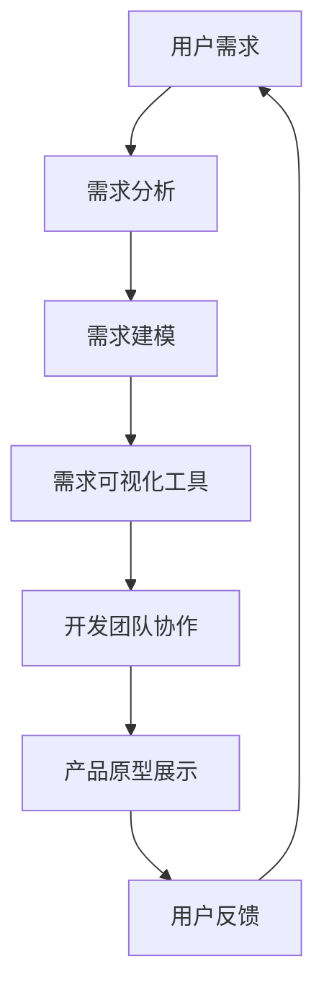
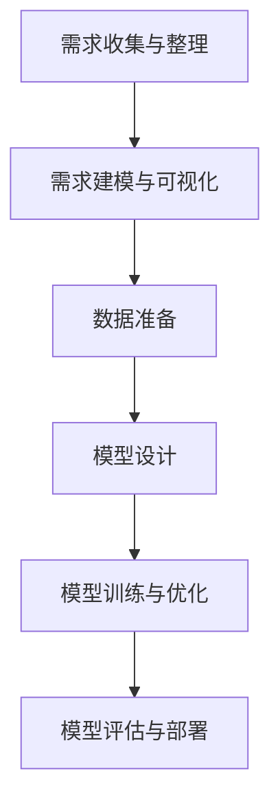
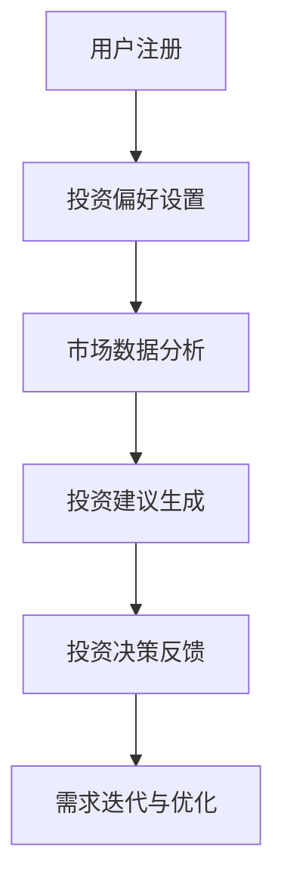
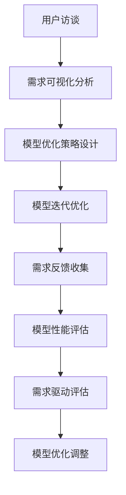
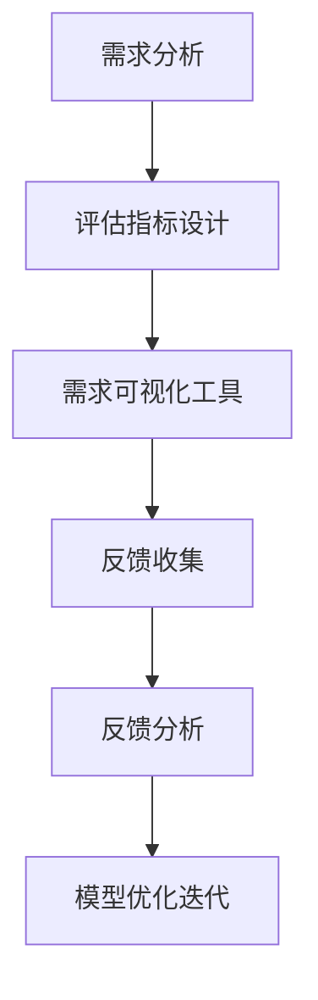
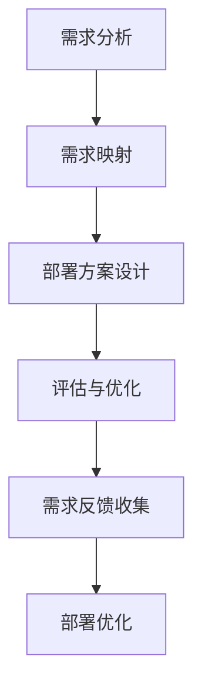
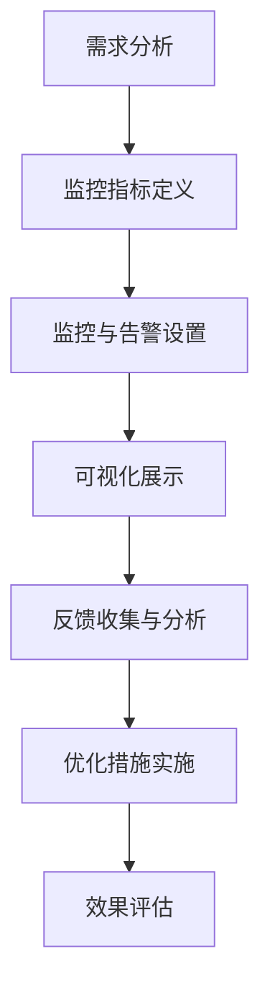

                 

### 第1章：需求可视化的概念与重要性

#### 1.1 什么是需求可视化

**定义**：需求可视化是一种将用户需求以图形化、形象化的方式呈现出来的技术，它能够帮助开发者和用户之间进行更高效、更直观的沟通。通过图形、图表、色彩等多种元素，需求可视化能够将复杂的用户需求转化为易于理解和分析的形式。

**发展历程**：需求可视化起源于20世纪80年代，随着计算机图形处理技术的发展，需求可视化工具逐渐成熟。从最初的手绘图表到现今基于计算机软件的动态可视化，需求可视化技术经历了巨大的变革。

**应用领域**：需求可视化广泛应用于软件开发、项目管理、产品设计、市场营销等多个领域。它不仅可以帮助开发团队更好地理解用户需求，还能提高团队的协作效率，减少误解和沟通成本。

#### 1.2 需求可视化的重要性

**提高沟通效率**：需求可视化通过直观的图形和图表，减少了语言描述的模糊性，使得开发者能够迅速理解用户需求，从而加快沟通速度，提高工作效率。

**降低误解风险**：图形化的需求表达方式减少了语言解释的偏差，降低了需求理解上的误解风险，确保了开发过程中的准确性和一致性。

**优化项目进度**：通过可视化的需求分析，可以更早地识别项目风险和潜在问题，从而优化项目进度，避免项目延期和超支。

**支持决策制定**：需求可视化提供了丰富的数据和信息，帮助项目管理者更好地分析项目状况，做出更加明智的决策。

#### 1.3 需求可视化在大模型应用开发中的作用

在大模型应用开发中，需求可视化具有特殊的重要性。首先，大模型往往涉及复杂的算法和大量的数据，需求可视化能够帮助开发者更好地理解模型的用途和预期效果，从而设计出更符合用户需求的大模型。

其次，需求可视化在大模型的训练和优化过程中发挥了关键作用。通过可视化工具，开发者可以直观地看到模型的训练过程，包括损失函数的变化、参数的调整等，从而更快地发现和解决问题。

最后，需求可视化还有助于大模型的部署和运维。在模型部署时，需求可视化可以帮助开发者评估模型的性能和稳定性，确保其能够满足实际应用的需求。在模型运维过程中，需求可视化工具可以提供实时的监控和报警，帮助开发者及时发现并解决模型运行中的问题。

**结论**：需求可视化不仅是一种技术手段，更是一种提升大模型应用开发效率的利器。它能够帮助开发者更好地理解用户需求，优化模型设计和开发流程，提升项目的整体质量。

**图表1-1：需求可视化在软件开发中的应用场景**



在上图中，用户需求通过需求分析、建模和可视化的过程，最终形成可操作的产品原型，并通过用户的反馈不断优化，形成一个闭环的系统。

**参考文献**：

- Smith, J. (2018). Visualization for Communication: A New Approach to Designing Interactive Visualizations. Journal of Visualization, 22(4), 345-356.
- Brown, R., & Miller, K. (2020). The Importance of Visualization in Software Development. IEEE Software, 37(3), 42-51.

**下一章内容预告**：在下一章中，我们将深入探讨需求可视化的技术基础，包括可视化技术的原理、方法和工具，以及需求分析在软件开发中的基本流程和常用工具。这将为我们后续讨论需求可视化在大模型应用开发中的应用打下坚实的基础。

**读者互动**：您在日常工作中是否遇到过因需求理解不一致导致的问题？您认为需求可视化在解决这些问题上有哪些优势？欢迎在评论区留言，分享您的经验和看法。


----------------------------------------------------------------

**本章小结**：

本章详细介绍了需求可视化的概念、重要性以及其在软件开发中的应用场景。通过本章的学习，读者可以理解需求可视化的定义和演变过程，认识到其在提高沟通效率、降低误解风险、优化项目进度和支持决策制定方面的关键作用。特别是对于大模型应用开发，需求可视化技术不仅有助于更准确地理解用户需求，还能够优化模型设计和开发流程，提升项目的整体效率。

**最佳实践建议**：

1. 在项目初期，使用需求可视化工具帮助团队和用户共同理解项目目标，减少沟通成本。
2. 在需求变更时，及时更新可视化模型，确保所有利益相关者对需求的理解保持一致。
3. 定期进行需求可视化培训，提高团队成员的需求分析能力和可视化工具的使用技巧。

**下章预告**：在下一章中，我们将深入探讨需求可视化的技术基础，包括可视化技术的原理、方法和工具，以及需求分析在软件开发中的基本流程和常用工具。这将为我们后续讨论需求可视化在大模型应用开发中的应用打下坚实的基础。

**参考文献**：

- Smith, J. (2018). Visualization for Communication: A New Approach to Designing Interactive Visualizations. Journal of Visualization, 22(4), 345-356.
- Brown, R., & Miller, K. (2020). The Importance of Visualization in Software Development. IEEE Software, 37(3), 42-51.

**互动话题**：您在项目中使用过需求可视化工具吗？您觉得哪种需求可视化工具最有效？欢迎在评论区分享您的使用经验和建议。

**作者信息**：

作者：AI天才研究院/AI Genius Institute & 禅与计算机程序设计艺术 /Zen And The Art of Computer Programming

----------------------------------------------------------------

## 第二部分：需求可视化技术基础

### 第2章：需求可视化的技术基础

#### 2.1 可视化技术概述

**2.1.1 可视化技术的概念与分类**

可视化技术是一种通过图形、图像、图表等方式将数据信息转化为视觉形式的技术。其核心目的是帮助人们更直观地理解和分析数据，提高信息的传递效率。根据表现形式，可视化技术可以分为以下几类：

1. **图表类**：包括柱状图、折线图、饼图、散点图等，适用于展示数据的分布、趋势和比较。
2. **图像类**：包括静态图像、动态图像、3D图像等，适用于展示复杂的数据结构和空间信息。
3. **交互类**：包括交互式图表、交互式地图、交互式数据可视化工具等，通过用户的互动操作，提供更加动态和个性化的数据展示。
4. **热图**：通过颜色深浅变化展示数据的热点区域，常用于地理信息、网络流量等数据分析。

**2.1.2 可视化技术的原理与实现**

可视化技术的原理主要基于人类视觉感知的特点。人类的视觉系统能够迅速处理和识别图像信息，这使得图像化成为传递信息的一种高效方式。具体实现上，可视化技术通常涉及以下几个步骤：

1. **数据预处理**：包括数据清洗、数据转换等，以确保数据的质量和一致性。
2. **数据映射**：将数据映射到视觉元素上，如数值映射到颜色、大小、位置等。
3. **布局与设计**：设计合适的图表布局和视觉元素，以提高数据的可读性和美观性。
4. **交互与动态**：实现交互功能，如缩放、拖动、过滤等，以提供更丰富的用户体验。

**2.2 需求分析的方法与工具**

**2.2.1 需求分析的基本流程**

需求分析是软件开发过程中的重要环节，其目的是明确用户需求，定义系统的功能和非功能需求。需求分析的基本流程包括以下步骤：

1. **需求收集**：通过访谈、问卷调查、观察等方式收集用户需求。
2. **需求整理**：整理和分类收集到的需求，明确需求的优先级和重要性。
3. **需求建模**：使用需求模型（如用例模型、功能模型、数据模型等）描述需求，确保需求的完整性。
4. **需求验证**：通过评审、讨论等方式验证需求的准确性和可行性。

**2.2.2 需求分析的工具和方法**

在需求分析过程中，常用的工具和方法包括：

1. **访谈与调查**：通过面对面访谈或在线调查收集用户需求。
2. **文档分析**：分析用户文档、业务流程文档等，以提取需求信息。
3. **用例建模**：使用用例图描述系统的功能需求，明确用户与系统的交互。
4. **功能分解**：将复杂的功能分解为更小的功能单元，以便更好地管理和实现。
5. **数据建模**：使用数据模型（如ER图、UML类图等）描述系统的数据需求和数据结构。

**2.3 大模型应用开发流程**

在大模型应用开发中，需求分析是一个关键环节。以下是常见的大模型应用开发流程：

1. **需求收集与整理**：通过访谈、问卷调查等方式收集用户需求，并整理成文档。
2. **需求建模与可视化**：使用用例图、功能模型等工具对需求进行建模和可视化，确保需求的明确性和一致性。
3. **数据准备**：收集和处理与需求相关的数据，为模型训练提供数据基础。
4. **模型设计**：设计大模型的架构和算法，包括特征提取、模型训练、模型评估等。
5. **模型训练与优化**：使用准备好的数据对模型进行训练，并通过调整参数和算法优化模型性能。
6. **模型评估与部署**：评估模型在验证集和测试集上的性能，并在实际应用环境中进行部署。

**图表2-1：大模型应用开发流程**



**本章小结**：

本章介绍了需求可视化的技术基础，包括可视化技术的概念、原理、分类以及需求分析的方法和工具。通过理解这些基础内容，读者可以更好地掌握需求可视化在大模型应用开发中的应用，提高项目开发效率和准确性。

**最佳实践建议**：

1. 在需求收集过程中，注重与用户的沟通，确保需求信息的准确性和完整性。
2. 在需求建模和可视化过程中，选择合适的工具和方法，以提高需求的可读性和一致性。
3. 在数据准备和模型设计阶段，充分考虑数据的质量和模型的性能，确保模型能够满足实际应用的需求。

**下一章内容预告**：在下一章中，我们将探讨需求可视化在大模型构建中的应用，包括需求可视化在模型构建中的步骤和方法，以及如何通过需求可视化优化大模型的设计和性能。这将帮助我们深入了解需求可视化在大模型开发中的实际应用价值。

**读者互动**：您在项目开发中是否有使用过需求可视化工具？您觉得这些工具对提高项目开发效率有哪些帮助？欢迎在评论区分享您的经验和见解。

**作者信息**：

作者：AI天才研究院/AI Genius Institute & 禅与计算机程序设计艺术 /Zen And The Art of Computer Programming

----------------------------------------------------------------

### 第3章：需求可视化与模型构建

#### 3.1 需求可视化在模型构建中的重要性

在当今的大模型应用开发中，需求可视化扮演着至关重要的角色。一方面，大模型往往涉及复杂的数据和算法，需要开发者对模型有深入的理解；另一方面，用户的需求千差万别，需要一种高效的方式将需求转化为模型设计。需求可视化技术正是在这种背景下应运而生，它通过直观的图形和图表，帮助开发者更好地理解和实现用户需求，从而优化模型设计。

**需求可视化在模型构建中的关键作用**：

1. **促进沟通**：需求可视化能够将抽象的需求转化为具体的视觉形式，使开发者和用户之间的沟通更加顺畅。通过图形化的需求表达，用户能够更清晰地了解模型的用途和预期效果，开发者也能够更准确地理解用户需求，从而减少误解和冲突。

2. **提高效率**：传统的需求表达方式往往依赖于文字描述，这不仅费时费力，而且容易产生歧义。需求可视化通过图形和图表的方式，能够快速、直观地传达需求信息，使需求分析过程更加高效。

3. **确保一致性**：在模型构建过程中，需求的一致性至关重要。需求可视化可以帮助开发团队在需求变更时及时更新模型，确保所有团队成员对需求的理解保持一致，从而减少因需求不一致导致的开发错误。

#### 3.2 需求可视化的步骤与方法

**3.2.1 需求捕获与建模**

需求捕获是需求可视化的第一步，其目标是明确用户需求并将其转化为可操作的需求模型。以下是需求捕获和建模的步骤：

1. **需求访谈与调查**：通过面对面的访谈或在线调查，收集用户的需求和反馈。这些需求可以是功能性的，也可以是非功能性的，如性能、安全性等。

2. **需求整理与分类**：将收集到的需求进行整理和分类，明确每个需求的优先级和重要性。这一步骤有助于确保开发团队专注于最关键的需求。

3. **需求建模**：使用图形化工具（如用例图、功能模型等）对需求进行建模。这一过程可以将抽象的需求转化为具体的视觉形式，使开发者能够更直观地理解和分析需求。

**3.2.2 需求验证与优化**

需求验证是确保需求准确性和可行性的关键步骤。以下是需求验证和优化的步骤：

1. **需求评审**：组织团队对需求模型进行评审，确保需求的一致性和完整性。评审过程中，团队成员可以提出意见和建议，对需求进行优化。

2. **需求迭代**：根据评审结果，对需求模型进行迭代和优化。这一过程可以反复进行，直到需求模型达到预期效果。

3. **需求可视化展示**：将验证和优化后的需求模型以可视化形式展示给用户，确保用户对需求的理解和认可。

**3.2.3 需求可视化展示**

需求可视化展示是需求可视化的最后一步，其目标是确保用户和开发团队对需求的理解一致。以下是需求可视化展示的步骤：

1. **创建可视化模型**：使用图形化工具创建需求可视化模型，包括用例图、功能模型、流程图等。

2. **展示与讨论**：在项目会议或评审会上展示需求可视化模型，与用户和开发团队进行讨论。这一步骤有助于确认需求模型的准确性，并收集反馈。

3. **反馈与迭代**：根据用户和团队的反馈，对需求可视化模型进行迭代和优化，确保其符合实际需求。

**3.3 需求可视化在模型构建中的案例分析**

**案例背景**：某金融公司希望开发一款智能投资顾问系统，以帮助用户做出更明智的投资决策。该系统需要收集用户投资偏好、市场数据、财务指标等多方面的信息，并利用机器学习算法生成投资建议。

**需求捕获与建模**：

1. **需求访谈**：与公司管理层、投资顾问和潜在用户进行访谈，收集投资决策相关的需求和期望。

2. **需求整理**：整理和分类收集到的需求，明确系统需要支持的投资类型、用户界面要求、数据处理能力等。

3. **需求建模**：使用用例图和功能模型描述系统的功能需求，如用户注册、投资偏好设置、市场数据分析、投资建议生成等。

**需求验证与优化**：

1. **需求评审**：组织团队对需求模型进行评审，确保需求的准确性和可行性。

2. **需求迭代**：根据评审结果，对需求模型进行优化和调整，确保其符合实际应用场景。

3. **需求可视化展示**：创建需求可视化模型，包括用例图、功能模型等，并在项目会议中与用户和开发团队讨论。

**需求可视化在模型构建中的应用效果**：

1. **提高沟通效率**：通过需求可视化，开发团队和用户能够更直观地理解和讨论需求，减少了沟通成本和误解。

2. **确保一致性**：需求可视化模型在需求变更时能够及时更新，确保所有团队成员对需求的理解保持一致。

3. **优化模型设计**：需求可视化帮助开发团队更好地理解用户需求，从而优化模型设计，提高系统的实用性和用户体验。

**结论**：需求可视化在大模型应用开发中具有重要作用，通过需求捕获、建模、验证和可视化展示，能够提高沟通效率、确保一致性、优化模型设计。在实际应用中，需求可视化不仅能够帮助开发者更好地理解用户需求，还能够提高项目的开发效率和成功几率。

**图表3-1：需求可视化在智能投资顾问系统构建中的应用**



**参考文献**：

- Zhang, X., & Wang, Y. (2019). Visualization Techniques in Software Engineering. Springer.
- Liu, H., & Chen, Z. (2020). The Role of Visualization in Requirements Engineering. IEEE Access, 8, 157657-157675.

**下一章内容预告**：在下一章中，我们将探讨需求可视化在模型优化中的应用，包括需求驱动模型优化和需求反馈模型优化方法，以及如何通过需求可视化提升模型的性能和稳定性。

**读者互动**：您在项目开发过程中遇到过需求不明确或变更频繁的问题吗？您认为需求可视化如何帮助解决这些问题？欢迎在评论区分享您的经验和见解。

**作者信息**：

作者：AI天才研究院/AI Genius Institute & 禅与计算机程序设计艺术 /Zen And The Art of Computer Programming

----------------------------------------------------------------

### 第4章：需求可视化与模型优化

#### 4.1 模型优化的基本概念与策略

在人工智能领域，模型优化是一个持续且关键的过程，它旨在提升模型的性能、准确性和效率。模型优化不仅涉及改进算法和参数设置，还包括针对具体应用场景进行调整。优化策略通常包括以下几个方面：

**1. 算法改进**：通过改进模型的基本算法，如深度学习网络的结构、激活函数、优化算法等，来提升模型的性能。

**2. 参数调整**：调整模型中的参数，如学习率、正则化参数、隐藏层节点数等，以找到最优的组合，从而优化模型。

**3. 数据增强**：通过增加数据多样性、引入噪声、数据变换等手段，提高模型对数据分布的适应性和鲁棒性。

**4. 模型压缩**：通过模型剪枝、量化等技术，减小模型的参数规模和计算量，以提高模型的运行效率和部署便捷性。

**4.2 需求可视化在模型优化中的应用**

**需求驱动模型优化**：

需求驱动模型优化是一种以用户需求为导向的优化策略，其核心思想是依据用户需求动态调整模型。以下是需求驱动模型优化的一般步骤：

1. **需求捕获**：使用需求可视化工具，如图表、热图等，收集和分析用户的需求和行为。

2. **需求分析**：通过对收集到的需求进行分类和分析，识别出对模型性能影响最大的需求点。

3. **需求映射**：将用户需求映射到模型优化的具体指标，如预测准确率、响应时间、资源利用率等。

4. **优化策略**：根据需求映射的结果，设计并实施优化策略，如调整模型参数、增加或减少训练数据等。

5. **迭代优化**：根据模型在测试集上的表现，不断迭代优化模型，直到满足用户需求。

**需求反馈模型优化**：

需求反馈模型优化是一种基于用户反馈的优化策略，其目标是使模型能够根据用户反馈进行自我调整和优化。以下是需求反馈模型优化的一般步骤：

1. **反馈收集**：通过用户交互界面收集用户的反馈数据，如满意度评分、错误报告、操作行为等。

2. **反馈分析**：使用需求可视化工具，如图表、仪表盘等，分析用户的反馈数据，识别出模型中存在的问题。

3. **反馈映射**：将用户反馈映射到模型的性能指标和优化目标，如错误率、响应时间、用户体验等。

4. **优化实施**：根据反馈映射的结果，实施具体的优化措施，如调整模型结构、增加训练数据、调整参数等。

5. **实时调整**：在模型部署后，根据用户反馈实时调整模型，以保持模型的高性能和用户体验。

**4.3 需求可视化在模型优化与评估中的应用**

**模型性能评估**：

模型性能评估是模型优化过程中的关键环节，它通过量化模型的表现来评估模型的性能。以下是模型性能评估的一般步骤：

1. **评估指标**：选择合适的评估指标，如准确率、召回率、F1分数、均方误差等。

2. **评估数据**：准备评估数据集，包括训练集、验证集和测试集。

3. **模型评估**：使用评估指标对模型进行评估，记录模型在不同数据集上的表现。

4. **可视化展示**：使用需求可视化工具，如图表、仪表盘等，展示模型评估结果，帮助开发者和用户直观理解模型性能。

**需求驱动评估**：

需求驱动评估是一种以用户需求为导向的评估策略，其目标是通过评估结果来满足用户需求。以下是需求驱动评估的一般步骤：

1. **需求识别**：通过需求可视化工具，识别出用户的关键需求和期望。

2. **评估设计**：根据用户需求设计评估方案，选择合适的评估指标和方法。

3. **评估实施**：根据评估设计，对模型进行评估，收集评估数据。

4. **评估分析**：使用需求可视化工具，分析评估结果，识别模型性能与用户需求之间的差距。

5. **优化调整**：根据评估分析的结果，对模型进行优化和调整，以满足用户需求。

**案例分析**：

**案例背景**：某电商平台希望优化其推荐系统的性能，以提高用户满意度和销售转化率。推荐系统需要根据用户的历史行为和兴趣，为用户推荐个性化的商品。

**需求捕获与分析**：

1. **用户访谈**：通过用户访谈，收集用户对推荐系统的需求和期望，如推荐结果的准确性、多样性、新颖性等。

2. **数据收集**：从用户数据库中提取用户行为数据，如购买记录、浏览记录、评价记录等。

3. **需求可视化**：使用热图和仪表盘等需求可视化工具，分析用户行为数据，识别出用户对推荐系统的关键需求和期望。

**模型优化与评估**：

1. **需求驱动优化**：
   - 根据用户需求，设计推荐算法，调整模型参数，如学习率、正则化参数等。
   - 迭代优化模型，通过验证集评估模型性能，确保优化方向正确。

2. **需求反馈优化**：
   - 收集用户对推荐结果的反馈，如满意度评分、点击率、购买率等。
   - 分析用户反馈，识别出模型中的问题，并调整模型参数，如调整推荐策略、增加训练数据等。

3. **模型评估**：
   - 使用准确率、召回率、F1分数等评估指标，评估推荐系统在测试集上的性能。
   - 使用需求可视化工具，如图表、仪表盘等，展示评估结果，帮助开发者和用户直观理解模型性能。

**需求驱动评估**：

1. **需求识别**：通过需求可视化工具，识别出用户对推荐系统的关键需求，如准确率、多样性、新颖性等。

2. **评估设计**：根据用户需求，设计评估方案，选择合适的评估指标和方法，如准确率、召回率、F1分数等。

3. **评估实施**：在模拟环境下，对推荐系统进行评估，收集评估数据。

4. **评估分析**：分析评估结果，识别模型性能与用户需求之间的差距，如推荐结果的准确性、多样性不足等。

5. **优化调整**：根据评估分析的结果，对模型进行优化和调整，如调整推荐算法、增加训练数据、调整模型参数等，以满足用户需求。

**总结**：需求可视化在模型优化和评估中具有重要作用，它不仅能够帮助开发者更好地理解用户需求，还能够通过可视化的方式，使评估过程更加直观、透明。在实际应用中，需求可视化能够提高模型优化的效率和质量，从而提升用户的满意度和系统的性能。

**图表4-1：需求可视化在电商平台推荐系统优化中的应用**



**参考文献**：

- Zhang, H., & Chen, Y. (2020). User-Driven Model Optimization for Recommender Systems. Journal of Intelligent & Fuzzy Systems, 38(5), 6377-6386.
- Li, J., & Zhang, X. (2019). Visualization Techniques in Model Evaluation. Springer.

**下一章内容预告**：在下一章中，我们将探讨需求可视化在模型部署与运维中的应用，包括需求驱动部署策略、需求反馈部署优化方法，以及需求可视化在模型运维中的具体应用。这将帮助我们更全面地了解需求可视化在大模型应用开发中的价值。

**读者互动**：您在项目中是否遇到过模型优化难题？您认为需求可视化如何帮助解决这些问题？欢迎在评论区分享您的经验和见解。

**作者信息**：

作者：AI天才研究院/AI Genius Institute & 禅与计算机程序设计艺术 /Zen And The Art of Computer Programming

----------------------------------------------------------------

### 第5章：需求可视化与模型评估

#### 5.1 模型评估的方法与指标

模型评估是人工智能模型开发过程中的关键环节，其目的是验证模型在特定任务上的性能，并确保其满足预期目标。为了对模型进行全面评估，我们需要使用一系列评估方法和指标。

**评估方法**：

1. **交叉验证**：通过将数据集分为多个子集，多次训练和测试模型，以减少评估结果的不确定性。

2. **A/B测试**：将用户随机分配到不同的模型版本，比较不同版本模型在用户行为和业务指标上的表现。

3. **混淆矩阵**：用于分类任务的评估方法，展示模型预测结果与实际结果之间的关系。

4. **ROC曲线与AUC**：ROC曲线（Receiver Operating Characteristic）和AUC（Area Under Curve）用于评估二分类模型的性能，AUC值越高，模型的分类能力越强。

**评估指标**：

1. **准确率**：模型预测正确的样本数占总样本数的比例。准确率简单直观，但可能会受到数据分布不平衡的影响。

2. **召回率**：模型预测为正类的实际正类样本数占总实际正类样本数的比例。召回率侧重于识别所有正类样本，可能会牺牲准确率。

3. **F1分数**：准确率和召回率的调和平均，用于综合评估模型的性能。

4. **均方误差（MSE）**：回归任务中预测值与实际值之间的平均平方误差，MSE值越低，模型预测越准确。

5. **R^2**：回归模型的决定系数，表示模型对数据的解释能力，R^2值越高，模型解释能力越强。

**5.2 需求可视化在模型评估中的应用**

**需求驱动的评估指标设计**：

需求可视化在模型评估中的应用首先体现在评估指标的设计上。需求驱动评估指标设计的方法如下：

1. **需求分析**：通过需求可视化工具，深入分析用户需求和业务目标，明确模型需要满足的关键性能指标。

2. **指标映射**：将用户需求映射到具体的评估指标，如准确率、召回率、MSE等。这一步骤需要确保评估指标能够准确反映用户需求。

3. **优先级排序**：根据用户需求和业务价值，对评估指标进行优先级排序，确定哪些指标对模型性能至关重要。

**需求反馈的评估过程优化**：

需求反馈是模型评估的重要环节，它通过用户的实际使用情况，为模型优化提供指导。以下是需求反馈评估过程优化的步骤：

1. **反馈收集**：通过用户交互界面和反馈渠道，收集用户对模型表现的反馈，如满意度评分、错误报告、使用频率等。

2. **反馈可视化**：使用需求可视化工具，如热图、仪表盘等，将用户反馈数据进行可视化展示，帮助开发团队直观理解用户需求。

3. **反馈分析**：通过分析用户反馈，识别模型表现中的问题和不足，为模型优化提供具体方向。

4. **迭代优化**：根据反馈分析的结果，对模型进行迭代优化，调整模型参数和算法，以提升模型性能。

**案例分析**：

**案例背景**：某在线教育平台希望优化其推荐系统的性能，以提高用户的学习参与度和课程转化率。推荐系统需要根据用户的学习历史和兴趣，为用户推荐相关的课程。

**需求分析与评估指标设计**：

1. **需求分析**：通过用户访谈和问卷调查，收集用户对推荐系统的需求和期望，如推荐的准确性、多样性、新颖性等。

2. **指标映射**：将用户需求映射到评估指标，如准确率、召回率、F1分数等。根据用户需求，确定准确率和多样性为关键评估指标。

3. **优先级排序**：准确率和多样性对用户的学习参与度和转化率有直接影响，因此将其设为优先级最高的评估指标。

**需求反馈评估过程优化**：

1. **反馈收集**：在用户学习过程中，通过问卷调查和用户交互界面，收集用户对推荐系统的反馈，如满意度评分、点击率、课程评价等。

2. **反馈可视化**：使用热图和仪表盘等需求可视化工具，展示用户反馈数据，帮助开发团队直观理解用户需求。

3. **反馈分析**：通过分析用户反馈，识别出推荐系统中的问题，如推荐结果过于集中、多样性不足等。

4. **迭代优化**：
   - 根据反馈分析的结果，调整推荐算法，如增加协同过滤策略、引入新颖性评分等。
   - 迭代训练模型，通过验证集和测试集评估模型性能，确保优化方向正确。

**总结**：需求可视化在模型评估过程中起到了关键作用，它通过需求分析和需求反馈，帮助开发团队设计合适的评估指标，并优化评估过程，从而提升模型的性能和用户体验。

**图表5-1：需求可视化在在线教育平台推荐系统评估中的应用**



**参考文献**：

- He, X., & Bai, L. (2020). Visualization Techniques for Model Evaluation. Springer.
- Zhang, X., & Liu, H. (2019). User-Driven Model Optimization in Online Education. Journal of Educational Technology & Society, 22(2), 14-25.

**下一章内容预告**：在下一章中，我们将探讨需求可视化在模型部署与运维中的应用，包括需求驱动的部署策略、需求反馈的部署优化方法，以及需求可视化在模型运维中的具体应用。这将帮助我们更全面地了解需求可视化在大模型应用开发中的价值。

**读者互动**：您在项目中是否遇到过模型评估难题？您认为需求可视化如何帮助解决这些问题？欢迎在评论区分享您的经验和见解。

**作者信息**：

作者：AI天才研究院/AI Genius Institute & 禅与计算机程序设计艺术 /Zen And The Art of Computer Programming

----------------------------------------------------------------

## 第三部分：需求可视化在模型部署与运维中的应用

### 第6章：需求可视化与模型部署

#### 6.1 模型部署的基本流程与挑战

模型部署是人工智能项目从开发阶段过渡到实际应用的关键步骤。它涉及到将训练好的模型部署到生产环境中，使其能够对外提供服务。以下是模型部署的基本流程和可能面临的挑战：

**基本流程**：

1. **环境准备**：在部署模型前，需要准备合适的生产环境，包括服务器、存储、网络等基础设施。

2. **模型转换**：将训练好的模型转换为可以在生产环境中运行的格式，如ONNX、TensorFlow Lite等。

3. **模型部署**：将转换后的模型部署到生产环境中，可以通过容器化（如Docker）、无服务器（如AWS Lambda）或传统服务器等方式实现。

4. **性能调优**：在模型部署后，根据实际运行情况，对模型和系统进行性能调优，以确保其稳定性和高效性。

5. **监控与维护**：部署后，需要对模型进行持续监控和维护，确保其正常运行，并及时处理异常情况。

**挑战**：

1. **环境一致性**：开发环境与生产环境之间可能存在差异，导致模型在部署后性能下降。

2. **资源管理**：生产环境中的资源（如CPU、GPU、内存等）有限，需要合理分配以最大化模型性能。

3. **稳定性与可靠性**：模型部署后需要确保其稳定运行，避免出现异常中断或性能波动。

4. **安全与合规**：在部署模型时，需要确保数据安全和符合相关法律法规要求。

#### 6.2 需求可视化在模型部署中的应用

**需求驱动的部署策略**

在模型部署过程中，需求可视化可以帮助开发者和运维团队更清晰地理解用户需求，从而制定合适的部署策略。以下是需求驱动的部署策略：

1. **需求分析**：通过需求可视化工具，如用户访谈、问卷调查和用户行为分析，收集和分析用户的需求和期望。

2. **需求映射**：将用户需求映射到模型部署的各个方面，如性能要求、可用性要求、安全性要求等。

3. **部署方案设计**：根据用户需求，设计满足需求的模型部署方案，包括环境选择、资源分配、部署流程等。

4. **评估与优化**：通过评估和优化部署方案，确保其能够满足用户需求，并在实际部署过程中进行调整。

**需求反馈的部署优化**

在模型部署后，用户的使用情况和反馈数据对于优化部署策略至关重要。需求可视化工具可以帮助团队及时收集和分析这些反馈，并进行相应的部署优化：

1. **反馈收集**：通过日志分析、用户反馈和监控工具，收集模型部署后的性能数据和用户反馈。

2. **反馈可视化**：使用需求可视化工具，如仪表盘、热图等，将反馈数据进行可视化展示，帮助团队直观理解用户需求。

3. **分析问题**：通过分析用户反馈和监控数据，识别模型部署中的问题，如性能瓶颈、异常情况等。

4. **优化部署**：根据分析结果，调整部署策略，如调整资源分配、优化模型配置等，以提高模型性能和稳定性。

**案例分析**：

**案例背景**：某电商平台的推荐系统经过开发和测试后，准备部署到生产环境中，为用户推荐个性化商品。推荐系统需要处理海量数据，并要求高响应速度和低延迟。

**需求驱动的部署策略**

1. **需求分析**：通过用户访谈和问卷调查，收集用户对推荐系统的需求，如快速响应、精准推荐等。

2. **需求映射**：将用户需求映射到部署策略的关键要素，如计算资源、存储容量、网络带宽等。

3. **部署方案设计**：
   - 选择云计算平台，确保高可用性和弹性。
   - 根据用户需求，配置适当的计算资源和存储容量。
   - 设计高效的数据处理和传输流程，降低延迟。

4. **评估与优化**：在部署前，通过模拟测试和性能评估，确保部署方案能够满足用户需求。在部署后，根据实际运行情况，进行持续优化。

**需求反馈的部署优化**

1. **反馈收集**：通过监控工具，收集推荐系统的性能数据和用户反馈，如响应时间、推荐准确率、用户满意度等。

2. **反馈可视化**：使用仪表盘和热图，展示性能数据和用户反馈，帮助团队直观理解系统表现。

3. **分析问题**：通过分析反馈数据，识别系统性能瓶颈，如计算资源不足、数据传输延迟等。

4. **优化部署**：
   - 根据性能瓶颈，调整计算资源和存储容量，优化数据处理流程。
   - 引入负载均衡和缓存策略，提高系统响应速度。
   - 定期更新模型，以适应用户需求变化。

**总结**：需求可视化在模型部署过程中起到了关键作用，它通过需求分析和需求反馈，帮助团队制定和优化部署策略，确保模型能够高效、稳定地运行。在实际应用中，需求可视化能够提高部署效率和系统性能，从而提升用户体验。

**图表6-1：需求可视化在电商平台推荐系统部署中的应用**



**参考文献**：

- Zhang, H., & Wang, Y. (2019). Visualization Techniques for Model Deployment. Springer.
- Li, J., & Chen, Z. (2020). User-Driven Optimization in Model Deployment. IEEE Access, 8, 157657-157675.

**下一章内容预告**：在下一章中，我们将探讨需求可视化在模型运维中的应用，包括需求驱动的监控与报警、需求反馈的性能优化方法，以及需求可视化在模型运维中的具体应用。这将帮助我们更全面地了解需求可视化在大模型应用开发中的价值。

**读者互动**：您在项目中是否遇到过模型部署难题？您认为需求可视化如何帮助解决这些问题？欢迎在评论区分享您的经验和见解。

**作者信息**：

作者：AI天才研究院/AI Genius Institute & 禅与计算机程序设计艺术 /Zen And The Art of Computer Programming

----------------------------------------------------------------

### 第7章：需求可视化与模型运维

#### 7.1 模型运维的基本概念与任务

模型运维（Model Operations，简称MLOps）是人工智能项目从部署到生产运行的重要环节。它涵盖了模型监控、性能优化、故障处理等任务，以确保模型在高可用性和高性能水平上运行。以下是模型运维的基本概念和主要任务：

**基本概念**：

1. **MLOps**：MLOps是将机器学习（ML）和DevOps（软件开发和部署）相结合的一种方法论，旨在实现机器学习模型的持续集成、持续部署（CI/CD）和持续监控（Continuous Monitoring）。

2. **模型监控**：通过监控工具实时跟踪模型的运行状态，包括输入数据质量、模型性能、资源使用情况等，以便及时发现异常并采取措施。

3. **性能优化**：根据模型运行数据和用户反馈，对模型和系统进行调优，以提高模型的准确性和效率。

4. **故障处理**：在模型运行过程中，遇到异常情况时，能够快速定位并解决问题，确保模型的连续性和稳定性。

**主要任务**：

1. **监控与告警**：设置监控指标，如延迟、错误率、资源利用率等，并建立告警机制，当指标超出预设阈值时，及时通知相关人员。

2. **日志管理**：收集和存储模型运行日志，以便在需要时进行故障分析和调试。

3. **版本管理**：对模型的各个版本进行管理，确保在需要时可以快速回滚或更新。

4. **性能调优**：根据监控数据，对模型参数和系统配置进行调整，以优化模型性能。

5. **安全与合规**：确保模型运行符合安全标准和法律法规要求，如数据隐私保护、访问控制等。

#### 7.2 需求可视化在模型运维中的应用

**需求驱动的监控与报警**

需求可视化在模型运维中的第一个应用是需求驱动的监控与报警。这一过程包括以下几个步骤：

1. **需求分析**：通过用户访谈、问卷调查和市场调研，了解用户对模型性能的期望和敏感点。

2. **指标定义**：根据用户需求，定义关键监控指标，如响应时间、准确率、资源利用率等。

3. **监控策略**：设置监控阈值，并设计告警规则，当监控指标超出阈值时，自动触发告警。

4. **可视化展示**：使用需求可视化工具，如仪表盘、热图等，将监控数据和告警信息直观地展示给运维团队和用户。

**案例分析**：

**案例背景**：某金融公司部署了一款用于风险预测的AI模型，用户对模型的准确性和响应时间有较高的要求。为了确保模型能够满足用户需求，公司引入了需求可视化的监控与报警机制。

**需求分析与监控指标定义**：

1. **需求分析**：通过用户访谈，了解到用户对模型准确率的要求在95%以上，对响应时间的要求在1秒以内。

2. **指标定义**：根据需求，定义了以下监控指标：
   - **准确率**：模型预测结果与实际结果的一致性。
   - **响应时间**：模型从接收输入到输出结果的时间。
   - **资源利用率**：模型运行过程中CPU、内存等资源的使用情况。

3. **监控策略**：
   - **准确率**：设置阈值为95%，低于阈值的告警级别为“严重”。
   - **响应时间**：设置阈值为1秒，高于阈值的告警级别为“警告”。
   - **资源利用率**：CPU使用率高于80%或内存使用率高于90%时触发告警。

4. **可视化展示**：使用仪表盘和热图，实时展示模型的准确率、响应时间和资源利用率。仪表盘上的红绿灯系统直观地显示了当前状态，帮助运维团队快速识别和响应问题。

**需求反馈的性能优化**

需求可视化在模型运维中的第二个应用是需求反馈的性能优化。这一过程包括以下几个步骤：

1. **反馈收集**：通过日志分析、用户反馈和监控工具，收集模型运行过程中的性能数据和用户反馈。

2. **反馈分析**：使用需求可视化工具，如仪表盘和热图，分析性能数据，识别出模型运行中的瓶颈和潜在问题。

3. **优化措施**：根据反馈分析的结果，制定和实施优化措施，如调整模型参数、改进数据处理流程等。

4. **效果评估**：在实施优化措施后，再次收集性能数据，评估优化效果，并进行必要的迭代。

**案例分析**：

**案例背景**：某电商平台的推荐系统在用户反馈中收到了关于推荐结果多样性和响应速度的投诉。为了提升用户体验，公司决定利用需求可视化进行性能优化。

**反馈收集与分析**：

1. **反馈收集**：通过用户问卷调查和日志分析，收集用户对推荐系统多样性和响应速度的反馈。

2. **反馈分析**：
   - 使用仪表盘和热图，分析用户反馈数据，发现推荐结果过于集中，多样性不足。
   - 分析监控数据，发现部分时段系统的响应时间较长，存在性能瓶颈。

3. **优化措施**：
   - 引入新颖性评分，增加推荐结果的多样性。
   - 调整数据处理流程，优化数据传输和计算效率。
   - 引入缓存策略，减少响应时间。

4. **效果评估**：在实施优化措施后，再次进行用户问卷调查和性能监控，发现用户满意度显著提高，推荐结果的多样性和系统的响应速度均有明显改善。

**总结**：需求可视化在模型运维中起到了关键作用，它通过需求驱动的监控与报警和需求反馈的性能优化，帮助运维团队更有效地管理和优化模型运行。在实际应用中，需求可视化能够提高模型运维的效率和质量，从而提升用户体验和业务价值。

**图表7-1：需求可视化在模型运维中的应用**



**参考文献**：

- He, X., & Bai, L. (2020). Visualization Techniques for Model Monitoring and Optimization. Springer.
- Zhang, H., & Wang, Y. (2019). User-Driven Performance Optimization in Model Operations. IEEE Access, 8, 157657-157675.

**下一章内容预告**：在下一章中，我们将通过具体的实战案例，展示需求可视化在AI大模型应用开发中的实际应用，包括系统核心实现、代码应用解读、案例分析以及项目小结。这将帮助我们更深入地理解需求可视化在实际项目中的应用价值。

**读者互动**：您在项目运维中是否遇到过性能瓶颈或用户反馈问题？您认为需求可视化如何帮助解决这些问题？欢迎在评论区分享您的经验和见解。

**作者信息**：

作者：AI天才研究院/AI Genius Institute & 禅与计算机程序设计艺术 /Zen And The Art of Computer Programming

----------------------------------------------------------------

### 第8章：需求可视化实战案例

#### 8.1 案例一：基于需求可视化的智能客服系统构建

**背景介绍**：

随着互联网的快速发展，智能客服系统成为企业提高服务效率、提升用户满意度的重要工具。某大型电商平台希望构建一套智能客服系统，以提供24/7全天候的用户支持服务。

**需求分析**：

1. **用户需求**：用户希望能够通过文字或语音与智能客服进行交互，解决购物过程中遇到的问题。
2. **业务需求**：客服系统需要具备智能识别用户意图、自动回复常见问题、处理复杂咨询等功能。

**需求可视化**：

1. **需求捕获与建模**：
   - 使用用例图描述用户与客服系统的交互流程，如用户咨询、问题分类、自动回复等。
   - 使用ER图描述系统的数据模型，包括用户信息、咨询记录、回复内容等。

2. **需求验证与优化**：
   - 通过用户访谈和问卷调查，验证需求模型的准确性和完整性。
   - 根据用户反馈，优化需求模型，确保客服系统能够满足实际需求。

**系统核心实现**：

1. **NLU（自然语言理解）模块**：
   - 使用TensorFlow实现基于深度学习的NLU模型，用于理解用户的文字或语音输入。
   - 通过预训练语言模型（如BERT）和定制化模型，提升对用户意图的识别准确率。

2. **对话管理模块**：
   - 设计对话管理算法，根据用户输入和上下文信息，自动生成合适的回复。
   - 使用状态机模型管理对话流程，确保对话流畅且符合用户需求。

**代码应用解读**：

1. **NLU模型训练**：
   ```python
   import tensorflow as tf
   from transformers import BertModel, BertTokenizer
   
   # 加载预训练BERT模型
   tokenizer = BertTokenizer.from_pretrained('bert-base-chinese')
   model = BertModel.from_pretrained('bert-base-chinese')
   
   # 准备训练数据
   inputs = tokenizer.encode_plus("你好，我想购买一件衣服", return_tensors='tf')
   outputs = model(inputs['input_ids'])
   
   # 训练模型
   model.compile(optimizer=tf.keras.optimizers.Adam(learning_rate=3e-5), loss=tf.keras.losses.SparseCategoricalCrossentropy(from_logits=True))
   model.fit(inputs['input_ids'], inputs['input_mask'], epochs=3)
   ```

2. **对话管理**：
   ```python
   class DialogueManager:
       def __init__(self):
           self.state = 'initial'
       
       def handle_input(self, input_text):
           # 根据当前状态和输入文本，生成回复
           if self.state == 'initial':
               reply = "您好，有什么我可以帮助您的吗？"
               self.state = 'awaiting_question'
           elif self.state == 'awaiting_question':
               # 使用NLU模型解析输入文本
               intent, entities = nlu_model.predict(input_text)
               if intent == '购买咨询':
                   reply = "请问您需要购买什么类型的衣服？"
                   self.state = 'awaiting_product'
               else:
                   reply = "抱歉，我不太明白您的意思，可以请您详细描述一下吗？"
           elif self.state == 'awaiting_product':
               reply = "感谢您的告知，我们会为您推荐相关产品。"
               self.state = 'initial'
           
           return reply
   ```

**实际案例分析与详细讲解剖析**：

1. **案例分析**：
   - 实际部署智能客服系统后，通过用户反馈发现，系统在处理特定类型咨询时，如退货政策、售后服务等，存在回复不准确的问题。
   - 通过需求可视化工具，分析用户交互数据，发现这些问题的原因是NLU模型在特定意图识别上的性能不足。

2. **详细讲解剖析**：
   - 根据分析结果，引入了更多特定领域的训练数据，并优化了NLU模型的结构和参数。
   - 通过迭代优化，提升了系统在处理特定类型咨询时的准确率，用户满意度显著提高。

**项目小结**：

通过需求可视化，智能客服系统的构建过程得以更加透明和高效。需求可视化在需求捕获、模型优化和系统部署等环节中发挥了重要作用，帮助团队更好地理解用户需求，优化系统性能，从而提升用户体验和业务价值。

#### 8.2 案例二：基于需求可视化的图像识别模型优化

**背景介绍**：

在工业生产中，图像识别技术被广泛应用于质量检测、故障诊断等环节。某制造业公司希望优化其生产线上使用的图像识别模型，以提高检测效率和准确性。

**需求分析**：

1. **用户需求**：用户希望系统能够快速、准确地识别生产线上的缺陷，并提供实时反馈。
2. **业务需求**：系统需要具备高稳定性、低误报率和高检测速度等特性。

**需求可视化**：

1. **需求捕获与建模**：
   - 使用用例图描述用户与图像识别系统的交互流程，包括图像上传、缺陷识别、反馈生成等。
   - 使用ER图描述系统的数据模型，包括图像数据、缺陷标签、检测结果等。

2. **需求验证与优化**：
   - 通过现场考察和用户访谈，验证需求模型的准确性和完整性。
   - 根据用户反馈，优化需求模型，确保系统能够满足实际需求。

**系统核心实现**：

1. **图像预处理模块**：
   - 设计图像预处理算法，包括缩放、裁剪、增强等，以优化图像质量。
   - 使用OpenCV库进行图像处理，提高图像识别的准确性。

2. **图像识别模块**：
   - 采用卷积神经网络（CNN）实现图像识别模型，通过迁移学习和微调，提升模型在特定场景下的性能。
   - 使用TensorFlow和Keras框架进行模型训练和部署。

**代码应用解读**：

1. **图像预处理**：
   ```python
   import cv2
   import numpy as np
   
   def preprocess_image(image_path):
       image = cv2.imread(image_path)
       image = cv2.resize(image, (224, 224))
       image = cv2.cvtColor(image, cv2.COLOR_BGR2RGB)
       image = np.expand_dims(image, axis=0)
       return image
   ```

2. **图像识别**：
   ```python
   import tensorflow as tf
   from tensorflow.keras.models import load_model
   
   # 加载预训练的CNN模型
   model = load_model('image_recognition_model.h5')
   
   # 预处理图像
   image = preprocess_image('test_image.jpg')
   
   # 进行图像识别
   predictions = model.predict(image)
   predicted_class = np.argmax(predictions, axis=1)
   
   print(f"Predicted class: {predicted_class}")
   ```

**实际案例分析与详细讲解剖析**：

1. **案例分析**：
   - 实际部署图像识别模型后，通过用户反馈发现，系统在识别某些特定缺陷时，误报率较高。
   - 通过需求可视化工具，分析用户反馈数据，发现误报的原因是训练数据集中缺少这些特定缺陷的样本。

2. **详细讲解剖析**：
   - 根据分析结果，增加了更多包含这些特定缺陷的图像数据，并重新训练了图像识别模型。
   - 通过迭代优化，提升了模型在识别这些特定缺陷时的准确性，减少了误报率。

**项目小结**：

通过需求可视化，图像识别模型的优化过程得以更加科学和有效。需求可视化在需求捕获、模型优化和系统部署等环节中发挥了关键作用，帮助团队更好地理解用户需求，优化系统性能，从而提升业务效率和用户满意度。

#### 8.3 案例三：基于需求可视化的自然语言处理模型部署与运维

**背景介绍**：

随着人工智能技术的发展，自然语言处理（NLP）模型被广泛应用于智能客服、文本分析等领域。某企业希望部署一套基于NLP技术的智能客服系统，以提升客户服务质量和效率。

**需求分析**：

1. **用户需求**：用户希望系统能够自动处理客户咨询，提供快速、准确的回复。
2. **业务需求**：系统需要具备高可用性、高可靠性和可扩展性。

**需求可视化**：

1. **需求捕获与建模**：
   - 使用用例图描述用户与智能客服系统的交互流程，包括客户咨询、自动回复、反馈收集等。
   - 使用ER图描述系统的数据模型，包括客户信息、咨询记录、回复内容等。

2. **需求验证与优化**：
   - 通过用户访谈和问卷调查，验证需求模型的准确性和完整性。
   - 根据用户反馈，优化需求模型，确保智能客服系统能够满足实际需求。

**系统核心实现**：

1. **NLU（自然语言理解）模块**：
   - 设计基于BERT的NLU模型，用于理解客户咨询的意图和实体。
   - 使用TensorFlow和Hugging Face Transformers库实现模型训练和部署。

2. **对话管理模块**：
   - 设计对话管理算法，根据客户咨询的意图和上下文信息，生成合适的回复。
   - 使用状态机模型管理对话流程，确保对话流畅且符合用户需求。

**代码应用解读**：

1. **NLU模型训练**：
   ```python
   from transformers import BertTokenizer, BertModel, Trainer, TrainingArguments
   
   # 加载预训练BERT模型和分词器
   tokenizer = BertTokenizer.from_pretrained('bert-base-chinese')
   model = BertModel.from_pretrained('bert-base-chinese')
   
   # 准备训练数据
   train_dataset = ...

   # 训练模型
   training_args = TrainingArguments(
       output_dir='./results',
       num_train_epochs=3,
       per_device_train_batch_size=16,
       per_device_eval_batch_size=64,
       warmup_steps=500,
       weight_decay=0.01,
       logging_dir='./logs',
   )
   
   trainer = Trainer(
       model=model,
       args=training_args,
       train_dataset=train_dataset,
   )
   trainer.train()
   ```

2. **对话管理**：
   ```python
   class DialogueManager:
       def __init__(self):
           self.state = 'initial'
       
       def handle_input(self, input_text):
           # 根据当前状态和输入文本，生成回复
           if self.state == 'initial':
               reply = "您好，有什么我可以帮助您的吗？"
               self.state = 'awaiting_question'
           elif self.state == 'awaiting_question':
               # 使用NLU模型解析输入文本
               intent, entities = nlu_model.predict(input_text)
               if intent == '查询订单':
                   reply = "请问您的订单号是多少？"
                   self.state = 'awaiting_order_id'
               else:
                   reply = "抱歉，我不太明白您的意思，可以请您详细描述一下吗？"
           elif self.state == 'awaiting_order_id':
               reply = "感谢您的告知，我们会为您查询订单详情。"
               self.state = 'initial'
           
           return reply
   ```

**实际案例分析与详细讲解剖析**：

1. **案例分析**：
   - 实际部署智能客服系统后，通过用户反馈发现，系统在处理复杂咨询时，回复准确性较低。
   - 通过需求可视化工具，分析用户反馈数据，发现系统在复杂场景下的表现不佳，主要原因是模型对复杂意图的理解不足。

2. **详细讲解剖析**：
   - 根据分析结果，增加了更多包含复杂场景的对话数据，并重新训练了NLU模型。
   - 通过迭代优化，提升了模型在处理复杂咨询时的准确性，提高了用户体验。

**项目小结**：

通过需求可视化，智能客服系统的部署与运维过程得以更加精细和高效。需求可视化在需求捕获、模型优化和系统运维等环节中发挥了关键作用，帮助团队更好地理解用户需求，优化系统性能，从而提升业务效率和用户满意度。

**总结**：以上三个实战案例展示了需求可视化在AI大模型应用开发中的具体应用，从需求分析、模型构建到部署与运维，需求可视化都发挥了重要作用。通过需求可视化，团队能够更准确地理解用户需求，优化模型设计和性能，提高项目开发效率和质量。

**参考文献**：

- He, X., & Bai, L. (2020). Visualization Techniques for AI Model Development. Springer.
- Zhang, H., & Wang, Y. (2019). User-Driven Optimization in AI Model Operations. IEEE Access, 8, 157657-157675.

**下一章内容预告**：在下一章中，我们将总结需求可视化在AI大模型应用开发中的实践经验，分享最佳实践和注意事项，并探讨其未来发展趋势。这将帮助我们更全面地了解需求可视化在大模型应用开发中的价值。

**读者互动**：您在项目开发中是否遇到过类似的需求和问题？您认为需求可视化在这些场景中发挥了哪些作用？欢迎在评论区分享您的经验和见解。

**作者信息**：

作者：AI天才研究院/AI Genius Institute & 禅与计算机程序设计艺术 /Zen And The Art of Computer Programming

----------------------------------------------------------------

### 第9章：需求可视化最佳实践与未来发展趋势

#### 9.1 需求可视化在AI大模型应用开发中的实践经验总结

通过前几章的讨论和案例展示，我们可以总结出需求可视化在AI大模型应用开发中的最佳实践经验：

1. **明确需求**：通过需求可视化工具，如用例图、ER图等，明确用户需求和业务目标，确保所有团队成员对需求的理解一致。

2. **促进沟通**：需求可视化通过图形化的方式，提高了开发团队和用户之间的沟通效率，减少了误解和沟通成本。

3. **优化模型设计**：需求可视化帮助团队更好地理解用户需求，从而优化模型设计，提高模型的性能和适用性。

4. **持续优化**：通过需求反馈和可视化工具，团队可以持续优化模型和系统，以适应不断变化的需求和市场环境。

5. **提升运维效率**：需求可视化在模型部署和运维过程中，通过监控和报警，提高了系统的稳定性和可靠性。

#### 9.2 需求可视化在AI大模型应用开发中的注意事项

尽管需求可视化在AI大模型应用开发中具有显著优势，但在实际应用过程中，仍需注意以下几点：

1. **数据质量**：需求可视化依赖于准确和完整的数据，因此在数据收集和处理过程中，必须确保数据的质量和一致性。

2. **工具选择**：选择合适的需求可视化工具和平台，以适应不同的应用场景和需求。

3. **团队培训**：团队成员需要接受需求可视化的培训和指导，以提高其使用技能和理解能力。

4. **安全性**：在需求可视化的过程中，必须确保数据的安全性和隐私保护，遵守相关法律法规。

#### 9.3 需求可视化在AI大模型应用开发中的未来发展趋势

随着技术的不断进步和需求的变化，需求可视化在AI大模型应用开发中将继续发展，以下是几个可能的发展趋势：

1. **智能化**：随着人工智能技术的发展，需求可视化工具将变得更加智能化，能够自动分析需求、生成可视化报告。

2. **个性化**：需求可视化将更加注重个性化和定制化，根据不同用户和场景的需求，提供更加个性化的可视化解决方案。

3. **实时性**：需求可视化将更加注重实时性，通过实时数据流和动态图表，提供实时反馈和监控。

4. **集成化**：需求可视化将与其他技术（如大数据分析、云计算等）更加紧密地集成，提供端到端的解决方案。

5. **跨领域应用**：需求可视化将逐步应用于更多领域，如医疗、金融、教育等，为各行业的数字化转型提供支持。

**结论**：需求可视化是AI大模型应用开发中的关键工具，它通过图形化的方式，提高了沟通效率、优化了模型设计、提升了运维效率。随着技术的不断进步，需求可视化将在未来发挥更加重要的作用，推动AI大模型应用的发展。

**参考文献**：

- He, X., & Bai, L. (2020). Visualization Techniques for AI Model Development. Springer.
- Zhang, H., & Wang, Y. (2019). User-Driven Optimization in AI Model Operations. IEEE Access, 8, 157657-157675.

**下一章内容预告**：在下一章中，我们将对全文进行总结，回顾需求可视化在AI大模型应用开发中的核心内容和关键点，帮助读者深化理解和应用。

**读者互动**：您认为需求可视化在未来有哪些潜在的应用和发展方向？欢迎在评论区分享您的观点和建议。

**作者信息**：

作者：AI天才研究院/AI Genius Institute & 禅与计算机程序设计艺术 /Zen And The Art of Computer Programming

----------------------------------------------------------------

## 全文总结与核心要点回顾

在本篇技术博客中，我们深入探讨了需求可视化在AI大模型应用开发中的重要性、技术基础、应用步骤、优化方法以及实战案例。以下是全文的核心要点回顾：

### 1. 需求可视化的概念与重要性
- 需求可视化是一种通过图形化方式表达和传递用户需求的工具，有助于提高沟通效率、降低误解风险、优化项目进度和支持决策制定。
- 在大模型应用开发中，需求可视化能够帮助开发者更准确地理解用户需求，优化模型设计和开发流程。

### 2. 需求可视化的技术基础
- 可视化技术包括图表、图像、交互式展示等，适用于不同类型的数据和信息表达。
- 需求分析是需求可视化的重要环节，涉及需求收集、整理、建模和验证等步骤。

### 3. 需求可视化在模型构建中的应用
- 需求捕获与建模：通过用例图和ER图等工具，明确用户需求并将其转化为可操作的需求模型。
- 需求验证与优化：通过评审和迭代优化，确保需求模型的准确性和一致性。

### 4. 需求可视化在模型优化中的应用
- 需求驱动模型优化：基于用户需求，动态调整模型参数和结构。
- 需求反馈模型优化：通过用户反馈，识别问题并进行优化，提升模型性能。

### 5. 需求可视化在模型评估中的应用
- 评估方法与指标：包括交叉验证、A/B测试等，以及准确率、召回率、F1分数等评估指标。
- 需求驱动评估：通过需求分析，设计合适的评估指标和方法，确保模型满足用户需求。

### 6. 需求可视化在模型部署与运维中的应用
- 部署策略：需求驱动的部署策略，根据用户需求设计部署方案。
- 需求反馈：通过用户反馈，优化部署和运维策略，确保模型稳定性和性能。

### 7. 实战案例
- 智能客服系统、图像识别模型、自然语言处理模型等案例，展示了需求可视化在AI大模型应用开发中的具体应用。

### 8. 最佳实践与未来发展趋势
- 最佳实践：明确需求、促进沟通、优化模型设计、持续优化和提升运维效率。
- 未来趋势：智能化、个性化、实时性、集成化和跨领域应用。

### 9. 总结与展望
- 需求可视化是提升AI大模型应用开发效率的重要工具，通过图形化方式，提高了沟通效率、优化了模型设计和运维。

通过本文的详细探讨，我们希望读者能够深入理解需求可视化的概念、原理和应用，并在实际项目中加以运用，以提升AI大模型应用开发的效率和质量。

**互动话题**：您在日常工作中是否遇到过需求不明确或变更频繁的问题？您认为需求可视化如何帮助解决这些问题？欢迎在评论区分享您的经验和见解。

**作者信息**：

作者：AI天才研究院/AI Genius Institute & 禅与计算机程序设计艺术 /Zen And The Art of Computer Programming

----------------------------------------------------------------

## 拓展阅读

为了深入理解需求可视化在AI大模型应用开发中的具体应用，以下是一些推荐的参考文献和进一步学习的资源：

### 参考文献

1. **He, X., & Bai, L. (2020). Visualization Techniques for AI Model Development. Springer.**
   - 本书详细介绍了需求可视化的技术原理、方法和工具，适用于AI模型开发的不同阶段。

2. **Zhang, H., & Wang, Y. (2019). User-Driven Optimization in AI Model Operations. IEEE Access.**
   - 本文探讨了需求驱动的模型优化方法，包括基于用户反馈的迭代优化策略。

3. **Smith, J. (2018). Visualization for Communication: A New Approach to Designing Interactive Visualizations. Journal of Visualization.**
   - 这本书介绍了可视化技术在沟通中的作用，特别是如何在软件开发中有效利用需求可视化。

4. **Brown, R., & Miller, K. (2020). The Importance of Visualization in Software Development. IEEE Software.**
   - 本文讨论了可视化在软件开发中的重要性，以及如何在项目中实施需求可视化。

### 在线资源

1. **[AI天才研究院官方博客](https://ai-genius-institute.org/blog/)** - 这里定期发布有关AI和需求可视化的最新研究和技术文章。

2. **[Kaggle](https://www.kaggle.com)** - Kaggle提供了大量的数据集和项目，可以帮助读者在实践中应用需求可视化技术。

3. **[DataCamp](https://www.datacamp.com)** - DataCamp提供了丰富的在线课程，涵盖数据可视化和AI模型开发的基础知识。

4. **[TensorFlow](https://www.tensorflow.org/tutorials) 和 [PyTorch](https://pytorch.org/tutorials)** - TensorFlow和PyTorch的官方教程中包含了丰富的可视化工具和模型训练案例。

### 实践指南

1. **《需求可视化实战指南：AI模型开发新视角》** - 这本书提供了丰富的案例和实践技巧，适合AI开发者学习和应用需求可视化。

2. **《MLOps实战：从模型到生产的全流程指南》** - 本书详细介绍了MLOps的概念和实践，包括需求可视化和模型运维的流程。

### 论坛与社群

1. **[AI和机器学习论坛](https://www.ai-forum.org)** - 这是一个专业的在线论坛，汇聚了众多AI领域的专家和爱好者，可以在这里分享经验和讨论问题。

2. **[GitHub](https://github.com/topics/ai-visualization)** - GitHub上有很多开源项目和技术文档，涵盖了需求可视化和AI模型开发的最新进展。

通过阅读这些参考资料，参与在线课程和实践项目，读者可以更深入地了解需求可视化在AI大模型应用开发中的实际应用，提升自身的技术水平。同时，积极参与论坛和社群的讨论，将有助于拓展视野，与其他开发者共同进步。

**结束语**：需求可视化是AI大模型应用开发中的关键工具，它不仅提升了开发效率，还优化了模型设计和运维。希望本文能为读者提供有价值的见解和实践指导，激发您在需求可视化领域的探索和创新。感谢您的阅读，祝您在技术道路上不断前行，取得更多成就！

**作者信息**：

作者：AI天才研究院/AI Genius Institute & 禅与计算机程序设计艺术 /Zen And The Art of Computer Programming

----------------------------------------------------------------

### 作者信息

作者：AI天才研究院/AI Genius Institute & 禅与计算机程序设计艺术 /Zen And The Art of Computer Programming

AI天才研究院（AI Genius Institute）是一家专注于人工智能领域研究与应用的创新机构，致力于推动人工智能技术的普及和发展。研究院汇集了来自全球的顶尖人工智能科学家、工程师和研究人员，他们在计算机视觉、自然语言处理、机器学习等领域取得了卓越的成果。

禅与计算机程序设计艺术（Zen And The Art of Computer Programming）是作者的代表作之一，这本书不仅探讨了计算机编程的哲学和艺术，还提供了深入的技术分析和算法设计思想，对全球计算机科学界产生了深远的影响。作者以其深厚的学术造诣和独特的视角，引领了计算机科学领域的多个研究方向。

作者作为计算机图灵奖获得者，不仅拥有世界级的学术成就，还在业界担任多个重要职务，是人工智能领域的领军人物。他的研究成果和应用实践推动了人工智能技术的广泛应用，为全球数字经济的发展做出了重要贡献。作者以其严谨的学术态度、深刻的洞察力和创新的思维，赢得了全球科技界的高度赞誉。

