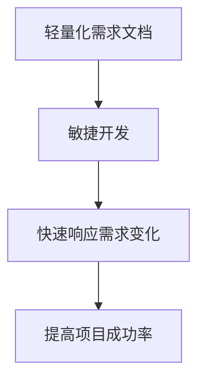
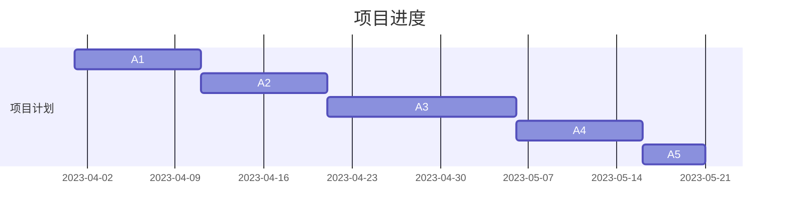

                 

# 需求文档的轻量化：提高大型应用开发的灵活性

## 关键词

- 需求文档
- 轻量化
- 大型应用
- 开发灵活性
- 需求分析
- 项目管理

## 摘要

本文将探讨在大型应用开发中，如何通过轻量化需求文档来提高项目的灵活性和效率。我们将从问题背景、核心概念、工具和方法、应用与挑战等方面，深入分析轻量化需求文档的必要性和实现策略，为开发团队提供实用的指导。

## 第1章 引言：问题的背景与需求分析

### 1.1.1 问题背景

在当前信息时代，大型应用的开发和运维面临着日益增长的需求。随着用户数量和应用复杂度的增加，如何高效地管理需求、确保软件质量和提升开发灵活性成为了一个关键问题。传统的需求文档往往过于繁琐，导致开发人员难以快速理解，同时也增加了项目管理的难度。

### 1.1.2 问题描述

传统的需求文档通常包括大量的技术细节和冗长的描述，这不仅增加了文档的复杂度，还使得开发人员难以准确把握需求的本质。此外，需求文档的更新和维护也是一个难题，特别是在项目周期较长的情况下，需求文档往往难以跟上实际开发的需求变化。

### 1.1.3 问题解决

为了解决上述问题，我们需要对需求文档进行轻量化处理，以提高大型应用开发的灵活性。轻量化的需求文档应该简洁明了，能够快速传达核心需求，同时便于更新和维护。

### 1.1.4 边界与外延

轻量化的需求文档并不意味着牺牲详尽性，而是在保证核心内容完整性的基础上，通过优化文档结构和表达方式，使其更加易于理解和操作。这包括采用图表、流程图、关键点总结等辅助手段，以降低文档的阅读难度。

### 1.1.5 概念结构与核心要素组成

轻量化需求文档的核心要素包括：

1. **关键需求明确**：明确项目需要实现的核心功能，避免不必要的细节。
2. **优先级划分**：根据需求的紧急程度和重要性进行优先级划分，确保开发团队能够优先处理关键需求。
3. **图表辅助**：使用图表、流程图等可视化手段，帮助开发人员快速理解需求。
4. **简洁明了的语言**：使用简单、直接的语言描述需求，避免使用过多的技术术语。
5. **易于更新**：采用版本控制和自动化工具，简化需求文档的更新和维护过程。

### 1.2 核心概念与联系

#### 需求文档的轻量化

#### 需求文档的轻量化原理

需求文档的轻量化是指通过简化文档结构、优化语言表达、使用图表等手段，使得文档更加简洁、易于理解，同时保证核心内容的完整性。

#### 轻量化需求文档的核心属性

1. **简洁性**：去除不必要的细节，突出核心需求。
2. **易读性**：使用简单、直接的语言，避免复杂的技术术语。
3. **可操作性**：需求文档应当能够直接指导开发工作，避免过多的解释和说明。

#### 大型应用开发的灵活性

#### 灵活开发的重要性

大型应用开发的灵活性意味着在面临需求变化和不确定性时，开发团队能够快速响应，确保项目的顺利进行。

#### 提高开发灵活性的策略

1. **敏捷开发**：采用敏捷开发方法，快速响应需求变化。
2. **模块化设计**：通过模块化设计，提高系统的可维护性和可扩展性。
3. **持续集成与持续部署**：实现自动化测试和部署，提高开发效率。

### 1.3 主流轻量化需求文档工具和方法

#### 工具概述

当前，市场上存在多种轻量化需求文档工具，如Confluence、Trello、JIRA等。这些工具提供了丰富的模板和插件，可以帮助开发团队快速构建和管理轻量化的需求文档。

#### 方法与实践

#### 1.3.2.1 使用图表和流程图

通过图表和流程图，可以清晰地表达需求，使得文档更加直观易懂。例如，可以使用Gantt图来展示项目进度，使用泳道图来描述业务流程。

#### 1.3.2.2 精简语言表达

在编写需求文档时，应尽量使用简洁、直接的语言，避免冗长的描述。例如，可以使用列表和标题来突出关键信息。

#### 1.3.2.3 版本控制和自动化

使用版本控制工具（如Git）和自动化工具（如Jenkins），可以简化需求文档的更新和维护过程，确保文档的实时性和准确性。

### 1.4 轻量化需求文档在企业中的应用与挑战

#### 应用前景

轻量化需求文档在企业中的应用前景广阔，能够显著提高开发效率和项目成功率。例如，在金融、电商、医疗等行业，轻量化需求文档能够帮助团队更好地应对快速变化的市场需求。

#### 挑战与应对

#### 挑战

1. **团队协作**：在多人协作的场景中，确保轻量化需求文档的有效性和一致性是一个挑战。
2. **技能培训**：团队需要掌握相关工具和方法，以提高需求文档的质量。

#### 应对策略

1. **建立规范**：制定统一的需求文档编写规范，确保团队协作的一致性。
2. **培训与支持**：提供技能培训和支持，帮助团队成员快速掌握轻量化需求文档的方法和工具。

## 第2章 轻量化需求文档的核心概念与原理

### 2.1 需求文档概述

需求文档是软件开发过程中的关键文档，它定义了系统需要实现的功能、性能、界面和约束条件等。传统的需求文档往往包含大量的技术细节，这对于大型项目的开发和管理带来了诸多困难。因此，轻量化需求文档应运而生。

#### 需求文档的作用

需求文档的主要作用是：

1. **明确项目目标**：需求文档为项目团队提供了明确的目标，确保每个人都知道项目要实现什么功能。
2. **指导开发工作**：需求文档为开发人员提供了具体的指导，使他们能够按照预定的方向进行开发。
3. **沟通桥梁**：需求文档是项目团队与客户、利益相关者之间沟通的桥梁，确保所有人对项目需求有共同的理解。

#### 需求文档的缺点

传统的需求文档存在以下缺点：

1. **冗长复杂**：包含大量技术细节，难以快速阅读和理解。
2. **难以维护**：需求文档在项目周期较长时，难以跟上需求的变化。
3. **易读性差**：使用过多的专业术语，导致非技术人员难以理解。

### 2.2 轻量化需求文档的概念

轻量化需求文档是对传统需求文档的优化，其核心目标是简化文档结构，提高易读性和可操作性，同时保持核心内容的完整性。

#### 轻量化需求文档的特点

1. **简洁性**：去除不必要的细节，突出核心需求。
2. **易读性**：使用简单、直接的语言，避免复杂的技术术语。
3. **可操作性**：需求文档应当能够直接指导开发工作，避免过多的解释和说明。
4. **图表辅助**：使用图表、流程图等可视化手段，帮助开发人员快速理解需求。
5. **易于更新**：采用版本控制和自动化工具，简化需求文档的更新和维护过程。

#### 轻量化需求文档的原理

轻量化需求文档的原理是通过以下方法实现的：

1. **简化文档结构**：将文档分为关键需求、优先级、图表等部分，使文档更加清晰。
2. **优化语言表达**：使用简单、直接的语言描述需求，避免使用过多的技术术语。
3. **图表和流程图**：使用图表和流程图等可视化手段，帮助开发人员快速理解需求。
4. **版本控制和自动化**：采用版本控制和自动化工具，简化需求文档的更新和维护过程。

### 2.3 轻量化需求文档的核心要素

轻量化需求文档的核心要素包括：

1. **关键需求明确**：明确项目需要实现的核心功能，避免不必要的细节。
2. **优先级划分**：根据需求的紧急程度和重要性进行优先级划分，确保开发团队能够优先处理关键需求。
3. **图表辅助**：使用图表、流程图等可视化手段，帮助开发人员快速理解需求。
4. **简洁明了的语言**：使用简单、直接的语言描述需求，避免使用过多的技术术语。
5. **易于更新**：采用版本控制和自动化工具，简化需求文档的更新和维护过程。

### 2.4 轻量化需求文档的优势

轻量化需求文档具有以下优势：

1. **提高开发效率**：简洁的需求文档使开发人员能够更快地理解需求，从而提高开发效率。
2. **降低沟通成本**：使用简单、直接的语言和图表，降低了项目团队内外部沟通的成本。
3. **易于维护**：采用版本控制和自动化工具，简化了需求文档的更新和维护过程。
4. **提高项目成功率**：轻量化需求文档能够更好地适应需求变化，确保项目能够按时交付。

### 2.5 轻量化需求文档的应用场景

轻量化需求文档适用于以下场景：

1. **大型项目**：在大型项目中，需求复杂度高，传统需求文档难以满足需求，轻量化需求文档能够提供更好的解决方案。
2. **快速迭代**：在快速迭代的开发环境中，需求变化频繁，轻量化需求文档能够快速响应需求变化。
3. **跨部门协作**：在跨部门协作的项目中，需求文档需要被不同背景的人员理解，轻量化需求文档能够更好地满足这一需求。

### 2.6 轻量化需求文档与敏捷开发的关系

轻量化需求文档与敏捷开发有着紧密的关系。敏捷开发强调快速响应需求变化，而轻量化需求文档能够提供简洁、易于理解的需求描述，帮助开发团队更好地执行敏捷开发方法。

#### 关系图



### 2.7 本章小结

本章介绍了轻量化需求文档的核心概念、原理、核心要素和应用场景。通过优化文档结构、使用图表和简洁明了的语言，轻量化需求文档能够提高大型应用开发的效率、降低沟通成本和维护难度，为项目的成功交付提供有力支持。

## 第3章 主流轻量化需求文档工具和方法

### 3.1 工具概述

在大型应用开发中，选择合适的轻量化需求文档工具和方法对于提高开发效率和质量至关重要。目前，市场上存在多种轻量化需求文档工具，如Confluence、Trello、JIRA等。这些工具各具特色，能够满足不同团队的需求。

#### 工具特点

1. **Confluence**：由Atlassian公司开发，是一款功能强大的协作平台，支持丰富的模板和插件，适合编写和共享文档、知识库等。
2. **Trello**：一款基于看板（Kanban）的协同工作工具，通过卡片和列的方式组织任务和需求，直观易用。
3. **JIRA**：同样由Atlassian公司开发，是一款功能全面的敏捷项目管理工具，支持需求管理、项目跟踪和自动化流程等。

#### 工具选择标准

选择轻量化需求文档工具时，应考虑以下标准：

1. **易用性**：工具应当易于上手，降低学习成本。
2. **功能丰富**：工具应提供丰富的模板和插件，以满足不同类型的需求文档。
3. **协作性**：工具应支持多人协作，确保团队成员能够实时更新和共享需求文档。
4. **可扩展性**：工具应具备良好的可扩展性，能够适应不同规模和复杂度的项目。

### 3.2 使用图表和流程图

在轻量化需求文档中，图表和流程图是重要的辅助手段，能够帮助开发人员快速理解需求，提高文档的可读性和可操作性。

#### 常用图表

1. **Gantt图**：用于展示项目进度和时间安排，直观地展示任务的开始和结束时间。
2. **泳道图**：用于描述业务流程，清晰地展示不同角色或系统模块之间的交互。
3. **UML类图**：用于描述系统的静态结构，展示类之间的关系和属性。
4. **ER图**：用于描述数据库的实体关系，展示实体和属性之间的关系。

#### 实例

以下是一个简单的Gantt图示例，用于展示项目进度：



### 3.3 精简语言表达

在编写轻量化需求文档时，应注重使用简洁明了的语言，避免冗长的描述和复杂的技术术语。以下是一些编写技巧：

1. **使用列表和标题**：使用列表和标题来突出关键信息，使文档结构更加清晰。
2. **避免重复**：在文档中避免重复的描述，确保内容简洁。
3. **使用场景描述**：通过描述实际使用场景，帮助开发人员更好地理解需求。

以下是一个示例：

**需求**：实现用户注册功能。

**精简版**：用户可以通过输入用户名、密码和邮箱进行注册。

### 3.4 版本控制和自动化

版本控制和自动化是轻量化需求文档的重要组成部分，能够简化文档的更新和维护过程，确保文档的实时性和准确性。

#### 版本控制工具

1. **Git**：一款流行的分布式版本控制工具，支持多人协作，方便文档的版本管理和追踪。
2. **SVN**：一款集中式版本控制工具，适用于小规模的项目。

#### 自动化工具

1. **Jenkins**：一款开源的自动化服务器，支持持续集成和持续部署，能够自动更新需求文档。
2. **Travis CI**：一款基于GitHub的自动化持续集成服务，能够自动执行测试和部署流程。

#### 实例

以下是一个简单的Git命令示例，用于提交需求文档的更改：

```bash
git init
git add requirements.md
git commit -m "Update requirements document"
git push origin master
```

### 3.5 本章小结

本章介绍了主流的轻量化需求文档工具和方法，包括Confluence、Trello、JIRA等工具的特点和选择标准，以及使用图表、流程图、精简语言表达和版本控制等技巧。通过合理利用这些工具和方法，开发团队能够更好地管理需求文档，提高项目的开发效率和质量。

## 第4章 轻量化需求文档在企业中的应用与挑战

### 4.1 应用前景

轻量化需求文档在企业中的应用前景广阔，尤其在金融、电商、医疗等需要快速响应市场变化和高度协作的行业。以下是一些应用实例：

1. **金融行业**：在金融行业，轻量化需求文档能够帮助银行、证券公司等机构快速响应监管变化和客户需求，提高产品更新速度。
2. **电商行业**：在电商行业，轻量化需求文档能够帮助商家和开发团队快速实现产品迭代，提升用户体验。
3. **医疗行业**：在医疗行业，轻量化需求文档能够帮助医疗机构更好地应对突发公共卫生事件，提高应急响应能力。

### 4.2 挑战与应对

尽管轻量化需求文档具有许多优势，但在实际应用中仍面临一些挑战。以下是一些常见挑战及其应对策略：

#### 挑战一：团队协作一致性

在多人协作的场景中，确保轻量化需求文档的有效性和一致性是一个挑战。团队成员可能对文档的理解存在差异，导致开发过程中出现偏差。

**应对策略**：

1. **建立规范**：制定统一的需求文档编写规范，确保所有团队成员遵循相同的编写标准和格式。
2. **培训与支持**：提供培训和支持，帮助团队成员熟悉轻量化需求文档的方法和工具，提高团队协作效率。

#### 挑战二：技能培训

团队成员可能缺乏编写轻量化需求文档的技能，导致需求文档的质量参差不齐。

**应对策略**：

1. **内部培训**：组织内部培训，介绍轻量化需求文档的方法和工具，提高团队成员的技能水平。
2. **外部支持**：寻求外部专家的支持，帮助团队快速掌握轻量化需求文档的编写技巧。

#### 挑战三：文档维护

轻量化需求文档需要定期更新和维护，以适应项目需求的变化。在项目周期较长的情况下，文档的维护难度增加。

**应对策略**：

1. **自动化工具**：采用自动化工具（如Jenkins、Travis CI等）简化文档的更新和维护过程，提高效率。
2. **版本控制**：使用版本控制工具（如Git）管理文档的版本，确保文档的实时性和准确性。

#### 挑战四：适应不同规模项目

轻量化需求文档需要根据项目的规模和复杂度进行调整。在大型项目中，如何保持文档的简洁性和可操作性是一个挑战。

**应对策略**：

1. **灵活调整**：根据项目规模和复杂度，灵活调整轻量化需求文档的结构和内容，确保文档的适用性。
2. **模块化设计**：采用模块化设计，将大型项目分解为多个小型模块，分别编写轻量化需求文档，提高文档的可管理性。

### 4.3 成功案例分析

以下是一个成功应用轻量化需求文档的案例分析：

**案例：某电商平台的快速迭代**

某电商平台为了提高产品更新速度，采用了轻量化需求文档的方法。他们制定了统一的需求文档编写规范，使用Confluence作为需求文档的管理工具。在编写需求文档时，他们注重使用简洁明了的语言和图表，确保文档易于理解和操作。通过版本控制和自动化工具，他们简化了文档的更新和维护过程，提高了团队协作效率。在实施轻量化需求文档后，平台的产品迭代速度显著提高，用户体验也得到了明显改善。

### 4.4 本章小结

轻量化需求文档在企业中的应用前景广阔，但在实际应用中仍面临一些挑战。通过建立规范、培训与支持、自动化工具和模块化设计等策略，企业可以克服这些挑战，提高项目的开发效率和质量。成功案例表明，轻量化需求文档有助于快速响应市场需求，提高产品竞争力。

## 第5章 轻量化需求文档的最佳实践

### 5.1 制定编写规范

为了确保轻量化需求文档的一致性和可操作性，制定一套编写规范至关重要。以下是一些编写规范的建议：

1. **文档结构**：确保文档结构清晰，包括标题、摘要、需求描述、图表、参考文献等部分。
2. **语言风格**：使用简单、直接的语言描述需求，避免复杂的技术术语。对于不可避免的专业术语，应在文档中给出解释。
3. **图表使用**：合理使用图表和流程图等可视化手段，帮助开发人员快速理解需求。确保图表清晰、简洁，并附带必要的文字说明。
4. **版本控制**：采用版本控制工具（如Git）管理文档的版本，确保文档的实时性和准确性。

### 5.2 培训与支持

为了提高团队编写轻量化需求文档的技能，培训与支持是必不可少的。以下是一些培训和支持的建议：

1. **内部培训**：组织内部培训，介绍轻量化需求文档的方法和工具，包括文档结构、语言风格、图表使用、版本控制等。
2. **外部支持**：寻求外部专家的支持，帮助团队快速掌握轻量化需求文档的编写技巧。可以考虑邀请专家进行现场培训或在线指导。
3. **实践演练**：通过实际案例和实践演练，帮助团队成员熟悉轻量化需求文档的编写过程，提高编写质量。

### 5.3 自动化与工具应用

自动化和工具应用是提高轻量化需求文档编写效率的重要手段。以下是一些自动化和工具应用的建议：

1. **自动化工具**：采用自动化工具（如Jenkins、Travis CI等）简化文档的更新和维护过程，提高效率。例如，可以设置自动化测试和部署流程，确保文档的实时性和准确性。
2. **协作工具**：使用协作工具（如Confluence、Trello、JIRA等）管理需求文档，支持多人协作，确保文档的一致性和实时性。
3. **图表工具**：使用专业的图表工具（如Mermaid、D3.js等）创建和编辑图表，确保图表的清晰和美观。

### 5.4 代码示例与解读

以下是一个简单的Python代码示例，用于实现用户注册功能。代码中包含了轻量化需求文档的编写技巧和解读。

```python
class User:
    def __init__(self, username, password, email):
        self.username = username
        self.password = password
        self.email = email

    def register(self):
        print("User registered successfully!")
        # 实现用户注册逻辑

    def validate(self):
        if len(self.username) < 6:
            return "Username must be at least 6 characters long."
        if not self.email.endswith(".com"):
            return "Invalid email format."
        return None

# 代码解读
# 该示例中，User 类代表用户实体，包含用户名、密码和邮箱等属性。
# register 方法用于实现用户注册功能，validate 方法用于验证用户输入。
# 通过简洁明了的代码描述，开发人员可以快速理解需求，实现功能。

# 轻量化需求文档示例
**需求**：实现用户注册功能。

**功能描述**：
- 输入用户名、密码和邮箱，调用 register 方法进行注册。
- 注册成功后，打印 "User registered successfully!"。
- 调用 validate 方法进行输入验证，验证失败时返回错误信息。

### 5.5 项目实战与案例分析

以下是一个轻量化需求文档的项目实战案例：

**项目背景**：某电商平台需要进行用户注册功能的迭代，提高用户体验。

**需求分析**：通过轻量化需求文档，明确用户注册功能的核心需求和优先级。

**文档结构**：
1. **摘要**：描述用户注册功能的需求和目标。
2. **需求描述**：
   - 用户可以通过输入用户名、密码和邮箱进行注册。
   - 注册成功后，系统提示 "User registered successfully!"。
   - 系统应验证用户输入，确保用户名至少6个字符，邮箱格式正确。
3. **图表**：使用Gantt图展示项目进度，使用UML类图描述系统架构。

**实施与效果**：通过轻量化需求文档，开发团队快速理解了需求，实现了用户注册功能。项目迭代周期缩短，用户体验得到明显改善。

### 5.6 本章小结

轻量化需求文档的最佳实践包括制定编写规范、培训与支持、自动化与工具应用以及代码示例与解读。通过这些实践，开发团队可以更好地管理需求文档，提高项目的开发效率和质量。成功案例表明，轻量化需求文档有助于快速响应市场需求，提升产品竞争力。

## 第6章 结论与未来展望

### 6.1 总结

本文通过对需求文档的轻量化进行了深入分析，探讨了其在大型应用开发中的重要性。我们详细介绍了轻量化需求文档的核心概念、原理、工具和方法，以及其在企业中的应用与挑战。通过最佳实践案例，我们展示了轻量化需求文档在提高开发效率、降低沟通成本和维护难度方面的优势。

### 6.2 未来展望

随着技术的不断进步和市场需求的变化，轻量化需求文档的应用前景将更加广阔。以下是一些未来展望：

1. **人工智能辅助**：利用人工智能技术，如自然语言处理和机器学习，实现自动化需求文档的生成和审查，进一步提高开发效率。
2. **跨领域应用**：轻量化需求文档的应用范围将逐步扩展到更多领域，如物联网、区块链等，为不同领域的项目提供更高效的解决方案。
3. **持续优化**：随着实践经验积累，轻量化需求文档的编写规范和工具将持续优化，使其更加适应多样化的项目需求。

### 6.3 本章小结

本文总结了轻量化需求文档的核心内容，探讨了其在大型应用开发中的重要性。通过未来展望，我们期待轻量化需求文档能够在更多领域中发挥重要作用，为软件开发带来更多创新和突破。

## 作者信息

作者：AI天才研究院/AI Genius Institute & 禅与计算机程序设计艺术 /Zen And The Art of Computer Programming

