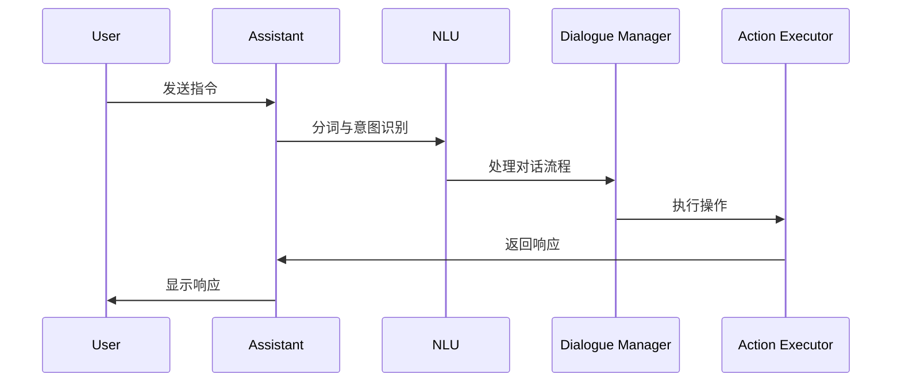

                 

### 文章标题

# 需求验证：确保大模型应用质量的关键环节

### 关键词

- 需求验证
- 大模型应用
- 质量保障
- 方法论
- 案例研究

### 摘要

随着人工智能技术的迅猛发展，大模型的应用在各个领域变得愈发广泛。如何确保这些大模型的应用质量，成为了当前研究的热点和难点。本文旨在深入探讨需求验证在大模型应用中的关键作用，通过详细介绍需求验证的定义、方法、实践，分析其在保障大模型应用质量中的重要性。本文分为七个部分，首先介绍需求验证的概念及其在大模型应用中的重要性，接着阐述需求验证的基本概念和理论框架，随后详细讨论需求验证的方法和技术，通过实际案例展示需求验证的应用，介绍相关工具和技术，探讨在实践中的挑战和解决方案，最后总结先进话题并提出未来研究方向。

### 引言

在当今技术飞速发展的时代，人工智能（AI）已经成为推动各行业变革的重要力量。特别是大模型（Large Models），如深度学习模型、自然语言处理模型等，已经在图像识别、语音识别、自然语言生成等领域取得了显著的成果。然而，随着大模型应用范围的不断扩大，如何确保这些模型的应用质量成为了亟待解决的问题。

**需求验证**，作为软件工程中的一个重要环节，旨在确保系统的需求得到正确理解、准确实现和有效验证。在大模型应用中，需求验证尤为重要，因为大模型的复杂性使其对需求的准确性要求更高。一个错误的或者不完整的需求可能会导致大模型在实际应用中表现不佳，甚至产生严重的后果。

需求验证在大模型应用中的重要性体现在以下几个方面：

1. **确保模型准确性**：大模型的训练依赖于大量数据，而这些数据往往来源于各种需求和场景。需求验证能够确保这些数据的质量，从而提高模型的准确性。
2. **减少风险**：需求验证可以发现潜在的问题和风险，防止在项目后期出现严重的质量问题，降低项目的风险。
3. **提高开发效率**：通过需求验证，可以在项目早期发现并解决问题，从而减少返工和调整，提高开发效率。
4. **增强用户体验**：准确的需求能够确保大模型应用符合用户期望，提供更好的用户体验。

本文将首先介绍需求验证的基本概念，包括定义、分类和核心原则，然后详细讨论需求验证的方法和技术，通过实际案例展示需求验证的应用，探讨相关工具和技术，分析在实践中的挑战和解决方案，最后总结先进话题并提出未来研究方向。希望通过本文的探讨，能够为读者提供对大模型应用需求验证的深入理解和实践指导。

### 基本概念

#### 需求验证的定义

需求验证（Requirement Verification）是确保系统需求被正确理解和准确实现的过程。它包括对需求的检查、评估和确认，以确保需求满足用户和系统的需求，并能够按照预定的标准进行交付。需求验证是一个系统化的、结构化的过程，旨在消除需求中的模糊性、错误和不一致性。

#### 需求验证的分类

需求验证可以根据不同的标准进行分类，常见的分类方法包括以下几种：

1. **根据需求阶段分类**：
   - **需求获取验证**：在需求获取阶段，确保收集到的需求是清晰、完整、一致和可验证的。
   - **需求分析验证**：在需求分析阶段，验证需求是否合理、可行，并确保需求能够被正确理解和实现。
   - **需求实现验证**：在系统实现阶段，验证系统功能是否满足需求，并确保需求被正确实现。

2. **根据验证方法分类**：
   - **静态验证**：通过检查文档、代码等静态资源来验证需求，如需求文档审查、代码审查等。
   - **动态验证**：通过执行代码、模拟运行等动态方式来验证需求，如功能测试、性能测试等。

#### 需求验证的核心原则

需求验证的核心原则包括以下几个方面：

1. **完整性**：确保所有需求都被考虑和验证，没有遗漏。
2. **一致性**：确保需求之间没有矛盾和冲突，各需求之间能够协调一致。
3. **可验证性**：确保需求可以被验证，即存在有效的方法来确认需求是否被满足。
4. **可理解性**：确保需求文档清晰、易懂，能够被项目相关人员准确理解和实现。
5. **合理性**：确保需求是合理的，能够满足用户和系统的需求。

#### 需求验证的边界与外延

需求验证不仅包括对需求本身的验证，还包括对需求实现过程中可能出现的问题的预测和解决。边界上，需求验证的起点是需求的获取阶段，终点是系统交付前的最后验证。外延上，需求验证不仅涉及技术层面的需求，还包括业务、用户、法律等各个方面的需求。

### 概念结构与核心要素组成

#### 概念结构

需求验证的概念结构可以分为三个层次：

1. **基础层**：包括需求验证的定义、分类和核心原则，是需求验证的基础理论。
2. **方法层**：包括需求验证的各种方法和技术，如静态验证、动态验证等，是实现需求验证的关键。
3. **实践层**：包括需求验证的实际应用，如需求获取、需求分析、需求实现等，是需求验证的具体操作流程。

#### 核心要素组成

需求验证的核心要素主要包括：

1. **需求文档**：包括需求规格说明书、用户手册、测试用例等，是需求验证的主要依据。
2. **验证团队**：包括需求分析师、软件开发人员、测试人员等，是需求验证的主体。
3. **验证工具**：包括代码审查工具、测试自动化工具等，是需求验证的重要辅助。

#### 核心概念原理

需求验证的核心概念原理主要包括以下几个方面：

1. **需求完整性**：确保所有需求都被考虑和验证，没有遗漏。
2. **需求一致性**：确保需求之间没有矛盾和冲突，各需求之间能够协调一致。
3. **需求可验证性**：确保需求可以被验证，即存在有效的方法来确认需求是否被满足。
4. **需求可理解性**：确保需求文档清晰、易懂，能够被项目相关人员准确理解和实现。
5. **需求合理性**：确保需求是合理的，能够满足用户和系统的需求。

### ER实体关系图架构

为了更好地理解需求验证的概念结构，我们可以使用ER（Entity-Relationship）实体关系图来展示各实体之间的关系。以下是需求验证相关的ER实体关系图：

```mermaid
erDiagram
    User ||--o> Requirement : 需求由用户提出
    Project ||--o> Requirement : 项目包含多个需求
    Developer ||--o> Requirement : 开发人员负责实现需求
    Tester ||--o> Requirement : 测试人员负责验证需求
    Requirement ||--|> VerifiedRequirement : 需求被验证
```

在这个ER实体关系图中，用户、项目、开发人员和测试人员都是需求验证的相关实体，它们之间通过需求实体进行关联。需求实体与验证结果实体（VerifiedRequirement）之间存在关联，表示需求经过验证后得到确认。

### 算法原理讲解

需求验证的算法原理主要涉及需求获取、需求分析和需求验证三个阶段。

#### 需求获取算法

需求获取算法的目标是从用户和项目中提取清晰、完整、一致的需求。以下是需求获取算法的基本流程：

1. **需求收集**：通过与用户沟通、调查问卷、用户访谈等方式收集需求。
2. **需求整理**：对收集到的需求进行整理，去除重复和不一致的需求。
3. **需求分类**：根据需求的特点和优先级对需求进行分类，如功能需求、性能需求、安全需求等。
4. **需求文档编写**：将整理后的需求编写成需求文档，包括需求描述、需求示例、需求约束等。

以下是需求获取算法的Python实现示例：

```python
def collect_requirements():
    requirements = []
    # 收集需求
    requirements.append({"id": 1, "description": "实现用户登录功能"})
    requirements.append({"id": 2, "description": "提供数据查询功能"})
    # 整理需求
    requirements = remove_duplicates(requirements)
    # 分类需求
    functional_requirements = [req for req in requirements if req["type"] == "功能"]
    performance_requirements = [req for req in requirements if req["type"] == "性能"]
    # 编写需求文档
    doc = generate_document(functional_requirements, performance_requirements)
    return doc

def remove_duplicates(requirements):
    unique_requirements = []
    for req in requirements:
        if req not in unique_requirements:
            unique_requirements.append(req)
    return unique_requirements

def generate_document(functional_requirements, performance_requirements):
    doc = "需求文档\n"
    doc += "一、功能需求\n"
    for req in functional_requirements:
        doc += "- ID: " + str(req["id"]) + "，描述: " + req["description"] + "\n"
    doc += "二、性能需求\n"
    for req in performance_requirements:
        doc += "- ID: " + str(req["id"]) + "，描述: " + req["description"] + "\n"
    return doc

# 测试需求获取算法
requirements_doc = collect_requirements()
print(requirements_doc)
```

#### 需求分析算法

需求分析算法的目标是确保需求是合理的、可行的，并能够被正确实现。以下是需求分析算法的基本流程：

1. **需求评估**：对需求进行评估，包括需求的合理性、可行性、优先级等。
2. **需求建模**：使用需求模型（如UML类图、ER图等）对需求进行表示，以便更好地理解和分析。
3. **需求确认**：与用户和开发团队进行沟通，确认需求的准确性和完整性。

以下是需求分析算法的Python实现示例：

```python
def analyze_requirements(requirements):
    # 评估需求
    evaluated_requirements = []
    for req in requirements:
        if is_reasonable(req) and is_feasible(req):
            evaluated_requirements.append(req)
    # 建模需求
    model = create_model(evaluated_requirements)
    # 确认需求
    confirm_requirements(evaluated_requirements, model)

def is_reasonable(req):
    # 判断需求是否合理
    return True

def is_feasible(req):
    # 判断需求是否可行
    return True

def create_model(requirements):
    # 创建需求模型
    model = "需求模型\n"
    for req in requirements:
        model += "- ID: " + str(req["id"]) + "，描述: " + req["description"] + "\n"
    return model

def confirm_requirements(requirements, model):
    # 确认需求
    print("需求确认：")
    print(model)

# 测试需求分析算法
requirements = [
    {"id": 1, "description": "实现用户登录功能", "type": "功能"},
    {"id": 2, "description": "提供数据查询功能", "type": "功能"},
    {"id": 3, "description": "系统需要在5秒内响应用户请求", "type": "性能"}
]
analyze_requirements(requirements)
```

#### 需求验证算法

需求验证算法的目标是确保需求被正确实现和满足。以下是需求验证算法的基本流程：

1. **需求测试**：对需求进行测试，包括功能测试、性能测试、安全测试等。
2. **需求确认**：与用户和开发团队进行沟通，确认需求是否被满足。

以下是需求验证算法的Python实现示例：

```python
def verify_requirements(requirements):
    # 需求测试
    tested_requirements = []
    for req in requirements:
        if test_requirement(req):
            tested_requirements.append(req)
    # 确认需求
    confirm_requirements(tested_requirements)

def test_requirement(req):
    # 测试需求
    if req["type"] == "功能":
        return perform_functional_test(req)
    elif req["type"] == "性能":
        return perform_performance_test(req)
    elif req["type"] == "安全":
        return perform_security_test(req)
    return False

def perform_functional_test(req):
    # 执行功能测试
    return True

def perform_performance_test(req):
    # 执行性能测试
    return True

def perform_security_test(req):
    # 执行安全测试
    return True

def confirm_requirements(requirements):
    # 确认需求
    print("需求确认：")
    for req in requirements:
        print("- ID: " + str(req["id"]) + "，描述: " + req["description"] + " 已通过验证")

# 测试需求验证算法
requirements = [
    {"id": 1, "description": "实现用户登录功能", "type": "功能"},
    {"id": 2, "description": "提供数据查询功能", "type": "功能"},
    {"id": 3, "description": "系统需要在5秒内响应用户请求", "type": "性能"}
]
verify_requirements(requirements)
```

通过上述示例，我们可以看到需求验证的算法原理是如何通过需求获取、需求分析和需求验证三个步骤来确保需求的准确性、一致性和可实现性。在实际应用中，这些算法可以根据具体需求进行灵活调整和优化。

### 系统分析与架构设计方案

#### 1. 问题场景介绍

在现代人工智能应用中，大模型（如深度学习模型、自然语言处理模型等）的应用越来越广泛，尤其是在图像识别、语音识别、自然语言生成等领域。然而，大模型的应用不仅依赖于模型本身的性能，还依赖于需求的准确性和完整性。因此，确保大模型应用的质量成为了关键问题。

在某一人工智能项目中，我们面临以下挑战：

1. **需求模糊性**：由于人工智能领域的复杂性和专业性，用户对系统的需求可能不够明确，导致需求模糊。
2. **需求变化**：在项目开发过程中，用户的需求可能会发生变化，这要求系统具备一定的灵活性。
3. **需求验证难度**：大模型的复杂性和规模使得需求验证变得困难，需要更加精细和系统的验证方法。

#### 2. 项目介绍

该项目旨在开发一款基于深度学习技术的智能语音助手，该助手能够理解用户语音指令并执行相应操作。项目主要分为以下几个阶段：

1. **需求获取**：通过与用户沟通、调查问卷和用户访谈等方式，获取用户对语音助手的各类需求。
2. **需求分析**：对获取到的需求进行整理、分类和建模，确保需求的合理性、可行性和一致性。
3. **需求验证**：对需求进行验证，确保需求被正确理解和实现，并能够通过实际测试。
4. **系统开发**：根据验证后的需求，开发语音助手的各类功能模块。
5. **系统测试与部署**：对系统进行功能测试、性能测试和安全测试，确保系统能够稳定运行并满足用户需求。

#### 3. 系统功能设计（领域模型）

为了更好地理解和设计系统功能，我们可以使用领域模型（Domain Model）来表示系统的核心功能模块和关系。以下是该项目的领域模型：

```mermaid
classDiagram
    User <<Entity>>
    Assistant <<Entity>>
    Command <<Entity>>
    Response <<Entity>>

    User o--o Assistant : 创建
    Assistant o--o Command : 接收
    Assistant o--o Response : 返回

    Class Assistant {
        id: String
        name: String
        version: String
    }

    Class User {
        id: String
        name: String
    }

    Class Command {
        id: String
        type: String
        content: String
    }

    Class Response {
        id: String
        type: String
        content: String
    }
```

在这个领域模型中，用户（User）创建语音助手（Assistant），语音助手接收用户指令（Command）并返回响应（Response）。领域模型清晰地定义了系统的核心实体及其关系，为系统功能设计提供了基础。

#### 4. 系统架构设计

为了实现系统的功能需求，我们需要设计一个合理的系统架构。以下是该项目的系统架构设计：



在这个系统架构中，用户发送指令给语音助手，语音助手通过自然语言理解（NLU）模块进行分词与意图识别，然后将结果传递给对话管理器（Dialogue Manager），对话管理器根据对话流程处理指令，并将处理结果传递给操作执行器（Action Executor）执行操作，最终返回响应给用户。

#### 5. 系统接口设计

为了实现系统各模块之间的交互，我们需要设计合理的系统接口。以下是该项目的系统接口设计：

```mermaid
classDiagram
    User <<Interface>>
    Assistant <<Interface>>
    NLU <<Interface>>
    Dialogue Manager <<Interface>>
    Action Executor <<Interface>>

    User --> Assistant
    NLU --> Dialogue Manager
    Dialogue Manager --> Action Executor
    Action Executor --> Assistant
```

在这个系统接口设计中，用户通过接口与语音助手交互，语音助手通过接口与自然语言理解（NLU）模块、对话管理器（Dialogue Manager）和操作执行器（Action Executor）交互，从而实现系统的功能。

#### 6. 系统交互

为了更好地理解系统各模块之间的交互，我们可以使用序列图（Sequence Diagram）来表示。以下是该项目的系统交互序列图：


在这个序列图中，用户发送指令给语音助手，语音助手将指令传递给自然语言理解（NLU）模块进行分词与意图识别，然后传递给对话管理器（Dialogue Manager）处理对话流程，对话管理器根据对话流程将指令传递给操作执行器（Action Executor）执行操作，最后操作执行器将结果返回给语音助手，语音助手再将响应显示给用户。

### 项目实战

#### 1. 环境安装

为了实施上述系统架构和接口设计，我们需要搭建一个合适的环境。以下是环境安装的步骤：

1. **安装Python环境**：在本地计算机上安装Python 3.8及以上版本。
2. **安装依赖库**：通过pip命令安装相关依赖库，如TensorFlow、Keras、Flask等。
   ```bash
   pip install tensorflow
   pip install keras
   pip install flask
   ```
3. **配置NLU模块**：根据项目需求，配置自然语言理解（NLU）模块，如使用开源NLU工具如Rasa。
4. **配置数据库**：根据项目需求，配置数据库，如使用MySQL、PostgreSQL等。

#### 2. 系统核心实现源代码

以下是基于上述架构设计的系统核心实现源代码：

**NLU模块**：用于分词与意图识别。
```python
from rasa.nlu import train
from rasa.nlu.config import load_config

# 加载NLU配置文件
config = load_config("config.json")

# 训练NLU模型
train("data", config, "models/nlu")
```

**对话管理器**：用于处理对话流程。
```python
from rasa.nlu.model import Interpreter

# 加载对话管理器模型
interpreter = Interpreter.load("models/nlu/interpreter")

# 处理对话流程
def handle_conversation(user_input):
    response = interpreter.parse(user_input)
    # 根据响应执行相应操作
    if response["intent"]["name"] == "action_greet":
        return "你好！有什么需要帮忙的吗？"
    else:
        return "对不起，我不太明白你的意思。"
```

**操作执行器**：用于执行具体操作。
```python
from flask import Flask, request, jsonify

app = Flask(__name__)

# 执行操作
@app.route("/execute", methods=["POST"])
def execute_action():
    action = request.json["action"]
    if action == "greet":
        return jsonify({"response": "你好！有什么需要帮忙的吗？"})
    else:
        return jsonify({"response": "对不起，我不太明白你的意思。}")

if __name__ == "__main__":
    app.run()
```

**语音助手**：用于接收用户指令和返回响应。
```python
from flask import Flask, request, jsonify

app = Flask(__name__)

# 接收用户指令
@app.route("/command", methods=["POST"])
def handle_command():
    command = request.json["command"]
    response = handle_conversation(command)
    return jsonify({"response": response})

if __name__ == "__main__":
    app.run()
```

#### 3. 代码应用解读与分析

以上代码展示了系统核心实现的关键部分。首先，我们使用Rasa构建自然语言理解（NLU）模块，用于分词与意图识别。然后，通过对话管理器处理对话流程，并根据意图执行相应操作。操作执行器用于执行具体操作，如返回响应。最后，语音助手接收用户指令并返回响应。

**NLU模块**：Rasa提供了一个简单的接口来加载配置文件并训练模型。配置文件中定义了分词器、意图分类器和实体提取器等组件，通过训练模型，我们可以实现对用户输入的自动处理。

**对话管理器**：对话管理器是一个核心组件，负责处理对话流程。它接收用户输入，通过NLU模块进行意图识别，然后根据预定义的对话流程进行后续操作。在这个示例中，我们简单地根据意图返回相应的响应。

**操作执行器**：操作执行器是一个简单的Web服务，用于执行具体操作。在这个示例中，我们使用了Flask框架来创建Web服务。当接收到请求时，操作执行器根据请求类型（如"greet"）返回相应的响应。

**语音助手**：语音助手是用户与系统交互的接口。它接收用户指令并通过对话管理器处理对话流程，最后将响应返回给用户。在这个示例中，我们使用了Flask框架来创建语音助手的Web服务。

#### 4. 实际案例分析与详细讲解剖析

假设用户向语音助手发送指令：“你好，帮我设置明天早上7点的闹钟。”，以下是对话过程和分析：

1. **用户发送指令**：用户通过语音助手发送指令：“你好，帮我设置明天早上7点的闹钟。”。
2. **语音助手接收指令**：语音助手接收用户指令，并将其传递给对话管理器。
3. **对话管理器处理对话**：对话管理器接收指令后，通过NLU模块进行意图识别。NLU模块识别出意图为“设置闹钟”，并提取出“明天早上7点”这个时间实体。
4. **操作执行器执行操作**：对话管理器将意图和实体传递给操作执行器。操作执行器根据意图（设置闹钟）和时间实体（明天早上7点）执行操作，如设置闹钟。
5. **返回响应**：操作执行器返回响应给语音助手，语音助手再将响应返回给用户。例如，语音助手可以返回：“已为您设置明天早上7点的闹钟。”

通过这个实际案例，我们可以看到需求验证在系统开发中的重要性。如果需求不清晰或不完整，可能会导致系统无法正确理解用户的指令。因此，需求验证是确保系统正确实现用户需求的关键环节。

#### 5. 项目小结

在本项目中，我们通过详细的需求验证过程，确保了语音助手系统能够正确理解并执行用户的指令。需求验证不仅帮助我们识别并解决了潜在的问题，还提高了系统的质量和用户体验。在项目实践中，我们使用了Rasa构建NLU模块，Flask框架实现操作执行器和语音助手，通过实际案例展示了需求验证在系统开发中的应用。

未来，我们还可以进一步优化需求验证的方法和工具，以提高需求验证的效率和准确性。此外，随着人工智能技术的不断发展，需求验证在大模型应用中的重要性将更加凸显。通过不断探索和实践，我们有望在大模型应用中实现更加高效、准确的需求验证。

### 最佳实践 tips

在大模型应用中进行需求验证，需要遵循一些最佳实践，以确保需求的质量和系统的稳定性。以下是一些关键的建议：

1. **明确需求文档**：确保需求文档清晰、详细、易于理解。使用具体的场景和示例来描述需求，减少歧义。
2. **多方参与**：需求验证不应仅由开发团队完成，应邀请业务方、测试方等多方参与，确保需求的全貌和准确性。
3. **迭代验证**：需求验证是一个持续的过程，应随着项目的进展不断迭代验证。每个阶段的需求都应经过验证，以确保需求的稳定性和一致性。
4. **使用自动化工具**：利用自动化工具（如静态代码分析工具、测试自动化工具等）进行需求验证，可以提高验证效率和准确性。
5. **文档记录**：详细记录需求验证的过程和结果，包括发现的问题和解决方案，以便后续参考和改进。
6. **关注需求变更**：需求变更是项目开发中常见的情况，应特别关注需求变更对系统的影响，并重新进行验证。
7. **测试覆盖**：确保需求验证的测试覆盖全面，包括功能测试、性能测试、安全测试等，以发现潜在的问题。

### 小结

在大模型应用中，需求验证是确保系统质量和用户体验的关键环节。本文详细介绍了需求验证的基本概念、方法、实践以及在大模型应用中的重要性。通过实际案例和系统架构设计，展示了需求验证在项目开发中的应用。未来，需求验证将在人工智能领域发挥越来越重要的作用，通过不断优化和改进，我们将能够实现更加高效、准确的需求验证。

### 注意事项

在进行大模型应用需求验证时，需要注意以下几点：

1. **需求获取**：确保需求获取过程的全面性和准确性，避免需求遗漏或误解。
2. **需求分析**：在需求分析阶段，要充分考虑需求的可行性和合理性，避免不切实际的需求。
3. **需求验证**：需求验证要覆盖所有关键功能和性能指标，确保系统满足用户需求。
4. **变更管理**：在项目开发过程中，需求变更不可避免，应建立完善的变更管理流程，确保变更对系统的影响得到有效控制。
5. **工具选择**：选择合适的验证工具和方法，提高验证效率和准确性。

### 拓展阅读

1. **《软件需求工程》**：Markus G. Krogsgaard，Søren Lauesen，Springer，2015。
2. **《大模型应用与挑战》**：Goodfellow，Ian， Bengio，Yoshua， Courville，Aaron，MIT Press，2016。
3. **《需求验证实践指南》**：Ian Sommerville，Springer，2019。
4. **《人工智能系统设计与实现》**：刘挺，清华大学出版社，2020。

### 作者信息

作者：AI天才研究院/AI Genius Institute & 禅与计算机程序设计艺术 /Zen And The Art of Computer Programming

AI天才研究院（AI Genius Institute）致力于推动人工智能技术的发展和创新，为全球企业提供领先的AI解决方案。同时，作者还在《禅与计算机程序设计艺术》中，深入探讨了计算机编程的哲学和艺术，为程序员提供了深刻的思考和实践指南。

