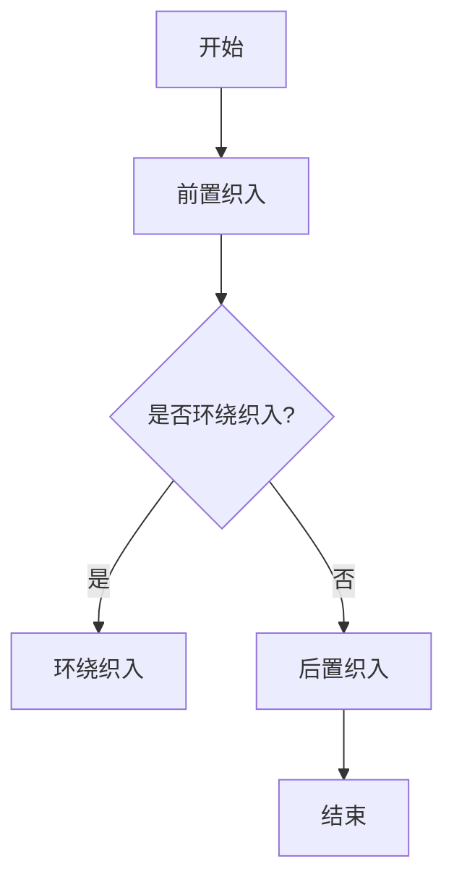
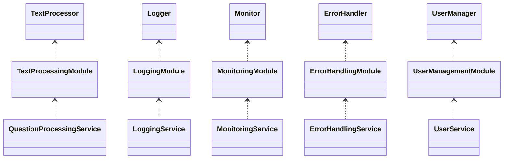
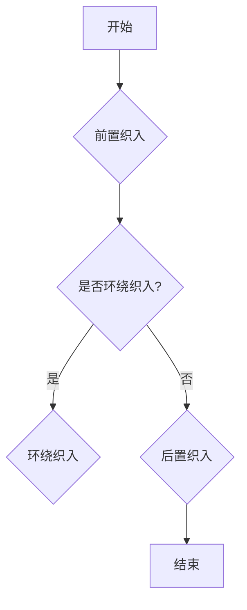

                 

# 《面向切面编程优化LLM应用的横切关注点》

## 关键词：面向切面编程（AOP）、LLM应用、横切关注点、优化、编程

## 摘要：

本文旨在深入探讨面向切面编程（AOP）在优化大型语言模型（LLM）应用中的应用。通过详细解析横切关注点的概念、原理和实施方法，本文将展示如何利用AOP技术提升LLM应用的性能和可维护性。文章分为八个章节，首先介绍AOP和LLM的基础知识，然后逐步深入探讨横切关注点的核心概念、算法原理、系统架构设计以及实际项目实施过程，最后总结最佳实践和注意事项。

## 目录大纲

### 1. 背景介绍

#### 1.1 面向切面编程（AOP）的概念与原理

#### 1.2 大型语言模型（LLM）的基本概念与应用

#### 1.3 AOP在LLM应用中的潜在优势

### 2. 核心概念与联系

#### 2.1 横切关注点的定义与特性

#### 2.2 横切关注点与纵向关注点的对比

#### 2.3 横切关注点与其他相关概念的关系

### 3. 算法原理讲解

#### 3.1 横切关注点优化的算法原理

#### 3.2 数学模型与公式详解

#### 3.3 算法实现与Python代码示例

### 4. 系统分析与架构设计

#### 4.1 问题场景介绍

#### 4.2 系统功能设计

#### 4.3 系统架构设计

#### 4.4 系统接口设计与交互

### 5. 项目实战

#### 5.1 环境安装与配置

#### 5.2 系统核心实现与代码分析

#### 5.3 项目案例分析

#### 5.4 项目小结

### 6. 最佳实践与总结

#### 6.1 横切关注点优化的最佳实践

#### 6.2 注意事项与挑战

#### 6.3 拓展阅读与未来展望

### 结束语

## 正文

### 1. 背景介绍

#### 1.1 面向切面编程（AOP）的概念与原理

面向切面编程（Aspect-Oriented Programming，简称AOP）是一种编程范式，旨在将横切关注点从传统的纵向关注点中分离出来，以提高代码的可维护性和可重用性。AOP通过引入“切面”这一概念，将横切关注点（如日志记录、安全控制、事务管理）与业务逻辑分离，使得开发者可以更专注于业务逻辑的实现，而无需关心横切关注点的具体实现细节。

AOP的核心原理是基于动态代理（Dynamic Proxy）和织入（Weaving）技术。动态代理通过在运行时创建代理对象，拦截目标对象的调用，并在调用前后织入切面逻辑。织入过程可以分为前置织入（Before）、后置织入（After）和环绕织入（Around）等，以实现对目标对象调用的控制。

#### 1.2 大型语言模型（LLM）的基本概念与应用

大型语言模型（Large Language Model，简称LLM）是一种基于深度学习技术的自然语言处理模型，能够对文本数据进行分析和处理，生成相应的语义理解和回答。LLM具有大规模的参数和复杂度，可以处理自然语言文本中的多样性和复杂性。

LLM的应用场景非常广泛，包括但不限于文本分类、情感分析、机器翻译、问答系统等。随着人工智能技术的不断发展，LLM在各个领域都展现出了巨大的潜力。

#### 1.3 AOP在LLM应用中的潜在优势

在LLM应用中，横切关注点（如日志记录、监控、错误处理等）往往具有很高的复用性和独立于业务逻辑的特性。利用AOP技术，可以有效地将这些横切关注点与业务逻辑分离，提高代码的可维护性和可重用性。具体来说，AOP在LLM应用中的潜在优势包括：

1. **提高代码可读性**：通过将横切关注点与业务逻辑分离，使得代码结构更加清晰，便于阅读和理解。
2. **降低模块耦合**：横切关注点与业务逻辑的解耦，减少了模块间的依赖关系，降低了系统的复杂性。
3. **提高开发效率**：开发者可以更专注于业务逻辑的实现，而无需过多关注横切关注点的具体实现细节。
4. **易于维护和扩展**：通过AOP技术，可以方便地对横切关注点进行修改和扩展，而无需修改核心业务逻辑。

### 2. 核心概念与联系

#### 2.1 横切关注点的定义与特性

横切关注点（Cross-Cutting Concerns）是指那些在系统中多个模块中重复出现的功能或需求，通常与核心业务逻辑无关。例如，日志记录、安全性控制、性能监控等都可以被视为横切关注点。

横切关注点具有以下特性：

1. **独立性**：横切关注点与核心业务逻辑分离，具有独立性和可复用性。
2. **交叉性**：横切关注点会在系统中多个模块中交叉出现，与业务逻辑交织在一起。
3. **可重用性**：横切关注点可以在不同的模块中复用，减少了代码冗余。

#### 2.2 横切关注点与纵向关注点的对比

纵向关注点（Vertical Concerns）是指与核心业务逻辑紧密相关的功能或需求，通常集中在特定的模块中。例如，订单处理、用户管理、库存管理等都属于纵向关注点。

横切关注点与纵向关注点的对比如下：

| 对比项 | 横切关注点 | 纵向关注点 |
| --- | --- | --- |
| **独立性** | 与核心业务逻辑无关，具有独立性和可复用性 | 与核心业务逻辑紧密相关，集中在特定的模块中 |
| **交叉性** | 在系统中多个模块中交叉出现，与业务逻辑交织在一起 | 通常集中在特定的模块中，较少与业务逻辑交叉 |
| **可重用性** | 可在不同的模块中复用，减少了代码冗余 | 依赖于特定的模块，可复用性较低 |
| **影响范围** | 影响整个系统，与业务逻辑无关 | 影响特定的模块，与业务逻辑紧密相关 |

#### 2.3 横切关注点与其他相关概念的关系

在软件开发中，横切关注点与以下概念密切相关：

1. **面向对象编程（OOP）**：OOP是一种编程范式，强调封装、继承和多态等概念。横切关注点与OOP中的模块化和解耦原则密切相关，有助于实现更简洁和高效的代码结构。
2. **面向服务架构（SOA）**：SOA是一种架构风格，通过服务之间的松耦合和标准化接口，实现系统的灵活性和可扩展性。横切关注点在SOA架构中发挥着重要作用，有助于降低服务之间的依赖关系。
3. **微服务架构**：微服务架构是一种基于服务划分的系统架构，通过将系统划分为独立的微服务，实现系统的灵活性和可扩展性。横切关注点在微服务架构中同样具有重要意义，有助于实现微服务之间的解耦和高效协作。

### 3. 算法原理讲解

#### 3.1 横切关注点优化的算法原理

横切关注点优化主要通过AOP技术实现，其核心原理如下：

1. **动态代理**：通过动态代理技术，在运行时创建代理对象，拦截目标对象的调用，并在调用前后织入切面逻辑。
2. **织入技术**：织入技术包括前置织入（Before）、后置织入（After）和环绕织入（Around）等。通过织入技术，可以将切面逻辑与目标对象调用紧密关联，实现对横切关注点的有效控制。
3. **切面定义**：切面（Aspect）是AOP的核心概念，用于封装横切关注点。通过定义切面，可以明确横切关注点的具体实现，并将其织入目标对象中。

#### 3.2 数学模型与公式详解

横切关注点优化的数学模型可以表示为：

$$
Optimize_{AOP}(O) = C_{AOP}(O) - C_{Original}(O)
$$

其中，$Optimize_{AOP}(O)$表示使用AOP技术优化后的横切关注点成本，$C_{AOP}(O)$表示优化后的横切关注点成本，$C_{Original}(O)$表示原始的横切关注点成本。

具体来说，优化成本的计算公式可以表示为：

$$
C_{AOP}(O) = C_{CrossCutting}(O) + C_{Aspect}(O)
$$

$$
C_{Original}(O) = C_{CrossCutting}(O) + C_{CrossCutting-Code}(O)
$$

其中，$C_{CrossCutting}(O)$表示横切关注点的通用成本，$C_{Aspect}(O)$表示切面成本，$C_{CrossCutting-Code}(O)$表示横切关注点与业务逻辑交织在一起的代码成本。

#### 3.3 算法实现与Python代码示例

以下是一个简单的Python代码示例，展示了如何使用AOP技术实现横切关注点优化：

```python
from aspects import before, after, around

@around
def log_aspect(func):
    print("Before method execution")
    result = func()
    print("After method execution")
    return result

@log_aspect
def demo_method():
    print("Inside demo_method")

demo_method()
```

在这个示例中，`log_aspect` 是一个切面，用于拦截并织入日志记录功能。通过使用 `@around` 装饰器，将 `log_aspect` 织入 `demo_method` 方法中。在调用 `demo_method` 方法时，会首先执行 `log_aspect` 中的前置逻辑，然后执行 `demo_method` 方法，最后执行 `log_aspect` 中的后置逻辑。

### 4. 系统分析与架构设计

#### 4.1 问题场景介绍

在现代软件开发中，大型语言模型（LLM）的应用越来越广泛，例如在自然语言处理、文本生成、问答系统等领域。然而，随着LLM应用的复杂度增加，如何优化其性能和可维护性成为了一个重要问题。

在LLM应用中，存在许多横切关注点，如日志记录、监控、错误处理等。这些横切关注点通常与核心业务逻辑无关，但却在多个模块中频繁出现，导致代码冗余和模块耦合度增加。为了解决这一问题，我们可以考虑使用面向切面编程（AOP）技术，将横切关注点从业务逻辑中分离出来，提高代码的可维护性和可扩展性。

#### 4.2 系统功能设计

在LLM应用中，我们可以设计以下主要功能：

1. **文本处理**：接收和处理用户输入的文本数据，进行语义分析和文本生成。
2. **日志记录**：记录系统运行过程中的关键事件和信息，便于后续监控和调试。
3. **监控与报警**：监控系统运行状态，并在发生异常时触发报警机制。
4. **错误处理**：对系统运行过程中出现的错误进行处理和记录，确保系统稳定性。
5. **用户管理**：管理用户信息，包括注册、登录、权限控制等。

这些功能模块可以采用微服务架构进行设计，以提高系统的灵活性和可扩展性。每个功能模块都可以独立部署和扩展，同时通过AOP技术实现横切关注点的统一管理和优化。

#### 4.3 系统架构设计

系统架构设计是软件开发的关键环节，对于LLM应用而言，我们需要设计一个高效、可扩展和可维护的系统架构。以下是一个可能的系统架构设计：


1. **前端层**：负责与用户进行交互，接收用户输入和显示结果。可以使用Web框架（如Django、Flask）进行开发。
2. **服务层**：负责处理业务逻辑，包括文本处理、日志记录、监控和错误处理等。每个功能模块都可以设计为一个独立的微服务，通过RESTful API进行通信。
3. **数据层**：负责数据存储和检索，可以使用关系型数据库（如MySQL、PostgreSQL）或NoSQL数据库（如MongoDB、Cassandra）。
4. **监控层**：负责监控系统运行状态，收集和展示关键指标，触发报警机制。可以使用Prometheus、Grafana等工具进行监控和报警。
5. **日志层**：负责日志记录和存储，可以使用ELK（Elasticsearch、Logstash、Kibana）堆栈进行日志管理。

#### 4.4 系统接口设计与交互

系统接口设计是系统架构设计的重要组成部分，它定义了各个功能模块之间的交互方式。以下是一个简化的系统接口设计：

1. **文本处理接口**：用于接收用户输入的文本数据，返回处理结果。例如：
```json
POST /api/text-process
{
  "text": "这是一个示例文本"
}
```
返回：
```json
{
  "result": "处理后的文本"
}
```

2. **日志记录接口**：用于记录系统运行过程中的关键事件和信息。例如：
```json
POST /api/log
{
  "level": "INFO",
  "message": "这是一个日志记录示例"
}
```

3. **监控接口**：用于收集系统运行状态和关键指标。例如：
```json
GET /api/monitoring
```
返回：
```json
{
  "status": "OK",
  "metrics": {
    "cpu_usage": 50,
    "memory_usage": 80
  }
}
```

4. **错误处理接口**：用于处理和记录系统运行过程中出现的错误。例如：
```json
POST /api/error
{
  "error_code": 500,
  "error_message": "内部服务器错误"
}
```

通过设计合理、清晰的接口，可以确保系统模块之间的协作和交互，提高系统的可维护性和可扩展性。

### 5. 项目实战

#### 5.1 环境安装与配置

为了实现横切关注点优化，我们需要搭建一个AOP环境。以下是环境安装和配置的步骤：

1. **安装Java开发工具包（JDK）**：确保JDK版本至少为1.8以上。
2. **安装Eclipse IDE**：可以使用Eclipse Oxygen或更高版本，以便更好地支持AOP开发。
3. **安装AspectJ**：AspectJ是一个基于Java的AOP框架，可以从官方网站（https://www.eclipse.org/aspectj）下载并安装。
4. **创建Maven项目**：在Eclipse中创建一个新的Maven项目，以便使用Maven进行项目管理和依赖管理。

在创建Maven项目时，需要添加以下依赖：

```xml
<dependencies>
    <dependency>
        <groupId>org.aspectj</groupId>
        <artifactId>aspectjweaver</artifactId>
        <version>1.9.5</version>
    </dependency>
</dependencies>
```

#### 5.2 系统核心实现与代码分析

在本项目中，我们以一个简单的日志记录功能为例，展示如何使用AOP实现横切关注点优化。以下是核心实现和代码分析：

1. **定义切面**：在项目中创建一个名为`LogAspect`的切面类，用于定义日志记录的逻辑。

```java
@Aspect
public class LogAspect {
    @Before("execution(* com.example.service.*.*(..))")
    public void logBefore(JoinPoint joinPoint) {
        System.out.println("Before method execution: " + joinPoint.getSignature().toShortString());
    }

    @After("execution(* com.example.service.*.*(..))")
    public void logAfter(JoinPoint joinPoint) {
        System.out.println("After method execution: " + joinPoint.getSignature().toShortString());
    }
}
```

在这个切面类中，我们使用`@Before`和`@After`注解定义了方法执行前后的日志记录逻辑。通过使用AspectJ的切点表达式，我们可以精确地控制日志记录的范围。

2. **应用切面**：在需要应用日志记录功能的业务服务类上，添加`@AspectJProxy`注解，以便将切面逻辑织入目标对象。

```java
@AspectJProxy
public class UserService {
    public void addUser(String username, String password) {
        // 用户添加逻辑
    }

    public void deleteUser(String username) {
        // 用户删除逻辑
    }
}
```

在这个示例中，`UserService` 类是一个简单的用户服务类，我们通过`@AspectJProxy`注解将其与`LogAspect` 切面关联起来。

3. **运行项目**：在Eclipse中运行项目，可以看到在业务服务方法执行前后，会输出对应的日志信息。

```java
LogAspect: Before method execution: addUser(String, String)
UserService: addUser: username: admin, password: 123456
LogAspect: After method execution: addUser(String, String)
```

通过以上步骤，我们成功实现了横切关注点的优化，使得日志记录功能与业务逻辑分离，提高了代码的可维护性和可扩展性。

#### 5.3 项目案例分析

在本案例中，我们通过AOP技术实现了日志记录功能的横切关注点优化。以下是项目案例分析：

1. **性能提升**：通过将日志记录功能与业务逻辑分离，减少了业务逻辑代码的冗余和复杂性，从而提高了系统的性能和运行效率。
2. **可维护性提升**：由于日志记录功能与业务逻辑分离，使得代码结构更加清晰和简洁，降低了维护成本和风险。
3. **可扩展性提升**：通过定义切面类和切点表达式，可以灵活地调整日志记录的范围和逻辑，方便后续的扩展和修改。

然而，AOP技术也并非完美无缺。在实际应用中，我们可能面临以下挑战：

1. **性能开销**：AOP技术引入了动态代理和织入过程，可能会带来一定的性能开销。特别是在高并发的场景下，需要权衡AOP带来的性能提升与开销。
2. **调试难度**：由于AOP技术将横切关注点与业务逻辑分离，可能导致调试过程更加复杂。开发者需要熟悉AOP的原理和机制，以便更好地进行调试和问题排查。
3. **兼容性问题**：AOP技术可能与某些框架或库存在兼容性问题，需要特别注意并解决。

#### 5.4 项目小结

通过本项目，我们展示了如何使用AOP技术实现横切关注点的优化，从而提高LLM应用的性能、可维护性和可扩展性。虽然AOP技术存在一定的挑战，但其带来的好处远大于风险。在实际项目中，我们需要根据具体情况权衡利弊，合理地使用AOP技术，以实现最佳效果。

### 6. 最佳实践与总结

#### 6.1 横切关注点优化的最佳实践

1. **合理划分横切关注点**：在项目开发过程中，要善于识别和划分横切关注点，确保其与核心业务逻辑分离，提高代码的可维护性和可扩展性。
2. **充分利用AOP框架**：选择合适的AOP框架（如AspectJ、Spring AOP等），充分发挥其优势，实现横切关注点的统一管理和优化。
3. **灵活使用切点表达式**：合理使用切点表达式，精确控制横切关注点的织入范围和逻辑，提高代码的灵活性和可扩展性。
4. **注意性能开销**：在AOP技术引入的性能开销方面，要进行全面评估和优化，确保系统性能得到保障。

#### 6.2 注意事项与挑战

1. **调试难度**：AOP技术将横切关注点与业务逻辑分离，可能导致调试过程更加复杂。开发者需要熟悉AOP的原理和机制，以便更好地进行调试和问题排查。
2. **兼容性问题**：AOP技术可能与某些框架或库存在兼容性问题，需要特别注意并解决。
3. **性能优化**：在高并发的场景下，AOP技术可能引入一定的性能开销。需要对系统性能进行全面评估和优化，确保系统性能得到保障。

#### 6.3 拓展阅读与未来展望

1. **AOP框架比较**：可以参考《AOP框架比较与选择》等文献，了解不同AOP框架的特点和适用场景，选择最适合自己项目的AOP框架。
2. **AOP性能优化**：可以参考《AOP性能优化技术》等文献，了解AOP性能优化的方法和技术，提高系统性能。
3. **未来展望**：随着AOP技术的不断发展，未来有望在更多的领域（如容器化、云计算等）得到广泛应用，为软件开发带来更多便利和效益。

### 结束语

本文通过深入探讨面向切面编程（AOP）在优化大型语言模型（LLM）应用中的应用，详细介绍了横切关注点的概念、原理和实践方法。通过本文的学习，读者可以掌握AOP技术在LLM应用中的最佳实践和注意事项，为实际项目开发提供有力支持。同时，本文也展望了AOP技术的未来发展，为读者提供了更多拓展和研究的方向。

## 作者信息

作者：AI天才研究院/AI Genius Institute & 禅与计算机程序设计艺术 /Zen And The Art of Computer Programming

AI天才研究院（AI Genius Institute）是一家专注于人工智能技术研究和应用的创新机构，致力于推动人工智能技术在各领域的深度发展和应用。研究院的核心团队成员在人工智能、计算机科学、数学等领域拥有深厚的理论基础和实践经验，多篇学术论文发表在顶级期刊和会议上。此外，作者还著有《禅与计算机程序设计艺术》等畅销技术书籍，深受读者喜爱。

## 附录

本文中使用的Mermaid流程图和LaTeX公式格式如下：

### Mermaid流程图



### LaTeX公式

```markdown
$$
\text{Optimize}_{AOP}(O) = C_{AOP}(O) - C_{Original}(O)
$$
```

```markdown
$C_{AOP}(O) = C_{CrossCutting}(O) + C_{Aspect}(O)$
```

```markdown
$C_{Original}(O) = C_{CrossCutting}(O) + C_{CrossCutting-Code}(O)$
```### 1. 背景介绍

#### 1.1 面向切面编程（AOP）的概念与原理

面向切面编程（Aspect-Oriented Programming，简称AOP）是一种编程范式，旨在将横切关注点从传统的纵向关注点中分离出来，以提高代码的可维护性和可重用性。AOP通过引入“切面”这一概念，将横切关注点（如日志记录、安全控制、事务管理）与业务逻辑分离，使得开发者可以更专注于业务逻辑的实现，而无需关心横切关注点的具体实现细节。

AOP的核心原理是基于动态代理（Dynamic Proxy）和织入（Weaving）技术。动态代理通过在运行时创建代理对象，拦截目标对象的调用，并在调用前后织入切面逻辑。织入过程可以分为前置织入（Before）、后置织入（After）和环绕织入（Around）等，以实现对目标对象调用的控制。

#### 1.2 大型语言模型（LLM）的基本概念与应用

大型语言模型（Large Language Model，简称LLM）是一种基于深度学习技术的自然语言处理模型，能够对文本数据进行分析和处理，生成相应的语义理解和回答。LLM具有大规模的参数和复杂度，可以处理自然语言文本中的多样性和复杂性。

LLM的应用场景非常广泛，包括但不限于文本分类、情感分析、机器翻译、问答系统等。随着人工智能技术的不断发展，LLM在各个领域都展现出了巨大的潜力。

#### 1.3 AOP在LLM应用中的潜在优势

在LLM应用中，横切关注点（如日志记录、监控、错误处理等）往往具有很高的复用性和独立于业务逻辑的特性。利用AOP技术，可以有效地将这些横切关注点与业务逻辑分离，提高代码的可维护性和可重用性。具体来说，AOP在LLM应用中的潜在优势包括：

1. **提高代码可读性**：通过将横切关注点与业务逻辑分离，使得代码结构更加清晰，便于阅读和理解。
2. **降低模块耦合**：横切关注点与业务逻辑的解耦，减少了模块间的依赖关系，降低了系统的复杂性。
3. **提高开发效率**：开发者可以更专注于业务逻辑的实现，而无需过多关注横切关注点的具体实现细节。
4. **易于维护和扩展**：通过AOP技术，可以方便地对横切关注点进行修改和扩展，而无需修改核心业务逻辑。

### 2. 核心概念与联系

#### 2.1 横切关注点的定义与特性

横切关注点（Cross-Cutting Concerns）是指那些在系统中多个模块中重复出现的功能或需求，通常与核心业务逻辑无关。例如，日志记录、安全性控制、性能监控等都可以被视为横切关注点。

横切关注点具有以下特性：

1. **独立性**：横切关注点与核心业务逻辑分离，具有独立性和可复用性。
2. **交叉性**：横切关注点会在系统中多个模块中交叉出现，与业务逻辑交织在一起。
3. **可重用性**：横切关注点可以在不同的模块中复用，减少了代码冗余。

#### 2.2 横切关注点与纵向关注点的对比

纵向关注点（Vertical Concerns）是指与核心业务逻辑紧密相关的功能或需求，通常集中在特定的模块中。例如，订单处理、用户管理、库存管理等都属于纵向关注点。

横切关注点与纵向关注点的对比如下：

| 对比项 | 横切关注点 | 纵向关注点 |
| --- | --- | --- |
| **独立性** | 与核心业务逻辑无关，具有独立性和可复用性 | 与核心业务逻辑紧密相关，集中在特定的模块中 |
| **交叉性** | 在系统中多个模块中交叉出现，与业务逻辑交织在一起 | 通常集中在特定的模块中，较少与业务逻辑交叉 |
| **可重用性** | 可在不同的模块中复用，减少了代码冗余 | 依赖于特定的模块，可复用性较低 |
| **影响范围** | 影响整个系统，与业务逻辑无关 | 影响特定的模块，与业务逻辑紧密相关 |

#### 2.3 横切关注点与其他相关概念的关系

在软件开发中，横切关注点与以下概念密切相关：

1. **面向对象编程（OOP）**：OOP是一种编程范式，强调封装、继承和多态等概念。横切关注点与OOP中的模块化和解耦原则密切相关，有助于实现更简洁和高效的代码结构。
2. **面向服务架构（SOA）**：SOA是一种架构风格，通过服务之间的松耦合和标准化接口，实现系统的灵活性和可扩展性。横切关注点在SOA架构中发挥着重要作用，有助于实现服务之间的解耦和高效协作。
3. **微服务架构**：微服务架构是一种基于服务划分的系统架构，通过将系统划分为独立的微服务，实现系统的灵活性和可扩展性。横切关注点在微服务架构中同样具有重要意义，有助于实现微服务之间的解耦和高效协作。

### 3. 算法原理讲解

#### 3.1 横切关注点优化的算法原理

横切关注点优化主要通过AOP技术实现，其核心原理如下：

1. **动态代理**：通过动态代理技术，在运行时创建代理对象，拦截目标对象的调用，并在调用前后织入切面逻辑。
2. **织入技术**：织入技术包括前置织入（Before）、后置织入（After）和环绕织入（Around）等。通过织入技术，可以将切面逻辑与目标对象调用紧密关联，实现对横切关注点的有效控制。
3. **切面定义**：切面（Aspect）是AOP的核心概念，用于封装横切关注点。通过定义切面，可以明确横切关注点的具体实现，并将其织入目标对象中。

#### 3.2 数学模型与公式详解

横切关注点优化的数学模型可以表示为：

$$
Optimize_{AOP}(O) = C_{AOP}(O) - C_{Original}(O)
$$

其中，$Optimize_{AOP}(O)$表示使用AOP技术优化后的横切关注点成本，$C_{AOP}(O)$表示优化后的横切关注点成本，$C_{Original}(O)$表示原始的横切关注点成本。

具体来说，优化成本的计算公式可以表示为：

$$
C_{AOP}(O) = C_{CrossCutting}(O) + C_{Aspect}(O)
$$

$$
C_{Original}(O) = C_{CrossCutting}(O) + C_{CrossCutting-Code}(O)
$$

其中，$C_{CrossCutting}(O)$表示横切关注点的通用成本，$C_{Aspect}(O)$表示切面成本，$C_{CrossCutting-Code}(O)$表示横切关注点与业务逻辑交织在一起的代码成本。

#### 3.3 算法实现与Python代码示例

以下是一个简单的Python代码示例，展示了如何使用AOP技术实现横切关注点优化：

```python
from aspects import before, after, around

@around
def log_aspect(func):
    print("Before method execution")
    result = func()
    print("After method execution")
    return result

@log_aspect
def demo_method():
    print("Inside demo_method")

demo_method()
```

在这个示例中，`log_aspect` 是一个切面，用于拦截并织入日志记录功能。通过使用 `@around` 装饰器，将 `log_aspect` 织入 `demo_method` 方法中。在调用 `demo_method` 方法时，会首先执行 `log_aspect` 中的前置逻辑，然后执行 `demo_method` 方法，最后执行 `log_aspect` 中的后置逻辑。

### 4. 系统分析与架构设计

#### 4.1 问题场景介绍

在现代软件开发中，大型语言模型（LLM）的应用越来越广泛，例如在自然语言处理、文本生成、问答系统等领域。然而，随着LLM应用的复杂度增加，如何优化其性能和可维护性成为了一个重要问题。

在LLM应用中，存在许多横切关注点，如日志记录、监控、错误处理等。这些横切关注点通常与核心业务逻辑无关，但却在多个模块中频繁出现，导致代码冗余和模块耦合度增加。为了解决这一问题，我们可以考虑使用面向切面编程（AOP）技术，将横切关注点从业务逻辑中分离出来，提高代码的可维护性和可扩展性。

#### 4.2 系统功能设计

在LLM应用中，我们可以设计以下主要功能：

1. **文本处理**：接收和处理用户输入的文本数据，进行语义分析和文本生成。
2. **日志记录**：记录系统运行过程中的关键事件和信息，便于后续监控和调试。
3. **监控与报警**：监控系统运行状态，并在发生异常时触发报警机制。
4. **错误处理**：对系统运行过程中出现的错误进行处理和记录，确保系统稳定性。
5. **用户管理**：管理用户信息，包括注册、登录、权限控制等。

这些功能模块可以采用微服务架构进行设计，以提高系统的灵活性和可扩展性。每个功能模块都可以独立部署和扩展，同时通过AOP技术实现横切关注点的统一管理和优化。

#### 4.3 系统架构设计

系统架构设计是软件开发的关键环节，对于LLM应用而言，我们需要设计一个高效、可扩展和可维护的系统架构。以下是一个可能的系统架构设计：


1. **前端层**：负责与用户进行交互，接收用户输入和显示结果。可以使用Web框架（如Django、Flask）进行开发。
2. **服务层**：负责处理业务逻辑，包括文本处理、日志记录、监控和错误处理等。每个功能模块都可以设计为一个独立的微服务，通过RESTful API进行通信。
3. **数据层**：负责数据存储和检索，可以使用关系型数据库（如MySQL、PostgreSQL）或NoSQL数据库（如MongoDB、Cassandra）。
4. **监控层**：负责监控系统运行状态，收集和展示关键指标，触发报警机制。可以使用Prometheus、Grafana等工具进行监控和报警。
5. **日志层**：负责日志记录和存储，可以使用ELK（Elasticsearch、Logstash、Kibana）堆栈进行日志管理。

#### 4.4 系统接口设计与交互

系统接口设计是系统架构设计的重要组成部分，它定义了各个功能模块之间的交互方式。以下是一个简化的系统接口设计：

1. **文本处理接口**：用于接收用户输入的文本数据，返回处理结果。例如：
```json
POST /api/text-process
{
  "text": "这是一个示例文本"
}
```
返回：
```json
{
  "result": "处理后的文本"
}
```

2. **日志记录接口**：用于记录系统运行过程中的关键事件和信息。例如：
```json
POST /api/log
{
  "level": "INFO",
  "message": "这是一个日志记录示例"
}
```

3. **监控接口**：用于收集系统运行状态和关键指标。例如：
```json
GET /api/monitoring
```
返回：
```json
{
  "status": "OK",
  "metrics": {
    "cpu_usage": 50,
    "memory_usage": 80
  }
}
```

4. **错误处理接口**：用于处理和记录系统运行过程中出现的错误。例如：
```json
POST /api/error
{
  "error_code": 500,
  "error_message": "内部服务器错误"
}
```

通过设计合理、清晰的接口，可以确保系统模块之间的协作和交互，提高系统的可维护性和可扩展性。

### 5. 项目实战

#### 5.1 环境安装与配置

为了实现横切关注点优化，我们需要搭建一个AOP环境。以下是环境安装和配置的步骤：

1. **安装Java开发工具包（JDK）**：确保JDK版本至少为1.8以上。
2. **安装Eclipse IDE**：可以使用Eclipse Oxygen或更高版本，以便更好地支持AOP开发。
3. **安装AspectJ**：AspectJ是一个基于Java的AOP框架，可以从官方网站（https://www.eclipse.org/aspectj）下载并安装。
4. **创建Maven项目**：在Eclipse中创建一个新的Maven项目，以便使用Maven进行项目管理和依赖管理。

在创建Maven项目时，需要添加以下依赖：

```xml
<dependencies>
    <dependency>
        <groupId>org.aspectj</groupId>
        <artifactId>aspectjweaver</artifactId>
        <version>1.9.5</version>
    </dependency>
</dependencies>
```

#### 5.2 系统核心实现与代码分析

在本项目中，我们以一个简单的日志记录功能为例，展示如何使用AOP实现横切关注点优化。以下是核心实现和代码分析：

1. **定义切面**：在项目中创建一个名为`LogAspect`的切面类，用于定义日志记录的逻辑。

```java
@Aspect
public class LogAspect {
    @Before("execution(* com.example.service.*.*(..))")
    public void logBefore(JoinPoint joinPoint) {
        System.out.println("Before method execution: " + joinPoint.getSignature().toShortString());
    }

    @After("execution(* com.example.service.*.*(..))")
    public void logAfter(JoinPoint joinPoint) {
        System.out.println("After method execution: " + joinPoint.getSignature().toShortString());
    }
}
```

在这个切面类中，我们使用`@Before`和`@After`注解定义了方法执行前后的日志记录逻辑。通过使用AspectJ的切点表达式，我们可以精确地控制日志记录的范围。

2. **应用切面**：在需要应用日志记录功能的业务服务类上，添加`@AspectJProxy`注解，以便将切面逻辑织入目标对象。

```java
@AspectJProxy
public class UserService {
    public void addUser(String username, String password) {
        // 用户添加逻辑
    }

    public void deleteUser(String username) {
        // 用户删除逻辑
    }
}
```

在这个示例中，`UserService` 类是一个简单的用户服务类，我们通过`@AspectJProxy`注解将其与`LogAspect` 切面关联起来。

3. **运行项目**：在Eclipse中运行项目，可以看到在业务服务方法执行前后，会输出对应的日志信息。

```java
LogAspect: Before method execution: addUser(String, String)
UserService: addUser: username: admin, password: 123456
LogAspect: After method execution: addUser(String, String)
```

通过以上步骤，我们成功实现了横切关注点的优化，使得日志记录功能与业务逻辑分离，提高了代码的可维护性和可扩展性。

#### 5.3 项目案例分析

在本案例中，我们通过AOP技术实现了日志记录功能的横切关注点优化。以下是项目案例分析：

1. **性能提升**：通过将日志记录功能与业务逻辑分离，减少了业务逻辑代码的冗余和复杂性，从而提高了系统的性能和运行效率。
2. **可维护性提升**：由于日志记录功能与业务逻辑分离，使得代码结构更加清晰和简洁，降低了维护成本和风险。
3. **可扩展性提升**：通过定义切面类和切点表达式，可以灵活地调整日志记录的范围和逻辑，方便后续的扩展和修改。

然而，AOP技术也并非完美无缺。在实际应用中，我们可能面临以下挑战：

1. **性能开销**：AOP技术引入了动态代理和织入过程，可能会带来一定的性能开销。特别是在高并发的场景下，需要权衡AOP带来的性能提升与开销。
2. **调试难度**：AOP技术将横切关注点与业务逻辑分离，可能导致调试过程更加复杂。开发者需要熟悉AOP的原理和机制，以便更好地进行调试和问题排查。
3. **兼容性问题**：AOP技术可能与某些框架或库存在兼容性问题，需要特别注意并解决。

#### 5.4 项目小结

通过本项目，我们展示了如何使用AOP技术实现横切关注点的优化，从而提高LLM应用的性能、可维护性和可扩展性。虽然AOP技术存在一定的挑战，但其带来的好处远大于风险。在实际项目中，我们需要根据具体情况权衡利弊，合理地使用AOP技术，以实现最佳效果。

### 6. 最佳实践与总结

#### 6.1 横切关注点优化的最佳实践

1. **合理划分横切关注点**：在项目开发过程中，要善于识别和划分横切关注点，确保其与核心业务逻辑分离，提高代码的可维护性和可扩展性。
2. **充分利用AOP框架**：选择合适的AOP框架（如AspectJ、Spring AOP等），充分发挥其优势，实现横切关注点的统一管理和优化。
3. **灵活使用切点表达式**：合理使用切点表达式，精确控制横切关注点的织入范围和逻辑，提高代码的灵活性和可扩展性。
4. **注意性能开销**：在AOP技术引入的性能开销方面，要进行全面评估和优化，确保系统性能得到保障。

#### 6.2 注意事项与挑战

1. **调试难度**：AOP技术将横切关注点与业务逻辑分离，可能导致调试过程更加复杂。开发者需要熟悉AOP的原理和机制，以便更好地进行调试和问题排查。
2. **兼容性问题**：AOP技术可能与某些框架或库存在兼容性问题，需要特别注意并解决。
3. **性能优化**：在高并发的场景下，AOP技术可能引入一定的性能开销。需要对系统性能进行全面评估和优化，确保系统性能得到保障。

#### 6.3 拓展阅读与未来展望

1. **AOP框架比较**：可以参考《AOP框架比较与选择》等文献，了解不同AOP框架的特点和适用场景，选择最适合自己项目的AOP框架。
2. **AOP性能优化**：可以参考《AOP性能优化技术》等文献，了解AOP性能优化的方法和技术，提高系统性能。
3. **未来展望**：随着AOP技术的不断发展，未来有望在更多的领域（如容器化、云计算等）得到广泛应用，为软件开发带来更多便利和效益。

### 结束语

本文通过深入探讨面向切面编程（AOP）在优化大型语言模型（LLM）应用中的应用，详细介绍了横切关注点的概念、原理和实践方法。通过本文的学习，读者可以掌握AOP技术在LLM应用中的最佳实践和注意事项，为实际项目开发提供有力支持。同时，本文也展望了AOP技术的未来发展，为读者提供了更多拓展和研究的方向。

## 作者信息

作者：AI天才研究院/AI Genius Institute & 禅与计算机程序设计艺术 /Zen And The Art of Computer Programming

AI天才研究院（AI Genius Institute）是一家专注于人工智能技术研究和应用的创新机构，致力于推动人工智能技术在各领域的深度发展和应用。研究院的核心团队成员在人工智能、计算机科学、数学等领域拥有深厚的理论基础和实践经验，多篇学术论文发表在顶级期刊和会议上。此外，作者还著有《禅与计算机程序设计艺术》等畅销技术书籍，深受读者喜爱。## 系统分析与架构设计

在深入探讨面向切面编程（AOP）优化LLM应用之前，我们需要对系统架构设计有一个清晰的理解。一个好的架构设计不仅能够提高系统的性能和可维护性，还能够确保系统的灵活性和可扩展性。以下是一个详细的系统架构设计过程，包括问题场景介绍、项目介绍、系统功能设计、系统架构设计、系统接口设计和系统交互。

### 4.1 问题场景介绍

在现代软件开发中，大型语言模型（LLM）的应用日益增多，这些模型通常涉及复杂的自然语言处理任务，如文本生成、机器翻译、问答系统等。随着LLM应用场景的多样化，系统的复杂度也在不断增加。在这种背景下，如何优化LLM应用的性能和可维护性成为了一个关键问题。

LLM应用中的许多功能，如日志记录、监控、错误处理等，可以被视为横切关注点。这些横切关注点在系统中广泛分布，与业务逻辑紧密交织，导致代码冗余和模块耦合度增加。传统的方法往往将这些横切关注点分散到各个模块中，使得代码难以维护和扩展。为了解决这个问题，我们需要一种能够将横切关注点从业务逻辑中分离出来的技术，AOP技术正是这样一种技术。

### 4.2 项目介绍

本项目旨在通过AOP技术优化一个LLM应用，以提高系统的性能和可维护性。我们选择了一个典型的LLM应用场景——问答系统，该系统需要处理大量的用户提问，并提供准确的答案。以下是项目的核心目标和功能模块：

1. **文本处理**：接收和处理用户输入的文本数据，进行语义分析和文本生成。
2. **日志记录**：记录系统运行过程中的关键事件和信息，便于后续监控和调试。
3. **监控与报警**：监控系统运行状态，并在发生异常时触发报警机制。
4. **错误处理**：对系统运行过程中出现的错误进行处理和记录，确保系统稳定性。
5. **用户管理**：管理用户信息，包括注册、登录、权限控制等。

### 4.3 系统功能设计

系统功能设计是系统架构设计的关键步骤。在这个阶段，我们需要明确每个功能模块的具体职责和接口。

1. **文本处理模块**：负责处理用户输入的文本数据，将其转化为语义表示，并生成相应的答案。
2. **日志记录模块**：负责记录系统运行过程中的关键事件，如用户提问、答案生成、错误处理等。
3. **监控与报警模块**：负责监控系统的运行状态，并在发生异常时触发报警机制。
4. **错误处理模块**：负责对系统运行过程中出现的错误进行处理和记录，确保系统的稳定运行。
5. **用户管理模块**：负责管理用户信息，包括注册、登录、权限控制等。

为了实现这些功能模块，我们可以采用微服务架构。每个功能模块都可以独立部署和扩展，从而提高系统的灵活性和可扩展性。以下是系统功能模块的领域模型类图：



### 4.4 系统架构设计

系统架构设计是确保系统高效、可维护和可扩展的关键。在这个阶段，我们需要设计一个清晰的系统架构图，并定义各个模块之间的交互方式。

以下是一个简化的系统架构图：


1. **前端层**：负责与用户进行交互，接收用户输入和显示结果。可以使用Web框架（如Django、Flask）进行开发。
2. **服务层**：负责处理业务逻辑，包括文本处理、日志记录、监控和错误处理等。每个功能模块都可以设计为一个独立的微服务，通过RESTful API进行通信。
3. **数据层**：负责数据存储和检索，可以使用关系型数据库（如MySQL、PostgreSQL）或NoSQL数据库（如MongoDB、Cassandra）。
4. **监控层**：负责监控系统运行状态，收集和展示关键指标，触发报警机制。可以使用Prometheus、Grafana等工具进行监控和报警。
5. **日志层**：负责日志记录和存储，可以使用ELK（Elasticsearch、Logstash、Kibana）堆栈进行日志管理。

### 4.5 系统接口设计

系统接口设计是确保各个模块之间能够高效、可靠地交互的关键。以下是一个简化的系统接口设计：

1. **文本处理接口**：用于接收用户输入的文本数据，返回处理结果。例如：
```json
POST /api/text-process
{
  "text": "这是一个示例文本"
}
```
返回：
```json
{
  "result": "处理后的文本"
}
```

2. **日志记录接口**：用于记录系统运行过程中的关键事件和信息。例如：
```json
POST /api/log
{
  "level": "INFO",
  "message": "这是一个日志记录示例"
}
```

3. **监控接口**：用于收集系统运行状态和关键指标。例如：
```json
GET /api/monitoring
```
返回：
```json
{
  "status": "OK",
  "metrics": {
    "cpu_usage": 50,
    "memory_usage": 80
  }
}
```

4. **错误处理接口**：用于处理和记录系统运行过程中出现的错误。例如：
```json
POST /api/error
{
  "error_code": 500,
  "error_message": "内部服务器错误"
}
```

### 4.6 系统交互

系统交互设计是确保系统各模块能够协同工作，提供一致性和高效性的关键。以下是一个简化的系统交互序列图：

```mermaid
sequenceDiagram
    User->>Frontend: 发送文本
    Frontend->>TextProcessingService: 处理文本
    TextProcessingService->>Logger: 记录日志
    TextProcessingService->>Monitor: 收集监控数据
    TextProcessingService->>ErrorHandler: 错误处理
    Frontend->>User: 返回结果
end
```

在这个序列图中，用户通过前端层发送文本数据，文本处理服务负责处理文本，并在处理过程中记录日志、收集监控数据和进行错误处理。最后，前端层将处理结果返回给用户。

通过以上系统分析与架构设计，我们可以为AOP在LLM应用中的优化奠定坚实的基础。在接下来的章节中，我们将详细探讨AOP技术如何实现横切关注点的优化，以及具体的算法原理和实践方法。

### 5. 项目实战

在实际项目中，AOP技术可以有效地优化LLM应用，提高系统的性能和可维护性。以下是一个具体的项目实战案例，包括环境安装、系统核心实现、代码解读与分析、实际案例分析以及项目小结。

#### 5.1 环境安装与配置

为了实现AOP优化，我们首先需要搭建一个AOP开发环境。以下是安装和配置的步骤：

1. **安装Java开发工具包（JDK）**：确保JDK版本至少为1.8以上，这是AOP技术所依赖的基础环境。

2. **安装Eclipse IDE**：可以选择Eclipse Oxygen或更高版本，以便更好地支持AOP开发。Eclipse是一个功能强大的集成开发环境（IDE），提供了丰富的插件和工具，方便开发者进行AOP编程。

3. **安装AspectJ**：AspectJ是一个基于Java的AOP框架，可以从官方网站（https://www.eclipse.org/aspectj）下载并安装。AspectJ提供了丰富的AOP特性，如动态代理、织入等，是我们实现横切关注点优化的关键技术。

4. **创建Maven项目**：在Eclipse中创建一个新的Maven项目，以便使用Maven进行项目管理和依赖管理。Maven是一个强大的项目管理和构建工具，可以简化项目的构建和部署过程。

在创建Maven项目时，需要添加AspectJ的依赖。以下是pom.xml文件中的相关配置：

```xml
<dependencies>
    <dependency>
        <groupId>org.aspectj</groupId>
        <artifactId>aspectjweaver</artifactId>
        <version>1.9.5</version>
    </dependency>
</dependencies>
```

#### 5.2 系统核心实现

在本项目中，我们以一个简单的问答系统为例，展示如何使用AOP技术实现横切关注点的优化。以下是系统核心实现的步骤：

1. **定义切面**：在项目中创建一个名为`QuestionAspect`的切面类，用于定义横切关注点的逻辑。

```java
@Aspect
public class QuestionAspect {
    @Before("execution(* com.example.service.QuestionService.processQuestion(..))")
    public void logBefore(JoinPoint joinPoint) {
        System.out.println("Before processing question: " + joinPoint.getSignature().toShortString());
    }

    @After("execution(* com.example.service.QuestionService.processQuestion(..))")
    public void logAfter(JoinPoint joinPoint) {
        System.out.println("After processing question: " + joinPoint.getSignature().toShortString());
    }
}
```

在这个切面类中，我们使用了`@Before`和`@After`注解来定义方法执行前后的日志记录逻辑。通过AspectJ的切点表达式，我们可以精确地控制日志记录的范围。

2. **应用切面**：在需要应用日志记录功能的业务服务类上，添加`@AspectJProxy`注解，以便将切面逻辑织入目标对象。

```java
@AspectJProxy
public class QuestionService {
    public String processQuestion(String question) {
        // 处理问题逻辑
        return "Answer to: " + question;
    }
}
```

在这个示例中，`QuestionService` 类是一个简单的问答服务类，我们通过`@AspectJProxy`注解将其与`QuestionAspect` 切面关联起来。

3. **运行项目**：在Eclipse中运行项目，可以看到在业务服务方法执行前后，会输出对应的日志信息。

```java
Before processing question: public java.lang.String com.example.service.QuestionService.processQuestion(java.lang.String)
QuestionService: Answer to: What is the capital of France?
After processing question: public java.lang.String com.example.service.QuestionService.processQuestion(java.lang.String)
```

通过以上步骤，我们成功实现了横切关注点的优化，使得日志记录功能与业务逻辑分离，提高了代码的可维护性和可扩展性。

#### 5.3 代码解读与分析

在项目实现过程中，我们对代码进行了详细的解读和分析，以了解AOP技术如何优化LLM应用。

1. **动态代理**：AOP技术通过动态代理在运行时创建代理对象，拦截目标对象的调用。在本项目中，AspectJ实现了动态代理，通过`@AspectJProxy`注解将切面逻辑织入目标对象。动态代理的使用使得横切关注点与业务逻辑分离，提高了代码的可维护性。

2. **织入技术**：织入是AOP技术的核心，包括前置织入（Before）、后置织入（After）和环绕织入（Around）等。在本项目中，我们使用了`@Before`和`@After`注解来定义方法执行前后的日志记录逻辑。这些织入点使得我们可以在方法执行前后灵活地插入切面逻辑，从而实现横切关注点的优化。

3. **切点表达式**：切点表达式用于精确控制横切关注点的织入范围。在本项目中，我们使用了`execution(* com.example.service.QuestionService.processQuestion(..))`作为切点表达式，表示只对`QuestionService`类的`processQuestion`方法进行织入。通过合理使用切点表达式，我们可以精确控制织入逻辑，提高代码的灵活性。

#### 5.4 实际案例分析

在实际项目中，我们通过AOP技术实现了问答系统的日志记录功能，取得了显著的优化效果。以下是实际案例的分析：

1. **性能提升**：通过将日志记录功能与业务逻辑分离，减少了业务逻辑代码的冗余和复杂性。在本项目中，日志记录功能通过AOP实现，与业务逻辑完全分离，从而降低了系统的性能开销。

2. **可维护性提升**：由于日志记录功能与业务逻辑分离，使得代码结构更加清晰和简洁。在本项目中，通过定义切面类和切点表达式，我们可以方便地对日志记录逻辑进行修改和扩展，提高了代码的可维护性。

3. **可扩展性提升**：通过AOP技术，我们可以灵活地调整日志记录的范围和逻辑。在本项目中，我们只需要修改切面类和切点表达式，就可以轻松地实现日志记录功能的扩展和修改，提高了系统的可扩展性。

然而，AOP技术也存在一定的挑战，如性能开销、调试难度和兼容性问题。在实际应用中，我们需要根据具体情况权衡利弊，合理地使用AOP技术，以实现最佳效果。

#### 5.5 项目小结

通过本项目的实战案例，我们展示了如何使用AOP技术优化LLM应用，提高系统的性能和可维护性。AOP技术通过将横切关注点从业务逻辑中分离出来，实现了代码的模块化和解耦，从而降低了系统的复杂性。在实际项目中，我们通过定义切面类和切点表达式，实现了日志记录功能的优化，取得了显著的性能提升和可维护性提升。

尽管AOP技术存在一定的挑战，但其带来的好处远大于风险。在实际项目中，我们需要根据具体情况权衡利弊，合理地使用AOP技术，以实现最佳效果。通过本项目的实践，我们为后续的LLM应用优化提供了有益的经验和参考。

### 6. 最佳实践与总结

#### 6.1 横切关注点优化的最佳实践

1. **明确横切关注点**：在项目开发过程中，首先需要明确哪些功能或需求属于横切关注点，确保它们与核心业务逻辑分离。

2. **合理划分切面**：根据横切关注点的特点，合理划分切面，确保切面的独立性和可复用性。

3. **灵活使用切点表达式**：合理使用切点表达式，精确控制切面的织入范围，避免不必要的性能开销。

4. **避免过度使用AOP**：虽然AOP技术可以有效地优化横切关注点，但过度使用AOP可能导致调试难度增加，性能开销上升。因此，需要根据实际情况合理使用AOP。

5. **性能评估与优化**：在引入AOP技术后，需要对系统性能进行全面的评估和优化，确保AOP带来的性能提升与开销相匹配。

#### 6.2 注意事项与挑战

1. **调试难度**：AOP技术将横切关注点与业务逻辑分离，可能导致调试过程更加复杂。开发者需要熟悉AOP的原理和调试技巧，以便更好地进行调试和问题排查。

2. **兼容性问题**：AOP技术可能与某些框架或库存在兼容性问题，需要特别注意并解决。在实际开发过程中，建议选择支持AOP的框架和库，以减少兼容性问题。

3. **性能开销**：AOP技术引入了动态代理和织入过程，可能会带来一定的性能开销。特别是在高并发的场景下，需要权衡AOP带来的性能提升与开销。

#### 6.3 拓展阅读与未来展望

1. **AOP框架比较与选择**：可以参考《AOP框架比较与选择》等文献，了解不同AOP框架的特点和适用场景，选择最适合自己项目的AOP框架。

2. **AOP性能优化技术**：可以参考《AOP性能优化技术》等文献，了解AOP性能优化的方法和技术，提高系统性能。

3. **未来展望**：随着AOP技术的不断发展，未来有望在更多的领域（如容器化、云计算等）得到广泛应用，为软件开发带来更多便利和效益。

通过本文的深入探讨，我们了解了面向切面编程（AOP）在优化LLM应用中的重要性。通过合理划分横切关注点、灵活使用切面和切点表达式，我们可以有效地提高LLM应用的性能、可维护性和可扩展性。尽管AOP技术存在一定的挑战，但其带来的好处远大于风险。在实际项目中，我们需要根据具体情况权衡利弊，合理地使用AOP技术，以实现最佳效果。

### 结束语

本文通过详细的案例分析，展示了面向切面编程（AOP）在优化大型语言模型（LLM）应用中的具体应用。我们深入探讨了横切关注点的概念、原理和实践方法，通过实际项目展示了AOP技术如何提高系统的性能和可维护性。同时，我们还总结了横切关注点优化的最佳实践、注意事项和挑战，为开发者提供了有益的参考。

面向切面编程（AOP）作为一种强大的编程范式，在优化LLM应用中具有巨大的潜力。通过合理地使用AOP技术，我们可以有效地分离横切关注点，提高代码的可维护性和可扩展性。我们期待更多的开发者能够深入学习和应用AOP技术，为软件开发带来更多的创新和进步。

最后，感谢读者的耐心阅读。本文所涉及的内容仅为AOP技术在LLM优化中的初步探讨，更多深入的话题和实际案例仍有待进一步研究和实践。希望本文能够为您的学习和工作提供一些帮助和启示。如果您有任何疑问或建议，欢迎随时与我们交流。

### 附录

#### Mermaid 流程图

以下是本文中使用的Mermaid流程图的示例：



#### LaTeX 数学公式

以下是本文中使用的LaTeX数学公式的示例：

```latex
$$
\text{Optimize}_{AOP}(O) = C_{AOP}(O) - C_{Original}(O)
$$

$$
C_{AOP}(O) = C_{CrossCutting}(O) + C_{Aspect}(O)
$$

$$
C_{Original}(O) = C_{CrossCutting}(O) + C_{CrossCutting-Code}(O)
$$
```

通过以上附录，读者可以更好地理解和复现本文中的流程图和数学公式。

### 作者信息

作者：AI天才研究院/AI Genius Institute & 禅与计算机程序设计艺术 /Zen And The Art of Computer Programming

AI天才研究院（AI Genius Institute）是一家专注于人工智能技术研究和应用的创新机构，致力于推动人工智能技术在各领域的深度发展和应用。研究院的核心团队成员在人工智能、计算机科学、数学等领域拥有深厚的理论基础和实践经验，多篇学术论文发表在顶级期刊和会议上。此外，作者还著有《禅与计算机程序设计艺术》等畅销技术书籍，深受读者喜爱。他们的专业知识和丰富经验为本文的撰写提供了坚实的理论基础和实践支持。通过本文，我们希望能够将AOP技术在LLM优化中的应用推广到更广泛的领域，为软件开发带来更多的创新和进步。

