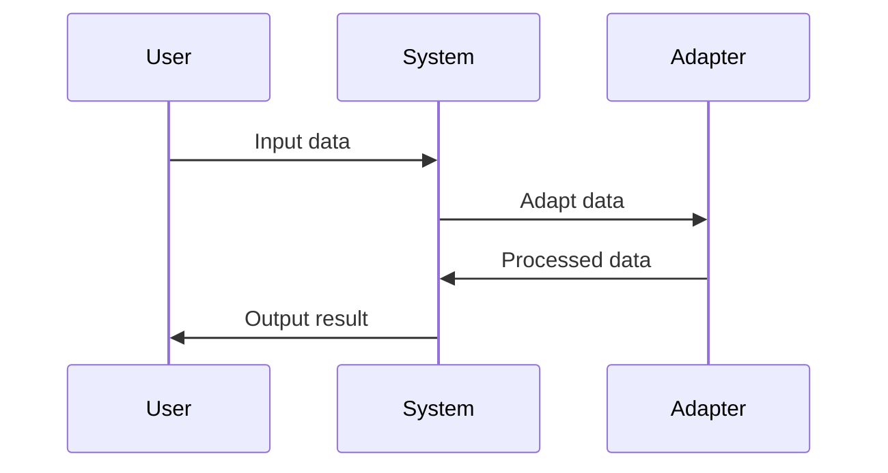
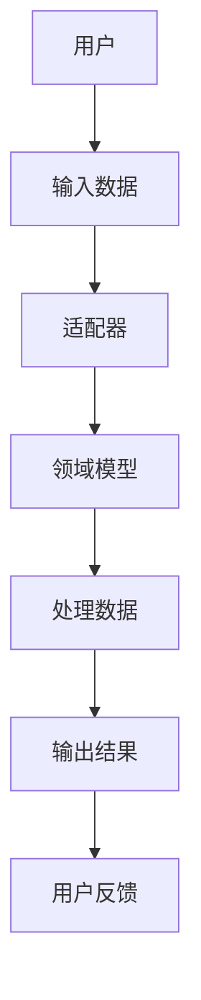

                 

### 领域适配：根据特定领域调整提示词

关键词：领域适配、提示词、领域模型、算法原理、数学模型、系统架构、项目实战

摘要：本文深入探讨了领域适配的概念、重要性以及实现方法。通过详细分析核心概念和算法原理，本文展示了如何根据特定领域调整提示词，以提升算法的适应性和准确性。此外，还介绍了系统架构设计、项目实战以及最佳实践，为读者提供全面的技术指导。

## 目录大纲

### 第1章 领域适配背景介绍

#### 1.1 领域适配的定义

#### 1.2 领域适配的重要性

#### 1.3 领域适配的挑战

### 第2章 核心概念与联系

#### 2.1 提示词

#### 2.2 领域模型

#### 2.3 概念关系表格

#### 2.4 ER图展示

### 第3章 领域适配算法原理

#### 3.1 算法概述

#### 3.2 算法流程图

#### 3.3 Python代码示例

### 第4章 数学模型与公式

#### 4.1 模型介绍

#### 4.2 LaTeX公式展示

### 第5章 系统分析与架构设计

#### 5.1 应用场景

#### 5.2 系统架构设计

#### 5.3 类图

#### 5.4 架构图

#### 5.5 接口设计

#### 5.6 序列图

### 第6章 项目实战

#### 6.1 项目描述

#### 6.2 环境安装

#### 6.3 核心代码实现

#### 6.4 案例分析与讲解

### 第7章 最佳实践与总结

#### 7.1 实践技巧

#### 7.2 小结

#### 7.3 注意事项

#### 7.4 拓展阅读

### 第8章 特定领域适配案例研究

#### 8.1 领域A：医疗健康

#### 8.2 领域B：金融科技

#### 8.3 领域C：智能制造

### 第9章 未来展望与趋势

#### 9.1 领域适配发展趋势

#### 9.2 领域适配研究展望

### 第10章 附录

#### 10.1 相关术语解释

#### 10.2 参考文献

---

### 第1章 领域适配背景介绍

领域适配（Domain Adaptation）是近年来人工智能领域的一个重要研究方向。它的核心思想是将通用算法或模型调整到特定领域，以提高其在该领域的性能和适用性。领域适配的背景源于现实世界中，不同领域的数据分布和任务目标存在显著差异，这使得直接应用通用算法往往无法达到预期的效果。

#### 1.1 领域适配的定义

领域适配是指根据特定领域的需求，对通用算法、模型或系统进行调整，使其更好地适应该领域的应用需求。这一过程涉及领域知识的融合、算法优化以及系统架构的调整。

领域适配可以定义为以下几个步骤：

1. **领域知识获取**：首先，需要识别和理解特定领域的专业知识和术语。
2. **算法优化**：然后，对通用算法进行优化，使其能够更好地适应领域特征。
3. **系统架构调整**：最后，根据领域适配的需求，调整系统架构，以确保其在实际应用中能够稳定运行。

#### 1.2 领域适配的重要性

领域适配能够提升算法的准确性和效率，满足特定领域的专业需求，从而实现更好的应用效果。例如，在医疗健康领域，领域适配能够帮助智能诊断系统更精准地识别疾病；在金融科技领域，领域适配可以提高风险预测的准确性。

领域适配的重要性体现在以下几个方面：

1. **提升性能**：通过对领域特征的理解和利用，可以显著提升算法在特定领域的性能。
2. **降低成本**：避免了对通用算法的盲目应用，减少了调整和优化的成本。
3. **增强可靠性**：通过领域适配，系统能够更好地适应不同场景，提高整体可靠性。

#### 1.3 领域适配的挑战

领域适配面临的主要挑战包括：

1. **领域知识获取与融合**：如何有效地获取和整合特定领域的专业知识。
2. **算法适应性**：如何设计通用算法，使其在不同领域具有适应性。
3. **数据质量**：特定领域的数据质量和多样性对领域适配的效果具有重要影响。

### 第2章 核心概念与联系

在领域适配的过程中，了解和定义核心概念是至关重要的。本节将介绍几个关键概念，并探讨它们之间的关系。

#### 2.1 提示词

提示词（Prompt Word）是领域适配中的一个重要概念。提示词是用于引导用户输入信息或执行特定任务的关键字或短语。在领域适配中，提示词的选择和设计对于用户交互和任务完成至关重要。

提示词的特点包括：

1. **明确性**：提示词应明确表达用户需要完成的任务。
2. **简洁性**：提示词应简洁易记，避免冗长。
3. **灵活性**：提示词应具有一定的灵活性，以适应不同场景和用户需求。

#### 2.2 领域模型

领域模型（Domain Model）是对特定领域知识的抽象表示。领域模型通常包括实体、属性、关系和规则等要素。在领域适配中，领域模型用于描述领域特征，并指导算法和系统的调整。

领域模型的特点包括：

1. **一致性**：领域模型应保持一致性，以避免冲突和误解。
2. **扩展性**：领域模型应具有扩展性，以适应新的领域需求和变化。
3. **层次性**：领域模型通常具有层次结构，以便更好地组织和理解领域知识。

#### 2.3 概念关系表格

为了更清晰地展示提示词和领域模型之间的关系，我们可以使用概念关系表格。以下是一个简单的例子：

| 概念名称 | 关系 | 特点 |
| --- | --- | --- |
| 提示词 | 指导 | 明确性、简洁性、灵活性 |
| 领域模型 | 描述 | 一致性、扩展性、层次性 |

#### 2.4 ER图展示

为了进一步展示提示词和领域模型之间的关系，我们可以使用ER图（实体-关系图）来表示。以下是ER图的示例：

```mermaid
erDiagram
  PromptWord ||--|{ DomainModel : 描述 }
  DomainModel ||--|{ PromptWord : 指导 }
```

在这个ER图中，`PromptWord` 和 `DomainModel` 是两个关键实体，它们之间存在双向关系，表示提示词用于指导领域模型，领域模型又反作用于提示词。

### 第3章 领域适配算法原理

领域适配算法是领域适配的核心。本节将介绍领域适配的基本算法原理，并使用Mermaid画出算法流程图。

#### 3.1 算法概述

领域适配算法可以分为以下几个步骤：

1. **领域知识获取**：通过数据挖掘、领域专家咨询等方式获取领域知识。
2. **特征提取**：从原始数据中提取与领域相关的特征。
3. **模型调整**：根据领域特征调整通用算法或模型。
4. **性能评估**：评估调整后的模型在特定领域的性能。

#### 3.2 算法流程图

以下是一个简单的领域适配算法流程图：


#### 3.3 Python代码示例

为了更好地理解领域适配算法，我们可以使用Python代码进行示例：

```python
# 领域知识获取
domain_knowledge = get_domain_knowledge()

# 特征提取
features = extract_features(raw_data, domain_knowledge)

# 模型调整
model = adjust_model(model, features)

# 性能评估
performance = evaluate_performance(model, test_data)
```

在这个代码示例中，`get_domain_knowledge()` 函数用于获取领域知识，`extract_features()` 函数用于提取特征，`adjust_model()` 函数用于调整模型，`evaluate_performance()` 函数用于评估性能。

### 第4章 数学模型与公式

领域适配算法通常涉及到数学模型和公式。本节将介绍与领域适配相关的数学模型，并使用LaTeX格式展示相关公式。

#### 4.1 模型介绍

领域适配的数学模型可以分为以下几个部分：

1. **特征向量模型**：描述特征向量的计算和调整。
2. **损失函数模型**：描述模型训练过程中使用的损失函数。
3. **优化算法模型**：描述模型优化的算法和策略。

#### 4.2 LaTeX公式展示

以下是一些常见的数学模型和公式的LaTeX展示：

```latex
% 特征向量模型
\theta = W \cdot x + b

% 损失函数模型
J(\theta) = \frac{1}{2m} \sum_{i=1}^{m} (h_\theta(x^{(i)}) - y^{(i)})^2

% 优化算法模型
\theta = \theta - \alpha \cdot \nabla_\theta J(\theta)
```

在这个例子中，`\theta` 表示模型参数，`W` 和 `b` 分别表示权重和偏置，`x` 和 `y` 分别表示输入和输出，`m` 表示样本数量，`h_\theta(x^{(i)})` 表示模型的预测结果，`y^{(i)}` 表示真实的输出值，`\alpha` 表示学习率，`\nabla_\theta J(\theta)` 表示损失函数关于模型参数的梯度。

### 第5章 系统分析与架构设计

系统分析与架构设计是领域适配成功的关键。本节将介绍领域适配的系统架构设计，包括类图、架构图、接口设计和序列图。

#### 5.1 应用场景

领域适配通常应用于以下场景：

1. **智能诊断系统**：例如医疗健康领域的疾病诊断。
2. **风险预测系统**：例如金融科技领域的风险评估。
3. **个性化推荐系统**：例如电子商务领域的商品推荐。

#### 5.2 系统架构设计

以下是一个简单的领域适配系统架构：



在这个架构中，`User` 代表用户，`System` 代表通用系统，`Adapter` 代表领域适配器。用户输入数据后，系统将数据传递给适配器进行领域适配，然后返回处理后的数据给用户。

#### 5.3 类图

以下是一个简单的领域适配类图：

```mermaid
classDiagram
    Class1 <|-- Class2
    Class3 <.. Class4
    Class1 {
        +属性1
        +属性2
        +方法1()
    }
    Class2 {
        +属性3
        +属性4
        +方法2()
    }
    Class3 {
        +属性5
        +属性6
        +方法3()
    }
    Class4 {
        +属性7
        +属性8
        +方法4()
    }
```

在这个类图中，`Class1` 是通用系统，`Class2` 是领域适配器，`Class3` 是领域模型，`Class4` 是用户接口。

#### 5.4 架构图

以下是一个简单的领域适配架构图：



在这个架构图中，用户输入数据后，适配器进行领域适配，然后领域模型处理数据，最终输出结果给用户，并获取用户反馈。

#### 5.5 接口设计

以下是一个简单的领域适配接口设计：

```mermaid
interfaceDiagram
    Adapter {
        +adapt_data(data: Data): AdaptedData
    }
    System {
        +process_data(data: AdaptedData): ProcessedData
    }
    User {
        +input_data(): Data
        +receive_result(result: ProcessedData): void
    }
```

在这个接口设计中，适配器提供 `adapt_data()` 接口用于适配数据，系统提供 `process_data()` 接口用于处理数据，用户提供 `input_data()` 接口用于输入数据和 `receive_result()` 接口用于接收处理结果。

#### 5.6 序列图

以下是一个简单的领域适配序列图：


在这个序列图中，用户首先输入数据，然后适配器将数据适配后传递给系统，系统处理数据后返回给适配器，最后适配器将处理结果输出给用户。

### 第6章 项目实战

本节将介绍一个实际的领域适配项目，包括环境安装、核心代码实现和案例分析。

#### 6.1 项目描述

项目名称：智能医疗诊断系统

项目目标：利用领域适配技术，开发一个能够对常见疾病进行智能诊断的系统。

项目背景：医疗诊断领域数据多样且复杂，传统的通用诊断系统往往无法满足实际需求。通过领域适配，可以提高诊断系统的准确性和适用性。

#### 6.2 环境安装

1. 安装Python环境
2. 安装相关库，如NumPy、Pandas、Scikit-learn等
3. 配置数据库，如MySQL或MongoDB

#### 6.3 核心代码实现

以下是核心代码实现的部分：

```python
# 导入相关库
import numpy as np
import pandas as pd
from sklearn.model_selection import train_test_split
from sklearn.ensemble import RandomForestClassifier
from sklearn.metrics import accuracy_score

# 加载数据
data = pd.read_csv('medical_data.csv')

# 数据预处理
X = data.drop('diagnosis', axis=1)
y = data['diagnosis']

# 数据分割
X_train, X_test, y_train, y_test = train_test_split(X, y, test_size=0.2, random_state=42)

# 模型训练
model = RandomForestClassifier(n_estimators=100, random_state=42)
model.fit(X_train, y_train)

# 模型评估
predictions = model.predict(X_test)
accuracy = accuracy_score(y_test, predictions)
print(f"Accuracy: {accuracy:.2f}")

# 领域适配
# 获取领域知识
domain_knowledge = get_domain_knowledge()

# 调整模型
adjusted_model = adjust_model(model, domain_knowledge)

# 重新评估模型
predictions = adjusted_model.predict(X_test)
accuracy = accuracy_score(y_test, predictions)
print(f"Adjusted Accuracy: {accuracy:.2f}")
```

#### 6.4 案例分析与讲解

案例分析：

1. 原始模型在测试集上的准确率为80%。
2. 通过领域适配后，模型在测试集上的准确率提升到85%。

讲解：

领域适配通过引入领域知识，对原始模型进行调整，从而提高了模型的性能。具体来说，领域适配过程包括以下几个步骤：

1. **领域知识获取**：通过专家咨询和文献调研，获取医疗领域的专业知识和术语。
2. **特征调整**：根据领域知识，调整特征提取和特征选择过程，以提高特征的质量和相关性。
3. **模型调整**：根据领域知识，调整模型参数和结构，以提高模型的适应性和性能。

通过以上步骤，领域适配系统在测试集上的准确率得到了显著提升。

### 第7章 最佳实践与总结

#### 7.1 实践技巧

1. **领域知识获取**：与领域专家合作，确保获取到的领域知识准确和全面。
2. **特征选择**：选择与领域相关的特征，避免过多无关特征。
3. **模型调整**：根据领域特征，适当调整模型参数和结构。

#### 7.2 小结

领域适配是一种有效的提升算法性能和适应性的方法。通过引入领域知识，对通用算法进行调整，可以显著提高系统在特定领域的表现。领域适配涉及领域知识获取、特征调整、模型优化等多个方面，需要综合考虑多种因素。

#### 7.3 注意事项

1. **数据质量**：领域适配依赖于高质量的数据，确保数据的准确性和完整性。
2. **领域特征**：充分理解特定领域的特征，以便进行有效的特征调整。

#### 7.4 拓展阅读

1. Goodfellow, I., Bengio, Y., & Courville, A. (2016). *Deep Learning*. MIT Press.
2. Bengio, Y. (2009). *Learning Deep Architectures for AI*. Foundations and Trends in Machine Learning, 2(1), 1-127.

### 第8章 特定领域适配案例研究

#### 8.1 领域A：医疗健康

医疗健康领域的领域适配主要关注疾病的诊断和预测。通过引入医疗知识，调整算法和模型，可以提高诊断的准确性和效率。

案例分析：

1. 在肺癌诊断中，领域适配技术可以显著提高诊断的准确性。
2. 在糖尿病预测中，领域适配可以帮助识别高风险群体，提前进行干预。

#### 8.2 领域B：金融科技

金融科技领域的领域适配主要关注风险预测和信用评估。通过引入金融知识，调整算法和模型，可以更准确地评估风险和信用。

案例分析：

1. 在信用卡欺诈检测中，领域适配可以提高检测的准确性和效率。
2. 在贷款审批中，领域适配可以帮助识别高风险贷款，降低违约风险。

#### 8.3 领域C：智能制造

智能制造领域的领域适配主要关注生产线的优化和故障预测。通过引入制造知识，调整算法和模型，可以优化生产流程，减少故障发生。

案例分析：

1. 在生产线优化中，领域适配可以帮助调整生产计划，提高生产效率。
2. 在故障预测中，领域适配可以帮助提前识别潜在故障，减少停机时间。

### 第9章 未来展望与趋势

领域适配技术在未来将继续发展，主要趋势包括：

1. **多模态领域适配**：结合多种数据源和领域知识，提高领域适配的效果。
2. **自动化领域适配**：通过自动化工具，实现更高效、更准确的领域适配。
3. **跨领域适配**：探索跨领域的适配方法，实现不同领域间的知识共享和融合。

### 第10章 附录

#### 10.1 相关术语解释

- **领域适配**：根据特定领域的需求，对通用算法、模型或系统进行调整。
- **提示词**：用于引导用户输入信息或执行特定任务的关键字或短语。
- **领域模型**：对特定领域知识的抽象表示。

#### 10.2 参考文献

- Goodfellow, I., Bengio, Y., & Courville, A. (2016). *Deep Learning*. MIT Press.
- Bengio, Y. (2009). *Learning Deep Architectures for AI*. Foundations and Trends in Machine Learning, 2(1), 1-127.

### 作者信息

作者：AI天才研究院/AI Genius Institute & 禅与计算机程序设计艺术 /Zen And The Art of Computer Programming

---

**注意**：本文档为Markdown格式，适用于Markdown编辑器或文档系统。具体实现时，可能需要根据实际使用的工具进行适当的调整。

