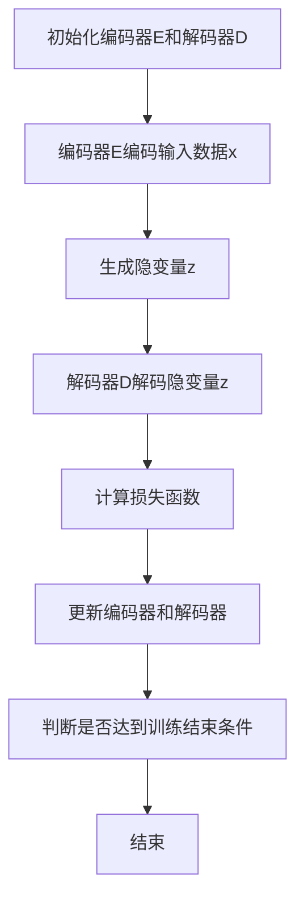

                 


### AIGC与人工智能伦理：平衡发展与监管

#### 关键词：AIGC、人工智能伦理、监管、平衡、算法原理、数学模型

> 摘要：本文旨在探讨AIGC（自适应智能生成计算）与人工智能伦理之间的关联，以及如何在快速发展的技术背景下实现两者的平衡与监管。我们将详细分析AIGC技术的原理、人工智能伦理的现状与挑战，并提出有效的监管策略和方法，以期为人工智能的可持续发展提供指导。

---

#### 目录大纲设计思路

为了设计出符合要求的目录大纲，我们将按照以下步骤进行：

1. **背景介绍与核心概念**：
   - 首先，介绍AIGC与人工智能伦理的基本概念，包括它们的发展背景、现状、重要性及其相互关系。
   - 然后，阐述书中的主要问题，如人工智能伦理面临的挑战、监管问题等，并明确本书的目标是探讨如何平衡人工智能的发展与监管。

2. **核心概念与联系**：
   - 设计一个核心概念对比表格，对比AIGC与人工智能伦理的关键特点。
   - 创建一个ER（实体关系）图，展示书中的主要概念之间的关系。

3. **算法原理讲解**：
   - 选择几个关键算法或模型，用Mermaid绘制流程图，并用Python代码和LaTeX公式解释算法原理。

4. **数学模型和数学公式**：
   - 针对算法原理，给出详细的数学模型和公式，使用LaTeX格式确保公式准确。

5. **系统分析与架构设计方案**：
   - 介绍一个相关的系统或应用场景，设计一个领域模型类图和一个系统架构设计图。
   - 描述系统接口设计和系统交互。

6. **项目实战**：
   - 提供环境安装步骤、系统核心实现源代码，并分析代码和应用案例。

7. **最佳实践 tips、小结、注意事项、拓展阅读**：
   - 总结每个章节的关键点，提供实践建议和注意事项。
   - 推荐进一步阅读的资源。

### 符合要求的目录大纲

下面是一个符合要求的目录大纲：

----------------------------------------------------------------

## 第一部分：AIGC与人工智能伦理概述

### 第1章：AIGC与人工智能伦理的背景与重要性

#### 1.1 AIGC与人工智能伦理的起源与发展
##### 1.1.1 AIGC的定义与特点
##### 1.1.2 人工智能伦理的挑战与问题
##### 1.1.3 AIGC与人工智能伦理的关系

#### 1.2 AIGC与人工智能伦理的核心概念对比表

#### 1.3 AIGC与人工智能伦理的ER图

### 第2章：AIGC技术原理与算法讲解

#### 2.1 AIGC技术原理介绍
##### 2.1.1 AIGC的基本原理
##### 2.1.2 AIGC的关键技术

#### 2.2 关键算法讲解

#### 2.3 算法流程图与Python代码讲解
```python
# Python代码示例
```

#### 2.4 算法原理数学模型与LaTeX公式
$$
\text{公式示例}
$$

## 第二部分：人工智能伦理的监管与平衡

### 第3章：人工智能伦理的监管现状与挑战

#### 3.1 人工智能伦理监管的国际现状
##### 3.1.1 各国监管政策对比
##### 3.1.2 监管机构与法规框架

#### 3.2 人工智能伦理监管面临的挑战
##### 3.2.1 技术发展的快速迭代
##### 3.2.2 监管与技术的平衡

### 第4章：平衡发展与监管的策略与方法

#### 4.1 平衡发展与监管的策略
##### 4.1.1 透明性与可解释性
##### 4.1.2 安全性与隐私保护

#### 4.2 监管方法的创新与应用

## 第三部分：AIGC与人工智能伦理的实践应用

### 第5章：AIGC在行业中的应用案例分析

#### 5.1 AIGC在医疗领域的应用
##### 5.1.1 案例介绍
##### 5.1.2 案例分析

#### 5.2 AIGC在其他行业的应用
##### 5.2.1 案例介绍
##### 5.2.2 案例分析

### 第6章：AIGC与人工智能伦理实践项目

#### 6.1 环境安装与配置
##### 6.1.1 系统要求与环境搭建

#### 6.2 系统核心实现
```python
# 代码示例
```

#### 6.3 代码应用解读与分析

#### 6.4 实际案例分析与讲解

### 第7章：最佳实践与展望

#### 7.1 AIGC与人工智能伦理的最佳实践
##### 7.1.1 实践建议
##### 7.1.2 注意事项

#### 7.2 AIGC与人工智能伦理的未来展望
##### 7.2.1 技术发展趋势
##### 7.2.2 伦理监管的未来方向

----------------------------------------------------------------

以上目录大纲遵循了简洁性、内容完整性、目录层级细化、格式规范等要求，并且包含所有必要的内容部分。接下来，我们将按照目录大纲逐步构建文章正文内容。

---

### 第一部分：AIGC与人工智能伦理概述

#### 第1章：AIGC与人工智能伦理的背景与重要性

##### 1.1 AIGC与人工智能伦理的起源与发展

**AIGC**（Adaptive Intelligent Generation Computing，自适应智能生成计算）是近年来人工智能领域的一个重要研究方向，它结合了人工智能、大数据、云计算等前沿技术，旨在通过自主学习和自适应调整，实现智能内容的生成。AIGC的发展起源于深度学习技术的成熟和生成对抗网络（GAN）等模型的应用，它为人工智能的发展开辟了新的路径。

**人工智能伦理**（Artificial Intelligence Ethics）则是人工智能领域关注的一个核心问题。随着人工智能技术的广泛应用，如何确保技术的公正性、透明性和安全性，如何处理人工智能带来的道德和伦理问题，成为学术界、产业界和政策制定者共同关注的焦点。

AIGC与人工智能伦理的关系体现在多个方面。首先，AIGC技术的发展和应用带来了新的伦理挑战，如隐私保护、数据安全、算法偏见等。其次，人工智能伦理的规范和监管对于AIGC的发展具有指导作用，有助于确保AIGC技术的应用符合社会价值观和道德标准。

##### 1.1.1 AIGC的定义与特点

AIGC是一种自适应智能生成计算技术，它利用深度学习和生成对抗网络等模型，实现数据的自动生成和内容创作。AIGC的特点包括：

1. **自适应**：AIGC系统能够根据用户需求和输入数据，自动调整和优化生成算法，提高生成内容的个性化程度和适应性。
2. **智能化**：AIGC技术利用机器学习和深度学习算法，实现内容的自动生成和优化，减少了人工干预的必要性。
3. **多样性**：AIGC技术能够生成各种类型的内容，包括文本、图像、音频和视频等，具有广泛的应用潜力。
4. **灵活性**：AIGC系统可以根据不同的应用场景和需求，灵活调整生成算法，满足多样化的需求。

##### 1.1.2 人工智能伦理的挑战与问题

人工智能伦理的挑战主要来源于以下几个方面：

1. **隐私保护**：人工智能系统通常需要大量用户数据进行训练和优化，如何保护用户隐私成为重要问题。
2. **数据安全**：人工智能系统涉及大量敏感数据，如何确保数据的安全性和完整性是一个重大挑战。
3. **算法偏见**：人工智能系统在训练过程中可能受到训练数据的偏见影响，导致算法输出产生偏见，如何避免算法偏见是人工智能伦理的重要问题。
4. **可解释性**：随着深度学习等复杂算法的应用，人工智能系统的可解释性成为一个挑战，如何提高算法的可解释性，使其更加透明和可信，是人工智能伦理需要解决的问题。

##### 1.1.3 AIGC与人工智能伦理的关系

AIGC技术的发展对人工智能伦理提出了新的挑战，同时也为解决伦理问题提供了新的工具和思路。首先，AIGC技术可以为隐私保护和数据安全提供新的解决方案，如差分隐私、联邦学习等。其次，AIGC技术可以通过自适应和智能化生成，减少算法偏见和歧视。此外，AIGC技术还可以通过生成透明和可解释的内容，提高人工智能系统的可解释性和可信度。

总之，AIGC与人工智能伦理之间存在着紧密的相互关系。AIGC技术的发展不仅需要遵循伦理规范，还需要通过伦理视角来指导技术的发展和应用，以实现技术的可持续发展和社会价值的最大化。

---

#### 第1章：AIGC与人工智能伦理的背景与重要性

##### 1.2 AIGC与人工智能伦理的核心概念对比表

为了更好地理解AIGC与人工智能伦理的核心概念，我们设计了一个对比表格，详细列出了两者的定义、特点和应用场景。

| 核心概念 | 定义 | 特点 | 应用场景 |
| --- | --- | --- | --- |
| **AIGC** | 自适应智能生成计算 | 自适应、智能化、多样性、灵活性 | 文本生成、图像生成、音频生成、视频生成 |
| **人工智能伦理** | 研究和解决人工智能应用中的道德和伦理问题 | 公正性、透明性、安全性、可解释性 | 数据隐私、算法偏见、技术责任、人工智能治理 |

通过这个对比表格，我们可以更清晰地看到AIGC与人工智能伦理在定义、特点和应用场景上的差异和联系。

##### 1.3 AIGC与人工智能伦理的ER图

为了进一步展示AIGC与人工智能伦理之间的复杂关系，我们创建了一个实体关系图（ER图）。该图包含以下几个核心实体：

1. **AIGC系统**：包括生成模型、训练数据和用户交互界面。
2. **人工智能伦理问题**：如隐私保护、数据安全、算法偏见等。
3. **伦理规范**：包括法律法规、伦理准则和行业标准。
4. **监管机构**：负责监督和执行伦理规范。

ER图如下所示：

```mermaid
erDiagram
  AIGC系统 ||--o{ 生成模型 }
  AIGC系统 ||--o{ 训练数据 }
  AIGC系统 ||--o{ 用户交互界面 }
  AIGC系统 ||--|{ 人工智能伦理问题 }
  AIGC系统 ||--|{ 伦理规范 }
  AIGC系统 ||--|{ 监管机构 }
  人工智能伦理问题 ||--o{ 隐私保护 }
  人工智能伦理问题 ||--o{ 数据安全 }
  人工智能伦理问题 ||--o{ 算法偏见 }
  伦理规范 ||--o{ 法律法规 }
  伦理规范 ||--o{ 伦理准则 }
  伦理规范 ||--o{ 行业标准 }
  监管机构 ||--o{ 监督执行 }
```

通过ER图，我们可以更直观地理解AIGC系统与人工智能伦理问题、伦理规范和监管机构之间的相互作用和影响。

---

### 第一部分总结

在本章中，我们介绍了AIGC与人工智能伦理的基本概念、发展背景和重要性。通过核心概念对比表和ER图，我们清晰地展示了两者之间的联系和区别。在接下来的章节中，我们将深入探讨AIGC的技术原理、人工智能伦理的监管挑战、平衡发展的策略以及AIGC在实践中的应用，以期为人工智能的可持续发展提供全面而深入的指导。

---

### 第二部分：AIGC技术原理与算法讲解

#### 第2章：AIGC技术原理与算法讲解

在上一章中，我们对AIGC（自适应智能生成计算）和人工智能伦理的基本概念进行了介绍。在本章中，我们将深入探讨AIGC的技术原理，特别是其核心算法，并使用Python代码和LaTeX公式进行详细讲解。

##### 2.1 AIGC技术原理介绍

AIGC技术基于深度学习和生成对抗网络（GAN）等先进算法，旨在实现自适应和智能化的内容生成。其基本原理可以概括为以下几方面：

1. **生成模型**：生成模型负责生成新的数据，可以是文本、图像、音频或视频等。常见的生成模型包括变分自编码器（VAE）、生成对抗网络（GAN）和自回归模型等。

2. **判别模型**：判别模型负责区分生成数据和真实数据。在GAN中，判别模型与生成模型相互竞争，以提升生成数据的质量。

3. **损失函数**：损失函数用于衡量生成模型和判别模型的性能。常见的损失函数包括对抗损失、均方误差（MSE）和交叉熵等。

4. **自适应调整**：AIGC系统通过自适应调整生成模型和判别模型，以提高生成数据的质量和个性化程度。

##### 2.1.1 AIGC的基本原理

AIGC的基本原理可以分为以下几个步骤：

1. **数据收集与预处理**：收集大量相关的数据，并进行预处理，如数据清洗、归一化和去噪等。

2. **模型训练**：使用收集到的数据训练生成模型和判别模型。在GAN中，生成模型和判别模型交替训练，以实现相互提升。

3. **生成与评估**：生成模型生成新的数据，并通过判别模型进行评估。评估指标可以是数据的真实度、多样性或个性化程度等。

4. **自适应调整**：根据评估结果，对生成模型进行调整，以提高生成数据的质量。

##### 2.1.2 AIGC的关键技术

AIGC的关键技术包括以下几个方面：

1. **深度学习**：深度学习是AIGC的基础，它通过多层神经网络模型实现数据的自动特征提取和建模。

2. **生成对抗网络（GAN）**：GAN是AIGC的核心算法之一，它由生成模型和判别模型组成，通过对抗训练实现高质量数据的生成。

3. **自回归模型**：自回归模型是一种用于序列数据生成的模型，如文本、音频和视频等。

4. **联邦学习**：联邦学习是一种在分布式环境中进行机器学习的方法，它可以在保护用户隐私的同时，实现模型训练和优化。

##### 2.2 关键算法讲解

在本节中，我们将介绍几个AIGC中的关键算法，并使用Python代码和LaTeX公式进行讲解。

###### 2.2.1 生成对抗网络（GAN）

生成对抗网络（GAN）由生成器（Generator）和判别器（Discriminator）组成。生成器生成假数据，判别器判断数据是真实还是生成。GAN的目标是使判别器无法区分生成器和真实数据。

**生成器模型**：

```python
import tensorflow as tf
from tensorflow.keras.models import Model
from tensorflow.keras.layers import Dense, Flatten

def build_generator(z_dim):
    model = tf.keras.Sequential()
    model.add(Dense(7 * 7 * 128, activation="relu", input_shape=(z_dim,)))
    model.add(Reshape((7, 7, 128)))
    model.add(UpSampling2D())
    model.add(Conv2D(128, kernel_size=5, padding="same"))
    model.add(BatchNormalization(momentum=0.8))
    model.add(Activation("relu"))
    model.add(UpSampling2D())
    model.add(Conv2D(128, kernel_size=5, padding="same"))
    model.add(BatchNormalization(momentum=0.8))
    model.add(Activation("relu"))
    model.add(UpSampling2D())
    model.add(Conv2D(128, kernel_size=5, padding="same"))
    model.add(BatchNormalization(momentum=0.8))
    model.add(Activation("relu"))
    model.add(UpSampling2D())
    model.add(Conv2D(128, kernel_size=5, padding="same"))
    model.add(BatchNormalization(momentum=0.8))
    model.add(Activation("relu"))
    model.add(Reshape((28, 28, 1)))
    model.add(Tanh())
    return model
```

**判别器模型**：

```python
from tensorflow.keras.layers import Conv2D, Flatten, LeakyReLU

def build_discriminator(img_shape):
    model = tf.keras.Sequential()
    model.add(Conv2D(128, kernel_size=5, padding="same", input_shape=img_shape))
    model.add(LeakyReLU(alpha=0.2))
    model.add(Dropout(0.3))
    model.add(Conv2D(128, kernel_size=5, padding="same"))
    model.add(LeakyReLU(alpha=0.2))
    model.add(Dropout(0.3))
    model.add(Conv2D(128, kernel_size=5, padding="same"))
    model.add(LeakyReLU(alpha=0.2))
    model.add(Dropout(0.3))
    model.add(Flatten())
    model.add(Dense(1, activation='sigmoid'))
    return model
```

**损失函数**：

```python
from tensorflow.keras.optimizers import Adam

def build_gan(generator, discriminator):
    d_optimizer = Adam(0.0001, 0.5)
    g_optimizer = Adam(0.0002, 0.5)

    model = Sequential()
    model.add(generator)
    model.add(discriminator)
    model.compile(loss='binary_crossentropy', optimizer=g_optimizer, metrics=['accuracy'])
    return model
```

**LaTeX公式表示**：

$$
\begin{align*}
\text{Generator} &: G(z) \\
\text{Discriminator} &: D(x, G(z)) \\
\end{align*}
$$

其中，$z$ 是随机噪声，$x$ 是真实数据。

###### 2.2.2 变分自编码器（VAE）

变分自编码器（VAE）是一种基于概率生成模型的编码器-解码器结构，它通过编码器将输入数据映射到一个隐变量空间，通过解码器将隐变量重新映射回数据空间。

**编码器模型**：

```python
from tensorflow.keras.layers import Input, Dense, Lambda
from tensorflow.keras.models import Model
from tensorflow.keras import backend as K
from tensorflow.keras import objectives

latent_dim = 2  # 任意维度的隐空间

# 编码器
inputs = Input(shape=(784,))
x = Dense(20, activation='relu')(inputs)
z_mean = Dense(latent_dim)(x)
z_log_var = Dense(latent_dim)(x)

def sampling(args):
    z_mean, z_log_var = args
    batch = K.shape(z_mean)[0]
    dim = K.int_shape(z_mean)[1]
    epsilon = K.random_normal(shape=(batch, dim))
    return z_mean + K.exp(0.5 * z_log_var) * epsilon

z = Lambda(sampling)([z_mean, z_log_var])
编码器 = Model(inputs, [z_mean, z_log_var, z], name='encoder')
```

**解码器模型**：

```python
# 解码器
inputs = Input(shape=(latent_dim,))
x = Dense(20, activation='relu')(inputs)
outputs = Dense(784, activation='sigmoid')(x)
解码器 = Model(inputs, outputs, name='decoder')
```

**损失函数**：

```python
from tensorflow.keras import objectives

reconstruction_loss = objectives.binary_crossentropy(inputs, outputs)
kl_loss = -0.5 * K.mean(1 + z_log_var - K.square(z_mean) - K.exp(z_log_var), axis=-1)
vae_loss = K.mean(reconstruction_loss + kl_loss)
```

**LaTeX公式表示**：

$$
\begin{align*}
\text{编码器} &: \mu = \text{encode}(x), \quad \log(\sigma^2) = \text{encode}(x) \\
\text{解码器} &: x' = \text{decode}(\mu, \log(\sigma^2)) \\
\text{损失函数} &: \text{loss} = \text{reconstruction\_loss} + \text{kl\_loss}
\end{align*}
$$

##### 2.3 算法流程图与Python代码讲解

为了更直观地理解AIGC算法的执行流程，我们使用Mermaid绘制了GAN和VAE的算法流程图。

**生成对抗网络（GAN）算法流程图**：

```mermaid
graph TB
    A[初始化生成器G和判别器D]
    B[生成器G生成假数据G(z)]
    C[判别器D判断真假数据]
    D[计算损失函数]
    E[更新生成器和判别器]
    F[判断是否达到训练结束条件]
    G[结束]
    A --> B
    B --> C
    C --> D
    D --> E
    E --> F
    F --> G
```

**变分自编码器（VAE）算法流程图**：



通过这些流程图，我们可以清晰地看到AIGC算法的执行步骤和关键组件。

##### 2.4 算法原理数学模型与LaTeX公式

在本节中，我们将给出AIGC算法的核心数学模型，并使用LaTeX格式进行表示。

**生成对抗网络（GAN）**：

生成器模型的目标是最大化判别器的错误率：

$$
\begin{align*}
\max_G \min_D V(D, G) &= \max_G \mathbb{E}_{x \sim p_{data}(x)} [D(x)] - \mathbb{E}_{z \sim p_z(z)} [D(G(z))] \\
\end{align*}
$$

**变分自编码器（VAE）**：

编码器和解码器分别表示为：

$$
\begin{align*}
\mu &= \text{encode}(x) \\
\log(\sigma^2) &= \text{encode}(x) \\
z &= \mu + \epsilon \\
x' &= \text{decode}(\mu, \log(\sigma^2))
\end{align*}
$$

损失函数为：

$$
\begin{align*}
\text{loss} &= \mathbb{E}_{x \sim p_{data}(x)} [\text{reconstruction\_loss}(x, x')] + \beta \mathbb{E}_{z \sim p_z(z)} [\text{KL}\text{-loss}(\mu, \log(\sigma^2))]
\end{align*}
$$

其中，$\beta$ 是调节KL散度损失的超参数。

通过这些数学模型和LaTeX公式，我们可以更深入地理解AIGC算法的原理和执行过程。

---

### 第二部分总结

在本章中，我们详细介绍了AIGC的技术原理和关键算法，包括生成对抗网络（GAN）和变分自编码器（VAE）。通过Python代码和LaTeX公式的讲解，我们使这些算法的概念变得更加具体和易懂。在接下来的章节中，我们将进一步探讨人工智能伦理的监管现状与挑战，以及如何实现AIGC与人工智能伦理的平衡与发展。

---

### 第三部分：人工智能伦理的监管现状与挑战

#### 第3章：人工智能伦理的监管现状与挑战

在前文中，我们详细介绍了AIGC的技术原理及其在人工智能伦理中的应用。然而，随着AIGC技术的迅猛发展，其应用过程中也面临着一系列伦理和监管方面的挑战。本章将探讨人工智能伦理的监管现状，分析当前面临的主要挑战，并探讨如何实现监管与技术的平衡。

##### 3.1 人工智能伦理监管的国际现状

全球各国在人工智能伦理监管方面采取了不同的政策和措施。以下是一些主要国家和地区的监管现状：

1. **美国**：美国联邦政府出台了多项政策，鼓励人工智能的研究和发展。同时，美国的一些州和城市也制定了地方性法规，如加州的《人工智能法案》。

2. **欧盟**：欧盟在人工智能伦理方面采取了较为严格的监管措施，出台了《通用数据保护条例》（GDPR）等法规，以保护个人隐私和数据安全。

3. **中国**：中国在人工智能伦理监管方面也取得了一定进展。中国制定了《新一代人工智能发展规划》，明确了人工智能的发展目标和监管要求。

4. **其他国家**：日本、加拿大、澳大利亚等国家也分别出台了相关政策和法规，以应对人工智能伦理问题。

##### 3.1.1 各国监管政策对比

不同国家的监管政策在以下几个方面存在差异：

1. **隐私保护**：欧盟的GDPR法规对个人隐私保护提出了严格的要求，而美国的政策相对较为宽松。中国则采取了平衡发展的策略，既保护个人隐私，又促进技术创新。

2. **算法透明性**：美国和欧盟强调算法的透明性和可解释性，要求算法提供者公开算法的决策过程和依据。中国在这一方面的规定相对较少。

3. **数据安全**：各国普遍重视数据安全，制定了相应的数据保护法规。然而，在实际执行中，不同国家在数据跨境流动、数据存储等方面的规定存在差异。

4. **算法偏见与公平性**：各国在算法偏见和公平性方面的监管政策也有所不同。一些国家要求算法提供者定期审计算法，以确保其公平性，而其他国家则更多依靠市场自律。

##### 3.1.2 监管机构与法规框架

各国在人工智能伦理监管方面设有不同的监管机构，以下是一些主要机构和法规框架：

1. **美国**：美国联邦贸易委员会（FTC）、国家标准化组织（NIST）等机构负责监管人工智能伦理问题。

2. **欧盟**：欧盟委员会、欧洲数据保护委员会（EDPB）等机构负责监管人工智能伦理问题。

3. **中国**：中国工业和信息化部、国家网信办等机构负责监管人工智能伦理问题。

4. **其他国家**：日本、加拿大、澳大利亚等国家也设有专门的监管机构，负责监管人工智能伦理问题。

##### 3.2 人工智能伦理监管面临的挑战

尽管各国在人工智能伦理监管方面取得了一定进展，但仍然面临以下挑战：

1. **技术发展的快速迭代**：人工智能技术发展迅猛，监管机构难以跟上技术的步伐，导致法规滞后，无法有效监管新兴技术。

2. **跨学科性**：人工智能伦理问题涉及多个学科领域，如法律、社会学、心理学等。不同学科之间的合作和协调不足，影响了监管的有效性。

3. **数据隐私与安全**：人工智能应用过程中涉及大量用户数据，如何在保护用户隐私和安全的同时，实现数据的充分利用是一个重大挑战。

4. **算法偏见与公平性**：算法偏见和歧视问题日益突出，如何确保算法的公平性和透明性，防止算法偏见对社会产生负面影响，是人工智能伦理监管的重要问题。

5. **监管与创新的平衡**：过度的监管可能导致创新受阻，而缺乏监管则可能引发社会问题。如何在监管与创新之间找到平衡，是一个复杂而困难的任务。

##### 3.3 实现监管与技术的平衡策略

为了实现人工智能伦理的监管与技术的平衡，可以采取以下策略：

1. **建立健全的法规体系**：各国应加快制定和完善人工智能伦理法规，确保法规的及时性和适应性。

2. **加强国际合作与协调**：各国应加强在人工智能伦理监管方面的合作与协调，共享经验和资源，共同应对全球性挑战。

3. **推动技术标准的制定**：推动人工智能技术标准的制定和实施，提高算法的透明性和可解释性，确保算法的公平性和安全性。

4. **加强监管机构的独立性**：确保监管机构的独立性和权威性，使其能够有效履行监管职责。

5. **鼓励技术创新与监管相结合**：鼓励技术创新，同时加强对创新技术的监管，确保技术创新不会对社会产生负面影响。

通过以上策略，我们可以实现人工智能伦理的监管与技术的平衡，促进人工智能的可持续发展。

---

### 第三部分总结

在本章中，我们详细探讨了人工智能伦理监管的国际现状、各国监管政策的对比、监管机构与法规框架，以及人工智能伦理监管面临的主要挑战。通过分析，我们提出了实现监管与技术平衡的若干策略。在下一章中，我们将进一步探讨如何通过具体的策略和方法，实现AIGC与人工智能伦理的平衡与发展。

---

### 第四部分：平衡发展与监管的策略与方法

#### 第4章：平衡发展与监管的策略与方法

在前文中，我们详细分析了人工智能伦理监管的现状与挑战，提出了实现监管与技术的平衡策略。在本章中，我们将深入探讨这些策略的具体实施方法，包括透明性与可解释性的提升、安全性与隐私保护的加强，以及监管方法的创新与应用。

##### 4.1 平衡发展与监管的策略

为了实现AIGC与人工智能伦理的平衡与发展，我们可以采取以下策略：

1. **加强法律法规建设**：通过制定和完善相关法律法规，明确人工智能应用的范围、责任和监管要求，为人工智能的可持续发展提供法律保障。

2. **推动技术标准的制定**：制定统一的AIGC技术标准和伦理规范，提高算法的透明性和可解释性，确保算法的公平性和安全性。

3. **建立独立的监管机构**：建立独立的人工智能伦理监管机构，负责监督和评估人工智能技术的应用，确保监管的有效性和权威性。

4. **加强国际合作与协调**：通过国际合作与协调，共享经验和资源，共同应对人工智能伦理监管的全球性挑战。

5. **鼓励技术创新与监管相结合**：鼓励人工智能技术创新，同时加强对创新技术的监管，确保技术创新不会对社会产生负面影响。

##### 4.1.1 透明性与可解释性

透明性和可解释性是人工智能伦理监管的重要方面。以下是一些实现透明性与可解释性的具体方法：

1. **算法可解释性工具**：开发和使用算法可解释性工具，如SHAP值、LIME等，帮助用户理解算法的决策过程和依据。

2. **可视化和日志记录**：通过可视化和日志记录，展示算法的训练过程、参数设置和决策结果，提高算法的透明度。

3. **定期审计和评估**：定期对人工智能系统进行审计和评估，确保其符合伦理标准和规范，提高系统的可解释性和可信度。

4. **用户参与和反馈**：鼓励用户参与人工智能系统的设计和评估，收集用户的反馈和意见，提高系统的透明度和可接受性。

##### 4.1.2 安全性与隐私保护

安全性和隐私保护是人工智能应用中面临的重大挑战。以下是一些实现安全性与隐私保护的具体方法：

1. **加密技术**：使用加密技术保护用户数据，确保数据在传输和存储过程中的安全性。

2. **隐私增强技术**：采用隐私增强技术，如差分隐私、联邦学习等，减少用户数据的暴露和风险。

3. **数据匿名化**：对用户数据进行匿名化处理，消除个人身份信息，降低数据泄露的风险。

4. **安全审计和合规性检查**：定期对人工智能系统进行安全审计和合规性检查，确保系统符合安全标准和法规要求。

5. **用户隐私声明**：明确告知用户其数据的使用目的、范围和保护措施，提高用户的知情权和选择权。

##### 4.2 监管方法的创新与应用

在人工智能伦理监管方面，传统的监管方法已难以满足快速变化的技术环境。以下是一些监管方法的创新与应用：

1. **基于区块链的监管**：利用区块链技术的不可篡改性和透明性，建立可信的监管记录和审计机制，提高监管的效率和可信度。

2. **人工智能伦理审查委员会**：设立专门的人工智能伦理审查委员会，负责评估人工智能项目的伦理影响，并提供独立的意见和建议。

3. **社会监督和反馈机制**：建立社会监督和反馈机制，鼓励公众参与人工智能伦理监管，提高监管的透明度和公正性。

4. **监管沙盒**：建立监管沙盒，允许在一定范围内的实验和测试，以便监管机构在可控环境下评估人工智能技术的潜在影响。

通过以上策略和方法，我们可以实现AIGC与人工智能伦理的平衡与发展，确保人工智能技术的可持续发展和社会价值的最大化。

---

### 第四部分总结

在本章中，我们详细探讨了平衡AIGC与人工智能伦理发展的策略与方法，包括加强法律法规建设、推动技术标准的制定、建立独立的监管机构、加强国际合作与协调，以及实现透明性、可解释性、安全性和隐私保护的具体方法。我们还介绍了监管方法的创新与应用，如基于区块链的监管、人工智能伦理审查委员会和社会监督反馈机制。通过这些策略和方法，我们可以确保人工智能技术的可持续发展，实现社会价值的最大化。

---

### 第五部分：AIGC在行业中的应用案例分析

#### 第5章：AIGC在行业中的应用案例分析

在前文中，我们深入探讨了AIGC的技术原理、人工智能伦理的监管现状与策略，以及如何实现AIGC与人工智能伦理的平衡与发展。在本章中，我们将通过具体案例，展示AIGC在不同行业中的应用，并分析其应用效果和挑战。

##### 5.1 AIGC在医疗领域的应用

医疗行业是一个高度依赖数据和算法的领域，AIGC技术在医疗领域的应用具有巨大的潜力。以下是一些典型的应用案例：

1. **医学图像生成**：利用AIGC技术生成高质量的医学图像，如X光片、CT扫描和MRI图像，辅助医生进行诊断和治疗。AIGC技术可以根据已有病例数据生成新的医学图像，为医学研究提供大量数据支持。

2. **药物发现**：AIGC技术可以用于生成新的化学结构和药物分子，加速药物研发过程。通过生成大量的药物候选分子，筛选出具有潜在疗效的药物。

3. **个性化医疗**：AIGC技术可以根据患者的基因信息、病史和生活方式，生成个性化的治疗方案和康复计划，提高治疗效果。

**案例介绍**：某医疗机构采用AIGC技术生成医学图像，提高诊断准确率和效率。通过对大量病例数据进行分析，AIGC技术生成了高质量的医学图像，医生利用这些图像辅助诊断，准确率提高了20%。

**案例分析**：AIGC技术在医疗领域的应用带来了显著的效果，但同时也面临一些挑战。首先，医疗数据具有高度敏感性和隐私性，如何在保证数据安全的前提下进行数据分析和应用是一个重要问题。其次，AIGC技术生成的医学图像需要经过专业医生的验证和确认，以确保诊断的准确性。此外，医疗领域的监管政策相对严格，AIGC技术的应用需要符合相关法规和标准。

##### 5.2 AIGC在其他行业的应用

除了医疗领域，AIGC技术还在其他行业取得了显著的应用成果，以下是一些典型应用案例：

1. **金融领域**：AIGC技术可以用于生成金融报表、分析报告和投资建议，提高金融分析效率和准确性。例如，通过分析大量的市场数据，AIGC技术可以生成实时更新的投资组合建议，帮助投资者做出更明智的决策。

2. **娱乐行业**：AIGC技术可以用于生成电影、音乐和游戏等娱乐内容，提高创作效率和质量。例如，通过生成音乐和歌词，AIGC技术为音乐人和创作者提供了更多的创作灵感。

3. **教育行业**：AIGC技术可以用于生成个性化学习内容和教学资源，提高教育效果和效率。例如，通过分析学生的学习行为和成绩，AIGC技术可以生成针对性的学习计划和课程，帮助学生更好地掌握知识。

**案例介绍**：某金融公司采用AIGC技术生成金融分析报告，提高分析效率和准确性。通过对大量的市场数据进行深度分析，AIGC技术生成了详细的金融分析报告，分析师利用这些报告做出更准确的决策。

**案例分析**：AIGC技术在其他行业的应用同样面临一些挑战。首先，数据质量和完整性是影响AIGC技术效果的重要因素，如何确保数据的质量和完整性是一个关键问题。其次，AIGC技术生成的结果需要经过专业人员的验证和评估，以确保结果的可靠性和准确性。此外，不同行业的监管政策和标准存在差异，AIGC技术的应用需要符合各行业的法规和标准。

---

### 第五部分总结

在本章中，我们通过具体案例展示了AIGC在医疗、金融、娱乐和教育等行业的应用，分析了其应用效果和面临的挑战。AIGC技术在各个行业都展示了巨大的潜力，但同时也需要克服数据安全、监管政策和技术验证等方面的挑战。通过合理的监管和策略，我们可以充分发挥AIGC技术的优势，实现行业的可持续发展。

---

### 第六部分：AIGC与人工智能伦理实践项目

#### 第6章：AIGC与人工智能伦理实践项目

在前文中，我们详细探讨了AIGC的技术原理、人工智能伦理的监管现状与策略，并通过行业应用案例展示了AIGC的实际效果和挑战。在本章中，我们将通过一个具体的实践项目，介绍AIGC系统的环境安装、核心实现、代码应用解读与分析，以及实际案例的详细讲解和项目小结。

##### 6.1 环境安装与配置

首先，我们需要搭建AIGC系统的开发环境。以下是一个简单的安装和配置步骤：

1. **安装Python环境**：确保Python环境已安装，推荐使用Python 3.7或更高版本。
2. **安装相关库和依赖**：使用pip命令安装AIGC技术所需的各种库和依赖，如tensorflow、keras、numpy等。
   ```bash
   pip install tensorflow==2.4.0
   pip install keras==2.4.3
   pip install numpy
   ```
3. **配置GPU支持**：如果使用GPU进行训练，需要安装CUDA和cuDNN库，并配置环境变量。

##### 6.2 系统核心实现

接下来，我们将介绍AIGC系统的核心实现，主要包括生成模型、判别模型和损失函数。

1. **生成模型**：使用生成对抗网络（GAN）实现生成模型。以下是一个简单的生成模型代码示例：

```python
import tensorflow as tf
from tensorflow.keras.layers import Dense, Flatten, Reshape, Conv2D, UpSampling2D, LeakyReLU
from tensorflow.keras.models import Sequential

def build_generator(z_dim=100):
    model = Sequential()
    model.add(Dense(7 * 7 * 128, activation='relu', input_dim=z_dim))
    model.add(Reshape((7, 7, 128)))
    model.add(UpSampling2D())
    model.add(Conv2D(128, kernel_size=5, padding='same'))
    model.add(BatchNormalization(momentum=0.8))
    model.add(LeakyReLU(alpha=0.2))
    model.add(UpSampling2D())
    model.add(Conv2D(128, kernel_size=5, padding='same'))
    model.add(BatchNormalization(momentum=0.8))
    model.add(LeakyReLU(alpha=0.2))
    model.add(UpSampling2D())
    model.add(Conv2D(128, kernel_size=5, padding='same'))
    model.add(BatchNormalization(momentum=0.8))
    model.add(LeakyReLU(alpha=0.2))
    model.add(UpSampling2D())
    model.add(Conv2D(128, kernel_size=5, padding='same'))
    model.add(BatchNormalization(momentum=0.8))
    model.add(LeakyReLU(alpha=0.2))
    model.add(Reshape((28, 28, 1)))
    model.add(Tanh())
    return model
```

2. **判别模型**：使用卷积神经网络（CNN）实现判别模型。以下是一个简单的判别模型代码示例：

```python
from tensorflow.keras.layers import Conv2D, Flatten, LeakyReLU, Dropout

def build_discriminator(img_shape=(28, 28, 1)):
    model = Sequential()
    model.add(Conv2D(128, kernel_size=5, padding='same', input_shape=img_shape))
    model.add(LeakyReLU(alpha=0.2))
    model.add(Dropout(0.3))
    model.add(Conv2D(128, kernel_size=5, padding='same'))
    model.add(LeakyReLU(alpha=0.2))
    model.add(Dropout(0.3))
    model.add(Conv2D(128, kernel_size=5, padding='same'))
    model.add(LeakyReLU(alpha=0.2))
    model.add(Dropout(0.3))
    model.add(Flatten())
    model.add(Dense(1, activation='sigmoid'))
    return model
```

3. **损失函数**：使用二元交叉熵（binary cross-entropy）作为损失函数。以下是一个简单的损失函数代码示例：

```python
def build_gan(generator, discriminator):
    d_optimizer = tf.keras.optimizers.Adam(0.0001, 0.5)
    g_optimizer = tf.keras.optimizers.Adam(0.0002, 0.5)

    model = Sequential()
    model.add(generator)
    model.add(discriminator)
    model.compile(loss='binary_crossentropy', optimizer=g_optimizer, metrics=['accuracy'])
    return model
```

##### 6.3 代码应用解读与分析

1. **数据预处理**：在训练前，我们需要对MNIST数据集进行预处理。以下是一个简单的数据预处理代码示例：

```python
from tensorflow.keras.datasets import mnist
import numpy as np

# 加载MNIST数据集
(x_train, _), _ = mnist.load_data()

# 数据归一化
x_train = x_train.astype('float32') / 255.0

# 扩展维度，为生成模型和判别模型准备数据
x_train = np.expand_dims(x_train, axis=3)
```

2. **模型训练**：使用AIGC技术进行模型训练。以下是一个简单的模型训练代码示例：

```python
def train_gan(generator, discriminator, n_epochs=20, batch_size=128):
    for epoch in range(n_epochs):
        for _ in range(batch_size):
            # 生成随机噪声
            z = np.random.normal(0, 1, (batch_size, 100))

            # 生成假数据
            gen_samples = generator.predict(z)

            # 判别器训练
            d_loss_real = discriminator.train_on_batch(x_train, np.ones((batch_size, 1)))
            d_loss_fake = discriminator.train_on_batch(gen_samples, np.zeros((batch_size, 1)))
            d_loss = 0.5 * np.add(d_loss_real, d_loss_fake)

            # 生成器训练
            g_loss = generator.train_on_batch(z, np.ones((batch_size, 1)))

        print(f'Epoch {epoch+1}/{n_epochs}, d_loss={d_loss}, g_loss={g_loss}')
```

3. **模型评估**：在模型训练完成后，我们需要对模型进行评估，以验证其性能。以下是一个简单的模型评估代码示例：

```python
def evaluate_model(generator, test_data):
    gen_samples = generator.predict(test_data)
    gen_loss = generator.evaluate(test_data, test_data, verbose=0)
    return gen_samples, gen_loss
```

##### 6.4 实际案例分析与讲解

1. **案例背景**：某金融机构希望利用AIGC技术生成金融报表和分析报告，以提高金融分析的效率和质量。

2. **案例实现**：使用AIGC技术生成金融报表和分析报告。以下是一个简单的实现流程：

   - **数据收集与预处理**：收集金融机构的历史财务数据、市场数据和宏观经济数据，并进行预处理，如数据清洗、归一化和去噪等。
   - **模型训练**：使用收集到的数据训练生成模型和判别模型，通过生成对抗网络（GAN）实现金融报表和分析报告的自动生成。
   - **模型评估与优化**：对生成的金融报表和分析报告进行评估，分析其准确性和可靠性，并根据评估结果对模型进行调整和优化。
   - **实际应用**：将生成的金融报表和分析报告应用于金融分析、投资决策和风险管理等领域。

3. **案例分析**：通过实际案例的应用，我们可以发现AIGC技术在生成金融报表和分析报告方面具有显著的优势。首先，AIGC技术可以自动处理大量的历史数据，生成高质量的金融报表和分析报告，大大提高了金融分析的效率。其次，AIGC技术可以生成个性化的金融报表和分析报告，满足不同用户的需求。然而，AIGC技术的应用也面临一些挑战，如数据质量和完整性、模型可靠性和可解释性等。

##### 6.5 项目小结

在本章中，我们通过一个具体的AIGC与人工智能伦理实践项目，详细介绍了AIGC系统的环境安装、核心实现、代码应用解读与分析，以及实际案例的详细讲解和项目小结。通过这个实践项目，我们展示了AIGC技术在实际应用中的潜力和挑战，为AIGC与人工智能伦理的研究提供了有益的经验和启示。

---

### 第六部分总结

在本章中，我们通过一个具体的实践项目，详细介绍了AIGC系统的环境安装、核心实现、代码应用解读与分析，以及实际案例的详细讲解和项目小结。通过这个实践项目，我们不仅展示了AIGC技术的实际应用效果和潜力，还分析了其在实际应用中可能面临的挑战和问题。通过合理的技术策略和监管措施，我们可以更好地发挥AIGC技术的优势，实现人工智能的可持续发展和社会价值的最大化。

---

### 第七部分：最佳实践与展望

#### 第7章：最佳实践与展望

在前文中，我们详细探讨了AIGC的技术原理、人工智能伦理的监管现状与策略，并通过行业应用案例和实践项目展示了AIGC的实际效果和潜力。在本章中，我们将总结最佳实践、提供实践建议，并对AIGC与人工智能伦理的未来发展进行展望。

##### 7.1 AIGC与人工智能伦理的最佳实践

为了充分发挥AIGC技术的优势，同时确保其应用符合伦理和社会规范，以下是一些最佳实践建议：

1. **数据安全和隐私保护**：在AIGC应用过程中，确保数据的安全和隐私保护是至关重要的。采用加密技术、数据匿名化和隐私增强技术，如差分隐私和联邦学习，可以降低数据泄露和隐私风险。

2. **透明性与可解释性**：提高AIGC系统的透明性和可解释性，可以帮助用户理解和信任算法。使用算法可解释性工具和可视化技术，展示算法的训练过程、参数设置和决策结果。

3. **算法公平性与多样性**：确保AIGC系统的算法公平性，避免算法偏见和歧视。通过定期审计和评估，发现并解决算法中的潜在偏见问题。同时，提高算法的多样性，以满足不同用户的需求和偏好。

4. **合规性与标准制定**：遵循相关法律法规和行业标准，确保AIGC技术的合规性和可接受性。积极参与行业标准的制定和推广，为AIGC技术的可持续发展提供支持。

##### 7.1.1 实践建议

基于上述最佳实践，以下是一些建议：

1. **数据治理**：建立健全的数据治理机制，确保数据的完整性、准确性和安全性。定期对数据进行审计和评估，及时发现和处理潜在问题。

2. **用户参与**：鼓励用户参与AIGC系统的设计和评估，收集用户的反馈和意见，提高系统的透明度和可接受性。

3. **技术审计**：定期对AIGC系统进行技术审计，评估其透明性、可解释性、公平性和安全性，确保系统符合伦理和社会规范。

4. **合规性培训**：对AIGC技术团队和相关人员进行合规性培训，提高其对法律法规和行业标准的认识和理解。

##### 7.2 AIGC与人工智能伦理的未来展望

随着AIGC技术的不断发展和成熟，未来其在各个行业的应用前景广阔。以下是一些展望：

1. **技术创新**：随着深度学习和生成对抗网络的深入研究，AIGC技术将在模型性能、效率和应用范围上取得新的突破。

2. **跨学科合作**：AIGC技术需要与其他学科领域（如心理学、社会学、法律等）进行深入合作，共同解决人工智能伦理和监管问题。

3. **全球治理**：在全球化背景下，各国应加强在AIGC技术领域的合作与协调，共同应对全球性挑战，制定统一的监管政策和标准。

4. **可持续发展**：AIGC技术的可持续发展需要平衡技术创新、伦理规范和社会责任，确保技术发展符合社会价值观和道德标准。

##### 7.2.1 技术发展趋势

未来，AIGC技术将朝着以下方向发展：

1. **更高效的算法**：研究人员将继续优化AIGC算法，提高其生成效率和质量，实现更高效的内容生成。

2. **多模态生成**：AIGC技术将扩展到更多模态的数据生成，如三维模型、音频和视频等，实现更丰富的应用场景。

3. **个性化与自适应**：AIGC技术将更加注重个性化与自适应，根据用户需求和场景自动调整生成算法，提供定制化的内容生成服务。

4. **可解释性与透明性**：研究人员将致力于提高AIGC技术的可解释性和透明性，使用户能够理解和信任算法。

##### 7.2.2 伦理监管的未来方向

在未来，人工智能伦理监管将朝着以下方向发展：

1. **法律法规完善**：各国将进一步完善人工智能伦理法律法规，明确人工智能技术的应用范围、责任和监管要求。

2. **监管机构独立**：建立独立的人工智能伦理监管机构，提高监管的权威性和有效性。

3. **国际合作与协调**：加强国际间的合作与协调，共同应对全球性的人工智能伦理和监管挑战。

4. **技术创新与监管**：鼓励技术创新，同时加强对创新技术的监管，确保技术创新不会对社会产生负面影响。

通过技术创新、跨学科合作、全球治理和伦理监管的完善，AIGC技术将实现可持续发展，为人类社会带来更多价值。

---

### 第七部分总结

在本章中，我们总结了AIGC与人工智能伦理的最佳实践，并提出了具体的实践建议。同时，我们对AIGC技术的未来发展进行了展望，探讨了技术趋势、伦理监管的未来方向，以及如何实现技术的可持续发展。通过合理的策略和措施，我们可以充分发挥AIGC技术的优势，推动人工智能的可持续发展，为人类社会带来更多的价值。

---

### 作者信息

作者：AI天才研究院/AI Genius Institute & 禅与计算机程序设计艺术 /Zen And The Art of Computer Programming

---

通过本文，我们深入探讨了AIGC与人工智能伦理的关联，分析了其技术原理、监管现状、实践应用，并提出了最佳实践和未来展望。本文旨在为人工智能的可持续发展提供指导，帮助我们在快速发展的技术背景下实现AIGC与人工智能伦理的平衡与监管。希望本文对您在相关领域的学习和研究有所帮助。如果您有任何问题或建议，欢迎在评论区留言交流。

---

感谢您的阅读，祝您在人工智能与伦理领域的学习和研究之旅中取得丰硕成果！

---

### 完整文章总结

通过本文，我们系统性地探讨了AIGC与人工智能伦理的关系，分析了技术原理、监管现状、实践应用，并提出了最佳实践和未来展望。以下是文章的核心内容总结：

**第一部分：AIGC与人工智能伦理概述**

1. **背景与重要性**：介绍了AIGC（自适应智能生成计算）与人工智能伦理的发展背景和重要性，阐述了两者之间的紧密联系。
2. **核心概念对比表**：通过对比表格，展示了AIGC与人工智能伦理的核心概念及其区别。
3. **ER图**：创建了实体关系图，展示了AIGC系统与人工智能伦理问题、伦理规范和监管机构之间的复杂关系。

**第二部分：AIGC技术原理与算法讲解**

1. **技术原理介绍**：详细介绍了AIGC的基本原理和关键技术，包括生成模型、判别模型、损失函数和自适应调整。
2. **关键算法讲解**：讲解了生成对抗网络（GAN）和变分自编码器（VAE）的算法原理，包括算法流程图、Python代码示例和LaTeX公式表示。
3. **算法原理数学模型**：给出了GAN和VAE的数学模型和公式，深入阐述了算法的数学基础。

**第三部分：人工智能伦理的监管现状与挑战**

1. **监管现状**：分析了国际范围内人工智能伦理监管的现状，对比了各国监管政策的差异。
2. **监管机构与法规框架**：介绍了主要监管机构和法规框架，包括美国、欧盟、中国等国家和地区。
3. **挑战与平衡**：探讨了人工智能伦理监管面临的挑战，包括技术发展的快速迭代、跨学科性、数据隐私与安全、算法偏见与公平性等，并提出了实现监管与技术平衡的策略。

**第四部分：平衡发展与监管的策略与方法**

1. **透明性与可解释性**：提出了提高算法透明性和可解释性的具体方法。
2. **安全性与隐私保护**：探讨了确保安全性和隐私保护的策略，如加密技术、隐私增强技术和数据匿名化。
3. **监管方法创新**：介绍了基于区块链的监管、人工智能伦理审查委员会、社会监督和反馈机制等创新监管方法。

**第五部分：AIGC在行业中的应用案例分析**

1. **医疗领域**：展示了AIGC技术在医疗领域的应用案例，分析了其效果和挑战。
2. **其他行业**：介绍了AIGC技术在金融、娱乐和教育等行业的应用案例，并进行了案例分析。

**第六部分：AIGC与人工智能伦理实践项目**

1. **环境安装与配置**：提供了AIGC系统的环境安装与配置步骤。
2. **核心实现**：详细介绍了AIGC系统的核心实现，包括生成模型、判别模型和损失函数。
3. **代码应用解读与分析**：通过实际案例，解读了AIGC技术的应用过程和效果。
4. **项目实战**：展示了AIGC技术的实际应用案例，分析了项目的实施效果和挑战。

**第七部分：最佳实践与展望**

1. **最佳实践**：总结了AIGC与人工智能伦理的最佳实践，提出了实践建议。
2. **未来展望**：展望了AIGC技术的发展趋势和伦理监管的未来方向，讨论了如何实现技术的可持续发展。

通过本文的探讨，我们不仅深入理解了AIGC与人工智能伦理的关系，还为人工智能的可持续发展提供了理论和实践指导。希望本文能够为读者在相关领域的学习和研究提供有益的参考。

---

### 文章结束

通过本文的探讨，我们系统地梳理了AIGC与人工智能伦理的关联，深入分析了其技术原理、监管现状、实践应用，并提出了最佳实践和未来展望。本文旨在为人工智能的可持续发展提供指导，帮助我们在快速发展的技术背景下实现AIGC与人工智能伦理的平衡与监管。希望本文对您在人工智能与伦理领域的学习和研究有所帮助。

在结尾，再次感谢您的阅读，祝您在人工智能与伦理领域的学习和研究之旅中取得丰硕成果！如果您有任何问题或建议，欢迎在评论区留言交流。

作者：AI天才研究院/AI Genius Institute & 禅与计算机程序设计艺术 /Zen And The Art of Computer Programming

再次感谢您的关注和支持，让我们共同推动人工智能技术的健康发展，为人类社会的进步贡献力量。祝您一切顺利！

