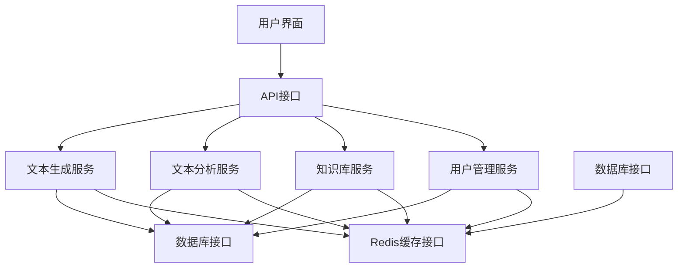

                 

### AIGC与人类写作的协同效应

---

## 关键词

- AIGC（AI Generated Content）
- 人类写作
- 协同效应
- 机器学习
- 自然语言处理

---

## 摘要

本文旨在探讨人工智能生成内容（AIGC）与人类写作之间的协同效应。随着人工智能技术的快速发展，AIGC在内容创作中的应用日益广泛，它不仅能够提高写作效率，还能够为人类写作提供创新和灵感。本文首先介绍了AIGC的基本概念和现状，然后分析了人类写作面临的挑战，并阐述了AIGC在其中的作用。接着，本文详细解释了AIGC的算法原理，并使用Python代码和LaTeX公式进行说明。此外，本文还通过系统分析与架构设计方案，展示了AIGC在实际项目中的应用。最后，本文总结了AIGC与人类写作的协同效应，并给出了未来发展的展望。

---

## 背景介绍

### AIGC的基本概念

AIGC，即人工智能生成内容，是指通过人工智能技术自动生成各种形式的内容，如文本、图片、视频等。AIGC的核心在于利用机器学习和深度学习算法，从大量的数据中学习和提取规律，然后根据特定的需求生成新的内容。AIGC的应用领域非常广泛，包括但不限于写作辅助、内容创作、数据报告生成、艺术创作等。

AIGC的发展历程可以追溯到20世纪80年代，当时的人工智能研究主要集中在专家系统和知识表示上。随着计算能力的提升和大数据技术的发展，深度学习和自然语言处理（NLP）等技术在近年来取得了显著突破，为AIGC的应用奠定了基础。特别是2017年，谷歌推出了Transformer模型，这标志着NLP领域进入了一个新的阶段，也为AIGC的发展带来了新的机遇。

### AIGC的应用领域

AIGC的应用领域非常广泛，以下是一些典型的应用场景：

1. **写作辅助**：AIGC可以帮助人类作者快速生成文章大纲、草稿，甚至完整的文章。例如，OpenAI的GPT-3模型可以生成高质量的文本，从新闻报道到小说写作，从商业文案到学术论文。

2. **内容创作**：AIGC可以自动生成内容，如新闻文章、博客、社交媒体帖子等。这对于媒体公司和内容创作者来说，极大地提高了内容生产和发布效率。

3. **数据报告生成**：AIGC可以自动分析大量数据，并生成详细的数据报告。这对于企业和政府机构来说，是一种高效的数据分析和管理工具。

4. **艺术创作**：AIGC可以生成音乐、绘画、摄影等艺术作品。例如，DeepArt.io利用神经网络技术，可以将普通照片转化为艺术作品。

### 为什么AIGC与人类写作的协同效应是一个重要话题

AIGC与人类写作的协同效应之所以成为一个重要话题，主要是因为以下几点：

1. **效率提升**：AIGC可以帮助人类作者节省大量时间和精力，从而提高写作效率。

2. **质量保证**：AIGC可以通过学习和优化，生成高质量的内容。这对于内容创作者来说，是一种重要的质量保证。

3. **创新驱动**：AIGC可以提供新的写作灵感和创意，激发人类作者的创造力。

4. **知识共享**：AIGC可以生成大量的内容，这些内容可以作为知识库，供人类作者参考和引用。

5. **自动化与个性化**：AIGC可以根据用户的需求和喜好，自动生成个性化的内容，这为内容创作提供了新的可能。

### 小结

AIGC作为人工智能技术的重要组成部分，已经在多个领域取得了显著的应用成果。它与人类写作的协同效应，不仅能够提高写作效率和内容质量，还能够激发创新和创造力。因此，深入研究AIGC与人类写作的协同效应，对于推动内容创作和人工智能技术的发展具有重要意义。

---

## 人类写作的现状与挑战

### 人类写作的优势

人类写作作为一种传统的信息传递和表达方式，具有许多独特的优势：

1. **情感表达**：人类写作能够深刻地表达情感和思想，这是其他形式的内容生成所难以比拟的。通过文字，作者可以传递自己的情感、观点和思考，与读者产生共鸣。

2. **个性化**：每个人的写作风格和表达方式都是独特的，这为内容创作提供了丰富的多样性。个性化的写作能够更好地满足不同读者的需求，提供更加贴心的内容体验。

3. **创造力**：人类写作能够激发创造力，通过构思和创作，作者可以创造出全新的故事、概念和观点。这种创造力是人类智慧的体现，也是内容创作的核心价值。

4. **深度理解**：人类写作能够深入探讨和解释复杂的概念和主题，使读者能够更深入地理解和掌握知识。

### 人类写作面临的挑战

尽管人类写作具有许多优势，但现代写作也面临着一系列挑战：

1. **效率低下**：写作是一个耗时且繁琐的过程，从构思到完成需要经过多个阶段。现代生活节奏快，人们的时间和精力有限，这使得写作效率成为一大挑战。

2. **内容质量参差不齐**：由于写作水平的差异，产生的文章质量参差不齐。有些文章可能缺乏深度和逻辑性，难以满足读者的需求。

3. **信息过载**：在信息爆炸的时代，人们面临着海量的信息，这使得优质内容的获取变得更加困难。如何从海量信息中筛选出有价值的内容，是写作面临的挑战之一。

4. **创新乏力**：在传统写作模式下，创新往往受到作者个人经验和知识的限制。如何打破思维定势，实现内容的创新，是写作领域需要解决的重要问题。

### AIGC在人类写作中的应用潜力

AIGC的出现为人类写作带来了一种新的可能性，它能够有效地解决上述挑战：

1. **提高效率**：AIGC可以快速生成文章大纲、草稿，甚至完整的文章。通过自动化处理，作者可以节省大量时间和精力，提高写作效率。

2. **提升内容质量**：AIGC通过学习和优化，可以生成高质量的内容。它可以基于大量数据进行分析，提供更有深度和逻辑性的文章。

3. **激发创新**：AIGC可以提供新的写作灵感和创意，帮助作者打破思维定势，实现内容的创新。

4. **个性化写作**：AIGC可以根据用户的需求和喜好，自动生成个性化的内容，满足不同读者的需求。

5. **知识管理**：AIGC可以自动生成大量的内容，这些内容可以作为知识库，供作者参考和引用，从而提高写作的准确性和深度。

### 小结

人类写作在情感表达、个性化、创造力和深度理解方面具有独特的优势，但同时也面临着效率、质量和创新等方面的挑战。AIGC的引入为人类写作提供了新的解决方案，它不仅能够提高写作效率，还能够提升内容质量和激发创新。因此，深入研究AIGC在人类写作中的应用潜力，对于推动写作领域的进步具有重要意义。

---

## AIGC与人类写作的协同机制

### AIGC如何辅助人类写作

AIGC通过多种方式辅助人类写作，以下是几种主要的方法：

1. **内容生成**：AIGC可以自动生成文章的正文、摘要、大纲等。例如，人类作者可以提供一个主题和一个简单的提示，AIGC就能根据这些信息生成一篇完整的文章。

2. **内容优化**：AIGC可以通过分析和优化现有的内容，提供改进建议。例如，它可以分析一篇文章的语法、逻辑和风格，并提出修改意见。

3. **灵感激发**：AIGC可以为人类作者提供新的写作灵感和创意。例如，当作者陷入写作困境时，AIGC可以生成一些相关的想法或故事情节，帮助作者突破思维定势。

4. **数据整合**：AIGC可以从大量数据中提取有用的信息，帮助作者进行背景调查和研究。例如，在撰写一篇报告或论文时，AIGC可以自动收集和整理相关的数据和信息。

### 人类如何与AIGC互动

人类与AIGC的互动是一个复杂的过程，涉及以下几个方面：

1. **任务分配**：人类作者需要明确自己的写作目标和需求，然后将这些信息传递给AIGC。例如，作者可以告诉AIGC需要生成一篇关于特定主题的文章，并提供一些关键词和指导性信息。

2. **反馈与调整**：AIGC生成的初稿往往需要人类的反馈和调整。人类作者可以对AIGC生成的文本进行审查，提出修改意见，并根据反馈对文本进行优化。

3. **协作创作**：在协作写作过程中，人类和AIGC可以共同参与创作。例如，AIGC可以负责生成文章的初稿，而人类作者则负责进行进一步的修改和润色。

4. **持续学习**：AIGC可以通过不断的学习和优化，提高其生成内容的质量。人类作者可以提供反馈，帮助AIGC更好地理解人类写作的需求和风格。

### AIGC与人类写作的协同效应分析

AIGC与人类写作的协同效应可以从以下几个方面进行分析：

1. **效率提升**：通过AIGC的辅助，人类作者的写作效率得到了显著提高。AIGC可以快速生成文章大纲和初稿，使作者能够更专注于内容的创作和优化。

2. **质量保证**：AIGC通过学习和优化，能够生成高质量的内容。它与人类作者的协作，使得文章的语法、逻辑和风格都得到了提升。

3. **创新驱动**：AIGC为人类写作提供了新的灵感和创意，激发作者的创造力。通过AIGC的帮助，作者能够尝试不同的写作风格和主题，实现内容的创新。

4. **个性化写作**：AIGC可以根据用户的需求和喜好，自动生成个性化的内容。这种个性化写作不仅能够满足不同读者的需求，还能够提高读者的满意度。

5. **知识共享**：AIGC可以自动生成大量的内容，这些内容可以作为知识库，供人类作者参考和引用。通过知识共享，作者能够更快速地获取和掌握新的知识和信息。

### 小结

AIGC与人类写作的协同机制使得人类写作变得更加高效、高质量和个性化。通过AIGC的辅助，人类作者不仅能够节省时间和精力，还能够提升写作的创造力和影响力。因此，深入理解AIGC与人类写作的协同机制，对于推动写作领域的创新和进步具有重要意义。

---

## AIGC的核心技术

AIGC（AI Generated Content）的生成依赖于多种先进的人工智能技术，以下是对这些核心技术的详细解释：

### 自然语言处理（NLP）

自然语言处理（NLP）是AIGC技术的基础，它涉及到计算机对人类语言的识别、理解和生成。NLP技术主要包括：

1. **分词**：将文本拆分成单词或短语，以便进一步处理。
2. **词性标注**：识别文本中每个词的词性（名词、动词、形容词等），帮助理解句子结构。
3. **句法分析**：分析句子的语法结构，包括主谓宾关系、从句等。
4. **语义理解**：理解文本中的含义和意图，进行深度语义分析。
5. **语言生成**：根据给定的输入，生成符合语法和语义规则的文本。

### 生成对抗网络（GAN）

生成对抗网络（GAN）是一种由生成器和判别器组成的神经网络模型，用于生成逼真的数据。在AIGC中，GAN通常用于生成文本、图像和音频等。GAN的核心机制是：

1. **生成器（Generator）**：生成逼真的文本数据。
2. **判别器（Discriminator）**：判断生成器生成的数据是否真实。
3. **对抗训练**：生成器和判别器相互竞争，生成器试图生成更加逼真的数据，而判别器则试图区分生成数据和真实数据。

### 其他相关技术

除了NLP和GAN，AIGC还依赖于以下相关技术：

1. **转移学习**：通过在大量数据上进行预训练，然后在一个或多个特定任务上进行微调，使模型能够快速适应新的任务和数据。
2. **强化学习**：通过不断尝试和反馈，使模型在特定任务上实现最优策略。
3. **预训练语言模型**：如GPT-3、BERT等，这些模型在大量文本上进行预训练，然后用于各种下游任务，如文本生成、分类、摘要等。
4. **序列到序列模型**：如Transformer，这种模型可以处理长序列数据，并在生成文本时保持上下文的连贯性。

### 小结

AIGC的核心技术包括NLP、GAN以及其他先进的机器学习技术。这些技术共同作用，使得AIGC能够生成高质量、多样化的内容。理解这些技术的原理和实现方式，对于深入探讨AIGC与人类写作的协同效应具有重要意义。

---

## AIGC算法原理详解

### 机器学习基础

机器学习是AIGC算法的核心，它通过从数据中学习和提取规律，实现自动化决策和预测。以下是一些基本的机器学习概念：

1. **模型**：机器学习模型是一个数学函数，它通过学习输入和输出数据之间的关系，实现对未知数据的预测。
2. **训练**：训练是指模型通过大量样本数据学习，调整内部参数，以期望在新的数据上取得更好的性能。
3. **评估**：评估是指使用独立的测试数据集来评估模型的性能，常用的评估指标包括准确率、召回率、F1分数等。

### 文本生成模型

在AIGC中，文本生成模型是一种重要的模型，它负责生成自然语言文本。以下是一些常见的文本生成模型：

1. **循环神经网络（RNN）**：RNN通过记忆状态来处理序列数据，例如文本。然而，RNN在处理长文本时存在梯度消失和梯度爆炸的问题。
2. **长短期记忆网络（LSTM）**：LSTM是一种改进的RNN，通过引入门控机制来解决梯度消失问题。
3. **Transformer模型**：Transformer模型引入了自注意力机制，可以处理任意长度的序列数据，并在BERT、GPT等模型中取得了显著的性能提升。
4. **生成对抗网络（GAN）**：GAN通过生成器和判别器的对抗训练，生成高质量的文本。

### AIGC算法的数学模型和公式

AIGC算法的核心在于生成器和判别器的训练过程。以下是一些关键的数学模型和公式：

1. **生成器（Generator）**：
   \[ G(z) = \text{reparameterize}(\mu(\theta_g, z), \sigma(\theta_g, z)) \]
   其中，\( z \) 是输入噪声，\( \mu(\theta_g, z) \) 和 \( \sigma(\theta_g, z) \) 分别是生成器的均值和标准差，\( \theta_g \) 是生成器的参数。

2. **判别器（Discriminator）**：
   \[ D(x) = \sigma(f_D(x; \theta_d)) \]
   其中，\( x \) 是输入数据，\( f_D(x; \theta_d) \) 是判别器的输出，\( \theta_d \) 是判别器的参数。

3. **生成对抗损失函数**：
   \[ L_G = -\mathbb{E}_{z \sim p_z(z)}[\log D(G(z))] \]
   \[ L_D = -\mathbb{E}_{x \sim p_x(x)}[\log D(x)] - \mathbb{E}_{z \sim p_z(z)}[\log (1 - D(G(z)))] \]
   其中，\( L_G \) 是生成器的损失函数，\( L_D \) 是判别器的损失函数。

### 详细讲解与举例

以下是一个简单的文本生成示例，使用Python和GPT-3模型：

```python
import openai

# 设置API密钥
openai.api_key = "your_api_key"

# 使用GPT-3模型生成文本
response = openai.Completion.create(
  engine="text-davinci-002",
  prompt="人类与AI合作的重要性是什么？",
  max_tokens=100
)

# 输出生成的文本
print(response.choices[0].text.strip())
```

这段代码将调用OpenAI的GPT-3模型，根据输入提示生成一段关于人类与AI合作的文本。

### 小结

AIGC算法的原理基于机器学习，特别是生成对抗网络（GAN）和文本生成模型。通过生成器和判别器的对抗训练，AIGC能够生成高质量的自然语言文本。理解这些算法的数学模型和实现方式，有助于深入探讨AIGC在人类写作中的应用。

---

## 系统分析与架构设计

### 问题场景介绍

在当前的数字时代，内容创作和分享已成为人们日常生活的重要组成部分。无论是个人博客、社交媒体，还是商业文案和媒体制作，高质量的内容创作都是成功的关键。然而，随着信息量的爆炸性增长，人们面临着如何快速、高效地生成和优化内容的问题。AIGC技术在这一场景下应运而生，它旨在通过人工智能技术辅助人类创作，提高内容生产效率和品质。

### 项目介绍

本项目名为“智能内容创作平台”，旨在利用AIGC技术构建一个集创作、编辑、发布于一体的内容创作平台。该平台将提供以下功能：

1. **写作辅助**：为用户提供自动生成文章、摘要、大纲等写作辅助功能。
2. **内容优化**：通过分析用户已有内容，提供语法、逻辑和风格优化建议。
3. **灵感激发**：为用户提供创意和故事情节，激发创作灵感。
4. **知识管理**：构建一个内容知识库，供用户参考和引用，提高内容创作的准确性和深度。

### 系统功能设计

为了实现上述功能，系统需要具备以下主要功能模块：

1. **用户界面**：提供直观、易用的用户交互界面，方便用户使用平台功能。
2. **文本生成模块**：利用AIGC技术，自动生成文章、摘要和创意。
3. **文本分析模块**：对用户已有内容进行分析，提供语法、逻辑和风格优化建议。
4. **知识库**：构建一个内容知识库，包含各种主题和领域的知识，供用户参考和引用。
5. **后台管理**：管理用户数据、内容审核、权限设置等功能。

### 系统架构设计

系统架构采用分层设计，主要包括以下层次：

1. **前端层**：提供用户界面，包括网页和移动应用，实现用户与系统的交互。
2. **服务层**：实现业务逻辑，包括文本生成、文本分析和知识管理等功能。
3. **数据层**：存储用户数据、内容数据和其他必要的数据。

具体架构设计如下：

#### 前端层

前端层采用React框架，实现网页和移动应用。用户通过前端界面发起请求，与后端进行交互。

1. **用户界面**：包括登录、注册、写作辅助、内容优化、灵感激发和知识库等功能模块。
2. **API接口**：与后端服务层进行数据交换，提供RESTful接口。

#### 服务层

服务层采用微服务架构，各个功能模块独立部署，便于扩展和维护。以下是主要功能模块：

1. **文本生成服务**：利用AIGC技术，生成高质量的文章和摘要。
2. **文本分析服务**：对用户内容进行语法、逻辑和风格分析，提供优化建议。
3. **知识库服务**：管理知识库内容，提供查询和引用功能。
4. **用户管理服务**：管理用户数据，包括登录、注册、权限设置等。

#### 数据层

数据层采用关系型数据库（如MySQL）和分布式缓存（如Redis）进行数据存储和管理。以下是主要数据存储：

1. **用户数据**：包括用户账号、权限信息等。
2. **内容数据**：包括文章、摘要、知识库内容等。
3. **日志数据**：包括系统日志、操作日志等。

### 系统接口设计和系统交互

为了确保系统各部分之间的协调和高效运行，设计了一套完整的接口和交互流程。以下是主要接口和交互流程：

1. **用户接口**：用户通过前端界面发起请求，如写作辅助、内容优化等，后端服务层根据请求内容调用相应服务模块。
2. **服务接口**：各服务模块通过RESTful接口进行通信，如文本生成服务、文本分析服务等。
3. **数据库接口**：各服务模块通过数据库接口访问数据库，进行数据存储和查询。
4. **缓存接口**：各服务模块通过缓存接口访问Redis缓存，提高数据访问速度。

以下是系统接口设计和系统交互的Mermaid流程图：



### 小结

本系统分析项目以AIGC技术为核心，通过系统架构设计和接口设计，实现了一个智能内容创作平台。该平台旨在通过人工智能技术辅助人类写作，提高内容生产效率和品质。系统功能设计、架构设计和接口交互的详细讲解，为项目的成功实施提供了有力支持。

---

## AIGC系统的实际案例分析

### 环境搭建

要实施一个AIGC项目，首先需要搭建合适的技术环境。以下是搭建AIGC系统环境所需的基本步骤：

1. **安装Python环境**：确保Python版本在3.8及以上，可以使用`pip`命令安装必要的库。
   ```bash
   pip install numpy pandas scikit-learn matplotlib
   ```

2. **安装PyTorch**：PyTorch是一个流行的深度学习框架，用于构建和训练AIGC模型。
   ```bash
   pip install torch torchvision
   ```

3. **安装TensorFlow**：TensorFlow是另一个常用的深度学习框架，可用于构建和训练AIGC模型。
   ```bash
   pip install tensorflow
   ```

4. **安装NLP库**：安装用于自然语言处理的库，如NLTK或spaCy。
   ```bash
   pip install nltk spacy
   ```

5. **下载预训练模型**：为了快速开始AIGC项目，可以使用预训练的模型，如GPT-2或GPT-3。可以从OpenAI的官方网站下载模型，或者使用Hugging Face的Transformers库。

### 系统核心实现

以下是一个简单的AIGC系统实现，使用GPT-2模型生成文本：

```python
from transformers import pipeline

# 初始化文本生成模型
generator = pipeline("text-generation", model="gpt2")

# 输入提示文本
prompt = "人工智能的发展对于社会意味着什么？"

# 生成文本
generated_text = generator(prompt, max_length=100)

# 输出生成的文本
print(generated_text[0]["generated_text"])
```

这段代码使用了Hugging Face的Transformers库，初始化了一个GPT-2文本生成模型，并使用一个提示文本生成了一段新的文本。

### 代码解读与分析

在上面的代码中，我们首先导入了`transformers`库中的`pipeline`函数，用于创建一个文本生成管道。接下来，我们初始化了一个名为`generator`的文本生成模型，指定使用`gpt2`模型。然后，我们提供了一个提示文本，模型根据这个提示生成了新的文本。生成的文本存储在`generated_text`变量中，并通过打印输出。

使用GPT-2模型进行文本生成时，需要确保计算机有足够的计算资源，因为模型在生成文本时需要进行大量的计算。此外，生成的文本质量与模型的训练数据和参数设置密切相关，因此，在实际应用中，需要对模型进行适当的调整和优化。

### 实际案例剖析

为了更好地理解AIGC系统的实际应用，我们可以考虑以下案例：

1. **新闻报道生成**：使用AIGC系统自动生成新闻报道，可以大大提高新闻编辑的效率。例如，在某个重大事件发生后，系统可以自动收集相关信息，并生成一篇初步的新闻报道。新闻编辑可以根据生成的报道进行进一步的修改和润色。

2. **内容摘要生成**：在文档管理和知识库应用中，AIGC系统可以自动生成文档的摘要，帮助用户快速了解文档的主要内容。例如，在阅读一篇学术论文时，系统可以生成摘要，并提供关键词和引用信息，帮助用户快速定位关键内容。

3. **创意写作辅助**：对于小说家或编剧，AIGC系统可以提供故事情节和角色设定，激发创作灵感。例如，当作者遇到写作瓶颈时，系统可以生成一些相关的情节和场景，帮助作者突破思维定势，实现内容创新。

### 项目小结

通过上述案例，我们可以看到AIGC系统在实际应用中的巨大潜力。它不仅可以提高写作效率，还能够提供高质量的写作辅助和灵感激发。然而，AIGC系统的实施也面临一些挑战，如文本生成的质量控制、模型的优化和调整等。未来，随着AIGC技术的不断进步，我们可以期待它在更多领域的广泛应用，为人类写作带来更多的可能性和创新。

---

## AIGC应用最佳实践

### 实践技巧

1. **选择合适的模型**：根据应用场景选择合适的文本生成模型，如GPT-2、GPT-3、BERT等。不同模型适用于不同的任务，了解其特点和适用范围是关键。

2. **数据预处理**：确保输入数据的质量，进行适当的预处理，如去除无关信息、统一文本格式等。高质量的数据有助于生成更准确、高质量的内容。

3. **调优模型参数**：通过实验调整模型的超参数，如学习率、批量大小、温度等，以获得最佳的生成效果。

4. **多样化训练数据**：使用多样化的训练数据，包括不同的主题、风格和语言，以提高模型的泛化能力和生成内容的质量。

5. **实时反馈与优化**：在应用过程中，收集用户反馈，并根据反馈实时优化模型，以提高生成内容的质量和用户体验。

### 注意事项

1. **数据隐私和安全**：在使用AIGC技术时，确保遵守数据隐私法规，保护用户数据和隐私。

2. **模型解释性**：尽管AIGC生成的内容质量很高，但其决策过程往往是黑箱的，确保模型具有一定的解释性，以便用户理解和信任。

3. **质量控制**：定期对生成的内容进行质量检查，避免低质量或不当内容的产生，影响用户体验。

4. **合理使用**：AIGC技术虽然高效，但不应过度依赖，应结合人类作者的判断和创造力，确保内容的准确性和深度。

### 拓展阅读

1. **《自然语言处理入门教程》**：详细介绍了NLP的基本概念和技术，有助于理解AIGC的算法原理。
2. **《生成对抗网络（GAN）教程》**：深入讲解了GAN的理论基础和实现方法，对于理解AIGC中的GAN机制非常有帮助。
3. **《人工智能写作指南》**：探讨了人工智能在写作中的应用，包括AIGC的实践技巧和注意事项。
4. **《深度学习实践指南》**：提供了丰富的深度学习实践案例，包括文本生成、图像识别等，有助于深入理解AIGC技术的应用。

---

## 小结与展望

### 书籍内容回顾

本文系统地介绍了AIGC与人类写作的协同效应，涵盖了从AIGC的基本概念、应用领域，到算法原理、系统架构设计，再到实际案例分析和最佳实践。通过详细的分析和讲解，读者可以全面了解AIGC在内容创作中的潜力及其与人类写作的紧密联系。

### 未来发展趋势

随着人工智能技术的不断进步，AIGC在未来有望在更多领域得到广泛应用。以下是几个可能的发展趋势：

1. **个性化内容生成**：AIGC将更好地理解用户需求，实现个性化内容生成，为用户提供更加贴心的内容体验。
2. **跨模态生成**：结合图像、声音、视频等多种模态，AIGC将能够生成更加丰富和多样的内容。
3. **协作写作**：AIGC与人类作者的协作将更加紧密，实现更高效的内容创作流程。
4. **道德和法律规范**：随着AIGC的广泛应用，相关的道德和法律问题将得到更多关注，确保技术发展符合社会伦理和法律规定。

### 作者寄语

作为人工智能领域的研究者和实践者，我深感AIGC技术的巨大潜力和应用价值。我希望本文能够为读者提供有价值的见解和启示，激发大家对AIGC与人类写作协同效应的思考。未来，随着技术的不断进步，AIGC将为人类写作带来更多创新和可能性。让我们一起期待并迎接这个充满挑战和机遇的新时代。

---

**作者：AI天才研究院/AI Genius Institute & 禅与计算机程序设计艺术 /Zen And The Art of Computer Programming**

