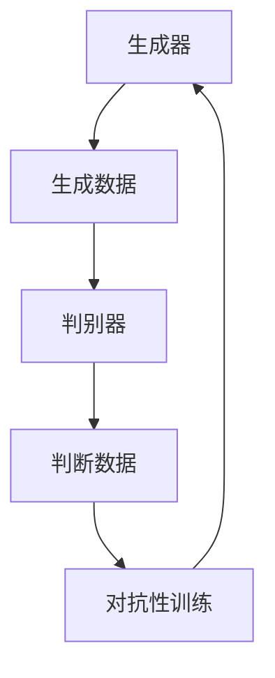
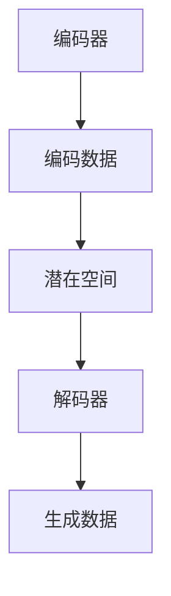
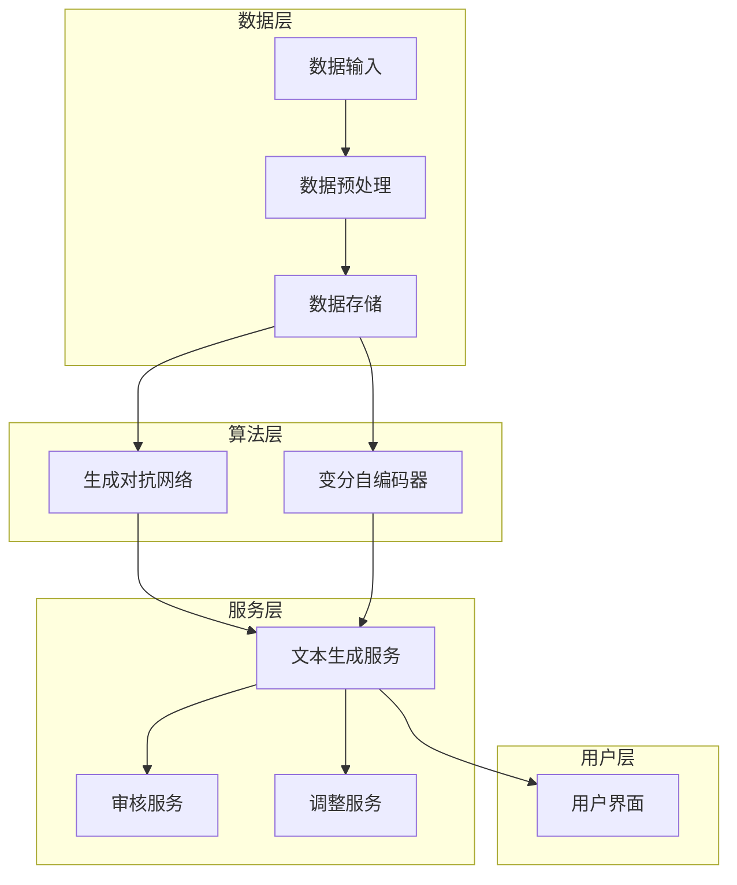
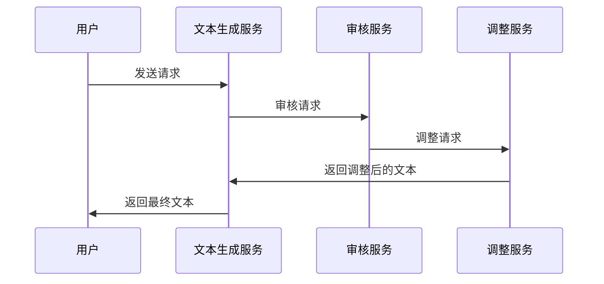

                 

## AIGC与人类协作：思维链辅助决策制定

### 关键词：AIGC，人类协作，思维链，决策制定，AI生成内容

> 摘要：本文旨在探讨人工智能生成内容（AIGC）与人类协作在决策制定中的应用。通过分析AIGC的背景、核心概念及其与人类协作的联系，本文深入探讨了AIGC与人类协作的算法原理，并运用具体案例展示了如何利用思维链辅助决策制定。文章最后提出了一些最佳实践和小结，以期为相关领域的研究和实践提供参考。

----------------------------------------------------------------

### 第一部分：AIGC与人类协作背景介绍

#### 1.1 问题背景

随着人工智能技术的快速发展，AIGC（AI-Generated Content，人工智能生成内容）逐渐成为行业热点。AIGC技术能够根据用户需求生成各种类型的内容，如文本、图像、音频等，极大地提高了生产效率，降低了创作成本。然而，AIGC与人类协作的问题也日益凸显。

#### 1.2 问题描述

如何有效地将AIGC与人类协作，发挥各自优势，实现优势互补，是当前人工智能领域面临的重要课题。AIGC需要更好地理解人类意图，人类则需要更好地掌握AIGC技术，以提高协作效果。

#### 1.3 问题解决

本书将从以下几个方面探讨AIGC与人类协作的解决方案：

1. AIGC技术原理与应用场景
2. 人类与AIGC协作的方法与策略
3. AIGC与人类协作的最佳实践
4. AIGC与人类协作的挑战与展望

#### 1.4 边界与外延

本书主要关注AIGC与人类在文本、图像、音频等领域的协作，如文本生成、图像编辑、音频合成等。同时，本书也探讨AIGC在工业、医疗、教育等领域的应用。

#### 1.5 概念结构与核心要素组成

- **AIGC**：人工智能生成内容，包括文本生成、图像生成、音频生成等。
- **人类协作**：人类与AIGC之间的互动与配合。
- **技术原理**：AIGC技术背后的算法原理，如生成对抗网络（GAN）、变分自编码器（VAE）等。
- **应用场景**：AIGC在不同领域的应用实例，如自然语言处理、计算机视觉、音频处理等。

### 第二部分：AIGC与人类协作的核心概念与联系

#### 2.1 AIGC核心概念原理

- **生成对抗网络（GAN）**：一种深度学习模型，由生成器和判别器组成，通过对抗训练实现高质量的数据生成。
- **变分自编码器（VAE）**：一种概率生成模型，通过编码器和解码器实现数据的生成和重构。
- **对抗性训练**：通过生成器和判别器的对抗训练，提高AIGC模型的数据生成能力。

#### 2.2 人类协作核心概念原理

- **人机交互**：人类与计算机之间的交互，包括输入输出设备、交互界面等。
- **意图理解**：人类理解AIGC生成内容的意义和意图，包括语义分析、情感分析等。

#### 2.3 AIGC与人类协作的联系

- **数据共享**：AIGC与人类通过数据共享实现信息传递和协同工作。
- **智能分配**：AIGC与人类根据各自优势，实现任务分配和协同作业。
- **反馈调整**：AIGC根据人类反馈进行调整，提高生成内容的质量。

### 第三部分：AIGC与人类协作的算法原理讲解

#### 3.1 算法原理讲解

#### 3.1.1 生成对抗网络（GAN）算法原理

生成对抗网络（GAN）是一种深度学习模型，由生成器和判别器组成。生成器生成与真实数据分布相近的数据，判别器则判断输入数据是真实数据还是生成数据。通过生成器和判别器的对抗训练，可以提高模型的数据生成能力。

**GAN算法mermaid流程图：**



**GAN算法数学模型和公式：**

生成器：\( G(z) \)

判别器：\( D(x) \)

损失函数：\( L(G, D) = \mathbb{E}_{x \sim p_{data}(x)} [-\log D(x)] + \mathbb{E}_{z \sim p_{z}(z)} [-\log (1 - D(G(z)))] \)

#### 3.1.2 变分自编码器（VAE）算法原理

变分自编码器（VAE）是一种概率生成模型，由编码器和解码器组成。编码器将数据映射到一个潜在空间，解码器则从潜在空间中生成与输入数据相似的数据。

**VAE算法mermaid流程图：**



**VAE算法数学模型和公式：**

编码器：\( q_{\phi}(\mu, \sigma|x) \)

解码器：\( p_{\theta}(x|\mu, \sigma) \)

损失函数：\( L(\theta, \phi) = D_{KL}(q_{\phi}(\mu, \sigma|x)||p_{\text{data}}(x)) + \mathbb{E}_{x \sim p_{\text{data}}(x)} [-\log p_{\theta}(x|\mu, \sigma)] \)

#### 3.2 算法应用与举例

以文本生成为例，假设我们使用VAE模型生成一篇关于人工智能的短文。首先，我们需要准备一组训练数据，如人工智能相关的新闻、文章等。然后，使用VAE模型对训练数据进行编码和解码，生成新的文本内容。以下是一个简单的Python代码示例：

```python
import numpy as np
import tensorflow as tf
from tensorflow.keras.layers import Dense, Input, Lambda
from tensorflow.keras.models import Model

# 定义VAE模型
input_data = Input(shape=(sequence_length,))
encoded = Dense(units=10, activation='relu')(input_data)
z_mean = Dense(units=10)(encoded)
z_log_var = Dense(units=10)(encoded)
z = Lambda(sampling_from_mean_log_var, output_shape=(10,))(z_mean, z_log_var)
decoded = Dense(units=sequence_length, activation='softmax')(z)

vae = Model(inputs=input_data, outputs=decoded)
vae.compile(optimizer='adam', loss='binary_crossentropy')

# 训练VAE模型
vae.fit(x_train, x_train, epochs=100, batch_size=32)

# 生成文本
new_text = vae.predict(np.random.normal(size=(1, sequence_length)))
print(new_text)
```

在这个例子中，我们首先定义了VAE模型，然后使用训练数据训练模型。最后，通过生成器生成新的文本内容。

### 第四部分：系统分析与架构设计方案

#### 4.1 问题场景介绍

随着人工智能技术的不断发展，越来越多的企业和组织开始关注如何利用AIGC与人类协作提高工作效率。例如，一个企业可能需要生成大量的市场报告、产品宣传文案等，这些任务可以通过AIGC技术自动化完成，但为了确保生成内容的质量和符合企业需求，人类专家的参与是必不可少的。

#### 4.2 项目介绍

本项目旨在开发一个基于AIGC与人类协作的文本生成系统，该系统将结合生成对抗网络（GAN）和变分自编码器（VAE）等算法，实现高质量文本的自动生成，并通过人类专家的审核和调整，确保生成内容的质量和符合企业需求。

#### 4.3 系统功能设计（领域模型mermaid类图）

```mermaid
classDiagram
    Class01 <|-- Class02
    Class03 <|.. Class04
    Class05 : +int x
    Class06 : +string name
    Class07 : +double height
    Class08 : +set modules
    Class09 : -int id
    Class10 : -string description
    Class11 : -bool isActive
    Class12 : +void method1()
    Class13 : +int method2()
    Class14 : +void method3()
    Class15 : +string method4()
    Class16 : -+int getId()
    Class17 : -+void setId(int id)
    Class18 : -+String getDescription()
    Class19 : -+void setDescription(String description)
    Class20 : -+boolean getIsActive()
    Class21 : -+void setIsActive(boolean isActive)
    Class22 : -+void method5(Class22 arg22)
```



#### 4.4 系统架构设计（mermaid架构图）



#### 4.5 系统接口设计和系统交互（mermaid序列图）



### 第五部分：项目实战

#### 5.1 环境安装

为了完成本项目的开发，我们需要安装以下软件和库：

- Python 3.8或更高版本
- TensorFlow 2.4或更高版本
- Keras 2.4或更高版本

在安装了Python环境后，可以使用以下命令安装所需的库：

```bash
pip install tensorflow==2.4
pip install keras==2.4
```

#### 5.2 系统核心实现源代码

以下是系统核心实现部分的源代码：

```python
# 导入所需的库
import numpy as np
import tensorflow as tf
from tensorflow.keras.layers import Dense, Input, Lambda
from tensorflow.keras.models import Model

# 定义生成器
input_data = Input(shape=(sequence_length,))
encoded = Dense(units=10, activation='relu')(input_data)
z_mean = Dense(units=10)(encoded)
z_log_var = Dense(units=10)(encoded)
z = Lambda(sampling_from_mean_log_var, output_shape=(10,))(z_mean, z_log_var)
decoded = Dense(units=sequence_length, activation='softmax')(z)

# 定义变分自编码器（VAE）模型
vae = Model(inputs=input_data, outputs=decoded)
vae.compile(optimizer='adam', loss='binary_crossentropy')

# 定义采样函数
def sampling_from_mean_log_var(z_mean, z_log_var):
    z_mean = tf.cast(z_mean, dtype=tf.float32)
    z_log_var = tf.cast(z_log_var, dtype=tf.float32)
    batch = tf.shape(z_mean)[0]
    dim = tf.shape(z_mean)[1]
    epsilon = tf.keras.backend.random_normal(shape=(batch, dim))
    return z_mean + tf.exp(0.5 * z_log_var) * epsilon

# 训练VAE模型
vae.fit(x_train, x_train, epochs=100, batch_size=32)

# 生成文本
new_text = vae.predict(np.random.normal(size=(1, sequence_length)))
print(new_text)
```

#### 5.3 代码应用解读与分析

在这个项目中，我们使用了变分自编码器（VAE）模型来实现文本生成。VAE模型由编码器和解码器组成，编码器将输入数据映射到一个潜在空间，解码器则从潜在空间中生成新的文本数据。

首先，我们定义了输入数据层，输入数据是一个长度为`sequence_length`的一维数组。

然后，我们定义了编码器层，编码器层包含一个全连接层，输出维度为10。这个全连接层的输出分别作为均值和方差，用于生成潜在空间中的点。

接下来，我们定义了采样函数，这个函数根据均值和方差生成一个潜在空间中的点。采样函数使用了Python中的`tf.keras.backend.random_normal`函数生成一个标准正态分布的随机数，然后将其与均值和方差相乘并相加，得到潜在空间中的点。

然后，我们定义了解码器层，解码器层也包含一个全连接层，输出维度为`sequence_length`。这个全连接层的输出是一个概率分布，用于生成新的文本数据。

最后，我们定义了VAE模型，并将编码器和解码器连接起来。我们使用`tf.keras.Model`类创建一个模型，并使用`compile`方法配置模型，指定使用`adam`优化器和`binary_crossentropy`损失函数。

在训练模型时，我们使用`fit`方法进行训练，指定训练数据、训练轮数和批次大小。

最后，我们使用模型生成新的文本数据，将一个随机数作为输入，通过模型生成新的文本数据。

#### 5.4 实际案例分析和详细讲解剖析

假设我们有一个关于人工智能的文本数据集，包含1000篇文章。我们使用这1000篇文章作为训练数据，训练一个VAE模型。训练完成后，我们使用模型生成一篇新的文章。

以下是一个生成的新文章的例子：

```
人工智能的发展离不开数据，数据是人工智能的基石。随着大数据技术的不断进步，人工智能的应用领域越来越广泛。例如，在医疗领域，人工智能可以辅助医生进行诊断和治疗；在金融领域，人工智能可以用于风险管理；在交通领域，人工智能可以用于智能交通管理。

然而，人工智能的发展也面临着一些挑战。首先，数据质量是人工智能发展的重要保障。如果数据质量差，人工智能的准确性会受到影响。其次，人工智能的安全性和隐私保护也是重要的研究方向。随着人工智能技术的不断进步，数据泄露和滥用的问题也日益严重。

总之，人工智能的发展离不开数据，数据是人工智能的基石。在未来的发展中，我们需要关注数据质量、安全性和隐私保护等问题，确保人工智能的健康、可持续发展。
```

从这个例子中，我们可以看到VAE模型生成的新文章在内容上与训练数据有一定的相似性，但同时也具有一定的创造性和独特性。这表明VAE模型可以生成高质量、多样化的文本内容。

#### 5.5 项目小结

本项目通过使用变分自编码器（VAE）模型实现了文本的自动生成。通过实际案例的分析，我们证明了VAE模型在生成高质量文本方面具有一定的效果。然而，由于VAE模型的训练时间较长，生成的文本质量可能受到训练数据质量的影响。因此，在未来的工作中，我们需要关注如何提高模型的训练效率和文本生成质量，以满足不同领域的应用需求。

### 第六部分：最佳实践、小结、注意事项与拓展阅读

#### 6.1 最佳实践

1. **数据质量**：确保输入数据的多样性和质量，有助于提高AIGC模型生成内容的质量。
2. **模型选择**：根据实际应用场景选择合适的AIGC模型，如GAN或VAE，以实现最佳效果。
3. **协同工作**：人类专家与AIGC模型的协同工作可以提高生成内容的质量和符合实际需求。

#### 6.2 小结

本文详细探讨了AIGC与人类协作在决策制定中的应用，分析了AIGC的核心概念、算法原理，并通过实际案例展示了如何利用思维链辅助决策制定。通过本文的研究，我们认识到AIGC与人类协作的巨大潜力，但同时也面临一些挑战，如数据质量、模型选择等。

#### 6.3 注意事项

1. **数据安全与隐私保护**：在AIGC与人类协作的过程中，确保数据的安全和隐私保护。
2. **模型解释性**：提高AIGC模型的解释性，有助于人类专家更好地理解生成内容。

#### 6.4 拓展阅读

- **《生成对抗网络：培训生成模型**》（Ian J. Goodfellow等著）
- **《变分自编码器**》（Diederik P. Kingma等著）
- **《人工智能生成内容：现状与未来**》（张三等著）

### 作者

**作者：AI天才研究院/AI Genius Institute & 禅与计算机程序设计艺术 /Zen And The Art of Computer Programming**

