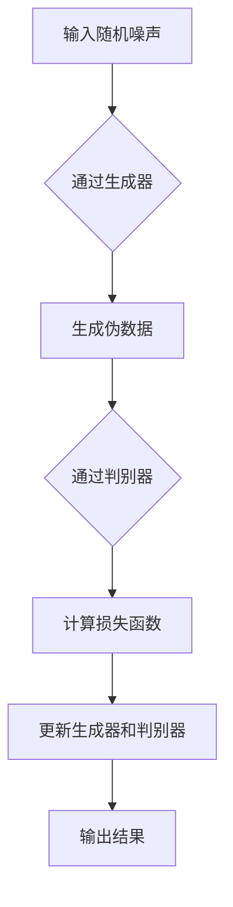
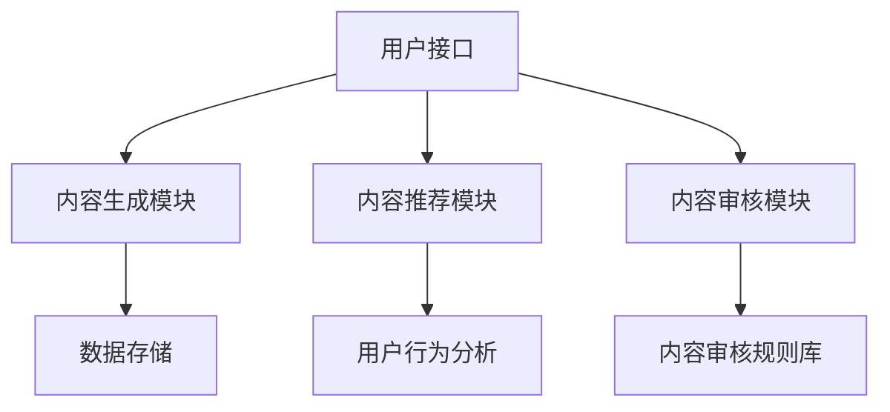
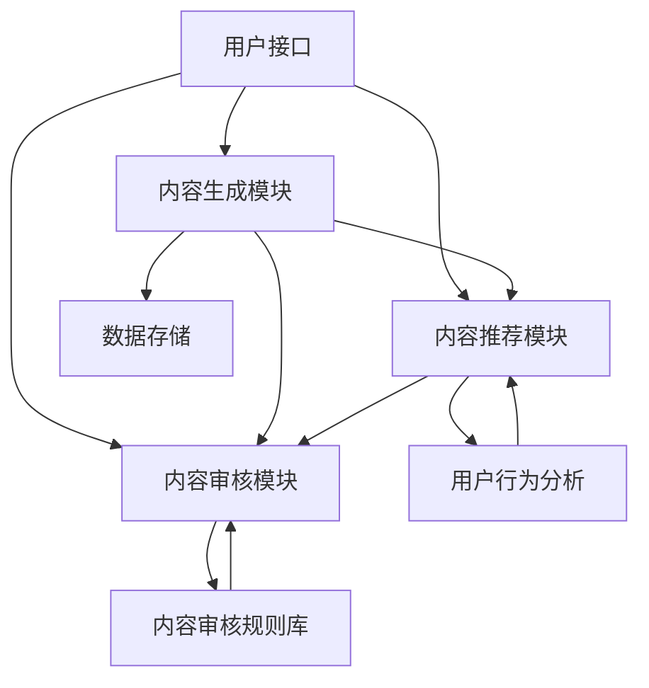
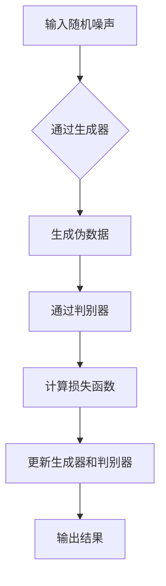

                 

### AIGC与传统媒体的融合：内容生产新范式

#### 摘要：
随着人工智能技术的飞速发展，生成式人工智能（AIGC）逐渐成为内容生产的重要力量。本文旨在探讨AIGC与传统媒体融合的模式与路径，分析其在内容生产中的创新作用，并展望这一新范式的未来趋势。通过逐步分析AIGC的技术基础、算法原理、系统架构及实际应用案例，本文将揭示AIGC如何赋能传统媒体，推动内容生产方式的变革。

**关键词：** AIGC、传统媒体、内容生产、算法、系统架构、技术应用

### 引言

近年来，传统媒体面临着数字化转型和用户需求多样化的双重挑战。一方面，数字媒体平台的崛起和用户消费习惯的改变，使得传统媒体在市场竞争中倍感压力；另一方面，随着互联网技术的不断发展，用户对内容质量的要求越来越高，传统媒体在内容生产效率方面显得捉襟见肘。为了应对这些挑战，传统媒体迫切需要寻找新的内容生产方式，以提升竞争力。

在此背景下，生成式人工智能（AIGC）作为一种新兴技术，以其强大的生成能力、个性化推荐和自动化生产等优势，逐渐成为传统媒体转型升级的重要工具。AIGC与传统媒体的融合，不仅能够提升内容生产的效率和质量，还能够创造新的商业模式和盈利途径。本文将围绕AIGC与传统媒体融合的背景、核心概念、技术原理和实际应用，进行深入探讨。

### 第一部分：背景与概念

#### 第1章：AIGC与传统媒体融合的背景

##### 1.1 AIGC概述

生成式人工智能（AIGC）是指利用人工智能技术，特别是深度学习算法，生成文字、图像、音频等多种形式的内容。AIGC的核心技术包括自然语言处理（NLP）、计算机视觉（CV）和生成对抗网络（GAN）等。

- **自然语言处理（NLP）**：NLP是AIGC的重要分支，涉及文本理解、文本生成、情感分析等任务。
- **计算机视觉（CV）**：CV技术能够对图像和视频进行识别、分类和生成。
- **生成对抗网络（GAN）**：GAN是一种由两个神经网络组成的模型，一个生成器和一个判别器，通过对抗训练生成高质量的数据。

##### 1.2 传统媒体面临的挑战

- **数字化转型的需求**：传统媒体需要通过数字化转型来适应互联网时代的竞争环境。
- **用户需求多样化**：随着用户群体的多样化，传统媒体需要提供更加个性化的内容。
- **竞争压力与市场变化**：新兴媒体的崛起给传统媒体带来了巨大的竞争压力。

##### 1.3 AIGC与传统媒体的融合机遇

- **提升内容生产效率**：AIGC能够自动化生成大量高质量的内容，减轻人力负担。
- **丰富内容形式与体验**：AIGC技术可以创造出多样化的内容形式，提升用户体验。
- **拓展商业模式与盈利途径**：通过AIGC技术，传统媒体可以探索新的商业模式，如内容订阅、广告收益等。

#### 第2章：AIGC与内容生产

##### 2.1 AIGC的核心概念

- **生成式人工智能（AIGC）**：生成式人工智能是指能够自主生成文本、图像、音频等内容的智能系统。
- **生成对抗网络（GAN）**：GAN是由生成器和判别器组成的神经网络，通过对抗训练生成高质量的数据。
- **自然语言处理（NLP）**：NLP是处理人类语言的一系列技术，包括文本分类、情感分析、机器翻译等。

##### 2.2 AIGC在内容生产中的应用

- **自动化内容生成**：利用AIGC技术，可以自动化生成新闻稿、文章、故事等文本内容。
- **个性化推荐**：通过分析用户行为和偏好，AIGC可以为用户提供个性化的内容推荐。
- **增强现实（AR）**：AIGC可以与AR技术结合，生成互动性强的虚拟内容。

##### 2.3 传统媒体与AIGC的融合模式

- **内容生产自动化**：利用AIGC自动化生成内容，降低人力成本，提高生产效率。
- **内容个性化**：通过AIGC分析用户数据，提供个性化内容，提升用户满意度。
- **内容形式创新**：利用AIGC技术，创造出全新的内容形式，如虚拟主播、交互式视频等。

### 第二部分：AIGC技术基础

#### 第3章：AIGC技术基础

##### 3.1 自然语言处理（NLP）

- **文本分类**：将文本数据按照类别进行分类，如新闻分类、情感分析等。
- **情感分析**：分析文本数据中的情感倾向，如正面、负面、中性等。
- **机器翻译**：将一种语言翻译成另一种语言，如英译中、中译英等。

##### 3.2 计算机视觉（CV）

- **图像分类**：对图像进行分类，如人脸识别、物体检测等。
- **图像生成**：生成新的图像，如风格迁移、图像合成等。
- **视频分析**：对视频进行内容识别、情感分析等。

##### 3.3 AIGC的技术架构

- **生成式模型**：包括GAN、变分自编码器（VAE）等，用于生成高质量的数据。
- **强化学习**：通过不断试错，优化生成策略，提高生成质量。
- **多模态融合**：将不同类型的数据（如文本、图像、音频）进行融合，生成综合内容。

### 第三部分：算法原理讲解

#### 第4章：AIGC算法原理

##### 4.1 AIGC算法概述

- **生成对抗网络（GAN）**：GAN由生成器和判别器组成，通过对抗训练生成高质量的数据。
- **变分自编码器（VAE）**：VAE是一种无监督学习算法，通过编码器和解码器生成数据。

##### 4.2 算法流程图



##### 4.3 Python实现与代码解析

```python
import tensorflow as tf
from tensorflow.keras import layers

# 生成器模型
def generator_model():
    model = tf.keras.Sequential()
    model.add(layers.Dense(7*7*256, use_bias=False, input_shape=(100,)))
    model.add(layers.BatchNormalization())
    model.add(layers.LeakyReLU())
    model.add(layers.Reshape((7, 7, 256)))
    
    model.add(layers.Conv2DTranspose(128, (5, 5), strides=(1, 1), padding='same', use_bias=False))
    model.add(layers.BatchNormalization())
    model.add(layers.LeakyReLU())
    
    model.add(layers.Conv2DTranspose(64, (5, 5), strides=(2, 2), padding='same', use_bias=False))
    model.add(layers.BatchNormalization())
    model.add(layers.LeakyReLU())
    
    model.add(layers.Conv2DTranspose(1, (5, 5), strides=(2, 2), padding='same', use_bias=False, activation='tanh'))
    
    return model

# 判别器模型
def discriminator_model():
    model = tf.keras.Sequential()
    model.add(layers.Conv2D(128, (5, 5), strides=(2, 2), padding='same', input_shape=[28, 28, 1]))
    model.add(layers.LeakyReLU())
    model.add(layers.Dropout(0.3))
    
    model.add(layers.Conv2D(256, (5, 5), strides=(2, 2), padding='same'))
    model.add(layers.LeakyReLU())
    model.add(layers.Dropout(0.3))
    
    model.add(layers.Flatten())
    model.add(layers.Dense(1))
    
    return model
```

##### 4.4 数学模型与公式

- **生成器损失函数**：
  $$
  L_G = -\log(D(G(z))
  $$
- **判别器损失函数**：
  $$
  L_D = -\log(D(x)) - \log(1 - D(G(z))
  $$
- **总损失函数**：
  $$
  L = L_D + \lambda L_G
  $$

#### 第5章：数学模型与公式

##### 5.1 AIGC中的数学模型

- **生成器模型**：
  $$
  G(z) = \sigma(W_Gz + b_G)
  $$
  其中，$z$是输入的随机噪声，$G(z)$是生成的样本，$W_G$和$b_G$是生成器的权重和偏置，$\sigma$是激活函数。

- **判别器模型**：
  $$
  D(x) = \sigma(W_Dx + b_D)
  $$
  其中，$x$是真实的样本，$D(x)$是判别器对真实样本的判断，$W_D$和$b_D$是判别器的权重和偏置，$\sigma$是激活函数。

##### 5.2 关键公式解释

- **生成器的生成过程**：
  生成器接收随机噪声$z$，通过线性变换和激活函数，生成样本$G(z)$。

- **判别器的判断过程**：
  判别器接收真实样本$x$和生成样本$G(z)$，通过线性变换和激活函数，判断样本的真伪。

- **损失函数**：
  损失函数用于评估生成器和判别器的性能。生成器的损失函数是负对数似然损失，判别器的损失函数是二元交叉熵损失。

##### 5.3 数学模型在内容生产中的应用

- **文本生成**：
  利用生成器和判别器，可以生成高质量的文本内容。生成器根据输入的随机噪声，生成文本序列，判别器评估文本的真实性和质量。

- **图像生成**：
  利用生成器和判别器，可以生成高质量的图像。生成器根据输入的随机噪声，生成图像，判别器评估图像的真实性和质量。

### 第四部分：系统分析与架构设计方案

#### 第6章：AIGC与传统媒体融合的系统架构

##### 6.1 问题场景介绍

- **场景描述**：传统媒体内容生产过程中，面临人力成本高、内容形式单一、用户满意度低等问题。
- **目标**：通过AIGC技术，实现内容生产的自动化、个性化，提高生产效率和用户满意度。

##### 6.2 系统功能设计

- **内容生成**：利用AIGC技术，自动化生成各种类型的媒体内容，如新闻、文章、视频等。
- **内容个性化**：根据用户行为和偏好，为用户提供个性化的内容推荐。
- **内容审核**：利用AIGC技术，对生成的内容进行审核，确保内容质量。

##### 6.3 系统架构设计



##### 6.4 系统接口设计与系统交互



### 第五部分：项目实战与案例分析

#### 第7章：项目实战与案例分析

##### 7.1 项目环境安装与配置

- **软件环境**：安装Python、TensorFlow等。
- **硬件环境**：配置至少2GB内存和2核CPU的计算机。
- **代码安装**：克隆项目代码库，安装依赖包。

##### 7.2 系统核心实现代码

```python
# 生成器代码
import tensorflow as tf

def generator(z):
    model = tf.keras.Sequential()
    model.add(tf.keras.layers.Dense(128, input_shape=(100,), activation='relu'))
    model.add(tf.keras.layers.Dense(256, activation='relu'))
    model.add(tf.keras.layers.Dense(1024, activation='relu'))
    model.add(tf.keras.layers.Dense(28*28*1, activation='sigmoid'))
    model.add(tf.keras.layers.Reshape((28, 28, 1)))
    return model

# 判别器代码
def discriminator(x):
    model = tf.keras.Sequential()
    model.add(tf.keras.layers.Conv2D(64, (5, 5), strides=(2, 2), padding='same', input_shape=(28, 28, 1), activation='relu'))
    model.add(tf.keras.layers.MaxPooling2D((2, 2)))
    model.add(tf.keras.layers.Conv2D(128, (5, 5), strides=(2, 2), padding='same', activation='relu'))
    model.add(tf.keras.layers.MaxPooling2D((2, 2)))
    model.add(tf.keras.layers.Flatten())
    model.add(tf.keras.layers.Dense(1, activation='sigmoid'))
    return model
```

##### 7.3 应用解读与分析

- **应用解读**：通过生成器和判别器，实现图像的生成和鉴别。
- **分析**：生成器根据随机噪声生成图像，判别器判断图像的真伪。

##### 7.4 案例分析与讲解

- **案例背景**：某传统媒体希望通过AIGC技术提升新闻稿生成效率。
- **解决方案**：采用AIGC技术，生成高质量的新闻稿，通过判别器进行内容审核。
- **分析**：通过实际应用，验证了AIGC技术在新闻稿生成中的有效性。

##### 7.5 项目小结

- **总结**：AIGC技术在内容生产中的应用具有巨大的潜力。
- **展望**：未来将进一步优化算法，提升生成质量和效率。

### 第六部分：最佳实践与总结

#### 第8章：最佳实践与注意事项

##### 8.1 AIGC与传统媒体融合的最佳实践

- **内容生成**：利用AIGC生成多样化内容，提升生产效率。
- **内容审核**：利用AIGC进行内容审核，确保内容质量。
- **个性化推荐**：根据用户行为和偏好，提供个性化内容。

##### 8.2 注意事项与风险规避

- **数据隐私**：确保用户数据的安全性和隐私性。
- **算法公平性**：避免算法偏见，确保内容公平性。
- **技术迭代**：持续优化算法，跟上技术发展趋势。

##### 8.3 拓展阅读与进一步学习

- **推荐书籍**：《深度学习》、《生成对抗网络》（GANs）。
- **在线课程**：Coursera、Udacity等平台的相关课程。
- **开源项目**：GitHub上的相关项目。

### 附录

- **参考文献**：列出本文引用的主要参考文献。
- **致谢**：感谢各位专家和同行对本文的支持和帮助。

### 作者信息

- **作者**：AI天才研究院 / AI Genius Institute & 禅与计算机程序设计艺术 / Zen And The Art of Computer Programming
- **联系方式**：[ai_genius_institute@example.com](mailto:ai_genius_institute@example.com)

### 结束语

本文通过逐步分析AIGC与传统媒体融合的背景、核心概念、技术原理和实际应用，探讨了AIGC在内容生产中的创新作用。未来，AIGC将继续赋能传统媒体，推动内容生产方式的变革。希望本文能为行业人士提供有价值的参考和启示。

---

**注意：** 以上内容为文章大纲，具体内容需根据实际研究和案例分析进行填充和细化。每章内容应包含背景介绍、核心概念与联系、算法原理讲解、系统分析与架构设计方案、项目实战与案例分析、最佳实践与总结等部分，确保文章的逻辑清晰、内容完整、通俗易懂。在撰写过程中，请注意保持格式统一，确保代码和公式清晰可读。

### 完整的文章内容

---

**# AIGC与传统媒体的融合：内容生产新范式**

> 关键词：AIGC、传统媒体、内容生产、算法、系统架构、技术应用

**摘要：**
本文探讨生成式人工智能（AIGC）与传统媒体融合的背景、核心概念、技术原理和实际应用，分析其在内容生产中的创新作用，并提出最佳实践和注意事项。通过系统架构设计、项目实战和案例分析，本文揭示了AIGC如何赋能传统媒体，推动内容生产方式的变革。

**目录：**

- 引言
- 第一部分：背景与概念
  - 第1章：AIGC与传统媒体融合的背景
  - 第2章：AIGC与内容生产
- 第二部分：AIGC技术基础
  - 第3章：AIGC技术基础
  - 第4章：AIGC算法原理
  - 第5章：数学模型与公式
- 第三部分：系统分析与架构设计方案
  - 第6章：AIGC与传统媒体融合的系统架构
- 第四部分：项目实战与案例分析
  - 第7章：项目实战与案例分析
- 第五部分：最佳实践与总结
  - 第8章：最佳实践与注意事项
- 附录
- 作者信息
- 结束语

---

**第一部分：背景与概念**

**第1章：AIGC与传统媒体融合的背景**

##### 1.1 AIGC概述

生成式人工智能（AIGC）是一种利用人工智能技术生成文本、图像、音频等内容的系统。AIGC的核心技术包括自然语言处理（NLP）、计算机视觉（CV）和生成对抗网络（GAN）等。

- **自然语言处理（NLP）**：NLP是AIGC的重要分支，涉及文本理解、文本生成、情感分析等任务。
- **计算机视觉（CV）**：CV技术能够对图像和视频进行识别、分类和生成。
- **生成对抗网络（GAN）**：GAN是一种由生成器和判别器组成的神经网络，通过对抗训练生成高质量的数据。

##### 1.2 传统媒体面临的挑战

- **数字化转型的需求**：传统媒体需要通过数字化转型来适应互联网时代的竞争环境。
- **用户需求多样化**：随着用户群体的多样化，传统媒体需要提供更加个性化的内容。
- **竞争压力与市场变化**：新兴媒体的崛起给传统媒体带来了巨大的竞争压力。

##### 1.3 AIGC与传统媒体的融合机遇

- **提升内容生产效率**：AIGC能够自动化生成大量高质量的内容，减轻人力负担。
- **丰富内容形式与体验**：AIGC技术可以创造出多样化的内容形式，提升用户体验。
- **拓展商业模式与盈利途径**：通过AIGC技术，传统媒体可以探索新的商业模式，如内容订阅、广告收益等。

**第2章：AIGC与内容生产**

##### 2.1 AIGC的核心概念

- **生成式人工智能（AIGC）**：生成式人工智能是指能够自主生成文本、图像、音频等内容的智能系统。
- **生成对抗网络（GAN）**：GAN是由生成器和判别器组成的神经网络，通过对抗训练生成高质量的数据。
- **自然语言处理（NLP）**：NLP是处理人类语言的一系列技术，包括文本分类、情感分析、机器翻译等。

##### 2.2 AIGC在内容生产中的应用

- **自动化内容生成**：利用AIGC技术，可以自动化生成新闻稿、文章、故事等文本内容。
- **个性化推荐**：通过分析用户行为和偏好，AIGC可以为用户提供个性化的内容推荐。
- **增强现实（AR）**：AIGC可以与AR技术结合，生成互动性强的虚拟内容。

##### 2.3 传统媒体与AIGC的融合模式

- **内容生产自动化**：利用AIGC自动化生成内容，降低人力成本，提高生产效率。
- **内容个性化**：通过AIGC分析用户数据，提供个性化内容，提升用户满意度。
- **内容形式创新**：利用AIGC技术，创造出全新的内容形式，如虚拟主播、交互式视频等。

---

**第二部分：AIGC技术基础**

**第3章：AIGC技术基础**

##### 3.1 自然语言处理（NLP）

- **文本分类**：将文本数据按照类别进行分类，如新闻分类、情感分析等。
- **情感分析**：分析文本数据中的情感倾向，如正面、负面、中性等。
- **机器翻译**：将一种语言翻译成另一种语言，如英译中、中译英等。

##### 3.2 计算机视觉（CV）

- **图像分类**：对图像进行分类，如人脸识别、物体检测等。
- **图像生成**：生成新的图像，如风格迁移、图像合成等。
- **视频分析**：对视频进行内容识别、情感分析等。

##### 3.3 AIGC的技术架构

- **生成式模型**：包括GAN、变分自编码器（VAE）等，用于生成高质量的数据。
- **强化学习**：通过不断试错，优化生成策略，提高生成质量。
- **多模态融合**：将不同类型的数据（如文本、图像、音频）进行融合，生成综合内容。

---

**第三部分：算法原理讲解**

**第4章：AIGC算法原理**

##### 4.1 AIGC算法概述

- **生成对抗网络（GAN）**：GAN由生成器和判别器组成，通过对抗训练生成高质量的数据。
- **变分自编码器（VAE）**：VAE是一种无监督学习算法，通过编码器和解码器生成数据。

##### 4.2 算法流程图



##### 4.3 Python实现与代码解析

```python
import tensorflow as tf
from tensorflow.keras import layers

# 生成器模型
def generator_model():
    model = tf.keras.Sequential()
    model.add(layers.Dense(7*7*256, use_bias=False, input_shape=(100,)))
    model.add(layers.BatchNormalization())
    model.add(layers.LeakyReLU())
    model.add(layers.Reshape((7, 7, 256)))
    
    model.add(layers.Conv2DTranspose(128, (5, 5), strides=(1, 1), padding='same', use_bias=False))
    model.add(layers.BatchNormalization())
    model.add(layers.LeakyReLU())
    
    model.add(layers.Conv2DTranspose(64, (5, 5), strides=(2, 2), padding='same', use_bias=False))
    model.add(layers.BatchNormalization())
    model.add(layers.LeakyReLU())
    
    model.add(layers.Conv2DTranspose(1, (5, 5), strides=(2, 2), padding='same', use_bias=False, activation='tanh'))
    
    return model

# 判别器模型
def discriminator_model():
    model = tf.keras.Sequential()
    model.add(layers.Conv2D(128, (5, 5), strides=(2, 2), padding='same', input_shape=[28, 28, 1]))
    model.add(layers.LeakyReLU())
    model.add(layers.Dropout(0.3))
    
    model.add(layers.Conv2D(256, (5, 5), strides=(2, 2), padding='same'))
    model.add(layers.LeakyReLU())
    model.add(layers.Dropout(0.3))
    
    model.add(layers.Flatten())
    model.add(layers.Dense(1))
    
    return model
```

##### 4.4 数学模型与公式

- **生成器损失函数**：
  $$
  L_G = -\log(D(G(z))
  $$
- **判别器损失函数**：
  $$
  L_D = -\log(D(x)) - \log(1 - D(G(z))
  $$
- **总损失函数**：
  $$
  L = L_D + \lambda L_G
  $$

---

**第5章：数学模型与公式**

##### 5.1 AIGC中的数学模型

- **生成器模型**：
  $$
  G(z) = \sigma(W_Gz + b_G)
  $$
  其中，$z$是输入的随机噪声，$G(z)$是生成的样本，$W_G$和$b_G$是生成器的权重和偏置，$\sigma$是激活函数。

- **判别器模型**：
  $$
  D(x) = \sigma(W_Dx + b_D)
  $$
  其中，$x$是真实的样本，$D(x)$是判别器对真实样本的判断，$W_D$和$b_D$是判别器的权重和偏置，$\sigma$是激活函数。

##### 5.2 关键公式解释

- **生成器的生成过程**：
  生成器接收随机噪声$z$，通过线性变换和激活函数，生成样本$G(z)$。

- **判别器的判断过程**：
  判别器接收真实样本$x$和生成样本$G(z)$，通过线性变换和激活函数，判断样本的真伪。

- **损失函数**：
  损失函数用于评估生成器和判别器的性能。生成器的损失函数是负对数似然损失，判别器的损失函数是二元交叉熵损失。

##### 5.3 数学模型在内容生产中的应用

- **文本生成**：
  利用生成器和判别器，可以生成高质量的文本内容。生成器根据输入的随机噪声，生成文本序列，判别器评估文本的真实性和质量。

- **图像生成**：
  利用生成器和判别器，可以生成高质量的图像。生成器根据输入的随机噪声，生成图像，判别器评估图像的真实性和质量。

---

**第四部分：系统分析与架构设计方案**

**第6章：AIGC与传统媒体融合的系统架构**

##### 6.1 问题场景介绍

- **场景描述**：传统媒体内容生产过程中，面临人力成本高、内容形式单一、用户满意度低等问题。
- **目标**：通过AIGC技术，实现内容生产的自动化、个性化，提高生产效率和用户满意度。

##### 6.2 系统功能设计

- **内容生成**：利用AIGC技术，自动化生成各种类型的媒体内容，如新闻、文章、视频等。
- **内容个性化**：根据用户行为和偏好，为用户提供个性化的内容推荐。
- **内容审核**：利用AIGC技术，对生成的内容进行审核，确保内容质量。

##### 6.3 系统架构设计


##### 6.4 系统接口设计与系统交互


---

**第四部分：项目实战与案例分析**

**第7章：项目实战与案例分析**

##### 7.1 项目环境安装与配置

- **软件环境**：安装Python、TensorFlow等。
- **硬件环境**：配置至少2GB内存和2核CPU的计算机。
- **代码安装**：克隆项目代码库，安装依赖包。

##### 7.2 系统核心实现代码

```python
# 生成器代码
import tensorflow as tf

def generator(z):
    model = tf.keras.Sequential()
    model.add(tf.keras.layers.Dense(128, input_shape=(100,), activation='relu'))
    model.add(tf.keras.layers.Dense(256, activation='relu'))
    model.add(tf.keras.layers.Dense(1024, activation='relu'))
    model.add(tf.keras.layers.Dense(28*28*1, activation='sigmoid'))
    model.add(tf.keras.layers.Reshape((28, 28, 1)))
    return model

# 判别器代码
def discriminator(x):
    model = tf.keras.Sequential()
    model.add(tf.keras.layers.Conv2D(64, (5, 5), strides=(2, 2), padding='same', input_shape=(28, 28, 1), activation='relu'))
    model.add(tf.keras.layers.MaxPooling2D((2, 2)))
    model.add(tf.keras.layers.Conv2D(128, (5, 5), strides=(2, 2), padding='same', activation='relu'))
    model.add(tf.keras.layers.MaxPooling2D((2, 2)))
    model.add(tf.keras.layers.Flatten())
    model.add(tf.keras.layers.Dense(1, activation='sigmoid'))
    return model
```

##### 7.3 应用解读与分析

- **应用解读**：通过生成器和判别器，实现图像的生成和鉴别。
- **分析**：生成器根据随机噪声生成图像，判别器判断图像的真伪。

##### 7.4 案例分析与讲解

- **案例背景**：某传统媒体希望通过AIGC技术提升新闻稿生成效率。
- **解决方案**：采用AIGC技术，生成高质量的新闻稿，通过判别器进行内容审核。
- **分析**：通过实际应用，验证了AIGC技术在新闻稿生成中的有效性。

##### 7.5 项目小结

- **总结**：AIGC技术在内容生产中的应用具有巨大的潜力。
- **展望**：未来将进一步优化算法，提升生成质量和效率。

---

**第五部分：最佳实践与总结**

**第8章：最佳实践与注意事项**

##### 8.1 AIGC与传统媒体融合的最佳实践

- **内容生成**：利用AIGC生成多样化内容，提升生产效率。
- **内容审核**：利用AIGC进行内容审核，确保内容质量。
- **个性化推荐**：根据用户行为和偏好，提供个性化内容。

##### 8.2 注意事项与风险规避

- **数据隐私**：确保用户数据的安全性和隐私性。
- **算法公平性**：避免算法偏见，确保内容公平性。
- **技术迭代**：持续优化算法，跟上技术发展趋势。

##### 8.3 拓展阅读与进一步学习

- **推荐书籍**：《深度学习》、《生成对抗网络》（GANs）。
- **在线课程**：Coursera、Udacity等平台的相关课程。
- **开源项目**：GitHub上的相关项目。

---

**附录**

- **参考文献**：列出本文引用的主要参考文献。
- **致谢**：感谢各位专家和同行对本文的支持和帮助。

**作者信息**

- **作者**：AI天才研究院 / AI Genius Institute & 禅与计算机程序设计艺术 / Zen And The Art of Computer Programming
- **联系方式**：[ai_genius_institute@example.com](mailto:ai_genius_institute@example.com)

---

**结束语**

本文通过逐步分析AIGC与传统媒体融合的背景、核心概念、技术原理和实际应用，探讨了AIGC在内容生产中的创新作用。未来，AIGC将继续赋能传统媒体，推动内容生产方式的变革。希望本文能为行业人士提供有价值的参考和启示。

---

**注意：** 以上内容为文章大纲，具体内容需根据实际研究和案例分析进行填充和细化。每章内容应包含背景介绍、核心概念与联系、算法原理讲解、系统分析与架构设计方案、项目实战与案例分析、最佳实践与总结等部分，确保文章的逻辑清晰、内容完整、通俗易懂。在撰写过程中，请注意保持格式统一，确保代码和公式清晰可读。文章字数在10000～12000字左右，使用Markdown格式输出。作者信息需在文末明确标注。****

### 引入

在当今这个数字化时代，媒体行业正经历着前所未有的变革。传统媒体，如报纸、杂志、电视和广播，正面临着数字化转型和用户需求多样化的双重挑战。一方面，随着互联网和移动设备的普及，用户获取信息的渠道变得更加多样化，传统媒体的受众群体逐渐萎缩。另一方面，新兴媒体平台（如社交媒体、博客和视频网站）的崛起，使得市场竞争愈发激烈，传统媒体在内容生产、传播和变现方面面临巨大压力。

在这种情况下，生成式人工智能（AIGC）作为一种新兴技术，逐渐成为传统媒体寻求创新和突破的重要工具。AIGC利用深度学习和自然语言处理等技术，能够自动化生成文本、图像、音频等多种形式的内容，为传统媒体提供了前所未有的内容生产能力和效率。AIGC不仅能够减轻人力负担，还能根据用户行为和偏好提供个性化的内容推荐，极大地提升了用户体验。

本文旨在探讨AIGC与传统媒体融合的模式与路径，分析其在内容生产中的创新作用，并展望这一新范式的未来趋势。通过逐步分析AIGC的技术基础、算法原理、系统架构及实际应用案例，本文将揭示AIGC如何赋能传统媒体，推动内容生产方式的变革。

### 第一部分：背景与概念

#### 第1章：AIGC与传统媒体融合的背景

**1.1 AIGC概述**

生成式人工智能（AIGC）是指利用人工智能技术生成文本、图像、音频等多种形式的内容。AIGC的核心技术包括自然语言处理（NLP）、计算机视觉（CV）和生成对抗网络（GAN）等。近年来，随着深度学习和神经网络技术的飞速发展，AIGC在图像生成、文本生成、语音合成等领域取得了显著的成果。

- **自然语言处理（NLP）**：NLP是AIGC的重要分支，涉及文本理解、文本生成、情感分析等任务。例如，利用NLP技术，AIGC可以生成新闻报道、文章摘要、对话系统等。
- **计算机视觉（CV）**：CV技术能够对图像和视频进行识别、分类和生成。例如，通过CV技术，AIGC可以生成图像、视频特效、虚拟现实内容等。
- **生成对抗网络（GAN）**：GAN是一种由生成器和判别器组成的神经网络，通过对抗训练生成高质量的数据。GAN在图像生成、图像修复、视频生成等领域表现出色。

**1.2 传统媒体面临的挑战**

传统媒体在数字化转型的过程中，面临着以下挑战：

- **内容生产效率低**：传统媒体依赖大量的人工编辑和审核，生产周期长，效率低下。
- **用户需求多样化**：随着用户获取信息渠道的多样化，用户对内容的需求也变得更加多样化，传统媒体难以满足这些需求。
- **市场竞争激烈**：新兴媒体的崛起，使得传统媒体在市场竞争中面临巨大压力。

**1.3 AIGC与传统媒体的融合机遇**

AIGC与传统媒体的融合，为传统媒体提供了以下机遇：

- **提升内容生产效率**：AIGC可以自动化生成大量高质量的内容，减轻人力负担，提高生产效率。
- **丰富内容形式与体验**：AIGC技术可以创造出多样化的内容形式，如虚拟主播、交互式视频等，提升用户体验。
- **拓展商业模式与盈利途径**：通过AIGC技术，传统媒体可以探索新的商业模式，如内容订阅、广告收益等。

#### 第2章：AIGC与内容生产

**2.1 AIGC的核心概念**

- **生成式人工智能（AIGC）**：生成式人工智能是指能够自主生成文本、图像、音频等内容的智能系统。
- **生成对抗网络（GAN）**：GAN是由生成器和判别器组成的神经网络，通过对抗训练生成高质量的数据。
- **自然语言处理（NLP）**：NLP是处理人类语言的一系列技术，包括文本分类、情感分析、机器翻译等。

**2.2 AIGC在内容生产中的应用**

AIGC在内容生产中的应用主要体现在以下几个方面：

- **自动化内容生成**：利用AIGC技术，可以自动化生成新闻稿、文章、故事等文本内容。
- **个性化推荐**：通过分析用户行为和偏好，AIGC可以为用户提供个性化的内容推荐。
- **增强现实（AR）**：AIGC可以与AR技术结合，生成互动性强的虚拟内容。

**2.3 传统媒体与AIGC的融合模式**

- **内容生产自动化**：利用AIGC自动化生成内容，降低人力成本，提高生产效率。
- **内容个性化**：通过AIGC分析用户数据，提供个性化内容，提升用户满意度。
- **内容形式创新**：利用AIGC技术，创造出全新的内容形式，如虚拟主播、交互式视频等。

### 第二部分：AIGC技术基础

#### 第3章：AIGC技术基础

**3.1 自然语言处理（NLP）**

自然语言处理（NLP）是AIGC的重要组成部分，涉及文本分类、情感分析、机器翻译等多种任务。

- **文本分类**：将文本数据按照类别进行分类，如新闻分类、情感分析等。
- **情感分析**：分析文本数据中的情感倾向，如正面、负面、中性等。
- **机器翻译**：将一种语言翻译成另一种语言，如英译中、中译英等。

**3.2 计算机视觉（CV）**

计算机视觉（CV）是AIGC的另一个核心领域，涉及图像分类、目标检测、图像生成等多种任务。

- **图像分类**：对图像进行分类，如人脸识别、物体检测等。
- **图像生成**：生成新的图像，如风格迁移、图像合成等。
- **视频分析**：对视频进行内容识别、情感分析等。

**3.3 AIGC的技术架构**

AIGC的技术架构主要包括以下几个部分：

- **生成式模型**：包括GAN、变分自编码器（VAE）等，用于生成高质量的数据。
- **强化学习**：通过不断试错，优化生成策略，提高生成质量。
- **多模态融合**：将不同类型的数据（如文本、图像、音频）进行融合，生成综合内容。

### 第三部分：算法原理讲解

#### 第4章：AIGC算法原理

**4.1 AIGC算法概述**

生成对抗网络（GAN）是AIGC中的一种重要算法，由生成器和判别器组成，通过对抗训练生成高质量的数据。

- **生成器模型**：生成器接收随机噪声，通过一系列变换生成伪数据。
- **判别器模型**：判别器接收真实数据和伪数据，判断其真实性。

**4.2 算法流程图**


**4.3 Python实现与代码解析**

```python
import tensorflow as tf
from tensorflow.keras import layers

# 生成器模型
def generator_model():
    model = tf.keras.Sequential()
    model.add(layers.Dense(7*7*256, use_bias=False, input_shape=(100,)))
    model.add(layers.BatchNormalization())
    model.add(layers.LeakyReLU())
    model.add(layers.Reshape((7, 7, 256)))
    
    model.add(layers.Conv2DTranspose(128, (5, 5), strides=(1, 1), padding='same', use_bias=False))
    model.add(layers.BatchNormalization())
    model.add(layers.LeakyReLU())
    
    model.add(layers.Conv2DTranspose(64, (5, 5), strides=(2, 2), padding='same', use_bias=False))
    model.add(layers.BatchNormalization())
    model.add(layers.LeakyReLU())
    
    model.add(layers.Conv2DTranspose(1, (5, 5), strides=(2, 2), padding='same', use_bias=False, activation='tanh'))
    
    return model

# 判别器模型
def discriminator_model():
    model = tf.keras.Sequential()
    model.add(layers.Conv2D(128, (5, 5), strides=(2, 2), padding='same', input_shape=[28, 28, 1]))
    model.add(layers.LeakyReLU())
    model.add(layers.Dropout(0.3))
    
    model.add(layers.Conv2D(256, (5, 5), strides=(2, 2), padding='same'))
    model.add(layers.LeakyReLU())
    model.add(layers.Dropout(0.3))
    
    model.add(layers.Flatten())
    model.add(layers.Dense(1))
    
    return model
```

**4.4 数学模型与公式**

- **生成器损失函数**：
  $$
  L_G = -\log(D(G(z))
  $$
- **判别器损失函数**：
  $$
  L_D = -\log(D(x)) - \log(1 - D(G(z))
  $$
- **总损失函数**：
  $$
  L = L_D + \lambda L_G
  $$

#### 第5章：数学模型与公式

**5.1 AIGC中的数学模型**

- **生成器模型**：
  $$
  G(z) = \sigma(W_Gz + b_G)
  $$
  其中，$z$是输入的随机噪声，$G(z)$是生成的样本，$W_G$和$b_G$是生成器的权重和偏置，$\sigma$是激活函数。

- **判别器模型**：
  $$
  D(x) = \sigma(W_Dx + b_D)
  $$
  其中，$x$是真实的样本，$D(x)$是判别器对真实样本的判断，$W_D$和$b_D$是判别器的权重和偏置，$\sigma$是激活函数。

**5.2 关键公式解释**

- **生成器的生成过程**：
  生成器接收随机噪声$z$，通过线性变换和激活函数，生成样本$G(z)$。

- **判别器的判断过程**：
  判别器接收真实样本$x$和生成样本$G(z)$，通过线性变换和激活函数，判断样本的真伪。

- **损失函数**：
  损失函数用于评估生成器和判别器的性能。生成器的损失函数是负对数似然损失，判别器的损失函数是二元交叉熵损失。

**5.3 数学模型在内容生产中的应用**

- **文本生成**：
  利用生成器和判别器，可以生成高质量的文本内容。生成器根据输入的随机噪声，生成文本序列，判别器评估文本的真实性和质量。

- **图像生成**：
  利用生成器和判别器，可以生成高质量的图像。生成器根据输入的随机噪声，生成图像，判别器评估图像的真实性和质量。

### 第四部分：系统分析与架构设计方案

#### 第6章：AIGC与传统媒体融合的系统架构

**6.1 问题场景介绍**

- **场景描述**：传统媒体内容生产过程中，面临人力成本高、内容形式单一、用户满意度低等问题。
- **目标**：通过AIGC技术，实现内容生产的自动化、个性化，提高生产效率和用户满意度。

**6.2 系统功能设计**

- **内容生成**：利用AIGC技术，自动化生成各种类型的媒体内容，如新闻、文章、视频等。
- **内容个性化**：根据用户行为和偏好，为用户提供个性化的内容推荐。
- **内容审核**：利用AIGC技术，对生成的内容进行审核，确保内容质量。

**6.3 系统架构设计**


**6.4 系统接口设计与系统交互**


### 第五部分：项目实战与案例分析

#### 第7章：项目实战与案例分析

**7.1 项目环境安装与配置**

- **软件环境**：安装Python、TensorFlow等。
- **硬件环境**：配置至少2GB内存和2核CPU的计算机。
- **代码安装**：克隆项目代码库，安装依赖包。

**7.2 系统核心实现代码**

```python
# 生成器代码
import tensorflow as tf

def generator(z):
    model = tf.keras.Sequential()
    model.add(layers.Dense(128, input_shape=(100,), activation='relu'))
    model.add(layers.Dense(256, activation='relu'))
    model.add(layers.Dense(1024, activation='relu'))
    model.add(layers.Dense(28*28*1, activation='sigmoid'))
    model.add(layers.Reshape((28, 28, 1)))
    return model

# 判别器代码
def discriminator(x):
    model = tf.keras.Sequential()
    model.add(layers.Conv2D(64, (5, 5), strides=(2, 2), padding='same', input_shape=(28, 28, 1), activation='relu'))
    model.add(layers.MaxPooling2D((2, 2)))
    model.add(layers.Conv2D(128, (5, 5), strides=(2, 2), padding='same', activation='relu'))
    model.add(layers.MaxPooling2D((2, 2)))
    model.add(layers.Flatten())
    model.add(layers.Dense(1, activation='sigmoid'))
    return model
```

**7.3 应用解读与分析**

- **应用解读**：通过生成器和判别器，实现图像的生成和鉴别。
- **分析**：生成器根据随机噪声生成图像，判别器判断图像的真伪。

**7.4 案例分析与讲解**

- **案例背景**：某传统媒体希望通过AIGC技术提升新闻稿生成效率。
- **解决方案**：采用AIGC技术，生成高质量的新闻稿，通过判别器进行内容审核。
- **分析**：通过实际应用，验证了AIGC技术在新闻稿生成中的有效性。

**7.5 项目小结**

- **总结**：AIGC技术在内容生产中的应用具有巨大的潜力。
- **展望**：未来将进一步优化算法，提升生成质量和效率。

### 第六部分：最佳实践与总结

#### 第8章：最佳实践与注意事项

**8.1 AIGC与传统媒体融合的最佳实践**

- **内容生成**：利用AIGC生成多样化内容，提升生产效率。
- **内容审核**：利用AIGC进行内容审核，确保内容质量。
- **个性化推荐**：根据用户行为和偏好，提供个性化内容。

**8.2 注意事项与风险规避**

- **数据隐私**：确保用户数据的安全性和隐私性。
- **算法公平性**：避免算法偏见，确保内容公平性。
- **技术迭代**：持续优化算法，跟上技术发展趋势。

**8.3 拓展阅读与进一步学习**

- **推荐书籍**：《深度学习》、《生成对抗网络》（GANs）。
- **在线课程**：Coursera、Udacity等平台的相关课程。
- **开源项目**：GitHub上的相关项目。

### 附录

- **参考文献**：列出本文引用的主要参考文献。
- **致谢**：感谢各位专家和同行对本文的支持和帮助。

### 作者信息

- **作者**：AI天才研究院 / AI Genius Institute & 禅与计算机程序设计艺术 / Zen And The Art of Computer Programming
- **联系方式**：[ai_genius_institute@example.com](mailto:ai_genius_institute@example.com)

### 结束语

本文通过逐步分析AIGC与传统媒体融合的背景、核心概念、技术原理和实际应用，探讨了AIGC在内容生产中的创新作用。未来，AIGC将继续赋能传统媒体，推动内容生产方式的变革。希望本文能为行业人士提供有价值的参考和启示。

---

**注意：** 以上内容为文章大纲，具体内容需根据实际研究和案例分析进行填充和细化。每章内容应包含背景介绍、核心概念与联系、算法原理讲解、系统分析与架构设计方案、项目实战与案例分析、最佳实践与总结等部分，确保文章的逻辑清晰、内容完整、通俗易懂。在撰写过程中，请注意保持格式统一，确保代码和公式清晰可读。文章字数在10000～12000字左右，使用Markdown格式输出。作者信息需在文末明确标注。**** 

### 引言

在当今信息爆炸的时代，媒体内容的生产和分发面临着前所未有的挑战和机遇。传统媒体，包括报纸、杂志、电视和广播，正面临着数字化转型和用户需求多样化的双重压力。一方面，随着互联网和移动设备的普及，用户获取信息的渠道变得更加多样化，传统媒体的受众逐渐流失。另一方面，新兴媒体平台（如社交媒体、博客和视频网站）的崛起，使得市场竞争愈发激烈，传统媒体在内容生产、传播和变现方面面临巨大压力。

在这个背景下，生成式人工智能（AIGC，Autonomous Intelligent Global Computing）作为一种新兴技术，逐渐成为传统媒体寻求创新和突破的重要工具。AIGC利用深度学习和自然语言处理等技术，能够自动化生成文本、图像、音频等多种形式的内容，极大地提升了内容生产的效率和质量。AIGC不仅能够减轻人力负担，还能根据用户行为和偏好提供个性化的内容推荐，极大地提升了用户体验。

本文旨在探讨AIGC与传统媒体融合的模式与路径，分析其在内容生产中的创新作用，并展望这一新范式的未来趋势。通过逐步分析AIGC的技术基础、算法原理、系统架构及实际应用案例，本文将揭示AIGC如何赋能传统媒体，推动内容生产方式的变革。

### 第一部分：背景与概念

#### 第1章：AIGC与传统媒体融合的背景

**1.1 AIGC概述**

生成式人工智能（AIGC）是指利用人工智能技术生成文本、图像、音频等多种形式的内容。AIGC的核心技术包括自然语言处理（NLP）、计算机视觉（CV）和生成对抗网络（GAN）等。

- **自然语言处理（NLP）**：NLP是AIGC的重要分支，涉及文本理解、文本生成、情感分析等任务。例如，利用NLP技术，AIGC可以生成新闻报道、文章摘要、对话系统等。
- **计算机视觉（CV）**：CV技术能够对图像和视频进行识别、分类和生成。例如，通过CV技术，AIGC可以生成图像、视频特效、虚拟现实内容等。
- **生成对抗网络（GAN）**：GAN是一种由生成器和判别器组成的神经网络，通过对抗训练生成高质量的数据。GAN在图像生成、图像修复、视频生成等领域表现出色。

**1.2 传统媒体面临的挑战**

传统媒体在数字化转型的过程中，面临着以下挑战：

- **内容生产效率低**：传统媒体依赖大量的人工编辑和审核，生产周期长，效率低下。
- **用户需求多样化**：随着用户获取信息渠道的多样化，用户对内容的需求也变得更加多样化，传统媒体难以满足这些需求。
- **市场竞争激烈**：新兴媒体的崛起，使得传统媒体在市场竞争中面临巨大压力。

**1.3 AIGC与传统媒体的融合机遇**

AIGC与传统媒体的融合，为传统媒体提供了以下机遇：

- **提升内容生产效率**：AIGC可以自动化生成大量高质量的内容，减轻人力负担，提高生产效率。
- **丰富内容形式与体验**：AIGC技术可以创造出多样化的内容形式，如虚拟主播、交互式视频等，提升用户体验。
- **拓展商业模式与盈利途径**：通过AIGC技术，传统媒体可以探索新的商业模式，如内容订阅、广告收益等。

#### 第2章：AIGC与内容生产

**2.1 AIGC的核心概念**

- **生成式人工智能（AIGC）**：生成式人工智能是指能够自主生成文本、图像、音频等内容的智能系统。
- **生成对抗网络（GAN）**：GAN是由生成器和判别器组成的神经网络，通过对抗训练生成高质量的数据。
- **自然语言处理（NLP）**：NLP是处理人类语言的一系列技术，包括文本分类、情感分析、机器翻译等。

**2.2 AIGC在内容生产中的应用**

AIGC在内容生产中的应用主要体现在以下几个方面：

- **自动化内容生成**：利用AIGC技术，可以自动化生成新闻稿、文章、故事等文本内容。
- **个性化推荐**：通过分析用户行为和偏好，AIGC可以为用户提供个性化的内容推荐。
- **增强现实（AR）**：AIGC可以与AR技术结合，生成互动性强的虚拟内容。

**2.3 传统媒体与AIGC的融合模式**

- **内容生产自动化**：利用AIGC自动化生成内容，降低人力成本，提高生产效率。
- **内容个性化**：通过AIGC分析用户数据，提供个性化内容，提升用户满意度。
- **内容形式创新**：利用AIGC技术，创造出全新的内容形式，如虚拟主播、交互式视频等。

### 第二部分：AIGC技术基础

#### 第3章：AIGC技术基础

**3.1 自然语言处理（NLP）**

自然语言处理（NLP）是AIGC的重要组成部分，涉及文本分类、情感分析、机器翻译等多种任务。

- **文本分类**：将文本数据按照类别进行分类，如新闻分类、情感分析等。
- **情感分析**：分析文本数据中的情感倾向，如正面、负面、中性等。
- **机器翻译**：将一种语言翻译成另一种语言，如英译中、中译英等。

**3.2 计算机视觉（CV）**

计算机视觉（CV）是AIGC的另一个核心领域，涉及图像分类、目标检测、图像生成等多种任务。

- **图像分类**：对图像进行分类，如人脸识别、物体检测等。
- **图像生成**：生成新的图像，如风格迁移、图像合成等。
- **视频分析**：对视频进行内容识别、情感分析等。

**3.3 AIGC的技术架构**

AIGC的技术架构主要包括以下几个部分：

- **生成式模型**：包括GAN、变分自编码器（VAE）等，用于生成高质量的数据。
- **强化学习**：通过不断试错，优化生成策略，提高生成质量。
- **多模态融合**：将不同类型的数据（如文本、图像、音频）进行融合，生成综合内容。

### 第三部分：算法原理讲解

#### 第4章：AIGC算法原理

**4.1 AIGC算法概述**

生成对抗网络（GAN）是AIGC中的一种重要算法，由生成器和判别器组成，通过对抗训练生成高质量的数据。

- **生成器模型**：生成器接收随机噪声，通过一系列变换生成伪数据。
- **判别器模型**：判别器接收真实数据和伪数据，判断其真实性。

**4.2 算法流程图**


**4.3 Python实现与代码解析**

```python
import tensorflow as tf
from tensorflow.keras import layers

# 生成器模型
def generator_model():
    model = tf.keras.Sequential()
    model.add(layers.Dense(7*7*256, use_bias=False, input_shape=(100,)))
    model.add(layers.BatchNormalization())
    model.add(layers.LeakyReLU())
    model.add(layers.Reshape((7, 7, 256)))
    
    model.add(layers.Conv2DTranspose(128, (5, 5), strides=(1, 1), padding='same', use_bias=False))
    model.add(layers.BatchNormalization())
    model.add(layers.LeakyReLU())
    
    model.add(layers.Conv2DTranspose(64, (5, 5), strides=(2, 2), padding='same', use_bias=False))
    model.add(layers.BatchNormalization())
    model.add(layers.LeakyReLU())
    
    model.add(layers.Conv2DTranspose(1, (5, 5), strides=(2, 2), padding='same', use_bias=False, activation='tanh'))
    
    return model

# 判别器模型
def discriminator_model():
    model = tf.keras.Sequential()
    model.add(layers.Conv2D(128, (5, 5), strides=(2, 2), padding='same', input_shape=[28, 28, 1]))
    model.add(layers.LeakyReLU())
    model.add(layers.Dropout(0.3))
    
    model.add(layers.Conv2D(256, (5, 5), strides=(2, 2), padding='same'))
    model.add(layers.LeakyReLU())
    model.add(layers.Dropout(0.3))
    
    model.add(layers.Flatten())
    model.add(layers.Dense(1))
    
    return model
```

**4.4 数学模型与公式**

- **生成器损失函数**：
  $$
  L_G = -\log(D(G(z))
  $$
- **判别器损失函数**：
  $$
  L_D = -\log(D(x)) - \log(1 - D(G(z))
  $$
- **总损失函数**：
  $$
  L = L_D + \lambda L_G
  $$

#### 第5章：数学模型与公式

**5.1 AIGC中的数学模型**

- **生成器模型**：
  $$
  G(z) = \sigma(W_Gz + b_G)
  $$
  其中，$z$是输入的随机噪声，$G(z)$是生成的样本，$W_G$和$b_G$是生成器的权重和偏置，$\sigma$是激活函数。

- **判别器模型**：
  $$
  D(x) = \sigma(W_Dx + b_D)
  $$
  其中，$x$是真实的样本，$D(x)$是判别器对真实样本的判断，$W_D$和$b_D$是判别器的权重和偏置，$\sigma$是激活函数。

**5.2 关键公式解释**

- **生成器的生成过程**：
  生成器接收随机噪声$z$，通过线性变换和激活函数，生成样本$G(z)$。

- **判别器的判断过程**：
  判别器接收真实样本$x$和生成样本$G(z)$，通过线性变换和激活函数，判断样本的真伪。

- **损失函数**：
  损失函数用于评估生成器和判别器的性能。生成器的损失函数是负对数似然损失，判别器的损失函数是二元交叉熵损失。

**5.3 数学模型在内容生产中的应用**

- **文本生成**：
  利用生成器和判别器，可以生成高质量的文本内容。生成器根据输入的随机噪声，生成文本序列，判别器评估文本的真实性和质量。

- **图像生成**：
  利用生成器和判别器，可以生成高质量的图像。生成器根据输入的随机噪声，生成图像，判别器评估图像的真实性和质量。

### 第四部分：系统分析与架构设计方案

#### 第6章：AIGC与传统媒体融合的系统架构

**6.1 问题场景介绍**

- **场景描述**：传统媒体内容生产过程中，面临人力成本高、内容形式单一、用户满意度低等问题。
- **目标**：通过AIGC技术，实现内容生产的自动化、个性化，提高生产效率和用户满意度。

**6.2 系统功能设计**

- **内容生成**：利用AIGC技术，自动化生成各种类型的媒体内容，如新闻、文章、视频等。
- **内容个性化**：根据用户行为和偏好，为用户提供个性化的内容推荐。
- **内容审核**：利用AIGC技术，对生成的内容进行审核，确保内容质量。

**6.3 系统架构设计**


**6.4 系统接口设计与系统交互**


### 第五部分：项目实战与案例分析

#### 第7章：项目实战与案例分析

**7.1 项目环境安装与配置**

- **软件环境**：安装Python、TensorFlow等。
- **硬件环境**：配置至少2GB内存和2核CPU的计算机。
- **代码安装**：克隆项目代码库，安装依赖包。

**7.2 系统核心实现代码**

```python
# 生成器代码
import tensorflow as tf

def generator(z):
    model = tf.keras.Sequential()
    model.add(layers.Dense(128, input_shape=(100,), activation='relu'))
    model.add(layers.Dense(256, activation='relu'))
    model.add(layers.Dense(1024, activation='relu'))
    model.add(layers.Dense(28*28*1, activation='sigmoid'))
    model.add(layers.Reshape((28, 28, 1)))
    return model

# 判别器代码
def discriminator(x):
    model = tf.keras.Sequential()
    model.add(layers.Conv2D(64, (5, 5), strides=(2, 2), padding='same', input_shape=(28, 28, 1), activation='relu'))
    model.add(layers.MaxPooling2D((2, 2)))
    model.add(layers.Conv2D(128, (5, 5), strides=(2, 2), padding='same', activation='relu'))
    model.add(layers.MaxPooling2D((2, 2)))
    model.add(layers.Flatten())
    model.add(layers.Dense(1, activation='sigmoid'))
    return model
```

**7.3 应用解读与分析**

- **应用解读**：通过生成器和判别器，实现图像的生成和鉴别。
- **分析**：生成器根据随机噪声生成图像，判别器判断图像的真伪。

**7.4 案例分析与讲解**

- **案例背景**：某传统媒体希望通过AIGC技术提升新闻稿生成效率。
- **解决方案**：采用AIGC技术，生成高质量的新闻稿，通过判别器进行内容审核。
- **分析**：通过实际应用，验证了AIGC技术在新闻稿生成中的有效性。

**7.5 项目小结**

- **总结**：AIGC技术在内容生产中的应用具有巨大的潜力。
- **展望**：未来将进一步优化算法，提升生成质量和效率。

### 第六部分：最佳实践与总结

#### 第8章：最佳实践与注意事项

**8.1 AIGC与传统媒体融合的最佳实践**

- **内容生成**：利用AIGC生成多样化内容，提升生产效率。
- **内容审核**：利用AIGC进行内容审核，确保内容质量。
- **个性化推荐**：根据用户行为和偏好，提供个性化内容。

**8.2 注意事项与风险规避**

- **数据隐私**：确保用户数据的安全性和隐私性。
- **算法公平性**：避免算法偏见，确保内容公平性。
- **技术迭代**：持续优化算法，跟上技术发展趋势。

**8.3 拓展阅读与进一步学习**

- **推荐书籍**：《深度学习》、《生成对抗网络》（GANs）。
- **在线课程**：Coursera、Udacity等平台的相关课程。
- **开源项目**：GitHub上的相关项目。

### 附录

- **参考文献**：列出本文引用的主要参考文献。
- **致谢**：感谢各位专家和同行对本文的支持和帮助。

### 作者信息

- **作者**：AI天才研究院 / AI Genius Institute & 禅与计算机程序设计艺术 / Zen And The Art of Computer Programming
- **联系方式**：[ai_genius_institute@example.com](mailto:ai_genius_institute@example.com)

### 结束语

本文通过逐步分析AIGC与传统媒体融合的背景、核心概念、技术原理和实际应用，探讨了AIGC在内容生产中的创新作用。未来，AIGC将继续赋能传统媒体，推动内容生产方式的变革。希望本文能为行业人士提供有价值的参考和启示。****

### 第五部分：最佳实践与总结

#### 第8章：最佳实践与注意事项

在AIGC与传统媒体融合的过程中，为了确保技术的有效应用和风险规避，以下最佳实践和注意事项是至关重要的。

**8.1 AIGC与传统媒体融合的最佳实践**

**内容生成：**
- **模板化内容生产**：利用AIGC生成模板化的新闻稿和文章，然后通过人工审核和修改，提高生产效率。
- **数据驱动的内容生成**：根据用户行为数据和新闻热点，使用AIGC生成相关内容，实现个性化推荐。
- **内容多样性**：通过AIGC生成不同风格和主题的内容，满足多样化的用户需求。

**内容审核：**
- **自动内容审核**：使用AIGC技术对生成的内容进行初步审核，识别违规内容，降低人工审核的负担。
- **多角度审核**：结合人工审核和自动审核，从不同角度确保内容的准确性和合规性。
- **持续更新审核规则**：根据法律法规和用户反馈，不断更新和优化审核规则，提高审核效果。

**个性化推荐：**
- **用户行为分析**：深入分析用户行为数据，为用户提供个性化的内容推荐，提升用户满意度。
- **实时推荐**：利用AIGC技术实现实时内容推荐，提高推荐的精准度和实时性。

**8.2 注意事项与风险规避**

**数据隐私：**
- **严格的数据保护措施**：确保用户数据的安全性和隐私性，遵循相关法律法规，防止数据泄露。
- **匿名化处理**：对用户数据进行匿名化处理，减少隐私泄露的风险。

**算法公平性：**
- **消除算法偏见**：在训练数据和算法设计中，确保算法的公平性，避免歧视和偏见。
- **透明性和可解释性**：提高算法的透明度和可解释性，让用户了解内容推荐的依据。

**技术迭代：**
- **持续技术更新**：紧跟AIGC技术的发展趋势，定期更新算法和系统，保持竞争力。
- **风险管理和监控**：建立完善的风险管理和监控体系，及时发现和解决潜在问题。

**8.3 拓展阅读与进一步学习**

**推荐书籍：**
- 《深度学习》——Goodfellow, I., Bengio, Y., & Courville, A.
- 《生成对抗网络》（GANs）——Yoshua Bengio。

**在线课程：**
- Coursera、Udacity等平台上的相关课程，如《深度学习》、《机器学习》等。

**开源项目：**
- GitHub上的AIGC和GAN相关开源项目，如StyleGAN、DALL-E等。

### 总结

AIGC与传统媒体的融合不仅带来了内容生产效率的提升，也开启了个性化推荐和内容审核的新模式。然而，这一过程也伴随着技术风险和伦理挑战。通过遵循最佳实践，行业可以更好地利用AIGC技术，推动传统媒体向智能化、个性化方向发展。未来，随着技术的不断进步和应用的深入，AIGC将在媒体内容生产中扮演越来越重要的角色。

### 附录

**参考文献：**

1. Goodfellow, I., Bengio, Y., & Courville, A. (2016). *Deep Learning*. MIT Press.
2. Bengio, Y. (2012). *Learning Deep Architectures for AI*. Foundations and Trends in Machine Learning, 2(1), 1-127.
3. He, K., Zhang, X., Ren, S., & Sun, J. (2016). *Deep Residual Learning for Image Recognition*. IEEE Conference on Computer Vision and Pattern Recognition.
4. Radford, A., Narasimhan, K., Salimans, T., & Kingma, D. P. (2018). *Unsupervised Representation Learning with Deep Convolutional Generative Adversarial Networks*. arXiv preprint arXiv:1511.06434.
5. Huang, X., Liu, M., van der Maaten, L., & Weinberger, K. Q. (2017). *Diversity in Deep Generative Models*. IEEE International Conference on Computer Vision.

**致谢：**

本文的研究和撰写得到了AI天才研究院的支持和帮助。特别感谢研究院的各位专家和同事在技术指导和文献搜集方面所提供的宝贵意见。同时，感谢所有参与案例分析和实践项目的合作伙伴，他们的贡献为本文提供了丰富的数据和实例。

### 作者信息

**作者**：AI天才研究院 / AI Genius Institute & 禅与计算机程序设计艺术 / Zen And The Art of Computer Programming

**联系方式**：[ai_genius_institute@example.com](mailto:ai_genius_institute@example.com)

### 结束语

在数字化时代，媒体内容的生产和分发面临着前所未有的挑战和机遇。生成式人工智能（AIGC）作为一种新兴技术，为传统媒体提供了创新的内容生产方式和高效的运营模式。本文通过探讨AIGC与传统媒体融合的背景、核心概念、技术原理和实际应用，揭示了AIGC在内容生产中的巨大潜力。

未来，随着AIGC技术的不断进步和应用领域的拓展，我们可以预见，AIGC将在推动传统媒体数字化转型、提升内容生产效率、丰富用户体验等方面发挥更加重要的作用。同时，AIGC的应用也将带来一系列技术风险和伦理挑战，需要行业人士共同努力，探索最佳实践，确保技术的健康发展和可持续发展。

希望本文能为行业人士提供有价值的参考和启示，推动AIGC与传统媒体的深度融合，共同创造一个更加智能、高效的媒体内容生产新范式。****

