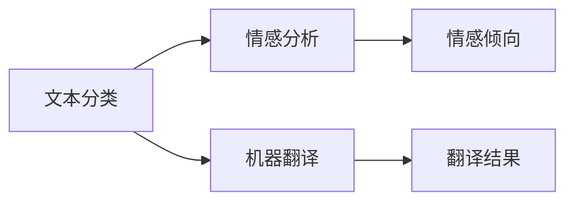
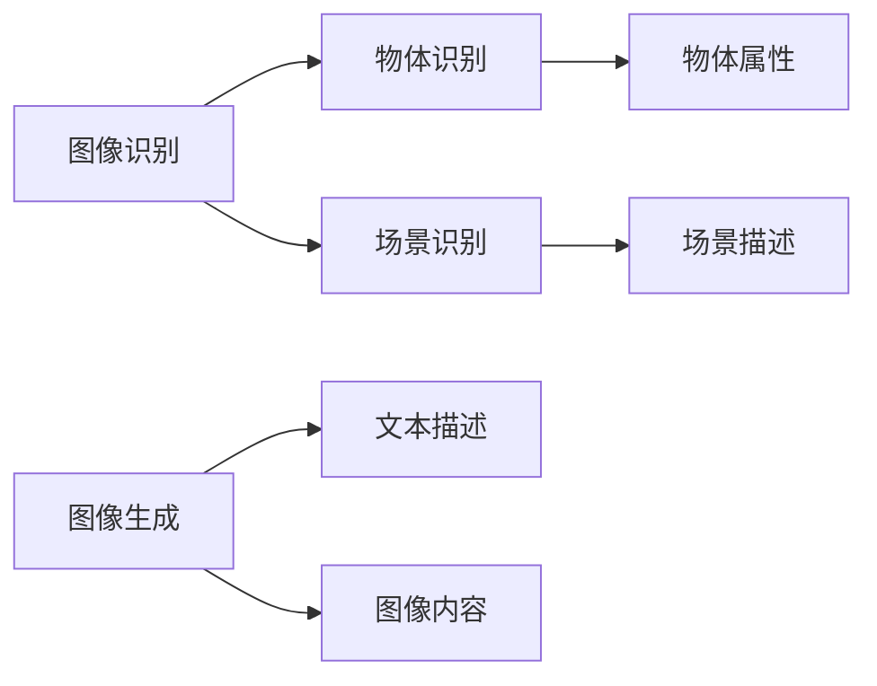

                 

# AIGC与传统艺术的融合与冲突

关键词：人工智能、生成内容、传统艺术、融合、冲突、案例分析

摘要：本文深入探讨了人工智能生成内容（AIGC）与传统艺术之间的融合与冲突。首先，介绍了AIGC和传统艺术的基本概念，并分析了它们各自的发展历程。接着，探讨了AIGC的核心技术和传统艺术的核心要素，并分析了两者之间的相互作用。随后，通过具体案例展示了AIGC与传统艺术融合的成功案例和冲突案例，并对案例进行了详细分析。最后，总结了融合与冲突的共性与差异，提出了未来发展的趋势和挑战。

## 第一部分：背景介绍

### 1.1 AIGC概述

#### 1.1.1 AIGC的定义与分类

人工智能生成内容（AI Generated Content，简称AIGC）是指通过人工智能技术生成的各种形式的内容，包括文本、图像、音频、视频等。AIGC可以分为以下几种类型：

1. **文本生成**：利用自然语言处理技术生成文章、新闻报道、诗歌等。
2. **图像生成**：利用计算机视觉技术生成图像、动画、绘画等。
3. **音频生成**：利用语音合成技术生成语音、音乐等。
4. **视频生成**：利用计算机视觉和自然语言处理技术生成视频内容。

#### 1.1.2 AIGC的发展历程

AIGC的发展历程可以追溯到20世纪50年代，当时人工智能的概念被提出。随着计算能力的提升和算法的优化，AIGC技术在近年来得到了迅速发展。特别是在深度学习技术的推动下，AIGC在图像生成、文本生成等领域取得了显著成果。

#### 1.1.3 AIGC的技术特点与应用领域

AIGC具有以下技术特点：

1. **高效性**：通过自动化生成内容，提高内容生产效率。
2. **多样性**：能够生成丰富多样、创意独特的内容。
3. **个性化**：根据用户需求和偏好生成个性化的内容。

AIGC的应用领域广泛，包括但不限于：

1. **媒体与娱乐**：生成新闻、广告、影视作品等。
2. **艺术创作**：生成艺术作品、音乐、文学作品等。
3. **教育与培训**：生成教学课件、课程内容等。
4. **商业应用**：生成产品描述、客户服务响应等。

### 1.2 传统艺术概述

#### 1.2.1 传统艺术的定义与分类

传统艺术是指一种历史悠久、具有独特文化内涵的艺术形式，包括绘画、雕塑、书法、音乐、舞蹈、戏剧等。传统艺术具有以下特点：

1. **独特性**：每种传统艺术形式都有其独特的风格和特点。
2. **传承性**：传统艺术往往通过师徒传承、家族传承等方式得以延续。
3. **文化性**：传统艺术与当地文化、历史背景密切相关。

传统艺术可以按照以下几种方式进行分类：

1. **根据表现手段**：绘画、雕塑、书法、音乐等。
2. **根据地域文化**：中国艺术、西方艺术、非洲艺术等。
3. **根据创作目的**：装饰艺术、实用艺术、表演艺术等。

#### 1.2.2 传统艺术的发展历程

传统艺术的发展历程可以追溯到古代，如古代的壁画、雕塑等。随着历史的发展，传统艺术不断演变和丰富，形成了今天的多元化格局。在现代社会，传统艺术面临着传承与创新的双重挑战。

#### 1.2.3 传统艺术的表现形式与特点

传统艺术的表现形式多样，包括绘画、雕塑、音乐、舞蹈等。每种表现形式都有其独特的特点：

1. **绘画**：通过色彩和线条表现形象和情感。
2. **雕塑**：通过立体造型表现形象和意境。
3. **音乐**：通过音符和节奏表现情感和思想。
4. **舞蹈**：通过身体动作和表情表现情感和故事。

传统艺术具有以下特点：

1. **独特性**：每种艺术形式都有其独特的表现手法和风格。
2. **文化性**：传统艺术与当地文化、历史背景密切相关。
3. **传承性**：传统艺术通过师徒传承、家族传承等方式得以延续。

### 1.3 AIGC与传统艺术的融合背景

#### 1.3.1 社会文化背景

在现代社会，随着人工智能技术的飞速发展，AIGC与传统艺术的融合逐渐成为一种趋势。人们对于个性化、多元化艺术作品的需求不断增长，传统艺术形式面临着创新与传承的挑战。AIGC作为一种新兴的艺术形式，为传统艺术提供了新的表现手法和创作思路。

#### 1.3.2 技术发展背景

随着计算能力的提升和算法的优化，AIGC技术在图像生成、文本生成等领域取得了显著成果。传统艺术在数字化、虚拟现实等技术的推动下，也不断探索新的表现形式。技术的进步为AIGC与传统艺术的融合提供了有力支持。

#### 1.3.3 政策与经济背景

政府和相关机构对人工智能和传统艺术的发展给予了高度重视，出台了一系列政策和措施，鼓励AIGC与传统艺术的融合。同时，随着数字经济的发展，AIGC与传统艺术的融合带来了巨大的商业价值，为艺术家、企业等带来了新的发展机遇。

## 第二部分：核心概念与联系

### 2.1 AIGC的核心技术

AIGC的核心技术主要包括自然语言处理（NLP）、计算机视觉（CV）、语音合成（ASR）等。这些技术为AIGC的生成内容提供了基础支持。

#### 2.1.1 自然语言处理技术

自然语言处理技术（NLP）是AIGC的重要技术之一，主要包括文本分类、情感分析、机器翻译等。通过NLP技术，AIGC可以生成具有逻辑性和情感色彩的文本内容。

**NLP的核心概念和属性特征对比表格**：

| 概念 | 属性特征 |
| --- | --- |
| 文本分类 | 能够根据文本内容将其归为不同类别 |
| 情感分析 | 能够识别文本中的情感倾向 |
| 机器翻译 | 能够将一种语言的文本翻译成另一种语言的文本 |

**NLP与ER实体关系图架构**：

#### 2.1.2 计算机视觉技术

计算机视觉技术（CV）是AIGC的另一个重要技术，主要包括图像识别、图像生成等。通过CV技术，AIGC可以生成具有视觉美感和创意的图像内容。

**CV的核心概念和属性特征对比表格**：

| 概念 | 属性特征 |
| --- | --- |
| 图像识别 | 能够识别图像中的物体和场景 |
| 图像生成 | 能够根据文本或图像生成新的图像内容 |

**CV与ER实体关系图架构**：

### 2.2 传统艺术的核心要素

传统艺术的核心要素包括艺术创作过程、艺术表达形式和艺术审美价值。

#### 2.2.1 艺术创作过程

艺术创作过程是指艺术家通过灵感、技巧和技艺，将内心感受和思想表达为艺术作品的过程。创作过程包括灵感迸发、构思草图、细节调整等阶段。

#### 2.2.2 艺术表达形式

艺术表达形式是指艺术家通过绘画、雕塑、音乐、舞蹈等手段，将内心感受和思想表达为艺术作品的形式。每种艺术形式都有其独特的表现手法和风格。

#### 2.2.3 艺术审美价值

艺术审美价值是指艺术作品所蕴含的美感和艺术价值。艺术审美价值是主观的，因人而异。传统艺术在长期发展过程中，形成了独特的审美标准和价值观念。

### 2.3 AIGC与传统艺术的相互作用

AIGC与传统艺术的相互作用主要体现在融合与冲突两个方面。

#### 2.3.1 融合的方式与方法

AIGC与传统艺术的融合方式主要包括：

1. **AI辅助创作**：利用AIGC技术辅助艺术家进行创作，提高创作效率和作品质量。
2. **AI生成艺术作品**：利用AIGC技术生成具有艺术价值的作品，如AI绘画、AI音乐等。
3. **AI传承艺术文化**：利用AIGC技术传承和保护传统艺术，如数字化艺术作品、虚拟博物馆等。

#### 2.3.2 冲突的原因与表现

AIGC与传统艺术的冲突主要体现在以下几个方面：

1. **创作主体与创作对象的变化**：AIGC技术的出现使得艺术家不再是创作的唯一主体，机器也能参与创作。这种变化可能导致传统艺术创作的主体地位受到挑战。
2. **艺术价值观念的冲突**：AIGC技术生成的艺术作品可能与传统艺术的价值观念相冲突，如人工智能无法理解传统艺术的审美标准和价值观念。
3. **版权与知识产权的冲突**：AIGC技术生成的艺术作品可能侵犯传统艺术家的版权和知识产权，引发法律纠纷。

#### 2.3.3 融合与冲突的相互转化

融合与冲突不是一成不变的，它们在一定条件下可以相互转化。例如，AIGC技术在辅助艺术创作过程中，可能引发艺术家对传统艺术创作方式的反思和改进，从而实现融合。反之，如果AIGC技术被滥用，导致艺术作品质量下降，可能引发传统艺术家对AIGC技术的抵制，加剧冲突。

## 第三部分：融合与冲突的案例分析

### 3.1 融合案例

#### 3.1.1 案例一：AI艺术创作的兴起

随着人工智能技术的发展，AI艺术创作逐渐成为一种热门趋势。许多艺术家开始利用AIGC技术进行创作，如AI绘画、AI音乐等。这些作品在形式、风格和内容上具有独特的创意和审美价值。

**案例一：AI绘画**  
某知名艺术家利用AIGC技术创作了一幅画作，通过计算机视觉技术分析大量艺术作品，学习并模仿各种艺术风格。这幅画作在视觉效果和创意上与传统绘画作品有所不同，引发了观众和艺术评论家的热议。

**案例一：AI音乐**  
某音乐制作公司利用AIGC技术创作了一首歌曲，通过自然语言处理技术分析歌词，并根据歌词生成相应的旋律和伴奏。这首歌曲在情感表达和音乐风格上与传统音乐有所不同，获得了听众的喜爱。

#### 3.1.2 案例二：数字博物馆的运用

数字博物馆利用AIGC技术，将传统艺术作品数字化，并在虚拟现实（VR）技术支持下，为观众提供沉浸式艺术体验。这种融合方式不仅传承和保护了传统艺术作品，还为观众带来了全新的观展体验。

**案例二：数字博物馆**  
某数字博物馆利用AIGC技术，将传统绘画、雕塑等艺术作品数字化，并在VR技术支持下，为观众提供了沉浸式的观展体验。观众可以通过VR设备，走进数字博物馆，欣赏艺术作品，了解艺术家的创作背景和故事。

#### 3.1.3 案例三：虚拟现实艺术体验

虚拟现实（VR）技术为传统艺术带来了新的表现手法和体验方式。艺术家利用VR技术，创作出具有沉浸感和互动性的艺术作品，为观众带来了全新的艺术体验。

**案例三：VR艺术体验**  
某VR艺术展利用AIGC技术，创作了一组虚拟现实艺术作品。观众通过VR设备，可以走进虚拟的艺术空间，与艺术作品互动，感受艺术的魅力。这种艺术体验在形式和内容上与传统艺术有所不同，引发了观众的兴趣和讨论。

### 3.2 冲突案例

#### 3.2.1 案例一：AI创作与传统艺术家的权益

随着AI艺术创作的兴起，传统艺术家的权益受到一定程度的挑战。一些艺术家担心，AI艺术创作可能导致他们的作品被滥用，侵犯他们的版权和知识产权。

**案例一：AI创作与传统艺术家权益**  
某著名艺术家发现，其作品被某AI艺术创作平台非法使用，生成了大量具有创意的艺术作品。这些作品在互联网上广泛传播，给该艺术家的声誉和权益带来了负面影响。该艺术家起诉该平台，引发了关于AI艺术创作与传统艺术家权益保护的讨论。

#### 3.2.2 案例二：艺术教育中的AI应用争议

在艺术教育中，AI技术的应用也引发了一定的争议。一些教育者和学生担心，AI技术可能导致艺术教育的主体性丧失，影响艺术教育的质量和效果。

**案例二：艺术教育中的AI应用争议**  
某艺术学校引入了AI教学系统，通过计算机视觉技术分析学生的作品，并提供评分和建议。一些学生认为，这种AI评分系统无法理解艺术的内涵和审美价值，导致评分不公。教育者和学生之间的争议引发了关于AI技术是否适用于艺术教育的讨论。

#### 3.2.3 案例三：人工智能与艺术审美评价

人工智能在艺术审美评价方面的能力受到一定程度的质疑。一些艺术家和评论家担心，人工智能无法理解艺术作品的内涵和审美价值，可能导致艺术评价的客观性和公正性受到影响。

**案例三：人工智能与艺术审美评价**  
某AI艺术评价系统通过自然语言处理技术分析艺术评论，并给出评分和建议。一些艺术家和评论家认为，这种AI评分系统无法理解艺术的内涵和审美价值，可能导致评分不准确。这种争议引发了关于人工智能是否适用于艺术审美评价的讨论。

### 3.3 案例分析总结

#### 3.3.1 融合与冲突的共性与差异

通过以上案例分析，可以发现融合与冲突具有以下共性和差异：

**共性**：

1. **技术进步推动融合**：AIGC技术的发展为传统艺术提供了新的创作手段和表现方式，促进了两者之间的融合。
2. **社会需求推动融合**：现代社会对个性化、多元化艺术作品的需求推动了AIGC与传统艺术的融合。
3. **经济利益推动融合**：AIGC与传统艺术的融合带来了巨大的商业价值，吸引了企业和投资者的关注。

**差异**：

1. **融合方式的差异**：融合方式包括AI辅助创作、AI生成艺术作品、数字博物馆等，每种方式都有其独特的优势和挑战。
2. **冲突原因的差异**：冲突原因包括创作主体与创作对象的变化、艺术价值观念的冲突、版权与知识产权的冲突等。
3. **融合与冲突的相互转化**：融合与冲突不是一成不变的，它们在一定条件下可以相互转化。

#### 3.3.2 案例对艺术产业的影响

融合与冲突的案例对艺术产业产生了深远影响：

1. **艺术创作方式的变化**：AIGC技术的引入改变了传统艺术创作的主体和方式，艺术家需要适应新的创作环境。
2. **艺术市场的变化**：AIGC技术生成的艺术作品在市场上受到关注，传统艺术与AI艺术作品共同构成了艺术市场的新格局。
3. **艺术教育的变革**：艺术教育需要适应AI技术的发展，培养学生的创新能力和跨学科素养。

#### 3.3.3 案例启示与未来发展方向

通过案例启示，我们可以看到AIGC与传统艺术的融合具有巨大的潜力，但也面临着一定的挑战。未来发展方向包括：

1. **技术优化与创新**：持续优化AIGC技术，提高艺术创作效率和质量。
2. **艺术价值观念的融合**：加强传统艺术与AI艺术的交流与互动，形成共同的艺术价值观念。
3. **政策法规的完善**：制定相关政策和法规，保障传统艺术家和AI艺术家的权益。
4. **人才培养与教育**：加强艺术教育与AI技术的融合，培养具有创新能力和跨学科素养的艺术人才。

## 第四部分：总结与展望

AIGC与传统艺术的融合与冲突是一个复杂而多元的话题。本文通过背景介绍、核心概念与联系、融合与冲突的案例分析，探讨了AIGC与传统艺术之间的相互作用。融合与冲突案例展示了AIGC技术在艺术创作、艺术传承、艺术教育等方面的应用，同时也揭示了传统艺术家和AI艺术家的权益冲突。

未来，AIGC与传统艺术的融合将继续深入，二者之间的冲突也将愈发显著。技术进步、社会需求和艺术价值观念的融合将为AIGC与传统艺术的融合提供动力，但同时也需要解决艺术创作主体和权益保护等问题。政策法规的完善和人才培养与教育也将对AIGC与传统艺术的融合与冲突产生重要影响。

总之，AIGC与传统艺术的融合与冲突是一个充满机遇和挑战的领域。通过深入研究和探讨，我们可以更好地理解这一领域的发展趋势和方向，为艺术产业和人工智能技术的发展提供有益的启示。

### 作者信息

作者：AI天才研究院/AI Genius Institute & 禅与计算机程序设计艺术 /Zen And The Art of Computer Programming

AI天才研究院（AI Genius Institute）致力于人工智能领域的科研和人才培养。研究院专注于人工智能技术的创新和应用，推动人工智能技术在各行各业的发展。同时，研究院还致力于传承和弘扬传统艺术，探索人工智能与传统艺术的融合，为艺术产业注入新的活力。

禅与计算机程序设计艺术（Zen And The Art of Computer Programming）是作者在计算机科学领域的经典著作，探讨了计算机程序设计中的哲学思想和方法论。该书以禅宗哲学为切入点，阐述了计算机程序设计的艺术性，对计算机科学的发展产生了深远影响。

作者通过多年的研究和实践，积累了丰富的经验和见解，在人工智能和传统艺术领域取得了显著成果。本文旨在分享作者的研究成果和思考，为AIGC与传统艺术的融合与冲突提供新的视角和思路。希望本文能够为读者带来启发和思考，共同推动人工智能和传统艺术的创新发展。

