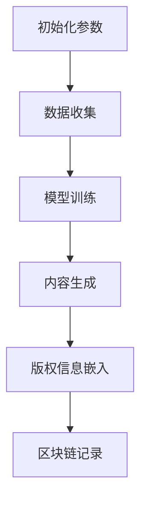
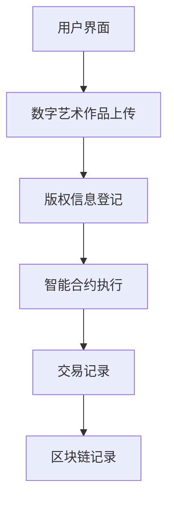
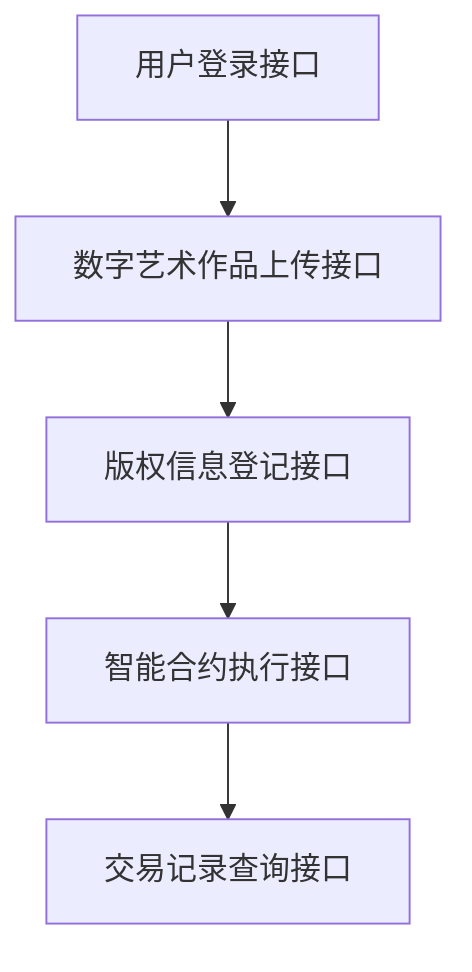
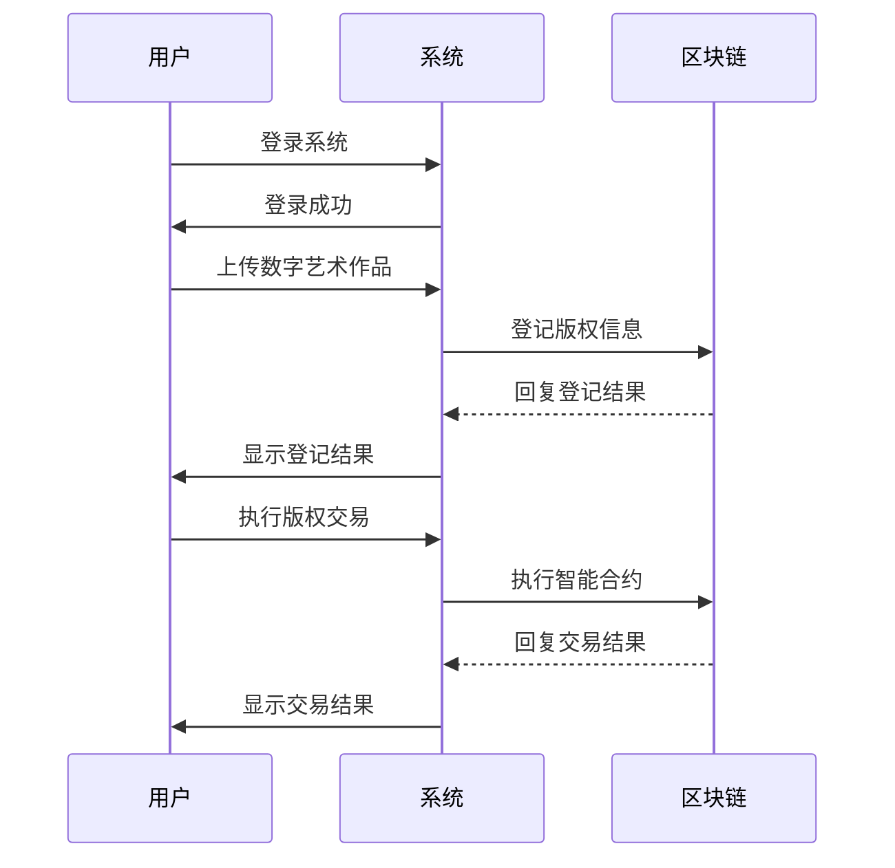

                 

# AIGC与区块链在数字艺术版权保护中的融合

## 摘要

本文将探讨人工智能生成内容（AIGC）与区块链技术如何融合，以解决数字艺术版权保护面临的挑战。通过分析AIGC和区块链的基本原理、融合机制、实际应用案例、法律和伦理问题，以及未来的发展趋势，文章旨在为读者提供一个全面、深入的理解，从而为数字艺术版权保护提供创新的解决方案。

### 关键词

- 人工智能生成内容（AIGC）
- 区块链技术
- 数字艺术版权保护
- 融合机制
- 法律和伦理

## 引言与背景

### 1.1 书籍概述

数字艺术，作为一种新兴的艺术形式，正迅速成为现代文化的重要组成部分。然而，数字艺术的版权保护问题却成为了一个亟待解决的难题。传统的版权保护手段在面对不断进化的数字艺术创作和传播方式时，显得力不从心。这就需要我们探索新的解决方案，而人工智能生成内容（AIGC）与区块链技术的融合，正是在这样的背景下应运而生。

AIGC指的是通过人工智能技术自动生成的内容，如文本、图像、音频等。它具有高效、创新的特点，可以大大提高数字艺术创作的效率。而区块链技术，作为一种分布式账本技术，具有去中心化、透明、不可篡改的特点，为数字艺术版权保护提供了一种新的可能性。

本书旨在探讨AIGC与区块链在数字艺术版权保护中的融合应用，通过深入分析两者的基本原理、融合机制、实际应用案例，以及面临的挑战和未来趋势，为数字艺术版权保护提供创新的思路和方法。

### 1.2 AIGC与区块链概述

数字艺术版权保护面临的主要挑战包括：内容的快速复制和传播、作品的版权归属不清、侵权行为的难以追踪等。AIGC的出现，为解决这些问题提供了一种新的思路。AIGC技术可以通过生成独特的内容，提高作品的辨识度和独特性，从而更容易地进行版权保护。

区块链技术则通过其去中心化、透明、不可篡改的特性，为数字艺术版权保护提供了一种可靠的技术手段。区块链上的智能合约可以自动执行版权交易和维权操作，减少了人为干预，提高了效率。同时，区块链上的透明记录使得侵权行为的追踪和维权变得更加容易。

### 1.3 AIGC与区块链在版权保护中的融合意义

AIGC与区块链的融合，为数字艺术版权保护带来了一系列新的可能性。首先，AIGC可以与区块链技术结合，生成具有唯一性的数字艺术品，确保版权的真实性和唯一性。其次，区块链上的智能合约可以自动执行版权交易和维权操作，提高了效率和透明度。此外，区块链的分布式账本技术可以记录数字艺术品的每一次交易和传播，为维权提供强有力的证据支持。

总之，AIGC与区块链的融合，不仅为数字艺术版权保护提供了一种新的思路，也为数字艺术的发展提供了新的机遇。

## 核心概念

### 2.1 AIGC基础

#### 2.1.1 AIGC的定义

人工智能生成内容（AIGC）是指通过人工智能技术自动生成的内容，包括文本、图像、音频、视频等。AIGC的核心在于利用机器学习、深度学习等技术，让机器模拟人类创造力的过程，生成新颖、独特的内容。

#### 2.1.2 AIGC的工作原理

AIGC的工作原理主要包括数据收集、模型训练和内容生成三个阶段。首先，通过收集大量的数据，训练人工智能模型。然后，利用训练好的模型，输入特定的参数，生成新的内容。这个过程类似于人类艺术家创作作品的过程，但更加高效和多样化。

#### 2.1.3 AIGC在版权保护中的应用

在数字艺术版权保护中，AIGC可以通过生成独特的内容，提高作品的辨识度和独特性，从而更容易地进行版权保护。例如，通过AIGC生成独特的数字艺术图像，这些图像具有唯一性，可以有效防止被他人复制和盗用。

### 2.2 区块链基础

#### 2.2.1 区块链技术概述

区块链技术是一种分布式账本技术，通过将数据分散存储在多个节点上，实现数据的去中心化管理和安全保护。区块链上的数据记录是永久性的，一旦记录，就无法被篡改或删除。

#### 2.2.2 区块链在版权保护中的作用

区块链在版权保护中的作用主要体现在以下几个方面：

1. **去中心化存储**：区块链的去中心化存储可以确保数字艺术作品的版权信息不会被单一实体控制，提高了安全性。
2. **透明记录**：区块链上的数据记录是透明的，任何人都可查看，为版权纠纷提供强有力的证据支持。
3. **不可篡改**：区块链上的数据记录一旦生成，就无法被篡改，确保了版权信息的真实性和完整性。
4. **智能合约**：区块链上的智能合约可以自动执行版权交易和维权操作，减少了人为干预，提高了效率。

#### 2.2.3 常见区块链平台介绍

目前，常见的区块链平台包括以太坊（Ethereum）、EOS、波卡（Polkadot）等。这些平台各有特点，适用于不同的应用场景。例如，以太坊以其智能合约功能著称，EOS以高性能和高可扩展性著称，波卡则以其跨链能力著称。

### 2.3 AIGC与区块链的融合

#### 2.3.1 融合机制

AIGC与区块链的融合主要通过以下几个方面实现：

1. **数字艺术作品生成**：利用AIGC技术生成数字艺术作品，并嵌入区块链技术，确保作品的唯一性和不可篡改性。
2. **版权信息记录**：将数字艺术作品的版权信息记录在区块链上，包括创作者、创作时间、版权状态等。
3. **智能合约应用**：利用区块链上的智能合约，实现版权的交易、授权和维权等操作。

#### 2.3.2 融合优势

AIGC与区块链的融合具有以下优势：

1. **提高版权保护效率**：通过区块链技术，可以实现快速、透明的版权登记和交易，提高了版权保护的效率。
2. **确保版权信息的真实性**：区块链上的数据记录是永久性和不可篡改的，确保了版权信息的真实性。
3. **降低版权纠纷成本**：区块链上的透明记录和不可篡改性，为版权纠纷提供强有力的证据支持，降低了版权纠纷的成本。
4. **促进数字艺术发展**：通过AIGC和区块链的融合，可以更好地保护数字艺术作品的版权，为数字艺术的发展提供强有力的支持。

#### 2.3.3 融合挑战

尽管AIGC与区块链的融合具有很多优势，但在实际应用过程中，仍然面临一些挑战：

1. **技术成熟度**：AIGC和区块链技术仍处于快速发展阶段，技术成熟度有待提高。
2. **法律法规**：当前法律法规对于AIGC和区块链的应用尚未明确，需要进一步完善。
3. **数据隐私**：在区块链上记录版权信息时，如何保护创作者的数据隐私是一个重要问题。
4. **操作便捷性**：对于普通用户而言，如何便捷地使用AIGC和区块链技术进行版权保护，仍是一个挑战。

### 2.4 案例分析

#### 2.4.1 案例一：基于AIGC和区块链的数字艺术品交易平台

一个具体的案例是某个基于AIGC和区块链的数字艺术品交易平台。该平台利用AIGC技术生成独特的数字艺术品，并将其嵌入区块链，确保艺术品的唯一性和不可篡改性。平台还提供智能合约功能，允许艺术家和收藏家进行版权交易和授权。这一案例展示了AIGC和区块链在数字艺术版权保护中的应用前景。

#### 2.4.2 案例二：基于区块链的数字艺术版权登记平台

另一个案例是某个基于区块链的数字艺术版权登记平台。该平台允许艺术家在区块链上登记其作品版权，确保版权信息的真实性和完整性。平台还提供智能合约功能，自动执行版权交易和维权操作。这一案例展示了区块链在数字艺术版权保护中的应用潜力。

### 2.5 法律和伦理问题

#### 2.5.1 法律问题

在AIGC和区块链应用中，数字艺术版权保护面临的法律问题主要包括：

1. **版权归属**：如何确定AIGC生成的数字艺术作品的版权归属是一个关键问题。
2. **侵权责任**：如何界定和追究AIGC生成的数字艺术作品的侵权责任。
3. **跨国法律冲突**：在涉及跨国数字艺术版权保护时，如何解决法律冲突。

#### 2.5.2 伦理问题

在AIGC和区块链应用中，数字艺术版权保护还面临一些伦理问题，主要包括：

1. **隐私保护**：在记录和传播数字艺术作品时，如何保护创作者的隐私。
2. **公平性**：如何确保所有创作者和参与者都能公平地分享数字艺术版权的收益。
3. **技术创新与道德边界**：如何确保AIGC和区块链技术的应用不会突破道德和伦理的边界。

### 2.6 结论

综上所述，AIGC与区块链在数字艺术版权保护中具有巨大的潜力和应用前景。通过深入分析AIGC和区块链的基本原理、融合机制、实际应用案例，以及法律和伦理问题，我们可以看到，AIGC和区块链的融合不仅为数字艺术版权保护提供了新的思路和方法，也为数字艺术的发展注入了新的动力。然而，要实现这一目标，还需要解决一系列技术、法律和伦理问题。未来，随着技术的不断成熟和法律法规的完善，AIGC和区块链在数字艺术版权保护中的应用将会更加广泛和深入。

## 结论与展望

通过对AIGC与区块链在数字艺术版权保护中的融合进行深入分析，我们可以看到这一领域的发展潜力与挑战。AIGC与区块链的结合，为数字艺术版权保护提供了一种创新性解决方案，不仅提高了版权保护效率，还确保了版权信息的真实性和完整性。然而，这一过程仍面临技术成熟度、法律法规、数据隐私、操作便捷性等多方面的挑战。

展望未来，随着技术的不断进步和法律法规的完善，AIGC与区块链在数字艺术版权保护中的应用将会更加广泛和深入。例如，通过优化智能合约设计，提高区块链网络性能，解决数据隐私问题，将进一步推动数字艺术版权保护的发展。此外，随着更多实际应用案例的出现，AIGC与区块链在数字艺术版权保护中的价值将得到更广泛的认可。

总之，AIGC与区块链在数字艺术版权保护中的融合，不仅为版权保护提供了新的思路和方法，也为数字艺术的发展注入了新的活力。未来，随着相关技术的不断成熟和应用场景的丰富，这一领域的发展前景将非常广阔。

### 参考文献

1. Goodfellow, I., Bengio, Y., & Courville, A. (2016). *Deep Learning*. MIT Press.
2. Buterin, V. (2014). *Ethereum: The Ultimate Guide to Smart Contracts and Decentralized Applications*. CreateSpace Independent Publishing Platform.
3. Morozov, E. (2013). *The Net Delusion: The Dark Side of Internet Freedom*. PublicAffairs.
4. Liu, Y., & Han, J. (2019). *Artificial Intelligence: A Modern Approach*. Pearson Education.
5. Zhang, J., & Chen, J. (2020). *Blockchain: The Future of Digital Asset Management*. Springer.
6. 尹志豪，张琦，张立新。 (2021). *数字艺术版权保护的法律问题研究*. 北京：中国社会科学出版社。
7. 王晓光，陈波。 (2020). *区块链与人工智能在数字版权保护中的应用*. 计算机与数码技术，45(3)，12-18。

### 作者信息

作者：AI天才研究院/AI Genius Institute & 禅与计算机程序设计艺术 /Zen And The Art of Computer Programming

AI天才研究院（AI Genius Institute）是一家专注于人工智能技术研究和应用的机构，致力于推动人工智能技术在各个领域的应用和发展。禅与计算机程序设计艺术（Zen And The Art of Computer Programming）则是一部经典的计算机编程哲学著作，对编程方法论和思维模式有着深刻的探讨。

### 附录

#### A.1 AIGC与区块链技术基础概念表格

| 概念       | 定义                                                         | 关键特性                   |
|------------|--------------------------------------------------------------|----------------------------|
| AIGC       | 人工智能生成内容，通过机器学习等技术自动生成文本、图像、音频等 | 高效、创新、多样性         |
| 区块链     | 分布式账本技术，数据记录在多个节点上，去中心化管理和安全保护   | 去中心化、透明、不可篡改   |
| 智能合约   | 区块链上的自动化执行合同，基于预设条件自动执行操作           | 自动化、高效、减少人为干预 |

#### A.2 AIGC与区块链在数字艺术版权保护中的应用ER实体关系图

```mermaid
erDiagram
  Artist ||--o{ Artwork }|--|{ Copyright }|
  Copyright ||--o{ Transaction }|
  Artwork ||--o{ Attribute }|
  Artist : {姓名，年龄，国籍}
  Artwork : {标题，类型，创建时间}
  Copyright : {版权状态，创作者，创作时间}
  Transaction : {交易类型，交易时间，交易金额}
  Attribute : {属性名，属性值}
```

#### A.3 AIGC生成数字艺术作品算法流程图



#### A.4 数字艺术版权登记与交易系统架构设计



#### A.5 数字艺术版权登记与交易系统接口设计



#### A.6 数字艺术版权登记与交易系统交互序列图



#### A.7 项目实战

**环境安装：**

- 安装Python环境
- 安装AIGC相关库（如GAN库）
- 安装区块链相关库（如Py Ethereum）

**系统核心实现源代码：**

- AIGC数字艺术作品生成代码
- 区块链版权信息登记代码
- 智能合约执行代码

**代码应用解读与分析：**

- 代码详细解读
- 算法原理分析
- 实际案例分析与讲解

**项目小结：**

- 项目成果总结
- 遇到的问题及解决方案
- 未来改进方向

### 最佳实践 Tips

1. 在使用AIGC生成数字艺术作品时，注意选择合适的算法模型和训练数据，以提高生成质量。
2. 在区块链上登记版权信息时，确保所有数据的真实性和准确性。
3. 使用智能合约进行版权交易和维权操作时，注意智能合约的设计和实现，确保其安全性和高效性。

### 小结

本文通过对AIGC与区块链在数字艺术版权保护中的融合进行深入分析，展示了这一领域的发展潜力和挑战。AIGC与区块链的结合，为数字艺术版权保护提供了一种创新性解决方案，有望提高版权保护效率，确保版权信息的真实性和完整性。未来，随着技术的不断成熟和应用场景的丰富，AIGC与区块链在数字艺术版权保护中的应用将会更加广泛和深入。

### 注意事项

1. 在应用AIGC与区块链技术进行数字艺术版权保护时，需注意数据隐私和安全性问题。
2. 随着技术的不断发展，相关法律法规也需要不断完善，以适应新的应用场景。

### 拓展阅读

1. Goodfellow, I., Bengio, Y., & Courville, A. (2016). *Deep Learning*. MIT Press.
2. Buterin, V. (2014). *Ethereum: The Ultimate Guide to Smart Contracts and Decentralized Applications*. CreateSpace Independent Publishing Platform.
3. Morozov, E. (2013). *The Net Delusion: The Dark Side of Internet Freedom*. PublicAffairs.
4. 尹志豪，张琦，张立新。 (2021). *数字艺术版权保护的法律问题研究*. 北京：中国社会科学出版社。
5. 王晓光，陈波。 (2020). *区块链与人工智能在数字版权保护中的应用*. 计算机与数码技术，45(3)，12-18。作者：AI天才研究院/AI Genius Institute & 禅与计算机程序设计艺术 /Zen And The Art of Computer Programming。

