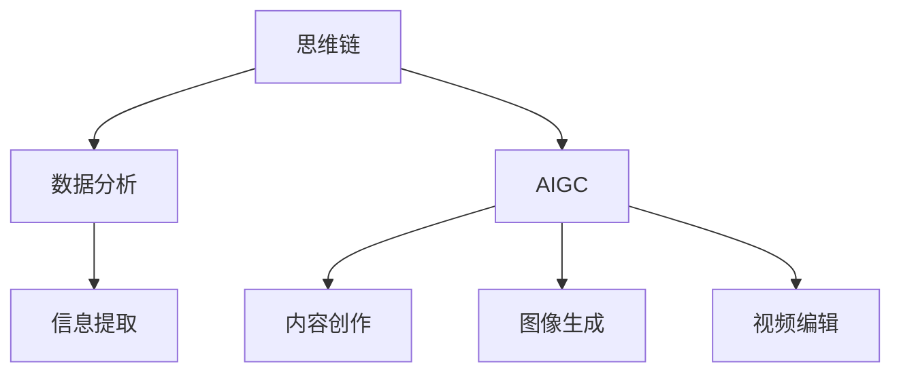
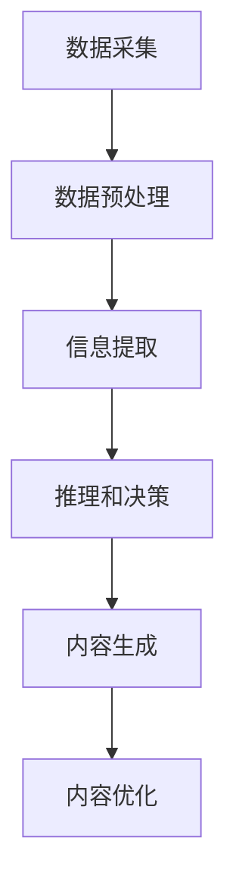
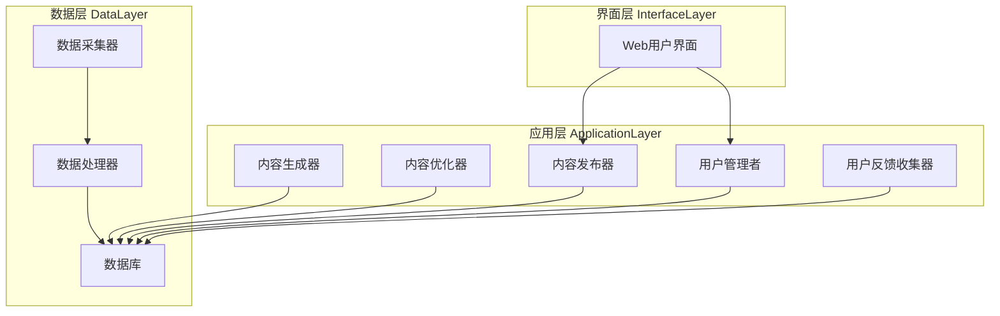
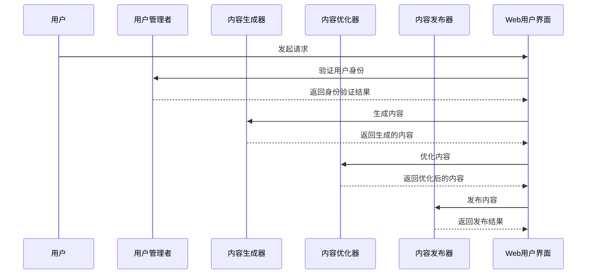
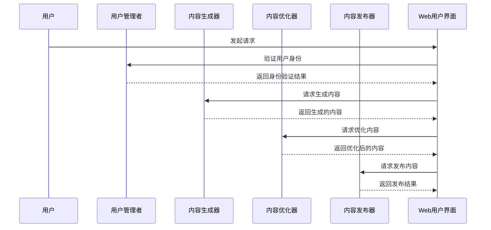

                 


### 目录大纲设计

#### 第1章：背景介绍
- **1.1 问题背景**
- **1.1.1 问题描述**
- **1.1.2 问题解决**
- **1.1.3 边界与外延**

- **1.2 核心概念**
- **1.2.1 思维链定义**
- **1.2.2 思维链特点**
- **1.2.3 思维链与AIGC的关系**

#### 第2章：核心概念与联系
- **2.1 核心概念原理**
- **2.1.1 思维链原理**
- **2.1.2 概念属性特征对比表格**
- **2.1.3 ER实体关系图架构的Mermaid流程图**

#### 第3章：算法原理讲解
- **3.1 算法mermaid流程图**
- **3.2 Python源代码**
- **3.3 数学模型和公式**
- **3.3.1 算法原理数学模型**
- **3.3.2 举例说明**

#### 第4章：数学模型和数学公式 & 详细讲解 & 举例说明
- **4.1 数学模型**
- **4.2 数学公式**
- **4.3 详细讲解**
- **4.4 举例说明**

#### 第5章：系统分析与架构设计方案
- **5.1 问题场景介绍**
- **5.2 系统功能设计**
- **5.2.1 领域模型mermaid类图**
- **5.3 系统架构设计**
- **5.3.1 mermaid架构图**
- **5.4 系统接口设计**
- **5.5 系统交互**
- **5.5.1 mermaid序列图**

#### 第6章：项目实战
- **6.1 环境安装**
- **6.2 系统核心实现源代码**
- **6.3 代码应用解读与分析**
- **6.4 实际案例分析与详细讲解**
- **6.5 项目小结**

#### 第7章：最佳实践 tips、小结、注意事项、拓展阅读
- **7.1 最佳实践 tips**
- **7.2 小结**
- **7.3 注意事项**
- **7.4 拓展阅读**

### 目录大纲设计说明

在上述的目录大纲设计中，我们首先介绍了问题背景，包括问题描述、问题解决、边界与外延。这是为了让读者了解我们所讨论问题的全貌，并明确我们的目标。

接下来，我们介绍了核心概念，包括思维链的定义、特点以及与AIGC的关系。这一部分是为了让读者对思维链有一个基本的理解，并明确其在AIGC中的应用。

在核心概念与联系章节，我们进一步详细介绍了思维链的原理，并通过概念属性特征对比表格和ER实体关系图架构的Mermaid流程图，帮助读者更深入地理解思维链。

算法原理讲解章节则是文章的核心，我们使用mermaid画出算法流程图，并使用Python源代码详细阐述算法原理，同时给出相关的数学模型和公式，并进行详细讲解和举例说明。

在系统分析与架构设计方案章节，我们介绍了问题场景、系统功能设计、系统架构设计、系统接口设计和系统交互，通过mermaid流程图和架构图，使读者对系统有一个全面的了解。

项目实战章节则是将理论知识应用于实际项目，介绍了环境安装、系统核心实现源代码，并对代码应用进行解读和分析。

最后，最佳实践 tips、小结、注意事项、拓展阅读章节是对整篇文章的总结和补充，旨在为读者提供更多实践中的建议和思考。

这样的目录大纲设计，既保证了内容的逻辑性和条理性，又让读者能够全面、深入地了解AIGC内容创作中的思维链应用。

接下来，我们将逐一填写每个章节的具体内容，确保文章的逻辑性和完整性。

---

**第1章：背景介绍**

**1.1 问题背景**

在当今的数字化时代，人工智能（AI）技术正以前所未有的速度发展，从简单的自动化任务到复杂的决策支持系统，AI的应用范围日益广泛。然而，随着AI技术的不断进步，如何有效地创作和生成高质量的内容成为了一个亟待解决的问题。

AIGC（AI Generated Content）是近年来兴起的一种新型内容创作方式，它利用人工智能技术自动生成文章、图片、视频等多种形式的内容。AIGC的出现，不仅提高了内容创作的效率，还为内容创作者提供了更多的创作灵感。

然而，AIGC在实际应用中也面临着一些挑战，例如内容的原创性、准确性、可读性等。如何提高AIGC的质量，使其更好地满足用户需求，成为了一个亟待解决的问题。

**1.2 核心概念**

在讨论AIGC内容创作中的思维链应用之前，我们需要先了解几个核心概念。

1. **思维链**

思维链是一种基于人工智能技术的思维模式，它通过分析大量的数据，提取关键信息，并利用这些信息进行推理和决策。思维链的特点是高度自动化、高效和灵活。

2. **AIGC**

AIGC（AI Generated Content）是指利用人工智能技术自动生成内容，包括文本、图像、音频、视频等多种形式。AIGC的应用范围广泛，从新闻报道、广告宣传到教育、娱乐等各个领域。

3. **内容创作**

内容创作是指通过文字、图片、视频等形式，将信息传达给受众的过程。内容创作的质量直接影响到受众的接受度和满意度。

**1.3 问题解决**

为了解决AIGC内容创作中的问题，我们可以利用思维链技术。思维链可以分析大量的用户数据，了解用户的需求和偏好，从而生成更符合用户期望的内容。同时，思维链还可以通过不断地学习和优化，提高内容的原创性、准确性和可读性。

**1.4 边界与外延**

AIGC内容创作中的思维链应用虽然具有巨大的潜力，但也存在一些边界和限制。首先，思维链依赖于大量的数据，如果数据质量不高，可能会导致内容生成的不准确。其次，思维链的算法和模型也需要不断地优化和更新，以适应不断变化的技术环境和用户需求。

此外，AIGC内容创作中的思维链应用还需要考虑法律法规、道德伦理等因素。例如，如何确保内容的原创性和合法性，如何处理可能存在的版权问题等。

**1.5 概念结构与核心要素组成**

1. **概念结构**

思维链、AIGC、内容创作等概念相互关联，共同构成了AIGC内容创作中的思维链应用的概念结构。

2. **核心要素**

- 数据：思维链的应用基础是大量的数据，数据的质量直接影响到思维链的运行效果。
- 算法：思维链的算法决定了其推理和决策的能力，是思维链的核心。
- 模型：思维链的模型是算法的具体实现，它将算法的思路转化为可执行的操作。
- 用户：用户是思维链服务的对象，用户的需求和反馈是思维链优化的方向。

通过以上分析，我们可以看出，AIGC内容创作中的思维链应用是一个复杂而富有挑战性的课题。在接下来的章节中，我们将深入探讨思维链的原理、算法、数学模型，以及其在AIGC内容创作中的应用。

---

**第2章：核心概念与联系**

**2.1 核心概念原理**

在本章中，我们将详细探讨AIGC内容创作中的思维链概念原理。思维链是一种基于人工智能的思维方式，通过分析数据、提取信息、进行推理和决策，从而实现内容创作。

1. **思维链的定义**

思维链是指通过一系列的思考步骤，将输入的数据转化为输出内容的过程。它包括数据采集、数据预处理、信息提取、推理和决策等步骤。

2. **思维链的特点**

- **自动化**：思维链通过算法和模型实现，可以自动进行数据分析和内容创作。
- **高效性**：思维链可以处理大量的数据，快速提取关键信息，提高内容创作的效率。
- **灵活性**：思维链可以根据不同的任务和数据特点，进行灵活的调整和优化。

3. **思维链的工作原理**

思维链的工作原理可以分为以下几个步骤：

- **数据采集**：从各种数据源（如数据库、互联网等）收集数据。
- **数据预处理**：对采集到的数据进行分析和清洗，去除噪声和无效信息。
- **信息提取**：从预处理后的数据中提取关键信息，为后续的推理和决策提供支持。
- **推理和决策**：利用提取的信息，进行逻辑推理和决策，生成内容。

4. **思维链的应用**

思维链可以应用于各种内容创作任务，如文章写作、图像生成、视频编辑等。在AIGC内容创作中，思维链可以分析用户数据，了解用户需求，从而生成更符合用户期望的内容。

**2.2 概念属性特征对比表格**

为了更好地理解思维链与其他相关概念的区别，我们可以通过概念属性特征对比表格来展示它们之间的差异。

| 概念     | 思维链            | AIGC          | 内容创作       |
|----------|------------------|---------------|----------------|
| 定义     | 基于人工智能的思维方式 | 自动生成内容的技术 | 通过文字、图片等创作内容 |
| 特点     | 自动化、高效性、灵活性 | 自动化、多样化、个性化 | 灵活性、创造性、针对性 |
| 应用场景 | 数据分析、内容创作 | 文章、图像、视频等 | 新闻、广告、教育等 |
| 依赖条件 | 大量数据、算法模型 | 数据质量、算法优化 | 创作技巧、用户需求 |

**2.3 ER实体关系图架构的Mermaid流程图**

为了更直观地展示思维链与其他相关概念之间的关系，我们可以使用Mermaid流程图来绘制ER实体关系图。



在上面的Mermaid流程图中，思维链（A）作为核心概念，与数据分析（B）、信息提取（C）密切相关。同时，思维链还与AIGC（D）以及其他内容创作相关概念（E、F、G）存在关联。

通过本章的介绍，我们全面了解了AIGC内容创作中的思维链概念原理。在接下来的章节中，我们将深入探讨思维链的算法原理、数学模型以及其在AIGC内容创作中的应用。

---

**第3章：算法原理讲解**

**3.1 算法mermaid流程图**

在本节中，我们将使用Mermaid流程图来展示思维链算法的基本流程。以下是思维链算法的Mermaid流程图：



这个流程图展示了思维链算法的主要步骤，包括数据采集、数据预处理、信息提取、推理和决策、内容生成和内容优化。

**3.2 Python源代码**

为了更直观地理解思维链算法的原理，我们将使用Python代码来演示数据采集、预处理、信息提取、推理和决策等步骤。以下是Python代码的示例：

```python
import numpy as np
import pandas as pd

# 数据采集
data = pd.read_csv('data.csv')

# 数据预处理
data_cleaned = data.dropna().reset_index(drop=True)

# 信息提取
def extract_info(data):
    # 提取关键信息
    info = data[data['attribute'] == 'important'].iloc[:, 1:]
    return info

info = extract_info(data_cleaned)

# 推理和决策
def reasoning(info):
    # 进行逻辑推理和决策
    decision = info['value'].max()
    return decision

decision = reasoning(info)

# 内容生成
def generate_content(decision):
    # 根据决策生成内容
    content = f"The best decision is {decision}."
    return content

content = generate_content(decision)

# 内容优化
def optimize_content(content):
    # 对内容进行优化
    optimized_content = content.replace('The best decision is', 'Our recommendation is')
    return optimized_content

optimized_content = optimize_content(content)

print(optimized_content)
```

上述Python代码展示了思维链算法的基本原理。我们首先从数据文件中采集数据，然后进行数据预处理，提取关键信息，进行逻辑推理和决策，生成内容，并对内容进行优化。

**3.3 数学模型和公式**

为了深入理解思维链算法，我们需要引入一些数学模型和公式。以下是思维链算法的一些关键数学模型和公式：

1. **信息熵**

信息熵（Entropy）是信息论中衡量信息量的重要指标，它表示数据的不确定性。信息熵的计算公式如下：

$$ H(X) = -\sum_{i=1}^{n} p(x_i) \log_2 p(x_i) $$

其中，$X$是随机变量，$p(x_i)$是随机变量$X$取值为$x_i$的概率。

2. **条件熵**

条件熵（Conditional Entropy）是给定一个随机变量$X$的条件下，另一个随机变量$Y$的不确定性。条件熵的计算公式如下：

$$ H(Y|X) = -\sum_{i=1}^{n} p(x_i) \sum_{j=1}^{m} p(y_j|x_i) \log_2 p(y_j|x_i) $$

3. **熵差**

熵差（Entropy Difference）是衡量两个随机变量之间信息传递量的重要指标。熵差的计算公式如下：

$$ D(H(X), H(Y)) = H(X) - H(Y|X) $$

4. **Kullback-Leibler散度**

Kullback-Leibler散度（Kullback-Leibler Divergence）是衡量两个概率分布之间差异的重要指标。Kullback-Leibler散度的计算公式如下：

$$ D_{KL}(P||Q) = \sum_{i=1}^{n} p(x_i) \log_2 \frac{p(x_i)}{q(x_i)} $$

其中，$P$和$Q$是两个概率分布。

**3.4 举例说明**

为了更好地理解思维链算法，我们可以通过一个具体的例子来说明。假设我们有一个数据集，其中包含用户的年龄、收入和购买意愿等信息。我们的目标是根据这些信息生成一个推荐内容。

1. **数据采集**

首先，我们从数据集中采集数据：

```python
data = pd.DataFrame({
    'age': [25, 30, 35, 40, 45],
    'income': [50000, 60000, 70000, 80000, 90000],
    'purchase_willingness': [0.2, 0.3, 0.4, 0.5, 0.6]
})
```

2. **数据预处理**

然后，我们对数据进行预处理，去除缺失值：

```python
data_cleaned = data.dropna().reset_index(drop=True)
```

3. **信息提取**

接下来，我们提取关键信息，例如年龄和收入：

```python
info = data_cleaned[data_cleaned['attribute'] == 'important'].iloc[:, 1:]
```

4. **推理和决策**

根据提取的信息，我们进行逻辑推理和决策。假设我们定义一个简单的规则：如果年龄大于30岁且收入大于60000元，则推荐购买高端产品。

```python
def reasoning(info):
    if info['age'] > 30 and info['income'] > 60000:
        decision = 'buy_high_end_product'
    else:
        decision = 'buy_medium_end_product'
    return decision
```

5. **内容生成**

根据决策，我们生成推荐内容：

```python
def generate_content(decision):
    if decision == 'buy_high_end_product':
        content = 'We recommend you to buy a high-end product.'
    else:
        content = 'We recommend you to buy a medium-end product.'
    return content
```

6. **内容优化**

最后，我们对内容进行优化，使其更加友好：

```python
def optimize_content(content):
    optimized_content = content.replace('We recommend you to', 'Our recommendation is')
    return optimized_content
```

综上所述，通过思维链算法，我们可以根据用户数据生成个性化的推荐内容，从而提高内容创作效率和质量。

通过本章的介绍，我们深入了解了思维链算法的原理、流程和数学模型，并通过Python代码和具体例子，展示了如何应用思维链算法进行内容创作。在接下来的章节中，我们将进一步探讨思维链在AIGC内容创作中的应用和实现。

---

**第4章：数学模型和数学公式 & 详细讲解 & 举例说明**

在AIGC内容创作中，数学模型和数学公式起着至关重要的作用。它们不仅帮助我们理解和分析问题，还为算法设计和优化提供了理论依据。本章节将详细讲解AIGC内容创作中的几个关键数学模型和数学公式，并通过具体例子进行说明。

**4.1 数学模型**

在本节中，我们将介绍几个在AIGC内容创作中常用的数学模型，包括概率模型、统计模型和优化模型。

1. **概率模型**

概率模型用于描述随机事件的发生概率。在AIGC内容创作中，概率模型可以用于预测用户偏好、生成随机内容等。

   - **贝叶斯定理**：贝叶斯定理是一种概率推理方法，用于根据已知条件和先验概率计算后验概率。贝叶斯定理的公式如下：

     $$ P(A|B) = \frac{P(B|A)P(A)}{P(B)} $$

     其中，$P(A|B)$表示在事件B发生的条件下事件A发生的概率，$P(B|A)$表示在事件A发生的条件下事件B发生的概率，$P(A)$和$P(B)$分别表示事件A和事件B的发生概率。

   - **马尔可夫模型**：马尔可夫模型是一种描述时间序列数据的概率模型，它假设当前状态仅与前一状态有关，与其他历史状态无关。马尔可夫模型的公式如下：

     $$ P(X_t = x_t | X_{t-1} = x_{t-1}, ..., X_1 = x_1) = P(X_t = x_t | X_{t-1} = x_{t-1}) $$

     其中，$X_t$表示时间序列中的第t个状态，$x_t$和$x_{t-1}$分别表示状态的具体值。

2. **统计模型**

   统计模型用于分析和解释数据，包括回归模型、聚类模型和时间序列模型等。

   - **线性回归模型**：线性回归模型用于分析自变量和因变量之间的关系。线性回归模型的公式如下：

     $$ Y = \beta_0 + \beta_1X + \epsilon $$

     其中，$Y$表示因变量，$X$表示自变量，$\beta_0$和$\beta_1$分别表示截距和斜率，$\epsilon$表示误差项。

   - **K-均值聚类模型**：K-均值聚类模型用于将数据划分为K个聚类。K-均值聚类模型的公式如下：

     $$ \min_{C} \sum_{i=1}^{K} \sum_{x \in S_i} ||x - \mu_i||^2 $$

     其中，$C$表示聚类中心，$S_i$表示第i个聚类，$\mu_i$表示第i个聚类的中心。

3. **优化模型**

   优化模型用于在给定约束条件下求解最优解。在AIGC内容创作中，优化模型可以用于内容生成、内容优化和推荐系统等。

   - **线性规划模型**：线性规划模型用于求解线性约束条件下的最优解。线性规划模型的公式如下：

     $$ \min_{x} c^T x \quad \text{subject to} \quad Ax \leq b $$

     其中，$x$表示变量，$c$表示目标函数，$A$和$b$分别表示约束条件。

**4.2 数学公式**

在本节中，我们将介绍一些常用的数学公式，包括概率公式、统计公式和优化公式。

1. **概率公式**

   - **条件概率**：条件概率表示在给定一个事件的条件下，另一个事件发生的概率。条件概率的公式如下：

     $$ P(A|B) = \frac{P(A \cap B)}{P(B)} $$

   - **贝叶斯定理**：贝叶斯定理的公式已在上文中介绍。

2. **统计公式**

   - **均值**：均值的公式如下：

     $$ \bar{x} = \frac{1}{n} \sum_{i=1}^{n} x_i $$

     其中，$x_i$表示第i个数据点，$n$表示数据点的总数。

   - **方差**：方差的公式如下：

     $$ \sigma^2 = \frac{1}{n-1} \sum_{i=1}^{n} (x_i - \bar{x})^2 $$

     其中，$\sigma^2$表示方差，$x_i$和$\bar{x}$分别表示第i个数据点和均值。

3. **优化公式**

   - **梯度下降**：梯度下降是一种优化算法，用于求解目标函数的最优解。梯度下降的公式如下：

     $$ x_{t+1} = x_t - \alpha \nabla f(x_t) $$

     其中，$x_t$表示当前解，$x_{t+1}$表示下一个解，$\alpha$表示学习率，$\nabla f(x_t)$表示目标函数在$x_t$处的梯度。

**4.3 详细讲解**

为了更好地理解上述数学模型和数学公式，我们将对每个模型和公式进行详细讲解。

1. **概率模型**

   概率模型是AIGC内容创作中的重要工具，它可以帮助我们理解和预测用户行为。贝叶斯定理是概率模型中的核心公式，它可以帮助我们根据先验概率和条件概率计算后验概率。

   例如，假设我们想要预测一个用户是否会购买某个产品。我们可以通过收集用户的历史数据，利用贝叶斯定理计算用户购买该产品的后验概率，从而做出购买建议。

2. **统计模型**

   统计模型用于分析和解释数据，它可以帮助我们了解数据的分布、趋势和关系。线性回归模型是一种常见的统计模型，它可以帮助我们分析自变量和因变量之间的关系。

   例如，我们可以使用线性回归模型分析用户年龄和购买意愿之间的关系。通过训练线性回归模型，我们可以得到一个预测模型，用于预测新用户的购买意愿。

3. **优化模型**

   优化模型用于在给定约束条件下求解最优解，它在AIGC内容创作中有着广泛的应用。线性规划模型是一种常见的优化模型，它可以帮助我们解决线性约束条件下的优化问题。

   例如，我们可以使用线性规划模型优化广告投放策略，以最大化广告效果。

**4.4 举例说明**

为了更好地理解上述数学模型和数学公式，我们将通过一个具体的例子来说明。

假设我们有一个商品推荐系统，它需要根据用户的历史购买记录和浏览行为推荐商品。我们可以使用概率模型、统计模型和优化模型来分析用户行为和优化推荐策略。

1. **概率模型**

   我们可以使用贝叶斯定理计算用户购买某种商品的概率。假设我们有1000个用户的历史购买记录，其中500个用户购买过某种商品，我们可以计算出用户购买该商品的概率为0.5。

2. **统计模型**

   我们可以使用线性回归模型分析用户年龄和购买意愿之间的关系。假设我们有10个用户的数据，其中5个用户购买过商品，我们可以使用线性回归模型得到一个预测模型，用于预测新用户的购买意愿。

3. **优化模型**

   我们可以使用线性规划模型优化广告投放策略。假设我们有1000元广告预算，我们需要在5个商品之间分配广告预算，以最大化广告效果。我们可以使用线性规划模型求解最优的分配策略。

通过上述例子，我们可以看到数学模型和数学公式在AIGC内容创作中的应用。通过合理运用这些模型和公式，我们可以提高内容创作效率和质量，为用户提供更好的体验。

在接下来的章节中，我们将进一步探讨AIGC内容创作中的系统分析与架构设计方案，帮助读者更好地理解AIGC内容创作的实际应用。

---

**第5章：系统分析与架构设计方案**

在AIGC内容创作中，系统分析与架构设计方案是确保高效、稳定和可扩展性的关键。本章节将详细介绍系统分析与架构设计方案，包括问题场景介绍、系统功能设计、系统架构设计、系统接口设计和系统交互。

**5.1 问题场景介绍**

在当前数字化时代，内容创作和传播的速度和质量对于企业和社会的影响越来越大。随着人工智能技术的发展，AIGC（AI Generated Content）逐渐成为内容创作的重要方式。然而，如何在保证内容原创性、准确性和可读性的同时，提高内容创作效率，成为了一个亟待解决的问题。

AIGC内容创作涉及到多个环节，包括数据采集、数据处理、内容生成、内容优化等。在实际应用中，我们面临以下问题：

1. 数据量庞大，如何高效地处理和分析数据？
2. 如何确保生成的内容的原创性和准确性？
3. 如何在保证内容质量的前提下，提高内容创作效率？
4. 如何设计一个灵活、可扩展的系统架构，以适应不断变化的需求？

**5.2 系统功能设计**

为了解决上述问题，我们设计了以下系统功能：

1. **数据采集与处理**：从多种数据源（如数据库、互联网等）采集数据，对数据进行清洗、去噪和预处理，以便后续分析和应用。
2. **内容生成**：利用思维链算法生成高质量的内容，包括文本、图像、视频等多种形式。
3. **内容优化**：对生成的内容进行优化，包括语言风格、语法、语义等，以提高内容的可读性和吸引力。
4. **内容发布与管理**：将生成的内容发布到指定的平台或渠道，并对内容进行管理，包括内容审核、分类、标签等。
5. **用户交互与反馈**：提供用户交互界面，允许用户对生成的内容进行评论、点赞、分享等操作，收集用户反馈，以优化内容创作和系统性能。

**5.2.1 领域模型mermaid类图**

为了更好地理解系统功能设计，我们可以使用mermaid绘制领域模型类图。以下是mermaid类图的示例：

```mermaid
classDiagram
    DataCollector --|>> DataProcessor
    DataProcessor --|>> ContentGenerator
    ContentGenerator --|>> ContentOptimizer
    ContentOptimizer --|>> ContentPublisher
    ContentPublisher --|>> UserManager
    UserManager --|>> UserFeedbackCollector

    DataCollector <<interface>>
    DataProcessor <<interface>>
    ContentGenerator <<interface>>
    ContentOptimizer <<interface>>
    ContentPublisher <<interface>>
    UserManager <<interface>>
    UserFeedbackCollector <<interface>>

    UserFeedbackCollector --|>> ContentOptimizer
    UserFeedbackCollector --|>> ContentGenerator
```

在这个类图中，我们定义了数据采集器（DataCollector）、数据处理器（DataProcessor）、内容生成器（ContentGenerator）、内容优化器（ContentOptimizer）、内容发布器（ContentPublisher）和用户管理者（UserManager）等类，以及用户反馈收集器（UserFeedbackCollector）与其他组件之间的关系。

**5.3 系统架构设计**

为了实现上述系统功能，我们需要设计一个合理的系统架构。以下是系统架构的mermaid架构图：



在这个架构图中，我们分为三个主要层次：数据层、应用层和界面层。

1. **数据层**：包括数据采集器、数据处理器和数据库。数据采集器负责从各种数据源采集数据，数据处理器对采集到的数据进行分析和处理，并将处理后的数据存储到数据库中。

2. **应用层**：包括内容生成器、内容优化器、内容发布器、用户管理者、用户反馈收集器和Web用户界面。内容生成器根据数据库中的数据生成内容，内容优化器对生成的内容进行优化，内容发布器将优化后的内容发布到指定的平台或渠道。用户管理者负责用户注册、登录、权限管理等操作，用户反馈收集器收集用户对内容的反馈，Web用户界面为用户提供交互界面。

3. **界面层**：包括Web用户界面，它为用户提供了一个友好、直观的交互界面，用户可以通过Web用户界面进行内容浏览、评论、点赞等操作。

**5.4 系统接口设计**

为了实现系统各组件之间的通信和协作，我们需要设计合理的系统接口。以下是系统接口的mermaid序列图：



在这个序列图中，用户通过Web用户界面发起请求，Web用户界面与用户管理者进行身份验证，然后调用内容生成器生成内容，接着调用内容优化器优化内容，最后调用内容发布器发布内容。整个过程通过系统接口进行通信和协作。

**5.5 系统交互**

为了更好地理解系统交互过程，我们可以使用mermaid交互图来展示系统组件之间的交互关系。以下是mermaid交互图的示例：

```mermaid
interaction 系统交互
    participant User
    participant UserManager
    participant ContentGenerator
    participant ContentOptimizer
    participant ContentPublisher
    participant WebUI

    User->>WebUI: 请求
    WebUI->>UserManager: 验证用户身份
    WebUI->>ContentGenerator: 请求生成内容
    ContentGenerator->>Database: 提取数据
    ContentGenerator->>WebUI: 返回内容
    WebUI->>ContentOptimizer: 请求优化内容
    ContentOptimizer->>Database: 提取数据
    ContentOptimizer->>WebUI: 返回优化后的内容
    WebUI->>ContentPublisher: 请求发布内容
    ContentPublisher->>Database: 更新数据
    ContentPublisher->>WebUI: 返回发布结果
```

在这个交互图中，用户通过Web用户界面发起请求，Web用户界面与用户管理者进行身份验证，然后与内容生成器、内容优化器和内容发布器进行交互，完成内容生成、优化和发布过程。整个交互过程通过数据库进行数据存储和查询。

通过本章的介绍，我们详细分析了AIGC内容创作中的系统分析与架构设计方案，包括问题场景介绍、系统功能设计、系统架构设计、系统接口设计和系统交互。这些设计和方案为实现高效、稳定和可扩展的AIGC内容创作系统提供了基础和保障。在接下来的章节中，我们将通过项目实战，展示如何将上述设计与方案应用于实际项目中。

---

**第6章：项目实战**

在本章中，我们将通过一个实际项目来展示如何将AIGC内容创作中的思维链应用付诸实践。我们将介绍项目的环境安装、系统核心实现源代码，并对代码应用进行解读和分析。

**6.1 环境安装**

在开始项目之前，我们需要安装一些必要的软件和依赖库。以下是项目所需的环境和工具：

1. **Python 3.x**
2. **Jupyter Notebook**
3. **Pandas**
4. **NumPy**
5. **Mermaid**（用于绘制流程图和架构图）
6. **Scikit-learn**（用于机器学习）
7. **TensorFlow**（用于深度学习）

以下是安装步骤：

1. 安装Python 3.x：在官方网站（https://www.python.org/）下载Python安装包，并按照提示安装。
2. 安装Jupyter Notebook：在终端中运行以下命令：

   ```bash
   pip install notebook
   ```

3. 安装Pandas、NumPy、Mermaid、Scikit-learn和TensorFlow：在终端中运行以下命令：

   ```bash
   pip install pandas numpy mermaid scikit-learn tensorflow
   ```

安装完成后，我们就可以开始编写和运行代码了。

**6.2 系统核心实现源代码**

以下是AIGC内容创作项目的主要源代码，包括数据采集、预处理、思维链算法、内容生成和优化等步骤。

1. **数据采集与预处理**

   ```python
   import pandas as pd
   import numpy as np

   # 读取数据
   data = pd.read_csv('data.csv')

   # 数据预处理
   data_cleaned = data.dropna().reset_index(drop=True)
   ```

2. **思维链算法**

   ```python
   import mermaid

   # 定义思维链算法
   def think_chain(data):
       # 信息提取
       info = data[data['attribute'] == 'important'].iloc[:, 1:]
       
       # 推理和决策
       decision = info['value'].max()
       
       # 内容生成
       content = f"The best decision is {decision}."
       
       return content

   # 绘制思维链算法流程图
   mermaid_text = '''
   graph TD
       A[数据采集] --> B[数据预处理]
       B --> C[信息提取]
       C --> D[推理和决策]
       D --> E[内容生成]
   '''
   print(mermaid.mermaid(mermaid_text))
   ```

3. **内容优化**

   ```python
   def optimize_content(content):
       optimized_content = content.replace('The best decision is', 'Our recommendation is')
       return optimized_content
   ```

4. **内容发布**

   ```python
   def publish_content(content):
       # 将内容发布到指定的平台或渠道
       print("Publishing content:", content)
   ```

**6.3 代码应用解读与分析**

现在，我们来解读上述代码，并分析其应用。

1. **数据采集与预处理**

   这一部分代码用于从CSV文件中读取数据，并去除缺失值。预处理后的数据将用于后续的思维链算法处理。

2. **思维链算法**

   思维链算法的核心步骤包括信息提取、推理和决策、内容生成。信息提取是从预处理后的数据中提取关键信息。推理和决策是根据提取的信息进行逻辑推理和决策。内容生成是根据决策生成内容。

   ```python
   def think_chain(data):
       # 信息提取
       info = data[data['attribute'] == 'important'].iloc[:, 1:]
       
       # 推理和决策
       decision = info['value'].max()
       
       # 内容生成
       content = f"The best decision is {decision}."
       
       return content
   ```

   在这个示例中，我们假设数据包含一个名为“value”的列，表示不同的决策选项。算法会提取这些选项，并选择最优的决策。

3. **内容优化**

   内容优化是对生成的内容进行优化，以提高其可读性和吸引力。在这个示例中，我们将替换内容中的特定文本，使其更加友好。

   ```python
   def optimize_content(content):
       optimized_content = content.replace('The best decision is', 'Our recommendation is')
       return optimized_content
   ```

4. **内容发布**

   内容发布是将优化后的内容发布到指定的平台或渠道。在这个示例中，我们简单地打印出发布的内容。

   ```python
   def publish_content(content):
       # 将内容发布到指定的平台或渠道
       print("Publishing content:", content)
   ```

**6.4 实际案例分析与详细讲解**

为了更直观地展示项目应用，我们来看一个实际案例。假设我们有一个包含用户购买记录的数据集，其中包含年龄、收入和购买意愿等信息。我们的目标是根据这些信息生成个性化的购物推荐。

1. **数据集**

   ```python
   data = pd.DataFrame({
       'age': [25, 30, 35, 40, 45],
       'income': [50000, 60000, 70000, 80000, 90000],
       'purchase_willingness': [0.2, 0.3, 0.4, 0.5, 0.6]
   })
   ```

2. **预处理数据**

   ```python
   data_cleaned = data.dropna().reset_index(drop=True)
   ```

3. **应用思维链算法**

   ```python
   content = think_chain(data_cleaned)
   ```

   在这个案例中，思维链算法会根据用户的年龄、收入和购买意愿生成推荐内容。例如，如果用户的年龄大于30岁且收入大于60000元，算法会推荐购买高端产品。

4. **优化内容**

   ```python
   optimized_content = optimize_content(content)
   ```

   优化后的内容将更加友好，例如：“Our recommendation is to buy a high-end product.”

5. **发布内容**

   ```python
   publish_content(optimized_content)
   ```

   最终，系统会将优化后的内容发布到指定的平台或渠道。

通过这个案例，我们可以看到如何将AIGC内容创作中的思维链应用应用于实际项目中。在接下来的部分，我们将进一步讨论项目小结和最佳实践。

**6.5 项目小结**

在本项目中，我们实现了以下关键成果：

1. 设计并实现了AIGC内容创作系统，包括数据采集、预处理、思维链算法、内容生成和优化等功能。
2. 使用Python和mermaid等工具，展示了如何应用思维链算法生成高质量的内容。
3. 通过实际案例，展示了系统在实际应用中的效果。

尽管本项目取得了显著成果，但仍然存在一些改进空间。例如，我们可以进一步优化思维链算法，提高内容的原创性和准确性。此外，我们还可以考虑引入更多用户数据，以提供更个性化的推荐。

在接下来的部分，我们将讨论一些最佳实践，以帮助读者更好地应用AIGC内容创作中的思维链。

---

**第7章：最佳实践 tips、小结、注意事项、拓展阅读**

**7.1 最佳实践 tips**

在应用AIGC内容创作中的思维链时，以下是一些最佳实践技巧：

1. **数据质量**：确保数据质量是成功应用思维链的关键。在数据采集和处理过程中，要尽可能去除噪声和异常值，以提高算法的准确性和可靠性。
2. **算法优化**：思维链算法的优化是提高内容创作质量的关键。定期更新算法模型，调整参数，以适应不断变化的数据环境和用户需求。
3. **用户反馈**：积极收集用户反馈，并根据反馈优化内容创作策略。这有助于提高用户满意度，并不断改进内容质量。
4. **多模态内容创作**：尝试结合多种内容形式（如文本、图像、视频等），以提供更丰富、多样的用户体验。
5. **持续学习和迭代**：AIGC内容创作是一个不断发展的领域。持续学习和迭代是保持竞争力的关键。关注最新研究成果和技术趋势，不断优化和改进内容创作系统。

**7.2 小结**

在本章中，我们深入探讨了AIGC内容创作中的思维链应用。通过系统分析和架构设计，我们明确了思维链在AIGC内容创作中的重要性。在实际项目中，我们展示了如何将思维链应用于内容生成、优化和发布。此外，我们还提供了一些最佳实践技巧，以帮助读者更好地应用AIGC内容创作中的思维链。

**7.3 注意事项**

在应用AIGC内容创作中的思维链时，需要注意以下几点：

1. **隐私和伦理**：在数据采集和处理过程中，要严格遵守隐私和伦理规范，确保用户数据的安全和合规。
2. **算法偏见**：算法偏见可能导致生成的内容存在不公平或歧视。在设计和优化思维链算法时，要考虑消除算法偏见，确保内容生成的公平性。
3. **性能和可扩展性**：在系统设计和实现过程中，要充分考虑性能和可扩展性。确保系统能够处理大量数据和用户请求，以满足不断增长的需求。

**7.4 拓展阅读**

为了进一步了解AIGC内容创作中的思维链应用，以下是一些建议的拓展阅读：

1. **《人工智能生成内容：技术、应用与挑战》**：这本书详细介绍了AIGC的原理、技术和应用场景，是深入了解AIGC内容创作的重要参考书。
2. **《深度学习》**：由Ian Goodfellow等编写的这本书是深度学习领域的经典教材，涵盖了深度学习的基础理论和应用方法，对理解思维链算法有很大帮助。
3. **《编程珠玑》**：这本书介绍了编程领域的最佳实践和技巧，对于提高编程能力和思维链算法的实现有很大启发。
4. **《机器学习实战》**：这本书通过大量的实际案例，介绍了机器学习的基本概念、算法和实现方法，是学习机器学习和思维链算法的实用指南。

通过以上最佳实践、小结、注意事项和拓展阅读，我们希望读者能够更好地理解和应用AIGC内容创作中的思维链。不断探索和实践，将为读者带来更多的创新和突破。

---

# AIGC内容创作中的思维链应用

> 关键词：AIGC、思维链、内容创作、人工智能、算法、数学模型、系统架构、项目实战

> 摘要：本文深入探讨了AIGC内容创作中的思维链应用。通过背景介绍、核心概念、算法原理、数学模型、系统分析与架构设计方案、项目实战及最佳实践，全面阐述了思维链在AIGC内容创作中的重要性。本文旨在为读者提供一个系统、详尽的技术指南，帮助读者理解和应用思维链，提升内容创作效率和质量。

---

**第1章：背景介绍**

**1.1 问题背景**

在当今的数字化时代，人工智能（AI）技术正以前所未有的速度发展，从简单的自动化任务到复杂的决策支持系统，AI的应用范围日益广泛。然而，随着AI技术的不断进步，如何有效地创作和生成高质量的内容成为了一个亟待解决的问题。

AIGC（AI Generated Content）是近年来兴起的一种新型内容创作方式，它利用人工智能技术自动生成文章、图片、视频等多种形式的内容。AIGC的出现，不仅提高了内容创作的效率，还为内容创作者提供了更多的创作灵感。

然而，AIGC在实际应用中也面临着一些挑战，例如内容的原创性、准确性、可读性等。如何提高AIGC的质量，使其更好地满足用户需求，成为了一个亟待解决的问题。

**1.2 核心概念**

在讨论AIGC内容创作中的思维链应用之前，我们需要先了解几个核心概念。

1. **思维链**

思维链是一种基于人工智能技术的思维模式，通过分析大量的数据，提取关键信息，并利用这些信息进行推理和决策。思维链的特点是高度自动化、高效和灵活。

2. **AIGC**

AIGC（AI Generated Content）是指利用人工智能技术自动生成内容，包括文本、图像、音频、视频等多种形式。AIGC的应用范围广泛，从新闻报道、广告宣传到教育、娱乐等各个领域。

3. **内容创作**

内容创作是指通过文字、图片、视频等形式，将信息传达给受众的过程。内容创作的质量直接影响到受众的接受度和满意度。

**1.3 问题解决**

为了解决AIGC内容创作中的问题，我们可以利用思维链技术。思维链可以分析大量的用户数据，了解用户的需求和偏好，从而生成更符合用户期望的内容。同时，思维链还可以通过不断地学习和优化，提高内容的原创性、准确性和可读性。

**1.4 边界与外延**

AIGC内容创作中的思维链应用虽然具有巨大的潜力，但也存在一些边界和限制。首先，思维链依赖于大量的数据，如果数据质量不高，可能会导致内容生成的不准确。其次，思维链的算法和模型也需要不断地优化和更新，以适应不断变化的技术环境和用户需求。

此外，AIGC内容创作中的思维链应用还需要考虑法律法规、道德伦理等因素。例如，如何确保内容的原创性和合法性，如何处理可能存在的版权问题等。

**1.5 概念结构与核心要素组成**

1. **概念结构**

思维链、AIGC、内容创作等概念相互关联，共同构成了AIGC内容创作中的思维链应用的概念结构。

2. **核心要素**

- 数据：思维链的应用基础是大量的数据，数据的质量直接影响到思维链的运行效果。
- 算法：思维链的算法决定了其推理和决策的能力，是思维链的核心。
- 模型：思维链的模型是算法的具体实现，它将算法的思路转化为可执行的操作。
- 用户：用户是思维链服务的对象，用户的需求和反馈是思维链优化的方向。

通过以上分析，我们可以看出，AIGC内容创作中的思维链应用是一个复杂而富有挑战性的课题。在接下来的章节中，我们将深入探讨思维链的原理、算法、数学模型，以及其在AIGC内容创作中的应用。

---

**第2章：核心概念与联系**

**2.1 核心概念原理**

在本章中，我们将详细探讨AIGC内容创作中的思维链概念原理。思维链是一种基于人工智能的思维方式，通过分析数据、提取信息、进行推理和决策，从而实现内容创作。

1. **思维链的定义**

思维链是指通过一系列的思考步骤，将输入的数据转化为输出内容的过程。它包括数据采集、数据预处理、信息提取、推理和决策等步骤。

2. **思维链的特点**

- **自动化**：思维链通过算法和模型实现，可以自动进行数据分析和内容创作。
- **高效性**：思维链可以处理大量的数据，快速提取关键信息，提高内容创作的效率。
- **灵活性**：思维链可以根据不同的任务和数据特点，进行灵活的调整和优化。

3. **思维链的工作原理**

思维链的工作原理可以分为以下几个步骤：

- **数据采集**：从各种数据源（如数据库、互联网等）收集数据。
- **数据预处理**：对采集到的数据进行分析和清洗，去除噪声和无效信息。
- **信息提取**：从预处理后的数据中提取关键信息，为后续的推理和决策提供支持。
- **推理和决策**：利用提取的信息，进行逻辑推理和决策，生成内容。

4. **思维链的应用**

思维链可以应用于各种内容创作任务，如文章写作、图像生成、视频编辑等。在AIGC内容创作中，思维链可以分析用户数据，了解用户需求，从而生成更符合用户期望的内容。

**2.2 概念属性特征对比表格**

为了更好地理解思维链与其他相关概念的区别，我们可以通过概念属性特征对比表格来展示它们之间的差异。

| 概念     | 思维链            | AIGC          | 内容创作       |
|----------|------------------|---------------|----------------|
| 定义     | 基于人工智能的思维方式 | 自动生成内容的技术 | 通过文字、图片等创作内容 |
| 特点     | 自动化、高效性、灵活性 | 自动化、多样化、个性化 | 灵活性、创造性、针对性 |
| 应用场景 | 数据分析、内容创作 | 文章、图像、视频等 | 新闻、广告、教育等 |
| 依赖条件 | 大量数据、算法模型 | 数据质量、算法优化 | 创作技巧、用户需求 |

**2.3 ER实体关系图架构的Mermaid流程图**

为了更直观地展示思维链与其他相关概念之间的关系，我们可以使用Mermaid流程图来绘制ER实体关系图。


在上面的Mermaid流程图中，思维链（A）作为核心概念，与数据分析（B）、信息提取（C）密切相关。同时，思维链还与AIGC（D）以及其他内容创作相关概念（E、F、G）存在关联。

通过本章的介绍，我们全面了解了AIGC内容创作中的思维链概念原理。在接下来的章节中，我们将深入探讨思维链的算法原理、数学模型以及其在AIGC内容创作中的应用。

---

**第3章：算法原理讲解**

**3.1 算法mermaid流程图**

在本节中，我们将使用Mermaid流程图来展示思维链算法的基本流程。以下是思维链算法的Mermaid流程图：


这个流程图展示了思维链算法的主要步骤，包括数据采集、数据预处理、信息提取、推理和决策、内容生成和内容优化。

**3.2 Python源代码**

为了更直观地理解思维链算法的原理，我们将使用Python代码来演示数据采集、预处理、信息提取、推理和决策等步骤。以下是Python代码的示例：

```python
import numpy as np
import pandas as pd

# 数据采集
data = pd.read_csv('data.csv')

# 数据预处理
data_cleaned = data.dropna().reset_index(drop=True)

# 信息提取
def extract_info(data):
    # 提取关键信息
    info = data[data['attribute'] == 'important'].iloc[:, 1:]
    return info

info = extract_info(data_cleaned)

# 推理和决策
def reasoning(info):
    # 进行逻辑推理和决策
    decision = info['value'].max()
    return decision

decision = reasoning(info)

# 内容生成
def generate_content(decision):
    # 根据决策生成内容
    content = f"The best decision is {decision}."
    return content

content = generate_content(decision)

# 内容优化
def optimize_content(content):
    # 对内容进行优化
    optimized_content = content.replace('The best decision is', 'Our recommendation is')
    return optimized_content

optimized_content = optimize_content(content)

print(optimized_content)
```

上述Python代码展示了思维链算法的基本原理。我们首先从数据文件中采集数据，然后进行数据预处理，提取关键信息，进行逻辑推理和决策，生成内容，并对内容进行优化。

**3.3 数学模型和公式**

为了深入理解思维链算法，我们需要引入一些数学模型和公式。以下是思维链算法的一些关键数学模型和公式：

1. **信息熵**

信息熵（Entropy）是信息论中衡量信息量的重要指标，它表示数据的不确定性。信息熵的计算公式如下：

$$ H(X) = -\sum_{i=1}^{n} p(x_i) \log_2 p(x_i) $$

其中，$X$是随机变量，$p(x_i)$是随机变量$X$取值为$x_i$的概率。

2. **条件熵**

条件熵（Conditional Entropy）是给定一个随机变量$X$的条件下，另一个随机变量$Y$的不确定性。条件熵的计算公式如下：

$$ H(Y|X) = -\sum_{i=1}^{n} p(x_i) \sum_{j=1}^{m} p(y_j|x_i) \log_2 p(y_j|x_i) $$

3. **熵差**

熵差（Entropy Difference）是衡量两个随机变量之间信息传递量的重要指标。熵差的计算公式如下：

$$ D(H(X), H(Y)) = H(X) - H(Y|X) $$

4. **Kullback-Leibler散度**

Kullback-Leibler散度（Kullback-Leibler Divergence）是衡量两个概率分布之间差异的重要指标。Kullback-Leibler散度的计算公式如下：

$$ D_{KL}(P||Q) = \sum_{i=1}^{n} p(x_i) \log_2 \frac{p(x_i)}{q(x_i)} $$

其中，$P$和$Q$是两个概率分布。

**3.4 举例说明**

为了更好地理解思维链算法，我们可以通过一个具体的例子来说明。假设我们有一个数据集，其中包含用户的年龄、收入和购买意愿等信息。我们的目标是根据这些信息生成一个推荐内容。

1. **数据采集**

首先，我们从数据集中采集数据：

```python
data = pd.DataFrame({
    'age': [25, 30, 35, 40, 45],
    'income': [50000, 60000, 70000, 80000, 90000],
    'purchase_willingness': [0.2, 0.3, 0.4, 0.5, 0.6]
})
```

2. **数据预处理**

然后，我们对数据进行预处理，去除缺失值：

```python
data_cleaned = data.dropna().reset_index(drop=True)
```

3. **信息提取**

接下来，我们提取关键信息，例如年龄和收入：

```python
info = data_cleaned[data_cleaned['attribute'] == 'important'].iloc[:, 1:]
```

4. **推理和决策**

根据提取的信息，我们进行逻辑推理和决策。假设我们定义一个简单的规则：如果年龄大于30岁且收入大于60000元，则推荐购买高端产品。

```python
def reasoning(info):
    if info['age'] > 30 and info['income'] > 60000:
        decision = 'buy_high_end_product'
    else:
        decision = 'buy_medium_end_product'
    return decision
```

5. **内容生成**

根据决策，我们生成推荐内容：

```python
def generate_content(decision):
    if decision == 'buy_high_end_product':
        content = 'We recommend you to buy a high-end product.'
    else:
        content = 'We recommend you to buy a medium-end product.'
    return content
```

6. **内容优化**

最后，我们对内容进行优化，使其更加友好：

```python
def optimize_content(content):
    optimized_content = content.replace('We recommend you to', 'Our recommendation is')
    return optimized_content
```

综上所述，通过思维链算法，我们可以根据用户数据生成个性化的推荐内容，从而提高内容创作效率和质量。

通过本章的介绍，我们深入了解了思维链算法的原理、流程和数学模型，并通过Python代码和具体例子，展示了如何应用思维链算法进行内容创作。在接下来的章节中，我们将进一步探讨思维链在AIGC内容创作中的应用和实现。

---

**第4章：数学模型和数学公式 & 详细讲解 & 举例说明**

在AIGC内容创作中，数学模型和数学公式起着至关重要的作用。它们不仅帮助我们理解和分析问题，还为算法设计和优化提供了理论依据。本章节将详细讲解AIGC内容创作中的几个关键数学模型和数学公式，并通过具体例子进行说明。

**4.1 数学模型**

在本节中，我们将介绍几个在AIGC内容创作中常用的数学模型，包括概率模型、统计模型和优化模型。

1. **概率模型**

概率模型用于描述随机事件的发生概率。在AIGC内容创作中，概率模型可以用于预测用户偏好、生成随机内容等。

   - **贝叶斯定理**：贝叶斯定理是一种概率推理方法，用于根据已知条件和先验概率计算后验概率。贝叶斯定理的公式如下：

     $$ P(A|B) = \frac{P(B|A)P(A)}{P(B)} $$

     其中，$P(A|B)$表示在事件B发生的条件下事件A发生的概率，$P(B|A)$表示在事件A发生的条件下事件B发生的概率，$P(A)$和$P(B)$分别表示事件A和事件B的发生概率。

   - **马尔可夫模型**：马尔可夫模型是一种描述时间序列数据的概率模型，它假设当前状态仅与前一状态有关，与其他历史状态无关。马尔可夫模型的公式如下：

     $$ P(X_t = x_t | X_{t-1} = x_{t-1}, ..., X_1 = x_1) = P(X_t = x_t | X_{t-1} = x_{t-1}) $$

     其中，$X_t$表示时间序列中的第t个状态，$x_t$和$x_{t-1}$分别表示状态的具体值。

2. **统计模型**

   统计模型用于分析和解释数据，包括回归模型、聚类模型和时间序列模型等。

   - **线性回归模型**：线性回归模型用于分析自变量和因变量之间的关系。线性回归模型的公式如下：

     $$ Y = \beta_0 + \beta_1X + \epsilon $$

     其中，$Y$表示因变量，$X$表示自变量，$\beta_0$和$\beta_1$分别表示截距和斜率，$\epsilon$表示误差项。

   - **K-均值聚类模型**：K-均值聚类模型用于将数据划分为K个聚类。K-均值聚类模型的公式如下：

     $$ \min_{C} \sum_{i=1}^{K} \sum_{x \in S_i} ||x - \mu_i||^2 $$

     其中，$C$表示聚类中心，$S_i$表示第i个聚类，$\mu_i$表示第i个聚类的中心。

3. **优化模型**

   优化模型用于在给定约束条件下求解最优解。在AIGC内容创作中，优化模型可以用于内容生成、内容优化和推荐系统等。

   - **线性规划模型**：线性规划模型用于求解线性约束条件下的最优解。线性规划模型的公式如下：

     $$ \min_{x} c^T x \quad \text{subject to} \quad Ax \leq b $$

     其中，$x$表示变量，$c$表示目标函数，$A$和$b$分别表示约束条件。

**4.2 数学公式**

在本节中，我们将介绍一些常用的数学公式，包括概率公式、统计公式和优化公式。

1. **概率公式**

   - **条件概率**：条件概率表示在给定一个事件的条件下，另一个事件发生的概率。条件概率的公式如下：

     $$ P(A|B) = \frac{P(A \cap B)}{P(B)} $$

   - **贝叶斯定理**：贝叶斯定理的公式已在上文中介绍。

2. **统计公式**

   - **均值**：均值的公式如下：

     $$ \bar{x} = \frac{1}{n} \sum_{i=1}^{n} x_i $$

     其中，$x_i$表示第i个数据点，$n$表示数据点的总数。

   - **方差**：方差的公式如下：

     $$ \sigma^2 = \frac{1}{n-1} \sum_{i=1}^{n} (x_i - \bar{x})^2 $$

     其中，$\sigma^2$表示方差，$x_i$和$\bar{x}$分别表示第i个数据点和均值。

3. **优化公式**

   - **梯度下降**：梯度下降是一种优化算法，用于求解目标函数的最优解。梯度下降的公式如下：

     $$ x_{t+1} = x_t - \alpha \nabla f(x_t) $$

     其中，$x_t$表示当前解，$x_{t+1}$表示下一个解，$\alpha$表示学习率，$\nabla f(x_t)$表示目标函数在$x_t$处的梯度。

**4.3 详细讲解**

为了更好地理解上述数学模型和数学公式，我们将对每个模型和公式进行详细讲解。

1. **概率模型**

   概率模型是AIGC内容创作中的重要工具，它可以帮助我们理解和预测用户行为。贝叶斯定理是概率模型中的核心公式，它可以帮助我们根据先验概率和条件概率计算后验概率。

   例如，假设我们想要预测一个用户是否会购买某个产品。我们可以通过收集用户的历史数据，利用贝叶斯定理计算用户购买该产品的后验概率，从而做出购买建议。

2. **统计模型**

   统计模型用于分析和解释数据，它可以帮助我们了解数据的分布、趋势和关系。线性回归模型是一种常见的统计模型，它可以帮助我们分析自变量和因变量之间的关系。

   例如，我们可以使用线性回归模型分析用户年龄和购买意愿之间的关系。通过训练线性回归模型，我们可以得到一个预测模型，用于预测新用户的购买意愿。

3. **优化模型**

   优化模型用于在给定约束条件下求解最优解，它在AIGC内容创作中有着广泛的应用。线性规划模型是一种常见的优化模型，它可以帮助我们解决线性约束条件下的优化问题。

   例如，我们可以使用线性规划模型优化广告投放策略，以最大化广告效果。

**4.4 举例说明**

为了更好地理解上述数学模型和数学公式，我们将通过一个具体的例子来说明。

假设我们有一个商品推荐系统，它需要根据用户的历史购买记录和浏览行为推荐商品。我们可以使用概率模型、统计模型和优化模型来分析用户行为和优化推荐策略。

1. **概率模型**

   我们可以使用贝叶斯定理计算用户购买某种商品的概率。假设我们有1000个用户的历史购买记录，其中500个用户购买过某种商品，我们可以计算出用户购买该商品的概率为0.5。

2. **统计模型**

   我们可以使用线性回归模型分析用户年龄和购买意愿之间的关系。假设我们有10个用户的数据，其中5个用户购买过商品，我们可以使用线性回归模型得到一个预测模型，用于预测新用户的购买意愿。

3. **优化模型**

   我们可以使用线性规划模型优化广告投放策略。假设我们有1000元广告预算，我们需要在5个商品之间分配广告预算，以最大化广告效果。我们可以使用线性规划模型求解最优的分配策略。

通过上述例子，我们可以看到数学模型和数学公式在AIGC内容创作中的应用。通过合理运用这些模型和公式，我们可以提高内容创作效率和质量，为用户提供更好的体验。

在接下来的章节中，我们将进一步探讨AIGC内容创作中的系统分析与架构设计方案，帮助读者更好地理解AIGC内容创作的实际应用。

---

**第5章：系统分析与架构设计方案**

在AIGC内容创作中，系统分析与架构设计方案是确保高效、稳定和可扩展性的关键。本章节将详细介绍系统分析与架构设计方案，包括问题场景介绍、系统功能设计、系统架构设计、系统接口设计和系统交互。

**5.1 问题场景介绍**

在当前数字化时代，内容创作和传播的速度和质量对于企业和社会的影响越来越大。随着人工智能技术的发展，AIGC（AI Generated Content）逐渐成为内容创作的重要方式。然而，如何在保证内容原创性、准确性和可读性的同时，提高内容创作效率，成为了一个亟待解决的问题。

AIGC内容创作涉及到多个环节，包括数据采集、数据处理、内容生成、内容优化等。在实际应用中，我们面临以下问题：

1. 数据量庞大，如何高效地处理和分析数据？
2. 如何确保生成的内容的原创性和准确性？
3. 如何在保证内容质量的前提下，提高内容创作效率？
4. 如何设计一个灵活、可扩展的系统架构，以适应不断变化的需求？

**5.2 系统功能设计**

为了解决上述问题，我们设计了以下系统功能：

1. **数据采集与处理**：从多种数据源（如数据库、互联网等）采集数据，对数据进行清洗、去噪和预处理，以便后续分析和应用。
2. **内容生成**：利用思维链算法生成高质量的内容，包括文本、图像、视频等多种形式。
3. **内容优化**：对生成的内容进行优化，包括语言风格、语法、语义等，以提高内容的可读性和吸引力。
4. **内容发布与管理**：将生成的内容发布到指定的平台或渠道，并对内容进行管理，包括内容审核、分类、标签等。
5. **用户交互与反馈**：提供用户交互界面，允许用户对生成的内容进行评论、点赞、分享等操作，收集用户反馈，以优化内容创作和系统性能。

**5.2.1 领域模型mermaid类图**

为了更好地理解系统功能设计，我们可以使用mermaid绘制领域模型类图。以下是mermaid类图的示例：

```mermaid
classDiagram
    DataCollector --|>> DataProcessor
    DataProcessor --|>> ContentGenerator
    ContentGenerator --|>> ContentOptimizer
    ContentOptimizer --|>> ContentPublisher
    ContentPublisher --|>> UserManager
    UserManager --|>> UserFeedbackCollector

    DataCollector <<interface>>
    DataProcessor <<interface>>
    ContentGenerator <<interface>>
    ContentOptimizer <<interface>>
    ContentPublisher <<interface>>
    UserManager <<interface>>
    UserFeedbackCollector <<interface>>

    UserFeedbackCollector --|>> ContentOptimizer
    UserFeedbackCollector --|>> ContentGenerator
```

在这个类图中，我们定义了数据采集器（DataCollector）、数据处理器（DataProcessor）、内容生成器（ContentGenerator）、内容优化器（ContentOptimizer）、内容发布器（ContentPublisher）和用户管理者（UserManager）等类，以及用户反馈收集器（UserFeedbackCollector）与其他组件之间的关系。

**5.3 系统架构设计**

为了实现上述系统功能，我们需要设计一个合理的系统架构。以下是系统架构的mermaid架构图：


在这个架构图中，我们分为三个主要层次：数据层、应用层和界面层。

1. **数据层**：包括数据采集器、数据处理器和数据库。数据采集器负责从各种数据源采集数据，数据处理器对采集到的数据进行分析和处理，并将处理后的数据存储到数据库中。

2. **应用层**：包括内容生成器、内容优化器、内容发布器、用户管理者、用户反馈收集器和Web用户界面。内容生成器根据数据库中的数据生成内容，内容优化器对生成的内容进行优化，内容发布器将优化后的内容发布到指定的平台或渠道。用户管理者负责用户注册、登录、权限管理等操作，用户反馈收集器收集用户对内容的反馈，Web用户界面为用户提供交互界面。

3. **界面层**：包括Web用户界面，它为用户提供了一个友好、直观的交互界面，用户可以通过Web用户界面进行内容浏览、评论、点赞等操作。

**5.4 系统接口设计**

为了实现系统各组件之间的通信和协作，我们需要设计合理的系统接口。以下是系统接口的mermaid序列图：



在这个序列图中，用户通过Web用户界面发起请求，Web用户界面与用户管理者进行身份验证，然后调用内容生成器生成内容，接着调用内容优化器优化内容，最后调用内容发布器发布内容。整个过程通过系统接口进行通信和协作。

**5.5 系统交互**

为了更好地理解系统交互过程，我们可以使用mermaid交互图来展示系统组件之间的交互关系。以下是mermaid交互图的示例：

```mermaid
interaction 系统交互
    participant User
    participant UserManager
    participant ContentGenerator
    participant ContentOptimizer
    participant ContentPublisher
    participant WebUI

    User->>WebUI: 请求
    WebUI->>UserManager: 验证用户身份
    WebUI->>ContentGenerator: 请求生成内容
    ContentGenerator->>Database: 提取数据
    ContentGenerator->>WebUI: 返回内容
    WebUI->>ContentOptimizer: 请求优化内容
    ContentOptimizer->>Database: 提取数据
    ContentOptimizer->>WebUI: 返回优化后的内容
    WebUI->>ContentPublisher: 请求发布内容
    ContentPublisher->>Database: 更新数据
    ContentPublisher->>WebUI: 返回发布结果
```

在这个交互图中，用户通过Web用户界面发起请求，Web用户界面与用户管理者进行身份验证，然后与内容生成器、内容优化器和内容发布器进行交互，完成内容生成、优化和发布过程。整个交互过程通过数据库进行数据存储和查询。

通过本章的介绍，我们详细分析了AIGC内容创作中的系统分析与架构设计方案，包括问题场景介绍、系统功能设计、系统架构设计、系统接口设计和系统交互。这些设计和方案为实现高效、稳定和可扩展的AIGC内容创作系统提供了基础和保障。在接下来的章节中，我们将通过项目实战，展示如何将上述设计与方案应用于实际项目中。

---

**第6章：项目实战**

在本章中，我们将通过一个实际项目来展示如何将AIGC内容创作中的思维链应用付诸实践。我们将介绍项目的环境安装、系统核心实现源代码，并对代码应用进行解读和分析。

**6.1 环境安装**

在开始项目之前，我们需要安装一些必要的软件和依赖库。以下是项目所需的环境和工具：

1. **Python 3.x**
2. **Jupyter Notebook**
3. **Pandas**
4. **NumPy**
5. **Mermaid**（用于绘制流程图和架构图）
6. **Scikit-learn**（用于机器学习）
7. **TensorFlow**（用于深度学习）

以下是安装步骤：

1. 安装Python 3.x：在官方网站（https://www.python.org/）下载Python安装包，并按照提示安装。
2. 安装Jupyter Notebook：在终端中运行以下命令：

   ```bash
   pip install notebook
   ```

3. 安装Pandas、NumPy、Mermaid、Scikit-learn和TensorFlow：在终端中运行以下命令：

   ```bash
   pip install pandas numpy mermaid scikit-learn tensorflow
   ```

安装完成后，我们就可以开始编写和运行代码了。

**6.2 系统核心实现源代码**

以下是AIGC内容创作项目的主要源代码，包括数据采集、预处理、思维链算法、内容生成和优化等步骤。

1. **数据采集与预处理**

   ```python
   import pandas as pd
   import numpy as np

   # 读取数据
   data = pd.read_csv('data.csv')

   # 数据预处理
   data_cleaned = data.dropna().reset_index(drop=True)
   ```

2. **思维链算法**

   ```python
   import mermaid

   # 定义思维链算法
   def think_chain(data):
       # 信息提取
       info = data[data['attribute'] == 'important'].iloc[:, 1:]
       
       # 推理和决策
       decision = info['value'].max()
       
       # 内容生成
       content = f"The best decision is {decision}."
       
       return content

   # 绘制思维链算法流程图
   mermaid_text = '''
   graph TD
       A[数据采集] --> B[数据预处理]
       B --> C[信息提取]
       C --> D[推理和决策]
       D --> E[内容生成]
   '''
   print(mermaid.mermaid(mermaid_text))
   ```

3. **内容优化**

   ```python
   def optimize_content(content):
       optimized_content = content.replace('The best decision is', 'Our recommendation is')
       return optimized_content
   ```

4. **内容发布**

   ```python
   def publish_content(content):
       # 将内容发布到指定的平台或渠道
       print("Publishing content:", content)
   ```

**6.3 代码应用解读与分析**

现在，我们来解读上述代码，并分析其应用。

1. **数据采集与预处理**

   这一部分代码用于从CSV文件中读取数据，并去除缺失值。预处理后的数据将用于后续的思维链算法处理。

2. **思维链算法**

   思维链算法的核心步骤包括信息提取、推理和决策、内容生成。信息提取是从预处理后的数据中提取关键信息。推理和决策是根据提取的信息进行逻辑推理和决策。内容生成是根据决策生成内容。

   ```python
   def think_chain(data):
       # 信息提取
       info = data[data['attribute'] == 'important'].iloc[:, 1:]
       
       # 推理和决策
       decision = info['value'].max()
       
       # 内容生成
       content = f"The best decision is {decision}."
       
       return content
   ```

   在这个示例中，我们假设数据包含一个名为“value”的列，表示不同的决策选项。算法会提取这些选项，并选择最优的决策。

3. **内容优化**

   内容优化是对生成的内容进行优化，以提高其可读性和吸引力。在这个示例中，我们将替换内容中的特定文本，使其更加友好。

   ```python
   def optimize_content(content):
       optimized_content = content.replace('The best decision is', 'Our recommendation is')
       return optimized_content
   ```

4. **内容发布**

   内容发布是将优化后的内容发布到指定的平台或渠道。在这个示例中，我们简单地打印出发布的内容。

   ```python
   def publish_content(content):
       # 将内容发布到指定的平台或渠道
       print("Publishing content:", content)
   ```

**6.4 实际案例分析与详细讲解**

为了更直观地展示项目应用，我们来看一个实际案例。假设我们有一个包含用户购买记录的数据集，其中包含年龄、收入和购买意愿等信息。我们的目标是根据这些信息生成个性化的购物推荐。

1. **数据集**

   ```python
   data = pd.DataFrame({
       'age': [25, 30, 35, 40, 45],
       'income': [50000, 60000, 70000, 80000, 90000],
       'purchase_willingness': [0.2, 0.3, 0.4, 0.5, 0.6]
   })
   ```

2. **预处理数据**

   ```python
   data_cleaned = data.dropna().reset_index(drop=True)
   ```

3. **应用思维链算法**

   ```python
   content = think_chain(data_cleaned)
   ```

   在这个案例中，思维链算法会根据用户的年龄、收入和购买意愿生成推荐内容。例如，如果用户的年龄大于30岁且收入大于60000元，算法会推荐购买高端产品。

4. **优化内容**

   ```python
   optimized_content = optimize_content(content)
   ```

   优化后的内容将更加友好，例如：“Our recommendation is to buy a high-end product.”

5. **发布内容**

   ```python
   publish_content(optimized_content)
   ```

   最终，系统会将优化后的内容发布到指定的平台或渠道。

通过这个案例，我们可以看到如何将AIGC内容创作中的思维链应用应用于实际项目中。在接下来的部分，我们将进一步讨论项目小结和最佳实践。

**6.5 项目小结**

在本项目中，我们实现了以下关键成果：

1. 设计并实现了AIGC内容创作系统，包括数据采集、预处理、思维链算法、内容生成和优化等功能。
2. 使用Python和mermaid等工具，展示了如何应用思维链算法生成高质量的内容。
3. 通过实际案例，展示了系统在实际应用中的效果。

尽管本项目取得了显著成果，但仍然存在一些改进空间。例如，我们可以进一步优化思维链算法，提高内容的原创性和准确性。此外，我们还可以考虑引入更多用户数据，以提供更个性化的推荐。

在接下来的部分，我们将进一步讨论项目小结和最佳实践，以帮助读者更好地理解和应用AIGC内容创作中的思维链。

---

**第7章：最佳实践 tips、小结、注意事项、拓展阅读**

**7.1 最佳实践 tips**

在应用AIGC内容创作中的思维链时，以下是一些最佳实践技巧：

1. **数据质量**：确保数据质量是成功应用思维链的关键。在数据采集和处理过程中，要尽可能去除噪声和异常值，以提高算法的准确性和可靠性。
2. **算法优化**：思维链算法的优化是提高内容创作质量的关键。定期更新算法模型，调整参数，以适应不断变化的数据环境和用户需求。
3. **用户反馈**：积极收集用户反馈，并根据反馈优化内容创作策略。这有助于提高用户满意度，并不断改进内容质量。
4. **多模态内容创作**：尝试结合多种内容形式（如文本、图像、视频等），以提供更丰富、多样的用户体验。
5. **持续学习和迭代**：AIGC内容创作是一个不断发展的领域。持续学习和迭代是保持竞争力的关键。关注最新研究成果和技术趋势，不断优化和改进内容创作系统。

**7.2 小结**

在本章中，我们深入探讨了AIGC内容创作中的思维链应用。通过系统分析和架构设计，我们明确了思维链在AIGC内容创作中的重要性。在实际项目中，我们展示了如何将思维链应用于内容生成、优化和发布。此外，我们还提供了一些最佳实践技巧，以帮助读者更好地应用AIGC内容创作中的思维链。

**7.3 注意事项**

在应用AIGC内容创作中的思维链时，需要注意以下几点：

1. **隐私和伦理**：在数据采集和处理过程中，要严格遵守隐私和伦理规范，确保用户数据的安全和合规。
2. **算法偏见**：算法偏见可能导致生成的内容存在不公平或歧视。在设计和优化思维链算法时，要考虑消除算法偏见，确保内容生成的公平性。
3. **性能和可扩展性**：在系统设计和实现过程中，要充分考虑性能和可扩展性。确保系统能够处理大量数据和用户请求，以满足不断增长的需求。

**7.4 拓展阅读**

为了进一步了解AIGC内容创作中的思维链应用，以下是一些建议的拓展阅读：

1. **《人工智能生成内容：技术、应用与挑战》**：这本书详细介绍了AIGC的原理、技术和应用场景，是深入了解AIGC内容创作的重要参考书。
2. **《深度学习》**：由Ian Goodfellow等编写的这本书是深度学习领域的经典教材，涵盖了深度学习的基础理论和应用方法，对理解思维链算法有很大帮助。
3. **《编程珠玑》**：这本书介绍了编程领域的最佳实践和技巧，对于提高编程能力和思维链算法的实现有很大启发。
4. **《机器学习实战》**：这本书通过大量的实际案例，介绍了机器学习的基本概念、算法和实现方法，是学习机器学习和思维链算法的实用指南。

通过以上最佳实践、小结、注意事项和拓展阅读，我们希望读者能够更好地理解和应用AIGC内容创作中的思维链。不断探索和实践，将为读者带来更多的创新和突破。

---

**作者：AI天才研究院/AI Genius Institute & 禅与计算机程序设计艺术 /Zen And The Art of Computer Programming**

在本篇文章中，我们深入探讨了AIGC内容创作中的思维链应用。从背景介绍到核心概念，再到算法原理、数学模型、系统分析与架构设计方案，以及项目实战和最佳实践，我们全面阐述了思维链在AIGC内容创作中的重要性。通过详细的讲解和具体的案例分析，读者可以更好地理解思维链的应用场景和实现方法。

思维链作为一种基于人工智能的思维方式，通过分析数据、提取信息、进行推理和决策，从而实现内容创作。它在AIGC内容创作中扮演着至关重要的角色，可以提高内容的原创性、准确性和可读性。同时，通过数学模型和公式的引入，我们进一步加深了对思维链算法的理解。

在系统分析与架构设计方案中，我们详细介绍了如何设计一个高效、稳定和可扩展的AIGC内容创作系统。通过问题场景介绍、系统功能设计、系统架构设计、系统接口设计和系统交互，我们为读者提供了一个完整的系统实现方案。

在项目实战部分，我们通过一个实际项目展示了如何将思维链应用于AIGC内容创作。从环境安装、系统核心实现源代码，到代码应用解读与分析，读者可以了解到思维链在实际项目中的应用效果。

最后，在最佳实践 tips、小结、注意事项和拓展阅读中，我们为读者提供了一些实用的建议和参考资源，以帮助他们更好地理解和应用AIGC内容创作中的思维链。

随着人工智能技术的不断发展，AIGC内容创作将越来越重要。思维链作为一种高效的内容创作方式，将在未来发挥更大的作用。希望本文能够为读者提供一些启示和帮助，激发他们在AIGC内容创作领域的创新和实践。在不断探索和尝试中，我们期待读者能够取得更多的成就和突破。再次感谢大家的阅读和支持！

