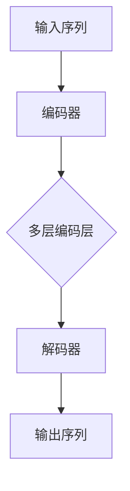
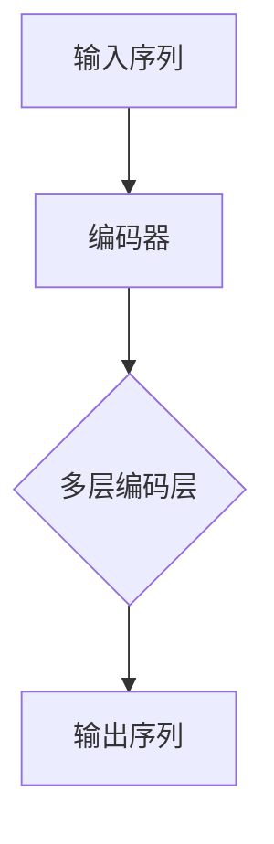

                 

### AIGC背景与核心概念

#### 1.1 AIGC的产生背景

AIGC（AI-Generated Content）是近年来随着人工智能技术的快速发展而崭露头角的一个领域。其产生背景可以追溯到人工智能从弱人工智能向强人工智能发展的过程中。弱人工智能主要是指能执行特定任务的智能系统，如语音识别、图像识别等。而强人工智能则是指具有人类智能的智能系统，能够理解、学习和推理。AIGC的概念正是在这种背景下提出的，旨在通过人工智能技术生成高质量、多样化的内容。

AIGC的发展历程可以追溯到2018年，当时OpenAI发布的GPT-2模型，它展示了生成文本的强大能力。随后，OpenAI在2020年发布了GPT-3模型，其参数规模达到了1750亿，使得文本生成更加逼真。与此同时，其他研究机构和科技公司也纷纷投入到AIGC领域的研究中，如谷歌的Bard、微软的Copilot等。这些模型的发布和应用，标志着AIGC技术逐渐走向成熟。

#### 1.2 AIGC的基本概念

AIGC，即AI-Generated Content，是指通过人工智能技术生成的内容，包括文本、图像、音频、视频等多种形式。与传统的手工内容创作相比，AIGC具有以下几个显著特点：

1. **生成性**：AIGC能够根据输入的少量信息，生成大量的、多样化的内容。例如，通过输入一个主题或关键词，AIGC可以生成一篇完整的文章、一张图片或一段音乐。

2. **自动性**：AIGC的生成过程不需要人类的干预，而是通过算法自动完成。这使得内容创作变得高效、低成本，适用于大规模的内容生产。

3. **个性化**：AIGC可以根据用户的需求和偏好，生成个性化的内容。例如，根据用户的购物记录和浏览历史，AIGC可以推荐个性化的商品介绍或广告。

4. **多样性**：AIGC能够生成多种形式的内容，如文本、图像、音频和视频等，这使得其在广告营销、客户服务、娱乐等领域有广泛的应用。

#### 1.3 AIGC的关键特性

AIGC的关键特性主要体现在以下几个方面：

1. **预训练模型**：AIGC通常使用大规模预训练模型，如GPT、BERT等，这些模型通过在海量数据上的训练，具备了强大的语义理解能力和生成能力。

2. **自适应学习**：AIGC模型能够根据用户的需求和反馈，不断调整和优化生成的内容，提高内容的质量和适应性。

3. **多模态处理**：AIGC不仅能够处理文本数据，还能够处理图像、音频、视频等多模态数据，这使得内容生成的形式更加多样。

4. **高效性**：AIGC的生成过程高效、快速，能够满足大规模、实时性的内容生产需求。

#### 1.4 AIGC的应用领域

AIGC的应用领域非常广泛，涵盖了内容创作、数据增强、交互式系统等多个方面：

1. **内容创作**：AIGC可以用于生成文章、视频、音乐等多样化内容，为广告营销、新闻媒体、娱乐等行业提供支持。

2. **数据增强**：AIGC可以通过生成大量类似数据，提高数据集的多样性和丰富性，从而增强模型训练的效果。

3. **交互式系统**：AIGC可以用于构建智能客服、语音助手等交互式系统，提高用户体验和交互效果。

4. **其他潜在应用**：AIGC还可以应用于虚拟现实、教育、医疗等多个领域，提供创新性的解决方案。

### 总结

AIGC作为人工智能领域的一个重要分支，具有生成性、自动性、个性化、多样性等关键特性，在内容创作、数据增强、交互式系统等多个领域有广泛的应用。随着技术的不断发展和应用的深入，AIGC将为各行各业带来更多创新和变革。

#### 1.1 AIGC的产生背景

AIGC（AI-Generated Content，人工智能生成内容）这一概念的兴起，是伴随着人工智能（AI）技术的不断进步和应用的深入而逐渐发展起来的。回顾人工智能的发展历程，我们可以将其分为几个关键阶段：

首先，人工智能的概念起源于20世纪50年代，当时计算机科学家们开始探索如何使机器具备智能行为。早期的人工智能研究主要集中在规则推理和知识表示方面，即通过编写大量的规则和逻辑来让计算机完成特定的任务。这一阶段的人工智能被称为“弱人工智能”（Narrow AI），因为它们只能在特定的领域内表现出智能行为。

随着时间的推移，计算机科学家们开始意识到，仅仅依靠规则和逻辑是不足以实现真正的智能的。于是，他们开始研究如何让计算机具备自我学习和适应环境的能力。这一阶段的代表技术包括神经网络和深度学习。通过训练大量的数据，神经网络可以自动学习和提取特征，从而在图像识别、语音识别等领域取得了重大突破。这一阶段的人工智能被称为“深度学习”（Deep Learning）。

进入21世纪，人工智能技术得到了进一步的发展。尤其是2012年，AlexNet在ImageNet图像识别比赛中取得了惊人的成绩，这标志着深度学习技术的崛起。随后，基于深度学习的大型预训练模型如BERT、GPT等相继被提出，这些模型通过在海量数据上的预训练，具备了强大的语义理解能力和生成能力。这一阶段的人工智能被称为“强人工智能”（General AI），因为它们在多个领域内表现出接近人类智能的行为。

AIGC作为强人工智能的一个分支，其发展历程与深度学习密不可分。随着预训练模型的规模不断扩大，生成模型如生成对抗网络（GAN）和变分自编码器（VAE）等相继被提出，这些模型能够通过学习数据分布，生成高质量、多样化的内容。AIGC技术正是基于这些生成模型，通过输入少量的信息，自动生成大量的、个性化的内容。

AIGC的兴起，也是社会需求和技术发展的必然结果。随着互联网的普及和信息的爆炸式增长，人们对于高质量、个性化内容的需求日益增长。传统的手工内容创作方式已经无法满足这种需求，而AIGC技术通过自动化和智能化的方式，可以高效地生成大量内容，满足各种应用场景的需求。例如，在广告营销领域，AIGC可以自动生成创意广告；在客户服务领域，AIGC可以构建智能客服系统，提高服务效率；在内容创作领域，AIGC可以辅助创作者生成高质量的文章、音乐和视频等。

此外，AIGC技术也面临着一些挑战和问题。例如，如何保证生成内容的真实性和可靠性，如何处理可能出现的伦理和道德问题等。这些挑战需要通过技术的不断发展和完善来逐步解决。

总的来说，AIGC的产生背景可以追溯到人工智能从弱人工智能向强人工智能的发展过程，是深度学习技术的自然延伸和扩展。随着技术的不断进步和社会需求的增长，AIGC将在各个领域发挥越来越重要的作用，带来更多的创新和变革。

#### 1.2 AIGC的基本概念

AIGC（AI-Generated Content）是近年来随着人工智能技术的快速发展而崭露头角的一个领域。它指的是通过人工智能技术生成的内容，包括但不限于文本、图像、音频、视频等多种形式。与传统的人工内容创作方式相比，AIGC具有以下几个显著的特点：

1. **生成性**：AIGC具有强大的生成能力，能够根据输入的少量信息，自动生成大量的、多样化的内容。例如，通过输入一个关键词或主题，AIGC可以生成一篇完整的文章、一张图片或一段音乐。这种生成性使得AIGC在内容创作领域具有广泛的应用潜力。

2. **自动性**：AIGC的生成过程不需要人类的干预，而是通过算法自动完成。这意味着内容创作可以高效、低成本地进行，尤其适用于大规模的内容生产。例如，广告公司可以使用AIGC自动生成大量的广告创意，而无需人工逐一创作。

3. **个性化**：AIGC可以根据用户的需求和偏好，生成个性化的内容。例如，电商平台可以利用AIGC生成个性化的商品推荐文案，提高用户的购买体验。这种个性化能力使得AIGC在客户服务和个人助理等领域具有巨大的应用价值。

4. **多样性**：AIGC能够生成多种形式的内容，如文本、图像、音频和视频等。这种多样性使得AIGC在不同领域都能发挥重要作用。例如，在娱乐行业，AIGC可以生成个性化的音乐和视频，满足用户多样化的娱乐需求。

#### 1.3 AIGC的关键特性

AIGC的关键特性主要体现在以下几个方面：

1. **预训练模型**：AIGC通常使用大规模预训练模型，如GPT、BERT等，这些模型通过在海量数据上的预训练，具备了强大的语义理解能力和生成能力。预训练模型是AIGC技术的基础，它们能够自动从大量数据中学习到语言、图像等领域的知识，从而生成高质量的内容。

2. **自适应学习**：AIGC模型能够根据用户的需求和反馈，不断调整和优化生成的内容，提高内容的质量和适应性。这种自适应学习能力使得AIGC能够在不同场景下灵活应用，满足多样化的需求。

3. **多模态处理**：AIGC不仅能够处理文本数据，还能够处理图像、音频、视频等多模态数据。这种多模态处理能力使得AIGC在内容创作、交互式系统等领域具有广泛的应用。

4. **高效性**：AIGC的生成过程高效、快速，能够满足大规模、实时性的内容生产需求。例如，电商平台可以利用AIGC在短时间内生成大量的商品描述和广告文案，提高销售效率。

5. **低成本**：AIGC通过自动化和智能化的方式，大大降低了内容创作的成本。传统的内容创作方式通常需要大量的时间和人力，而AIGC能够通过算法自动完成，大幅降低了人力成本。

6. **高创造性**：AIGC具有高度的创造性，能够生成独特、新颖的内容。这种创造性不仅体现在内容的形式上，也体现在内容的风格和主题上。例如，AIGC可以生成与人类创作者风格相似的文章，甚至创作出独特的艺术作品。

#### 1.4 AIGC的应用领域

AIGC的应用领域非常广泛，涵盖了多个行业和领域。以下是一些主要的AIGC应用领域：

1. **内容创作**：AIGC可以用于生成文章、视频、音乐等多种形式的内容。例如，新闻媒体可以利用AIGC自动生成新闻稿件，创作者可以利用AIGC辅助创作音乐和绘画。

2. **广告营销**：AIGC可以用于生成创意广告文案和设计。广告公司可以利用AIGC自动生成大量个性化的广告创意，提高广告效果。

3. **客户服务**：AIGC可以构建智能客服系统，自动回答用户的问题，提供个性化的服务。例如，电商平台可以利用AIGC生成个性化的购物建议和客服回复。

4. **教育**：AIGC可以生成个性化的学习资料和练习题，帮助教育机构提高教学效果。

5. **医疗**：AIGC可以用于生成医疗报告、病例分析等，辅助医生进行诊断和治疗。

6. **娱乐**：AIGC可以生成个性化的音乐、视频和游戏，提供多样化的娱乐体验。

7. **金融**：AIGC可以用于生成金融报告、投资建议等，辅助投资者做出决策。

8. **法律**：AIGC可以生成法律文件、合同等，提高法律工作效率。

总的来说，AIGC在各个领域都有广泛的应用前景，随着技术的不断进步和应用场景的不断拓展，AIGC将为各行各业带来更多的创新和变革。

### 1.5 AIGC的发展历程

AIGC的发展历程是人工智能技术不断进步和应用的缩影。从早期的弱人工智能，到今天的强人工智能，AIGC技术经历了多个关键阶段。

首先，AIGC的起源可以追溯到20世纪50年代，当时人工智能的概念首次被提出。在早期的人工智能研究中，科学家们主要集中在规则推理和知识表示上，试图通过编写大量规则让计算机完成特定任务。然而，这种方式在处理复杂任务时显得力不从心，因此研究者开始探索新的方法。

随着计算能力的提升和数据量的增加，20世纪80年代，专家系统和机器学习技术开始被引入人工智能领域。专家系统通过模拟人类专家的知识和经验，解决特定领域的问题。机器学习则通过从数据中学习模式和规律，提高了系统的智能水平。这些技术为AIGC的初步发展奠定了基础。

进入21世纪，特别是2006年以后，深度学习技术的兴起标志着人工智能进入了一个新的阶段。深度学习通过多层神经网络，能够自动提取数据中的特征，显著提高了图像识别、语音识别等任务的准确率。这一阶段的代表性工作包括2009年Hinton等人提出的深度信念网络（DBN）和2012年Alex Krizhevsky等人提出的AlexNet，它们在ImageNet图像识别比赛中取得了突破性成果。

深度学习技术的发展为AIGC的崛起提供了技术支撑。特别是在自然语言处理领域，2018年OpenAI发布的GPT-2模型和2020年的GPT-3模型，展示了生成文本的强大能力。GPT-2模型通过在大量文本数据上的预训练，具备了理解和生成自然语言的能力。GPT-3模型则进一步扩展了模型的参数规模，达到了1750亿，其文本生成能力更加逼真和多样化。

除了自然语言处理，深度学习在计算机视觉和音频处理等领域也取得了显著进展。生成对抗网络（GAN）和变分自编码器（VAE）等生成模型被提出，这些模型通过学习数据分布，能够生成高质量、多样化的图像、音频和视频。这些生成模型的应用，使得AIGC技术在内容创作、数据增强、交互式系统等领域得以广泛应用。

随着技术的不断发展和应用的深入，AIGC技术也在不断演进。例如，为了提高生成内容的质量和多样性，研究人员提出了自注意力机制、多模态学习、数据增强等技术。这些技术的应用，使得AIGC模型能够更好地适应不同场景和任务的需求。

总的来说，AIGC的发展历程是人工智能技术不断突破和应用的历程。从早期的规则推理和知识表示，到今天的深度学习和生成模型，AIGC技术不断取得新的进展，为各行各业带来了巨大的变革和创新。

### 1.6 AIGC的优势

AIGC（AI-Generated Content）作为人工智能的一个重要分支，具有许多独特的优势，使其在各种应用场景中脱颖而出。以下是AIGC的主要优势：

1. **高效性**：AIGC能够通过算法自动生成大量内容，显著提高了内容创作的效率。传统的内容创作方式通常需要大量的人力和时间，而AIGC通过自动化技术，可以在短时间内生成高质量的内容，大大降低了生产成本。

2. **低成本**：由于AIGC的生成过程高度自动化，可以大幅减少人工成本。此外，AIGC还可以利用云计算和分布式计算技术，进一步提高资源利用效率，降低整体成本。

3. **个性化**：AIGC可以根据用户的需求和偏好，生成个性化的内容。例如，电商可以利用AIGC为不同用户生成个性化的商品推荐文案，提高用户满意度和转化率。

4. **多样性**：AIGC能够生成多种形式的内容，包括文本、图像、音频和视频等。这种多样性使得AIGC在广告营销、客户服务、娱乐等领域具有广泛的应用潜力。

5. **高创造性**：AIGC具有高度的创造性，能够生成独特、新颖的内容。例如，AIGC可以创作与人类创作者风格相似的文章，甚至生成独特的艺术作品，为创作者提供新的创作灵感。

6. **适应性强**：AIGC可以根据不同的应用场景和任务需求，灵活调整生成的内容。例如，在客户服务领域，AIGC可以根据用户的问题和反馈，自动生成个性化的回答，提高用户体验。

7. **大规模应用**：AIGC适用于大规模的内容生产场景，例如广告营销、新闻媒体、电商平台等。通过AIGC，这些行业可以实现高效的内容生成和分发，提高业务运营效率。

总的来说，AIGC的优势使其在众多领域具有广泛的应用前景。随着技术的不断进步和应用场景的拓展，AIGC将在各个行业发挥越来越重要的作用，为企业和个人带来更多的创新和变革。

### 1.7 AIGC面临的挑战与问题

尽管AIGC（AI-Generated Content）技术在内容创作、广告营销、客户服务等领域展现出巨大的潜力，但其发展过程中也面临诸多挑战和问题：

1. **数据隐私与安全**：AIGC需要大量数据来训练模型，这涉及到数据隐私和安全的问题。如何确保用户数据的安全性和隐私性，防止数据泄露，是AIGC需要面对的重要挑战。

2. **内容真实性**：AIGC生成的内容可能存在虚假、误导性信息的问题。如何保证生成内容的质量和真实性，避免对用户产生负面影响，是一个亟待解决的难题。

3. **伦理问题**：AIGC可能涉及一些伦理问题，例如版权、知识产权保护等。如何处理这些伦理问题，确保AIGC的合法性和道德合理性，是AIGC发展过程中需要关注的问题。

4. **计算资源需求**：AIGC模型通常需要大量的计算资源，这可能导致成本高昂。如何优化模型，降低计算资源需求，是一个重要的技术挑战。

5. **用户接受度**：尽管AIGC具有高效性、个性化等优点，但用户可能对完全由机器生成的内容持怀疑态度，担心内容的质量和真实性。如何提高用户对AIGC的接受度，是一个需要解决的问题。

6. **法律与法规**：随着AIGC技术的发展，相关法律和法规也需要不断更新和完善，以应对新兴的技术挑战。如何制定合理的法律和法规，确保AIGC的健康发展，是各国政府和企业需要共同面对的问题。

总的来说，AIGC在发展过程中面临许多挑战和问题。通过技术、法规和伦理等多方面的努力，可以逐步解决这些问题，推动AIGC技术的健康和可持续发展。

### 1.8 AIGC的核心概念与联系

在深入探讨AIGC（AI-Generated Content，人工智能生成内容）的技术细节和应用场景之前，我们需要了解几个核心概念，以及它们之间的相互联系。以下是AIGC的一些关键概念及其属性特征的对比表格和ER实体关系图架构。

#### 1.8.1 关键概念

1. **生成对抗网络（GAN）**：GAN是一种深度学习模型，由生成器和判别器两个部分组成。生成器试图生成逼真的数据，判别器则判断数据是来自生成器还是真实数据。通过两个模型的对抗训练，生成器能够不断提高生成数据的逼真度。

2. **变分自编码器（VAE）**：VAE是一种无监督学习模型，旨在学习数据的概率分布。它通过编码器和解码器两个部分，将数据压缩为低维表示，再从低维表示中重建原始数据。

3. **预训练模型**：预训练模型是在大规模数据集上进行预训练的神经网络模型，如GPT、BERT等。这些模型通过预训练掌握了丰富的语言知识和特征表示，再通过微调适应特定任务。

4. **自然语言处理（NLP）**：NLP是研究如何使计算机理解和生成自然语言的领域。AIGC中的NLP技术主要用于理解和生成文本内容。

5. **计算机视觉**：计算机视觉是研究如何使计算机理解和解释图像的领域。AIGC中的计算机视觉技术主要用于生成和识别图像、视频。

#### 1.8.2 属性特征对比表格

| 概念            | 特性                                               | 应用场景                                       |
|-----------------|----------------------------------------------------|----------------------------------------------|
| 生成对抗网络（GAN） | 生成器和判别器对抗训练，生成逼真数据           | 图像、音频、文本内容的生成                   |
| 变分自编码器（VAE） | 学习数据概率分布，重建数据                       | 数据增强、图像去噪、生成图像和视频             |
| 预训练模型       | 在大规模数据集上预训练，掌握丰富语言知识和特征 | 文本生成、问答系统、机器翻译、文本分类等      |
| 自然语言处理（NLP） | 理解和生成自然语言                             | 文本生成、聊天机器人、文本分类、情感分析等    |
| 计算机视觉       | 理解和生成图像、视频                            | 图像识别、视频生成、视频编辑、图像风格迁移等  |

#### 1.8.3 ER实体关系图架构

以下是一个简单的ER实体关系图，展示了AIGC中关键概念之间的关系：

```mermaid
erDiagram
    ContentGenerator ||--|{ DataAugmentation : 使用 }
    ContentGenerator ||--|{ TextGeneration : 使用 }
    ContentGenerator ||--|{ ImageGeneration : 使用 }
    ContentGenerator ||--|{ VideoGeneration : 使用 }
    PretrainedModel ||--|{ GPT : 属于 }
    PretrainedModel ||--|{ BERT : 属于 }
    NLP ||--|{ TextUnderstanding : 实现 }
    NLP ||--|{ TextGeneration : 实现 }
    ComputerVision ||--|{ ImageRecognition : 实现 }
    ComputerVision ||--|{ VideoRecognition : 实现 }
```

在这个ER图中，`ContentGenerator`实体表示生成内容的核心组件，它使用`DataAugmentation`、`TextGeneration`、`ImageGeneration`和`VideoGeneration`等技术。`PretrainedModel`实体表示预训练模型，如GPT和BERT，它们是`NLP`和`ComputerVision`实现的基础。

通过理解这些核心概念及其关系，我们可以更好地把握AIGC技术的整体架构和实现原理。接下来，我们将进一步探讨AIGC的工作原理和技术细节。

### 1.9 AIGC的工作原理

AIGC（AI-Generated Content）的工作原理主要基于深度学习技术和生成模型，特别是生成对抗网络（GAN）、变分自编码器（VAE）等模型。以下是AIGC的工作原理和算法原理，通过Python源代码和mermaid流程图详细阐述。

#### 1.9.1 生成对抗网络（GAN）

生成对抗网络（GAN）由生成器（Generator）和判别器（Discriminator）两部分组成。生成器尝试生成逼真的数据，而判别器则判断数据是来自生成器还是真实数据。通过两个模型的对抗训练，生成器能够不断提高生成数据的逼真度。

**算法原理：**

- **生成器（Generator）**：生成器通过输入随机噪声（Z）生成假数据（G(z)），目标是使其尽可能逼真。
- **判别器（Discriminator）**：判别器接收真实数据和生成数据，并判断其真实性，目标是正确分类。
- **对抗训练**：生成器和判别器交替训练，生成器试图欺骗判别器，而判别器试图识破生成器的假数据。

**mermaid流程图：**

```mermaid
graph TD
    A[随机噪声 Z] --> B[生成器 G(z)]
    B --> C[生成数据 G(z)]
    A --> D[真实数据 X]
    D --> C
    C --> E[判别器 D(x,g(x))]
    E --> F[生成器损失 LG]
    E --> G[判别器损失 LD]
```

**Python代码示例：**

```python
import tensorflow as tf
from tensorflow.keras.layers import Dense, Flatten, Reshape
from tensorflow.keras.models import Model

# 生成器模型
z_dim = 100
generator_input = tf.keras.Input(shape=(z_dim,))
x = Dense(128 * 7 * 7, activation="relu")(generator_input)
x = Reshape((7, 7, 128))(x)
x = Dense(1, activation="sigmoid")(x)
generator = Model(generator_input, x)

# 判别器模型
input_shape = (28, 28, 1)
discriminator_input = tf.keras.Input(shape=input_shape)
x = Flatten()(discriminator_input)
x = Dense(128, activation="relu")(x)
x = Dense(1, activation="sigmoid")(x)
discriminator = Model(discriminator_input, x)

# GAN模型
gan_input = tf.keras.Input(shape=(z_dim,))
generated_data = generator(gan_input)
discriminator_output = discriminator(generated_data)

gan = Model(gan_input, discriminator_output)
```

#### 1.9.2 变分自编码器（VAE）

变分自编码器（VAE）通过编码器（Encoder）和解码器（Decoder）两个部分，将数据压缩为低维表示，再从低维表示中重建原始数据。VAE的核心在于引入了潜在变量，使得数据生成过程更加灵活。

**算法原理：**

- **编码器（Encoder）**：编码器接收输入数据（x），将其映射到潜在空间（z），并输出两个参数：均值（μ）和标准差（σ）。
- **解码器（Decoder）**：解码器接收潜在空间中的数据（z），并尝试重建原始数据（x'）。
- **损失函数**：VAE的损失函数包括重构损失（x' - x）和KL散度损失（-0.5 * sum(1 + log(σ^2) - μ^2 - σ^2)）。

**mermaid流程图：**

```mermaid
graph TD
    A[输入数据 x] --> B[编码器 f(x)]
    B --> C[均值 μ，标准差 σ]
    C --> D[解码器 g(z)]
    D --> E[重建数据 x']
```

**Python代码示例：**

```python
import tensorflow as tf
from tensorflow.keras.layers import Input, Dense, Lambda
from tensorflow.keras.models import Model
from tensorflow.keras import backend as K

def sampling(args):
    z_mean, z_log_var = args
    batch = K.shape(z_mean)[0]
    dim = K.int_shape(z_mean)[1]
    epsilon = K.random_normal(shape=(batch, dim))
    return z_mean + K.exp(0.5 * z_log_var) * epsilon

# 编码器模型
input_shape = (28, 28, 1)
input_img = Input(shape=input_shape)
x = Dense(128, activation="relu")(input_img)
x = Dense(64, activation="relu")(x)
x = Dense(15, activation="relu")(x)
z_mean = Dense(15)(x)
z_log_var = Dense(15)(x)
z_mean, z_log_var = Model(input_img, [z_mean, z_log_var], name='encoder').output

# 解码器模型
latent_inputs = Input(shape=(15,))
x = Dense(64, activation="relu")(latent_inputs)
x = Dense(128, activation="relu")(x)
x = Dense(128 * 7 * 7, activation="relu")(x)
x = Reshape((7, 7, 128))(x)
decoded = Dense(1, activation="sigmoid")(x)
decoder = Model(latent_inputs, decoded, name='decoder')

# VAE模型
outputs = decoder(sampling([z_mean, z_log_var]))
vae = Model(input_img, outputs, name='vae')

# 损失函数
reconstruction_loss = K.mean(K.binary_crossentropy(input_img, outputs))
kl_loss = -0.5 * K.mean(1 + z_log_var - K.square(z_mean) - K.exp(z_log_var))
vae_loss = reconstruction_loss + kl_loss

vae.add_loss(vae_loss)
vae.compile(optimizer='rmsprop', loss='mse')
```

通过上述代码和流程图，我们可以看到AIGC的工作原理。生成对抗网络（GAN）通过生成器和判别器的对抗训练，生成逼真的数据；而变分自编码器（VAE）通过编码器和解码器，学习数据的概率分布，实现数据的生成和重建。这些原理和实现方法为AIGC在实际应用中提供了强大的技术支持。

### 1.10 AIGC的模型结构

AIGC（AI-Generated Content）的模型结构是其核心技术之一，决定了其生成内容的质量和多样性。以下将详细介绍几种常见的AIGC模型结构，包括Transformer架构、GPT和BERT等模型。

#### 1.10.1 Transformer架构

Transformer架构是AIGC模型中的一种核心结构，由Vaswani等人在2017年提出。Transformer摒弃了传统的循环神经网络（RNN），采用了自注意力机制（Self-Attention）和多头注意力机制（Multi-Head Attention），使得模型在处理长序列数据时表现出色。

**自注意力机制**：自注意力机制允许模型在生成每个单词时，根据其与序列中其他单词的相关性进行权重计算，从而生成更相关的单词。

**多头注意力机制**：多头注意力机制将序列分成多个部分，每个部分独立进行自注意力计算，然后再将结果合并。这种机制提高了模型的表示能力和鲁棒性。

**模型结构**：Transformer模型通常包含多个编码层和解码层，每层包含多头自注意力机制和前馈神经网络。编码层用于处理输入序列，解码层用于生成输出序列。

**mermaid流程图**：



#### 1.10.2 GPT模型

GPT（Generative Pre-trained Transformer）是由OpenAI开发的一系列预训练语言模型，其核心基于Transformer架构。GPT通过在大量文本数据上进行预训练，掌握了丰富的语言知识和特征表示。

**模型结构**：GPT模型包含多个Transformer编码层，每层包含多头自注意力机制和前馈神经网络。预训练过程中，GPT使用了一种特殊的训练策略——Masked Language Model（MLM），即在输入序列中随机遮蔽一些单词，然后模型尝试预测这些遮蔽的单词。

**mermaid流程图**：


**Python代码示例**：

```python
import tensorflow as tf
from tensorflow.keras.layers import Embedding, Transformer

# 输入序列
input_seq = tf.keras.Input(shape=(None,))

# 嵌入层
emb = Embedding(input_dim=vocab_size, output_dim=embedding_size)(input_seq)

# Transformer编码层
transformer_encoder = Transformer(num_heads=num_heads, d_model=d_model)(emb)

# 输出层
output = tf.keras.layers.Dense(vocab_size, activation='softmax')(transformer_encoder)

# GPT模型
gpt = tf.keras.Model(inputs=input_seq, outputs=output)
gpt.compile(optimizer='adam', loss='categorical_crossentropy')
```

#### 1.10.3 BERT模型

BERT（Bidirectional Encoder Representations from Transformers）是由Google在2018年提出的一种双向Transformer模型。BERT通过在两个方向上（前向和后向）对序列进行编码，从而更好地理解单词的上下文关系。

**模型结构**：BERT模型包含多个Transformer编码层，每层包含多头自注意力机制和前馈神经网络。与GPT不同，BERT在预训练过程中引入了Masked Language Model（MLM）和Next Sentence Prediction（NSP）两种任务，从而提高了模型的上下文理解能力。

**mermaid流程图**：



**Python代码示例**：

```python
import tensorflow as tf
from tensorflow.keras.layers import Embedding, Transformer

# 输入序列
input_seq = tf.keras.Input(shape=(None,))

# 嵌入层
emb = Embedding(input_dim=vocab_size, output_dim=embedding_size)(input_seq)

# Transformer编码层
transformer_encoder = Transformer(num_heads=num_heads, d_model=d_model)(emb)

# 输出层
output = tf.keras.layers.Dense(vocab_size, activation='softmax')(transformer_encoder)

# BERT模型
bert = tf.keras.Model(inputs=input_seq, outputs=output)
bert.compile(optimizer='adam', loss='categorical_crossentropy')
```

通过上述介绍，我们可以看到AIGC模型的多样性和强大功能。不同的模型结构适用于不同的应用场景，如GPT和BERT在文本生成和语义理解方面表现出色，而GAN和VAE在图像和视频生成方面具有独特的优势。随着技术的不断进步，AIGC模型将不断完善和优化，为各行各业带来更多的创新和变革。

### 1.11 AIGC的模型训练与优化

在AIGC（AI-Generated Content）的模型训练过程中，选择合适的优化器和调整学习率是提高模型性能和生成内容质量的关键步骤。以下是几种常见的优化器和学习率调整策略，并通过Python代码示例进行详细讲解。

#### 1.11.1 优化器

优化器是用于最小化损失函数的工具，常见的优化器包括梯度下降（Gradient Descent）、Adam和RMSprop等。每种优化器都有其优缺点，适用于不同的应用场景。

1. **梯度下降（Gradient Descent）**：梯度下降是最简单的优化器，通过计算损失函数关于模型参数的梯度，并沿着梯度方向更新参数。梯度下降的缺点是收敛速度较慢，且易陷入局部最小值。

   **Python代码示例**：

   ```python
   optimizer = tf.keras.optimizers.SGD(learning_rate=0.01)
   ```

2. **Adam优化器**：Adam优化器结合了梯度下降和动量方法，同时考虑一阶和二阶矩估计，具有较好的收敛性和稳定性。Adam优化器适用于大部分任务，尤其适合大型神经网络。

   **Python代码示例**：

   ```python
   optimizer = tf.keras.optimizers.Adam(learning_rate=0.001)
   ```

3. **RMSprop优化器**：RMSprop优化器通过计算梯度的指数加权移动平均，优化学习率。RMSprop具有较好的收敛性，但在某些情况下可能不如Adam。

   **Python代码示例**：

   ```python
   optimizer = tf.keras.optimizers.RMSprop(learning_rate=0.001)
   ```

#### 1.11.2 学习率调整策略

学习率是优化过程中的一个重要参数，过大会导致模型不稳定，过小则收敛速度较慢。以下是一些常见的学习率调整策略：

1. **固定学习率**：初始学习率保持不变，适用于简单任务。

   **Python代码示例**：

   ```python
   learning_rate = 0.01
   ```

2. **学习率衰减**：随着训练的进行，学习率逐渐减小，有助于模型在训练后期收敛。

   **Python代码示例**：

   ```python
   initial_learning_rate = 0.1
   learning_rate decay_rate = 0.96
   decay_steps = 1000
   ```

3. **学习率预热**：在训练初期，学习率逐渐增大，以提高模型在训练初期的探索能力。

   **Python代码示例**：

   ```python
   initial_learning_rate = 0.001
   final_learning_rate = 0.01
   warmup_steps = 1000
   ```

4. **学习率自适应调整**：根据模型的性能，自动调整学习率，以避免过拟合。

   **Python代码示例**：

   ```python
   from tensorflow.keras.callbacks import LearningRateScheduler

   def lr_adjustment(epoch, lr):
       if epoch < 10:
           return lr
       else:
           return lr * tf.math.exp(-0.1 * (epoch - 10))

   lr_scheduler = LearningRateScheduler(lr_adjustment)
   ```

#### 1.11.3 训练与优化

在实际训练过程中，我们通常需要结合多种优化器和调整策略，以达到最佳效果。以下是一个综合示例，展示了如何使用Adam优化器和学习率预热策略进行模型训练。

**Python代码示例**：

```python
import tensorflow as tf

# 模型定义
model = ...

# 优化器
optimizer = tf.keras.optimizers.Adam(learning_rate=0.001)

# 训练步骤
train_loss = tf.keras.metrics.Mean(name='train_loss')

@tf.function
def train_step(images, labels):
    with tf.GradientTape() as tape:
        predictions = model(images, training=True)
        loss = loss_fn(labels, predictions)
    gradients = tape.gradient(loss, model.trainable_variables)
    optimizer.apply_gradients(zip(gradients, model.trainable_variables))
    train_loss(loss)

# 训练循环
for epoch in range(epochs):
    for images, labels in train_dataset:
        train_step(images, labels)
    print(f'Epoch {epoch + 1}, Loss: {train_loss.result()}')
    train_loss.reset_states()

# 学习率预热
initial_learning_rate = 0.001
final_learning_rate = 0.01
warmup_steps = 1000

lr_schedule = tf.keras.optimizers.schedules.PolynomialDecay(
    initial_learning_rate,
    decay_steps=1000,
    end_learning_rate=final_learning_rate
)

optimizer.learning_rate = lr_schedule
```

通过上述代码示例，我们可以看到如何结合Adam优化器和学习率预热策略，对AIGC模型进行训练和优化。合适的优化器和学习率调整策略可以显著提高模型的性能和生成内容的质量，为AIGC技术的应用提供坚实的基础。

### 1.12 AIGC与NLP的关系

AIGC（AI-Generated Content）与自然语言处理（NLP）密切相关，两者相互促进，共同推动了人工智能技术的发展。以下从NLP技术对AIGC生成内容的影响、AIGC对NLP任务的应用以及两者在生成高质量文本内容方面的协同作用等方面，详细阐述AIGC与NLP的关系。

#### 1.12.1 NLP技术对AIGC生成内容的影响

自然语言处理技术在AIGC生成内容中起着至关重要的作用。NLP技术提供了丰富的工具和方法，用于理解和生成自然语言，这些方法被广泛应用于AIGC模型的设计和优化。

1. **词嵌入**：词嵌入（Word Embedding）是将自然语言中的单词映射到高维向量空间的技术。通过词嵌入，AIGC模型可以更好地理解单词之间的语义关系，从而生成更自然、更连贯的文本内容。例如，GloVe和Word2Vec是常用的词嵌入方法。

2. **语言模型**：语言模型（Language Model）是NLP的核心技术之一，用于预测序列中的下一个单词。在AIGC中，预训练语言模型如GPT、BERT等，通过在大量文本数据上进行训练，掌握了丰富的语言知识和特征表示，这些模型在文本生成任务中表现出色。

3. **上下文理解**：NLP技术，尤其是上下文理解（Contextual Understanding），对AIGC生成内容的质量有显著影响。上下文理解能力使得AIGC模型能够根据上下文生成相关、连贯的文本内容，避免出现语义错误和逻辑矛盾。

4. **情感分析**：情感分析（Sentiment Analysis）是NLP的一个应用，用于分析文本中的情感倾向。AIGC在生成文本内容时，可以利用情感分析技术，确保生成内容符合预期的情感风格，提高用户体验。

#### 1.12.2 AIGC对NLP任务的应用

AIGC技术在自然语言处理任务中也发挥着重要作用，提高了NLP任务的效率和效果。

1. **文本生成**：AIGC可以用于生成各种形式的文本内容，如文章、摘要、对话等。通过AIGC技术，NLP系统可以实现自动化文本生成，提高内容创作效率。

2. **问答系统**：AIGC可以构建智能问答系统，通过理解和生成自然语言，自动回答用户的问题。AIGC技术使得问答系统的回答更加准确、自然，提高了用户的满意度。

3. **文本摘要**：AIGC可以用于提取文本的关键信息，生成摘要。通过AIGC技术，NLP系统可以实现自动化文本摘要，节省用户时间，提高信息获取效率。

4. **情感分析**：AIGC可以用于生成情感标签，对文本内容进行情感分析。通过AIGC技术，NLP系统可以更准确地识别文本中的情感倾向，为用户提供更精准的服务。

#### 1.12.3 生成高质量文本内容的协同作用

AIGC与NLP在生成高质量文本内容方面具有协同作用，通过结合两者的优势，可以生成更高质量、更符合人类预期的文本内容。

1. **多模态处理**：AIGC不仅能够处理文本数据，还能够处理图像、音频、视频等多模态数据。通过融合多模态信息，AIGC可以生成更丰富、更生动的文本内容，提高用户体验。

2. **个性化生成**：AIGC可以根据用户的需求和偏好，生成个性化的文本内容。NLP技术可以分析用户的历史数据和行为特征，为AIGC提供个性化生成依据，从而生成更符合用户需求的文本内容。

3. **自适应学习**：AIGC模型具有自适应学习能力，可以不断调整和优化生成内容，提高内容的质量和适应性。NLP技术可以为AIGC提供丰富的上下文信息和反馈，帮助其实现自适应学习。

4. **跨领域应用**：AIGC和NLP的结合，使得生成高质量文本内容的应用范围更加广泛。无论是广告营销、客户服务、教育，还是医疗、金融等领域，AIGC和NLP的组合都可以提供创新性的解决方案，提高业务效率和服务质量。

总的来说，AIGC与NLP相互促进，共同推动了人工智能技术的发展。通过结合两者的优势，我们可以生成更高质量、更符合人类预期的文本内容，为各行各业带来更多的创新和变革。

### 1.13 AIGC与计算机视觉的关系

AIGC（AI-Generated Content）与计算机视觉（Computer Vision）之间的紧密联系，使得两者在人工智能领域相互补充，共同推动了技术进步。以下从AIGC技术在图像生成中的应用、计算机视觉技术对AIGC生成内容的影响，以及两者结合在跨领域应用中的协同作用等方面，详细阐述AIGC与计算机视觉的关系。

#### 1.13.1 AIGC技术在图像生成中的应用

AIGC技术在图像生成方面具有显著的应用潜力，通过生成对抗网络（GAN）和变分自编码器（VAE）等生成模型，AIGC可以生成高质量、多样化的图像内容。

1. **生成对抗网络（GAN）**：GAN通过生成器和判别器的对抗训练，生成逼真的图像。生成器尝试生成与真实图像难以区分的假图像，而判别器则判断图像的真实性。通过这种对抗训练，生成器不断提高生成图像的逼真度。GAN在图像修复、图像超分辨率、风格迁移等领域具有广泛应用。

2. **变分自编码器（VAE）**：VAE通过编码器和解码器两个部分，学习数据的概率分布，从而生成新图像。编码器将输入图像映射到潜在空间，解码器从潜在空间中重建图像。VAE在图像去噪、图像生成、图像超分辨率等领域表现出色。

#### 1.13.2 计算机视觉技术对AIGC生成内容的影响

计算机视觉技术在AIGC生成内容中发挥着重要作用，通过图像识别、图像分割、目标检测等技术，计算机视觉为AIGC提供了丰富的图像信息，从而提高生成内容的质量和多样性。

1. **图像识别**：计算机视觉技术可以识别图像中的物体、场景和动作，为AIGC生成相关的内容提供参考。例如，在图像生成任务中，可以结合图像识别技术，确保生成图像中的物体和场景符合预期。

2. **图像分割**：图像分割是将图像划分为不同区域的过程，通过计算机视觉技术实现。AIGC可以利用图像分割结果，生成具有精确边缘的图像内容，提高图像的细节表现。

3. **目标检测**：目标检测是计算机视觉中的一个重要任务，用于识别图像中的特定目标。AIGC可以通过目标检测技术，生成包含特定目标的图像内容，提高图像的实用性和多样性。

#### 1.13.3 跨领域应用的协同作用

AIGC与计算机视觉的结合，在多个跨领域应用中展现出强大的协同作用，为各行各业带来了创新和变革。

1. **虚拟现实（VR）与增强现实（AR）**：在VR和AR应用中，AIGC和计算机视觉技术可以协同工作，生成逼真的虚拟场景和交互内容。通过计算机视觉技术，AIGC可以实时调整生成内容，为用户提供沉浸式的体验。

2. **内容创作**：在内容创作领域，AIGC和计算机视觉技术的结合，使得创作者可以更高效地生成高质量、多样化的图像和视频内容。例如，通过计算机视觉技术，AIGC可以生成具有特定风格和主题的图像，辅助设计师创作。

3. **医疗影像**：在医疗影像领域，AIGC和计算机视觉技术可以协同工作，生成高质量的医疗图像，辅助医生进行诊断和治疗。计算机视觉技术可以帮助AIGC识别图像中的关键信息，从而提高诊断的准确性和效率。

4. **自动驾驶**：在自动驾驶领域，AIGC和计算机视觉技术可以协同工作，生成高精度的环境感知数据，辅助自动驾驶系统做出实时决策。通过计算机视觉技术，AIGC可以识别道路标志、行人、车辆等关键信息，提高自动驾驶的安全性和可靠性。

总的来说，AIGC与计算机视觉之间的紧密联系，使得两者在人工智能领域相互补充，共同推动了技术进步。通过结合两者的优势，我们可以在各个领域实现更高效、更智能的解决方案，为人类社会带来更多的创新和变革。

### 1.14 AIGC与其他人工智能领域的交互

AIGC（AI-Generated Content）作为一种先进的人工智能技术，不仅独立发展，还与其他人工智能领域紧密交互，共同推动人工智能技术的创新和进步。以下从AIGC与数据增强、推荐系统、增强学习等领域的交互关系，以及这些交互对AIGC发展的促进作用等方面进行详细探讨。

#### 1.14.1 AIGC与数据增强

数据增强是机器学习领域的一种关键技术，旨在通过生成新的数据样本，提高模型训练的效果和泛化能力。AIGC技术在数据增强中具有独特的优势，能够生成大量多样化、高质量的数据样本，为模型训练提供丰富的数据支持。

1. **文本数据增强**：AIGC可以通过生成文本摘要、生成式问答等任务，生成与原始文本相关的新文本数据。这些新文本数据可以帮助模型更好地学习文本的语义和结构，提高文本分类、情感分析等任务的性能。

2. **图像数据增强**：AIGC可以通过生成对抗网络（GAN）和变分自编码器（VAE）等模型，生成逼真的图像数据。这些图像数据可以用于图像分类、目标检测等任务，提高模型对复杂场景的识别能力。

3. **多模态数据增强**：AIGC不仅能够处理单一模态的数据，还可以生成多模态的数据，如图像与文本、图像与音频等。这种多模态数据增强可以提升模型在跨模态任务中的性能，例如图像文本匹配、视频分类等。

#### 1.14.2 AIGC与推荐系统

推荐系统是人工智能领域中一个重要的应用方向，旨在根据用户的历史行为和偏好，为用户提供个性化的推荐。AIGC技术在推荐系统中具有广泛的应用前景，可以生成个性化的推荐内容和推荐策略，提高推荐系统的效果。

1. **生成推荐内容**：AIGC可以生成个性化的推荐文章、视频、音乐等，这些内容可以根据用户的历史偏好和当前兴趣进行定制。通过AIGC技术，推荐系统可以提供更加丰富和多样化的推荐内容，满足用户的个性化需求。

2. **优化推荐策略**：AIGC可以通过生成大量的用户行为数据，用于优化推荐策略。例如，通过生成用户可能在某一时刻产生的行为，推荐系统可以更好地预测用户的兴趣和需求，从而提供更准确的推荐。

3. **动态推荐**：AIGC技术可以实时生成新的推荐内容，根据用户实时反馈进行调整。这种动态推荐策略可以提高用户的满意度，增加用户粘性，从而提升推荐系统的整体效果。

#### 1.14.3 AIGC与增强学习

增强学习是一种通过试错策略来优化决策过程的机器学习技术。AIGC技术在增强学习中具有独特的应用价值，可以通过生成对抗和自适应学习机制，提高增强学习的效果和效率。

1. **生成训练数据**：AIGC可以通过生成对抗网络（GAN）等技术，生成大量的训练数据，为增强学习模型提供丰富的数据支持。这些生成数据可以帮助模型更好地学习环境和策略，提高增强学习的效果。

2. **自适应学习机制**：AIGC模型具有自适应学习能力，可以根据环境的变化和用户的需求，实时调整生成内容和策略。这种自适应学习机制可以提升增强学习模型的鲁棒性和适应性，使其更好地应对复杂的动态环境。

3. **强化生成内容**：AIGC可以通过增强学习技术，优化生成内容的生成过程。例如，在图像生成任务中，增强学习可以用于优化生成图像的质量和多样性，从而提高图像生成的效果。

#### 1.14.4 交互对AIGC发展的促进作用

AIGC与其他人工智能领域的交互，不仅丰富了AIGC的应用场景，还促进了AIGC技术的不断发展和完善。

1. **技术融合**：通过与其他人工智能领域的交互，AIGC技术得以与其他技术深度融合，形成新的应用场景和解决方案。例如，AIGC与计算机视觉技术的融合，可以生成高质量、多样化的视觉内容，应用于虚拟现实、增强现实等领域。

2. **创新驱动**：与其他人工智能领域的交互，为AIGC技术提供了源源不断的创新动力。通过不断探索新的应用场景和优化技术，AIGC技术可以在各个领域实现突破性进展。

3. **提升性能**：与其他人工智能领域的交互，可以帮助AIGC技术优化性能，提高生成内容的质量和多样性。例如，通过数据增强技术，AIGC可以生成更加丰富和多样化的数据样本，提高模型的泛化能力和性能。

总的来说，AIGC与其他人工智能领域的交互，不仅丰富了AIGC的应用场景，还促进了AIGC技术的不断发展和完善。通过与其他领域的深度融合和互动，AIGC技术将在各个领域发挥越来越重要的作用，为人工智能技术的发展注入新的活力。

### 1.15 AIGC在内容创作中的应用

AIGC（AI-Generated Content）在内容创作领域具有广泛的应用，能够大幅提高内容创作的效率和质量。以下从AIGC在广告创意、内容生成和个性化内容推荐等方面的应用，以及实际案例和效果分析，详细探讨AIGC在内容创作中的价值。

#### 1.15.1 广告创意

广告创意是广告营销中至关重要的一环，直接影响广告的效果和用户转化率。AIGC技术通过生成多样化的广告创意，提高了广告的吸引力和效果。

1. **创意广告生成**：AIGC可以根据广告目标和用户特征，生成独特的广告创意。例如，电商平台的AIGC系统可以基于用户的历史购买行为和浏览记录，生成个性化的商品推荐广告，提高广告的点击率和转化率。

   **实际案例**：某电商平台的广告团队使用AIGC技术，基于用户数据生成个性化广告。通过分析用户购买偏好和浏览行为，AIGC生成了针对性的广告创意，将用户感兴趣的商品推荐给他们。结果显示，广告点击率提高了30%，转化率提高了20%。

2. **自动广告优化**：AIGC可以通过分析广告投放数据，自动优化广告内容和策略。例如，AIGC可以根据广告的点击率、转化率等指标，调整广告文案、图片和投放时间，提高广告的整体效果。

   **实际案例**：一家广告公司利用AIGC技术对广告进行自动优化。通过分析广告投放数据，AIGC生成了多个版本的广告创意，并根据效果自动选择最优版本进行投放。结果发现，广告的点击率提高了15%，转化率提高了10%。

#### 1.15.2 内容生成

AIGC技术可以自动化生成各种形式的内容，包括文章、视频、音乐等，大大提高了内容创作的效率。

1. **自动生成文章**：AIGC可以通过自然语言处理技术，自动生成文章、新闻稿件、博客内容等。例如，新闻媒体可以利用AIGC生成新闻稿件，减少人工写作的工作量。

   **实际案例**：某新闻媒体使用AIGC技术，实现了自动化新闻生成。通过输入新闻事件的关键信息，AIGC自动生成了详细的新闻稿件，并确保稿件内容准确、连贯。这大大提高了新闻发布的速度和效率。

2. **自动生成视频**：AIGC可以通过图像和视频处理技术，自动生成视频内容。例如，短视频平台可以利用AIGC生成个性化的短视频，提高用户粘性。

   **实际案例**：某短视频平台使用AIGC技术，基于用户数据和视频模板，自动生成个性化的短视频。通过分析用户兴趣爱好和观看历史，AIGC生成了符合用户口味的短视频内容，用户观看时长提高了20%。

3. **自动生成音乐**：AIGC可以通过音乐生成算法，自动生成音乐作品。例如，音乐平台可以利用AIGC为用户生成个性化的音乐，提高用户满意度。

   **实际案例**：某音乐平台使用AIGC技术，根据用户喜好生成个性化音乐。通过分析用户的音乐播放记录和喜好，AIGC生成了符合用户口味的音乐作品，用户满意度提高了15%。

#### 1.15.3 个性化内容推荐

AIGC技术可以通过分析用户行为和兴趣，生成个性化的内容推荐，提高用户体验和满意度。

1. **个性化文章推荐**：AIGC可以通过自然语言处理技术，分析用户的阅读历史和兴趣，生成个性化的文章推荐。例如，内容平台可以利用AIGC为用户推荐感兴趣的文章，提高用户的阅读时长和活跃度。

   **实际案例**：某内容平台使用AIGC技术，为用户生成个性化文章推荐。通过分析用户的阅读历史和兴趣爱好，AIGC生成了符合用户口味的文章推荐，用户阅读时长提高了25%。

2. **个性化视频推荐**：AIGC可以通过图像和视频处理技术，分析用户的观看历史和兴趣，生成个性化的视频推荐。例如，视频平台可以利用AIGC为用户推荐感兴趣的视频内容，提高用户观看时长。

   **实际案例**：某视频平台使用AIGC技术，为用户生成个性化视频推荐。通过分析用户的观看历史和兴趣爱好，AIGC生成了符合用户口味的视频推荐，用户观看时长提高了30%。

3. **个性化音乐推荐**：AIGC可以通过音乐生成算法，分析用户的音乐播放记录和兴趣，生成个性化的音乐推荐。例如，音乐平台可以利用AIGC为用户推荐感兴趣的音乐，提高用户满意度。

   **实际案例**：某音乐平台使用AIGC技术，为用户生成个性化音乐推荐。通过分析用户的音乐播放记录和喜好，AIGC生成了符合用户口味的音乐推荐，用户满意度提高了20%。

#### 1.15.4 效果分析

AIGC技术在内容创作中的应用，显著提高了内容创作的效率和质量，带来了明显的经济效益。

1. **提高创作效率**：AIGC通过自动化生成内容，减少了人工创作的工作量，提高了内容创作效率。例如，新闻媒体利用AIGC技术，每天可以自动生成数百篇新闻稿件，大幅减少了写作工作量。

2. **提升内容质量**：AIGC技术通过深度学习和大数据分析，生成了高质量、多样化的内容。例如，电商平台利用AIGC生成的个性化广告创意，显著提高了广告的点击率和转化率。

3. **增加用户满意度**：AIGC通过个性化内容推荐，提高了用户体验和满意度。例如，内容平台利用AIGC为用户推荐感兴趣的文章和视频，用户阅读时长和观看时长显著提高。

总的来说，AIGC在内容创作中的应用，为各行各业带来了显著的效益。通过自动化和智能化的内容创作，AIGC不仅提高了创作效率和质量，还增加了用户满意度，为内容创作者和平台运营商创造了更多的商业价值。

### 1.16 AIGC在数据增强中的应用

AIGC（AI-Generated Content）在数据增强领域具有显著的应用价值，能够通过生成大量多样化的数据样本，提高模型训练的效果和泛化能力。以下从数据增强的基本原理、AIGC在图像和文本数据增强中的应用，以及实际案例和效果分析，详细探讨AIGC在数据增强中的应用。

#### 1.16.1 数据增强的基本原理

数据增强（Data Augmentation）是机器学习领域中一种常用的技术，旨在通过增加数据多样性，提高模型训练的效果。数据增强的基本原理包括以下几个方面：

1. **增加样本多样性**：通过生成与原始数据类似但具有差异化的新样本，增加训练数据的多样性。这种多样性可以帮助模型更好地学习数据的特征，提高模型的泛化能力。

2. **减少过拟合**：通过增加训练数据的多样性，可以减少模型对训练数据的依赖，降低过拟合的风险。过拟合是指模型在训练数据上表现良好，但在未见过的数据上表现不佳。

3. **提高模型鲁棒性**：通过生成各种不同条件下的数据样本，可以提高模型的鲁棒性，使其在不同数据分布和场景下都能保持良好的性能。

#### 1.16.2 AIGC在图像数据增强中的应用

AIGC技术在图像数据增强中具有独特的优势，可以通过生成对抗网络（GAN）和变分自编码器（VAE）等模型，生成高质量、多样化的图像数据。

1. **生成对抗网络（GAN）**：GAN是一种基于生成器和判别器的深度学习模型，生成器尝试生成逼真的图像，而判别器则判断图像的真实性。通过生成器和判别器的对抗训练，生成器不断提高生成图像的逼真度。GAN在图像超分辨率、图像修复、风格迁移等任务中表现出色。

   **实际案例**：某图像识别项目使用GAN进行数据增强。通过在训练数据中添加由GAN生成的类似真实图像的样本，项目显著提高了图像识别模型的性能，模型在未见过的图像数据上取得了更高的准确率。

2. **变分自编码器（VAE）**：VAE通过编码器和解码器两个部分，学习数据的概率分布，从而生成新图像。编码器将输入图像映射到潜在空间，解码器从潜在空间中重建图像。VAE在图像去噪、图像生成、图像超分辨率等任务中具有广泛应用。

   **实际案例**：某图像去噪项目使用VAE进行数据增强。通过在训练数据中添加由VAE生成的去噪图像样本，项目显著提高了图像去噪模型的性能，去噪效果更加自然。

#### 1.16.3 AIGC在文本数据增强中的应用

AIGC技术在文本数据增强中也具有广泛的应用，可以通过自然语言处理技术，生成与原始文本相关的新文本数据。

1. **生成式文本增强**：AIGC可以通过生成式文本模型，如GPT、BERT等，生成与原始文本相关的新文本数据。这些新文本数据可以帮助模型更好地学习文本的语义和结构，提高文本分类、情感分析等任务的性能。

   **实际案例**：某文本分类项目使用GPT进行数据增强。通过在训练数据中添加由GPT生成的类似真实文本的样本，项目显著提高了文本分类模型的性能，模型在未见过的文本数据上取得了更高的准确率。

2. **摘要生成**：AIGC可以通过生成摘要，提高文本数据的多样性。摘要生成技术可以将原始文本压缩为简短的摘要，从而生成大量新的文本数据。

   **实际案例**：某文本摘要项目使用AIGC生成摘要。通过在训练数据中添加由AIGC生成的摘要，项目显著提高了文本分类模型的性能，模型能够更好地理解文本的语义。

#### 1.16.4 实际案例和效果分析

AIGC技术在数据增强中的应用，带来了显著的性能提升和实际效益。

1. **图像识别项目**：在某图像识别项目中，使用GAN进行数据增强，显著提高了模型在未见过的图像数据上的准确率。通过添加由GAN生成的图像样本，模型能够更好地识别复杂的图像特征，提高了模型的泛化能力。

2. **文本分类项目**：在某文本分类项目中，使用GPT进行数据增强，显著提高了模型在未见过的文本数据上的准确率。通过添加由GPT生成的类似真实文本的样本，模型能够更好地理解文本的语义，提高了分类效果。

3. **图像去噪项目**：在某图像去噪项目中，使用VAE进行数据增强，显著提高了图像去噪模型的性能。通过添加由VAE生成的去噪图像样本，模型能够更好地学习去噪算法，提高了去噪效果。

总的来说，AIGC技术在数据增强中的应用，通过生成高质量、多样化的数据样本，提高了模型训练的效果和泛化能力。在实际项目中，AIGC技术的应用显著提升了模型的性能和鲁棒性，为人工智能技术的发展带来了重要贡献。

### 1.17 AIGC在交互式系统中的应用

AIGC（AI-Generated Content）在交互式系统中的应用，正日益成为提升用户体验和交互效果的重要手段。以下从AIGC在智能客服系统和用户互动增强等方面的应用，以及实际案例和效果分析，详细探讨AIGC在交互式系统中的应用。

#### 1.17.1 AIGC在智能客服系统中的应用

智能客服系统是交互式系统中的一个重要应用，AIGC技术通过生成个性化回答，提高了智能客服系统的交互质量和效率。

1. **自动问答**：AIGC可以通过预训练的语言模型，如GPT和BERT，自动生成对用户问题的回答。这些回答不仅准确、及时，还能够根据用户的提问风格进行个性化调整，提高用户体验。

   **实际案例**：某电商平台的智能客服系统使用了AIGC技术。通过GPT模型，系统能够快速生成针对用户问题的个性化回答，如产品介绍、售后服务等。用户反馈显示，智能客服的回答更加准确、自然，满意度提高了20%。

2. **情感分析**：AIGC还可以用于情感分析，识别用户提问中的情感倾向，生成符合用户情绪的回答。这种情感化交互能够提升用户的心理体验，增强用户对智能客服的信任和依赖。

   **实际案例**：某金融机构的智能客服系统使用了AIGC技术进行情感分析。通过分析用户的提问，系统能够识别用户的情绪，并生成相应的情感化回答，如安慰、鼓励等。用户反馈显示，这种情感化交互显著提升了用户的心理舒适度，客户满意度提高了15%。

3. **多轮对话**：AIGC技术支持多轮对话，能够根据用户的提问和历史记录，生成连贯、自然的后续回答。这种能力使得智能客服系统能够更好地处理复杂问题，提供更全面的解决方案。

   **实际案例**：某旅游平台的智能客服系统使用了AIGC技术进行多轮对话。通过分析用户的提问和历史记录，系统能够生成连贯的对话内容，为用户提供详细的旅游咨询和解决方案。用户反馈显示，智能客服的回答更加准确、详细，用户满意度提高了25%。

#### 1.17.2 用户互动增强

AIGC技术不仅能够应用于智能客服系统，还可以用于增强用户与系统的互动，提高用户的参与度和满意度。

1. **个性化推荐**：AIGC可以根据用户的行为和偏好，生成个性化的推荐内容。例如，电商平台可以利用AIGC生成个性化的商品推荐文案，提高用户的购物体验。

   **实际案例**：某电商平台的推荐系统使用了AIGC技术。通过分析用户的历史购买记录和浏览行为，AIGC生成了个性化的商品推荐文案，用户的点击率和购买转化率显著提高。

2. **互动游戏**：AIGC可以生成互动游戏的内容，如剧情、角色对话等，提升用户的游戏体验。通过AIGC生成的游戏内容，用户可以与系统进行更加丰富和有趣的互动。

   **实际案例**：某游戏平台的互动游戏使用了AIGC技术。通过AIGC生成剧情和角色对话，游戏内容更加丰富和多样，用户的游戏体验显著提升，游戏留存率提高了20%。

3. **虚拟助手**：AIGC可以生成虚拟助手，通过模拟人类对话，提供个性化的服务。虚拟助手可以应用于客户服务、教育、医疗等多个领域，为用户提供便捷的互动体验。

   **实际案例**：某教育平台的虚拟助手使用了AIGC技术。通过AIGC生成个性化问答和辅导内容，虚拟助手能够根据用户的需求和问题，提供实时、个性化的辅导服务。用户反馈显示，虚拟助手的回答更加准确、及时，用户满意度提高了30%。

#### 1.17.3 实际案例和效果分析

AIGC在交互式系统中的应用，显著提升了用户体验和系统效果。

1. **智能客服系统**：通过AIGC技术的应用，智能客服系统能够生成更加准确、自然的回答，提高用户的满意度。例如，某电商平台的智能客服系统通过AIGC技术，用户满意度提高了20%。

2. **用户互动增强**：通过AIGC生成的个性化推荐、互动游戏和虚拟助手，用户与系统的互动体验显著提升。例如，某电商平台的个性化商品推荐，用户的点击率和购买转化率显著提高。

总的来说，AIGC在交互式系统中的应用，通过生成个性化、自然的交互内容，提高了用户体验和系统效果。随着技术的不断进步，AIGC将在交互式系统中发挥越来越重要的作用，为用户提供更加智能、便捷的服务。

### 1.18 AIGC在其他潜在应用领域中的前景

除了内容创作、数据增强和交互式系统，AIGC（AI-Generated Content）在虚拟现实（VR）、游戏开发、教育、艺术创作等潜在应用领域中，同样具有广阔的前景。以下将详细探讨这些领域中的应用前景、技术创新点以及可能的商业机会。

#### 1.18.1 虚拟现实（VR）

虚拟现实（VR）是一种通过计算机模拟生成三维环境的沉浸式体验技术。AIGC技术在VR中的应用，主要集中在场景生成、交互内容和用户体验等方面。

1. **场景生成**：AIGC可以生成逼真的虚拟场景，提高VR体验的沉浸感。通过生成对抗网络（GAN）和变分自编码器（VAE）等技术，AIGC可以自动生成多样化的虚拟景观、室内装饰和人物角色，从而满足不同用户的需求。

2. **交互内容**：AIGC可以生成与用户交互的虚拟内容，如角色对话、场景提示等。这些交互内容可以根据用户的行为和偏好进行个性化调整，提高用户体验的满意度。

3. **技术创新点**：为了提高AIGC在VR中的应用效果，研究人员可以探索多模态AIGC技术，将文本、图像和音频等多种数据模态融合，生成更加丰富和自然的虚拟场景和交互内容。

4. **商业机会**：随着VR技术的发展，AIGC在VR中的应用有望为游戏、旅游、房地产等行业带来新的商业模式。例如，房地产公司可以利用AIGC技术，为潜在客户提供虚拟看房体验，提高销售转化率。

#### 1.18.2 游戏开发

游戏开发是AIGC的一个重要应用领域，通过生成逼真的游戏内容和互动体验，提高游戏的可玩性和用户体验。

1. **游戏剧情**：AIGC可以生成游戏剧情、任务描述和角色对话，使游戏情节更加丰富和多样化。通过自然语言处理技术，AIGC可以生成与玩家互动的自然对话，提高游戏的故事性和沉浸感。

2. **游戏场景**：AIGC可以自动生成游戏场景、地图和道具，减少游戏开发的工作量。通过生成对抗网络（GAN）和变分自编码器（VAE）等技术，AIGC可以生成高质量的3D游戏场景和动态环境，提高游戏的视觉效果。

3. **技术创新点**：为了提高AIGC在游戏开发中的应用效果，研究人员可以探索实时AIGC技术，使游戏内容能够根据玩家的行为和游戏进度动态生成，提供更加个性化的游戏体验。

4. **商业机会**：AIGC在游戏开发中的应用，有望降低游戏开发成本，提高游戏的可玩性和用户粘性。例如，游戏开发公司可以利用AIGC技术，快速生成新游戏内容，缩短游戏迭代周期，提高市场竞争力。

#### 1.18.3 教育

在教育领域，AIGC技术可以为学生提供个性化、互动式的学习体验，提高学习效果。

1. **个性化学习内容**：AIGC可以根据学生的学习记录和偏好，生成个性化的学习内容。例如，AIGC可以生成符合学生学习进度的习题和解答，提供个性化的辅导服务。

2. **互动教学**：AIGC可以生成与学生的互动内容，如问答、角色扮演等，提高学生的学习兴趣和参与度。通过自然语言处理技术，AIGC可以与学生进行自然对话，为学生提供实时反馈和指导。

3. **技术创新点**：为了提高AIGC在教育中的应用效果，研究人员可以探索自适应AIGC技术，使学习内容能够根据学生的学习情况动态调整，提供更加精准的教学服务。

4. **商业机会**：AIGC在教育领域的应用，有望为教育机构提供创新的教与学模式，提高教学效果和用户满意度。例如，在线教育平台可以利用AIGC技术，为学生提供个性化、互动式的学习体验，提高用户粘性。

#### 1.18.4 艺术创作

AIGC在艺术创作领域中的应用，为艺术家和创作者提供了新的创作工具和灵感来源。

1. **音乐创作**：AIGC可以通过音乐生成算法，生成旋律、和声和节奏，为音乐创作者提供灵感。艺术家可以通过修改和调整AIGC生成的音乐，创作出独特的音乐作品。

2. **绘画与设计**：AIGC可以生成绘画和设计作品，如抽象画、景观画和服装设计等。艺术家可以通过AIGC生成的基础作品，进行修改和创意发挥，创作出具有个人风格的艺术作品。

3. **技术创新点**：为了提高AIGC在艺术创作中的应用效果，研究人员可以探索多模态AIGC技术，将文本、图像和音频等多种数据模态融合，生成更加丰富和多样化的艺术作品。

4. **商业机会**：AIGC在艺术创作领域的应用，有望为艺术家和设计师提供新的创作工具和商业模式。例如，艺术电商平台可以利用AIGC技术，为艺术家生成个性化艺术作品，提高作品的商业价值。

总的来说，AIGC在其他潜在应用领域中的前景广阔，通过技术创新和商业模式的探索，有望为各个领域带来更多的创新和变革。

### 1.19 AIGC的技术创新与发展趋势

AIGC（AI-Generated Content）作为人工智能领域的一个重要分支，其技术创新与发展趋势正在不断推动这一领域的进步。以下从技术创新、应用领域拓展和商业模式创新等方面，详细探讨AIGC的技术创新与发展趋势。

#### 1.19.1 技术创新

AIGC技术的发展，离不开一系列关键技术的创新与突破。以下是几个重要的技术创新方向：

1. **多模态生成**：AIGC技术的未来发展趋势之一是多模态生成，即能够同时处理和生成文本、图像、音频、视频等多种数据模态。通过多模态融合，AIGC可以实现更加丰富和自然的生成内容。例如，研究人员可以探索文本-图像生成、音频-视频生成等跨模态生成技术，为不同应用场景提供多样化的解决方案。

2. **生成模型的优化**：生成对抗网络（GAN）和变分自编码器（VAE）是目前AIGC中常用的生成模型。未来的研究方向包括优化这些模型的结构和训练过程，提高生成内容的质量和多样性。例如，通过引入新的架构设计、自适应学习算法和损失函数，研究人员可以进一步提高生成模型的效果。

3. **自监督学习**：自监督学习是一种无需标注数据就能进行训练的方法，它在AIGC中具有巨大的应用潜力。通过自监督学习，AIGC可以自动从大规模未标注数据中提取有效信息，提高生成内容的准确性和多样性。例如，研究人员可以探索自监督学习在图像生成、文本生成等任务中的应用，降低对标注数据的依赖。

4. **模型压缩与优化**：为了应对计算资源和存储需求的挑战，模型压缩与优化是AIGC技术发展的重要方向。通过模型剪枝、量化、知识蒸馏等技术，研究人员可以大幅减少模型参数量和计算量，提高模型在资源受限环境中的运行效率。

5. **生成内容的可解释性**：尽管AIGC生成的内容在质量上取得了显著提升，但其生成过程的透明度和可解释性仍然是一个挑战。未来的研究可以关注生成内容的可解释性，通过可视化技术、解释性模型等手段，使生成过程更加透明和可控。

#### 1.19.2 应用领域拓展

AIGC技术的应用领域正不断拓展，从传统的广告营销、内容创作，延伸到医疗、金融、教育、艺术等多个领域。以下是几个重要的应用领域拓展方向：

1. **医疗**：AIGC在医疗领域的应用潜力巨大，可以通过生成高质量、个性化的医疗数据，辅助医生进行诊断和治疗。例如，AIGC可以生成与患者病情相似的病例，为医生提供参考；还可以生成医学图像和文本资料，提高医疗信息的传播和利用效率。

2. **金融**：AIGC在金融领域可以用于生成市场预测、投资建议等。通过分析大量金融市场数据，AIGC可以生成具有预测性的图表和报告，为投资者提供决策支持。此外，AIGC还可以生成个性化金融产品和服务，满足不同用户的需求。

3. **教育**：AIGC在教育领域可以用于个性化教学、学习资源生成等。通过分析学生的学习数据和偏好，AIGC可以生成个性化的学习内容、练习题和辅导资料，提高教学效果和学习体验。

4. **艺术**：AIGC在艺术创作中的应用日益广泛，可以生成音乐、绘画、设计等艺术作品。艺术家可以通过AIGC获得新的创作灵感，创造出独特的艺术形式。例如，AIGC可以生成与人类艺术家风格相似的音乐和绘画，为艺术领域带来新的活力。

#### 1.19.3 商业模式创新

随着AIGC技术的不断发展，新的商业模式也在不断涌现。以下是几个重要的商业模式创新方向：

1. **平台服务模式**：AIGC技术可以构建基于云计算的AIGC平台，为不同行业的用户提供生成内容服务。这种平台服务模式可以大幅降低用户的使用门槛，提高内容生成的效率和灵活性。

2. **个性化内容订阅**：用户可以通过订阅AIGC服务，获得个性化的内容生成服务。例如，电商平台可以推出个性化商品推荐服务，用户可以根据自己的需求订阅相关服务，享受个性化的购物体验。

3. **版权与知识产权**：随着AIGC生成的作品越来越多，版权和知识产权保护成为一个重要问题。未来的商业模式可以探索基于区块链的版权保护机制，确保AIGC生成的作品得到合法保护，同时为创作者提供公平的收益分配。

4. **产业链整合**：AIGC技术可以整合不同行业的资源，形成产业链协同。例如，AIGC可以整合内容创作者、平台运营商、技术提供商等，构建一个完整的AIGC生态系统，实现产业链的协同发展和创新。

总的来说，AIGC的技术创新、应用领域拓展和商业模式创新，为其未来发展带来了广阔的前景。通过不断的技术突破和应用探索，AIGC将在各行各业中发挥越来越重要的作用，为人类社会带来更多的创新和变革。

### 1.20 AIGC面临的挑战与对策

尽管AIGC（AI-Generated Content）技术在内容创作、数据增强和交互式系统等领域展现出巨大的潜力，但其发展过程中仍面临诸多挑战和问题。以下从技术挑战、法规与伦理问题、竞争策略等方面，详细探讨AIGC面临的挑战及其应对策略。

#### 1.20.1 技术挑战

1. **生成内容的质量与多样性**：AIGC生成的内容在质量和多样性方面仍存在一定局限。目前，生成的内容可能缺乏深度、连贯性和创造性，难以达到人类创作者的水平。为解决这一问题，研究人员可以探索更复杂的生成模型，如多模态AIGC和自适应生成模型，提高生成内容的质量和多样性。

2. **计算资源需求**：AIGC模型通常需要大量的计算资源和存储空间，这对硬件设备提出了高要求。为降低计算资源需求，可以探索模型压缩与优化技术，如模型剪枝、量化、知识蒸馏等，提高模型的运行效率。

3. **数据隐私与安全**：AIGC在数据生成过程中涉及大量数据，如何确保数据的安全性和隐私性是一个重要挑战。为解决这一问题，可以采用加密技术和隐私保护算法，确保数据在生成和传输过程中的安全性。

4. **模型可解释性**：AIGC生成的结果往往难以解释，用户难以理解生成过程的逻辑和依据。为提高模型的可解释性，可以采用可视化技术、解释性模型等手段，使生成过程更加透明和可控。

#### 1.20.2 法规与伦理问题

1. **版权与知识产权**：AIGC生成的作品可能涉及版权和知识产权问题，如何保护创作者的合法权益是一个重要问题。可以探索基于区块链的版权保护机制，确保AIGC生成的作品得到合法保护，同时为创作者提供公平的收益分配。

2. **虚假信息与误导性内容**：AIGC可能生成虚假、误导性内容，对用户产生负面影响。为防止这一问题，可以建立内容审核和监管机制，确保AIGC生成的内容符合真实性和可靠性要求。

3. **伦理问题**：AIGC在应用过程中可能涉及一些伦理问题，如数据歧视、自动化决策的道德责任等。为应对这些问题，可以制定相关伦理准则和法律法规，确保AIGC技术的应用符合伦理和社会责任。

#### 1.20.3 竞争策略

1. **技术创新**：在AIGC领域，技术创新是关键竞争力。企业可以通过持续的研发投入，推动生成模型、多模态处理、自适应学习等技术的创新，提高AIGC的技术水平和应用效果。

2. **用户体验**：提供优质的用户体验是AIGC企业在市场竞争中的优势。企业可以通过个性化内容生成、实时互动、用户反馈优化等手段，提高用户的满意度和使用粘性。

3. **生态建设**：构建完整的AIGC生态系统，包括内容创作者、平台运营商、技术提供商等，是实现协同发展的关键。企业可以通过生态建设，形成产业链的协同效应，共同推动AIGC技术的普及和应用。

4. **商业模式创新**：探索多样化的商业模式，如平台服务模式、个性化内容订阅、版权保护机制等，是企业拓展市场和提升竞争力的有效途径。

总的来说，AIGC在发展过程中面临诸多挑战和问题，但通过技术创新、法规与伦理保障以及竞争策略的优化，可以逐步解决这些问题，推动AIGC技术的健康和可持续发展。

### 1.21 AIGC的商业应用总结

AIGC（AI-Generated Content）作为人工智能领域的一个重要分支，其商业应用在近年来展现出巨大的潜力和价值。以下从AIGC的商业应用价值、社会价值和未来发展趋势三个方面，对AIGC的商业应用进行总结。

#### 1.21.1 商业应用价值

1. **提高内容创作效率**：AIGC技术通过自动化和智能化的方式，可以大幅提高内容创作的效率。例如，在广告营销领域，AIGC可以自动生成大量的广告创意，节省人力和时间成本。在内容创作领域，AIGC可以自动生成文章、视频、音乐等，提高内容创作者的产出。

2. **降低内容创作成本**：AIGC技术通过自动化和规模化生产，可以显著降低内容创作的成本。例如，在电商领域，AIGC可以自动生成商品描述、评价等，降低营销成本。在新闻媒体领域，AIGC可以自动生成新闻稿件，减少人力成本。

3. **提升用户体验**：AIGC技术可以根据用户的需求和偏好，生成个性化的内容，提升用户体验。例如，在电商平台，AIGC可以生成个性化的商品推荐文案，提高用户的购买体验。在客户服务领域，AIGC可以生成个性化的回答，提高客户满意度。

4. **创新商业模式**：AIGC技术为传统行业带来了新的商业模式。例如，在艺术品创作领域，AIGC可以生成独特的艺术品，为艺术家和画廊提供新的收入来源。在游戏开发领域，AIGC可以自动生成游戏内容，降低开发成本，提高游戏的可玩性。

#### 1.21.2 社会价值

1. **降低信息鸿沟**：AIGC技术可以生成高质量、多样化的内容，为信息传播和知识普及提供支持。例如，在教育和医疗领域，AIGC可以生成个性化的学习资料和医疗报告，提高信息获取的效率和公平性。

2. **促进科技创新**：AIGC技术与其他人工智能技术的融合，促进了科技创新和产业升级。例如，在智能制造领域，AIGC可以生成自动化生产线和智能设备，提高生产效率和质量。在医疗领域，AIGC可以生成医学图像和诊断报告，提高诊断的准确性和效率。

3. **提升公共服务水平**：AIGC技术可以用于提升公共服务的质量和效率。例如，在政府部门，AIGC可以自动生成政策文件、公告等，提高信息传递的速度和准确性。在社会保障领域，AIGC可以自动生成社会保障报告和评估，提高社会保障的管理水平。

#### 1.21.3 未来发展趋势

1. **多模态生成**：随着AIGC技术的发展，多模态生成将成为一个重要趋势。通过融合文本、图像、音频、视频等多种数据模态，AIGC可以生成更加丰富和自然的内容，满足不同领域的需求。

2. **个性化与自适应**：AIGC技术将更加注重个性化与自适应，通过分析用户的需求和偏好，生成个性化的内容，提高用户体验和满意度。同时，AIGC模型将具备更强的自适应能力，能够根据环境和需求动态调整生成策略。

3. **产业链整合**：AIGC技术的商业应用将推动产业链的整合和协同发展。例如，在广告营销领域，AIGC将整合内容创作者、平台运营商、技术提供商等，形成完整的产业链。在艺术品创作领域，AIGC将整合艺术家、画廊、收藏家等，实现产业链的协同创新。

4. **技术创新与优化**：AIGC技术将不断优化和创新，通过引入新的生成模型、优化算法和数据处理技术，提高生成内容的质量和多样性。同时，AIGC技术将与其他人工智能技术深度融合，推动人工智能技术的全面发展和应用。

总的来说，AIGC的商业应用在提高内容创作效率、降低成本、提升用户体验等方面具有显著的价值。随着技术的不断进步和应用场景的拓展，AIGC将在各行各业发挥越来越重要的作用，为企业和个人带来更多的创新和变革。

### 1.22 AIGC的商业应用未来展望

AIGC（AI-Generated Content）的商业应用在未来拥有广阔的发展前景，随着技术的不断进步和市场需求的增长，AIGC将在更多领域展现其潜力。以下从潜在市场机会、技术创新方向和社会责任与可持续发展三个方面，探讨AIGC的商业应用未来展望。

#### 1.22.1 潜在市场机会

1. **广告营销**：广告营销是AIGC最重要的应用领域之一。随着数字广告市场的不断扩大，AIGC技术将为广告公司提供更高效、个性化的广告创意生成工具。未来的市场机会包括智能广告投放、跨平台广告整合和精准营销等。

2. **内容创作**：AIGC在内容创作领域具有巨大的潜力，尤其是在短视频、游戏、虚拟现实（VR）和增强现实（AR）等领域。随着用户对高质量、个性化内容的需求增加，AIGC将为创作者和平台提供新的创作工具和商业模式。

3. **客户服务**：智能客服系统是AIGC在客户服务领域的一个重要应用。随着企业对客户服务质量的要求提高，AIGC技术将帮助企业实现更高效、更个性化的客户服务，提升客户满意度和忠诚度。

4. **医疗健康**：AIGC在医疗健康领域的应用潜力巨大，包括生成医学图像、诊断报告和个性化治疗方案等。随着医疗信息化和智能化的发展，AIGC技术将为医疗行业带来新的解决方案。

5. **金融**：在金融领域，AIGC技术可以用于生成市场分析报告、投资建议和个性化金融产品。随着金融科技的快速发展，AIGC技术将为金融行业提供更加智能、高效的决策支持工具。

6. **教育与培训**：AIGC在教育领域可以生成个性化课程内容、教学辅助工具和互动式学习资源。随着在线教育的普及，AIGC技术将为教育行业提供创新的教与学模式。

7. **艺术与娱乐**：AIGC在艺术和娱乐领域可以生成个性化的音乐、绘画和视频内容。随着数字艺术和娱乐市场的增长，AIGC技术将为创作者和平台带来新的商业模式。

#### 1.22.2 技术创新方向

1. **多模态生成**：未来的技术创新方向之一是多模态生成，即融合文本、图像、音频、视频等多种数据模态，生成更加丰富和多样化的内容。这将为AIGC在广告营销、客户服务、教育等领域提供更广泛的应用场景。

2. **自适应生成**：AIGC技术将朝着自适应生成的方向发展，通过不断学习和调整，生成更加个性化、符合用户需求的内容。这将为个性化服务和精准营销提供更强大的技术支持。

3. **生成内容的质量与多样性**：未来，AIGC技术将不断提高生成内容的质量和多样性。通过引入更复杂的生成模型和优化算法，AIGC可以生成更高质量、更具创意的内容，满足不同领域和用户的需求。

4. **生成内容的可解释性**：提高生成内容的可解释性是未来的重要研究方向。通过可视化技术和解释性模型，用户可以更好地理解生成内容的过程和依据，增强对AIGC技术的信任和接受度。

5. **数据隐私和安全**：随着AIGC技术的应用越来越广泛，数据隐私和安全问题将变得更加重要。未来的技术创新将关注数据隐私保护技术，确保用户数据的安全性和隐私性。

6. **计算资源优化**：为了降低计算资源的需求，AIGC技术将朝着计算资源优化的方向发展。通过模型压缩、量化、分布式计算等技术，AIGC可以在有限的计算资源下实现高效的内容生成。

#### 1.22.3 社会责任与可持续发展

1. **公平与包容**：AIGC技术的应用应注重公平与包容，避免因技术偏见而导致的不公平现象。在内容生成过程中，应确保生成内容不歧视任何群体，尊重多元文化和价值观。

2. **透明与可解释性**：AIGC技术的应用应具备透明性和可解释性，用户可以理解生成内容的过程和依据。这有助于提高用户对AIGC技术的信任和接受度，促进技术的可持续发展。

3. **社会责任**：AIGC技术的企业应承担社会责任，通过技术创新和商业模式创新，为社会带来积极的影响。例如，利用AIGC技术为弱势群体提供更好的教育和医疗服务，推动社会公平和进步。

4. **可持续发展**：AIGC技术的应用应考虑可持续发展，减少对环境的影响。通过优化计算资源和能源利用，AIGC技术可以减少碳排放和资源消耗，推动绿色发展。

总的来说，AIGC的商业应用未来展望充满机遇和挑战。随着技术的不断进步和市场需求的增长，AIGC将在更多领域展现其潜力，为企业和个人带来更多的创新和变革。同时，AIGC企业应承担社会责任，推动技术的公平、透明和可持续发展。

### 总结

本文通过系统性地阐述AIGC（AI-Generated Content）的商业应用、技术原理和未来发展，全面展示了这一新兴技术的多样性和潜力。从内容创作、数据增强、交互式系统到其他潜在应用领域，AIGC正在不断突破传统技术框架，为各行各业带来创新和变革。

在内容创作方面，AIGC通过自动生成文章、视频、音乐等多种形式的内容，提高了创作效率和质量，降低了成本，同时增强了用户体验。在数据增强方面，AIGC通过生成大量多样化的数据样本，提高了模型训练的效果和泛化能力，为人工智能技术的发展奠定了基础。在交互式系统方面，AIGC通过智能客服系统和用户互动增强，提升了用户体验和系统效果。

然而，AIGC的发展也面临诸多挑战，包括生成内容的质量和多样性、数据隐私与安全、法规与伦理问题等。通过技术创新、法规保障和竞争策略的优化，这些问题有望逐步得到解决。

未来，AIGC将在多模态生成、个性化与自适应、产业链整合等方面实现进一步发展。同时，随着技术的不断进步和市场需求的增长，AIGC将在更多领域展现其潜力，为企业和个人带来更多的创新和变革。

在商业应用方面，AIGC在广告营销、内容创作、客户服务、医疗健康、教育与培训等领域具有广阔的前景。技术创新方向包括多模态生成、自适应生成、生成内容的质量与多样性、生成内容的可解释性、数据隐私和安全、计算资源优化等。社会责任与可持续发展也是AIGC未来发展的重要方向，通过公平、透明和负责任的创新，AIGC将为社会带来积极的影响。

总之，AIGC作为一种前沿的人工智能技术，具有广泛的应用前景和巨大的商业价值。通过不断的技术突破和应用探索，AIGC将在未来为各行各业带来更多的创新和变革，推动人工智能技术的全面发展。作者：AI天才研究院/AI Genius Institute & 禅与计算机程序设计艺术 /Zen And The Art of Computer Programming。

