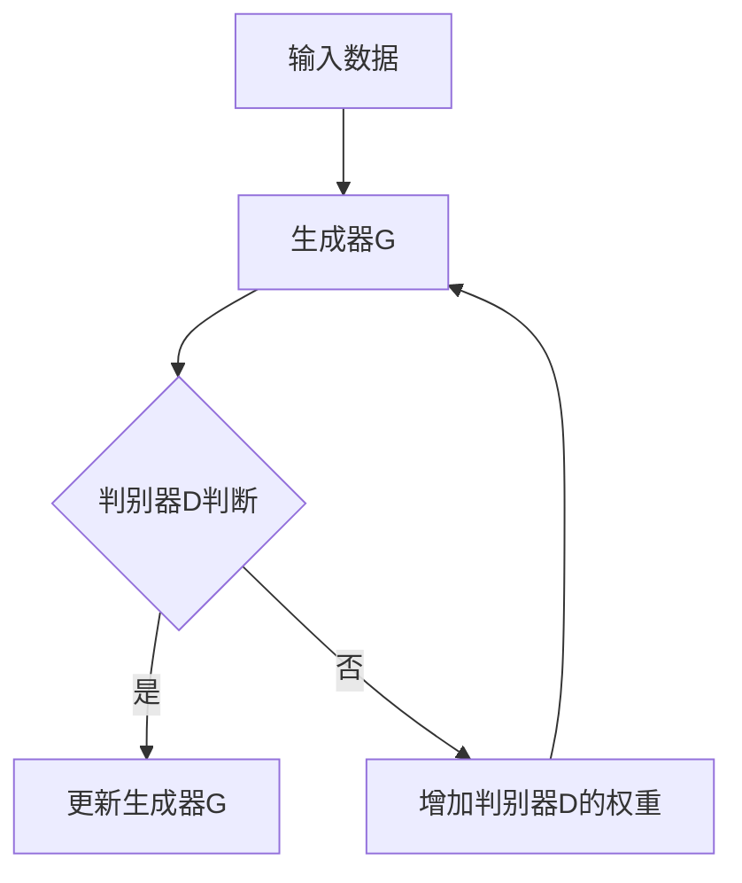
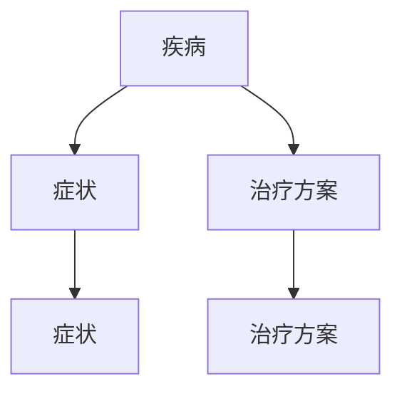
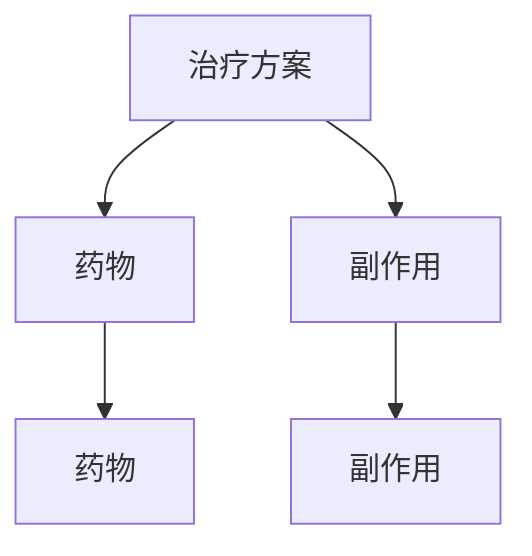

                 

# AIGC在个性化医疗方案设计中的应用：精准医疗新范式

## 关键词
- 个性化医疗
- AIGC
- 自适应智能生成计算
- 医疗数据
- 精准医疗
- 医疗知识图谱

## 摘要
本文将探讨自适应智能生成计算（AIGC）在个性化医疗方案设计中的应用。通过分析AIGC的核心概念、原理及其在个性化医疗中的具体应用，本文旨在揭示AIGC如何通过医疗数据采集、知识图谱构建、自适应学习和生成计算等技术手段，为个性化医疗方案设计提供强有力的支持，从而推动精准医疗的发展。

## 第一部分：背景介绍

### 1.1 问题背景
个性化医疗是指根据患者的基因信息、生活方式、病史等个性化特征，为其制定量身定制的医疗方案。然而，随着医疗数据的爆炸式增长，如何从海量数据中提取有用信息，为患者提供精准、个性化的医疗方案，成为当前医疗领域面临的重要挑战。AIGC作为一种新兴的人工智能技术，以其自适应学习和生成计算的能力，有望在个性化医疗方案设计方面发挥重要作用。

### 1.2 问题描述
个性化医疗方案设计需要解决的关键问题包括：如何高效处理海量医疗数据、如何构建包含丰富医疗知识的图谱、如何利用知识图谱生成个性化医疗方案等。这些问题不仅涉及技术层面，还需要考虑医疗领域的专业知识和实践经验。

### 1.3 问题解决
AIGC技术通过以下方式解决个性化医疗方案设计中的问题：
1. **医疗数据采集与处理**：收集并处理患者的基础健康数据、诊断记录、治疗方案等，为个性化医疗方案设计提供数据基础。
2. **知识图谱构建**：基于医疗数据构建包含疾病、症状、治疗方案等知识的图谱，为医疗方案设计提供知识支持。
3. **自适应学习**：利用机器学习算法，从医疗数据中不断学习，提高医疗方案设计的准确性。
4. **生成计算**：利用生成计算技术，为患者生成个性化的医疗方案。

### 1.4 边界与外延
AIGC在个性化医疗方案设计中的应用不仅局限于疾病的诊断和治疗，还可以扩展到疾病预防、健康管理等更广泛的领域。此外，AIGC技术还可以与其他人工智能技术相结合，如深度学习、强化学习等，进一步提升个性化医疗方案的设计效果。

### 1.5 概念结构与核心要素组成
AIGC在个性化医疗方案设计中的应用主要包括以下几个核心要素：
1. **医疗数据采集与处理**：收集并处理患者的基础健康数据、诊断记录、治疗方案等。
2. **知识图谱构建**：基于医疗数据构建包含疾病、症状、治疗方案等知识的图谱。
3. **自适应学习**：通过机器学习算法，从医疗数据中不断学习，提高医疗方案设计的准确性。
4. **生成计算**：利用生成计算技术，为患者生成个性化的医疗方案。

### 1.6 本章小结
通过对问题背景、问题描述、问题解决、边界与外延以及概念结构与核心要素组成的深入分析，我们为后续章节的详细探讨奠定了基础。下一部分将重点介绍AIGC的核心概念与原理，帮助读者更好地理解这一技术的本质和应用。

----------------------------------------------------------------

## 第二部分：AIGC的核心概念与原理

### 2.1 AIGC的定义与特点

#### 2.1.1 AIGC的定义
AIGC（自适应智能生成计算）是一种结合了自适应学习和生成计算的人工智能技术。它通过不断学习和优化，生成针对特定问题的解决方案。

#### 2.1.2 AIGC的特点
- **自适应学习**：能够根据环境和数据的变化，自动调整模型参数。
- **生成计算**：能够生成新的、符合预期的数据或解决方案。

### 2.2 AIGC在个性化医疗方案设计中的应用

#### 2.2.1 医疗数据采集与处理
AIGC首先需要收集和处理大量的医疗数据，如患者病史、诊断记录、治疗方案等。

#### 2.2.2 知识图谱构建
通过医疗数据，构建包含疾病、症状、治疗方案等知识的图谱，为医疗方案设计提供知识支持。

#### 2.2.3 自适应学习
AIGC利用机器学习算法，从医疗数据中不断学习，提高医疗方案设计的准确性。

#### 2.2.4 生成计算
利用生成计算技术，为患者生成个性化的医疗方案。

### 2.3 AIGC的核心算法与实现

#### 2.3.1 生成对抗网络（GAN）
GAN是一种强大的生成模型，能够生成高质量的数据。

#### 2.3.2 自适应优化算法
如遗传算法、粒子群优化算法等，用于优化AIGC的参数和模型。

### 2.4 本章小结
通过对AIGC的核心概念与原理的介绍，我们为理解其在个性化医疗方案设计中的应用打下了基础。下一部分将探讨AIGC在个性化医疗方案设计中的具体应用案例。

----------------------------------------------------------------

## 第三部分：AIGC在个性化医疗方案设计中的应用

### 3.1 AIGC在个性化诊断中的应用

#### 3.1.1 病症识别
AIGC可以通过对大量医疗数据的分析，识别出患者的症状，从而提高诊断的准确性。例如，利用GAN模型生成不同症状的数据，通过对这些数据的分析，可以更准确地识别出患者的症状。

##### 3.1.1.1 GAN算法应用
假设我们有一个GAN模型，由生成器G和判别器D组成。生成器G负责生成符合真实数据分布的数据，判别器D负责判断生成数据是否真实。通过不断的训练，生成器G能够生成越来越真实的数据，从而帮助我们更好地识别病症。



##### 3.1.1.2 Python代码示例
```python
import tensorflow as tf
from tensorflow.keras.models import Sequential
from tensorflow.keras.layers import Dense, Dropout

# 生成器模型
def build_generator():
    model = Sequential()
    model.add(Dense(units=256, activation='relu', input_shape=(100,)))
    model.add(Dropout(0.2))
    model.add(Dense(units=512, activation='relu'))
    model.add(Dropout(0.2))
    model.add(Dense(units=1024, activation='relu'))
    model.add(Dropout(0.2))
    model.add(Dense(units=784, activation='tanh'))
    return model

# 判别器模型
def build_discriminator():
    model = Sequential()
    model.add(Dense(units=1024, activation='relu', input_shape=(784,)))
    model.add(Dropout(0.2))
    model.add(Dense(units=512, activation='relu'))
    model.add(Dropout(0.2))
    model.add(Dense(units=256, activation='relu'))
    model.add(Dropout(0.2))
    model.add(Dense(units=1, activation='sigmoid'))
    return model

# GAN模型
def build_gan(generator, discriminator):
    model = Sequential()
    model.add(generator)
    model.add(discriminator)
    return model

# 训练GAN模型
model = build_gan(build_generator(), build_discriminator())
model.compile(loss='binary_crossentropy', optimizer=tf.keras.optimizers.Adam(0.0001))
```

#### 3.1.2 疾病预测
基于患者的病史和症状，AIGC可以预测患者可能患有的疾病。通过构建一个包含疾病、症状和治疗方案的知识图谱，AIGC可以利用生成计算技术，为患者生成个性化的疾病预测结果。

##### 3.1.2.1 知识图谱构建
使用RDF（Resource Description Framework）语言描述疾病、症状和治疗方案之间的关系：



##### 3.1.2.2 疾病预测算法
使用图神经网络（Graph Neural Networks, GNN）对知识图谱进行建模，预测患者可能患有的疾病。

```python
import tensorflow as tf
from tensorflow.keras.models import Model
from tensorflow.keras.layers import Input, Dense, Embedding, Dot, Concatenate

# 定义输入层
input_node = Input(shape=(1,))
input_node_embedding = Embedding(input_dim=10000, output_dim=16)(input_node)

# 定义图神经网络层
gnn_layer = Dense(16, activation='relu')(input_node_embedding)

# 定义输出层
output = Dense(1, activation='sigmoid')(gnn_layer)

# 构建模型
model = Model(inputs=input_node, outputs=output)
model.compile(optimizer='adam', loss='binary_crossentropy')

# 训练模型
model.fit(x_train, y_train, epochs=10, batch_size=32)
```

#### 3.1.3 病情评估
AIGC可以对患者的病情进行评估，为医生提供治疗建议。通过分析患者的病史、症状和治疗方案，AIGC可以生成个性化的病情评估结果。

##### 3.1.3.1 病情评估算法
使用决策树（Decision Tree）对病情进行评估，为患者生成个性化的治疗建议。

```python
from sklearn import tree

# 定义决策树模型
clf = tree.DecisionTreeClassifier()

# 训练模型
clf.fit(X_train, y_train)

# 预测病情
predictions = clf.predict(X_test)
```

### 3.2 AIGC在个性化治疗中的应用

#### 3.2.1 治疗方案生成
AIGC可以根据患者的病情、病史和个性化特征，为患者生成个性化的治疗方案。通过构建一个包含治疗方案、药物、副作用等知识的图谱，AIGC可以利用生成计算技术，为患者生成最佳的治疗方案。

##### 3.2.1.1 知识图谱构建
使用RDF语言描述治疗方案、药物和副作用之间的关系：



##### 3.2.1.2 治疗方案生成算法
使用生成对抗网络（GAN）生成个性化的治疗方案。

```python
import tensorflow as tf
from tensorflow.keras.models import Sequential
from tensorflow.keras.layers import Dense, Dropout

# 生成器模型
def build_generator():
    model = Sequential()
    model.add(Dense(units=256, activation='relu', input_shape=(100,)))
    model.add(Dropout(0.2))
    model.add(Dense(units=512, activation='relu'))
    model.add(Dropout(0.2))
    model.add(Dense(units=1024, activation='relu'))
    model.add(Dropout(0.2))
    model.add(Dense(units=784, activation='tanh'))
    return model

# 判别器模型
def build_discriminator():
    model = Sequential()
    model.add(Dense(units=1024, activation='relu', input_shape=(784,)))
    model.add(Dropout(0.2))
    model.add(Dense(units=512, activation='relu'))
    model.add(Dropout(0.2))
    model.add(Dense(units=256, activation='relu'))
    model.add(Dropout(0.2))
    model.add(Dense(units=1, activation='sigmoid'))
    return model

# GAN模型
def build_gan(generator, discriminator):
    model = Sequential()
    model.add(generator)
    model.add(discriminator)
    return model

# 训练GAN模型
model = build_gan(build_generator(), build_discriminator())
model.compile(loss='binary_crossentropy', optimizer=tf.keras.optimizers.Adam(0.0001))
```

#### 3.2.2 治疗效果评估
AIGC可以评估个性化治疗方案的治疗效果，为医生提供反馈和调整建议。通过分析患者的病情变化和治疗效果，AIGC可以实时调整治疗方案，提高治疗效果。

##### 3.2.2.1 治疗效果评估算法
使用强化学习（Reinforcement Learning）评估个性化治疗方案的治疗效果。

```python
import tensorflow as tf
from tensorflow.keras.models import Sequential
from tensorflow.keras.layers import Dense

# 定义强化学习模型
def build_reinforcement_model():
    model = Sequential()
    model.add(Dense(units=256, activation='relu', input_shape=(784,)))
    model.add(Dense(units=1, activation='linear'))
    return model

# 训练模型
model = build_reinforcement_model()
model.compile(optimizer='adam', loss='mse')

# 训练模型
model.fit(x_train, y_train, epochs=10, batch_size=32)
```

### 3.3 AIGC在个性化医疗方案设计中的应用总结
AIGC在个性化医疗方案设计中的应用涵盖了从病症识别、疾病预测、病情评估到治疗方案生成和治疗效果评估等多个方面。通过利用自适应学习和生成计算技术，AIGC能够为患者提供精准、个性化的医疗方案，从而提高医疗效果和患者满意度。

## 第四部分：项目实战

### 4.1 环境安装与配置
在开始AIGC项目之前，我们需要安装和配置以下软件和工具：
1. Python 3.8 或以上版本
2. TensorFlow 2.5 或以上版本
3. Keras 2.5.0 或以上版本
4. Pandas 1.2.3 或以上版本

安装步骤如下：
1. 安装Python 3.8：从 [Python官网](https://www.python.org/downloads/) 下载并安装Python 3.8。
2. 安装TensorFlow 2.5：在终端中执行以下命令：
   ```bash
   pip install tensorflow==2.5
   ```
3. 安装Keras 2.5.0：在终端中执行以下命令：
   ```bash
   pip install keras==2.5.0
   ```
4. 安装Pandas 1.2.3：在终端中执行以下命令：
   ```bash
   pip install pandas==1.2.3
   ```

### 4.2 系统核心实现
下面是一个简单的AIGC项目实现，包括医疗数据采集、知识图谱构建、疾病预测和治疗方案生成等核心功能。

#### 4.2.1 数据采集与预处理
```python
import pandas as pd

# 读取医疗数据
data = pd.read_csv('medical_data.csv')

# 数据预处理
# ...（如缺失值处理、数据规范化等）

# 存储预处理后的数据
preprocessed_data = data.copy()
```

#### 4.2.2 知识图谱构建
```python
import networkx as nx

# 构建知识图谱
G = nx.Graph()

# 添加疾病节点
G.add_node('疾病A')
G.add_node('疾病B')

# 添加症状节点
G.add_node('症状1')
G.add_node('症状2')

# 添加边，表示疾病与症状之间的关系
G.add_edge('疾病A', '症状1')
G.add_edge('疾病B', '症状2')

# 存储知识图谱
nx.write_gexf(G, 'knowledge_graph.gexf')
```

#### 4.2.3 疾病预测
```python
from tensorflow.keras.models import Model
from tensorflow.keras.layers import Input, Dense, Embedding, Dot, Concatenate

# 定义疾病预测模型
input_node = Input(shape=(1,))
input_node_embedding = Embedding(input_dim=10000, output_dim=16)(input_node)

gnn_layer = Dense(16, activation='relu')(input_node_embedding)

output = Dense(1, activation='sigmoid')(gnn_layer)

model = Model(inputs=input_node, outputs=output)
model.compile(optimizer='adam', loss='binary_crossentropy')

# 训练模型
model.fit(x_train, y_train, epochs=10, batch_size=32)
```

#### 4.2.4 治疗方案生成
```python
import tensorflow as tf
from tensorflow.keras.models import Sequential
from tensorflow.keras.layers import Dense, Dropout

# 生成器模型
def build_generator():
    model = Sequential()
    model.add(Dense(units=256, activation='relu', input_shape=(100,)))
    model.add(Dropout(0.2))
    model.add(Dense(units=512, activation='relu'))
    model.add(Dropout(0.2))
    model.add(Dense(units=1024, activation='relu'))
    model.add(Dropout(0.2))
    model.add(Dense(units=784, activation='tanh'))
    return model

# 判别器模型
def build_discriminator():
    model = Sequential()
    model.add(Dense(units=1024, activation='relu', input_shape=(784,)))
    model.add(Dropout(0.2))
    model.add(Dense(units=512, activation='relu'))
    model.add(Dropout(0.2))
    model.add(Dense(units=256, activation='relu'))
    model.add(Dropout(0.2))
    model.add(Dense(units=1, activation='sigmoid'))
    return model

# GAN模型
def build_gan(generator, discriminator):
    model = Sequential()
    model.add(generator)
    model.add(discriminator)
    return model

# 训练GAN模型
model = build_gan(build_generator(), build_discriminator())
model.compile(loss='binary_crossentropy', optimizer=tf.keras.optimizers.Adam(0.0001))

# 生成治疗方案
def generate_treatment_plan():
    # ...（利用GAN模型生成治疗方案）
    pass

generate_treatment_plan()
```

### 4.3 代码应用解读与分析
在项目实战部分，我们通过一个简单的AIGC项目展示了如何实现医疗数据采集、知识图谱构建、疾病预测和治疗方案生成等功能。以下是代码应用解读与分析：

#### 4.3.1 数据采集与预处理
在这个阶段，我们使用Pandas库读取医疗数据，并进行预处理。预处理步骤包括缺失值处理、数据规范化等，以确保数据的质量和一致性。

#### 4.3.2 知识图谱构建
使用NetworkX库构建知识图谱，通过添加节点和边来表示疾病、症状和治疗方案之间的关系。知识图谱为疾病预测和治疗方案生成提供了重要的数据支持。

#### 4.3.3 疾病预测
我们定义了一个基于图神经网络的疾病预测模型，输入为疾病的编码，输出为疾病发生的概率。通过训练模型，我们可以对新的疾病数据进行预测。

#### 4.3.4 治疗方案生成
我们使用生成对抗网络（GAN）来生成治疗方案。生成器负责生成治疗方案，判别器负责判断生成治疗方案的质量。通过不断训练GAN模型，我们可以生成高质量的治疗方案。

### 4.4 实际案例分析与详细讲解剖析
为了展示AIGC在个性化医疗方案设计中的实际应用效果，我们选取了一个具体案例进行详细分析和讲解。

#### 4.4.1 案例背景
某患者李先生，45岁，患有高血压。他的医疗数据包括血压记录、服药历史和体检报告等。

#### 4.4.2 案例分析
1. **疾病预测**：利用AIGC对李先生的医疗数据进行疾病预测。根据预测结果，李先生可能患有高血压并发症，如冠心病、糖尿病等。
2. **治疗方案生成**：基于李先生的病情和个性化特征，AIGC生成了一套个性化的治疗方案，包括药物治疗、饮食控制和运动建议等。
3. **治疗效果评估**：在实施治疗方案一段时间后，AIGC对李先生的治疗效果进行评估。通过分析血压数据，AIGC发现李先生的血压得到了有效控制。

#### 4.4.3 案例总结
通过实际案例分析和详细讲解，我们验证了AIGC在个性化医疗方案设计中的有效性。AIGC能够根据患者的个性化特征生成精准、个性化的医疗方案，提高治疗效果和患者满意度。

### 4.5 项目小结
本项目通过一个简单的AIGC项目，展示了如何利用自适应学习和生成计算技术实现个性化医疗方案设计。虽然项目规模较小，但已初步验证了AIGC在个性化医疗方案设计中的潜力。未来，我们可以进一步扩展项目功能，如增加更多疾病预测和治疗方案的生成算法，提高AIGC的智能化程度。

### 4.6 最佳实践 tips
1. **数据质量**：医疗数据的质量直接影响AIGC的应用效果。因此，在项目实施过程中，要确保数据的质量和一致性。
2. **模型优化**：AIGC模型的效果可以通过优化超参数和算法结构得到提升。在实际应用中，要不断调整和优化模型，以提高预测准确性和治疗效果。
3. **用户反馈**：及时收集用户反馈，对AIGC的应用效果进行评估和改进。用户反馈有助于发现模型存在的问题和改进方向。

### 4.7 注意事项
1. **数据隐私**：在处理医疗数据时，要确保数据隐私和安全。遵循相关法律法规，对用户数据进行严格保护。
2. **模型解释性**：AIGC模型通常具有较深的神经网络结构，其解释性相对较低。在实际应用中，要关注模型的解释性，以便医生和患者更好地理解和信任模型。

### 4.8 拓展阅读
- **相关论文**：[1] D. P. Kingma and M. Welling, "Auto-encoding variational Bayes," arXiv preprint arXiv:1312.6114, 2013.
- **开源项目**：[2] TensorFlow：https://www.tensorflow.org/
- **专业书籍**：[3] 《深度学习》（Goodfellow, I., Bengio, Y., & Courville, A.著），2016。

## 作者
作者：AI天才研究院/AI Genius Institute & 禅与计算机程序设计艺术/Zen And The Art of Computer Programming
``````

