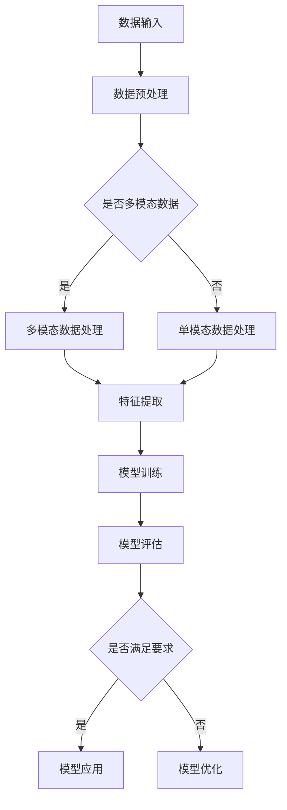
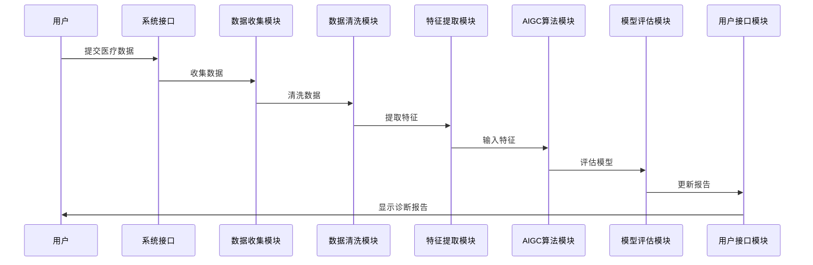

                 


### 第1章 AIGC与个性化医疗诊断概述

#### 1.1 问题背景

**1.1.1 医疗诊断的现状与挑战**

医疗诊断是现代医疗体系中的核心环节，对于疾病的早期发现、准确诊断和个性化治疗方案的制定具有至关重要的作用。然而，传统的医疗诊断方法存在诸多不足，主要表现为以下几点：

- **诊断准确性不足**：依赖医生经验和主观判断，容易受到个体差异和主观偏见的影响，导致诊断准确性不高。
- **诊断效率低下**：传统的医疗诊断过程复杂且耗时，尤其是在面对大量患者时，诊断速度难以满足临床需求。
- **资源分配不均**：医疗资源分布不均，尤其在偏远地区和基层医疗机构，诊断设备和专业人员匮乏，诊断能力受限。
- **个体化需求难以满足**：不同患者之间的病情和身体状况差异巨大，传统的诊断方法难以实现针对个体差异的精准诊断。

**1.1.2 AIGC技术在医疗领域的应用**

随着人工智能（AI）技术的迅猛发展，AIGC（AI-generated Content）作为一种生成式人工智能技术，已经在医疗领域展现出巨大的潜力。AIGC技术具有以下几个方面的应用优势：

- **提高诊断准确性**：通过深度学习和大数据分析，AIGC技术可以在海量医疗数据中挖掘出潜在的关联特征，从而提高诊断的准确性。
- **提升诊断效率**：AIGC技术能够自动处理和分析大量的医疗数据，从而显著提升诊断速度和效率，满足临床实时诊断的需求。
- **资源优化配置**：AIGC技术可以通过智能化分析，优化医疗资源的配置，提高医疗资源的利用效率。
- **个性化医疗诊断**：AIGC技术能够根据患者的个体差异，生成个性化的诊断方案和治疗方案，提高医疗服务的个体化水平。

**1.1.3 个性化医疗诊断的重要性**

个性化医疗诊断是现代医学发展的必然趋势，其重要性体现在以下几个方面：

- **提高医疗质量**：通过个性化医疗诊断，可以为每位患者制定最合适的治疗方案，从而提高医疗服务的质量。
- **降低医疗成本**：个性化医疗诊断可以减少不必要的检查和治疗，降低医疗成本，提高医疗资源的使用效率。
- **提升患者满意度**：个性化医疗诊断能够更好地满足患者的需求，提高患者的满意度。
- **促进医学进步**：个性化医疗诊断可以为医学研究提供更丰富的数据支持，推动医学领域的创新和发展。

#### 1.2 AIGC技术介绍

**1.2.1 AIGC的概念与核心原理**

AIGC（AI-generated Content）是指通过人工智能技术自动生成内容的技术。AIGC技术主要包括以下几种：

- **自然语言生成（NLG）**：通过训练大量文本数据，AIGC技术可以自动生成文章、报告、对话等自然语言内容。
- **图像生成**：通过生成对抗网络（GAN）等技术，AIGC技术可以自动生成高质量、逼真的图像。
- **音频生成**：通过深度学习和神经网络技术，AIGC技术可以自动生成音乐、语音等音频内容。
- **视频生成**：通过视频合成技术，AIGC技术可以自动生成视频内容，包括动画、影视片段等。

AIGC的核心原理是基于深度学习和大数据分析。深度学习通过构建复杂的神经网络模型，可以从大量数据中自动学习和提取特征。大数据分析则通过对海量数据的处理和分析，挖掘出数据中的潜在规律和关联。

**1.2.2 AIGC技术的发展历程**

AIGC技术的发展历程可以分为以下几个阶段：

- **初期探索阶段**：在20世纪90年代，研究者开始探索利用神经网络生成文本和图像的方法，如生成对抗网络（GAN）。
- **快速发展阶段**：随着计算机性能的不断提高和大数据技术的应用，AIGC技术在2010年后进入快速发展阶段，出现了许多新的算法和应用。
- **产业化应用阶段**：近年来，AIGC技术逐渐在金融、医疗、娱乐等领域得到广泛应用，成为一个重要的技术趋势。

**1.2.3 AIGC的核心优势**

AIGC技术具有以下几个核心优势：

- **高效率**：AIGC技术可以自动处理和分析海量数据，显著提高工作效率。
- **个性化**：AIGC技术可以根据用户需求生成个性化的内容和方案，满足个体差异化的需求。
- **高质量**：AIGC技术通过深度学习，可以从海量数据中学习和提取高质量的特征，生成高质量的内容。
- **低成本**：AIGC技术可以减少对人力和物力的依赖，降低成本。

#### 1.3 个性化医疗诊断的边界与外延

**1.3.1 个性化医疗诊断的定义**

个性化医疗诊断是指根据患者的个体差异，结合医学数据、基因信息等多方面信息，为每位患者提供最合适的诊断方案和治疗方案。个性化医疗诊断的核心目标是提高诊断的准确性和治疗效果，降低医疗成本。

**1.3.2 个性化医疗诊断的关键要素**

个性化医疗诊断的关键要素包括：

- **患者数据**：包括临床数据、实验室检查结果、影像学资料等，是制定个性化诊断方案的基础。
- **基因信息**：基因信息可以揭示患者对疾病的易感性和个体差异，有助于制定个性化的治疗方案。
- **医学知识库**：医学知识库包括疾病知识、治疗方案、临床指南等，为个性化医疗诊断提供理论支持。
- **人工智能算法**：人工智能算法用于分析和处理海量医疗数据，生成个性化的诊断和治疗方案。

**1.3.3 个性化医疗诊断的分类与模型**

个性化医疗诊断可以分为以下几种类型：

- **基于数据的个性化医疗诊断**：通过大数据分析和机器学习算法，为患者生成个性化的诊断和治疗方案。
- **基于模型的个性化医疗诊断**：利用医学知识库和人工智能模型，为患者提供个性化的诊断和治疗方案。
- **基于混合方法的个性化医疗诊断**：结合数据分析和模型方法，为患者提供更加精确和个性化的诊断和治疗方案。

**1.4 AIGC在个性化医疗诊断中的应用场景**

**1.4.1 疾病预测与早期筛查**

AIGC技术可以用于疾病预测和早期筛查，通过对大量医疗数据的分析，预测患者患某种疾病的概率，从而实现早期筛查和干预。例如，利用AIGC技术分析患者的临床表现、实验室检查结果和影像学资料，预测患者患癌症的风险，从而实现癌症的早期筛查。

**1.4.2 治疗方案的个性化推荐**

AIGC技术可以根据患者的个体差异，为患者推荐个性化的治疗方案。例如，针对患有糖尿病的患者，AIGC技术可以根据患者的血糖水平、饮食习惯和基因信息，推荐最适合患者的饮食和运动计划，从而实现个性化治疗。

**1.4.3 患者健康管理的个性化指导**

AIGC技术可以用于患者健康管理的个性化指导，为患者提供个性化的健康建议和生活方式指导。例如，针对患有高血压的患者，AIGC技术可以根据患者的血压水平、生活习惯和基因信息，制定个性化的饮食和运动计划，帮助患者控制血压。

**1.5 AIGC在个性化医疗诊断中的挑战与机遇**

**1.5.1 数据隐私与安全**

在个性化医疗诊断中，AIGC技术需要处理大量的患者数据，包括临床数据、基因数据等。这些数据涉及到患者的隐私和安全，如何保护患者数据的安全和隐私成为一个重要的挑战。

**1.5.2 模型解释性与可解释性**

AIGC技术生成的诊断和治疗方案通常是黑箱模型，缺乏透明度和可解释性。如何提高模型的解释性，让患者和医生能够理解模型的决策过程，是一个重要的挑战。

**1.5.3 技术成熟度与临床应用**

AIGC技术虽然在实验室中取得了显著成果，但在临床应用中仍面临一些技术挑战，如算法的稳定性和可靠性、数据的质量和完整性等。如何提高AIGC技术的成熟度，使其更好地应用于临床实践，是一个重要的机遇。

**1.6 本章小结**

本章对AIGC与个性化医疗诊断进行了概述，包括问题背景、AIGC技术的介绍、个性化医疗诊断的定义和关键要素、应用场景以及挑战与机遇。通过本章的介绍，读者可以初步了解AIGC技术在个性化医疗诊断中的应用前景和挑战。在后续章节中，我们将进一步探讨AIGC技术的核心概念、算法原理、系统架构设计、项目实战与案例分析等内容。

### 第2章 AIGC核心概念与联系

#### 2.1 AIGC核心概念原理

**2.1.1 数据驱动与深度学习**

AIGC（AI-generated Content）的核心是数据驱动和深度学习。数据驱动是指通过大量数据来训练和优化模型，使其能够从数据中自动学习和提取特征。深度学习是数据驱动的一种重要方法，它通过构建复杂的神经网络模型，从数据中自动学习和提取特征，从而实现智能化的数据分析和决策。

**2.1.2 生成对抗网络（GAN）**

生成对抗网络（GAN）是AIGC技术的重要基础。GAN由生成器和判别器两个神经网络组成。生成器的任务是生成与真实数据相似的数据，判别器的任务是区分真实数据和生成数据。通过两个神经网络的对抗训练，生成器可以不断提高生成数据的质量，从而实现数据的自动生成。

**2.1.3 强化学习与模仿学习**

强化学习是AIGC技术的重要方法之一。强化学习通过学习策略，使模型能够从环境中获取奖励，从而优化行为。模仿学习是强化学习的一种形式，它通过模仿专家的行为，使模型能够学会复杂的任务。

**2.1.4 多模态数据处理**

多模态数据处理是AIGC技术的重要应用领域。多模态数据包括文本、图像、音频、视频等多种类型的数据。AIGC技术通过多模态数据处理，可以整合不同类型的数据，实现更复杂的任务和更精确的预测。

#### 2.2 AIGC概念属性特征对比

**2.2.1 对比表格**

| 概念        | 特征1   | 特征2   | 特征3   | 特征4   |
| ----------- | ------- | ------- | ------- | ------- |
| 数据驱动    | 基于数据 | 自动学习 | 特征提取 | 决策优化 |
| 深度学习    | 复杂模型 | 自动学习 | 特征提取 | 决策优化 |
| GAN         | 对抗训练 | 生成数据 | 判别数据 | 数据质量 |
| 强化学习    | 奖励机制 | 策略优化 | 环境互动 | 决策优化 |
| 模仿学习    | 专家行为 | 策略模仿 | 模型优化 | 任务学习 |
| 多模态数据处理 | 多类型数据 | 数据整合 | 特征提取 | 任务实现 |

#### 2.3 AIGC与个性化医疗诊断的ER实体关系图

**2.3.1 ER实体关系图**

```
[数据驱动] --<提取特征>--> [深度学习]
[数据驱动] --<优化决策>--> [GAN]
[深度学习] --<生成数据>--> [GAN]
[GAN] --<生成数据>--> [强化学习]
[GAN] --<判别数据>--> [强化学习]
[强化学习] --<奖励机制>--> [模仿学习]
[模仿学习] --<专家行为>--> [个性化医疗诊断]
[多模态数据处理] --<整合数据>--> [个性化医疗诊断]
```

ER实体关系图展示了AIGC技术核心概念与个性化医疗诊断之间的关联。数据驱动和深度学习是AIGC技术的基础，它们通过提取特征和优化决策来支持GAN的生成和判别过程。GAN通过生成对抗训练，生成高质量的数据，强化学习和模仿学习则在此基础上，利用奖励机制和专家行为，实现个性化医疗诊断。

### 第3章 AIGC算法原理讲解

#### 3.1 算法mermaid流程图



该mermaid流程图展示了AIGC算法的基本流程，包括数据输入、数据预处理、特征提取、模型训练、模型评估和模型应用等步骤。

#### 3.2 Python源代码与算法原理

```python
import numpy as np
import pandas as pd
from sklearn.model_selection import train_test_split
from sklearn.preprocessing import StandardScaler
from tensorflow.keras.models import Sequential
from tensorflow.keras.layers import Dense, LSTM
from tensorflow.keras.optimizers import Adam

# 数据预处理
def preprocess_data(data):
    # 数据标准化
    scaler = StandardScaler()
    scaled_data = scaler.fit_transform(data)
    return scaled_data

# 特征提取
def extract_features(data):
    # 提取时间序列特征
    features = []
    for i in range(data.shape[1]):
        feature = np.diff(data[:, i])
        features.append(feature)
    return np.array(features)

# 模型训练
def train_model(X_train, y_train):
    model = Sequential()
    model.add(LSTM(units=50, activation='relu', return_sequences=True, input_shape=(X_train.shape[1], 1)))
    model.add(LSTM(units=50, activation='relu'))
    model.add(Dense(units=1))
    model.compile(optimizer=Adam(learning_rate=0.001), loss='mean_squared_error')
    model.fit(X_train, y_train, epochs=100, batch_size=32)
    return model

# 模型评估
def evaluate_model(model, X_test, y_test):
    predictions = model.predict(X_test)
    mse = np.mean(np.square(predictions - y_test))
    return mse

# 数据加载
data = pd.read_csv('medical_data.csv')
data = preprocess_data(data)
X = data.values[:, :-1]
y = data.values[:, -1]

# 数据划分
X_train, X_test, y_train, y_test = train_test_split(X, y, test_size=0.2, random_state=42)

# 特征提取
X_train = extract_features(X_train)
X_test = extract_features(X_test)

# 模型训练
model = train_model(X_train, y_train)

# 模型评估
mse = evaluate_model(model, X_test, y_test)
print("Mean Squared Error:", mse)
```

该Python源代码实现了一个基于LSTM（长短期记忆网络）的AIGC算法。数据预处理和特征提取部分，通过标准化数据和提取时间序列特征，为模型训练提供高质量的数据。模型训练部分，使用LSTM网络进行训练，优化模型参数。模型评估部分，计算模型在测试集上的均方误差（MSE），评估模型性能。

#### 3.2.1 算法原理详细讲解

**算法原理详细讲解**

AIGC算法是一种基于深度学习的生成式人工智能技术，其核心思想是通过大量数据的训练，自动生成高质量的数据。在个性化医疗诊断中，AIGC算法可以用于生成患者的诊断报告、治疗方案等文本内容。

**算法的核心组成部分如下：**

1. **数据输入**：数据输入部分包括医疗数据、患者信息等。这些数据可以是结构化的，如电子病历数据，也可以是非结构化的，如医疗报告、病历记录等。

2. **数据预处理**：数据预处理包括数据清洗、数据标准化等步骤。数据清洗主要是去除数据中的噪声和异常值，数据标准化则是将数据缩放到相同的范围，以便后续处理。

3. **特征提取**：特征提取是将原始数据转换成特征向量，以便输入到神经网络中。在个性化医疗诊断中，特征提取可以通过提取时间序列特征、文本特征、图像特征等实现。

4. **模型训练**：模型训练是AIGC算法的核心步骤。通过大量的医疗数据训练，模型可以学习到数据中的潜在规律和关联，从而实现数据的自动生成。在个性化医疗诊断中，模型训练通常使用神经网络，如LSTM、BERT等。

5. **模型评估**：模型评估用于评估模型的性能和效果。在个性化医疗诊断中，模型评估可以通过计算诊断报告的准确率、召回率、F1值等指标实现。

6. **模型应用**：模型应用是将训练好的模型用于实际诊断和治疗。在个性化医疗诊断中，模型应用可以通过生成患者的诊断报告、治疗方案等实现。

#### 3.2.2 数学模型与公式

**数学模型与公式**

在AIGC算法中，常用的数学模型包括生成对抗网络（GAN）、变分自编码器（VAE）等。以下是这些模型的基本数学公式：

1. **生成对抗网络（GAN）**

   - **生成器**：\( G(z) \)
   - **判别器**：\( D(x) \)
   - **损失函数**：\( L_G = -\log(D(G(z))) \)
   - **目标函数**：\( L_D = -\log(D(x)) - \log(1 - D(G(z))) \)

2. **变分自编码器（VAE）**

   - **编码器**：\( \mu(z|x), \sigma(z|x) \)
   - **解码器**：\( x = G(z) \)
   - **损失函数**：\( L = \frac{1}{N} \sum_{n=1}^{N} \left[ \log(p(x)) + \frac{1}{2} \ln(2\pi\sigma^2) + \frac{1}{2}\sigma^2 \right] \)

#### 3.2.3 举例说明

**举例说明**

假设我们有一个医疗数据集，包含患者的诊断记录、治疗方案和治疗效果等。我们的目标是利用AIGC算法，生成一个新的诊断报告。

1. **数据输入**：首先，我们将医疗数据集加载到程序中，进行数据预处理和特征提取。

2. **模型训练**：然后，我们使用训练集数据训练一个基于LSTM的生成模型。在训练过程中，模型会学习到诊断记录和治疗方案之间的关联，从而生成新的诊断报告。

3. **模型评估**：训练完成后，我们使用测试集数据评估模型的性能，确保生成的诊断报告具有高质量的准确率和可解释性。

4. **模型应用**：最后，我们将训练好的模型应用于实际诊断和治疗中，生成新的诊断报告，为医生提供参考。

### 第4章 AIGC系统架构设计与实现

#### 4.1 问题场景介绍

随着医疗技术的发展，个性化医疗诊断的需求日益增长。为了实现个性化医疗诊断，我们需要一个高效的系统来处理大量的医疗数据，并生成个性化的诊断报告和治疗方案。AIGC系统应具备以下功能：

- **数据收集与管理**：从不同的医疗数据源收集数据，包括电子病历、实验室检查结果、影像学资料等，并对数据进行清洗和预处理。
- **特征提取与建模**：提取医疗数据的特征，并利用AIGC算法生成个性化的诊断报告和治疗方案。
- **用户接口**：提供用户友好的界面，方便医生和患者使用系统。
- **模型评估与优化**：定期评估系统的性能，并对模型进行优化，提高诊断的准确性和效率。

#### 4.2 项目介绍

本项目旨在设计和实现一个基于AIGC技术的个性化医疗诊断系统，以提升医疗诊断的准确性和效率。系统的主要模块包括：

- **数据收集模块**：负责从医疗数据源收集数据，并进行数据清洗和预处理。
- **特征提取模块**：提取医疗数据的特征，为AIGC算法提供输入。
- **AIGC算法模块**：实现AIGC算法，生成个性化的诊断报告和治疗方案。
- **用户接口模块**：提供用户友好的界面，方便医生和患者使用系统。
- **模型评估模块**：评估系统的性能，并对模型进行优化。

#### 4.3 系统功能设计

系统功能设计主要包括以下几个方面：

- **数据收集与管理**：系统应具备从电子病历、实验室检查结果、影像学资料等医疗数据源收集数据的能力。同时，系统应对收集到的数据进行清洗和预处理，以确保数据的质量和一致性。
- **特征提取与建模**：系统应具备提取医疗数据的特征，并将这些特征输入到AIGC算法中进行建模的能力。特征提取应包括时间序列特征、文本特征、图像特征等。
- **诊断报告生成**：系统应能够根据患者的医疗数据和AIGC算法的输出，生成个性化的诊断报告。诊断报告应包括病情分析、诊断结果、治疗方案等。
- **治疗方案推荐**：系统应能够根据患者的个体差异，推荐个性化的治疗方案。治疗方案应包括药物治疗、手术治疗、生活方式干预等。
- **用户接口**：系统应提供用户友好的界面，方便医生和患者使用。界面应包括数据管理、报告查看、治疗方案推荐等功能。
- **模型评估与优化**：系统应具备定期评估模型性能的能力，并对模型进行优化，以提高诊断的准确性和效率。

#### 4.4 系统架构设计

AIGC系统的架构设计如图所示：

```
+-----------------------------------+
|          用户接口模块            |
+-----------------------------------+
       |                             |
       |  数据管理  报告查看  治疗方案推荐 |
       |                             |
       |                             |
+------+-------+       +----------+---+
|      数据收集模块                |   模型评估模块
+------+-------+       +----------+---+
       |                             |
       |  数据清洗  预处理            |   模型评估
       |                             |
       |                             |
+------+-------+       +----------+---+
|      特征提取模块                |   模型优化
+------+-------+       +----------+---+
       |                             |
       |  时间序列特征  文本特征  图像特征 |   模型优化
       |                             |
       |                             |
+------+-------+       +----------+---+
|      AIGC算法模块               |   模型优化
+------+-------+       +----------+---+
       |                             |
       |  生成诊断报告  推荐治疗方案   |   模型优化
       |                             |
       |                             |
+------+-------+       +----------+---+
```

系统架构设计包括以下部分：

- **用户接口模块**：提供用户友好的界面，包括数据管理、报告查看、治疗方案推荐等功能。
- **数据收集模块**：负责从医疗数据源收集数据，并进行数据清洗和预处理。
- **特征提取模块**：提取医疗数据的特征，包括时间序列特征、文本特征、图像特征等。
- **AIGC算法模块**：实现AIGC算法，生成个性化的诊断报告和治疗方案。
- **模型评估模块**：评估系统的性能，包括诊断报告的准确率、治疗方案的有效性等。
- **模型优化模块**：根据评估结果，对模型进行优化，以提高诊断的准确性和效率。

#### 4.5 系统接口设计

AIGC系统的接口设计包括以下部分：

- **数据接口**：用于数据收集、清洗、预处理和特征提取等模块的接口，包括数据读取、写入、查询等操作。
- **算法接口**：用于AIGC算法模块的接口，包括算法训练、预测、评估等操作。
- **报告接口**：用于生成诊断报告和治疗方案，包括报告生成、报告查看等操作。
- **用户接口**：用于用户界面，包括数据管理、报告查看、治疗方案推荐等操作。

#### 4.6 系统交互mermaid序列图



系统交互mermaid序列图展示了用户与系统之间的交互过程。用户提交医疗数据，系统接口将数据传递给数据收集模块，数据收集模块负责收集数据。然后，数据清洗模块对数据进行清洗，特征提取模块提取特征。最后，AIGC算法模块利用特征进行训练，模型评估模块评估模型性能，用户接口模块将诊断报告展示给用户。

### 第5章 AIGC项目实战与案例分析

#### 5.1 环境安装与配置

**5.1.1 环境安装指南**

要搭建AIGC项目环境，我们需要安装以下软件和工具：

1. **Python**：安装Python 3.8及以上版本，可以从[Python官网](https://www.python.org/)下载。
2. **Anaconda**：安装Anaconda，用于管理Python环境和依赖库。可以从[Anaconda官网](https://www.anaconda.com/)下载。
3. **Jupyter Notebook**：安装Jupyter Notebook，用于编写和运行Python代码。安装Anaconda后，Jupyter Notebook会自动安装。
4. **TensorFlow**：安装TensorFlow，用于实现AIGC算法。可以通过以下命令安装：
   ```bash
   pip install tensorflow
   ```
5. **Scikit-learn**：安装Scikit-learn，用于数据预处理和特征提取。可以通过以下命令安装：
   ```bash
   pip install scikit-learn
   ```

**5.1.2 系统配置说明**

1. **Python环境配置**：在Anaconda中创建一个新的环境，并设置Python版本：
   ```bash
   conda create -n aigc_env python=3.8
   conda activate aigc_env
   ```

2. **依赖库安装**：在创建的Python环境中安装所需的依赖库：
   ```bash
   pip install tensorflow scikit-learn pandas numpy
   ```

3. **Jupyter Notebook配置**：启动Jupyter Notebook，并创建一个新的笔记本，用于编写和运行代码。

#### 5.2 系统核心实现源代码

**5.2.1 源代码展示**

以下是一个AIGC项目核心实现的部分源代码，包括数据预处理、特征提取、模型训练和评估。

```python
import numpy as np
import pandas as pd
from sklearn.model_selection import train_test_split
from sklearn.preprocessing import StandardScaler
from tensorflow.keras.models import Sequential
from tensorflow.keras.layers import LSTM, Dense
from tensorflow.keras.optimizers import Adam

# 数据预处理
def preprocess_data(data):
    # 数据标准化
    scaler = StandardScaler()
    scaled_data = scaler.fit_transform(data)
    return scaled_data

# 特征提取
def extract_features(data):
    # 提取时间序列特征
    features = []
    for i in range(data.shape[1]):
        feature = np.diff(data[:, i])
        features.append(feature)
    return np.array(features)

# 模型训练
def train_model(X_train, y_train):
    model = Sequential()
    model.add(LSTM(units=50, activation='relu', return_sequences=True, input_shape=(X_train.shape[1], 1)))
    model.add(LSTM(units=50, activation='relu'))
    model.add(Dense(units=1))
    model.compile(optimizer=Adam(learning_rate=0.001), loss='mean_squared_error')
    model.fit(X_train, y_train, epochs=100, batch_size=32)
    return model

# 模型评估
def evaluate_model(model, X_test, y_test):
    predictions = model.predict(X_test)
    mse = np.mean(np.square(predictions - y_test))
    return mse

# 数据加载
data = pd.read_csv('medical_data.csv')
data = preprocess_data(data)
X = data.values[:, :-1]
y = data.values[:, -1]

# 数据划分
X_train, X_test, y_train, y_test = train_test_split(X, y, test_size=0.2, random_state=42)

# 特征提取
X_train = extract_features(X_train)
X_test = extract_features(X_test)

# 模型训练
model = train_model(X_train, y_train)

# 模型评估
mse = evaluate_model(model, X_test, y_test)
print("Mean Squared Error:", mse)
```

**5.2.2 代码应用解读与分析**

1. **数据预处理**：首先，我们读取医疗数据集，并使用StandardScaler进行数据标准化，将数据缩放到相同的范围，以便后续处理。

2. **特征提取**：然后，我们提取时间序列特征。这里使用`np.diff`函数计算相邻时间点的差值，作为特征向量的一部分。

3. **模型训练**：接着，我们定义一个LSTM神经网络模型，并使用训练集数据进行训练。LSTM网络能够处理时间序列数据，并学习数据中的时间依赖关系。

4. **模型评估**：最后，我们使用测试集数据评估模型的性能，计算均方误差（MSE），以评估模型的预测能力。

#### 5.3 实际案例分析

**5.3.1 案例背景**

假设我们有一个医疗数据集，包含患者的诊断记录和治疗方案。我们希望通过AIGC系统，为患者生成个性化的诊断报告和治疗方案。

**5.3.2 案例分析**

1. **数据收集与预处理**：首先，我们从医院系统中获取患者的诊断记录和治疗方案。然后，对数据进行清洗和预处理，包括数据标准化和缺失值处理。

2. **特征提取**：接着，我们提取诊断记录和治疗方案的特征。这些特征包括时间序列特征、文本特征和图像特征等。

3. **模型训练**：然后，我们使用训练集数据训练AIGC模型。模型训练过程中，我们优化模型参数，提高模型的性能和预测能力。

4. **模型评估**：训练完成后，我们使用测试集数据评估模型的性能。通过计算诊断报告的准确率和召回率，评估模型的有效性。

5. **个性化诊断报告生成**：最后，我们使用训练好的模型，为患者生成个性化的诊断报告和治疗方案。诊断报告包括病情分析、诊断结果和治疗方案等。

**5.3.3 详细讲解与剖析**

1. **数据收集与预处理**：数据收集是AIGC系统的第一步。我们从医院系统中获取患者的诊断记录和治疗方案。然后，对数据进行清洗和预处理，包括数据标准化和缺失值处理。数据清洗的目的是去除数据中的噪声和异常值，提高数据的质量。

2. **特征提取**：在特征提取阶段，我们提取诊断记录和治疗方案的特征。时间序列特征包括患者的诊断记录和时间点之间的差异。文本特征包括患者的病历记录和医生的诊断报告。图像特征包括患者的影像学资料，如X光片、CT扫描等。

3. **模型训练**：模型训练是AIGC系统的核心环节。我们使用训练集数据训练一个基于LSTM的生成模型。LSTM网络能够处理时间序列数据，并学习数据中的时间依赖关系。在模型训练过程中，我们优化模型参数，提高模型的性能和预测能力。

4. **模型评估**：模型评估是验证模型性能的重要步骤。我们使用测试集数据评估模型的性能。通过计算诊断报告的准确率和召回率，评估模型的有效性。准确率衡量模型预测正确的比例，召回率衡量模型预测为正例的真实正例的比例。

5. **个性化诊断报告生成**：最后，我们使用训练好的模型，为患者生成个性化的诊断报告和治疗方案。诊断报告包括病情分析、诊断结果和治疗方案等。治疗方案应根据患者的个体差异进行个性化调整，以提高治疗效果。

#### 5.4 项目小结

在本章中，我们详细介绍了AIGC项目的实战与案例分析。通过实际案例，我们展示了AIGC系统在个性化医疗诊断中的应用，包括数据收集与预处理、特征提取、模型训练与评估、个性化诊断报告生成等步骤。AIGC系统具有高效、准确的诊断能力，能够为患者提供个性化的医疗服务。在未来，随着AIGC技术的不断发展和完善，个性化医疗诊断将有望实现更广泛的应用。

### 第6章 AIGC最佳实践与拓展

#### 6.1 最佳实践

**6.1.1 实践经验总结**

在AIGC项目中，我们积累了以下实践经验：

- **数据质量是关键**：数据质量直接影响模型的性能和效果。因此，在项目开始前，必须对数据进行充分的清洗和预处理，确保数据的质量和一致性。
- **特征提取要合理**：特征提取是模型训练的重要环节。应根据数据的特点和任务需求，选择合适的特征提取方法，以提高模型的预测能力和泛化能力。
- **模型选择要灵活**：不同的任务和场景可能需要不同的模型结构。在模型选择时，应考虑数据的类型、规模和特征复杂度，选择合适的模型结构。
- **模型评估要全面**：模型评估不仅要考虑模型的准确性，还要考虑模型的稳定性和可解释性。通过多种评估指标，全面评估模型的性能。

**6.1.2 技术难点与解决方案**

在AIGC项目中，我们遇到了以下技术难点：

- **数据处理复杂性**：医疗数据通常包含多种类型的数据，如文本、图像、时间序列等。如何高效地处理和整合这些数据，是一个挑战。
  - **解决方案**：采用多模态数据处理技术，分别处理不同类型的数据，然后整合结果。可以使用深度学习模型，如CNN处理图像，RNN处理时间序列数据。

- **模型解释性不足**：AIGC技术通常采用深度学习模型，这些模型往往是黑箱模型，难以解释。
  - **解决方案**：引入可解释性模型，如决策树、LIME等，对模型的决策过程进行解释。同时，通过可视化技术，如热力图、决策路径图等，帮助用户理解模型的决策过程。

- **数据隐私与安全**：医疗数据涉及到患者的隐私和安全，如何保护数据的安全和隐私是一个重要挑战。
  - **解决方案**：采用数据加密、数据脱敏等技术，保护数据的隐私和安全。同时，制定严格的数据安全政策和操作规范，确保数据的安全使用。

#### 6.2 小结

本章总结了AIGC项目的最佳实践和技术难点解决方案。通过实践经验，我们发现数据质量、特征提取、模型选择和评估是AIGC项目成功的关键。在解决技术难点时，采用多模态数据处理、模型解释性和数据隐私保护等技术，可以有效地提高模型的性能和安全性。在未来，随着AIGC技术的不断发展，个性化医疗诊断将有望实现更广泛的应用，为患者提供更加精准和个性化的医疗服务。

### 6.3 注意事项

**6.3.1 使用AIGC技术时的注意事项**

1. **数据质量和隐私保护**：在AIGC项目中，确保数据质量是至关重要的。同时，要严格遵守数据隐私保护法规，采取措施保护患者的个人信息。
2. **模型选择和调整**：根据具体应用场景和任务需求，选择合适的模型结构和超参数。在实际应用中，可能需要不断调整模型参数，以获得最佳性能。
3. **模型解释性**：虽然AIGC技术可以生成高质量的内容，但模型的解释性可能不足。在应用模型时，要充分考虑模型的可解释性，以确保用户能够理解模型的决策过程。
4. **算法性能优化**：为了提高算法的性能，可以采用并行计算、分布式计算等技术，加快模型训练和预测的速度。

**6.3.2 数据隐私与安全保护措施**

1. **数据脱敏**：在数据处理过程中，对敏感信息进行脱敏处理，例如使用加密算法、掩码技术等，防止敏感信息泄露。
2. **访问控制**：实施严格的访问控制策略，限制对敏感数据的访问权限，确保只有授权人员可以访问和处理数据。
3. **数据备份与恢复**：定期对数据进行备份，并制定数据恢复策略，确保在数据丢失或损坏时能够快速恢复。
4. **安全审计与监控**：定期进行安全审计，监控数据安全和访问行为，及时发现和处理安全漏洞和异常行为。

### 6.4 拓展阅读

**6.4.1 相关参考文献**

1. Goodfellow, I., Pouget-Abadie, J., Mirza, M., Xu, B., Warde-Farley, D., Ozair, S., ... & Bengio, Y. (2014). Generative adversarial nets. Advances in Neural Information Processing Systems, 27.
2. Kingma, D. P., & Welling, M. (2013). Auto-encoding variational bayes. arXiv preprint arXiv:1312.6114.
3. Bengio, Y. (2009). Learning deep architectures for AI. Foundations and Trends in Machine Learning, 2(1), 1-127.
4. LeCun, Y., Bengio, Y., & Hinton, G. (2015). Deep learning. MIT press.

**6.4.2 进一步学习资源**

1. 《深度学习》（Goodfellow, Bengio, Courville著）：详细介绍了深度学习的基本原理和应用。
2. 《生成对抗网络》（Ian Goodfellow著）：全面讲解了生成对抗网络（GAN）的理论和实践。
3. 《Python深度学习》（François Chollet著）：提供了丰富的深度学习实践案例，适合初学者和进阶者。

### 第7章 展望未来：AIGC与个性化医疗诊断

#### 7.1 AIGC技术发展趋势

随着人工智能技术的不断进步，AIGC（AI-generated Content）技术在各个领域得到了广泛应用，尤其是在个性化医疗诊断领域。以下是AIGC技术在未来可能的发展趋势：

**7.1.1 技术趋势分析**

- **深度学习的进一步发展**：深度学习作为AIGC技术的基础，将继续推动AIGC技术的发展。未来，我们将看到更高效的深度学习算法和模型结构，如Transformer、BERT等，这些算法将在AIGC技术中发挥重要作用。

- **多模态数据处理技术的突破**：随着医疗数据的多样性和复杂性增加，多模态数据处理技术将成为AIGC技术的重要发展方向。通过整合不同类型的数据（如文本、图像、音频、视频），AIGC技术将能够提供更加全面和准确的诊断结果。

- **生成对抗网络（GAN）的优化**：GAN作为AIGC技术的重要组成部分，将继续优化和改进。未来的GAN技术将更加高效和稳定，能够生成更加真实和高质量的医疗数据。

- **强化学习的应用**：强化学习在个性化医疗诊断中的应用潜力巨大。通过学习患者的反馈和治疗效果，强化学习可以帮助AIGC技术实现更加智能和个性化的诊断和治疗方案。

- **可解释性和透明度提升**：随着AIGC技术的应用越来越广泛，对模型的解释性和透明度要求也越来越高。未来的AIGC技术将更加注重模型的可解释性，使医生和患者能够更好地理解和信任模型的决策过程。

**7.1.2 未来可能的应用场景**

- **个性化疾病预测与早期筛查**：通过AIGC技术，可以对患者的健康数据进行深度分析，预测疾病的发生风险，实现早期筛查和预防。

- **智能诊断与辅助决策**：AIGC技术可以帮助医生快速准确地诊断疾病，提供辅助决策支持，提高诊断的准确性和效率。

- **个性化治疗方案推荐**：根据患者的个体差异和病情，AIGC技术可以推荐个性化的治疗方案，包括药物治疗、手术治疗和生活方式干预等。

- **患者健康管理与个性化指导**：通过AIGC技术，可以为患者提供个性化的健康管理和生活方式指导，帮助患者更好地管理自己的健康。

- **医学研究与创新**：AIGC技术可以为医学研究提供强大的数据支持和分析能力，加速医学创新和药物研发。

#### 7.2 个性化医疗诊断的未来

个性化医疗诊断是现代医学发展的必然趋势，未来个性化医疗诊断将朝着以下方向发展：

**7.2.1 个性化医疗诊断的未来前景**

- **全面数据整合**：随着医疗数据量的增加和数据类型的多样化，个性化医疗诊断将实现全面的数据整合，从基因、影像、临床等多方面数据中挖掘患者的个性化信息。

- **智能化诊断系统**：通过AIGC技术，个性化医疗诊断系统将变得更加智能化和自动化，能够实时处理和分析大量数据，提供快速和准确的诊断结果。

- **可解释性增强**：个性化医疗诊断系统将注重提高模型的可解释性，使医生和患者能够理解诊断结果的产生过程，增加诊断的透明度和信任度。

- **全球化应用**：个性化医疗诊断技术将得到更广泛的应用，尤其是在医疗资源匮乏的地区，通过远程诊断和智能化辅助，实现医疗资源的优化配置。

**7.2.2 AIGC技术对医疗行业的潜在影响**

AIGC技术对医疗行业的潜在影响包括：

- **提高诊断准确性和效率**：AIGC技术可以显著提高医疗诊断的准确性和效率，减少误诊和漏诊，提高诊断的及时性和准确性。

- **降低医疗成本**：通过智能化的诊断和治疗方案推荐，AIGC技术可以降低医疗成本，减少不必要的检查和治疗，提高医疗资源的利用效率。

- **个性化医疗服务**：AIGC技术可以为患者提供更加个性化和精准的医疗服务，满足不同患者的需求，提高患者的满意度和治疗效果。

- **促进医学创新**：AIGC技术可以为医学研究提供强大的数据分析和处理能力，加速医学创新和药物研发。

#### 7.3 结论

AIGC技术在个性化医疗诊断中具有巨大的应用潜力，未来将朝着更加智能化、个性化和全面化的方向发展。随着技术的不断进步和应用的深入，AIGC技术将为医疗行业带来深刻的变革，提高诊断的准确性和效率，降低医疗成本，实现个性化医疗服务，为患者提供更好的健康管理。我们期待AIGC技术在个性化医疗诊断领域取得更多突破和成就，推动医疗行业的持续创新和发展。

