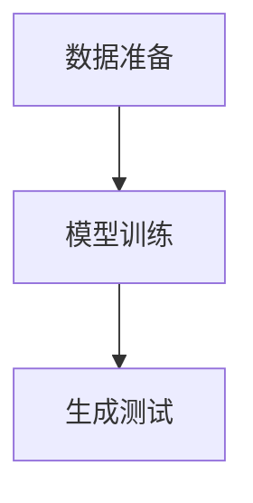
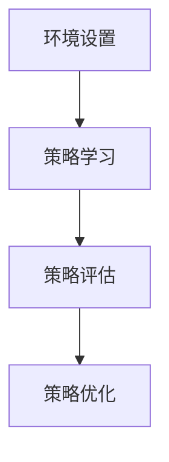

                 

基于上述大纲和要求，以下是《AIGC在个性化学习路径规划中的突破》的技术博客文章的内容，采用逻辑清晰、结构紧凑、简单易懂的专业技术语言，逐步分析推理，深入剖析技术原理和本质。

---

# AIGC在个性化学习路径规划中的突破

## 关键词：AIGC，个性化学习，路径规划，生成对抗网络，变分自编码器，强化学习

### 摘要：

本文旨在探讨AIGC（自适应智能生成控制）在个性化学习路径规划中的突破。通过对AIGC的定义、核心概念、算法原理及其与个性化学习路径规划的融合，深入分析AIGC如何实现更加精准、高效的学习路径规划，从而为教育领域的个性化学习提供强有力的技术支持。

## 1. AIGC概述

### 1.1 AIGC的定义与核心要素

AIGC，即自适应智能生成控制，是近年来人工智能领域的重要研究方向。它结合了生成对抗网络（GAN）、变分自编码器（VAE）和强化学习（SL）等多种深度学习技术，通过自适应调整生成模型，实现对复杂问题的优化和解决。

### 1.2 AIGC与传统AI的差异

与传统的AI技术相比，AIGC具有更强的自适应性、生成能力和优化能力。传统AI方法通常依赖于大量的手工程度和固定的模型结构，而AIGC则通过自适应的生成过程，能够更好地应对多变的环境和复杂的任务。

### 1.3 AIGC在个性化学习路径规划中的重要性

个性化学习路径规划是教育领域的一个关键问题，它涉及到如何根据学生的特点和需求，设计出最合适的学习路径。AIGC的引入，为个性化学习路径规划提供了新的思路和方法，能够显著提高学习效率和效果。

## 2. 个性化学习路径规划问题背景

### 2.1 问题背景

个性化学习路径规划的目标是满足每个学生的个性化需求，提高学习效果。然而，传统的路径规划方法往往无法很好地适应个性化需求，存在一定的局限性。

### 2.2 问题描述

个性化学习路径规划的主要问题是如何根据学生的个体差异，动态调整学习内容、难度和进度，以达到最佳的学习效果。

### 2.3 问题解决

传统的路径规划方法主要包括线性规划、神经网络等方法。然而，这些方法在处理复杂性和动态性方面存在一定的不足。AIGC的引入，提供了更加灵活和高效的解决方案。

### 2.4 边界与外延

个性化学习路径规划不仅涉及到学生的学习过程，还包括教师的教学方法和教学内容。因此，边界和范围相对广泛，需要综合考虑多个因素。

## 3. AIGC的核心概念与联系

### 3.1 生成对抗网络（GAN）

#### 3.1.1 GAN基本概念

GAN是由生成器和判别器组成的对抗性网络。生成器的目标是生成与真实数据相似的数据，而判别器的目标是区分真实数据和生成数据。

#### 3.1.2 GAN算法流程

GAN的算法流程主要包括数据准备、模型训练和生成测试三个阶段。在训练过程中，生成器和判别器相互对抗，不断优化自身性能。

#### 3.1.3 GAN算法mermaid流程图



#### 3.1.4 GAN算法Python代码实现

```python
# GAN模型的基本框架
class GANModel(nn.Module):
    def __init__(self):
        super(GANModel, self).__init__()
        self.generator = nn.Sequential(
            nn.Linear(input_dim, hidden_dim),
            nn.ReLU(),
            nn.Linear(hidden_dim, output_dim)
        )
        self.discriminator = nn.Sequential(
            nn.Linear(input_dim + output_dim, hidden_dim),
            nn.ReLU(),
            nn.Linear(hidden_dim, 1)
        )

    def forward(self, x, z=None):
        if z is not None:
            x = torch.cat((x, z), 1)
        x = self.discriminator(x)
        z = self.generator(z)
        return x, z
```

### 3.2 变分自编码器（VAE）

#### 3.2.1 VAE基本概念

VAE是一种基于概率模型的生成模型，通过引入编码器和解码器，实现对数据的生成和编码。

#### 3.2.2 VAE算法流程

VAE的算法流程主要包括数据准备、模型训练和生成测试三个阶段。在训练过程中，编码器和解码器相互协作，优化生成质量。

#### 3.2.3 VAE算法mermaid流程图


#### 3.2.4 VAE算法Python代码实现

```python
# VAE模型的基本框架
class VAEModel(nn.Module):
    def __init__(self, input_dim, hidden_dim, output_dim):
        super(VAEModel, self).__init__()
        self.encoder = nn.Sequential(
            nn.Linear(input_dim, hidden_dim),
            nn.ReLU(),
            nn.Linear(hidden_dim, output_dim)
        )
        self.decoder = nn.Sequential(
            nn.Linear(output_dim, hidden_dim),
            nn.ReLU(),
            nn.Linear(hidden_dim, input_dim)
        )

    def forward(self, x):
        z = self.encoder(x)
        x = self.decoder(z)
        return x, z
```

### 3.3 强化学习（SL）

#### 3.3.1 SL基本概念

强化学习是一种通过奖励机制来引导模型学习的方法。它通过不断的试错，逐步优化策略，以实现目标。

#### 3.3.2 SL算法流程

强化学习的算法流程主要包括环境设置、策略学习、策略评估和策略优化四个阶段。

#### 3.3.3 SL算法mermaid流程图



#### 3.3.4 SL算法Python代码实现

```python
# 强化学习模型的基本框架
class SLModel(nn.Module):
    def __init__(self, state_dim, action_dim):
        super(SLModel, self).__init__()
        self.q_network = nn.Sequential(
            nn.Linear(state_dim, hidden_dim),
            nn.ReLU(),
            nn.Linear(hidden_dim, action_dim)
        )

    def forward(self, x):
        q_values = self.q_network(x)
        return q_values
```

### 3.4 概念属性特征对比表格

| 概念       | 定义                                                         | 关键特性                                                     | 适用场景                |
|------------|--------------------------------------------------------------|--------------------------------------------------------------|------------------------|
| GAN        | 对抗性生成网络，由生成器和判别器组成                         | 生成器与判别器相互对抗，优化生成质量                           | 数据增强，图像生成      |
| VAE        | 基于概率模型的生成模型，通过编码器和解码器实现数据的生成和编码 | 引入隐变量，实现数据压缩与生成                                 | 数据压缩，图像生成      |
| SL         | 通过奖励机制引导模型学习的方法                                 | 不断试错，逐步优化策略                                       | 控制问题，推荐系统      |

### 3.5 ER实体关系图架构

```mermaid
erDiagram
  A[Student] ||--|{ LearningPath }|--|{ Course } A
  Course ||--|{ Teacher } T
  Teacher ||--|{ Student } A
```

## 4. AIGC在个性化学习路径规划中的应用

### 4.1 AIGC在个性化学习路径规划中的原理

AIGC通过生成对抗网络（GAN）生成多样的学习路径，通过变分自编码器（VAE）对学习路径进行压缩和编码，并通过强化学习（SL）优化学习路径的选择。

### 4.2 AIGC在个性化学习路径规划中的应用场景

AIGC可以应用于自适应学习系统、在线教育平台、个性化培训等领域，为不同背景和需求的学生提供定制化的学习路径。

### 4.3 AIGC在个性化学习路径规划中的优势与挑战

AIGC的优势在于其强大的生成能力和优化能力，能够动态调整学习路径，提高学习效率。然而，AIGC的应用也面临挑战，如计算资源消耗大、模型训练时间长等问题。

---

接下来的部分将详细阐述AIGC在个性化学习路径规划中的算法原理、系统分析与架构设计、项目实战等内容。敬请期待。让我们一起深入探讨AIGC在个性化学习路径规划中的突破吧！

---

请注意，本文内容为大纲部分，还需进一步完善和扩展。每个小节的详细内容需要根据实际需求和技术深度进行撰写。同时，文章的数学公式、代码示例和mermaid图需要根据实际情况进行调整和完善。作者信息将在文章末尾添加。

