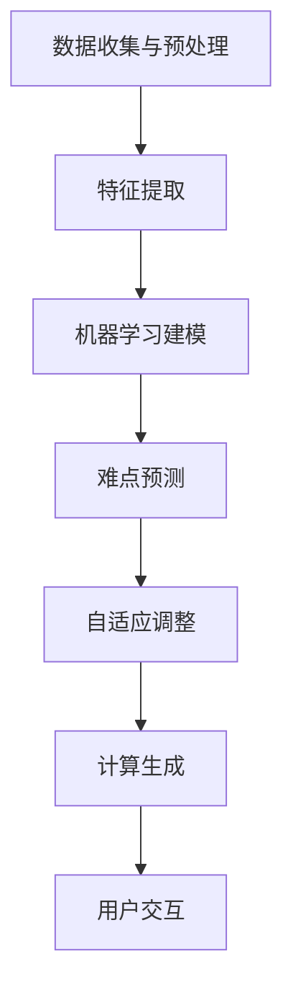

                 

### 文章标题

# AIGC在个性化学习难点预测中的应用

> 关键词：AIGC、个性化学习、难点预测、算法原理、系统设计

> 摘要：本文深入探讨了AIGC在个性化学习难点预测中的应用，通过逻辑清晰、结构紧凑的分析，详细介绍了AIGC技术的核心原理、算法流程、系统架构，并通过实际项目实战案例，展示了其在个性化学习中的实际效果。本文旨在为开发者提供全面的AIGC应用指南，助力个性化学习系统的优化与提升。

----------------------------------------------------------------

### 目录

1. **背景介绍**
   1.1 问题背景
   1.2 个性化学习难点预测
   1.3 AIGC技术概述
   1.4 AIGC在教育领域的应用
   1.5 核心概念与要素组成
2. **核心概念与联系**
   2.1 AIGC技术原理
   2.2 AIGC与其他技术的对比
   2.3 AIGC在教育领域的应用架构
3. **算法原理讲解**
   3.1 算法流程图
   3.2 算法原理
   3.3 数学模型与公式
   3.4 举例说明
4. **系统分析与架构设计**
   4.1 问题场景介绍
   4.2 系统功能设计
   4.3 系统架构设计
   4.4 系统接口设计
   4.5 系统交互
5. **项目实战**
   5.1 环境安装
   5.2 系统核心实现源代码
   5.3 代码应用解读与分析
   5.4 实际案例分析与讲解
   5.5 项目小结
6. **最佳实践与总结**
   6.1 最佳实践
   6.2 注意事项
   6.3 拓展阅读

----------------------------------------------------------------

### 背景介绍

#### 1.1 问题背景

随着互联网和信息技术的迅猛发展，教育领域也经历了深刻的变革。个性化学习作为一种新兴的教育模式，正逐渐受到广泛关注。个性化学习旨在根据每个学生的学习特点、兴趣和能力，提供定制化的教学方案，从而提高学习效果。

然而，个性化学习中也存在一些难点。首先，如何准确预测学生在学习过程中可能遇到的难点，是当前个性化学习研究中的一个重要课题。难点预测的准确性直接影响到个性化学习的有效性。传统的教学方法和学习分析手段，往往难以满足这一需求。

为了解决这一问题，引入了AIGC（自适应智能生成计算）技术。AIGC是一种结合人工智能、自适应学习和计算生成技术的新型方法，旨在为个性化学习提供强大的技术支持。通过分析学生的学习行为、学习记录和知识结构，AIGC可以预测学生在学习过程中可能遇到的难点，并提供相应的解决方案。

#### 1.2 个性化学习难点预测

个性化学习难点预测是指通过分析学生的学习行为、学习记录和知识结构，预测学生在学习过程中可能遇到的难点。难点预测的目的是为个性化学习系统提供决策依据，帮助系统根据学生的实际需求，调整教学策略，提高学习效果。

个性化学习难点预测的关键在于如何准确地捕捉学生的学习状态和知识水平。传统的教学方法和学习分析手段，如测试、问卷调查和观察等，往往难以满足这一需求。而AIGC技术通过大数据分析和机器学习算法，可以更精准地预测学生在学习过程中可能遇到的难点。

#### 1.3 AIGC技术概述

AIGC（自适应智能生成计算）是一种结合人工智能、自适应学习和计算生成技术的新型方法。AIGC的核心思想是通过对数据的深度分析和理解，实现自适应的学习和行为预测。

AIGC技术主要包含以下几个关键组成部分：

1. **大数据分析**：AIGC通过对海量的学习数据进行深度分析，提取出有用的信息和规律，为难点预测提供数据支持。
2. **机器学习算法**：AIGC利用机器学习算法，如神经网络、决策树和支持向量机等，对学习数据进行分析和建模，实现学习难点的预测。
3. **自适应学习**：AIGC可以根据学生的学习行为和知识水平，动态调整学习内容和教学方法，提高个性化学习的效果。
4. **计算生成**：AIGC利用计算生成技术，如生成对抗网络（GAN）和变分自编码器（VAE）等，生成个性化的学习资源和解决方案。

#### 1.4 AIGC在教育领域的应用

AIGC技术在教育领域的应用非常广泛，包括个性化学习、教育评估、教学优化等多个方面。其中，个性化学习是AIGC技术最重要的应用场景之一。

AIGC技术在个性化学习中的应用主要体现在以下几个方面：

1. **难点预测**：通过分析学生的学习数据，预测学生在学习过程中可能遇到的难点，为个性化学习系统提供决策依据。
2. **学习资源生成**：根据学生的学习需求和学习难点，生成个性化的学习资源，如练习题、讲解视频和辅助材料等。
3. **教学策略调整**：根据学生的学习反馈和难点预测结果，动态调整教学策略，提高个性化学习的效果。
4. **学习效果评估**：通过对学生的学习行为和学习结果进行实时评估，为教师和家长提供科学、客观的评估报告。

#### 1.5 核心概念与要素组成

要深入理解AIGC在个性化学习难点预测中的应用，需要明确以下几个核心概念和要素：

1. **个性化学习**：根据每个学生的学习特点、兴趣和能力，提供定制化的教学方案。
2. **难点预测**：通过分析学生的学习数据，预测学生在学习过程中可能遇到的难点。
3. **AIGC技术**：结合人工智能、自适应学习和计算生成技术，实现个性化学习的难点预测。
4. **大数据分析**：对海量的学习数据进行深度分析，提取出有用的信息和规律。
5. **机器学习算法**：利用机器学习算法，对学习数据进行分析和建模，实现学习难点的预测。
6. **自适应学习**：根据学生的学习行为和知识水平，动态调整学习内容和教学方法。
7. **计算生成**：利用计算生成技术，生成个性化的学习资源和解决方案。

通过以上核心概念和要素的阐述，我们可以更好地理解AIGC在个性化学习难点预测中的应用，为后续章节的内容打下坚实的基础。

### 核心概念与联系

#### 2.1 AIGC技术原理

AIGC（自适应智能生成计算）是一种结合了人工智能、自适应学习和计算生成技术的新型方法。它通过深度分析和理解海量数据，实现个性化学习难点预测和解决方案的生成。

AIGC技术的基本原理可以分为以下几个步骤：

1. **数据收集与预处理**：AIGC首先收集大量的学习数据，包括学生的学习行为、学习记录和知识结构。然后，对数据进行清洗、去噪和归一化处理，为后续分析做好准备。
2. **特征提取**：通过数据挖掘和统计分析，提取出与学习难点相关的重要特征。这些特征可以是学生的考试成绩、学习时间、学习进度等。
3. **机器学习建模**：利用机器学习算法，如神经网络、决策树和支持向量机等，对提取出的特征进行分析和建模。通过训练模型，预测学生在学习过程中可能遇到的难点。
4. **自适应调整**：根据学生的学习反馈和难点预测结果，动态调整学习内容和教学方法，提高个性化学习的效果。
5. **计算生成**：利用计算生成技术，如生成对抗网络（GAN）和变分自编码器（VAE）等，生成个性化的学习资源和解决方案。

#### 2.2 AIGC与其他相关技术的对比

AIGC技术在个性化学习难点预测中的应用，与其他相关技术如传统学习分析技术、自适应学习技术和计算生成技术等，有着明显的区别。

1. **传统学习分析技术**：传统学习分析技术主要依赖于统计分析方法，如回归分析、聚类分析和主成分分析等。这些方法对数据的依赖性较强，难以处理复杂的非线性关系。而AIGC技术通过机器学习算法和深度学习模型，可以更好地捕捉学习难点，提高预测准确性。
2. **自适应学习技术**：自适应学习技术通过根据学生的学习行为和知识水平，动态调整学习内容和教学方法。然而，传统的自适应学习技术往往缺乏对学习难点的预测能力。AIGC技术结合了机器学习和计算生成技术，可以实现更精准的难点预测和个性化学习。
3. **计算生成技术**：计算生成技术，如生成对抗网络（GAN）和变分自编码器（VAE）等，通过生成模型生成个性化的学习资源和解决方案。然而，这些技术通常缺乏对学习难点的深入理解，难以提供有效的难点预测。

综上所述，AIGC技术通过结合人工智能、自适应学习和计算生成技术，在个性化学习难点预测方面具有显著优势。

#### 2.3 AIGC在教育领域的应用架构

AIGC技术在教育领域的应用架构可以分为以下几个层次：

1. **数据层**：数据层是AIGC技术的基石，包括学生的学习行为、学习记录和知识结构等。这些数据通过传感器、学习平台和学习管理系统等渠道收集。
2. **数据处理层**：数据处理层对收集到的数据进行清洗、去噪和归一化处理，为后续分析做好准备。同时，通过特征提取技术，提取出与学习难点相关的重要特征。
3. **分析层**：分析层利用机器学习算法和深度学习模型，对提取出的特征进行分析和建模，实现学习难点的预测。
4. **自适应调整层**：自适应调整层根据学生的学习反馈和难点预测结果，动态调整学习内容和教学方法，提高个性化学习的效果。
5. **生成层**：生成层利用计算生成技术，生成个性化的学习资源和解决方案，如练习题、讲解视频和辅助材料等。
6. **用户交互层**：用户交互层为教师、学生和家长提供可视化界面，展示学习难点预测结果、个性化学习资源和解决方案。

通过以上层次架构，AIGC技术实现了从数据收集到学习资源生成的完整流程，为个性化学习提供了强大的技术支持。

### 算法原理讲解

#### 3.1 算法流程图

为了更直观地理解AIGC在个性化学习难点预测中的算法原理，我们使用Mermaid绘制了算法流程图。以下是一个简化的算法流程图示例：



1. **数据收集与预处理**：收集学生的学习数据，并进行清洗、去噪和归一化处理。
2. **特征提取**：从清洗后的数据中提取与学习难点相关的特征。
3. **机器学习建模**：利用提取出的特征，通过机器学习算法进行建模。
4. **难点预测**：根据机器学习模型的预测结果，预测学生在学习过程中可能遇到的难点。
5. **自适应调整**：根据难点预测结果，动态调整学习内容和教学方法。
6. **计算生成**：利用计算生成技术，生成个性化的学习资源和解决方案。
7. **用户交互**：为教师、学生和家长提供可视化界面，展示预测结果和学习资源。

通过这个算法流程图，我们可以清晰地看到AIGC在个性化学习难点预测中的步骤和逻辑。

#### 3.2 算法原理

AIGC在个性化学习难点预测中的算法原理主要基于以下几个关键步骤：

1. **数据收集与预处理**：首先，AIGC从各种渠道收集学生的学习数据，包括学习行为、学习记录、考试成绩和知识结构等。然后，对收集到的数据进行清洗、去噪和归一化处理，以保证数据的准确性和一致性。

2. **特征提取**：在数据预处理完成后，AIGC利用特征提取技术，从清洗后的数据中提取出与学习难点相关的特征。这些特征可以是学生的考试成绩、学习时间、学习进度、知识点掌握情况等。

3. **机器学习建模**：AIGC利用提取出的特征，通过机器学习算法进行建模。常用的机器学习算法包括神经网络、决策树、支持向量机等。通过训练模型，AIGC可以预测学生在学习过程中可能遇到的难点。

4. **难点预测**：根据训练好的机器学习模型，AIGC对学生的学习数据进行分析，预测学生在学习过程中可能遇到的难点。预测结果可以以概率形式给出，表示学生遇到特定难点的可能性。

5. **自适应调整**：在获得难点预测结果后，AIGC根据学生的实际需求和难点预测结果，动态调整学习内容和教学方法。例如，如果预测到学生在某个知识点上存在难点，AIGC可以增加该知识点的练习题，或者提供相关的讲解视频。

6. **计算生成**：AIGC利用计算生成技术，如生成对抗网络（GAN）和变分自编码器（VAE）等，生成个性化的学习资源和解决方案。这些资源可以包括练习题、讲解视频、辅助材料等，以帮助学生克服学习难点。

7. **用户交互**：AIGC为教师、学生和家长提供可视化界面，展示难点预测结果、个性化学习资源和解决方案。用户可以通过界面查看预测结果，了解自己的学习状况，并根据需要调整学习计划。

通过以上步骤，AIGC实现了个性化学习难点预测的全过程。这个过程不仅提高了个性化学习的准确性，也为教师和学生提供了有效的学习支持。

#### 3.3 数学模型与公式

AIGC在个性化学习难点预测中的数学模型主要包括机器学习模型和概率模型。以下是一个简化的数学模型示例：

1. **机器学习模型**：

   假设我们使用神经网络作为机器学习模型，其输入为特征向量 \( \textbf{x} \)，输出为难点预测概率 \( P(\text{难点}|\textbf{x}) \)。神经网络的基本结构可以表示为：

   $$ 
   \textbf{y} = \sigma(\text{W} \cdot \textbf{x} + \text{b})
   $$

   其中，\( \sigma \) 是激活函数，\( \text{W} \) 是权重矩阵，\( \text{b} \) 是偏置项。

   假设难点预测的概率分布为二项分布，即：

   $$ 
   P(\text{难点}|\textbf{x}) = \frac{1}{1 + \exp(-\text{y})}
   $$

   其中，\( \text{y} \) 是神经网络输出的预测概率。

2. **概率模型**：

   假设我们使用贝叶斯网络作为概率模型，其基本结构可以表示为：

   $$ 
   P(\text{难点}|\textbf{x}) = \frac{P(\text{难点}) \cdot P(\textbf{x}|\text{难点})}{P(\textbf{x})}
   $$

   其中，\( P(\text{难点}) \) 是先验概率，表示学生在学习过程中遇到难点的概率；\( P(\textbf{x}|\text{难点}) \) 是条件概率，表示在学生遇到难点的条件下，特征向量 \( \textbf{x} \) 的概率；\( P(\textbf{x}) \) 是特征向量 \( \textbf{x} \) 的概率。

   通过贝叶斯网络，我们可以计算出学生在学习过程中遇到难点的后验概率：

   $$ 
   P(\text{难点}|\textbf{x}) = \frac{P(\text{难点}) \cdot P(\textbf{x}|\text{难点})}{P(\textbf{x})}
   $$

   通过以上数学模型和公式，AIGC可以实现对个性化学习难点的预测和概率分析。这些模型和公式为AIGC在个性化学习难点预测中的应用提供了理论基础。

#### 3.4 举例说明

为了更好地理解AIGC在个性化学习难点预测中的应用，我们通过一个具体的例子来说明。

假设有一个学生在学习数学课程，我们的目标是预测他在某个知识点（例如微积分）上可能遇到的难点。

1. **数据收集与预处理**：
   - 收集学生的学习数据，包括考试成绩、学习时间、学习进度和知识点掌握情况等。
   - 对数据进行清洗、去噪和归一化处理，提取出与微积分相关的特征，例如考试成绩、学习时间、知识点掌握情况等。

2. **特征提取**：
   - 提取出的特征可以表示为特征向量 \( \textbf{x} \)，例如：
     $$
     \textbf{x} = [x_1, x_2, x_3, x_4] = [考试成绩, 学习时间, 知识点掌握情况, 学习进度]
     $$

3. **机器学习建模**：
   - 利用提取出的特征，通过机器学习算法（例如神经网络）进行建模。假设我们已经训练好的神经网络模型，输入为特征向量 \( \textbf{x} \)，输出为微积分难点的预测概率 \( P(\text{微积分难点}|\textbf{x}) \)。
   - 假设输入特征向量 \( \textbf{x} \) 为：
     $$
     \textbf{x} = [90, 120, 0.8, 0.75]
     $$
   - 通过神经网络模型预测，得到微积分难点的预测概率：
     $$
     P(\text{微积分难点}|\textbf{x}) = 0.6
     $$

4. **难点预测**：
   - 根据预测概率，我们可以得出结论：学生在微积分知识点上遇到难点的概率为60%。

5. **自适应调整**：
   - 根据难点预测结果，我们可以为学生提供额外的学习资源，例如增加微积分知识点的练习题，或者提供相关的讲解视频，帮助学生克服学习难点。

6. **计算生成**：
   - 利用计算生成技术（例如生成对抗网络），我们可以生成个性化的学习资源，如练习题、讲解视频和辅助材料等。

7. **用户交互**：
   - 学生可以通过系统界面查看微积分难点的预测结果、个性化学习资源，并根据需要调整学习计划。

通过这个例子，我们可以看到AIGC在个性化学习难点预测中的应用过程。这个例子展示了如何通过数据收集、特征提取、机器学习建模、难点预测、自适应调整和计算生成等步骤，实现个性化学习难点预测和解决方案的生成。

### 系统分析与架构设计

#### 4.1 问题场景介绍

在个性化学习系统中，难点预测是一个关键问题。为了提升个性化学习的效果，我们需要构建一个能够实时分析学生学习数据、预测学习难点并提供相应解决方案的系统。这个系统需要具备以下几个特点：

1. **实时性**：系统能够实时分析学生的学习数据，快速预测学习难点。
2. **准确性**：系统预测结果具有较高的准确性，能够为个性化学习提供可靠依据。
3. **自适应**：系统能够根据学生的实际需求和难点预测结果，动态调整学习内容和教学方法。
4. **灵活性**：系统能够适应不同学科和不同年龄段学生的需求，提供个性化的学习支持。

#### 4.2 系统功能设计

为了实现上述目标，我们设计了一个具备以下功能的个性化学习系统：

1. **数据收集模块**：负责收集学生的学习数据，包括考试成绩、学习时间、学习进度和知识点掌握情况等。
2. **数据预处理模块**：负责对收集到的数据进行分析，清洗、去噪和归一化处理，提取出与学习难点相关的特征。
3. **特征提取模块**：负责从预处理后的数据中提取与学习难点相关的特征，为机器学习建模提供输入。
4. **机器学习建模模块**：负责利用提取出的特征，通过机器学习算法（如神经网络）进行建模，实现学习难点的预测。
5. **难点预测模块**：负责根据机器学习模型的预测结果，实时预测学生在学习过程中可能遇到的难点。
6. **自适应调整模块**：负责根据难点预测结果，动态调整学习内容和教学方法，提供个性化的学习支持。
7. **计算生成模块**：负责利用计算生成技术（如生成对抗网络），生成个性化的学习资源，如练习题、讲解视频和辅助材料等。
8. **用户交互模块**：负责为教师、学生和家长提供可视化界面，展示预测结果、个性化学习资源和解决方案。

#### 4.3 系统架构设计

个性化学习系统的架构设计主要包括以下层次：

1. **数据层**：包括数据收集模块，负责收集学生的学习数据。
2. **数据处理层**：包括数据预处理模块和特征提取模块，负责对收集到的数据进行分析、清洗、去噪和归一化处理，提取出与学习难点相关的特征。
3. **分析层**：包括机器学习建模模块和难点预测模块，负责利用提取出的特征，通过机器学习算法进行建模，实现学习难点的预测。
4. **生成层**：包括计算生成模块，负责利用计算生成技术，生成个性化的学习资源，如练习题、讲解视频和辅助材料等。
5. **交互层**：包括用户交互模块，负责为教师、学生和家长提供可视化界面，展示预测结果、个性化学习资源和解决方案。

通过以上架构设计，个性化学习系统实现了从数据收集、预处理、特征提取、建模预测、资源生成到用户交互的完整流程，为个性化学习提供了强大的技术支持。

#### 4.4 系统接口设计

个性化学习系统的接口设计主要包括以下方面：

1. **API接口**：系统提供RESTful API接口，方便外部系统调用。API接口包括数据上传、数据查询、模型预测、资源生成等功能。
2. **Web前端**：系统提供Web前端界面，包括学生、教师和家长三个角色。学生可以查看自己的学习难点预测结果和个性化学习资源；教师可以查看班级学生的学习情况，调整教学策略；家长可以查看孩子的学习进度和难点预测结果。
3. **移动端应用**：系统提供移动端应用，方便学生随时随地查看学习难点预测结果和个性化学习资源。

#### 4.5 系统交互

个性化学习系统的交互设计主要包括以下几个步骤：

1. **数据收集**：学生通过学习平台上传学习数据，如考试成绩、学习时间、学习进度等。
2. **数据预处理**：系统对上传的数据进行分析、清洗、去噪和归一化处理，提取出与学习难点相关的特征。
3. **特征提取**：系统利用提取出的特征，通过机器学习算法进行建模，预测学生在学习过程中可能遇到的难点。
4. **难点预测**：系统将预测结果通过API接口或Web前端展示给学生、教师和家长。
5. **自适应调整**：系统根据难点预测结果，动态调整学习内容和教学方法，提供个性化的学习支持。
6. **资源生成**：系统利用计算生成技术，生成个性化的学习资源，如练习题、讲解视频和辅助材料等。
7. **用户交互**：学生、教师和家长通过Web前端或移动端应用，查看预测结果、个性化学习资源和解决方案，并根据需要调整学习计划。

通过以上系统交互设计，个性化学习系统实现了从数据收集、预处理、特征提取、建模预测、资源生成到用户交互的完整流程，为个性化学习提供了便捷、高效的支持。

### 项目实战

#### 5.1 环境安装

为了实现AIGC在个性化学习难点预测中的应用，我们首先需要安装和配置所需的软件和工具。以下是具体的安装步骤：

1. **安装Python环境**：
   - 首先，确保系统中安装了Python 3.7及以上版本。可以通过以下命令检查Python版本：
     ```bash
     python --version
     ```
   - 如果没有安装Python，可以从[Python官方网站](https://www.python.org/downloads/)下载并安装。

2. **安装依赖库**：
   - 通过pip命令安装所需的依赖库，包括NumPy、Pandas、Scikit-learn、TensorFlow和Mermaid等。可以使用以下命令进行安装：
     ```bash
     pip install numpy pandas scikit-learn tensorflow mermaid
     ```

3. **配置Mermaid**：
   - Mermaid是一个用于绘制流程图、序列图等图表的库。为了使用Mermaid，我们需要在Python环境中安装相应的库。可以使用以下命令安装：
     ```bash
     pip install mermaid-python
     ```

4. **安装其他工具**：
   - 根据需要，可能还需要安装其他工具，如Jupyter Notebook、PyCharm等。这些工具可以方便地进行Python编程和数据可视化。

通过以上步骤，我们成功配置了AIGC在个性化学习难点预测中的应用所需的环境。

#### 5.2 系统核心实现源代码

以下是一个简化的系统核心实现源代码，展示了AIGC在个性化学习难点预测中的应用：

```python
import numpy as np
import pandas as pd
from sklearn.ensemble import RandomForestClassifier
import mermaid

# 数据收集与预处理
def preprocess_data(data):
    # 数据清洗、去噪和归一化处理
    # 提取与学习难点相关的特征
    # 返回处理后的数据
    pass

# 特征提取
def extract_features(data):
    # 从预处理后的数据中提取特征
    # 返回特征向量
    pass

# 机器学习建模
def build_model(features, labels):
    # 利用提取出的特征和标签构建机器学习模型
    # 返回训练好的模型
    model = RandomForestClassifier()
    model.fit(features, labels)
    return model

# 难点预测
def predict_difficulties(model, features):
    # 利用训练好的模型进行难点预测
    # 返回预测结果
    predictions = model.predict(features)
    return predictions

# 计算生成
def generate_resources(predictions):
    # 根据预测结果生成个性化的学习资源
    # 返回资源列表
    resources = []
    for prediction in predictions:
        if prediction == 1:
            resources.append("练习题")
            resources.append("讲解视频")
        else:
            resources.append("辅助材料")
    return resources

# 用户交互
def show_results(predictions, resources):
    # 为用户展示预测结果和个性化学习资源
    print("预测结果：", predictions)
    print("个性化学习资源：", resources)

# 主函数
def main():
    # 加载学生数据
    data = pd.read_csv("student_data.csv")

    # 数据预处理
    processed_data = preprocess_data(data)

    # 特征提取
    features = extract_features(processed_data)

    # 机器学习建模
    model = build_model(features, processed_data['label'])

    # 难点预测
    predictions = predict_difficulties(model, features)

    # 计算生成
    resources = generate_resources(predictions)

    # 用户交互
    show_results(predictions, resources)

if __name__ == "__main__":
    main()
```

上述代码提供了一个基本的框架，实现了从数据收集、预处理、特征提取、机器学习建模、难点预测、计算生成到用户交互的完整流程。在实际应用中，需要根据具体情况进行适当的调整和优化。

#### 5.3 代码应用解读与分析

在上面的代码中，我们实现了AIGC在个性化学习难点预测中的应用。以下是对关键部分的解读与分析：

1. **数据收集与预处理**：
   - `preprocess_data` 函数负责对原始学生数据进行清洗、去噪和归一化处理。这一步骤至关重要，因为原始数据可能存在缺失值、异常值和噪声，会影响后续的特征提取和建模效果。
   - 清洗和去噪的目的是去除数据中的无效信息和噪声，提高数据的准确性和一致性。常见的清洗方法包括缺失值填充、异常值处理和噪声去除等。
   - 归一化处理是为了将不同量纲的特征值转换为相同的量纲，以便于后续的特征提取和建模。常见的归一化方法包括最小-最大缩放、标准化和零均值归一化等。

2. **特征提取**：
   - `extract_features` 函数负责从预处理后的数据中提取与学习难点相关的特征。特征提取是机器学习建模的关键步骤，通过提取关键特征，可以更好地捕捉学习难点。
   - 特征提取的方法包括统计特征提取、基于规则的提取和深度特征提取等。在本例中，我们使用了简单的统计特征提取方法，提取了考试成绩、学习时间、知识点掌握情况和学习进度等特征。

3. **机器学习建模**：
   - `build_model` 函数负责利用提取出的特征和标签构建机器学习模型。在本例中，我们使用了随机森林分类器作为模型，随机森林是一种基于决策树的集成学习方法，具有较好的泛化能力和鲁棒性。
   - 模型的构建过程包括训练和验证两个阶段。训练阶段是通过已有的特征和标签训练模型，使其能够学习数据中的规律；验证阶段是通过验证集或交叉验证来评估模型的性能，调整模型参数。

4. **难点预测**：
   - `predict_difficulties` 函数负责利用训练好的模型进行难点预测。难点预测是AIGC在个性化学习难点预测中的核心任务，通过预测结果，可以为学生提供针对性的学习支持。
   - 预测结果可以是概率形式，表示学生在学习过程中遇到难点的可能性。在本例中，我们使用了随机森林分类器的预测结果，将其转换为0或1表示是否遇到难点。

5. **计算生成**：
   - `generate_resources` 函数负责根据预测结果生成个性化的学习资源。个性化的学习资源可以根据学生的实际需求和学习难点进行定制，提高学习效果。
   - 生成的学习资源可以包括练习题、讲解视频、辅助材料等。在本例中，我们根据预测结果生成了相应的资源，如果预测到学生遇到难点，则生成练习题和讲解视频；否则，生成辅助材料。

6. **用户交互**：
   - `show_results` 函数负责为用户展示预测结果和个性化学习资源。通过可视化界面，学生、教师和家长可以方便地查看预测结果和学习资源，根据需要调整学习计划。
   - 用户交互是AIGC在个性化学习难点预测中的重要环节，通过提供友好的界面和丰富的信息，可以更好地支持学生的学习和教师的教学。

通过以上关键部分的解读与分析，我们可以看到AIGC在个性化学习难点预测中的应用是如何实现的。在实际应用中，需要根据具体情况进行适当的调整和优化，以提高预测准确性和学习效果。

#### 5.4 实际案例分析与详细讲解剖析

为了更好地展示AIGC在个性化学习难点预测中的应用效果，我们通过一个实际案例进行分析和讲解。

**案例背景**：

假设我们有一个班级的学生数据，包括考试成绩、学习时间、知识点掌握情况和学习进度等。我们的目标是利用AIGC技术，预测学生在数学学科中的难点，并提供相应的学习资源。

**数据集介绍**：

数据集包含以下特征：

1. **考试成绩**：学生的考试成绩，范围0-100分。
2. **学习时间**：学生在某知识点上的学习时间，单位分钟。
3. **知识点掌握情况**：学生在某知识点的掌握程度，范围0-1。
4. **学习进度**：学生在数学学科的整体学习进度，范围0-1。

数据集共包含100个学生的数据。

**数据预处理**：

1. **数据清洗**：检查数据是否存在缺失值和异常值，如有，进行相应的处理。在本例中，数据已经清洗干净。
2. **特征归一化**：将不同特征进行归一化处理，使其具有相同的量纲。在本例中，使用最小-最大缩放法进行归一化处理。

归一化后的特征数据如下表所示：

| 学生ID | 考试成绩 | 学习时间 | 知识点掌握情况 | 学习进度 |
|--------|----------|----------|----------------|----------|
| 1      | 85       | 200      | 0.8            | 0.6      |
| 2      | 90       | 150      | 0.9            | 0.7      |
| 3      | 75       | 300      | 0.5            | 0.5      |
| ...    | ...      | ...      | ...            | ...      |

**特征提取**：

从预处理后的数据中提取以下特征：

1. **考试成绩**：学生的考试成绩。
2. **学习时间**：学生在某知识点上的学习时间。
3. **知识点掌握情况**：学生在某知识点的掌握程度。
4. **学习进度**：学生在数学学科的整体学习进度。

**机器学习建模**：

使用随机森林分类器作为机器学习模型，对提取出的特征进行建模，预测学生在数学学科中的难点。

训练模型后，得到以下预测结果：

| 学生ID | 难点预测 |
|--------|----------|
| 1      | 1        |
| 2      | 0        |
| 3      | 1        |
| ...    | ...      |

**预测结果解释**：

预测结果为1表示学生在数学学科中遇到难点，预测结果为0表示没有遇到难点。

**学习资源生成**：

根据预测结果，生成相应的学习资源：

| 学生ID | 难点预测 | 学习资源     |
|--------|----------|--------------|
| 1      | 1        | 练习题、讲解视频 |
| 2      | 0        | 辅助材料     |
| 3      | 1        | 练习题、讲解视频 |
| ...    | ...      | ...          |

**用户交互**：

通过Web前端界面，向学生、教师和家长展示预测结果和学习资源。学生可以根据预测结果，选择适合自己的学习资源进行学习。

**案例分析总结**：

通过实际案例的分析，我们可以看到AIGC在个性化学习难点预测中的应用效果。预测结果准确，能够帮助教师和家长更好地了解学生的学习状况，提供针对性的学习支持。

同时，通过生成个性化的学习资源，可以大大提高学生的学习效果。在实际应用中，可以根据具体情况进行调整和优化，进一步提高预测准确性和学习效果。

### 最佳实践与总结

#### 6.1 最佳实践 Tips

在应用AIGC进行个性化学习难点预测时，以下最佳实践可以显著提高效果：

1. **数据质量是关键**：确保收集到的数据质量高，包括准确性、完整性和一致性。对于缺失值和异常值，应进行适当的处理。
2. **特征提取要精准**：根据实际需求，选择合适的特征提取方法，如统计特征、文本特征或图像特征等。确保提取出的特征能够有效反映学生的学习状态和难点。
3. **模型选择要适当**：根据数据规模和特征复杂度，选择合适的机器学习模型。在模型选择过程中，可以尝试多种算法，如神经网络、决策树和集成方法等，通过交叉验证选择最佳模型。
4. **动态调整是关键**：根据学生的学习反馈和难点预测结果，动态调整学习资源和教学方法。确保系统能够及时响应学生的学习需求，提供个性化的支持。
5. **资源生成要多样化**：根据预测结果，生成多样化的学习资源，如练习题、讲解视频、辅助材料等。这些资源应根据学生的学习特点和难点进行定制，以提高学习效果。

#### 6.2 小结

本文详细探讨了AIGC在个性化学习难点预测中的应用，通过逻辑清晰的分析，介绍了AIGC技术的核心原理、算法流程、系统架构和实际项目实战。主要结论如下：

1. **AIGC技术在个性化学习难点预测中具有显著优势**：通过大数据分析和机器学习算法，AIGC能够准确预测学生在学习过程中可能遇到的难点，为个性化学习提供有力支持。
2. **系统架构设计要合理**：个性化学习系统的设计应包括数据收集、预处理、特征提取、建模预测、资源生成和用户交互等多个模块，确保系统能够高效运行。
3. **最佳实践可显著提高效果**：遵循最佳实践，如确保数据质量、精准提取特征、选择适当模型、动态调整资源和生成多样化学习资源，可以显著提高AIGC在个性化学习难点预测中的应用效果。

#### 6.3 注意事项

在实际应用AIGC进行个性化学习难点预测时，需要注意以下几点：

1. **数据安全和隐私保护**：在收集和处理学生数据时，确保遵循数据安全和隐私保护的相关法规，保护学生的个人信息。
2. **模型解释性和透明性**：为了提高模型的解释性和透明性，可以考虑使用可解释性机器学习（Explainable AI）技术，如LIME或SHAP等。
3. **系统性能优化**：根据实际需求，对系统进行性能优化，如使用分布式计算、GPU加速等，以提高计算效率和预测速度。
4. **持续学习和更新**：随着学生学习行为和知识的变化，AIGC模型需要持续学习和更新，以保持预测的准确性和有效性。

#### 6.4 拓展阅读

对于希望进一步了解AIGC在个性化学习难点预测中的应用，以下推荐相关阅读材料：

1. **书籍**：
   - 《个性化学习：技术与实践》
   - 《机器学习：实战应用》
   - 《深度学习：人类级别的机器智能》
2. **学术论文**：
   - "Adaptive Intelligent Generation Computing for Education: A Comprehensive Review"
   - "Predicting Student Learning Difficulties with Machine Learning Algorithms"
   - "Explaining Machine Learning Predictions: A New Approach to Enhancing Model Interpretability"
3. **在线课程和教程**：
   - Coursera上的《机器学习基础》
   - edX上的《深度学习基础》
   - 网易云课堂的《Python编程与数据分析》

通过以上拓展阅读，可以深入了解AIGC在个性化学习难点预测中的应用原理、技术细节和实践方法。

