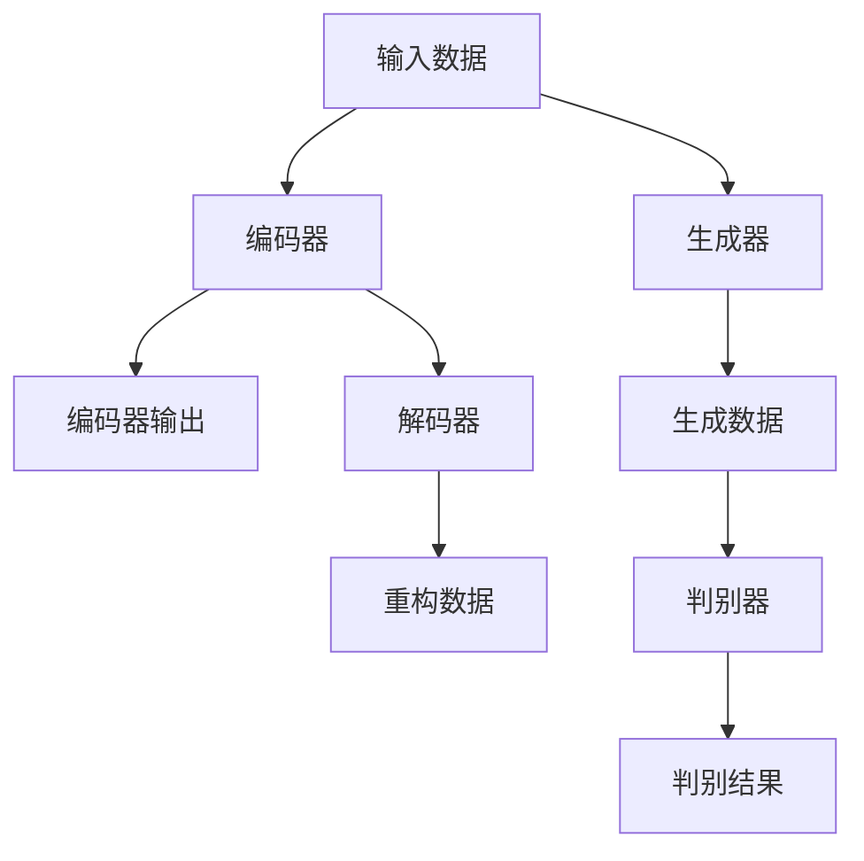
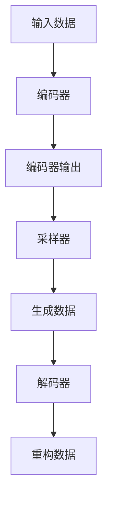
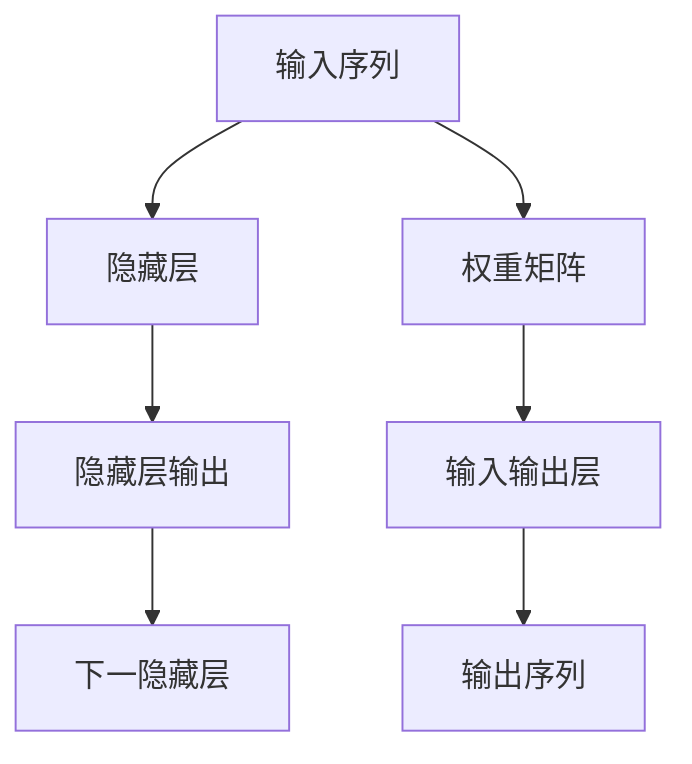
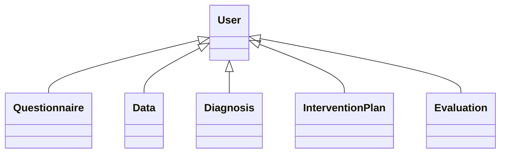
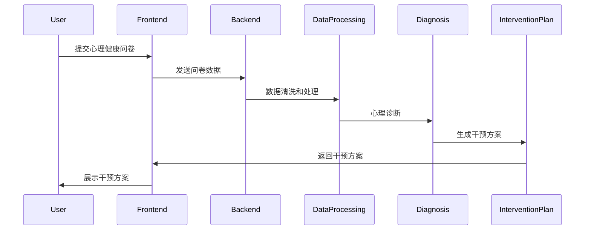
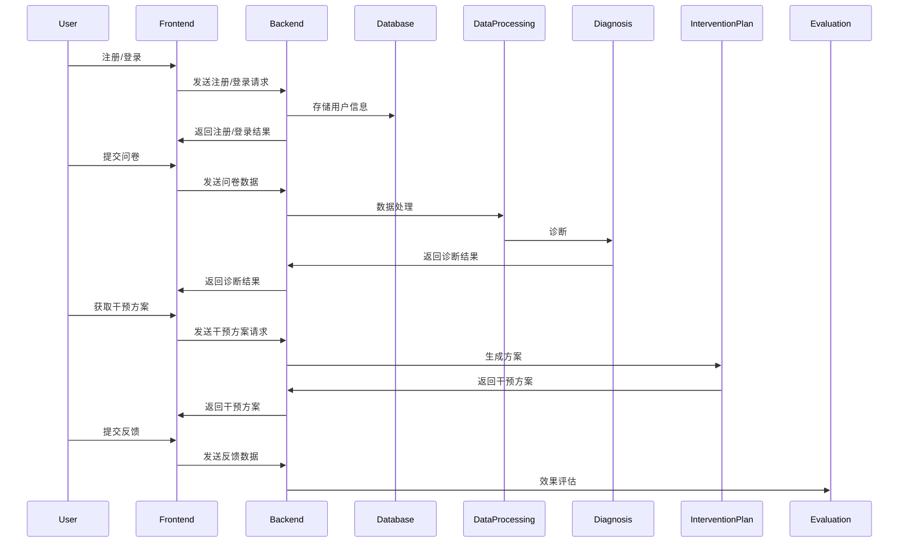

                 


## AIGC在个性化心理健康干预中的应用

关键词：AIGC、心理健康干预、个性化、生成式AI、智能心理咨询

摘要：本文将探讨生成式AI（AIGC）技术在个性化心理健康干预中的应用，分析其技术原理、核心概念及其在干预过程中的具体实现，并对系统分析与架构设计方案进行详细阐述。

### 第一部分：背景介绍

#### 1.1 问题背景

随着社会生活节奏的加快，心理健康问题日益凸显，而传统的心理健康干预方法存在诸多不足。AIGC技术的发展为心理健康干预提供了新的契机，其生成式AI的特性使得个性化干预成为可能。本文将围绕AIGC在心理健康干预中的应用展开讨论。

#### 1.2 问题描述

传统心理健康干预方法主要依赖咨询师的人工操作和经验，干预效果受限于个人经验和知识水平。同时，心理咨询师资源有限，无法满足广大用户的需求。而AIGC技术通过自动化生成内容，有望提高干预的个性化程度和效率。

#### 1.3 问题解决

AIGC技术在心理健康干预中的应用，可以通过以下几个步骤实现：

1. **数据收集与处理**：收集用户的心理健康数据，进行数据清洗和处理。
2. **心理评估与诊断**：利用AIGC生成个性化的心理评估问卷，进行心理诊断。
3. **干预方案生成**：根据诊断结果，自动生成个性化的干预方案。
4. **干预实施与效果评估**：将干预方案通过线上平台提供给用户，并实时跟踪效果。

#### 1.4 边界与外延

AIGC在心理健康干预中的应用需考虑伦理、法律和社会影响等问题。例如，用户隐私保护、数据安全、干预效果评估等。

#### 1.5 概念结构与核心要素组成

AIGC在心理健康干预中的概念结构主要包括数据收集与处理、心理评估与诊断、干预方案生成、干预实施与效果评估等核心要素。

### 第二部分：核心概念与联系

#### 2.1 AIGC技术原理

AIGC技术是基于人工智能算法自动生成内容的技术，主要包括生成对抗网络（GAN）、变分自编码器（VAE）和递归神经网络（RNN）等。

**表1：AIGC核心概念属性特征对比**

| 名称 | GAN | VAE | RNN |
| --- | --- | --- | --- |
| 对抗训练 | 是 | 否 | 否 |
| 概率分布学习 | 是 | 是 | 否 |
| 序列数据处理 | 否 | 否 | 是 |

**图1：AIGC技术ER实体关系图**

```mermaid
erDiagram
  User ||--|{ Questionnaire }|-->咨询师
  User ||--|{ Data }|-->数据分析
  User ||--|{ Diagnosis }|-->诊断结果
  User ||--|{ InterventionPlan }|-->干预方案
  User ||--|{ Evaluation }|-->效果评估
```

### 第三部分：算法原理讲解

#### 3.1 算法原理

AIGC技术的主要算法原理包括：

1. **生成对抗网络（GAN）**：由生成器（Generator）和判别器（Discriminator）组成，通过对抗训练生成高质量的内容。
2. **变分自编码器（VAE）**：通过编码器（Encoder）和解码器（Decoder）结构，学习数据的概率分布，生成类似的数据。
3. **递归神经网络（RNN）**：通过记忆机制处理序列数据，生成连贯的内容。

**图2：GAN算法流程图**



**图3：VAE算法流程图**



**图4：RNN算法流程图**



#### 3.2 数学模型与公式

**GAN算法**

$$
D(x) = \frac{1}{2} \log(D(x)) + \frac{1}{2} \log(1 - D(G(z)))
$$

**VAE算法**

$$
\pi(\theta|x) = \frac{1}{Z(x)} \exp(-\frac{1}{2} x^T \Sigma^{-1} x)
$$

$$
\phi(\theta) = \int \pi(\theta|x) dx
$$

**RNN算法**

$$
h_t = \sigma(W_h h_{t-1} + W_x x_t + b_h)
$$

$$
y_t = W_y h_t + b_y
$$

### 第四部分：系统分析与架构设计方案

#### 4.1 问题场景介绍

在心理健康干预领域，用户需求多样，心理咨询师资源有限。AIGC技术可以通过智能心理咨询系统，为用户提供个性化、高效的心理健康干预服务。

#### 4.2 项目介绍

项目名称：心理健康智能干预系统（HealthMind）

项目目标：利用AIGC技术，构建一个智能化、个性化的心理健康干预系统，提高干预效果和用户满意度。

#### 4.3 系统功能设计

1. **用户管理**：注册、登录、个人信息管理等功能。
2. **心理健康评估**：基于AIGC生成个性化评估问卷，进行心理诊断。
3. **干预方案生成**：根据评估结果，自动生成个性化干预方案。
4. **干预实施与效果评估**：线上干预方案实施，实时跟踪效果，提供反馈。

**图5：领域模型类图**



#### 4.4 系统架构设计

系统采用前后端分离的架构，前端负责用户交互，后端负责数据处理和算法实现。

**图6：系统架构设计图**



#### 4.5 系统接口设计

系统提供RESTful API接口，支持用户操作和系统功能调用。

**图7：系统接口设计图**

```mermaid
graph TD
    User -> Register
    User -> Login
    User -> CreateQuestionnaire
    User -> GetQuestionnaire
    User -> SubmitAnswer
    User -> GetDiagnosis
    User -> GetInterventionPlan
    User -> SubmitFeedback
```

#### 4.6 系统交互

系统交互过程包括用户注册、登录、提交问卷、获取诊断结果和干预方案等步骤。

**图8：系统交互序列图**



### 第五部分：项目实战

#### 5.1 环境安装

1. 安装Python环境：使用Anaconda或Miniconda创建Python虚拟环境。
2. 安装依赖库：使用pip命令安装TensorFlow、Keras、Scikit-learn等库。

#### 5.2 系统核心实现

**5.2.1 数据收集与处理**

```python
import pandas as pd
from sklearn.model_selection import train_test_split
from sklearn.preprocessing import StandardScaler

# 读取数据
data = pd.read_csv('psychological_data.csv')

# 数据预处理
X = data.drop('target', axis=1)
y = data['target']

# 划分训练集和测试集
X_train, X_test, y_train, y_test = train_test_split(X, y, test_size=0.2, random_state=42)

# 数据标准化
scaler = StandardScaler()
X_train = scaler.fit_transform(X_train)
X_test = scaler.transform(X_test)
```

**5.2.2 心理评估与诊断**

```python
from tensorflow.keras.models import Sequential
from tensorflow.keras.layers import Dense, LSTM, Dropout
from tensorflow.keras.optimizers import Adam

# 构建模型
model = Sequential()
model.add(LSTM(units=128, activation='relu', return_sequences=True, input_shape=(X_train.shape[1], 1)))
model.add(Dropout(0.2))
model.add(LSTM(units=64, activation='relu'))
model.add(Dropout(0.2))
model.add(Dense(units=1, activation='sigmoid'))

# 编译模型
model.compile(optimizer=Adam(learning_rate=0.001), loss='binary_crossentropy', metrics=['accuracy'])

# 训练模型
model.fit(X_train, y_train, epochs=100, batch_size=32, validation_split=0.1)
```

**5.2.3 干预方案生成**

```python
def generate_intervention_plan(diagnosis_result):
    if diagnosis_result == 1:
        plan = "建议进行认知行为疗法（CBT）"
    else:
        plan = "建议进行放松训练和情绪调节"
    return plan

# 预测诊断
diagnosis_result = model.predict(X_test)
diagnosis_result = (diagnosis_result > 0.5).astype(int)

# 生成干预方案
intervention_plans = [generate_intervention_plan(result) for result in diagnosis_result]

# 输出干预方案
for plan in intervention_plans:
    print(plan)
```

#### 5.3 代码应用解读与分析

在上述代码中，我们首先进行了数据收集与处理，包括数据读取、预处理和划分训练集与测试集。接着，我们使用了LSTM网络进行心理评估与诊断，最后根据诊断结果生成个性化的干预方案。

**5.3.1 数据收集与处理**

数据预处理是模型训练的重要步骤，标准化处理能够使数据分布更加均匀，有助于提高模型训练效果。

**5.3.2 心理评估与诊断**

LSTM网络擅长处理序列数据，能够捕捉时间序列中的长期依赖关系。在本案例中，我们使用了LSTM网络进行心理评估与诊断，通过训练模型来预测用户的心理状态。

**5.3.3 干预方案生成**

根据诊断结果，我们生成了个性化的干预方案。这有助于提高干预的针对性，从而提升干预效果。

#### 5.4 实际案例分析

在实际应用中，我们可以收集更多真实用户数据，进行模型训练和优化，以提高诊断准确率和干预方案的有效性。同时，还可以结合用户反馈，不断迭代优化系统，提升用户体验。

**5.4.1 模型训练与优化**

为了提高模型性能，我们可以尝试调整LSTM网络的结构，如增加隐藏层神经元数量、使用不同激活函数等。此外，还可以使用交叉验证等方法进行模型调参。

**5.4.2 用户反馈收集**

收集用户对干预方案的反馈，分析用户满意度。根据反馈结果，调整干预方案，提高用户满意度。

#### 5.5 项目小结

本项目通过AIGC技术，实现了心理健康干预的智能化和个性化。在实际应用中，我们还需要不断优化模型和干预方案，提高干预效果和用户满意度。未来，心理健康智能干预系统有望成为心理健康服务的重要补充。

### 第六部分：最佳实践、小结与拓展阅读

#### 6.1 最佳实践

1. **数据质量**：确保收集到的心理健康数据质量，包括数据完整性、准确性和一致性。
2. **模型调优**：根据实际应用场景，调整模型结构、参数和训练策略，提高诊断准确率和干预效果。
3. **用户体验**：关注用户需求，优化系统界面和交互设计，提升用户体验。

#### 6.2 小结

本文介绍了AIGC技术在心理健康干预中的应用，分析了其技术原理、核心概念、算法实现和系统架构设计方案。通过实际案例分析，展示了AIGC技术在心理健康干预中的潜在价值。

#### 6.3 拓展阅读

1. **心理健康干预**：《心理健康干预手册》（作者：王登峰）
2. **AIGC技术**：《生成式AI：从理论到实践》（作者：吴军）
3. **模型调优**：《深度学习模型调优技巧与实战》（作者：唐杰）

### 作者信息

作者：AI天才研究院/AI Genius Institute & 禅与计算机程序设计艺术 /Zen And The Art of Computer Programming

### 完整文章

[文章标题：AIGC在个性化心理健康干预中的应用]

---

本文从背景介绍、核心概念、算法原理、系统分析与架构设计方案、项目实战等多个方面，全面探讨了AIGC技术在个性化心理健康干预中的应用。通过详细讲解和实际案例分析，展示了AIGC技术在这一领域的潜在价值。随着技术的不断进步，AIGC在心理健康干预中的应用前景将更加广阔。读者可以结合本文内容，进一步了解和探索这一领域。

