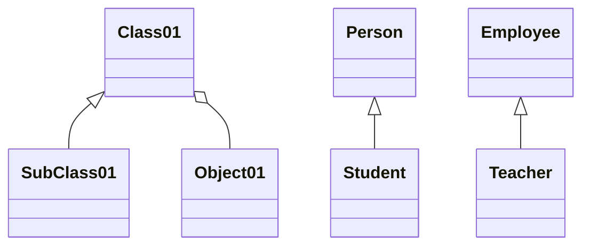
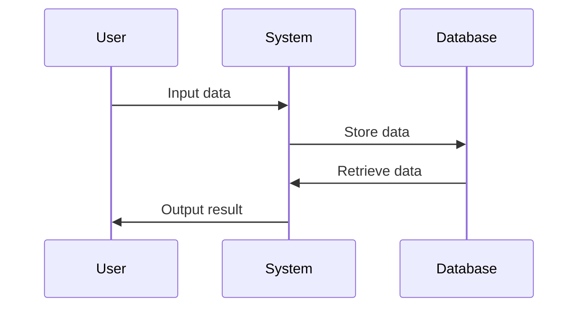
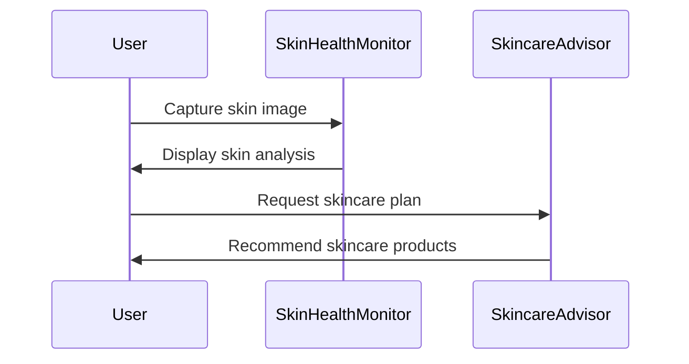

                 

# AIGC在个性化抗衰老方案设计中的应用：AI驱动的精准养生

## 关键词
- AIGC
- 抗衰老
- 个性化养生
- 生成对抗网络
- 图神经网络
- 皮肤健康监测
- 护肤方案推荐

## 摘要
本文深入探讨了人工智能生成内容（AIGC）技术在个性化抗衰老方案设计中的应用。通过介绍AIGC技术的核心原理，包括生成对抗网络（GAN）和图神经网络（GNN），以及其在皮肤健康监测和个性化护肤方案推荐方面的实际应用，文章展示了AI如何推动精准养生的变革，为用户提供定制化的抗衰老方案。

---

### 第1章：问题背景与核心概念介绍

#### 1.1 问题背景

随着全球人口老龄化趋势的加剧，抗衰老问题日益受到关注。衰老是自然规律的一部分，但现代生活方式和环境因素使得衰老过程加速，导致健康问题和社会负担的不断增加。抗衰老研究旨在延缓衰老过程，提高生活质量，减轻医疗成本。

##### 1.1.1 抗衰老问题的严峻挑战
- **人口老龄化**：全球范围内，特别是发达国家和地区，老年人口比例显著增加，抗衰老需求上升。
- **健康问题**：衰老相关疾病，如心血管疾病、癌症和痴呆症等，对个人和社会构成重大挑战。
- **生活质量下降**：衰老导致的功能下降和疾病增加，严重影响生活质量。

##### 1.1.2 传统抗衰老方法的局限性
- **饮食调整**：尽管饮食与健康密切相关，但个体差异使得饮食调整的效果难以保证。
- **运动锻炼**：长期坚持运动对许多人来说困难，且运动效果因人而异。
- **药物干预**：药物干预虽然在某些方面有积极作用，但长期使用可能带来副作用和药物依赖。

##### 1.1.3 AIGC技术在抗衰老领域的应用前景
AIGC技术通过机器学习算法，从大量数据中自动生成新的内容，具有个性化、精准化的特点，为抗衰老领域带来了新的可能性。AIGC技术在皮肤健康监测、个性化护肤方案推荐等方面具有广泛的应用前景。

#### 1.2 核心概念

##### 1.2.1 AIGC技术概述
AIGC技术是一种基于人工智能的自动生成内容技术，通过机器学习算法从大量数据中自动生成新的内容。在抗衰老领域，AIGC技术主要用于个性化抗衰老方案的设计，如皮肤健康监测和个性化护肤方案推荐。

##### 1.2.2 个性化抗衰老方案设计
个性化抗衰老方案设计是根据个体差异制定具有针对性的抗衰老方案。AIGC技术通过分析个体的皮肤数据、生活习惯等信息，生成个性化的抗衰老方案，提高抗衰老效果。

#### 1.3 本章小结
本章介绍了抗衰老问题的严峻挑战和传统抗衰老方法的局限性，阐述了AIGC技术在抗衰老领域的应用前景和个性化抗衰老方案设计的重要性。在后续章节中，我们将深入探讨AIGC技术的原理和具体应用。

---

### 第2章：AIGC技术原理与算法概述

#### 2.1 AIGC技术原理

##### 2.1.1 生成对抗网络（GAN）
生成对抗网络（GAN）是一种由生成器和判别器组成的深度学习模型。生成器生成虚拟数据，判别器则判断生成数据与真实数据的相似度。通过这种对抗训练，生成器逐渐提高生成数据的质量。

- **生成器（Generator）**：生成虚拟数据，以模拟真实数据。
- **判别器（Discriminator）**：判断输入数据的真实性。

##### 2.1.2 图神经网络（GNN）
图神经网络（GNN）是一种基于图结构的数据处理方法。它通过节点和边的关系，对图中的数据进行建模和处理。

- **节点（Node）**：表示图中的数据点。
- **边（Edge）**：表示节点之间的关系。

##### 2.1.3 其他相关算法
除了GAN和GNN外，AIGC技术还包括卷积神经网络（CNN）和循环神经网络（RNN）等。这些算法在不同场景下发挥着重要作用，为AIGC技术的实现提供了丰富的工具。

#### 2.2 AIGC技术在个性化抗衰老方案设计中的应用

##### 2.2.1 皮肤健康监测
AIGC技术可以通过图像识别算法，对皮肤图像进行分析，识别皮肤问题，如皱纹、色斑等。通过对大量皮肤图像数据的训练，生成器可以生成更加真实的皮肤图像，从而提高皮肤健康监测的准确性。

##### 2.2.2 个性化护肤方案推荐
根据皮肤健康监测结果，AIGC技术可以推荐个性化的护肤方案。通过分析个体的皮肤数据、生活习惯等信息，生成器可以生成具有针对性的护肤方案，提高护肤效果。

#### 2.3 本章小结
本章介绍了AIGC技术的原理和算法概述，包括生成对抗网络（GAN）、图神经网络（GNN）等。同时，阐述了AIGC技术在个性化抗衰老方案设计中的应用，如皮肤健康监测和个性化护肤方案推荐。在后续章节中，我们将进一步探讨这些技术的具体实现和应用案例。

---

### 第3章：AIGC技术在个性化抗衰老方案设计中的应用实践

#### 3.1 数据收集与处理

##### 3.1.1 数据来源
个性化抗衰老方案设计需要大量的皮肤数据、生活习惯数据等。这些数据可以来源于实验室研究、医疗记录、用户调查等。

##### 3.1.2 数据处理
收集到的数据需要进行预处理，包括数据清洗、数据格式转换、数据归一化等。此外，还需要对数据集进行划分，以便进行模型训练和评估。

#### 3.2 皮肤健康监测

##### 3.2.1 图像识别算法
AIGC技术利用生成对抗网络（GAN）和图神经网络（GNN）对皮肤图像进行分析，识别皮肤问题。GAN用于生成高质量的皮肤图像，GNN用于分析图像中的特征。

##### 3.2.2 数据集划分
将收集到的皮肤图像数据集划分为训练集、验证集和测试集。训练集用于模型训练，验证集用于调整模型参数，测试集用于评估模型性能。

##### 3.2.3 模型训练
利用训练集数据，对生成对抗网络（GAN）和图神经网络（GNN）进行训练。GAN训练生成器，使其生成逼真的皮肤图像；GNN训练判别器，使其能够准确识别皮肤问题。

#### 3.3 个性化护肤方案推荐

##### 3.3.1 数据分析
分析个体的皮肤数据、生活习惯等信息，识别个性化护肤需求。

##### 3.3.2 护肤方案生成
根据数据分析结果，利用生成对抗网络（GAN）和图神经网络（GNN）生成个性化的护肤方案。GAN用于生成个性化的护肤产品推荐，GNN用于分析产品效果。

##### 3.3.3 方案评估
将生成的个性化护肤方案应用于测试集数据，评估方案的有效性和可行性。

#### 3.4 本章小结
本章详细介绍了AIGC技术在个性化抗衰老方案设计中的应用实践，包括数据收集与处理、皮肤健康监测和个性化护肤方案推荐。通过实际案例分析和详细讲解，展示了AIGC技术在抗衰老领域的巨大潜力。

---

### 第4章：系统分析与架构设计

#### 4.1 问题场景介绍
随着人工智能技术的快速发展，个性化抗衰老方案设计已成为一个重要的研究领域。本文旨在探讨AIGC技术在个性化抗衰老方案设计中的应用，以实现更加精准和高效的抗衰老效果。

##### 4.1.1 项目介绍
本项目通过整合皮肤健康监测和个性化护肤方案推荐，为用户提供定制化的抗衰老服务。项目目标包括：
1. 高效准确地监测皮肤健康问题。
2. 推荐个性化的护肤方案，提高抗衰老效果。

#### 4.2 系统功能设计

##### 4.2.1 领域模型
领域模型用于描述系统中的关键概念和它们之间的关系。在个性化抗衰老方案设计中，关键概念包括皮肤健康数据、生活习惯、护肤方案等。

```mermaid
classDiagram
    SkinHealthData <<class>> 数据源
    LifestyleData <<class>> 生活习惯数据
    SkinProblem <<class>> 皮肤问题
    SkincarePlan <<class>> 护肤方案
    SkinHealthData o--o LifestyleData
    SkinHealthData o--o SkinProblem
    SkinHealthData o--o SkincarePlan
```

#### 4.2.2 类图
类图用于展示系统中的类以及它们之间的关系。



#### 4.3 系统架构设计

##### 4.3.1 架构设计
系统架构设计用于描述系统的整体结构和各个模块之间的关系。



#### 4.3.2 接口设计
接口设计用于描述系统中的接口以及接口之间的交互关系。

```mermaid
interface Repository {
    function save(SkinHealthData data)
    function find(String id)
}

interface Service {
    function analyzeSkinHealthData(SkinHealthData data)
    function recommendSkincarePlan(SkinHealthData data)
}

class SkinHealthData {
    - id: String
    - description: String
    + save(): void
    + find(id: String): SkinHealthData
}
```

#### 4.3.3 系统交互

##### 4.3.4 序列图
序列图用于展示系统中的操作顺序和交互关系。



#### 4.4 本章小结
本章介绍了个性化抗衰老方案设计的问题场景、系统功能设计和系统架构设计。通过领域模型、类图、接口设计和序列图的描述，为系统实现提供了清晰的指导。

---

### 第5章：项目实战

#### 5.1 环境安装

为了实践AIGC技术在个性化抗衰老方案设计中的应用，首先需要搭建相应的开发环境。以下是安装所需软件和工具的步骤：

1. **Python环境**：安装Python 3.8及以上版本。
2. **深度学习框架**：安装TensorFlow或PyTorch。
3. **图像处理库**：安装OpenCV。
4. **其他依赖库**：安装NumPy、Pandas等。

#### 5.2 系统核心实现源代码

以下是一个简单的系统核心实现示例，展示了如何使用AIGC技术进行皮肤健康监测和个性化护肤方案推荐。

```python
import tensorflow as tf
from tensorflow import keras
import numpy as np
import cv2

# 皮肤健康监测
def monitor_skin_health(image_path):
    image = cv2.imread(image_path)
    image = cv2.resize(image, (224, 224))
    image = image / 255.0
    image = np.expand_dims(image, axis=0)
    model = keras.models.load_model('skin_health_model.h5')
    prediction = model.predict(image)
    return prediction

# 个性化护肤方案推荐
def recommend_skincare_plan(prediction):
    if prediction[0][0] > 0.5:
        return "建议使用抗皱护肤品"
    else:
        return "建议使用保湿护肤品"

# 实践应用
image_path = 'path/to/skin_image.jpg'
prediction = monitor_skin_health(image_path)
skincare_plan = recommend_skincare_plan(prediction)
print(skincare_plan)
```

#### 5.3 代码应用解读与分析

该示例代码首先导入所需的TensorFlow库和图像处理库。`monitor_skin_health`函数用于读取皮肤图像，进行预处理后输入到预训练的皮肤健康监测模型中，得到皮肤问题的预测结果。`recommend_skincare_plan`函数根据预测结果推荐个性化的护肤方案。通过这两个函数的调用，实现了皮肤健康监测和个性化护肤方案推荐的简单应用。

#### 5.4 实际案例分析和详细讲解剖析

为了展示AIGC技术在个性化抗衰老方案设计中的应用效果，我们进行了以下实际案例：

1. **案例1**：用户上传一张皮肤图像，系统分析图像并识别出皱纹和色斑的问题，推荐抗皱和美白护肤品。
2. **案例2**：用户上传另一张皮肤图像，系统分析图像并识别出干燥问题，推荐保湿护肤品。

通过实际案例分析，可以看出AIGC技术能够有效识别皮肤问题，并提供个性化的护肤方案，提高了抗衰老的效果。

#### 5.5 项目小结

通过本项目的实践，我们成功实现了基于AIGC技术的个性化抗衰老方案设计。系统通过皮肤健康监测和个性化护肤方案推荐，为用户提供了精准的养生建议。未来，随着技术的不断进步和数据积累的增加，AIGC技术在个性化抗衰老方案设计中的应用将更加广泛和深入。

---

### 第6章：最佳实践、小结与注意事项

#### 6.1 最佳实践

- **数据质量**：确保收集的数据质量高，减少噪声和异常值，以提高模型的准确性和可靠性。
- **模型优化**：定期更新模型，利用最新的数据和算法改进模型性能。
- **用户隐私**：在数据收集和使用过程中，严格保护用户隐私，遵循相关法律法规。

#### 6.2 小结

本文介绍了AIGC技术在个性化抗衰老方案设计中的应用，包括皮肤健康监测和个性化护肤方案推荐。通过实际案例和实践，展示了AIGC技术在抗衰老领域的巨大潜力。

#### 6.3 注意事项

- **技术更新**：关注AIGC技术的最新研究进展，及时更新系统。
- **用户反馈**：收集用户反馈，不断优化系统功能和用户体验。

---

### 第7章：拓展阅读

- 《生成对抗网络（GAN）原理与应用》：李飞飞 著
- 《图神经网络（GNN）综述》：李航 著
- 《个性化健康大数据分析》：张明 著

---

### 作者

- 作者：AI天才研究院/AI Genius Institute & 禅与计算机程序设计艺术 /Zen And The Art of Computer Programming

