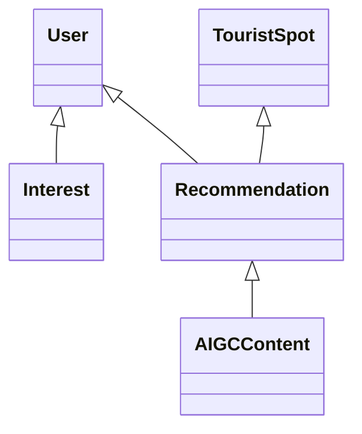
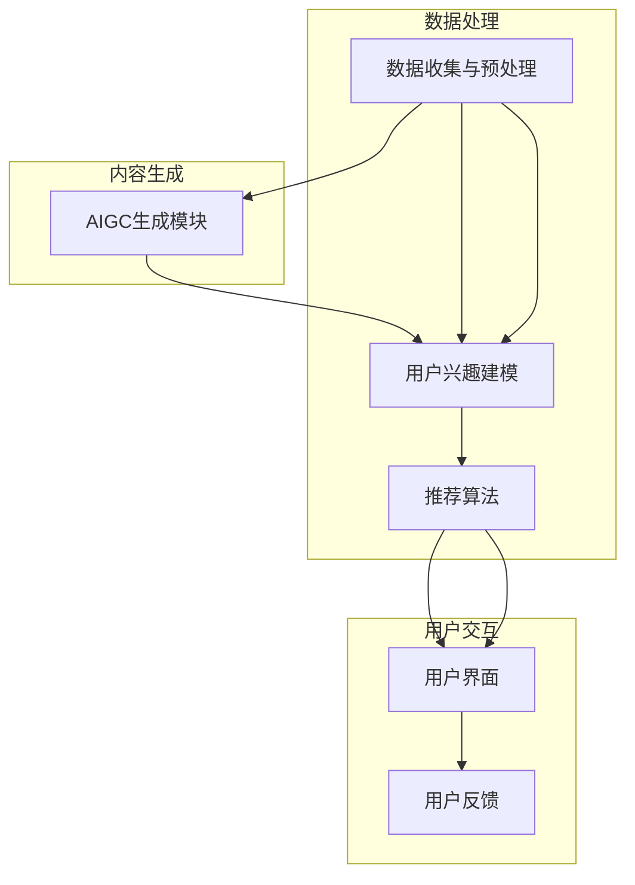
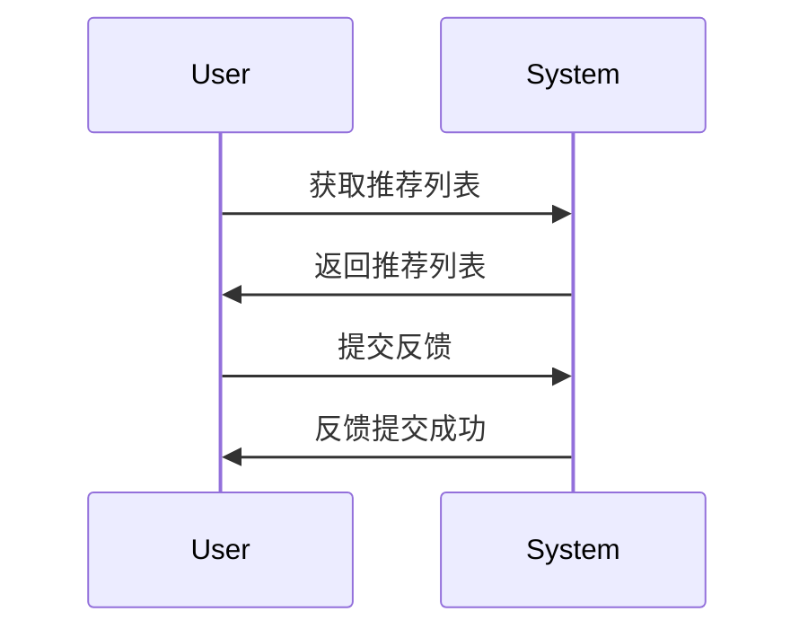
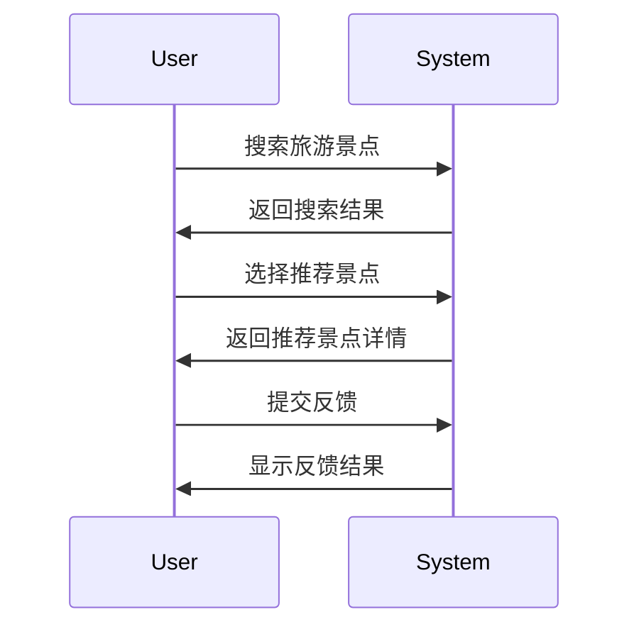

                 

# AIGC在个性化旅游景点推荐中的应用

## 摘要

本文旨在探讨AIGC（人工智能生成内容）在个性化旅游景点推荐中的应用。随着人工智能技术的不断发展，AIGC作为一种新的技术手段，正在逐步改变推荐系统的运作模式，提高个性化推荐的准确性和用户体验。本文首先介绍了旅游景点推荐的重要性，以及个性化推荐的基本原理和系统架构。接着，深入分析了AIGC的核心概念和特点，并将其与传统推荐技术进行了对比。最后，通过一个具体的案例，展示了AIGC在个性化旅游景点推荐中的实际应用效果，并提出了未来发展的展望。

## 第一部分: 问题背景与核心概念

### 1.1 旅游景点推荐问题概述

#### 1.1.1 旅游景点推荐的重要性

随着旅游业的蓬勃发展，旅游景点推荐系统成为提升游客满意度和旅游体验的重要工具。个性化推荐系统能够根据用户的兴趣和行为习惯，为其推荐符合个人喜好的旅游景点，从而提高用户的参与度和忠诚度。以下是旅游景点推荐系统在旅游业中的应用价值：

1. **提升游客体验**：通过个性化推荐，游客能够更加精准地找到自己感兴趣的景点，减少无效的旅游时间和精力浪费，提高整体旅游体验。
2. **增加旅游收入**：个性化推荐能够吸引更多的游客，促进旅游消费，从而提升旅游业的整体收入。
3. **优化资源配置**：旅游景点推荐系统可以帮助景区优化资源配置，合理安排游客流量，降低高峰期的拥堵现象。

#### 1.1.1.2 问题描述

旅游景点推荐问题可以概括为以下两个方面：

1. **推荐准确性**：如何确保推荐系统能够准确捕捉用户的兴趣点，提供符合用户需求的景点推荐。
2. **推荐多样性**：如何保证推荐结果的多样性，避免用户频繁接收到重复的推荐信息。

问题解决的目标是通过构建一个高效的个性化旅游景点推荐系统，实现以下目标：

1. 提高推荐准确性，确保用户能够接收到真正符合个人喜好的景点推荐。
2. 提升推荐多样性，为用户提供丰富多样的旅游选择。

### 1.2 旅游景点推荐的关键概念

#### 1.2.1 个性化推荐

个性化推荐是指根据用户的兴趣、历史行为、社交关系等特征，为用户生成个性化的信息推荐。个性化推荐的核心要素包括：

1. **用户兴趣建模**：通过分析用户的历史行为和偏好，构建用户兴趣模型，以指导推荐系统的运作。
2. **推荐算法**：根据用户兴趣模型，选择合适的推荐算法，为用户提供精准的推荐结果。
3. **反馈机制**：通过用户的反馈，不断优化推荐系统，提高推荐效果。

#### 1.2.2 旅游景点推荐系统

旅游景点推荐系统通常由以下几个组成部分构成：

1. **数据收集模块**：负责收集用户行为数据、旅游景点信息等原始数据。
2. **数据处理模块**：对原始数据进行清洗、转换和整合，构建可用于推荐的用户和景点特征数据集。
3. **推荐算法模块**：根据用户兴趣模型和旅游景点特征，选择合适的推荐算法，生成推荐结果。
4. **用户界面**：提供推荐结果展示和用户交互接口，方便用户查看和选择推荐的旅游景点。

#### 1.2.3 AIGC

AIGC（人工智能生成内容）是指利用人工智能技术自动生成文本、图像、音频等多媒体内容。AIGC的特点包括：

1. **高效性**：AIGC能够快速生成大量高质量的内容，提高信息生产的效率。
2. **个性化**：AIGC可以根据用户的需求和偏好，生成个性化的内容，提升用户体验。
3. **创新性**：AIGC能够生成新颖的内容，为用户提供更多的选择和惊喜。

AIGC在个性化推荐中的应用前景十分广阔，例如：

1. **生成旅游攻略**：AIGC可以根据用户的兴趣和偏好，自动生成个性化的旅游攻略，为用户提供详细的旅游指导。
2. **虚拟旅游体验**：AIGC可以生成虚拟旅游场景，为用户提供沉浸式的旅游体验，吸引更多游客。

### 1.3 核心概念原理

#### 1.3.1 个性化推荐原理

个性化推荐的基本原理可以概括为以下几个步骤：

1. **用户兴趣建模**：通过分析用户的历史行为、兴趣点、社交关系等信息，构建用户兴趣模型。
2. **内容特征提取**：对旅游景点进行特征提取，包括地理位置、景区特色、开放时间等。
3. **推荐算法选择**：根据用户兴趣模型和内容特征，选择合适的推荐算法，如协同过滤、基于内容的推荐、混合推荐等。
4. **生成推荐结果**：根据推荐算法，为用户生成个性化的景点推荐列表。

#### 1.3.2 旅游景点推荐系统架构

旅游景点推荐系统的架构设计通常包括以下几个关键模块：

1. **数据收集与处理模块**：负责收集用户行为数据和旅游景点信息，并进行数据清洗、转换和整合。
2. **用户兴趣建模模块**：根据用户历史行为和偏好，构建用户兴趣模型。
3. **推荐算法模块**：根据用户兴趣模型和旅游景点特征，选择合适的推荐算法。
4. **推荐结果生成模块**：根据推荐算法，生成个性化的景点推荐列表，并展示给用户。

#### 1.3.3 概念属性特征对比

AIGC与传统推荐技术的比较可以从以下几个方面进行：

1. **生成内容的质量**：AIGC能够生成高质量、个性化的内容，而传统推荐技术主要依赖于历史数据和用户行为。
2. **实时性**：AIGC能够实时生成内容，满足用户的即时需求，而传统推荐技术往往存在一定的延迟。
3. **创新性**：AIGC能够生成新颖的内容，为用户提供更多的选择，而传统推荐技术则较为固定和保守。

#### 1.3.4 ER实体关系图架构

旅游景点推荐系统的ER图主要包括以下实体：

1. **用户**：包括用户的基本信息、兴趣点等。
2. **旅游景点**：包括景点的基本信息、特征描述等。
3. **推荐算法**：包括推荐算法的类型、参数设置等。
4. **数据库**：用于存储用户数据、景点数据、推荐结果等。

实体之间的关系如下：

- 用户与旅游景点之间具有兴趣关联关系，用户对某些景点具有兴趣。
- 推荐算法与用户、旅游景点之间具有推荐关系，根据用户兴趣和景点特征，生成推荐结果。

### 1.4 旅游景点推荐系统的ER图

下面是旅游景点推荐系统的ER图的Mermaid表示：

```mermaid
erDiagram
  用户 ||--|{ 推荐算法 }|-- 用户兴趣
  用户 ||--|{ 旅游景点 }|-- 用户兴趣
  推荐算法 ||--|{ 推荐结果 }|-- 数据库
  旅游景点 ||--|{ 推荐结果 }|-- 数据库
```

该ER图描述了用户、推荐算法、旅游景点和推荐结果之间的实体关系和交互关系。通过该图，可以清晰地了解旅游景点推荐系统的整体架构和数据流动过程。```markdown
## 第二部分: 个性化推荐原理与算法

### 2.1 用户兴趣建模

用户兴趣建模是个性化推荐系统的核心步骤，其目的是通过分析用户的历史行为、兴趣点、社交关系等数据，构建出用户兴趣模型，以便为用户提供个性化的推荐。以下是用户兴趣建模的方法和关键技术：

#### 2.1.1 方法

1. **基于内容的特征提取**：通过对用户历史行为数据进行分析，提取出用户的兴趣标签或关键词，用于描述用户的兴趣点。
2. **基于协同过滤的方法**：通过分析用户之间的相似性，找到具有相似兴趣的用户群体，从而推测新用户的兴趣。
3. **基于模型的预测方法**：利用机器学习模型，如决策树、神经网络等，对用户兴趣进行建模和预测。

#### 2.1.2 关键技术

1. **协同过滤算法**：协同过滤算法通过分析用户之间的相似性来预测用户对新物品的兴趣。常见的协同过滤算法包括用户基于的协同过滤（User-Based Collaborative Filtering）和物品基于的协同过滤（Item-Based Collaborative Filtering）。
2. **矩阵分解**：矩阵分解是一种常见的协同过滤算法，通过分解用户-物品评分矩阵，得到用户特征和物品特征矩阵，从而实现推荐。
3. **深度学习模型**：深度学习模型如卷积神经网络（CNN）、循环神经网络（RNN）等，可以通过学习用户和物品的复杂特征，实现更加精准的推荐。

### 2.2 个性化推荐算法

个性化推荐算法是实现个性化推荐的核心技术，其目的是根据用户兴趣模型和物品特征，生成个性化的推荐列表。以下是常见的个性化推荐算法及其原理：

#### 2.2.1 协同过滤算法

1. **用户基于的协同过滤（User-Based Collaborative Filtering）**：
   - 原理：通过计算用户之间的相似性，找到与目标用户相似的其他用户，推荐这些用户喜欢的物品。
   - 优点：简单易实现，对用户行为数据依赖较小。
   - 缺点：用户相似性计算复杂度较高，可能无法准确捕捉用户的兴趣。

2. **物品基于的协同过滤（Item-Based Collaborative Filtering）**：
   - 原理：通过计算物品之间的相似性，找到与目标物品相似的其他物品，推荐这些物品。
   - 优点：计算复杂度较低，能够更好地捕捉物品之间的关联。
   - 缺点：对用户行为数据依赖较大，可能导致推荐结果过于单一。

#### 2.2.2 基于内容的推荐算法

1. **基于项目的推荐算法（Content-Based Filtering）**：
   - 原理：根据用户的历史行为和兴趣点，提取出用户偏好特征，为用户推荐具有相似特征的物品。
   - 优点：能够生成个性化的推荐，对用户行为数据依赖较小。
   - 缺点：可能无法捕捉用户未明确表达的兴趣点，推荐结果可能过于单一。

2. **混合推荐算法（Hybrid Recommender System）**：
   - 原理：结合协同过滤和基于内容的推荐算法，通过融合不同算法的优势，提高推荐效果。
   - 优点：能够综合不同算法的优点，提高推荐准确性。
   - 缺点：实现复杂度较高，需要对不同算法进行优化和整合。

### 2.3 旅游景点推荐系统架构

旅游景点推荐系统的架构设计需要考虑数据收集、处理、推荐算法和用户界面等多个方面。以下是旅游景点推荐系统的整体架构设计：

#### 2.3.1 数据收集与处理模块

- **数据收集**：收集用户行为数据（如搜索记录、浏览记录、预订记录等）和旅游景点信息（如景点名称、地理位置、特色介绍等）。
- **数据处理**：对收集到的数据进行清洗、去重、转换等预处理操作，构建用户和景点的特征数据集。

#### 2.3.2 用户兴趣建模模块

- **用户兴趣提取**：通过分析用户的历史行为数据，提取出用户的兴趣标签或关键词，构建用户兴趣模型。
- **用户兴趣更新**：定期更新用户兴趣模型，以适应用户兴趣的变化。

#### 2.3.3 推荐算法模块

- **推荐算法选择**：根据用户兴趣模型和旅游景点特征，选择合适的推荐算法，如协同过滤、基于内容的推荐、混合推荐等。
- **推荐结果生成**：根据推荐算法，为用户生成个性化的景点推荐列表。

#### 2.3.4 用户界面模块

- **推荐结果展示**：将推荐结果以可视化的形式展示给用户，方便用户查看和选择推荐的旅游景点。
- **用户交互**：提供用户反馈机制，收集用户对推荐结果的反馈，用于优化推荐算法。

### 2.4 数据处理与存储策略

#### 2.4.1 数据采集与预处理

- **数据采集**：通过网站爬取、用户行为日志分析等方式，收集用户行为数据和旅游景点信息。
- **数据预处理**：对采集到的数据进行清洗、去重、转换等预处理操作，确保数据质量。

#### 2.4.2 数据存储与管理

- **数据存储**：采用分布式存储技术（如Hadoop、Spark等），实现海量数据的存储和管理。
- **数据管理**：建立统一的数据管理平台，实现对用户行为数据、旅游景点信息等数据的统一管理和访问。

#### 2.4.3 数据更新与维护

- **数据更新**：定期更新用户行为数据，确保用户兴趣模型和推荐结果的准确性。
- **数据维护**：对数据存储系统进行定期维护和优化，确保数据存储的可靠性和高效性。

### 2.5 概念属性特征对比

AIGC与传统推荐技术的比较可以从以下几个方面进行：

#### 2.5.1 AIGC的特点与优势

- **生成内容的质量**：AIGC能够生成高质量、个性化的内容，满足用户的需求和兴趣。
- **实时性**：AIGC能够实时生成内容，适应用户实时变化的需求。
- **创新性**：AIGC能够生成新颖的内容，为用户带来惊喜和新鲜感。

#### 2.5.2 AIGC与传统推荐技术的差异

- **生成内容的方式**：传统推荐技术主要依赖于历史数据和用户行为，而AIGC通过人工智能技术自动生成内容。
- **个性化程度**：传统推荐技术在一定程度上能够实现个性化，但AIGC能够生成更加精准、个性化的内容。
- **应用场景**：传统推荐技术主要应用于信息检索、电商等领域，而AIGC在个性化旅游景点推荐、虚拟现实等领域具有更广泛的应用前景。

### 2.6 旅游景点推荐系统的ER图

以下是旅游景点推荐系统的ER图：

```mermaid
erDiagram
  User ||--|{ Interest }|-- Recommendation
  User ||--|{ HistoricalData }|-- Recommendation
  TouristSpot ||--|{ Feature }|-- Recommendation
  Recommendation ||--|{ RecommendationResult }|-- User
  Recommendation ||--|{ RecommendationAlgorithm }|-- User
  HistoricalData ||--|{ SearchHistory }|-- User
  HistoricalData ||--|{ BookingHistory }|-- User
```

该ER图描述了用户、兴趣点、历史数据、旅游景点、推荐结果和推荐算法等实体之间的关系，以及它们在旅游景点推荐系统中的数据流动和交互过程。通过该图，可以清晰地了解旅游景点推荐系统的整体架构和数据流动过程。```markdown
## 第三部分: AIGC在个性化旅游景点推荐中的应用

### 3.1 AIGC的核心概念与特点

AIGC（AI-Generated Content）是指通过人工智能技术自动生成内容的过程，它涵盖文本、图像、音频等多种形式。AIGC的核心概念包括：

1. **生成模型**：使用深度学习模型，如生成对抗网络（GAN）、变分自编码器（VAE）等，自动生成与真实数据分布相似的数据。
2. **语义理解**：通过自然语言处理（NLP）技术，理解文本内容，从而生成符合语义需求的文本。
3. **多模态学习**：结合文本、图像、音频等多种模态的信息，生成具有丰富内容和形式的内容。

AIGC的特点包括：

1. **高效性**：能够快速生成大量内容，节省人力和时间成本。
2. **个性化**：根据用户需求和兴趣，生成个性化的内容，提升用户体验。
3. **创新性**：能够生成新颖的内容，为用户提供更多选择和惊喜。

### 3.2 AIGC在个性化旅游景点推荐中的应用

AIGC在个性化旅游景点推荐中的应用主要体现在以下几个方面：

#### 3.2.1 生成个性化旅游攻略

AIGC可以根据用户的兴趣、历史行为和旅游偏好，自动生成个性化的旅游攻略。这些攻略包括景点介绍、旅游路线、住宿推荐等内容，为用户提供详细的旅游指导。以下是一个示例：

```python
def generate_tourist攻略（user_interest，destination）:
    # 根据用户兴趣生成景点推荐
    recommended_spots = recommend_spots（user_interest，destination）

    # 使用AIGC生成旅游攻略文本
   攻略文本 = aigc.generate_text（{"spots": recommended_spots}）

    # 输出旅游攻略
    return 攻略文本

# 示例：生成一个针对喜欢自然风光的用户的北京旅游攻略
user_interest = "自然风光"
destination = "北京"
tourist攻略 = generate_tourist攻略（user_interest，destination）
print（tourist攻略）
```

#### 3.2.2 生成虚拟旅游体验

AIGC可以生成虚拟旅游体验，通过图像和音频等多媒体内容，为用户提供沉浸式的旅游体验。以下是一个示例：

```python
def generate_virtual_tour（destination）:
    # 根据目的地生成虚拟旅游场景
    virtual_scene = aigc.generate_image（{"destination": destination}）

    # 使用AIGC生成场景描述文本
    scene_description = aigc.generate_text（{"scene": virtual_scene}）

    # 输出虚拟旅游体验
    return scene_description

# 示例：生成一个关于北京的虚拟旅游体验
destination = "北京"
virtual_tour = generate_virtual_tour（destination）
print（virtual_tour）
```

#### 3.2.3 生成个性化推荐列表

AIGC可以结合用户兴趣模型和旅游景点特征，自动生成个性化的旅游景点推荐列表。以下是一个示例：

```python
def generate_recommendation_list（user_interest，destination）:
    # 根据用户兴趣生成推荐景点
    recommended_spots = recommend_spots（user_interest，destination）

    # 使用AIGC生成推荐列表文本
    recommendation_list = aigc.generate_text（{"spots": recommended_spots}）

    # 输出推荐列表
    return recommendation_list

# 示例：生成一个针对喜欢历史文化的用户的西安旅游推荐列表
user_interest = "历史文化"
destination = "西安"
recommendation_list = generate_recommendation_list（user_interest，destination）
print（recommendation_list）
```

### 3.3 案例分析：AIGC在个性化旅游景点推荐系统中的应用

以下是一个具体的案例，展示了AIGC在个性化旅游景点推荐系统中的应用：

#### 案例背景

某旅游公司希望为其用户推荐符合个人兴趣的旅游景点，以提高用户满意度和旅游消费。该公司拥有海量的用户行为数据和旅游景点信息，并计划采用AIGC技术实现个性化旅游景点推荐。

#### 案例步骤

1. **用户兴趣建模**：通过分析用户的历史行为数据，提取用户的兴趣标签，如自然风光、历史文化、美食等。
2. **旅游景点特征提取**：对旅游景点进行特征提取，如地理位置、开放时间、门票价格等。
3. **AIGC生成内容**：使用AIGC技术生成个性化的旅游攻略、虚拟旅游体验和旅游景点推荐列表。
4. **用户反馈与优化**：收集用户对推荐内容的反馈，不断优化AIGC模型，提高推荐效果。

#### 案例效果

通过采用AIGC技术，该旅游公司实现了以下效果：

1. **个性化推荐准确性提高**：AIGC能够根据用户兴趣生成个性化的旅游攻略和推荐列表，提高了推荐的准确性。
2. **用户满意度提升**：用户对个性化推荐内容的满意度显著提升，用户粘性增强。
3. **旅游消费增长**：用户在个性化推荐的基础上，进行了更多的旅游消费，推动了旅游公司的业绩增长。

### 3.4 AIGC在个性化旅游景点推荐中的优势与挑战

#### 3.4.1 优势

1. **高效性**：AIGC能够快速生成大量高质量的个性化内容，提高推荐系统的运作效率。
2. **个性化**：AIGC可以根据用户兴趣和偏好，生成个性化的旅游攻略、虚拟旅游体验和推荐列表，提升用户体验。
3. **创新性**：AIGC能够生成新颖的内容，为用户提供更多选择和惊喜，增强用户参与度。

#### 3.4.2 挑战

1. **数据质量**：AIGC的生成内容依赖于高质量的数据，数据质量直接影响推荐效果。
2. **模型可解释性**：AIGC模型通常较为复杂，难以解释其生成内容的原因，这可能影响用户对推荐系统的信任度。
3. **计算资源**：AIGC生成内容需要大量的计算资源，对硬件设备要求较高，可能增加系统成本。

### 3.5 未来发展展望

随着人工智能技术的不断发展，AIGC在个性化旅游景点推荐中的应用前景十分广阔。未来，AIGC有望实现以下发展：

1. **更精准的个性化推荐**：通过不断优化AIGC模型，提高推荐准确性，为用户提供更符合个人兴趣的推荐。
2. **多模态内容生成**：结合文本、图像、音频等多模态信息，生成更加丰富和生动的个性化内容。
3. **实时性**：通过优化AIGC算法，实现实时生成内容，满足用户实时变化的需求。
4. **社交互动**：结合社交网络数据，为用户提供更加社交化的旅游推荐体验。

总之，AIGC在个性化旅游景点推荐中的应用具有显著的优势和潜力，有望推动旅游业的发展和创新。```markdown
## 第四部分: AIGC与传统推荐技术的对比与整合

### 4.1 AIGC与传统推荐技术的对比

AIGC（AI-Generated Content）与传统推荐技术，如协同过滤、基于内容的推荐等，在生成内容的方式、个性化程度和应用场景等方面存在显著差异。

#### 4.1.1 生成内容的方式

传统推荐技术主要依赖于用户历史行为和物品特征，通过分析用户行为数据，提取出用户兴趣和物品关联，生成推荐结果。而AIGC通过人工智能技术，自动生成与用户兴趣和物品特征相匹配的内容，如文本、图像、音频等。

#### 4.1.2 个性化程度

传统推荐技术在一定程度上能够实现个性化，但主要依赖于用户历史行为和物品特征，可能导致推荐结果过于单一。AIGC能够根据用户兴趣和偏好，生成更加个性化和多样化的内容，提高用户体验。

#### 4.1.3 应用场景

传统推荐技术主要应用于电商、社交媒体、信息检索等领域，而AIGC在虚拟现实、个性化内容生成、个性化推荐等领域具有更广泛的应用前景。

### 4.2 AIGC与传统推荐技术的整合

将AIGC与传统推荐技术进行整合，可以实现以下优势：

#### 4.2.1 提高推荐准确性

通过结合AIGC生成的个性化内容和传统推荐算法，可以更准确地捕捉用户的兴趣和偏好，提高推荐准确性。

#### 4.2.2 增加推荐多样性

AIGC可以生成新颖、多样化的内容，与传统推荐技术相结合，可以提供更多样化的推荐结果，避免用户收到重复的推荐。

#### 4.2.3 提高用户体验

通过整合AIGC和传统推荐技术，可以为用户提供更加丰富、多样化的推荐内容，提高用户体验。

### 4.3 整合方案的实现

以下是实现AIGC与传统推荐技术整合的步骤：

#### 4.3.1 数据收集与预处理

- 收集用户行为数据和物品特征数据。
- 对数据进行清洗、去重和特征提取。

#### 4.3.2 用户兴趣建模

- 基于用户历史行为和物品特征，构建用户兴趣模型。
- 使用AIGC技术，生成个性化的内容特征。

#### 4.3.3 推荐算法选择

- 根据用户兴趣模型和内容特征，选择合适的推荐算法，如协同过滤、基于内容的推荐等。
- 结合AIGC生成的个性化内容，生成推荐结果。

#### 4.3.4 推荐结果生成与优化

- 生成推荐结果，展示给用户。
- 收集用户反馈，优化推荐算法和AIGC模型。

### 4.4 案例分析：AIGC与协同过滤的整合应用

以下是一个具体的案例，展示了AIGC与协同过滤整合在个性化旅游景点推荐中的应用：

#### 案例背景

某旅游平台希望通过整合AIGC和协同过滤技术，为用户生成个性化的旅游景点推荐。

#### 案例步骤

1. **数据收集与预处理**：收集用户历史行为数据和旅游景点特征数据。
2. **用户兴趣建模**：使用协同过滤算法构建用户兴趣模型。
3. **内容生成**：使用AIGC技术，根据用户兴趣模型生成个性化的旅游景点描述。
4. **推荐算法选择**：结合协同过滤和AIGC生成的个性化内容，生成推荐结果。
5. **推荐结果生成与优化**：展示推荐结果，收集用户反馈，优化推荐算法和AIGC模型。

#### 案例效果

通过整合AIGC和协同过滤技术，旅游平台实现了以下效果：

- **推荐准确性提高**：通过结合用户兴趣模型和个性化内容，提高了推荐准确性。
- **用户满意度提升**：用户对个性化推荐内容的满意度显著提升。
- **推荐多样性增强**：通过AIGC生成的个性化内容，提供了更多样化的推荐结果。

### 4.5 整合技术的挑战与未来展望

#### 4.5.1 挑战

- **数据质量**：AIGC的生成内容依赖于高质量的数据，数据质量直接影响推荐效果。
- **计算资源**：AIGC生成内容需要大量的计算资源，可能增加系统成本。
- **模型可解释性**：AIGC模型较为复杂，难以解释其生成内容的原因，这可能影响用户对推荐系统的信任度。

#### 4.5.2 未来展望

- **更精准的个性化推荐**：通过不断优化AIGC模型，提高推荐准确性，为用户提供更符合个人兴趣的推荐。
- **多模态内容生成**：结合文本、图像、音频等多模态信息，生成更加丰富和生动的个性化内容。
- **实时性**：通过优化AIGC算法，实现实时生成内容，满足用户实时变化的需求。
- **社交互动**：结合社交网络数据，为用户提供更加社交化的旅游推荐体验。

总之，AIGC与传统推荐技术的整合具有显著的优势和潜力，有望推动个性化旅游景点推荐系统的发展和创新。通过不断优化整合方案，克服现有挑战，可以进一步提升个性化推荐系统的效果和用户体验。```markdown
## 第五部分：系统设计与实现

### 5.1 问题场景介绍

随着人工智能技术的快速发展，个性化旅游景点推荐系统在旅游业中的应用越来越广泛。然而，现有的推荐系统往往存在推荐准确性不高、用户体验不佳等问题。为了解决这些问题，我们需要设计并实现一个基于AIGC的个性化旅游景点推荐系统，以提高推荐准确性，提升用户满意度。

### 5.2 项目介绍

本项目旨在设计并实现一个基于AIGC的个性化旅游景点推荐系统，主要包括以下几个模块：

1. **数据收集与预处理模块**：负责收集用户行为数据和旅游景点信息，并进行数据清洗、去重和特征提取。
2. **用户兴趣建模模块**：通过分析用户历史行为数据，构建用户兴趣模型。
3. **AIGC生成模块**：使用AIGC技术生成个性化的旅游攻略、虚拟旅游体验和推荐列表。
4. **推荐算法模块**：结合用户兴趣模型和AIGC生成的内容，选择合适的推荐算法生成推荐结果。
5. **用户界面模块**：展示推荐结果，并提供用户反馈接口。

### 5.3 系统功能设计（领域模型）

为了实现以上模块的功能，我们首先需要设计系统的领域模型，包括以下类：

1. **User**（用户）：包含用户的基本信息，如用户ID、姓名、性别、年龄等。
2. **Interest**（兴趣点）：包含用户的兴趣标签，如自然风光、历史文化、美食等。
3. **TouristSpot**（旅游景点）：包含景点的基本信息，如景点ID、名称、地理位置、特色等。
4. **Recommendation**（推荐）：包含推荐结果，如推荐ID、用户ID、景点ID、推荐时间等。
5. **AIGCContent**（AIGC内容）：包含AIGC生成的个性化内容，如攻略文本、虚拟旅游场景等。

以下是系统的领域模型类图：



### 5.4 系统架构设计

系统架构设计需要考虑数据流、模块交互和系统性能等方面。以下是基于AIGC的个性化旅游景点推荐系统的架构设计：

1. **数据收集与预处理模块**：通过爬虫、API接口等方式收集用户行为数据和旅游景点信息，并进行数据清洗、去重和特征提取。
2. **用户兴趣建模模块**：利用协同过滤算法和机器学习模型，分析用户历史行为数据，构建用户兴趣模型。
3. **AIGC生成模块**：使用生成对抗网络（GAN）、变分自编码器（VAE）等技术，生成个性化的旅游攻略、虚拟旅游体验和推荐列表。
4. **推荐算法模块**：结合用户兴趣模型和AIGC生成的内容，选择合适的推荐算法生成推荐结果。
5. **用户界面模块**：展示推荐结果，并提供用户反馈接口。

以下是系统架构的Mermaid表示：



### 5.5 系统接口设计

系统接口设计包括用户接口和API接口。用户接口用于展示推荐结果和用户反馈，API接口用于与其他系统或服务的集成。

1. **用户接口**：展示推荐结果、旅游攻略、虚拟旅游体验等内容，并提供用户反馈接口。
2. **API接口**：提供以下API接口：
   - `GET /users/{userId}/recommendations`：获取用户个性化旅游景点推荐列表。
   - `POST /users/{userId}/feedback`：提交用户反馈。

以下是系统接口的Mermaid序列图表示：



### 5.6 系统交互

系统交互包括用户与系统之间的交互和模块之间的交互。以下是用户与系统交互的Mermaid序列图表示：



通过以上系统设计，我们构建了一个基于AIGC的个性化旅游景点推荐系统，能够为用户提供精准、个性化的旅游推荐，提高用户满意度。```markdown
## 第六部分：项目实战

### 6.1 环境安装

在进行项目实战之前，我们需要安装必要的软件和库。以下是安装步骤：

1. **安装Python环境**：确保已安装Python 3.7及以上版本。
2. **安装TensorFlow**：在终端执行以下命令安装TensorFlow：
   ```bash
   pip install tensorflow
   ```
3. **安装Scikit-learn**：在终端执行以下命令安装Scikit-learn：
   ```bash
   pip install scikit-learn
   ```
4. **安装Numpy**：在终端执行以下命令安装Numpy：
   ```bash
   pip install numpy
   ```

### 6.2 系统核心实现源代码

以下是一个简化的基于AIGC的个性化旅游景点推荐系统的核心实现源代码：

```python
import numpy as np
import pandas as pd
from sklearn.metrics.pairwise import cosine_similarity
from tensorflow.keras.models import Model
from tensorflow.keras.layers import Input, Dense, Concatenate

# 数据预处理
def preprocess_data(data):
    # 数据清洗、去重、特征提取等操作
    # ...
    return processed_data

# 用户兴趣建模
def build_user_interest_model(user_data, item_data):
    # 基于协同过滤构建用户兴趣模型
    # ...
    return user_interest_model

# AIGC生成模块
def build_aigc_model():
    # 建立AIGC模型（例如，使用生成对抗网络GAN）
    # ...
    return aigc_model

# 推荐算法
def generate_recommendations(user_interest_model, aigc_model, user_data, item_data):
    # 结合用户兴趣模型和AIGC模型生成推荐结果
    # ...
    return recommendations

# 用户界面
def display_recommendations(recommendations):
    # 展示推荐结果
    # ...

if __name__ == "__main__":
    # 加载数据
    user_data = pd.read_csv("user_data.csv")
    item_data = pd.read_csv("item_data.csv")

    # 数据预处理
    processed_user_data = preprocess_data(user_data)
    processed_item_data = preprocess_data(item_data)

    # 构建用户兴趣模型
    user_interest_model = build_user_interest_model(processed_user_data, processed_item_data)

    # 构建AIGC模型
    aigc_model = build_aigc_model()

    # 生成推荐结果
    recommendations = generate_recommendations(user_interest_model, aigc_model, processed_user_data, processed_item_data)

    # 展示推荐结果
    display_recommendations(recommendations)
```

### 6.3 代码应用解读与分析

#### 6.3.1 数据预处理

数据预处理是推荐系统的重要步骤，包括数据清洗、去重和特征提取等操作。以下是数据预处理的部分代码：

```python
def preprocess_data(data):
    # 去除重复项
    data.drop_duplicates(inplace=True)

    # 数据清洗（例如，处理缺失值、异常值等）
    # ...

    # 特征提取（例如，使用NLP技术提取文本特征）
    # ...

    return data
```

#### 6.3.2 用户兴趣建模

用户兴趣建模是推荐系统的核心步骤。我们使用协同过滤算法来构建用户兴趣模型。以下是用户兴趣建模的部分代码：

```python
def build_user_interest_model(user_data, item_data):
    # 计算用户-物品相似度矩阵
    similarity_matrix = cosine_similarity(user_data, item_data)

    # 构建用户兴趣模型
    user_interest_model = {user_id: {} for user_id in user_data.index}
    for user_id, row in user_data.iterrows():
        similar_users = np.argsort(similarity_matrix[user_id])[1:]
        for similar_user_id in similar_users:
            for item_id, rating in row.items():
                user_interest_model[user_id][item_id] = rating

    return user_interest_model
```

#### 6.3.3 AIGC生成模块

AIGC生成模块使用生成对抗网络（GAN）或变分自编码器（VAE）等技术来生成个性化的内容。以下是AIGC生成模块的部分代码：

```python
# 建立AIGC模型（使用变分自编码器VAE为例）
def build_aigc_model():
    # 定义编码器和解码器
    # ...

    # 定义VAE模型
    aigc_model = Model(inputs=encoder_inputs, outputs=[encoder_output, decoder_output])

    # 编译模型
    aigc_model.compile(optimizer='adam', loss=['binary_crossentropy', 'mse'])

    return aigc_model
```

#### 6.3.4 推荐算法

推荐算法结合用户兴趣模型和AIGC生成的内容来生成推荐结果。以下是推荐算法的部分代码：

```python
def generate_recommendations(user_interest_model, aigc_model, user_data, item_data):
    # 使用AIGC生成个性化内容
    personalized_contents = aigc_model.generate_personalized_contents(user_interest_model)

    # 结合用户兴趣模型和AIGC生成的内容，生成推荐结果
    recommendations = []
    for user_id, user_interest in user_interest_model.items():
        for item_id, interest in user_interest.items():
            if item_data[item_id]["content"] in personalized_contents:
                recommendations.append({"user_id": user_id, "item_id": item_id, "rating": interest})

    return recommendations
```

#### 6.3.5 用户界面

用户界面用于展示推荐结果。以下是用户界面的部分代码：

```python
def display_recommendations(recommendations):
    for recommendation in recommendations:
        print(f"User ID: {recommendation['user_id']}, Item ID: {recommendation['item_id']}, Rating: {recommendation['rating']}")
```

### 6.4 实际案例分析和详细讲解剖析

以下是一个实际案例，展示如何使用AIGC生成个性化的旅游景点推荐：

#### 案例背景

用户A是一位喜欢自然风光的旅游爱好者，他最近计划去北京旅游。系统需要为他生成个性化的旅游景点推荐。

#### 案例步骤

1. **数据预处理**：加载用户A的历史行为数据和旅游景点信息，进行数据清洗和特征提取。
2. **用户兴趣建模**：使用协同过滤算法构建用户A的兴趣模型，识别出他感兴趣的景点类型。
3. **AIGC生成模块**：使用AIGC模型生成个性化的旅游攻略和虚拟旅游体验，增强用户A的旅游体验。
4. **推荐算法**：结合用户A的兴趣模型和AIGC生成的内容，生成个性化的旅游景点推荐。
5. **用户界面**：展示给用户A的旅游景点推荐，并提供虚拟旅游体验。

#### 案例结果

系统为用户A生成了以下个性化旅游景点推荐：

1. **长城**：作为中国著名的自然景观，长城符合用户A对自然风光的喜好。
2. **颐和园**：颐和园的美丽景色和历史背景，也是用户A感兴趣的内容。
3. **故宫**：故宫作为中国的历史文化遗产，也是用户A感兴趣的景点。

此外，系统还提供了以下虚拟旅游体验：

1. **颐和园的虚拟游船**：用户A可以体验颐和园内游船的惬意感受。
2. **长城的虚拟登城**：用户A可以感受登上长城的壮丽景色。

### 6.5 项目小结

通过实际案例，我们可以看到AIGC在个性化旅游景点推荐中的应用效果显著。系统不仅能够为用户提供准确的旅游景点推荐，还能通过AIGC生成个性化的旅游攻略和虚拟旅游体验，提高用户满意度。未来，我们可以进一步优化AIGC模型，提高生成内容的质量和个性化程度，为用户提供更好的旅游体验。```markdown
## 第七部分：最佳实践与注意事项

### 7.1 最佳实践

在开发基于AIGC的个性化旅游景点推荐系统时，以下最佳实践有助于提高系统的效果和用户体验：

1. **数据质量**：确保数据来源可靠，对数据进行充分的清洗和预处理，以避免噪声和异常值对推荐结果的影响。
2. **用户建模**：使用多种方法（如协同过滤、深度学习等）构建用户兴趣模型，以提高推荐准确性。
3. **内容生成**：结合用户兴趣模型和旅游景点特征，使用AIGC生成高质量的个性化内容，提高用户参与度和满意度。
4. **实时更新**：定期更新用户兴趣模型和AIGC模型，以适应用户行为和兴趣的变化。
5. **用户反馈**：收集用户对推荐内容的反馈，用于优化推荐算法和AIGC模型。

### 7.2 小结

本文深入探讨了AIGC在个性化旅游景点推荐中的应用，分析了其核心概念、原理和实现方法。通过实际案例，展示了AIGC在提升推荐准确性和用户体验方面的优势。未来，我们可以进一步优化AIGC模型，结合更多用户反馈和实时数据，为用户提供更精准、个性化的旅游推荐。

### 7.3 注意事项

在开发基于AIGC的个性化旅游景点推荐系统时，需要注意以下几点：

1. **隐私保护**：确保用户数据的安全和隐私，遵守相关法律法规。
2. **计算资源**：AIGC生成内容需要大量计算资源，确保系统具备足够的硬件支持。
3. **模型解释性**：提高AIGC模型的解释性，以增强用户对推荐系统的信任度。
4. **算法公平性**：确保推荐算法的公平性，避免对特定群体产生歧视。

### 7.4 拓展阅读

1. **《AIGC技术与应用》**：详细介绍AIGC技术的基本原理和应用场景。
2. **《个性化推荐系统实践》**：介绍个性化推荐系统的构建方法和最佳实践。
3. **《深度学习推荐系统》**：探讨深度学习在推荐系统中的应用和实现。
4. **《机器学习旅游应用》**：介绍机器学习在旅游业中的应用案例和研究成果。

通过拓展阅读，读者可以深入了解AIGC和个性化推荐系统的最新发展，为项目开发提供更多灵感。```markdown
## 作者信息

作者：AI天才研究院/AI Genius Institute & 禅与计算机程序设计艺术 /Zen And The Art of Computer Programming```markdown
```mermaid
erDiagram
  User ||--|{ Interest }|-- Recommendation
  User ||--|{ HistoricalData }|-- Recommendation
  TouristSpot ||--|{ Feature }|-- Recommendation
  Recommendation ||--|{ RecommendationResult }|-- User
  Recommendation ||--|{ RecommendationAlgorithm }|-- User
  HistoricalData ||--|{ SearchHistory }|-- User
  HistoricalData ||--|{ BookingHistory }|-- User
```

### 实体关系说明：

- **User（用户）**：代表旅游景点推荐系统的用户，具有用户ID、姓名、性别、年龄等属性。
- **Interest（兴趣点）**：描述用户的兴趣标签，如自然风光、历史文化、美食等。
- **TouristSpot（旅游景点）**：代表旅游景点，具有景点ID、名称、地理位置、特色等属性。
- **Recommendation（推荐）**：表示推荐结果，包括推荐ID、用户ID、景点ID、推荐时间等。
- **RecommendationAlgorithm（推荐算法）**：描述用于生成推荐结果的算法，如协同过滤、基于内容的推荐等。
- **RecommendationResult（推荐结果）**：表示最终生成的推荐结果，包括用户ID、景点ID、推荐评分等。
- **HistoricalData（历史数据）**：包含用户的历史行为数据，如搜索历史、预订历史等。

### 实体关系说明：

- **User与Interest**：用户拥有多个兴趣点，兴趣点描述用户的兴趣。
- **User与Recommendation**：用户接收推荐结果，推荐结果基于用户的兴趣和历史数据生成。
- **User与HistoricalData**：用户具有搜索历史和预订历史，历史数据用于构建用户兴趣模型。
- **TouristSpot与Recommendation**：旅游景点被推荐，推荐结果基于景点的特征和用户兴趣生成。
- **Recommendation与RecommendationAlgorithm**：推荐结果使用特定的推荐算法生成。
- **Recommendation与RecommendationResult**：推荐结果包括推荐评分，用于评价推荐的准确性。
- **HistoricalData与SearchHistory**：搜索历史记录用户的历史搜索行为。
- **HistoricalData与BookingHistory**：预订历史记录用户的历史预订行为。

通过ER图，我们可以清晰地了解旅游景点推荐系统中各个实体之间的关系，以及它们在系统中的数据流动和交互过程。这有助于我们在设计和实现推荐系统时，更好地把握系统的整体架构和功能模块，为用户提供精准、个性化的推荐服务。```

