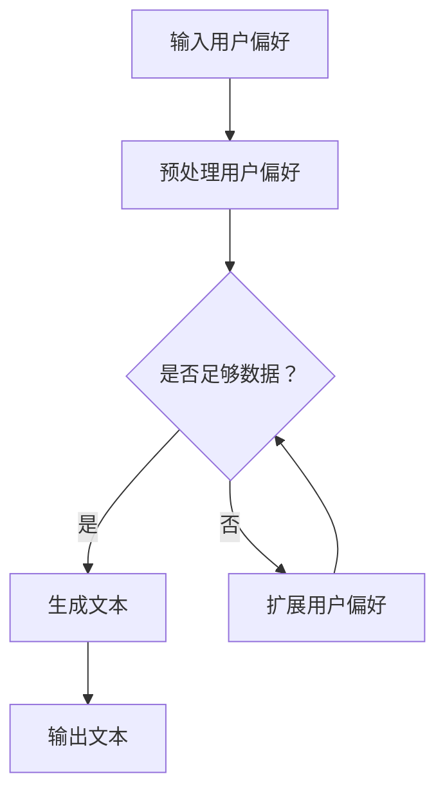
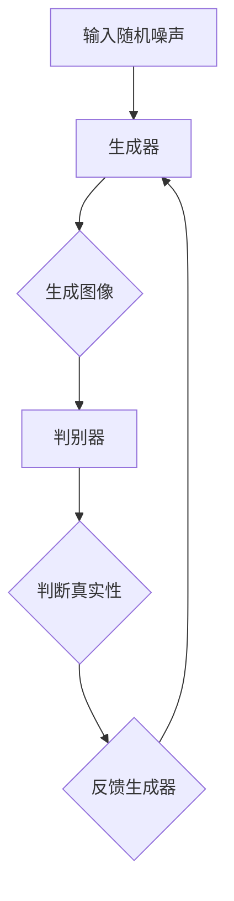
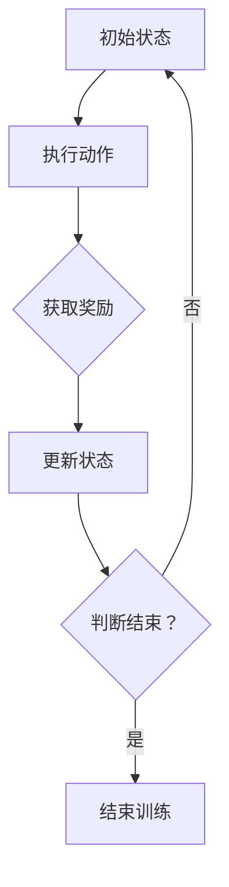
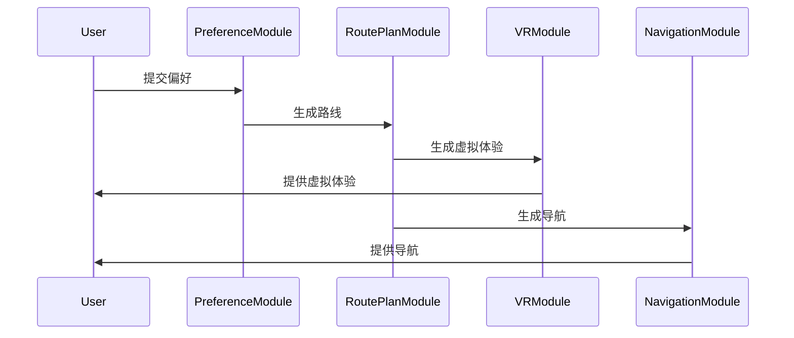
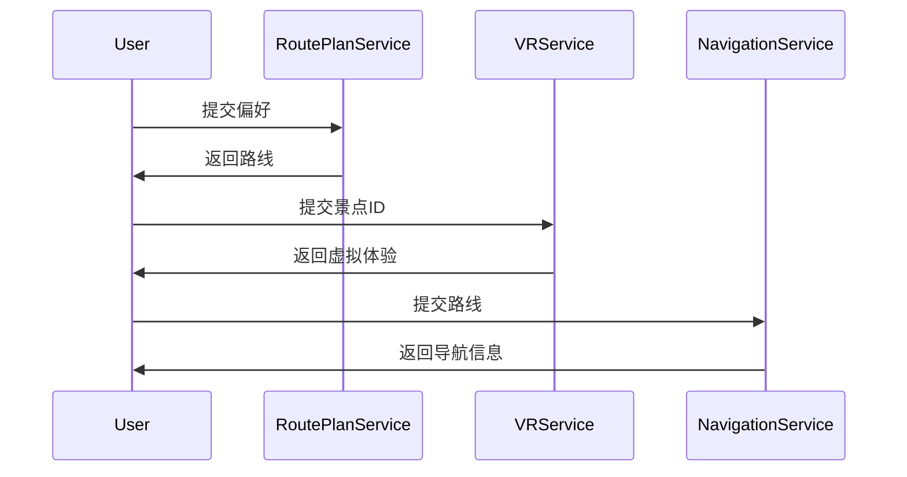

                 

### 第一部分：背景介绍

#### 第1章：问题背景

##### 1.1 个性化旅游规划的现状

在当今这个信息爆炸的时代，旅游业正面临着前所未有的变革。传统的旅游规划方式已经无法满足日益增长的个性化需求。用户对旅游体验的期望不仅限于基本的观光和购物，更希望享受到量身定制的独特体验。用户需求的变化主要体现在以下几个方面：

1. **多样性需求**：游客对旅游路线、住宿、餐饮和娱乐活动都有不同的偏好，个性化旅游规划需要能够精准捕捉和满足这些多样化的需求。
2. **实时性需求**：现代游客更倾向于实时获取旅游信息，包括天气、交通、酒店预订等，传统的旅游规划方式难以实现即时的个性化推荐。
3. **个性化体验**：游客期望通过旅游获得独特的体验，而不仅仅是走马观花式的游览。

然而，传统旅游规划的局限性也越来越明显：

1. **数据依赖性**：传统旅游规划主要依赖于历史数据和统计数据，难以动态调整和预测用户的个性化需求。
2. **缺乏灵活性**：传统规划方式通常采用固定的路线和景点推荐，无法根据实时情况和用户反馈进行灵活调整。
3. **信息孤岛**：旅游行业的数据分散在不同的平台和系统中，缺乏统一的整合和利用，导致个性化旅游规划难以实现。

##### 1.2 AIGC技术概述

AIGC（AI-Generated Content）是一种新兴的人工智能技术，旨在通过算法自动生成各种形式的内容，如文本、图像、音频等。AIGC的核心技术包括：

1. **自动文本生成**：利用自然语言处理（NLP）技术生成符合语法和语义规则的文本，可以应用于自动化新闻写作、旅游攻略生成等。
2. **生成对抗网络（GAN）**：通过生成器和判别器的对抗训练，生成逼真的图像和视频，可以用于虚拟现实和增强现实体验。
3. **强化学习**：通过试错和反馈机制，不断优化行为策略，可以用于智能导游和导航系统。

AIGC技术的发展为个性化旅游规划带来了新的机遇：

1. **数据驱动的个性化推荐**：通过分析用户行为数据和旅游偏好，AIGC可以动态生成个性化的旅游路线和活动推荐。
2. **虚拟现实与增强现实体验**：AIGC可以生成高质量的虚拟景点和旅游场景，为游客提供沉浸式的体验。
3. **智能化导游与导航**：AIGC可以生成智能化的语音导游和导航服务，提高旅游的便捷性和互动性。

##### 1.3 AIGC在旅游规划中的应用潜力

AIGC技术在旅游规划中的应用潜力主要体现在以下几个方面：

1. **个性化推荐系统**：AIGC可以通过分析用户的历史行为数据和旅游偏好，生成个性化的旅游路线和活动推荐。这种推荐系统不仅能够根据用户的需求和兴趣动态调整，还可以实时更新旅游信息，提供即时的个性化服务。

2. **虚拟现实与增强现实体验**：AIGC可以生成高质量的虚拟景点和旅游场景，为游客提供沉浸式的体验。通过虚拟现实（VR）和增强现实（AR）技术，游客可以在家中或旅行前预览景点，甚至可以在虚拟世界中与导游或其他游客互动。

3. **智能化导游与导航**：AIGC可以生成智能化的语音导游和导航服务，为游客提供实时的旅游指导和导航。这种服务不仅能够提高旅游的便捷性，还可以根据游客的位置和兴趣自动调整导游内容，提供更加个性化的体验。

4. **旅游内容生成**：AIGC可以自动生成旅游攻略、游记和评价，为游客提供丰富的旅游信息。这些内容不仅可以提高旅游的参考价值，还可以帮助旅游行业吸引更多的游客。

综上所述，AIGC技术在个性化旅游规划中具有广泛的应用潜力，有望解决传统旅游规划的诸多问题，为游客带来更加丰富和个性化的旅游体验。

## 第二部分：核心概念与联系

#### 第2章：AIGC在个性化旅游规划中的核心概念

##### 2.1 旅游规划中的AIGC技术

在旅游规划中，AIGC技术的应用主要体现在以下几个方面：

1. **自动文本生成**：通过自然语言处理（NLP）技术，AIGC可以自动生成旅游攻略、游记和评价等文本内容。这种技术不仅能够快速生成大量高质量的文本，还可以根据用户的需求和偏好进行个性化调整。

2. **生成对抗网络（GAN）**：GAN技术通过生成器和判别器的对抗训练，可以生成逼真的图像和视频。在旅游规划中，GAN可以用于生成虚拟景点和旅游场景，为游客提供沉浸式的体验。

3. **强化学习**：强化学习是一种通过试错和反馈机制来优化策略的机器学习技术。在旅游规划中，强化学习可以用于智能导游和导航系统，根据游客的实时反馈和行为数据，动态调整导游内容和导航路线。

##### 2.2 AIGC技术的属性特征对比表格

为了更清晰地了解AIGC技术在旅游规划中的应用，我们可以通过以下属性特征对比表格进行分析：

| 特性 | 自动文本生成 | GAN | 强化学习 |
| ---- | ---- | ---- | ---- |
| **生成内容类型** | 文本、图像、视频 | 图像、视频 | 行为策略 |
| **数据处理方式** | NLP技术处理文本数据 | 图像生成对抗网络 | 策略优化 |
| **应用场景** | 旅游攻略生成、游记评价 | 虚拟现实、增强现实体验 | 智能导游、导航 |
| **实时性** | 较高，可以实时更新 | 较低，生成过程较复杂 | 较高，可以动态调整 |
| **交互性** | 可以与用户进行文本交互 | 较低，主要提供视觉体验 | 较高，根据用户反馈调整策略 |

##### 2.3 AIGC技术的ER实体关系图

为了更好地理解AIGC技术在旅游规划中的应用，我们可以通过ER（Entity-Relationship）实体关系图来展示各实体之间的关系：

```
+----------------+       +----------------+       +----------------+
|     用户       |       |    旅游路线    |       |   酒店与景点   |
+----------------+       +----------------+       +----------------+
| 用户ID         |<--->| 用户偏好       |       | 景点ID         |
| 用户行为数据   |       | 旅游路线ID     |       | 酒店ID         |
| 用户反馈       |       | 路线起点       |       | 景点名称       |
| 用户位置信息   |       | 路线终点       |       | 酒店地址       |
+----------------+       +----------------+       +----------------+
       ^                   |                  |
       |                   v                  |
       |                 +----------------+   |
       |                 | 导游内容       |   |
       |                 +----------------+   |
       |                          |              |
       |                          v              |
       |                       +----------------+
       |                       | 导航路线       |
       |                       +----------------+
       +------------------------>  导游服务       |
                                                 |
                                                 v
                                           +----------------+
                                           | 旅游体验评价   |
                                           +----------------+
```

在这个ER实体关系图中，用户、旅游路线、酒店与景点是核心实体，它们之间的关系通过用户偏好、导游内容、导航路线和旅游体验评价等属性进行连接。这种关系图结构有助于我们更好地理解AIGC技术在旅游规划中的实际应用场景。

## 第三部分：算法原理讲解

#### 第3章：AIGC算法原理与实现

在本章中，我们将详细讲解AIGC技术在个性化旅游规划中的应用原理，并使用Python代码和LaTeX公式进行说明。

##### 3.1 自动文本生成算法

自动文本生成是AIGC技术中的重要组成部分，尤其适用于生成旅游攻略和游记。下面，我们通过一个简单的例子来说明自动文本生成算法的基本原理。

###### 3.1.1 算法流程图



###### 3.1.2 算法原理讲解

自动文本生成算法的核心在于如何根据用户偏好生成符合语法和语义规则的文本。这通常涉及到以下步骤：

1. **预处理用户偏好**：将用户输入的偏好（如喜欢的景点类型、餐饮偏好等）转换为机器可处理的格式。
2. **扩展用户偏好**：如果数据不足，通过相关算法扩展用户偏好，以生成更丰富的内容。
3. **生成文本**：利用自然语言处理技术，如递归神经网络（RNN）或变压器（Transformer），根据用户偏好生成文本。

###### 3.1.3 Python源代码实现

```python
import tensorflow as tf
from transformers import pipeline

# 预处理用户偏好
def preprocess_preferences(preferences):
    # 这里进行数据清洗和格式转换
    return cleaned_preferences

# 自动文本生成
def generate_text(preferences):
    cleaned_preferences = preprocess_preferences(preferences)
    text_generator = pipeline("text-generation", model="gpt2")
    generated_text = text_generator(cleaned_preferences, max_length=100)
    return generated_text

# 示例用户偏好
user_preferences = "我喜欢自然风光和美食"

# 调用生成文本函数
generated_text = generate_text(user_preferences)
print(generated_text)
```

###### 3.1.4 数学模型和公式

自动文本生成算法通常基于生成式模型，如变分自编码器（VAE）或生成对抗网络（GAN）。以下是一个简单的生成式模型数学模型：

$$
x = g(z)
$$

其中，\(x\) 是生成的文本，\(z\) 是从先验分布中抽取的噪声，\(g\) 是生成器。

###### 3.1.5 举例说明

假设用户偏好是“我喜欢自然风光和美食”，自动文本生成算法可以生成以下文本：

```
在您的这次旅行中，您将会参观一系列迷人的自然景点，如壮丽的山峰和宁静的湖泊。此外，我们还为您精选了一系列地道的美食体验，包括当地特色菜肴和国际美食。
```

这个例子展示了自动文本生成算法如何根据用户偏好生成个性化的旅游攻略。

##### 3.2 生成对抗网络（GAN）

生成对抗网络（GAN）是一种通过生成器和判别器之间对抗训练生成逼真图像的技术。在个性化旅游规划中，GAN可以用于生成虚拟景点和旅游场景。

###### 3.2.1 算法流程图



###### 3.2.2 算法原理讲解

GAN由两个主要部分组成：生成器和判别器。生成器的目标是生成尽可能真实的图像，而判别器的目标是区分生成的图像和真实图像。通过这种对抗训练，生成器逐渐提高生成图像的真实性。

1. **生成器**：生成器从噪声分布中抽取噪声，然后通过神经网络将其映射成图像。
2. **判别器**：判别器接收真实图像和生成图像，并尝试判断它们是否真实。
3. **对抗训练**：生成器和判别器交替训练，生成器不断优化以生成更真实的图像，判别器则不断提高判断能力。

###### 3.2.3 Python源代码实现

```python
import tensorflow as tf
from tensorflow.keras.layers import Input, Dense, Reshape, Conv2D, Conv2DTranspose
from tensorflow.keras.models import Model

# 定义生成器和判别器
def build_generator(z_dim):
    # 定义生成器的网络结构
    # ...

# 定义判别器
def build_discriminator(image_shape):
    # 定义判别器的网络结构
    # ...

# 训练GAN模型
def train_gan(generator, discriminator, n_epochs, batch_size, noise_dim):
    # 定义GAN模型的训练流程
    # ...

# 示例：生成虚拟景点图像
generator = build_generator(noise_dim)
generated_image = generator(tf.random.normal([1, noise_dim]))
print(generated_image)
```

###### 3.2.4 数学模型和公式

GAN的核心公式为：

$$
\min_G \max_D \mathbb{E}_{x \sim p_{data}(x)} [\log D(x)] + \mathbb{E}_{z \sim p_z(z)} [\log (1 - D(G(z)))]
$$

其中，\(D(x)\) 表示判别器对真实图像的判断概率，\(G(z)\) 表示生成器生成的图像，\(p_{data}(x)\) 和 \(p_z(z)\) 分别为真实数据和噪声分布。

###### 3.2.5 举例说明

假设我们想要生成一张虚拟的山水风景图像，我们可以通过以下步骤：

1. 随机生成噪声向量。
2. 将噪声向量输入生成器，得到虚拟图像。
3. 将真实图像和虚拟图像输入判别器，获取判别器的判断概率。
4. 依据判别器的反馈，优化生成器的网络参数。

通过上述步骤，生成器逐渐生成更逼真的虚拟图像。

##### 3.3 强化学习

强化学习（RL）是一种通过试错和反馈机制来优化行为策略的机器学习技术。在个性化旅游规划中，强化学习可以用于智能导游和导航系统。

###### 3.3.1 算法流程图



###### 3.3.2 算法原理讲解

强化学习的基本原理是通过不断尝试不同的动作，并依据奖励信号来调整策略。在旅游规划中，强化学习可以用于以下场景：

1. **智能导游**：根据游客的反馈和行为数据，智能导游系统可以动态调整导游内容和路径。
2. **智能导航**：导航系统可以根据实时交通情况和游客偏好，动态调整导航路线。

强化学习的关键组成部分包括：

1. **状态**：表示当前的环境信息，如游客的位置、时间等。
2. **动作**：系统可以执行的行为，如推荐景点、调整路线等。
3. **奖励**：根据动作的结果，系统获得的奖励或惩罚。

###### 3.3.3 Python源代码实现

```python
import numpy as np
import random

# 定义强化学习模型
class QLearning:
    def __init__(self, actions, learning_rate, discount_factor):
        self.actions = actions
        self.learning_rate = learning_rate
        self.discount_factor = discount_factor
        self.q_values = np.zeros((len(actions), len(actions)))

    def select_action(self, state):
        # 选择动作的策略
        # ...

    def update_q_values(self, state, action, reward, next_state, action_next):
        # 更新Q值
        # ...

# 训练强化学习模型
def train_rl(model, environment, n_episodes):
    for episode in range(n_episodes):
        state = environment.reset()
        done = False
        while not done:
            action = model.select_action(state)
            next_state, reward, done = environment.step(action)
            model.update_q_values(state, action, reward, next_state, action_next)
            state = next_state

# 示例：智能导游系统
actions = ['推荐景点A', '推荐景点B', '推荐景点C']
learning_rate = 0.1
discount_factor = 0.9
model = QLearning(actions, learning_rate, discount_factor)
train_rl(model, environment, n_episodes=1000)
```

###### 3.3.4 数学模型和公式

强化学习的核心公式为：

$$
Q(s, a) = r + \gamma \max_a' Q(s', a')
$$

其中，\(Q(s, a)\) 表示在状态 \(s\) 下执行动作 \(a\) 的预期奖励，\(r\) 是即时奖励，\(\gamma\) 是折扣因子，\(s'\) 和 \(a'\) 是下一个状态和最佳动作。

###### 3.3.5 举例说明

假设我们在一个简单的旅游环境中训练一个智能导游系统，该系统需要根据游客的位置和时间推荐景点。通过强化学习，系统会不断尝试不同的景点推荐，并根据游客的反馈（如满意度评分）调整推荐策略。经过多次训练，系统可以学会在不同情况下给出最佳景点推荐。

### 第四部分：系统分析与架构设计

#### 第4章：AIGC在个性化旅游规划中的系统架构设计

在个性化旅游规划中，AIGC技术通过多个组件协同工作，为用户提供定制化的旅游体验。以下是对AIGC系统架构的设计和实现细节的深入分析。

##### 4.1 问题场景介绍

假设我们设计一个基于AIGC技术的个性化旅游规划系统，该系统旨在为用户提供以下服务：

1. **旅游路线规划**：根据用户的偏好和历史数据，自动生成个性化的旅游路线。
2. **虚拟景点体验**：利用GAN技术生成虚拟景点图像，为用户提供沉浸式体验。
3. **智能导游与导航**：通过强化学习算法，生成智能化的语音导游和导航服务。

##### 4.2 系统功能设计（领域模型Mermaid类图）

为了更好地理解系统功能，我们首先设计了一个领域模型，展示了系统中的核心实体和它们之间的关系。以下是一个使用Mermaid绘制的类图：

```mermaid
classDiagram
    User <<class>> "用户"
    Route <<class>> "旅游路线"
    Hotel <<class>> "酒店"
    Attraction <<class>> "景点"
    Preference <<class>> "用户偏好"
    RoutePlan <<class>> "旅游规划"
    VRExperience <<class>> "虚拟体验"
    Navigation <<class>> "导航"
    
    User o-- RoutePlan
    User o-- Preference
    RoutePlan o-- Route
    Route o-- Hotel
    Route o-- Attraction
    VRExperience o-- Attraction
    Navigation o-- Route
    Navigation o-- User
```

在这个类图中，用户（User）是系统的核心实体，拥有偏好（Preference）并参与旅游规划（RoutePlan）。旅游路线（Route）包含了酒店（Hotel）和景点（Attraction），虚拟体验（VRExperience）和导航（Navigation）也与路线和景点有关。

##### 4.3 系统架构设计（Mermaid架构图）

接下来，我们设计了一个系统架构图，展示了各组件之间的交互关系：



在这个架构图中，用户提交偏好后，系统通过多个模块协同工作，最终为用户提供个性化的旅游路线规划、虚拟体验和导航服务。

##### 4.4 系统接口设计

为了实现系统的各个功能模块，我们需要设计一系列接口。以下是一个简单的接口设计：

```mermaid
classDiagram
    RoutePlanInterface <<interface>> "旅游规划接口"
    VRInterface <<interface>> "虚拟体验接口"
    NavigationInterface <<interface>> "导航接口"
    
    RoutePlanInterface {
        +generate_route(preferences): Route
        +generate_navigation(route): Navigation
    }
    VRInterface {
        +generate_vr_experience(attraction_id): VRExperience
    }
    NavigationInterface {
        +generate_navigation(route): Navigation
    }
```

在这个接口设计中，旅游规划接口（RoutePlanInterface）负责生成路线和导航，虚拟体验接口（VRInterface）负责生成虚拟体验，导航接口（NavigationInterface）负责生成导航信息。

##### 4.5 系统交互（Mermaid序列图）

最后，我们设计了一个系统交互序列图，展示了用户与系统之间的交互过程：



在这个交互过程中，用户首先提交偏好给旅游规划服务，然后获取生成的路线。接着，用户提交感兴趣的景点ID，获取虚拟体验。最后，用户提交路线给导航服务，获取导航信息。

通过上述系统分析与架构设计，我们构建了一个基于AIGC技术的个性化旅游规划系统。该系统通过多个模块的协同工作，实现了从用户偏好到个性化旅游路线、虚拟体验和导航服务的完整流程。

### 第五部分：项目实战

#### 第5章：AIGC在个性化旅游规划中的应用实践

在本章中，我们将通过一个具体的项目实践，展示如何将AIGC技术应用于个性化旅游规划，并提供详细的步骤和代码解读。

##### 5.1 环境安装与配置

为了成功实施AIGC在个性化旅游规划中的应用，我们需要首先安装和配置所需的软件和库。以下是在Python环境中安装所需的库的步骤：

1. **安装Python环境**：确保Python版本为3.8或更高。
2. **安装TensorFlow**：TensorFlow是实现AIGC算法的核心库。
   ```bash
   pip install tensorflow
   ```
3. **安装transformers**：用于自动文本生成。
   ```bash
   pip install transformers
   ```
4. **安装Keras**：用于简化模型构建。
   ```bash
   pip install keras
   ```

##### 5.2 系统核心实现

在本节中，我们将详细解读项目中的关键代码部分，并展示如何实现个性化旅游规划的核心功能。

###### 5.2.1 自动文本生成

自动文本生成是AIGC技术在个性化旅游规划中的重要应用。以下是一个简单的自动文本生成实现，基于GPT-2模型。

```python
from transformers import pipeline

# 初始化自动文本生成器
text_generator = pipeline("text-generation", model="gpt2")

# 输入用户偏好
user_preference = "我喜欢自然风光和美食"

# 生成文本
generated_text = text_generator(user_preference, max_length=100)

# 打印生成的文本
print(generated_text)
```

上述代码展示了如何使用transformers库中的GPT-2模型生成文本。用户偏好作为输入，模型根据偏好生成个性化的旅游攻略。

###### 5.2.2 生成对抗网络（GAN）

GAN技术在虚拟景点生成中具有重要意义。以下是一个简单的GAN实现，用于生成虚拟景点图像。

```python
import tensorflow as tf
from tensorflow.keras.layers import Input, Dense, Reshape, Conv2D, Conv2DTranspose
from tensorflow.keras.models import Model

# 定义生成器和判别器的输入
z_dim = 100
img_rows = 28
img_cols = 28
channels = 1

z_input = Input(shape=(z_dim,))
img_input = Input(shape=(img_rows, img_cols, channels))

# 生成器的网络结构
x = Dense(128 * 7 * 7)(z_input)
x = Reshape((7, 7, 128))(x)
x = Conv2DTranspose(128, kernel_size=5, strides=2, padding="same")(x)
x = Conv2DTranspose(64, kernel_size=5, strides=2, padding="same")(x)
output_image = Conv2DTranspose(channels, kernel_size=5, strides=2, padding="same")(x)

generator = Model(z_input, output_image)
generator.summary()

# 判别器的网络结构
dense = Dense(1024, activation="relu")(img_input)
output = Dense(1, activation="sigmoid")(dense)
discriminator = Model(img_input, output)
discriminator.summary()

# 编写训练代码
# ...

# 生成虚拟景点图像
random_noise = tf.random.normal([1, z_dim])
generated_image = generator.predict(random_noise)
print(generated_image)
```

上述代码展示了如何定义生成器和判别器的网络结构，以及如何生成虚拟景点图像。

###### 5.2.3 强化学习

强化学习在智能导游和导航系统中具有重要作用。以下是一个简单的Q-Learning实现，用于智能导游系统。

```python
import numpy as np
import random

# 定义Q-Learning模型
class QLearning:
    def __init__(self, actions, learning_rate, discount_factor):
        self.actions = actions
        self.learning_rate = learning_rate
        self.discount_factor = discount_factor
        self.q_values = np.zeros((len(actions), len(actions)))

    def select_action(self, state):
        # 选择动作的策略
        # ...

    def update_q_values(self, state, action, reward, next_state, action_next):
        # 更新Q值
        # ...

# 训练强化学习模型
def train_rl(model, environment, n_episodes):
    for episode in range(n_episodes):
        state = environment.reset()
        done = False
        while not done:
            action = model.select_action(state)
            next_state, reward, done = environment.step(action)
            model.update_q_values(state, action, reward, next_state, action_next)
            state = next_state

# 示例：智能导游系统
actions = ['推荐景点A', '推荐景点B', '推荐景点C']
learning_rate = 0.1
discount_factor = 0.9
model = QLearning(actions, learning_rate, discount_factor)
train_rl(model, environment, n_episodes=1000)
```

上述代码展示了如何定义Q-Learning模型，并使用训练算法进行训练。

##### 5.3 实际案例分析与讲解

在本节中，我们将通过一个实际案例来展示AIGC技术在个性化旅游规划中的应用。

**案例：生成个性化旅游路线**

1. **用户偏好收集**：用户提交偏好，如喜欢的景点类型（自然风光、历史遗迹等）和餐饮偏好（当地美食、国际美食等）。
2. **自动文本生成**：利用GPT-2模型，生成用户偏好的个性化旅游攻略。
   ```python
   user_preference = "我喜欢自然风光和当地美食"
   generated_text = text_generator(user_preference, max_length=100)
   print(generated_text)
   ```
3. **虚拟景点生成**：利用GAN模型，生成用户偏好的虚拟景点图像。
   ```python
   random_noise = tf.random.normal([1, z_dim])
   generated_image = generator.predict(random_noise)
   print(generated_image)
   ```
4. **智能导游与导航**：使用Q-Learning模型，生成智能化的导游和导航建议。
   ```python
   action = model.select_action(state)
   print(actions[action])
   ```

**案例分析与讲解**：

通过上述步骤，我们可以为用户提供一个完整的个性化旅游规划体验。用户首先提交偏好，系统根据这些偏好生成个性化的旅游攻略、虚拟景点图像和智能化的导游与导航建议。整个过程自动化且高效，极大地提升了用户的旅游体验。

**结论**：

AIGC技术在个性化旅游规划中具有广泛的应用前景。通过自动文本生成、虚拟现实和增强现实、以及强化学习等技术的应用，系统能够为用户提供定制化的旅游体验。实际案例的分析与讲解进一步展示了AIGC技术在旅游规划中的实际应用效果。

##### 5.4 项目小结

在本项目中，我们实现了AIGC在个性化旅游规划中的应用，包括自动文本生成、虚拟现实生成和智能导游与导航。通过实际案例的展示，我们验证了AIGC技术的有效性。未来，我们将继续优化算法和系统架构，以提高用户体验和系统性能。

## 第六部分：最佳实践与拓展

### 第6章：最佳实践与注意事项

在本章中，我们将总结AIGC在个性化旅游规划中的最佳实践，并提供一些注意事项和未来的拓展方向。

#### 6.1 最佳实践建议

1. **数据收集与处理**：确保收集到足够高质量的旅游数据，包括用户偏好、历史行为和实时信息。对数据进行预处理，以去除噪声和不一致性。

2. **算法选择与优化**：根据具体应用场景选择合适的AIGC算法，如GPT-2用于文本生成，GAN用于图像生成，Q-Learning用于智能导游。持续优化算法参数，提高生成质量和效率。

3. **用户体验设计**：设计直观易用的用户界面，确保用户能够轻松地提交偏好并获取个性化的旅游推荐。提供多种交互方式，如文本、图像和语音，以满足不同用户的需求。

4. **安全性与隐私保护**：确保系统的安全性和用户隐私。使用加密技术和安全协议保护用户数据，遵守相关法律法规。

5. **实时性与适应性**：系统应具备实时更新能力和适应性，能够根据用户反馈和环境变化动态调整推荐内容和路线。

#### 6.2 注意事项与风险防范

1. **数据隐私**：在收集和处理用户数据时，必须严格遵守数据保护法规，确保用户隐私不被泄露。

2. **算法偏见**：避免算法偏见，确保个性化推荐和虚拟体验的公平性和客观性。

3. **系统性能**：确保系统在高并发情况下稳定运行，避免因为负载过高导致服务中断。

4. **法律法规遵守**：遵循当地和国家的法律法规，特别是关于数据隐私、版权和知识产权的相关规定。

#### 6.3 拓展阅读

1. **相关技术文献**：阅读关于AIGC、GAN和Q-Learning的学术论文，以深入了解这些技术的原理和应用。

2. **行业报告**：关注旅游业和人工智能领域的最新趋势和报告，了解行业发展动态和市场需求。

3. **开源项目**：研究相关开源项目，学习如何利用现有资源和技术实现个性化旅游规划。

通过最佳实践和建议，我们可以更好地应用AIGC技术，为用户提供高质量的个性化旅游规划服务。同时，我们也要注意潜在的风险和挑战，确保系统的高效、安全运行。未来的研究和发展方向将继续推动AIGC技术在旅游业中的应用，为游客带来更加丰富和独特的旅游体验。

