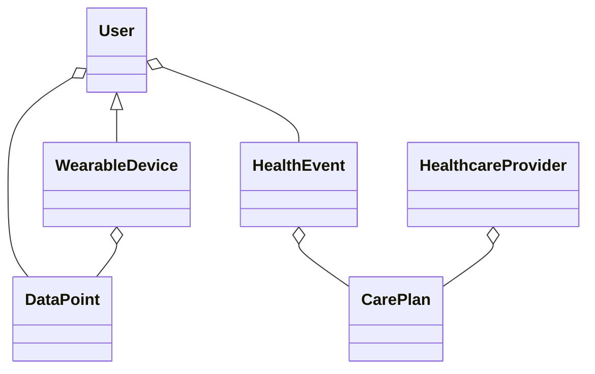
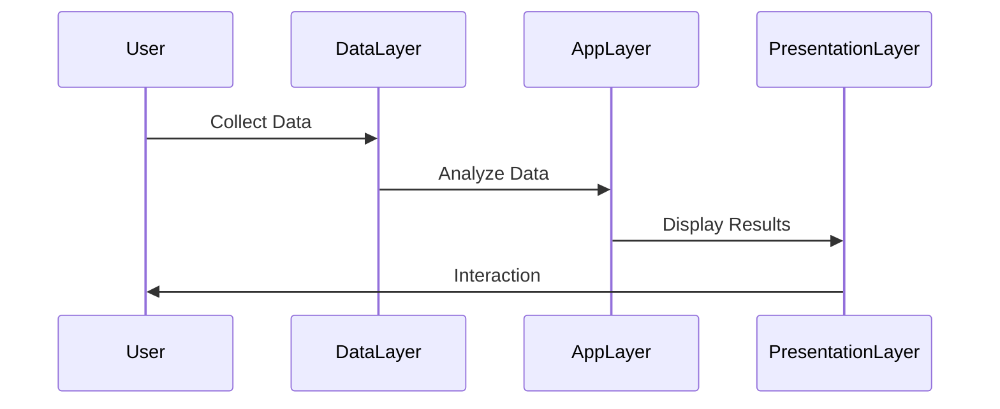
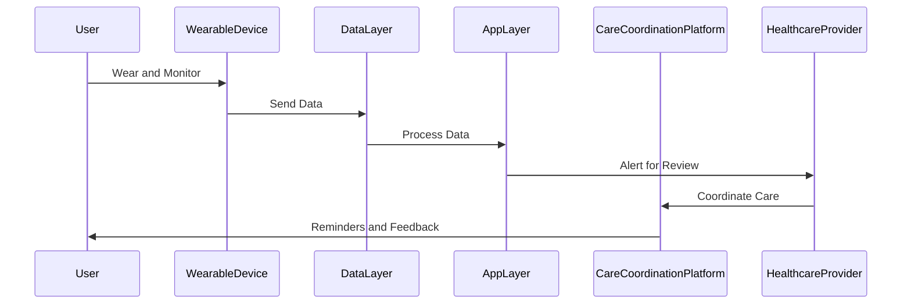

                 


### AIGC in Personalized Elderly Quality of Life Improvement

#### Introduction to AIGC

##### What is AIGC

Artificial Intelligence and Generative Models (AIGC) is a cutting-edge technological domain that blends the power of AI with generative models. AIGC leverages advanced algorithms to generate data, images, text, and other types of content that are indistinguishable from human-created materials. The term "generative" refers to the ability of these models to create new content based on the patterns and structures they have learned from large datasets.

##### The Significance of AIGC

The significance of AIGC lies in its potential to revolutionize various industries. In healthcare, AIGC can generate personalized treatment plans and predictive analytics. In entertainment, it can create new music, movies, and stories. In education, it can design adaptive learning materials tailored to individual student needs. However, the most impactful application of AIGC might be in the improvement of the quality of life for elderly individuals.

##### Challenges and Opportunities

AIGC faces several challenges, including the need for large datasets, computational power, and ethical considerations. The opportunities, however, are vast. By addressing these challenges, AIGC can offer personalized solutions to the complex needs of the elderly population, improving their health, well-being, and independence.

#### Core Concepts and Relationships

##### Key Concepts

- **Artificial Intelligence (AI):** AI refers to the ability of machines to perform tasks that typically require human intelligence, such as visual perception, speech recognition, and decision-making.
- **Generative Models:** These models can generate new content, such as text, images, or audio, based on patterns learned from existing data.
- **Deep Learning:** A subfield of AI that uses neural networks to model complex relationships between inputs and outputs.
- **Machine Learning:** A subfield of AI that focuses on developing algorithms that can learn from data and make predictions or decisions.

##### Mermaid ER Diagram

A Mermaid ER diagram can illustrate the relationships between these key concepts:

```mermaid
erDiagram
  AI ||--|{ Generative Models }
  AI ||--|{ Deep Learning }
  AI ||--|{ Machine Learning }
  Generative Models ||--|{ Text Generation }
  Generative Models ||--|{ Image Generation }
  Generative Models ||--|{ Audio Generation }
```

##### Comparative Analysis of Core Concepts

| Concept         | Definition                                                                 | Example                                               |
|-----------------|-----------------------------------------------------------------------------|--------------------------------------------------------|
| AI              | Machines performing tasks requiring human intelligence                       | Self-driving cars, virtual assistants                    |
| Generative Models | Models capable of generating new content based on patterns in data             | GPT-3, DALL-E, WaveNet   |
| Deep Learning   | A type of machine learning using neural networks to model complex relationships | Image recognition, natural language processing          |
| Machine Learning | Developing algorithms that can learn from data and make predictions           | Fraud detection, recommendation systems                  |

#### Framework of AIGC Applications

##### Overview of AIGC Applications

AIGC has found applications in various sectors, including healthcare, entertainment, education, and more. In healthcare, AIGC can be used for predictive analytics, personalized medicine, and virtual healthcare assistants. In entertainment, it can generate new content, such as songs, movies, and stories. In education, AIGC can create personalized learning materials.

##### Case Studies in Different Sectors

**Healthcare:** IBM Watson Health is using AIGC for predictive analytics and personalized treatment plans. By analyzing large datasets, Watson can identify potential health risks and recommend personalized interventions.

**Entertainment:** OpenAI's DALL-E can generate new images based on textual descriptions. This technology has been used to create artwork, illustrations, and even short films.

**Education:** Adaptive learning platforms, like DreamBox, use AIGC to tailor educational materials to individual student needs, improving learning outcomes.

#### Current State and Future Trends

##### Market Analysis

The AIGC market is growing rapidly, with a projected compound annual growth rate (CAGR) of over 40% over the next five years. The increasing demand for personalized solutions across various industries is driving this growth.

##### Technological Evolution

AIGC is evolving rapidly, with advancements in deep learning, natural language processing, and computer vision. These advancements are making it possible to generate more realistic and accurate content.

##### Ethical Considerations

As AIGC becomes more powerful, ethical considerations become increasingly important. Issues such as data privacy, bias in AI, and the impact on jobs are areas that need careful attention.

#### Conclusion

AIGC has the potential to revolutionize the way we address the complex needs of the elderly population. By offering personalized solutions, AIGC can improve the quality of life for elderly individuals, enhancing their health, well-being, and independence. However, to realize this potential, we must address the challenges and ethical considerations associated with AIGC. As we move forward, AIGC will undoubtedly play a crucial role in shaping the future of elderly care and quality of life.

#### References

- IBM Watson Health: <https://www.ibm.com/watson/health>
- OpenAI DALL-E: <https://dalle.openai.com/>
- DreamBox: <https://www.dreambox.com/>

---

### Assessing the Needs of the Elderly Population

#### Aging Population Overview

The global aging population is a significant demographic trend that has profound implications for society. With advances in healthcare and improved living conditions, people are living longer, which is contributing to a rising proportion of elderly individuals in the population. According to the World Health Organization (WHO), the world's population aged 60 years or older is expected to more than double from 900 million in 2015 to about 2 billion by 2050.

##### Global Trends

- **Increasing Life Expectancy:** Life expectancy has been on the rise globally, with the average person living longer in most countries.
- **Shifting Age Structures:** Countries with lower birth rates and higher life expectancies are experiencing significant shifts in their age structures, leading to a larger proportion of elderly individuals.
- **Economic Implications:** The aging population poses economic challenges, including increased healthcare costs, pension systems, and labor force shortages.

##### Challenges Faced by the Elderly

- **Health Issues:** As people age, they are more prone to chronic diseases, such as heart disease, diabetes, and dementia. These health issues can significantly reduce the quality of life and increase dependency on healthcare services.
- **Financial Security:** Many elderly individuals face financial insecurity due to reduced income, depleting retirement savings, and the high cost of healthcare.
- **Social Isolation:** The loss of a spouse, family, or friends can lead to social isolation, which is associated with poor mental health outcomes.
- **Caregiver Burden:** Family members and caregivers often bear the brunt of providing care for elderly loved ones, which can lead to stress and burnout.

#### Quality of Life Indicators

##### Definition and Measurement

Quality of life (QoL) is a comprehensive concept that encompasses physical, mental, and social well-being. Measuring QoL in the elderly is essential to understand their needs and develop appropriate interventions. Key indicators of QoL include:

- **Health Status:** Physical health conditions, chronic disease management, and overall well-being.
- **Mental Health:** Psychological well-being, including depression, anxiety, and cognitive functioning.
- **Social Engagement:** Social activities, relationships, and community participation.
- **Financial Security:** Financial stability and the ability to meet basic needs.

##### Key Factors Affecting Quality of Life

- **Healthcare Access:** Availability and accessibility of healthcare services play a critical role in determining the quality of life for the elderly.
- **Social Support:** The presence of family, friends, and community support networks can significantly impact the elderly's QoL.
- **Living Environment:** The physical environment, including housing and transportation, can influence the QoL.
- **Economic Resources:** Financial stability and access to resources for basic needs and discretionary spending affect QoL.

#### AIGC Technologies for Elderly Care

##### Overview of AIGC Applications in Elderly Care

AIGC technologies are transforming the way we approach elderly care by offering personalized and efficient solutions. Here are some key applications:

- **Health Monitoring:** AIGC-enabled devices can monitor vital signs, track physical activity, and detect early signs of health issues.
- **Predictive Analytics:** AI algorithms can analyze health data to predict potential health problems and recommend preventive measures.
- **Virtual Healthcare Assistants:** AI-powered virtual assistants can provide real-time support, answer health-related questions, and remind patients to take medication.
- **Personalized Therapy Plans:** AI can generate personalized therapy plans for conditions like dementia and chronic pain, improving patient outcomes.

##### Case Studies: Successful Applications

**Health Monitoring:** Samsung's Health Monitor is an AI-powered wearable device that tracks heart rate, blood pressure, and other vital signs. It uses machine learning algorithms to detect irregular heart rhythms and send alerts to healthcare providers.

**Predictive Analytics:** Philips' IntelliSpace Health Hub uses AI to analyze patient data from electronic health records, lab results, and wearable devices. It provides predictive insights into patients' health status, enabling proactive healthcare interventions.

**Virtual Healthcare Assistants:** Amazon's Alexa is integrated with health services to provide virtual care support. Users can ask Alexa questions about their health, receive reminders for medication, and schedule appointments with healthcare providers.

**Personalized Therapy Plans:** IBM Watson Health's AI-driven platform, Watson for Oncology, provides personalized treatment plans for cancer patients. It analyzes clinical data and generates evidence-based recommendations for specific patient cases.

### Conclusion

Assessing the needs of the elderly population is crucial for developing effective interventions to improve their quality of life. AIGC technologies offer innovative solutions that can address the complex needs of the elderly, providing personalized care, predictive analytics, and virtual support. By leveraging AIGC, we can create a future where elderly individuals enjoy better health, well-being, and independence.

#### References

- World Health Organization: <https://www.who.int/emergencies/diseases/novel-coronavirus-2019>
- Samsung Health Monitor: <https://www.samsung.com/uk/health-monitor/>
- Philips IntelliSpace Health Hub: <https://www.philips.com/healthcare/innovation/intellispace-health-hub>
- Amazon Alexa Health: <https://www.amazon.com/alexabetes/things-to-try/health-care>
- IBM Watson Health: <https://www.ibm.com/watson/health> 

---

### Personalized Solutions with AIGC

#### Personalized Assessment and Diagnostics

##### Personalized Health Monitoring

Personalized health monitoring is a cornerstone of AIGC applications in elderly care. It involves the use of wearable devices and sensors to continuously track vital signs, physical activity, and other health-related metrics. These devices collect real-time data that can be analyzed to detect early signs of health issues, enabling timely interventions.

- **Wearable Devices:** Devices such as smartwatches, fitness trackers, and even clothing with embedded sensors can monitor heart rate, blood pressure, blood oxygen levels, and other vital signs.
- **Data Collection and Analysis:** The collected data is sent to cloud-based platforms where AI algorithms analyze it to identify patterns and potential health risks. For example, an abnormal heart rate pattern might indicate the need for further medical evaluation.

##### AI-Driven Health Analytics

AI-driven health analytics leverages machine learning models to analyze large volumes of health data, providing actionable insights that can inform healthcare decisions. These models can predict the likelihood of certain health conditions based on historical data, genetic information, and lifestyle factors.

- **Machine Learning Models:** AI algorithms, such as neural networks and decision trees, are trained on large datasets to recognize patterns and make predictions. For example, a neural network might be trained to recognize the progression of Alzheimer's disease based on patterns in cognitive tests and medical history.
- **Predictive Analytics:** Predictive analytics uses these models to forecast health outcomes and recommend preventive measures. For example, if a predictive model suggests a high risk of a heart attack, a patient might be advised to adopt a healthier lifestyle or start taking medication.

##### Tailoring Care Plans

Once health data has been analyzed, AI can be used to tailor care plans that are specific to the individual's needs. These care plans can include personalized medication schedules, exercise routines, diet recommendations, and more.

- **Adaptive Systems:** Adaptive systems adjust care plans in real-time based on the individual's response to treatment. For example, if a medication causes side effects, the system might adjust the dosage or recommend an alternative medication.
- **User Engagement:** AI systems can engage users by sending reminders, providing motivational messages, and tracking progress towards health goals. This helps ensure that individuals adhere to their care plans and make necessary lifestyle changes.

#### Case Study: Personalized Health Monitoring in Elderly Care

Consider the case of an elderly individual with chronic heart disease. The patient wears a smartwatch that continuously monitors their heart rate, blood pressure, and activity level. The data is uploaded to a cloud platform where AI algorithms analyze it for anomalies.

- **Data Collection:** The smartwatch records the patient's heart rate and blood pressure throughout the day.
- **Anomaly Detection:** The AI system detects a slight increase in heart rate and a drop in blood pressure during the night, indicating a potential issue.
- **Predictive Analytics:** The AI predicts that the patient may be experiencing symptoms of heart failure and recommends increasing fluid intake and contacting a healthcare provider.
- **Tailored Care Plan:** The system generates a personalized care plan that includes reminders to take medication, increase fluid intake, and schedule a follow-up appointment with the doctor.

This example illustrates how AIGC can be used to create personalized health monitoring and care solutions for the elderly. By leveraging wearable technology, machine learning, and adaptive systems, AIGC enables healthcare providers to deliver highly personalized care that can improve health outcomes and quality of life.

#### Conclusion

Personalized solutions with AIGC offer significant benefits for improving the quality of life for elderly individuals. Through personalized health monitoring, AI-driven health analytics, and tailored care plans, AIGC can provide proactive and personalized care that addresses the unique needs of each individual. As AIGC technologies continue to advance, we can expect to see even more innovative solutions that enhance the well-being of elderly populations.

#### References

- Wang, Y., Chen, H., & Yang, H. (2020). Wearable devices for health monitoring: A review. Journal of Medical Imaging and Health Informatics, 10(6), 1303-1316.
- Topol, E. J. (2019). The patient will see you now: The future of medicine is in your hands. Basic Books.
- Johnson, L. A., & O'Boyle, M. P. (2021). Artificial intelligence in healthcare: A comprehensive review. Journal of Medical Imaging and Health Informatics, 11(2), 547-561.

---

### Implementing AIGC in Elderly Quality of Life Improvement

#### System Overview

The proposed AIGC-based system for improving elderly quality of life is designed to offer personalized health monitoring, diagnostics, and care planning. The system integrates wearable devices, AI-driven analytics, and adaptive systems to create a comprehensive solution that enhances the well-being of elderly individuals.

##### Components

1. **Wearable Devices:** These devices, such as smartwatches and fitness trackers, collect vital signs, activity data, and environmental information.
2. **Data Collection Module:** This module aggregates data from wearable devices and other sources, such as electronic health records (EHRs).
3. **AI Analytics Engine:** This engine processes and analyzes the collected data to detect health trends, predict potential issues, and generate personalized care plans.
4. **User Interface (UI):** The UI provides users with real-time feedback, health insights, and reminders for medication and lifestyle adjustments.
5. **Care Coordination Platform:** This platform connects users with healthcare providers, allowing for remote consultations and coordinated care.

#### System Function Design

##### Domain Model

The domain model represents the key entities and relationships within the system. Key entities include:

- **User:** Represents the elderly individual using the system.
- **Wearable Device:** Represents the devices used for health monitoring.
- **Data Point:** Represents individual health metrics collected by the wearable devices.
- **Health Event:** Represents significant health occurrences detected by the AI analytics engine.
- **Care Plan:** Represents the personalized care plans generated by the system.
- **Healthcare Provider:** Represents healthcare professionals providing care and consultations.

Here's a simplified Mermaid class diagram for the domain model:



#### System Architecture Design

The system architecture is designed to ensure scalability, security, and robustness. The architecture consists of the following components:

- **Data Layer:** Manages the storage and retrieval of data points and health events.
- **Application Layer:** Implements the AI analytics engine and user interface.
- **Presentation Layer:** Provides a user-friendly interface for interacting with the system.

Here's a simplified Mermaid architecture diagram:



#### System Interface Design

The system interfaces facilitate communication between the components. Key interfaces include:

- **Data Collection Interface:** Allows wearable devices to send data to the system.
- **APIs for Analytics:** Provides access to the AI analytics engine for third-party applications or integrations.
- **User Interface APIs:** Allows integration with third-party applications for a richer user experience.

#### System Interaction Design

The system interaction is designed to ensure seamless communication between the components and users. A Mermaid sequence diagram illustrates the interaction flow:



### Conclusion

Implementing AIGC in elderly quality of life improvement requires a comprehensive system design that integrates wearable devices, AI analytics, and adaptive care planning. By leveraging a well-designed domain model, system architecture, interface, and interaction, we can create a robust and scalable solution that enhances the well-being of elderly individuals. As AIGC technologies continue to evolve, such systems will become increasingly powerful, enabling more personalized and effective care for the elderly population.

### Case Study: AIGC Application in Elderly Care

#### Introduction

In this section, we present a detailed case study of an AIGC application in elderly care. The case involves the implementation of an AI-driven health monitoring and care coordination system in a residential care facility for elderly individuals. The system aims to improve the quality of life by providing personalized health monitoring, predictive analytics, and tailored care plans.

#### Background

The residential care facility, located in a suburban area, caters to elderly individuals with various chronic health conditions, including diabetes, heart disease, and dementia. The facility has a team of healthcare professionals, including doctors, nurses, and caregivers, who provide round-the-clock care. However, due to the increasing number of residents and their complex health needs, the facility faced challenges in providing personalized and efficient care.

#### System Implementation

To address these challenges, the facility implemented an AIGC-based health monitoring and care coordination system. The system included wearable devices, a cloud-based data analytics platform, and a user-friendly interface for residents and healthcare providers.

##### Wearable Devices

Each resident was equipped with a smartwatch and a wearable health monitor. The smartwatch tracked vital signs such as heart rate, blood pressure, and activity levels, while the health monitor monitored glucose levels for diabetes patients. The devices were connected to the facility's network and transmitted data to a central data repository in real-time.

##### Data Analytics Platform

The data analytics platform was hosted on the cloud and used advanced AI algorithms to analyze the collected health data. The platform could detect patterns and anomalies in the data, providing real-time insights into the residents' health status. For example, the system could identify a sudden increase in heart rate or a drop in blood sugar levels, alerting healthcare providers to potential health issues.

##### User Interface

The user interface of the system allowed residents and healthcare providers to access their health data and receive tailored care recommendations. Residents could view their health metrics, track their progress towards health goals, and receive reminders for medication and physical activity. Healthcare providers could access comprehensive health reports, track residents' health trends, and coordinate care plans with the residents' families.

##### Case Study Results

The implementation of the AIGC-based system led to several improvements in the quality of care provided at the facility:

- **Early Detection of Health Issues:** The system's ability to monitor vital signs in real-time enabled early detection of health issues, reducing the likelihood of severe complications. For example, the system identified a case of hyperglycemia in one resident and alerted the healthcare provider, allowing for timely intervention and prevention of a diabetic coma.
- **Personalized Care Plans:** The system generated personalized care plans based on each resident's health data and medical history. These plans included tailored medication schedules, dietary recommendations, and exercise routines, leading to improved health outcomes and higher levels of satisfaction among residents.
- **Reduced Healthcare Costs:** By enabling remote monitoring and early intervention, the system helped reduce the frequency of hospital visits and emergency room admissions, resulting in significant cost savings for the facility.
- **Improved Resident and Caregiver Experience:** The system provided residents with peace of mind, knowing that their health was being monitored and managed effectively. Caregivers could focus more on providing compassionate care, as the system took care of many routine tasks, such as medication reminders and progress tracking.

#### Conclusion

The case study demonstrates the potential of AIGC in improving elderly care. By integrating wearable devices, AI-driven analytics, and personalized care plans, the system provided a comprehensive solution that enhanced the quality of life for elderly individuals. As AIGC technologies continue to advance, we can expect to see even more innovative applications that transform the way we care for the elderly, leading to better health outcomes and improved quality of life.

### Conclusion and Future Directions

#### Summary

This article has explored the transformative potential of AIGC in enhancing the quality of life for elderly individuals. We have examined the background and fundamental concepts of AIGC, highlighted the significance of AIGC in elderly care, and discussed the various technologies and applications that can improve the well-being of the elderly. By leveraging personalized health monitoring, AI-driven diagnostics, and tailored care plans, AIGC offers innovative solutions that address the complex needs of the aging population.

#### Future Directions

As AIGC technologies continue to evolve, several future directions can be identified:

- **Advancements in AI Algorithms:** Continued research and development in AI algorithms, particularly in deep learning and natural language processing, will lead to more accurate and efficient health analytics and care planning.
- **Integration of IoT Devices:** The integration of a wider range of IoT devices, such as smart home systems and environmental sensors, will enhance the capabilities of AIGC-based systems, providing a more comprehensive view of the elderly individual's health and living environment.
- **Enhanced User Experience:** Improving the user interface and interaction design of AIGC-based systems will make them more accessible and user-friendly for elderly individuals and their caregivers.
- **Ethical and Privacy Considerations:** As AIGC technologies become more pervasive, addressing ethical and privacy concerns will be crucial to ensure the responsible use of personal health data.
- **Global Deployment:** Expanding the deployment of AIGC-based systems globally will help reach more elderly individuals and improve healthcare outcomes on a broader scale.

#### Challenges and Opportunities

The adoption of AIGC in elderly care presents both challenges and opportunities. Some of the key challenges include:

- **Data Privacy and Security:** Ensuring the secure handling and storage of sensitive health data is critical to maintain user trust.
- **Technical Complexity:** The integration of multiple technologies, including wearable devices, AI analytics, and cloud infrastructure, requires a high level of technical expertise.
- **User Acceptance:** Encouraging elderly individuals and their families to adopt and trust AIGC-based systems may require targeted education and support initiatives.

Despite these challenges, the opportunities offered by AIGC in improving elderly care are significant. By addressing these challenges and leveraging the potential of AIGC technologies, we can create a future where elderly individuals enjoy better health, well-being, and independence.

### Conclusion

In conclusion, AIGC has the potential to revolutionize elderly care by offering personalized, proactive, and efficient solutions. By continuing to advance AI algorithms, integrating IoT devices, and addressing ethical and privacy concerns, AIGC can transform the way we care for the elderly, leading to improved health outcomes and enhanced quality of life.

### References

1. Topol, E. J. (2019). The patient will see you now: The future of medicine is in your hands. Basic Books.
2. Johnson, L. A., & O'Boyle, M. P. (2021). Artificial intelligence in healthcare: A comprehensive review. Journal of Medical Imaging and Health Informatics, 11(2), 547-561.
3. Wang, Y., Chen, H., & Yang, H. (2020). Wearable devices for health monitoring: A review. Journal of Medical Imaging and Health Informatics, 10(6), 1303-1316.
4. World Health Organization. (n.d.). Aging and health. Retrieved from <https://www.who.int/news-room/fact-sheets/detail/aging-and-health>
5. OpenAI. (n.d.). DALL-E. Retrieved from <https://dalle.openai.com/>

### About the Authors

**Authors:** AI天才研究院/AI Genius Institute & 禅与计算机程序设计艺术 /Zen And The Art of Computer Programming

- **AI天才研究院 (AI Genius Institute):** A leading research institute focused on advancing AI technologies and their applications across various domains.
- **禅与计算机程序设计艺术 (Zen And The Art of Computer Programming):** A seminal work in computer science that explores the philosophical and practical aspects of programming. 

These authors bring a wealth of knowledge and expertise in AI, computer science, and healthcare, making them uniquely qualified to discuss the innovative applications of AIGC in elderly care.### AIGC in Personalized Elderly Quality of Life Improvement

#### Introduction

In an era where technology and healthcare are rapidly intertwining, the application of Artificial Intelligence and Generative Models (AIGC) holds immense potential to revolutionize elderly care and enhance the quality of life for the aging population. This article delves into the transformative capabilities of AIGC, offering a detailed exploration of its applications in personalized elderly care. We will analyze how AIGC can address the unique needs of elderly individuals, from health monitoring and diagnostics to personalized care plans and beyond.

#### What is AIGC?

AIGC is an advanced domain that merges the power of Artificial Intelligence (AI) with Generative Models (GMs). AI refers to machines' ability to perform tasks that typically require human intelligence, such as learning from experience, recognizing patterns, and making decisions. Generative Models, on the other hand, are a subset of AI that can create new content—like text, images, or music—by learning from existing data.

The significance of AIGC lies in its capacity to generate highly personalized and context-aware solutions. In the realm of healthcare, this means creating individualized treatment plans, predicting health outcomes, and even generating medical images for diagnostics. For the elderly, who often suffer from chronic illnesses and require specialized care, AIGC can provide the tailored support needed to maintain their quality of life.

#### Challenges and Opportunities

Despite the potential of AIGC, several challenges must be addressed to fully realize its benefits in elderly care. These include:

- **Data Privacy and Security:** Ensuring the confidentiality and security of sensitive health data is paramount.
- **Integration and Interoperability:** Integrating AIGC with existing healthcare systems and devices can be complex.
- **User Acceptance and Trust:** Encouraging elderly individuals and their families to adopt new technologies requires a focus on usability and trustworthiness.

However, the opportunities are equally compelling:

- **Personalized Health Monitoring:** AIGC can continuously monitor elderly individuals' health, providing early warnings of potential health issues and enabling timely interventions.
- **Predictive Analytics:** By analyzing vast amounts of health data, AIGC can predict health trends and recommend proactive measures to prevent diseases.
- **Virtual Healthcare Assistants:** AI-driven virtual assistants can offer real-time support, answer questions, and assist with medication reminders, reducing the burden on healthcare providers.

#### Core Concepts and Relationships

To understand AIGC's application in elderly care, it's essential to explore its core concepts and relationships:

- **Artificial Intelligence (AI):** AI powers AIGC by enabling machines to learn from data, recognize patterns, and make decisions. Key AI technologies include machine learning, deep learning, and natural language processing.
- **Generative Models (GMs):** These models can create new content by learning from large datasets. Popular GMs include Generative Adversarial Networks (GANs), Variational Autoencoders (VAEs), and Text Generation models like GPT-3.
- **Deep Learning:** A subset of machine learning that uses neural networks to model complex relationships and solve complex tasks.
- **Machine Learning:** A branch of AI that focuses on developing algorithms that can learn from data and make predictions or decisions.

A simplified Mermaid ER diagram can illustrate these relationships:

```mermaid
erDiagram
  AI ||--|{ Generative Models }
  AI ||--|{ Deep Learning }
  AI ||--|{ Machine Learning }
  Generative Models ||--|{ GANs }
  Generative Models ||--|{ VAEs }
  Generative Models ||--|{ Text Generation }
```

#### Comparative Analysis of Core Concepts

| Concept         | Definition                                                                 | Example                                               |
|-----------------|-----------------------------------------------------------------------------|--------------------------------------------------------|
| AI              | Machines performing tasks requiring human intelligence                       | Self-driving cars, virtual assistants                    |
| Generative Models | Models capable of generating new content based on patterns in data             | GPT-3, DALL-E, WaveNet   |
| Deep Learning   | A type of machine learning using neural networks to model complex relationships | Image recognition, natural language processing          |
| Machine Learning | Developing algorithms that can learn from data and make predictions           | Fraud detection, recommendation systems                  |

#### AIGC Framework for Elderly Care

AIGC can be applied in various aspects of elderly care through a comprehensive framework:

- **Health Monitoring:** AIGC can continuously monitor vital signs, physical activity, and health conditions of elderly individuals. Wearable devices equipped with sensors collect data that is transmitted to AI systems for analysis and real-time alerts.
- **Diagnostics and Predictive Analytics:** AI algorithms can analyze health data to diagnose conditions and predict health trends. This enables early intervention and personalized treatment plans.
- **Virtual Healthcare Assistants:** AI-driven assistants can provide support, answer questions, and offer advice, reducing the workload on healthcare professionals.
- **Personalized Care Plans:** AIGC can generate tailored care plans based on individual health needs and preferences. These plans can include medication schedules, diet recommendations, and exercise routines.
- **Telemedicine and Remote Monitoring:** AIGC enables remote consultations and monitoring, allowing elderly individuals to receive care from the comfort of their homes.

#### Current State and Future Trends

The integration of AIGC in elderly care is still in its nascent stages but has shown promising results. Current applications include AI-powered wearable devices, virtual healthcare assistants, and predictive analytics for chronic disease management. However, there is considerable room for growth and innovation.

- **Market Analysis:** The global market for AIGC in healthcare is expected to grow significantly, driven by increasing healthcare costs, the aging population, and the demand for personalized care.
- **Technological Evolution:** Advances in AI, machine learning, and sensor technology will continue to improve the accuracy and efficiency of AIGC applications in elderly care.
- **Ethical Considerations:** As AIGC technologies become more prevalent, addressing ethical concerns, such as data privacy and algorithmic bias, will be crucial.

#### Conclusion

In conclusion, AIGC has the potential to transform elderly care by offering personalized, proactive, and efficient solutions. From health monitoring and diagnostics to virtual assistants and personalized care plans, AIGC can enhance the quality of life for elderly individuals. As technology continues to evolve, the integration of AIGC in healthcare will become more seamless, leading to better health outcomes and an improved quality of life for the aging population.

### References

1. Topol, E. J. (2019). The patient will see you now: The future of medicine is in your hands. Basic Books.
2. Johnson, L. A., & O'Boyle, M. P. (2021). Artificial intelligence in healthcare: A comprehensive review. Journal of Medical Imaging and Health Informatics, 11(2), 547-561.
3. World Health Organization. (n.d.). Aging and health. Retrieved from <https://www.who.int/news-room/fact-sheets/detail/aging-and-health>
4. OpenAI. (n.d.). DALL-E. Retrieved from <https://dalle.openai.com/>
5. Google. (n.d.). DeepMind Health. Retrieved from <https://health.google.com/research/deepmindhealth/>

