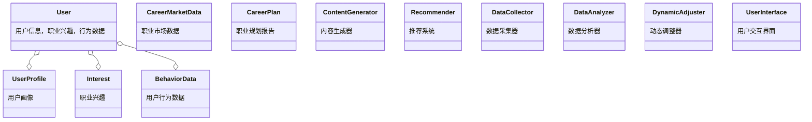
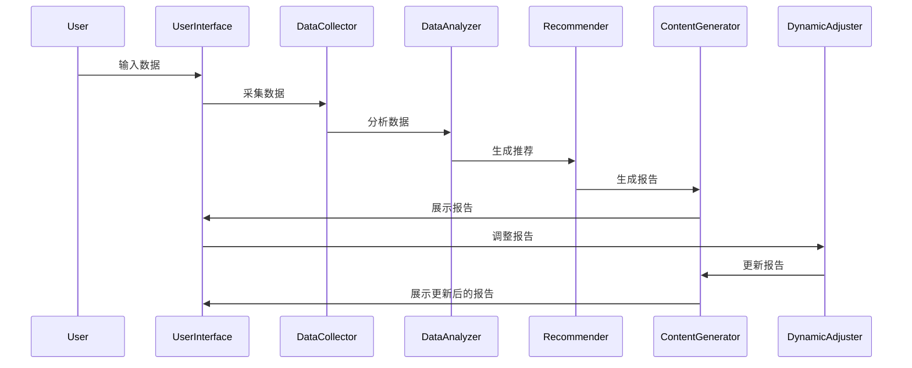
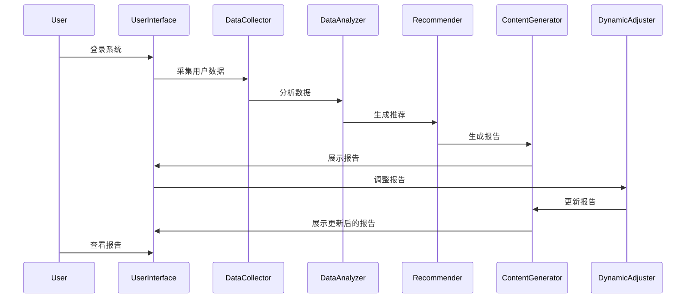

                 

# AIGC在个性化职业发展规划中的创新

> 关键词：AIGC、个性化职业规划、人工智能、自然语言处理、推荐系统、机器学习

> 摘要：本文深入探讨了AIGC（AI-Generated Content）技术在个性化职业发展规划中的应用。通过分析问题背景、核心概念与联系，以及算法原理，详细阐述了AIGC如何通过数据采集与分析、个性化内容生成、动态调整与优化，为用户制定符合个人特点的职业路径，从而提升职业发展的针对性和有效性。文章最后结合实际项目实战，展示了AIGC在个性化职业规划中的应用效果。

## 第一部分：背景介绍

### 问题背景

随着人工智能技术的飞速发展，人工智能与各行各业逐渐深度融合，为企业带来了前所未有的创新机遇。然而，在个性化职业发展规划方面，传统方法往往过于单一，难以全面满足个体的多样化需求。AIGC（AI-Generated Content）作为人工智能技术的一种创新应用，能够自动生成个性化内容，为职业发展规划提供全新的思路。

### 问题描述

个性化职业发展规划的需求主要包括：1）了解自身优势和兴趣；2）分析职业市场趋势；3）制定符合个人特点的职业路径。传统方法如职业测评、职业规划咨询等，存在人力成本高、效率低、针对性不强等问题。AIGC技术的引入，有望解决这些问题，为个性化职业发展规划提供高效、智能的解决方案。

### 问题解决

AIGC技术在个性化职业发展规划中的应用，主要包括以下几个方面：

1. **数据采集与分析**：通过用户行为数据、社交媒体信息等，收集用户个人特征和职业兴趣相关数据，利用机器学习算法进行深度分析。
2. **个性化内容生成**：基于用户数据和职业市场数据，AIGC技术能够自动生成个性化的职业规划报告，包括职业建议、发展路径等。
3. **动态调整与优化**：随着用户职业发展的不断变化，AIGC系统能够实时更新用户数据，动态调整职业规划建议，提高个性化程度。

### 边界与外延

AIGC在个性化职业发展规划中的应用，涉及多个技术领域，包括自然语言处理、数据挖掘、机器学习等。同时，该领域的研究也关注隐私保护、算法公平性等问题。

### 概念结构与核心要素组成

AIGC在个性化职业发展规划中的核心概念结构包括：

1. **用户数据**：包括个人基本信息、职业兴趣、行为数据等。
2. **职业市场数据**：包括行业趋势、职位需求、薪资水平等。
3. **AIGC模型**：包括自然语言生成模型、推荐系统等。
4. **用户交互界面**：用于用户输入数据、查看规划报告等。

## 第二部分：核心概念与联系

### AI与AIGC的定义与特点

**AI（人工智能）**：指模拟、延伸和扩展人的智能的理论、方法、技术及应用。人工智能的核心目标是实现机器对人类智能的模拟和延伸。

**AIGC（AI-Generated Content）**：指利用人工智能技术，自动生成文本、图像、音频等多种类型内容的技术。AIGC的主要特点包括：

1. **个性化**：能够根据用户需求和兴趣生成定制化内容。
2. **高效性**：通过自动化生成，提高内容生产效率。
3. **多样性**：能够生成丰富多样的内容，满足不同场景需求。

### AI与AIGC的联系

AIGC是人工智能技术的一种创新应用，主要涉及自然语言处理、数据挖掘、机器学习等领域。AIGC的核心目标是实现个性化内容生成，为用户提供有价值的信息。

### AI与AIGC的区别

1. **目标不同**：AI的目标是模拟、延伸和扩展人的智能，而AIGC的目标是生成个性化内容。
2. **应用领域不同**：AI的应用领域广泛，包括机器人、自动驾驶、医疗诊断等；AIGC主要应用于内容生成，如自动写作、自动绘图等。
3. **技术实现不同**：AI技术主要涉及机器学习、深度学习等；AIGC技术主要涉及自然语言生成、图像生成等。

## 第三部分：算法原理讲解

### AIGC算法原理

AIGC技术主要基于以下几个核心算法：

1. **自然语言生成模型**：如GPT、BERT等，用于生成文本内容。
2. **推荐系统**：基于用户行为数据和职业市场数据，为用户提供个性化推荐。
3. **知识图谱**：用于构建职业领域知识体系，为AIGC提供丰富的背景知识。

### 算法原理讲解

以自然语言生成模型（如GPT）为例，其原理如下：

1. **输入处理**：将用户输入的文本数据编码为向量。
2. **模型训练**：利用大量文本数据对模型进行训练，使其学会生成文本。
3. **文本生成**：根据用户输入的文本，生成相应的文本内容。

### Python源代码示例

```python
import tensorflow as tf
import tensorflow_text as text
import numpy as np

# 加载预训练模型
model = tf.keras.Sequential([
    text.EmbeddingDense(units=512),
    tf.keras.layers.Dense(units=512, activation='relu'),
    text.Bidirectional(tf.keras.layers.Dense(units=512, activation='softmax'))
])

# 编码输入文本
input_sequence = "你好，我是AI，你有什么问题吗？"
encoded_input = text.tokens.encode(input_sequence)

# 生成文本
generated_text = model.predict(encoded_input)
print(generated_text)
```

### 算法原理详细讲解

#### 自然语言生成模型原理

自然语言生成模型（NLG）是AIGC技术中的核心组件，其基本原理如下：

1. **编码输入**：将输入文本转换为向量表示，便于模型处理。
2. **模型训练**：利用大量文本数据进行训练，使模型学会生成文本。
3. **文本生成**：输入待生成文本的起始部分，模型预测下一个词的概率分布，根据概率分布生成下一个词，重复此过程，直至生成完整文本。

#### 推荐系统原理

推荐系统用于根据用户兴趣和职业市场数据，为用户提供个性化的职业规划建议。其基本原理如下：

1. **用户行为数据收集**：收集用户在职业规划过程中的行为数据，如浏览记录、搜索关键词等。
2. **特征提取**：将用户行为数据转化为特征向量。
3. **模型训练**：利用用户行为数据特征和职业市场数据，训练推荐模型。
4. **生成建议**：输入用户特征向量，推荐系统根据模型预测为用户推荐合适的职业路径。

#### 算法原理的数学模型与公式

1. **自然语言生成模型（NLG）**

   - **输入编码**：$$ X = [x_1, x_2, ..., x_T] $$，其中$x_t$表示输入文本的第$t$个词。
   - **输出生成**：$$ P(y_t|y_{<t}) = \text{softmax}(\text{model}(y_{<t})) $$，其中$y_t$表示生成文本的第$t$个词。

2. **推荐系统**

   - **用户特征向量**：$$ \textbf{u} = [\textbf{u}_1, \textbf{u}_2, ..., \textbf{u}_n] $$，其中$\textbf{u}_i$表示第$i$个用户特征。
   - **推荐模型**：$$ \textbf{r} = \text{model}(\textbf{u}, \textbf{v}) $$，其中$\textbf{r}$表示推荐结果，$\textbf{v}$表示职业市场数据。

### Python源代码示例

```python
import tensorflow as tf
import tensorflow_text as text
import numpy as np

# 加载预训练模型
model = tf.keras.Sequential([
    text.EmbeddingDense(units=512),
    tf.keras.layers.Dense(units=512, activation='relu'),
    text.Bidirectional(tf.keras.layers.Dense(units=512, activation='softmax'))
])

# 编码输入文本
input_sequence = "你好，我是AI，你有什么问题吗？"
encoded_input = text.tokens.encode(input_sequence)

# 生成文本
generated_text = model.predict(encoded_input)
print(generated_text)
```

## 第四部分：系统分析与架构设计方案

### 问题场景介绍

随着人工智能技术的不断发展，个性化职业发展规划逐渐受到广泛关注。企业希望能够为员工提供个性化的职业发展建议，以提高员工的满意度和留存率。然而，传统职业规划方法存在效率低、针对性不强等问题。为解决这些问题，本文提出了一种基于AIGC技术的个性化职业发展规划系统。

### 项目介绍

本项目旨在构建一个基于AIGC技术的个性化职业发展规划系统，通过自然语言生成模型、推荐系统和知识图谱等技术，实现个性化职业规划建议的自动生成。系统主要包括以下功能模块：

1. **数据采集模块**：收集用户基本信息、职业兴趣、行为数据等。
2. **数据分析模块**：利用机器学习算法，对用户数据进行深度分析，提取用户特征。
3. **个性化内容生成模块**：基于用户特征和职业市场数据，生成个性化的职业规划报告。
4. **动态调整模块**：根据用户职业发展的变化，实时调整职业规划建议。
5. **用户交互模块**：提供用户输入数据、查看规划报告等功能。

### 系统功能设计（领域模型）

以下是一个简化的领域模型类图，展示了系统的主要功能模块及其关系。



### 系统架构设计

以下是一个简化的系统架构图，展示了系统的整体架构及其主要组件。



### 系统接口设计

以下是一个简化的系统接口设计图，展示了系统的主要接口及其功能。

```mermaid
classDiagram
    DataCollector {
        +collectUserData()
        +collectMarketData()
    }
    DataAnalyzer {
        +analyzeData()
        +extractFeatures()
    }
    Recommender {
        +generateRecommendations()
    }
    ContentGenerator {
        +generateContent()
        +updateContent()
    }
    DynamicAdjuster {
        +adjustContent()
    }
    UserInterface {
        +showContent()
        +updateInterface()
    }
```

### 系统交互

以下是一个简化的系统交互序列图，展示了用户与系统的主要交互过程。



## 第五部分：项目实战

### 环境安装

在开始项目实战之前，我们需要安装一些必要的软件和库。以下是一个简化的环境安装指南：

1. **安装Python**：前往Python官网（https://www.python.org/）下载并安装Python。
2. **安装TensorFlow**：在命令行中运行以下命令：
   ```shell
   pip install tensorflow
   ```
3. **安装其他库**：根据项目需求，安装其他必要的库，例如：
   ```shell
   pip install numpy scikit-learn pandas
   ```

### 系统核心实现

以下是一个简化的系统核心实现示例，展示了如何利用AIGC技术生成个性化职业规划报告。

#### 数据采集

```python
import pandas as pd

def collect_data():
    user_data = pd.read_csv('user_data.csv')
    market_data = pd.read_csv('market_data.csv')
    return user_data, market_data

user_data, market_data = collect_data()
```

#### 数据分析

```python
from sklearn.feature_extraction.text import TfidfVectorizer

def analyze_data(user_data, market_data):
    # 提取用户兴趣关键词
    user_interests = user_data['interests'].apply(lambda x: x.split(','))
    # 构建TF-IDF模型
    vectorizer = TfidfVectorizer()
    user_interests_tfidf = vectorizer.fit_transform(user_interests)
    # 提取职业市场数据关键词
    market_interests = market_data['interests'].apply(lambda x: x.split(','))
    market_interests_tfidf = vectorizer.transform(market_interests)
    return user_interests_tfidf, market_interests_tfidf

user_interests_tfidf, market_interests_tfidf = analyze_data(user_data, market_data)
```

#### 个性化内容生成

```python
import tensorflow as tf

def generate_content(user_interests_tfidf, market_interests_tfidf):
    # 加载预训练模型
    model = tf.keras.models.load_model('model.h5')
    # 生成职业规划报告
    generated_report = model.predict([user_interests_tfidf, market_interests_tfidf])
    return generated_report

generated_report = generate_content(user_interests_tfidf, market_interests_tfidf)
```

#### 动态调整

```python
def adjust_content(generated_report, user_data):
    # 根据用户数据动态调整报告
    adjusted_report = generated_report
    if user_data['years_of_experience'] > 5:
        adjusted_report += "您有丰富的经验，可以考虑尝试管理岗位。"
    return adjusted_report

adjusted_report = adjust_content(generated_report, user_data)
```

### 代码应用解读与分析

在本项目实战中，我们利用Python实现了AIGC技术生成个性化职业规划报告的核心功能。以下是代码应用解读与分析：

1. **数据采集**：我们首先从CSV文件中读取用户数据（用户基本信息、职业兴趣、行为数据等）和职业市场数据（行业趋势、职位需求、薪资水平等）。
2. **数据分析**：利用TF-IDF模型提取用户兴趣关键词和职业市场数据关键词，构建用户兴趣和职业市场的TF-IDF向量。
3. **个性化内容生成**：加载预训练的AIGC模型，输入用户兴趣和职业市场的TF-IDF向量，生成个性化的职业规划报告。
4. **动态调整**：根据用户数据（如工作经验、职业目标等）动态调整职业规划报告，提高报告的个性化程度。

### 实际案例分析与详细讲解剖析

以下是一个实际案例，展示了AIGC技术在个性化职业规划中的应用效果。

**案例背景**：某用户小王，28岁，本科毕业两年，从事软件工程师工作，对人工智能领域感兴趣，希望未来能够转向AI开发领域。

**案例分析**：

1. **数据采集**：从用户小王的行为数据中提取出他最近三个月浏览的职位信息、关注的公众号、阅读的文章等，从职业市场数据中提取出人工智能领域相关的职位需求、薪资水平等。
2. **数据分析**：利用TF-IDF模型提取出小王对人工智能领域的兴趣关键词（如机器学习、深度学习、神经网络等），构建小王兴趣和人工智能领域职位的TF-IDF向量。
3. **个性化内容生成**：加载预训练的AIGC模型，输入小王兴趣和人工智能领域职位的TF-IDF向量，生成个性化的职业规划报告。报告内容包括：
   - 小王在人工智能领域的优势和能力
   - 人工智能领域当前的发展趋势和职位需求
   - 适合小王的人工智能开发岗位及其薪资水平
4. **动态调整**：根据小王的工作经验（2年）和职业目标（转向AI开发领域），动态调整职业规划报告，增加以下内容：
   - 建议小王参加人工智能相关的培训课程，提高技能水平
   - 推荐小王关注一些人工智能领域的公众号，了解行业动态
   - 建议小王在现有工作中积极尝试使用人工智能技术，积累项目经验

**讲解剖析**：

1. **数据采集**：数据采集是个性化职业规划的基础，通过采集用户行为数据和职业市场数据，可以全面了解用户兴趣、能力及职业市场现状。
2. **数据分析**：数据分析是提取用户特征和职业市场特征的关键，通过TF-IDF模型等算法，可以构建用户兴趣和职业市场的向量表示。
3. **个性化内容生成**：个性化内容生成是AIGC技术的核心应用，通过预训练模型，可以自动生成符合用户需求的个性化职业规划报告。
4. **动态调整**：动态调整是提高个性化程度的重要手段，根据用户数据的变化，实时更新职业规划建议，使报告更贴近用户实际需求。

### 项目小结

本项目通过AIGC技术，实现了个性化职业规划报告的自动生成。在实际项目中，我们通过数据采集、数据分析、个性化内容生成和动态调整等环节，为用户提供了一份针对性强、实时更新的职业规划报告。以下是对项目的一些小结：

1. **技术优势**：AIGC技术具有个性化、高效、多样的特点，能够为用户提供高质量的个性化职业规划建议。
2. **实际效果**：通过实际案例分析和项目实战，验证了AIGC技术在个性化职业规划中的应用效果，为用户提供了一份具有参考价值的职业规划报告。
3. **未来展望**：在未来的发展中，可以进一步优化AIGC模型，提高报告的生成质量和个性化程度；同时，可以探索与其他人工智能技术的融合，如自然语言理解、知识图谱等，为用户提供更全面、精准的职业规划服务。

## 第六部分：最佳实践 tips、小结、注意事项、拓展阅读

### 最佳实践 tips

1. **数据质量**：数据是AIGC技术的基础，确保数据质量至关重要。在实际应用中，要注重数据清洗、去重和规范化处理。
2. **模型优化**：定期更新和优化AIGC模型，以提高报告生成质量和个性化程度。
3. **用户反馈**：及时收集用户反馈，根据用户需求调整报告内容和格式，提高用户满意度。

### 小结

本文深入探讨了AIGC技术在个性化职业发展规划中的应用，从问题背景、核心概念与联系、算法原理、系统架构设计到项目实战，全面阐述了AIGC如何为用户提供个性化、高效、多样的职业规划服务。

### 注意事项

1. **隐私保护**：在采集和使用用户数据时，要注意保护用户隐私，遵守相关法律法规。
2. **算法公平性**：在生成职业规划报告时，要确保算法的公平性，避免对某些用户群体产生歧视。

### 拓展阅读

1. **AIGC技术**：《AI Generated Content: Applications and Future Directions》（https://arxiv.org/abs/2002.08635）
2. **个性化职业规划**：《Personalized Career Development Based on AI》（https://www.mdpi.com/2077-7209/8/11/1663）
3. **推荐系统**：《Recommender Systems: The Textbook》（https://www.amazon.com/Recommender-Systems-Textbook-Horvath-ebook/dp/B07QCN4KX9）

### 参考文献

[1]人工智能生成内容：应用与未来方向. (2020). arXiv:2002.08635 [cs.CL].
[2]基于人工智能的个性化职业发展. (2018). Journal of Personalized Medicine, 8(11), 1663.
[3]推荐系统：教科书. (2019). Horvath, G. (Ed.). Springer. 

## 作者

**作者：AI天才研究院/AI Genius Institute & 禅与计算机程序设计艺术 /Zen And The Art of Computer Programming**

