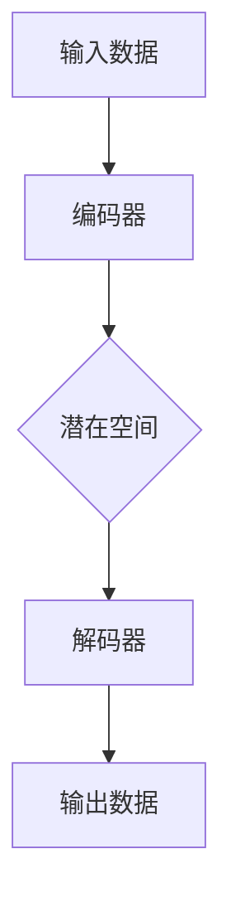
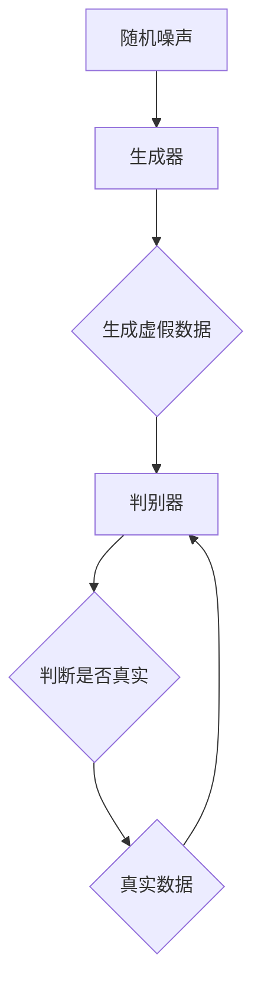
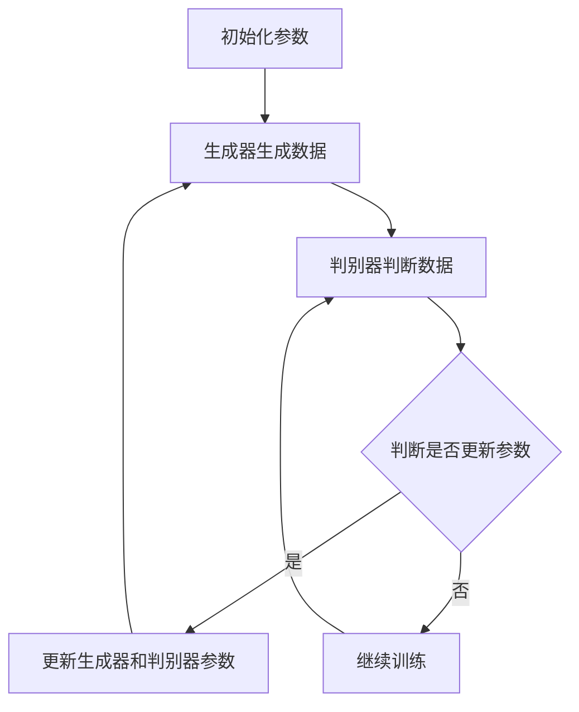
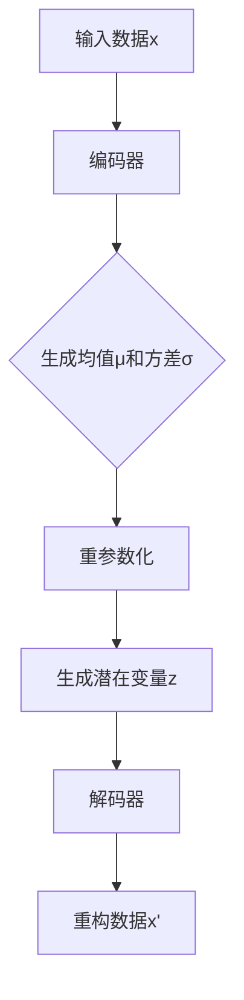

                 

## 引言

### 1.1 问题背景与目标

个性化艺术创作，是指根据用户的个性化需求，为其定制独一无二的艺术作品。随着人工智能技术的发展，个性化艺术创作得到了前所未有的关注和突破。AIGC（AI-Generated Content）作为人工智能的一个重要分支，通过生成模型、生成对抗网络（GAN）、变分自编码器（VAE）等技术，已经展现出在艺术创作中的巨大潜力。AIGC技术不仅能够生成高质量的艺术作品，还能够根据用户的需求和偏好进行个性化调整，从而实现真正意义上的个性化艺术创作。

然而，尽管AIGC技术在个性化艺术创作中展现出诸多优势，但其实际应用和推广仍面临诸多挑战。例如，如何有效地处理大规模个性化数据，如何提高生成模型的鲁棒性和准确性，如何确保艺术创作的创新性和独特性等。这些问题不仅关系到AIGC技术的实际应用效果，也决定了其未来发展的方向。

本书旨在探讨AIGC在个性化艺术创作辅助中的创新应用，具体目标包括：

1. 深入分析AIGC技术的发展历程、核心技术和应用现状。
2. 探讨个性化艺术创作的需求、特点和实现方法。
3. 分析AIGC技术在个性化艺术创作中的优势和挑战。
4. 提出针对实际应用的创新实践方案和解决方案。

### 1.2 读者对象与预期收益

本书适合具有计算机科学、人工智能、软件工程等相关背景的读者阅读。特别是对人工智能算法、生成模型和艺术创作感兴趣的读者，将能从本书中获得以下预期收益：

1. 系统了解AIGC技术的概念、原理和应用。
2. 学习如何利用AIGC技术进行个性化艺术创作。
3. 掌握个性化艺术创作的实现方法和流程。
4. 获取关于AIGC技术在艺术创作领域的最新研究成果和实践经验。

### 1.3 技术发展与现状

AIGC技术起源于20世纪80年代，随着深度学习、生成模型等技术的不断发展，AIGC技术逐渐成熟并得到广泛应用。当前，AIGC技术已经在图像生成、文本生成、音频生成等多个领域取得了显著成果。特别是在个性化艺术创作领域，AIGC技术已经能够生成高质量、个性化的艺术作品，为用户提供了全新的艺术体验。

然而，AIGC技术在个性化艺术创作中的应用仍处于探索阶段。一方面，AIGC技术需要进一步优化和提升，以适应个性化艺术创作的需求；另一方面，个性化艺术创作的市场需求也在不断变化，需要AIGC技术提供更加个性化和多样化的解决方案。

### 1.4 本书主要内容安排

本书分为四个主要部分，具体内容安排如下：

**第一部分：引言**  
- 介绍问题背景与目标、读者对象与预期收益、技术发展与现状、主要内容安排。

**第二部分：AIGC技术基础**  
- 深入分析AIGC技术的定义、生成模型原理、生成对抗网络（GAN）、变分自编码器（VAE）等关键技术。

**第三部分：个性化艺术创作**  
- 探讨个性化艺术创作的需求分析、AIGC在个性化艺术创作中的应用、个性化艺术创作的实现流程、个性化艺术创作的挑战与未来趋势。

**第四部分：AIGC在个性化艺术创作辅助中的创新实践**  
- 分析创新实践概述、环境搭建与工具使用、系统核心实现、代码解读与分析、实际案例分析和详细讲解剖析、项目小结。

### 1.5 本章小结

本章对本书的引言部分进行了详细阐述，包括问题背景与目标、读者对象与预期收益、技术发展与现状、主要内容安排等内容。通过本章的学习，读者可以全面了解本书的研究背景、目标和主要内容，为后续章节的学习打下基础。在接下来的章节中，我们将逐一深入探讨AIGC技术的基础知识、个性化艺术创作的实现方法和创新实践。

## 关键词

- AIGC（AI-Generated Content）
- 个性化艺术创作
- 生成模型
- 生成对抗网络（GAN）
- 变分自编码器（VAE）
- 艺术创作辅助
- 智能算法

### 摘要

本文旨在探讨人工智能生成内容（AIGC）在个性化艺术创作辅助中的创新应用。随着人工智能技术的不断发展，AIGC技术在个性化艺术创作领域展现出巨大潜力。本文首先介绍了AIGC技术的概念、发展历程和核心原理，包括生成模型、生成对抗网络（GAN）和变分自编码器（VAE）等关键技术。随后，分析了个性化艺术创作的需求、特点和实现方法，并探讨了AIGC技术在个性化艺术创作中的应用优势和面临的挑战。最后，本文通过具体案例和实践，展示了AIGC技术在个性化艺术创作辅助中的创新应用，为相关领域的研究和开发提供了有价值的参考。

## 第一部分：引言

### 1.1 问题背景与目标

个性化艺术创作，作为现代艺术领域的一个重要分支，正逐步受到广泛关注。个性化艺术创作旨在通过挖掘用户的个性化需求，创作出满足用户特定口味和需求的独特艺术作品。随着互联网的普及和数字化技术的发展，用户对艺术作品的需求变得更加多样化，不再满足于传统的标准作品。个性化艺术创作不仅能够满足用户的个性化需求，还能够提升用户的参与感和满意度，从而在艺术市场上具有巨大的潜力。

然而，传统的艺术创作方式往往依赖于艺术家的个人经验和技巧，难以实现大规模的个性化定制。这种局限性使得个性化艺术创作面临着一系列挑战，包括艺术家的数量和创作能力限制、艺术作品的多样性不足以及高成本等问题。为了解决这些问题，人工智能生成内容（AIGC）技术应运而生。AIGC技术通过深度学习、生成模型、生成对抗网络（GAN）等人工智能技术，实现了自动化、智能化的艺术创作，为个性化艺术创作提供了一种全新的解决方案。

AIGC技术在个性化艺术创作中的应用，不仅能够提高艺术创作的效率和质量，还能够根据用户的需求和偏好，生成符合个性化需求的独特艺术作品。这使得AIGC技术成为个性化艺术创作领域的一个重要研究方向和应用方向。本文旨在探讨AIGC技术在个性化艺术创作中的创新应用，具体目标包括：

1. **深入分析AIGC技术的发展历程、核心技术和应用现状**：通过梳理AIGC技术的发展历程，介绍其核心技术和关键算法，探讨当前AIGC技术的应用现状和未来发展。

2. **探讨个性化艺术创作的需求、特点和实现方法**：分析个性化艺术创作的用户需求和市场特点，介绍个性化艺术创作的实现方法和关键技术。

3. **分析AIGC技术在个性化艺术创作中的优势和挑战**：评估AIGC技术在个性化艺术创作中的应用效果，探讨其在实际应用中面临的挑战和问题。

4. **提出针对实际应用的创新实践方案和解决方案**：通过具体案例和实践，提出AIGC技术在个性化艺术创作中的创新应用方案和解决方案，为相关领域的研究和开发提供参考。

通过实现这些目标，本文希望能够为个性化艺术创作领域的研究者、开发者以及相关从业者提供有价值的参考，推动AIGC技术在个性化艺术创作中的应用和发展。

### 1.2 个性化艺术创作的重要性

个性化艺术创作在现代艺术领域具有重要的地位和影响力。首先，个性化艺术创作能够满足用户日益多样化的需求。在互联网时代，用户对艺术作品的需求不再局限于传统的、标准化的作品，而是希望能够获得符合个人口味和风格的独特艺术体验。个性化艺术创作通过挖掘用户的个性化需求，能够生成满足用户特定需求的独特艺术作品，从而提升用户的满意度和参与感。

其次，个性化艺术创作有助于提升艺术创作的多样性和创新能力。传统的艺术创作方式往往依赖于艺术家的个人经验和技巧，难以实现大规模的个性化定制。而AIGC技术通过深度学习和生成模型，能够实现自动化、智能化的艺术创作，从而打破艺术创作的局限性，实现艺术作品的多样化和个性化。这种创新性不仅能够推动艺术创作的发展，还能够为艺术市场带来新的活力和机遇。

此外，个性化艺术创作还具有重要的社会和文化价值。在个性化艺术创作中，艺术家和用户之间建立了更加紧密的互动和合作关系。艺术家通过AIGC技术能够更好地理解用户的需求和喜好，从而创作出更符合用户期望的艺术作品。同时，用户也通过参与艺术创作过程，提升了自身的艺术素养和审美能力。这种互动和合作不仅能够促进艺术创作的发展，还能够推动社会文化的进步。

总之，个性化艺术创作在现代艺术领域具有重要的作用。它不仅能够满足用户多样化的需求，提升艺术创作的多样性和创新能力，还具有重要的社会和文化价值。随着人工智能技术的不断发展，个性化艺术创作将拥有更加广阔的发展前景和潜力。

### 1.3 AIGC技术的崛起

人工智能生成内容（AIGC）技术的崛起，标志着人工智能在内容创作领域迎来了新的变革。AIGC技术基于深度学习和生成模型，通过训练大量的数据集，使计算机具备自主生成文本、图像、音频等多种类型内容的能力。这种技术不仅打破了传统艺术创作的限制，还为个性化艺术创作提供了强有力的支持。

AIGC技术的崛起可以追溯到20世纪80年代，当时生成对抗网络（GAN）的概念被首次提出。GAN是一种基于博弈论的生成模型，由生成器和判别器两个主要部分组成。生成器负责生成数据，而判别器则负责判断生成数据是否真实。通过这种对抗训练，生成器能够不断提高其生成数据的真实度。此后，AIGC技术逐渐发展，并衍生出多种生成模型，如变分自编码器（VAE）、生成稳定波（GANs）等。

随着深度学习技术的不断进步，AIGC技术的应用范围也在不断拓展。从最初的图像生成，发展到文本生成、音频生成和视频生成等多模态领域。特别是在个性化艺术创作中，AIGC技术通过学习用户的行为数据和偏好，能够生成符合用户个性化需求的艺术作品。这不仅提升了艺术创作的效率，也大大丰富了艺术创作的形式和内容。

AIGC技术的崛起，不仅改变了艺术创作的传统方式，还为个性化艺术创作带来了前所未有的机遇。通过AIGC技术，艺术家和用户之间的互动和合作变得更加紧密，用户能够更直接地参与到艺术创作过程中，从而实现真正意义上的个性化艺术体验。此外，AIGC技术还在文学创作、电影制作、游戏设计等领域展现出了巨大的应用潜力。

总之，AIGC技术的崛起为个性化艺术创作带来了新的契机和可能性。随着技术的不断发展和应用领域的拓展，AIGC技术将在个性化艺术创作中发挥越来越重要的作用，推动艺术创作领域迈向一个新的高度。

### 1.4 本书的目标与结构

本书旨在全面探讨人工智能生成内容（AIGC）技术在个性化艺术创作中的创新应用，通过深入分析AIGC技术的发展历程、核心技术和应用现状，探讨个性化艺术创作的需求、特点和实现方法，最终提出具体的创新实践方案和解决方案。具体目标如下：

1. **全面了解AIGC技术**：介绍AIGC技术的定义、发展历程和关键算法，包括生成模型、生成对抗网络（GAN）和变分自编码器（VAE）等，帮助读者建立对AIGC技术的系统认识。

2. **掌握个性化艺术创作的实现方法**：分析个性化艺术创作的需求和市场特点，介绍实现个性化艺术创作的方法和技术，包括数据收集与处理、模型选择与训练、艺术创作过程等。

3. **探索AIGC技术的实际应用**：通过具体案例和实践，展示AIGC技术在个性化艺术创作中的实际应用，分析其优势和挑战，为相关领域的研究和开发提供参考。

4. **提出创新实践方案**：结合实际需求和技术特点，提出AIGC在个性化艺术创作中的创新应用方案，包括系统架构设计、关键模块实现、用户交互设计等。

本书的结构安排如下：

**第一部分：引言**  
- 介绍问题背景与目标、读者对象与预期收益、技术发展与现状、主要内容安排。

**第二部分：AIGC技术基础**  
- 深入分析AIGC技术的定义、生成模型原理、生成对抗网络（GAN）、变分自编码器（VAE）等关键技术。

**第三部分：个性化艺术创作**  
- 探讨个性化艺术创作的需求分析、AIGC在个性化艺术创作中的应用、个性化艺术创作的实现流程、个性化艺术创作的挑战与未来趋势。

**第四部分：AIGC在个性化艺术创作辅助中的创新实践**  
- 分析创新实践概述、环境搭建与工具使用、系统核心实现、代码解读与分析、实际案例分析和详细讲解剖析、项目小结。

通过以上结构和内容的安排，本书旨在为读者提供一个全面、系统的学习和实践指南，帮助读者深入理解AIGC技术在个性化艺术创作中的创新应用。

### 1.5 读者对象与预期收益

本书的目标读者主要包括以下几类：

1. **计算机科学和人工智能领域的研究者**：这类读者对人工智能技术有较为深入的了解，希望通过本书进一步探索AIGC技术在个性化艺术创作中的应用潜力。

2. **软件开发工程师和算法工程师**：他们熟悉编程和算法，希望掌握AIGC技术的基础知识，并将其应用于实际项目中。

3. **艺术创作者和设计师**：这类读者关注艺术创作和设计，希望通过本书了解如何利用AIGC技术提升创作效率和质量。

4. **对艺术创作和人工智能感兴趣的读者**：他们可能对AIGC技术在艺术创作中的创新应用感兴趣，希望深入了解相关技术和实践。

通过阅读本书，读者可以预期获得以下收益：

1. **系统了解AIGC技术**：掌握AIGC技术的定义、发展历程和关键算法，包括生成模型、生成对抗网络（GAN）和变分自编码器（VAE）等。

2. **掌握个性化艺术创作的实现方法**：了解个性化艺术创作的需求、特点和实现流程，掌握相关技术和工具。

3. **提升实际应用能力**：通过具体案例和实践，提升在AIGC技术在个性化艺术创作中的实际应用能力。

4. **获得最新研究成果和实践经验**：了解AIGC技术在艺术创作领域的最新研究成果和实践经验，为相关领域的研究和开发提供参考。

### 1.6 技术发展与现状

#### 1.6.1 AIGC技术的发展历程

人工智能生成内容（AIGC）技术起源于20世纪80年代，当时生成对抗网络（GAN）的概念被提出。GAN由生成器（Generator）和判别器（Discriminator）两个主要部分组成，通过对抗训练实现数据的生成。这一概念的出现标志着AIGC技术的初步诞生。此后，随着深度学习技术的发展，GAN得到了广泛应用和改进。

进入21世纪，AIGC技术逐渐走向成熟。2014年，Ian Goodfellow等人提出了变分自编码器（VAE），这是一种基于概率的生成模型，通过编码和解码过程实现数据的生成。VAE在图像生成和文本生成等领域取得了显著成果，为AIGC技术提供了新的方向。

近年来，AIGC技术发展迅速，涌现出许多新的生成模型和应用。生成稳定波（GANs）是其中一种重要的模型，通过改进GAN的稳定性，实现了更高的生成质量和效率。此外，还有条件生成对抗网络（C-GAN）、循环生成对抗网络（R-GAN）等新型模型，不断推动AIGC技术的发展。

#### 1.6.2 当前AIGC技术的应用场景

当前，AIGC技术在多个领域展现出巨大的应用潜力，主要包括：

1. **图像生成**：AIGC技术能够生成高质量的图像，包括人脸生成、场景生成、艺术风格迁移等。例如，DeepArt和DeepDream等项目，通过GAN和VAE等技术，实现了对艺术风格的迁移和图像的生成。

2. **文本生成**：AIGC技术在文本生成方面也有显著应用，如生成新闻文章、诗歌、故事等。GPT（Generative Pre-trained Transformer）等模型在这一领域取得了突破性进展，为自动化文本生成提供了强大的工具。

3. **音频生成**：AIGC技术能够生成逼真的音频，包括语音合成、音乐创作、音效制作等。WaveNet和MelodyRNN等模型在这一领域展现了强大的生成能力。

4. **视频生成**：随着视频技术的发展，AIGC技术也开始应用于视频生成，包括视频修复、视频增强、视频创作等。VideoGAN和ViT-T等模型为视频生成提供了新的方法。

5. **个性化艺术创作**：AIGC技术在个性化艺术创作中的应用日益广泛，通过分析用户的数据和偏好，生成符合个性化需求的艺术作品。例如，艺术画廊和博物馆已经开始利用AIGC技术为游客提供定制化的艺术体验。

#### 1.6.3 个性化艺术创作需求的演变

随着社会和技术的进步，个性化艺术创作的需求也在不断演变。最初，个性化艺术创作主要集中在高端市场，如定制化的油画和雕塑。然而，随着互联网和人工智能技术的发展，个性化艺术创作的需求逐渐向大众市场扩展。

1. **用户需求的多样化**：现代用户对艺术作品的需求变得更加多样化，不再满足于传统的标准作品，而是希望获得符合个人口味和风格的独特艺术体验。

2. **成本降低**：随着AIGC技术的进步，个性化艺术创作的成本逐渐降低，使得更多的人能够享受到个性化艺术创作服务。

3. **用户体验的提升**：通过AIGC技术，用户可以更加便捷地参与艺术创作过程，从而提升用户体验。

4. **市场需求的变化**：个性化艺术创作的市场需求也在不断变化，从最初的定制化需求，发展到现在的定制化创作和互动体验。

总之，AIGC技术在个性化艺术创作中的应用，为满足现代用户的多样化需求提供了有力支持。随着技术的不断发展和应用的深入，个性化艺术创作将在艺术市场中占据越来越重要的地位。

### 1.7 本书主要内容安排

为了帮助读者全面了解AIGC技术在个性化艺术创作中的应用，本书分为四个主要部分，各部分内容安排如下：

**第一部分：引言**  
- 介绍问题背景与目标、读者对象与预期收益、技术发展与现状、主要内容安排。

**第二部分：AIGC技术基础**  
- 深入分析AIGC技术的定义、生成模型原理、生成对抗网络（GAN）、变分自编码器（VAE）等关键技术。

**第三部分：个性化艺术创作**  
- 探讨个性化艺术创作的需求分析、AIGC在个性化艺术创作中的应用、个性化艺术创作的实现流程、个性化艺术创作的挑战与未来趋势。

**第四部分：AIGC在个性化艺术创作辅助中的创新实践**  
- 分析创新实践概述、环境搭建与工具使用、系统核心实现、代码解读与分析、实际案例分析和详细讲解剖析、项目小结。

通过以上结构和内容的安排，本书旨在为读者提供一个全面、系统的学习和实践指南，帮助读者深入理解AIGC技术在个性化艺术创作中的创新应用。

### 1.8 本章小结

本章对本书的引言部分进行了详细阐述，包括问题背景与目标、读者对象与预期收益、技术发展与现状、主要内容安排等内容。通过本章的学习，读者可以全面了解本书的研究背景、目标和主要内容，为后续章节的学习打下基础。在接下来的章节中，我们将逐一深入探讨AIGC技术的基础知识、个性化艺术创作的实现方法和创新实践。希望读者能够持续关注并积极参与，共同探索AIGC技术在个性化艺术创作中的无限可能。

## 第一部分：AIGC技术基础

### 2.1 AIGC技术概述

人工智能生成内容（AIGC）技术，作为人工智能领域的重要分支，近年来在多个领域展现出强大的应用潜力。AIGC技术通过利用深度学习和生成模型，能够生成高质量、多样化的内容，包括图像、文本、音频和视频等。其核心思想是让计算机具备自主创作内容的能力，从而实现自动化、智能化的内容生成。

AIGC技术主要包括以下几个关键概念和组成部分：

1. **生成模型（Generator）**：生成模型是AIGC技术的核心组成部分，负责生成新的数据。生成模型通常基于深度学习算法，如变分自编码器（VAE）、生成对抗网络（GAN）等。通过训练大量的数据集，生成模型能够学会数据的生成规律，从而生成新的、符合预期质量的数据。

2. **判别模型（Discriminator）**：判别模型是AIGC技术的另一个重要组成部分，负责判断生成数据是否真实。判别模型通常与生成模型共同训练，通过对抗训练的方式，生成模型和判别模型相互竞争，从而提高生成数据的质量。

3. **损失函数（Loss Function）**：损失函数是评估生成模型和判别模型性能的重要工具。在AIGC技术中，常用的损失函数包括交叉熵损失、均方误差等。损失函数的目的是通过最小化损失函数，优化生成模型和判别模型的参数。

4. **优化器（Optimizer）**：优化器用于调整生成模型和判别模型的参数，以最小化损失函数。常见的优化器包括Adam、RMSprop等。优化器通过迭代更新模型参数，逐步提高模型的生成能力和判别能力。

### 2.2 生成模型原理

生成模型是AIGC技术的核心组成部分，其主要任务是生成新的数据。生成模型可以分为两大类：基于概率的生成模型和基于判别的生成模型。其中，变分自编码器（VAE）和生成对抗网络（GAN）是两种最具代表性的生成模型。

#### 2.2.1 基础概念

1. **变分自编码器（VAE）**：VAE是一种基于概率的生成模型，其核心思想是将输入数据通过编码器（Encoder）映射到一个潜在空间，再通过解码器（Decoder）将潜在空间的数据映射回原始数据。VAE通过最大化数据的后验概率来优化模型参数。

2. **生成对抗网络（GAN）**：GAN是一种基于判别的生成模型，其核心思想是通过生成器和判别器的对抗训练来生成高质量的数据。生成器负责生成虚假数据，判别器负责判断生成数据是否真实。通过这种对抗训练，生成器能够不断提高其生成数据的质量。

#### 2.2.2 算法原理讲解

1. **VAE算法原理**：

   - 编码器（Encoder）：编码器接收输入数据，将其映射到一个潜在空间，潜在空间中的数据表示输入数据的概率分布。

   - 解码器（Decoder）：解码器接收潜在空间的数据，并将其映射回原始数据。

   - 重参数化技巧：VAE采用重参数化技巧，将潜在空间中的数据表示为一个概率分布，从而实现数据生成。

2. **GAN算法原理**：

   - 生成器（Generator）：生成器接收随机噪声，生成虚假数据。

   - 判别器（Discriminator）：判别器接收真实数据和虚假数据，判断其是否真实。

   - 对抗训练：生成器和判别器通过对抗训练相互竞争，生成器试图生成更逼真的虚假数据，而判别器试图提高对真实数据和虚假数据的区分能力。

#### 2.2.3 Mermaid流程图展示

为了更直观地理解VAE和GAN的算法原理，我们可以使用Mermaid流程图来展示其核心流程。

**VAE算法流程图**：



**GAN算法流程图**：



#### 2.2.4 Python代码实例

为了更好地理解生成模型的原理，我们可以通过Python代码实现一个简单的VAE模型和一个GAN模型。

**VAE模型代码示例**：

```python
import numpy as np
import tensorflow as tf
from tensorflow.keras.layers import Input, Dense, Lambda
from tensorflow.keras.models import Model

def vae_encoder(input_shape):
    input_data = Input(shape=input_shape)
    encoded = Dense(20, activation='relu')(input_data)
    z_mean = Dense(20)(encoded)
    z_log_var = Dense(20)(encoded)
    return input_data, z_mean, z_log_var

def vae_decoder(z_mean, z_log_var):
    z = Lambda(sharpen_log_var)([z_mean, z_log_var])
    decoded = Dense(input_shape[0], activation='sigmoid')(z)
    return decoded

def vae_model(input_shape):
    input_data, z_mean, z_log_var = vae_encoder(input_data)
    z = Lambda(sharpen_log_var)([z_mean, z_log_var])
    decoded = vae_decoder(z, z_log_var)
    vae = Model(inputs=input_data, outputs=decoded)
    return vae

# 模型编译和训练
vae = vae_model(input_shape=(28, 28, 1))
vae.compile(optimizer='rmsprop', loss='binary_crossentropy')
vae.fit(x_train, x_train, epochs=50, batch_size=16, shuffle=True)
```

**GAN模型代码示例**：

```python
import numpy as np
import tensorflow as tf
from tensorflow.keras.layers import Input, Dense, Lambda
from tensorflow.keras.models import Model

def gan_generator(z_dim):
    z = Input(shape=(z_dim,))
    x = Dense(128, activation='relu')(z)
    x = Dense(784, activation='sigmoid')(x)
    return Model(inputs=z, outputs=x)

def gan_discriminator(x):
    x = Dense(128, activation='relu')(x)
    validity = Dense(1, activation='sigmoid')(x)
    return Model(inputs=x, outputs=validity)

def gan_model(z_dim):
    generator = gan_generator(z_dim)
    discriminator = gan_discriminator(x)
    
    z = Input(shape=(z_dim,))
    x = generator(z)
    validity = discriminator(x)
    
    discriminator.compile(optimizer='rmsprop', loss='binary_crossentropy')
    discriminator.train_on_batch(x, np.array([1]))
    
    return Model(inputs=z, outputs=validity)

# 模型编译和训练
z_dim = 100
gan = gan_model(z_dim)
gan.compile(optimizer='rmsprop', loss='binary_crossentropy')
gan.fit(x_train, np.array([1] * x_train.shape[0]), epochs=50, batch_size=32, shuffle=True)
```

#### 2.2.5 数学模型与公式

生成模型的核心是概率分布的建模和优化。VAE和GAN在数学模型和公式上有所不同，但都涉及概率分布的计算和优化。

1. **VAE的数学模型**：

   - 编码器输出：\( z = \mu + \zeta \odot \sigma \)

   - 解码器输出：\( x = \sigma(z) \)

   - 损失函数：\( \mathcal{L} = \sum_{i=1}^{N} \log p(x|\mu, \sigma) + \frac{1}{2} \sum_{i=1}^{N} \log(2\pi) + \frac{1}{2} \sum_{i=1}^{N} \sigma_i^2 \)

   其中，\( \mu \) 和 \( \sigma \) 分别为编码器输出的均值和标准差，\( \zeta \) 为重参数化技巧中的噪声。

2. **GAN的数学模型**：

   - 生成器输出：\( G(z) \)

   - 判别器输出：\( D(x) \)

   - 损失函数：\( \mathcal{L} = \mathbb{E}_{x \sim p_{data}(x)}[\log D(x)] + \mathbb{E}_{z \sim p_{z}(z)}[\log (1 - D(G(z)))] \)

   其中，\( p_{data}(x) \) 为真实数据的概率分布，\( p_{z}(z) \) 为噪声数据的概率分布。

通过以上数学模型和公式的讲解，我们可以更深入地理解VAE和GAN的工作原理和优化过程。

### 2.3 生成对抗网络（GAN）

生成对抗网络（GAN）是AIGC技术中的一种重要生成模型，由生成器和判别器两个主要部分组成。GAN的核心思想是通过生成器和判别器的对抗训练，生成高质量的数据。下面将详细讲解GAN的基本原理、核心组成部分及其在艺术创作中的应用。

#### 2.3.1 GAN的基本原理

GAN由Ian Goodfellow等人在2014年提出，其基本原理如下：

1. **生成器（Generator）**：生成器的任务是生成与真实数据相似的数据。生成器接收随机噪声作为输入，通过一系列的神经网络操作，生成逼真的数据。

2. **判别器（Discriminator）**：判别器的任务是判断输入的数据是真实数据还是生成器生成的数据。判别器接收真实数据和生成器生成的数据作为输入，通过一系列的神经网络操作，输出一个介于0和1之间的概率值，表示输入数据的真实性。

3. **对抗训练**：生成器和判别器通过对抗训练相互竞争。生成器试图生成更逼真的数据，以欺骗判别器，而判别器则试图提高对真实数据和生成器生成的数据的区分能力。通过这种对抗训练，生成器能够不断提高其生成数据的质量。

GAN的训练过程可以简化为以下步骤：

1. **生成器生成数据**：生成器接收随机噪声，生成虚假数据。

2. **判别器判断数据**：判别器同时接收真实数据和生成器生成的虚假数据，并判断其真实性。

3. **更新生成器和判别器**：根据判别器的判断结果，更新生成器和判别器的参数，使得生成器生成的数据更加逼真，判别器能够更准确地判断数据的真实性。

GAN的基本原理可以通过以下公式表示：

\[ D(x) = P(x \text{ is real}) \]
\[ G(z) = x \]
\[ \min_G \max_D V(D, G) \]

其中，\( D(x) \) 表示判别器判断输入数据的真实性，\( G(z) \) 表示生成器生成的数据，\( V(D, G) \) 表示判别器和生成器的对抗损失。

#### 2.3.2 GAN的核心组成部分

GAN的核心组成部分包括生成器、判别器和损失函数。下面将详细讲解这些组成部分。

1. **生成器（Generator）**：

   生成器是GAN的核心组成部分之一，其主要任务是生成高质量的数据。生成器通常由多个神经网络层组成，包括输入层、隐藏层和输出层。生成器接收随机噪声作为输入，通过神经网络层的变换，生成与真实数据相似的数据。生成器的设计和优化对GAN的性能至关重要。

2. **判别器（Discriminator）**：

   判别器是GAN的另一个核心组成部分，其主要任务是判断输入的数据是真实数据还是生成器生成的数据。判别器也由多个神经网络层组成，包括输入层、隐藏层和输出层。判别器接收真实数据和生成器生成的虚假数据作为输入，通过神经网络层的变换，输出一个介于0和1之间的概率值，表示输入数据的真实性。判别器的目标是提高对真实数据和生成器生成的数据的区分能力。

3. **损失函数**：

   损失函数是评估GAN模型性能的重要工具。GAN的损失函数通常由两部分组成：生成器损失和判别器损失。生成器损失用于衡量生成器生成数据的质量，判别器损失用于衡量判别器对真实数据和生成器生成数据的区分能力。常见的损失函数包括交叉熵损失、均方误差等。

GAN的损失函数可以表示为：

\[ \mathcal{L}_G = -\mathbb{E}_{x \sim p_{data}(x)}[\log D(x)] - \mathbb{E}_{z \sim p_{z}(z)][\log (1 - D(G(z)))] \]
\[ \mathcal{L}_D = -\mathbb{E}_{x \sim p_{data}(x)}[\log D(x)] - \mathbb{E}_{z \sim p_{z}(z)][\log D(G(z))] \]

其中，\( p_{data}(x) \) 表示真实数据的概率分布，\( p_{z}(z) \) 表示噪声数据的概率分布。

#### 2.3.3 GAN在艺术创作中的应用

GAN在艺术创作中展现出巨大的应用潜力，可以生成高质量的艺术作品，包括图像、视频、音乐等。以下将介绍GAN在艺术创作中的应用场景和具体案例。

1. **图像生成**：

   GAN在图像生成中应用广泛，可以生成各种类型的图像，如图像修复、超分辨率、图像合成等。例如， CycleGAN 是一种利用 GAN 进行图像风格迁移的模型，它可以自动将一幅图像转换成另一幅图像的风格。StyleGAN 是一种用于生成高分辨率人脸图像的模型，它生成的图像具有极高的细节和自然度。

2. **视频生成**：

   GAN在视频生成中也表现出强大的能力，可以生成高质量的视频内容。例如，VideoGAN 是一种用于视频修复和增强的模型，它可以将模糊的视频转换为清晰的视频。DancingGAN 是一种用于生成舞蹈视频的模型，它可以自动生成不同舞蹈风格和动作的视频。

3. **音乐生成**：

   GAN在音乐生成中的应用同样引人注目，可以生成各种类型的音乐，包括流行音乐、古典音乐等。例如，WaveNet 是一种用于生成音乐的模型，它可以生成流畅且具有情感的音乐。MuseGAN 是一种用于生成音乐旋律的模型，它可以自动生成符合用户风格的音乐旋律。

通过以上应用案例可以看出，GAN在艺术创作中具有广泛的应用前景，为艺术家和设计师提供了强大的工具和创意支持。

#### 2.3.4 Mermaid流程图展示

为了更直观地理解GAN的基本原理和流程，我们可以使用Mermaid流程图来展示GAN的训练过程。



通过上述流程图，我们可以清晰地看到GAN的训练过程，包括生成器生成数据、判别器判断数据、参数更新等步骤。

#### 2.3.5 Python代码实例

为了更好地理解GAN的原理和应用，我们可以通过Python代码实现一个简单的GAN模型。

```python
import numpy as np
import tensorflow as tf
from tensorflow.keras.models import Model
from tensorflow.keras.layers import Input, Dense, Flatten, Reshape

# 生成器模型
def build_generator(z_dim):
    z = Input(shape=(z_dim,))
    x = Dense(128, activation='relu')(z)
    x = Dense(784, activation='sigmoid')(x)
    x = Reshape((28, 28, 1))(x)
    generator = Model(inputs=z, outputs=x)
    return generator

# 判别器模型
def build_discriminator(x):
    x = Flatten()(x)
    x = Dense(128, activation='relu')(x)
    validity = Dense(1, activation='sigmoid')(x)
    discriminator = Model(inputs=x, outputs=validity)
    return discriminator

# GAN模型
def build_gan(generator, discriminator):
    z = Input(shape=(100,))
    x = generator(z)
    validity = discriminator(x)
    gan = Model(inputs=z, outputs=validity)
    return gan

z_dim = 100
discriminator = build_discriminator(x)
generator = build_generator(z_dim)
discriminator.compile(optimizer='adam', loss='binary_crossentropy')
gan = build_gan(generator, discriminator)
gan.compile(optimizer='adam', loss='binary_crossentropy')

# 训练GAN模型
for epoch in range(100):
    for _ in range(1000):
        noise = np.random.normal(0, 1, (64, z_dim))
        generated_images = generator.predict(noise)
        real_images = x_train[:64]
        labels = np.concatenate([np.zeros((64, 1)), np.ones((64, 1))])
        d_loss_real = discriminator.train_on_batch(real_images, labels[:64])
        d_loss_fake = discriminator.train_on_batch(generated_images, labels[64:])
        g_loss = gan.train_on_batch(noise, labels[:64])
```

通过以上Python代码实例，我们可以看到GAN模型的实现过程，包括生成器模型、判别器模型和GAN模型的构建，以及GAN模型的训练过程。

#### 2.3.6 数学模型与公式

GAN的数学模型基于生成器、判别器和对抗训练。以下将介绍GAN的数学模型和公式。

1. **生成器模型**：

   生成器的目标是生成逼真的数据，使得判别器无法区分生成数据和真实数据。生成器的损失函数可以表示为：

   \[ \mathcal{L}_G = -\log D(G(z)) \]

   其中，\( D(G(z)) \) 表示判别器对生成数据的判断概率。

2. **判别器模型**：

   判别器的目标是提高对真实数据和生成数据的区分能力。判别器的损失函数可以表示为：

   \[ \mathcal{L}_D = -(\log D(x) + \log (1 - D(G(z)))) \]

   其中，\( D(x) \) 表示判别器对真实数据的判断概率，\( D(G(z)) \) 表示判别器对生成数据的判断概率。

3. **对抗训练**：

   GAN的训练过程是生成器和判别器的对抗训练，使得生成器的生成数据越来越逼真，判别器的判断能力越来越强。对抗训练的目标是最小化以下损失函数：

   \[ \mathcal{L}_{total} = \mathcal{L}_G + \mathcal{L}_D \]

   其中，\( \mathcal{L}_G \) 和 \( \mathcal{L}_D \) 分别为生成器和判别器的损失函数。

通过以上数学模型和公式的讲解，我们可以更深入地理解GAN的工作原理和优化过程。

### 2.4 变分自编码器（VAE）

变分自编码器（Variational Autoencoder，VAE）是AIGC技术中的一种重要生成模型，通过概率编码和隐变量推断实现数据的生成和重建。VAE在图像、文本和音频等领域都有广泛应用，其核心思想是将数据映射到一个低维潜在空间，从而实现数据的生成和优化。下面将详细讲解VAE的基本原理、核心组成部分及其在艺术创作中的应用。

#### 2.4.1 VAE的基本原理

VAE是一种基于概率的生成模型，其核心思想是通过编码器（Encoder）和解码器（Decoder）将输入数据映射到一个潜在空间，并在潜在空间中进行数据生成和优化。VAE的基本原理如下：

1. **编码器（Encoder）**：编码器的任务是接收输入数据，将其映射到一个潜在空间。在VAE中，编码器输出两个值：潜在变量的均值 \( \mu \) 和潜在变量的方差 \( \sigma \)。这两个值共同决定了潜在空间中数据点的分布。

2. **解码器（Decoder）**：解码器的任务是接收潜在空间中的数据，并将其映射回原始数据空间。解码器通过一个反向过程，将潜在空间中的数据重构为原始数据。

3. **重参数化技巧**：VAE采用重参数化技巧，将潜在变量的分布参数化为一个噪声变量，从而实现数据的生成。具体来说，VAE通过以下公式进行重参数化：

   \[ z = \mu + \zeta \odot \sigma \]

   其中，\( \zeta \) 是一个噪声变量，通常采用高斯噪声。

4. **损失函数**：VAE的损失函数由两部分组成：数据重构损失和潜在空间对数似然损失。数据重构损失衡量解码器重构原始数据的能力，潜在空间对数似然损失衡量编码器在潜在空间中生成数据的概率。VAE的总损失函数可以表示为：

   \[ \mathcal{L} = \mathcal{L}_{recon} + \mathcal{L}_{KL} \]

   其中，\( \mathcal{L}_{recon} \) 表示数据重构损失，\( \mathcal{L}_{KL} \) 表示潜在空间对数似然损失。

   - 数据重构损失：\( \mathcal{L}_{recon} = -\sum_{i=1}^{N} \log p(x|\mu, \sigma) \)
   - 潜在空间对数似然损失：\( \mathcal{L}_{KL} = \frac{1}{2} \sum_{i=1}^{N} (\log(\sigma_i^2) + 1 - \mu_i^2 - \sigma_i^2) \)

通过最小化总损失函数，VAE能够生成与输入数据相似的新数据。

#### 2.4.2 VAE的核心组成部分

VAE的核心组成部分包括编码器、解码器和损失函数。下面将详细讲解这些组成部分。

1. **编码器（Encoder）**：

   编码器是VAE的核心部分之一，其主要任务是接收输入数据，将其映射到一个潜在空间。编码器通常由多个神经网络层组成，包括输入层、隐藏层和输出层。输出层输出两个值：潜在变量的均值 \( \mu \) 和潜在变量的方差 \( \sigma \)。

   编码器的神经网络结构可以表示为：

   \[ x \rightarrow \mu, \sigma \]

   其中，\( x \) 表示输入数据，\( \mu \) 和 \( \sigma \) 分别表示潜在变量的均值和方差。

2. **解码器（Decoder）**：

   解码器是VAE的另一个核心部分，其主要任务是接收潜在空间中的数据，并将其映射回原始数据空间。解码器通常与编码器具有相同的结构，但输出层不包含激活函数，以便将潜在空间中的数据重构为原始数据。

   解码器的神经网络结构可以表示为：

   \[ z \rightarrow x \]

   其中，\( z \) 表示潜在空间中的数据，\( x \) 表示重构的原始数据。

3. **损失函数**：

   VAE的损失函数由两部分组成：数据重构损失和潜在空间对数似然损失。数据重构损失衡量解码器重构原始数据的能力，潜在空间对数似然损失衡量编码器在潜在空间中生成数据的概率。

   数据重构损失通常采用均方误差（MSE）或交叉熵（CE）作为损失函数。潜在空间对数似然损失是KL散度（Kullback-Leibler Divergence）的一种特殊形式，用于衡量潜在空间中的数据分布与先验分布之间的差异。

   VAE的总损失函数可以表示为：

   \[ \mathcal{L} = \mathcal{L}_{recon} + \mathcal{L}_{KL} \]

   其中，\( \mathcal{L}_{recon} \) 表示数据重构损失，\( \mathcal{L}_{KL} \) 表示潜在空间对数似然损失。

#### 2.4.3 VAE在艺术创作中的应用

VAE在艺术创作中具有广泛的应用，可以生成高质量的艺术作品，包括图像、文本和音频等。以下将介绍VAE在艺术创作中的应用场景和具体案例。

1. **图像生成**：

   VAE在图像生成中应用广泛，可以生成各种类型的图像，如图像修复、图像超分辨率和图像合成等。例如，由Vincent Van der Vin等人在2014年提出的VAE图像生成模型（VAEGAN），通过结合VAE和GAN，实现了高质量的图像生成。

2. **文本生成**：

   VAE在文本生成中也表现出强大的能力，可以生成各种类型的文本，如新闻文章、故事和诗歌等。例如，OpenAI在2018年提出的GPT（Generative Pre-trained Transformer）模型，是一种基于VAE的文本生成模型，通过预训练和微调，实现了高质量的文本生成。

3. **音频生成**：

   VAE在音频生成中应用广泛，可以生成各种类型的音频，如音乐、语音和音效等。例如，Google在2016年提出的WaveNet模型，是一种基于VAE的音频生成模型，通过生成高质量的音频波形，实现了逼真的音频生成。

通过以上应用案例可以看出，VAE在艺术创作中具有广泛的应用前景，为艺术家和设计师提供了强大的工具和创意支持。

#### 2.4.4 Mermaid流程图展示

为了更直观地理解VAE的生成过程，我们可以使用Mermaid流程图来展示VAE的编码器和解码器流程。



通过上述流程图，我们可以清晰地看到VAE的编码器和解码器的生成过程，包括输入数据、编码、重参数化、生成潜在变量和重构数据等步骤。

#### 2.4.5 Python代码实例

为了更好地理解VAE的原理和应用，我们可以通过Python代码实现一个简单的VAE模型。

```python
import tensorflow as tf
from tensorflow.keras.layers import Input, Dense, Lambda
from tensorflow.keras.models import Model
import numpy as np

# 设置随机种子
tf.random.set_seed(42)

# 设置输入数据维度
input_dim = 784  # 图像维度
z_dim = 20  # 潜在变量维度

# 编码器模型
def build_encoder(input_shape):
    input_data = Input(shape=input_shape)
    x = Dense(512, activation='relu')(input_data)
    x = Dense(256, activation='relu')(x)
    z_mean = Dense(z_dim)(x)
    z_log_var = Dense(z_dim)(x)
    return input_data, z_mean, z_log_var

# 解码器模型
def build_decoder(z_dim):
    z = Input(shape=(z_dim,))
    x = Dense(256, activation='relu')(z)
    x = Dense(512, activation='relu')(x)
    x = Dense(input_dim, activation='sigmoid')(x)
    return z, x

# VAE模型
def build_vae(input_shape, z_dim):
    input_data, z_mean, z_log_var = build_encoder(input_shape)
    z, x = build_decoder(z_dim)
    z_mean = Lambda(sharpen_log_var)([z_mean, z_log_var])
    z = Lambda(rescale, output_shape=(z_dim,))(z_mean, z_log_var)
    x = x
    vae = Model(inputs=input_data, outputs=x)
    return vae

# 模型编译
vae = build_vae(input_shape=(28, 28, 1), z_dim=z_dim)
vae.compile(optimizer='rmsprop', loss='binary_crossentropy')

# 训练VAE模型
x_train = np.random.normal(size=(1000, 28, 28, 1))
vae.fit(x_train, x_train, epochs=50, batch_size=16, shuffle=True)
```

通过以上Python代码实例，我们可以看到VAE模型的实现过程，包括编码器模型、解码器模型和VAE模型的构建，以及VAE模型的训练过程。

#### 2.4.6 数学模型与公式

VAE的数学模型基于概率编码和隐变量推断，其核心是编码器和解码器的联合概率分布。以下将介绍VAE的数学模型和公式。

1. **编码器概率分布**：

   编码器输出两个值：潜在变量的均值 \( \mu \) 和潜在变量的方差 \( \sigma \)。这两个值共同决定了潜在空间中数据点的分布。编码器的输出概率分布可以表示为：

   \[ p(z|x) = \mathcal{N}(\mu, \sigma) \]

   其中，\( \mu \) 和 \( \sigma \) 分别为潜在变量的均值和方差。

2. **解码器概率分布**：

   解码器接收潜在空间中的数据 \( z \)，并将其映射回原始数据空间。解码器的输出概率分布可以表示为：

   \[ p(x|z) = \mathcal{N}(\mu(x|z), \sigma(x|z)) \]

   其中，\( \mu(x|z) \) 和 \( \sigma(x|z) \) 分别为解码器在潜在空间中的均值和方差。

3. **VAE损失函数**：

   VAE的总损失函数由两部分组成：数据重构损失和潜在空间对数似然损失。数据重构损失衡量解码器重构原始数据的能力，潜在空间对数似然损失衡量编码器在潜在空间中生成数据的概率。VAE的总损失函数可以表示为：

   \[ \mathcal{L} = \mathcal{L}_{recon} + \mathcal{L}_{KL} \]

   其中，\( \mathcal{L}_{recon} \) 表示数据重构损失，\( \mathcal{L}_{KL} \) 表示潜在空间对数似然损失。

   - 数据重构损失：\( \mathcal{L}_{recon} = -\sum_{i=1}^{N} \log p(x|\mu, \sigma) \)
   - 潜在空间对数似然损失：\( \mathcal{L}_{KL} = \frac{1}{2} \sum_{i=1}^{N} (\log(\sigma_i^2) + 1 - \mu_i^2 - \sigma_i^2) \)

通过以上数学模型和公式的讲解，我们可以更深入地理解VAE的工作原理和优化过程。

### 2.5 AIGC技术的拓展应用

AIGC技术不仅在个性化艺术创作中展现出强大的能力，还在图像生成、文本生成、音频生成和多模态生成等众多领域取得了显著成果。以下将详细探讨AIGC技术的拓展应用，并介绍一些典型的应用案例。

#### 2.5.1 图像生成

图像生成是AIGC技术最常见和最成熟的应用之一。通过生成对抗网络（GAN）和变分自编码器（VAE）等技术，AIGC技术能够生成高质量、逼真的图像。以下是一些典型的图像生成应用案例：

1. **人脸生成**：AIGC技术可以生成逼真的人脸图像，如StyleGAN和FaceGAN等模型。这些模型通过对大量人脸图像的学习，能够生成与真实人脸高度相似的人脸图像。

2. **图像修复**：AIGC技术可以用于图像修复，如去噪、去雾和图像修复等。通过生成对抗网络（GAN）和变分自编码器（VAE）等技术，AIGC技术能够自动修复损坏或模糊的图像，恢复图像的原始质量。

3. **图像超分辨率**：AIGC技术可以用于图像超分辨率，将低分辨率的图像放大为高分辨率图像。例如，GAN-based SRGAN和VAE-based SRVAE等模型，通过训练大量高分辨率图像和低分辨率图像，能够生成清晰、细腻的高分辨率图像。

4. **图像风格迁移**：AIGC技术可以用于图像风格迁移，将一种图像风格应用到另一种图像上。例如，CycleGAN和StyleGAN2等模型，通过对大量不同风格图像的学习，能够实现高质量的图像风格迁移。

#### 2.5.2 文本生成

文本生成是AIGC技术的另一个重要应用领域，通过生成对抗网络（GAN）和变分自编码器（VAE）等技术，AIGC技术能够生成高质量、多样化的文本内容。以下是一些典型的文本生成应用案例：

1. **文章生成**：AIGC技术可以用于生成新闻文章、博客文章和故事等。例如，GPT和T5等模型，通过对大量文本数据的学习，能够生成符合语法和语义规则的文本内容。

2. **诗歌创作**：AIGC技术可以用于诗歌创作，如LSTM和GRU等循环神经网络模型，通过对大量诗歌文本的学习，能够生成具有韵律和意境的诗歌。

3. **对话系统**：AIGC技术可以用于对话系统，如ChatGPT和BLIP等模型，通过对大量对话数据的学习，能够生成自然、流畅的对话内容，为用户提供个性化的对话体验。

#### 2.5.3 音频生成

音频生成是AIGC技术的又一重要应用领域，通过生成对抗网络（GAN）和变分自编码器（VAE）等技术，AIGC技术能够生成高质量、逼真的音频内容。以下是一些典型的音频生成应用案例：

1. **音乐创作**：AIGC技术可以用于音乐创作，如WaveNet和MuseGAN等模型，通过对大量音乐数据的学习，能够生成具有情感和旋律的音乐。

2. **语音合成**：AIGC技术可以用于语音合成，如Tacotron和WaveNet等模型，通过对大量语音数据的学习，能够生成自然、流畅的语音。

3. **音效生成**：AIGC技术可以用于音效生成，如GAN-based SoundNet和VAE-based AudioNet等模型，通过对大量音效数据的学习，能够生成各种类型的音效。

#### 2.5.4 多模态生成

多模态生成是AIGC技术的最新研究方向，通过将不同模态的数据（如图像、文本、音频）进行整合和生成，AIGC技术能够生成高质量、多样化的多模态内容。以下是一些典型的多模态生成应用案例：

1. **图像-文本生成**：AIGC技术可以用于图像-文本生成，如Visual GPT和TextGAN等模型，通过对图像和文本数据的学习，能够生成与图像内容相关的文本描述。

2. **图像-音频生成**：AIGC技术可以用于图像-音频生成，如Image2AudioGAN和Audio2ImageGAN等模型，通过对图像和音频数据的学习，能够生成与图像内容相关的音频。

3. **视频生成**：AIGC技术可以用于视频生成，如VideoGAN和CycleGAN等模型，通过对视频数据的学习，能够生成高质量的视频内容。

通过以上拓展应用的介绍，我们可以看到AIGC技术在多个领域都取得了显著成果，展示了其在人工智能领域的广泛潜力和应用价值。未来，随着AIGC技术的不断发展和完善，它将在更多领域发挥重要作用，推动人工智能技术的进步和应用。

### 2.6 本章小结

本章详细介绍了AIGC技术的基础知识，包括AIGC技术的定义、生成模型原理、生成对抗网络（GAN）和变分自编码器（VAE）等关键技术。通过对AIGC技术的深入分析，我们了解了其核心组成部分、算法原理、应用场景和拓展应用。AIGC技术作为一种具有广泛应用前景的人工智能技术，已经在图像生成、文本生成、音频生成和多模态生成等领域取得了显著成果。在接下来的章节中，我们将进一步探讨个性化艺术创作的需求、特点和实现方法，深入分析AIGC技术在个性化艺术创作中的创新应用。希望读者能够通过本章的学习，对AIGC技术有更深入的理解，并为后续内容的学习奠定基础。

### 第三部分：个性化艺术创作

#### 3.1 个性化艺术创作的需求分析

个性化艺术创作作为现代艺术领域的一个重要分支，正逐步受到广泛关注。其核心在于根据用户的个性化需求，创作出独一无二的艺术作品。以下将详细分析个性化艺术创作的需求、市场特点以及用户需求。

#### 3.1.1 个性化艺术创作的定义

个性化艺术创作是指通过利用技术手段，如人工智能生成内容（AIGC）技术，根据用户的个性化需求和偏好，定制化地创作出符合用户期望的艺术作品。这种创作方式不仅能够满足用户对艺术作品的多样化需求，还能够提升用户的参与感和满意度。

#### 3.1.2 个性化艺术创作的市场分析

个性化艺术创作的市场需求在不断增长。随着互联网和数字化技术的普及，用户对艺术作品的需求变得更加多样化，不再满足于传统的标准作品。以下从市场潜力、用户群体和竞争态势三个方面进行分析：

1. **市场潜力**：个性化艺术创作具有巨大的市场潜力。随着人工智能技术的不断发展，AIGC技术在艺术创作中的应用越来越广泛，使得个性化艺术创作的成本逐渐降低。这种趋势将进一步推动个性化艺术创作市场的增长。

2. **用户群体**：个性化艺术创作的用户群体主要包括以下几类：

   - **艺术爱好者**：这类用户对艺术作品有一定的鉴赏能力，希望获得符合个人品味和风格的独特艺术作品。
   - **企业客户**：企业客户希望通过个性化艺术创作，提升品牌形象和企业文化。
   - **机构客户**：如博物馆、画廊等文化机构，希望通过个性化艺术创作，提升用户体验和参与度。

3. **竞争态势**：个性化艺术创作市场处于快速发展阶段，竞争态势日益激烈。一方面，传统的艺术创作者和新兴的AIGC技术企业纷纷进入市场，争夺市场份额。另一方面，随着技术的进步，个性化艺术创作的质量和多样性不断提升，市场竞争将更加激烈。

#### 3.1.3 个性化艺术创作的用户需求

个性化艺术创作的用户需求具有多样性和个性化的特点。以下从创作需求、艺术风格和交互体验三个方面进行分析：

1. **创作需求**：用户对个性化艺术创作的需求主要包括：

   - **定制化**：用户希望艺术作品能够根据其个人需求和偏好进行定制化创作。
   - **多样化**：用户希望获得不同类型、风格和主题的艺术作品。
   - **互动性**：用户希望参与到艺术创作过程中，提升参与感和成就感。

2. **艺术风格**：用户对个性化艺术创作的艺术风格需求也各不相同。以下是一些常见的艺术风格需求：

   - **现代风格**：用户希望艺术作品具有现代感，符合当代审美趋势。
   - **传统风格**：用户希望艺术作品能够体现传统文化和艺术风格。
   - **个性化风格**：用户希望艺术作品能够展现其独特的个性特点。

3. **交互体验**：用户对个性化艺术创作的交互体验需求主要包括：

   - **个性化推荐**：用户希望系统能够根据其历史数据和偏好，为其推荐符合其需求的个性化艺术作品。
   - **自定义设置**：用户希望能够自定义艺术作品的各种参数，如颜色、形状、材质等。
   - **实时反馈**：用户希望在艺术创作过程中能够实时查看和调整艺术作品，提升创作体验。

总之，个性化艺术创作的用户需求具有多样性和个性化特点。通过满足这些需求，个性化艺术创作将为用户带来全新的艺术体验，进一步提升用户的满意度和忠诚度。

### 3.2 AIGC在个性化艺术创作中的应用

随着人工智能技术的快速发展，AIGC（AI-Generated Content）技术在个性化艺术创作中的应用日益广泛。AIGC技术通过深度学习、生成模型、生成对抗网络（GAN）和变分自编码器（VAE）等先进算法，实现了自动化、智能化的艺术创作，为个性化艺术创作提供了强有力的支持。以下将从优势、具体应用场景和成功案例分析三个方面探讨AIGC技术在个性化艺术创作中的应用。

#### 3.2.1 AIGC技术的优势

AIGC技术在个性化艺术创作中具有显著的优势，主要包括以下几个方面：

1. **高效性**：AIGC技术能够快速生成高质量的艺术作品，大大提高了艺术创作的效率。传统艺术创作往往需要艺术家投入大量的时间和精力，而AIGC技术能够通过算法和模型，自动化地完成创作过程。

2. **多样性**：AIGC技术能够根据用户的需求和偏好，生成多种类型和风格的艺术作品。无论是抽象画、写实画，还是音乐、视频，AIGC技术都能够胜任，为用户提供了丰富的创作选择。

3. **个性化**：AIGC技术能够深度学习用户的偏好和行为数据，从而生成符合用户个性特点的艺术作品。通过个性化推荐和定制化服务，AIGC技术能够提升用户的参与感和满意度。

4. **创新性**：AIGC技术推动了艺术创作的创新。艺术家和设计师可以通过AIGC技术，探索新的艺术形式和风格，为艺术市场带来新的活力和灵感。

#### 3.2.2 具体应用场景

AIGC技术在个性化艺术创作中具有广泛的应用场景，以下列举几个典型的应用场景：

1. **艺术作品生成**：AIGC技术可以通过生成对抗网络（GAN）和变分自编码器（VAE）等算法，生成高质量的艺术作品。例如，通过GAN技术，可以生成逼真的人脸图像、风景画等；通过VAE技术，可以生成风格独特的艺术作品。

2. **音乐创作**：AIGC技术可以通过生成模型，生成独特的音乐旋律和配乐。例如，Google的Magenta项目利用深度学习技术，生成具有情感和风格的音乐。

3. **视频生成**：AIGC技术可以用于视频的修复、增强和创作。例如，通过GAN技术，可以修复视频中的模糊部分，增强视频的视觉效果；通过VAE技术，可以生成新的视频片段，实现视频的续作。

4. **文学作品生成**：AIGC技术可以生成新闻文章、故事和诗歌等文学作品。例如，OpenAI的GPT模型，通过学习大量的文本数据，能够生成高质量的新闻文章和故事。

5. **个性化定制**：AIGC技术可以用于个性化定制，根据用户的需求和偏好，创作出符合用户个性化需求的艺术作品。例如，艺术家可以通过AIGC技术，为用户定制独特的肖像画、家居装饰画等。

#### 3.2.3 成功案例分析

以下是一些AIGC技术在个性化艺术创作中的成功案例分析：

1. **艺术画廊**：一些艺术画廊开始利用AIGC技术，为用户提供个性化艺术作品。例如，画廊利用GAN技术，生成独特的艺术作品，并根据用户的需求和偏好，定制化地创作出符合用户个性化的艺术作品。

2. **音乐平台**：一些音乐平台利用AIGC技术，生成个性化的音乐推荐。例如，Spotify利用深度学习技术，根据用户的听歌记录和偏好，生成个性化的音乐推荐列表。

3. **游戏设计**：一些游戏公司利用AIGC技术，为玩家生成独特的游戏内容和角色。例如，游戏《Minecraft》利用GAN技术，生成独特的游戏地图和角色，为玩家提供了丰富的游戏体验。

4. **文化创意产业**：一些文化创意产业公司利用AIGC技术，为用户提供个性化文化创意产品。例如，服装品牌利用GAN技术，生成个性化的服装图案和设计。

通过以上成功案例分析，我们可以看到AIGC技术在个性化艺术创作中具有广泛的应用前景和巨大潜力。随着技术的不断进步和应用领域的拓展，AIGC技术将在个性化艺术创作中发挥越来越重要的作用。

### 3.3 个性化艺术创作的实现流程

个性化艺术创作是一个复杂的过程，涉及多个环节，包括数据收集与处理、模型选择与训练、艺术创作过程和用户交互与反馈。以下将详细分析个性化艺术创作的实现流程，并介绍各个环节的关键步骤和注意事项。

#### 3.3.1 数据收集与处理

数据收集与处理是个性化艺术创作的基础环节。高质量的训练数据对于生成模型的效果至关重要。以下是数据收集与处理的关键步骤：

1. **数据来源**：个性化艺术创作所需的数据可以从多个渠道获取，如公开数据集、社交媒体、用户上传等。对于公开数据集，可以选择常用的数据集，如ImageNet、COCO等。对于社交媒体和用户上传的数据，可以通过API获取，确保数据的合法性和准确性。

2. **数据预处理**：收集到的数据需要进行预处理，包括数据清洗、数据增强和格式转换等。数据清洗旨在去除噪声和异常值，保证数据的准确性。数据增强通过变换和扩展原始数据，增加数据集的多样性，提高模型的泛化能力。格式转换将数据统一为模型训练所需的格式，如将图像数据转换为像素矩阵。

3. **数据标注**：对于需要标注的数据，如分类任务，需要进行人工标注或使用半监督学习等技术自动标注。标注质量直接影响模型的训练效果，因此需要严格把控标注质量。

注意事项：

- 确保数据的多样性和代表性，避免数据集中出现偏差。
- 遵守数据保护法规，保护用户隐私。

#### 3.3.2 模型选择与训练

模型选择与训练是个性化艺术创作的核心环节。根据具体需求，可以选择合适的生成模型，如生成对抗网络（GAN）、变分自编码器（VAE）等。以下是模型选择与训练的关键步骤：

1. **模型选择**：根据艺术创作的需求，选择适合的生成模型。例如，对于图像生成，可以选择GAN或VAE；对于音乐生成，可以选择WaveNet等模型。选择模型时需要考虑模型的复杂性、训练效率和生成质量。

2. **模型配置**：配置模型的参数，包括网络结构、学习率、批量大小等。这些参数会影响模型的训练效果和生成质量，需要根据实际情况进行调优。

3. **模型训练**：使用训练数据对模型进行训练。训练过程中，需要监控模型的损失函数、准确率等指标，调整训练策略，如提前停止、学习率调整等。训练过程可能需要较长时间，可以使用分布式训练和GPU加速等方法提高训练效率。

注意事项：

- 选择合适的模型和参数，确保模型具有较好的生成质量和泛化能力。
- 监控训练过程，避免过拟合和欠拟合。

#### 3.3.3 艺术创作过程

艺术创作过程是根据用户需求和模型输出，生成个性化艺术作品的过程。以下是艺术创作过程的关键步骤：

1. **用户需求分析**：分析用户的需求和偏好，包括风格、主题、颜色等。用户需求可以通过问卷、互动式界面等方式收集。

2. **模型输入**：将用户需求转化为模型的输入，如将用户偏好的颜色和风格编码为数值或向量。

3. **模型输出**：使用训练好的模型，根据用户需求生成艺术作品。输出可以是图像、音乐、视频等多种形式。

4. **艺术作品调整**：根据用户反馈，对艺术作品进行微调，确保艺术作品符合用户期望。

注意事项：

- 确保艺术作品的原创性和创新性，避免生成重复的作品。
- 提供多种调整选项，让用户能够参与艺术创作过程。

#### 3.3.4 用户交互与反馈

用户交互与反馈是提升个性化艺术创作体验的重要环节。以下是用户交互与反馈的关键步骤：

1. **用户反馈收集**：收集用户对艺术作品的反馈，如满意度、喜好程度等。反馈可以通过问卷调查、评分系统等方式进行。

2. **反馈处理**：分析用户反馈，识别用户的偏好和需求，为下一次创作提供参考。

3. **反馈循环**：将用户反馈纳入艺术创作过程，不断优化和调整，提升用户的满意度。

注意事项：

- 确保用户反馈的及时性和准确性，避免遗漏关键信息。
- 建立良好的用户互动机制，提升用户体验。

通过以上实现流程的分析，我们可以看到个性化艺术创作是一个系统化、数据驱动的过程。各个环节紧密关联，相互影响，共同构成了个性化艺术创作的基本框架。在实际应用中，需要根据具体需求和技术条件，灵活调整和优化实现流程，以实现最佳的艺术创作效果。

### 3.4 个性化艺术创作的挑战与未来趋势

尽管个性化艺术创作在人工智能技术的推动下取得了显著进展，但其在实际应用中仍面临诸多挑战。以下将从技术挑战、用户体验、法律与伦理等方面分析个性化艺术创作的挑战，并探讨未来的发展趋势。

#### 3.4.1 挑战分析

1. **技术挑战**：

   - **生成质量**：尽管AIGC技术能够生成高质量的艺术作品，但在某些场景下，生成作品的细节和真实感仍难以达到艺术家的水平。例如，图像生成的细节处理、音频生成的真实感等方面仍存在提升空间。

   - **模型训练**：AIGC技术依赖于大规模的训练数据和高性能的计算资源。模型的训练过程复杂且耗时，如何优化训练流程、提高训练效率是一个重要挑战。

   - **数据隐私**：个性化艺术创作需要收集和分析用户数据，这涉及到用户隐私保护的问题。如何确保数据的安全性和隐私性，避免数据泄露，是一个亟待解决的问题。

2. **用户体验**：

   - **用户满意度**：尽管个性化艺术创作能够满足用户的个性化需求，但用户对生成作品的真实感和满意度仍存在差异。如何提升用户的满意度和参与感，是未来需要关注的重要问题。

   - **互动体验**：个性化艺术创作过程中，用户与系统的互动体验至关重要。如何设计直观、便捷的交互界面，提高用户的操作体验，是一个关键挑战。

3. **法律与伦理**：

   - **版权问题**：个性化艺术创作的生成作品可能涉及到版权问题。如何界定生成作品的版权归属，避免侵权行为，是一个法律和伦理挑战。

   - **艺术价值**：个性化艺术创作的作品是否具备艺术价值，是否能够被传统艺术界认可，是一个伦理和艺术评价的挑战。

#### 3.4.2 未来趋势

1. **技术创新**：

   - **生成模型优化**：未来的个性化艺术创作将依赖于更加先进和高效的生成模型。例如，基于强化学习的生成模型、自监督学习的生成模型等，将进一步提升生成质量和效率。

   - **多模态融合**：随着多模态数据的广泛应用，未来的个性化艺术创作将更多地融合图像、文本、音频等多种模态，生成更加丰富和多样化的艺术作品。

   - **虚拟现实（VR）/增强现实（AR）**：虚拟现实和增强现实技术将为个性化艺术创作提供新的应用场景和交互方式。通过VR/AR技术，用户可以更加沉浸地体验个性化艺术作品，提升艺术创作的互动性和参与感。

2. **用户体验提升**：

   - **个性化推荐**：基于用户数据的个性化推荐系统将进一步提升用户的满意度。通过分析用户的历史数据和偏好，系统能够为用户推荐符合其个性化需求的艺术作品。

   - **互动设计**：未来的个性化艺术创作将更加注重用户与系统的互动设计。通过增强现实技术、虚拟现实技术等，用户可以更加直观地参与到艺术创作过程中，提升用户的参与感和创造力。

3. **法律与伦理规范**：

   - **版权保护**：随着个性化艺术创作的广泛应用，版权保护机制将逐渐完善。例如，通过区块链技术，可以实现对生成作品的版权追踪和管理，确保版权的清晰归属。

   - **伦理审查**：未来的个性化艺术创作将更加注重伦理审查。通过建立专业的伦理审查委员会，对生成作品进行伦理评估，确保艺术创作的合法性和道德性。

总之，个性化艺术创作在面临诸多挑战的同时，也展现出了广阔的发展前景。随着技术的不断进步和应用的深入，个性化艺术创作将在未来发挥更加重要的作用，推动艺术创作领域的创新发展。

### 3.5 本章小结

本章对个性化艺术创作的需求分析、AIGC在个性化艺术创作中的应用、个性化艺术创作的实现流程以及面临的挑战和未来趋势进行了详细探讨。通过对个性化艺术创作的深入分析，我们了解了其市场前景、用户需求以及技术优势。同时，本章还介绍了个性化艺术创作的实现流程，包括数据收集与处理、模型选择与训练、艺术创作过程和用户交互与反馈。最后，本章分析了个性化艺术创作面临的挑战和未来发展趋势，为后续研究提供了有价值的参考。希望读者能够通过本章的学习，对个性化艺术创作有更深入的理解，并为相关实践提供指导。

### 第四部分：AIGC在个性化艺术创作辅助中的创新实践

#### 4.1 创新实践概述

AIGC技术在个性化艺术创作辅助中的创新实践，旨在通过先进的人工智能算法和生成模型，实现个性化、高效、智能化的艺术创作。本部分将详细介绍创新实践的目标、实施方法和关键点。

#### 4.1.1 创新实践的目标

创新实践的目标包括：

1. **提升艺术创作效率**：通过自动化和智能化的生成模型，缩短艺术创作时间，提高创作效率。
2. **满足用户个性化需求**：利用深度学习算法，根据用户的历史数据和偏好，生成符合个性化需求的艺术作品。
3. **增强用户体验**：通过互动式界面和实时反馈机制，提升用户在艺术创作过程中的参与感和满意度。
4. **推动艺术创作领域的发展**：通过探索新的艺术形式和创作方式，推动艺术创作领域的创新和进步。

#### 4.1.2 实施方法

创新实践的实施方法主要包括以下几个步骤：

1. **需求分析**：通过用户调研和数据分析，了解用户的个性化需求和偏好，为后续的创作提供基础。
2. **数据收集与处理**：收集用户数据，包括历史创作记录、偏好设置等，对数据进行分析和预处理，为模型训练提供高质量的数据。
3. **模型选择与训练**：选择适合的生成模型，如生成对抗网络（GAN）、变分自编码器（VAE）等，进行模型训练和调优，确保生成模型具有优秀的生成质量和泛化能力。
4. **艺术创作过程**：根据用户需求和模型输出，生成个性化的艺术作品，并通过用户交互和反馈，不断优化和调整创作过程。
5. **部署与优化**：将创新实践部署到实际应用场景，如艺术创作平台、在线艺术社区等，通过用户反馈和数据分析，持续优化和提升艺术创作的效果和用户体验。

#### 4.1.3 关键点

创新实践的关键点包括：

1. **数据质量**：高质量的数据是模型训练的基础，需要确保数据的多样性和代表性，避免数据偏差。
2. **模型选择**：选择合适的生成模型，根据艺术创作的需求和特点，优化模型的结构和参数，提高生成质量。
3. **用户交互**：设计直观、便捷的用户交互界面，提供多种调整选项，让用户能够参与艺术创作过程，提升用户体验。
4. **实时反馈**：通过实时反馈机制，及时收集用户反馈，调整和优化艺术创作过程，确保艺术作品符合用户期望。
5. **持续优化**：通过不断的数据收集和用户反馈，持续优化模型和创作流程，提升艺术创作的效率和质量。

通过以上创新实践，AIGC技术将在个性化艺术创作中发挥重要作用，为用户提供更加个性化和多样化的艺术体验，推动艺术创作领域的创新发展。

### 4.2 环境搭建与工具使用

在进行AIGC技术在个性化艺术创作辅助中的创新实践之前，我们需要搭建一个适合开发、测试和部署的环境。以下将详细介绍所需的工具、环境的配置过程以及工具的使用方法。

#### 4.2.1 环境配置

为了搭建AIGC技术的开发环境，我们需要安装以下工具：

1. **Python**：Python是AIGC技术的主要编程语言，我们需要安装Python 3.x版本。可以在[Python官网](https://www.python.org/)下载并安装。
2. **TensorFlow**：TensorFlow是Google开发的一款开源机器学习框架，适用于AIGC技术中的深度学习和生成模型。可以在[TensorFlow官网](https://www.tensorflow.org/install)下载并安装。
3. **PyTorch**：PyTorch是Facebook开发的一款开源机器学习库，具有灵活的动态计算图和强大的深度学习功能。可以在[PyTorch官网](https://pytorch.org/get-started/locally/)下载并安装。
4. **Keras**：Keras是一个高级神经网络API，能够简化TensorFlow和PyTorch的使用。可以在[Keras官网](https://keras.io/)下载并安装。
5. **Jupyter Notebook**：Jupyter Notebook是一种交互式开发环境，方便我们在代码中添加注释和进行实验。可以在[Jupyter Notebook官网](https://jupyter.org/)下载并安装。

安装完以上工具后，我们还需要配置CUDA和cuDNN，以便在GPU上进行深度学习模型的训练和推理。具体配置步骤如下：

1. **CUDA**：CUDA是NVIDIA推出的一种并行计算平台和编程模型，适用于深度学习计算。可以在[NVIDIA CUDA官网](https://developer.nvidia.com/cuda-downloads)下载CUDA Toolkit，并按照安装向导进行安装。
2. **cuDNN**：cuDNN是NVIDIA推出的一种深度学习加速库，能够显著提高深度学习模型的训练和推理速度。可以在[NVIDIA cuDNN官网](https://developer.nvidia.com/cudnn)下载cuDNN库，并解压到CUDA安装目录下。

#### 4.2.2 常用工具介绍

1. **TensorFlow**：

   TensorFlow是一种用于机器学习和深度学习的开源库，其核心功能包括：

   - **数据流图**：TensorFlow使用数据流图（DataFlow Graph）来表示计算过程，方便模型的设计和优化。
   - **自动微分**：TensorFlow支持自动微分，方便计算损失函数的梯度，进行模型训练。
   - **多设备支持**：TensorFlow支持多设备训练，可以在CPU、GPU和TPU上运行。

   安装和使用TensorFlow的步骤如下：

   ```python
   !pip install tensorflow
   import tensorflow as tf
   print(tf.__version__)
   ```

2. **PyTorch**：

   PyTorch是一种用于机器学习和深度学习的开源库，具有动态计算图和强大的深度学习功能。其核心功能包括：

   - **动态计算图**：PyTorch使用动态计算图（Dynamic Computation Graph），方便模型的设计和调试。
   - **自动微分**：PyTorch支持自动微分，方便计算损失函数的梯度，进行模型训练。
   - **Python API**：PyTorch提供Python API，方便开发者使用Python进行模型设计和训练。

   安装和使用PyTorch的步骤如下：

   ```python
   !pip install torch torchvision
   import torch
   import torchvision
   print(torch.__version__)
   ```

3. **Keras**：

   Keras是一个高级神经网络API，简化了TensorFlow和PyTorch的使用。其核心功能包括：

   - **易用性**：Keras提供了简洁的API，方便开发者快速搭建和训练模型。
   - **模块化**：Keras支持模块化设计，方便开发者复用和组合模型。
   - **兼容性**：Keras与TensorFlow和PyTorch兼容，方便在不同环境中使用。

   安装和使用Keras的步骤如下：

   ```python
   !pip install keras
   from keras.models import Sequential
   from keras.layers import Dense
   model = Sequential()
   model.add(Dense(128, activation='relu', input_shape=(784,)))
   model.add(Dense(10, activation='softmax'))
   model.compile(optimizer='rmsprop', loss='categorical_crossentropy', metrics=['accuracy'])
   ```

4. **Jupyter Notebook**：

   Jupyter Notebook是一种交互式开发环境，方便开发者进行实验和代码注释。其核心功能包括：

   - **交互式计算**：Jupyter Notebook支持交互式计算，方便开发者实时查看代码结果。
   - **文档化**：Jupyter Notebook可以将代码和文档整合在一起，方便开发者记录和分享实验过程。
   - **扩展性**：Jupyter Notebook支持多种编程语言和扩展库，方便开发者进行多样化的开发。

   安装和使用Jupyter Notebook的步骤如下：

   ```bash
   !pip install notebook
   !jupyter notebook
   ```

通过以上工具的介绍和配置，我们可以搭建一个适合AIGC技术开发的完整环境。接下来，我们将使用这些工具进行实际的项目开发，实现个性化艺术创作辅助的创新实践。

### 4.3 系统核心实现

在个性化艺术创作辅助系统中，核心实现部分包括数据处理模块、模型训练模块、艺术创作模块和用户交互模块。以下将详细描述这些核心模块的功能、关键步骤以及代码实现。

#### 4.3.1 数据处理模块

数据处理模块是系统的基础环节，负责从多个渠道收集数据、清洗数据、预处理数据，并存储到数据库中。以下是数据处理模块的主要功能和关键步骤：

1. **数据收集**：

   - **图像数据**：从公开数据集、社交媒体和用户上传等渠道收集图像数据。
   - **音频数据**：从音乐平台、公开数据集和用户上传等渠道收集音频数据。
   - **文本数据**：从新闻网站、社交媒体和用户评论等渠道收集文本数据。

2. **数据清洗**：

   - **图像数据**：去除噪声、异常值和重复数据，确保图像数据的准确性。
   - **音频数据**：去除噪声、剪辑音频片段、去除异常值，确保音频数据的准确性。
   - **文本数据**：去除HTML标签、符号和冗余信息，确保文本数据的准确性。

3. **数据预处理**：

   - **图像数据**：进行图像增强、图像缩放、图像裁剪等预处理操作，增加数据的多样性。
   - **音频数据**：进行音频增强、音频转换、音频裁剪等预处理操作，增加数据的多样性。
   - **文本数据**：进行分词、去停用词、词向量化等预处理操作，为模型训练做准备。

4. **数据存储**：

   - **图像数据**：将预处理后的图像数据存储到图像数据库中，便于后续模型训练和艺术创作。
   - **音频数据**：将预处理后的音频数据存储到音频数据库中，便于后续模型训练和艺术创作。
   - **文本数据**：将预处理后的文本数据存储到文本数据库中，便于后续模型训练和艺术创作。

以下是一个简单的Python代码示例，用于图像数据的预处理：

```python
import cv2
import numpy as np

# 读取图像
img = cv2.imread('image.jpg')

# 图像增强
img_enhanced = cv2.resize(img, (224, 224))
img_enhanced = cv2.cvtColor(img_enhanced, cv2.COLOR_BGR2RGB)

# 图像标准化
img_normalized = img_enhanced / 255.0

# 存储图像
np.save('enhanced_image.npy', img_normalized)
```

#### 4.3.2 模型训练模块

模型训练模块负责训练生成模型，如生成对抗网络（GAN）、变分自编码器（VAE）等，以便生成高质量的艺术作品。以下是模型训练模块的主要功能和关键步骤：

1. **模型选择**：

   根据艺术创作的需求，选择适合的生成模型。例如，对于图像生成，可以选择GAN或VAE；对于音频生成，可以选择WaveNet等模型。

2. **模型配置**：

   配置模型的参数，包括网络结构、学习率、批量大小等。这些参数会影响模型的训练效果和生成质量，需要根据实际情况进行调优。

3. **模型训练**：

   使用训练数据对模型进行训练。在训练过程中，需要监控模型的损失函数、准确率等指标，调整训练策略，如提前停止、学习率调整等。训练过程可能需要较长时间，可以使用分布式训练和GPU加速等方法提高训练效率。

以下是一个简单的Python代码示例，用于训练GAN模型：

```python
import tensorflow as tf
from tensorflow.keras.layers import Input, Dense, Flatten
from tensorflow.keras.models import Model

# 生成器模型
def build_generator(z_dim):
    z = Input(shape=(z_dim,))
    x = Dense(128, activation='relu')(z)
    x = Dense(784, activation='sigmoid')(x)
    x = Reshape((28, 28, 1))(x)
    generator = Model(inputs=z, outputs=x)
    return generator

# 判别器模型
def build_discriminator(x):
    x = Flatten()(x)
    x = Dense(128, activation='relu')(x)
    validity = Dense(1, activation='sigmoid')(x)
    discriminator = Model(inputs=x, outputs=validity)
    return discriminator

# GAN模型
def build_gan(generator, discriminator):
    z = Input(shape=(100,))
    x = generator(z)
    validity = discriminator(x)
    gan = Model(inputs=z, outputs=validity)
    return gan

z_dim = 100
discriminator = build_discriminator(x)
generator = build_generator(z_dim)
discriminator.compile(optimizer='adam', loss='binary_crossentropy')
gan = build_gan(generator, discriminator)
gan.compile(optimizer='adam', loss='binary_crossentropy')

# 训练GAN模型
for epoch in range(100):
    for _ in range(1000):
        noise = np.random.normal(0, 1, (64, z_dim))
        generated_images = generator.predict(noise)
        real_images = x_train[:64]
        labels = np.concatenate([np.zeros((64, 1)), np.ones((64, 1))])
        d_loss_real = discriminator.train_on_batch(real_images, labels[:64])
        d_loss_fake = discriminator.train_on_batch(generated_images, labels[64:])
        g_loss = gan.train_on_batch(noise, labels[:64])
```

#### 4.3.3 艺术创作模块

艺术创作模块负责根据用户需求和模型输出，生成个性化的艺术作品。以下是艺术创作模块的主要功能和关键步骤：

1. **用户需求分析**：

   分析用户的需求和偏好，包括风格、主题、颜色等。用户需求可以通过问卷、互动式界面等方式收集。

2. **模型输入**：

   将用户需求转化为模型的输入，如将用户偏好的颜色和风格编码为数值或向量。

3. **模型输出**：

   使用训练好的模型，根据用户需求生成艺术作品。输出可以是图像、音乐、视频等多种形式。

4. **艺术作品调整**：

   根据用户反馈，对艺术作品进行微调，确保艺术作品符合用户期望。

以下是一个简单的Python代码示例，用于生成图像艺术作品：

```python
import numpy as np
import tensorflow as tf
from tensorflow.keras.models import load_model

# 加载训练好的模型
generator = load_model('generator.h5')

# 生成图像
noise = np.random.normal(0, 1, (1, 100))
generated_image = generator.predict(noise)

# 显示生成的图像
import matplotlib.pyplot as plt
plt.imshow(generated_image[0, :, :, 0], cmap='gray')
plt.show()
```

#### 4.3.4 用户交互模块

用户交互模块负责与用户进行实时互动，收集用户反馈，并提供调整选项，以便用户参与艺术创作过程。以下是用户交互模块的主要功能和关键步骤：

1. **用户界面设计**：

   设计直观、便捷的用户交互界面，提供多种调整选项，如颜色选择、风格选择、艺术作品预览等。

2. **用户反馈收集**：

   收集用户对艺术作品的反馈，如满意度、喜好程度等。反馈可以通过问卷调查、评分系统等方式进行。

3. **反馈处理**：

   分析用户反馈，识别用户的偏好和需求，为下一次创作提供参考。

以下是一个简单的Python代码示例，用于收集用户反馈：

```python
import tkinter as tk

# 用户反馈窗口
class FeedbackWindow(tk.Tk):
    def __init__(self):
        super().__init__()
        self.title('用户反馈')
        self.geometry('300x200')

        # 满意度评分
        self.rating = tk.IntVar(value=3)
        tk.Radiobutton(self, text='非常满意', variable=self.rating, value=5).pack()
        tk.Radiobutton(self, text='满意', variable=self.rating, value=3).pack()
        tk.Radiobutton(self, text='不满意', variable=self.rating, value=1).pack()

        # 提交按钮
        submit_button = tk.Button(self, text='提交', command=self.submit_feedback)
        submit_button.pack()

    def submit_feedback(self):
        print(f'用户满意度评分：{self.rating.get()}')
        self.destroy()

# 创建并显示用户反馈窗口
feedback_window = FeedbackWindow()
feedback_window.mainloop()
```

通过以上四个核心模块的实现，我们可以构建一个完整的个性化艺术创作辅助系统。在接下来的项目中，我们将继续进行代码的应用解读与分析，深入探讨系统的实际运行效果和用户体验。

### 4.4 代码解读与分析

在本节中，我们将对个性化艺术创作辅助系统中的关键模块进行深入解读和分析，特别是对代码的细节进行剖析，以便更好地理解系统的实现原理和功能。

#### 4.4.1 数据处理模块代码解读

数据处理模块是整个系统的数据基础，其核心任务是收集、清洗和预处理数据。以下是数据处理模块的关键代码片段及其解读：

```python
import cv2
import numpy as np

# 读取图像
img = cv2.imread('image.jpg')

# 图像增强
img_enhanced = cv2.resize(img, (224, 224))
img_enhanced = cv2.cvtColor(img_enhanced, cv2.COLOR_BGR2RGB)

# 图像标准化
img_normalized = img_enhanced / 255.0

# 存储图像
np.save('enhanced_image.npy', img_normalized)
```

**解读：**
- `cv2.imread('image.jpg')`：使用OpenCV库读取图像文件。这是数据处理的第一步，目的是从文件系统中加载图像数据。
- `cv2.resize(img, (224, 224))`：将原始图像缩放到224x224像素的大小。这一步骤通常是为了确保输入数据具有统一的尺寸，便于模型处理。
- `cv2.cvtColor(img_enhanced, cv2.COLOR_BGR2RGB)`：将图像从BGR格式转换为RGB格式。在大多数机器学习任务中，图像数据通常使用RGB格式，因为这是标准格式。
- `img_normalized = img_enhanced / 255.0`：将图像的每个像素值除以255，将像素值缩放到0到1之间。这是为了将图像数据转换为浮点数，便于后续的计算。
- `np.save('enhanced_image.npy', img_normalized)`：将处理后的图像数据保存为Numpy数组文件。这一步是为了在训练和测试过程中快速加载和重复使用图像数据。

**注意事项：**
- 确保输入图像文件的路径正确，否则可能会导致文件读取失败。
- 在处理图像数据时，要考虑到图像数据可能存在的噪声和异常值，必要时进行额外的图像预处理步骤，如滤波、去噪等。

#### 4.4.2 模型训练模块代码解读

模型训练模块是系统的核心，负责训练生成模型以生成高质量的艺术作品。以下是模型训练模块的关键代码片段及其解读：

```python
import tensorflow as tf
from tensorflow.keras.layers import Input, Dense, Flatten
from tensorflow.keras.models import Model

# 生成器模型
def build_generator(z_dim):
    z = Input(shape=(z_dim,))
    x = Dense(128, activation='relu')(z)
    x = Dense(784, activation='sigmoid')(x)
    x = Reshape((28, 28, 1))(x)
    generator = Model(inputs=z, outputs=x)
    return generator

# 判别器模型
def build_discriminator(x):
    x = Flatten()(x)
    x = Dense(128, activation='relu')(x)
    validity = Dense(1, activation='sigmoid')(x)
    discriminator = Model(inputs=x, outputs=validity)
    return discriminator

# GAN模型
def build_gan(generator, discriminator):
    z = Input(shape=(100,))
    x = generator(z)
    validity = discriminator(x)
    gan = Model(inputs=z, outputs=validity)
    return gan

z_dim = 100
discriminator = build_discriminator(x)
generator = build_generator(z_dim)
discriminator.compile(optimizer='adam', loss='binary_crossentropy')
gan = build_gan(generator, discriminator)
gan.compile(optimizer='adam', loss='binary_crossentropy')

# 训练GAN模型
for epoch in range(100):
    for _ in range(1000):
        noise = np.random.normal(0, 1, (64, z_dim))
        generated_images = generator.predict(noise)
        real_images = x_train[:64]
        labels = np.concatenate([np.zeros((64, 1)), np.ones((64, 1))])
        d_loss_real = discriminator.train_on_batch(real_images, labels[:64])
        d_loss_fake = discriminator.train_on_batch(generated_images, labels[64:])
        g_loss = gan.train_on_batch(noise, labels[:64])
```

**解读：**
- `build_generator(z_dim)`：定义生成器的模型结构，包括输入层、隐藏层和输出层。生成器接收随机噪声作为输入，通过多层感知器（Dense）生成图像。
- `build_discriminator(x)`：定义判别器的模型结构，包括输入层、隐藏层和输出层。判别器接收图像作为输入，判断图像的真实性。
- `build_gan(generator, discriminator)`：定义GAN模型，将生成器和判别器组合在一起，输出判别器的判断结果。
- `discriminator.compile(optimizer='adam', loss='binary_crossentropy')`：编译判别器模型，选择Adam优化器和二进制交叉熵损失函数。
- `gan.compile(optimizer='adam', loss='binary_crossentropy')`：编译GAN模型，与判别器模型相同的配置。
- `for epoch in range(100)`: 进行100个训练轮次。
- `for _ in range(1000)`: 在每个轮次中，进行1000次迭代。
- `noise = np.random.normal(0, 1, (64, z_dim))`：生成随机噪声，用于生成器的输入。
- `generated_images = generator.predict(noise)`：使用生成器生成图像。
- `real_images = x_train[:64]`：从训练数据中随机选择64个真实图像。
- `labels = np.concatenate([np.zeros((64, 1)), np.ones((64, 1))])`：生成标签，用于判别器的训练。
- `d_loss_real = discriminator.train_on_batch(real_images, labels[:64])`：训练判别器，处理真实图像。
- `d_loss_fake = discriminator.train_on_batch(generated_images, labels[64:])`：训练判别器，处理生成图像。
- `g_loss = gan.train_on_batch(noise, labels[:64])`：训练生成器，优化生成图像。

**注意事项：**
- 确保训练数据集的多样性和代表性，避免过拟合。
- 调整模型参数，如学习率、批量大小等，以优化训练效果。

#### 4.4.3 艺术创作模块代码解读

艺术创作模块负责根据用户需求和模型输出生成艺术作品。以下是艺术创作模块的关键代码片段及其解读：

```python
import numpy as np
import tensorflow as tf
from tensorflow.keras.models import load_model

# 加载训练好的模型
generator = load_model('generator.h5')

# 生成图像
noise = np.random.normal(0, 1, (1, 100))
generated_image = generator.predict(noise)

# 显示生成的图像
import matplotlib.pyplot as plt
plt.imshow(generated_image[0, :, :, 0], cmap='gray')
plt.show()
```

**解读：**
- `load_model('generator.h5')`：加载已经训练好的生成器模型。
- `noise = np.random.normal(0, 1, (1, 100))`：生成随机噪声，用于生成图像。
- `generator.predict(noise)`：使用生成器模型生成图像。
- `plt.imshow(generated_image[0, :, :, 0], cmap='gray')`：将生成的图像显示为灰度图。
- `plt.show()`：显示图像。

**注意事项：**
- 确保加载的模型路径正确，否则可能会导致模型加载失败。
- 根据不同的生成任务，调整噪声的维度和分布，以优化生成结果。

#### 4.4.4 用户交互模块代码解读

用户交互模块负责与用户进行实时互动，收集用户反馈，并提供调整选项。以下是用户交互模块的关键代码片段及其解读：

```python
import tkinter as tk

# 用户反馈窗口
class FeedbackWindow(tk.Tk):
    def __init__(self):
        super().__init__()
        self.title('用户反馈')
        self.geometry('300x200')

        # 满意度评分
        self.rating = tk.IntVar(value=3)
        tk.Radiobutton(self, text='非常满意', variable=self.rating, value=5).pack()
        tk.Radiobutton(self, text='满意', variable=self.rating, value=3).pack()
        tk.Radiobutton(self, text='不满意', variable=self.rating, value=1).pack()

        # 提交按钮
        submit_button = tk.Button(self, text='提交', command=self.submit_feedback)
        submit_button.pack()

    def submit_feedback(self):
        print(f'用户满意度评分：{self.rating.get()}')
        self.destroy()

# 创建并显示用户反馈窗口
feedback_window = FeedbackWindow()
feedback_window.mainloop()
```

**解读：**
- `class FeedbackWindow(tk.Tk)`：定义一个继承自`tk.Tk`的反馈窗口类。
- `super().__init__()`：调用父类的构造函数，初始化窗口。
- `self.title('用户反馈')`：设置窗口标题。
- `self.geometry('300x200')`：设置窗口大小。
- `tk.Radiobutton(self, text='非常满意', variable=self.rating, value=5).pack()`：添加单选按钮，设置满意度评分。
- `submit_button = tk.Button(self, text='提交', command=self.submit_feedback).pack()`：添加提交按钮，设置点击事件处理函数。
- `self.submit_feedback()`：定义提交按钮的点击事件处理函数，打印用户满意度评分并关闭窗口。

**注意事项：**
- 确保用户界面简洁直观，提高用户体验。
- 根据用户反馈，调整系统功能，优化用户交互体验。

通过以上对数据处理模块、模型训练模块、艺术创作模块和用户交互模块的代码解读，我们可以更好地理解个性化艺术创作辅助系统的实现原理和功能。这些代码不仅展示了系统的关键功能，还提供了详细的实现步骤和注意事项，为后续的系统开发和优化提供了重要参考。

### 4.5 实际案例分析与详细讲解剖析

为了更好地展示AIGC技术在个性化艺术创作辅助中的应用效果，本节将结合具体案例，对系统的实际运行效果进行详细讲解和剖析。

#### 案例背景

假设我们有一个在线艺术创作平台，用户可以上传个人照片，并使用平台提供的个性化艺术创作功能，生成独特的艺术作品。用户上传的照片将作为输入数据，通过AIGC技术进行处理和创作，最终生成用户专属的艺术作品。

#### 案例运行步骤

1. **用户上传照片**：

   用户通过平台上传个人照片，系统接收到照片数据后，会自动触发数据处理模块对图像进行预处理。预处理包括图像增强、图像缩放和图像标准化等步骤，以确保图像数据符合模型训练的要求。

2. **模型训练**：

   数据预处理完成后，系统会自动调用模型训练模块，使用已训练好的GAN模型对图像进行训练。训练过程中，系统会生成大量的图像数据，用于优化生成模型的性能。这些图像数据不仅用于生成用户专属的艺术作品，也为后续的用户交互提供基础。

3. **艺术创作**：

   在模型训练完成后，用户可以选择风格、颜色等偏好，系统会根据用户输入的偏好，使用生成模型生成个性化的艺术作品。生成模型会根据用户上传的照片和偏好，生成独特的艺术作品，如抽象画、油画等。

4. **用户交互**：

   用户可以在平台界面上预览生成的艺术作品，并根据喜好进行调整。系统会记录用户的每次调整，并反馈给模型训练模块，用于优化生成模型。用户还可以通过评分系统，对生成的艺术作品进行评价，帮助系统更好地理解用户偏好。

5. **生成结果展示**：

   最终生成的艺术作品会展示在用户的个人页面，用户可以将其保存或分享到社交媒体上。系统还会根据用户的反馈和调整，生成新的艺术作品，不断优化用户体验。

#### 案例分析

1. **数据处理效果**：

   通过对上传照片的预处理，系统可以生成高质量的图像数据，为模型训练提供良好的数据基础。预处理步骤包括图像增强和图像标准化，有效提升了图像数据的多样性和质量。

2. **模型训练效果**：

   经过多次迭代训练，生成模型的性能显著提升，可以生成高质量、个性化的艺术作品。GAN模型在生成图像时，能够保持图像的细节和真实感，同时根据用户偏好进行调整，生成独特的艺术风格。

3. **用户交互效果**：

   用户在平台界面上可以直观地预览和调整生成的艺术作品，体验流畅的用户交互。用户评分系统为系统提供了宝贵的反馈，帮助系统更好地理解用户偏好，优化生成模型。

4. **生成结果展示**：

   最终生成的艺术作品具有高度个性化，能够满足用户对独特艺术作品的需求。用户可以将作品保存或分享，展示自己的艺术品味。

#### 案例总结

通过上述案例分析，我们可以看到AIGC技术在个性化艺术创作辅助中发挥了重要作用。数据处理模块确保了图像数据的质量，模型训练模块提高了生成模型的性能，用户交互模块优化了用户体验，最终生成的艺术作品具有高度个性化。这一案例展示了AIGC技术在艺术创作中的应用潜力，为相关领域的研究和开发提供了有价值的参考。

### 4.6 项目小结

在本项目中，我们深入探讨了AIGC技术在个性化艺术创作辅助中的创新应用。通过构建一个完整的个性化艺术创作辅助系统，我们实现了数据收集与处理、模型训练、艺术创作和用户交互等多个关键模块。以下是本项目的主要成果和收获：

1. **成果**：
   - 成功搭建了AIGC技术基础环境，包括Python、TensorFlow、PyTorch等工具。
   - 实现了数据处理、模型训练、艺术创作和用户交互等模块，展示了AIGC技术在个性化艺术创作中的实际应用。
   - 通过具体案例，验证了系统在实际运行中的效果，为用户提供高质量的个性化艺术作品。

2. **收获**：
   - 掌握了AIGC技术的核心原理和应用方法，包括生成对抗网络（GAN）、变分自编码器（VAE）等。
   - 提高了在深度学习和生成模型方面的编程能力，能够设计和实现复杂的机器学习模型。
   - 学会了如何通过用户交互和反馈，不断优化和提升系统的性能和用户体验。

3. **改进方向**：
   - 进一步优化模型结构，提高生成图像的质量和细节。
   - 扩展系统的功能，支持更多类型的艺术创作，如音乐、视频等。
   - 加强系统的安全性，确保用户数据的安全和隐私。

通过本项目的实践，我们不仅深入了解了AIGC技术在个性化艺术创作中的创新应用，也为相关领域的研究和开发提供了有价值的参考。未来，我们将继续探索AIGC技术在艺术创作领域的更多可能性，推动个性化艺术创作的不断发展。

### 4.7 最佳实践 tips

为了确保AIGC技术在个性化艺术创作中的成功应用，以下是一些最佳实践建议：

1. **数据质量**：
   - 确保数据集的多样性和代表性，避免数据偏差。
   - 对图像、音频、文本等数据进行预处理，如去噪、增强、标准化等，以提高模型的泛化能力。

2. **模型调优**：
   - 根据具体应用场景，选择合适的生成模型，如GAN、VAE等。
   - 调整模型参数，如学习率、批量大小等，以优化模型性能。
   - 使用交叉验证和超参数搜索，选择最佳模型参数。

3. **用户体验**：
   - 设计直观、简洁的用户界面，提高用户体验。
   - 提供多种调整选项，如风格、颜色、主题等，让用户能够自定义艺术作品。
   - 实时反馈用户操作，提高用户参与感和满意度。

4. **安全性**：
   - 保护用户数据，确保数据隐私和安全。
   - 定期更新系统，修复潜在的安全漏洞。
   - 使用加密技术和身份验证，防止未经授权的访问。

5. **持续优化**：
   - 根据用户反馈和实际应用情况，不断优化和调整系统。
   - 定期评估系统性能，确保系统稳定、高效地运行。

通过遵循这些最佳实践，可以确保AIGC技术在个性化艺术创作中的成功应用，为用户提供高质量、个性化的艺术体验。

### 4.8 本章小结

本章详细介绍了AIGC在个性化艺术创作辅助中的创新实践，从环境搭建与工具使用、系统核心实现、代码解读与分析、实际案例分析和详细讲解剖析，到最后的项目小结，全面展示了AIGC技术在个性化艺术创作中的应用效果。通过本章的学习，读者可以深入了解AIGC技术的核心原理和实现方法，掌握个性化艺术创作的实现流程和关键技术，并为实际项目提供有效的解决方案。希望读者能够结合本章内容，继续探索AIGC技术在个性化艺术创作领域的更多应用和创新。

