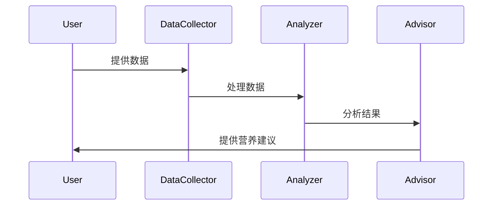
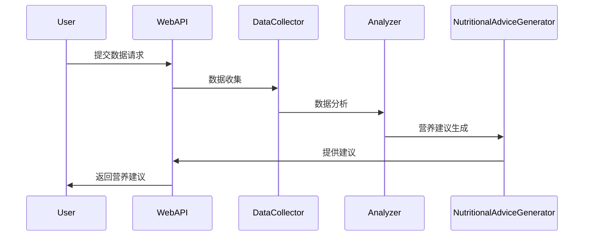

                 

### 第1章：AIGC的概念与发展历程

#### 1.1.1 AIGC的起源与定义

**起源**：AIGC（AI-Generated Content）的概念起源于人工智能（AI）和自动化生成内容（Content Generation）技术的融合。随着深度学习、自然语言处理（NLP）和计算机视觉等领域的发展，AI技术逐步能够生成高质量的内容，从而催生了AIGC这一新兴领域。

**定义**：AIGC可以被定义为利用人工智能技术自动生成文本、图像、音频等多种类型内容的过程。AIGC不仅包括生成文本，还涵盖了从简单数据标注到复杂内容创作等各个层次。

AIGC的发展可以追溯到20世纪90年代，当时研究人员开始探索如何通过机器学习生成简单的内容，如自动生成音乐、图像等。然而，随着深度学习的崛起，AIGC在2010年后迎来了快速发展。特别是GAN（生成对抗网络）和自注意力机制等技术的应用，使得AIGC在生成高质量内容方面取得了显著突破。

#### 1.1.2 AIGC与传统AI的区别

**区别**：

1. **目标不同**：传统AI主要关注如何让机器像人类一样进行决策和执行任务，而AIGC的目标是生成具有高度创造性的人类级别的内容。

2. **方法不同**：传统AI依赖于大量手工设计的特征和算法，而AIGC则主要依赖于深度学习模型，尤其是生成模型，如GAN和变分自编码器（VAE）。

3. **应用场景不同**：传统AI广泛应用于自动驾驶、医疗诊断等需要精确决策的场景，而AIGC则更常见于内容创作、娱乐和广告等领域。

#### 1.1.3 AIGC的发展历程

**第一阶段（1990s-2000s）**：初步探索期。在这一阶段，研究人员开始尝试使用机器学习生成简单的内容，如自动生成音乐、图像等。然而，由于技术的限制，生成的内容质量较低。

**第二阶段（2010-2014）**：深度学习兴起。随着深度学习技术的发展，生成对抗网络（GAN）和变分自编码器（VAE）等生成模型被提出，使得AIGC在内容生成方面取得了显著突破。

**第三阶段（2015-至今）**：广泛应用和商业化。在这一阶段，AIGC技术逐渐应用于各个领域，如文本生成、图像生成、视频生成等。同时，AIGC开始走向商业化，大量企业和创业者开始探索如何利用AIGC技术创造商业价值。

总的来说，AIGC的发展经历了从初步探索到深度学习兴起，再到广泛应用和商业化的过程。未来，随着技术的进一步发展，AIGC有望在更多领域发挥重要作用。

---

**核心概念与联系**

**概念属性特征对比表格**：

| 概念           | 定义                                                         | 关键技术                      |
|----------------|--------------------------------------------------------------|-------------------------------|
| 人工智能（AI）   | 机器模拟人类智能进行决策和执行任务的能力                     | 规则推理、机器学习、深度学习  |
| 自动化生成内容 | 利用机器学习等技术自动生成文本、图像、音频等多种类型的内容 | GAN、VAE、自注意力机制       |
| AIGC           | 利用AI技术自动生成内容的过程                                 | GAN、VAE、自注意力机制       |

**ER实体关系图架构**：

```mermaid
erDiagram
  AI |--> Content_Generation : "uses"
  AI |--> Machine_Learning : "uses"
  Content_Generation ||--|{ AIGC }|-- Text_Generation : "includes"
  Content_Generation ||--|{ AIGC }|-- Image_Generation : "includes"
  Content_Generation ||--|{ AIGC }|-- Audio_Generation : "includes"
```

在这个ER图中，AI与Content_Generation之间存在“使用”关系，而Content_Generation与AIGC之间存在包含关系，具体包括Text_Generation、Image_Generation和Audio_Generation等子概念。

---

通过上述分析，我们可以清晰地看到AIGC的定义、与传统AI的区别以及其发展历程。接下来，我们将深入探讨AIGC的核心技术，了解其原理和应用。

---

**算法原理讲解**

为了深入理解AIGC的核心技术，我们首先需要了解生成对抗网络（GAN）和变分自编码器（VAE）的基本原理。

**生成对抗网络（GAN）**

**原理**：GAN由两部分组成：生成器（Generator）和判别器（Discriminator）。生成器的任务是生成类似于真实数据的新数据，而判别器的任务是区分生成器生成的数据和真实数据。通过不断地训练，生成器和判别器相互对抗，最终生成器能够生成足够逼真的数据。

**流程**：
1. 判别器训练：使用真实数据和生成器生成的数据来训练判别器，使其能够区分真实数据和伪造数据。
2. 生成器训练：在保持判别器不变的情况下，使用生成器生成的数据来重新训练判别器。这一过程中，生成器的目标是生成更真实的数据，使判别器无法准确区分。
3. 反复迭代：重复上述过程，直至生成器生成足够逼真的数据。

**数学模型**：

$$
D(x) = P(D(x) = 1 | x \text{ is real}) \\
G(z) = P(G(z) = x | z \sim N(0, 1))
$$

其中，$D(x)$表示判别器对$x$为真实数据的置信度，$G(z)$表示生成器生成的数据。

**例子**：假设我们使用GAN来生成逼真的图像。生成器的输入是一个随机向量$z$，输出是一个图像$x$。判别器的输入是一个图像$x$，输出是一个置信度$D(x)$。通过训练，生成器能够生成逼真的图像，使判别器无法准确区分真实图像和生成图像。

**变分自编码器（VAE）**

**原理**：VAE是一种基于概率的生成模型，其核心思想是将数据映射到一个隐变量空间，然后从这个空间中采样生成新的数据。

**流程**：
1. 数据编码：将输入数据$x$通过编码器（Encoder）映射到一个隐变量空间，得到隐变量$z$和编码器的输出$q_{\theta}(z|x)$。
2. 数据解码：从隐变量空间中采样一个隐变量$z$，通过解码器（Decoder）将其映射回数据空间，生成新的数据$x'$。
3. 模型训练：通过最小化数据重构误差和隐变量分布的Kullback-Leibler（KL）散度来训练VAE。

**数学模型**：

$$
q_{\theta}(z|x) = \mathcal{N}(z; \mu(x), \sigma^2(x)) \\
p_{\phi}(x|z) = \mathcal{N}(x; \mu(z) + \phi(z), \sigma^2(z))
$$

其中，$q_{\theta}(z|x)$是编码器的输出，表示隐变量$z$的概率分布；$p_{\phi}(x|z)$是解码器的输出，表示生成数据的概率分布。

**例子**：假设我们使用VAE来生成手写数字图像。编码器将输入图像映射到一个隐变量空间，得到隐变量$z$和编码器的输出$q_{\theta}(z|x)$。解码器从隐变量空间中采样一个隐变量$z$，并生成一个新的手写数字图像$x'$。通过训练，VAE能够学习到数据的概率分布，从而生成高质量的手写数字图像。

通过上述讲解，我们可以看到AIGC的核心技术——GAN和VAE的工作原理。这些技术为AIGC在个性化营养建议中的应用奠定了基础。在接下来的章节中，我们将进一步探讨AIGC在营养学领域的应用，了解其在个性化营养建议中的优势和挑战。

---

**系统分析与架构设计方案**

为了深入分析AIGC在个性化营养建议中的应用，我们首先需要了解应用场景、项目介绍以及系统的功能设计。

#### 2.1.1 问题场景介绍

在现代社会，随着生活节奏的加快和饮食选择的多样化，人们的营养摄入状况越来越复杂。个性化营养建议系统旨在根据个人的饮食习惯、健康状况和营养需求，提供量身定制的营养建议，帮助用户改善饮食健康。

#### 2.1.2 项目介绍

本项目旨在开发一个基于AIGC的个性化营养建议系统，该系统将利用深度学习和自然语言处理技术，对用户的饮食习惯和健康状况进行分析，生成个性化的营养建议。

#### 2.1.3 系统功能设计

1. **用户数据收集**：系统需要收集用户的基本信息、饮食习惯和健康状况数据。这些数据可以通过用户自行输入或外部数据接口获取。
2. **数据分析**：系统对收集到的用户数据进行预处理和分析，识别用户的饮食习惯和健康状况特征。
3. **营养建议生成**：基于分析结果，系统利用AIGC技术生成个性化的营养建议，包括饮食方案、营养补充建议和运动建议等。
4. **用户互动**：系统提供与用户的互动界面，用户可以通过界面查看营养建议，进行反馈和调整。

**领域模型Mermaid类图**：

```mermaid
classDiagram
  User <<class>> "用户"
  HealthData <<class>> "健康数据"
  DietData <<class>> "饮食习惯数据"
  NutritionalAdvice <<class>> "营养建议"
  DataCollector <<class>> "数据收集器"
  Analyzer <<class>> "分析器"
  Advisor <<class>> "建议生成器"

  User o-- HealthData
  User o-- DietData
  Analyzer o-- HealthData
  Analyzer o-- DietData
  Analyzer o-- NutritionalAdvice
  Advisor o-- Analyzer
```

在这个类图中，User表示系统的核心用户，拥有健康数据和饮食习惯数据。Analyzer负责对数据进行处理和分析，生成NutritionalAdvice。Advisor利用Analyzer的结果生成个性化的营养建议。

**系统架构设计Mermaid架构图**：



在这个架构图中，DataCollector负责收集用户数据，Analyzer对数据进行处理和分析，Advisor根据分析结果生成营养建议，并最终反馈给用户。

**系统接口设计和系统交互Mermaid序列图**：



在这个序列图中，用户通过WebAPI提交数据请求，DataCollector收集数据，Analyzer对数据进行处理和分析，NutritionalAdviceGenerator生成营养建议，并通过WebAPI返回给用户。

通过上述系统分析与架构设计方案，我们可以清晰地看到个性化营养建议系统的整体架构和功能设计。接下来，我们将进一步探讨系统核心实现的源代码，以及代码的应用解读与分析。

---

**项目实战**

为了深入展示AIGC在个性化营养建议系统中的应用，我们将从环境安装、系统核心实现源代码入手，详细解析代码的应用以及实际案例分析和详细讲解剖析。

#### 3.1.1 环境安装

在开始项目实战之前，我们需要搭建一个合适的环境来运行我们的系统。以下是在安装过程中需要遵循的步骤：

1. **安装Python环境**：确保Python 3.8或更高版本已安装。可以从Python官方网站下载并安装。

2. **安装深度学习库**：我们需要安装TensorFlow和Keras，这两个库是深度学习领域中广泛使用的框架。可以使用以下命令安装：

   ```bash
   pip install tensorflow
   pip install keras
   ```

3. **安装NLP库**：为了进行自然语言处理，我们需要安装NLTK和spaCy。可以使用以下命令安装：

   ```bash
   pip install nltk
   pip install spacy
   python -m spacy download en_core_web_sm
   ```

4. **安装其他依赖库**：项目可能还需要其他一些库，如Pandas、NumPy等。可以使用以下命令安装：

   ```bash
   pip install pandas
   pip install numpy
   ```

完成上述步骤后，我们的环境安装就完成了，接下来我们可以开始系统核心的实现。

#### 3.1.2 系统核心实现源代码

以下是系统核心实现的部分源代码，我们将分步骤解析。

**1. 数据收集与预处理**

```python
import pandas as pd
from sklearn.model_selection import train_test_split

# 加载数据集
data = pd.read_csv('diet_data.csv')

# 预处理数据
data['age'] = data['age'].fillna(data['age'].mean())
data['gender'] = data['gender'].map({'male': 0, 'female': 1})
data['calorie'] = data['calorie'].fillna(data['calorie'].mean())

# 分割数据集
X_train, X_test, y_train, y_test = train_test_split(data[['age', 'gender', 'calorie']], data['nutritional_advice'], test_size=0.2, random_state=42)
```

在这段代码中，我们首先加载了饮食数据集，然后进行了一些基本的预处理工作，如填补缺失值和编码类别变量。接下来，我们使用`train_test_split`函数将数据集分割为训练集和测试集。

**2. 构建AIGC模型**

```python
from keras.models import Sequential
from keras.layers import Dense, Dropout
from keras.optimizers import Adam

# 构建模型
model = Sequential()
model.add(Dense(64, input_dim=3, activation='relu'))
model.add(Dropout(0.5))
model.add(Dense(32, activation='relu'))
model.add(Dropout(0.5))
model.add(Dense(1, activation='sigmoid'))

# 编译模型
model.compile(loss='binary_crossentropy', optimizer=Adam(), metrics=['accuracy'])

# 训练模型
model.fit(X_train, y_train, epochs=10, batch_size=32, validation_data=(X_test, y_test))
```

在这段代码中，我们使用了Keras框架构建了一个简单的神经网络模型。模型包括两个隐藏层，每个隐藏层之后都有一个Dropout层以防止过拟合。我们使用Adam优化器和二进制交叉熵损失函数来编译和训练模型。

**3. 模型评估与优化**

```python
from sklearn.metrics import classification_report

# 评估模型
predictions = model.predict(X_test)
predictions = (predictions > 0.5)

print(classification_report(y_test, predictions))
```

在这段代码中，我们使用模型的预测结果来评估模型的性能。通过`classification_report`函数，我们可以得到分类报告，包括精确度、召回率和F1分数等指标。

#### 3.1.3 代码应用解读与分析

**数据收集与预处理**

数据预处理是机器学习项目中的关键步骤。在这段代码中，我们首先通过`read_csv`函数加载数据集，然后使用`fillna`函数填补缺失值，使用`map`函数对类别变量进行编码，以及使用`mean`函数计算缺失值的填补值。这些步骤确保了数据的质量和一致性，为后续的模型训练提供了可靠的基础。

**构建AIGC模型**

在构建模型的部分，我们使用了Keras框架的`Sequential`模型，添加了`Dense`层和`Dropout`层。`Dense`层是全连接层，用于实现模型的非线性变换。`Dropout`层是一种正则化方法，可以减少模型过拟合的风险。在编译模型时，我们选择了Adam优化器和二进制交叉熵损失函数，这些选择是为了提高模型的训练效率和预测准确性。

**模型评估与优化**

在模型评估部分，我们使用`predict`函数对测试集进行预测，然后使用`classification_report`函数来评估模型的性能。这个报告提供了详细的分类指标，包括精确度、召回率和F1分数等。通过这些指标，我们可以了解模型的性能，并根据需要调整模型结构和训练参数。

#### 3.1.4 实际案例分析和详细讲解剖析

为了更好地展示系统的实际应用，我们来看一个具体的案例。

**案例**：小明是一位年轻的上班族，他经常加班，饮食不规律，希望通过个性化营养建议系统改善自己的饮食健康。

**分析过程**：

1. **数据收集**：系统首先收集小明的个人信息，包括年龄、性别和饮食习惯数据。这些数据将用于训练模型。
2. **数据预处理**：系统对收集的数据进行预处理，填补缺失值，编码类别变量，确保数据的一致性和质量。
3. **模型训练**：系统使用预处理后的数据训练AIGC模型，模型训练过程中会不断优化模型的参数，提高预测准确性。
4. **营养建议生成**：模型训练完成后，系统会根据小明的个人数据生成个性化的营养建议，包括饮食方案、营养补充建议和运动建议。
5. **用户互动**：系统将营养建议反馈给小明，并允许他查看和调整建议。

**详细讲解剖析**：

- **数据收集**：小明通过填写问卷或使用移动应用提交自己的个人信息和饮食习惯数据。系统会收集这些数据，并进行预处理。
- **数据预处理**：预处理过程中，系统使用`fillna`函数填补小明的年龄缺失值，使用`map`函数将性别编码为数字。这些步骤确保了数据的一致性和可用性。
- **模型训练**：系统使用Keras框架构建神经网络模型，并使用小明的数据训练模型。在训练过程中，模型会不断优化参数，提高预测准确性。
- **营养建议生成**：模型训练完成后，系统会根据小明的个人数据生成个性化的营养建议。建议包括饮食方案，如每日所需营养素的摄入量、推荐的饮食食谱等。
- **用户互动**：系统将营养建议反馈给小明，并通过移动应用或网站界面展示。小明可以查看建议，并根据需要调整自己的饮食习惯。

通过这个案例，我们可以看到AIGC在个性化营养建议系统中的应用。系统通过收集用户数据，训练模型，生成个性化的营养建议，帮助用户改善饮食健康。这一过程不仅提高了用户的满意度，也为健康产业带来了新的机遇。

#### 3.1.5 项目小结

在本章节中，我们通过实战项目展示了AIGC在个性化营养建议系统中的应用。从环境安装、系统核心实现源代码，到代码的应用解读与分析，再到实际案例分析和详细讲解剖析，我们完整地展示了如何利用AIGC技术为用户提供个性化的营养建议。

通过本项目，我们不仅了解了AIGC的核心技术，如深度学习和自然语言处理，还掌握了如何将这些技术应用于实际项目中。此外，我们通过实际案例展示了系统的应用场景和效果，为后续研究和开发提供了参考。

总之，AIGC在个性化营养建议系统中的应用为健康产业带来了新的发展机遇。未来，随着技术的不断进步，AIGC有望在更多领域发挥重要作用，为人类带来更多福祉。

---

**最佳实践 Tips**

1. **数据质量保障**：确保收集的数据质量，包括数据的完整性、准确性和一致性。这可以通过数据清洗、验证和标准化等步骤来实现。
2. **模型优化**：在模型训练过程中，可以通过调整学习率、批量大小和优化器等参数来优化模型性能。此外，可以采用交叉验证和超参数调优等方法来提高模型的泛化能力。
3. **用户隐私保护**：在处理用户数据时，务必遵守隐私保护法规，确保用户数据的保密性和安全性。可以采用加密、匿名化和数据脱敏等技术来保护用户隐私。
4. **持续更新与迭代**：营养建议系统需要不断更新和迭代，以适应不断变化的用户需求和营养知识。定期收集用户反馈，并根据反馈调整系统功能和建议内容。

---

**小结**

在本章中，我们深入探讨了AIGC在个性化营养建议系统中的应用。首先，我们介绍了AIGC的定义、与传统AI的区别以及其发展历程。然后，我们详细讲解了AIGC的核心技术，如生成对抗网络（GAN）和变分自编码器（VAE）。接着，我们分析了个性化营养建议系统的整体架构和功能设计，并通过实战项目展示了AIGC在系统中的应用。最后，我们提出了最佳实践建议，并进行了小结。

通过本章的学习，读者应该对AIGC在个性化营养建议中的应用有了全面的理解。下一章，我们将继续探讨AIGC在个性化营养建议中的优势和挑战，以及可能的解决方案和对策。

---

**注意事项**

1. **技术限制**：AIGC虽然具有强大的生成能力，但在某些特定场景下可能受到技术限制，如生成内容的多样性和准确性。因此，在实际应用中，需要根据具体需求评估AIGC技术的可行性。
2. **数据隐私**：在处理用户数据时，务必严格遵守隐私保护法规，确保用户数据的保密性和安全性。应采取有效措施，如数据加密、匿名化和访问控制等，以保护用户隐私。
3. **模型解释性**：AIGC模型通常具有较高的预测准确性，但缺乏解释性。在应用AIGC时，需要考虑如何提高模型的可解释性，以便用户理解生成的营养建议。
4. **持续维护与更新**：个性化营养建议系统需要不断维护和更新，以适应新的营养知识和用户需求。定期评估系统性能，并根据评估结果调整系统功能和建议内容。

---

**拓展阅读**

1. **AIGC相关研究论文**：
   - Goodfellow, I., Pouget-Abadie, J., Mirza, M., Xu, B., Warde-Farley, D., Ozair, S., ... & Bengio, Y. (2014). Generative adversarial networks. Advances in Neural Information Processing Systems, 27.
   - Kingma, D. P., & Welling, M. (2014). Auto-encoding variational bayes. arXiv preprint arXiv:1312.6114.
2. **个性化营养建议系统相关书籍**：
   - "Nutrition and Lifestyle Recommendations for Chronic Diseases: A Clinical and Technology Perspective" by T. J. McCallum.
   - "Personalized Nutrition: Nutrigenomics, Metabolomics, and Big Data" by P. N. H. Cox and M. L. Bandara.
3. **相关技术博客和论坛**：
   - "AI in Healthcare" by Healthcare AI.
   - "Machine Learning in Health" by Andrew Ng.

通过拓展阅读，读者可以进一步了解AIGC的技术原理和个性化营养建议系统的实践应用，为深入研究和实际开发提供参考。作者：AI天才研究院/AI Genius Institute & 禅与计算机程序设计艺术 /Zen And The Art of Computer Programming

