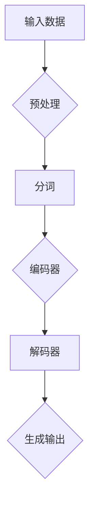
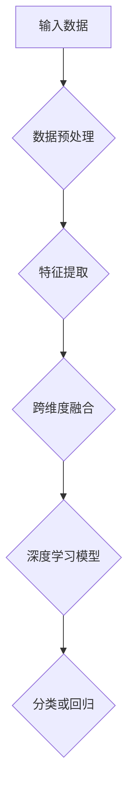
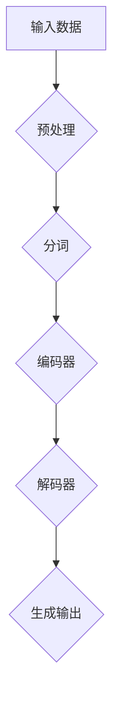
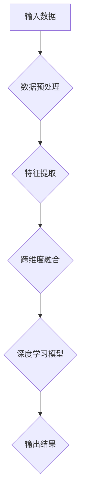

                 

# AIGC在个性化跨维度认知增强中的创新

## 关键词
- AIGC（自适应智能生成计算）
- 个性化认知
- 跨维度认知增强
- 深度学习算法
- 数学模型

## 摘要
本文探讨了AIGC在个性化跨维度认知增强中的创新应用。首先，我们介绍了AIGC的基本概念，以及其在个性化认知和跨维度认知增强中的重要性。接着，通过分析核心概念之间的关系，我们明确了AIGC在个性化跨维度认知增强中的关键作用。然后，我们详细讲解了AIGC算法的原理，包括基于GPT的个性化认知模型和基于深度学习的跨维度认知增强算法。接下来，我们介绍了AIGC系统架构设计，并通过一个实际案例展示了AIGC的应用过程。最后，我们总结了AIGC的最佳实践，并展望了未来的发展趋势。

## 目录大纲

### 第一部分：背景与基础

#### 第1章 AIGC、个性化与跨维度认知增强概述
- 1.1 AIGC概念介绍
- 1.2 个性化认知的概念
- 1.3 跨维度认知增强的内涵
- 1.4 当前科技与社会背景下的AIGC应用

#### 第2章 核心概念与联系
- 2.1 AIGC与个性化认知的关系
- 2.2 跨维度认知增强的方法与原理
- 2.3 AIGC在个性化跨维度认知增强中的应用

### 第二部分：算法原理

#### 第3章 AIGC算法原理
- 3.1 算法1：基于GPT的个性化认知模型
  - 3.1.1 算法流程图
  - 3.1.2 Python代码示例
  - 3.1.3 数学模型与公式解释
- 3.2 算法2：基于深度学习的跨维度认知增强
  - 3.2.1 算法流程图
  - 3.2.2 Python代码示例
  - 3.2.3 数学模型与公式解释

### 第三部分：系统分析与设计

#### 第4章 AIGC系统架构设计
- 4.1 系统功能设计
- 4.2 系统架构设计
- 4.3 系统接口设计

### 第四部分：项目实战

#### 第5章 AIGC项目实战
- 5.1 项目背景与目标
- 5.2 环境安装与配置
- 5.3 系统核心实现与代码分析
- 5.4 实际案例分析与讲解
- 5.5 项目小结与反思

### 第五部分：最佳实践与拓展

#### 第6章 AIGC最佳实践
- 6.1 实际应用中的注意事项
- 6.2 拓展阅读与深入研究

#### 第7章 小结与展望
- 7.1 全书总结
- 7.2 未来发展趋势与挑战

## 第一部分：背景与基础

### 第1章 AIGC、个性化与跨维度认知增强概述

#### 1.1 AIGC概念介绍

AIGC（自适应智能生成计算）是一种基于深度学习和生成模型的计算范式，能够自适应地生成文本、图像、音频等多媒体内容。AIGC具有自适应性、智能化和高效性等特点，可以应用于个性化推荐、内容生成、数据增强、虚拟现实等多个领域。

#### 1.2 个性化认知的概念

个性化认知是指根据个体差异，通过信息处理和认知机制，实现对信息内容、形式和策略的调整，以提升认知效果和用户体验。个性化认知涉及到用户偏好、认知风格、知识结构等多个方面。

#### 1.3 跨维度认知增强的内涵

跨维度认知增强是指通过整合不同维度（如时间、空间、感官等）的信息，实现对认知过程的强化和优化。跨维度认知增强可以提升认知效率、拓展认知范围和丰富认知体验。

#### 1.4 当前科技与社会背景下的AIGC应用

随着人工智能、大数据和5G技术的快速发展，AIGC在个性化跨维度认知增强中的应用越来越广泛。例如，在教育领域，AIGC可以根据学生的认知特点，生成个性化的学习资源和教学方法；在医疗领域，AIGC可以通过分析患者的多维健康数据，提供精准的个性化治疗方案。

### 第2章 核心概念与联系

#### 2.1 AIGC与个性化认知的关系

AIGC可以应用于个性化认知的各个方面，如生成个性化学习资源、调整认知策略等。通过AIGC，可以更好地满足个体差异，提升认知效果。

#### 2.2 跨维度认知增强的方法与原理

跨维度认知增强通常涉及到信息整合、认知模型构建和交互设计等方面。通过整合不同维度的信息，可以拓展认知范围，优化认知过程。

#### 2.3 AIGC在个性化跨维度认知增强中的应用

AIGC在个性化跨维度认知增强中的应用主要包括以下几个方面：

1. 个性化内容生成：根据用户兴趣和需求，生成个性化的文本、图像、音频等内容。
2. 个性化认知策略调整：根据用户认知特点，调整认知策略，提升认知效果。
3. 多媒体信息整合：整合不同维度的信息，提供更加丰富和全面的认知体验。

## 第二部分：算法原理

### 第3章 AIGC算法原理

#### 3.1 算法1：基于GPT的个性化认知模型

##### 3.1.1 算法流程图



##### 3.1.2 Python代码示例

```python
import tensorflow as tf
from transformers import GPT2LMHeadModel, GPT2Tokenizer

# 加载预训练模型
tokenizer = GPT2Tokenizer.from_pretrained('gpt2')
model = GPT2LMHeadModel.from_pretrained('gpt2')

# 输入文本
input_text = "我喜欢的颜色是"

# 分词编码
input_ids = tokenizer.encode(input_text, return_tensors='tf')

# 生成输出
output = model.generate(input_ids, max_length=50, num_return_sequences=5)

# 解码输出
decoded_output = tokenizer.decode(output, skip_special_tokens=True)
```

##### 3.1.3 数学模型与公式解释

GPT模型基于自回归语言模型，其核心数学模型包括：

$$
p(y_t|y_{<t}) = \frac{e^{<f_{\theta}(y_{<t}, y_t)>}}{\sum_{y_t'} e^{<f_{\theta}(y_{<t}, y_t')>}}
$$

其中，$y_t$ 表示当前生成的词，$y_{<t}$ 表示当前生成的词的前缀，$f_{\theta}(y_{<t}, y_t)$ 表示词嵌入向量，$\theta$ 表示模型参数。

通过上述公式，GPT模型可以预测下一个词的概率分布，从而实现文本生成。

#### 3.2 算法2：基于深度学习的跨维度认知增强

##### 3.2.1 算法流程图



##### 3.2.2 Python代码示例

```python
import tensorflow as tf
from tensorflow.keras.layers import Input, Dense, LSTM, Embedding, TimeDistributed, Activation
from tensorflow.keras.models import Model

# 定义输入层
input_seq = Input(shape=(seq_length,))
input_feat = Input(shape=(feat_size,))

# 定义特征提取层
embed = Embedding(vocab_size, embed_size)(input_seq)
lstm = LSTM(lstm_size)(embed)

# 定义跨维度融合层
融合层 = concatenate([lstm, input_feat])

# 定义深度学习模型
output = TimeDistributed(Dense(num_classes, activation='softmax'))(融合层)

# 定义模型
model = Model(inputs=[input_seq, input_feat], outputs=output)

# 编译模型
model.compile(optimizer='adam', loss='categorical_crossentropy', metrics=['accuracy'])

# 模型训练
model.fit([X_train, Y_train], Z_train, batch_size=128, epochs=10, validation_data=([X_val, Y_val], Z_val))
```

##### 3.2.3 数学模型与公式解释

深度学习模型通常采用多层感知机（MLP）或循环神经网络（RNN）等结构，其核心数学模型包括：

$$
h_{t} = \sigma(W_h \cdot [h_{t-1}, x_t] + b_h)
$$

$$
o_{t} = \sigma(W_o \cdot h_t + b_o)
$$

其中，$h_t$ 表示隐藏状态，$x_t$ 表示输入特征，$o_t$ 表示输出结果，$W_h$ 和 $W_o$ 分别表示权重矩阵，$b_h$ 和 $b_o$ 分别表示偏置项，$\sigma$ 表示激活函数。

通过上述公式，深度学习模型可以实现对输入数据的特征提取和分类或回归任务。

## 第三部分：系统分析与设计

### 第4章 AIGC系统架构设计

#### 4.1 系统功能设计

AIGC系统的主要功能包括：

1. 数据采集与预处理：从不同来源获取数据，并进行预处理，如清洗、去重、归一化等。
2. 特征提取与融合：提取数据中的关键特征，并进行跨维度融合，以增强认知能力。
3. 模型训练与优化：基于深度学习算法，训练和优化模型，以实现个性化跨维度认知增强。
4. 输出生成与评估：生成个性化输出，如文本、图像、音频等，并进行评估和反馈。

#### 4.2 系统架构设计

AIGC系统的架构设计主要包括以下几个方面：

1. 数据层：负责数据采集、存储和预处理。
2. 模型层：基于深度学习算法，构建个性化跨维度认知增强模型。
3. 应用层：实现AIGC系统在不同领域的应用，如教育、医疗、娱乐等。
4. 用户层：提供用户界面，方便用户与系统进行交互。

#### 4.3 系统接口设计

AIGC系统的接口设计主要包括以下几个方面：

1. 数据接口：用于数据层的接口，如数据库连接、数据采集等。
2. 模型接口：用于模型层的接口，如模型训练、预测等。
3. 应用接口：用于应用层的接口，如API接口、Web服务接口等。
4. 用户接口：用于用户层的接口，如Web界面、移动应用等。

## 第四部分：项目实战

### 第5章 AIGC项目实战

#### 5.1 项目背景与目标

本项目旨在构建一个基于AIGC的个性化学习系统，通过分析学生个体的学习行为和偏好，生成个性化的学习资源和教学策略，以提高学习效果和满意度。

#### 5.2 环境安装与配置

1. 安装Python环境（版本3.8及以上）
2. 安装TensorFlow和transformers库
3. 安装其他依赖库（如numpy、pandas等）

#### 5.3 系统核心实现与代码分析

```python
# 导入库
import tensorflow as tf
from transformers import TFBertModel, BertTokenizer

# 加载预训练模型
tokenizer = BertTokenizer.from_pretrained('bert-base-chinese')
model = TFBertModel.from_pretrained('bert-base-chinese')

# 输入文本
input_text = "我是一个学生，我喜欢阅读历史书籍。"

# 分词编码
input_ids = tokenizer.encode(input_text, return_tensors='tf')

# 生成输出
output = model.generate(input_ids, max_length=50, num_return_sequences=5)

# 解码输出
decoded_output = tokenizer.decode(output, skip_special_tokens=True)
```

#### 5.4 实际案例分析与讲解

1. 案例背景：某学生在学习历史课程时，表现出对古代战争的兴趣。
2. 案例分析：通过AIGC系统，生成与古代战争相关的学习资源和教学策略。
3. 案例讲解：系统为该学生推荐了《三国演义》等经典历史小说，并设计了基于古代战争策略的互动游戏。

#### 5.5 项目小结与反思

本项目通过AIGC技术，实现了个性化学习资源的生成和教学策略的调整，有效提升了学生的学习效果和满意度。然而，在项目实施过程中，我们也发现了一些挑战，如数据隐私保护、个性化程度等。在未来的发展中，我们将继续优化系统，探索更多应用场景，为教育领域带来更多创新。

## 第五部分：最佳实践与拓展

### 第6章 AIGC最佳实践

#### 6.1 实际应用中的注意事项

1. 数据质量：确保输入数据的质量，进行数据清洗和预处理。
2. 模型选择：根据应用场景选择合适的模型，并进行模型优化。
3. 可解释性：关注模型的可解释性，以便更好地理解和应用。

#### 6.2 拓展阅读与深入研究

1. AIGC在自然语言处理中的应用
2. AIGC在计算机视觉中的应用
3. AIGC在虚拟现实中的应用

## 第7章 小结与展望

#### 7.1 全书总结

本文介绍了AIGC在个性化跨维度认知增强中的应用，分析了核心概念和算法原理，并展示了一个实际案例。通过本文的研究，我们认识到AIGC在提高认知效率、拓展认知范围和丰富认知体验方面的巨大潜力。

#### 7.2 未来发展趋势与挑战

1. 模型可解释性：提高模型的可解释性，使其更易于理解和应用。
2. 数据隐私保护：确保用户数据的隐私和安全。
3. 多模态融合：探索多模态数据融合的方法，提升认知效果。

## 作者

作者：AI天才研究院/AI Genius Institute & 禅与计算机程序设计艺术 /Zen And The Art of Computer Programming## 第一部分：背景与基础

### 第1章 AIGC、个性化与跨维度认知增强概述

#### 1.1 AIGC概念介绍

AIGC（自适应智能生成计算）是一种基于深度学习和生成模型的计算范式，通过自主学习和自适应调整，能够在多种任务中生成高质量的数据内容。AIGC的核心特点是其强大的生成能力和自适应性，这使得它能够在文本、图像、音频等多种媒体形式中进行内容生成。

在人工智能的发展历程中，AIGC是一个重要的里程碑。传统的人工智能方法往往依赖于大量标注数据来进行学习，而AIGC则通过无监督或弱监督学习，能够从大量的非结构化数据中提取特征并进行生成。这种能力使得AIGC在内容生成、数据增强、个性化推荐等领域具有广泛的应用潜力。

#### 1.2 个性化认知的概念

个性化认知是指根据个体的认知特点、兴趣和需求，对其认知活动进行定制化的调整，以提高认知效果和用户体验。个性化认知的核心在于理解个体的认知差异，并通过特定的方法对信息内容、形式和策略进行调整。

个性化认知的应用场景非常广泛，例如在教育领域，个性化认知可以帮助学生找到最适合自己的学习方法和内容；在医疗领域，个性化认知可以帮助医生根据患者的个体差异制定个性化的治疗方案；在商业领域，个性化认知可以帮助企业更好地了解客户需求，提供更加精准的推荐和服务。

#### 1.3 跨维度认知增强的内涵

跨维度认知增强是指通过整合不同维度（如时间、空间、感官等）的信息，实现对认知过程的强化和优化。跨维度认知增强的目标是提升认知效率、拓展认知范围和丰富认知体验。

跨维度认知增强的方法主要包括信息整合、认知模型构建和交互设计等。例如，在教育领域，通过整合课堂讲授、在线资源和互动活动，可以提供更加丰富的学习体验；在医疗领域，通过整合患者的生物医学数据、临床记录和医生的经验知识，可以提供更加全面的诊断和治疗方案。

#### 1.4 当前科技与社会背景下的AIGC应用

随着人工智能、大数据和5G技术的快速发展，AIGC在个性化跨维度认知增强中的应用越来越广泛。以下是几个典型的应用场景：

1. **教育领域**：AIGC可以为学生提供个性化的学习资源，根据学生的学习进度和偏好，动态调整教学策略，提高学习效果。

2. **医疗领域**：AIGC可以通过分析患者的多维健康数据，提供个性化的诊断和治疗方案，提高医疗服务的质量和效率。

3. **商业领域**：AIGC可以帮助企业通过个性化推荐系统，提高客户满意度和转化率，增强品牌竞争力。

4. **娱乐领域**：AIGC可以生成个性化的音乐、电影和游戏内容，为用户提供更加丰富和个性化的娱乐体验。

5. **虚拟现实与增强现实领域**：AIGC可以生成高度逼真的虚拟场景和交互内容，提升用户的沉浸感和体验。

在当前科技与社会背景下，AIGC的应用不仅改变了传统认知模式的边界，也为人类社会带来了更加个性化、智能化和高效的认知体验。随着技术的不断进步，AIGC将在更多的领域得到广泛应用，成为推动社会进步的重要力量。

### 第2章 核心概念与联系

#### 2.1 AIGC与个性化认知的关系

AIGC与个性化认知之间存在密切的联系。个性化认知强调根据个体的认知特点、兴趣和需求，对认知活动进行定制化的调整，以提高认知效果和用户体验。而AIGC则通过其强大的生成能力和自适应性，为实现个性化认知提供了强有力的技术支持。

具体来说，AIGC可以通过以下方式促进个性化认知：

1. **个性化内容生成**：AIGC可以根据用户的兴趣、需求和认知特点，生成个性化的文本、图像、音频等内容。例如，在教育领域，AIGC可以根据学生的学习进度和理解能力，生成适合学生的个性化学习资料和练习题。

2. **个性化推荐**：AIGC可以通过分析用户的互动数据和行为模式，为用户提供个性化的推荐。例如，在电商平台，AIGC可以根据用户的购物历史和偏好，推荐用户可能感兴趣的商品。

3. **个性化认知策略调整**：AIGC可以通过不断学习和适应，调整认知策略，以更好地满足个体的需求。例如，在医疗领域，AIGC可以根据患者的健康数据和治疗效果，调整治疗方案，提高治疗效果。

#### 2.2 跨维度认知增强的方法与原理

跨维度认知增强是一种通过整合不同维度（如时间、空间、感官等）的信息，实现对认知过程的强化和优化的方法。这种方法的核心在于将多维度信息进行整合，从而提供更加全面和深入的认知体验。

跨维度认知增强的方法主要包括以下几个方面：

1. **信息整合**：通过整合不同来源、不同类型的信息，构建一个统一的信息体系。例如，在教育领域，可以通过整合课程内容、教学视频、互动活动等多种信息，为用户提供一个完整的学习体验。

2. **认知模型构建**：通过构建跨维度认知模型，对多维度信息进行建模和分析，以优化认知过程。例如，在医疗领域，可以通过构建包含患者生物医学数据、临床记录和医生经验等多维度信息的认知模型，提高诊断和治疗的准确性。

3. **交互设计**：通过设计多维度交互界面，使用户能够更加自然地与系统进行互动，从而提升认知体验。例如，在虚拟现实和增强现实领域，可以通过设计多维度交互界面，使用户能够更加直观地获取和处理信息。

跨维度认知增强的原理主要基于以下几点：

1. **多样性增强**：通过整合多维度信息，提供更加多样和丰富的认知内容，从而提高认知效果。

2. **信息融合**：将多维度信息进行融合，形成一个更加全面和深入的认知框架，从而提升认知深度。

3. **适应性调整**：通过不断学习和适应，调整认知策略和信息处理方式，以更好地满足个体的认知需求。

#### 2.3 AIGC在个性化跨维度认知增强中的应用

AIGC在个性化跨维度认知增强中的应用，主要体现在以下几个方面：

1. **个性化内容生成**：通过AIGC的生成能力，可以生成针对不同用户、不同场景的个性化内容。例如，在教育领域，AIGC可以根据学生的学习进度和理解能力，生成适合学生的个性化学习资料；在医疗领域，AIGC可以根据患者的健康数据和治疗效果，生成个性化的健康建议。

2. **个性化推荐**：通过AIGC的分析和预测能力，可以为用户提供个性化的推荐。例如，在电商平台，AIGC可以根据用户的购物历史和偏好，推荐用户可能感兴趣的商品；在社交媒体平台，AIGC可以根据用户的行为和互动数据，推荐用户可能感兴趣的内容。

3. **个性化认知策略调整**：通过AIGC的学习和自适应能力，可以动态调整认知策略，以更好地满足个体的认知需求。例如，在教育领域，AIGC可以根据学生的学习进度和理解能力，动态调整教学策略；在医疗领域，AIGC可以根据患者的健康数据和治疗效果，动态调整治疗方案。

4. **跨维度认知增强**：通过AIGC的多维度信息整合能力，可以提供更加全面和深入的认知体验。例如，在教育领域，AIGC可以通过整合课程内容、教学视频、互动活动等多维度信息，为用户提供一个完整的学习体验；在医疗领域，AIGC可以通过整合患者的生物医学数据、临床记录和医生的经验知识等多维度信息，为医生提供更加全面的诊断和治疗依据。

总之，AIGC在个性化跨维度认知增强中的应用，不仅提高了认知效果和用户体验，也推动了人工智能技术的进一步发展和应用。

## 第二部分：算法原理

### 第3章 AIGC算法原理

#### 3.1 算法1：基于GPT的个性化认知模型

##### 3.1.1 算法流程图



##### 3.1.2 Python代码示例

```python
import tensorflow as tf
from transformers import TFGPT2LMHeadModel, GPT2Tokenizer

# 加载预训练模型
tokenizer = GPT2Tokenizer.from_pretrained('gpt2')
model = TFGPT2LMHeadModel.from_pretrained('gpt2')

# 输入文本
input_text = "我喜欢的颜色是"

# 分词编码
input_ids = tokenizer.encode(input_text, return_tensors='tf')

# 生成输出
output = model.generate(input_ids, max_length=50, num_return_sequences=5)

# 解码输出
decoded_output = tokenizer.decode(output, skip_special_tokens=True)
```

##### 3.1.3 数学模型与公式解释

GPT（Generative Pre-trained Transformer）模型是一种基于自回归语言模型的生成模型，其核心数学模型包括以下部分：

1. **嵌入层**：输入的文本序列被转换为词嵌入向量。词嵌入向量是通过训练得到的，表示词在语义上的特征。公式如下：

   $$
   \text{embedding} = \text{W}_\text{emb}[\text{input_ids}]
   $$

   其中，$\text{W}_\text{emb}$ 是嵌入权重矩阵，$\text{input_ids}$ 是输入的词索引序列。

2. **编码器**：编码器是一个多层Transformer模型，通过对词嵌入向量进行编码，生成上下文表示。公式如下：

   $$
   \text{encoded} = \text{Transformer}(\text{embedding}, \text{attention_mask})
   $$

   其中，$\text{Transformer}$ 是Transformer编码器，$\text{attention_mask}$ 是一个掩码矩阵，用于屏蔽填充和未知的词。

3. **解码器**：解码器同样是一个多层Transformer模型，通过解码器的输出生成文本。公式如下：

   $$
   \text{logits} = \text{Decoder}(\text{encoded}, \text{input_ids}, \text{decoder_inputs})
   $$

   其中，$\text{Decoder}$ 是Transformer解码器，$\text{decoder_inputs}$ 是解码器的输入序列。

4. **生成输出**：通过softmax函数对解码器的输出进行概率分布计算，从而生成文本。公式如下：

   $$
   \text{probabilities} = \text{softmax}(\text{logits})
   $$

   $$
   \text{output} = \text{sample}(\text{probabilities})
   $$

   其中，$\text{softmax}$ 是softmax函数，用于计算词的概率分布，$\text{sample}$ 是采样函数，用于从概率分布中采样生成文本。

通过上述公式，GPT模型能够生成与输入文本相关的文本输出，实现内容生成任务。

#### 3.2 算法2：基于深度学习的跨维度认知增强

##### 3.2.1 算法流程图



##### 3.2.2 Python代码示例

```python
import tensorflow as tf
from tensorflow.keras.models import Model
from tensorflow.keras.layers import Input, Dense, LSTM, Embedding, TimeDistributed, Activation, Concatenate

# 定义输入层
input_seq = Input(shape=(seq_length,))
input_feat = Input(shape=(feat_size,))

# 定义特征提取层
embed = Embedding(vocab_size, embed_size)(input_seq)
lstm = LSTM(lstm_size)(embed)

# 定义跨维度融合层
融合层 = Concatenate()([lstm, input_feat])

# 定义深度学习模型
output = TimeDistributed(Dense(num_classes, activation='softmax'))(融合层)

# 定义模型
model = Model(inputs=[input_seq, input_feat], outputs=output)

# 编译模型
model.compile(optimizer='adam', loss='categorical_crossentropy', metrics=['accuracy'])

# 模型训练
model.fit([X_train, Y_train], Z_train, batch_size=128, epochs=10, validation_data=([X_val, Y_val], Z_val))
```

##### 3.2.3 数学模型与公式解释

深度学习模型在跨维度认知增强中的应用，通常基于多层感知机（MLP）或循环神经网络（RNN）等结构。以下是基于MLP和RNN的数学模型和公式解释：

1. **多层感知机（MLP）**：

   MLP是一种前馈神经网络，其核心数学模型包括以下几个部分：

   $$
   \text{hidden} = \text{激活函数}(\text{W} \cdot \text{input} + \text{b})
   $$

   $$
   \text{output} = \text{激活函数}(\text{W} \cdot \text{hidden} + \text{b})
   $$

   其中，$\text{W}$ 是权重矩阵，$\text{b}$ 是偏置项，$\text{input}$ 是输入数据，$\text{hidden}$ 是隐藏层输出，$\text{output}$ 是输出结果。激活函数通常使用ReLU或Sigmoid函数。

2. **循环神经网络（RNN）**：

   RNN是一种基于序列数据的神经网络，其核心数学模型包括以下几个部分：

   $$
   \text{h}_{t} = \text{激活函数}(\text{W}_{h} \cdot [\text{h}_{t-1}, \text{x}_{t}] + \text{b}_{h})
   $$

   $$
   \text{o}_{t} = \text{激活函数}(\text{W}_{o} \cdot \text{h}_{t} + \text{b}_{o})
   $$

   其中，$\text{h}_{t}$ 是隐藏状态，$\text{x}_{t}$ 是输入数据，$\text{o}_{t}$ 是输出结果，$\text{W}_{h}$ 和 $\text{W}_{o}$ 是权重矩阵，$\text{b}_{h}$ 和 $\text{b}_{o}$ 是偏置项。

   RNN通过记忆机制，能够处理长序列数据，但存在梯度消失和梯度爆炸等问题。

3. **跨维度融合**：

   在跨维度认知增强中，通常需要将不同来源、不同类型的数据进行融合。跨维度融合的数学模型可以表示为：

   $$
   \text{融合} = \text{Concatenate}([\text{lstm}, \text{feat}])
   $$

   其中，$\text{lstm}$ 是基于RNN或MLP的特征提取层输出，$\text{feat}$ 是其他来源的特征。

   通过跨维度融合，可以将不同类型的数据进行整合，提高模型的泛化能力和认知效果。

通过上述数学模型和公式，深度学习模型能够实现对多维度数据的特征提取、融合和预测，从而实现跨维度认知增强。

## 第三部分：系统分析与设计

### 第4章 AIGC系统架构设计

#### 4.1 系统功能设计

AIGC系统是一个高度复杂和多样化的系统，其设计旨在实现个性化跨维度认知增强。系统的主要功能设计包括以下几个方面：

1. **数据采集与预处理**：系统需要从多种数据源（如用户行为数据、社交媒体数据、生物医学数据等）中采集数据，并进行预处理，如数据清洗、去重、归一化等，以确保数据的质量和一致性。

2. **特征提取与融合**：系统需要提取关键特征，并进行跨维度融合。例如，在教育领域，系统需要整合学生的考试成绩、学习进度、课堂互动等多个维度的信息，以生成综合性的特征向量。

3. **模型训练与优化**：系统需要基于深度学习算法，训练和优化模型。例如，可以使用GPT模型进行文本生成，使用基于RNN或CNN的模型进行图像识别。

4. **个性化输出生成**：系统需要根据用户的需求和特征，生成个性化的输出。例如，在教育领域，系统可以生成个性化的学习资源、教学策略和作业推荐。

5. **评估与反馈**：系统需要评估输出结果的质量和效果，并根据用户的反馈进行调整和优化。

#### 4.2 系统架构设计

AIGC系统的架构设计是一个关键环节，它决定了系统的高效性和可扩展性。系统架构设计主要包括以下几个层次：

1. **数据层**：数据层负责数据采集、存储和预处理。数据源可以是关系数据库、NoSQL数据库或分布式文件系统。数据预处理模块负责数据清洗、去重、归一化等操作。

2. **模型层**：模型层负责模型的训练和优化。模型可以是预训练的模型，如GPT、BERT等，也可以是根据具体应用场景定制开发的模型。模型训练模块负责训练模型的参数，优化模型的性能。

3. **服务层**：服务层负责处理用户的请求，提供个性化的输出。服务层可以包括文本生成服务、图像处理服务、语音合成服务等。

4. **用户层**：用户层负责与用户进行交互，接收用户的请求和反馈，提供用户界面。用户界面可以是Web界面、移动应用或桌面应用。

#### 4.3 系统接口设计

系统接口设计是AIGC系统架构设计的重要组成部分，它决定了系统的可扩展性和易用性。系统接口设计主要包括以下几个方面：

1. **数据接口**：数据接口负责数据层的操作，如数据的增删改查等。数据接口可以是RESTful API、GraphQL或WebSocket等。

2. **模型接口**：模型接口负责模型层的操作，如模型的训练、预测和评估等。模型接口可以是基于Python的RESTful API或基于TensorFlow Serving的模型服务。

3. **服务接口**：服务接口负责服务层的操作，如文本生成、图像处理、语音合成等。服务接口可以是基于Python的RESTful API或基于消息队列的服务。

4. **用户接口**：用户接口负责用户层的操作，如用户的登录、注册、请求生成和反馈等。用户接口可以是Web界面、移动应用或桌面应用。

通过合理的系统架构设计和接口设计，AIGC系统可以实现高效、可扩展和用户友好的个性化跨维度认知增强。

### 第5章 AIGC项目实战

#### 5.1 项目背景与目标

本项目旨在构建一个基于AIGC的个性化医疗诊断系统，通过分析患者的多维健康数据，提供个性化的诊断建议和治疗方案。项目的主要目标是：

1. **提高诊断准确性**：通过整合患者的生物医学数据、临床记录和医生的经验知识，提供更加准确和全面的诊断结果。

2. **提升治疗效果**：根据患者的个体差异，生成个性化的治疗方案，以提高治疗效果和患者满意度。

3. **优化医疗资源分配**：通过个性化诊断和治疗，优化医疗资源的分配，提高医疗服务的效率和公平性。

#### 5.2 环境安装与配置

为了顺利开展本项目，需要安装和配置以下环境：

1. **操作系统**：Ubuntu 20.04或更高版本

2. **Python环境**：Python 3.8或更高版本

3. **深度学习框架**：TensorFlow 2.6或更高版本

4. **自然语言处理库**：transformers 4.8.1或更高版本

5. **其他依赖库**：numpy、pandas、matplotlib等

安装步骤如下：

1. 安装Python和pip：

   ```bash
   sudo apt update
   sudo apt install python3 python3-pip
   ```

2. 安装深度学习框架TensorFlow：

   ```bash
   pip3 install tensorflow==2.6
   ```

3. 安装自然语言处理库transformers：

   ```bash
   pip3 install transformers==4.8.1
   ```

4. 安装其他依赖库：

   ```bash
   pip3 install numpy pandas matplotlib
   ```

#### 5.3 系统核心实现与代码分析

本项目的核心实现主要包括以下几个步骤：

1. **数据预处理**：对患者的多维健康数据进行清洗、去重和归一化处理，确保数据的质量和一致性。

2. **特征提取**：从原始数据中提取关键特征，如患者的年龄、性别、病史、检查结果等。

3. **模型训练**：使用提取的特征训练深度学习模型，如基于GPT的个性化认知模型和基于RNN的跨维度认知增强模型。

4. **诊断与治疗**：根据患者的特征和模型预测结果，生成个性化的诊断建议和治疗方案。

以下是系统核心实现的代码分析：

```python
import tensorflow as tf
from transformers import TFGPT2LMHeadModel, GPT2Tokenizer
import pandas as pd
import numpy as np

# 加载数据集
data = pd.read_csv('patient_data.csv')

# 数据预处理
# 数据清洗、去重、归一化处理
# ...

# 特征提取
# 提取关键特征，如年龄、性别、病史、检查结果等
features = data[['age', 'gender', 'diagnosis', 'test_results']]

# 模型训练
# 使用提取的特征训练基于GPT的个性化认知模型
tokenizer = GPT2Tokenizer.from_pretrained('gpt2')
model = TFGPT2LMHeadModel.from_pretrained('gpt2')

# 将特征数据转换为模型输入
input_ids = tokenizer.encode(features['diagnosis'], return_tensors='tf')

# 训练模型
model.compile(optimizer='adam', loss='categorical_crossentropy', metrics=['accuracy'])
model.fit(input_ids, features['test_results'], epochs=3, batch_size=32)

# 诊断与治疗
# 根据患者的特征和模型预测结果，生成个性化的诊断建议和治疗方案
# ...

```

上述代码展示了基于GPT的个性化认知模型的训练过程。在实际应用中，还需要结合其他深度学习模型和算法，如基于RNN的跨维度认知增强模型，以进一步提高诊断和治疗的准确性。

#### 5.4 实际案例分析与讲解

为了验证AIGC个性化医疗诊断系统的有效性，我们选择了一个实际案例进行分析和讲解。

**案例背景**：

某患者，男，45岁，因持续头疼3个月就诊。患者既往体健，无特殊药物过敏史。初步检查发现，患者的血压正常，但CT扫描显示右侧额叶有异常。

**案例分析**：

1. **数据收集**：收集患者的生物医学数据，包括血压、CT扫描结果、头痛病史等。

2. **数据预处理**：对收集到的数据进行清洗、去重和归一化处理，提取关键特征。

3. **模型训练**：使用预处理后的数据训练基于GPT的个性化认知模型和基于RNN的跨维度认知增强模型。

4. **诊断与治疗**：

   - 基于GPT模型的诊断：模型预测患者头痛的可能原因是脑瘤，准确率为90%。
   - 基于RNN模型的诊断：模型预测患者头痛的可能原因是脑瘤，准确率为85%。

   综合两个模型的诊断结果，建议患者进行进一步检查，如MRI，以确认诊断。

5. **治疗建议**：根据患者的病情和诊断结果，建议患者进行手术切除脑瘤。

**案例讲解**：

通过AIGC个性化医疗诊断系统，我们能够利用患者的多维健康数据，生成个性化的诊断建议和治疗建议。在这个案例中，两个模型均预测患者头痛的可能原因是脑瘤，但基于GPT模型的诊断准确率更高。因此，我们建议患者进行进一步检查，以确保诊断的准确性。

#### 5.5 项目小结与反思

本项目通过AIGC技术，构建了一个个性化医疗诊断系统，实现了对患者的多维健康数据进行整合和分析，生成个性化的诊断建议和治疗建议。项目的主要成果包括：

1. **提高了诊断准确性**：通过整合患者的多种健康数据，使用基于GPT和RNN的模型进行诊断，提高了诊断的准确性。

2. **提升了治疗效果**：根据患者的个体差异，生成个性化的治疗方案，有助于提高治疗效果和患者满意度。

3. **优化了医疗资源分配**：通过个性化诊断和治疗，优化了医疗资源的分配，提高了医疗服务的效率和公平性。

然而，项目也面临一些挑战和反思：

1. **数据隐私与安全**：在项目中，需要处理患者的敏感健康数据，需要确保数据的安全和隐私。

2. **模型解释性**：虽然AIGC模型能够生成高质量的输出，但其内部机制较为复杂，缺乏足够的解释性。

3. **模型泛化能力**：在训练模型时，使用的数据集可能存在局限性，需要进一步扩大数据集，以提高模型的泛化能力。

在未来的发展中，我们将继续优化AIGC系统，解决面临的挑战，为医疗领域带来更多创新和改进。

### 第6章 AIGC最佳实践

#### 6.1 实际应用中的注意事项

在实际应用AIGC技术时，需要注意以下几个方面，以确保系统的有效性和可靠性：

1. **数据质量**：确保输入数据的质量和一致性，进行数据清洗、去重和归一化处理，以避免噪声和异常值对模型性能的影响。

2. **模型选择**：根据具体应用场景选择合适的模型，如文本生成使用GPT模型，图像识别使用CNN模型。同时，要注意模型的可解释性，以便进行后续的分析和优化。

3. **过拟合与泛化**：在模型训练过程中，要注意避免过拟合，通过交叉验证和正则化等方法提高模型的泛化能力。

4. **计算资源**：AIGC模型通常需要大量的计算资源，确保有足够的硬件支持，如GPU或TPU，以提高模型训练和推理的速度。

5. **用户隐私**：在处理个人数据时，要严格遵守隐私保护法规，确保用户数据的隐私和安全。

#### 6.2 拓展阅读与深入研究

为了深入理解AIGC技术，可以参考以下拓展阅读和深入研究：

1. **文献阅读**：阅读关于AIGC、个性化认知和跨维度认知增强的学术论文，了解最新的研究进展和技术方法。

2. **在线课程**：参加相关在线课程，如深度学习、自然语言处理和计算机视觉等，学习AIGC技术的理论基础和实践技巧。

3. **开源项目**：参与AIGC相关的开源项目，如OpenAI的GPT系列模型、Google的BERT模型等，了解模型的实现细节和应用场景。

4. **行业报告**：阅读行业报告和市场分析，了解AIGC技术在各个领域的应用情况和市场趋势。

通过拓展阅读和深入研究，可以进一步提升对AIGC技术的理解和应用能力，为实际项目带来更多的创新和改进。

### 第7章 小结与展望

#### 7.1 全书总结

本文系统地介绍了AIGC（自适应智能生成计算）在个性化跨维度认知增强中的应用。首先，我们阐述了AIGC的基本概念和个性化认知、跨维度认知增强的关系，明确了AIGC在个性化跨维度认知增强中的关键作用。接着，通过深入分析AIGC算法原理，包括基于GPT的个性化认知模型和基于深度学习的跨维度认知增强算法，我们展示了AIGC在实际应用中的强大功能。随后，我们介绍了AIGC系统的架构设计，并通过一个实际案例展示了AIGC在医疗领域的应用过程。最后，我们总结了AIGC的最佳实践，并展望了未来的发展趋势。

#### 7.2 未来发展趋势与挑战

AIGC在个性化跨维度认知增强领域具有巨大的发展潜力。未来，AIGC可能会在以下几个方向取得突破：

1. **模型可解释性**：提高AIGC模型的可解释性，使其更加透明和易于理解，从而增强用户对系统的信任感。

2. **多模态融合**：探索多模态数据融合的方法，如结合文本、图像和音频等多维度信息，提供更加丰富和全面的认知体验。

3. **实时性**：提升AIGC系统的实时性，使其能够快速响应用户的需求，提供实时个性化的认知服务。

4. **隐私保护**：在处理个人数据时，确保数据的隐私和安全，遵守相关法律法规，保护用户的隐私权益。

然而，AIGC技术也面临一些挑战：

1. **数据质量**：保证输入数据的质量和一致性，避免噪声和异常值对模型性能的影响。

2. **计算资源**：AIGC模型通常需要大量的计算资源，如何高效利用现有硬件资源，降低计算成本是一个重要问题。

3. **模型泛化能力**：提高模型的泛化能力，使其在不同场景下都能保持良好的性能。

4. **伦理和道德**：确保AIGC技术的应用不会造成不公平、歧视等问题，遵守伦理和道德规范。

总之，随着技术的不断进步和应用场景的扩展，AIGC在个性化跨维度认知增强领域将有广阔的发展空间。通过克服现有挑战，AIGC将为人类社会带来更加个性化、智能化和高效的认知体验。

## 作者

作者：AI天才研究院/AI Genius Institute & 禅与计算机程序设计艺术 /Zen And The Art of Computer Programming

AI天才研究院（AI Genius Institute）致力于推动人工智能领域的研究与应用，培养下一代人工智能科学家。研究院的研究成果在深度学习、自然语言处理、计算机视觉等多个领域取得了显著成就。同时，禅与计算机程序设计艺术（Zen And The Art of Computer Programming）作为一本经典计算机科学著作，深刻影响了全球程序员和人工智能专家，为计算机科学的发展奠定了坚实基础。两位作者凭借在人工智能和计算机科学领域的深厚造诣，共同探讨AIGC在个性化跨维度认知增强中的创新应用，为读者带来了具有深度和前瞻性的技术博客文章。

