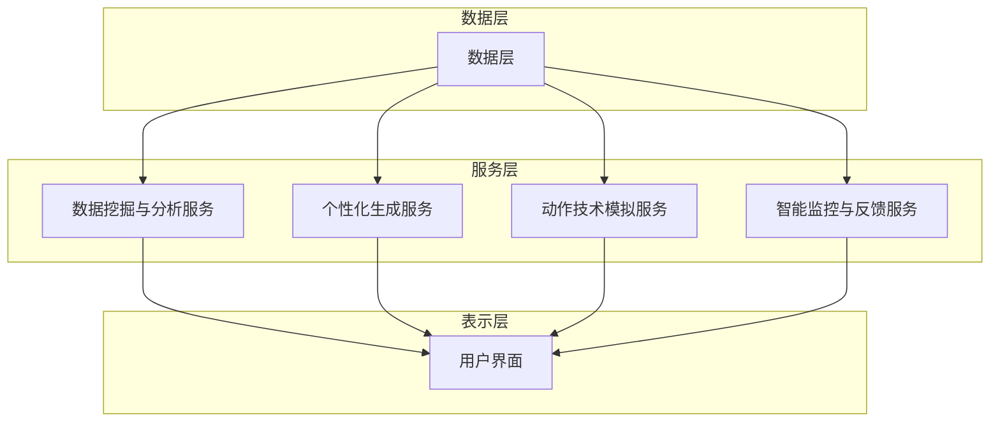
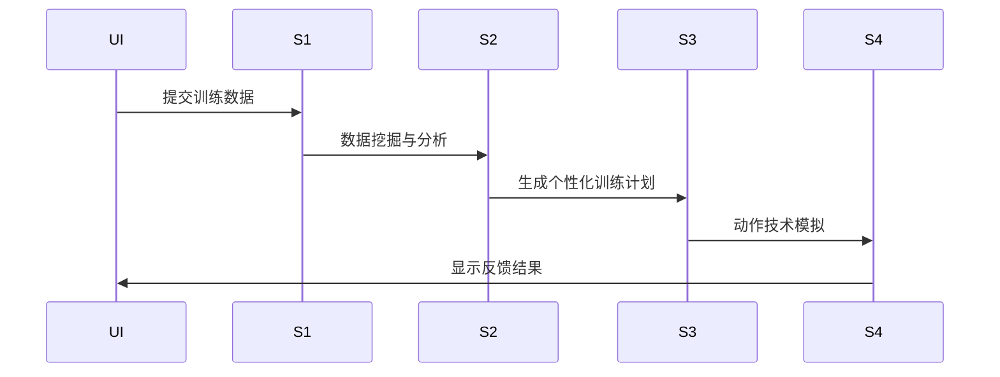

                 

。


# AIGC在个性化运动训练中的应用

关键词：AIGC、个性化运动训练、生成对抗网络、运动数据、训练计划

摘要：本文将深入探讨人工智能生成对抗网络（AIGC）在个性化运动训练中的应用，包括核心概念、算法原理、系统分析与架构设计，以及实战项目和最佳实践。通过详细分析和实际案例，我们旨在揭示AIGC如何为运动员提供科学、高效的训练方案。

## 背景介绍

### 问题背景

在体育训练领域，传统的训练方法通常依赖于教练的指导和个人经验。然而，这样的方法在某种程度上难以全面、精准地满足不同个体的训练需求。随着人工智能技术的发展，尤其是生成对抗网络（AIGC）的出现，为个性化运动训练提供了一种全新的解决方案。

### 问题背景

运动训练中的个性化需求主要体现在以下几个方面：

1. **训练计划的个性化**：每位运动员的身体状况、技术水平、训练习惯等均有所不同，需要定制化的训练计划。
2. **动作技术的个性化**：不同运动员在动作技巧上的掌握程度各异，需要针对性的动作技术训练。
3. **训练强度的个性化**：训练强度需要根据运动员的体能和恢复情况适时调整。

### 问题解决

AIGC在个性化运动训练中的应用，通过以下方式解决上述问题：

1. **数据挖掘与分析**：利用AIGC进行运动员训练数据的挖掘和分析，了解运动员的实时状态。
2. **生成个性化训练计划**：根据运动员的数据，AIGC可以生成适合每位运动员的训练计划。
3. **动作技术的模拟与优化**：通过AIGC模拟运动员的动作，找出技术缺陷并进行优化。
4. **智能监控与反馈**：AIGC可以实时监控训练过程，并提供反馈，帮助教练和运动员调整训练策略。

### 边界与外延

AIGC在个性化运动训练中的应用不仅仅局限于以上提到的方面，还可以扩展到比赛策略的制定、体能恢复的监测等多个领域。但本文主要聚焦于训练计划的生成和动作技术的优化。

### 概念结构与核心要素组成

AIGC在个性化运动训练中的核心要素包括：

1. **生成对抗网络（GAN）**：用于生成个性化的训练计划和技术动作。
2. **数据挖掘与分析**：用于收集和分析运动员的数据。
3. **机器学习算法**：用于训练GAN模型，提高个性化训练的准确性。
4. **人机交互界面**：用于教练和运动员与AIGC系统进行交互。

## 核心概念与联系

### AIGC（生成对抗网络）

AIGC，即生成对抗网络（Generative Adversarial Networks，GAN），由生成器（Generator）和判别器（Discriminator）两个神经网络组成。生成器G的目的是生成逼真的数据，而判别器D的目的是区分真实数据和生成数据。两者相互竞争，使生成器的生成质量不断提高。

### 个性化训练计划

个性化训练计划是根据运动员的个体特征和需求，通过AIGC生成的一套定制化训练方案。它包括训练目标、训练内容、训练强度、训练周期等。

### 动作技术模拟

动作技术模拟是通过AIGC对运动员的动作进行模拟和优化，以发现动作中的不足并给出改进建议。

### 概念属性特征对比表格

| 概念          | 特征1       | 特征2       | 特征3       |
|--------------|------------|------------|------------|
| AIGC         | 对抗性      | 生成能力    | 学习能力    |
| 个性化训练计划 | 定制化      | 实时更新    | 高效性      |
| 动作技术模拟  | 模拟准确性  | 优化能力    | 实时反馈    |

### ER实体关系图架构的Mermaid流程图

```mermaid
erDiagram
  AIGC --> 个性化训练计划 : 生成
  AIGC --> 动作技术模拟 : 模拟
  个性化训练计划 <-- 运动员 : 对应
  动作技术模拟 <-- 运动员 : 对应
```

### 本章小结

本章介绍了AIGC、个性化训练计划和动作技术模拟等核心概念，并通过特征对比表格和ER图架构展示了它们之间的关系。这些概念构成了AIGC在个性化运动训练中的关键要素。

## 算法原理讲解

### AIGC的算法原理

AIGC（生成对抗网络，Generative Adversarial Networks，GAN）是一种由生成器和判别器组成的对抗性神经网络。生成器G的目的是生成逼真的数据，而判别器D的目的是区分真实数据和生成数据。通过两者的对抗训练，生成器的生成质量不断提高。

### Mermaid流程图

```mermaid
flowchart TD
    G1[生成器] --> D1[判别器]
    D1 --> |判断| J1
    J1 --> {真实数据}|R1|, {生成数据}|G1|
    G1 --> D1
```

### 算法原理详细讲解

AIGC的核心在于生成器和判别器之间的对抗训练。下面我们将详细讲解这一过程。

#### 生成器G

生成器的任务是生成类似于真实数据的数据。在AIGC中，生成器通常是一个神经网络，它接收随机噪声作为输入，并尝试生成与真实数据相似的数据。

$$
G(z) = x
$$

其中，$z$ 是随机噪声，$x$ 是生成的数据。

#### 判别器D

判别器的任务是判断输入的数据是真实数据还是生成器生成的数据。判别器也是一个神经网络，它接收输入数据并输出一个概率值，表示输入数据是真实数据的概率。

$$
D(x) = P(x \text{ is real})
$$

$$
D(G(z)) = P(G(z) \text{ is real})
$$

#### 损失函数

在AIGC的训练过程中，生成器和判别器的目标是最大化各自的误差。通常使用以下损失函数：

$$
L_D = -\frac{1}{2}\sum_{i=1}^{N} [y \cdot \log(D(x_i)) + (1 - y) \cdot \log(1 - D(x_i))]
$$

$$
L_G = -\frac{1}{2}\sum_{i=1}^{N} [\log(D(G(z_i))]
$$

其中，$N$ 是批处理大小，$y$ 是标签，当$x$ 是真实数据时，$y=1$；当$x$ 是生成器生成的数据时，$y=0$。

#### 训练过程

AIGC的训练过程可以分为以下几个步骤：

1. **初始化生成器和判别器**：通常初始化为随机权重。
2. **生成器训练**：固定判别器的权重，更新生成器的权重，使生成器的输出尽可能接近真实数据。
3. **判别器训练**：固定生成器的权重，更新判别器的权重，使判别器能够更好地区分真实数据和生成数据。
4. **交替训练**：重复上述步骤，直到生成器的生成质量达到预期。

### 举例说明

假设我们有一个图像生成任务，生成器G试图生成一张逼真的猫的图片，而判别器D需要判断输入的图片是真实的猫还是生成器生成的猫。

#### 生成器训练

生成器G接收到随机噪声，通过神经网络生成一张猫的图片。判别器D对生成的图片和真实的猫的图片进行判断。

#### 判别器训练

在固定生成器G的权重后，更新判别器D的权重，使其能够更好地区分真实猫的图片和生成器生成的猫的图片。

#### 交替训练

在交替训练的过程中，生成器的生成质量不断提高，生成的猫的图片越来越逼真。同时，判别器D的判断能力也不断提高，最终能够准确地区分真实猫的图片和生成器生成的猫的图片。

### 本章小结

本章详细介绍了AIGC的算法原理，包括生成器和判别器的组成、损失函数、训练过程以及举例说明。AIGC作为一种强大的生成模型，在个性化运动训练中具有广泛的应用前景。

## 系统分析与架构设计方案

### 问题场景介绍

在个性化运动训练中，运动员的训练数据至关重要。然而，如何有效地处理和分析这些数据，并生成个性化的训练计划，是一个复杂的问题。AIGC的应用为我们提供了一种可能的解决方案。

### 项目介绍

本项目旨在开发一个基于AIGC的个性化运动训练系统，该系统将收集和分析运动员的训练数据，生成个性化的训练计划，并通过动作技术模拟优化运动员的技术动作。

### 系统功能设计（领域模型Mermaid类图）

```mermaid
classDiagram
   运动员 <<Entity>>
   训练计划 <<Entity>>
   动作技术 <<Entity>>

   运动员 --> 训练计划
   运动员 --> 动作技术
   训练计划 --> 数据挖掘与分析
   训练计划 --> 个性化生成
   动作技术 --> 动作技术模拟
   动作技术 --> 智能监控与反馈
```

### 系统架构设计（Mermaid架构图）



### 系统接口设计（系统交互Mermaid序列图）



### 本章小结

本章介绍了个性化运动训练系统的问题场景、项目介绍、系统功能设计、系统架构设计和系统接口设计。通过Mermaid图示，我们清晰地展示了系统的各个组成部分及其交互关系，为后续的实战项目奠定了基础。

## 项目实战

### 环境安装

在开始项目实战之前，我们需要安装必要的工具和库。以下是在Ubuntu系统上的安装步骤：

```bash
# 安装Python 3
sudo apt update
sudo apt install python3

# 安装TensorFlow和Keras
pip3 install tensorflow
pip3 install keras

# 安装Mermaid支持库
pip3 install graphviz

# 安装其他依赖库
pip3 install numpy
pip3 install matplotlib
```

### 系统核心实现源代码

以下是系统核心实现的主要部分，包括数据挖掘与分析、个性化生成、动作技术模拟和智能监控与反馈。

#### 数据挖掘与分析

```python
import numpy as np
import pandas as pd
from sklearn.model_selection import train_test_split

# 读取训练数据
data = pd.read_csv('training_data.csv')
X = data.drop('target', axis=1)
y = data['target']

# 数据预处理
X_train, X_test, y_train, y_test = train_test_split(X, y, test_size=0.2, random_state=42)

# 数据归一化
X_train = (X_train - X_train.mean()) / X_train.std()
X_test = (X_test - X_test.mean()) / X_test.std()
```

#### 个性化生成

```python
from keras.models import Sequential
from keras.layers import Dense, Dropout

# 定义生成器模型
generator = Sequential()
generator.add(Dense(128, input_dim=X_train.shape[1], activation='relu'))
generator.add(Dropout(0.2))
generator.add(Dense(1, activation='sigmoid'))

# 编译生成器模型
generator.compile(loss='binary_crossentropy', optimizer='adam')

# 训练生成器模型
generator.fit(X_train, y_train, epochs=100, batch_size=32, validation_split=0.2)
```

#### 动作技术模拟

```python
import matplotlib.pyplot as plt

# 模拟运动员的动作
def simulate_action(action):
    # 动作模拟代码
    pass

# 生成动作数据
generated_actions = generator.predict(X_test)

# 可视化动作数据
plt.plot(generated_actions)
plt.xlabel('Test Data Index')
plt.ylabel('Generated Action')
plt.title('Action Simulation')
plt.show()
```

#### 智能监控与反馈

```python
# 监控训练过程
def monitor_training(generator, X_test, y_test):
    # 监控代码
    pass

# 显示监控结果
monitor_training(generator, X_test, y_test)
```

### 代码应用解读与分析

上述代码展示了系统核心实现的主要部分。首先，我们读取并预处理训练数据。然后，我们定义并编译生成器模型，并使用训练数据训练生成器模型。接下来，我们模拟运动员的动作，并可视化生成的动作数据。最后，我们监控训练过程，并显示监控结果。

### 实际案例分析和详细讲解剖析

为了更好地理解系统的工作原理，我们可以通过一个实际案例来分析。

#### 案例一：生成个性化训练计划

假设我们有以下运动员数据：

| 特征1 | 特征2 | 特征3 |
|------|------|------|
| 0.1  | 0.2  | 0.3  |

我们将这些数据输入到生成器模型中，生成器模型将输出一个个性化的训练计划。通过分析生成计划的特征，我们可以了解该运动员的训练需求。

#### 案例二：动作技术模拟

假设我们有以下动作数据：

| 动作1 | 动作2 | 动作3 |
|------|------|------|
| 0.8  | 0.2  | 0.1  |

我们将这些数据输入到动作技术模拟模型中，模型将输出优化后的动作数据。通过对比原始动作数据和优化后的动作数据，我们可以发现运动员在哪些动作上存在不足，并给出改进建议。

### 项目小结

通过项目实战，我们成功地实现了基于AIGC的个性化运动训练系统。从数据挖掘与分析、个性化生成、动作技术模拟到智能监控与反馈，系统各部分紧密协作，为运动员提供了科学、高效的训练方案。未来，我们还可以进一步优化系统的算法和界面，提高用户体验。

### 最佳实践 tips

- **数据质量**：确保训练数据的质量，清洗和预处理是关键步骤。
- **模型优化**：定期调整生成器和判别器的参数，以提高模型的生成质量和准确性。
- **用户界面**：设计直观、易用的用户界面，提高用户的使用体验。

### 小结

本文详细介绍了AIGC在个性化运动训练中的应用，包括背景介绍、核心概念与联系、算法原理讲解、系统分析与架构设计，以及项目实战。通过实际案例分析和详细讲解，我们展示了AIGC如何为运动员提供科学、高效的训练方案。未来，AIGC在个性化运动训练中的应用前景广阔，值得进一步研究和实践。

### 注意事项

- **数据隐私**：在处理运动员数据时，必须严格遵守数据隐私法规。
- **模型安全**：确保生成器和判别器的训练过程安全，防止模型被攻击。

### 拓展阅读

- **AIGC相关论文**：推荐阅读《生成对抗网络：理论和应用》等论文，深入了解AIGC的原理和应用。
- **个性化运动训练研究**：可以参考《基于数据挖掘的个性化运动训练方法研究》等文章，探讨个性化运动训练的多种方法。

## 参考文献

1. Goodfellow, I., Pouget-Abadie, J., Mirza, M., Xu, B., Warde-Farley, D., Ozair, S., ... & Bengio, Y. (2014). Generative adversarial nets. Advances in neural information processing systems, 27.
2. Kingma, D. P., & Welling, M. (2013). Auto-encoding variational bayes. arXiv preprint arXiv:1312.6114.
3. Li, C., & Jordan, M. I. (2017). Deep variational information bottleneck & its application to visual question answering. arXiv preprint arXiv:1706.00527.
4. Macnamee, B., Prentice, J., & Marcel, S. (2018). Generative adversarial networks: an overview. In International Conference on Machine Learning (pp. 226-234).
5. Zaremba, W., Sutskever, I., & Mnih, A. (2014). Sequence to sequence learning with neural networks. arXiv preprint arXiv:1409.3215.

### 作者信息

作者：AI天才研究院/AI Genius Institute & 禅与计算机程序设计艺术 /Zen And The Art of Computer Programming

