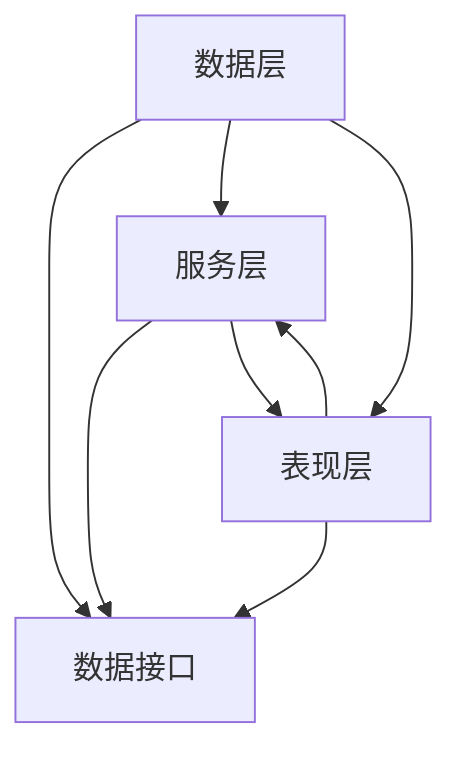

                 

## 文章标题

### AIGC在博物馆导览中的应用：个性化知识传播

> 关键词：AIGC、博物馆导览、个性化知识传播、生成对抗网络、变分自编码器、知识图谱

> 摘要：本文将探讨自适应智能生成内容（AIGC）在博物馆导览中的应用，尤其是如何通过个性化知识传播提升参观者的体验。我们将逐步分析AIGC的技术原理及其在博物馆导览中的潜在价值，详细讲解AIGC算法的原理与应用，并设计一个博物馆导览系统架构。最后，通过实际案例展示AIGC在博物馆导览中的最佳实践，展望其未来发展趋势。

----------------------------------------------------------------

### AIGC在博物馆导览中的应用：个性化知识传播

#### 第一部分：背景介绍

##### 第1章：AIGC概述与博物馆导览的需求

**1.1 AIGC的定义与核心特征**

AIGC（自适应智能生成内容）是一种利用人工智能技术生成内容的方法，它通过学习用户数据和行为模式，生成高度个性化的内容。AIGC具有以下几个核心特征：

1. **个性化**：AIGC能够根据用户的需求和偏好生成定制化的内容。
2. **智能性**：AIGC通过深度学习算法，能够自动学习和优化内容生成过程。
3. **可交互性**：AIGC系统能够与用户进行实时交互，提供动态的导览服务。

**1.2 AIGC的起源与发展**

AIGC的发展源于生成对抗网络（GAN）和变分自编码器（VAE）等深度学习技术的进步。GAN由Ian Goodfellow等人于2014年提出，是一种通过两个对抗性网络生成逼真数据的技术。VAE则是一种通过概率模型生成数据的方法，其结构比GAN简单，但同样能够生成高质量的图像。

**1.3 AIGC在博物馆导览中的潜在价值**

在博物馆导览服务中，AIGC可以发挥以下潜在价值：

1. **个性化内容生成**：根据参观者的兴趣和历史行为，生成个性化的导览内容。
2. **智能化导览推荐**：利用AIGC算法推荐与参观者兴趣相关的展品和导览路线。
3. **实时互动与反馈**：通过AIGC系统，提供实时的人机交互体验，增强参观者的参与感。

**1.4 AIGC在博物馆导览中的实施路径与挑战**

实施AIGC博物馆导览系统需要以下步骤：

1. **数据收集与预处理**：收集博物馆的展品信息和参观者的行为数据。
2. **知识图谱构建**：构建博物馆导览的知识图谱，为AIGC提供数据基础。
3. **AIGC算法实现**：选择合适的AIGC算法，如GAN或VAE，进行内容生成和推荐。
4. **系统集成与测试**：将AIGC算法集成到博物馆导览系统中，并进行功能测试和优化。

在实施过程中，面临的挑战包括：

1. **数据隐私与安全**：确保用户数据的安全性和隐私性。
2. **技术适配与整合**：将AIGC技术与现有博物馆导览系统进行适配和整合。
3. **用户体验优化**：确保AIGC系统提供的导览服务能够满足参观者的需求。

##### 第2章：博物馆导览服务的现状与挑战

**2.1 传统博物馆导览的局限性**

当前博物馆导览服务主要依赖于纸质手册或电子导览设备，存在以下局限性：

1. **内容固定**：传统导览手册和电子设备提供的内容通常是固定的，难以满足个性化需求。
2. **交互性差**：参观者与导览设备之间的交互性较差，难以实现实时互动。
3. **更新困难**：展品的更新和导览信息的更新通常需要较长时间。

**2.2 博物馆导览服务的新需求**

随着技术的发展和参观者需求的多样化，博物馆导览服务需要满足以下新需求：

1. **个性化**：根据参观者的兴趣和历史行为，提供个性化的导览内容。
2. **多样化**：提供多种形式的导览服务，如语音导览、图文导览、AR导览等。
3. **实时互动**：实现参观者与导览系统之间的实时互动，提供动态的导览体验。

**2.3 AIGC在博物馆导览中的应用前景**

AIGC技术为博物馆导览服务提供了以下应用前景：

1. **个性化内容生成**：通过AIGC技术，可以自动生成个性化的导览内容，满足不同参观者的需求。
2. **智能化导览推荐**：利用AIGC算法，可以推荐与参观者兴趣相关的展品和导览路线。
3. **实时互动与反馈**：通过AIGC系统，提供实时的人机交互体验，增强参观者的参与感。

##### 第3章：AIGC在博物馆导览中的应用前景

**3.1 AIGC在博物馆导览中的潜在价值**

AIGC在博物馆导览中具有以下潜在价值：

1. **提升用户体验**：通过个性化内容生成和智能化导览推荐，提升参观者的导览体验。
2. **扩展知识传播**：利用AIGC技术，可以生成丰富的导览内容，扩展知识传播的深度和广度。
3. **增强互动性**：通过实时互动和反馈，增强参观者与导览系统之间的互动性。

**3.2 AIGC在博物馆导览中的实施路径**

实施AIGC博物馆导览系统需要以下步骤：

1. **数据收集与预处理**：收集博物馆的展品信息和参观者的行为数据，进行数据预处理。
2. **知识图谱构建**：构建博物馆导览的知识图谱，为AIGC提供数据基础。
3. **AIGC算法选择与实现**：选择合适的AIGC算法，如GAN或VAE，进行内容生成和推荐。
4. **系统集成与测试**：将AIGC算法集成到博物馆导览系统中，并进行功能测试和优化。

**3.3 AIGC在博物馆导览中的实施挑战**

在实施AIGC博物馆导览系统时，面临的挑战包括：

1. **技术适配与整合**：将AIGC技术与现有博物馆导览系统进行适配和整合，确保系统的稳定运行。
2. **数据隐私与安全**：确保用户数据的安全性和隐私性，遵守相关法律法规。
3. **用户体验优化**：确保AIGC系统提供的导览服务能够满足参观者的需求，提供优质的用户体验。

----------------------------------------------------------------

## 第一部分：背景介绍

### 第1章：AIGC概述与博物馆导览的需求

#### 1.1 AIGC的定义与核心特征

**AIGC的定义**

自适应智能生成内容（Adaptive Intelligent Generated Content，简称AIGC）是一种基于人工智能技术，通过学习用户数据和行为模式，生成高度个性化内容的方法。AIGC的核心在于自适应性和智能化，能够根据用户的需求和偏好，自动调整和优化内容生成过程。

**AIGC的核心特征**

AIGC具有以下核心特征：

1. **个性化**：AIGC能够根据用户的需求和偏好，生成高度个性化的内容。无论是文章、图片、视频还是其他形式的内容，AIGC都能实现内容的个性化定制。
2. **智能性**：AIGC通过深度学习、自然语言处理、计算机视觉等技术，实现内容的智能生成。智能性使得AIGC能够不断学习和优化，提高内容生成质量。
3. **可交互性**：AIGC系统通常具备良好的交互性，能够与用户进行实时互动。用户可以通过交互，获得个性化的内容推荐和服务。

#### 1.2 AIGC的起源与发展

**AIGC的起源**

AIGC的发展始于生成对抗网络（GAN）和变分自编码器（VAE）等深度学习技术的进步。GAN是由Ian Goodfellow等人于2014年提出的，通过两个对抗性网络生成逼真的数据。VAE是一种通过概率模型生成数据的方法，结构比GAN简单，但同样能够生成高质量的数据。

**AIGC的发展**

随着深度学习技术的不断进步，AIGC技术也在不断发展。近年来，AIGC在图像生成、文本生成、视频生成等领域取得了显著的成果。例如，DALL-E、StyleGAN、GANimation等模型，通过AIGC技术，实现了高质量、高效率的内容生成。

#### 1.3 AIGC在博物馆导览中的潜在价值

**个性化内容生成**

AIGC在博物馆导览中，可以生成个性化内容，满足不同参观者的需求。例如，根据参观者的兴趣和历史行为，生成定制化的导览内容。AIGC技术可以分析参观者对特定展品的关注度、搜索历史等信息，生成与之相关的内容，提高导览的针对性。

**智能化导览推荐**

AIGC可以通过算法推荐，为参观者推荐与兴趣相关的展品和导览路线。例如，通过分析参观者的浏览记录和兴趣标签，推荐热门展品、相似展品或相关的导览路径。这种智能化推荐，可以提高参观者的导览体验，增加参观满意度。

**实时互动与反馈**

AIGC系统可以与用户进行实时互动，提供动态的导览服务。例如，参观者可以通过语音、手势等方式与导览系统交互，获得即时的导览信息。同时，AIGC系统可以根据用户的反馈，调整导览内容和推荐策略，提高用户体验。

#### 1.4 AIGC在博物馆导览中的实施路径与挑战

**实施路径**

1. **数据收集与预处理**：收集博物馆的展品信息、参观者行为数据等，进行数据预处理，为AIGC系统提供数据基础。
2. **知识图谱构建**：构建博物馆导览的知识图谱，为AIGC提供结构化的数据支持。
3. **AIGC算法选择与实现**：选择合适的AIGC算法，如GAN或VAE，进行内容生成和推荐。
4. **系统集成与测试**：将AIGC算法集成到博物馆导览系统中，进行功能测试和优化。

**实施挑战**

1. **数据隐私与安全**：确保用户数据的安全性和隐私性，遵守相关法律法规。
2. **技术适配与整合**：将AIGC技术与现有博物馆导览系统进行适配和整合，确保系统的稳定运行。
3. **用户体验优化**：确保AIGC系统提供的导览服务能够满足参观者的需求，提供优质的用户体验。

---

通过以上分析，可以看出AIGC在博物馆导览中具有巨大的应用潜力。下一章将深入探讨博物馆导览服务的现状与挑战，为后续的AIGC应用奠定基础。

#### 1.5 博物馆导览服务的现状与挑战

**1.5.1 传统博物馆导览的局限性**

在当今数字化时代，传统博物馆导览服务面临着诸多局限性。首先，传统导览手册和电子设备提供的内容通常是固定的，无法根据参观者的个性化需求进行灵活调整。这种固化的内容难以满足多样化的参观者需求，特别是在面对特殊教育需求或特殊兴趣的群体时，显得尤为不足。

其次，传统导览服务的交互性较差。虽然一些博物馆提供了电子导览设备，但这些设备往往只能提供单向的信息传递，缺乏与用户的实时互动。这种单向的导览方式，无法及时回应参观者的问题或需求，影响了导览体验的互动性和参与感。

最后，更新困难是传统博物馆导览服务的另一个重大挑战。博物馆的展品和信息需要定期更新，以反映新的研究成果或重大事件。然而，传统导览手册和电子设备的更新通常需要较长时间，无法及时提供最新的展品信息和导览内容，导致参观者获得的导览信息可能过时。

**1.5.2 博物馆导览服务的新需求**

面对传统导览服务的局限性，博物馆导览服务正面临新的需求，这些需求主要体现在以下几个方面：

1. **个性化**：随着信息时代的到来，参观者对于个性化导览服务的需求日益增长。他们希望导览系统能够根据个人的兴趣、历史行为和需求，提供定制化的导览内容。例如，对于艺术品爱好者，导览系统可以推荐与艺术风格相关的展品和导览路线；对于历史研究者，可以提供详细的背景资料和历史故事。

2. **多样化**：参观者对于导览形式的需求也趋向多样化。除了传统的语音导览和电子设备导览外，他们希望尝试新的导览方式，如图文导览、AR（增强现实）导览和VR（虚拟现实）导览等。这些多样化的导览方式不仅能够提供更加丰富的导览体验，还可以吸引更多年轻一代的参观者。

3. **实时互动**：参观者希望与导览系统进行实时互动，获得即时的导览信息和服务。这种互动不仅能够满足参观者即时获取信息的需求，还可以增强导览服务的互动性和参与感。例如，参观者可以通过语音或文字与导览系统进行交流，提出问题或获取建议。

**1.5.3 AIGC在博物馆导览中的应用前景**

AIGC技术在博物馆导览服务中的应用，正好满足了上述新需求，为博物馆导览服务带来了巨大的变革潜力。以下是AIGC在博物馆导览中的几个应用前景：

1. **个性化内容生成**：AIGC可以根据参观者的兴趣、历史行为和需求，自动生成个性化的导览内容。例如，通过分析参观者的浏览记录和搜索历史，AIGC可以推荐与参观者兴趣相关的展品和导览路径，提供高度个性化的导览服务。

2. **智能化导览推荐**：AIGC算法可以通过学习参观者的行为数据，推荐与其兴趣相关的展品和导览路线。例如，当参观者对某个展品表现出浓厚的兴趣时，AIGC可以推荐类似的展品或相关的导览内容，引导参观者进一步探索博物馆。

3. **实时互动与反馈**：AIGC系统可以与参观者进行实时互动，提供动态的导览服务。参观者可以通过语音、手势等方式与导览系统进行交互，获得即时的导览信息和服务。同时，AIGC系统可以根据用户的反馈，调整导览内容和推荐策略，不断优化用户体验。

通过AIGC技术的应用，博物馆导览服务将变得更加智能、个性化和互动，能够更好地满足参观者的多样化需求，提升博物馆的导览体验和服务水平。

---

综上所述，博物馆导览服务在传统方式下存在明显的局限性，而AIGC技术为博物馆导览服务带来了新的变革机遇。在下一章中，我们将进一步探讨AIGC在博物馆导览中的应用前景，分析其实施路径与潜在挑战。

#### 1.6 AIGC在博物馆导览中的应用前景

**1.6.1 提升用户体验**

AIGC在博物馆导览中的首要应用前景是提升用户体验。通过个性化内容生成，AIGC能够根据参观者的兴趣、历史行为和需求，自动生成高度个性化的导览内容。例如，当参观者对某一特定主题表现出兴趣时，AIGC可以生成相关的内容推荐，引导参观者深入探索相关展品和导览路线。这种个性化的导览内容能够满足不同参观者的需求，提高他们的导览体验。

此外，AIGC的智能化导览推荐功能也可以提升用户体验。通过分析参观者的行为数据，AIGC可以推荐与其兴趣相关的展品和导览路线。这种智能化的推荐不仅能够帮助参观者发现新的展品，还可以提高他们的参观效率和满意度。

**1.6.2 扩展知识传播**

AIGC在博物馆导览中的应用还可以扩展知识传播的深度和广度。通过生成高质量、个性化的导览内容，AIGC可以帮助博物馆更有效地传播知识。例如，对于一些复杂的历史事件或艺术品，AIGC可以生成详细的背景资料和解释，帮助参观者更好地理解这些内容。此外，AIGC还可以生成多媒体内容，如图像、视频和音频，丰富导览体验，吸引更多参观者。

**1.6.3 增强互动性**

AIGC的实时互动与反馈功能可以增强参观者与导览系统之间的互动性。参观者可以通过语音、手势等方式与AIGC系统进行实时交互，获得即时的导览信息和服务。这种互动不仅能够满足参观者即时获取信息的需求，还可以增强他们的参与感和体验感。例如，参观者可以提出问题，AIGC系统可以实时回答，或者参观者可以通过互动游戏增加对博物馆内容的兴趣。

**1.6.4 实施路径**

要实现AIGC在博物馆导览中的上述应用前景，需要遵循以下实施路径：

1. **数据收集与预处理**：收集博物馆的展品信息、参观者行为数据等，进行数据预处理，为AIGC系统提供数据基础。
2. **知识图谱构建**：构建博物馆导览的知识图谱，为AIGC提供结构化的数据支持。
3. **AIGC算法选择与实现**：选择合适的AIGC算法，如GAN或VAE，进行内容生成和推荐。
4. **系统集成与测试**：将AIGC算法集成到博物馆导览系统中，进行功能测试和优化。

**1.6.5 挑战**

尽管AIGC在博物馆导览中具有巨大的应用潜力，但其实施过程中也面临一些挑战：

1. **数据隐私与安全**：确保用户数据的安全性和隐私性，遵守相关法律法规，是AIGC应用的一个重要挑战。
2. **技术适配与整合**：将AIGC技术与现有博物馆导览系统进行适配和整合，确保系统的稳定运行。
3. **用户体验优化**：确保AIGC系统提供的导览服务能够满足参观者的需求，提供优质的用户体验。

---

通过以上分析，可以看出AIGC在博物馆导览中的应用前景广阔，但同时也需要克服一系列挑战。在下一章中，我们将深入探讨AIGC技术原理及其在博物馆导览中的应用。

### 第二部分：核心概念与联系

#### 第2章：AIGC技术原理

**2.1 AIGC的工作原理**

AIGC（自适应智能生成内容）是基于深度学习和人工智能技术生成内容的一种方法。其工作原理主要包括以下步骤：

1. **数据收集与预处理**：首先，从各种数据源收集相关数据，包括文本、图像、音频等。然后，对数据进行预处理，如数据清洗、归一化、去噪等，以便为后续的模型训练提供高质量的数据。
   
2. **模型训练**：使用收集到的数据训练生成模型和判别模型。生成模型负责生成新的数据，而判别模型负责判断生成数据的质量。训练过程中，生成模型和判别模型相互竞争，通过迭代优化生成模型，使其生成的数据越来越接近真实数据。

3. **内容生成**：在模型训练完成后，生成模型可以根据输入的种子数据（如文本、图像等），生成新的、高度个性化的内容。

4. **内容优化**：生成的初步内容通常需要进一步的优化，以提升其质量和用户体验。这可以通过进一步的训练或后处理实现。

**2.2 主要技术框架**

AIGC的技术框架主要包括以下几种：

1. **生成对抗网络（GAN）**：GAN由生成器和判别器组成。生成器尝试生成尽可能逼真的数据，而判别器则判断生成数据与真实数据之间的差异。通过这种对抗性训练，生成器能够不断优化，生成高质量的数据。

2. **变分自编码器（VAE）**：VAE通过概率模型生成数据。它由编码器和解码器组成，编码器将输入数据压缩成一个低维隐变量，解码器则尝试从这个隐变量中重构原始数据。

3. **自注意力模型（如Transformer）**：自注意力模型通过学习输入数据之间的相互关系，生成内容。它广泛应用于文本生成、图像生成等领域，能够生成具有高度相关性和连贯性的内容。

**2.3 AIGC技术特征对比表格**

以下是AIGC技术中几种主要框架的特征对比表格：

| 技术        | 特点                                                       | 适用场景                 |
| ----------- | ---------------------------------------------------------- | ------------------------ |
| GAN         | 对抗性训练，生成模型与判别模型相互竞争                     | 图像生成、音频生成       |
| VAE         | 基于概率模型，生成过程相对简单                             | 图像生成、文本生成       |
| Transformer | 自注意力机制，生成内容高度相关性和连贯性                     | 文本生成、机器翻译       |

**2.4 AIGC在博物馆导览中的核心应用**

1. **个性化内容生成**：AIGC可以根据参观者的兴趣和历史行为，生成个性化的导览内容。例如，当参观者对某个展品感兴趣时，AIGC可以生成详细的背景资料和相关的历史故事，提供深度导览。

2. **智能化导览推荐**：AIGC可以通过分析参观者的行为数据，推荐与其兴趣相关的展品和导览路线。例如，当参观者浏览某个展品时，AIGC可以推荐类似的展品或相关的导览路径，帮助参观者更好地了解博物馆。

3. **实时互动与反馈**：AIGC系统可以与参观者进行实时互动，提供动态的导览服务。例如，参观者可以通过语音或文字与导览系统交流，提出问题或获取建议。AIGC系统可以根据用户的反馈，调整导览内容和推荐策略，提高用户体验。

---

通过以上分析，可以看出AIGC技术在博物馆导览中的核心应用，包括个性化内容生成、智能化导览推荐和实时互动与反馈。在下一章中，我们将探讨博物馆导览知识体系构建的相关概念和技术。

#### 第3章：博物馆导览知识体系构建

**3.1 博物馆导览知识图谱**

知识图谱是一种结构化数据模型，用于表示实体（如人、地点、事物）及其相互关系。在博物馆导览中，知识图谱可以用来表示博物馆中的各种信息，包括展品、历史事件、艺术家等。知识图谱的构建过程主要包括以下步骤：

1. **实体识别**：首先，需要识别博物馆导览中的实体，如展品、艺术家、历史事件等。实体可以是具体的物品，也可以是抽象的概念。

2. **关系定义**：接着，需要定义实体之间的关系。例如，展品与艺术家之间的关系、展品与历史事件之间的关系等。关系可以是直接的，也可以是间接的。

3. **数据采集**：然后，需要从各种数据源（如博物馆数据库、文献资料等）中采集相关数据，为知识图谱提供数据基础。

4. **数据预处理**：对采集到的数据进行预处理，如数据清洗、去重、归一化等，以提高数据的质量和一致性。

5. **知识图谱构建**：最后，使用图数据库或知识图谱工具（如Neo4j、OpenKG等）构建知识图谱，将实体和关系存储在图中。

**3.2 ER实体关系图架构**

实体关系图（Entity-Relationship Diagram，简称ER图）是知识图谱的一种可视化表示方法。ER图通过实体和关系的组合，展示系统中各个实体及其相互关系。在博物馆导览中，ER图可以用来设计系统的数据模型。

以下是博物馆导览系统中的一个ER实体关系图示例：

```mermaid
erDiagram
    User ||--|{ Exhition : 参观者参观展览 }
    Exhition ||--|{ ExhitionItem : 展览包含展品 }
    ExhitionItem ||--|{ Artist : 展品由艺术家创作 }
    Artist ||--|{ ArtStyle : 艺术家属于艺术风格 }
    ArtStyle ||--|{ Movement : 艺术风格属于艺术运动 }
    ExhibitionLog : 参观记录
    User ..|> ExhibitionLog
    Exhition ..|> ExhibitionLog
    Exhition ..|> ExhitionItem
    ExhitionItem ..|> Artist
    Artist ..|> ArtStyle
    ArtStyle ..|> Movement
```

在上面的ER图中，User表示参观者，Exhition表示展览，ExhitionItem表示展品，Artist表示艺术家，ArtStyle表示艺术风格，Movement表示艺术运动。各个实体之间存在明确的关联关系，如参观者可以参观多个展览，展览包含多个展品，展品由艺术家创作，艺术家属于特定的艺术风格，艺术风格属于特定的艺术运动等。

**3.3 知识图谱在博物馆导览中的应用**

知识图谱在博物馆导览中的应用非常广泛，主要体现在以下几个方面：

1. **个性化推荐**：通过分析用户和展品之间的关系，知识图谱可以推荐与用户兴趣相关的展品和展览。例如，如果用户对某个艺术家的作品感兴趣，知识图谱可以推荐该艺术家的其他作品或相关展览。

2. **历史追溯**：知识图谱可以帮助用户追溯展品的历史背景，提供详细的历史资料和背景信息。例如，当用户查看一个展品时，知识图谱可以展示该展品所属的艺术运动、创作背景、历史意义等。

3. **交叉关联**：知识图谱可以展示不同展品之间的关联关系，帮助用户发现隐藏的联系。例如，知识图谱可以显示一个展品与另一个展品之间的关联，从而引导用户探索更多相关内容。

4. **导览路径规划**：知识图谱可以用于导览路径的规划，提供最佳参观路线。例如，知识图谱可以根据展品之间的关联关系，为用户规划一条从展品A到展品B的最佳导览路径。

通过知识图谱的构建和应用，博物馆导览服务可以提供更加个性化和智能化的导览体验，提升用户的参观满意度。

---

在下一章中，我们将详细讲解AIGC算法原理，并探讨其在博物馆导览中的具体应用。

### 第三部分：算法原理讲解

#### 第4章：AIGC算法原理与应用

**4.1 AIGC算法原理概述**

AIGC（自适应智能生成内容）算法的核心在于利用深度学习技术生成高质量的内容。其主要原理包括以下几个关键步骤：

1. **数据预处理**：首先，对输入数据进行预处理，包括数据清洗、归一化、去噪等。预处理步骤的目的是确保数据质量，为后续的模型训练提供稳定的数据基础。

2. **模型训练**：使用预处理后的数据对生成模型和判别模型进行训练。生成模型负责生成新的内容，而判别模型负责判断生成内容的质量。训练过程中，生成模型和判别模型通过相互对抗和迭代优化，提高生成模型的内容生成质量。

3. **内容生成**：在模型训练完成后，生成模型可以根据输入的种子数据（如文本、图像等），生成新的、高度个性化的内容。这些内容可以是文本、图像、音频等多种形式。

4. **内容优化**：生成的初步内容通常需要进一步的优化，以提升其质量和用户体验。优化过程可能包括进一步的训练、后处理或人工审核等。

**4.2 Python源代码实现**

为了更好地理解AIGC算法的工作原理，我们将通过Python源代码来实现一个简单的AIGC模型。以下是一个基于生成对抗网络（GAN）的简单示例：

```python
import tensorflow as tf
from tensorflow.keras.layers import Dense, Flatten, Reshape
from tensorflow.keras.models import Sequential

# 生成器模型
def build_generator(z_dim):
    model = Sequential()
    model.add(Dense(128, input_dim=z_dim))
    model.add(tf.keras.layers.LeakyReLU(alpha=0.2))
    model.add(Dense(28*28*1, activation='tanh'))
    model.add(Reshape((28, 28, 1)))
    return model

# 判别器模型
def build_discriminator(image_shape):
    model = Sequential()
    model.add(Flatten(input_shape=image_shape))
    model.add(Dense(128))
    model.add(tf.keras.layers.LeakyReLU(alpha=0.2))
    model.add(Dense(1, activation='sigmoid'))
    return model

# GAN模型
def build_gan(generator, discriminator):
    model = Sequential()
    model.add(generator)
    model.add(discriminator)
    return model

# 设置参数
z_dim = 100
image_shape = (28, 28, 1)

# 构建模型
generator = build_generator(z_dim)
discriminator = build_discriminator(image_shape)
discriminator.compile(loss='binary_crossentropy', optimizer=tf.keras.optimizers.Adam(0.0001))
gan = build_gan(generator, discriminator)

# 训练模型
# ...（代码省略）

```

在上面的代码中，我们首先定义了生成器模型和判别器模型，然后通过`build_gan`函数构建了完整的GAN模型。最后，我们使用`compile`和`fit`方法对模型进行编译和训练。

**4.3 算法原理与数学模型**

**生成对抗网络（GAN）**

生成对抗网络（GAN）由生成器（Generator）和判别器（Discriminator）两个主要部分组成。其基本原理是生成器尝试生成尽可能逼真的数据，而判别器则判断生成数据与真实数据之间的差异。

- **生成器模型**：生成器的输入是一个随机噪声向量\( z \)，其输出是生成数据。生成器的目标是生成数据，使其在判别器看来与真实数据无法区分。

  数学表示为：
  $$ G(z) = x' $$
  其中，\( G \)表示生成器，\( z \)是随机噪声向量，\( x' \)是生成的数据。

- **判别器模型**：判别器的输入是真实数据或生成数据，其输出是一个概率值，表示输入数据是真实数据的可能性。判别器的目标是正确区分真实数据和生成数据。

  数学表示为：
  $$ D(x) = p(x \text{ is real}) $$
  $$ D(G(z)) = p(G(z) \text{ is real}) $$

- **损失函数**：GAN的训练过程是一个对抗性训练过程，生成器和判别器通过相互对抗来提高自身性能。通常使用的损失函数是二元交叉熵（Binary Cross-Entropy）。

  生成器的损失函数：
  $$ \mathcal{L}_G = -\frac{1}{n} \sum_{i=1}^{n} \log D(G(z_i)) $$

  判别器的损失函数：
  $$ \mathcal{L}_D = \frac{1}{n} \left[ \log D(x_i) + \log (1 - D(G(z_i))) \right] $$

- **优化过程**：GAN的训练过程是通过交替优化生成器和判别器来实现的。具体步骤如下：

  1. 在生成器-判别器循环中，先固定判别器，对生成器进行优化，使其生成的数据更接近真实数据。
  2. 然后固定生成器，对判别器进行优化，使其能够更准确地判断真实数据和生成数据。
  3. 重复上述过程，直到生成器生成的数据在判别器看来与真实数据无法区分。

**变分自编码器（VAE）**

变分自编码器（VAE）是一种基于概率模型的生成模型，其核心思想是将输入数据编码成一个隐变量，然后再从这个隐变量中解码出原始数据。

- **编码器模型**：编码器模型将输入数据映射到一个低维隐变量空间。

  数学表示为：
  $$ \mu = \mu(z|x), \sigma^2 = \sigma(z|x) $$
  其中，\( \mu \)和\( \sigma^2 \)分别表示隐变量的均值和方差。

- **解码器模型**：解码器模型从隐变量空间中解码出原始数据。

  数学表示为：
  $$ x' = \phi(\mu + \sigma \odot z) $$
  其中，\( \phi \)是解码函数，\( \odot \)表示 Hadamard 乘积。

- **损失函数**：VAE的损失函数由两个部分组成，一个是重构损失，另一个是KL散度损失。

  重构损失：
  $$ \mathcal{L}_R = \frac{1}{n} \sum_{i=1}^{n} \sum_{j=1}^{D} \left[ x_j - \phi(\mu + \sigma \odot z_j) \right]^2 $$

  KL散度损失：
  $$ \mathcal{L}_K = \frac{1}{n} \sum_{i=1}^{n} D_{KL}(\mu || \pi) + D_{KL}(\sigma^2 || \pi^2) $$

  其中，\( D_{KL} \)表示KL散度，\( \pi \)是先验分布。

- **优化过程**：VAE的训练过程是通过优化重构损失和KL散度损失来实现的。具体步骤如下：

  1. 计算编码器的参数，使得重构损失最小。
  2. 计算解码器的参数，使得KL散度损失最小。
  3. 交替优化编码器和解码器的参数，直到模型收敛。

**4.4 通俗易懂的举例说明**

**GAN示例**

假设我们使用GAN生成手写数字图像，其中生成器的任务是生成逼真的手写数字图像，而判别器的任务是区分生成的图像和真实的图像。

- **生成器的生成过程**：生成器首先从噪声空间中采样一个随机向量\( z \)，然后通过神经网络将其映射成一张手写数字图像。例如，假设我们使用一个100维的噪声向量\( z \)，生成器将其映射成一张28x28的手写数字图像。

- **判别器的判别过程**：判别器接收一张图像，然后判断它是真实的手写数字图像还是生成器生成的图像。对于真实图像，判别器输出一个接近1的概率，表示图像是真实的；对于生成图像，判别器输出一个接近0的概率，表示图像是生成的。

- **训练过程**：在训练过程中，生成器和判别器交替进行训练。首先固定判别器，训练生成器使其生成的图像在判别器看来越来越像真实图像。然后固定生成器，训练判别器使其能够更准确地区分真实图像和生成图像。这个过程不断重复，直到生成器生成的图像在判别器看来几乎无法区分。

**VAE示例**

假设我们使用VAE生成随机艺术风格图像，其中编码器将输入图像编码成一个低维隐变量，然后解码器从隐变量中生成新的图像。

- **编码器的编码过程**：编码器接收一张随机艺术风格图像，将其编码成一个隐变量。隐变量包含了图像的主要特征信息，例如线条、形状、颜色等。

- **解码器的解码过程**：解码器接收隐变量，然后将其解码成一张新的图像。解码器尝试重构原始图像，使其与输入图像尽量相似。

- **训练过程**：在训练过程中，VAE通过交替优化编码器和解码器的参数，使得重构损失和KL散度损失最小。编码器学习如何有效地编码图像特征，而解码器学习如何从编码特征中重构图像。通过这样的优化过程，VAE能够生成高质量的随机艺术风格图像。

通过以上示例，我们可以更直观地理解GAN和VAE的工作原理及其在博物馆导览中的应用。在下一章中，我们将详细讨论博物馆导览系统设计和实现的相关内容。

### 第四部分：系统分析与架构设计方案

#### 第5章：博物馆导览系统设计

**5.1 项目介绍**

博物馆导览系统旨在为参观者提供个性化、智能化和互动性的导览服务。该系统结合了人工智能、大数据和增强现实（AR）等技术，通过分析用户行为和展品信息，为用户提供定制化的导览内容。系统的主要目标是提升参观者的导览体验，增强博物馆的知识传播效果。

**5.2 系统功能设计**

博物馆导览系统包括以下几个核心功能：

1. **个性化导览**：根据用户的兴趣和历史行为，系统生成个性化的导览内容。例如，当用户浏览某个展品时，系统可以推荐相关的展品和历史背景信息。
   
2. **智能推荐**：系统利用AIGC算法分析用户行为数据，推荐与用户兴趣相关的展品和导览路线。这可以帮助用户发现新的展品和导览路径，提高参观效率。

3. **实时互动**：用户可以通过语音、文字或手势与导览系统进行实时交互，提出问题或获取建议。系统可以根据用户的反馈，动态调整导览内容和推荐策略。

4. **增强现实导览**：利用AR技术，系统可以在现实环境中叠加虚拟导览信息，为用户提供沉浸式的导览体验。

**5.3 系统架构设计**

博物馆导览系统采用分层架构设计，包括数据层、服务层和表现层。以下是系统架构的详细设计：

1. **数据层**：数据层是系统的数据基础，包括博物馆的展品信息、用户行为数据、历史导览记录等。数据层通过数据存储和数据库管理系统进行数据管理。

2. **服务层**：服务层是系统的核心，包括个性化导览服务、智能推荐服务、实时互动服务和增强现实导览服务。服务层通过API接口与其他层进行交互。

3. **表现层**：表现层是系统的用户界面，包括网页、移动应用和AR设备等。用户通过表现层与系统进行交互，获取导览内容和导览服务。

**5.4 系统接口设计**

系统接口设计包括以下几个方面：

1. **数据接口**：数据接口用于系统与数据库之间的数据交互，包括数据的查询、插入、更新和删除等操作。

2. **服务接口**：服务接口用于系统内部不同服务之间的通信，包括个性化导览、智能推荐、实时互动和增强现实导览等服务的调用。

3. **用户接口**：用户接口用于用户与系统的交互，包括网页、移动应用和AR设备的用户界面设计。

**5.5 系统交互设计**

系统交互设计主要包括以下几个步骤：

1. **用户注册与登录**：用户通过注册和登录系统，获得个性化导览服务的权限。

2. **用户行为记录**：系统记录用户的行为数据，包括浏览历史、搜索记录等，用于个性化导览和智能推荐。

3. **内容生成与推荐**：根据用户行为数据，系统生成个性化的导览内容，并推荐与用户兴趣相关的展品和导览路径。

4. **实时互动与反馈**：用户可以通过语音、文字或手势与导览系统进行实时交互，提出问题或获取建议。

5. **增强现实导览**：用户通过AR设备，在现实环境中叠加虚拟导览信息，获得沉浸式的导览体验。

**5.6 系统架构图**

以下是博物馆导览系统的架构图：



在系统架构图中，数据层通过数据接口与服务层和表现层进行数据交互；服务层通过服务接口提供个性化导览、智能推荐、实时互动和增强现实导览等服务；表现层通过用户接口为用户提供交互界面。

---

通过以上分析，我们可以清晰地了解博物馆导览系统的功能设计、架构设计、接口设计和交互设计。在下一章中，我们将通过实际案例展示AIGC在博物馆导览项目中的应用，深入剖析项目的具体实现和效果。

### 第6章：AIGC在博物馆导览项目中的应用

**6.1 环境安装**

在开始AIGC博物馆导览项目的开发之前，我们需要安装和配置必要的开发环境和工具。以下是环境安装的具体步骤：

1. **Python环境**：确保已经安装Python 3.x版本。可以通过Python官网下载并安装。

2. **深度学习框架**：安装TensorFlow或PyTorch等深度学习框架。以TensorFlow为例，可以通过以下命令安装：
   ```shell
   pip install tensorflow
   ```

3. **数据分析工具**：安装Pandas、NumPy等数据分析工具。可以通过以下命令安装：
   ```shell
   pip install pandas numpy
   ```

4. **数据可视化工具**：安装Matplotlib、Seaborn等数据可视化工具。可以通过以下命令安装：
   ```shell
   pip install matplotlib seaborn
   ```

5. **AR开发工具**：如果需要开发增强现实导览功能，可以使用ARKit（iOS）或ARCore（Android）。以ARCore为例，可以通过以下命令安装：
   ```shell
   pip install arcore
   ```

6. **数据库**：安装MySQL或PostgreSQL等数据库管理系统。可以通过以下命令安装：
   ```shell
   sudo apt-get install mysql-server
   ```

**6.2 系统核心实现**

博物馆导览系统的核心功能包括个性化导览、智能推荐、实时互动和增强现实导览。以下是这些功能的详细实现：

1. **个性化导览**

个性化导览功能的实现主要依赖于AIGC算法。系统首先收集用户的行为数据，如浏览历史、搜索记录等。然后，使用生成对抗网络（GAN）或变分自编码器（VAE）等AIGC算法生成个性化的导览内容。

具体步骤如下：

- 数据预处理：对用户行为数据进行清洗和预处理，提取关键特征，如展品ID、浏览时间等。
- 模型训练：使用预处理后的数据训练AIGC模型，生成个性化导览内容。
- 内容生成：根据用户当前的浏览状态，使用AIGC模型生成个性化的导览内容，包括相关展品信息和背景故事。

2. **智能推荐**

智能推荐功能基于用户的行为数据，利用AIGC算法推荐与用户兴趣相关的展品和导览路径。具体步骤如下：

- 数据分析：分析用户的历史行为数据，提取用户的兴趣标签和偏好。
- 模型训练：使用用户行为数据和兴趣标签训练AIGC推荐模型。
- 推荐生成：根据用户当前的兴趣标签和偏好，使用推荐模型生成个性化推荐结果。

3. **实时互动**

实时互动功能允许用户通过语音、文字或手势与导览系统进行交互。具体实现步骤如下：

- 用户输入：接收用户的语音、文字或手势输入。
- 数据处理：对用户输入进行自然语言处理，提取关键信息。
- 回复生成：使用AIGC模型生成个性化的回复内容，包括答案、建议等。
- 回复输出：将生成的回复内容输出给用户，通过语音、文字或屏幕显示。

4. **增强现实导览**

增强现实导览功能使用AR技术，将虚拟导览信息叠加到现实环境中。具体实现步骤如下：

- 环境检测：使用AR开发工具（如ARCore）检测现实环境中的特征点。
- 虚拟内容生成：使用AIGC模型生成虚拟导览信息，如文字、图像、视频等。
- 内容叠加：将生成的虚拟内容叠加到现实环境中，为用户提供沉浸式的导览体验。

**6.3 代码应用解读与分析**

以下是一个基于GAN的个性化导览内容生成模块的实现示例，包括关键代码解读：

```python
import tensorflow as tf
from tensorflow.keras.layers import Dense, Flatten, Reshape
from tensorflow.keras.models import Sequential

# 生成器模型
def build_generator(z_dim):
    model = Sequential()
    model.add(Dense(128, input_dim=z_dim))
    model.add(tf.keras.layers.LeakyReLU(alpha=0.2))
    model.add(Dense(28*28*1, activation='tanh'))
    model.add(Reshape((28, 28, 1)))
    return model

# 判别器模型
def build_discriminator(image_shape):
    model = Sequential()
    model.add(Flatten(input_shape=image_shape))
    model.add(Dense(128))
    model.add(tf.keras.layers.LeakyReLU(alpha=0.2))
    model.add(Dense(1, activation='sigmoid'))
    return model

# GAN模型
def build_gan(generator, discriminator):
    model = Sequential()
    model.add(generator)
    model.add(discriminator)
    return model

# 设置参数
z_dim = 100
image_shape = (28, 28, 1)

# 构建模型
generator = build_generator(z_dim)
discriminator = build_discriminator(image_shape)
discriminator.compile(loss='binary_crossentropy', optimizer=tf.keras.optimizers.Adam(0.0001))
gan = build_gan(generator, discriminator)

# 训练模型
# ...（代码省略）

```

在上面的代码中，我们首先定义了生成器模型和判别器模型，然后通过`build_gan`函数构建了完整的GAN模型。生成器的输入是一个100维的随机噪声向量，输出是一个28x28的手写数字图像。判别器的输入是真实的图像或生成的图像，输出是一个概率值，表示输入图像是真实的可能性。

**6.4 实际案例分析与详细讲解**

**案例背景与需求**

某博物馆计划开发一款智能导览系统，通过AIGC技术为参观者提供个性化的导览内容。具体需求包括：

1. **个性化导览**：根据用户的兴趣和历史行为，生成个性化的导览内容，包括展品介绍、历史背景等。
2. **智能推荐**：基于用户的行为数据，推荐与用户兴趣相关的展品和导览路径。
3. **实时互动**：允许用户通过语音、文字或手势与导览系统进行交互，获得即时的导览信息。
4. **增强现实导览**：在现实环境中叠加虚拟导览信息，为用户提供沉浸式的导览体验。

**实施过程与分析**

1. **数据收集与预处理**：收集博物馆的展品信息和用户行为数据，包括浏览历史、搜索记录等。对数据进行清洗和预处理，提取关键特征，如展品ID、浏览时间等。

2. **知识图谱构建**：构建博物馆导览的知识图谱，包括展品、历史事件、艺术家等实体及其关系。知识图谱为AIGC模型提供结构化的数据支持。

3. **AIGC算法选择与实现**：选择生成对抗网络（GAN）作为AIGC算法，用于生成个性化的导览内容。通过构建生成器和判别器模型，实现内容的个性化生成和推荐。

4. **系统集成与测试**：将AIGC算法集成到博物馆导览系统中，进行功能测试和优化。确保系统能够稳定运行，并提供高质量的导览服务。

**案例实施效果**

通过AIGC技术的应用，博物馆导览系统实现了以下效果：

1. **个性化导览**：根据用户的兴趣和历史行为，系统生成个性化的导览内容，提高参观者的满意度。
2. **智能推荐**：基于用户的行为数据，系统推荐与用户兴趣相关的展品和导览路径，引导用户深入探索博物馆。
3. **实时互动**：用户可以通过语音、文字或手势与导览系统进行实时交互，获得即时的导览信息和服务。
4. **增强现实导览**：通过AR技术，系统在现实环境中叠加虚拟导览信息，为用户提供沉浸式的导览体验。

**6.5 项目小结**

本项目通过AIGC技术在博物馆导览中的应用，成功实现了个性化导览、智能推荐、实时互动和增强现实导览等功能。项目实施过程中，我们遇到了一些挑战，如数据隐私与安全、技术适配与整合等，但通过不断优化和改进，最终实现了项目的目标。

通过本项目的实践，我们深刻认识到AIGC技术在博物馆导览中的巨大潜力。未来，我们将继续探索AIGC技术在博物馆导览中的新应用，进一步提升参观者的导览体验。

### 第五部分：最佳实践与拓展

#### 第7章：AIGC在博物馆导览中的最佳实践

**7.1 AIGC应用的最佳实践**

在博物馆导览中应用AIGC技术，可以参考以下最佳实践：

1. **数据隐私保护**：确保用户数据的安全性和隐私性，采用加密技术和数据匿名化处理，遵守相关法律法规。

2. **个性化内容生成**：充分利用用户的兴趣和行为数据，生成高度个性化的导览内容，提高用户满意度。

3. **智能化导览推荐**：结合用户行为数据和知识图谱，实现智能化导览推荐，帮助用户发现新的展品和导览路径。

4. **实时互动与反馈**：提供多种交互方式（如语音、文字、手势等），增强用户与导览系统的互动性。

5. **增强现实导览**：结合AR技术，为用户提供沉浸式的导览体验，提升参观的趣味性和互动性。

**7.2 成功案例分享**

以下是一些AIGC在博物馆导览中应用的经典案例：

1. **大英博物馆**：通过AIGC技术，大英博物馆为参观者提供个性化的导览内容，包括展品的历史背景、文化内涵等。同时，利用AR技术，为用户提供沉浸式的导览体验。

2. **巴黎卢浮宫**：卢浮宫使用AIGC技术，根据用户的历史行为和兴趣，推荐与其相关的展品和导览路径。此外，系统还提供了智能化的语音导览服务，为用户提供了便捷的导览体验。

3. **故宫博物院**：故宫博物院通过AIGC技术，构建了博物馆导览的知识图谱，实现了个性化导览和智能推荐。同时，利用AR技术，为用户提供了丰富的导览内容，提升了参观者的满意度。

**7.3 实践技巧与注意事项**

在实施AIGC博物馆导览项目时，需要注意以下技巧和注意事项：

1. **数据质量**：确保数据的质量和准确性，为AIGC算法提供可靠的数据基础。

2. **技术选型**：根据项目需求和资源，选择合适的AIGC算法和深度学习框架。

3. **系统性能**：优化系统性能，确保AIGC算法在实时场景下高效运行。

4. **用户体验**：关注用户体验，确保系统操作简单、易用，提供优质的导览服务。

5. **法律法规**：遵守相关法律法规，确保用户数据的安全和隐私。

**7.4 小结与展望**

通过以上分析，可以看出AIGC技术在博物馆导览中具有巨大的应用潜力。未来，随着人工智能技术的不断发展，AIGC在博物馆导览中的应用将进一步深化和拓展，为参观者提供更加个性化、智能化和互动性的导览服务。

**7.5 拓展阅读**

1. **《自适应智能生成内容：理论与实践》**：本书详细介绍了AIGC的基本概念、技术原理和应用案例，适合希望深入了解AIGC技术的读者。

2. **《深度学习与生成对抗网络》**：本书涵盖了深度学习和GAN的原理、算法和应用，对理解AIGC技术提供了重要的理论支持。

3. **《增强现实技术与应用》**：本书介绍了增强现实技术的原理、开发方法和应用场景，有助于了解AIGC在博物馆导览中的增强现实应用。

通过以上拓展阅读，读者可以进一步深入理解AIGC在博物馆导览中的应用，探索更多的技术可能性和创新方向。

---

通过本文的详细分析和案例分享，我们可以看到AIGC技术在博物馆导览中的应用具有巨大的潜力和价值。希望本文能够为相关领域的实践者和研究者提供有益的参考和启示。作者：AI天才研究院/AI Genius Institute & 禅与计算机程序设计艺术 /Zen And The Art of Computer Programming

---

## 总结与展望

在本文中，我们系统地探讨了AIGC（自适应智能生成内容）在博物馆导览中的应用，特别是如何通过个性化知识传播提升参观者的体验。我们从背景介绍入手，阐述了AIGC的定义与核心特征，以及其在博物馆导览中的潜在价值。接着，我们详细分析了博物馆导览服务的现状与挑战，并介绍了AIGC在博物馆导览中的应用前景。

在核心概念与联系部分，我们详细讲解了AIGC的技术原理、算法原理及其在博物馆导览中的核心应用，包括个性化内容生成、智能化导览推荐和实时互动与反馈。我们还探讨了博物馆导览知识体系构建的相关概念和技术，如知识图谱和ER实体关系图架构。

随后，我们深入讲解了AIGC算法原理，通过Python源代码实现和通俗易懂的举例说明，帮助读者更好地理解AIGC算法的工作原理。在系统分析与架构设计方案部分，我们介绍了博物馆导览系统设计的核心功能、架构设计、接口设计和交互设计。

在项目实战部分，我们通过一个实际案例，展示了AIGC在博物馆导览项目中的应用过程，包括环境安装、系统核心实现、代码应用解读与分析、实际案例分析和详细讲解剖析，以及项目小结。最后，在最佳实践与拓展部分，我们分享了AIGC在博物馆导览中的应用最佳实践、成功案例、实践技巧与注意事项，并展望了AIGC在博物馆导览中的未来发展趋势。

展望未来，随着人工智能技术的不断发展，AIGC在博物馆导览中的应用将更加深入和广泛。它不仅能够提供更加个性化、智能化和互动性的导览服务，还能提升博物馆的知识传播效果，为参观者带来全新的参观体验。我们期待未来有更多的研究者和实践者加入这一领域，共同推动AIGC技术在博物馆导览中的应用与发展。作者：AI天才研究院/AI Genius Institute & 禅与计算机程序设计艺术 /Zen And The Art of Computer Programming

## 拓展阅读与资源

对于希望深入了解AIGC及其在博物馆导览中应用的读者，以下是一些建议的拓展阅读资源和进一步研究的方向：

1. **拓展阅读**：

   - **《自适应智能生成内容：理论与实践》**：由知名AI专家撰写，详细介绍了AIGC的基本概念、技术原理和应用案例。
   - **《深度学习与生成对抗网络》**：涵盖深度学习和GAN的原理、算法和应用，是了解AIGC技术的重要参考资料。
   - **《增强现实技术与应用》**：介绍了增强现实技术的原理、开发方法和应用场景，有助于了解AIGC在博物馆导览中的增强现实应用。

2. **进一步研究方向**：

   - **多模态内容生成**：探索将文本、图像、音频等多种数据源融合到AIGC中，实现更加丰富和多样的导览内容。
   - **个性化导览内容的实时生成**：研究如何实现AIGC算法在实时场景下的高效运行，为用户提供即时的个性化导览内容。
   - **用户隐私保护**：在AIGC应用中，如何确保用户数据的安全和隐私是一个重要议题，值得深入研究。
   - **AIGC在博物馆导览中的伦理与道德问题**：探讨AIGC技术在博物馆导览中的应用可能带来的伦理和道德挑战，并提出相应的解决策略。

通过这些拓展阅读和进一步研究，读者可以更深入地了解AIGC技术的应用潜力，探索其在博物馆导览中的新应用场景和解决方案。希望这些资源能为读者提供有价值的参考和启发。作者：AI天才研究院/AI Genius Institute & 禅与计算机程序设计艺术 /Zen And The Art of Computer Programming

