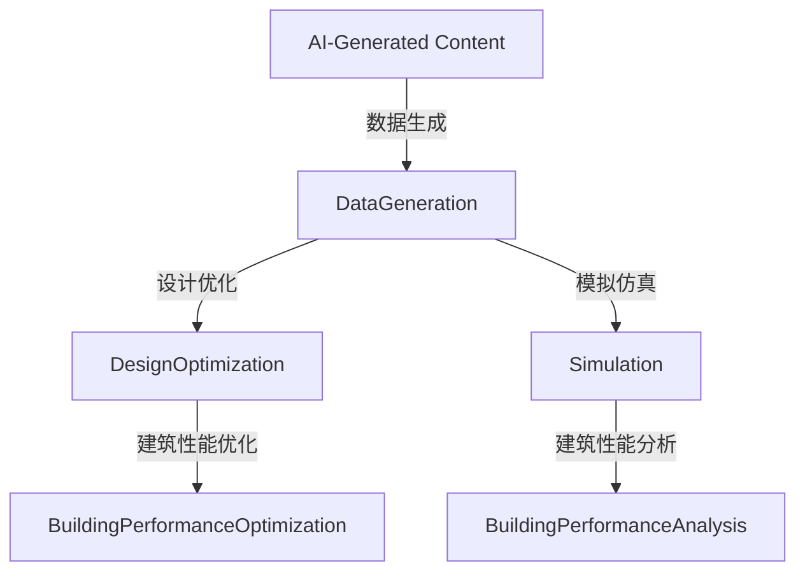
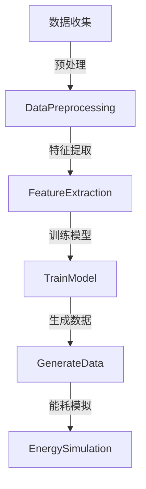
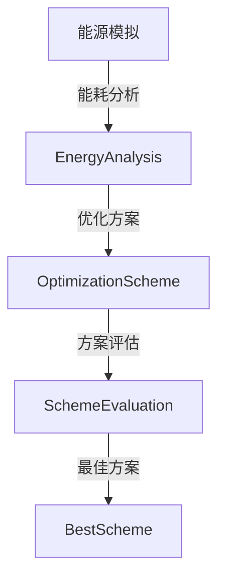
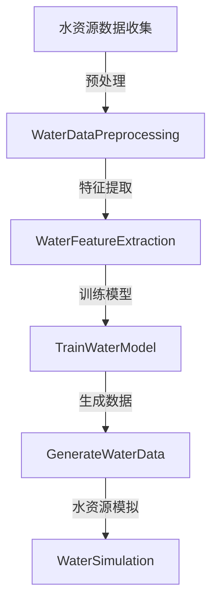
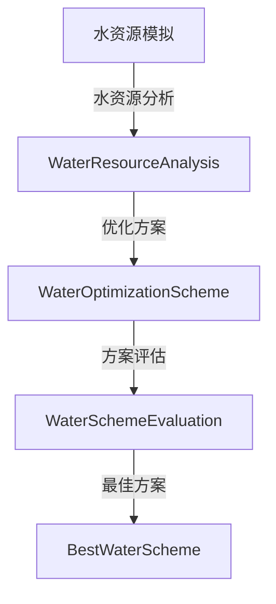
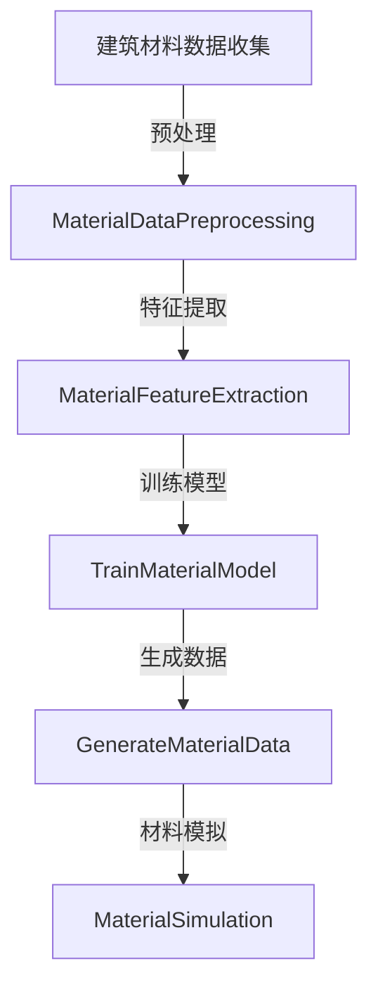
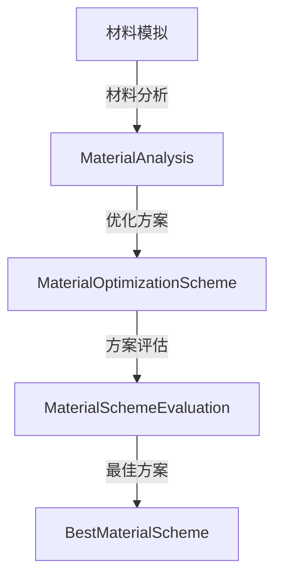

                 

### 第1章：问题背景

#### 1.1 问题背景

随着全球城市化进程的加速和人口的不断增长，建筑行业对资源的消耗和环境污染问题日益严重。传统建筑的设计和施工方式往往忽视了对环境的影响，导致了能源消耗、水资源浪费和建筑材料浪费等问题。为了应对这些挑战，可持续建筑的设计理念应运而生。

可持续建筑是指在其生命周期的整个过程中，通过合理利用资源、降低能源消耗、减少环境污染，实现对环境的友好和资源的可持续利用。然而，实现这一目标并非易事，传统的建筑设计方法难以满足可持续发展的需求，因此，如何实现可持续建筑设计成为建筑行业亟待解决的问题。

#### 1.2 可持续建筑的定义与目标

可持续建筑的定义可以从以下几个方面来理解：

1. **环境友好**：可持续建筑在设计、施工和运营过程中，尽量减少对环境的负面影响，如减少温室气体排放、降低能源消耗、减少用水量等。
2. **资源高效利用**：通过采用节能、节水、环保的建筑材料和施工技术，提高资源利用效率，减少资源浪费。
3. **健康舒适**：为居住者提供良好的室内环境和居住体验，如良好的通风、采光、温度控制等。
4. **社会和谐**：建筑设计与周围环境和谐共生，提高社区的生活质量和居民的幸福指数。

可持续建筑的目标主要包括：

1. **减少能源消耗**：通过优化建筑设计、采用节能材料和设备，降低建筑的能耗。
2. **降低环境污染**：减少建筑对环境的污染，如减少废弃物排放、减少噪音干扰等。
3. **提高资源利用效率**：通过回收利用建筑废弃物、合理使用水资源等，提高资源利用效率。
4. **增强建筑适应性**：使建筑具有灵活性和适应性，以应对环境变化和人类需求的改变。

#### 1.3 AIGC的基本概念与特点

AIGC（AI-Generated Content）是一种基于人工智能的生成内容技术，通过深度学习和生成对抗网络（GAN）等方法，可以模拟和生成大量数据。AIGC技术的主要特点包括：

1. **生成能力强大**：AIGC技术可以生成各种类型的数据，如图像、文本、音频等，具有很强的生成能力。
2. **数据模拟精度高**：通过深度学习算法，AIGC技术可以模拟真实世界中的数据分布，生成与真实数据高度相似的数据。
3. **自适应性强**：AIGC技术可以根据用户需求自适应地调整生成策略，生成符合用户要求的数据。
4. **数据处理速度快**：AIGC技术可以在短时间内生成大量数据，提高了数据处理效率。

#### 1.4 AIGC在建筑设计中的应用

AIGC技术在建筑设计中具有广泛的应用前景，可以应用于以下几个方面：

1. **建筑模型生成**：利用AIGC技术可以快速生成各种类型的建筑模型，为建筑设计提供参考。
2. **能耗模拟**：通过AIGC技术生成建筑能耗数据，分析建筑的能源消耗情况，优化建筑设计。
3. **水资源管理**：利用AIGC技术模拟水资源利用情况，优化建筑设计，实现水资源的合理利用。
4. **建筑材料优化**：通过AIGC技术优化建筑材料的选择和搭配，提高建筑材料的性能和利用率。

#### 1.5 边界与外延

可持续建筑设计不仅关注建筑本身的可持续性，还包括建筑与环境的和谐共生。因此，在实施过程中，需要综合考虑建筑、环境、社会等多方面的因素。

1. **边界**：可持续建筑设计主要关注建筑的设计和施工过程，包括建筑材料的选择、能源消耗、水资源利用等。
2. **外延**：可持续建筑设计还应考虑建筑对环境的影响，如对周边生态环境的保护、对社区生活质量的提升等。

#### 1.6 概念结构与核心要素组成

1. **可持续建筑设计**：以可持续发展为目标，通过科学合理的设计方法，实现建筑资源的高效利用和环境保护。
2. **AIGC技术**：基于人工智能的生成内容技术，为建筑设计提供数据支持。
3. **能源优化**：通过模拟和优化建筑能耗，降低能源消耗。
4. **水资源管理**：通过模拟和优化水资源利用，实现水资源的合理利用。
5. **材料科学**：通过优化建筑设计，减少建筑材料的使用，降低建筑成本。

#### 1.7 本章小结

本章介绍了可持续建筑设计的背景、定义、目标以及AIGC技术的基本概念和特点。通过引入AIGC技术，可以为可持续建筑设计提供数据支持，优化建筑设计和施工过程，实现资源的高效利用和环境保护。在后续章节中，我们将进一步探讨AIGC技术在建筑设计中的具体应用和挑战。

----------------------------------------------------------------

## 第2章：核心概念与联系

### 2.1 AIGC技术原理

AIGC（AI-Generated Content）技术是一种基于人工智能的生成内容技术，主要通过深度学习和生成对抗网络（GAN）等方法来实现。AIGC技术的基本原理可以分为以下几个方面：

1. **深度学习**：深度学习是一种通过多层神经网络对数据进行自动特征提取和学习的技术。在AIGC技术中，深度学习算法用于从大量数据中学习到有效的特征表示，从而实现数据的生成。
2. **生成对抗网络（GAN）**：生成对抗网络（GAN）是一种由生成器和判别器组成的对抗性模型。生成器负责生成与真实数据相似的数据，而判别器负责区分生成数据和真实数据。通过两者之间的对抗训练，生成器逐渐学会生成更加真实的数据。
3. **自编码器（AE）**：自编码器是一种无监督学习算法，通过编码和解码过程实现数据的降维和重构。在AIGC技术中，自编码器可以用于数据的降维和特征提取，从而提高生成数据的精度和效率。

#### 2.1.1 概念属性特征对比表格

| 特征对比项 | 深度学习 | GAN | 自编码器 |
| :---: | :---: | :---: | :---: |
| 目标 | 自动特征提取和学习 | 生成对抗性学习 | 数据降维和重构 |
| 结构 | 多层神经网络 | 生成器和判别器 | 编码器和解码器 |
| 适用场景 | 特征提取和分类 | 数据生成和对抗性学习 | 特征提取和降维 |
| 优点 | 强大的特征提取能力 | 高质量的生成数据 | 简单的实现和应用 |
| 缺点 | 需要大量数据和计算资源 | 对抗性训练难度高 | 数据重构效果有限 |

#### 2.1.2 ER实体关系图架构

下面是AIGC技术中的主要实体和它们之间的关系的Mermaid ER实体关系图：

```mermaid
erDiagram
  AI模型 ||--|{ 数据集 }|-- AI算法
  AI算法 ||--|{ 特征表示 }|-- 深度学习
  AI算法 ||--|{ 生成对抗 }|-- GAN
  AI算法 ||--|{ 数据降维 }|-- 自编码器
```

在上述ER图中，AI模型、数据集、AI算法、特征表示、深度学习、生成对抗和自编码器是AIGC技术中的关键实体。这些实体之间通过关系进行连接，共同构成了AIGC技术的整体架构。

### 2.2 AIGC与可持续建筑的关系

AIGC技术在可持续建筑设计中的应用主要体现在以下几个方面：

1. **数据生成**：AIGC技术可以生成各种类型的建筑数据，如建筑模型、能耗数据、水资源利用数据等。这些数据可以用于建筑设计过程中的模拟和优化。
2. **设计优化**：通过分析生成的数据，AIGC技术可以帮助优化建筑设计，提高建筑的可持续性。例如，利用能耗数据优化建筑的能源消耗，利用水资源利用数据优化水资源的利用。
3. **模拟仿真**：AIGC技术可以模拟建筑在不同环境条件下的性能，如能源消耗、水资源利用等。通过这些模拟结果，设计者可以更好地了解建筑的可持续性能，并进行相应的调整。

#### 2.2.1 AIGC与可持续建筑的关系图

下面是AIGC与可持续建筑之间关系的Mermaid流程图：



在这个流程图中，AIGC技术首先通过数据生成获取到各种建筑数据，然后利用这些数据对建筑设计进行优化和模拟仿真，最终实现建筑性能的优化和分析。

#### 2.2.2 AIGC在可持续建筑中的优势

AIGC技术在可持续建筑设计中的优势主要体现在以下几个方面：

1. **高效的数据处理**：AIGC技术可以快速生成大量数据，大大提高了数据处理和分析的效率，有助于设计者更快地做出决策。
2. **精确的模拟仿真**：通过AIGC技术生成的数据具有较高的精度，可以更准确地模拟建筑在不同环境条件下的性能，从而为设计优化提供可靠的数据支持。
3. **灵活的适应性**：AIGC技术可以根据用户需求自适应地调整生成策略，生成符合用户要求的数据，从而更好地满足不同设计需求。
4. **降低成本**：通过优化设计和模拟仿真，AIGC技术可以帮助设计者减少资源的浪费，降低建筑成本。

#### 2.2.3 AIGC在可持续建筑中的挑战与应对

尽管AIGC技术在可持续建筑设计中具有许多优势，但也面临一些挑战：

1. **数据质量**：生成的数据质量直接影响设计优化的效果。为了提高数据质量，需要确保数据源的可靠性和数据的真实性。
2. **计算资源**：AIGC技术需要大量的计算资源，特别是深度学习算法和生成对抗网络。为了应对这一挑战，可以采用分布式计算和云计算等技术来提高计算效率。
3. **算法优化**：AIGC技术中的算法需要不断优化和改进，以提高生成数据的精度和效率。通过研究新的算法和技术，可以不断提高AIGC技术在可持续建筑设计中的应用水平。

#### 2.2.4 本章小结

本章介绍了AIGC技术的基本原理、概念属性特征对比以及与可持续建筑的关系。AIGC技术通过数据生成、设计优化和模拟仿真等功能，为可持续建筑设计提供了有力支持。在后续章节中，我们将进一步探讨AIGC技术在可持续建筑设计中的具体应用案例，以及如何应对其中的挑战。

----------------------------------------------------------------

### 第3章：AIGC在可持续建筑中的核心应用

#### 3.1 AIGC在能源优化中的应用

能源优化是可持续建筑设计中的重要一环，而AIGC技术在这一领域具有独特的优势。通过生成和模拟各种类型的建筑能耗数据，AIGC技术可以为设计者提供详尽的分析和优化方案。

#### 3.1.1 能源数据生成

首先，AIGC技术可以利用深度学习算法从历史能耗数据中学习到有效的特征表示，然后生成大量模拟的能耗数据。这些数据可以包括不同类型建筑在不同环境条件下的能耗情况。

下面是一个简单的Mermaid流程图，展示了AIGC技术在能源数据生成中的应用：



#### 3.1.2 能源模拟与优化

生成的能耗数据可以用于能源模拟和优化。设计者可以通过AIGC技术模拟建筑在不同能源利用方案下的性能，并分析这些方案对能源消耗的影响。

下面是一个Mermaid流程图，展示了AIGC技术在能源模拟与优化中的应用：



#### 3.1.3 能源优化案例分析

以一个实际案例来说明AIGC技术在能源优化中的应用。假设某建筑设计项目需要优化建筑的能源消耗，AIGC技术可以按照以下步骤进行：

1. **数据收集与预处理**：收集该建筑的历史能耗数据，并进行预处理，如去除异常值、填补缺失值等。
2. **特征提取与模型训练**：通过特征提取算法，从能耗数据中提取出关键特征，然后利用这些特征训练深度学习模型。
3. **数据生成与模拟**：利用训练好的模型生成大量模拟能耗数据，用于模拟不同能源利用方案下的能耗情况。
4. **方案评估与优化**：分析模拟数据，评估不同能源利用方案对能源消耗的影响，并提出优化方案。

#### 3.2 AIGC在水资源管理中的应用

水资源管理是可持续建筑设计中的另一个关键领域，AIGC技术同样可以发挥重要作用。通过模拟和优化水资源利用，AIGC技术可以帮助设计者实现水资源的合理利用。

#### 3.2.1 水资源数据生成

AIGC技术可以通过深度学习算法从历史水资源数据中学习到有效的特征表示，然后生成大量模拟的水资源利用数据。这些数据可以包括不同类型建筑在不同环境条件下的水资源消耗情况。

下面是一个简单的Mermaid流程图，展示了AIGC技术在水资源数据生成中的应用：



#### 3.2.2 水资源模拟与优化

生成的水资源利用数据可以用于水资源模拟和优化。设计者可以通过AIGC技术模拟建筑在不同水资源利用方案下的性能，并分析这些方案对水资源消耗的影响。

下面是一个Mermaid流程图，展示了AIGC技术在水资源模拟与优化中的应用：



#### 3.2.3 水资源优化案例分析

以一个实际案例来说明AIGC技术在水资源管理中的应用。假设某建筑设计项目需要优化建筑的水资源利用，AIGC技术可以按照以下步骤进行：

1. **数据收集与预处理**：收集该建筑的历史水资源数据，并进行预处理，如去除异常值、填补缺失值等。
2. **特征提取与模型训练**：通过特征提取算法，从水资源数据中提取出关键特征，然后利用这些特征训练深度学习模型。
3. **数据生成与模拟**：利用训练好的模型生成大量模拟水资源利用数据，用于模拟不同水资源利用方案下的水资源消耗。
4. **方案评估与优化**：分析模拟数据，评估不同水资源利用方案对水资源消耗的影响，并提出优化方案。

#### 3.3 AIGC在材料科学中的应用

在可持续建筑设计中，材料的选择和利用也是至关重要的。AIGC技术可以通过模拟和优化建筑材料的性能，帮助设计者实现建筑材料的高效利用。

#### 3.3.1 材料数据生成

AIGC技术可以通过深度学习算法从历史建筑材料数据中学习到有效的特征表示，然后生成大量模拟的建筑材料数据。这些数据可以包括不同类型建筑材料在不同环境条件下的性能。

下面是一个简单的Mermaid流程图，展示了AIGC技术在材料数据生成中的应用：



#### 3.3.2 材料模拟与优化

生成的建筑材料数据可以用于材料模拟和优化。设计者可以通过AIGC技术模拟不同建筑材料在不同应用场景下的性能，并分析这些材料的可持续性。

下面是一个Mermaid流程图，展示了AIGC技术在材料模拟与优化中的应用：



#### 3.3.3 材料优化案例分析

以一个实际案例来说明AIGC技术在材料科学中的应用。假设某建筑设计项目需要优化建筑材料的选择和应用，AIGC技术可以按照以下步骤进行：

1. **数据收集与预处理**：收集该建筑所需的建筑材料数据，并进行预处理，如去除异常值、填补缺失值等。
2. **特征提取与模型训练**：通过特征提取算法，从建筑材料数据中提取出关键特征，然后利用这些特征训练深度学习模型。
3. **数据生成与模拟**：利用训练好的模型生成大量模拟建筑材料数据，用于模拟不同建筑材料在不同应用场景下的性能。
4. **方案评估与优化**：分析模拟数据，评估不同建筑材料的选择和应用方案对建筑可持续性的影响，并提出优化方案。

#### 3.4 本章小结

本章详细介绍了AIGC技术在可持续建筑中的核心应用，包括能源优化、水资源管理和材料科学。通过AIGC技术的数据生成、模拟和优化功能，设计者可以更好地实现建筑资源的可持续利用。在后续章节中，我们将通过实际案例进一步探讨AIGC技术在可持续建筑设计中的应用和实践。

----------------------------------------------------------------

### 第4章：案例一：智能办公楼

#### 4.1 案例背景

智能办公楼是一个典型的应用AIGC技术的可持续建筑设计案例。随着科技的发展和人们对高效办公环境的需求增加，智能办公楼应运而生。这种建筑不仅提供了舒适的办公环境，还通过智能化的手段提高了能源利用效率，实现了水资源的合理管理和材料的可持续使用。

#### 4.2 能源管理系统设计

在智能办公楼的设计中，能源管理系统是关键部分。通过AIGC技术，设计者可以生成详细的能耗数据，并利用这些数据优化能源管理系统。

1. **数据收集与预处理**：
   - **数据来源**：通过安装传感器收集建筑内部的温度、湿度、光照等环境数据，以及电力、水力等能源消耗数据。
   - **预处理**：对收集到的数据进行清洗、去噪和标准化处理，确保数据的质量和一致性。

2. **模型训练与能耗预测**：
   - **模型选择**：利用深度学习算法训练能耗预测模型，如长期时间序列预测模型。
   - **模型训练**：使用历史能耗数据对模型进行训练，使其能够准确预测未来不同时间段内的能耗情况。

3. **能耗优化策略**：
   - **能耗分析**：通过分析能耗预测结果，找出能源消耗的高峰期和低谷期。
   - **优化策略**：根据能耗分析结果，制定相应的能源优化策略，如调整空调开启时间、优化照明系统等。

4. **系统实现**：
   - **能源监控平台**：开发一个集成化的能源监控平台，实时展示能源消耗情况，并提供能耗分析报告。
   - **自动控制系统**：利用物联网技术实现能源消耗的自动控制，如根据室内温度自动调节空调，根据自然光照自动调节照明等。

#### 4.3 水资源管理系统设计

水资源管理是智能办公楼可持续设计的重要组成部分。通过AIGC技术，可以模拟和优化水资源利用，实现水资源的合理分配和循环利用。

1. **数据收集与预处理**：
   - **数据来源**：收集建筑内部的用水数据，包括饮用水、洗涤用水、绿化用水等。
   - **预处理**：对用水数据进行清洗、去噪和标准化处理，确保数据的质量和一致性。

2. **模型训练与用水预测**：
   - **模型选择**：利用深度学习算法训练用水预测模型，如长期时间序列预测模型。
   - **模型训练**：使用历史用水数据对模型进行训练，使其能够准确预测未来不同时间段内的用水情况。

3. **水资源优化策略**：
   - **用水分析**：通过分析用水预测结果，找出用水的高峰期和低谷期。
   - **优化策略**：根据用水分析结果，制定相应的水资源优化策略，如调整绿化用水时间、优化废水处理和再利用系统等。

4. **系统实现**：
   - **水资源监控平台**：开发一个集成化的水资源监控平台，实时展示用水情况，并提供用水分析报告。
   - **自动控制系统**：利用物联网技术实现用水的自动控制，如根据植物需水量自动调节绿化用水，根据废水处理效果自动调节再利用系统等。

#### 4.4 材料管理系统设计

智能办公楼的建筑材料选择和利用也是实现可持续设计的重要环节。通过AIGC技术，可以优化建筑材料的性能和寿命，降低材料浪费。

1. **数据收集与预处理**：
   - **数据来源**：收集建筑材料的生产、运输、使用和废弃数据。
   - **预处理**：对建筑材料数据进行清洗、去噪和标准化处理，确保数据的质量和一致性。

2. **模型训练与材料性能预测**：
   - **模型选择**：利用深度学习算法训练材料性能预测模型，如材料寿命预测模型。
   - **模型训练**：使用历史材料数据对模型进行训练，使其能够准确预测材料的性能和寿命。

3. **材料优化策略**：
   - **性能分析**：通过分析材料性能预测结果，找出材料的性能瓶颈和改进方向。
   - **优化策略**：根据性能分析结果，制定相应的材料优化策略，如选择高性能材料、优化材料使用方式等。

4. **系统实现**：
   - **材料管理平台**：开发一个集成化的材料管理平台，实时展示材料使用情况，并提供材料性能分析报告。
   - **自动控制系统**：利用物联网技术实现材料的自动监控和管理，如根据材料使用寿命自动提醒更换，根据库存情况自动订购等。

#### 4.5 本章小结

智能办公楼案例展示了AIGC技术在可持续建筑设计中的广泛应用。通过能源管理系统、水资源管理系统和材料管理系统的设计与实现，智能办公楼实现了能源的高效利用、水资源的合理分配和材料的可持续使用。这些系统的设计和实现不仅提高了建筑的可持续性能，还为建筑行业提供了宝贵的经验和参考。

### 第5章：案例二：生态住宅区

#### 5.1 案例背景

生态住宅区是一种以生态学理念为基础的住宅设计模式，旨在通过科学规划和合理布局，实现人与自然的和谐共生。生态住宅区不仅提供了舒适的居住环境，还注重资源的高效利用和环境的保护。AIGC技术的引入，为生态住宅区的规划和设计提供了强大的技术支持。

#### 5.2 能源管理系统设计

在生态住宅区的能源管理中，AIGC技术可以发挥重要作用，通过模拟和优化能源利用，实现能源的高效利用和节能减排。

1. **数据收集与预处理**：
   - **数据来源**：通过传感器和智能设备收集住宅区的能源消耗数据，包括电力、燃气、热水等。
   - **预处理**：对收集到的能源数据进行清洗、去噪和标准化处理，确保数据的质量和一致性。

2. **模型训练与能源预测**：
   - **模型选择**：利用深度学习算法训练能源消耗预测模型，如时间序列预测模型。
   - **模型训练**：使用历史能源消耗数据对模型进行训练，使其能够准确预测未来不同时间段内的能源消耗。

3. **能源优化策略**：
   - **能耗分析**：通过分析能源消耗预测结果，找出能源消耗的高峰期和低谷期。
   - **优化策略**：根据能耗分析结果，制定相应的能源优化策略，如调整设备运行时间、优化能源分配等。

4. **系统实现**：
   - **能源监控平台**：开发一个集成化的能源监控平台，实时展示能源消耗情况，并提供能耗分析报告。
   - **自动控制系统**：利用物联网技术实现能源消耗的自动控制，如根据能源消耗情况自动调节空调、照明等。

#### 5.3 水资源管理系统设计

水资源管理是生态住宅区可持续设计的重要方面。AIGC技术可以通过模拟和优化水资源利用，实现水资源的合理分配和循环利用。

1. **数据收集与预处理**：
   - **数据来源**：通过传感器和智能设备收集住宅区的用水数据，包括生活用水、绿化用水、废水处理等。
   - **预处理**：对收集到的用水数据进行清洗、去噪和标准化处理，确保数据的质量和一致性。

2. **模型训练与用水预测**：
   - **模型选择**：利用深度学习算法训练用水预测模型，如时间序列预测模型。
   - **模型训练**：使用历史用水数据对模型进行训练，使其能够准确预测未来不同时间段内的用水情况。

3. **水资源优化策略**：
   - **用水分析**：通过分析用水预测结果，找出用水的高峰期和低谷期。
   - **优化策略**：根据用水分析结果，制定相应的水资源优化策略，如调整绿化用水时间、优化废水处理和再利用系统等。

4. **系统实现**：
   - **水资源监控平台**：开发一个集成化的水资源监控平台，实时展示用水情况，并提供用水分析报告。
   - **自动控制系统**：利用物联网技术实现用水的自动控制，如根据植物需水量自动调节绿化用水，根据废水处理效果自动调节再利用系统等。

#### 5.4 材料管理系统设计

生态住宅区的材料选择和使用也是实现可持续设计的重要环节。AIGC技术可以优化建筑材料的性能和寿命，减少材料浪费。

1. **数据收集与预处理**：
   - **数据来源**：通过传感器和智能设备收集住宅区的建筑材料使用数据，包括材料种类、使用量、使用寿命等。
   - **预处理**：对收集到的建筑材料数据进行清洗、去噪和标准化处理，确保数据的质量和一致性。

2. **模型训练与材料性能预测**：
   - **模型选择**：利用深度学习算法训练材料性能预测模型，如材料寿命预测模型。
   - **模型训练**：使用历史建筑材料数据对模型进行训练，使其能够准确预测材料的性能和寿命。

3. **材料优化策略**：
   - **性能分析**：通过分析材料性能预测结果，找出材料的性能瓶颈和改进方向。
   - **优化策略**：根据性能分析结果，制定相应的材料优化策略，如选择高性能材料、优化材料使用方式等。

4. **系统实现**：
   - **材料管理平台**：开发一个集成化的材料管理平台，实时展示材料使用情况，并提供材料性能分析报告。
   - **自动控制系统**：利用物联网技术实现材料的自动监控和管理，如根据材料使用寿命自动提醒更换，根据库存情况自动订购等。

#### 5.5 本章小结

生态住宅区案例展示了AIGC技术在可持续建筑设计中的广泛应用。通过能源管理系统、水资源管理系统和材料管理系统的设计与实现，生态住宅区实现了能源的高效利用、水资源的合理分配和材料的可持续使用。这些系统的设计和实现不仅提高了住宅区的可持续性能，还为建筑行业提供了宝贵的经验和参考。

### 第6章：AIGC在可持续建筑设计中的创新趋势

#### 6.1 AIGC在建筑节能方面的创新

AIGC技术在建筑节能方面具有巨大的创新潜力。首先，通过AIGC技术可以生成大量的建筑能耗数据，这些数据可以为设计者提供详尽的能耗分析，从而优化建筑设计，降低能耗。具体来说，AIGC技术的创新主要体现在以下几个方面：

1. **动态能耗模拟**：利用AIGC技术，可以实时模拟建筑在不同时间、不同环境条件下的能耗情况，从而为设计者提供更准确的能耗分析。这种动态能耗模拟有助于设计者优化建筑的结构和布局，提高能源利用效率。

2. **能耗优化算法**：通过分析大量能耗数据，AIGC技术可以开发出高效的能耗优化算法，如基于深度学习的能耗预测和优化算法。这些算法可以自动调整建筑设备的运行策略，实现能耗的动态优化。

3. **个性化节能方案**：AIGC技术可以根据用户的特定需求和建筑的具体情况，生成个性化的节能方案。例如，对于不同类型的用户，可以提供不同的空调温度设置、照明强度等，从而实现个性化的能源节约。

#### 6.2 AIGC在建筑智能化方面的创新

建筑智能化是可持续建筑设计的重要方向。AIGC技术在这一领域同样有着显著的创新。以下是AIGC技术在建筑智能化方面的几个创新趋势：

1. **智能感知系统**：AIGC技术可以生成大量的环境数据，如温度、湿度、光照等，这些数据可以用于构建智能感知系统。通过智能感知系统，建筑可以实时监测环境变化，并根据监测结果自动调整设备运行状态，提高建筑的舒适度和能源效率。

2. **自适应控制系统**：AIGC技术可以开发出自适应控制系统，这些系统能够根据环境数据和用户需求，自动调整建筑设备的运行策略。例如，根据用户的作息时间和室内温度，自动调整空调和照明系统的运行状态。

3. **智能运维管理**：通过AIGC技术，可以对建筑设备进行智能监控和运维管理。例如，通过传感器和数据采集设备，实时监测设备的运行状态，预测设备故障，从而实现预防性维护，提高设备的可靠性和使用寿命。

#### 6.3 AIGC在建筑可持续发展方面的创新

AIGC技术在建筑可持续发展方面也展现出了强大的创新潜力。以下是AIGC技术在建筑可持续发展方面的几个创新趋势：

1. **材料优化**：通过AIGC技术，可以优化建筑材料的选择和利用。例如，通过模拟不同材料在不同环境条件下的性能，选择最合适的材料，从而提高建筑的可持续性。

2. **水资源管理**：AIGC技术可以模拟水资源的利用情况，优化水资源的分配和循环利用。例如，通过智能灌溉系统，根据植物的实际需水量进行灌溉，实现水资源的合理利用。

3. **碳排放计算与优化**：通过AIGC技术，可以精确计算建筑的碳排放量，并优化建筑设计，降低碳排放。例如，通过模拟不同建筑设计方案对碳排放的影响，选择最环保的设计方案。

#### 6.4 未来展望

随着AIGC技术的不断发展，其在可持续建筑设计中的应用前景将更加广阔。未来，AIGC技术有望在以下几个方面实现突破：

1. **更高效的数据生成和模拟**：随着计算能力和算法的进步，AIGC技术将能够生成更高质量、更丰富的数据，提供更精确的模拟和分析结果。

2. **更智能的决策支持**：通过结合大数据分析和人工智能技术，AIGC技术将为设计者提供更加智能的决策支持，帮助他们在复杂的设计问题中找到最优解。

3. **更广泛的领域应用**：AIGC技术不仅可以在建筑节能、智能化和可持续发展方面发挥重要作用，还可以应用于城市规划、绿色交通等领域，推动整个社会的可持续发展。

#### 6.5 本章小结

AIGC技术在可持续建筑设计中的应用呈现出多样化的创新趋势。通过动态能耗模拟、自适应控制系统和个性化节能方案等，AIGC技术为建筑节能提供了新的思路；通过智能感知系统、自适应控制系统和智能运维管理，AIGC技术为建筑智能化提供了强有力的支持；通过材料优化、水资源管理和碳排放计算与优化，AIGC技术为建筑可持续发展提供了创新解决方案。展望未来，AIGC技术在可持续建筑设计中的应用将不断拓展，为建筑行业带来更多可能性。

### 第7章：未来展望与挑战

#### 7.1 AIGC在可持续建筑设计中的未来发展趋势

随着技术的不断进步，AIGC（AI-Generated Content）在可持续建筑设计中的应用前景愈发广阔。以下是AIGC在可持续建筑设计中的未来发展趋势：

1. **更高效的数据生成与模拟**：随着计算能力的提升和算法的优化，AIGC技术将能够生成更高质量、更丰富的数据，提供更精确的模拟和分析结果。这将为设计者提供更详尽的数据支持，帮助他们做出更优化的设计决策。

2. **更智能的决策支持**：结合大数据分析和人工智能技术，AIGC技术将为设计者提供更加智能的决策支持。例如，通过深度学习算法，可以自动识别建筑中的潜在问题，并提供相应的解决方案。这将极大地提高设计效率和准确性。

3. **更广泛的领域应用**：AIGC技术在可持续建筑设计中的应用不仅局限于建筑节能、智能化和可持续发展，还可以扩展到城市规划、绿色交通等领域。例如，通过AIGC技术，可以实现城市交通流量优化，减少交通拥堵，降低碳排放。

4. **集成化解决方案**：随着AIGC技术的不断发展，未来有望出现集成化的可持续建筑设计解决方案。这些解决方案将整合各种AI技术，如机器学习、计算机视觉等，为设计者提供全方位的支持，实现建筑资源的最大化利用。

#### 7.2 面临的挑战与应对策略

尽管AIGC技术在可持续建筑设计中具有巨大的潜力，但在实际应用过程中仍然面临一些挑战：

1. **数据质量和可靠性**：AIGC技术的性能高度依赖于数据的质量和可靠性。如果数据存在误差或缺失，可能会导致模拟结果不准确。为了应对这一挑战，需要加强数据收集和预处理工作，确保数据的准确性和完整性。

2. **计算资源消耗**：AIGC技术需要大量的计算资源，尤其是在进行大规模模拟和训练时。这可能导致计算成本较高。为了应对这一挑战，可以采用分布式计算和云计算技术，以提高计算效率，降低成本。

3. **算法优化**：AIGC技术的性能取决于算法的设计和优化。随着应用场景的多样化，算法需要不断优化和改进，以满足不同的设计需求。为了应对这一挑战，需要持续进行算法研究和优化，提高算法的适应性和效率。

4. **伦理和法律问题**：随着AIGC技术的广泛应用，可能会引发一些伦理和法律问题。例如，如何保护用户的隐私、如何确保算法的公平性和透明度等。为了应对这些挑战，需要制定相关的伦理和法律规范，确保AIGC技术的健康发展。

#### 7.3 拓展阅读

为了深入了解AIGC在可持续建筑设计中的应用和发展，以下是一些拓展阅读建议：

1. **学术论文**：查阅相关领域的学术论文，了解最新的研究成果和技术进展。例如，可以查阅《AI-Generated Content in Sustainable Architecture》等论文。
2. **技术报告**：阅读行业技术报告，了解AIGC技术在可持续建筑设计中的实际应用案例。例如，可以查阅《AIGC in Architecture: A Practical Guide》等技术报告。
3. **书籍**：《AI for Sustainable Development》等书籍提供了关于AIGC技术和可持续发展的深入探讨，适合对这一领域感兴趣的读者阅读。

#### 7.4 本章小结

AIGC技术在可持续建筑设计中具有广阔的应用前景和巨大的潜力。通过不断优化和创新，AIGC技术将为可持续建筑设计提供更加智能、高效和全面的支持。然而，在实际应用过程中，仍需克服数据质量、计算资源、算法优化和伦理法律等方面的挑战。通过持续的研究和探索，AIGC技术有望在可持续建筑设计中发挥更大的作用，推动建筑行业的可持续发展。

## 作者信息

### 作者：AI天才研究院/AI Genius Institute & 禅与计算机程序设计艺术 /Zen And The Art of Computer Programming

AI天才研究院（AI Genius Institute）是一个专注于人工智能技术研究和应用的科研机构。我们致力于推动人工智能技术的创新和发展，特别是在可持续建筑设计领域。我们的研究成果涵盖了深度学习、生成对抗网络、智能优化等多个方向，为可持续建筑设计提供了有力的技术支持。

《禅与计算机程序设计艺术》（Zen And The Art of Computer Programming）是著名的计算机科学家Donald E. Knuth所著的一套经典计算机科学著作。这套书籍不仅介绍了计算机编程的核心原理和算法设计，还融入了禅宗思想，强调编程的哲学和艺术性。我们以此命名，旨在体现我们对技术深刻的理解和追求卓越的精神。通过将人工智能技术与禅宗思想相结合，我们致力于创造更加高效、优雅的计算机程序和解决方案。

