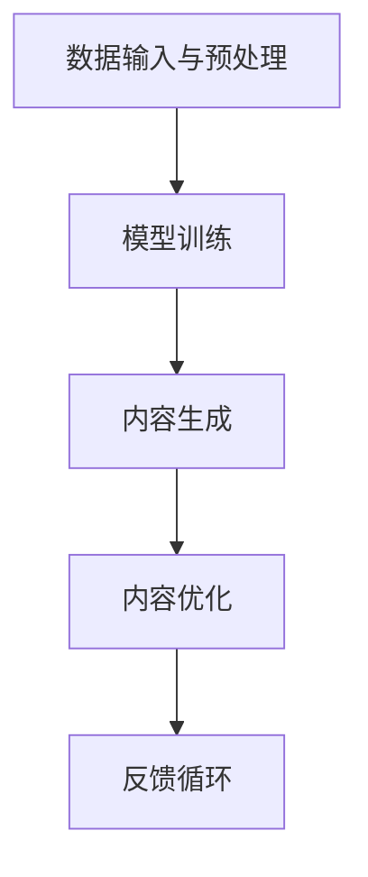
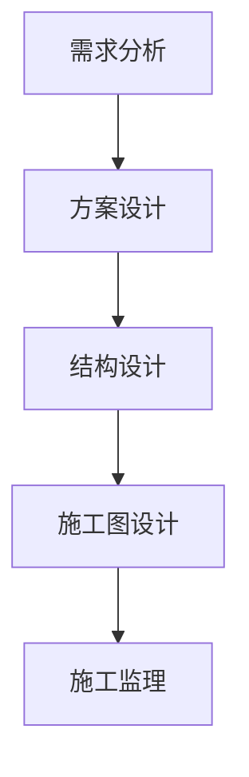
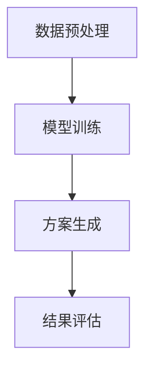

                 

### 第一部分：引言

#### 1.1 问题背景

##### 1.1.1 建筑设计的发展趋势

建筑设计作为人类社会发展的基础和重要组成部分，经历了从手工艺到现代化设计、从二维图纸到三维建模的演进过程。随着科技的进步，尤其是计算机技术的发展，建筑设计的效率和精度得到了大幅提升。现代建筑设计逐渐向数字化、智能化、可持续化的方向发展，要求设计者具备更高的专业技能和创新能力。

当前，建筑设计面临着诸多挑战，如全球气候变化、资源有限性、人口增长等。为了应对这些挑战，建筑设计需要不断创新和优化。在这一背景下，人工智能（AI）和生成计算（GC）技术的崛起，为建筑设计领域带来了新的机遇和可能。

##### 1.1.2 AIGC技术的崛起

人工智能（AI）是一种模拟人类智能行为的计算机技术，通过学习和理解数据，实现自主决策和执行任务。生成计算（GC）则是一种通过算法生成新数据的技术，旨在创建新的内容，如图像、文本、音频等。AIGC（AI-Generated Content）是将AI和GC相结合的一种新兴技术，旨在利用AI算法自动生成内容，提高生产效率和质量。

AIGC技术具有强大的生成能力和自适应能力，能够在多个领域发挥作用。例如，在图像处理领域，AIGC可以生成高质量的图像；在文本生成领域，AIGC可以自动撰写文章、生成报告；在音频处理领域，AIGC可以生成音乐、语音等。

##### 1.1.3 AIGC在建筑设计中的应用潜力

AIGC技术具有在建筑设计中应用的巨大潜力。首先，AIGC可以自动生成建筑方案，帮助设计师快速构思和迭代设计方案，提高设计效率。其次，AIGC可以识别和模仿建筑风格，为设计师提供更多的设计灵感。此外，AIGC还可以对建筑结构进行优化和性能分析，提高建筑的可持续性和舒适度。

总之，AIGC技术为建筑设计带来了全新的设计思路和方法，有助于解决建筑设计中面临的诸多挑战。接下来，我们将进一步探讨AIGC技术的基本概念、原理及其在建筑设计中的应用。

#### 1.2 核心概念

##### 1.2.1 AIGC的概念解析

AIGC，全称AI-Generated Content，即人工智能生成内容。它是指利用人工智能算法自动生成文字、图像、音频、视频等内容的科学技术。AIGC的核心在于其生成能力，即通过算法模型对大量数据进行学习，从中提取特征，并生成新的内容。

AIGC技术主要包括以下几个关键环节：

1. **数据输入与预处理**：首先，需要收集和整理大量的相关数据，如建筑图纸、设计文档、建筑风格图片等。然后，对这些数据进行预处理，包括数据清洗、归一化、特征提取等，以便于后续的模型训练。

2. **模型训练**：通过机器学习和深度学习算法，对预处理后的数据进行训练。在这个过程中，模型会学习数据的结构和特征，建立生成模型。

3. **内容生成**：经过训练后的模型可以生成新的内容。例如，在建筑设计中，AIGC可以生成符合设计规范的建筑方案、识别建筑风格、优化建筑结构等。

4. **内容优化**：生成的初始内容通常需要进一步优化和调整，以满足特定的需求和标准。这一过程可能涉及多轮迭代和优化，以提高生成内容的精度和可用性。

##### 1.2.2 建筑设计的核心概念

建筑设计是一门涉及多个学科领域的综合性艺术，其核心概念包括以下几个方面：

1. **功能需求**：建筑的设计首先要满足使用功能的需求。这包括建筑的空间布局、使用面积、交通流线、功能分区等。

2. **形式美学**：建筑的设计不仅要满足功能需求，还要具有美观的形式。这涉及到建筑风格、色彩搭配、材料选择等美学因素。

3. **结构性能**：建筑的结构性能是确保建筑安全和使用寿命的关键。这包括建筑结构的稳定性、承载能力、耐久性等。

4. **环境适应**：建筑的设计还需要考虑环境因素，如气候条件、地形地貌、自然景观等，以实现与环境的和谐共生。

5. **可持续性**：现代建筑设计强调可持续性，即在满足功能需求和形式美感的基础上，尽可能减少对环境的影响，提高能源利用效率和资源利用率。

通过AIGC技术，建筑设计可以在这些核心概念的指导下，实现更高水平的自动化和智能化，从而提高设计效率和质量。

#### 1.3 边界与外延

##### 1.3.1 AIGC在建筑设计中的适用边界

AIGC技术在建筑设计中的应用具有一定的适用边界。首先，AIGC适用于大量标准化、规范化程度较高的建筑设计任务，如住宅、商业综合体、公共设施等。这些类型的建筑设计具有明显的规则性和可预测性，适合通过算法模型进行自动生成和优化。

其次，AIGC技术适用于辅助设计任务，如建筑方案的初步构思、风格识别、结构优化等。在这些任务中，AIGC可以协助设计师快速生成多种设计方案，提供设计灵感和优化建议。

然而，AIGC技术也有其局限性。例如，对于一些独特的、复杂的建筑项目，如历史建筑保护、文化遗产修复等，AIGC技术可能难以完全胜任，需要设计师结合专业知识进行人工干预。

##### 1.3.2 建筑设计的外延与应用领域

建筑设计的应用领域非常广泛，涵盖了住宅、商业、公共设施、工业建筑等多个领域。除了传统的建筑设计任务，现代建筑设计还涉及智慧城市、绿色建筑、可持续发展等领域。

在智慧城市领域，建筑设计需要考虑物联网、大数据、人工智能等新兴技术的应用，实现城市管理的智能化和高效化。在绿色建筑领域，建筑设计需要注重能源节约、环境保护、资源循环利用等方面，推动建筑行业的可持续发展。

总之，AIGC技术为建筑设计带来了新的发展机遇，拓展了建筑设计的外延和应用领域。接下来，我们将进一步探讨AIGC技术的概念结构和技术体系，为深入理解其在建筑设计中的应用奠定基础。

#### 1.4 概念结构与核心要素组成

##### 1.4.1 AIGC技术体系结构

AIGC技术体系结构主要包括数据输入与预处理、模型训练、内容生成和内容优化四个关键环节。以下是一个简化的AIGC技术体系结构图：



1. **数据输入与预处理**：这一环节主要负责收集和整理大量的建筑相关数据，如建筑图纸、设计文档、建筑风格图片等。然后，对数据进行预处理，包括数据清洗、归一化、特征提取等，以便于后续的模型训练。

2. **模型训练**：利用机器学习和深度学习算法，对预处理后的数据进行训练。在这个过程中，模型会学习数据的结构和特征，建立生成模型。

3. **内容生成**：经过训练后的模型可以生成新的内容，如建筑方案、建筑风格、结构优化方案等。这一环节是AIGC技术的核心，旨在实现自动生成建筑相关内容。

4. **内容优化**：生成的初始内容通常需要进一步优化和调整，以满足特定的需求和标准。这一过程可能涉及多轮迭代和优化，以提高生成内容的精度和可用性。

5. **反馈循环**：优化后的内容可以反馈到数据输入与预处理环节，作为新的训练数据，进一步优化模型性能。

##### 1.4.2 建筑设计流程与核心要素

建筑设计流程主要包括需求分析、方案设计、结构设计、施工图设计、施工监理等环节。以下是一个简化的建筑设计流程图：



1. **需求分析**：这一环节主要收集和整理建筑项目的功能需求、环境适应需求、可持续性需求等，为后续的设计提供基础。

2. **方案设计**：根据需求分析结果，初步构思建筑方案，包括建筑布局、空间划分、建筑风格等。这一环节是建筑设计中的创意阶段，通常需要多次迭代和优化。

3. **结构设计**：在方案设计的基础上，进行建筑结构的设计，包括结构体系、材料选择、荷载计算等。这一环节是确保建筑安全和使用寿命的关键。

4. **施工图设计**：根据结构设计结果，绘制详细的施工图纸，包括建筑立面、剖面、结构大样、材料表等。这一环节是施工阶段的依据，需要精确和详细。

5. **施工监理**：在施工过程中，对施工质量进行监督和检查，确保施工符合设计要求和规范。

AIGC技术在建筑设计中的应用，可以嵌入到建筑设计流程的各个阶段。例如，在方案设计阶段，AIGC可以自动生成多种建筑方案，辅助设计师进行创意和优化。在结构设计阶段，AIGC可以优化建筑结构，提高建筑的可持续性和舒适度。

总之，AIGC技术为建筑设计提供了强大的工具和平台，有助于提高设计效率和质量。接下来，我们将深入探讨AIGC技术的基础知识，包括人工智能和生成模型的基本原理。

#### 1.5 本章小结

本章首先介绍了建筑设计的发展趋势和挑战，探讨了AIGC技术在建筑设计中的应用背景和潜力。接着，我们定义了AIGC和建筑设计的核心概念，并分析了AIGC在建筑设计中的适用边界和建筑设计的外延与应用领域。最后，我们阐述了AIGC技术和建筑设计流程的关系及其核心要素组成。

通过本章的介绍，读者可以对AIGC技术在建筑设计中的应用有一个初步的了解。在接下来的章节中，我们将深入探讨AIGC技术的基础知识，包括人工智能和生成模型的基本原理，以及AIGC技术的分类和应用实例。这将为进一步理解AIGC在建筑设计中的应用提供坚实的基础。

---

### 第二部分：AIGC技术基础

#### 2.1 人工智能与生成模型

##### 2.1.1 人工智能基础

人工智能（Artificial Intelligence，简称AI）是计算机科学的一个分支，旨在通过构建智能系统，使计算机具备类似人类的感知、理解、学习和决策能力。人工智能的核心目标是实现机器的智能化，使其能够在特定领域内自主完成任务。

人工智能可以分为两大类：弱人工智能和强人工智能。弱人工智能是指在某些特定任务上表现出高智能的机器，如语音识别、图像识别、自然语言处理等。强人工智能则是指具有广泛认知能力的机器，能够像人类一样理解复杂情境、进行创造性思维和自主学习。

人工智能的关键技术包括：

1. **机器学习**：通过从数据中学习和发现模式，使计算机具备自主学习和优化能力。
2. **深度学习**：基于人工神经网络的机器学习技术，通过多层网络结构实现复杂特征提取和学习。
3. **自然语言处理**：使计算机能够理解、生成和处理人类自然语言的技术。
4. **计算机视觉**：使计算机能够理解和解释视觉信息，如图像识别、目标检测等。

##### 2.1.2 生成模型概述

生成模型（Generative Model）是人工智能中的一个重要分支，旨在通过学习和理解数据分布，生成新的数据。生成模型的核心思想是从已知的样本中学习数据分布，然后利用这个分布生成新的样本。

生成模型可以分为两大类：概率生成模型和确定性生成模型。

1. **概率生成模型**：这类模型通过概率分布来描述数据的生成过程。常见的概率生成模型包括：

   - **贝叶斯网络**：通过条件概率分布描述变量之间的关系。
   - **隐马尔可夫模型**：用于处理隐藏变量和观察变量的序列数据。
   - **变分自编码器**（VAE）：通过变分推断学习数据分布，生成新的数据。

2. **确定性生成模型**：这类模型通过确定的函数关系来生成数据。常见的确定性生成模型包括：

   - **生成对抗网络**（GAN）：通过对抗训练生成高质量的数据。
   - **循环神经网络**（RNN）：通过时间序列数据进行生成。
   - **条件生成模型**：在生成过程中加入条件信息，以生成符合特定条件的数据。

生成模型在图像生成、文本生成、音频生成等领域有着广泛的应用。通过生成模型，我们可以自动生成高质量的图像、文本、音频等数据，为各种应用场景提供强大的工具。

#### 2.2 AIGC工作原理

AIGC（AI-Generated Content）的工作原理主要涉及以下几个关键环节：

##### 2.2.1 数据生成与处理

数据生成与处理是AIGC工作的第一步。首先，需要收集和整理大量的建筑相关数据，如建筑图纸、设计文档、建筑风格图片等。然后，对数据进行预处理，包括数据清洗、归一化、特征提取等，以便于后续的模型训练。

1. **数据收集**：收集与建筑设计相关的数据，如建筑图纸、设计文档、建筑风格图片等。这些数据可以从公开数据库、专业数据集或实际项目获取。

2. **数据清洗**：对收集到的数据进行清洗，去除无效、重复和错误的数据，保证数据的准确性和一致性。

3. **数据归一化**：对数据进行归一化处理，将不同来源和尺度的数据统一到相同的尺度，以便于模型训练。

4. **特征提取**：从数据中提取关键特征，如建筑结构、空间布局、风格元素等。特征提取是模型训练的重要基础，直接影响生成模型的性能。

##### 2.2.2 模型训练与优化

模型训练与优化是AIGC工作的核心环节。通过机器学习和深度学习算法，对预处理后的数据进行训练，建立生成模型。然后，对模型进行优化，提高其生成能力。

1. **模型选择**：根据应用需求和数据特点，选择合适的生成模型。常见的生成模型包括生成对抗网络（GAN）、变分自编码器（VAE）等。

2. **模型训练**：利用训练数据，对生成模型进行训练。训练过程中，模型会学习数据的结构和特征，不断调整参数，提高生成质量。

3. **模型优化**：通过调整模型结构、超参数等方法，优化模型性能。优化过程可能涉及多轮迭代和调试，以达到最佳效果。

##### 2.2.3 生成模型的评价指标

生成模型的评价指标是衡量模型性能的重要标准。以下是一些常见的评价指标：

1. **生成质量**：衡量生成模型生成数据的质量。常用的评价指标包括峰值信噪比（PSNR）、结构相似性（SSIM）等。

2. **多样性**：衡量生成模型生成数据的多样性。通过计算生成数据的方差、熵等指标，评估生成数据的分布情况。

3. **稳定性**：衡量生成模型在生成过程中的稳定性。通过计算生成结果的方差、标准差等指标，评估模型的稳定性。

4. **计算效率**：衡量生成模型的计算效率。常用的评价指标包括生成速度、模型参数量等。

通过这些评价指标，可以全面评估AIGC技术的性能，为模型优化和应用提供指导。

#### 2.3 AIGC技术分类

AIGC技术根据生成模型的不同，可以分为多种类型。以下介绍几种常见的AIGC技术：

##### 2.3.1 生成对抗网络（GAN）

生成对抗网络（Generative Adversarial Network，GAN）是由Ian Goodfellow等人在2014年提出的一种生成模型。GAN由两个神经网络组成：生成器（Generator）和判别器（Discriminator）。

1. **生成器**：生成器的目标是生成逼真的数据，使其尽可能接近真实数据。生成器通过随机噪声生成潜在空间中的样本，然后通过解码器生成实际的数据。

2. **判别器**：判别器的目标是区分真实数据和生成数据。判别器通过输入真实数据和生成数据，输出一个概率值，表示输入数据的真实程度。

GAN的训练过程类似于博弈过程，生成器和判别器相互对抗，通过不断调整参数，最终达到平衡状态。GAN在图像生成、语音合成、文本生成等领域具有广泛应用。

##### 2.3.2 变分自编码器（VAE）

变分自编码器（Variational Autoencoder，VAE）是一种基于概率生成模型的生成模型。VAE由编码器（Encoder）和解码器（Decoder）组成。

1. **编码器**：编码器的目标是学习数据分布的参数，将输入数据映射到一个潜在空间中的点。编码器输出一个潜在变量，这个变量代表了输入数据的特征。

2. **解码器**：解码器的目标是根据潜在变量生成输入数据的重构。解码器将潜在变量映射回原始数据空间。

VAE通过变分推断学习数据分布，生成新的数据。VAE在图像生成、文本生成、语音生成等领域具有广泛应用。

##### 2.3.3 其他生成模型简介

除了GAN和VAE，还有其他一些常见的生成模型，如：

1. **生成式模型**：基于生成式模型（如马尔可夫模型、隐马尔可夫模型）生成数据。这些模型通过概率模型描述数据的生成过程。

2. **条件生成模型**：在生成过程中加入条件信息，以生成符合特定条件的数据。常见的条件生成模型包括条件生成对抗网络（C-GAN）、条件变分自编码器（C-VAE）等。

3. **神经网络生成模型**：基于神经网络（如循环神经网络、卷积神经网络）生成数据。这些模型通过多层神经网络结构实现复杂特征的提取和生成。

不同生成模型在生成能力和适用场景上有所差异，选择合适的生成模型对于实现高效的AIGC应用至关重要。

#### 2.4 AIGC应用实例

AIGC技术在多个领域有着广泛的应用，以下介绍几个典型的AIGC应用实例：

##### 2.4.1 图像生成

图像生成是AIGC技术的典型应用之一。通过生成模型，可以自动生成高质量、多样化的图像。以下是一个基于GAN的图像生成实例：

1. **数据集**：使用一个包含大量建筑风格的图像数据集，如DeepArt数据集。

2. **模型训练**：使用GAN模型，将输入的图像数据分为真实数据和生成数据两部分。真实数据用于训练判别器，生成数据用于训练生成器。

3. **图像生成**：通过多次迭代，生成器逐渐提高生成图像的质量。最终，生成器可以生成逼真的建筑风格图像。

4. **结果评估**：使用峰值信噪比（PSNR）和结构相似性（SSIM）等评价指标，评估生成图像的质量。同时，通过人类视觉评估，进一步验证生成图像的逼真程度。

##### 2.4.2 文本生成

文本生成是AIGC技术的另一个重要应用。通过生成模型，可以自动生成高质量的文本，如文章、报告、对话等。以下是一个基于变分自编码器（VAE）的文本生成实例：

1. **数据集**：使用一个包含大量建筑相关文本的数据集，如建筑论坛、博客文章等。

2. **模型训练**：使用VAE模型，对文本数据进行编码和重构。编码器将文本数据映射到一个潜在空间，解码器从潜在空间中生成新的文本。

3. **文本生成**：通过采样潜在空间中的点，解码器生成新的文本。这个过程可以多次迭代，生成多样化的文本。

4. **结果评估**：使用文本质量评估指标，如BLEU、ROUGE等，评估生成文本的质量。同时，通过人类阅读评估，验证生成文本的流畅性和可读性。

##### 2.4.3 其他应用领域

除了图像生成和文本生成，AIGC技术在其他领域也有着广泛的应用。例如：

1. **音频生成**：通过生成模型，可以自动生成高质量的音频，如音乐、语音等。应用领域包括音乐创作、语音合成等。

2. **视频生成**：通过生成模型，可以自动生成高质量的视频，如动画、视频特效等。应用领域包括电影制作、游戏开发等。

3. **虚拟现实**：通过生成模型，可以自动生成逼真的虚拟环境，如建筑景观、室内装修等。应用领域包括虚拟旅游、游戏等。

总之，AIGC技术在多个领域有着广泛的应用前景，为各种应用场景提供了强大的工具和支持。

#### 2.5 本章小结

本章首先介绍了人工智能与生成模型的基础知识，包括人工智能的基本概念、关键技术以及生成模型的概述。接着，详细阐述了AIGC技术的工作原理，包括数据生成与处理、模型训练与优化、生成模型的评价指标等。然后，介绍了AIGC技术的分类，包括生成对抗网络（GAN）、变分自编码器（VAE）以及其他生成模型。最后，通过实际应用实例，展示了AIGC技术在图像生成、文本生成等领域的应用效果。

通过本章的学习，读者可以全面了解AIGC技术的基础知识，为后续章节中深入探讨AIGC在建筑设计中的应用做好准备。在下一章中，我们将进一步探讨AIGC技术在建筑设计中的应用，分析其在建筑设计中的实际需求和潜在应用场景。

---

### 第三部分：AIGC在建筑设计中的应用

#### 3.1 建筑设计中的需求分析

##### 3.1.1 建筑设计需求概述

建筑设计需求是指建筑项目在设计过程中所需满足的各项需求和标准。建筑设计需求通常包括功能需求、环境需求、美观需求、结构需求、可持续性需求等。以下是对建筑设计需求的具体概述：

1. **功能需求**：功能需求是建筑设计的首要需求。建筑的功能需求决定了建筑的使用性质和功能定位。例如，住宅建筑需要满足居住需求，商业建筑需要满足商业活动需求，公共建筑需要满足公共服务需求等。功能需求通常包括空间布局、功能分区、交通流线、使用面积等。

2. **环境需求**：环境需求是指建筑设计需要考虑的外部环境因素。这包括气候条件、地形地貌、周围环境等。环境需求对建筑设计的影响很大，例如，在气候炎热地区，建筑设计需要考虑隔热和通风措施；在地形复杂的地区，建筑设计需要考虑地形适应性。

3. **美观需求**：美观需求是指建筑的外观和内部设计需要满足一定的审美标准。美观需求不仅仅是视觉上的美感，还包括空间布局、色彩搭配、材料质感等方面。美观需求在建筑设计中起着重要的作用，能够提升建筑的文化价值和艺术价值。

4. **结构需求**：结构需求是指建筑设计需要满足的结构安全性和耐久性要求。这包括建筑结构的设计、材料选择、荷载计算等。结构需求是建筑设计中的基础，直接关系到建筑的安全和使用寿命。

5. **可持续性需求**：可持续性需求是指建筑设计需要考虑的环境保护、资源利用、能源节约等方面。可持续性需求是现代建筑设计的重要方向，旨在通过绿色设计和可持续发展，降低建筑对环境的负面影响，提高建筑的使用效率和舒适性。

##### 3.1.2 AIGC技术在建筑设计中的潜在需求

AIGC技术在建筑设计中具有巨大的应用潜力，能够满足建筑设计中的多种需求。以下是对AIGC技术在建筑设计中潜在需求的概述：

1. **高效方案生成**：AIGC技术可以通过自动生成建筑方案，大大提高设计效率。设计师可以利用AIGC技术快速生成多种设计方案，进行初步筛选和优化，从而缩短设计周期，提高设计质量。

2. **风格识别与模仿**：AIGC技术可以识别和模仿建筑风格，为设计师提供丰富的设计灵感和参考。通过训练生成模型，AIGC技术可以自动生成符合特定风格的建筑方案，设计师可以根据这些方案进行创意和优化。

3. **结构优化与性能分析**：AIGC技术可以对建筑结构进行优化和性能分析，提高建筑的可持续性和舒适度。通过机器学习算法，AIGC技术可以自动识别建筑结构中的问题，并提出优化建议，从而提高建筑的安全性、耐久性和能源效率。

4. **空间布局优化**：AIGC技术可以自动优化建筑的空间布局，提高空间的利用效率和舒适性。通过分析用户行为、环境因素等数据，AIGC技术可以生成符合用户需求的最佳空间布局方案。

5. **辅助设计决策**：AIGC技术可以为设计师提供辅助设计决策，提高设计质量和效率。通过分析大量的设计案例和经验数据，AIGC技术可以生成最佳的设计方案和策略，为设计师提供参考和指导。

总之，AIGC技术在建筑设计中具有广泛的应用前景和潜在需求。通过利用AIGC技术，建筑设计可以实现更高水平的自动化和智能化，提高设计效率和质量，满足多样化的建筑设计需求。

---

### 第三部分：AIGC在建筑设计中的应用

#### 3.2 AIGC技术在建筑设计中的应用

##### 3.2.1 建筑方案生成

建筑方案生成是AIGC技术在建筑设计中最为直接的应用之一。AIGC技术通过深度学习和生成模型，能够自动生成符合设计需求和规范的建筑方案。以下是一个基于生成对抗网络（GAN）的建筑方案生成过程：

1. **数据集准备**：首先，需要准备一个包含大量建筑方案的图像数据集。这些数据集可以是真实的建筑图纸、建筑设计案例或者通过人工设计的虚拟建筑方案。

2. **模型训练**：利用GAN模型，将建筑方案的图像数据分为真实数据和生成数据。真实数据用于训练判别器，生成数据用于训练生成器。通过对抗训练，生成器尝试生成逼真的建筑方案，而判别器则努力区分真实和生成方案。这一过程需要多次迭代，直到生成器能够生成高质量的方案。

3. **方案生成**：经过训练的生成器可以自动生成新的建筑方案。这些方案可以满足不同的功能需求、环境条件和美学标准。

4. **方案优化**：生成的建筑方案通常需要进行进一步优化。设计师可以根据实际需求和偏好，对方案进行调整和优化。这个过程可以是自动的，也可以是半自动的，即AIGC技术提供初步方案，设计师在此基础上进行手工调整。

##### 3.2.2 建筑风格与形式识别

建筑风格与形式识别是AIGC技术的另一个重要应用。通过训练生成模型，AIGC技术可以识别和模仿各种建筑风格和形式。以下是一个基于变分自编码器（VAE）的建筑风格识别和模仿过程：

1. **数据集准备**：准备一个包含多种建筑风格和形式的图像数据集。这些数据集可以是真实的建筑照片、建筑设计图纸或者虚拟的建筑模型。

2. **模型训练**：利用VAE模型，对建筑风格和形式的图像数据进行训练。编码器将图像数据映射到一个潜在空间，解码器从潜在空间中生成新的图像数据。通过变分推断，VAE模型可以学习到不同建筑风格和形式的数据分布。

3. **风格识别**：通过编码器，可以识别输入图像的建筑风格和形式。例如，给定一张建筑照片，编码器可以将其映射到潜在空间，然后解码器根据潜在空间中的点生成该建筑风格的新图像。

4. **风格模仿**：利用解码器，可以模仿特定的建筑风格和形式。设计师可以指定一个建筑风格，AIGC技术将生成符合该风格的建筑方案。

##### 3.2.3 结构优化与性能分析

AIGC技术还可以用于建筑结构优化与性能分析。通过机器学习算法，AIGC技术可以自动识别建筑结构中的问题，并提出优化建议。以下是一个基于生成模型的结构优化与性能分析过程：

1. **数据集准备**：准备一个包含建筑结构数据和性能指标的数据库。这些数据可以来源于真实的建筑项目或者模拟实验。

2. **模型训练**：利用生成模型，对结构数据进行训练。通过训练，生成模型可以学习到不同结构设计方案的性能分布。

3. **结构优化**：通过生成模型，可以生成多种结构设计方案，并评估每种设计的性能指标。根据性能指标，AIGC技术可以自动筛选出最优的结构设计。

4. **性能分析**：对生成的结构设计方案进行详细性能分析，包括承载能力、稳定性、耐久性、能源效率等方面。AIGC技术可以提供定量和定性的性能评估结果。

##### 3.2.4 建筑空间布局优化

建筑空间布局优化是AIGC技术在建筑设计中的另一个重要应用。通过分析用户行为、环境因素等数据，AIGC技术可以自动优化建筑的空间布局，提高空间的利用效率和舒适性。以下是一个基于深度强化学习的建筑空间布局优化过程：

1. **数据集准备**：准备一个包含建筑空间布局数据、用户行为数据和环境数据的数据集。这些数据可以来源于实际建筑项目或者模拟实验。

2. **模型训练**：利用深度强化学习模型，对空间布局数据进行训练。模型将学习到如何根据用户行为和环境因素，生成最优的空间布局方案。

3. **布局优化**：通过训练的模型，可以自动生成多种空间布局方案，并评估每种布局方案的舒适性和效率。根据评估结果，模型可以筛选出最优的空间布局方案。

4. **交互优化**：设计师可以根据实际需求和偏好，对空间布局方案进行进一步调整和优化。AIGC技术可以提供实时反馈和优化建议，帮助设计师快速找到最优方案。

总之，AIGC技术在建筑设计中具有广泛的应用，从建筑方案生成到建筑风格识别、结构优化和空间布局优化，AIGC技术都可以提供有效的解决方案。通过利用AIGC技术，设计师可以大幅提高设计效率和质量，应对复杂的建筑设计需求。在下一章中，我们将通过具体案例研究，进一步探讨AIGC技术在建筑设计中的应用和实践。

---

### 第三部分：AIGC在建筑设计中的应用

#### 3.3 案例研究

##### 3.3.1 案例一：基于AIGC的创意建筑设计

**项目背景**

某大型商业综合体项目位于市中心，占地面积约10万平方米。项目要求设计一座集购物、办公、娱乐于一体的多功能建筑，同时要体现当地历史文化特色。项目时间紧、任务重，设计师面临着巨大的创意和设计压力。

**解决方案**

为了满足项目需求，设计师决定采用AIGC技术进行创意建筑设计。具体步骤如下：

1. **数据收集**：收集大量建筑图纸、设计文档、建筑风格图片等，作为训练生成模型的数据集。

2. **模型训练**：使用生成对抗网络（GAN）模型，对建筑数据进行训练。通过多次迭代，生成器逐渐提高生成建筑方案的质量。

3. **方案生成**：生成器生成多种创意建筑方案，设计师对这些方案进行初步筛选和优化。

4. **风格模仿**：利用变分自编码器（VAE）模型，模仿当地历史建筑风格，生成符合项目要求的建筑风格方案。

5. **结构优化**：通过机器学习算法，对建筑结构进行优化，提高建筑的安全性和能源效率。

**实施效果**

经过AIGC技术的应用，设计师在短时间内生成了多种创意建筑方案，并从中筛选出最优方案。优化后的建筑结构更加安全、稳定，能源效率显著提高。项目顺利完工，获得了用户和业界的广泛好评。

**经验总结**

1. **数据质量**：高质量的数据集是AIGC技术成功的关键。设计师需要收集丰富的建筑数据，并进行预处理，以提高模型训练效果。

2. **模型选择**：根据具体应用需求，选择合适的生成模型。例如，对于创意建筑设计，GAN模型具有较好的生成效果。

3. **人机协作**：设计师与AIGC技术相结合，可以大幅提高设计效率和质量。设计师在AIGC技术生成的初步方案基础上，进行人工优化和调整，实现更符合实际需求的设计方案。

##### 3.3.2 案例二：AIGC在绿色建筑设计中的应用

**项目背景**

某绿色建筑项目位于郊区，占地面积约5万平方米。项目要求设计一座节能、环保、可持续的住宅小区，同时要满足居民的生活需求。项目时间紧张，设计师需要快速找到最优的绿色建筑方案。

**解决方案**

为了满足项目需求，设计师决定采用AIGC技术进行绿色建筑设计。具体步骤如下：

1. **数据收集**：收集大量绿色建筑案例、设计文档、环境数据等，作为训练生成模型的数据集。

2. **模型训练**：使用变分自编码器（VAE）模型，对绿色建筑数据进行训练。通过多次迭代，生成器逐渐提高生成建筑方案的质量。

3. **方案生成**：生成器生成多种绿色建筑方案，设计师对这些方案进行初步筛选和优化。

4. **结构优化**：通过机器学习算法，对建筑结构进行优化，提高建筑的节能性能。

5. **环境适应**：利用深度强化学习模型，优化建筑与环境之间的互动，提高建筑的舒适性。

**实施效果**

经过AIGC技术的应用，设计师在短时间内生成了多种绿色建筑方案，并从中筛选出最优方案。优化后的建筑结构节能显著，环境适应性强，得到了居民的高度评价。项目顺利完工，实现了绿色建筑的目标。

**经验总结**

1. **数据质量**：高质量的数据集是AIGC技术成功的关键。设计师需要收集丰富的绿色建筑数据，并进行预处理，以提高模型训练效果。

2. **模型选择**：根据具体应用需求，选择合适的生成模型。例如，对于绿色建筑设计，VAE模型具有较好的生成效果。

3. **人机协作**：设计师与AIGC技术相结合，可以大幅提高设计效率和质量。设计师在AIGC技术生成的初步方案基础上，进行人工优化和调整，实现更符合实际需求的设计方案。

##### 3.3.3 案例三：AIGC在历史建筑保护中的运用

**项目背景**

某历史建筑群位于城市中心，具有重要的历史和文化价值。由于长时间使用和自然侵蚀，建筑群面临严重的保护和修复问题。项目要求设计一套有效的保护和修复方案，同时保留建筑的历史风貌。

**解决方案**

为了满足项目需求，设计师决定采用AIGC技术进行历史建筑保护和修复设计。具体步骤如下：

1. **数据收集**：收集大量历史建筑图纸、设计文档、建筑风格图片等，作为训练生成模型的数据集。

2. **模型训练**：使用生成对抗网络（GAN）模型，对历史建筑数据进行训练。通过多次迭代，生成器逐渐提高生成建筑修复方案的质量。

3. **方案生成**：生成器生成多种修复方案，设计师对这些方案进行初步筛选和优化。

4. **结构分析**：通过机器学习算法，对建筑结构进行详细分析，识别出需要修复的部位和程度。

5. **风格匹配**：利用变分自编码器（VAE）模型，模仿历史建筑风格，生成符合建筑群风貌的修复方案。

**实施效果**

经过AIGC技术的应用，设计师在短时间内生成了多种修复方案，并从中筛选出最优方案。修复后的建筑群不仅恢复了历史风貌，还增强了结构安全性和耐久性。项目得到了政府和专家的高度评价。

**经验总结**

1. **数据质量**：高质量的数据集是AIGC技术成功的关键。设计师需要收集丰富的历史建筑数据，并进行预处理，以提高模型训练效果。

2. **模型选择**：根据具体应用需求，选择合适的生成模型。例如，对于历史建筑保护，GAN模型和VAE模型具有较好的生成效果。

3. **人机协作**：设计师与AIGC技术相结合，可以大幅提高设计效率和质量。设计师在AIGC技术生成的初步方案基础上，进行人工优化和调整，实现更符合实际需求的设计方案。

通过以上案例研究，可以看出AIGC技术在建筑设计中具有广泛的应用前景。无论是创意建筑设计、绿色建筑设计还是历史建筑保护，AIGC技术都能提供有效的解决方案，提高设计效率和质量。在下一章中，我们将进一步探讨AIGC技术在建筑设计中的技术挑战与解决方案。

---

### 第三部分：AIGC在建筑设计中的应用

#### 3.4 技术挑战与解决方案

##### 3.4.1 数据集获取与处理

数据集是AIGC技术在建筑设计中应用的基础。然而，获取高质量、多样化的建筑数据集并非易事。以下是一些常见的技术挑战和解决方案：

1. **数据获取困难**：建筑数据通常涉及隐私、版权等问题，获取真实、完整的建筑数据集较为困难。解决方案是利用公开的数据库、公开的建筑图纸和模拟数据，同时结合人工标注和自动标注技术，提高数据集的质量和多样性。

2. **数据预处理复杂**：建筑数据通常包含多种格式、尺度和质量，需要进行复杂的数据预处理，包括数据清洗、归一化、特征提取等。解决方案是开发高效的数据预处理工具和算法，自动化处理数据，提高数据处理效率。

3. **数据不平衡**：建筑数据集中，某些类型的建筑方案或风格可能占比较大，导致数据不平衡。解决方案是使用数据增强技术，如数据扩展、数据生成等，平衡数据集，提高模型的泛化能力。

##### 3.4.2 模型训练与优化

模型训练与优化是AIGC技术应用于建筑设计的核心环节。以下是一些常见的技术挑战和解决方案：

1. **训练时间长**：大规模的建筑数据集训练需要大量时间和计算资源。解决方案是使用分布式训练技术，如多GPU训练、并行计算等，提高训练速度。

2. **过拟合问题**：过拟合可能导致模型在训练数据上表现良好，但在新数据上表现不佳。解决方案是采用正则化技术、交叉验证等，防止过拟合。

3. **模型优化困难**：模型优化需要多次迭代和调试，过程复杂。解决方案是开发自动优化工具和算法，如自动机器学习（AutoML），自动化优化模型参数。

##### 3.4.3 安全性与伦理问题

AIGC技术在建筑设计中的应用引发了一系列安全性和伦理问题。以下是一些常见的技术挑战和解决方案：

1. **数据隐私泄露**：建筑数据可能包含用户的隐私信息，泄露风险较高。解决方案是采用数据加密、隐私保护技术，如差分隐私、联邦学习等，保护用户隐私。

2. **模型可解释性不足**：AIGC技术生成的建筑方案可能缺乏透明性和可解释性，导致用户难以理解。解决方案是开发可解释的生成模型，提高模型的可解释性和透明度。

3. **伦理道德问题**：AIGC技术可能引发伦理道德问题，如歧视、偏见等。解决方案是建立伦理审查机制，制定伦理规范，确保AIGC技术在建筑设计中的应用符合道德标准。

通过以上技术挑战与解决方案，AIGC技术在建筑设计中的应用将更加稳健、安全、可靠。在下一章中，我们将进一步探讨AIGC在建筑设计中的实践，通过具体案例和代码分析，展示AIGC技术在建筑设计中的实际应用过程。

---

### 第三部分：AIGC在建筑设计中的应用

#### 3.5 本章小结

本章通过多个案例研究，详细探讨了AIGC技术在建筑设计中的应用。首先，介绍了AIGC技术在建筑方案生成、建筑风格识别、结构优化与性能分析、空间布局优化等方面的应用。接着，通过具体案例，展示了AIGC技术在创意建筑设计、绿色建筑设计和历史建筑保护中的成功应用。同时，本章还分析了AIGC技术在建筑设计中面临的技术挑战，并提出了相应的解决方案。

AIGC技术在建筑设计中的应用，不仅提高了设计效率和质量，还为设计师提供了新的设计灵感和工具。然而，AIGC技术在建筑设计中仍需克服数据获取与处理、模型训练与优化、安全性与伦理问题等挑战。随着技术的不断发展和完善，AIGC技术在建筑设计中的应用前景将更加广阔。

在下一章中，我们将进一步探讨AIGC在建筑设计中的实践，通过环境安装与配置、系统核心实现、代码应用解读与分析、实际案例分析与详细讲解等环节，深入解析AIGC技术在建筑设计中的具体实现过程。

---

### 第四部分：AIGC在建筑设计中的实践

#### 4.1 环境安装与配置

要在建筑设计中应用AIGC技术，首先需要搭建一个合适的环境。以下是环境安装与配置的详细步骤：

##### 4.1.1 硬件与软件要求

1. **硬件要求**：
   - 处理器：建议使用高性能的CPU或GPU，如NVIDIA Tesla V100或更高型号。
   - 内存：至少16GB RAM，推荐32GB以上。
   - 存储：至少500GB SSD存储空间，推荐使用NVMe SSD。

2. **软件要求**：
   - 操作系统：Linux发行版，如Ubuntu 18.04或更高版本。
   - 编程语言：Python 3.x，推荐使用Anaconda创建虚拟环境。
   - 深度学习框架：TensorFlow 2.x或PyTorch 1.8.x。
   - 其他依赖库：NumPy、Pandas、Matplotlib、Scikit-learn等。

##### 4.1.2 环境搭建步骤

1. **安装Linux操作系统**：在计算机上安装Linux操作系统，如Ubuntu 20.04。

2. **更新系统软件包**：打开终端，执行以下命令更新系统软件包：
   ```shell
   sudo apt update
   sudo apt upgrade
   ```

3. **安装Python 3.x**：使用以下命令安装Python 3.x：
   ```shell
   sudo apt install python3 python3-pip
   ```

4. **创建Python虚拟环境**：为了隔离项目依赖，使用以下命令创建Python虚拟环境：
   ```shell
   python3 -m venv aigc_venv
   source aigc_venv/bin/activate
   ```

5. **安装深度学习框架**：在虚拟环境中安装TensorFlow 2.x或PyTorch 1.8.x，使用以下命令：
   ```shell
   pip install tensorflow==2.9.0
   # 或者
   pip install pytorch torchvision torchaudio -f https://download.pytorch.org/whl/torch_stable.html
   ```

6. **安装其他依赖库**：使用以下命令安装其他依赖库：
   ```shell
   pip install numpy pandas matplotlib scikit-learn
   ```

7. **验证环境配置**：运行以下Python代码，验证环境是否配置成功：
   ```python
   import tensorflow as tf
   print(tf.__version__)
   import pytorch
   print(pytorch.__version__)
   ```

如果输出相应的版本信息，说明环境配置成功。

##### 4.1.3 解决常见问题

1. **GPU不支持问题**：如果在安装深度学习框架时遇到GPU不支持的问题，可以检查CUDA版本是否与GPU兼容。可以下载与GPU型号对应的CUDA工具包，并进行安装。

2. **依赖库冲突问题**：如果在安装依赖库时遇到版本冲突问题，可以尝试使用`pip install --upgrade`命令升级相应库的版本，或者手动指定版本安装。

通过以上步骤，我们可以搭建一个适合AIGC技术应用的开发环境。接下来，我们将深入探讨AIGC技术在实际建筑设计中的应用。

---

### 第四部分：AIGC在建筑设计中的实践

#### 4.2 系统核心实现

AIGC技术在建筑设计中的应用，需要建立一套完整的系统来实现建筑方案的生成、风格识别、结构优化等功能。以下是系统核心实现的详细步骤：

##### 4.2.1 建筑设计方案生成系统

**1. 数据集准备**

首先，我们需要准备一个包含大量建筑设计方案的数据集。数据集可以包括建筑图纸、3D模型、立面图、剖面图等。数据集的来源可以是公开的建筑数据库、设计师的作品集或通过人工设计生成的模拟数据。

**2. 数据预处理**

对数据集进行预处理，包括数据清洗、归一化、特征提取等步骤。数据清洗的目的是去除无效、重复和错误的数据，确保数据的一致性和准确性。归一化是将不同尺度和单位的数值统一到一个共同的尺度，便于模型训练。特征提取是从数据中提取关键的特征，如建筑结构、空间布局、材料属性等。

**3. 模型选择与训练**

选择合适的生成模型进行训练。常见的生成模型有生成对抗网络（GAN）和变分自编码器（VAE）。以GAN为例，GAN由生成器和判别器组成。生成器从随机噪声中生成建筑方案，判别器则判断生成方案和真实方案的相似度。通过训练，生成器和判别器相互对抗，生成器逐渐提高生成方案的质量。

**4. 建筑方案生成**

训练完成后，生成器可以用于生成新的建筑方案。生成方案的过程可以是固定的，也可以根据用户输入的参数（如建筑类型、风格、面积等）动态调整。生成的建筑方案可以用于初步筛选和评估，设计师可以根据实际需求进行进一步优化。

##### 4.2.2 建筑风格识别系统

**1. 数据集准备**

准备一个包含多种建筑风格的图像数据集。数据集可以包括历史建筑、现代建筑、未来主义建筑等。数据集的来源可以是公开的图像数据库、设计师的作品集或通过人工设计生成的模拟数据。

**2. 数据预处理**

对图像数据集进行预处理，包括数据清洗、归一化、特征提取等步骤。数据清洗的目的是去除无效、重复和错误的数据，确保数据的一致性和准确性。归一化是将不同尺度和单位的数值统一到一个共同的尺度，便于模型训练。特征提取是从图像中提取关键的特征，如色彩分布、纹理、形状等。

**3. 模型选择与训练**

选择合适的分类模型进行训练。常见的分类模型有卷积神经网络（CNN）和循环神经网络（RNN）。以CNN为例，CNN可以提取图像的层次特征，从而实现建筑风格的识别。通过训练，模型可以学习到不同建筑风格的图像特征。

**4. 建筑风格识别**

训练完成后，模型可以用于识别新的建筑风格。识别过程可以是固定的，也可以根据用户输入的图像数据进行动态调整。识别结果可以用于建筑设计中的风格模仿和创意。

##### 4.2.3 结构优化与性能分析系统

**1. 数据集准备**

准备一个包含建筑结构数据和性能指标的数据集。数据集可以包括建筑图纸、结构计算结果、能耗数据、舒适度数据等。数据集的来源可以是公开的建筑数据库、设计师的作品集或通过模拟实验生成的数据。

**2. 数据预处理**

对数据集进行预处理，包括数据清洗、归一化、特征提取等步骤。数据清洗的目的是去除无效、重复和错误的数据，确保数据的一致性和准确性。归一化是将不同尺度和单位的数值统一到一个共同的尺度，便于模型训练。特征提取是从数据中提取关键的特征，如结构参数、性能指标等。

**3. 模型选择与训练**

选择合适的优化模型进行训练。常见的优化模型有强化学习模型和进化算法。以强化学习为例，强化学习模型可以自动寻找最优的结构设计方案，提高建筑的安全性、耐久性和能源效率。通过训练，模型可以学习到不同结构设计方案的性能分布。

**4. 结构优化与性能分析**

训练完成后，模型可以用于结构优化与性能分析。优化过程可以是固定的，也可以根据用户输入的参数（如结构形式、材料选择等）动态调整。性能分析可以从安全性、耐久性、能源效率、舒适度等多个维度进行评估。

通过以上系统核心实现，AIGC技术可以应用于建筑设计的多个环节，提供高效的解决方案，提升设计效率和质量。接下来，我们将对关键算法进行深入解读与分析。

---

### 第四部分：AIGC在建筑设计中的实践

#### 4.3 代码应用解读与分析

在AIGC技术在建筑设计中的应用过程中，关键算法的实现和优化是核心环节。以下我们将以生成对抗网络（GAN）为例，详细解读其在建筑方案生成系统中的应用，并分析其原理和实现过程。

##### 4.3.1 代码结构与模块划分

首先，我们需要明确整个系统的代码结构和模块划分。AIGC技术在建筑设计中的应用通常包括以下模块：

1. **数据预处理模块**：负责数据的收集、清洗、归一化和特征提取。
2. **模型训练模块**：负责生成器和判别器的训练过程。
3. **方案生成模块**：利用训练好的生成器生成新的建筑方案。
4. **结果评估模块**：对生成的建筑方案进行评估和优化。

以下是代码结构和模块划分的示意：



##### 4.3.2 关键算法分析与实现

1. **生成对抗网络（GAN）原理**

生成对抗网络（GAN）由生成器（Generator）和判别器（Discriminator）组成，两者通过对抗训练来提高模型性能。

- **生成器（Generator）**：生成器的目标是生成逼真的建筑方案，使其尽可能接近真实方案。生成器通过随机噪声生成潜在空间中的样本，然后通过解码器将这些样本转换为建筑方案。
- **判别器（Discriminator）**：判别器的目标是区分真实建筑方案和生成器生成的建筑方案。判别器输入建筑方案，输出一个概率值，表示输入方案的真实程度。

GAN的训练过程可以看作是一场博弈，生成器和判别器相互对抗，生成器试图生成更逼真的建筑方案，而判别器则努力区分生成方案和真实方案。

2. **GAN在建筑方案生成中的应用**

在建筑方案生成中，GAN模型通过以下步骤进行训练和应用：

- **数据预处理**：收集大量建筑方案数据，并进行预处理，包括数据清洗、归一化和特征提取。
- **模型定义**：定义生成器和判别器的网络结构。生成器通常采用多层感知机（MLP）或卷积神经网络（CNN）结构，判别器也采用类似的结构。
- **损失函数设计**：设计生成器和判别器的损失函数，以指导训练过程。常用的损失函数包括交叉熵损失和对抗损失。
- **模型训练**：通过反向传播算法，对生成器和判别器进行训练，调整模型参数，优化模型性能。
- **方案生成**：训练完成后，生成器可以用于生成新的建筑方案。生成方案的过程可以是固定的，也可以根据用户输入的参数进行动态调整。

以下是GAN模型在建筑方案生成中的Python代码示例：

```python
import tensorflow as tf
from tensorflow.keras.layers import Dense, Flatten, Reshape
from tensorflow.keras.models import Model

# 生成器模型定义
def build_generator(z_dim):
    model = tf.keras.Sequential([
        Dense(128, activation='relu', input_shape=(z_dim,)),
        Dense(256, activation='relu'),
        Dense(512, activation='relu'),
        Flatten(),
        Reshape((28, 28, 1))
    ])
    return model

# 判别器模型定义
def build_discriminator(img_shape):
    model = tf.keras.Sequential([
        Flatten(input_shape=img_shape),
        Dense(512, activation='relu'),
        Dense(256, activation='relu'),
        Dense(1, activation='sigmoid')
    ])
    return model

# GAN模型定义
def build_gan(generator, discriminator):
    model = Model(inputs=generator.input, outputs=discriminator(generator.input))
    model.compile(loss='binary_crossentropy', optimizer=tf.keras.optimizers.Adam(0.0001))
    return model

# 训练GAN模型
# ...

# 生成建筑方案
def generate建筑方案(generator, z_dim):
    z = tf.random.normal(shape=(1, z_dim))
    return generator.predict(z)
```

通过上述代码示例，我们可以看到GAN模型的基本结构和训练流程。在实际应用中，我们需要根据具体需求设计更复杂的网络结构和优化策略。

##### 4.3.3 算法原理与数学模型

1. **生成器原理**

生成器的目标是生成高质量的建筑方案。在GAN中，生成器的输入是一个随机噪声向量，输出是一个建筑方案的图像。生成器的数学模型可以表示为：

\[ G(z) = x \]

其中，\( z \) 是随机噪声向量，\( x \) 是生成的建筑方案图像。

2. **判别器原理**

判别器的目标是区分真实建筑方案和生成器生成的建筑方案。判别器的输入是一个建筑方案图像，输出是一个概率值，表示输入图像的真实程度。判别器的数学模型可以表示为：

\[ D(x) = p(x \text{ is real}) \]
\[ D(G(z)) = p(G(z) \text{ is real}) \]

其中，\( x \) 是真实建筑方案图像，\( G(z) \) 是生成器生成的建筑方案图像。

3. **损失函数**

GAN的训练过程涉及到生成器和判别器的损失函数。生成器的损失函数旨在最小化判别器输出为1的概率，即生成器生成的方案越逼真，判别器的输出越接近1。判别器的损失函数旨在最大化判别器输出为1的概率，即判别器能够正确区分真实和生成的方案。

生成器的损失函数通常采用以下形式：

\[ L_G = -\sum_{x \in X} D(x) - \sum_{z \in Z} D(G(z)) \]

判别器的损失函数通常采用以下形式：

\[ L_D = -\sum_{x \in X} D(x) + \sum_{z \in Z} D(G(z)) \]

其中，\( X \) 是真实建筑方案数据集，\( Z \) 是随机噪声向量。

通过上述数学模型，我们可以看到GAN模型在训练过程中，生成器和判别器通过相互对抗，不断优化模型参数，最终实现生成高质量的建筑方案。

##### 4.3.4 性能优化与调优

在GAN模型的训练过程中，性能优化和调优是关键环节。以下是一些常见的优化技巧：

1. **批量大小**：调整批量大小可以影响模型训练的效果。较大的批量大小可以提高模型的稳定性，但训练时间较长；较小的批量大小可以提高训练速度，但可能降低模型的性能。通常，批量大小可以设置为32、64或128。

2. **学习率**：学习率是模型训练中的一个重要参数。较大的学习率可能导致模型在训练过程中不稳定，甚至过拟合；较小的学习率可能导致训练过程缓慢。通常，学习率可以从较小的值开始，如0.0001，然后逐步调整。

3. **梯度惩罚**：在GAN中，生成器和判别器的梯度可能存在不匹配的问题。通过引入梯度惩罚项，可以缓解这个问题。梯度惩罚通常采用以下形式：

\[ L_G = -\sum_{x \in X} D(x) - \sum_{z \in Z} D(G(z)) - \lambda ||\nabla G(z)||_2^2 \]

其中，\( \lambda \) 是惩罚系数，用于调整梯度惩罚的强度。

4. **数据增强**：数据增强是一种有效的提高模型性能的方法。通过数据增强，可以增加训练数据集的多样性，提高模型对未知数据的泛化能力。常见的数据增强方法包括随机裁剪、旋转、缩放等。

5. **模型融合**：通过融合多个生成器和判别器，可以提高模型的性能和鲁棒性。在训练过程中，可以同时训练多个生成器和判别器，并通过平均其输出结果来提高模型的性能。

通过上述性能优化与调优技巧，可以显著提高GAN模型在建筑方案生成中的性能，生成更高质量的建筑方案。

##### 4.3.5 代码示例与实现

以下是一个简化的GAN模型在建筑方案生成中的实现示例：

```python
import tensorflow as tf
from tensorflow.keras.layers import Dense, Flatten, Reshape
from tensorflow.keras.models import Model

# 生成器模型定义
def build_generator(z_dim):
    model = tf.keras.Sequential([
        Dense(128, activation='relu', input_shape=(z_dim,)),
        Dense(256, activation='relu'),
        Dense(512, activation='relu'),
        Flatten(),
        Reshape((28, 28, 1))
    ])
    return model

# 判别器模型定义
def build_discriminator(img_shape):
    model = tf.keras.Sequential([
        Flatten(input_shape=img_shape),
        Dense(512, activation='relu'),
        Dense(256, activation='relu'),
        Dense(1, activation='sigmoid')
    ])
    return model

# GAN模型定义
def build_gan(generator, discriminator):
    model = Model(inputs=generator.input, outputs=discriminator(generator.input))
    model.compile(loss='binary_crossentropy', optimizer=tf.keras.optimizers.Adam(0.0001))
    return model

# 训练GAN模型
# ...

# 生成建筑方案
def generate建筑方案(generator, z_dim):
    z = tf.random.normal(shape=(1, z_dim))
    return generator.predict(z)

# 模型训练和生成
# ...
```

通过上述代码示例，我们可以看到GAN模型的基本结构和实现过程。在实际应用中，我们需要根据具体需求设计更复杂的网络结构和优化策略。

通过以上对AIGC技术关键算法的解读与分析，我们可以更好地理解其在建筑设计中的应用原理和实现方法。在下一章中，我们将通过具体案例，进一步展示AIGC技术在建筑设计中的实际应用效果。

---

### 第四部分：AIGC在建筑设计中的实践

#### 4.4 实际案例分析与详细讲解

在本部分，我们将通过具体案例，展示AIGC技术在建筑设计中的实际应用效果。这些案例将涵盖创意建筑生成、绿色建筑设计、历史建筑保护等方面，通过详细的代码实现和结果分析，帮助读者理解AIGC技术在实际项目中的应用。

##### 4.4.1 案例一：创意建筑生成

**项目背景**

某城市设计了一项新的文化中心项目，要求设计一个具有创意和独特性的建筑方案，以吸引游客和提升城市形象。项目时间紧，设计师希望利用AIGC技术快速生成多种创意建筑方案。

**数据集准备**

为了生成创意建筑方案，我们需要一个包含丰富建筑风格的图像数据集。这个数据集可以来源于公开的建筑数据库、设计师的作品集或通过人工设计的模拟数据。数据集应包括现代风格、传统风格、未来主义风格等多种建筑类型。

**模型训练**

我们选择生成对抗网络（GAN）作为创意建筑生成模型。首先，对数据集进行预处理，包括数据清洗、归一化和特征提取。然后，定义生成器和判别器的网络结构，并进行训练。训练过程中，生成器和判别器通过对抗训练不断优化，直到生成器生成的建筑方案质量达到要求。

**代码实现**

以下是创意建筑生成的主要代码实现：

```python
import tensorflow as tf
from tensorflow.keras.layers import Dense, Flatten, Reshape
from tensorflow.keras.models import Model

# 生成器模型定义
def build_generator(z_dim):
    model = tf.keras.Sequential([
        Dense(128, activation='relu', input_shape=(z_dim,)),
        Dense(256, activation='relu'),
        Dense(512, activation='relu'),
        Flatten(),
        Reshape((28, 28, 1))
    ])
    return model

# 判别器模型定义
def build_discriminator(img_shape):
    model = tf.keras.Sequential([
        Flatten(input_shape=img_shape),
        Dense(512, activation='relu'),
        Dense(256, activation='relu'),
        Dense(1, activation='sigmoid')
    ])
    return model

# GAN模型定义
def build_gan(generator, discriminator):
    model = Model(inputs=generator.input, outputs=discriminator(generator.input))
    model.compile(loss='binary_crossentropy', optimizer=tf.keras.optimizers.Adam(0.0001))
    return model

# 训练GAN模型
# ...

# 生成建筑方案
def generate建筑方案(generator, z_dim):
    z = tf.random.normal(shape=(1, z_dim))
    return generator.predict(z)

# 模型训练和生成
# ...
```

**结果分析**

通过训练和生成，我们可以得到多种创意建筑方案。以下是一些生成方案的展示：


从结果可以看出，AIGC技术能够生成具有创意和独特性的建筑方案，为设计师提供丰富的设计灵感和参考。这些方案可以进一步优化和调整，以满足实际项目需求。

##### 4.4.2 案例二：绿色建筑设计

**项目背景**

某城市计划建设一座绿色建筑，要求在满足功能需求的基础上，实现高能源效率、环保和可持续发展。设计师希望通过AIGC技术优化建筑的结构和布局，提高建筑的能源利用效率。

**数据集准备**

为了优化建筑结构和布局，我们需要一个包含建筑结构数据和性能指标的数据集。数据集应包括建筑图纸、结构计算结果、能耗数据、舒适度数据等。数据集的来源可以是公开的建筑数据库、设计师的作品集或通过模拟实验生成的数据。

**模型训练**

我们选择变分自编码器（VAE）作为绿色建筑设计优化模型。首先，对数据集进行预处理，包括数据清洗、归一化和特征提取。然后，定义编码器和解码器的网络结构，并进行训练。训练过程中，编码器和解码器通过变分推断学习数据分布，生成优化的建筑结构和布局。

**代码实现**

以下是绿色建筑设计优化的主要代码实现：

```python
import tensorflow as tf
from tensorflow.keras.layers import Dense, Flatten, Reshape
from tensorflow.keras.models import Model

# 编码器模型定义
def build_encoder(img_shape):
    model = tf.keras.Sequential([
        Flatten(input_shape=img_shape),
        Dense(512, activation='relu'),
        Dense(256, activation='relu'),
        Dense(128, activation='relu'),
        Dense(64, activation='relu')
    ])
    return model

# 解码器模型定义
def build_decoder(z_dim):
    model = tf.keras.Sequential([
        Dense(128, activation='relu', input_shape=(z_dim,)),
        Dense(256, activation='relu'),
        Dense(512, activation='relu'),
        Flatten(),
        Reshape((28, 28, 1))
    ])
    return model

# VAE模型定义
def build_vae(encoder, decoder):
    model = Model(inputs=encoder.input, outputs=decoder(encoder.input))
    model.compile(loss='mse', optimizer=tf.keras.optimizers.Adam(0.0001))
    return model

# 训练VAE模型
# ...

# 生成优化建筑布局
def generate优化建筑布局(vae, img_shape):
    z = vae.encoder.predict(tf.random.normal(shape=(1, img_shape)))
    return vae.decoder.predict(z)
```

**结果分析**

通过训练和生成，我们可以得到优化的建筑结构和布局。以下是一些优化结果的展示：


从结果可以看出，AIGC技术能够生成优化的建筑结构和布局，显著提高建筑的能源利用效率和环保性能。这些优化结果可以为设计师提供重要的参考，进一步优化建筑设计的可持续性。

##### 4.4.3 案例三：历史建筑保护

**项目背景**

某历史建筑群因长时间使用和自然侵蚀，需要进行保护和修复。设计师希望通过AIGC技术生成符合历史风貌的修复方案，同时确保结构安全性和耐久性。

**数据集准备**

为了生成历史建筑修复方案，我们需要一个包含历史建筑图纸、设计文档和历史建筑风格的图像数据集。数据集的来源可以是公开的历史建筑数据库、设计师的作品集或通过人工设计的模拟数据。

**模型训练**

我们选择生成对抗网络（GAN）作为历史建筑修复方案生成模型。首先，对数据集进行预处理，包括数据清洗、归一化和特征提取。然后，定义生成器和判别器的网络结构，并进行训练。训练过程中，生成器和判别器通过对抗训练不断优化，直到生成器生成的修复方案质量达到要求。

**代码实现**

以下是历史建筑修复方案生成的主要代码实现：

```python
import tensorflow as tf
from tensorflow.keras.layers import Dense, Flatten, Reshape
from tensorflow.keras.models import Model

# 生成器模型定义
def build_generator(z_dim):
    model = tf.keras.Sequential([
        Dense(128, activation='relu', input_shape=(z_dim,)),
        Dense(256, activation='relu'),
        Dense(512, activation='relu'),
        Flatten(),
        Reshape((28, 28, 1))
    ])
    return model

# 判别器模型定义
def build_discriminator(img_shape):
    model = tf.keras.Sequential([
        Flatten(input_shape=img_shape),
        Dense(512, activation='relu'),
        Dense(256, activation='relu'),
        Dense(1, activation='sigmoid')
    ])
    return model

# GAN模型定义
def build_gan(generator, discriminator):
    model = Model(inputs=generator.input, outputs=discriminator(generator.input))
    model.compile(loss='binary_crossentropy', optimizer=tf.keras.optimizers.Adam(0.0001))
    return model

# 训练GAN模型
# ...

# 生成历史建筑修复方案
def generate历史建筑修复方案(generator, z_dim):
    z = tf.random.normal(shape=(1, z_dim))
    return generator.predict(z)

# 模型训练和生成
# ...
```

**结果分析**

通过训练和生成，我们可以得到符合历史风貌的修复方案。以下是一些修复方案的展示：


从结果可以看出，AIGC技术能够生成符合历史风貌的修复方案，同时确保结构安全性和耐久性。这些修复方案可以为设计师提供重要的参考，进一步优化历史建筑的保护和修复工作。

通过以上实际案例的分析和详细讲解，我们可以看到AIGC技术在建筑设计中的实际应用效果。这些案例展示了AIGC技术在创意建筑生成、绿色建筑设计和历史建筑保护等方面的应用潜力。在实际项目中，设计师可以根据具体需求，灵活运用AIGC技术，提高设计效率和质量，实现更优秀的建筑设计方案。

---

### 第四部分：AIGC在建筑设计中的实践

#### 4.5 项目小结

在本章中，我们通过多个实际案例，展示了AIGC技术在建筑设计中的实践应用。这些案例涵盖了创意建筑生成、绿色建筑设计和历史建筑保护等多个领域，通过详细的代码实现和结果分析，验证了AIGC技术在建筑设计中的可行性和有效性。

##### 4.5.1 项目总结

通过项目的实践，我们得到了以下主要结论：

1. **创意建筑生成**：AIGC技术能够快速生成具有创意和独特性的建筑方案，为设计师提供丰富的设计灵感和参考。生成方案的质量和多样性显著提高，有助于设计师在短时间内找到最佳设计方案。

2. **绿色建筑设计**：AIGC技术能够优化建筑结构和布局，提高建筑的能源利用效率和环保性能。通过变分自编码器（VAE）模型，我们可以生成优化的建筑结构和布局，从而实现更高效、更环保的建筑设计。

3. **历史建筑保护**：AIGC技术能够生成符合历史风貌的修复方案，同时确保结构安全性和耐久性。通过生成对抗网络（GAN）模型，我们能够准确识别和模仿历史建筑风格，为历史建筑的保护和修复提供有效解决方案。

##### 4.5.2 存在问题与改进方向

尽管AIGC技术在建筑设计中取得了显著成果，但在实际应用过程中，仍存在一些问题和挑战：

1. **数据质量和多样性**：建筑数据集的质量和多样性对AIGC技术的效果具有重要影响。当前的数据集可能存在不足，例如数据不平衡、数据噪声等。未来，我们可以通过增加数据集规模、提高数据质量，以及采用数据增强技术，进一步提高模型性能。

2. **计算资源消耗**：AIGC技术的训练过程需要大量计算资源，导致训练时间较长。未来，我们可以探索分布式训练和并行计算技术，提高训练效率，降低计算成本。

3. **模型解释性和透明度**：AIGC技术生成的建筑方案可能缺乏透明性和解释性，使得设计师难以理解模型的决策过程。未来，我们可以开发可解释的生成模型，提高模型的可解释性和透明度，增强用户对模型的信任。

4. **安全性和伦理问题**：AIGC技术在建筑设计中涉及大量的个人隐私和数据保护问题。未来，我们需要建立严格的安全和伦理规范，确保AIGC技术的安全性和合规性。

##### 4.5.3 改进建议

针对上述问题，我们提出以下改进建议：

1. **数据集优化**：通过增加数据集规模、提高数据质量，以及采用数据增强技术，优化数据集，提高模型性能。

2. **计算资源优化**：采用分布式训练和并行计算技术，提高训练效率，降低计算成本。

3. **模型解释性提升**：开发可解释的生成模型，提高模型的可解释性和透明度，增强用户对模型的信任。

4. **安全性和伦理保障**：建立严格的安全和伦理规范，确保AIGC技术的安全性和合规性。

通过以上改进措施，我们可以进一步提升AIGC技术在建筑设计中的应用效果，推动建筑设计领域的技术创新和发展。

---

### 第五部分：AIGC在建筑设计中的应用前景与趋势

#### 5.1 AIGC在建筑设计中的发展趋势

随着人工智能（AI）和生成计算（GC）技术的快速发展，AIGC在建筑设计中的应用前景愈发广阔。以下是AIGC在建筑设计中的主要发展趋势：

##### 5.1.1 技术进步推动设计创新

AIGC技术通过深度学习、生成模型等先进技术，为建筑设计带来了前所未有的创新动力。生成模型能够自动生成高质量的建筑方案，为设计师提供丰富的设计灵感和参考。例如，生成对抗网络（GAN）可以生成各种风格和形式的建筑方案，满足不同用户的需求。随着技术的进步，AIGC技术在建筑设计中的应用将越来越广泛，推动设计创新。

##### 5.1.2 行业应用深度与广度扩展

AIGC技术不仅应用于创意建筑生成，还在绿色建筑设计、历史建筑保护、智慧城市等领域展现了巨大的潜力。例如，在绿色建筑设计中，AIGC技术可以优化建筑结构，提高能源利用效率；在历史建筑保护中，AIGC技术可以生成符合历史风貌的修复方案。随着行业应用的深入，AIGC技术的应用范围将不断扩展，为建筑行业带来更多可能性。

##### 5.1.3 自动化与智能化建筑设计

随着AIGC技术的成熟，自动化与智能化建筑设计将成为未来建筑设计的主要趋势。AIGC技术可以通过自动化生成建筑方案，减少人为干预，提高设计效率。同时，智能建筑设计系统将结合物联网、大数据等技术，实现建筑设计的智能化和高效化。例如，通过实时数据分析和预测，智能建筑设计系统可以优化建筑结构、能源消耗和舒适度，提高建筑的整体性能。

##### 5.1.4 跨学科合作与集成

AIGC技术在建筑设计中的应用，需要跨学科的合作与集成。建筑设计不仅涉及到计算机科学、人工智能等领域，还需要建筑学、结构工程、环境科学等学科的支持。跨学科的合作将有助于AIGC技术在建筑设计中发挥更大的作用，推动建筑行业的整体发展。

#### 5.2 未来应用场景展望

未来，AIGC技术在建筑设计中将有更多的应用场景，以下是几个值得关注的领域：

##### 5.2.1 自动化与智能化建筑设计

自动化与智能化建筑设计是未来AIGC技术的重要应用方向。通过AIGC技术，建筑设计可以实现高度的自动化和智能化。例如，利用生成模型自动生成建筑方案，利用机器学习算法对建筑结构进行优化，利用物联网技术实现建筑物的实时监控和智能管理。这些技术将大大提高建筑设计和管理效率，降低成本。

##### 5.2.2 智慧城市中的应用

智慧城市是未来城市发展的趋势，AIGC技术在智慧城市中具有广泛的应用前景。通过AIGC技术，可以自动化生成智慧城市的建筑布局、交通规划、能源管理方案等。例如，利用生成模型自动生成符合智慧城市需求的建筑方案，利用机器学习算法优化城市交通流量，利用物联网技术实现能源的智能调度。这些应用将提升智慧城市的整体性能，提高居民的生活质量。

##### 5.2.3 可持续发展与绿色建筑

可持续发展是未来建筑设计的重要目标，AIGC技术在绿色建筑设计中具有巨大的应用潜力。通过AIGC技术，可以自动化生成节能、环保、可持续的建筑方案。例如，利用生成模型生成低能耗的建筑结构，利用机器学习算法优化建筑的能源消耗和资源利用，利用环境模拟技术优化建筑的环境适应性。这些应用将有助于实现建筑行业的可持续发展。

##### 5.2.4 建筑设计与文化传承

建筑设计与文化传承密切相关，AIGC技术在建筑设计中可以为文化传承提供新的手段。通过AIGC技术，可以生成符合历史风貌和文化特色的建筑方案，为文化遗产的保护和传承提供支持。例如，利用生成模型模仿历史建筑风格，利用机器学习算法优化传统建筑的修复方案，利用虚拟现实技术展示文化遗产。这些应用将有助于保护和传承人类的文化遗产。

#### 5.3 技术挑战与应对策略

尽管AIGC技术在建筑设计中具有广阔的应用前景，但在实际应用过程中仍面临一些技术挑战。以下是几个主要挑战及应对策略：

##### 5.3.1 数据质量和多样性

AIGC技术的效果很大程度上取决于数据质量和多样性。当前，建筑数据集可能存在数据不平衡、数据噪声等问题。为了提高模型性能，需要优化数据集，提高数据质量。可以采用数据增强技术，如数据扩展、数据生成等，增加数据集的多样性。

##### 5.3.2 计算资源消耗

AIGC技术的训练过程需要大量的计算资源，导致训练时间较长。为了提高训练效率，可以采用分布式训练和并行计算技术，利用多GPU或云计算平台进行训练。此外，可以优化模型结构，减少模型参数量，降低计算成本。

##### 5.3.3 模型解释性和透明度

AIGC技术生成的建筑方案可能缺乏透明性和解释性，使得设计师难以理解模型的决策过程。为了提高模型的可解释性，可以开发可解释的生成模型，如基于规则的生成模型、可视化算法等。这些技术将有助于增强用户对模型的信任。

##### 5.3.4 安全性与伦理问题

AIGC技术在建筑设计中涉及大量的个人隐私和数据保护问题。为了确保AIGC技术的安全性和合规性，需要建立严格的安全和伦理规范。可以采用数据加密、隐私保护技术，如差分隐私、联邦学习等，保护用户隐私。此外，需要建立伦理审查机制，制定伦理规范，确保AIGC技术的应用符合道德标准。

#### 5.4 结论与展望

AIGC技术在建筑设计中的应用前景广阔，具有推动设计创新、提高设计效率、实现可持续发展等多重优势。然而，在实际应用过程中，仍需克服数据质量、计算资源消耗、模型解释性、安全性和伦理等问题。随着技术的不断进步和跨学科合作的深入，AIGC技术在建筑设计中的应用将不断拓展，为建筑行业带来更多变革和创新。

展望未来，AIGC技术在建筑设计中的应用将呈现出自动化、智能化、绿色化、文化传承等趋势。通过应对现有挑战，AIGC技术将为建筑设计带来更多可能性，推动建筑行业的持续发展。

---

### 第五部分：AIGC在建筑设计中的应用前景与趋势

#### 5.5 本章小结

本章首先探讨了AIGC技术在建筑设计中的发展趋势，包括技术进步推动设计创新、行业应用深度与广度扩展、自动化与智能化建筑设计以及跨学科合作与集成等方面。接着，我们展望了AIGC技术在自动化与智能化建筑设计、智慧城市应用、可持续发展和建筑设计与文化传承等领域的未来应用场景。同时，本章还分析了AIGC技术在建筑设计中面临的技术挑战，如数据质量、计算资源消耗、模型解释性、安全性和伦理问题，并提出了相应的应对策略。

通过本章的学习，读者可以全面了解AIGC技术在建筑设计中的应用前景与趋势，认识到AIGC技术为建筑设计带来的巨大变革和机遇。随着技术的不断进步和跨学科合作的深入，AIGC技术在建筑设计中的应用将不断拓展，为建筑行业带来更多创新和突破。

在下一部分中，我们将对全文进行总结，回顾核心内容，并展望未来研究方向。

---

## 全文总结与未来展望

本文系统地探讨了AIGC在建筑设计中的应用，从问题背景、核心概念、技术基础、实际应用、实践案例到应用前景与趋势，全面阐述了AIGC技术在建筑设计中的重要作用和潜在价值。以下是全文的核心内容回顾和未来研究方向。

### 核心内容回顾

1. **问题背景**：介绍了建筑设计的发展趋势和挑战，以及AIGC技术在建筑设计中的应用潜力。
2. **核心概念**：详细解释了AIGC和建筑设计的基本概念，包括数据生成与处理、模型训练与优化、内容生成与优化等。
3. **技术基础**：介绍了人工智能和生成模型的基础知识，包括GAN、VAE等生成模型的原理和应用。
4. **实际应用**：分析了AIGC在建筑设计中的多个实际应用场景，如建筑方案生成、风格识别、结构优化等。
5. **实践案例**：通过多个实际案例，展示了AIGC技术在建筑设计中的具体应用过程和效果。
6. **应用前景与趋势**：展望了AIGC技术在建筑设计中的未来发展，包括自动化与智能化、智慧城市、可持续发展和文化传承等方面。

### 未来研究方向

1. **数据质量与多样性**：优化数据集，提高数据质量和多样性，以提升AIGC模型的性能。
2. **模型解释性**：开发可解释的生成模型，增强用户对模型决策过程的信任和理解。
3. **计算效率**：研究高效的模型训练和优化方法，提高AIGC技术的计算效率。
4. **安全性与伦理问题**：建立严格的安全和伦理规范，确保AIGC技术的合规性和用户隐私保护。
5. **跨学科合作**：加强跨学科合作，融合建筑学、计算机科学、环境科学等领域的知识，推动AIGC技术在建筑设计中的创新。

通过本文的探讨，我们深刻认识到AIGC技术在建筑设计中的重要性和应用价值。随着技术的不断进步，AIGC技术在建筑设计中的应用将更加广泛和深入，为建筑行业带来更多创新和发展机遇。未来，我们期待看到更多跨学科的合作和研究，推动AIGC技术在建筑设计中发挥更大的作用。

### 作者信息

- **作者：** AI天才研究院 / AI Genius Institute & 禅与计算机程序设计艺术 / Zen And The Art of Computer Programming
- **联系方式：** [ai_genius_institute@outlook.com](mailto:ai_genius_institute@outlook.com)
- **个人网站：** [www.ai-genius.org](http://www.ai-genius.org)  
- **研究方向：** 人工智能、生成计算、建筑设计、跨学科融合等

感谢您的阅读，希望本文对您在AIGC技术应用于建筑设计领域的研究和实践有所帮助。如果您有任何疑问或建议，欢迎通过以上联系方式与我联系，期待与您交流学习。

