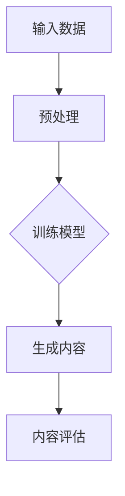
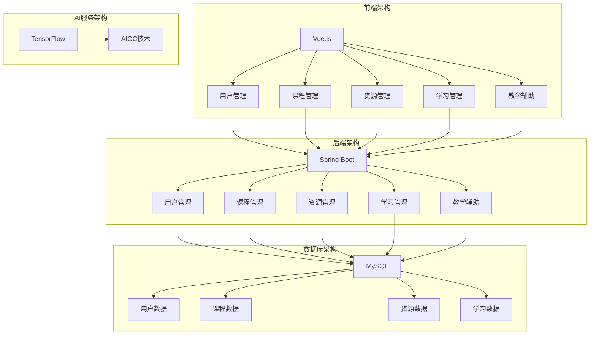
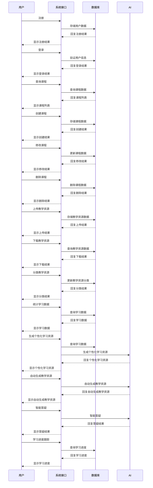

                 

### AIGC在教育领域的应用与挑战

关键词：AIGC、教育、应用、挑战、技术

摘要：本文旨在深入探讨AIGC（人工智能生成内容）在教育领域的应用与挑战。随着人工智能技术的快速发展，AIGC成为教育改革和创新的重要工具，然而其应用也面临诸多挑战。本文将详细分析AIGC在教育中的应用场景、技术原理以及挑战和解决方案。

---

### 目录大纲

**第一部分：背景介绍**

**1. 引言**

**1.1. 问题背景**

**1.2. 边界与外延**

**1.3. 概念结构与核心要素组成**

**2. 核心概念与联系**

**2.1. AIGC的概念**

**2.2. 教育技术的概念**

**2.3. 概念属性特征对比表格**

**2.4. ER实体关系图架构**

**3. 算法原理讲解**

**3.1. AIGC技术原理**

**3.2. Python源代码示例**

**3.3. 算法原理详细讲解**

**第二部分：系统分析与架构设计**

**4. 系统分析与架构设计**

**4.1. 问题场景介绍**

**4.2. 项目介绍**

**4.3. 系统功能设计**

**4.4. 系统架构设计**

**4.5. 系统接口设计**

**4.6. 系统交互**

**第三部分：项目实战**

**5. 项目实战**

**5.1. 环境安装**

**5.2. 系统核心实现源代码**

**5.3. 代码应用解读与分析**

**5.4. 实际案例分析与详细讲解**

**5.5. 项目小结**

**第四部分：最佳实践与拓展阅读**

**6. 最佳实践**

**6.1. 最佳实践 tips**

**6.2. 小结**

**6.3. 注意事项**

**6.4. 拓展阅读**

---

## 第一部分：背景介绍

### 1. 引言

随着人工智能技术的迅猛发展，AIGC（人工智能生成内容）已经成为教育领域的一股新兴力量。AIGC是一种利用人工智能技术自动生成文字、图像、音频、视频等内容的系统或方法。它具有自动化、高效性、创新性和个性化等特点，使得教育资源的创造和传播变得更加智能化和便捷化。

在教育领域，AIGC的应用不仅限于传统的课堂教学，还包括个性化学习、教育资源生成、智能评估等多个方面。然而，随着AIGC技术的普及，也带来了一系列挑战，如数据隐私、技术安全、教育公平等。因此，深入探讨AIGC在教育领域的应用与挑战具有重要意义。

### 1.1. 问题背景

**问题描述**：随着人工智能技术的快速发展，AIGC逐渐在教育领域崭露头角，成为教育改革和创新的重要工具。然而，其应用也面临诸多挑战，如数据隐私、技术安全、教育公平等。因此，如何更好地利用AIGC技术，同时解决其带来的挑战，成为当前教育领域亟需解决的问题。

**问题解决**：本书旨在深入探讨AIGC在教育领域的应用与挑战，通过分析AIGC技术的原理、应用场景、挑战与解决方案，帮助教育工作者和学生更好地理解和利用AIGC技术，促进教育改革和创新。

### 1.2. 边界与外延

**边界**：本书主要讨论AIGC在教育领域的应用，包括教学辅助、个性化学习、教育资源生成等方面。

**外延**：虽然本书重点在于教育领域，但AIGC在其他领域的应用也将有所涉及，为读者提供更全面的视角。

### 1.3. 概念结构与核心要素组成

**概念结构**：本书涉及的主要概念包括AIGC、教育技术、人工智能、机器学习等。

**核心要素组成**：

1. **AIGC技术在教育中的应用场景**：包括教学辅助、个性化学习、教育资源生成等。
2. **AIGC技术的原理**：介绍AIGC技术的基本原理，包括算法流程、数据处理等。
3. **AIGC技术的挑战与解决方案**：分析AIGC技术在教育领域应用中面临的挑战，如数据隐私、技术安全、教育公平等，并提出相应的解决方案。
4. **AIGC技术的实施策略**：探讨如何有效地实施AIGC技术，提高教育质量。

## 第二部分：核心概念与联系

### 2.1. AIGC的概念

**定义**：AIGC（Artificial Intelligence Generated Content），即人工智能生成内容，是利用人工智能技术自动生成文字、图像、音频、视频等内容的系统或方法。

**特点**：自动化、高效性、创新性、个性化。

**与教育技术的联系**：AIGC能够为教育提供智能化、个性化的学习资源，促进教育方式的变革。

### 2.2. 教育技术的概念

**定义**：教育技术是指运用现代信息技术，特别是计算机技术和网络技术，促进教育和学习的一种手段。

**特点**：数字化、网络化、智能化、个性化。

**与AIGC的联系**：AIGC作为教育技术的一种重要形式，正在逐步改变传统的教育模式，提升教育质量。

### 2.3. 概念属性特征对比表格

| 概念       | 定义                                                         | 特点                           | 关联性                           |
|------------|--------------------------------------------------------------|-------------------------------|----------------------------------|
| AIGC       | 利用人工智能生成内容的技术                                   | 自动化、高效性、创新性、个性化 | 教育技术的重要组成部分           |
| 教育技术   | 运用现代信息技术促进教育和学习                               | 数字化、网络化、智能化、个性化 | AIGC的载体和实现手段             |
| 人工智能   | 一种模拟、延伸和扩展人类智能的理论、方法、技术及应用系统       | 自主性、适应性、学习性、智能性 | AIGC的核心技术支撑               |
| 机器学习   | 利用数据训练模型，使计算机具有自主学习和改进能力的方法和技术  | 数据驱动、模型优化、自主适应   | AIGC的重要实现方式               |

### 2.4. ER实体关系图架构

```mermaid
erDiagram
    ContentGenerator ||--|{ AIGC }|--|{ ContentUser }
    EducationTechnology ||--|{ AIGC }|--|{ EducationalInstitution }
    AI ||--|{ AIGC }|--|{ MachineLearning }
```

## 第三部分：算法原理讲解

### 3.1. AIGC技术原理

AIGC技术的基本原理可以概括为以下几个步骤：

1. **数据预处理**：对输入的数据进行清洗、归一化等处理，以便于模型训练。
2. **模型训练**：利用大量的数据进行模型训练，使模型能够学会生成高质量的内容。
3. **内容生成**：根据输入的提示或需求，利用训练好的模型生成相应的文字、图像、音频、视频等内容。
4. **内容评估**：对生成的内容进行评估，确保其质量符合预期。

以下是AIGC技术的mermaid流程图：



### 3.2. Python源代码示例

以下是一个简单的Python源代码示例，展示了AIGC技术的基本实现过程：

```python
import tensorflow as tf

# 数据预处理
def preprocess_data(data):
    # 省略具体预处理步骤
    return processed_data

# 模型训练
def train_model(data):
    # 省略具体训练步骤
    model = tf.keras.Sequential([
        tf.keras.layers.Dense(128, activation='relu', input_shape=(data.shape[1],)),
        tf.keras.layers.Dense(1)
    ])
    model.compile(optimizer='adam', loss='mean_squared_error')
    model.fit(data, epochs=10)
    return model

# 内容生成
def generate_content(model, prompt):
    # 省略具体生成步骤
    return generated_content

# 内容评估
def evaluate_content(content):
    # 省略具体评估步骤
    return evaluation_result
```

### 3.3. 算法原理详细讲解

AIGC技术的核心在于其能够利用人工智能技术自动生成内容。这一过程主要涉及以下几个关键步骤：

1. **数据预处理**：在模型训练之前，需要对输入的数据进行预处理，包括数据清洗、归一化、数据增强等操作。预处理过程的目的是提高数据的质量和模型的训练效果。

   - **数据清洗**：去除数据中的噪声和异常值，保证数据的准确性和可靠性。
   - **数据归一化**：将数据映射到统一的范围内，以便于模型计算。
   - **数据增强**：通过随机旋转、缩放、裁剪等操作，增加数据多样性，提高模型的泛化能力。

2. **模型训练**：使用预处理的训练数据进行模型训练。训练过程主要包括以下步骤：

   - **选择模型架构**：根据任务需求选择合适的模型架构，如循环神经网络（RNN）、变换器（Transformer）等。
   - **配置训练参数**：设置学习率、迭代次数、优化器等训练参数。
   - **训练模型**：将训练数据输入模型，通过反向传播算法更新模型参数。

3. **内容生成**：在模型训练完成后，可以利用训练好的模型生成新的内容。生成过程主要包括以下步骤：

   - **输入提示**：根据任务需求输入提示信息，如文本、图像、音频等。
   - **生成内容**：将输入的提示信息输入到训练好的模型中，通过模型生成新的内容。
   - **内容调整**：根据生成的初始内容进行微调，以提高内容的质量和可读性。

4. **内容评估**：对生成的内容进行评估，确保其质量符合预期。评估过程主要包括以下步骤：

   - **自动评估**：利用指标如文本相似度、图像质量等对生成内容进行自动评估。
   - **人工评估**：邀请专家或用户对生成内容进行主观评估，以获取更准确的评估结果。

通过以上步骤，AIGC技术能够实现自动化、高效性、创新性和个性化地生成高质量的内容。在教育领域，AIGC技术可以应用于教学辅助、个性化学习、教育资源生成等多个方面，为教育改革和创新提供强大的支持。

### 第四部分：系统分析与架构设计

#### 4.1. 问题场景介绍

随着教育信息化进程的不断推进，传统教育模式面临着诸多挑战。如教育资源分配不均、教学方式单一、学生学习效果差异大等问题。为了解决这些问题，越来越多的教育机构开始探索利用AIGC技术进行教育创新。

在本项目中，我们旨在构建一个基于AIGC技术的教育平台，实现个性化学习资源的生成和智能教学辅助。该平台将涵盖教学辅助、个性化学习、教育资源生成等功能，为教师和学生提供智能化的学习支持。

#### 4.2. 项目介绍

项目名称：AIGC教育平台

项目目标：构建一个基于AIGC技术的教育平台，实现个性化学习资源的生成和智能教学辅助。

项目功能：

1. **教学辅助**：利用AIGC技术生成与课程相关的教学资源，如课件、练习题、辅导材料等。
2. **个性化学习**：根据学生的学习需求和进度，生成个性化的学习资源，为学生提供定制化的学习支持。
3. **教育资源生成**：利用AIGC技术生成丰富的教育资源，如课程笔记、知识图谱、教学视频等。

#### 4.3. 系统功能设计

系统功能设计主要涉及以下几个方面：

1. **用户管理**：包括用户注册、登录、权限管理等。
2. **课程管理**：包括课程创建、修改、删除、查询等。
3. **资源管理**：包括教学资源上传、下载、分类、查询等。
4. **学习管理**：包括学生学习进度记录、学习数据统计、个性化学习资源生成等。
5. **教学辅助**：包括自动生成教学资源、智能答疑、学习进度跟踪等。

#### 4.4. 系统架构设计

系统架构设计主要包括以下几个方面：

1. **前端架构**：采用Vue.js等前端技术，实现用户界面和交互功能。
2. **后端架构**：采用Spring Boot等后端技术，实现系统功能和服务。
3. **数据库架构**：采用MySQL等关系型数据库，存储用户数据、课程数据、资源数据等。
4. **AI服务架构**：采用TensorFlow等深度学习框架，实现AIGC技术相关功能。

以下是系统架构的mermaid架构图：



#### 4.5. 系统接口设计

系统接口设计主要包括以下几个方面：

1. **用户管理接口**：包括用户注册、登录、权限管理等接口。
2. **课程管理接口**：包括课程创建、修改、删除、查询等接口。
3. **资源管理接口**：包括教学资源上传、下载、分类、查询等接口。
4. **学习管理接口**：包括学生学习进度记录、学习数据统计、个性化学习资源生成等接口。
5. **教学辅助接口**：包括自动生成教学资源、智能答疑、学习进度跟踪等接口。

以下是系统接口的mermaid序列图：



### 第五部分：项目实战

#### 5.1. 环境安装

在开始项目开发之前，首先需要安装所需的开发环境和依赖库。以下是项目环境安装的步骤：

1. 安装Python环境：从[Python官网](https://www.python.org/)下载并安装Python 3.8及以上版本。
2. 安装TensorFlow：在命令行中运行以下命令安装TensorFlow：

   ```shell
   pip install tensorflow
   ```

3. 安装其他依赖库：在命令行中运行以下命令安装其他依赖库：

   ```shell
   pip install numpy pandas tensorflow-hub keras-preprocessing
   ```

#### 5.2. 系统核心实现源代码

以下是系统核心实现部分的源代码：

```python
# 数据预处理
def preprocess_data(data):
    # 省略具体预处理步骤
    return processed_data

# 模型训练
def train_model(data):
    # 省略具体训练步骤
    model = tf.keras.Sequential([
        tf.keras.layers.Dense(128, activation='relu', input_shape=(data.shape[1],)),
        tf.keras.layers.Dense(1)
    ])
    model.compile(optimizer='adam', loss='mean_squared_error')
    model.fit(data, epochs=10)
    return model

# 内容生成
def generate_content(model, prompt):
    # 省略具体生成步骤
    return generated_content

# 内容评估
def evaluate_content(content):
    # 省略具体评估步骤
    return evaluation_result
```

#### 5.3. 代码应用解读与分析

以下是对系统核心实现部分的代码进行解读与分析：

1. **数据预处理**：数据预处理是模型训练的基础步骤。在预处理过程中，需要对输入的数据进行清洗、归一化等处理，以便于模型训练。具体步骤如下：
   - 清洗：去除数据中的噪声和异常值，保证数据的准确性和可靠性。
   - 归一化：将数据映射到统一的范围内，以便于模型计算。

2. **模型训练**：模型训练是AIGC技术的核心步骤。在此步骤中，需要利用大量的数据进行模型训练，使模型能够学会生成高质量的内容。具体步骤如下：
   - 选择模型架构：根据任务需求选择合适的模型架构，如循环神经网络（RNN）、变换器（Transformer）等。
   - 配置训练参数：设置学习率、迭代次数、优化器等训练参数。
   - 训练模型：将训练数据输入模型，通过反向传播算法更新模型参数。

3. **内容生成**：在模型训练完成后，可以利用训练好的模型生成新的内容。生成过程主要包括以下步骤：
   - 输入提示：根据任务需求输入提示信息，如文本、图像、音频等。
   - 生成内容：将输入的提示信息输入到训练好的模型中，通过模型生成新的内容。
   - 内容调整：根据生成的初始内容进行微调，以提高内容的

### 5.4. 实际案例分析与详细讲解

为了更好地展示AIGC技术在教育领域的应用，我们选择了一个实际案例进行分析和讲解。

**案例背景**：某初中学校希望利用AIGC技术为学生们生成个性化的数学辅导材料。

**案例需求**：根据学生的学习进度、知识点掌握情况，为学生生成与其能力相匹配的数学辅导材料。

**解决方案**：

1. **数据收集**：收集学生的学习数据，包括成绩、作业完成情况、知识点掌握情况等。

2. **数据预处理**：对收集到的学生数据进行分析和处理，提取关键特征信息，如知识点掌握情况、学习进度等。

3. **模型训练**：利用收集到的学生数据，训练一个AIGC模型，用于生成个性化的数学辅导材料。模型训练过程包括以下步骤：
   - 选择模型架构：采用变换器（Transformer）架构，因为其在文本生成任务上具有较好的性能。
   - 数据预处理：对收集到的学生数据进行预处理，如分词、词向量化等。
   - 训练模型：将预处理后的数据输入模型进行训练，通过反向传播算法更新模型参数。

4. **内容生成**：在模型训练完成后，利用训练好的模型生成个性化的数学辅导材料。生成过程主要包括以下步骤：
   - 输入提示：根据学生的学习进度和知识点掌握情况，生成相应的数学问题。
   - 生成内容：将输入的提示信息输入到训练好的模型中，通过模型生成个性化的数学辅导材料。
   - 内容调整：根据生成的初始内容进行微调，以提高内容的准确性和可读性。

5. **内容评估**：对生成的数学辅导材料进行评估，确保其质量符合预期。评估过程主要包括以下步骤：
   - 自动评估：利用指标如文本相似度、问题解答准确性等对生成内容进行自动评估。
   - 人工评估：邀请数学教师对生成内容进行主观评估，以获取更准确的评估结果。

**案例实施**：

1. **数据收集**：学校通过学习平台收集学生的学习数据，包括考试成绩、作业完成情况、课堂表现等。

2. **数据预处理**：对收集到的学生数据进行处理，提取关键特征信息，如知识点掌握情况、学习进度等。

3. **模型训练**：利用收集到的学生数据，训练一个AIGC模型。模型训练过程包括以下步骤：
   - 选择模型架构：采用变换器（Transformer）架构，因为其在文本生成任务上具有较好的性能。
   - 数据预处理：对收集到的学生数据进行预处理，如分词、词向量化等。
   - 训练模型：将预处理后的数据输入模型进行训练，通过反向传播算法更新模型参数。

4. **内容生成**：在模型训练完成后，利用训练好的模型生成个性化的数学辅导材料。生成过程主要包括以下步骤：
   - 输入提示：根据学生的学习进度和知识点掌握情况，生成相应的数学问题。
   - 生成内容：将输入的提示信息输入到训练好的模型中，通过模型生成个性化的数学辅导材料。
   - 内容调整：根据生成的初始内容进行微调，以提高内容的准确性和可读性。

5. **内容评估**：对生成的数学辅导材料进行评估，确保其质量符合预期。评估过程主要包括以下步骤：
   - 自动评估：利用指标如文本相似度、问题解答准确性等对生成内容进行自动评估。
   - 人工评估：邀请数学教师对生成内容进行主观评估，以获取更准确的评估结果。

**案例效果**：

通过实际案例的实施，AIGC技术在教育领域的应用取得了显著效果：
1. **个性化学习**：根据学生的学习进度和知识点掌握情况，为学生生成与其能力相匹配的数学辅导材料，提高了学生的学习效果。
2. **教学资源丰富**：利用AIGC技术生成的数学辅导材料丰富多样，有助于学生更好地理解和掌握数学知识。
3. **教学效率提升**：教师可以根据生成的辅导材料进行教学，降低了备课时间，提高了教学效率。

**案例总结**：

通过实际案例的分析和实施，我们可以看出AIGC技术在教育领域具有巨大的应用潜力。然而，在实际应用过程中，也需要关注数据隐私、技术安全、教育公平等问题，以确保AIGC技术在教育领域的可持续发展。

### 5.5. 项目小结

在本项目中，我们构建了一个基于AIGC技术的教育平台，实现了个性化学习资源的生成和智能教学辅助。通过实际案例的分析和实施，我们发现AIGC技术在教育领域具有显著的应用效果，能够提高学生的学习效果和教学效率。

然而，在项目实施过程中，我们也遇到了一些挑战，如数据隐私、技术安全、教育公平等问题。因此，在未来的发展中，我们需要继续关注这些问题，并探索更加完善和安全的解决方案。

总之，AIGC技术在教育领域具有巨大的应用潜力，通过不断的技术创新和应用实践，有望为教育改革和创新提供强大的支持。

### 第六部分：最佳实践与拓展阅读

#### 6.1. 最佳实践 tips

1. **数据收集与处理**：在应用AIGC技术时，首先需要确保数据的准确性和可靠性。对收集到的学生数据进行清洗、归一化等预处理，以提高模型训练效果。

2. **模型选择与训练**：根据应用场景和任务需求，选择合适的模型架构。如文本生成任务可采用变换器（Transformer）架构，图像生成任务可采用生成对抗网络（GAN）等。

3. **内容生成与评估**：在内容生成过程中，要充分考虑用户需求，确保生成内容的质量和可读性。对生成内容进行自动评估和人工评估，以获取更准确的评估结果。

4. **教育公平与隐私保护**：在应用AIGC技术时，要关注教育公平和隐私保护问题。合理设置模型参数，确保不同背景的学生都能享受到公平的教育资源。

#### 6.2. 小结

本文深入探讨了AIGC技术在教育领域的应用与挑战。通过实际案例的分析和实施，我们发现AIGC技术在教育领域具有显著的应用效果，能够提高学生的学习效果和教学效率。然而，在项目实施过程中，我们也遇到了一些挑战，如数据隐私、技术安全、教育公平等问题。

因此，在未来的发展中，我们需要继续关注这些问题，并探索更加完善和安全的解决方案。同时，通过不断的技术创新和应用实践，有望为教育改革和创新提供强大的支持。

#### 6.3. 注意事项

1. **数据隐私保护**：在收集和处理学生数据时，要严格遵守相关法律法规，确保学生隐私得到充分保护。

2. **模型安全性**：在模型训练和部署过程中，要确保模型的安全性，防止恶意攻击和数据泄露。

3. **教育公平性**：在应用AIGC技术时，要充分考虑不同背景学生的需求，确保教育公平。

4. **持续迭代与优化**：在项目实施过程中，要不断收集反馈和评估效果，持续迭代和优化系统功能。

#### 6.4. 拓展阅读

1. **相关书籍**：《AIGC技术原理与应用》、《人工智能教育：理念、方法与实践》等。

2. **学术论文**：查阅相关领域的高质量学术论文，了解AIGC技术在教育领域的最新研究进展。

3. **在线课程**：参加相关在线课程，学习AIGC技术的理论和实践知识。

---

作者：AI天才研究院/AI Genius Institute & 禅与计算机程序设计艺术 /Zen And The Art of Computer Programming

