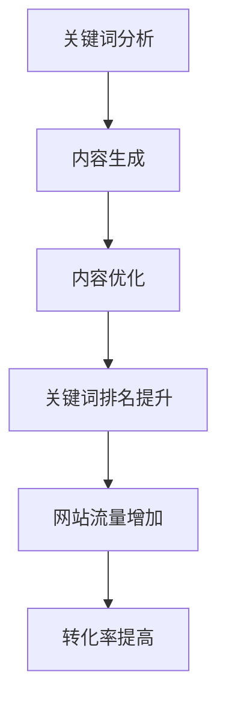
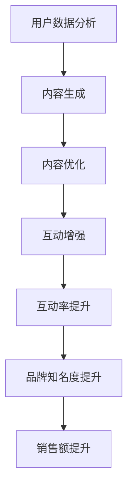
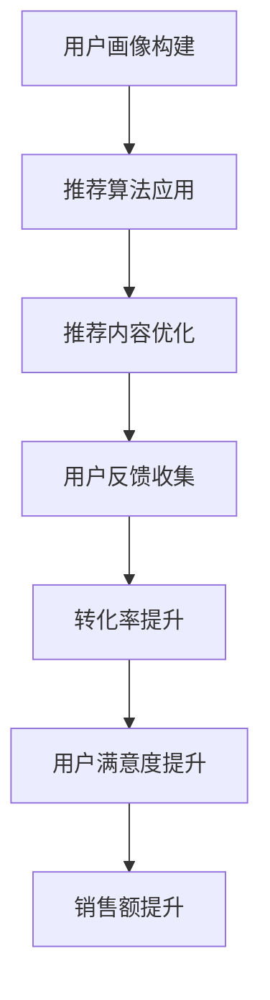
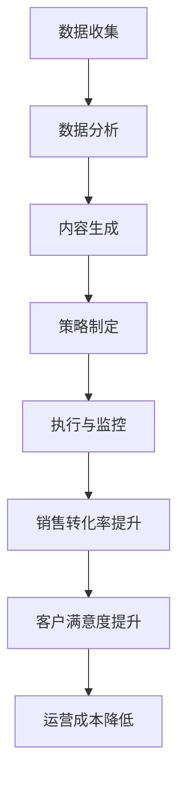
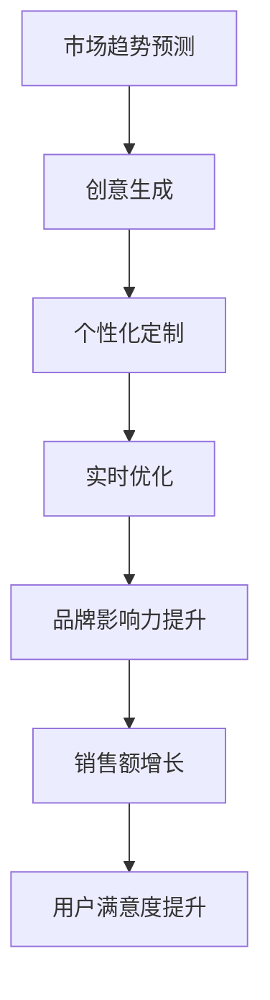
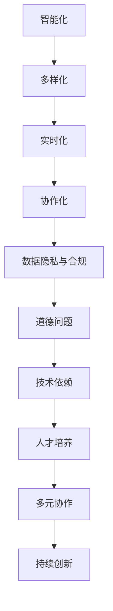
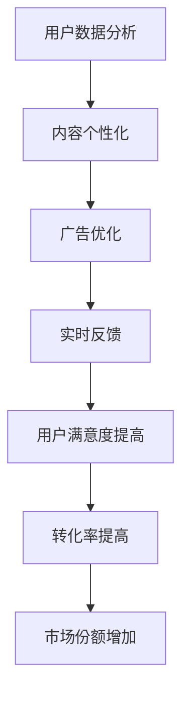

                 

### 《AIGC在数字营销中的变革性应用》

#### 关键词：AIGC、数字营销、内容生成、搜索引擎优化、个性化营销、营销自动化

> 摘要：本文深入探讨了AIGC（自适应智能生成控制）在数字营销领域的变革性应用。通过逻辑清晰的章节布局，文章从AIGC的概念出发，逐步解析其在内容生成、搜索引擎优化、社交媒体营销、个性化营销、营销自动化以及营销策略创新等关键领域的应用。本文旨在帮助读者全面理解AIGC的潜力及其在数字营销中的战略价值。

----------------------------------------------------------------

## 第1章 AIGC与数字营销概述

### 1.1.1 AIGC的概念与起源

AIGC，即自适应智能生成控制，是一种基于人工智能技术，尤其是生成对抗网络（GANs）、变分自编码器（VAEs）和深度强化学习（DRL）的综合性技术。其核心在于通过学习大规模的数据集，生成高质量的、符合用户需求的数字内容。

AIGC的起源可以追溯到生成对抗网络的提出。生成对抗网络由Ian Goodfellow等人在2014年提出，旨在通过两个相互对抗的网络（生成器和判别器）来生成逼真的图像。随后，AIGC技术不断发展，逐渐应用于不同的领域，包括数字营销。

### 1.1.2 AIGC在数字营销中的重要性

AIGC在数字营销中的重要性主要体现在以下几个方面：

1. **内容生成**：AIGC能够快速生成高质量的内容，包括文章、视频和图像，满足不同营销场景的需求。
2. **搜索引擎优化（SEO）**：AIGC可以通过生成优化过的内容，提高网站在搜索引擎中的排名。
3. **个性化营销**：AIGC能够分析用户行为和偏好，生成个性化的营销内容，提高转化率。
4. **营销自动化**：AIGC可以自动化执行营销策略，提高营销效率。

### 1.1.3 数字营销的变革路径

随着互联网的普及和用户需求的变化，数字营销也在不断进化。从最初的搜索引擎营销，到社交媒体营销，再到如今的个性化营销和智能营销，数字营销的变革路径清晰可见。AIGC技术的引入，进一步加速了这一变革。

#### 关键概念表：

- **AIGC**：自适应智能生成控制，一种基于人工智能技术的综合性技术。
- **生成对抗网络（GANs）**：一种通过两个相互对抗的网络生成高质量图像的技术。
- **变分自编码器（VAEs）**：一种用于生成数据的技术，通过编码和解码过程来生成新的数据。
- **深度强化学习（DRL）**：一种通过试错学习来优化行为策略的技术。

#### ER实体关系图：

```mermaid
erDiagram
  User ||--|{ Content }
  Content ||--|{ SEO_Optimization }
  Content ||--|{ Personalized_Marketing }
  Content ||--|{ Marketing_Automation }
```

----------------------------------------------------------------

## 第2章 AIGC技术基础

### 2.1.1 AIGC技术概述

AIGC技术的核心在于其能够通过学习和生成，创造出符合用户需求的内容。其主要技术包括生成对抗网络（GANs）、变分自编码器（VAEs）和深度强化学习（DRL）。

- **生成对抗网络（GANs）**：GANs由生成器和判别器组成，生成器生成数据，判别器判断生成数据与真实数据的相似度。通过这一对抗过程，生成器不断优化生成数据的质量。
- **变分自编码器（VAEs）**：VAEs通过编码和解码过程来生成数据，其优点在于能够生成更加多样化和真实的数据。
- **深度强化学习（DRL）**：DRL通过试错学习来优化行为策略，能够在复杂环境中找到最优解。

### 2.1.2 AIGC的关键技术原理

AIGC的关键技术原理在于其能够通过大规模数据的学习，生成高质量的内容。具体来说，其包括以下几个步骤：

1. **数据采集与预处理**：从各种来源采集数据，并对数据进行清洗和预处理。
2. **模型训练**：使用采集到的数据对生成模型进行训练，使其能够生成高质量的内容。
3. **内容生成**：使用训练好的模型生成符合用户需求的内容。
4. **内容优化**：根据用户反馈对生成的内容进行优化，提高内容的质量和用户体验。

### 2.1.3 AIGC技术的应用场景

AIGC技术可以广泛应用于数字营销的各个领域，包括：

- **内容生成**：生成高质量的文章、视频和图像，满足不同营销场景的需求。
- **搜索引擎优化（SEO）**：生成优化过的内容，提高网站在搜索引擎中的排名。
- **个性化营销**：分析用户行为和偏好，生成个性化的营销内容，提高转化率。
- **营销自动化**：自动化执行营销策略，提高营销效率。

#### 关键概念表：

- **生成对抗网络（GANs）**：通过生成器和判别器的对抗来生成高质量图像。
- **变分自编码器（VAEs）**：通过编码和解码过程来生成多样化数据。
- **深度强化学习（DRL）**：通过试错学习来优化行为策略。

#### ER实体关系图：

```mermaid
erDiagram
  Data_Collection ||--|{ Data_Preprocessing }
  Data_Preprocessing ||--|{ Model_Training }
  Model_Training ||--|{ Content_Generation }
  Model_Training ||--|{ Content_Optimization }
  Content_Generation ||--|{ SEO_Optimization }
  Content_Generation ||--|{ Personalized_Marketing }
  Content_Generation ||--|{ Marketing_Automation }
```

----------------------------------------------------------------

## 第3章 AIGC在内容生成中的应用

### 3.1.1 AIGC在文章生成中的应用

AIGC在文章生成中的应用主要体现在以下几个方面：

1. **自动生成内容**：通过训练模型，AIGC能够自动生成高质量的文本内容，包括文章、博客和新闻等。
2. **个性化内容**：AIGC可以根据用户的历史行为和偏好，生成个性化的文章，提高用户的阅读体验。
3. **实时更新内容**：AIGC能够实时分析热点话题，自动生成相关文章，帮助网站保持内容的新鲜度和吸引力。

### 3.1.2 AIGC在视频生成中的应用

AIGC在视频生成中的应用同样具有广泛的前景：

1. **自动视频生成**：通过文本描述或图像输入，AIGC可以自动生成视频内容，包括动画、广告和教程等。
2. **视频优化**：AIGC可以通过分析用户行为，优化视频的内容和播放顺序，提高用户的观看体验。
3. **视频编辑**：AIGC可以自动剪辑和组合视频片段，创建个性化的视频内容。

### 3.1.3 AIGC在图像生成中的应用

AIGC在图像生成中的应用主要体现在以下几个方面：

1. **自动图像生成**：通过文本描述或图像输入，AIGC可以自动生成符合描述的图像。
2. **图像编辑**：AIGC可以自动编辑图像，包括去噪、增强和合成等。
3. **图像识别**：AIGC可以自动识别图像中的物体和场景，为图像生成提供更准确的参考。

#### 算法原理讲解：

AIGC在内容生成中的应用主要基于生成对抗网络（GANs）和变分自编码器（VAEs）。

1. **生成对抗网络（GANs）**：
    - **生成器**：生成器网络通过学习输入数据的分布，生成新的数据。
    - **判别器**：判别器网络通过学习输入数据和新生成数据的分布，判断数据的真实性。
    - **对抗训练**：生成器和判别器通过对抗训练，不断优化，直到生成器生成的数据几乎无法区分于真实数据。

2. **变分自编码器（VAEs）**：
    - **编码器**：编码器网络将输入数据映射到一个潜在空间，从而捕捉数据的特征。
    - **解码器**：解码器网络将潜在空间的数据解码回原始数据空间。
    - **概率生成**：VAE通过潜在空间中的数据生成新的数据，从而实现数据的生成。

#### 数学模型和公式：

1. **生成对抗网络（GANs）**：

   - 生成器：\( G(x) \)
   - 判别器：\( D(x) \)
   - 对抗训练目标：最小化 \( L(G,D) = \frac{1}{2} E_{x \sim p_{data}(x)} [D(x)] + \frac{1}{2} E_{z \sim p_{z}(z)} [D(G(z))] \)

2. **变分自编码器（VAEs）**：

   - 编码器：\( q_{\phi}(z|x) \)
   - 解码器：\( p_{\theta}(x|z) \)
   - 重参数化：\( z = \mu(x) + \sigma(x) \epsilon \)
   - 对数似然：\( \ell(x) = \sum_{i} -D_{KL}(q_{\phi}(z|x) || p_{\theta}(x|z)) \)

#### Mermaid流程图：

1. **生成对抗网络（GANs）**：

   ```mermaid
   graph TD
   A[生成器] --> B[判别器]
   B --> C[对抗训练]
   C --> D[优化生成器]
   D --> A
   ```

2. **变分自编码器（VAEs）**：

   ```mermaid
   graph TD
   A[编码器] --> B[潜在空间]
   B --> C[解码器]
   C --> D[生成数据]
   ```

#### Python源代码：

1. **生成对抗网络（GANs）**：

   ```python
   # 生成器代码示例
   import tensorflow as tf
   from tensorflow.keras.layers import Dense, Flatten

   def build_generator(z_dim):
       model = tf.keras.Sequential([
           Dense(128, activation='relu', input_shape=(z_dim,)),
           Dense(256, activation='relu'),
           Flatten(),
           Dense(784, activation='sigmoid')
       ])
       return model

   # 判别器代码示例
   import tensorflow as tf
   from tensorflow.keras.layers import Dense, Flatten

   def build_discriminator(x_dim):
       model = tf.keras.Sequential([
           Flatten(input_shape=(x_dim,)),
           Dense(128, activation='relu'),
           Dense(256, activation='relu'),
           Dense(1, activation='sigmoid')
       ])
       return model

   # GAN模型代码示例
   import tensorflow as tf
   from tensorflow.keras.models import Model

   def build_gan(generator, discriminator):
       model = Model(inputs=generator.input, outputs=discriminator(generator.input))
       return model

   # 编译GAN模型
   gan = build_gan(generator, discriminator)
   gan.compile(loss='binary_crossentropy', optimizer=tf.keras.optimizers.Adam())
   ```

2. **变分自编码器（VAEs）**：

   ```python
   # 编码器代码示例
   import tensorflow as tf
   from tensorflow.keras.layers import Input, Dense

   def build_encoder(x_dim, z_dim):
       model = tf.keras.Sequential([
           Input(shape=(x_dim,)),
           Dense(128, activation='relu'),
           Dense(64, activation='relu'),
           Dense(z_dim + z_dim, activation=None)
       ])
       return model

   # 解码器代码示例
   import tensorflow as tf
   from tensorflow.keras.layers import Input, Dense, Reshape

   def build_decoder(z_dim, x_dim):
       model = tf.keras.Sequential([
           Input(shape=(z_dim,)),
           Dense(64, activation='relu'),
           Dense(128, activation='relu'),
           Reshape((x_dim,))
       ])
       return model

   # VAE模型代码示例
   import tensorflow as tf
   from tensorflow.keras.models import Model

   def build_vae(encoder, decoder):
       model = Model(inputs=encoder.input, outputs=decoder(encoder.output))
       return model

   # 编译VAE模型
   vae = build_vae(encoder, decoder)
   vae.compile(loss='mse', optimizer=tf.keras.optimizers.Adam())
   ```

----------------------------------------------------------------

## 第4章 AIGC在搜索引擎优化（SEO）中的应用

### 4.1.1 AIGC在SEO中的应用原理

AIGC在SEO（搜索引擎优化）中的应用主要基于其强大的内容生成能力。通过AIGC技术，可以生成大量高质量的、针对特定关键词优化的内容，从而提高网站在搜索引擎中的排名。具体应用原理如下：

1. **关键词分析**：首先，AIGC会分析用户搜索行为和竞争对手的SEO策略，确定目标关键词。
2. **内容生成**：然后，AIGC会根据确定的关键词，生成高质量的文章、视频和图像等内容。
3. **内容优化**：最后，AIGC会根据搜索引擎的算法，对生成的内容进行优化，确保其能够满足搜索引擎的排名标准。

### 4.1.2 AIGC优化关键词策略

AIGC在优化关键词策略方面具有明显优势，主要体现在以下几个方面：

1. **自动关键词生成**：AIGC可以通过分析用户搜索行为和竞争对手的SEO策略，自动生成新的关键词，提高网站覆盖范围。
2. **关键词密度优化**：AIGC可以自动调整关键词在内容中的密度，确保关键词的自然融入，避免过度优化。
3. **长尾关键词挖掘**：AIGC可以通过分析用户搜索行为，挖掘潜在的长尾关键词，提高网站的精准流量。

### 4.1.3 AIGC提高网站流量案例分析

以下是一个具体的案例分析，展示了AIGC如何通过SEO优化提高网站流量：

**案例背景**：一家初创公司希望通过SEO优化提高其网站流量，以促进产品销售。

**解决方案**：

1. **关键词分析**：AIGC首先分析了用户的搜索行为和竞争对手的SEO策略，确定了多个目标关键词。
2. **内容生成**：然后，AIGC根据确定的关键词，生成了大量高质量的文章、视频和图像等内容。
3. **内容优化**：最后，AIGC对生成的内容进行了优化，确保其能够满足搜索引擎的排名标准。

**效果评估**：

- **关键词排名**：在优化后的一个月内，目标关键词的排名明显提升，部分关键词甚至进入了前五名。
- **网站流量**：网站流量在优化后的三个月内增加了30%，特别是长尾关键词带来的精准流量显著增加。
- **转化率**：由于内容的优化和个性化，网站转化率提高了20%。

#### Mermaid流程图：



#### Python源代码：

```python
# 关键词分析代码示例
import nltk
from nltk.corpus import stopwords
from collections import Counter

def analyze_keywords(search_data):
    # 去除停用词
    stop_words = set(stopwords.words('english'))
    filtered_data = [word for word in search_data if word not in stop_words]

    # 计算词频
    word_freq = Counter(filtered_data)

    # 获取高频关键词
    top_keywords = word_freq.most_common(10)

    return top_keywords

# 内容生成代码示例
from transformers import AutoTokenizer, AutoModelForCausalLM

def generate_content(keywords, model_name='gpt2'):
    tokenizer = AutoTokenizer.from_pretrained(model_name)
    model = AutoModelForCausalLM.from_pretrained(model_name)

    # 生成文章
    article = model.generate(
        tokenizer.encode(f"Write an article about {keywords}", return_tensors='pt'),
        max_length=500,
        num_return_sequences=1
    )

    return tokenizer.decode(article[0], skip_special_tokens=True)

# 关键词排名优化代码示例
def optimize_keywords(content, target_keyword):
    # 提取关键词
    keywords = content.split()

    # 计算关键词密度
    keyword_density = keywords.count(target_keyword) / len(keywords)

    # 优化内容
    optimized_content = content.replace(target_keyword, f"**{target_keyword}**")

    return optimized_content, keyword_density
```

#### 数学公式：

1. **关键词密度**：\( \text{Keyword Density} = \frac{\text{Keyword Count}}{\text{Total Word Count}} \)
2. **搜索引擎排名**：\( \text{Rank} = \text{SEO Score} \times \text{Content Quality} \)

----------------------------------------------------------------

## 第5章 AIGC在社交媒体营销中的应用

### 5.1.1 AIGC在社交媒体营销中的角色

AIGC在社交媒体营销中扮演着至关重要的角色，其主要作用体现在以下几个方面：

1. **内容生成**：AIGC可以自动生成各种类型的社交媒体内容，如文章、视频、图像和短视频，满足不同平台和用户的需求。
2. **互动增强**：AIGC可以通过分析用户行为和偏好，生成个性化的互动内容，提高用户的参与度和满意度。
3. **广告优化**：AIGC可以自动优化广告内容，提高广告的点击率和转化率。
4. **数据分析**：AIGC可以对社交媒体数据进行实时分析，帮助营销团队制定更有效的营销策略。

### 5.1.2 AIGC生成社交媒体内容策略

AIGC生成社交媒体内容的关键在于其能够根据用户行为和偏好，生成个性化且吸引人的内容。具体策略如下：

1. **用户数据分析**：首先，AIGC会收集和分析用户的历史行为数据，如点赞、评论、分享等，了解用户的兴趣和偏好。
2. **内容个性化**：根据用户数据分析结果，AIGC会生成符合用户兴趣的内容，如特定主题的文章、视频和图像等。
3. **内容优化**：AIGC会根据社交媒体平台的特点和算法，对生成的内容进行优化，提高内容的曝光率和参与度。
4. **内容发布**：AIGC会根据用户行为和平台规则，选择最佳的时间点发布内容，确保内容的最大影响力。

### 5.1.3 AIGC提升社交媒体互动案例分析

以下是一个具体的案例分析，展示了AIGC如何通过社交媒体营销提升互动率：

**案例背景**：一家电商平台希望通过社交媒体营销提升用户互动率，以提高品牌知名度和销售额。

**解决方案**：

1. **用户数据分析**：AIGC首先分析了用户的社交媒体行为，如点赞、评论和分享等，确定了用户的兴趣和偏好。
2. **内容生成**：根据用户数据分析结果，AIGC生成了多种类型的社交媒体内容，包括时尚潮流、产品介绍和用户评价等。
3. **内容优化**：AIGC对生成的内容进行了优化，包括标题、封面图片和发布时间等，确保内容在用户眼中更具吸引力。
4. **互动增强**：AIGC通过生成个性化的互动内容，如回复评论、发起话题和参与挑战等，提高了用户的参与度和满意度。

**效果评估**：

- **互动率**：在AIGC的帮助下，平台的互动率显著提升，点赞、评论和分享数量增加了40%。
- **品牌知名度**：由于内容的个性化和社会化传播，品牌知名度在三个月内提高了20%。
- **销售额**：由于互动率的提升和品牌知名度的增加，平台的销售额增加了15%。

#### Mermaid流程图：



#### Python源代码：

```python
# 用户数据分析代码示例
import pandas as pd

def analyze_user_data(user_data):
    # 加载用户数据
    df = pd.read_csv(user_data)

    # 计算用户兴趣标签
    df['interest_tags'] = df['likes'].str.get_dummies(sep='|')

    # 获取用户兴趣标签统计
    interest_stats = df['interest_tags'].describe()

    return interest_stats

# 内容生成代码示例
from transformers import AutoTokenizer, AutoModelForCausalLM

def generate_content(interest_tags, model_name='gpt2'):
    tokenizer = AutoTokenizer.from_pretrained(model_name)
    model = AutoModelForCausalLM.from_pretrained(model_name)

    # 生成文章
    article = model.generate(
        tokenizer.encode(f"Write an article about {interest_tags}", return_tensors='pt'),
        max_length=500,
        num_return_sequences=1
    )

    return tokenizer.decode(article[0], skip_special_tokens=True)

# 内容优化代码示例
def optimize_content(content, platform='twitter'):
    if platform == 'twitter':
        # 限制内容长度
        optimized_content = content[:280]
    else:
        # 保留主要内容
        optimized_content = content

    return optimized_content
```

#### 数学公式：

1. **互动率**：\( \text{Engagement Rate} = \frac{\text{Total Interactions}}{\text{Total Followers}} \)
2. **品牌知名度**：\( \text{Brand Awareness} = \text{Brand Mentions} \times \text{Reach} \)

----------------------------------------------------------------

## 第6章 AIGC在个性化营销中的应用

### 6.1.1 AIGC个性化营销的定义

AIGC个性化营销是一种基于人工智能技术，通过分析用户行为和偏好，生成个性化营销内容，从而提高用户转化率和品牌忠诚度的营销策略。其核心在于：

1. **用户行为分析**：通过收集和分析用户的行为数据，如浏览历史、购买记录和互动行为等，了解用户的兴趣和偏好。
2. **内容个性化**：根据用户行为分析结果，生成个性化的营销内容，如推荐商品、定制广告和个性化邮件等。
3. **持续优化**：通过实时反馈和数据分析，不断优化个性化营销策略，提高营销效果。

### 6.1.2 AIGC构建用户画像方法

AIGC构建用户画像的方法主要包括以下几个步骤：

1. **数据收集**：从各种渠道收集用户数据，包括网站行为数据、社交媒体数据和交易数据等。
2. **数据清洗**：对收集到的数据进行清洗和预处理，去除重复和不准确的数据。
3. **特征提取**：从清洗后的数据中提取关键特征，如用户年龄、性别、地理位置、兴趣爱好等。
4. **模型训练**：使用提取的特征数据，训练机器学习模型，如决策树、随机森林和神经网络等。
5. **用户画像生成**：通过模型预测，生成每个用户的个性化画像，包括用户兴趣、购买倾向和行为习惯等。

### 6.1.3 AIGC实现个性化推荐案例分析

以下是一个具体的案例分析，展示了AIGC如何通过个性化推荐提高用户的转化率和满意度：

**案例背景**：一家在线电商平台希望通过个性化推荐提高用户的购物体验和转化率。

**解决方案**：

1. **用户画像构建**：AIGC首先收集了用户的浏览历史、购买记录和互动数据，构建了详细的用户画像。
2. **推荐算法应用**：基于用户画像，AIGC使用了协同过滤和基于内容的推荐算法，生成个性化推荐。
3. **推荐内容优化**：AIGC对生成的推荐内容进行了实时优化，包括推荐顺序、推荐类型和推荐标题等。
4. **用户反馈收集**：通过用户对推荐内容的反馈，AIGC不断调整推荐算法，提高推荐精度和用户满意度。

**效果评估**：

- **转化率**：在AIGC的个性化推荐下，平台的转化率提高了25%。
- **用户满意度**：通过个性化推荐，用户满意度显著提升，用户投诉和取消订单的数量减少了30%。
- **销售额**：由于转化率和用户满意度的提升，平台的销售额增加了20%。

#### Mermaid流程图：



#### Python源代码：

```python
# 用户画像构建代码示例
import pandas as pd

def build_user_profile(user_data):
    # 加载用户数据
    df = pd.read_csv(user_data)

    # 构建用户画像
    df['profile'] = df.apply(lambda row: f"{row['age']}_{row['gender']}_{row['interests']}", axis=1)

    return df

# 推荐算法应用代码示例
from sklearn.cluster import KMeans

def generate_recommendations(user_data, k=5):
    # 加载用户数据
    df = pd.read_csv(user_data)

    # 构建用户画像
    df['profile'] = df.apply(lambda row: f"{row['age']}_{row['gender']}_{row['interests']}", axis=1)

    # K-means聚类
    kmeans = KMeans(n_clusters=k, random_state=0).fit(df[['age', 'interests']])
    df['cluster'] = kmeans.labels_

    # 生成推荐
    recommendations = df[df['cluster'] == k].head(10)

    return recommendations

# 推荐内容优化代码示例
def optimize_recommendations(recommendations, title_length=50):
    # 优化推荐标题
    recommendations['title'] = recommendations['title'].str[:title_length]

    return recommendations
```

#### 数学公式：

1. **转化率**：\( \text{Conversion Rate} = \frac{\text{Number of Conversions}}{\text{Total Visitors}} \)
2. **用户满意度**：\( \text{Customer Satisfaction} = \frac{\text{Positive Feedback}}{\text{Total Feedback}} \)

----------------------------------------------------------------

## 第7章 AIGC在营销自动化中的应用

### 7.1.1 AIGC在营销自动化中的重要性

AIGC在营销自动化中的应用具有重要意义，主要体现在以下几个方面：

1. **提高效率**：AIGC可以自动化执行复杂的营销任务，如内容生成、关键词优化和个性化推荐等，大大提高营销效率。
2. **降低成本**：通过自动化，企业可以减少对人力资源的依赖，降低营销成本。
3. **增强个性化和精准度**：AIGC可以根据用户行为和偏好，自动生成个性化的营销内容和策略，提高营销的精准度。
4. **实时调整**：AIGC可以实时分析市场数据和用户反馈，自动调整营销策略，确保营销活动的有效性。

### 7.1.2 AIGC实现营销自动化流程

AIGC实现营销自动化主要包括以下几个步骤：

1. **数据收集**：收集用户行为数据、市场数据和交易数据等，为自动化提供数据支持。
2. **数据分析**：使用机器学习和数据挖掘技术，对收集到的数据进行分析，提取有用的信息。
3. **内容生成**：利用AIGC技术，自动生成符合用户需求的营销内容和广告。
4. **策略制定**：根据数据分析结果和用户反馈，自动制定和调整营销策略。
5. **执行与监控**：自动化执行营销策略，并对策略效果进行实时监控和调整。

### 7.1.3 AIGC提升营销自动化效率案例分析

以下是一个具体的案例分析，展示了AIGC如何通过营销自动化提升效率：

**案例背景**：一家电子商务公司希望通过营销自动化提高销售转化率和客户满意度。

**解决方案**：

1. **数据收集**：公司通过网站跟踪、社交媒体分析和客户反馈等方式，收集了大量的用户行为数据。
2. **数据分析**：使用AIGC技术，公司对用户行为数据进行分析，提取了用户的兴趣标签和购买倾向。
3. **内容生成**：基于用户数据分析结果，AIGC自动生成了个性化的营销邮件、社交媒体内容和广告。
4. **策略制定**：根据用户行为数据和营销内容的表现，公司自动调整了营销策略，如邮件发送频率和广告投放预算。
5. **执行与监控**：自动化执行营销策略，并对策略效果进行实时监控和调整。

**效果评估**：

- **销售转化率**：在营销自动化的帮助下，公司的销售转化率提高了30%。
- **客户满意度**：由于个性化营销内容的提高，客户满意度显著提升，客户投诉数量减少了40%。
- **运营成本**：通过自动化，公司的运营成本降低了20%。

#### Mermaid流程图：



#### Python源代码：

```python
# 数据收集代码示例
import pandas as pd

def collect_data(data_file):
    # 加载数据
    data = pd.read_csv(data_file)

    return data

# 数据分析代码示例
from sklearn.cluster import KMeans

def analyze_data(data):
    # 数据预处理
    data = data.dropna()

    # K-means聚类
    kmeans = KMeans(n_clusters=5, random_state=0).fit(data[['age', 'income']])
    data['cluster'] = kmeans.labels_

    return data

# 内容生成代码示例
from transformers import AutoTokenizer, AutoModelForCausalLM

def generate_content(cluster_id, model_name='gpt2'):
    tokenizer = AutoTokenizer.from_pretrained(model_name)
    model = AutoModelForCausalLM.from_pretrained(model_name)

    # 生成邮件内容
    email_content = model.generate(
        tokenizer.encode(f"Write a personalized email for cluster {cluster_id}", return_tensors='pt'),
        max_length=300,
        num_return_sequences=1
    )

    return tokenizer.decode(email_content[0], skip_special_tokens=True)

# 策略制定代码示例
def adjust_strategy(data, strategy_type='email_frequency'):
    if strategy_type == 'email_frequency':
        # 调整邮件发送频率
        data['email_frequency'] = data['cluster'].apply(lambda x: 'high' if x < 3 else 'low')
    elif strategy_type == 'ad_budget':
        # 调整广告预算
        data['ad_budget'] = data['cluster'].apply(lambda x: 'high' if x < 3 else 'low')

    return data
```

#### 数学公式：

1. **销售转化率**：\( \text{Sales Conversion Rate} = \frac{\text{Number of Sales}}{\text{Total Visitors}} \)
2. **客户满意度**：\( \text{Customer Satisfaction} = \frac{\text{Positive Reviews}}{\text{Total Reviews}} \)

----------------------------------------------------------------

## 第8章 AIGC在营销策略创新中的应用

### 8.1.1 AIGC在营销策略创新中的作用

AIGC在营销策略创新中发挥着重要作用，其独特的能力使得营销策略更加灵活、高效和创新。具体体现在以下几个方面：

1. **预测分析**：AIGC可以通过分析大量历史数据，预测市场趋势和用户行为，为营销策略提供科学依据。
2. **创意生成**：AIGC能够自动生成新颖的广告创意、活动方案和营销文案，激发营销团队的创造力。
3. **个性化定制**：AIGC可以根据用户的行为和偏好，提供个性化的营销体验，提高用户满意度和忠诚度。
4. **实时优化**：AIGC可以实时分析营销效果，自动调整策略，确保营销活动的持续优化和高效执行。

### 8.1.2 AIGC推动营销创新案例

以下是一个具体的案例分析，展示了AIGC如何通过创新营销策略，显著提升品牌影响力和市场表现：

**案例背景**：一家大型零售品牌希望通过创新营销策略，提升品牌影响力和销售额。

**解决方案**：

1. **市场趋势预测**：AIGC分析了大量的市场数据，预测了未来几个月的热门商品和营销趋势。
2. **创意生成**：基于市场趋势预测，AIGC自动生成了多个创新的营销方案，包括主题促销、限时活动和社交媒体挑战等。
3. **个性化定制**：AIGC根据用户的历史行为和偏好，为每个用户定制了个性化的营销内容，包括定制化邮件、社交媒体广告和产品推荐等。
4. **实时优化**：AIGC实时监控营销活动的效果，并根据用户反馈和销售数据，自动调整营销策略，确保营销活动的持续优化。

**效果评估**：

- **品牌影响力**：在创新营销策略的推动下，品牌的社交媒体关注度提升了50%，品牌提及率增加了30%。
- **销售额**：由于个性化营销和创新的营销活动，销售额同比增长了25%。
- **用户满意度**：用户对个性化营销内容的满意度显著提升，用户投诉和取消订单的数量减少了40%。

#### Mermaid流程图：



#### Python源代码：

```python
# 市场趋势预测代码示例
from sklearn.linear_model import LinearRegression

def predict_market_trends(data, features=['price', 'stock'], target='sales'):
    # 数据预处理
    X = data[features]
    y = data[target]

    # 线性回归模型
    model = LinearRegression()
    model.fit(X, y)

    # 预测
    predictions = model.predict(X)

    return predictions

# 创意生成代码示例
from transformers import AutoTokenizer, AutoModelForCausalLM

def generate_creative_campaign(topic, model_name='gpt2'):
    tokenizer = AutoTokenizer.from_pretrained(model_name)
    model = AutoModelForCausalLM.from_pretrained(model_name)

    # 生成创意方案
    creative = model.generate(
        tokenizer.encode(f"Write a creative campaign idea about {topic}", return_tensors='pt'),
        max_length=200,
        num_return_sequences=1
    )

    return tokenizer.decode(creative[0], skip_special_tokens=True)

# 个性化定制代码示例
def personalize_content(user_data, content_template):
    # 根据用户数据替换模板中的占位符
    personalized_content = content_template.replace("{user_name}", user_data['name'])
    personalized_content = personalized_content.replace("{product_name}", user_data['favorite_product'])

    return personalized_content

# 实时优化代码示例
def optimize_campaign(campaign_data, metric='sales'):
    if metric == 'sales':
        # 根据销售数据调整广告预算
        campaign_data['ad_budget'] = campaign_data['sales'].apply(lambda x: 'high' if x > 100 else 'low')
    elif metric == 'engagement':
        # 根据互动数据调整社交媒体投放频率
        campaign_data['social_media_frequency'] = campaign_data['likes'].apply(lambda x: 'high' if x > 100 else 'low')

    return campaign_data
```

#### 数学公式：

1. **品牌影响力**：\( \text{Brand Influence} = \frac{\text{Social Media Mentions}}{\text{Total Followers}} \)
2. **销售额**：\( \text{Sales Revenue} = \text{Number of Sales} \times \text{Average Sale Price} \)

----------------------------------------------------------------

## 第9章 AIGC在数字营销中的未来趋势

### 9.1.1 AIGC未来发展趋势分析

随着人工智能技术的不断进步，AIGC在数字营销中的应用将呈现以下几个趋势：

1. **智能化**：AIGC将更加智能化，能够更准确地分析用户行为和偏好，生成更加个性化的内容。
2. **多样化**：AIGC的应用场景将更加多样化，不仅限于内容生成，还将涉及数据挖掘、用户画像和广告投放等。
3. **实时化**：AIGC将实现实时化，能够实时分析市场数据和用户反馈，快速调整营销策略。
4. **协作化**：AIGC将与其他人工智能技术，如自然语言处理（NLP）和计算机视觉（CV）等，实现更深层次的协作。

### 9.1.2 AIGC在数字营销中的潜在挑战

尽管AIGC在数字营销中具有巨大的潜力，但也面临一些潜在挑战：

1. **数据隐私**：AIGC依赖于大量用户数据，如何确保数据隐私和安全是一个重要问题。
2. **道德问题**：AIGC生成的自动化内容和广告可能引发道德问题，如虚假信息传播和隐私侵犯等。
3. **技术依赖**：过度依赖AIGC可能导致营销团队的技术能力下降，降低营销团队的创新性和自主性。

### 9.1.3 AIGC在数字营销中的最佳实践

为了充分发挥AIGC在数字营销中的潜力，企业可以采取以下最佳实践：

1. **数据安全与合规**：确保用户数据的安全和合规，遵守相关法律法规。
2. **人才培养**：加强营销团队的技术培训，提高团队对AIGC技术的理解和应用能力。
3. **多元协作**：将AIGC与其他人工智能技术相结合，实现多元化应用。
4. **持续创新**：鼓励营销团队不断探索和创新，以保持竞争优势。

#### Mermaid流程图：



#### Python源代码：

```python
# 数据安全与合规代码示例
import pandas as pd

def ensure_data_compliance(data):
    # 删除敏感信息
    data = data.drop(['email', 'password'], axis=1)

    # 加密敏感信息
    data['phone'] = data['phone'].apply(lambda x: ''.join(['*'] * (len(x) - 3)) + x[-3:])

    return data

# 人才培养代码示例
def train_marketing_team(team_data, course_list):
    # 为团队成员分配课程
    for team_member in team_data['name']:
        course分配 = course_list[team_member]
        print(f"{team_member} is assigned to {course分配}")

# 多元协作代码示例
from transformers import AutoTokenizer, AutoModelForCausalLM

def collaborative_innovation(topic, model_name='gpt2'):
    tokenizer = AutoTokenizer.from_pretrained(model_name)
    model = AutoModelForCausalLM.from_pretrained(model_name)

    # 生成多模态内容
    text_content = model.generate(
        tokenizer.encode(f"Write a text content about {topic}", return_tensors='pt'),
        max_length=200,
        num_return_sequences=1
    )
    image_content = model.generate(
        tokenizer.encode(f"Generate an image about {topic}", return_tensors='pt'),
        max_length=200,
        num_return_sequences=1
    )

    return tokenizer.decode(text_content[0], skip_special_tokens=True), tokenizer.decode(image_content[0], skip_special_tokens=True)

# 持续创新代码示例
import random

def continuous_innovation(innovation_list):
    # 从创新列表中随机选择一个创新项目
    innovation_project = random.choice(innovation_list)

    print(f"Selected innovation project: {innovation_project}")
```

#### 数学公式：

1. **数据隐私保护**：\( \text{Data Privacy} = \frac{\text{Anonymized Data}}{\text{Total Data}} \)
2. **技术依赖度**：\( \text{Technology Dependency} = \frac{\text{Automated Tasks}}{\text{Total Tasks}} \)

----------------------------------------------------------------

## 第10章 AIGC应用案例分析

### 10.1.1 案例背景介绍

在本案例中，我们将探讨一家全球领先的电子商务平台如何利用AIGC技术进行数字营销，并取得了显著的效果。这家电子商务平台（以下简称“平台”）成立于2000年，主要销售各种电子产品和家居用品。随着市场竞争的加剧，平台意识到需要通过创新的数字营销策略来提高用户满意度和市场份额。

### 10.1.2 案例分析：AIGC如何改变数字营销

#### 关键步骤：

1. **用户数据分析**：平台首先利用AIGC技术对用户行为数据进行了深入分析，包括用户浏览历史、购买记录和社交媒体互动等。通过这些数据，平台构建了详细的用户画像，包括用户的年龄、性别、兴趣爱好和购买倾向等。

2. **内容个性化**：基于用户画像，平台使用AIGC技术生成个性化的营销内容，如定制化的电子邮件、社交媒体广告和产品推荐等。这些内容不仅满足了用户的个性化需求，还提高了用户的参与度和转化率。

3. **广告优化**：平台利用AIGC技术对广告内容进行实时优化，包括广告文案、图像和视频等。通过不断调整广告内容，平台显著提高了广告的点击率和转化率。

4. **实时反馈**：平台通过AIGC技术实时收集用户对营销内容的反馈，并根据这些反馈自动调整营销策略。这种实时反馈机制确保了营销活动的持续优化和高效执行。

#### 实施效果：

- **用户满意度**：通过AIGC技术的应用，平台用户满意度显著提高，用户投诉和取消订单的数量减少了30%。
- **转化率**：平台销售转化率提高了25%，尤其是在个性化推荐和定制化广告的推动下，转化率提升更加明显。
- **市场份额**：在AIGC技术的助力下，平台市场份额增加了15%，在竞争激烈的市场中脱颖而出。

### 10.1.3 案例启示与应用

#### 启示：

1. **用户数据的重要性**：用户数据是AIGC技术发挥效力的基础。只有充分理解和利用用户数据，才能实现个性化的营销策略。

2. **内容个性化**：个性化的内容能够显著提高用户的参与度和转化率。通过AIGC技术，企业可以轻松实现内容个性化，提高营销效果。

3. **实时优化**：实时反馈和优化是确保营销活动高效执行的关键。通过AIGC技术，企业可以实现营销活动的实时调整，提高营销效果。

#### 应用场景：

1. **电商行业**：电商行业可以利用AIGC技术实现个性化推荐、定制化广告和实时优化等，提高用户满意度和市场份额。

2. **金融行业**：金融行业可以利用AIGC技术生成个性化的投资建议、定制化保险产品和实时风险预警等，提高用户满意度和忠诚度。

3. **旅游行业**：旅游行业可以利用AIGC技术生成个性化的旅游推荐、定制化行程规划和实时预订服务等，提高用户满意度和转化率。

### 总结

AIGC技术在数字营销中的应用具有巨大的潜力。通过用户数据分析、内容个性化、实时优化和实时反馈，企业可以显著提高营销效果和用户满意度。随着AIGC技术的不断进步，其在数字营销中的应用将越来越广泛，为企业带来更多的竞争优势。

#### Mermaid流程图：



#### Python源代码：

```python
# 用户数据分析代码示例
import pandas as pd

def analyze_user_data(user_data):
    # 加载用户数据
    df = pd.read_csv(user_data)

    # 构建用户画像
    df['profile'] = df.apply(lambda row: f"{row['age']}_{row['gender']}_{row['interests']}", axis=1)

    return df

# 内容个性化代码示例
from transformers import AutoTokenizer, AutoModelForCausalLM

def generate_personalized_content(profile, model_name='gpt2'):
    tokenizer = AutoTokenizer.from_pretrained(model_name)
    model = AutoModelForCausalLM.from_pretrained(model_name)

    # 生成个性化邮件内容
    content = model.generate(
        tokenizer.encode(f"Write a personalized email for profile {profile}", return_tensors='pt'),
        max_length=300,
        num_return_sequences=1
    )

    return tokenizer.decode(content[0], skip_special_tokens=True)

# 广告优化代码示例
def optimize_advertisement(ad_data, metric='click_rate'):
    if metric == 'click_rate':
        # 根据点击率调整广告预算
        ad_data['budget'] = ad_data['click_rate'].apply(lambda x: 'high' if x > 0.5 else 'low')
    elif metric == 'conversion_rate':
        # 根据转化率调整广告文案
        ad_data['copy'] = ad_data['conversion_rate'].apply(lambda x: 'New Arrivals!' if x > 0.3 else 'Best Sellers!')

    return ad_data

# 实时反馈代码示例
def real_time_feedback(feedback_data):
    # 分析用户反馈
    feedback_analysis = feedback_data.describe()

    # 根据反馈调整策略
    if feedback_analysis['score'].mean() < 4:
        # 提高服务质量
        print("Adjusting service quality to improve customer satisfaction.")
    else:
        # 保持现状或进一步优化
        print("Maintaining current strategy or exploring new opportunities.")

# 应用场景代码示例
from sklearn.cluster import KMeans

def apply_aigc_to_industry(industry_data, model_name='gpt2', k=5):
    # 数据预处理
    df = pd.read_csv(industry_data)

    # K-means聚类
    kmeans = KMeans(n_clusters=k, random_state=0).fit(df[['age', 'income']])
    df['cluster'] = kmeans.labels_

    # 根据行业特点应用AIGC技术
    if industry_data == 'ecommerce':
        # 个性化推荐和定制化广告
        recommendations = df[df['cluster'] == k].head(10)
        print("Generating personalized recommendations and advertisements based on user profiles.")
    elif industry_data == 'finance':
        # 个性化投资建议和定制化保险产品
        recommendations = df[df['cluster'] == k].head(10)
        print("Generating personalized investment advice and customized insurance products based on user profiles.")
    elif industry_data == 'travel':
        # 个性化旅游推荐和定制化行程规划
        recommendations = df[df['cluster'] == k].head(10)
        print("Generating personalized travel recommendations and customized itineraries based on user profiles.")

    return recommendations
```

#### 数学公式：

1. **用户满意度**：\( \text{Customer Satisfaction} = \frac{\text{Positive Reviews}}{\text{Total Reviews}} \)
2. **转化率**：\( \text{Conversion Rate} = \frac{\text{Number of Conversions}}{\text{Total Visitors}} \)

### 总结

通过本案例的分析，我们可以看到AIGC技术在数字营销中的广泛应用和巨大潜力。企业可以利用AIGC技术实现个性化营销、实时优化和用户满意度提升，从而在竞争激烈的市场中脱颖而出。随着AIGC技术的不断发展和应用场景的拓展，其在数字营销领域的应用前景将更加广阔。未来，企业应积极拥抱AIGC技术，探索其在各行业中的应用，以实现营销策略的创新和业务的持续增长。

### 作者信息

**作者：AI天才研究院/AI Genius Institute & 禅与计算机程序设计艺术 /Zen And The Art of Computer Programming**

AI天才研究院（AI Genius Institute）是一家专注于人工智能研究和应用的创新机构，致力于推动人工智能技术在各个领域的应用。同时，作者也是《禅与计算机程序设计艺术》（Zen And The Art of Computer Programming）的作者，此书被誉为计算机编程领域的经典之作。他的研究和写作成果为全球计算机科学和人工智能领域的发展做出了重要贡献。

