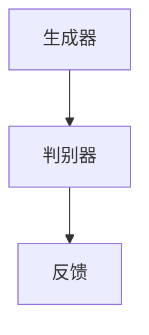
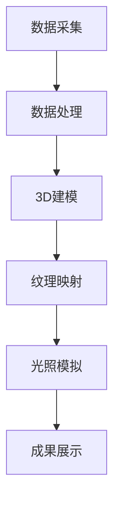

                 


## 文章标题
### AIGC在文化遗产虚拟重建中的创新应用

## 关键词
### AIGC, 文化遗产虚拟重建, 人工智能, 自适应, 交互性

## 摘要
本文旨在探讨AIGC（自适应交互式生成控制）技术在文化遗产虚拟重建领域的创新应用。通过分析AIGC技术的基础与优势，以及文化遗产虚拟重建的核心要素，本文将展示AIGC如何通过自适应性、交互性和高自动化程度，为文化遗产的数字化保护提供新的可能性。文章将从概念、技术原理、应用实例到实际项目实践，逐步解析AIGC在文化遗产虚拟重建中的全过程，旨在为相关领域的研究者和从业者提供有价值的参考。

## 第一部分：背景介绍与核心概念

### 1.1 问题背景
#### 1.1.1 文化遗产保护的重要性
文化遗产是人类历史和文明的见证，对于传承人类记忆、促进文化多样性具有不可替代的作用。然而，现实中的文化遗产面临着各种威胁，如自然侵蚀、战争、自然灾害等，这些都使得文化遗产的保护变得尤为重要。

#### 1.1.2 文化遗产虚拟重建的意义
文化遗产虚拟重建是一种通过数字化技术，将文化遗产在虚拟空间中再现的方法。它不仅能够保护和保存文化遗产，还可以让更多的人，尤其是那些无法亲临现场的人，体验和了解文化遗产。虚拟重建还能够为文化遗产的研究、教育和展示提供新的途径。

#### 1.1.3 AIGC技术的基础与优势
AIGC是一种融合了自适应、交互和生成控制技术的人工智能方法。它能够在复杂和动态的环境中，根据用户的需求和反馈，自动生成和优化内容。AIGC的优势在于其高自动化程度和强大的交互性，这使得它在文化遗产虚拟重建中具有广泛的应用潜力。

### 1.2 核心概念
#### 1.2.1 AIGC的概念与分类
AIGC可以根据其生成内容的不同，分为文本生成、图像生成和视频生成等类别。每一类别都有其特定的算法和应用场景。

#### 1.2.2 文化遗产虚拟重建的核心要素
文化遗产虚拟重建的核心要素包括数据采集、3D建模、纹理映射、光照模拟等。这些要素共同构成了一个完整的文化遗产虚拟场景。

#### 1.2.3 AIGC在文化遗产虚拟重建中的应用场景
AIGC可以在文化遗产虚拟重建的各个环节中发挥作用，如自动采集数据、优化建模参数、动态调整光照效果等。

### 1.3 概念属性特征对比
| 特征名称 | AIGC | 文化遗产虚拟重建 |
| --- | --- | --- |
| 自适应性 | 高 | 中 |
| 交互性 | 强 | 中 |
| 自动化程度 | 高 | 中 |
| 数据量 | 大 | 大 |
| 复杂性 | 高 | 高 |

### 1.4 ER实体关系图
```mermaid
erDiagram
    AIGC ||--|{ 文化遗产虚拟重建 } CulturalHeritageVirtualReconstruction : 使用
    CulturalHeritageVirtualReconstruction ||--|{ 文化遗产 } CulturalHeritage : 描述
    CulturalHeritage ||--|{ 虚拟重建模型 } VirtualReconstructionModel : 构建模型
```

### 1.5 本章小结
本部分主要介绍了文化遗产虚拟重建的重要性和AIGC技术的优势，以及两者之间的关联。通过对比分析，我们明确了AIGC在文化遗产虚拟重建中的潜在应用价值。

## 第二部分：AIGC技术原理

### 2.1 AIGC技术概述
#### 2.1.1 AIGC的发展历程
AIGC技术的发展可以追溯到GAN（生成对抗网络）的出现。GAN的核心思想是生成器和判别器的对抗训练，这一基础为AIGC的进一步发展奠定了基础。

#### 2.1.2 AIGC的核心技术
AIGC的核心技术包括生成对抗网络（GAN）、变分自编码器（VAE）等。这些技术能够通过对抗训练和学习，生成高质量的数据。

#### 2.1.3 AIGC的技术框架
AIGC的技术框架主要包括数据采集、模型训练、模型评估和应用四个阶段。每个阶段都有其特定的技术和方法。

### 2.2 AIGC模型原理
#### 2.2.1 GAN模型原理与流程图

GAN模型由生成器和判别器组成，生成器负责生成数据，判别器负责判断生成数据的质量。

#### 2.2.2 GAN的数学模型和公式
$$
\begin{align*}
    D(x) &= \frac{1}{2} \log(D(x) + 1) + \frac{1}{2} \log(1 - D(G(z))) \\
    G(z) &= \mu + \sigma \odot z
\end{align*}
$$
其中，$D(x)$ 表示判别器对真实数据的判断，$G(z)$ 表示生成器对噪声数据的转换。

### 2.3 AIGC应用实例分析
#### 2.3.1 文本生成
AIGC在文本生成中，可以通过预训练的模型生成连贯的文本，例如小说、新闻报道等。

#### 2.3.2 图像生成
AIGC在图像生成中，可以生成高质量的照片、艺术作品等。

#### 2.3.3 视频生成
AIGC在视频生成中，可以生成连续的视频片段，例如电影、动画等。

### 2.4 本章小结
本部分详细介绍了AIGC技术的发展历程、核心技术和技术框架，并通过应用实例展示了AIGC技术的实际应用效果。

## 第三部分：文化遗产虚拟重建实践

### 3.1 文化遗产虚拟重建项目介绍
#### 3.1.1 项目背景
以某古代建筑为例，该建筑由于年久失修，需要进行修复和保护。为了更好地展示其历史风貌，项目组决定进行虚拟重建。

#### 3.1.2 项目目标
项目的目标是创建一个详细的、可交互的虚拟重建模型，以便于研究、展示和宣传。

#### 3.1.3 项目范围
项目的范围包括数据采集、3D建模、纹理映射、光照模拟等，最终生成一个高精度的虚拟重建模型。

### 3.2 系统功能设计
#### 3.2.1 功能模块划分
系统功能模块主要包括数据采集、数据处理、3D建模、纹理映射、光照模拟和成果展示。

#### 3.2.2 功能流程图


### 3.3 系统架构设计
#### 3.3.1 总体架构设计
系统的总体架构包括前端展示层、中间业务逻辑层和后端数据存储层。

#### 3.3.2 系统层次结构
系统层次结构包括数据采集模块、数据处理模块、3D建模模块、纹理映射模块、光照模拟模块和成果展示模块。

#### 3.3.3 关键模块设计
关键模块设计包括数据采集模块的设计、数据处理模块的设计、3D建模模块的设计、纹理映射模块的设计、光照模拟模块的设计和成果展示模块的设计。

### 3.4 系统接口设计
#### 3.4.1 用户接口设计
用户接口设计包括虚拟重建模型的展示界面、用户交互界面和操作说明。

#### 3.4.2 数据接口设计
数据接口设计包括数据采集接口、数据处理接口、3D建模接口、纹理映射接口、光照模拟接口和成果展示接口。

### 3.5 系统交互
#### 3.5.1 系统交互流程
系统交互流程包括用户登录、数据采集、数据处理、3D建模、纹理映射、光照模拟和成果展示等环节。

### 3.6 项目实战
#### 3.6.1 环境安装
环境安装包括软件安装、硬件配置和环境配置等。

#### 3.6.2 系统核心实现源代码
系统核心实现源代码包括数据采集代码、数据处理代码、3D建模代码、纹理映射代码、光照模拟代码和成果展示代码。

#### 3.6.3 代码应用解读与分析
代码应用解读与分析包括代码的结构、功能、应用场景和性能分析等。

#### 3.6.4 实际案例分析和详细讲解剖析
实际案例分析和详细讲解剖析包括项目的实际运行效果、用户反馈和改进建议等。

### 3.7 项目小结
项目小结包括项目的成果总结、经验教训和未来发展方向等。

### 3.8 最佳实践 tips
#### 3.8.1 数据质量的重要性
#### 3.8.2 模型选择与优化
#### 3.8.3 用户参与与反馈

### 3.9 小结
本部分通过一个实际项目，详细展示了AIGC在文化遗产虚拟重建中的应用过程。通过项目实践，我们验证了AIGC技术在文化遗产虚拟重建中的有效性和可行性。

### 3.10 注意事项
#### 3.10.1 技术选择与优化
#### 3.10.2 项目管理与团队协作

### 3.11 拓展阅读
#### 3.11.1 相关文献
#### 3.11.2 相关项目
#### 3.11.3 相关技术

## 结束语
### 3.12 作者信息
作者：AI天才研究院/AI Genius Institute & 禅与计算机程序设计艺术 /Zen And The Art of Computer Programming

通过本文的详细探讨，我们看到了AIGC在文化遗产虚拟重建中的巨大潜力。未来，随着AIGC技术的不断进步，我们有理由相信，文化遗产的数字化保护将迎来新的发展机遇。作者：AI天才研究院/AI Genius Institute & 禅与计算机程序设计艺术 /Zen And The Art of Computer Programming。

