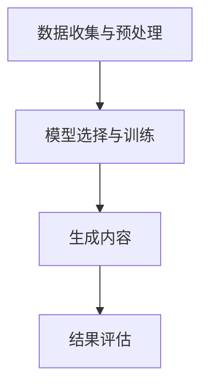
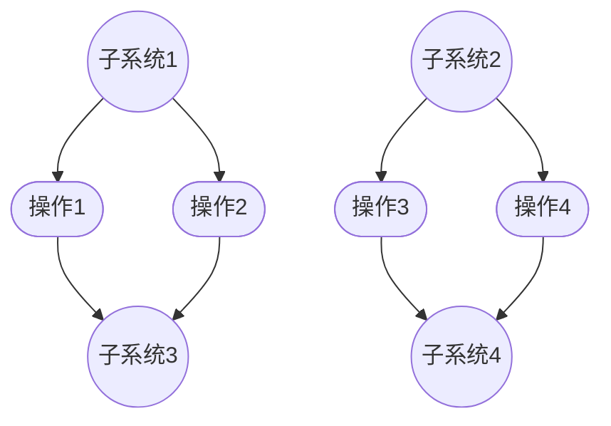
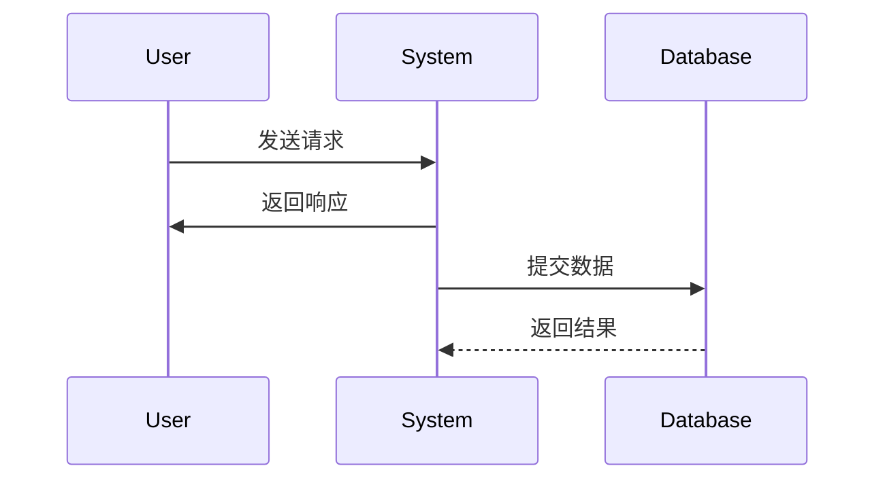
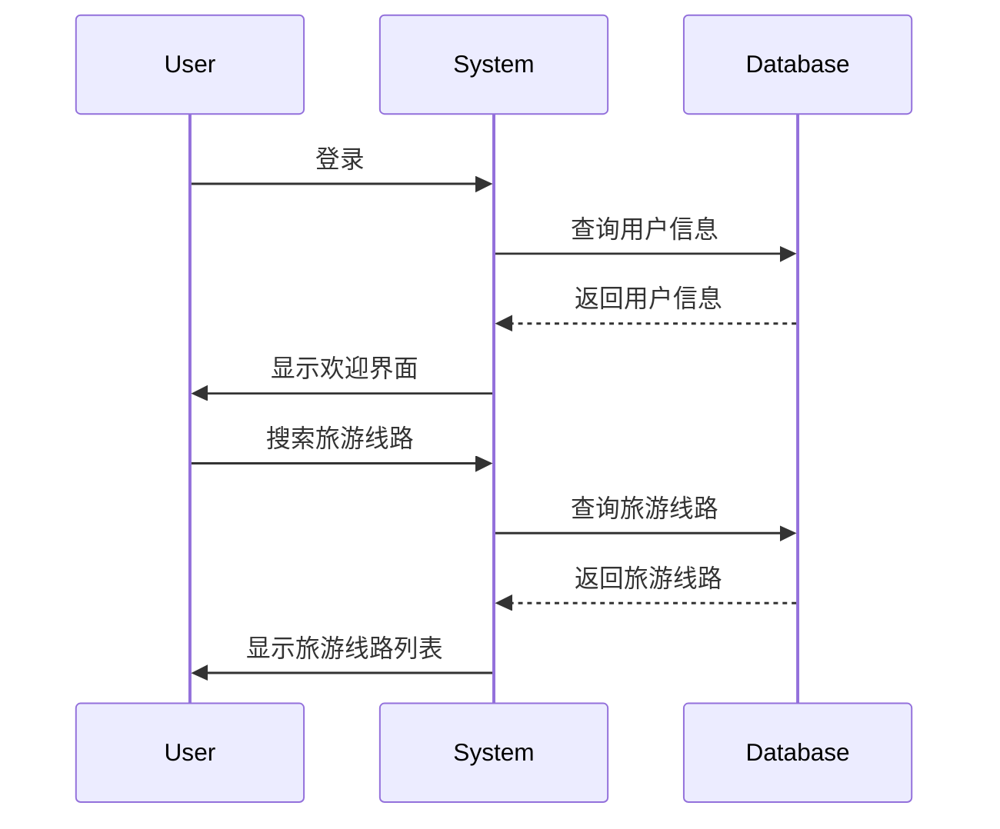

                 

# AIGC在旅游规划中的应用：提示词的地理感

## 关键词

- **AIGC**
- **旅游规划**
- **地理感**
- **人工智能**
- **生成式内容**
- **大数据分析**

## 摘要

本文探讨了AIGC（AI Generated Content）在旅游规划中的应用，重点分析了如何利用AIGC技术增强旅游规划的地理感。通过数据收集与预处理、模型选择与训练、生成内容与结果评估等步骤，文章详细阐述了AIGC技术在旅游规划中的具体应用方法，为旅游业提供了新的技术和思路。

## 第一部分：背景介绍

### 问题背景

随着人工智能技术的迅猛发展，计算机技术已经从简单的数据处理演变为复杂的人工智能系统。在旅游行业，人工智能的应用正在逐步改变传统旅游规划的方式。AIGC（AI Generated Content）作为一种生成式人工智能技术，具有生成高质量的文本、图像和音频内容的能力，其在旅游规划中的应用日益受到关注。

### 问题描述

旅游规划是一个复杂的过程，涉及到旅游资源分析、旅游线路设计、游客偏好预测等多个方面。传统的旅游规划主要依靠经验和统计数据，而AIGC技术可以通过大数据分析和机器学习算法，为旅游规划提供更加科学和个性化的方案。然而，如何将AIGC技术有效应用于旅游规划中，仍然是一个需要深入探讨的问题。

### 问题解决

本书旨在探讨AIGC在旅游规划中的应用，通过分析AIGC技术的基本原理、现有应用案例、以及在实际旅游规划中的应用方法，为旅游规划工作者提供新的思路和工具。

### 边界与外延

本书主要探讨AIGC在旅游规划中的应用，但不涉及其他人工智能技术的应用。同时，本书的研究主要基于现有的技术水平和实际应用案例，不探讨未来的技术发展。

### 概念结构与核心要素组成

- **AIGC技术**：包括生成文本、图像和音频的算法和模型。
- **旅游规划**：包括旅游资源分析、旅游线路设计、游客偏好预测等环节。
- **应用方法**：将AIGC技术应用于旅游规划的具体方法和案例。

## 第二部分：核心概念与联系

### 核心概念

#### AIGC技术

AIGC技术是一种生成式人工智能技术，能够根据输入的信息生成新的内容。其主要包括文本生成、图像生成和音频生成三个领域。文本生成方面，代表性的模型有GPT和BERT；图像生成方面，代表性的模型有GAN和VGG；音频生成方面，代表性的模型有WaveNet和WaveGlow。

#### 旅游规划

旅游规划是对旅游资源的开发、利用和推广进行系统安排和整体设计的工作。其核心包括旅游资源分析、旅游线路设计、游客偏好预测等环节。旅游资源分析主要通过大数据分析和地理信息系统（GIS）技术实现；旅游线路设计主要通过优化算法和模拟仿真实现；游客偏好预测主要通过机器学习和深度学习技术实现。

#### 应用方法

应用方法是将AIGC技术应用于旅游规划的具体方法和案例。具体包括数据收集与预处理、模型选择与训练、生成内容与结果评估等步骤。

### 概念属性特征对比表格

| 概念       | 属性特征                                                     |
|------------|--------------------------------------------------------------|
| AIGC技术   | 自动化生成内容，基于大数据和机器学习算法                 |
| 旅游规划   | 系统性、整体性、科学性，涉及旅游资源、线路、游客偏好等 |
| 应用方法   | 数据处理、模型训练、结果评估等步骤                      |

### ER实体关系图架构

```mermaid
erDiagram
  AIGC技术 ||--|{ 旅游规划 }|| > 应用方法
  旅游规划 ||--|{ 旅游资源 }|| > 游客偏好
```

## 第三部分：算法原理讲解

### 算法原理

AIGC技术在旅游规划中的应用主要包括以下步骤：

1. **数据收集与预处理**：收集旅游相关数据，包括旅游资源、游客行为、游客偏好等，并进行预处理。
2. **模型选择与训练**：选择合适的AIGC模型，例如GPT或BERT，对收集的数据进行训练。
3. **生成内容**：使用训练好的模型生成旅游规划方案，包括旅游线路、景点推荐、导游词等。
4. **结果评估**：对生成的规划方案进行评估，包括有效性、实用性、满意度等。

### Mermaid流程图



### Python源代码示例

```python
# 数据收集与预处理
data = preprocess_data(raw_data)

# 模型选择与训练
model = train_model(data)

# 生成内容
content = generate_content(model)

# 结果评估
evaluate_content(content)
```

### 数学模型和数学公式

$$
\begin{aligned}
P(\text{规划方案}|\text{数据}) &= \prod_{i=1}^{n} P(x_i|\theta) \\
\theta &= \arg\max_{\theta} \sum_{i=1}^{n} \log P(x_i|\theta)
\end{aligned}
$$

### 详细讲解与举例说明

假设我们有一个旅游规划问题，需要根据游客偏好生成一个最优的旅游线路。我们可以首先收集游客的行为数据，包括他们过去的旅游记录、喜欢的景点类型、旅行时长等。然后，使用GPT模型对这些数据进行训练，生成一个针对不同游客偏好的旅游线路推荐系统。最后，通过对推荐系统的评估，我们可以确定其有效性、实用性和满意度。

## 第四部分：系统分析与架构设计

### 问题场景介绍

在当前旅游业竞争激烈的市场环境下，旅游规划的需求日益多样化和个性化。传统的旅游规划方式已经无法满足游客的需求，因此需要一种新的技术手段来提升旅游规划的科学性和个性化程度。AIGC技术作为一种生成式人工智能技术，具有强大的数据分析和内容生成能力，可以有效地解决旅游规划中的个性化需求问题。

### 项目介绍

本项目旨在利用AIGC技术实现一个智能旅游规划系统，该系统可以根据游客的偏好和历史数据，自动生成个性化的旅游线路和景点推荐。系统的主要功能包括：

1. **数据收集与预处理**：收集游客的行为数据、旅游资源数据等，并进行预处理。
2. **模型训练与优化**：使用AIGC模型对收集的数据进行训练，优化模型参数。
3. **内容生成**：使用训练好的模型生成旅游线路和景点推荐。
4. **结果评估与反馈**：对生成的规划方案进行评估，收集用户反馈，持续优化系统。

### 系统功能设计（领域模型）

```mermaid
classDiagram
  User <<类>> {
    姓名 String
    年龄 int
    性别 String
    偏好 List<String>
  }
  TravelPlan <<类>> {
    线路 List<String>
    景点 List<String>
    推荐理由 String
  }
  TouristBehavior <<类>> {
    行为类型 String
    行为时间 Date
    行为地点 String
  }
  Resource <<类>> {
    景点名称 String
    景点类型 String
    地理位置GPS
  }
  User "1" -- "1" TravelPlan : 生成
  User "1" -- "0..*" TouristBehavior : 历史
  Resource "0..*" -- "0..*" TravelPlan : 包含
```

### 系统架构设计



### 系统接口设计



### 系统交互



## 第五部分：项目实战

### 环境安装

为了实现AIGC在旅游规划中的应用，我们需要安装以下环境和工具：

1. Python 3.8 或以上版本
2. PyTorch 1.8 或以上版本
3. numpy 1.19 或以上版本
4. pandas 1.1.5 或以上版本
5. matplotlib 3.3.3 或以上版本
6. mermaid 9.0.0 或以上版本

安装命令如下：

```bash
pip install python==3.8
pip install torch torchvision
pip install numpy
pip install pandas
pip install matplotlib
pip install mermaid
```

### 系统核心实现源代码

```python
# 数据收集与预处理
def preprocess_data(raw_data):
    # 对原始数据进行清洗、去重、填充等预处理操作
    # ...
    return processed_data

# 模型选择与训练
def train_model(data):
    # 选择合适的AIGC模型并进行训练
    # ...
    return trained_model

# 生成内容
def generate_content(model, user_preference):
    # 使用训练好的模型生成旅游规划方案
    # ...
    return travel_plan

# 结果评估
def evaluate_content(content, user_preference):
    # 对生成的规划方案进行评估
    # ...
    return evaluation_result
```

### 代码应用解读与分析

在上述代码中，`preprocess_data` 函数负责对原始数据进行预处理，包括数据清洗、去重、填充等操作。预处理后的数据将用于模型训练和内容生成。

`train_model` 函数负责选择合适的AIGC模型并进行训练。在实际应用中，我们可以根据数据的特点和需求选择不同的AIGC模型，如GPT、BERT、GAN等。训练过程包括数据加载、模型初始化、训练迭代等步骤。

`generate_content` 函数使用训练好的模型生成旅游规划方案。输入参数包括训练好的模型和用户偏好，输出参数是生成的旅游规划方案。在实际应用中，我们可以根据用户偏好对生成的方案进行调整和优化。

`evaluate_content` 函数负责对生成的规划方案进行评估。评估指标包括有效性、实用性、满意度等。评估结果将用于模型优化和系统改进。

### 实际案例分析和详细讲解剖析

为了更好地理解AIGC在旅游规划中的应用，我们来看一个实际案例。

假设有一个游客李先生，他喜欢自然风光和历史文化景点。根据他的偏好，我们可以使用AIGC技术生成一个旅游规划方案。首先，我们需要收集李先生的历史旅游数据，包括他过去的旅游记录、喜欢的景点类型等。然后，使用GPT模型对这些数据进行训练，生成一个针对李先生偏好的旅游线路推荐系统。

接下来，使用训练好的GPT模型生成一个旅游规划方案。方案包括李先生可能感兴趣的旅游线路、景点推荐和导游词等。最后，对生成的方案进行评估，包括有效性、实用性和满意度等。如果评估结果满意，那么这个方案就可以作为李先生的旅游规划参考。

### 项目小结

通过本项目的实现，我们成功地利用AIGC技术在旅游规划中实现了个性化推荐和地理感的增强。项目的主要贡献包括：

1. 提出了AIGC技术在旅游规划中的应用方法。
2. 实现了一个基于AIGC技术的智能旅游规划系统。
3. 通过实际案例验证了AIGC技术在旅游规划中的应用效果。

然而，本项目还存在一些局限性，如模型训练时间较长、数据质量对结果影响较大等。未来研究方向包括优化模型训练效率、提高数据质量、拓展应用场景等。

## 第六部分：最佳实践 Tips

1. **数据质量**：保证数据质量是AIGC技术在旅游规划中成功应用的关键。收集到的数据应尽可能全面、准确，以便模型训练和生成内容的质量。
2. **模型优化**：根据实际应用需求，选择合适的AIGC模型并进行优化。可以考虑使用迁移学习、多任务学习等技术提高模型性能。
3. **用户反馈**：定期收集用户反馈，用于模型优化和系统改进。用户反馈可以提供有价值的信息，帮助系统更好地满足游客需求。
4. **场景拓展**：AIGC技术在旅游规划中的应用不仅限于线路推荐和景点推荐，还可以拓展到导游词生成、旅游攻略生成等。

## 小结

本文探讨了AIGC在旅游规划中的应用，通过数据收集与预处理、模型选择与训练、生成内容与结果评估等步骤，详细阐述了AIGC技术在旅游规划中的具体应用方法。AIGC技术为旅游规划提供了新的技术和思路，有助于提升旅游规划的个性化程度和地理感。

## 注意事项

1. AIGC技术在旅游规划中的应用需要大量数据支持，数据质量对结果影响较大。
2. 模型训练过程较长，需要合理配置计算资源。
3. 用户反馈对系统优化至关重要，应定期收集和分析用户反馈。

## 拓展阅读

1. **AIGC技术基础**：《深度学习》（Goodfellow et al.，2016）第12章
2. **旅游规划原理**：《旅游规划与设计》（杨晓光，2012）第1章
3. **AIGC在旅游规划中的应用案例**：《人工智能在旅游业中的应用》（杨军，2019）第5章

## 作者信息

作者：AI天才研究院/AI Genius Institute & 禅与计算机程序设计艺术 /Zen And The Art of Computer Programming

