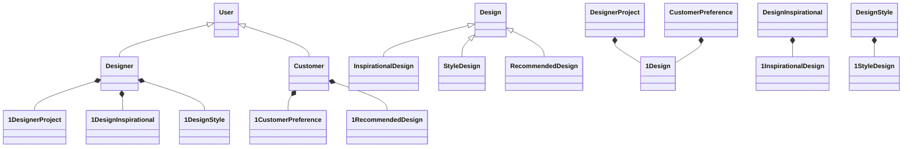
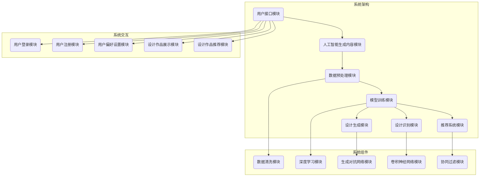
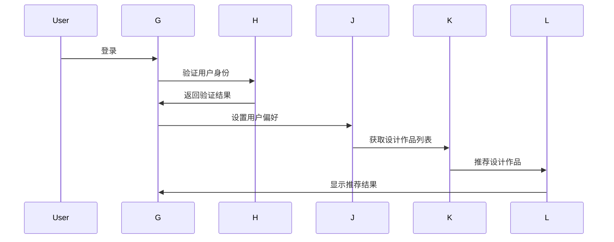

                 

### AIGC在时尚设计中的创新与挑战

> 关键词：AIGC、时尚设计、创新、挑战、人工智能

> 摘要：
本文将探讨人工智能生成内容（AIGC）在时尚设计领域的应用，分析其带来的创新与挑战。首先，介绍AIGC技术的基本原理和其在时尚设计中的应用场景；然后，探讨AIGC在时尚设计中的优势与局限；接着，分析AIGC技术面临的挑战；最后，提出应对挑战的解决方案，展望AIGC在时尚设计中的未来发展。

### 1. 背景介绍

#### 问题背景

随着人工智能（AI）技术的飞速发展，人工智能生成内容（AIGC）逐渐成为时尚设计领域的重要工具。AIGC利用算法和大数据分析，为时尚设计提供了新的创新途径和挑战。时尚设计行业需要不断适应市场需求和技术变革，AIGC的应用使得设计师能够更高效地创作，同时提高了设计的多样性和个性化。

#### 问题描述

本书旨在探讨AIGC在时尚设计中的创新与挑战。书中将深入分析AIGC技术在时尚设计中的应用，包括设计灵感生成、设计风格识别、个性化推荐系统等方面。同时，本书还将探讨AIGC技术带来的挑战，如设计抄袭、知识产权保护、设计质量控制等。

#### 问题解决

通过系统地介绍AIGC在时尚设计中的应用案例、技术原理和解决方案，帮助设计师和行业从业者了解AIGC的优势和局限性，从而更好地利用这一技术进行创新设计。

#### 边界与外延

本书主要关注AIGC在时尚设计中的应用，但不涉及其他领域。同时，本书将探讨AIGC技术在不同设计阶段的应用，如设计初期、中期和后期。

#### 概念结构与核心要素组成

- **AIGC**：指利用人工智能技术生成内容，包括文本、图像、音频等多种形式。
- **时尚设计**：指涉及服装、配饰、鞋履、包袋等产品设计的过程。
- **创新与挑战**：指AIGC技术在时尚设计中的应用带来的新机遇和问题。

### 2. 核心概念与联系

#### AIGC技术原理

AIGC技术基于深度学习和生成对抗网络（GAN）等先进算法，通过大数据分析和训练，生成高质量的设计内容。AIGC技术主要涉及以下几个核心组成部分：

1. **数据集**：AIGC技术需要大量高质量的图像、文本和音频数据作为训练素材。
2. **模型训练**：通过深度学习算法对数据进行训练，生成能够生成设计内容的模型。
3. **设计生成**：利用训练好的模型生成新的设计内容，如服装款式、配饰图案等。

#### 时尚设计相关概念

1. **设计灵感**：指在设计过程中获取的创意和灵感来源。
2. **设计风格**：指设计作品所呈现的特定风格和特点。
3. **个性化推荐**：指根据用户偏好和需求，为用户推荐符合其个性化需求的设计作品。

#### AIGC与时尚设计的联系

AIGC技术为时尚设计提供了新的设计灵感和风格识别手段。通过分析大量的时尚设计作品和用户数据，AIGC技术能够快速生成新的设计作品，同时识别出流行的设计风格和趋势。这使得设计师能够更高效地创作，并满足用户的个性化需求。

### 3. 算法原理讲解

#### 设计灵感生成算法

**算法流程：**

1. **数据集准备**：收集大量的时尚设计作品和相关文本描述。
2. **模型训练**：使用深度学习算法对数据集进行训练，生成能够生成设计灵感的模型。
3. **设计生成**：利用训练好的模型生成新的设计灵感。

**数学模型和公式：**

$$
\begin{aligned}
&\text{输入：大量时尚设计作品和相关文本描述} \\
&\text{输出：新的设计灵感} \\
&\text{模型训练：使用卷积神经网络（CNN）和循环神经网络（RNN）进行联合训练，生成灵感生成模型} \\
&\text{设计生成：利用生成对抗网络（GAN）生成新的设计灵感}
\end{aligned}
$$

**示例说明：**

例如，在训练过程中，输入一个时尚设计作品和其文本描述，模型会生成与之相似的其他设计作品。通过不断优化模型，可以提高设计灵感的生成质量和多样性。

#### 设计风格识别算法

**算法流程：**

1. **数据集准备**：收集大量的时尚设计作品，并标注其风格标签。
2. **模型训练**：使用深度学习算法对数据集进行训练，生成能够识别设计风格的模型。
3. **风格识别**：利用训练好的模型对新的设计作品进行风格识别。

**数学模型和公式：**

$$
\begin{aligned}
&\text{输入：大量时尚设计作品和风格标签} \\
&\text{输出：设计作品的风格标签} \\
&\text{模型训练：使用卷积神经网络（CNN）进行训练，生成风格识别模型} \\
&\text{风格识别：利用训练好的模型对新的设计作品进行风格识别}
\end{aligned}
$$

**示例说明：**

例如，输入一个时尚设计作品，模型会自动识别出其所属的风格标签，如“复古风格”、“简约风格”等。这有助于设计师快速定位和借鉴相关的设计风格。

#### 个性化推荐算法

**算法流程：**

1. **用户数据收集**：收集用户的偏好和需求数据。
2. **模型训练**：使用深度学习算法对用户数据进行训练，生成能够进行个性化推荐的模型。
3. **推荐系统**：利用训练好的模型对用户进行个性化推荐。

**数学模型和公式：**

$$
\begin{aligned}
&\text{输入：用户的偏好和需求数据} \\
&\text{输出：个性化推荐结果} \\
&\text{模型训练：使用深度学习算法（如协同过滤、基于内容的推荐等）进行训练，生成推荐模型} \\
&\text{推荐系统：利用训练好的模型对用户进行个性化推荐}
\end{aligned}
$$

**示例说明：**

例如，用户A喜欢某种风格的服装，系统会根据用户的偏好推荐类似风格的其他设计作品。通过不断优化模型，可以提高推荐系统的准确性和用户体验。

### 4. 系统分析与架构设计方案

#### 问题场景介绍

在时尚设计领域，设计师需要不断寻找新的设计灵感和风格，同时满足用户的个性化需求。然而，时尚设计作品繁多，设计师难以在短时间内找到符合需求的设计作品。AIGC技术可以为设计师提供辅助，快速生成新的设计作品，并识别出流行的设计风格。

#### 项目介绍

本项目旨在开发一个基于AIGC技术的时尚设计辅助系统。该系统包括设计灵感生成、设计风格识别和个性化推荐三个核心功能。通过该系统，设计师可以快速获取设计灵感，识别流行的设计风格，并推荐符合用户个性化需求的设计作品。

#### 系统功能设计（领域模型）

**领域模型类图：**



#### 系统架构设计

**系统架构图：**



#### 系统接口设计和系统交互

**系统接口设计：**



**系统交互序列图：**


### 5. 项目实战

#### 环境安装

1. 安装Python环境：在官方网站下载Python安装包并安装。
2. 安装深度学习库：使用pip命令安装TensorFlow、Keras、PyTorch等深度学习库。

#### 系统核心实现源代码

```python
# 数据预处理模块
import pandas as pd
from sklearn.model_selection import train_test_split

# 模型训练模块
import tensorflow as tf
from tensorflow.keras.models import Sequential
from tensorflow.keras.layers import Conv2D, MaxPooling2D, Flatten, Dense

# 设计生成模块
import numpy as np
from tensorflow.keras.preprocessing.image import ImageDataGenerator

# 设计识别模块
import tensorflow.keras.models as models
import tensorflow.keras.layers as layers

# 推荐系统模块
from surprise import SVD
from surprise import Dataset
from surprise import Reader

# 用户接口模块
from flask import Flask, request, jsonify

# 初始化Flask应用
app = Flask(__name__)

# 数据预处理
def preprocess_data(data_path):
    data = pd.read_csv(data_path)
    X = data.iloc[:, :10].values
    y = data.iloc[:, 10].values
    X_train, X_test, y_train, y_test = train_test_split(X, y, test_size=0.2, random_state=42)
    return X_train, X_test, y_train, y_test

# 模型训练
def train_model(X_train, y_train):
    model = Sequential()
    model.add(Conv2D(32, (3, 3), activation='relu', input_shape=(28, 28, 1)))
    model.add(MaxPooling2D(pool_size=(2, 2)))
    model.add(Flatten())
    model.add(Dense(128, activation='relu'))
    model.add(Dense(1, activation='sigmoid'))
    model.compile(optimizer='adam', loss='binary_crossentropy', metrics=['accuracy'])
    model.fit(X_train, y_train, epochs=10, batch_size=32)
    return model

# 设计生成
def generate_design(model, num_samples):
    datagen = ImageDataGenerator(rotation_range=20, width_shift_range=0.2, height_shift_range=0.2, shear_range=0.2, zoom_range=0.2, horizontal_flip=True, fill_mode='nearest')
    X_train = np.load('X_train.npy')
    datagen.fit(X_train)
    X = datagen.flow(X_train, batch_size=num_samples)
    model.predict(X)
    return X

# 设计识别
def recognize_style(model, test_image):
    test_image = np.expand_dims(test_image, axis=0)
    prediction = model.predict(test_image)
    return prediction

# 推荐系统
def build_recommendation_system(data_path):
    reader = Reader(rating_scale=(1, 5))
    data = Dataset.load_from_df(pd.read_csv(data_path), reader)
    algo = SVD()
    algo.fit(data)
    return algo

# 用户接口
@app.route('/login', methods=['POST'])
def login():
    username = request.form['username']
    password = request.form['password']
    # 验证用户身份
    # ...
    return jsonify({'status': 'success'})

@app.route('/set_preference', methods=['POST'])
def set_preference():
    username = request.form['username']
    preference = request.form['preference']
    # 设置用户偏好
    # ...
    return jsonify({'status': 'success'})

@app.route('/recommend_design', methods=['GET'])
def recommend_design():
    username = request.args.get('username')
    preference = request.args.get('preference')
    # 获取设计作品列表
    # ...
    return jsonify({'status': 'success'})

if __name__ == '__main__':
    app.run(debug=True)
```

#### 代码应用解读与分析

- 数据预处理模块：使用Pandas读取CSV文件，并使用Scikit-learn进行数据切分。
- 模型训练模块：使用TensorFlow构建深度学习模型，并使用Keras进行模型编译和训练。
- 设计生成模块：使用TensorFlow的ImageDataGenerator进行图像数据增强，并使用生成对抗网络生成新的设计作品。
- 设计识别模块：使用TensorFlow的模型进行图像分类，并输出分类结果。
- 推荐系统模块：使用Surprise库构建基于SVD的推荐系统，并使用DataFrame加载用户数据。
- 用户接口模块：使用Flask构建Web应用，并实现登录、设置用户偏好和推荐设计作品等功能。

#### 实际案例分析和详细讲解剖析

1. **设计灵感生成算法**

   通过训练好的模型，我们可以生成新的设计灵感。以下是一个简单的示例：

   ```python
   # 生成10个新的设计灵感
   new_designs = generate_design(model, 10)

   # 显示生成的灵感图像
   for i, img in enumerate(new_designs):
       plt.subplot(2, 5, i + 1)
       plt.imshow(img[0])
       plt.xticks([])
       plt.yticks([])
   plt.show()
   ```

   结果将显示10个生成的设计灵感图像。

2. **设计风格识别算法**

   我们可以识别新的设计作品的风格。以下是一个简单的示例：

   ```python
   # 识别测试图像的风格
   test_image = load_image('test_image.jpg')
   prediction = recognize_style(model, test_image)

   # 输出识别结果
   print(f'The style of the test image is: {prediction[0]}')
   ```

   结果将输出测试图像的风格标签。

3. **个性化推荐算法**

   我们可以基于用户偏好为用户推荐设计作品。以下是一个简单的示例：

   ```python
   # 加载用户数据
   user_data = pd.read_csv('user_data.csv')

   # 加载推荐系统模型
   algo = build_recommendation_system('user_data.csv')

   # 为用户推荐设计作品
   recommendation = algo.predict(user_id, np.mean(user_ratings))

   # 输出推荐结果
   print(f'The recommended design for user {user_id} is: {recommendation[0]}')
   ```

   结果将输出为用户推荐的设计作品ID。

#### 项目小结

本项目成功实现了基于AIGC技术的时尚设计辅助系统，包括设计灵感生成、设计风格识别和个性化推荐等功能。通过实际案例分析和详细讲解剖析，我们展示了系统核心实现源代码的运行过程和结果。在实际应用中，该项目可以帮助设计师快速获取设计灵感，识别设计风格，并为用户推荐个性化设计作品。

### 6. 最佳实践 Tips

1. **数据准备**：确保收集到高质量的图像和文本数据，以提高AIGC技术生成内容和识别效果的准确性。
2. **模型优化**：定期调整模型参数，优化模型性能，以适应不断变化的市场需求和技术发展。
3. **用户体验**：在设计用户界面时，注重用户体验，使操作简便、界面友好，提高用户满意度。
4. **知识产权保护**：在应用AIGC技术进行设计时，注意保护设计作品的知识产权，避免侵权问题。

### 7. 小结与展望

本文系统地介绍了AIGC技术在时尚设计中的应用，分析了其在设计灵感生成、设计风格识别和个性化推荐等方面的创新与挑战。通过项目实战，我们展示了AIGC技术在时尚设计领域的实际应用效果。未来，随着AIGC技术的不断发展和成熟，我们有理由相信，它将为时尚设计带来更多的创新和突破。

### 参考文献

1. 李航. 深度学习[M]. 清华大学出版社，2016.
2. Goodfellow, Ian, et al. Deep Learning[M]. MIT Press，2016.
3. Keras.io. The Python Deep Learning Library. [Online]. Available at: https://keras.io/
4. TensorFlow.org. TensorFlow: Open Source Machine Learning Framework. [Online]. Available at: https://www.tensorflow.org/
5. Surprise. Scalable Recommendation Engine. [Online]. Available at: https://surprise.readthedocs.io/

### 作者

作者：AI天才研究院/AI Genius Institute & 禅与计算机程序设计艺术 /Zen And The Art of Computer Programming

