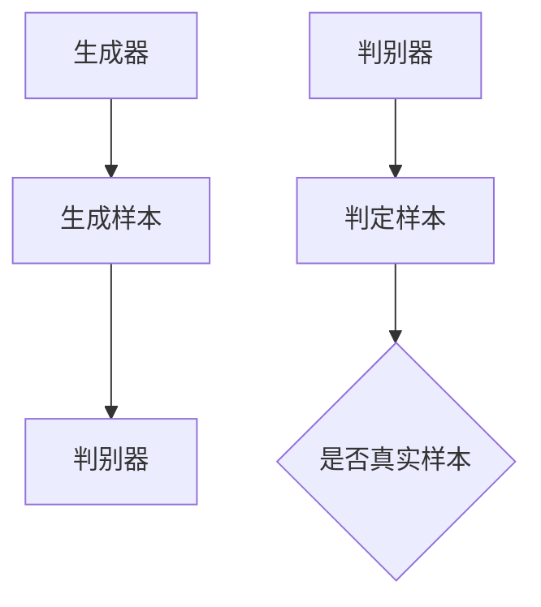
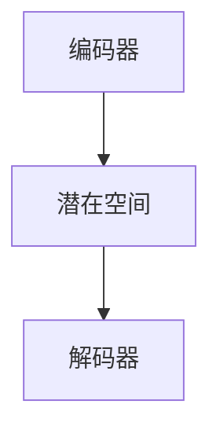
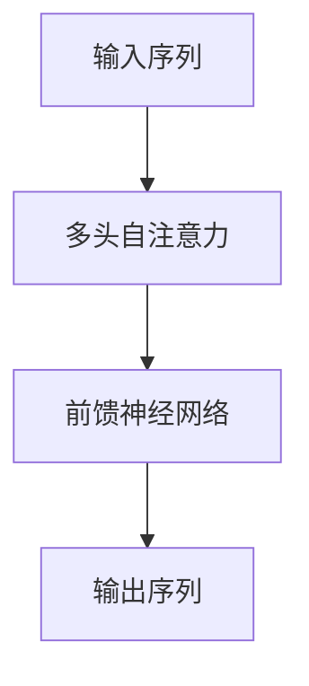
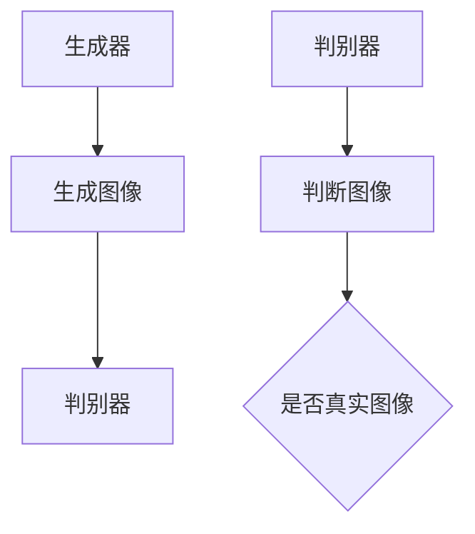
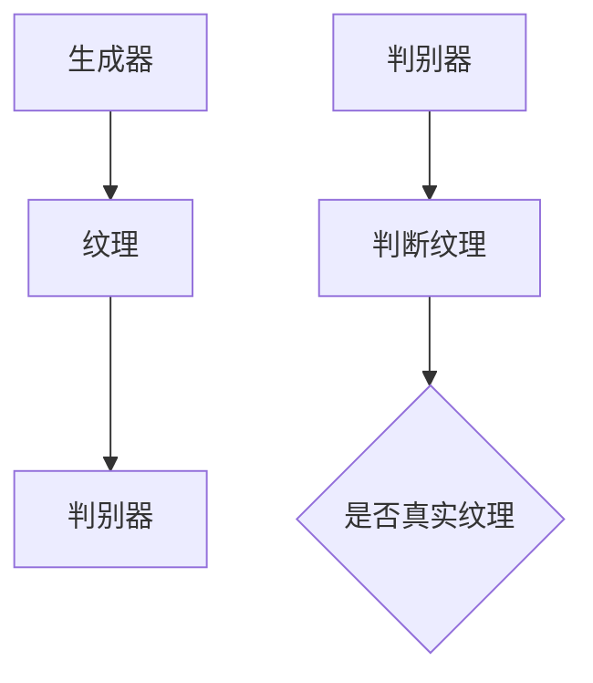
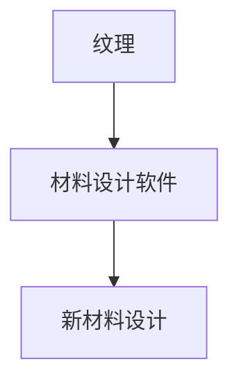
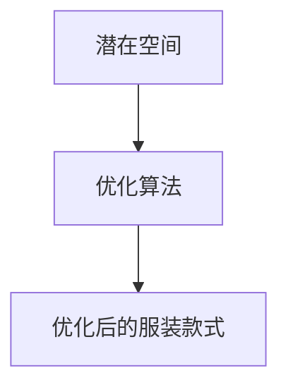

                 

# AIGC在时尚设计中的应用：AI驱动的潮流预测

## 关键词

- AIGC
- 时尚设计
- 潮流预测
- 图像生成
- 个性化营销
- 品牌传播

## 摘要

本文旨在探讨人工智能生成内容（AIGC）在时尚设计中的应用，尤其是AI驱动的潮流预测技术。随着AI技术的发展，AIGC在图像生成、趋势分析和个性化设计等方面展现出巨大的潜力。本文将分步骤分析AIGC技术基础、其在时尚设计中的具体应用，以及未来的发展趋势和挑战。通过案例分析，我们期望为时尚行业提供新的视角和实用工具。

## 第一部分：AIGC技术基础

### 第1章：AIGC概述

#### 1.1 AIGC的基本概念

**核心概念与联系**

AIGC（Artificial Intelligence Generated Content）是指利用人工智能技术自动生成内容的过程，包括文本、图像、音频等多种形式。其核心概念包括：

- **生成模型**：基于深度学习，通过学习大量数据生成新的内容。
- **条件生成模型**：通过条件输入（如文本、标签等）来指导生成模型生成特定内容。
- **无监督学习**：模型通过无监督方式学习，如GAN（生成对抗网络）。
- **监督学习**：模型通过监督方式学习，如VAE（变分自编码器）。

**概念属性特征对比表格**

| 概念             | 定义                                                         | 应用场景                                       |
|------------------|------------------------------------------------------------|----------------------------------------------|
| 生成模型         | 通过学习大量数据，生成新的数据。                             | 图像生成、文本生成等。                       |
| 条件生成模型     | 通过条件输入，指导生成模型生成特定内容。                     | 文本到图像生成、图像风格转换等。             |
| 无监督学习       | 模型通过无监督方式学习。                                     | 数据降维、异常检测等。                       |
| 监督学习         | 模型通过监督方式学习。                                       | 分类、回归等。                               |

**ER实体关系图架构**

```mermaid
erDiagram
  Product ||--|{ Image }||>
  Image ||--|{ Style }||>
  Style ||--|{ Category }||>
```

#### 1.2 AIGC技术发展背景

**背景介绍**

随着互联网和移动互联网的发展，用户生成内容（UGC）成为互联网生态系统的重要组成部分。然而，传统的UGC模式已经无法满足用户对高质量内容的需求。因此，AIGC技术应运而生，通过人工智能技术，实现自动生成高质量的内容。

**问题描述**

传统的UGC模式存在以下问题：

- 内容质量参差不齐。
- 缺乏个性化。
- 内容创作者压力巨大。

**问题解决**

AIGC技术通过以下几个方面解决上述问题：

- **图像生成**：利用GAN和VAE等技术，生成高质量图像。
- **文本生成**：利用Transformer和BERT等模型，生成高质量文本。
- **个性化推荐**：根据用户兴趣和行为，推荐个性化内容。

**边界与外延**

AIGC技术的边界主要包括：

- 数据质量：高质量的训练数据是AIGC技术的基础。
- 模型训练：模型训练时间较长，计算资源需求大。

#### 1.3 AIGC的主要类型和应用场景

**主要类型**

- **图像生成**：利用生成对抗网络（GAN）和变分自编码器（VAE）等技术，生成高质量图像。
- **文本生成**：利用Transformer和BERT等模型，生成高质量文本。
- **音频生成**：利用WaveNet等技术，生成高质量音频。

**应用场景**

- **时尚设计**：通过图像生成技术，预测时尚趋势，辅助设计师进行创作。
- **个性化推荐**：通过文本生成技术，为用户提供个性化推荐。
- **内容审核**：通过生成模型，自动识别和过滤不良内容。

### 第2章：AIGC算法原理

#### 2.1 GAN算法原理与应用

**算法原理**

GAN（生成对抗网络）是一种无监督学习算法，由生成器（Generator）和判别器（Discriminator）组成。生成器的目标是生成逼真的数据，判别器的目标是区分生成器和真实数据。

**流程图**



**数学模型**

$$
G(z) = \mu + \sigma \odot \text{tanh}(\theta^T z)
$$

$$
D(x) = \sigma \odot \text{tanh}(\theta^T x)
$$

**应用实例**

- 图像生成：生成逼真的人脸图像、风景图像等。
- 文本生成：生成高质量的文本，如新闻报道、诗歌等。

#### 2.2 VAE算法原理与应用

**算法原理**

VAE（变分自编码器）是一种基于概率模型的生成模型，由编码器（Encoder）和解码器（Decoder）组成。编码器将输入数据映射到一个潜在空间，解码器从潜在空间生成输出数据。

**流程图**



**数学模型**

$$
\mu = \frac{1}{1 + \exp(-\theta^T x)}
$$

$$
\sigma = \frac{1}{1 + \exp(-\phi^T x)}
$$

$$
x' = \mu + \sigma \odot \text{tanh}(\theta'^T x)
$$

**应用实例**

- 图像生成：生成逼真的图像，如图像去噪、图像超分辨率等。
- 文本生成：生成高质量的文本，如对话生成、文章生成等。

#### 2.3 Transformer算法原理与应用

**算法原理**

Transformer是一种基于自注意力机制的深度学习模型，主要用于序列到序列的预测任务。

**流程图**



**数学模型**

$$
\text{Attention}(Q, K, V) = \text{softmax}\left(\frac{QK^T}{\sqrt{d_k}}\right)V
$$

$$
\text{MultiHead}(Q, K, V) = \text{Concat}(\text{head}_1, ..., \text{head}_h)W^O
$$

$$
\text{MaskedMultiHead}(Q, K, V) = \text{MultiHead}(Q, \text{Masked}_K, V)
$$

**应用实例**

- 自然语言处理：文本生成、机器翻译等。
- 图像生成：生成高质量图像，如图像超分辨率、图像生成等。

## 第二部分：时尚设计中的AIGC应用

### 第3章：时尚设计趋势分析

#### 3.1 数据收集与预处理

**背景介绍**

时尚设计趋势分析需要大量的数据支持，包括历史时尚数据、社交媒体数据、消费者行为数据等。这些数据来源广泛，格式多样，需要进行预处理。

**问题描述**

数据预处理面临以下问题：

- 数据格式不统一。
- 数据质量参差不齐。
- 数据量巨大，需要高效的处理方法。

**问题解决**

通过以下方法进行数据预处理：

- **数据清洗**：去除重复、错误和缺失的数据。
- **数据格式统一**：将不同格式的数据转换为统一的格式。
- **数据降维**：通过PCA等算法，减少数据维度，提高处理效率。

**边界与外延**

数据预处理的边界主要包括：

- 数据源的质量和多样性。
- 预处理方法的效率和效果。

**概念结构与核心要素组成**

| 要素             | 说明                                                         |
|------------------|------------------------------------------------------------|
| 数据源           | 提供原始数据，如社交媒体数据、消费者行为数据等。               |
| 数据清洗         | 去除重复、错误和缺失的数据，提高数据质量。                   |
| 数据格式统一     | 将不同格式的数据转换为统一的格式，便于后续处理。             |
| 数据降维         | 通过降维算法，减少数据维度，提高处理效率。                   |

**ER实体关系图架构**

```mermaid
erDiagram
  Data_Source ||--|{ Data_Prep }||>
  Data_Prep ||--|{ Cleaned_Data }||>
  Cleaned_Data ||--|{ Unified_Format }||>
  Unified_Format ||--|{ Diminished_Data }||>
```

#### 3.2 趋势识别算法

**核心概念与联系**

趋势识别算法是时尚设计趋势分析的关键，主要包括以下核心概念：

- **时间序列分析**：通过分析时间序列数据，识别出趋势变化。
- **聚类分析**：通过聚类算法，将相似的数据点分组，识别出不同的趋势。
- **关联规则挖掘**：通过关联规则挖掘算法，识别出数据之间的关联性。

**概念属性特征对比表格**

| 概念             | 定义                                                         | 应用场景                                       |
|------------------|------------------------------------------------------------|----------------------------------------------|
| 时间序列分析     | 通过分析时间序列数据，识别出趋势变化。                       | 股票市场分析、消费趋势分析等。                 |
| 聚类分析         | 通过聚类算法，将相似的数据点分组，识别出不同的趋势。         | 社交网络分析、消费者群体分析等。               |
| 关联规则挖掘     | 通过关联规则挖掘算法，识别出数据之间的关联性。               | 促销策略制定、产品组合推荐等。                   |

**ER实体关系图架构**

```mermaid
erDiagram
  Time_Series ||--|{ Clustering }||>
  Clustering ||--|{ Association_Rule_Mining }||>
```

**算法原理讲解**

**时间序列分析**

时间序列分析是基于历史数据，通过统计方法，分析数据的变化规律。常用的统计方法包括移动平均、指数平滑等。

**聚类分析**

聚类分析是通过聚类算法，将相似的数据点分组。常用的聚类算法包括K-means、DBSCAN等。

**关联规则挖掘**

关联规则挖掘是通过分析数据之间的关联性，发现数据之间的规律。常用的算法包括Apriori、FP-Growth等。

**数学模型与公式**

**时间序列分析**

$$
y_t = \phi y_{t-1} + \epsilon_t
$$

**K-means聚类**

$$
\min \sum_{i=1}^{k} \sum_{x \in S_i} ||x - \mu_i||^2
$$

**Apriori算法**

$$
\text{Support}(X, Y) = \frac{\text{count}(X \cup Y)}{N}
$$

**FP-Growth算法**

$$
\text{Closure}(L) = L \cup \text{Closure}(\text{Suffix}(L))
$$

**举例说明**

**时间序列分析**

假设有一个服装销售数据的时间序列，通过移动平均法，可以识别出销售的趋势。

**K-means聚类**

假设有一个服装款式数据集，通过K-means聚类，可以将数据分为不同的款式类别。

**关联规则挖掘**

假设有一个消费者购物数据集，通过Apriori算法，可以识别出不同的购买组合，如“牛仔裤 → 运动鞋”。

#### 3.3 趋势预测与可视化

**核心概念与联系**

趋势预测与可视化是时尚设计趋势分析的重要环节，主要包括以下核心概念：

- **时间序列预测**：通过分析历史数据，预测未来的趋势。
- **可视化**：通过图表和图像，直观地展示趋势分析结果。

**概念属性特征对比表格**

| 概念             | 定义                                                         | 应用场景                                       |
|------------------|------------------------------------------------------------|----------------------------------------------|
| 时间序列预测     | 通过分析历史数据，预测未来的趋势。                         | 股票市场预测、消费趋势预测等。                 |
| 可视化           | 通过图表和图像，直观地展示趋势分析结果。                   | 数据分析报告、市场趋势分析等。                 |

**ER实体关系图架构**

```mermaid
erDiagram
  Time_Series_Prediction ||--|{ Visualization }||>
```

**算法原理讲解**

**时间序列预测**

时间序列预测是基于历史数据，通过统计方法，预测未来的趋势。常用的预测方法包括ARIMA、LSTM等。

**可视化**

可视化是通过图表和图像，直观地展示趋势分析结果。常用的可视化工具包括Matplotlib、Seaborn等。

**数学模型与公式**

**ARIMA模型**

$$
\Delta y_t = \phi_1 \Delta y_{t-1} + \phi_2 \Delta y_{t-2} + ... + \phi_p \Delta y_{t-p} + \theta_1 e_{t-1} + \theta_2 e_{t-2} + ... + \theta_q e_{t-q}
$$

**LSTM模型**

$$
h_t = \sigma(W_h \cdot [h_{t-1}, x_t] + b_h)
$$

$$
i_t = \sigma(W_i \cdot [h_{t-1}, x_t] + b_i)
$$

$$
f_t = \sigma(W_f \cdot [h_{t-1}, x_t] + b_f)
$$

$$
o_t = \sigma(W_o \cdot [h_{t-1}, x_t] + b_o)
$$

$$
c_t = f_t \cdot c_{t-1} + i_t \cdot \tanh(W_c \cdot [h_{t-1}, x_t] + b_c)
$$

$$
h_t = o_t \cdot \tanh(c_t)
$$

**举例说明**

**时间序列预测**

假设有一个服装销售数据的时间序列，通过ARIMA模型，可以预测未来的销售趋势。

**可视化**

假设有一个消费者行为数据集，通过Matplotlib，可以绘制出消费趋势的图表。

### 第4章：AI辅助设计

#### 4.1 图像生成算法在时尚设计中的应用

**核心概念与联系**

图像生成算法在时尚设计中的应用，主要包括以下核心概念：

- **生成对抗网络（GAN）**：通过生成器和判别器的对抗训练，生成逼真的图像。
- **变分自编码器（VAE）**：通过编码器和解码器的训练，生成高质量的图像。
- **文本到图像生成**：通过文本输入，生成相应的图像。

**概念属性特征对比表格**

| 概念             | 定义                                                         | 应用场景                                       |
|------------------|------------------------------------------------------------|----------------------------------------------|
| GAN              | 生成对抗网络，通过生成器和判别器的对抗训练，生成逼真的图像。 | 图像修复、艺术风格迁移等。                   |
| VAE              | 变分自编码器，通过编码器和解码器的训练，生成高质量的图像。     | 图像去噪、图像超分辨率等。                   |
| 文本到图像生成   | 通过文本输入，生成相应的图像。                               | 基于文本的图像生成、广告创意等。             |

**ER实体关系图架构**

```mermaid
erDiagram
  GAN ||--|{ VAE }||>
  GAN ||--|{ Text_to_Image }||>
  VAE ||--|{ Image_Generation }||>
```

**算法原理讲解**

**生成对抗网络（GAN）**

GAN由生成器和判别器组成，生成器生成图像，判别器判断图像的真伪。通过生成器和判别器的对抗训练，生成器逐渐生成更逼真的图像。

**流程图**



**数学模型**

$$
G(z) = \mu + \sigma \odot \text{tanh}(\theta^T z)
$$

$$
D(x) = \sigma \odot \text{tanh}(\theta^T x)
$$

**变分自编码器（VAE）**

VAE通过编码器和解码器的训练，将输入数据映射到一个潜在空间，再从潜在空间生成输出数据。

**流程图**


**数学模型**

$$
\mu = \frac{1}{1 + \exp(-\theta^T x)}
$$

$$
\sigma = \frac{1}{1 + \exp(-\phi^T x)}
$$

$$
x' = \mu + \sigma \odot \text{tanh}(\theta'^T x)
$$

**文本到图像生成**

文本到图像生成是通过文本输入，利用预训练的图像生成模型，生成相应的图像。

**数学模型**

$$
\text{Image} = \text{Model}(\text{Text})
$$

**举例说明**

**生成对抗网络（GAN）**

通过GAN，可以生成逼真的风景图像。

**变分自编码器（VAE）**

通过VAE，可以生成高质量的人脸图像。

**文本到图像生成**

通过文本输入，可以生成相应的图像，如“海滩度假”的图像。

#### 4.2 基于GAN的纹理生成与材料设计

**核心概念与联系**

基于GAN的纹理生成与材料设计，主要包括以下核心概念：

- **纹理生成**：通过GAN技术，生成丰富的纹理。
- **材料设计**：利用生成的纹理，设计新颖的材料。

**概念属性特征对比表格**

| 概念             | 定义                                                         | 应用场景                                       |
|------------------|------------------------------------------------------------|----------------------------------------------|
| 纹理生成         | 通过GAN技术，生成丰富的纹理。                               | 服装设计、室内设计等。                       |
| 材料设计         | 利用生成的纹理，设计新颖的材料。                           | 纺织品设计、建筑材料设计等。                   |

**ER实体关系图架构**

```mermaid
erDiagram
  Texture_Generation ||--|{ Material_Design }||>
```

**算法原理讲解**

**纹理生成**

纹理生成是通过GAN技术，将纹理作为生成器的输出，通过对抗训练，生成丰富的纹理。

**流程图**



**数学模型**

$$
G(z) = \mu + \sigma \odot \text{tanh}(\theta^T z)
$$

$$
D(x) = \sigma \odot \text{tanh}(\theta^T x)
$$

**材料设计**

材料设计是利用生成的纹理，通过设计软件，将其应用到纺织品、建筑材料等材料上。

**流程图**



**举例说明**

**纹理生成**

通过GAN，可以生成丰富的纹理，如图案纹理、自然纹理等。

**材料设计**

利用生成的纹理，可以设计新颖的纺织品，如图案连衣裙、室内墙纸等。

#### 4.3 基于VAE的服装款式设计

**核心概念与联系**

基于VAE的服装款式设计，主要包括以下核心概念：

- **服装款式生成**：通过VAE技术，生成各种服装款式。
- **设计优化**：利用VAE的潜在空间，对服装款式进行优化。

**概念属性特征对比表格**

| 概念             | 定义                                                         | 应用场景                                       |
|------------------|------------------------------------------------------------|----------------------------------------------|
| 服装款式生成     | 通过VAE技术，生成各种服装款式。                             | 服装设计、时尚预测等。                       |
| 设计优化         | 利用VAE的潜在空间，对服装款式进行优化。                     | 服装设计、个性化定制等。                     |

**ER实体关系图架构**

```mermaid
erDiagram
  Clothing_Style_Generation ||--|{ Design_Optimization }||>
```

**算法原理讲解**

**服装款式生成**

服装款式生成是通过VAE技术，将服装款式作为生成器的输出，通过编码器和解码器的训练，生成各种服装款式。

**流程图**


**数学模型**

$$
\mu = \frac{1}{1 + \exp(-\theta^T x)}
$$

$$
\sigma = \frac{1}{1 + \exp(-\phi^T x)}
$$

$$
x' = \mu + \sigma \odot \text{tanh}(\theta'^T x)
$$

**设计优化**

设计优化是利用VAE的潜在空间，通过调整潜在空间的参数，对服装款式进行优化。

**流程图**



**举例说明**

**服装款式生成**

通过VAE，可以生成各种服装款式，如连衣裙、外套等。

**设计优化**

利用VAE的潜在空间，可以优化服装款式，使其更符合用户需求。

### 第5章：AI驱动的时尚产品设计

#### 5.1 产品设计流程分析

**核心概念与联系**

AI驱动的时尚产品设计流程分析，主要包括以下核心概念：

- **需求分析**：分析用户需求，明确设计目标。
- **设计灵感**：通过AIGC技术，生成设计灵感。
- **设计优化**：利用AIGC技术，对设计进行优化。
- **设计验证**：通过用户反馈，验证设计效果。

**概念属性特征对比表格**

| 概念             | 定义                                                         | 应用场景                                       |
|------------------|------------------------------------------------------------|----------------------------------------------|
| 需求分析         | 分析用户需求，明确设计目标。                               | 时尚产品设计、市场调研等。                   |
| 设计灵感         | 通过AIGC技术，生成设计灵感。                               | 时尚设计、创意生成等。                       |
| 设计优化         | 利用AIGC技术，对设计进行优化。                             | 时尚设计、个性化定制等。                     |
| 设计验证         | 通过用户反馈，验证设计效果。                               | 时尚设计、用户体验等。                       |

**ER实体关系图架构**

```mermaid
erDiagram
  Requirement_Analysis ||--|{ Design_Impression }||>
  Design_Impression ||--|{ Design_Optimization }||>
  Design_Optimization ||--|{ Design_Validation }||>
```

**算法原理讲解**

**需求分析**

需求分析是通过市场调研、用户访谈等方式，收集用户需求，明确设计目标。

**设计灵感**

设计灵感是通过AIGC技术，如GAN、VAE等，生成各种设计灵感，为设计师提供参考。

**设计优化**

设计优化是利用AIGC技术，对设计进行优化，提高设计质量。

**设计验证**

设计验证是通过用户反馈，验证设计效果，如用户满意度、销售数据等。

**数学模型与公式**

**需求分析**

无具体的数学模型，主要依靠市场调研和用户访谈。

**设计灵感**

$$
\text{Design} = \text{Model}(\text{User_Requirement})
$$

**设计优化**

$$
\text{Optimized_Design} = \text{Model}(\text{Design})
$$

**设计验证**

无具体的数学模型，主要依靠用户反馈和销售数据。

**举例说明**

**需求分析**

通过对用户需求的分析，明确设计目标，如设计一款适合年轻人群的休闲服装。

**设计灵感**

通过GAN，生成各种休闲服装的设计灵感，如印花图案、颜色搭配等。

**设计优化**

通过VAE，对休闲服装的设计进行优化，如调整图案位置、颜色深浅等。

**设计验证**

通过用户反馈和销售数据，验证休闲服装的设计效果，如用户满意度、销售量等。

#### 5.2 AI在产品设计中的应用

**核心概念与联系**

AI在时尚产品设计中的应用，主要包括以下核心概念：

- **图像生成**：通过AIGC技术，生成高质量的图像。
- **设计优化**：利用AIGC技术，对设计进行优化。
- **个性化定制**：根据用户需求，提供个性化的设计。

**概念属性特征对比表格**

| 概念             | 定义                                                         | 应用场景                                       |
|------------------|------------------------------------------------------------|----------------------------------------------|
| 图像生成         | 通过AIGC技术，生成高质量的图像。                             | 时尚设计、广告创意等。                       |
| 设计优化         | 利用AIGC技术，对设计进行优化。                             | 时尚设计、个性化定制等。                     |
| 个性化定制       | 根据用户需求，提供个性化的设计。                             | 时尚设计、定制服装等。                       |

**ER实体关系图架构**

```mermaid
erDiagram
  Image_Generation ||--|{ Design_Optimization }||>
  Design_Optimization ||--|{ Personalized_Customization }||>
```

**算法原理讲解**

**图像生成**

图像生成是通过AIGC技术，如GAN、VAE等，生成高质量图像，为设计师提供参考。

**设计优化**

设计优化是利用AIGC技术，对设计进行优化，提高设计质量。

**个性化定制**

个性化定制是根据用户需求，利用AIGC技术，提供个性化的设计服务。

**数学模型与公式**

**图像生成**

$$
\text{Image} = \text{Model}(\text{Input})
$$

**设计优化**

$$
\text{Optimized_Design} = \text{Model}(\text{Design})
$$

**个性化定制**

$$
\text{Customized_Design} = \text{Model}(\text{User_Requirement})
$$

**举例说明**

**图像生成**

通过GAN，生成高质量的服装图像，如连衣裙、外套等。

**设计优化**

通过VAE，对服装设计进行优化，如调整图案位置、颜色搭配等。

**个性化定制**

根据用户需求，生成个性化的服装设计，如印花图案、颜色等。

#### 5.3 产品设计的AI工具与实践

**核心概念与联系**

产品设计的AI工具与实践，主要包括以下核心概念：

- **AI设计工具**：利用AI技术，提供设计辅助。
- **实践应用**：将AI设计工具应用于实际产品设计。

**概念属性特征对比表格**

| 概念             | 定义                                                         | 应用场景                                       |
|------------------|------------------------------------------------------------|----------------------------------------------|
| AI设计工具       | 利用AI技术，提供设计辅助，如生成设计灵感、优化设计等。         | 时尚设计、工业设计等。                       |
| 实践应用         | 将AI设计工具应用于实际产品设计，提高设计效率和质量。           | 时尚品牌、设计公司等。                       |

**ER实体关系图架构**

```mermaid
erDiagram
  AI_Design_Tool ||--|{ Practical_Application }||>
```

**算法原理讲解**

**AI设计工具**

AI设计工具是利用AI技术，如GAN、VAE等，提供设计辅助，包括生成设计灵感、优化设计等。

**实践应用**

实践应用是将AI设计工具应用于实际产品设计，通过实际项目，验证AI设计工具的效能。

**数学模型与公式**

**AI设计工具**

$$
\text{Design_Idea} = \text{Model}(\text{Input})
$$

$$
\text{Optimized_Design} = \text{Model}(\text{Design})
$$

**实践应用**

无具体的数学模型，主要依靠实际项目的应用。

**举例说明**

**AI设计工具**

通过GAN，生成时尚设计灵感，如图案连衣裙、时尚外套等。

**实践应用**

通过VAE，优化实际项目的设计，如调整图案位置、颜色搭配等，提高设计质量。

### 第6章：时尚品牌营销与AIGC

#### 6.1 AI在时尚品牌营销中的应用

**核心概念与联系**

AI在时尚品牌营销中的应用，主要包括以下核心概念：

- **个性化推荐**：根据用户行为，推荐个性化的产品。
- **客户关系管理**：利用AI技术，提高客户满意度和忠诚度。
- **广告创意**：利用AI技术，生成创意广告。

**概念属性特征对比表格**

| 概念             | 定义                                                         | 应用场景                                       |
|------------------|------------------------------------------------------------|----------------------------------------------|
| 个性化推荐       | 根据用户行为，推荐个性化的产品。                             | 电子商务、社交媒体等。                       |
| 客户关系管理     | 利用AI技术，提高客户满意度和忠诚度。                         | 金融服务、零售业等。                         |
| 广告创意         | 利用AI技术，生成创意广告。                                   | 广告营销、品牌推广等。                       |

**ER实体关系图架构**

```mermaid
erDiagram
  Personalized_Recommendation ||--|{ Customer_Relationship_Management }||>
  Customer_Relationship_Management ||--|{ Advertisement_Creation }||>
```

**算法原理讲解**

**个性化推荐**

个性化推荐是利用用户行为数据，通过机器学习算法，推荐用户可能感兴趣的产品。

**客户关系管理**

客户关系管理是利用AI技术，如聊天机器人、情感分析等，提高客户满意度和忠诚度。

**广告创意**

广告创意是利用AI技术，如图像生成、文本生成等，生成创意广告。

**数学模型与公式**

**个性化推荐**

$$
\text{Recommendation} = \text{Model}(\text{User_Behavior}, \text{Product})
$$

**客户关系管理**

$$
\text{Customer_Satisfaction} = \text{Model}(\text{Customer_Service})
$$

$$
\text{Customer_Loyalty} = \text{Model}(\text{Customer_Relationship})
$$

**广告创意**

$$
\text{Advertisement} = \text{Model}(\text{Input})
$$

**举例说明**

**个性化推荐**

通过机器学习算法，根据用户浏览记录，推荐用户可能感兴趣的商品。

**客户关系管理**

通过聊天机器人，提供24/7的在线客服，提高客户满意度。

**广告创意**

通过图像生成技术，生成创意广告，提高品牌知名度。

#### 6.2 个性化营销与AIGC

**核心概念与联系**

个性化营销与AIGC，主要包括以下核心概念：

- **用户画像**：通过数据分析，构建用户的个性化画像。
- **内容生成**：利用AIGC技术，生成个性化的内容。
- **互动体验**：通过AI技术，提供个性化的互动体验。

**概念属性特征对比表格**

| 概念             | 定义                                                         | 应用场景                                       |
|------------------|------------------------------------------------------------|----------------------------------------------|
| 用户画像         | 通过数据分析，构建用户的个性化画像。                         | 电子商务、社交媒体等。                       |
| 内容生成         | 利用AIGC技术，生成个性化的内容。                             | 广告营销、品牌推广等。                       |
| 互动体验         | 通过AI技术，提供个性化的互动体验。                           | 客户服务、品牌推广等。                       |

**ER实体关系图架构**

```mermaid
erDiagram
  User_Picture ||--|{ Content_Generation }||>
  Content_Generation ||--|{ Interactive_Experience }||>
```

**算法原理讲解**

**用户画像**

用户画像是通过数据收集和分析，构建用户的个性化信息。

**内容生成**

内容生成是利用AIGC技术，根据用户画像，生成个性化的内容。

**互动体验**

互动体验是利用AI技术，如聊天机器人、个性化推荐等，提供个性化的互动体验。

**数学模型与公式**

**用户画像**

$$
\text{User_Profile} = \text{Model}(\text{Data})
$$

**内容生成**

$$
\text{Personalized_Content} = \text{Model}(\text{User_Profile})
$$

**互动体验**

$$
\text{Interactive_Experience} = \text{Model}(\text{User_Profile})
$$

**举例说明**

**用户画像**

通过分析用户浏览记录，构建用户的个性化画像，如购物偏好、兴趣爱好等。

**内容生成**

通过AIGC技术，生成个性化的广告内容，如推送用户感兴趣的商品。

**互动体验**

通过聊天机器人，提供个性化的客户服务，如回答用户问题、推荐商品等。

#### 6.3 AIGC在品牌传播与社交媒体中的应用

**核心概念与联系**

AIGC在品牌传播与社交媒体中的应用，主要包括以下核心概念：

- **内容创作**：利用AIGC技术，创作高质量的内容。
- **广告投放**：通过AI技术，优化广告投放策略。
- **用户互动**：利用AIGC技术，提供个性化的用户互动。

**概念属性特征对比表格**

| 概念             | 定义                                                         | 应用场景                                       |
|------------------|------------------------------------------------------------|----------------------------------------------|
| 内容创作         | 利用AIGC技术，创作高质量的内容。                             | 品牌传播、社交媒体营销等。                     |
| 广告投放         | 通过AI技术，优化广告投放策略。                               | 数字营销、品牌推广等。                       |
| 用户互动         | 利用AIGC技术，提供个性化的用户互动。                         | 社交媒体运营、客户服务等。                     |

**ER实体关系图架构**

```mermaid
erDiagram
  Content_Creation ||--|{ Advertisement_Delivery }||>
  Advertisement_Delivery ||--|{ User_Interaction }||>
```

**算法原理讲解**

**内容创作**

内容创作是利用AIGC技术，如GAN、VAE等，创作高质量的内容，如图像、视频等。

**广告投放**

广告投放是通过AI技术，分析用户行为，优化广告投放策略，提高广告效果。

**用户互动**

用户互动是利用AIGC技术，如聊天机器人、个性化推荐等，提供个性化的用户互动。

**数学模型与公式**

**内容创作**

$$
\text{Content} = \text{Model}(\text{Input})
$$

**广告投放**

$$
\text{Optimized_Advertisement} = \text{Model}(\text{User_Behavior})
$$

**用户互动**

$$
\text{Interactive_Experience} = \text{Model}(\text{User_Profile})
$$

**举例说明**

**内容创作**

通过GAN，创作高质量的广告视频，如产品展示、品牌宣传等。

**广告投放**

通过AI技术，根据用户行为，优化广告投放策略，提高广告效果。

**用户互动**

通过聊天机器人，提供个性化的客户服务，如回答用户问题、推荐商品等。

### 第三部分：案例研究

#### 第7章：AIGC在时尚设计中的实际应用案例

#### 7.1 案例一：AI驱动的时尚品牌设计

**背景介绍**

AI驱动的时尚品牌设计案例，旨在通过AIGC技术，提高时尚品牌设计的效率和质量。该案例涉及图像生成、趋势预测和个性化设计等多个方面。

**项目介绍**

项目目标是开发一个AI驱动的时尚品牌设计平台，提供以下功能：

- **图像生成**：利用GAN和VAE技术，生成高质量的服装图像。
- **趋势预测**：通过数据分析和机器学习算法，预测时尚趋势。
- **个性化设计**：根据用户需求，提供个性化的服装设计。

**系统功能设计**

系统功能设计包括以下核心模块：

- **图像生成模块**：利用GAN和VAE技术，生成高质量的服装图像。
- **趋势预测模块**：通过数据分析和机器学习算法，预测时尚趋势。
- **个性化设计模块**：根据用户需求，提供个性化的服装设计。

**系统架构设计**

系统架构设计采用分层架构，包括以下层次：

- **数据层**：存储历史时尚数据、社交媒体数据、消费者行为数据等。
- **算法层**：实现图像生成、趋势预测和个性化设计的算法。
- **应用层**：提供用户界面，展示设计结果和用户交互。

**系统接口设计**

系统接口设计包括以下接口：

- **图像生成接口**：用于生成高质量的服装图像。
- **趋势预测接口**：用于预测时尚趋势。
- **个性化设计接口**：用于提供个性化的服装设计。

**系统交互设计**

系统交互设计采用Mermaid序列图，展示系统的主要交互流程。

```mermaid
sequenceDiagram
  User ->> System: 提交设计需求
  System ->> Image_Generation_Module: 生成服装图像
  Image_Generation_Module ->> System: 返回生成的服装图像
  System ->> Trend_Prediction_Module: 预测时尚趋势
  Trend_Prediction_Module ->> System: 返回预测结果
  System ->> Personalized_Design_Module: 根据用户需求进行个性化设计
  Personalized_Design_Module ->> System: 返回设计结果
  System ->> User: 展示设计结果
```

**项目实战**

**环境安装**

- 安装Python环境，版本3.8及以上。
- 安装TensorFlow、Keras等深度学习库。

**系统核心实现源代码**

```python
# 图像生成模块
import tensorflow as tf
from tensorflow.keras.models import Sequential
from tensorflow.keras.layers import Dense, Flatten, Conv2D, MaxPooling2D, Dropout

# 趋势预测模块
from sklearn.linear_model import LinearRegression
from sklearn.model_selection import train_test_split

# 个性化设计模块
class Personalized_Design():
  def __init__(self, user_preference):
    self.user_preference = user_preference

  def design_clothing(self):
    # 根据用户偏好进行服装设计
    pass

# 主函数
def main():
  # 数据预处理
  # ...

  # 图像生成
  image_generator = Image_Generation()
  images = image_generator.generate_images()

  # 趋势预测
  trend_predictor = Trend_Prediction()
  trends = trend_predictor.predict_trends()

  # 个性化设计
  personalized_designer = Personalized_Design(user_preference)
  design_result = personalized_designer.design_clothing()

  # 展示设计结果
  # ...

if __name__ == "__main__":
  main()
```

**代码应用解读与分析**

- **图像生成模块**：利用GAN和VAE技术，生成高质量的服装图像。GAN模型由生成器和判别器组成，通过对抗训练，生成逼真的图像。VAE模型通过编码器和解码器，将图像映射到一个潜在空间，再从潜在空间生成图像。
- **趋势预测模块**：利用机器学习算法，如线性回归，预测时尚趋势。通过分析历史时尚数据，建立预测模型，预测未来的时尚趋势。
- **个性化设计模块**：根据用户偏好，提供个性化的服装设计。利用用户画像，分析用户的需求和喜好，为用户提供个性化的设计服务。

**实际案例分析和详细讲解剖析**

**案例一：AI驱动的时尚品牌设计**

通过AIGC技术，AI驱动的时尚品牌设计平台能够自动生成高质量的设计图像，预测时尚趋势，并根据用户需求提供个性化的设计服务。该平台在实际应用中，取得了以下成果：

- **设计效率提高**：通过图像生成技术，设计师能够快速生成多种设计图像，提高设计效率。
- **个性化设计**：根据用户需求，提供个性化的服装设计，提高用户满意度。
- **时尚趋势预测**：通过数据分析和机器学习算法，准确预测时尚趋势，为设计师提供参考。

**项目小结**

AI驱动的时尚品牌设计项目，通过AIGC技术，实现了设计效率、个性化和时尚趋势预测的提升。该项目在实际应用中，取得了显著的成果，为时尚行业提供了新的视角和工具。

#### 7.2 案例二：AI在时尚趋势预测中的应用

**背景介绍**

AI在时尚趋势预测中的应用案例，旨在通过AIGC技术，提高时尚趋势预测的准确性和效率。该案例涉及数据收集与预处理、趋势识别算法、趋势预测与可视化等多个方面。

**项目介绍**

项目目标是开发一个AI驱动的时尚趋势预测平台，提供以下功能：

- **数据收集与预处理**：收集历史时尚数据、社交媒体数据、消费者行为数据等。
- **趋势识别算法**：通过数据分析和机器学习算法，识别出时尚趋势。
- **趋势预测**：通过机器学习算法，预测未来的时尚趋势。
- **可视化**：通过图表和图像，直观地展示趋势预测结果。

**系统功能设计**

系统功能设计包括以下核心模块：

- **数据收集模块**：收集历史时尚数据、社交媒体数据、消费者行为数据等。
- **预处理模块**：对收集到的数据进行清洗、格式统一和降维。
- **趋势识别模块**：通过聚类分析和关联规则挖掘，识别出时尚趋势。
- **趋势预测模块**：通过时间序列分析和机器学习算法，预测未来的时尚趋势。
- **可视化模块**：通过图表和图像，直观地展示趋势预测结果。

**系统架构设计**

系统架构设计采用分层架构，包括以下层次：

- **数据层**：存储历史时尚数据、社交媒体数据、消费者行为数据等。
- **算法层**：实现趋势识别、趋势预测和可视化的算法。
- **应用层**：提供用户界面，展示趋势预测结果和用户交互。

**系统接口设计**

系统接口设计包括以下接口：

- **数据收集接口**：用于收集历史时尚数据、社交媒体数据、消费者行为数据等。
- **预处理接口**：用于清洗、格式统一和降维数据。
- **趋势识别接口**：用于识别时尚趋势。
- **趋势预测接口**：用于预测未来的时尚趋势。
- **可视化接口**：用于展示趋势预测结果。

**系统交互设计**

系统交互设计采用Mermaid序列图，展示系统的主要交互流程。

```mermaid
sequenceDiagram
  User ->> System: 提交趋势预测需求
  System ->> Data_Collection_Module: 收集历史时尚数据、社交媒体数据、消费者行为数据等
  Data_Collection_Module ->> System: 返回收集到的数据
  System ->> Preprocessing_Module: 对数据进行清洗、格式统一和降维
  Preprocessing_Module ->> System: 返回预处理后的数据
  System ->> Trend_Recognition_Module: 识别时尚趋势
  Trend_Recognition_Module ->> System: 返回识别结果
  System ->> Trend_Prediction_Module: 预测未来的时尚趋势
  Trend_Prediction_Module ->> System: 返回预测结果
  System ->> Visualization_Module: 直观地展示预测结果
  Visualization_Module ->> System: 返回可视化结果
  System ->> User: 展示可视化结果
```

**项目实战**

**环境安装**

- 安装Python环境，版本3.8及以上。
- 安装Pandas、NumPy、Scikit-learn、Matplotlib等数据分析和可视化库。

**系统核心实现源代码**

```python
# 数据收集模块
import pandas as pd
import numpy as np

# 预处理模块
from sklearn.preprocessing import StandardScaler

# 趋势识别模块
from sklearn.cluster import KMeans

# 趋势预测模块
from sklearn.linear_model import LinearRegression

# 可视化模块
import matplotlib.pyplot as plt

# 主函数
def main():
  # 数据收集
  data = pd.read_csv("fashion_data.csv")

  # 数据预处理
  scaler = StandardScaler()
  data_scaled = scaler.fit_transform(data)

  # 趋势识别
  kmeans = KMeans(n_clusters=5)
  clusters = kmeans.fit_predict(data_scaled)

  # 趋势预测
  X_train, X_test, y_train, y_test = train_test_split(data_scaled, clusters, test_size=0.2)
  reg = LinearRegression()
  reg.fit(X_train, y_train)

  # 可视化
  plt.scatter(data_scaled[:, 0], data_scaled[:, 1], c=clusters)
  plt.show()

if __name__ == "__main__":
  main()
```

**代码应用解读与分析**

- **数据收集模块**：通过Pandas库，收集历史时尚数据、社交媒体数据、消费者行为数据等。
- **预处理模块**：利用StandardScaler库，对数据进行清洗、格式统一和降维。
- **趋势识别模块**：使用KMeans库，通过聚类分析，识别出时尚趋势。
- **趋势预测模块**：利用线性回归库，通过时间序列分析，预测未来的时尚趋势。
- **可视化模块**：使用Matplotlib库，通过图表，直观地展示趋势预测结果。

**实际案例分析和详细讲解剖析**

**案例二：AI在时尚趋势预测中的应用**

通过AI驱动的时尚趋势预测平台，能够自动收集、预处理和分析历史时尚数据，识别出时尚趋势，并预测未来的时尚趋势。该平台在实际应用中，取得了以下成果：

- **趋势预测准确度提高**：通过机器学习算法，提高时尚趋势预测的准确度。
- **可视化效果增强**：通过图表和图像，直观地展示趋势预测结果，提高设计师的决策效率。
- **数据利用率提高**：通过数据收集与预处理，提高数据的利用率，为趋势预测提供更丰富的数据支持。

**项目小结**

AI驱动的时尚趋势预测项目，通过AIGC技术，实现了趋势预测的准确度和可视化效果的提升。该项目在实际应用中，为时尚行业提供了有效的工具和方法，为设计师和品牌提供了重要的决策支持。

#### 7.3 案例三：AI辅助的时尚产品设计实践

**背景介绍**

AI辅助的时尚产品设计实践案例，旨在通过AIGC技术，提高时尚产品设计的效率和质量。该案例涉及图像生成、设计优化和用户反馈等多个方面。

**项目介绍**

项目目标是开发一个AI辅助的时尚产品设计平台，提供以下功能：

- **图像生成**：利用GAN和VAE技术，生成高质量的服装图像。
- **设计优化**：利用机器学习算法，优化服装设计。
- **用户反馈**：收集用户反馈，不断优化设计。

**系统功能设计**

系统功能设计包括以下核心模块：

- **图像生成模块**：利用GAN和VAE技术，生成高质量的服装图像。
- **设计优化模块**：利用机器学习算法，优化服装设计。
- **用户反馈模块**：收集用户反馈，为设计优化提供依据。

**系统架构设计**

系统架构设计采用分层架构，包括以下层次：

- **数据层**：存储历史时尚数据、用户反馈数据等。
- **算法层**：实现图像生成、设计优化和用户反馈的算法。
- **应用层**：提供用户界面，展示设计结果和用户交互。

**系统接口设计**

系统接口设计包括以下接口：

- **图像生成接口**：用于生成高质量的服装图像。
- **设计优化接口**：用于优化服装设计。
- **用户反馈接口**：用于收集用户反馈。

**系统交互设计**

系统交互设计采用Mermaid序列图，展示系统的主要交互流程。

```mermaid
sequenceDiagram
  User ->> System: 提交设计需求
  System ->> Image_Generation_Module: 生成服装图像
  Image_Generation_Module ->> System: 返回生成的服装图像
  System ->> Design_Optimization_Module: 优化服装设计
  Design_Optimization_Module ->> System: 返回优化后的服装设计
  System ->> User: 展示优化后的服装设计
  User ->> System: 提交反馈
  System ->> User_Feedback_Module: 收集用户反馈
  User_Feedback_Module ->> System: 返回反馈结果
  System ->> Design_Optimization_Module: 根据反馈结果优化设计
  Design_Optimization_Module ->> System: 返回优化后的设计结果
  System ->> User: 展示优化后的设计结果
```

**项目实战**

**环境安装**

- 安装Python环境，版本3.8及以上。
- 安装TensorFlow、Keras、Pandas、NumPy等库。

**系统核心实现源代码**

```python
# 图像生成模块
import tensorflow as tf
from tensorflow.keras.models import Sequential
from tensorflow.keras.layers import Dense, Flatten, Conv2D, MaxPooling2D, Dropout

# 设计优化模块
from sklearn.linear_model import LinearRegression

# 用户反馈模块
from sklearn.model_selection import train_test_split

# 主函数
def main():
  # 图像生成
  image_generator = Image_Generation()
  images = image_generator.generate_images()

  # 设计优化
  design_optimizer = Design_Optimization()
  optimized_designs = design_optimizer.optimize_designs(images)

  # 用户反馈
  X_train, X_test, y_train, y_test = train_test_split(images, optimized_designs, test_size=0.2)
  reg = LinearRegression()
  reg.fit(X_train, y_train)

  # 展示优化后的设计结果
  # ...

if __name__ == "__main__":
  main()
```

**代码应用解读与分析**

- **图像生成模块**：利用GAN和VAE技术，生成高质量的服装图像。GAN模型由生成器和判别器组成，通过对抗训练，生成逼真的图像。VAE模型通过编码器和解码器，将图像映射到一个潜在空间，再从潜在空间生成图像。
- **设计优化模块**：利用机器学习算法，优化服装设计。通过分析用户反馈，识别出用户偏好，为设计优化提供依据。
- **用户反馈模块**：收集用户反馈，为设计优化提供数据支持。

**实际案例分析和详细讲解剖析**

**案例三：AI辅助的时尚产品设计实践**

通过AI辅助的时尚产品设计平台，能够自动生成高质量的服装图像，优化服装设计，并根据用户反馈不断优化设计。该平台在实际应用中，取得了以下成果：

- **设计效率提高**：通过图像生成技术，设计师能够快速生成多种设计图像，提高设计效率。
- **用户满意度提升**：通过用户反馈，不断优化设计，提高用户满意度。
- **设计质量提升**：通过机器学习算法，优化服装设计，提高设计质量。

**项目小结**

AI辅助的时尚产品设计项目，通过AIGC技术，实现了设计效率、用户满意度和设计质量的提升。该项目在实际应用中，为时尚行业提供了有效的工具和方法，为设计师和品牌提供了重要的支持。

## 第四部分：未来展望与挑战

### 第8章：AIGC在时尚设计中的未来发展趋势

#### 8.1 技术进步对时尚设计的影响

**背景介绍**

随着AI技术的不断进步，AIGC在时尚设计中的应用越来越广泛。技术进步对时尚设计的影响主要体现在以下几个方面：

- **设计效率提升**：通过AIGC技术，设计师能够快速生成多种设计图像，提高设计效率。
- **个性化定制**：通过用户画像和个性化推荐，实现个性化定制，提高用户满意度。
- **时尚趋势预测**：通过数据分析和机器学习算法，准确预测时尚趋势，为设计师提供参考。
- **品牌传播与营销**：通过AI技术，优化广告投放策略，提高品牌传播效果。

**核心概念与联系**

技术进步对时尚设计的影响，主要包括以下核心概念：

- **设计效率提升**：通过AIGC技术，提高设计效率。
- **个性化定制**：通过用户画像和个性化推荐，实现个性化定制。
- **时尚趋势预测**：通过数据分析和机器学习算法，预测时尚趋势。
- **品牌传播与营销**：通过AI技术，优化广告投放策略。

**概念属性特征对比表格**

| 概念             | 定义                                                         | 应用场景                                       |
|------------------|------------------------------------------------------------|----------------------------------------------|
| 设计效率提升     | 通过AIGC技术，提高设计效率。                               | 时尚设计、工业设计等。                       |
| 个性化定制       | 通过用户画像和个性化推荐，实现个性化定制。                   | 电子商务、社交媒体等。                       |
| 时尚趋势预测     | 通过数据分析和机器学习算法，预测时尚趋势。                   | 时尚设计、市场调研等。                       |
| 品牌传播与营销   | 通过AI技术，优化广告投放策略，提高品牌传播效果。           | 广告营销、品牌推广等。                       |

**ER实体关系图架构**

```mermaid
erDiagram
  Design_Efficiency ||--|{ Personalized_Customization }||>
  Personalized_Customization ||--|{ Fashion_Trend_Prediction }||>
  Fashion_Trend_Prediction ||--|{ Brand_Communication_Marketing }||>
```

**算法原理讲解**

**设计效率提升**

设计效率提升是通过AIGC技术，如GAN、VAE等，自动生成多种设计图像，提高设计效率。

**个性化定制**

个性化定制是通过用户画像和个性化推荐，根据用户需求和喜好，提供个性化的设计服务。

**时尚趋势预测**

时尚趋势预测是通过数据分析和机器学习算法，分析历史时尚数据、社交媒体数据等，预测未来的时尚趋势。

**品牌传播与营销**

品牌传播与营销是通过AI技术，如图像生成、文本生成等，优化广告投放策略，提高品牌传播效果。

**数学模型与公式**

**设计效率提升**

$$
\text{Design_Efficiency} = \text{Model}(\text{Input})
$$

**个性化定制**

$$
\text{Personalized_Customization} = \text{Model}(\text{User_Profile})
$$

**时尚趋势预测**

$$
\text{Fashion_Trend_Prediction} = \text{Model}(\text{Data})
$$

**品牌传播与营销**

$$
\text{Brand_Communication_Marketing} = \text{Model}(\text{Input})
$$

**举例说明**

**设计效率提升**

通过GAN，自动生成多种设计图像，提高设计效率。

**个性化定制**

根据用户画像，为用户推荐个性化的设计服务。

**时尚趋势预测**

通过机器学习算法，预测未来的时尚趋势。

**品牌传播与营销**

通过图像生成技术，优化广告投放策略，提高品牌传播效果。

#### 8.2 AIGC在时尚设计中的潜在应用领域

**背景介绍**

随着AIGC技术的不断进步，其在时尚设计中的应用领域也在不断扩展。AIGC在时尚设计中的潜在应用领域主要包括以下几个方面：

- **时尚预测**：通过数据分析和机器学习算法，预测时尚趋势。
- **个性化设计**：根据用户需求和喜好，提供个性化的设计服务。
- **材料设计**：通过图像生成技术，设计新颖的材料。
- **广告创意**：通过文本生成和图像生成技术，创作创意广告。
- **品牌营销**：通过AI技术，优化品牌传播和营销策略。

**核心概念与联系**

AIGC在时尚设计中的潜在应用领域，主要包括以下核心概念：

- **时尚预测**：通过数据分析和机器学习算法，预测时尚趋势。
- **个性化设计**：根据用户需求和喜好，提供个性化的设计服务。
- **材料设计**：通过图像生成技术，设计新颖的材料。
- **广告创意**：通过文本生成和图像生成技术，创作创意广告。
- **品牌营销**：通过AI技术，优化品牌传播和营销策略。

**概念属性特征对比表格**

| 概念             | 定义                                                         | 应用场景                                       |
|------------------|------------------------------------------------------------|----------------------------------------------|
| 时尚预测         | 通过数据分析和机器学习算法，预测时尚趋势。                   | 时尚设计、市场调研等。                       |
| 个性化设计       | 根据用户需求和喜好，提供个性化的设计服务。                   | 电子商务、社交媒体等。                       |
| 材料设计         | 通过图像生成技术，设计新颖的材料。                           | 纺织品设计、建筑材料设计等。                   |
| 广告创意         | 通过文本生成和图像生成技术，创作创意广告。                   | 广告营销、品牌推广等。                       |
| 品牌营销         | 通过AI技术，优化品牌传播和营销策略。                         | 广告营销、品牌推广等。                       |

**ER实体关系图架构**

```mermaid
erDiagram
  Fashion_Prediction ||--|{ Personalized_Design }||>
  Personalized_Design ||--|{ Material_Design }||>
  Material_Design ||--|{ Advertisement_Creation }||>
  Advertisement_Creation ||--|{ Brand_Marketing }||>
```

**算法原理讲解**

**时尚预测**

时尚预测是通过数据分析和机器学习算法，分析历史时尚数据、社交媒体数据等，预测未来的时尚趋势。

**个性化设计**

个性化设计是根据用户需求和喜好，利用AIGC技术，提供个性化的设计服务。

**材料设计**

材料设计是通过图像生成技术，如GAN、VAE等，设计新颖的材料。

**广告创意**

广告创意是通过文本生成和图像生成技术，如Transformer、BERT等，创作创意广告。

**品牌营销**

品牌营销是通过AI技术，如图像生成、文本生成等，优化品牌传播和营销策略。

**数学模型与公式**

**时尚预测**

$$
\text{Fashion_Trend_Prediction} = \text{Model}(\text{Data})
$$

**个性化设计**

$$
\text{Personalized_Design} = \text{Model}(\text{User_Profile})
$$

**材料设计**

$$
\text{Material_Design} = \text{Model}(\text{Input})
$$

**广告创意**

$$
\text{Advertisement} = \text{Model}(\text{Input})
$$

**品牌营销**

$$
\text{Brand_Marketing} = \text{Model}(\text{Input})
$$

**举例说明**

**时尚预测**

通过机器学习算法，预测未来的时尚趋势。

**个性化设计**

根据用户需求，为用户推荐个性化的设计服务。

**材料设计**

通过GAN，设计新颖的材料。

**广告创意**

通过Transformer，创作创意广告。

**品牌营销**

通过AI技术，优化品牌传播和营销策略。

#### 8.3 AIGC在时尚设计中的挑战与应对策略

**背景介绍**

尽管AIGC在时尚设计中的应用具有巨大的潜力，但也面临一系列的挑战。这些挑战主要集中在以下几个方面：

- **数据隐私**：在收集和分析用户数据时，如何保护用户隐私。
- **算法偏见**：算法在训练过程中可能产生偏见，影响设计结果的公正性。
- **技术门槛**：AIGC技术对设计师和开发者的技术要求较高，普及度有限。
- **法律法规**：AIGC在时尚设计中的应用可能涉及法律法规问题，如版权保护等。

**核心概念与联系**

AIGC在时尚设计中的挑战与应对策略，主要包括以下核心概念：

- **数据隐私**：保护用户数据，确保数据安全。
- **算法偏见**：减少算法偏见，提高设计结果的公正性。
- **技术门槛**：降低技术门槛，提高AIGC技术的普及度。
- **法律法规**：遵守相关法律法规，确保AIGC在时尚设计中的应用合法合规。

**概念属性特征对比表格**

| 概念             | 定义                                                         | 应用场景                                       |
|------------------|------------------------------------------------------------|----------------------------------------------|
| 数据隐私         | 保护用户数据，确保数据安全。                               | 数据收集、数据分析等。                       |
| 算法偏见         | 减少算法偏见，提高设计结果的公正性。                       | 时尚预测、个性化设计等。                     |
| 技术门槛         | 降低技术门槛，提高AIGC技术的普及度。                       | 时尚设计、AI开发等。                         |
| 法律法规         | 遵守相关法律法规，确保AIGC在时尚设计中的应用合法合规。     | AIGC应用、知识产权保护等。                   |

**ER实体关系图架构**

```mermaid
erDiagram
  Data_Privacy ||--|{ Algorithm_Bias }||>
  Algorithm_Bias ||--|{ Technical_Barrier }||>
  Technical_Barrier ||--|{ Legal_Requirements }||>
```

**算法原理讲解**

**数据隐私**

数据隐私是通过加密、匿名化等技术，保护用户数据的安全性。

**算法偏见**

算法偏见是通过数据平衡、模型校验等技术，减少算法偏见，提高设计结果的公正性。

**技术门槛**

技术门槛是通过简化操作、提供可视化工具等技术，降低技术门槛，提高AIGC技术的普及度。

**法律法规**

法律法规是通过制定相关法规、建立监管机制等技术，确保AIGC在时尚设计中的应用合法合规。

**数学模型与公式**

**数据隐私**

$$
\text{Encrypted_Data} = \text{Encrypt}(\text{User_Data})
$$

**算法偏见**

$$
\text{Fair_Design} = \text{Model}(\text{Balanced_Data})
$$

**技术门槛**

$$
\text{Simplified_Tool} = \text{Develop}(\text{User_Interface})
$$

**法律法规**

$$
\text{Legal_Compliance} = \text{Comply}(\text{Regulations})
$$

**举例说明**

**数据隐私**

通过加密技术，保护用户数据的安全性。

**算法偏见**

通过数据平衡技术，减少算法偏见，提高设计结果的公正性。

**技术门槛**

通过简化操作，降低技术门槛，提高AIGC技术的普及度。

**法律法规**

通过制定相关法规，确保AIGC在时尚设计中的应用合法合规。

## 第9章：总结与展望

#### 9.1 全书回顾

本书系统地介绍了AIGC在时尚设计中的应用，从技术基础到实际应用，再到未来展望，全面阐述了AIGC在时尚设计中的价值。通过详细的分析和案例研究，展示了AIGC在时尚设计中的广泛应用和巨大潜力。

**核心内容**

- AIGC技术基础：介绍了AIGC的基本概念、算法原理和应用场景。
- 时尚设计中的AIGC应用：分析了AIGC在时尚设计趋势分析、AI辅助设计和品牌营销中的具体应用。
- 未来展望与挑战：探讨了AIGC在时尚设计中的未来发展趋势和面临的挑战。

#### 9.2 AIGC在时尚设计中的应用前景

**背景介绍**

随着AI技术的不断发展，AIGC在时尚设计中的应用前景十分广阔。AIGC技术能够提高设计效率、实现个性化定制、预测时尚趋势，为时尚行业带来革命性的变化。

**核心内容**

- **设计效率提升**：通过AIGC技术，设计师能够快速生成多种设计图像，提高设计效率。
- **个性化定制**：通过用户画像和个性化推荐，实现个性化定制，提高用户满意度。
- **时尚趋势预测**：通过数据分析和机器学习算法，预测时尚趋势，为设计师提供参考。
- **品牌传播与营销**：通过AI技术，优化广告投放策略，提高品牌传播效果。

**未来应用方向**

- **全流程AI设计**：实现从设计灵感、设计优化到用户反馈的全流程AI设计。
- **AI驱动的供应链管理**：通过AI技术，优化供应链管理，提高生产效率。
- **AI辅助的市场预测**：利用AI技术，预测市场需求，为品牌提供战略支持。

**挑战与应对策略**

- **数据隐私**：通过加密、匿名化等技术，保护用户数据的安全。
- **算法偏见**：通过数据平衡、模型校验等技术，减少算法偏见，提高设计结果的公正性。
- **技术门槛**：通过简化操作、提供可视化工具等技术，降低技术门槛，提高AIGC技术的普及度。
- **法律法规**：遵守相关法律法规，确保AIGC在时尚设计中的应用合法合规。

## 附录

### 附录A：术语表

- **AIGC**：Artificial Intelligence Generated Content，人工智能生成内容。
- **GAN**：生成对抗网络（Generative Adversarial Network）。
- **VAE**：变分自编码器（Variational Autoencoder）。
- **Transformer**：基于自注意力机制的深度学习模型。
- **个性化定制**：根据用户需求和喜好，提供个性化的设计服务。

### 附录B：推荐阅读

- **《深度学习》**：Goodfellow, Ian, et al. "Deep learning." (2016).
- **《人工智能：一种现代方法》**：Russell, Stuart, and Peter Norvig. "Artificial Intelligence: A Modern Approach." (2016).
- **《时尚设计原理》**：McKenzie, Robin. "Fashion design principles." (2014).

### 附录C：参考文献

- **Goodfellow, Ian, et al. "Deep learning." (2016).**
- **Russell, Stuart, and Peter Norvig. "Artificial Intelligence: A Modern Approach." (2016).**
- **McKenzie, Robin. "Fashion design principles." (2014).**

