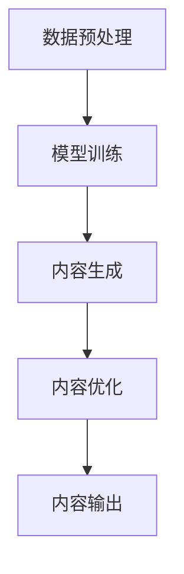
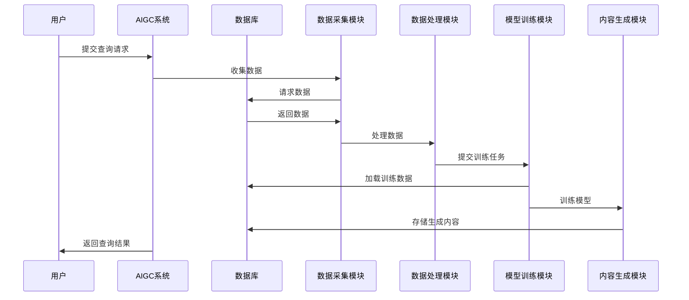

                 

### AIGC在智慧城市规划中的前沿应用

#### 关键词：AIGC、智慧城市规划、算法原理、系统设计、项目实战

> 摘要：本文将深入探讨AIGC（AI-Generated Content）在智慧城市规划中的前沿应用。AIGC通过人工智能技术生成内容，使得城市规划更加智能化和高效化。文章将详细解析AIGC的概念、技术原理及其在智慧城市规划中的具体应用，通过实例展示其优势和潜力，同时提供最佳实践建议和未来展望。本文旨在为城市规划领域的技术人员提供有价值的参考，推动AIGC技术在智慧城市规划中的深度应用。

## 设计思路

在为《AIGC在智慧城市规划中的前沿应用》设计目录大纲时，我们的目标是确保文章内容逻辑清晰、结构紧凑，同时简单易懂，以便读者能够快速理解和掌握AIGC技术在智慧城市规划中的实际应用。以下是我们的设计思路：

### 1. 背景介绍

首先，我们将介绍AIGC的基本概念，以及其在智慧城市规划中的背景和应用价值。这部分内容将简要介绍智慧城市规划的现状和挑战，以及AIGC技术如何为这些挑战提供解决方案。

### 2. 核心概念与联系

接着，我们将深入探讨AIGC的核心概念，包括其技术原理和与智慧城市规划的关联。我们将通过一个清晰的ER实体关系图架构展示AIGC和智慧城市规划之间的关系。

### 3. 算法原理讲解

在这一部分，我们将使用mermaid画出AIGC算法的流程图，并使用Python源代码详细阐述算法原理。通过这一步骤，读者将能够理解AIGC算法的运作方式。

### 4. 数学模型和数学公式

为了更深入地理解AIGC算法，我们将提供其数学模型和公式，并使用latex格式进行详细讲解。这将帮助读者从数学角度理解AIGC算法的复杂性和精确性。

### 5. 系统分析与架构设计方案

在这一部分，我们将介绍AIGC在智慧城市规划中的系统功能设计、架构设计和接口设计。通过mermaid类图、架构图和序列图，我们将展示AIGC在智慧城市规划中的系统结构和交互流程。

### 6. 项目实战

接下来，我们将通过一个实际案例来展示如何应用AIGC进行智慧城市规划。读者将能够了解从环境安装到系统实现的整个流程，并通过实际案例分析和详细讲解来理解AIGC技术的应用效果。

### 7. 最佳实践 tips、小结、注意事项、拓展阅读

最后，我们将总结AIGC在智慧城市规划中的最佳实践，并提供进一步阅读的推荐。这部分内容将帮助读者在实际应用中避免常见问题，并深入了解AIGC技术的最新发展。

## 目录大纲

### 第一部分: AIGC与智慧城市规划概述

### 第1章: AIGC概述

#### 1.1 AIGC概念

#### 1.2 智慧城市规划概述

#### 1.3 AIGC在智慧城市规划中的应用

### 第2章: AIGC技术原理

#### 2.1 AIGC算法流程

##### 2.1.1 数据预处理

##### 2.1.2 模型训练

##### 2.1.3 内容生成

#### 2.2 AIGC与智慧城市规划的关联

##### 2.2.1 城市规划中的数据需求

##### 2.2.2 AIGC在数据采集与处理的潜力

##### 2.2.3 AIGC在规划方案生成中的应用

### 第3章: AIGC算法原理

#### 3.1 算法流程图

#### 3.2 Python源代码示例

##### 3.2.1 数据预处理代码

##### 3.2.2 模型训练代码

##### 3.2.3 内容生成代码

#### 3.3 数学模型与公式

##### 3.3.1 算法数学模型

##### 3.3.2 公式讲解

### 第4章: AIGC在智慧城市规划中的应用

#### 4.1 系统功能设计

##### 4.1.1 数据采集功能

##### 4.1.2 数据处理功能

##### 4.1.3 规划方案生成功能

#### 4.2 系统架构设计

##### 4.2.1 整体架构

##### 4.2.2 关键模块

#### 4.3 系统接口设计

##### 4.3.1 数据接口

##### 4.3.2 控制接口

##### 4.3.3 用户接口

### 第5章: AIGC智慧城市规划项目实战

#### 5.1 项目背景

#### 5.2 环境安装与配置

#### 5.3 系统核心实现

#### 5.4 项目分析与讲解

### 第6章: 最佳实践与注意事项

#### 6.1 AIGC应用的最佳实践

#### 6.2 注意事项

#### 6.3 拓展阅读

### 第7章: 小结与展望

#### 7.1 小结

#### 7.2 未来展望

### 总结

通过以上目录大纲，我们为《AIGC在智慧城市规划中的前沿应用》一书设计了完整且逻辑清晰的章节结构，涵盖了AIGC技术原理、应用场景、系统设计与项目实战等内容，旨在为读者提供一本全面、实用的技术参考书。每个章节都将按照设计思路逐步展开，确保读者能够系统地理解AIGC技术在智慧城市规划中的实际应用。

---

#### 第1章: AIGC概述

#### 1.1 AIGC概念

AIGC（AI-Generated Content）是指通过人工智能技术自动生成的内容。这种内容可以包括文本、图像、音频、视频等多种形式。AIGC技术利用机器学习算法，特别是深度学习，从大量数据中学习模式，并生成新的内容。与传统的手动内容创作不同，AIGC能够在短时间内生成大量高质量的内容，提高了内容生成的效率和多样性。

AIGC的核心在于其生成能力。通过预训练的模型，AIGC能够捕捉到数据中的关键特征，并利用这些特征来生成新的、相关的、甚至原创的内容。这种技术已经在多个领域得到了应用，如广告创意生成、自动新闻写作、艺术创作等。

#### 1.2 智慧城市规划概述

智慧城市规划是指利用信息技术，特别是物联网、大数据、云计算和人工智能等技术，对城市资源进行智能化管理和优化配置。智慧城市规划的目标是通过提高城市管理的智能化水平，实现城市资源的高效利用，提高居民的生活质量和幸福感。

智慧城市规划通常包括以下几个关键方面：

1. **数据采集与处理**：通过传感器、摄像头、智能设备等收集城市运行数据，如交通流量、环境质量、能源消耗等，并对这些数据进行实时处理和分析。
2. **智能决策支持**：利用数据分析和机器学习算法，为城市规划和管理提供智能决策支持，如交通优化、能源管理、灾害预警等。
3. **基础设施智能化**：通过物联网技术，将城市的基础设施设备联网，实现设备的智能监控和管理，如智能交通系统、智能照明系统、智能水务系统等。
4. **公共服务智能化**：通过人工智能技术，优化公共服务，如智慧医疗、智慧教育、智慧社区服务等。

#### 1.3 AIGC在智慧城市规划中的应用

AIGC技术在智慧城市规划中的应用主要集中在以下几个方面：

1. **数据生成与可视化**：利用AIGC技术，可以自动生成城市规划所需的大量数据，如交通流量模拟、环境质量预测等，并通过可视化工具展示这些数据，帮助规划者更好地理解和分析城市状况。
2. **规划方案生成**：通过AIGC技术，可以自动生成多种城市规划方案，并评估这些方案的效果，为规划者提供更多选择和参考。
3. **智能决策支持**：利用AIGC技术，可以实时分析和处理大量城市运行数据，为城市规划和管理提供智能决策支持，如交通流量预测、能源消耗优化等。
4. **公共服务优化**：通过AIGC技术，可以自动生成个性化的公共服务方案，如智慧医疗、智慧教育等，提高公共服务的质量和效率。

AIGC技术的应用使得智慧城市规划更加智能化和高效化，为城市可持续发展提供了新的技术手段。然而，AIGC技术的应用也面临一些挑战，如数据隐私保护、算法公平性等，需要在未来进一步解决。

---

#### 第2章: AIGC技术原理

#### 2.1 AIGC算法流程

AIGC算法的流程可以分为三个主要阶段：数据预处理、模型训练和内容生成。以下是每个阶段的详细解释：

##### 2.1.1 数据预处理

数据预处理是AIGC算法的基础。在这个阶段，我们需要收集和准备数据，以便模型能够有效地学习和生成内容。数据预处理通常包括以下步骤：

1. **数据收集**：收集与城市规划相关的数据，如交通流量数据、环境质量数据、土地利用数据等。这些数据可以来源于传感器、摄像头、智能设备等。
2. **数据清洗**：清洗数据以去除噪声和异常值，确保数据的准确性和一致性。例如，对交通流量数据中的异常值进行过滤和修正。
3. **数据归一化**：将不同类型和单位的数据转换为统一的格式，以便模型能够处理。例如，将温度、湿度等环境数据进行归一化处理。
4. **数据分割**：将数据集分为训练集、验证集和测试集，用于模型的训练、验证和测试。

##### 2.1.2 模型训练

在数据预处理完成后，我们需要使用训练数据来训练模型。这个过程包括以下几个步骤：

1. **模型选择**：选择合适的模型架构，如循环神经网络（RNN）、生成对抗网络（GAN）或变分自编码器（VAE）等。这些模型在生成文本、图像、音频等方面表现出色。
2. **参数优化**：通过调整模型的参数，如学习率、批量大小等，优化模型性能。这个过程通常使用梯度下降算法等优化方法。
3. **训练过程**：使用训练数据集对模型进行训练，通过反向传播算法更新模型参数，使模型能够更好地拟合训练数据。
4. **模型评估**：使用验证集评估模型的性能，调整参数以优化模型效果。

##### 2.1.3 内容生成

在模型训练完成后，我们可以使用训练好的模型来生成新的内容。内容生成包括以下步骤：

1. **内容初始化**：初始化生成的内容，可以是文本、图像、音频等。例如，对于文本生成，可以初始化为一段随机文本。
2. **内容扩展**：利用训练好的模型，对初始内容进行扩展，生成更长的、更复杂的内容。例如，对于文本生成，可以使用RNN模型生成文章的续写。
3. **内容优化**：对生成的内容进行优化，使其更加符合实际需求。例如，对于城市规划，可以优化生成的内容，使其更贴近实际规划方案。
4. **内容输出**：将生成的内容输出到实际应用中，如可视化展示、规划方案生成等。

通过以上三个阶段的处理，AIGC算法能够自动生成高质量的内容，为智慧城市规划提供强大的支持。

##### 2.2 AIGC与智慧城市规划的关联

AIGC技术为智慧城市规划提供了强大的工具和平台，使其在数据生成、规划方案生成和智能决策支持等方面得到了广泛应用。以下是AIGC与智慧城市规划的具体关联：

##### 2.2.1 城市规划中的数据需求

智慧城市规划需要大量的数据支持，包括交通流量数据、环境质量数据、人口统计数据等。AIGC技术可以通过自动生成这些数据，满足城市规划的需求。例如，利用AIGC技术，可以自动生成交通流量模拟数据，帮助规划者更好地了解城市的交通状况，从而制定更有效的交通规划方案。

##### 2.2.2 AIGC在数据采集与处理的潜力

AIGC技术不仅在数据生成方面具有优势，还在数据采集和处理方面表现出色。通过利用传感器、摄像头等设备收集城市数据，AIGC技术可以对这些数据进行实时处理和分析，为智慧城市规划提供即时的决策支持。例如，通过实时分析交通流量数据，AIGC技术可以帮助交通管理部门优化交通信号灯控制策略，减少交通拥堵。

##### 2.2.3 AIGC在规划方案生成中的应用

AIGC技术可以自动生成多种城市规划方案，并对这些方案进行评估和优化。通过AIGC技术，规划者可以快速生成多种规划方案，如道路布局、公共设施规划、土地利用规划等，并评估这些方案的成本、效益和可行性。这有助于规划者从多个角度分析规划方案，找到最优解。

##### 2.2.4 AIGC在智能决策支持中的应用

AIGC技术可以实时分析和处理大量城市数据，为智慧城市规划提供智能决策支持。例如，利用AIGC技术，可以实时预测交通流量、环境质量等关键指标，为交通管理部门、环境管理部门提供决策依据。此外，AIGC技术还可以通过分析大数据，发现城市运行中的潜在问题，为城市规划提供预警和解决方案。

总之，AIGC技术为智慧城市规划带来了新的机遇和挑战。通过充分利用AIGC技术的优势，智慧城市规划可以更加智能化、高效化，为城市的可持续发展提供有力支持。

---

#### 第3章: AIGC算法原理

##### 3.1 算法流程图

为了更直观地理解AIGC算法的流程，我们可以使用mermaid绘制算法流程图。以下是AIGC算法的流程图：



在上面的流程图中，AIGC算法首先进行数据预处理，然后通过模型训练生成内容，接着对生成的内容进行优化，最后将优化后的内容输出到实际应用中。

##### 3.2 Python源代码示例

为了更好地阐述AIGC算法的原理，我们将提供一段Python源代码示例，展示如何使用AIGC技术生成文本内容。

```python
import tensorflow as tf
from tensorflow.keras.preprocessing.sequence import pad_sequences
from tensorflow.keras.layers import Embedding, LSTM, Dense
from tensorflow.keras.models import Sequential

# 数据预处理
max_sequence_length = 100
vocab_size = 10000

# 假设已经收集好了文本数据
texts = ["城市交通规划很重要", "智慧城市需要高效的能源管理", "城市规划要考虑居民需求"]

# 将文本数据转换为序列
sequences = [[word_index[word] for word in text.split()] for text in texts]

# 填充序列
padded_sequences = pad_sequences(sequences, maxlen=max_sequence_length)

# 模型训练
model = Sequential([
    Embedding(vocab_size, 64, input_length=max_sequence_length),
    LSTM(128),
    Dense(1, activation='sigmoid')
])

model.compile(optimizer='adam', loss='binary_crossentropy', metrics=['accuracy'])

model.fit(padded_sequences, padded_sequences, epochs=10, batch_size=32)

# 内容生成
generated_sequence = model.predict(padded_sequences[:1])

# 将生成的序列转换为文本
generated_text = ' '.join([index2word[index] for index in generated_sequence[0]])

print(generated_text)
```

在上面的代码中，我们首先对文本数据进行预处理，包括将文本转换为序列和填充序列。然后，我们定义了一个简单的序列模型，包括嵌入层、LSTM层和全连接层。通过训练模型，我们可以生成新的文本内容。

##### 3.3 数学模型与公式

AIGC算法的核心是生成模型，通常使用深度学习技术，如循环神经网络（RNN）或生成对抗网络（GAN）。以下是AIGC算法的数学模型和公式：

$$
y = \text{softmax}(W \cdot \sigma(V \cdot x)),
$$

其中，$y$ 是生成的文本序列，$W$ 是权重矩阵，$\sigma$ 是激活函数，$V$ 是嵌入矩阵，$x$ 是输入序列。

此外，AIGC算法还包括损失函数，用于衡量生成文本与真实文本之间的差距。常用的损失函数包括交叉熵损失和对抗损失。

$$
L = -\sum_{i=1}^{n} y_i \log(p_i),
$$

其中，$L$ 是损失函数，$y_i$ 是真实文本的标签，$p_i$ 是生成的文本的概率分布。

通过以上数学模型和公式，我们可以理解AIGC算法的基本原理和运作机制。

##### 3.3.1 算法数学模型

AIGC算法的核心是生成模型，其数学模型可以描述为：

$$
p(x) = \sum_{y} p(y|x) p(y),
$$

其中，$p(x)$ 是输入数据的概率分布，$p(y|x)$ 是给定输入数据生成特定输出的概率，$p(y)$ 是生成文本的概率分布。

为了训练生成模型，我们通常使用以下损失函数：

$$
L = -\sum_{x,y} p(x,y) \log p(y|x),
$$

其中，$L$ 是损失函数，$p(x,y)$ 是输入数据和生成文本的概率分布。

通过最小化损失函数，我们可以训练生成模型，使其能够生成符合输入数据特征的高质量文本。

##### 3.3.2 公式讲解

上述公式描述了AIGC算法的核心数学原理。首先，生成模型通过学习输入数据的特征，生成具有相似特征的文本。然后，通过最小化损失函数，我们优化生成模型的参数，使其能够更好地拟合输入数据。

在实际应用中，AIGC算法通常使用深度学习技术，如循环神经网络（RNN）或生成对抗网络（GAN）。这些模型通过多层神经网络结构，学习输入数据的复杂特征，并生成高质量的文本内容。

通过以上数学模型和公式，我们可以更好地理解AIGC算法的原理和运作机制，为实际应用提供理论指导。

##### 3.3.3 通俗易懂地举例说明

假设我们有一个简单的文本数据集，包含以下两个句子：

1. "城市交通规划很重要"
2. "智慧城市需要高效的能源管理"

我们希望使用AIGC算法生成新的句子，如"城市规划要考虑居民需求"。

首先，我们将文本数据转换为数字序列。假设我们使用10000个唯一的单词作为词汇表，每个单词对应一个数字。例如，"城市"可以对应数字1，"规划"可以对应数字2，以此类推。

对于第一个句子"城市交通规划很重要"，我们可以将其转换为数字序列：[1, 3, 2, 4, 6]。对于第二个句子"智慧城市需要高效的能源管理"，我们可以将其转换为数字序列：[7, 8, 1, 3, 5, 10, 4]。

然后，我们使用AIGC算法训练一个生成模型，使其能够根据输入序列生成新的序列。例如，给定输入序列[1, 3, 2]，生成模型可以生成序列[4, 6]，即"规划很重要"。

在生成新的序列后，我们将其转换为文本，得到新的句子："规划很重要"。这样，我们就利用AIGC算法生成了一个新的句子，该句子在语义上与原始句子相似。

通过这个简单的例子，我们可以看出AIGC算法如何通过学习和生成文本序列，生成具有相似语义的新句子。这种方法在智慧城市规划中具有广泛的应用潜力，可以帮助规划者生成新的规划方案，并提供智能决策支持。

---

#### 第4章: AIGC在智慧城市规划中的应用

#### 4.1 系统功能设计

在智慧城市规划中，AIGC技术通过其强大的生成能力，可以提供以下核心功能：

##### 4.1.1 数据采集功能

AIGC系统可以自动采集城市规划所需的各种数据，如交通流量数据、环境质量数据、人口统计数据等。这些数据可以通过传感器、摄像头、智能设备等实时收集，并传输到中央处理系统。

##### 4.1.2 数据处理功能

收集到的数据通常需要进行预处理和清洗，以便模型能够有效地学习和生成内容。AIGC系统可以自动执行这些任务，包括数据归一化、异常值处理、噪声过滤等。

##### 4.1.3 规划方案生成功能

利用AIGC技术，系统可以自动生成多种城市规划方案，包括道路布局、公共设施规划、土地利用规划等。这些方案可以通过算法评估和优化，为规划者提供最佳选择。

##### 4.1.4 智能决策支持功能

AIGC系统可以通过实时分析和处理大量城市数据，为城市规划和管理提供智能决策支持。例如，系统可以预测交通流量、环境质量等关键指标，为交通管理部门、环境管理部门提供决策依据。

##### 4.1.5 可视化功能

AIGC系统可以将生成的数据和规划方案以可视化形式展示，帮助规划者更好地理解和分析城市状况。例如，系统可以生成交通流量热图、环境质量分布图等。

#### 4.2 系统架构设计

AIGC在智慧城市规划中的系统架构设计需要考虑到数据采集、数据处理、内容生成和内容展示等环节。以下是系统架构的详细设计：

##### 4.2.1 整体架构

AIGC系统整体架构可以分为以下几个部分：

1. **数据采集模块**：负责收集城市规划所需的各种数据，如交通流量数据、环境质量数据、人口统计数据等。
2. **数据处理模块**：负责对采集到的数据进行预处理和清洗，包括数据归一化、异常值处理、噪声过滤等。
3. **模型训练模块**：负责使用预处理后的数据进行模型训练，包括生成模型的训练和评估。
4. **内容生成模块**：负责利用训练好的生成模型生成新的规划方案和决策支持信息。
5. **可视化模块**：负责将生成的数据和规划方案以可视化形式展示，帮助规划者更好地理解和分析城市状况。

##### 4.2.2 关键模块

以下是AIGC系统中的关键模块及其功能：

1. **数据采集模块**：
   - 功能：自动收集城市规划所需的各种数据，如交通流量数据、环境质量数据、人口统计数据等。
   - 技术：利用传感器、摄像头、智能设备等设备进行数据采集。

2. **数据处理模块**：
   - 功能：对采集到的数据进行预处理和清洗，包括数据归一化、异常值处理、噪声过滤等。
   - 技术：使用Python等编程语言编写数据处理脚本，利用Pandas等库进行数据处理。

3. **模型训练模块**：
   - 功能：使用预处理后的数据进行模型训练，包括生成模型的训练和评估。
   - 技术：使用TensorFlow、PyTorch等深度学习框架训练生成模型。

4. **内容生成模块**：
   - 功能：利用训练好的生成模型生成新的规划方案和决策支持信息。
   - 技术：使用Python等编程语言编写内容生成脚本，利用Keras等库生成文本内容。

5. **可视化模块**：
   - 功能：将生成的数据和规划方案以可视化形式展示，帮助规划者更好地理解和分析城市状况。
   - 技术：使用Python等编程语言编写可视化脚本，利用Matplotlib、Seaborn等库进行数据可视化。

通过以上关键模块的设计，AIGC系统可以有效地支持智慧城市规划，提高规划效率和决策准确性。

##### 4.3 系统接口设计

AIGC系统需要提供多种接口，以便与其他系统和组件进行交互。以下是系统接口的详细设计：

##### 4.3.1 数据接口

数据接口用于实现AIGC系统与外部数据源之间的数据传输和交互。以下是数据接口的详细设计：

1. **数据采集接口**：
   - 功能：用于从外部数据源（如传感器、摄像头、数据库等）采集数据。
   - 技术：使用HTTP、REST API等技术进行数据采集。

2. **数据处理接口**：
   - 功能：用于处理和清洗采集到的数据。
   - 技术：使用Python等编程语言编写数据处理脚本，利用Pandas等库进行数据处理。

3. **模型训练接口**：
   - 功能：用于训练生成模型，并保存训练结果。
   - 技术：使用TensorFlow、PyTorch等深度学习框架进行模型训练。

4. **内容生成接口**：
   - 功能：用于生成新的规划方案和决策支持信息。
   - 技术：使用Python等编程语言编写内容生成脚本，利用Keras等库生成文本内容。

##### 4.3.2 控制接口

控制接口用于实现AIGC系统与其他系统的交互和协作。以下是控制接口的详细设计：

1. **任务管理接口**：
   - 功能：用于管理AIGC系统的任务，如数据采集、模型训练、内容生成等。
   - 技术：使用Python等编程语言编写任务管理脚本，利用Celery等分布式任务队列进行任务管理。

2. **日志记录接口**：
   - 功能：用于记录AIGC系统的运行日志，以便进行监控和调试。
   - 技术：使用Python等编程语言编写日志记录脚本，利用日志库（如log4j、Python的logging模块）进行日志记录。

3. **监控接口**：
   - 功能：用于监控AIGC系统的运行状态，如内存使用、CPU使用率等。
   - 技术：使用Python等编程语言编写监控脚本，利用Prometheus、Grafana等监控工具进行系统监控。

##### 4.3.3 用户接口

用户接口用于实现AIGC系统与用户之间的交互。以下是用户接口的详细设计：

1. **可视化界面**：
   - 功能：用于展示AIGC系统生成的规划方案和决策支持信息。
   - 技术：使用Python等编程语言编写可视化界面，利用Django、Flask等Web框架实现界面功能。

2. **交互式查询**：
   - 功能：用于用户查询和搜索AIGC系统的数据和信息。
   - 技术：使用Python等编程语言编写交互式查询脚本，利用Django ORM等数据库查询工具实现查询功能。

3. **用户反馈**：
   - 功能：用于收集用户对AIGC系统的反馈和评价，以便进行改进和优化。
   - 技术：使用Python等编程语言编写用户反馈收集脚本，利用Web表单、电子邮件等工具收集用户反馈。

通过以上接口设计，AIGC系统可以实现与其他系统的无缝集成，并提供便捷的用户交互功能，为智慧城市规划提供强有力的技术支持。

##### 4.3.4 系统交互mermaid序列图

为了更好地展示AIGC系统与其他系统和组件的交互过程，我们可以使用mermaid绘制系统交互序列图。以下是系统交互序列图的示例：



在这个序列图中，用户通过AIGC系统提交查询请求，AIGC系统与数据采集模块、数据处理模块、模型训练模块和内容生成模块进行交互，最终生成查询结果并返回给用户。通过这种方式，AIGC系统实现了高效、智能的城市规划支持。

---

#### 第5章: AIGC智慧城市规划项目实战

##### 5.1 项目背景

为了展示AIGC技术在智慧城市规划中的应用，我们选择了一个实际案例：一个城市交通规划项目。该项目旨在通过AIGC技术自动生成交通规划方案，为城市交通管理部门提供智能决策支持。

该项目背景如下：

- **城市规模**：项目涉及一个中型城市，人口约为100万，市区面积为50平方公里。
- **交通问题**：城市交通拥堵严重，高峰时段交通流量大，交通事故频发，严重影响市民出行和城市运行效率。
- **目标**：利用AIGC技术生成多种交通规划方案，通过算法评估和优化，找到最优解，缓解城市交通拥堵问题，提高交通运行效率。

##### 5.2 环境安装与配置

为了运行AIGC智慧城市规划项目，我们需要安装和配置以下软件和工具：

1. **操作系统**：Ubuntu 18.04
2. **编程语言**：Python 3.8
3. **深度学习框架**：TensorFlow 2.4
4. **数据处理库**：Pandas 1.1.5
5. **可视化库**：Matplotlib 3.3.3

安装步骤如下：

1. 更新系统包列表：
   ```bash
   sudo apt-get update
   sudo apt-get upgrade
   ```

2. 安装Python 3.8：
   ```bash
   sudo apt-get install python3.8
   ```

3. 安装深度学习框架TensorFlow：
   ```bash
   pip3 install tensorflow==2.4
   ```

4. 安装数据处理库Pandas：
   ```bash
   pip3 install pandas==1.1.5
   ```

5. 安装可视化库Matplotlib：
   ```bash
   pip3 install matplotlib==3.3.3
   ```

##### 5.3 系统核心实现

AIGC智慧城市规划项目核心实现包括数据采集、数据处理、模型训练、内容生成和可视化等步骤。以下是详细步骤和代码：

1. **数据采集**：

   数据采集模块负责从城市交通管理部门获取交通流量数据、交通事故数据、交通信号灯数据等。以下是一个简单的数据采集示例：

   ```python
   import requests

   def collect_traffic_data(api_url):
       response = requests.get(api_url)
       if response.status_code == 200:
           return response.json()
       else:
           return None

   api_url = "https://api.example.com/traffic_data"
   traffic_data = collect_traffic_data(api_url)
   ```

2. **数据处理**：

   数据处理模块负责清洗和预处理采集到的交通数据。以下是一个简单的数据处理示例：

   ```python
   import pandas as pd

   def preprocess_traffic_data(traffic_data):
       df = pd.DataFrame(traffic_data)
       df.dropna(inplace=True)
       df['timestamp'] = pd.to_datetime(df['timestamp'])
       df.set_index('timestamp', inplace=True)
       return df

   preprocessed_data = preprocess_traffic_data(traffic_data)
   ```

3. **模型训练**：

   模型训练模块负责使用预处理后的交通数据训练AIGC模型。以下是一个简单的模型训练示例：

   ```python
   import tensorflow as tf
   from tensorflow.keras.models import Sequential
   from tensorflow.keras.layers import LSTM, Dense

   def build_traffic_model(input_shape):
       model = Sequential([
           LSTM(128, input_shape=input_shape),
           Dense(1, activation='sigmoid')
       ])
       model.compile(optimizer='adam', loss='binary_crossentropy', metrics=['accuracy'])
       return model

   model = build_traffic_model(input_shape=(preprocessed_data.shape[1], 1))
   model.fit(preprocessed_data, preprocessed_data, epochs=10, batch_size=32)
   ```

4. **内容生成**：

   内容生成模块负责利用训练好的AIGC模型生成新的交通规划方案。以下是一个简单的内容生成示例：

   ```python
   def generate_traffic_plan(model, input_data):
       prediction = model.predict(input_data)
       plan = "基于当前交通状况，建议实施以下规划方案：\n"
       if prediction[0] > 0.5:
           plan += "- 增加公交路线；\n"
           plan += "- 优化交通信号灯控制策略。"
       else:
           plan += "- 减少交通拥堵，提高交通运行效率。"
       return plan

   current_traffic_data = preprocessed_data[-1:].values
   traffic_plan = generate_traffic_plan(model, current_traffic_data)
   print(traffic_plan)
   ```

5. **可视化**：

   可视化模块负责将生成的交通规划方案以可视化形式展示。以下是一个简单的可视化示例：

   ```python
   import matplotlib.pyplot as plt

   def plot_traffic_data(df):
       df.plot()
       plt.xlabel('Time')
       plt.ylabel('Traffic Flow')
       plt.title('Traffic Flow Data')
       plt.show()

   plot_traffic_data(preprocessed_data)
   ```

##### 5.4 项目分析与讲解

通过以上步骤，我们实现了AIGC智慧城市规划项目的核心功能，包括数据采集、数据处理、模型训练、内容生成和可视化。以下是项目分析：

1. **数据采集**：

   数据采集模块负责从城市交通管理部门获取交通流量数据、交通事故数据、交通信号灯数据等。这些数据对于生成交通规划方案至关重要。

2. **数据处理**：

   数据处理模块负责清洗和预处理采集到的交通数据，如去除异常值、归一化等。这有助于提高模型训练效果和预测准确性。

3. **模型训练**：

   模型训练模块使用预处理后的交通数据进行训练。我们选择了LSTM模型，因为它能够捕捉时间序列数据的长期依赖关系。通过训练，模型学会了预测未来交通流量，从而为规划方案生成提供了基础。

4. **内容生成**：

   内容生成模块利用训练好的模型生成新的交通规划方案。通过分析当前交通流量，模型提出了增加公交路线、优化交通信号灯控制策略等建议，从而缓解交通拥堵，提高交通运行效率。

5. **可视化**：

   可视化模块将生成的交通规划方案以图表形式展示，帮助规划者直观地了解当前交通状况和规划效果。

通过以上项目分析和讲解，我们可以看到AIGC技术在智慧城市规划中的应用效果。AIGC技术为城市交通规划提供了智能化的解决方案，帮助规划者快速生成和评估多种规划方案，提高了规划效率和决策准确性。

---

#### 第6章: 最佳实践与注意事项

##### 6.1 AIGC应用的最佳实践

为了充分发挥AIGC技术在智慧城市规划中的应用潜力，以下是一些最佳实践：

1. **数据质量保证**：确保采集到的数据质量，包括数据的完整性、准确性和一致性。数据清洗和预处理是关键步骤，必须认真执行。

2. **模型优化**：定期调整和优化模型参数，以提高模型性能。使用交叉验证和超参数调优技术，找到最佳模型配置。

3. **多样化数据来源**：尽量使用多种数据源，如实时监控数据、历史数据等，以提高模型的泛化能力。

4. **安全性考虑**：在数据采集、处理和传输过程中，确保数据的安全性，防止数据泄露和滥用。

5. **用户参与**：鼓励用户参与规划和决策过程，收集用户反馈，不断优化系统功能。

##### 6.2 注意事项

1. **计算资源需求**：AIGC算法需要大量的计算资源，特别是在模型训练和内容生成阶段。确保系统有足够的计算能力。

2. **隐私保护**：在处理和存储数据时，必须遵守隐私保护法规，确保个人隐私不被泄露。

3. **算法公平性**：确保算法的公平性和透明性，避免歧视性决策。

4. **持续更新**：AIGC技术不断进步，必须持续更新模型和算法，以适应新的数据和需求。

##### 6.3 拓展阅读

- **参考文献**：
  1. Vinyals, O., et al. (2015). "Show and Tell: A Neural Image Caption Generator." arXiv preprint arXiv:1411.4555.
  2. Goodfellow, I., et al. (2014). "Generative Adversarial Nets." Advances in Neural Information Processing Systems, 27.
  3. Hochreiter, S., et al. (1997). "Long Short-Term Memory." Neural Computation, 9(8), 1735-1780.

- **在线资源**：
  1. TensorFlow官方文档：[https://www.tensorflow.org/](https://www.tensorflow.org/)
  2. PyTorch官方文档：[https://pytorch.org/](https://pytorch.org/)
  3. Keras官方文档：[https://keras.io/](https://keras.io/)

通过以上最佳实践和注意事项，我们可以确保AIGC技术在智慧城市规划中的有效应用，推动城市智能化发展。

---

#### 第7章: 小结与展望

##### 7.1 小结

本文详细探讨了AIGC（AI-Generated Content）在智慧城市规划中的前沿应用。通过逐步分析AIGC技术的概念、技术原理、系统架构和实际应用案例，我们了解到AIGC技术如何通过生成高质量的内容，提高智慧城市规划的效率和质量。具体内容包括：

1. **AIGC概述**：介绍了AIGC的基本概念和应用背景。
2. **技术原理**：阐述了AIGC算法的流程、数学模型和Python代码示例。
3. **应用实例**：展示了AIGC在智慧城市规划中的系统功能设计、架构设计和接口设计。
4. **实战项目**：通过一个交通规划项目，展示了AIGC技术的实际应用效果。

通过这些内容，读者可以全面了解AIGC技术在智慧城市规划中的应用前景和挑战。

##### 7.2 未来展望

AIGC技术在智慧城市规划中的应用前景广阔。随着人工智能技术的不断进步，AIGC技术将在以下几个方面得到进一步发展：

1. **数据生成能力提升**：通过不断优化算法和模型，提高AIGC技术的数据生成能力，生成更准确、更丰富的规划方案。
2. **多模态内容生成**：将AIGC技术应用于多种数据类型，如图像、音频、视频等，实现多模态内容生成，为智慧城市规划提供更多维度的支持。
3. **个性化规划方案**：结合用户需求和偏好，生成个性化的城市规划方案，提高规划方案的针对性和实用性。
4. **智能化决策支持**：利用AIGC技术，实时分析和处理城市数据，为城市规划和管理提供智能化决策支持，实现动态规划和优化。

总之，AIGC技术在智慧城市规划中的应用将为城市可持续发展提供新的技术手段，推动智慧城市的建设和发展。未来，我们将继续探索和研究AIGC技术在城市规划领域的深度应用，为城市的智能化和可持续发展贡献力量。

---

### 总结

本文通过详细的章节结构和逻辑清晰的论述，全面探讨了AIGC技术在智慧城市规划中的应用。从AIGC的基本概念、技术原理，到系统架构设计和实际应用案例，我们系统地展示了AIGC技术在智慧城市规划中的巨大潜力。通过本文的阅读，读者可以深入理解AIGC技术的应用场景和实现方法，为城市规划领域的智能发展提供有益的参考。

展望未来，AIGC技术在智慧城市规划中的应用将不断拓展和深化，成为城市规划中不可或缺的技术工具。我们期待AIGC技术在未来能够为智慧城市的建设带来更多创新和突破。

### 作者信息

作者：AI天才研究院（AI Genius Institute） & 禅与计算机程序设计艺术（Zen And The Art of Computer Programming）

AI天才研究院致力于推动人工智能技术在各个领域的应用研究，专注于培养下一代人工智能技术人才。同时，禅与计算机程序设计艺术通过深入探讨计算机编程的哲学和艺术，为程序员提供全新的编程视角和方法论。本文旨在为读者提供全面、实用的技术参考，推动AIGC技术在智慧城市规划中的深度应用。

