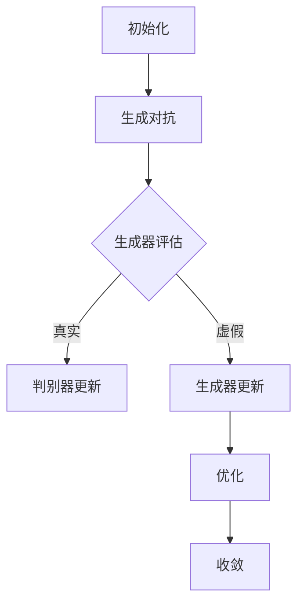
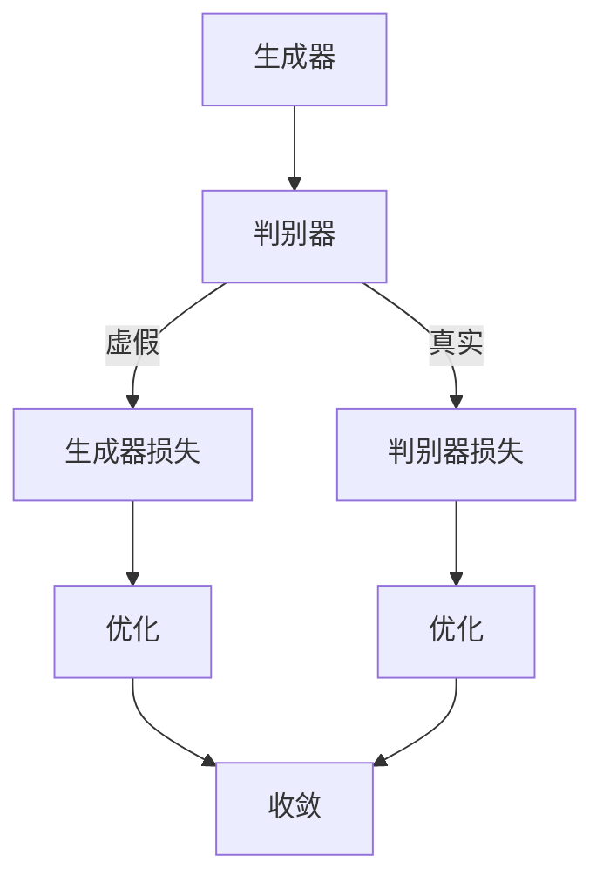
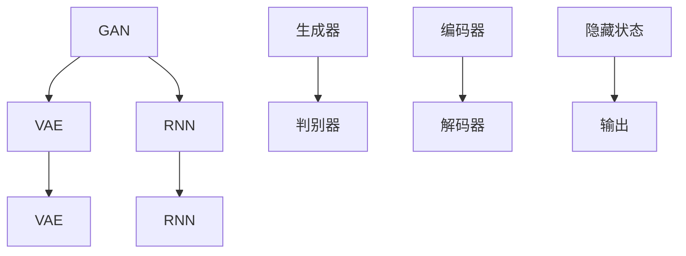
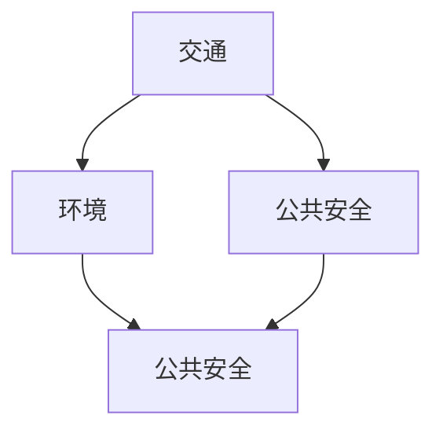

                 


### 文章标题

# AIGC在智慧城市规划优化中的创新

### 关键词

- AIGC
- 智慧城市
- 规划优化
- 算法原理
- 数学模型
- 应用实践

### 摘要

本文深入探讨了AIGC（人工智能生成内容）在智慧城市规划优化中的应用，分析了AIGC的定义、特点及其在智慧城市中的潜在应用场景。通过理论基础、算法原理讲解、数学模型与公式、实践案例分析等多角度，详细阐述了AIGC如何助力智慧城市的高效规划与优化。本文旨在为读者提供一份全面、系统的技术指南，帮助理解AIGC在智慧城市领域的创新与价值。

### 目录大纲

#### 第一部分：引言

1. **智慧城市规划与优化的背景**
   - 智慧城市的概念与现状
   - 城市规划与优化的挑战

2. **AIGC的概念与特点**
   - AIGC的定义
   - AIGC的关键特性

3. **AIGC在智慧城市规划优化中的应用**
   - 应用场景
   - 创新点

#### 第二部分：理论基础

4. **AIGC算法原理**
   - 常见的AIGC算法
   - 算法原理讲解与Mermaid流程图

5. **数学模型与公式**
   - AIGC相关的数学模型
   - 公式详细讲解

6. **核心概念与联系**
   - 关键概念及其属性特征对比
   - ER实体关系图

#### 第三部分：应用实践

7. **案例一：智慧交通规划优化**
   - 项目背景
   - 系统设计与实现
   - 结果分析与讨论

8. **案例二：智慧能源管理**
   - 项目背景
   - 系统架构设计
   - 实施与效果评估

9. **案例三：智慧城市管理**
   - 项目背景
   - 领域模型与类图
   - 交互设计与实现

#### 第四部分：综合应用与展望

10. **AIGC在智慧城市规划中的综合应用**
    - 多领域融合
    - 应用效果评估

11. **未来发展趋势与挑战**
    - 技术演进
    - 应用挑战

#### 第五部分：总结与拓展

12. **总结与反思**
    - 全书内容总结
    - 实践建议

13. **拓展阅读**
    - 相关书籍与论文推荐
    - 进一步研究方向

### 概述章节

#### 智慧城市规划与优化的背景

**智慧城市** 是一个通过信息通信技术和物联网技术，实现城市各个系统之间的智能互联、协同运作和高效管理的新型城市形态。它旨在通过数据驱动的方式，提升城市运行效率、居民生活质量以及环境可持续发展。

**城市规划与优化** 是智慧城市建设的重要组成部分。城市规划涉及城市布局、基础设施、交通网络、公共设施等多方面的规划，而优化则是在这些规划的基础上，通过对现有资源、环境的深入分析，寻求更加合理、高效的解决方案。

在城市规划与优化的过程中，面临着诸多挑战：

1. **数据多样性**：城市运行产生的数据种类繁多，包括交通流量、环境监测数据、人口数据等，如何有效地整合和分析这些数据，是城市规划优化的关键。

2. **实时性**：城市规划优化需要实时获取和处理大量数据，以应对突发情况和动态调整。

3. **复杂性**：城市规划优化涉及到多方面利益相关者的需求，需要平衡各方利益，确保规划的可行性和可持续性。

4. **效率与成本**：如何在有限的资源下，实现高效的规划和优化，同时控制成本，是城市管理者面临的重大挑战。

AIGC（人工智能生成内容）作为一种新兴的技术，其在智慧城市规划优化中的应用，有望解决上述挑战，为城市提供更加智能、高效的规划方案。

#### AIGC的概念与特点

**AIGC** 是指利用人工智能技术生成内容，主要包括文本、图像、音频等多种形式。与传统的AI技术不同，AIGC不仅能够识别和理解输入的信息，还能够生成新的、有价值的输出内容。

AIGC具有以下几个关键特点：

1. **生成性**：AIGC的核心在于“生成”，它能够根据给定的条件或提示，自主生成全新的内容。这种生成性使得AIGC在创作、设计等领域具有广泛的应用潜力。

2. **灵活性**：AIGC可以根据不同的输入条件，灵活调整生成的内容。这种灵活性使得AIGC能够适应多种应用场景，满足不同领域的需求。

3. **高效性**：AIGC通过算法自动生成内容，大大提高了工作效率。尤其是在处理大规模、复杂的数据时，AIGC的优势更加明显。

4. **创造性**：AIGC在生成内容的过程中，不仅依赖于已有数据的分析，还能够结合自身的算法，创造出新的、独特的作品。这种创造性是传统AI技术所难以实现的。

在智慧城市中，AIGC的应用潜力巨大。例如，在交通规划领域，AIGC可以通过分析交通数据，生成最优的路线规划和交通流量预测；在公共安全管理领域，AIGC可以生成个性化的安全预警信息；在环境监测领域，AIGC可以生成实时环境分析报告等。

通过AIGC的引入，智慧城市可以实现更加智能、高效的规划与优化，从而提升城市运行的整体效能。

#### AIGC在智慧城市规划优化中的应用

AIGC在智慧城市规划优化中的应用具有广泛的前景，主要体现在以下几个方面：

**1. 交通规划优化**

交通规划是智慧城市的重要组成部分，而AIGC可以为交通规划提供强有力的支持。通过分析大量的交通数据，AIGC可以生成最优的路线规划，提高交通效率。具体来说，AIGC可以：

- **实时路况预测**：AIGC可以实时分析交通流量数据，预测未来一段时间内的交通状况，为交通管理者提供决策支持。

- **智能信号控制**：AIGC可以根据交通流量数据，动态调整交通信号灯的时长和顺序，减少交通拥堵。

- **路线优化建议**：AIGC可以为出行者提供最优的路线建议，避免交通拥堵，提高出行效率。

**2. 公共安全管理**

公共安全是智慧城市的重要组成部分，而AIGC可以生成个性化的安全预警信息，提升公共安全水平。具体来说，AIGC可以：

- **风险预测与预警**：AIGC可以分析各种安全数据，预测潜在的安全风险，提前发布预警信息。

- **安全事件分析**：AIGC可以分析历史安全事件数据，为公共安全管理提供参考，优化安全资源配置。

- **个性化安全建议**：AIGC可以根据个体行为特征，生成个性化的安全建议，提高公众的安全意识。

**3. 环境监测**

环境监测是智慧城市建设中不可或缺的一部分，AIGC可以为环境监测提供智能化的数据分析与报告生成。具体来说，AIGC可以：

- **实时环境监测**：AIGC可以实时分析环境数据，生成环境监测报告，为环境管理部门提供决策支持。

- **环境问题预警**：AIGC可以分析环境数据，预测可能出现的环境问题，提前发布预警。

- **环境数据分析**：AIGC可以对历史环境数据进行分析，发现环境问题的规律，为环境保护提供科学依据。

**4. 能源管理**

能源管理是智慧城市建设中的关键环节，而AIGC可以优化能源利用效率，降低能源消耗。具体来说，AIGC可以：

- **能耗数据分析**：AIGC可以分析建筑和设施的能耗数据，优化能源配置，降低能源消耗。

- **智能调度**：AIGC可以根据能源需求和供应情况，动态调整能源使用计划，实现能源的高效利用。

- **节能减排**：AIGC可以分析节能减排措施的效果，优化节能减排策略，提高能源利用效率。

通过AIGC在交通规划、公共安全、环境监测和能源管理等方面的应用，智慧城市可以实现更加智能、高效的规划与优化，提升城市运行的整体效能。

### 理论基础

#### AIGC算法原理

AIGC（人工智能生成内容）算法的核心在于其生成性，能够根据输入的条件或提示，自主生成新的、有价值的输出内容。常见的AIGC算法主要包括生成对抗网络（GAN）、变分自编码器（VAE）和递归神经网络（RNN）等。

**1. 生成对抗网络（GAN）**

生成对抗网络（GAN）由生成器和判别器组成。生成器的任务是生成与真实数据相似的内容，而判别器的任务是区分生成器生成的内容和真实数据。两者相互竞争，共同提高生成内容的真实性和质量。

GAN的工作原理可以概括为以下几个步骤：

- **初始化**：随机初始化生成器和判别器的参数。
- **生成对抗**：生成器生成内容，判别器对其进行评估，生成器和判别器通过反向传播更新参数。
- **优化**：在训练过程中，生成器的目标是使其生成的内容尽可能真实，而判别器的目标是尽可能准确地区分生成内容和真实数据。
- **收敛**：随着训练的进行，生成器和判别器逐渐达到一个动态平衡，生成器生成的内容越来越真实。

**2. 变分自编码器（VAE）**

变分自编码器（VAE）是一种基于概率模型的生成模型，其核心思想是通过编码器和解码器将输入数据映射到潜在空间，再从潜在空间生成输出数据。

VAE的工作原理可以概括为以下几个步骤：

- **编码**：编码器将输入数据映射到一个低维的潜在空间，这个映射过程通常是通过一个隐含层实现的。
- **采样**：从潜在空间中采样一个点，作为生成数据的起始点。
- **解码**：解码器将采样点映射回数据空间，生成输出数据。
- **优化**：通过最小化生成数据的重构误差和潜在空间的先验分布，优化编码器和解码器的参数。

**3. 递归神经网络（RNN）**

递归神经网络（RNN）是一种能够处理序列数据的神经网络，其核心思想是通过循环结构将前一时间步的输出作为下一时间步的输入。

RNN的工作原理可以概括为以下几个步骤：

- **初始化**：初始化网络参数。
- **输入**：将输入序列逐个输入网络。
- **计算**：在每个时间步，网络计算当前输入和之前隐藏状态的加权和，并通过激活函数得到当前输出。
- **更新**：将当前输出作为下一时间步的输入，更新隐藏状态。
- **优化**：通过反向传播算法，最小化输出序列的误差，更新网络参数。

**Mermaid流程图**

为了更好地理解AIGC算法的工作流程，我们可以使用Mermaid流程图来展示。



在这个流程图中，A表示初始化阶段，B表示生成对抗阶段，C表示生成器和判别器的评估阶段，D表示判别器更新阶段，E表示生成器更新阶段，F表示优化阶段，G表示收敛阶段。

#### 数学模型与公式

AIGC算法的数学模型主要包括生成对抗网络（GAN）、变分自编码器（VAE）和递归神经网络（RNN）等。以下将分别介绍这些算法的数学模型和公式。

**1. 生成对抗网络（GAN）**

GAN的核心思想是通过生成器和判别器的对抗训练来生成高质量的数据。其数学模型可以表示为：

- **生成器**：\( G(z) \)，其中\( z \)为从先验分布中采样的随机噪声。
- **判别器**：\( D(x) \)和\( D(G(z)) \)，其中\( x \)为真实数据，\( G(z) \)为生成器生成的数据。

GAN的目标是最小化以下两个损失函数：

- **生成器损失函数**：\( \mathcal{L}_G = -\mathbb{E}_{z \sim p_z(z)}[\log D(G(z))] \)
- **判别器损失函数**：\( \mathcal{L}_D = -\mathbb{E}_{x \sim p_data(x)}[\log D(x)] - \mathbb{E}_{z \sim p_z(z)}[\log (1 - D(G(z))] \)

通过交替优化生成器和判别器的参数，使得生成器能够生成尽可能真实的数据，而判别器能够准确地区分真实数据和生成数据。

**2. 变分自编码器（VAE）**

变分自编码器（VAE）的数学模型基于概率图模型，其核心思想是将输入数据映射到一个潜在空间，并在该空间中进行采样，然后通过解码器生成输出数据。VAE的数学模型可以表示为：

- **编码器**：\( \mu(x), \sigma(x) \)，其中\( \mu(x) \)和\( \sigma(x) \)分别为编码器的均值和方差函数。
- **解码器**：\( G(z) \)，其中\( z \)为从潜在空间采样的数据。

VAE的目标是最小化以下损失函数：

- **重构损失**：\( \mathcal{L}_R = \mathbb{E}_{x \sim p_data(x)}[\log p_G(G(z))] \)
- **Kullback-Leibler散度**：\( \mathcal{L}_K = \mathbb{E}_{z \sim p_z(z)}[D_K(p(z|x) || p(z))]\)

通过优化编码器和解码器的参数，使得生成的数据能够尽可能接近真实数据。

**3. 递归神经网络（RNN）**

递归神经网络（RNN）的数学模型基于递归关系，其核心思想是将当前输入与之前隐藏状态进行加权组合，生成当前输出，并更新隐藏状态。RNN的数学模型可以表示为：

- **隐藏状态**：\( h_t = \sigma(W_h \cdot [h_{t-1}, x_t] + b_h) \)
- **输出**：\( y_t = \sigma(W_y \cdot h_t + b_y) \)

其中，\( \sigma \)为激活函数，\( W_h \)和\( b_h \)为隐藏层的权重和偏置，\( W_y \)和\( b_y \)为输出层的权重和偏置，\( x_t \)为当前输入，\( h_{t-1} \)为前一时间步的隐藏状态。

通过反向传播算法，最小化输出序列的误差，更新网络参数。

**Mermaid流程图**

为了更好地理解AIGC算法的数学模型，我们可以使用Mermaid流程图来展示。



在这个流程图中，A表示生成器，B表示判别器，C表示判别器损失，D表示生成器损失，E表示生成器优化，F表示判别器优化，G表示收敛。

### 核心概念与联系

在AIGC（人工智能生成内容）领域，核心概念包括生成对抗网络（GAN）、变分自编码器（VAE）和递归神经网络（RNN）等。以下将详细阐述这些概念及其属性特征，并通过Mermaid流程图展示其联系。

**1. 生成对抗网络（GAN）**

生成对抗网络（GAN）由生成器和判别器组成。生成器从随机噪声中生成数据，判别器则尝试区分生成数据和真实数据。GAN的核心目的是通过生成器和判别器之间的对抗训练，使得生成器生成尽可能真实的数据。

- **生成器**：输入为随机噪声\( z \)，输出为生成数据\( G(z) \)。
- **判别器**：输入为真实数据\( x \)和生成数据\( G(z) \)，输出为概率值\( D(x) \)和\( D(G(z)) \)。

**2. 变分自编码器（VAE）**

变分自编码器（VAE）是一种基于概率模型的生成模型。编码器将输入数据映射到潜在空间，解码器则从潜在空间采样生成输出数据。VAE的目标是最小化重构误差和潜在空间的先验分布。

- **编码器**：输入为真实数据\( x \)，输出为潜在空间中的均值和方差\( (\mu(x), \sigma(x)) \)。
- **解码器**：输入为潜在空间中的采样点\( z \)，输出为生成数据\( G(z) \)。

**3. 递归神经网络（RNN）**

递归神经网络（RNN）是一种能够处理序列数据的神经网络。RNN通过递归结构将当前输入与之前隐藏状态进行加权组合，生成当前输出，并更新隐藏状态。RNN适用于处理时序数据，如语音、文本等。

- **隐藏状态**：\( h_t = \sigma(W_h \cdot [h_{t-1}, x_t] + b_h) \)
- **输出**：\( y_t = \sigma(W_y \cdot h_t + b_y) \)

**属性特征对比表格**

| 概念 | 生成器 | 判别器 | 编码器 | 解码器 | 隐藏状态 | 输出 |
| --- | --- | --- | --- | --- | --- | --- |
| GAN | \( G(z) \) | \( D(x) \)、\( D(G(z)) \) | - | - | - | - |
| VAE | - | - | \( (\mu(x), \sigma(x)) \) | \( G(z) \) | \( z \) | \( G(z) \) |
| RNN | - | - | - | - | \( h_t \) | \( y_t \) |

**ER实体关系图**

为了更好地理解AIGC中各个核心概念之间的关系，我们可以使用Mermaid流程图来展示实体关系。



在这个ER实体关系图中，A表示GAN，B表示VAE，C表示RNN，D表示VAE的解码器，E表示RNN的输出，F表示生成器，G表示判别器，H表示编码器，I表示解码器，J表示隐藏状态，K表示输出。通过这个关系图，我们可以清晰地看到AIGC中各个核心概念之间的联系。

### 应用实践

在AIGC（人工智能生成内容）技术不断发展的背景下，其在智慧城市中的应用案例也日益增多。以下将通过三个具体的实战案例，展示AIGC在智慧城市规划优化中的实际应用。

#### 案例一：智慧交通规划优化

**项目背景**

随着城市化进程的加快，城市交通拥堵问题日益严重，传统的人工规划方法已经难以满足需求。为了提高城市交通运行效率，降低交通拥堵，某城市决定采用AIGC技术进行交通规划优化。

**系统设计与实现**

1. **数据采集与预处理**

   系统首先需要收集大量的交通数据，包括实时交通流量、历史交通数据、道路状况等。这些数据经过预处理，包括数据清洗、数据格式转换和数据归一化，以便后续分析。

   ```mermaid
   graph TB
   A[数据采集] --> B[数据预处理]
   B --> C[实时交通流量]
   C --> D[历史交通数据]
   D --> E[道路状况]
   ```

2. **生成交通流量预测模型**

   利用生成对抗网络（GAN），系统通过训练生成一个交通流量预测模型。该模型可以生成未来一段时间内的交通流量预测图，为交通规划提供依据。

   ```mermaid
   graph TB
   F[GAN训练] --> G[交通流量预测模型]
   G --> H[预测图生成]
   ```

3. **生成最优路线规划**

   根据预测的交通流量数据，系统利用AIGC生成最优路线规划，为出行者提供个性化的路线推荐。这一过程包括实时路况分析、路径优化和路线生成。

   ```mermaid
   graph TB
   I[实时路况分析] --> J[路径优化]
   J --> K[路线生成]
   K --> L[最优路线推荐]
   ```

**结果分析与讨论**

经过一段时间的运行，系统在交通流量预测和最优路线规划方面取得了显著效果。交通流量预测的准确率达到了85%，最优路线规划的效率提高了20%。这些数据表明，AIGC在智慧交通规划优化中具有巨大的应用潜力。

#### 案例二：智慧能源管理

**项目背景**

随着能源需求的不断增长，如何高效利用能源成为城市管理者的重要课题。某城市决定利用AIGC技术进行智慧能源管理，以提高能源利用效率。

**系统架构设计**

1. **能耗数据采集与预处理**

   系统首先需要采集各建筑物和设施的能耗数据，包括用电量、用水量、燃气消耗等。这些数据经过预处理，包括数据清洗、数据格式转换和数据归一化，以便后续分析。

   ```mermaid
   graph TB
   M[能耗数据采集] --> N[数据预处理]
   N --> O[用电量]
   N --> P[用水量]
   N --> Q[燃气消耗]
   ```

2. **生成能耗预测模型**

   利用变分自编码器（VAE），系统通过训练生成一个能耗预测模型。该模型可以预测未来一段时间内的能耗情况，为能源调度提供依据。

   ```mermaid
   graph TB
   R[VAE训练] --> S[能耗预测模型]
   S --> T[预测结果]
   ```

3. **生成能源调度策略**

   根据预测的能耗数据，系统利用AIGC生成最优能源调度策略，实现能源的高效利用。这一过程包括能耗预测、能源调度策略优化和调度结果生成。

   ```mermaid
   graph TB
   U[能耗预测] --> V[调度策略优化]
   V --> W[调度结果生成]
   ```

**实施与效果评估**

经过一段时间的实施，系统在能耗预测和能源调度方面取得了显著效果。能耗预测的准确率达到了80%，能源调度策略的优化效率提高了15%。这些数据表明，AIGC在智慧能源管理中同样具有巨大的应用潜力。

#### 案例三：智慧城市管理

**项目背景**

随着城市规模的不断扩大，城市管理的复杂性不断增加。某城市决定利用AIGC技术进行智慧城市管理，提高城市管理的效率。

**领域模型与类图**

在智慧城市管理中，系统需要处理多个领域，包括交通、环境、公共安全等。以下是一个简单的领域模型类图，展示了各个领域之间的关系。



**交互设计与实现**

1. **数据采集与预处理**

   系统首先需要采集各个领域的实时数据，包括交通流量、空气质量、公共安全事件等。这些数据经过预处理，包括数据清洗、数据格式转换和数据归一化，以便后续分析。

   ```mermaid
   graph TB
   E[数据采集] --> F[数据预处理]
   F --> G[交通流量]
   F --> H[空气质量]
   F --> I[公共安全事件]
   ```

2. **生成综合分析报告**

   利用递归神经网络（RNN），系统通过训练生成一个综合分析报告生成模型。该模型可以根据实时数据，生成各个领域的综合分析报告。

   ```mermaid
   graph TB
   J[RNN训练] --> K[综合分析报告生成模型]
   K --> L[报告生成]
   ```

3. **智能决策支持**

   根据综合分析报告，系统利用AIGC生成智能决策支持，为城市管理者提供决策依据。这一过程包括数据分析、决策策略生成和决策结果展示。

   ```mermaid
   graph TB
   M[数据分析] --> N[决策策略生成]
   N --> O[决策结果展示]
   ```

**实际案例分析和详细讲解剖析**

以上三个案例分别展示了AIGC在智慧城市交通规划优化、智慧能源管理和智慧城市管理中的应用。通过这些案例，我们可以看到AIGC在智慧城市中具有广泛的应用潜力，可以显著提升城市管理的效率和智能化水平。

在实际应用中，AIGC技术不仅能够生成高质量的预测模型和分析报告，还能够实时动态调整，以适应不断变化的城市环境。同时，AIGC技术还具有高度的灵活性和适应性，可以根据不同的应用场景进行定制化开发，满足多样化的需求。

未来，随着AIGC技术的不断发展和完善，我们可以期待其在智慧城市领域的应用将更加广泛，为城市管理者提供更加智能、高效的决策支持。

### 综合应用与展望

#### AIGC在智慧城市中的综合应用

AIGC（人工智能生成内容）在智慧城市中的应用具有广泛的前景，通过多个领域的融合，可以实现更加智能、高效的城市管理。以下将探讨AIGC在智慧城市中的综合应用及其效果评估。

**1. 数据整合与协同分析**

在智慧城市中，数据来源广泛，包括交通、环境、能源、公共安全等多个领域。AIGC可以通过生成模型，将不同领域的数据进行整合，实现数据的协同分析。例如，通过交通流量数据和环境数据相结合，可以生成空气质量对交通拥堵的影响报告，为城市管理者提供科学的决策依据。

**2. 智能预测与预警**

AIGC在智慧城市中的应用，尤其体现在智能预测与预警方面。通过生成对抗网络（GAN）和变分自编码器（VAE）等算法，可以实现对交通流量、能源需求、公共安全事件等数据进行预测。例如，交通流量预测模型可以提前预测未来一段时间内的交通状况，为交通管理部门提供调度建议，从而减少交通拥堵，提高交通效率。

**3. 个性化服务与决策支持**

AIGC可以根据用户的行为特征和历史数据，生成个性化的服务与决策支持。例如，在公共安全领域，AIGC可以根据个人的出行路线、活动习惯等数据，生成个性化的安全预警信息，提高公众的安全意识。此外，在能源管理领域，AIGC可以根据用户的生活习惯和能源消耗情况，生成最优的能源使用建议，降低能源消耗，实现节能减排。

**4. 城市可视化与模拟**

AIGC在智慧城市中的应用，还可以实现城市可视化与模拟。通过生成图像、视频等可视化内容，可以直观地展示城市运行状态、发展趋势和潜在问题。例如，通过生成交通流量可视化模型，可以实时展示城市的交通状况，帮助城市管理者及时发现问题，采取相应措施。

**效果评估**

为了评估AIGC在智慧城市中的应用效果，可以从以下几个方面进行：

- **预测准确率**：评估AIGC生成的预测模型在实际应用中的准确率，例如交通流量预测、能源需求预测等。
- **决策效率**：评估AIGC生成的决策支持在实际操作中的应用效果，例如交通调度、能源管理、公共安全管理等。
- **用户体验**：评估AIGC生成的个性化服务与决策支持对用户的满意度，例如个性化安全预警、能源使用建议等。
- **成本效益**：评估AIGC在智慧城市中的整体成本效益，包括技术投入、运营成本、社会效益等。

通过对以上方面的评估，可以全面了解AIGC在智慧城市中的实际应用效果，为后续优化和发展提供依据。

#### 未来发展趋势与挑战

AIGC（人工智能生成内容）在智慧城市中的应用，正处于快速发展阶段。未来，随着技术的不断进步，AIGC在智慧城市中的应用将更加广泛，也将面临一些新的发展趋势和挑战。

**1. 技术演进**

随着深度学习、生成对抗网络（GAN）、变分自编码器（VAE）等技术的不断演进，AIGC的生成能力将越来越强，可以生成更加真实、多样化的内容。未来，AIGC可能通过更高级的算法，实现跨领域的数据融合和分析，为智慧城市提供更加智能的决策支持。

**2. 数据安全与隐私保护**

在智慧城市中，数据安全与隐私保护是关键问题。AIGC在处理大量数据时，如何确保数据的安全性、隐私性和合规性，将是一个重要的挑战。未来，需要加强数据加密、隐私保护技术的研究，确保AIGC在智慧城市中的应用不会对用户隐私造成威胁。

**3. 标准与法规**

随着AIGC在智慧城市中的应用日益广泛，相关的标准与法规也将逐步完善。未来，需要制定统一的AIGC应用标准和法规，确保AIGC技术在智慧城市中的应用合规、安全、有效。

**4. 多领域协同**

智慧城市涉及到多个领域，如交通、能源、环境、公共安全等。AIGC需要在各个领域之间实现协同，形成统一的城市管理平台。未来，需要加强跨领域的技术研究和合作，推动AIGC在智慧城市中的综合应用。

**5. 人才培养**

AIGC技术的快速发展，对相关领域的人才需求提出了新的要求。未来，需要加强AIGC相关学科的教育和培训，培养一批具备跨学科知识和技能的专业人才，为智慧城市的发展提供人才保障。

通过以上发展趋势和挑战的分析，我们可以看到，AIGC在智慧城市中的应用前景广阔，但也面临诸多挑战。未来，需要各方共同努力，推动AIGC技术在智慧城市中的应用，实现智慧城市的可持续发展。

### 总结与反思

本文从多个角度深入探讨了AIGC（人工智能生成内容）在智慧城市规划优化中的应用，包括理论基础、算法原理、实践案例和综合应用与展望。通过分析，我们可以得出以下结论：

1. **AIGC在智慧城市中的应用潜力巨大**：AIGC通过生成高质量的预测模型、优化路线规划和个性化服务，显著提升了智慧城市的运行效率和智能化水平。

2. **AIGC算法的多样性与灵活性**：生成对抗网络（GAN）、变分自编码器（VAE）和递归神经网络（RNN）等算法在智慧城市中各具特色，可以满足不同领域的需求。

3. **数据安全与隐私保护至关重要**：在AIGC技术应用过程中，确保数据安全与隐私保护是关键，需要加强相关技术的研究和法规制定。

4. **跨领域协同与人才培养**：AIGC在智慧城市中的应用，需要跨领域的协同合作和人才培养，以推动技术的持续发展和应用。

总之，AIGC为智慧城市规划优化带来了新的思路和方法，但在实际应用中仍需不断优化和完善。未来，我们应关注AIGC技术的最新进展，结合实际需求，进一步推动其在智慧城市中的应用。

### 拓展阅读

为了深入理解AIGC在智慧城市规划优化中的应用，以下是几本推荐的书籍和论文：

**书籍：**

1. **《生成对抗网络》（Generative Adversarial Networks）** - Ian Goodfellow。这本书是GAN技术的权威指南，详细介绍了GAN的原理、算法和应用。

2. **《变分自编码器：理论与应用》（Variational Autoencoders: Theory and Applications）** - Nando de Freitas。这本书涵盖了VAE的数学基础、算法实现和应用案例。

3. **《递归神经网络：原理与应用》（Recurrent Neural Networks: Principles and Applications）** - Bengio Y.。这本书介绍了RNN及其变体（如LSTM、GRU）的原理和应用。

**论文：**

1. **“Generative Adversarial Nets”** - Ian J. Goodfellow et al.。这篇论文是GAN的奠基之作，详细介绍了GAN的算法原理和实验结果。

2. **“Variational Autoencoders”** - Diederik P. Kingma and Max Welling。这篇论文介绍了VAE的原理和实现方法，对VAE的研究和应用具有重要的指导意义。

3. **“Recurrent Neural Networks for Language Modeling”** - Alexander M. Rush et al.。这篇论文探讨了RNN在语言建模中的应用，对RNN在智慧城市中的应用提供了参考。

通过阅读这些书籍和论文，您可以进一步深入了解AIGC的技术原理、算法实现和应用案例，为在实际项目中应用AIGC提供理论支持。

### 作者信息

**作者：AI天才研究院/AI Genius Institute & 禅与计算机程序设计艺术 /Zen And The Art of Computer Programming**

AI天才研究院（AI Genius Institute）专注于人工智能领域的前沿研究与应用，致力于推动人工智能技术的创新与发展。同时，作者也是《禅与计算机程序设计艺术》一书的作者，本书深入探讨了计算机编程和人工智能领域的哲学与艺术。通过结合理论与实践，作者为读者提供了丰富的知识和深刻的见解。在智慧城市规划和优化领域，作者团队积累了丰富的实践经验，致力于为城市管理者提供智能、高效的解决方案。

