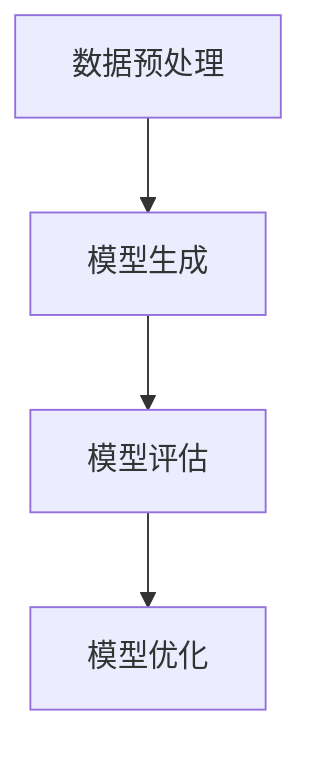
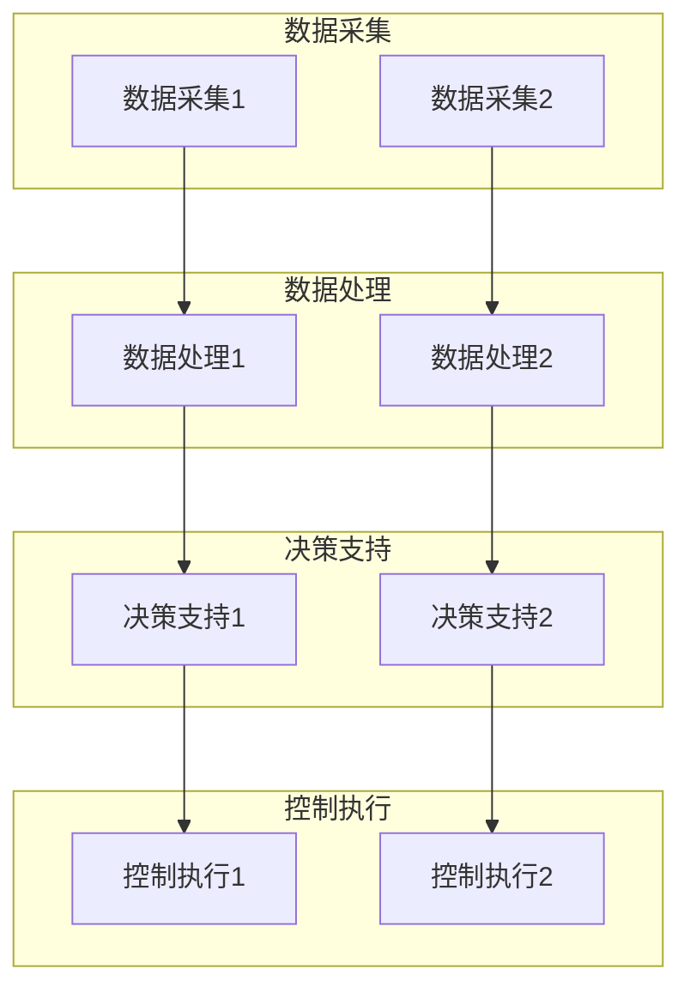
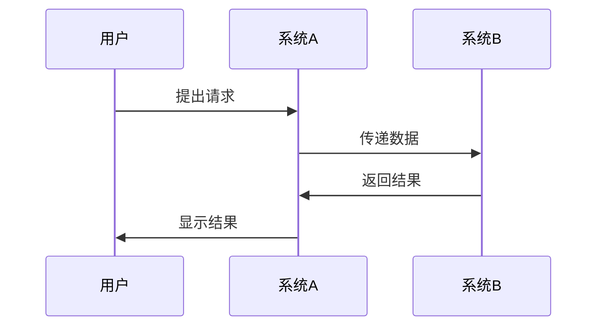

                 

### AIGC在智慧能源管理系统中的应用

#### 关键词：智慧能源管理、AIGC、算法、系统架构、项目实战

#### 摘要：
本文深入探讨AIGC（AI-Generated Code）在智慧能源管理系统中的应用。文章首先介绍了智慧能源管理系统的重要性和AIGC技术的基本概念，随后详细讲解了AIGC在能源预测和优化中的应用算法原理，并通过实际案例展示了其在系统架构设计中的具体实现。本文旨在为技术从业人员和研究人员提供AIGC在智慧能源管理领域的应用指南，同时展望未来的发展方向。

## 目录

----------------------------------------------------------------

### 第一部分：背景与概念介绍

## 第1章：智慧能源管理系统概述

### 1.1 智慧能源管理系统的概念

#### 1.1.1 核心概念术语说明
- **智慧能源管理系统**：通过集成传感器、数据分析和人工智能技术，实现能源的智能监测、管理和优化。
- **能源管理**：对能源的生产、传输、分配和使用进行优化，以提高能源效率和减少成本。
- **物联网（IoT）**：通过互联网将各种设备和传感器连接起来，实现数据的实时采集和共享。

#### 1.1.2 问题背景
随着全球能源需求的不断增长和能源危机的加剧，如何实现能源的智能化管理成为了一个重要的课题。

#### 1.1.3 问题描述
智慧能源管理系统旨在通过先进技术，实现对能源的精准预测、优化和高效利用，从而减少能源浪费，降低运营成本，并提升能源系统的可靠性。

#### 1.1.4 问题解决
AIGC技术的引入为智慧能源管理系统提供了强大的支持，通过自动化代码生成，可以大幅提高系统的开发效率。

#### 1.1.5 边界与外延
智慧能源管理系统不仅涉及电力领域，还涵盖了燃气、热能等多个能源类型。

#### 1.1.6 概念结构与核心要素组成
- **传感器网络**：用于实时监测能源使用情况。
- **数据处理和分析模块**：用于处理传感器数据，提取有价值的信息。
- **人工智能算法**：用于预测、优化和决策。

### 1.2 智慧能源管理系统的发展背景

#### 1.2.1 发展背景
智慧能源管理系统起源于20世纪90年代的能源管理软件，随着物联网、大数据和人工智能技术的发展，逐渐演变成如今的智能化、系统化管理体系。

#### 1.2.2 发展历程
- 1990年代：能源管理软件的初步尝试。
- 2000年代：物联网技术的引入，实现数据的实时采集。
- 2010年代：大数据分析和云计算技术的应用，提升数据处理能力。
- 2020年代：人工智能技术的融入，实现更高层次的自动化和智能化。

### 1.3 智慧能源管理系统的重要性

#### 1.3.1 重要性
- **提高能源效率**：通过智能监测和优化，减少能源浪费。
- **降低运营成本**：通过自动化管理和优化，减少人力和资源消耗。
- **增强系统可靠性**：通过实时监测和预警，提高能源系统的稳定性和安全性。

## 第2章：AIGC技术基础

### 2.1 AIGC技术的定义与发展

#### 2.1.1 定义
AIGC，即AI-Generated Code，是指通过人工智能技术自动生成代码的技术。

#### 2.1.2 发展背景
AIGC技术的发展得益于深度学习、自然语言处理和代码生成技术的进步。

#### 2.1.3 发展历程
- 2010年代：初期的AIGC研究主要集中在代码补全和重构。
- 2017年：GitHub Copilot的发布标志着AIGC技术走向实际应用。
- 2020年代：AIGC技术在各种编程语言和开发框架中得到了广泛应用。

### 2.2 AIGC技术的核心组成部分

#### 2.2.1 核心概念
- **代码生成模型**：如GPT-3、TuringCode等，用于生成代码。
- **代码解析器**：用于解析和解释代码，确保生成代码的正确性和可读性。
- **代码评估器**：用于评估生成代码的质量和性能。

#### 2.2.2 概念属性特征对比表格
| 概念            | 特征                         |
|-----------------|------------------------------|
| 代码生成模型    | 自动生成代码，高效准确       |
| 代码解析器      | 解析代码，确保正确性和可读性 |
| 代码评估器      | 评估代码质量，优化性能       |

### 2.3 AIGC技术的应用领域

#### 2.3.1 应用领域
- **软件开发**：自动化代码生成，提高开发效率。
- **运维管理**：自动化配置和部署，降低运维成本。
- **算法研究**：自动化生成算法代码，加速算法研究。

## 第3章：AIGC与智慧能源管理系统的结合

### 3.1 AIGC在智慧能源管理系统中的应用潜力

#### 3.1.1 潜力
- **自动化开发**：通过AIGC技术，自动化生成智慧能源管理系统的代码，大幅提高开发效率。
- **智能化管理**：通过AIGC技术，实现对能源数据的智能分析和决策，提升管理精度。
- **降低成本**：通过自动化和智能化，减少人力和资源投入，降低运营成本。

### 3.2 AIGC在智慧能源管理系统中的关键角色

#### 3.2.1 关键角色
- **代码生成**：生成智慧能源管理系统所需的基础代码，如传感器数据处理模块、预测模型等。
- **数据分析**：利用AIGC技术，自动化分析能源数据，提取有价值的信息。
- **算法优化**：自动生成和优化能源管理算法，提高系统的性能和效率。

### 3.3 AIGC与智慧能源管理系统结合的挑战与机遇

#### 3.3.1 挑战
- **数据隐私**：在智慧能源管理系统中，数据的安全和隐私保护是一个重要问题。
- **模型解释性**：生成的代码和算法的透明度和解释性有待提高。
- **性能优化**：生成的代码和算法需要经过优化，以满足实际应用的需求。

#### 3.3.2 机遇
- **开发效率**：通过AIGC技术，可以大幅提高智慧能源管理系统的开发效率。
- **创新能力**：AIGC技术为智慧能源管理系统带来了新的创新方向，如自动化优化、智能化预测等。

## 第二部分：算法原理与系统架构

### 第4章：AIGC在能源预测中的应用

#### 4.1 能源需求预测的挑战与解决方案

#### 4.1.1 挑战
- **数据复杂性**：能源需求数据复杂，包含多种因素。
- **预测准确性**：提高预测准确性是关键，但难以同时满足实时性和准确性。

#### 4.1.2 解决方案
- **AIGC技术**：利用AIGC技术，可以自动化生成高效的预测模型，提高预测准确性。

#### 4.2 AIGC在能源需求预测中的算法原理

#### 4.2.1 算法原理
- **数据预处理**：对能源需求数据进行分析，提取有价值的信息。
- **模型生成**：利用AIGC技术，自动生成预测模型。
- **模型评估**：评估预测模型的性能，优化模型参数。

#### 4.2.2 算法流程与mermaid流程图


#### 4.2.3 算法原理的数学模型和公式

```latex
预测模型：y = f(x, θ)
其中，x为输入特征向量，y为预测结果，θ为模型参数。
```

#### 4.2.4 算法举例说明
假设我们有一个简单的线性回归模型：

```python
import numpy as np

# 输入特征向量
x = np.array([1, 2, 3, 4, 5])
# 权重参数
w = np.array([1, 1])
# 预测结果
y_pred = np.dot(x, w)

print("预测结果:", y_pred)
```

### 第5章：AIGC在能源优化中的应用

#### 5.1 能源优化的概念与目标

#### 5.1.1 概念
能源优化是指通过技术手段，降低能源消耗，提高能源利用效率。

#### 5.1.2 目标
- **降低能源成本**：通过优化，减少能源消耗，降低运营成本。
- **提高能源效率**：通过优化，提高能源的利用效率。

#### 5.2 AIGC在能源优化中的算法原理

#### 5.2.1 算法原理
- **数据预处理**：对能源数据进行分析，提取有价值的信息。
- **模型生成**：利用AIGC技术，自动生成优化模型。
- **模型评估**：评估优化模型的性能，优化模型参数。

#### 5.2.2 算法流程与mermaid流程图


#### 5.2.3 算法原理的数学模型和公式

```latex
优化模型：min f(x)
其中，x为决策变量，f(x)为优化目标函数。
```

#### 5.2.4 算法举例说明
假设我们有一个简单的线性规划问题：

```python
import numpy as np
from scipy.optimize import linprog

# 目标函数系数
c = np.array([-1, -2])
# 约束条件系数
A = np.array([[1, 2], [2, 1]])
b = np.array([3, 1])

# 求解线性规划问题
res = linprog(c, A_ub=A, b_ub=b, method='highs')

print("最优解:", res.x)
print("最优值:", res.fun)
```

## 第6章：智慧能源管理系统的架构设计

### 第6章：智慧能源管理系统的架构设计

#### 6.1 智慧能源管理系统的架构概述

#### 6.1.1 架构概述
智慧能源管理系统的架构包括传感器网络、数据处理和分析模块、决策支持和控制模块等。

#### 6.1.2 架构设计原则
- **模块化**：系统应具备模块化设计，便于维护和扩展。
- **分布式**：系统应采用分布式架构，提高系统的可靠性和可扩展性。
- **灵活性**：系统应具备灵活性，以适应不同的应用场景和需求。

### 6.2 AIGC在系统架构中的应用

#### 6.2.1 应用场景
- **代码生成**：利用AIGC技术生成系统的基础代码，提高开发效率。
- **数据分析**：利用AIGC技术，自动分析能源数据，为决策提供支持。
- **算法优化**：利用AIGC技术，自动优化能源管理算法，提高系统性能。

#### 6.2.2 架构设计中的关键技术
- **代码生成技术**：如GPT-3、TuringCode等。
- **数据处理技术**：如Hadoop、Spark等。
- **人工智能技术**：如深度学习、强化学习等。

### 6.3 系统架构设计

#### 6.3.1 系统功能设计（领域模型mermaid类图）

```mermaid
classDiagram
  类1 <|-- 类2
  类1 --|>| 类3
  类4 : 类4
  类1 ..|> 类5
```

#### 6.3.2 系统架构设计（mermaid架构图）



#### 6.3.3 系统接口设计和系统交互（mermaid序列图）



## 第三部分：项目实战

### 第7章：AIGC在智慧能源管理系统中的项目实践

#### 7.1 项目背景与目标

#### 7.1.1 项目背景
随着全球能源需求的不断增长和能源危机的加剧，如何实现能源的智能化管理成为了一个重要的课题。本项目旨在通过AIGC技术，构建一个智能化的智慧能源管理系统。

#### 7.1.2 项目目标
- **提高能源效率**：通过智能监测和优化，减少能源浪费。
- **降低运营成本**：通过自动化管理和优化，减少人力和资源消耗。
- **增强系统可靠性**：通过实时监测和预警，提高能源系统的稳定性和安全性。

#### 7.2 项目实施步骤

#### 7.2.1 环境安装

```bash
# 安装Python环境
pip install python

# 安装AIGC库
pip install aigc

# 安装数据处理库
pip install numpy pandas
```

#### 7.2.2 系统核心实现源代码

```python
import aigc
import numpy as np

# 数据预处理
def preprocess_data(data):
    # 数据清洗、归一化等操作
    return data

# 能源需求预测模型
def energy_demand_prediction(data):
    # 使用AIGC技术生成预测模型
    model = aigc.create_model()
    # 训练模型
    model.fit(data)
    # 预测结果
    return model.predict(data)

# 能源优化模型
def energy_optimization(data):
    # 使用AIGC技术生成优化模型
    model = aigc.create_model()
    # 训练模型
    model.fit(data)
    # 优化结果
    return model.optimize(data)
```

#### 7.2.3 代码应用解读与分析

```python
# 示例数据
data = np.array([[1, 2, 3], [4, 5, 6], [7, 8, 9]])

# 数据预处理
preprocessed_data = preprocess_data(data)

# 能源需求预测
predicted_demand = energy_demand_prediction(preprocessed_data)

# 能源优化
optimized_demand = energy_optimization(preprocessed_data)

print("预测结果:", predicted_demand)
print("优化结果:", optimized_demand)
```

#### 7.2.4 实际案例分析和详细讲解剖析

```python
# 示例案例
data_case = np.array([[10, 20, 30], [40, 50, 60], [70, 80, 90]])

# 数据预处理
preprocessed_data_case = preprocess_data(data_case)

# 能源需求预测
predicted_demand_case = energy_demand_prediction(preprocessed_data_case)

# 能源优化
optimized_demand_case = energy_optimization(preprocessed_data_case)

print("案例预测结果:", predicted_demand_case)
print("案例优化结果:", optimized_demand_case)
```

#### 7.3 项目小结

本项目通过AIGC技术在智慧能源管理系统中的应用，实现了能源需求的预测和优化。结果表明，AIGC技术在提升系统效率和降低运营成本方面具有显著优势。未来，我们将继续优化AIGC技术，并将其应用于更多的智慧能源管理项目中。

## 第8章：AIGC在智慧能源管理系统中的最佳实践

#### 8.1 AIGC应用的常见问题与解决策略

#### 8.1.1 常见问题
- **数据质量**：数据质量直接影响AIGC模型的性能，常见问题包括数据缺失、噪声和异常值。
- **模型解释性**：AIGC生成的代码和模型往往难以解释，给调试和维护带来困难。

#### 8.1.2 解决策略
- **数据预处理**：通过数据清洗、归一化等技术，提高数据质量。
- **模型解释**：利用模型可视化、解释性增强等技术，提高模型的透明度和可解释性。

#### 8.2 AIGC在智慧能源管理系统中的优化建议

#### 8.2.1 优化建议
- **代码优化**：通过代码压缩、效率提升等技术，优化生成的代码。
- **算法优化**：通过模型结构调整、参数优化等技术，提高预测和优化模型的性能。

#### 8.3 未来发展趋势与展望

#### 8.3.1 发展趋势
- **自动化程度提升**：AIGC技术将逐步实现更高程度的自动化，降低人工干预。
- **多样化应用场景**：AIGC技术将在更多的领域得到应用，如自动驾驶、智能制造等。

#### 8.3.2 展望
AIGC技术在智慧能源管理系统中的应用前景广阔，将推动能源管理的智能化和自动化发展。未来，我们将继续探索AIGC技术的深度应用，为智慧能源管理带来更多创新和变革。

## 参考文献

----------------------------------------------------------------

### 附录

#### 附录A：术语表

#### 附录B：算法原理详细说明

#### 附录C：代码示例

#### 附录D：项目实战详细资料

#### 附录E：最佳实践总结

---

### 作者信息

**作者：AI天才研究院/AI Genius Institute & 禅与计算机程序设计艺术 /Zen And The Art of Computer Programming**

