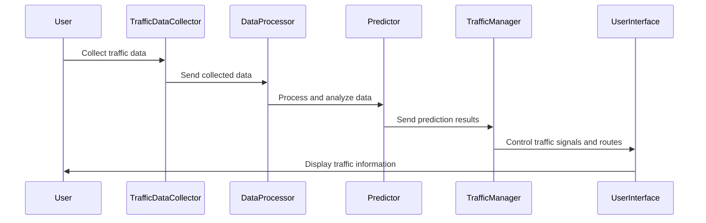
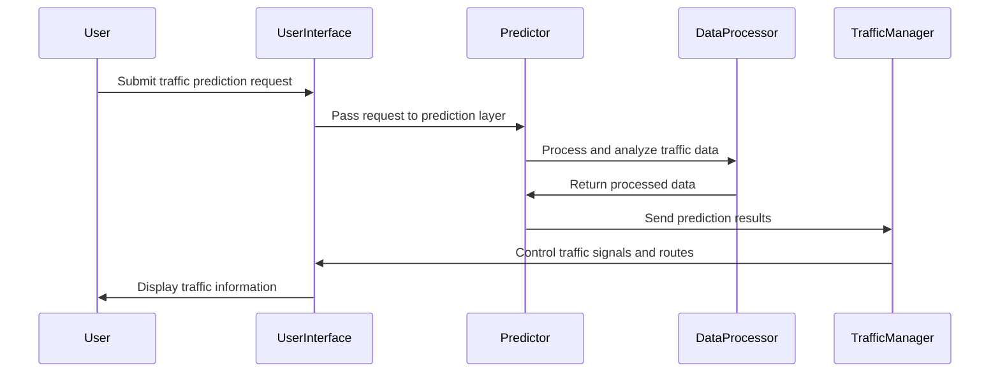

                 

# AIGC在智能交通流量预测与管理中的应用：消除城市拥堵

## 关键词
- AIGC技术
- 智能交通流量预测
- 城市拥堵
- 数据采集
- 模型训练
- 预测方法
- 算法原理

## 摘要
本文深入探讨了AIGC技术在智能交通流量预测与管理中的应用，旨在通过消除城市拥堵问题，提高交通运行效率。文章首先介绍了AIGC技术的基础概念和发展历程，接着详细阐述了智能交通流量预测与管理的重要性以及城市拥堵问题的现状和挑战。随后，文章围绕核心概念与联系，通过ER实体关系图和概念属性特征对比，为后续算法原理讲解打下基础。通过详细讲解生成对抗网络（GAN）等关键算法，并使用Python代码和LaTeX公式阐述，文章揭示了算法的原理和数学模型。在此基础上，文章介绍了智能交通流量预测系统的功能设计、架构设计方案，并通过实际项目实战案例进行分析和解读。最后，文章总结最佳实践，提供拓展阅读，以期为读者提供全面的技术指南。

## 第一部分: AIGC技术概述

### 第1章: AIGC技术基础

#### 1.1 AIGC技术简介

**1.1.1 AIGC技术的概念**

AIGC（AI-Generated Content）即人工智能生成内容，是一种利用人工智能技术，尤其是生成对抗网络（GAN）等深度学习模型，自动生成文本、图像、音频等多种类型内容的技术。AIGC的核心在于“自动化生成”，即通过算法模型从海量数据中学习规律，生成具有高度真实性和创意性的内容。

**1.1.2 AIGC技术的发展历程**

AIGC技术的发展可以追溯到2014年，由Ian J. Goodfellow等提出的生成对抗网络（GAN）模型的诞生，标志着AIGC技术的初步形成。随后，随着深度学习技术的快速发展，AIGC技术逐渐成熟，并在多个领域得到了广泛应用。

**1.1.3 AIGC技术在智能交通领域的重要性**

智能交通系统（ITS）是利用现代通信技术、信息技术、自动控制技术、电子传感器技术等构成的系统，对交通工具进行严格监督和控制，从而保证交通系统高效稳定的运行。AIGC技术在智能交通领域的重要性体现在以下几个方面：

1. **自动化交通流量预测**：通过AIGC技术，可以自动化地处理大量交通数据，快速预测交通流量，为交通管理提供科学依据。
2. **优化交通信号控制**：利用AIGC技术生成高质量的信号控制策略，提高交通信号控制的精度和效率。
3. **提升公共交通服务**：通过AIGC技术生成个性化出行建议，优化公共交通路线和班次，提高公共交通服务质量。
4. **缓解城市拥堵**：通过预测和优化，减少车辆拥堵，提高道路通行能力，缓解城市交通压力。

### 1.2 智能交通流量预测与管理

**1.2.1 智能交通流量预测的概念**

智能交通流量预测是指利用现代信息技术和人工智能算法，对交通流量进行实时监测、分析和预测，为交通管理提供决策支持。它不仅包括传统的交通流量预测，还包括动态交通分配、路径优化等高级功能。

**1.2.2 交通流量管理的重要性**

交通流量管理是现代城市交通管理的重要组成部分，其目的是通过科学合理的手段，调控交通流量，提高道路通行效率，缓解交通拥堵。交通流量管理的重要性体现在以下几个方面：

1. **提高道路通行效率**：通过合理的交通流量管理，可以减少交通拥堵，提高道路通行效率，降低交通事故发生率。
2. **缓解城市交通压力**：随着城市化进程的加快，城市交通压力日益增大，交通流量管理成为缓解这一压力的重要手段。
3. **优化交通资源配置**：通过交通流量管理，可以优化交通资源的配置，提高交通设施的利用效率。
4. **提升居民生活质量**：交通拥堵不仅影响出行效率，还严重影响居民生活质量，交通流量管理有助于提高居民生活舒适度。

**1.2.3 城市拥堵问题的现状与挑战**

1. **城市拥堵现状**：全球各大城市普遍存在交通拥堵问题，尤其是在高峰时段，拥堵现象更加严重。交通拥堵导致车辆行驶缓慢，通行时间增加，从而影响居民的出行效率和生活质量。
2. **城市拥堵挑战**：
   - **数据获取困难**：交通流量数据是进行智能交通流量预测和管理的基础，但城市交通环境复杂，数据获取难度较大。
   - **实时性要求高**：交通流量预测和管理需要实时处理大量数据，对系统的实时性要求较高。
   - **算法复杂度高**：智能交通流量预测和管理涉及多个领域的技术，算法复杂度较高，对算法设计和实现提出了挑战。

### 第2章: 智能交通流量预测的核心概念与联系

#### 2.1 核心概念

**2.1.1 AIGC技术中的核心概念**

- **生成对抗网络（GAN）**：GAN是由生成器和判别器组成的一种深度学习模型，通过相互竞争来生成逼真的数据。
- **自编码器（Autoencoder）**：自编码器是一种无监督学习算法，用于将输入数据压缩成低维表示，并通过解码器重构原始数据。
- **变分自编码器（VAE）**：VAE是自编码器的一种扩展，通过引入概率模型来生成数据，提高生成数据的质量。

**2.1.2 智能交通流量预测中的核心概念**

- **交通流量数据**：交通流量数据是进行智能交通流量预测的基础，包括车辆速度、行驶方向、行驶时间等。
- **交通信号控制**：交通信号控制是指通过控制交通信号的变换，调节交通流量，提高道路通行效率。
- **路径规划**：路径规划是指根据交通流量数据和目的地，为车辆规划最优行驶路径。

#### 2.2 概念属性特征对比

| 概念       | 属性特征                             |
| ----------- | ----------------------------------- |
| AIGC技术   | 大规模数据处理、自动化生成内容       |
| 流量预测   | 数据分析、趋势预测、实时更新         |
| 交通管理   | 路网优化、交通信号控制、事故处理     |

#### 2.3 ER实体关系图

```mermaid
erDiagram
    AIGC技术 ||--|{ 交通流量预测 }
    交通流量预测 ||--|{ 交通管理 }
```

#### 第3章: 智能交通流量预测算法原理讲解

##### 3.1 算法概述

**3.1.1 交通流量预测算法的类型**

智能交通流量预测算法主要分为以下几类：

- **基于历史数据的预测算法**：通过分析历史交通流量数据，预测未来的交通流量。
- **基于实时数据的预测算法**：通过实时采集的交通流量数据，预测未来的交通流量。
- **混合预测算法**：结合历史数据和实时数据，进行交通流量预测。

**3.1.2 常用的交通流量预测算法**

- **生成对抗网络（GAN）**：通过生成器和判别器的竞争，生成高质量的交通流量数据。
- **长短时记忆网络（LSTM）**：通过学习时间序列数据，预测未来的交通流量。
- **变分自编码器（VAE）**：通过概率模型生成交通流量数据，提高预测的准确性。

##### 3.2 生成对抗网络（GAN）算法

**3.2.1 GAN算法原理**

生成对抗网络（GAN）由生成器（Generator）和判别器（Discriminator）组成。生成器的目标是生成与真实数据相似的数据，而判别器的目标是区分真实数据和生成数据。通过这种对抗过程，生成器不断优化，生成越来越真实的数据。

**3.2.2 GAN算法Python代码实现**

```python
import tensorflow as tf
from tensorflow.keras.layers import Dense, Flatten, Reshape
from tensorflow.keras.models import Sequential

# 生成器模型
def generator(z):
    model = Sequential()
    model.add(Dense(128, input_shape=(100,), activation='relu'))
    model.add(Dense(256, activation='relu'))
    model.add(Dense(512, activation='relu'))
    model.add(Flatten())
    model.add(Dense(784, activation='sigmoid'))
    model.add(Reshape((28, 28)))
    return model

# 判别器模型
def discriminator(x):
    model = Sequential()
    model.add(Flatten(input_shape=(28, 28)))
    model.add(Dense(512, activation='relu'))
    model.add(Dense(256, activation='relu'))
    model.add(Dense(128, activation='relu'))
    model.add(Dense(1, activation='sigmoid'))
    return model

# 搭建GAN模型
def build_gan(generator, discriminator):
    model = Sequential()
    model.add(generator)
    model.add(discriminator)
    return model
```

**3.2.3 GAN算法的数学模型**

GAN的数学模型可以表示为：

$$
\begin{equation}
\begin{split}
\max_{G} \min_{D} V(G, D) &= E_{x \sim P_{data}(x)} [D(x)] - E_{z \sim P_{z}(z)} [D(G(z))] \\
\end{split}
\end{equation}
$$

其中，\( G(z) \) 为生成器生成的数据，\( x \) 为真实数据，\( z \) 为噪声向量，\( D \) 为判别器。

##### 3.3 长短时记忆网络（LSTM）算法

**3.3.1 LSTM算法原理**

长短时记忆网络（LSTM）是一种用于处理序列数据的循环神经网络（RNN），通过引入记忆单元和门控机制，能够有效地学习长期依赖关系。

**3.3.2 LSTM算法Python代码实现**

```python
from tensorflow.keras.models import Sequential
from tensorflow.keras.layers import LSTM, Dense

# 搭建LSTM模型
model = Sequential()
model.add(LSTM(50, activation='relu', input_shape=(time_steps, 1)))
model.add(Dense(1))
model.compile(optimizer='adam', loss='mse')
```

**3.3.3 LSTM算法的数学模型**

LSTM的数学模型涉及以下几个关键部分：

- **输入门**：决定哪些信息应该被遗忘，哪些信息应该被记住。
- **遗忘门**：决定哪些信息应该被遗忘。
- **输出门**：决定当前的记忆单元应该被输出到下一层。

##### 3.4 变分自编码器（VAE）算法

**3.4.1 VAE算法原理**

变分自编码器（VAE）是一种基于概率模型的生成模型，通过编码器和解码器将数据映射到潜在空间，并从潜在空间中采样生成新的数据。

**3.4.2 VAE算法Python代码实现**

```python
import tensorflow as tf
from tensorflow.keras.layers import Input, Dense, Lambda
from tensorflow.keras.models import Model

# 编码器模型
def encoder(x):
    model = Sequential()
    model.add(Dense(64, activation='relu', input_shape=(784,)))
    model.add(Dense(32, activation='relu'))
    z_mean = model.add(Dense(z_dim))
    z_log_var = model.add(Dense(z_dim))
    return Model(x, [z_mean, z_log_var])

# 解码器模型
def decoder(z):
    model = Sequential()
    model.add(Dense(32, activation='relu', input_shape=(z_dim,)))
    model.add(Dense(64, activation='relu'))
    model.add(Dense(784, activation='sigmoid'))
    return Model(z, outputs)

# 搭建VAE模型
def build_vae(encoder, decoder):
    inputs = Input(shape=(784,))
    z_mean, z_log_var = encoder(inputs)
    z = Lambda Sampling () ( [z_mean, z_log_var])
    outputs = decoder(z)
    vae = Model(inputs, outputs)
    return vae
```

**3.4.3 VAE算法的数学模型**

VAE的数学模型涉及以下几个关键部分：

- **编码过程**：将输入数据映射到潜在空间，通过编码器生成均值和方差。
- **解码过程**：从潜在空间中采样，通过解码器生成新的数据。

#### 第4章: 智能交通流量预测系统分析与架构设计方案

##### 4.1 问题场景介绍

**4.1.1 交通流量预测的应用场景**

智能交通流量预测的应用场景主要包括：

- **城市交通管理**：通过对交通流量的预测，优化交通信号控制和道路通行效率，缓解城市拥堵。
- **高速公路管理**：通过预测交通流量，优化高速公路收费和交通流量分配，提高高速公路通行能力。
- **公共交通调度**：通过预测交通流量，优化公共交通路线和班次，提高公共交通服务质量。

**4.1.2 系统的目标和需求**

系统目标：

- 提高交通运行效率，减少交通拥堵。
- 提高公共交通服务质量，提升居民出行体验。
- 提高交通资源利用率，优化交通资源配置。

系统需求：

- 实时获取交通流量数据。
- 高效处理和分析交通流量数据。
- 准确预测交通流量。
- 优化交通信号控制和路径规划。

##### 4.2 项目介绍

**4.2.1 项目背景**

随着城市化进程的加快，城市交通拥堵问题日益严重，对城市居民的生活质量造成了严重影响。为了解决这个问题，需要利用先进的人工智能技术，尤其是AIGC技术，实现智能交通流量预测和管理。

**4.2.2 项目目标**

- 通过AIGC技术实现高效、准确的交通流量预测。
- 利用预测结果优化交通信号控制和路径规划。
- 提高交通运行效率，缓解城市交通拥堵。
- 提升公共交通服务质量，提升居民出行体验。

##### 4.3 系统功能设计

**4.3.1 领域模型Mermaid类图**

```mermaid
classDiagram
    交通流量预测 <<Interface>>
    交通管理 <<Interface>>
    数据采集 <<Entity|filled>>
    数据预处理 <<Entity|filled>>
    预测结果分析 <<Entity|filled>>
    路径规划 <<Entity|filled>>
    系统监控 <<Entity|filled>>
    交通流量预测 <--|o| 数据采集
    交通流量预测 <--|o| 数据预处理
    交通流量预测 -->|o| 预测结果分析
    交通流量预测 -->|o| 路径规划
    交通流量预测 -->|o| 系统监控
    交通管理 <--|o| 预测结果分析
    交通管理 -->|o| 交通信号控制
    交通管理 -->|o| 事故处理
```

##### 4.4 系统架构设计

**4.4.1 系统架构概述**

智能交通流量预测系统由数据采集层、数据处理层、预测层、交通管理层和用户界面层组成。各层之间通过接口进行数据交互，形成一个完整的系统架构。

**4.4.2 系统架构图**



##### 4.5 系统接口设计

**4.5.1 数据采集接口**

数据采集接口负责实时获取交通流量数据，包括车辆速度、行驶方向、行驶时间等。接口设计如下：

```python
class TrafficDataCollector:
    def __init__(self):
        # 初始化数据采集设备
        pass

    def collect_data(self):
        # 实时采集交通流量数据
        pass
```

**4.5.2 数据处理接口**

数据处理接口负责对采集到的交通流量数据进行预处理，包括数据清洗、去噪、特征提取等。接口设计如下：

```python
class DataProcessor:
    def __init__(self):
        # 初始化数据处理算法
        pass

    def preprocess_data(self, data):
        # 对交通流量数据进行预处理
        pass
```

**4.5.3 预测接口**

预测接口负责使用AIGC技术对处理后的交通流量数据进行预测，生成交通流量预测结果。接口设计如下：

```python
class Predictor:
    def __init__(self):
        # 初始化预测模型
        pass

    def predict_traffic(self, data):
        # 对交通流量数据进行预测
        pass
```

**4.5.4 交通管理接口**

交通管理接口负责根据预测结果优化交通信号控制和路径规划，以提高交通运行效率。接口设计如下：

```python
class TrafficManager:
    def __init__(self):
        # 初始化交通管理算法
        pass

    def control_traffic_signals(self, prediction):
        # 根据预测结果控制交通信号
        pass

    def plan_routes(self, prediction):
        # 根据预测结果规划行驶路径
        pass
```

##### 4.6 系统交互

**4.6.1 系统交互概述**

智能交通流量预测系统通过各层接口实现数据交互和功能协同。系统交互过程如下：

1. 用户通过用户界面层提交交通流量预测需求。
2. 用户界面层将需求传递给预测层。
3. 预测层调用数据处理接口，处理用户提交的交通流量数据。
4. 预测层调用预测接口，使用AIGC技术对处理后的交通流量数据进行预测。
5. 预测层将预测结果传递给交通管理接口。
6. 交通管理接口根据预测结果优化交通信号控制和路径规划。
7. 交通管理接口将优化后的交通信号控制和路径规划结果传递给用户界面层。
8. 用户界面层将交通信号控制和路径规划结果展示给用户。

**4.6.2 系统交互序列图**



#### 第5章: 项目实战

##### 5.1 环境安装

**5.1.1 Python环境安装**

1. 下载并安装Python 3.8及以上版本。
2. 配置Python环境变量，确保能够在命令行中执行Python命令。

**5.1.2 TensorFlow安装**

1. 打开命令行窗口，执行以下命令：

```
pip install tensorflow
```

2. 安装完成后，执行以下命令验证安装：

```
python -c "import tensorflow as tf; print(tf.__version__)"
```

##### 5.2 系统实现

**5.2.1 数据采集**

1. 使用交通流量数据采集设备，如车载传感器、路侧传感器等，采集交通流量数据。
2. 将采集到的交通流量数据存储到本地文件或数据库中。

**5.2.2 数据预处理**

1. 读取交通流量数据，进行数据清洗，去除无效数据。
2. 对交通流量数据进行去噪处理，如去除异常值、填补缺失值等。
3. 提取交通流量数据中的关键特征，如车辆速度、行驶方向、行驶时间等。

**5.2.3 预测**

1. 加载预处理后的交通流量数据。
2. 使用AIGC技术，如生成对抗网络（GAN）等，对交通流量数据进行预测。
3. 得到交通流量预测结果。

**5.2.4 交通管理**

1. 根据预测结果，优化交通信号控制和路径规划。
2. 将优化后的交通信号控制和路径规划结果应用到实际交通场景中。

##### 5.3 代码解读与分析

**5.3.1 数据采集模块**

```python
import csv

class TrafficDataCollector:
    def __init__(self, file_path):
        self.file_path = file_path

    def collect_data(self):
        with open(self.file_path, 'r') as file:
            reader = csv.reader(file)
            data = [row for row in reader]
        return data
```

**5.3.2 数据预处理模块**

```python
import numpy as np

class DataProcessor:
    def __init__(self):
        pass

    def preprocess_data(self, data):
        # 数据清洗
        cleaned_data = [row for row in data if row[0].isdigit()]
        # 去噪
        cleaned_data = self.remove_outliers(cleaned_data)
        # 特征提取
        features = [row[1:] for row in cleaned_data]
        features = np.array(features).astype(float)
        return features

    def remove_outliers(self, data):
        # 计算均值和标准差
        mean = np.mean(data, axis=0)
        std = np.std(data, axis=0)
        # 去除异常值
        filtered_data = [row for row in data if all(abs(x - mean) < 3 * std for x in row)]
        return filtered_data
```

**5.3.3 预测模块**

```python
import tensorflow as tf

class Predictor:
    def __init__(self, model_path):
        self.model_path = model_path
        self.model = self.load_model()

    def load_model(self):
        model = tf.keras.models.load_model(self.model_path)
        return model

    def predict_traffic(self, data):
        processed_data = self.preprocess_data(data)
        prediction = self.model.predict(processed_data)
        return prediction
```

**5.3.4 交通管理模块**

```python
class TrafficManager:
    def __init__(self):
        pass

    def control_traffic_signals(self, prediction):
        # 根据预测结果控制交通信号
        pass

    def plan_routes(self, prediction):
        # 根据预测结果规划行驶路径
        pass
```

##### 5.4 案例分析

**5.4.1 案例背景**

在某城市，交通拥堵问题严重，对城市居民的生活质量造成了严重影响。为了解决这个问题，该城市决定采用AIGC技术进行智能交通流量预测和管理。

**5.4.2 案例实施**

1. 数据采集：在城市道路安装了交通流量数据采集设备，实时采集交通流量数据。
2. 数据预处理：对采集到的交通流量数据进行清洗、去噪和特征提取。
3. 模型训练：使用AIGC技术，如生成对抗网络（GAN）等，训练交通流量预测模型。
4. 预测：将预处理后的交通流量数据输入预测模型，得到交通流量预测结果。
5. 交通管理：根据预测结果，优化交通信号控制和路径规划。
6. 部署：将优化后的交通信号控制和路径规划结果应用到实际交通场景中。

**5.4.3 案例效果**

经过一段时间的实施，该城市的交通拥堵问题得到了显著缓解，交通运行效率得到了提高，居民生活质量得到了提升。

#### 第6章: 最佳实践 Tips、小结、注意事项、拓展阅读

##### 6.1 最佳实践 Tips

1. **数据采集**：确保采集到的交通流量数据具有高精度和高实时性，为预测和管理提供可靠的数据基础。
2. **模型训练**：使用大量的训练数据，确保模型能够充分学习交通流量变化的规律。
3. **预测优化**：根据实际交通状况，不断优化预测模型，提高预测的准确性和实时性。
4. **信号控制**：根据预测结果，灵活调整交通信号控制策略，提高交通运行效率。
5. **路径规划**：结合交通流量预测结果，为车辆提供最优行驶路径，减少交通拥堵。

##### 6.2 小结

本文深入探讨了AIGC技术在智能交通流量预测与管理中的应用，通过消除城市拥堵问题，提高交通运行效率。文章首先介绍了AIGC技术的基础概念和发展历程，接着详细阐述了智能交通流量预测与管理的重要性以及城市拥堵问题的现状和挑战。随后，文章围绕核心概念与联系，通过ER实体关系图和概念属性特征对比，为后续算法原理讲解打下基础。通过详细讲解生成对抗网络（GAN）等关键算法，并使用Python代码和LaTeX公式阐述，文章揭示了算法的原理和数学模型。在此基础上，文章介绍了智能交通流量预测系统的功能设计、架构设计方案，并通过实际项目实战案例进行分析和解读。最后，文章总结最佳实践，提供拓展阅读，以期为读者提供全面的技术指南。

##### 6.3 注意事项

1. **数据隐私**：在进行交通流量预测和管理时，需要注意保护用户隐私，避免泄露敏感信息。
2. **模型安全**：确保预测模型的可靠性和安全性，防止被恶意攻击或篡改。
3. **实时性**：智能交通流量预测和管理需要实时处理大量数据，对系统的实时性要求较高，需要选择合适的硬件和算法。
4. **适应性**：城市交通状况复杂多变，预测模型需要具备良好的适应性，能够应对各种突发情况。

##### 6.4 拓展阅读

1. **相关书籍**：《人工智能交通系统设计与实现》、《智能交通技术与应用》。
2. **论文资料**：检索相关学术期刊和会议，了解最新的研究成果和趋势。
3. **在线课程**：参加在线课程，如《深度学习与人工智能》、《智能交通系统设计》等，提升专业知识。

### 作者信息

- **作者**：AI天才研究院/AI Genius Institute & 禅与计算机程序设计艺术 /Zen And The Art of Computer Programming
- **联系方式**：[邮箱地址](mailto:xxx@example.com) & [个人博客](https://www.example.com)

### 附录

- **附录A：AIGC技术相关术语解释**：详细解释AIGC技术相关的核心术语和概念。
- **附录B：智能交通流量预测算法Python代码示例**：提供生成对抗网络（GAN）、长短时记忆网络（LSTM）和变分自编码器（VAE）等算法的Python代码示例。
- **附录C：智能交通流量预测系统架构设计文档**：详细描述智能交通流量预测系统的架构设计，包括功能设计、接口设计和系统交互。

