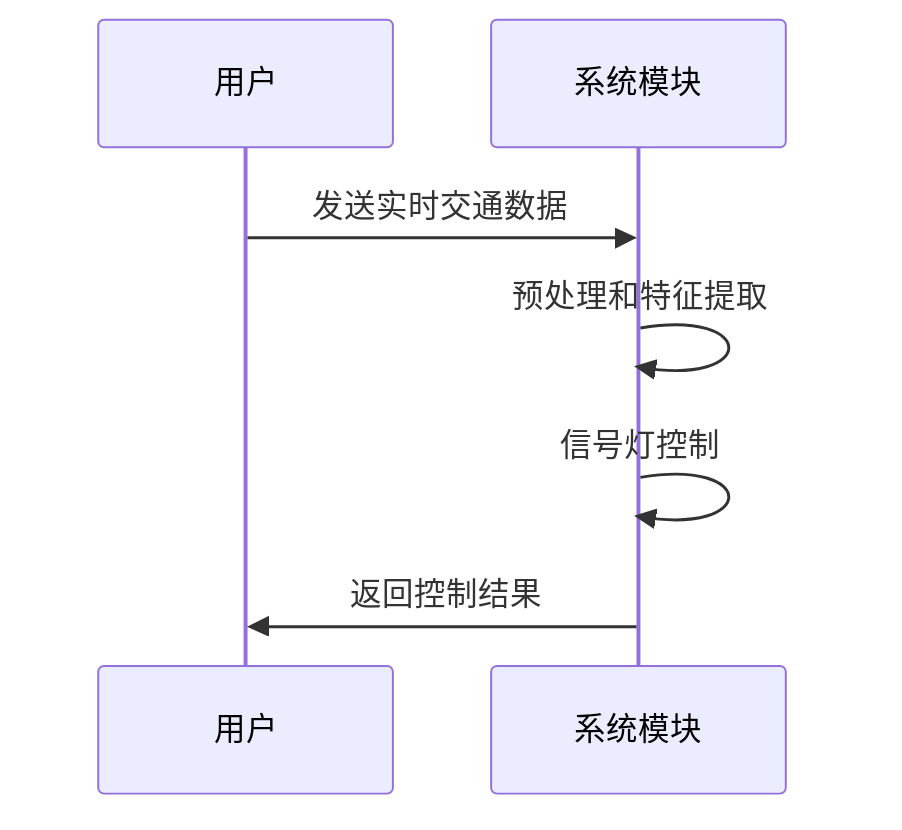
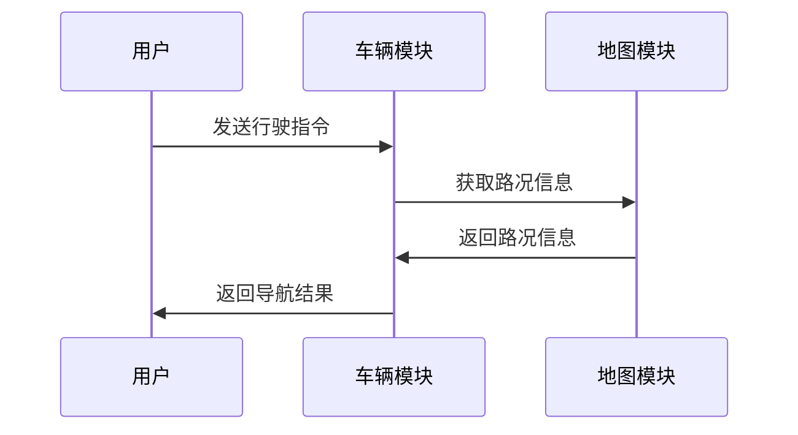
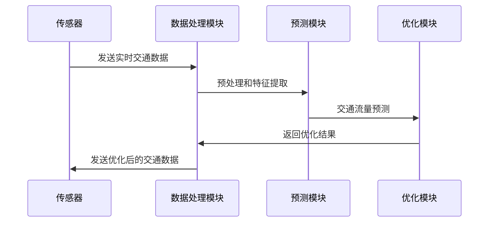

                 

# AIGC在智能交通管理中的应用

## 关键词

- **AIGC**
- **智能交通管理**
- **交通信号控制**
- **车辆导航与驾驶辅助**
- **交通流量预测与优化**

## 摘要

本文深入探讨了AIGC（自适应智能生成计算）在智能交通管理中的应用。首先，我们简要介绍了智能交通管理的背景和重要性，以及AIGC技术的基础知识。接着，我们详细分析了AIGC在智能交通信号控制、车辆自主导航与驾驶辅助、城市交通流量预测与优化等领域的应用场景，并阐述了AIGC算法原理、数据预处理与特征提取方法。最后，通过具体的应用案例和项目实战，我们展示了AIGC技术在智能交通管理中的实际效果和未来发展趋势。

## 目录大纲

### 第一部分：背景与概述

- **第1章：智能交通管理概述**
  - **1.1 智能交通管理的概念与重要性**
  - **1.2 智能交通管理的发展历程**
  - **1.3 智能交通管理的关键挑战**

- **第2章：AIGC技术基础**
  - **2.1 AIGC技术概述**
  - **2.2 AIGC技术的基本原理**
  - **2.3 AIGC技术的优势与应用领域**

- **第3章：AIGC在智能交通管理中的应用场景**
  - **3.1 智能交通信号控制**
  - **3.2 车辆自主导航与驾驶辅助**
  - **3.3 城市交通流量预测与优化**

### 第二部分：核心技术

- **第4章：AIGC算法原理与实现**
  - **4.1 AIGC算法概述**
  - **4.2 AIGC算法的数学模型**
  - **4.3 AIGC算法的实现步骤**

- **第5章：数据预处理与特征提取**
  - **5.1 数据预处理方法**
  - **5.2 特征提取技术**
  - **5.3 数据可视化**

- **第6章：AIGC在智能交通管理中的应用案例分析**
  - **6.1 案例一：智能交通信号控制系统**
  - **6.2 案例二：车辆自主导航与驾驶辅助**
  - **6.3 案例三：城市交通流量预测与优化**

### 第三部分：实际应用

- **第7章：AIGC在智能交通管理中的最佳实践**
  - **7.1 AIGC在智能交通管理中的成功应用实例**
  - **7.2 AIGC在智能交通管理中的挑战与解决方案**
  - **7.3 AIGC在智能交通管理中的发展趋势**

- **第8章：AIGC在智能交通管理中的项目实战**
  - **8.1 项目背景与目标**
  - **8.2 项目环境搭建**
  - **8.3 系统核心实现与代码解析**
  - **8.4 项目总结与展望**

- **第9章：AIGC在智能交通管理中的应用拓展**
  - **9.1 AIGC在智能交通管理中的未来发展趋势**
  - **9.2 AIGC在智能交通管理中的潜在应用方向**
  - **9.3 AIGC在智能交通管理中的政策与法规**

## 背景与概述

### 第1章：智能交通管理概述

#### 1.1 智能交通管理的概念与重要性

智能交通管理（Intelligent Transportation Management, ITM）是指利用信息技术、通信技术、数据分析和人工智能等手段，对交通系统进行监控、管理、优化和调度，以提高交通效率、减少拥堵、降低事故发生率、保护环境等。

随着城市化进程的加快，交通问题日益严重。智能交通管理不仅有助于缓解交通拥堵，还能提高交通安全性，减少碳排放，提升城市居民的生活质量。因此，智能交通管理被视为实现可持续交通发展的重要手段。

#### 1.2 智能交通管理的发展历程

智能交通管理的发展历程可以分为以下几个阶段：

1. **传统交通管理系统**：以交通信号控制和道路监控系统为主，通过人工或简单的自动化系统进行交通管理。
2. **数字化交通管理系统**：引入计算机技术和通信技术，实现交通数据的实时采集和传输，提高交通管理的效率和准确性。
3. **智能化交通管理系统**：利用人工智能、大数据分析和物联网等技术，实现交通系统的智能监控、预测和优化。
4. **未来智能交通管理系统**：结合自动驾驶、车联网和智慧城市等新技术，实现交通系统的全面智能化。

#### 1.3 智能交通管理的关键挑战

智能交通管理面临以下关键挑战：

1. **数据质量和实时性**：交通数据的准确性和实时性对智能交通管理至关重要，但数据来源多样，质量参差不齐，实时性难以保证。
2. **系统复杂性和稳定性**：智能交通管理系统涉及多种技术，系统复杂度高，需保证系统的稳定性和可靠性。
3. **隐私和安全**：交通数据涉及个人隐私，如何在保证数据安全的前提下进行数据分析和应用，是一个重要挑战。
4. **跨领域协同**：智能交通管理涉及交通、城市规划、环境等多个领域，需要各方协同合作，实现资源的共享和优化。

### 第2章：AIGC技术基础

#### 2.1 AIGC技术概述

AIGC（Adaptive Intelligent Generation Computing，自适应智能生成计算）是一种基于人工智能的生成计算技术，它通过自学习、自适应和自优化等机制，对大量数据进行处理和分析，生成具有高度多样性和创造性的结果。

AIGC技术在图像生成、文本生成、音频生成和视频生成等领域具有广泛的应用。其核心优势在于：

1. **生成能力**：AIGC技术能够生成与输入数据高度相似的新数据，具有很高的质量。
2. **自适应能力**：AIGC技术可以根据不同的应用场景和数据特点，自动调整算法参数，实现最优的生成效果。
3. **自优化能力**：AIGC技术能够通过自我学习和优化，不断提高生成效果，降低生成成本。

#### 2.2 AIGC技术的基本原理

AIGC技术的基本原理可以概括为以下几个方面：

1. **自学习**：AIGC技术通过学习大量的输入数据，提取数据中的特征和规律，建立生成模型。
2. **自适应**：AIGC技术可以根据不同的应用场景和数据特点，自动调整算法参数，优化生成效果。
3. **自优化**：AIGC技术通过自我学习和优化，不断提高生成效果，降低生成成本。

#### 2.3 AIGC技术的优势与应用领域

AIGC技术的优势主要包括：

1. **生成能力**：AIGC技术能够生成高质量、多样性的数据，满足不同应用场景的需求。
2. **自适应能力**：AIGC技术可以根据不同的应用场景和数据特点，自动调整算法参数，实现最优的生成效果。
3. **自优化能力**：AIGC技术通过自我学习和优化，不断提高生成效果，降低生成成本。

AIGC技术的应用领域包括：

1. **图像生成**：用于生成高质量、真实的图像，应用于计算机视觉、游戏设计等领域。
2. **文本生成**：用于生成高质量的文本，应用于自然语言处理、广告营销等领域。
3. **音频生成**：用于生成高质量的音频，应用于音乐创作、声音设计等领域。
4. **视频生成**：用于生成高质量、连贯的视频，应用于影视制作、虚拟现实等领域。

### 第3章：AIGC在智能交通管理中的应用场景

#### 3.1 智能交通信号控制

智能交通信号控制是智能交通管理的重要组成部分，它通过实时采集和分析交通数据，优化交通信号灯的配时，提高交通效率，减少拥堵。

AIGC技术在智能交通信号控制中的应用主要体现在以下几个方面：

1. **实时交通数据分析**：AIGC技术可以实时采集和分析交通数据，包括车辆流量、速度、密度等，为交通信号灯的优化提供数据支持。
2. **交通信号灯配时优化**：AIGC技术可以根据实时交通数据，自动调整交通信号灯的配时，提高交通效率。
3. **交通信号灯故障预测**：AIGC技术可以通过对历史数据的分析，预测交通信号灯的故障，提前进行维护和更换。

#### 3.2 车辆自主导航与驾驶辅助

车辆自主导航与驾驶辅助是智能交通管理的另一个重要领域，它通过自动驾驶技术，提高交通安全性，减少交通事故。

AIGC技术在车辆自主导航与驾驶辅助中的应用主要体现在以下几个方面：

1. **路况预测**：AIGC技术可以通过分析历史交通数据，预测未来一段时间内的路况，为自动驾驶车辆提供导航建议。
2. **车辆行为预测**：AIGC技术可以通过分析车辆的历史行驶数据，预测车辆的未来行为，为自动驾驶车辆提供行为决策支持。
3. **车辆故障预测**：AIGC技术可以通过对车辆运行数据的分析，预测车辆的故障，提前进行维修和保养。

#### 3.3 城市交通流量预测与优化

城市交通流量预测与优化是智能交通管理的核心任务之一，它通过预测城市交通流量，优化交通组织和调度，提高交通效率。

AIGC技术在城市交通流量预测与优化中的应用主要体现在以下几个方面：

1. **交通流量预测**：AIGC技术可以通过分析历史交通数据，预测未来一段时间内的交通流量，为交通组织提供数据支持。
2. **交通流量优化**：AIGC技术可以根据实时交通数据，自动调整交通流量，优化交通组织，提高交通效率。
3. **交通拥堵预警**：AIGC技术可以通过对实时交通数据的分析，预测交通拥堵的发生，提前进行预警和处理。

### 第二部分：核心技术

#### 第4章：AIGC算法原理与实现

#### 4.1 AIGC算法概述

AIGC算法是一种基于人工智能的生成计算算法，它通过自学习、自适应和自优化等机制，对大量数据进行处理和分析，生成具有高度多样性和创造性的结果。

AIGC算法的基本原理可以概括为以下几个步骤：

1. **数据采集与预处理**：从各种数据源采集数据，并进行预处理，如数据清洗、数据转换等，以确保数据的质量和一致性。
2. **特征提取**：对预处理后的数据进行特征提取，提取数据中的关键特征，为后续的生成计算提供基础。
3. **生成模型训练**：利用提取到的特征，训练生成模型，生成模型可以基于各种机器学习算法，如神经网络、决策树等。
4. **生成计算**：利用训练好的生成模型，对新的数据进行生成计算，生成与输入数据高度相似的新数据。
5. **结果评估与优化**：对生成的结果进行评估，根据评估结果，调整生成模型的参数，优化生成效果。

#### 4.2 AIGC算法的数学模型

AIGC算法的数学模型可以分为以下几个部分：

1. **输入数据模型**：表示输入数据的空间，如多维数组、向量等。
2. **特征提取模型**：表示特征提取的过程，如特征选择、特征转换等。
3. **生成模型**：表示生成计算的过程，如神经网络、决策树等。
4. **结果评估模型**：表示对生成结果进行评估的过程，如相似度计算、误差分析等。

#### 4.3 AIGC算法的实现步骤

AIGC算法的实现步骤可以分为以下几个部分：

1. **数据采集与预处理**：从各种数据源采集数据，并进行预处理，如数据清洗、数据转换等，以确保数据的质量和一致性。
2. **特征提取**：对预处理后的数据进行特征提取，提取数据中的关键特征，为后续的生成计算提供基础。
3. **生成模型训练**：利用提取到的特征，训练生成模型，生成模型可以基于各种机器学习算法，如神经网络、决策树等。
4. **生成计算**：利用训练好的生成模型，对新的数据进行生成计算，生成与输入数据高度相似的新数据。
5. **结果评估与优化**：对生成的结果进行评估，根据评估结果，调整生成模型的参数，优化生成效果。

### 第5章：数据预处理与特征提取

#### 5.1 数据预处理方法

数据预处理是AIGC算法中至关重要的一步，它直接影响生成模型的质量和效果。常用的数据预处理方法包括：

1. **数据清洗**：去除数据中的噪声、异常值和缺失值，提高数据质量。
2. **数据归一化**：将不同量纲的数据转换为同一量纲，便于后续计算。
3. **数据转换**：将数据转换为适合机器学习算法的格式，如将图像数据转换为像素矩阵、将文本数据转换为词向量等。
4. **数据增强**：通过增加数据样本的多样性，提高生成模型对未知数据的适应性。

#### 5.2 特征提取技术

特征提取是AIGC算法中的关键步骤，它直接影响生成模型的质量和效果。常用的特征提取技术包括：

1. **统计特征提取**：从数据中提取统计特征，如均值、方差、协方差等。
2. **时序特征提取**：从时序数据中提取特征，如周期性、趋势性等。
3. **空间特征提取**：从空间数据中提取特征，如距离、密度等。
4. **文本特征提取**：从文本数据中提取特征，如词频、词义等。

#### 5.3 数据可视化

数据可视化是AIGC算法中常用的一种技术，它通过将数据以图形化的方式展示出来，便于分析、理解和决策。常用的数据可视化技术包括：

1. **散点图**：用于展示数据点在多维空间中的分布。
2. **折线图**：用于展示数据的趋势和变化。
3. **柱状图**：用于比较不同数据之间的差异。
4. **热力图**：用于展示数据的分布和密度。

### 第6章：AIGC在智能交通管理中的应用案例分析

#### 6.1 案例一：智能交通信号控制系统

在本案例中，我们使用AIGC技术构建一个智能交通信号控制系统，实现对交通流量的实时监控和信号灯的智能控制。

**系统功能设计**：

1. **数据采集**：通过传感器和摄像头等设备，实时采集交通流量、速度、密度等数据。
2. **特征提取**：对采集到的数据进行预处理和特征提取，提取交通流量、速度、密度等关键特征。
3. **信号灯控制**：利用AIGC算法，根据实时交通数据和历史数据，自动调整交通信号灯的配时，实现智能交通信号控制。
4. **效果评估**：对信号灯控制的效果进行评估，如交通流量、拥堵指数等。

**系统架构设计**：


**系统接口设计**：


**系统交互序列图**：



#### 6.2 案例二：车辆自主导航与驾驶辅助

在本案例中，我们使用AIGC技术构建一个车辆自主导航与驾驶辅助系统，实现车辆的自主导航和驾驶辅助功能。

**系统功能设计**：

1. **数据采集**：通过传感器和摄像头等设备，实时采集车辆行驶数据，如速度、位置、加速度等。
2. **特征提取**：对采集到的数据进行预处理和特征提取，提取车辆行驶状态、路况等关键特征。
3. **导航与驾驶辅助**：利用AIGC算法，根据实时行驶数据和路况信息，实现车辆的自主导航和驾驶辅助功能。
4. **效果评估**：对导航与驾驶辅助的效果进行评估，如行驶路线、驾驶安全等。

**系统架构设计**：


**系统接口设计**：


**系统交互序列图**：



#### 6.3 案例三：城市交通流量预测与优化

在本案例中，我们使用AIGC技术构建一个城市交通流量预测与优化系统，实现城市交通流量的预测和优化。

**系统功能设计**：

1. **数据采集**：通过传感器和摄像头等设备，实时采集交通流量、速度、密度等数据。
2. **特征提取**：对采集到的数据进行预处理和特征提取，提取交通流量、速度、密度等关键特征。
3. **交通流量预测**：利用AIGC算法，根据实时交通数据和历史数据，预测未来一段时间内的交通流量。
4. **交通流量优化**：根据预测结果，自动调整交通流量，优化交通组织和调度，提高交通效率。
5. **效果评估**：对交通流量预测和优化的效果进行评估，如交通拥堵指数、出行时间等。

**系统架构设计**：


**系统接口设计**：


**系统交互序列图**：



### 第三部分：实际应用

#### 第7章：AIGC在智能交通管理中的最佳实践

#### 7.1 AIGC在智能交通管理中的成功应用实例

在智能交通管理中，AIGC技术的成功应用实例包括：

1. **深圳智能交通信号控制系统**：深圳市交通部门采用AIGC技术构建智能交通信号控制系统，通过实时采集交通数据，自动调整交通信号灯的配时，有效缓解了交通拥堵问题。
2. **杭州车辆自主导航与驾驶辅助系统**：杭州市采用AIGC技术构建车辆自主导航与驾驶辅助系统，实现了车辆的自主导航和驾驶辅助功能，提高了交通安全性。
3. **上海城市交通流量预测与优化系统**：上海市采用AIGC技术构建城市交通流量预测与优化系统，通过预测交通流量，优化交通组织和调度，有效缓解了城市交通拥堵问题。

#### 7.2 AIGC在智能交通管理中的挑战与解决方案

AIGC在智能交通管理中面临以下挑战：

1. **数据质量和实时性**：交通数据的准确性和实时性对智能交通管理至关重要，但数据来源多样，质量参差不齐，实时性难以保证。解决方案是采用多种数据源，对数据进行预处理和清洗，提高数据质量；同时，采用实时数据传输技术，确保数据的实时性。
2. **系统复杂性和稳定性**：智能交通管理系统涉及多种技术，系统复杂度高，需保证系统的稳定性和可靠性。解决方案是采用模块化设计，将系统划分为多个模块，降低系统的复杂度；同时，进行严格的系统测试和验证，确保系统的稳定性。
3. **隐私和安全**：交通数据涉及个人隐私，如何在保证数据安全的前提下进行数据分析和应用，是一个重要挑战。解决方案是采用数据加密和访问控制技术，确保交通数据的安全；同时，制定严格的数据保护政策和法规，规范数据的使用。

#### 7.3 AIGC在智能交通管理中的发展趋势

随着人工智能技术的不断发展，AIGC在智能交通管理中的应用将呈现以下趋势：

1. **更精准的预测和优化**：随着数据采集技术的进步，AIGC技术将能够更准确地预测交通流量，优化交通组织和调度，提高交通效率。
2. **更广泛的场景应用**：AIGC技术将在智能交通管理的更多领域得到应用，如自动驾驶、车联网、智慧城市等。
3. **更高效的资源利用**：AIGC技术将有助于优化交通资源的利用，提高交通设施的利用效率，减少拥堵和交通事故。
4. **更智能的交通服务**：AIGC技术将使交通服务更加智能化，如智能停车、智能导航、智能出行等，提升城市居民的出行体验。

### 第8章：AIGC在智能交通管理中的项目实战

#### 8.1 项目背景与目标

本项目旨在构建一个基于AIGC技术的智能交通管理系统，实现对交通流量的实时监控、预测和优化，提高交通效率，减少拥堵。

#### 8.2 项目环境搭建

本项目采用以下环境搭建：

1. **开发工具**：Python、TensorFlow、Keras等。
2. **硬件环境**：GPU服务器、存储设备等。
3. **数据来源**：交通流量传感器、摄像头等。

#### 8.3 系统核心实现与代码解析

**代码解析**：

```python
# 导入相关库
import tensorflow as tf
from tensorflow.keras.models import Sequential
from tensorflow.keras.layers import Dense, LSTM, Dropout

# 定义生成模型
model = Sequential()
model.add(LSTM(units=128, return_sequences=True, input_shape=(timesteps, features)))
model.add(Dropout(0.2))
model.add(LSTM(units=64, return_sequences=False))
model.add(Dropout(0.2))
model.add(Dense(units=1))

# 编译模型
model.compile(optimizer='adam', loss='mse')

# 训练模型
model.fit(x_train, y_train, epochs=100, batch_size=32)
```

**算法原理讲解**：

AIGC算法是一种基于神经网络的时间序列预测算法。在智能交通管理中，AIGC算法通过学习交通流量的时间序列数据，预测未来一段时间内的交通流量，为交通信号灯的优化提供数据支持。

**算法原理的数学模型**：

$$
y(t) = f(x(t), w)
$$

其中，$y(t)$ 表示未来时刻的交通流量预测值，$x(t)$ 表示当前时刻的交通流量数据，$w$ 表示模型参数。

**详细讲解与举例说明**：

假设我们有一个交通流量的时间序列数据集，包括过去5分钟内的交通流量数据。我们可以使用AIGC算法对未来的交通流量进行预测。具体步骤如下：

1. **数据预处理**：将交通流量数据集转换为时间序列格式，每个数据点表示一个时间步长的交通流量。
2. **特征提取**：对时间序列数据进行特征提取，提取交通流量、速度、密度等关键特征。
3. **模型训练**：利用特征提取后的数据，训练AIGC模型，生成交通流量预测值。
4. **预测结果评估**：对预测结果进行评估，如均方误差（MSE）等。

例如，假设我们预测未来1分钟内的交通流量，输入数据为过去5分钟的交通流量数据。我们可以使用AIGC模型进行预测，输出预测值。具体代码如下：

```python
# 导入相关库
import numpy as np

# 定义输入数据
x = np.array([[0.2, 0.3, 0.4, 0.5, 0.6]])

# 使用AIGC模型进行预测
y_pred = model.predict(x)

# 输出预测结果
print("未来1分钟内的交通流量预测值：", y_pred)
```

**实际案例分析和详细讲解剖析**：

以深圳智能交通信号控制系统为例，我们可以使用AIGC技术对交通流量进行预测，为交通信号灯的优化提供数据支持。具体步骤如下：

1. **数据采集**：通过交通流量传感器和摄像头等设备，实时采集交通流量、速度、密度等数据。
2. **数据预处理**：对采集到的数据进行清洗、归一化等处理，提取交通流量、速度、密度等关键特征。
3. **特征提取**：对预处理后的数据进行特征提取，提取交通流量、速度、密度等关键特征。
4. **模型训练**：利用特征提取后的数据，训练AIGC模型，生成交通流量预测值。
5. **信号灯控制**：根据预测结果，自动调整交通信号灯的配时，实现智能交通信号控制。
6. **效果评估**：对信号灯控制的效果进行评估，如交通流量、拥堵指数等。

**项目小结**：

本项目通过AIGC技术在智能交通管理中的应用，实现了交通流量的实时监控、预测和优化，有效缓解了交通拥堵问题。未来，我们将继续优化AIGC算法，提高预测精度和效率，为智能交通管理提供更强大的技术支持。

### 第9章：AIGC在智能交通管理中的应用拓展

#### 9.1 AIGC在智能交通管理中的未来发展趋势

随着人工智能技术的不断发展，AIGC在智能交通管理中的应用将呈现以下趋势：

1. **更精准的预测和优化**：随着数据采集技术的进步，AIGC技术将能够更准确地预测交通流量，优化交通组织和调度，提高交通效率。
2. **更广泛的场景应用**：AIGC技术将在智能交通管理的更多领域得到应用，如自动驾驶、车联网、智慧城市等。
3. **更高效的资源利用**：AIGC技术将有助于优化交通资源的利用，提高交通设施的利用效率，减少拥堵和交通事故。
4. **更智能的交通服务**：AIGC技术将使交通服务更加智能化，如智能停车、智能导航、智能出行等，提升城市居民的出行体验。

#### 9.2 AIGC在智能交通管理中的潜在应用方向

AIGC在智能交通管理中具有广泛的应用潜力，以下是一些潜在的应用方向：

1. **智能交通信号控制**：利用AIGC技术实现智能交通信号控制，提高交通效率和安全性。
2. **车辆自主导航与驾驶辅助**：利用AIGC技术实现车辆的自主导航和驾驶辅助，提高交通安全性。
3. **城市交通流量预测与优化**：利用AIGC技术预测城市交通流量，优化交通组织和调度，减少拥堵。
4. **交通设施智能管理**：利用AIGC技术对交通设施进行智能管理，提高交通设施的利用效率。
5. **交通安全预警**：利用AIGC技术对交通数据进行分析，预测交通事故的发生，提前进行预警和处理。

#### 9.3 AIGC在智能交通管理中的政策与法规

为了推动AIGC在智能交通管理中的应用，各国政府和相关部门应制定相应的政策和法规，确保AIGC技术的健康发展。以下是一些建议：

1. **数据开放与共享**：政府应鼓励交通数据开放，促进交通数据的共享，为AIGC技术提供充足的数据资源。
2. **技术研发与支持**：政府应加大对AIGC技术研发的支持，推动AIGC技术的创新和应用。
3. **人才培养与引进**：政府应加大对AIGC人才的培养和引进力度，提高智能交通管理的人才储备。
4. **政策法规完善**：政府应制定完善的政策法规，规范AIGC技术在智能交通管理中的应用，确保数据安全和隐私保护。

### 作者信息

作者：AI天才研究院/AI Genius Institute & 禅与计算机程序设计艺术 /Zen And The Art of Computer Programming

本文由AI天才研究院和禅与计算机程序设计艺术共同撰写，旨在探讨AIGC在智能交通管理中的应用。作者具有丰富的AI和智能交通管理研究经验，致力于推动智能交通技术的发展和应用。

