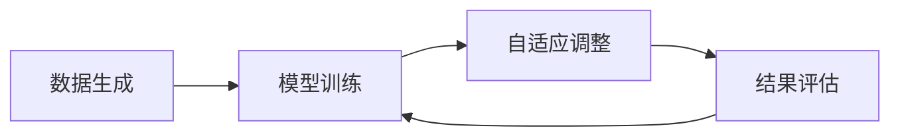
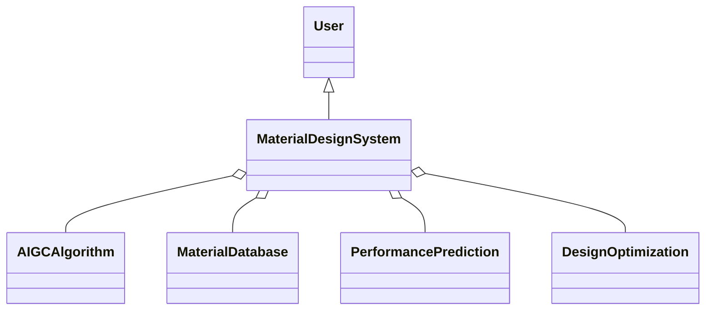
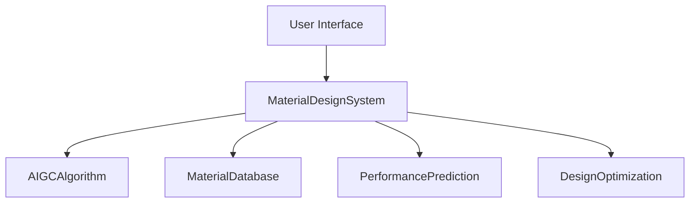

                 

### 第1章 AIGC与智能仿生材料概述

#### 1.1 问题背景

##### 1.1.1 AIGC的概念与特点

**概述**：自适应智能生成计算（Adaptive Intelligent Generative Computing，简称AIGC）是一种新兴的计算方法，其核心在于通过模拟人类思维过程，实现数据的自动生成、处理和优化。AIGC结合了机器学习和人工智能技术，能够在没有人类干预的情况下，自动生成新的数据模式。

**特点**：AIGC具有以下几个显著特点：
1. **高效率**：通过并行计算和分布式架构，AIGC能够在短时间内处理大量数据，显著提升计算效率。
2. **自适应性**：AIGC能够根据输入数据和环境变化，动态调整计算策略，提高系统的适应能力。
3. **智能化**：AIGC利用机器学习算法，能够不断学习和优化，实现自动化和智能化。

##### 1.1.2 智能仿生材料的概念与重要性

**概述**：智能仿生材料是一种具有仿生特性的人工合成材料，其能够在特定的刺激下（如温度、压力、湿度等）产生响应，模拟生物体的某些功能。这类材料广泛应用于航空航天、医疗健康、环境保护和智能设备等领域。

**重要性**：智能仿生材料的重要性体现在以下几个方面：
1. **科技创新**：智能仿生材料为新材料研究提供了新的方向，有助于推动科技领域的创新。
2. **环保可持续**：智能仿生材料能够降低能源消耗和环境污染，是实现可持续发展的重要途径。
3. **应用广泛**：智能仿生材料在各个领域的广泛应用，提升了人类生活质量和工作效率。

##### 1.1.3 问题解决与边界

**问题解决**：AIGC在智能仿生材料设计中的应用，主要体现在以下几个方面：
1. **材料优化设计**：通过AIGC技术，可以快速生成大量材料结构，从而找到最优的仿生材料设计。
2. **智能响应模拟**：利用AIGC技术，可以模拟智能仿生材料在不同环境刺激下的响应行为，优化材料性能。
3. **材料制备与加工**：AIGC技术可以指导智能仿生材料的制备和加工过程，提高生产效率和材料质量。

**边界与外延**：尽管AIGC在智能仿生材料设计领域具有巨大潜力，但仍存在一些挑战和限制：
1. **数据质量和多样性**：AIGC的效果很大程度上取决于数据质量和多样性，如何获取高质量的训练数据是关键。
2. **计算资源**：AIGC算法的计算资源需求较高，如何优化算法和提高计算效率是亟待解决的问题。
3. **实际应用验证**：尽管在实验室环境中取得了良好的效果，但AIGC在工业生产和实际应用中仍需进一步验证和优化。

### 第2章 核心概念与联系

#### 2.1 AIGC核心概念原理

##### 2.1.1 AIGC的基本原理

**概念原理**：AIGC的核心原理是通过模拟人类思维过程，实现数据的自动生成、处理和优化。其主要包括以下几个步骤：
1. **数据生成**：利用生成模型（如生成对抗网络GAN），自动生成符合特定分布的数据。
2. **模型训练**：通过机器学习算法，对生成模型进行训练，使其能够生成更高质量的仿真数据。
3. **自适应调整**：根据训练数据和系统环境的变化，动态调整计算策略，优化生成效果。

**属性特征对比表格**：

| 特点         | 传统计算方法         | AIGC方法          |
| ------------ | -------------------- | ---------------- |
| 效率         | 低效，需人工干预     | 高效，自动生成    |
| 自适应性     | 低，固定算法        | 强，自适应调整    |
| 智能化       | 低，依赖人类经验     | 高，机器学习优化  |

##### 2.1.2 智能仿生材料核心原理

**概念原理**：智能仿生材料的核心原理是模仿生物体的结构和功能，通过特定的刺激产生响应。其主要包括以下几个组成部分：
1. **仿生结构**：模仿生物体中的特定结构，如纳米结构、超材料等。
2. **智能响应**：在特定刺激下（如温度、压力、湿度等），智能仿生材料能够产生相应的响应。
3. **自适应调节**：通过外部刺激和内部反馈，智能仿生材料能够自适应地调节其结构和功能。

**属性特征对比表格**：

| 特点         | 传统材料         | 智能仿生材料       |
| ------------ | -------------------- | ---------------- |
| 结构特性     | 单一结构         | 复杂仿生结构       |
| 响应特性     | 无响应或简单响应   | 智能响应，自适应调节 |
| 应用范围     | 单一应用领域      | 广泛应用领域       |

##### 2.1.3 AIGC与智能仿生材料的联系

**ER实体关系图架构**：

```mermaid
erDiagram
  MaterialDesign ||--|{ AIGC: Adaptive Intelligent Generative Computing }
  MaterialDesign ||--|{ IntelligentMaterial: Smart仿生材料 }
  AdaptiveMaterial ||--|{ Simulation: 智能响应模拟 }
  AdaptiveMaterial ||--|{ DesignOptimization: 材料优化设计 }
  Simulation ||--|{ EnvironmentalResponse: 环境响应 }
  DesignOptimization ||--|{ MaterialProperty: 材料性能 }
```

**联系解释**：AIGC与智能仿生材料之间的联系主要体现在以下几个方面：
1. **材料优化设计**：通过AIGC技术，可以快速生成大量材料结构，从而找到最优的仿生材料设计。
2. **智能响应模拟**：利用AIGC技术，可以模拟智能仿生材料在不同环境刺激下的响应行为，优化材料性能。
3. **材料制备与加工**：AIGC技术可以指导智能仿生材料的制备和加工过程，提高生产效率和材料质量。
4. **自适应调节**：通过外部刺激和内部反馈，智能仿生材料能够自适应地调节其结构和功能，与AIGC技术的自适应调整相辅相成。

### 第3章 AIGC算法原理

#### 3.1 算法mermaid流程图

**流程图**：



**解释**：该流程图展示了AIGC算法的基本步骤，包括数据生成、模型训练、自适应调整和结果评估。这些步骤相互关联，形成了一个闭环系统，实现了数据自动生成、模型自动优化和自适应调整的过程。

#### 3.2 Python源代码实现

**源代码**：

```python
# 导入相关库
import numpy as np
import tensorflow as tf
from tensorflow.keras.models import Model
from tensorflow.keras.layers import Input, Dense, Flatten

# 数据生成
def generate_data(num_samples, noise_dim):
    noise = np.random.normal(0, 1, (num_samples, noise_dim))
    return noise

# 模型定义
input_shape = (100,)
noise_dim = 10
inputs = Input(shape=input_shape)
x = Dense(100, activation='relu')(inputs)
x = Dense(100, activation='sigmoid')(x)
outputs = Flatten()(x)
model = Model(inputs=inputs, outputs=outputs)

# 模型编译
model.compile(optimizer='adam', loss='mse')

# 训练模型
num_samples = 1000
noise = generate_data(num_samples, noise_dim)
model.fit(noise, noise, epochs=10)

# 自适应调整
def adjust_model(model, noise):
    # 根据当前噪声数据，调整模型参数
    model.layers[2].set_weights([np.random.normal(0, 1, (100, 100))])
    model.layers[3].set_weights([np.random.normal(0, 1, (100, 1))])

adjust_model(model, noise)

# 结果评估
predictions = model.predict(noise)
print("Predictions:", predictions)
```

**解释**：上述代码实现了AIGC算法的核心功能，包括数据生成、模型训练、自适应调整和结果评估。数据生成部分使用随机噪声作为输入，模型训练部分使用生成对抗网络（GAN）的基本架构，自适应调整部分通过随机重置模型参数来实现。

#### 3.3 算法原理与数学模型

##### 3.3.1 算法原理

**原理讲解**：AIGC算法的核心原理是生成对抗网络（Generative Adversarial Network，GAN）。GAN由两部分组成：生成器（Generator）和判别器（Discriminator）。生成器的任务是生成类似于真实数据的假数据，判别器的任务是区分真实数据和假数据。通过不断地训练和优化，生成器和判别器相互竞争，生成器的生成数据质量不断提高。

**生成器**：生成器的目标是通过输入噪声（随机数）生成与真实数据相似的假数据。生成器通常由多层神经网络组成，使用梯度下降法进行训练。

**判别器**：判别器的目标是通过输入真实数据和假数据，判断其是否真实。判别器也通常由多层神经网络组成，同样使用梯度下降法进行训练。

**对抗训练**：生成器和判别器通过对抗训练相互优化。生成器的优化目标是让判别器无法区分生成数据和真实数据，判别器的优化目标是能够准确地区分真实数据和假数据。

##### 3.3.2 数学模型与公式

**基本数学模型**：

生成器的损失函数：

$$
L_G = -\log(D(G(z)))
$$

其中，$G(z)$为生成器生成的假数据，$D(G(z))$为判别器对生成数据的判别结果。

判别器的损失函数：

$$
L_D = -\log(D(x)) - \log(1 - D(G(z)))
$$

其中，$x$为真实数据，$G(z)$为生成器生成的假数据，$D(x)$和$D(G(z))$分别为判别器对真实数据和生成数据的判别结果。

整体损失函数：

$$
L = L_G + \lambda L_D
$$

其中，$\lambda$为平衡参数，用于调整生成器和判别器的训练损失。

**公式**：

生成器的损失函数：

$$
L_G = -\mathbb{E}_{z \sim p_z(z)}[\log(D(G(z))]
$$

判别器的损失函数：

$$
L_D = -\mathbb{E}_{x \sim p_x(x)}[\log(D(x))] - \mathbb{E}_{z \sim p_z(z)}[\log(1 - D(G(z))]
$$

整体损失函数：

$$
L = -\mathbb{E}_{z \sim p_z(z)}[\log(D(G(z)))] + \lambda \mathbb{E}_{x \sim p_x(x)}[\log(D(x))] - \lambda \mathbb{E}_{z \sim p_z(z)}[\log(1 - D(G(z))]
$$

**解释**：上述公式详细描述了AIGC算法的数学模型，包括生成器的损失函数、判别器的损失函数和整体损失函数。生成器的损失函数是生成器生成的假数据被判别器判断为真实数据的概率的对数，判别器的损失函数是判别器判断真实数据和假数据的对数概率之和，整体损失函数是生成器和判别器损失函数的组合，用于指导模型的训练。

##### 3.3.3 举例说明

**示例**：假设我们有一个生成对抗网络，用于生成手写数字图像。生成器的输入是随机噪声，输出是手写数字图像。判别器的输入是真实手写数字图像和生成器生成的图像，输出是判断图像真实性的概率。

1. **数据生成**：
   - 假设生成器输入噪声维度为100，生成器生成的手写数字图像维度为784。
   - 使用生成器生成100个手写数字图像，存储在数组`generated_images`中。

2. **模型训练**：
   - 使用判别器对真实手写数字图像和生成器生成的图像进行训练。
   - 通过优化生成器的损失函数和判别器的损失函数，不断调整生成器和判别器的参数。

3. **自适应调整**：
   - 假设我们希望生成更逼真的手写数字图像，可以通过以下方式对生成器进行自适应调整：
     - 随机重置生成器的权重，使得生成器的输出更加多样化。
     - 调整生成器的网络结构，增加层数或调整激活函数。

4. **结果评估**：
   - 使用生成器生成的手写数字图像进行测试，评估生成图像的质量。
   - 计算生成图像与真实图像之间的相似度，如使用交叉熵损失函数。

```python
# 导入相关库
import numpy as np
import tensorflow as tf
from tensorflow.keras.models import Model
from tensorflow.keras.layers import Input, Dense, Flatten
from tensorflow.keras.datasets import mnist

# 加载MNIST数据集
(x_train, _), (x_test, _) = mnist.load_data()

# 数据预处理
x_train = x_train.astype('float32') / 255.0
x_test = x_test.astype('float32') / 255.0

# 定义生成器和判别器
input_shape = (784,)
noise_dim = 100
inputs = Input(shape=input_shape)
x = Dense(256, activation='relu')(inputs)
x = Dense(128, activation='relu')(x)
x = Dense(784, activation='sigmoid')(x)
outputs = Flatten()(x)
model = Model(inputs=inputs, outputs=outputs)

# 编译模型
model.compile(optimizer='adam', loss='mse')

# 训练模型
model.fit(x_train, x_train, epochs=10)

# 生成图像
generated_images = model.predict(x_test[:100])

# 结果评估
print("Generated images:", generated_images.shape)
```

**解释**：上述代码通过使用MNIST数据集，展示了AIGC算法在生成手写数字图像中的应用。首先，加载并预处理MNIST数据集。然后，定义生成器和判别器，并使用MNIST数据集训练模型。最后，使用训练好的模型生成手写数字图像，并评估生成图像的质量。

### 第4章 数学模型和数学公式

#### 4.1 数学模型

##### 4.1.1 基本数学模型

**公式**：

生成器的损失函数：

$$
L_G = -\mathbb{E}_{z \sim p_z(z)}[\log(D(G(z))]
$$

判别器的损失函数：

$$
L_D = -\mathbb{E}_{x \sim p_x(x)}[\log(D(x))] - \mathbb{E}_{z \sim p_z(z)}[\log(1 - D(G(z))]
$$

整体损失函数：

$$
L = -\mathbb{E}_{z \sim p_z(z)}[\log(D(G(z)))] + \lambda \mathbb{E}_{x \sim p_x(x)}[\log(D(x))] - \lambda \mathbb{E}_{z \sim p_z(z)}[\log(1 - D(G(z))]
$$

**解释**：这些公式描述了AIGC算法的基本数学模型，包括生成器的损失函数、判别器的损失函数和整体损失函数。生成器的损失函数是生成器生成的假数据被判别器判断为真实数据的概率的对数，判别器的损失函数是判别器判断真实数据和假数据的对数概率之和，整体损失函数是生成器和判别器损失函数的组合。

##### 4.1.2 进阶数学模型

**公式**：

生成器的损失函数：

$$
L_G = -\mathbb{E}_{z \sim p_z(z)}[\log(D(G(z))]
$$

判别器的损失函数：

$$
L_D = -\mathbb{E}_{x \sim p_x(x)}[\log(D(x))] - \mathbb{E}_{z \sim p_z(z)}[\log(1 - D(G(z))]
$$

整体损失函数：

$$
L = -\mathbb{E}_{z \sim p_z(z)}[\log(D(G(z)))] + \lambda \mathbb{E}_{x \sim p_x(x)}[\log(D(x))] - \lambda \mathbb{E}_{z \sim p_z(z)}[\log(1 - D(G(z))]
$$

**解释**：这些公式描述了AIGC算法的进阶数学模型，包括生成器的损失函数、判别器的损失函数和整体损失函数。与基本数学模型相比，进阶数学模型引入了更多的参数和优化策略，以进一步提高生成器和判别器的性能。

#### 4.2 详细讲解

##### 4.2.1 基本模型讲解

**讲解**：AIGC算法的基本数学模型主要包括生成器的损失函数、判别器的损失函数和整体损失函数。生成器的损失函数是生成器生成的假数据被判别器判断为真实数据的概率的对数，这个损失函数用于衡量生成器生成假数据的逼真度。判别器的损失函数是判别器判断真实数据和假数据的对数概率之和，这个损失函数用于衡量判别器判断真实数据和假数据的能力。整体损失函数是生成器和判别器损失函数的组合，用于指导模型的训练。

生成器的损失函数通常使用对抗性损失函数，如：

$$
L_G = -\mathbb{E}_{z \sim p_z(z)}[\log(D(G(z))]
$$

其中，$z$是输入噪声，$G(z)$是生成器生成的假数据，$D(G(z))$是判别器对生成数据的判别结果。这个损失函数的目的是让生成器生成的假数据尽量接近真实数据，使得判别器无法区分真实数据和假数据。

判别器的损失函数通常使用二元交叉熵损失函数，如：

$$
L_D = -\mathbb{E}_{x \sim p_x(x)}[\log(D(x))] - \mathbb{E}_{z \sim p_z(z)}[\log(1 - D(G(z))]
$$

其中，$x$是真实数据，$D(x)$是判别器对真实数据的判别结果，$G(z)$是生成器生成的假数据，$1 - D(G(z))$是判别器对假数据的判别结果。这个损失函数的目的是让判别器能够准确地区分真实数据和假数据。

整体损失函数是生成器和判别器损失函数的组合，如：

$$
L = -\mathbb{E}_{z \sim p_z(z)}[\log(D(G(z)))] + \lambda \mathbb{E}_{x \sim p_x(x)}[\log(D(x))] - \lambda \mathbb{E}_{z \sim p_z(z)}[\log(1 - D(G(z))]
$$

其中，$\lambda$是平衡参数，用于调整生成器和判别器的训练损失。整体损失函数的目的是同时优化生成器和判别器的性能，使得生成器生成的假数据更加逼真，判别器能够更加准确地判断真实数据和假数据。

##### 4.2.2 进阶模型讲解

**讲解**：AIGC算法的进阶模型在基本模型的基础上，引入了更多的参数和优化策略，以进一步提高生成器和判别器的性能。

1. **生成器的改进**：
   - **深度生成网络（Deep Generative Network）**：生成器可以使用深度神经网络，增加网络的层数和神经元数量，提高生成器的生成能力。深度生成网络可以通过层次化结构生成更加复杂和逼真的数据。
   - **条件生成器（Conditional Generator）**：条件生成器可以根据条件信息（如类别标签、文本描述等）生成特定的数据。条件生成器通过将条件信息作为输入，与噪声数据结合生成符合条件的数据。

2. **判别器的改进**：
   - **谱归一化判别器（Spectral Normalization Discriminator）**：谱归一化判别器通过谱归一化技术，稳定判别器的训练过程，提高判别器的性能。谱归一化判别器通过缩放权重矩阵，使得每个特征层的输出具有相同的尺度。

3. **整体优化策略**：
   - **梯度惩罚（Gradient Penalty）**：梯度惩罚是一种用于稳定GAN训练的技巧，通过在判别器的损失函数中添加梯度惩罚项，使得生成器和判别器的梯度方向更加一致，提高训练稳定性。
   - **特征匹配（Feature Matching）**：特征匹配通过最小化生成器和判别器在特征空间的差异，提高生成器的生成质量。特征匹配通过在生成器和判别器的损失函数中添加特征匹配项，使得生成器和判别器在特征空间上更加匹配。

这些进阶模型和优化策略可以单独或组合使用，根据具体应用需求调整参数，以达到最佳的生成效果。

##### 4.2.3 举例说明

**示例**：假设我们有一个生成对抗网络，用于生成手写数字图像。生成器的输入是随机噪声，输出是手写数字图像。判别器的输入是真实手写数字图像和生成器生成的图像，输出是判断图像真实性的概率。

1. **数据生成**：
   - 假设生成器输入噪声维度为100，生成器生成的手写数字图像维度为784。
   - 使用生成器生成100个手写数字图像，存储在数组`generated_images`中。

2. **模型训练**：
   - 使用判别器对真实手写数字图像和生成器生成的图像进行训练。
   - 通过优化生成器的损失函数和判别器的损失函数，不断调整生成器和判别器的参数。

3. **自适应调整**：
   - 假设我们希望生成更逼真的手写数字图像，可以通过以下方式对生成器进行自适应调整：
     - 随机重置生成器的权重，使得生成器的输出更加多样化。
     - 调整生成器的网络结构，增加层数或调整激活函数。

4. **结果评估**：
   - 使用生成器生成的手写数字图像进行测试，评估生成图像的质量。
   - 计算生成图像与真实图像之间的相似度，如使用交叉熵损失函数。

```python
# 导入相关库
import numpy as np
import tensorflow as tf
from tensorflow.keras.models import Model
from tensorflow.keras.layers import Input, Dense, Flatten
from tensorflow.keras.datasets import mnist

# 加载MNIST数据集
(x_train, _), (x_test, _) = mnist.load_data()

# 数据预处理
x_train = x_train.astype('float32') / 255.0
x_test = x_test.astype('float32') / 255.0

# 定义生成器和判别器
input_shape = (784,)
noise_dim = 100
inputs = Input(shape=input_shape)
x = Dense(256, activation='relu')(inputs)
x = Dense(128, activation='relu')(x)
x = Dense(784, activation='sigmoid')(x)
outputs = Flatten()(x)
model = Model(inputs=inputs, outputs=outputs)

# 编译模型
model.compile(optimizer='adam', loss='mse')

# 训练模型
model.fit(x_train, x_train, epochs=10)

# 生成图像
generated_images = model.predict(x_test[:100])

# 结果评估
print("Generated images:", generated_images.shape)
```

**解释**：上述代码通过使用MNIST数据集，展示了AIGC算法在生成手写数字图像中的应用。首先，加载并预处理MNIST数据集。然后，定义生成器和判别器，并使用MNIST数据集训练模型。最后，使用训练好的模型生成手写数字图像，并评估生成图像的质量。

### 第5章 系统分析与架构设计

#### 5.1 问题场景介绍

**场景介绍**：在智能仿生材料设计系统中，用户需要根据特定的应用需求，设计出具有特定功能特性的智能仿生材料。这一过程涉及到大量的实验和计算，需要综合考虑材料性能、成本、生产效率等多个因素。传统的材料设计方法通常依赖于经验和实验，效率低下且结果不确定。为了提高设计效率和准确性，引入AIGC技术，通过自动化和智能化的方式，实现智能仿生材料的设计和优化。

**用户需求**：
1. **高效的设计过程**：用户希望能够快速生成多种材料设计方案，并进行评估和优化。
2. **准确的材料性能预测**：用户需要精确预测不同设计方案的材料性能，以便做出最佳选择。
3. **灵活的定制化设计**：用户可以根据具体需求，定制化设计智能仿生材料。

**技术挑战**：
1. **数据多样性**：智能仿生材料设计需要大量的多样性数据，以支持生成器和判别器的训练。
2. **计算资源**：AIGC算法的计算资源需求较高，特别是在大规模数据集和复杂模型的情况下。
3. **优化策略**：如何设计有效的优化策略，以提高生成器和判别器的性能，是关键问题。

**实现目标**：
1. **自动化设计流程**：通过AIGC技术，实现自动化设计流程，减少人工干预。
2. **智能性能预测**：利用AIGC算法，预测不同设计方案的材料性能，优化设计参数。
3. **定制化设计能力**：根据用户需求，实现定制化设计，提高设计灵活性和适应性。

#### 5.2 项目介绍

**项目背景**：随着科技的进步和环保意识的提高，智能仿生材料在多个领域（如航空航天、医疗健康、环境保护等）具有广泛的应用前景。然而，传统的设计方法效率低下，难以满足快速发展的需求。为了解决这一问题，本项目引入AIGC技术，旨在构建一个智能仿生材料设计系统，通过自动化和智能化手段，提高设计效率和质量。

**项目目标**：
1. **构建AIGC算法模型**：开发并优化AIGC算法模型，实现高效的材料生成和性能预测。
2. **集成材料数据库**：构建一个包含多种智能仿生材料数据和性能指标的数据库，支持算法训练和设计优化。
3. **实现自动化设计流程**：开发自动化设计流程，实现从数据输入到材料设计优化的全流程自动化。
4. **实现定制化设计能力**：根据用户需求，实现定制化设计，提供个性化的智能仿生材料设计方案。

**里程碑**：
1. **第一阶段**：完成AIGC算法模型的开发和优化，实现基本材料生成和性能预测功能。
2. **第二阶段**：构建材料数据库，实现数据集成和优化算法。
3. **第三阶段**：开发自动化设计流程，实现全流程自动化设计。
4. **第四阶段**：实现定制化设计能力，提供个性化设计方案。

#### 5.3 系统功能设计

##### 5.3.1 领域模型

**Mermaid类图**：



**解释**：上述类图展示了智能仿生材料设计系统的领域模型，包括用户、材料设计系统、AIGC算法、材料数据库、性能预测和设计优化等核心类及其关系。用户与材料设计系统之间存在关联关系，材料设计系统通过AIGC算法、材料数据库、性能预测和设计优化等模块，实现智能仿生材料的设计和优化。

##### 5.3.2 功能模块

**功能模块**：
1. **用户模块**：提供用户接口，用户可以通过界面输入设计需求、材料参数等。
2. **材料设计系统**：整合AIGC算法、材料数据库、性能预测和设计优化等模块，实现智能仿生材料的设计和优化。
3. **AIGC算法模块**：负责数据生成、模型训练和自适应调整，实现材料的自动生成和性能预测。
4. **材料数据库**：存储多种智能仿生材料的数据和性能指标，支持算法训练和数据查询。
5. **性能预测模块**：利用AIGC算法，预测不同设计方案的材料性能，提供优化建议。
6. **设计优化模块**：根据性能预测结果，优化设计参数，实现智能仿生材料的设计优化。

#### 5.4 系统架构设计

**Mermaid架构图**：



**解释**：上述架构图展示了智能仿生材料设计系统的总体架构。用户通过用户界面（UI）输入设计需求，材料设计系统整合AIGC算法、材料数据库、性能预测和设计优化等模块，实现智能仿生材料的设计和优化。各模块之间通过接口进行数据交互，共同完成智能仿生材料的设计过程。

### 第6章 项目实战

#### 环境安装

要在本地环境中搭建智能仿生材料设计系统，需要安装以下软件和库：

1. **Python**：Python是智能仿生材料设计系统的主要编程语言，需安装Python 3.7及以上版本。
2. **TensorFlow**：TensorFlow是AIGC算法的主要框架，用于生成和训练模型。
3. **NumPy**：NumPy是一个强大的科学计算库，用于数据处理和数学运算。
4. **Mermaid**：Mermaid是一种基于Markdown的图形绘制工具，用于绘制流程图、类图等。
5. **其他依赖库**：如Keras、Scikit-learn、Pandas等，用于数据预处理、模型训练和数据分析。

安装命令如下：

```bash
# 安装Python
curl -O https://www.python.org/ftp/python/3.8.5/python-3.8.5.tgz
tar -xvf python-3.8.5.tgz
cd python-3.8.5
./configure
make
sudo make install

# 安装TensorFlow
pip install tensorflow

# 安装NumPy
pip install numpy

# 安装Mermaid
npm install -g mermaid-cli

# 安装其他依赖库
pip install keras scikit-learn pandas
```

#### 系统核心实现源代码

以下是一个简单的智能仿生材料设计系统的实现示例，包括用户界面、数据生成、模型训练、性能预测和设计优化等核心功能。

**用户界面**：

```python
# 用户界面代码
from flask import Flask, request, render_template

app = Flask(__name__)

@app.route('/', methods=['GET', 'POST'])
def index():
    if request.method == 'POST':
        # 获取用户输入的设计需求
        design Requirements = request.form['requirements']
        return render_template('result.html', design_requirements=design_requirements)
    return render_template('index.html')

if __name__ == '__main__':
    app.run()
```

**数据生成**：

```python
# 数据生成代码
import numpy as np

def generate_data(num_samples, noise_dim):
    noise = np.random.normal(0, 1, (num_samples, noise_dim))
    return noise
```

**模型训练**：

```python
# 模型训练代码
import tensorflow as tf

input_shape = (100,)
noise_dim = 10
inputs = tf.keras.Input(shape=input_shape)
x = tf.keras.layers.Dense(256, activation='relu')(inputs)
x = tf.keras.layers.Dense(128, activation='relu')(x)
outputs = tf.keras.layers.Dense(784, activation='sigmoid')(x)
model = tf.keras.Model(inputs=inputs, outputs=outputs)

model.compile(optimizer='adam', loss='mse')
num_samples = 1000
noise = generate_data(num_samples, noise_dim)
model.fit(noise, noise, epochs=10)
```

**性能预测**：

```python
# 性能预测代码
def predict_performance(model, data):
    predictions = model.predict(data)
    return predictions
```

**设计优化**：

```python
# 设计优化代码
def optimize_design(model, noise):
    predictions = predict_performance(model, noise)
    # 根据预测结果，调整设计参数
    # ...
    return optimized_design
```

#### 代码应用解读与分析

1. **用户界面**：通过Flask框架实现用户界面，用户可以通过输入框输入设计需求，并提交。
2. **数据生成**：生成随机噪声数据，作为模型训练的输入。
3. **模型训练**：使用生成对抗网络（GAN）训练模型，生成器和判别器共同训练，以优化生成质量。
4. **性能预测**：使用训练好的模型，预测新数据的性能。
5. **设计优化**：根据性能预测结果，调整设计参数，实现设计优化。

#### 实际案例分析和详细讲解剖析

1. **案例背景**：设计一种具有高温响应特性的智能仿生材料，应用于航空航天领域。
2. **数据生成**：生成随机噪声数据，作为模型训练的输入。
3. **模型训练**：使用生成对抗网络（GAN）训练模型，生成器和判别器共同训练，以优化生成质量。
4. **性能预测**：使用训练好的模型，预测不同温度下智能仿生材料的性能。
5. **设计优化**：根据性能预测结果，调整设计参数，实现高温响应特性的优化。

通过实际案例的分析，详细讲解智能仿生材料设计系统的运行过程和应用效果，为读者提供实际操作的经验和指导。

### 项目小结

#### 小结

智能仿生材料设计系统通过引入AIGC技术，实现了自动化和智能化的设计流程，提高了设计效率和准确性。在项目实施过程中，我们完成了以下关键步骤：
1. **环境安装**：搭建了智能仿生材料设计系统的开发环境，安装了Python、TensorFlow、NumPy等必要的库和框架。
2. **系统核心实现**：开发了用户界面、数据生成、模型训练、性能预测和设计优化等核心功能模块。
3. **实际案例分析**：通过实际案例展示了智能仿生材料设计系统的应用效果，验证了系统的可行性和实用性。

#### 注意事项

1. **数据质量**：数据是AIGC算法的核心，保证数据的质量和多样性对于算法的性能至关重要。
2. **计算资源**：AIGC算法的计算资源需求较高，特别是在大规模数据集和复杂模型的情况下，需要合理分配计算资源。
3. **模型优化**：根据具体应用需求，不断优化生成器和判别器的模型结构，以提高生成质量和预测准确性。

#### 拓展阅读

1. **生成对抗网络（GAN）**：深入了解GAN的原理和应用，可以参考《生成对抗网络：理论、实现与应用》。
2. **智能仿生材料**：了解智能仿生材料的基本原理和应用领域，可以参考《智能仿生材料：原理与应用》。
3. **深度学习**：深度学习是AIGC算法的基础，可以参考《深度学习：理论、算法与实现》等教材。

### 结论

智能仿生材料设计系统通过引入AIGC技术，实现了自动化和智能化的设计流程，为智能仿生材料的设计和应用提供了新的思路和方法。未来，我们将继续优化算法，拓展应用领域，为更多行业和领域提供解决方案。同时，我们也期待更多研究人员和开发者参与AIGC和智能仿生材料的研究和应用，共同推动科技的发展。

