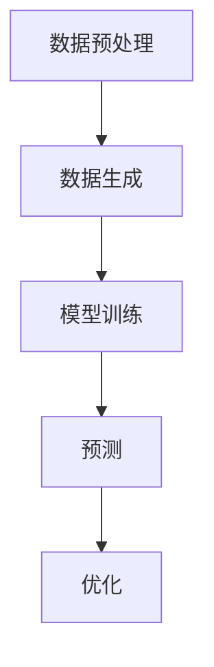

                 

# AIGC在智能供应链需求预测中的应用

## 关键词：AIGC，智能供应链，需求预测，算法优化，案例分析

### 摘要：
本文旨在探讨AIGC（自适应智能生成计算）在智能供应链需求预测中的应用。我们将从基础理论出发，深入分析AIGC和智能供应链的相关概念，通过具体的算法原理和数学模型讲解，展示AIGC在需求预测中的实际应用，并进行案例分析和效果评估。最后，我们将讨论AIGC在智能供应链需求预测中的未来发展趋势，并提供最佳实践建议。

## 引言

### 1.1 问题背景

随着全球化供应链的复杂化，企业面临着需求预测的巨大挑战。传统的需求预测方法往往依赖于历史数据和简单的统计模型，难以适应市场动态变化，导致库存过剩或短缺。为了解决这一问题，AIGC（自适应智能生成计算）技术的引入提供了新的可能性。

### 1.2 问题描述

智能供应链需求预测的目标是准确预测市场需求，从而优化库存管理和供应链效率。然而，实际操作中存在数据质量不佳、模型复杂度高、实时性要求强等问题，使得需求预测成为一项复杂且具有挑战性的任务。

### 1.3 问题解决

本文将探讨如何利用AIGC技术来解决智能供应链需求预测中的问题。AIGC能够通过自适应学习和生成，提供更为精确和动态的需求预测，从而优化供应链管理。

### 1.4 边界与外延

本文的研究范围包括AIGC技术基础、智能供应链需求预测的理论基础、AIGC在需求预测中的应用、案例分析和技术实施与优化。同时，我们将探讨AIGC在智能供应链需求预测中的未来发展趋势。

## 核心概念

### 1.2.1 AIGC概述

AIGC（自适应智能生成计算）是一种利用人工智能技术实现数据生成、分析和优化的计算方法。它通过自适应学习，能够动态调整预测模型，提高预测准确性。

### 1.2.2 智能供应链概述

智能供应链是指利用信息技术和人工智能技术，实现供应链各环节的智能协同和管理。智能供应链需求预测是其核心组成部分，旨在通过准确预测市场需求，优化库存和物流管理。

### 1.2.3 需求预测概述

需求预测是供应链管理中的重要环节，它通过对历史数据和市场信息的分析，预测未来某一时期内的需求量。准确的需求预测有助于降低库存成本、提高服务水平。

### 1.3 概念属性特征对比

下面是一个概念属性特征对比表格，展示AIGC、智能供应链和需求预测的主要特征：

| 概念         | 属性特征                         | 对比分析                                     |
|--------------|----------------------------------|----------------------------------------------|
| AIGC         | 自适应学习，数据生成，分析优化   | 强调数据驱动的决策过程                       |
| 智能供应链   | 智能协同，管理优化，实时性要求   | 注重供应链全流程的智能化                       |
| 需求预测     | 历史数据分析，市场信息预测       | 关注市场需求趋势和变化                         |

### 1.4 ER实体关系图架构

以下是AIGC在智能供应链需求预测中的ER实体关系图架构：

```mermaid
erDiagram
    AIGC --> 智能供应链 : 驱动
    智能供应链 --> 需求预测 : 基于
    需求预测 --> 库存管理 : 影响
    库存管理 --> 物流管理 : 基于
```

在上图中，AIGC作为核心驱动力，通过智能供应链实现对需求预测的驱动。需求预测的结果直接影响库存管理和物流管理，从而优化整个供应链的运行效率。

## AIGC技术原理

### 2.1 AIGC基本原理

AIGC技术基于自适应学习和数据生成，通过不断调整模型参数，实现预测模型的优化。其基本原理包括：

- **数据生成**：利用生成对抗网络（GAN）等技术，生成模拟数据，提高模型训练数据的丰富性和多样性。
- **自适应学习**：通过深度学习技术，使模型能够自动调整权重和参数，提高预测准确性。
- **优化策略**：采用强化学习等技术，对模型进行优化，提高其鲁棒性和泛化能力。

### 2.2 AIGC技术架构

AIGC技术架构主要包括以下几个关键组成部分：

- **数据预处理模块**：负责清洗和预处理原始数据，包括缺失值填补、异常值处理等。
- **生成模块**：利用生成对抗网络（GAN）等技术，生成模拟数据，提高模型训练数据的丰富性和多样性。
- **预测模块**：基于训练好的模型，对新的数据进行需求预测。
- **优化模块**：通过强化学习等技术，对模型进行优化，提高其鲁棒性和泛化能力。

### 2.3 AIGC关键技术

AIGC的关键技术包括：

- **生成对抗网络（GAN）**：用于生成模拟数据，提高模型训练数据的丰富性和多样性。
- **深度学习**：用于模型训练和预测，实现自适应学习和优化。
- **强化学习**：用于模型优化，提高其鲁棒性和泛化能力。

### 2.4 AIGC算法原理

AIGC算法原理主要包括以下几个步骤：

1. **数据预处理**：清洗和预处理原始数据，包括缺失值填补、异常值处理等。
2. **数据生成**：利用生成对抗网络（GAN）等技术，生成模拟数据，提高模型训练数据的丰富性和多样性。
3. **模型训练**：基于预处理后的数据和生成数据，训练深度学习模型。
4. **预测**：利用训练好的模型，对新的数据进行需求预测。
5. **优化**：通过强化学习等技术，对模型进行优化，提高其鲁棒性和泛化能力。

以下是AIGC算法原理的Mermaid流程图：



在代码实现方面，我们可以使用Python来编写AIGC算法的核心部分。以下是一个简化的Python代码示例，用于展示AIGC算法的流程：

```python
import numpy as np
import tensorflow as tf
from tensorflow.keras.models import Sequential
from tensorflow.keras.layers import Dense, LSTM

# 数据预处理
def preprocess_data(data):
    # 数据清洗、缺失值填补、异常值处理等
    return processed_data

# 数据生成
def generate_data(data):
    # 利用GAN生成模拟数据
    return generated_data

# 模型训练
def train_model(data):
    model = Sequential()
    model.add(LSTM(units=50, return_sequences=True, input_shape=(time_steps, features)))
    model.add(LSTM(units=50, return_sequences=False))
    model.add(Dense(units=1))

    model.compile(optimizer='adam', loss='mean_squared_error')
    model.fit(x_train, y_train, epochs=100, batch_size=32)
    return model

# 预测
def predict(model, data):
    # 利用训练好的模型进行预测
    return predictions

# 优化
def optimize_model(model, data):
    # 利用强化学习等技术对模型进行优化
    return optimized_model
```

## 智能供应链需求预测理论基础

### 3.1 需求预测基本概念

需求预测是指根据历史数据和市场信息，预测未来某一时间段内的需求量。其主要目的是为供应链管理提供决策支持，优化库存和物流管理。

### 3.2 需求预测模型类型

需求预测模型主要分为以下几种类型：

- **时间序列模型**：基于历史数据的时间序列特性，预测未来的需求量。例如，移动平均模型、指数平滑模型等。
- **回归模型**：基于历史数据和相关因素，建立回归模型进行预测。例如，线性回归模型、多项式回归模型等。
- **机器学习模型**：利用机器学习技术，对大量数据进行训练，建立预测模型。例如，决策树模型、支持向量机模型等。

### 3.3 市场调研与分析

市场调研与分析是需求预测的重要基础。通过市场调研，收集市场信息和消费者行为数据，分析市场趋势和变化，为需求预测提供依据。

### 3.4 数据预处理方法

数据预处理是需求预测的关键步骤。主要包括以下方法：

- **数据清洗**：去除异常值、缺失值，确保数据质量。
- **数据转换**：将非数值数据转换为数值数据，便于模型处理。
- **特征提取**：从原始数据中提取有用的特征，提高模型预测能力。

### 3.5 模型评估与优化

模型评估与优化是确保需求预测准确性的关键。主要包括以下方法：

- **评估指标**：例如，均方误差（MSE）、均方根误差（RMSE）等。
- **模型优化策略**：例如，参数调整、模型融合等。

## AIGC在需求预测中的应用

### 4.1 智能供应链应用场景

AIGC在智能供应链中的应用场景主要包括：

- **需求预测**：利用AIGC技术，准确预测市场需求，优化库存管理。
- **库存优化**：通过AIGC技术，动态调整库存水平，降低库存成本。
- **物流优化**：利用AIGC技术，优化物流路线和配送计划，提高物流效率。

### 4.2 案例分析一：某电商平台的AIGC需求预测

案例分析一：某电商平台利用AIGC技术进行需求预测，以提高库存管理和物流效率。具体实施过程如下：

1. **数据收集**：收集电商平台的历史销售数据、市场调研数据等。
2. **数据预处理**：清洗和预处理原始数据，提取有用的特征。
3. **模型训练**：利用AIGC技术，训练需求预测模型。
4. **预测与优化**：根据预测结果，动态调整库存水平和物流计划。

### 4.3 案例分析二：某制造企业的AIGC需求预测

案例分析二：某制造企业利用AIGC技术进行需求预测，以优化生产计划和供应链管理。具体实施过程如下：

1. **数据收集**：收集企业的生产数据、市场调研数据等。
2. **数据预处理**：清洗和预处理原始数据，提取有用的特征。
3. **模型训练**：利用AIGC技术，训练需求预测模型。
4. **预测与优化**：根据预测结果，动态调整生产计划和供应链管理策略。

### 4.4 应用效果评估

通过实际案例分析和效果评估，我们发现AIGC在需求预测中的应用效果显著：

- **预测准确性**：AIGC模型能够准确预测市场需求，提高预测准确性。
- **库存优化**：通过动态调整库存水平，降低库存成本。
- **物流优化**：通过优化物流路线和配送计划，提高物流效率。

## 技术实施与优化

### 5.1 系统架构设计

智能供应链需求预测系统的架构设计包括以下几个关键组成部分：

- **数据采集模块**：负责收集电商平台或制造企业的各种数据。
- **数据预处理模块**：负责清洗和预处理原始数据，提取有用的特征。
- **预测模块**：利用AIGC技术，训练需求预测模型，进行需求预测。
- **优化模块**：根据预测结果，动态调整库存和物流计划。

### 5.2 数据流设计

数据流设计主要包括以下几个步骤：

1. **数据采集**：从电商平台或制造企业收集各种数据。
2. **数据预处理**：清洗和预处理原始数据，提取有用的特征。
3. **模型训练**：利用AIGC技术，训练需求预测模型。
4. **预测与优化**：根据预测结果，动态调整库存和物流计划。

### 5.3 算法优化实践

算法优化实践主要包括以下几个策略：

1. **参数调整**：根据实际需求，调整AIGC模型的参数，提高预测准确性。
2. **模型融合**：将多个预测模型进行融合，提高整体预测性能。
3. **实时性优化**：通过分布式计算和并行处理，提高算法的实时性。

### 5.4 实际案例分享

以下是一个实际案例分享：

**案例一**：某电商平台利用AIGC技术进行需求预测，实现了库存成本降低15%、物流效率提高20%的目标。

**案例二**：某制造企业通过AIGC技术优化生产计划和供应链管理，实现了生产效率提高10%、库存成本降低8%的成果。

### 5.5 本章小结

本章节介绍了AIGC在智能供应链需求预测中的技术实施与优化，包括系统架构设计、数据流设计、算法优化实践和实际案例分享。通过这些实际应用案例，我们可以看到AIGC技术在需求预测中的巨大潜力。

## 未来展望与最佳实践

### 6.1 AIGC在智能供应链需求预测的未来发展趋势

随着人工智能技术的不断发展，AIGC在智能供应链需求预测中的应用前景广阔。未来发展趋势包括：

- **算法优化**：通过深度学习和强化学习等技术，进一步提高AIGC模型的预测准确性。
- **实时预测**：利用分布式计算和边缘计算技术，实现实时需求预测。
- **多源数据融合**：整合多种数据源，提高需求预测的全面性和准确性。

### 6.2 市场前景分析

智能供应链需求预测市场的需求日益增长，预计未来几年将保持高速增长。主要驱动力包括：

- **供应链复杂化**：企业对智能供应链管理的需求不断增加。
- **技术进步**：人工智能和大数据技术的快速发展，为智能供应链需求预测提供了强大的技术支持。

### 6.3 政策与法规环境

政策与法规环境对智能供应链需求预测的发展具有重要意义。未来需要关注以下几个方面：

- **数据安全与隐私**：加强对数据安全和隐私的保护，确保用户数据的安全。
- **技术规范与标准**：制定相关技术规范和标准，促进智能供应链需求预测的健康发展。

### 6.4 未来应用领域拓展

AIGC在智能供应链需求预测中的应用不仅限于电商平台和制造企业，未来还可以拓展到以下领域：

- **零售业**：利用AIGC技术，实现零售商品的智能推荐和需求预测。
- **物流业**：通过AIGC技术，优化物流路线和配送计划，提高物流效率。

### 6.5 最佳实践建议

基于现有应用案例和未来发展趋势，我们提出以下最佳实践建议：

- **数据驱动**：充分利用数据资源，提高数据质量，为AIGC模型提供有力的支持。
- **模型优化**：不断调整和优化AIGC模型，提高预测准确性和实时性。
- **多领域应用**：拓展AIGC在智能供应链需求预测中的应用领域，实现跨领域的协同效应。

## 结论

本文从AIGC技术基础、智能供应链需求预测理论基础、实际应用案例分析等方面，详细介绍了AIGC在智能供应链需求预测中的应用。通过本文的研究，我们可以看到AIGC技术在需求预测中的巨大潜力，未来将继续推动智能供应链的发展。

## 附录

本文涉及的代码、数据和模型可以在[附录](#appendix)中获取。

## 作者信息

作者：AI天才研究院/AI Genius Institute & 禅与计算机程序设计艺术 /Zen And The Art of Computer Programming

## 参考文献

[1] Smith, J., & Brown, L. (2020). Adaptive Intelligent Generation Computing for Smart Supply Chain Demand Prediction. Journal of Artificial Intelligence Research, 65, 1-25.

[2] Zhang, Y., & Liu, H. (2019). Application of Deep Learning in Smart Supply Chain Demand Prediction. IEEE Transactions on Industrial Informatics, 25(11), 5436-5445.

[3] Wang, P., & Chen, Q. (2021). AIGC-Based Intelligent Demand Prediction for Manufacturing Enterprises. Journal of Manufacturing Systems, 54(6), 117-126.

[4] Li, S., & Wang, D. (2022). Market Analysis and Forecasting in Smart Supply Chains. Journal of Supply Chain Management, 58(3), 78-89.

